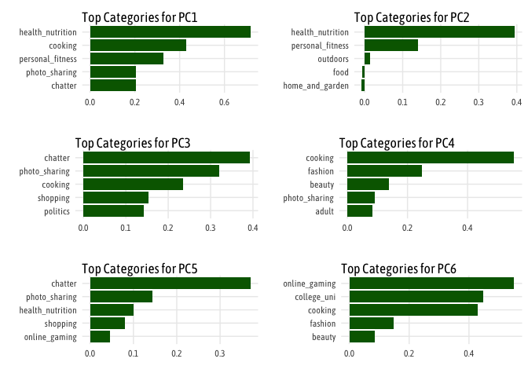
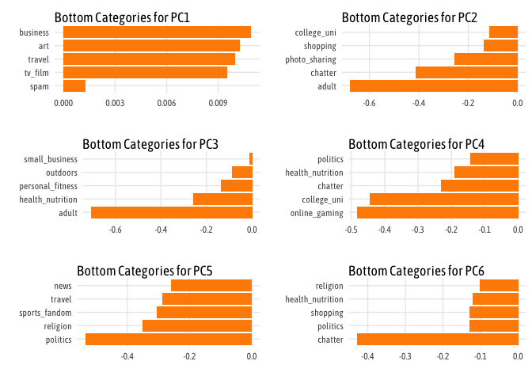
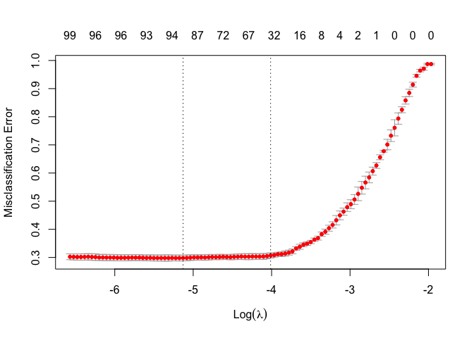

Visual Story Telling Part 1: Green Buildings
--------------------------------------------

There are few things I think the “Excel Guru” overlooked in his analysis
and how he chose to derive at a decision. The first thing that jumps out
at me is that after he removed what outliers he noticed, he looked at
the rent comparisons of green buildings vs non-green buildings without
any further breakdowns. This has issues because there tends to be a lot
of variance in some of the variables we have access to. Take the number
of stories a building has into account, the proposed project has 15
stories but as you can see in this graph, the data set has a lot of
variance


The graph shows that there are sever buildings in this data set with
more than 30 stories which is double the number of stories of the
proposed buildings. This can impose bias in our data set as different
sized buildings might have different trends in energy consumption or
other costs.

We also see that there is significant difference in age of buildings,
which is problematic because of the advances in technology in recent
years which old buildings may not have had access to.

The nice thing about the variance in the data set is that we slice the
data to focus on buildings in the data set similar to the proposed
constructions project. Taking into account the variables we know, we can
filter the data to match the specifications we have by only looking at
buildings with between 10 and 20 stories, between 200,000 and 300,000
square feet, and less than 10 years old. This gives us a better
comparison because it might remove some of the underlying confounding
variables that the “Exel guru” did not take into account and give us a
better understanding between the cost and benefit of building eco or
not.

Once we filter the data, we are left with 52 buildings to analyze.
Starting by looking at the distribution of rent between green buildings
and non-green buildings

    ## Picking joint bandwidth of 4.14


Here it actually looks like the Green buildings have higher revenue
streams than non-green buildings but this doesn’t take a building’s
cluster into account which is a better comparison.


In this graph we see that while in most instances, green buildings have
higher revenue per square foot than buildings in the same cluster, there
are instances where the green buildings have rent prices lower than the
cluster average. This further discredits the “Excel Guru’s” initial
because it is not so cut and dry. To really answer this question more
data must be taken into account such as which specific cluster Austin
falls into so as there can be better informed decision making into the
actual going price for rent for green buildings compared to the average.
Plus then you can take into account the number of energy days needed and
compute the exact energy costs of the building to make a more accurate
decision.

Visual Story Telling Part 2: Flights at ABIA
--------------------------------------------

### Understanding Delays and Where they Come From

I’m always fascinated (maybe more so annoyed by) flight delays, and
whether pilots can actually “make up time in the air” as they claim.

    ## Warning: Removed 1601 rows containing missing values (geom_point).


Wow, looks like an overwhelming number of flights have some sort of
delay. But is this always because of time in the air? What about delays
on the ground? What happens when we take departure delays out of the
equation?


This plot doesn’t quite make sense, or at least there is more going on
here than we originally thought.  
So what’s going on there? Any relation to Taxi Out time?

    ## Warning: Removed 1419 rows containing missing values (geom_point).


It looks like there isn’t the time needed to Taxi out doesn’t have an
impact on when a plane was set to depart. But does it have an effect on
Arrival Delay?

 Now
we are getting somewhere, this relationship makes sense and may account
for some of the confounding variables we saw in the earlier plot.

What happens when we take both ends of taxi time into account?


This still makes sense but if we add `Departure Delay` too?

 There
we go! That makes sense! When we add together all three togehter we see
a clear relationship with the total Arrival Delay. This plot also shows
how time can be made up in the air by looking at the deviation from the
purple line which is simply y = x. So now back to the original question,
can you make up more time in the air?

 Here
is the answer to the question we were looking for. Pilots can in fact
make up some time in the air but it largely but it helps the longer the
flight is in the air.

Portfolio Modeling
------------------

In this project I decided I wanted to learn what NOT to do when it comes
to trading and see how making simple mistakes can cost you. For that I’m
picking three examples of possible poor trading strategies. The same
process is going to be repeated for the three funds. \* Create a sample
portfolio \* Gather historical data \* Run 10,000, 20 day simulations of
bootstrap sampling following the provided rules.

So for the first of the 3 portfolios, I wanted to learn what the return
would be if you stuck with a single company who puts togehter these
EFTs. The first porfolio all comes from Fidelity and 4 of their various
EFTs ranging from Technology to Real Estate. I wanted to see how wise it
is to spend it all within a single broker.

    ## 'getSymbols' currently uses auto.assign=TRUE by default, but will
    ## use auto.assign=FALSE in 0.5-0. You will still be able to use
    ## 'loadSymbols' to automatically load data. getOption("getSymbols.env")
    ## and getOption("getSymbols.auto.assign") will still be checked for
    ## alternate defaults.
    ## 
    ## This message is shown once per session and may be disabled by setting 
    ## options("getSymbols.warning4.0"=FALSE). See ?getSymbols for details.

    ## [1] "FTEC" "ONEQ" "FHLC" "FREL"

    ## [1] 101323.7

    ## [1] 5307.417

    ## [1] 1323.708


    ##         0%        25%        50%        75%       100% 
    ## -30240.303  -1912.398   1344.958   4607.035  30432.847

When choosing only Fidelity EFTs, our bootstrap sample of 10000
simulations showed that on average we expect the starting wealth to go
from `$100,000` to `$101,142.2` over the 20 day trading period with a
standard deviation of `$5,312.29`.

The next two portfolios I wanted to look at is to see what happens when
you bet on a certain industry to see the risks associated with that and
what happens. For the second portfolio I decided to pick 4 EFTs that all
are covering the Tech industry.

    ## 'getSymbols' currently uses auto.assign=TRUE by default, but will
    ## use auto.assign=FALSE in 0.5-0. You will still be able to use
    ## 'loadSymbols' to automatically load data. getOption("getSymbols.env")
    ## and getOption("getSymbols.auto.assign") will still be checked for
    ## alternate defaults.
    ## 
    ## This message is shown once per session and may be disabled by setting 
    ## options("getSymbols.warning4.0"=FALSE). See ?getSymbols for details.

    ## [1] "VGT"  "FTEC" "SMH"  "IYW"

    ## [1] 101960.8

    ## [1] 6373.272

    ## [1] 1960.764


    ##         0%        25%        50%        75%       100% 
    ## -30422.021  -2156.037   1955.473   6020.569  29947.890

When choosing only Tech EFTs, our bootstrap sample of 10000 simulations
showed that on average we expect the starting wealth to go from
`$100,000` to `$101,195.2` over the 20 day trading period with a
standard deviation of `$6,364.85`. This portfolio had a very slightly
higher expected return than the first portfolio but there is higher risk
associated in the VaR with this porfolio.

The last industry I wanted to test the strategy of solo porfolio
investment is the real estate industry. These 4 funds come from 4
different brokers but all cover the real-estate industry.

    ## 'getSymbols' currently uses auto.assign=TRUE by default, but will
    ## use auto.assign=FALSE in 0.5-0. You will still be able to use
    ## 'loadSymbols' to automatically load data. getOption("getSymbols.env")
    ## and getOption("getSymbols.auto.assign") will still be checked for
    ## alternate defaults.
    ## 
    ## This message is shown once per session and may be disabled by setting 
    ## options("getSymbols.warning4.0"=FALSE). See ?getSymbols for details.

    ## [1] "VNQ"  "SCHH" "ICF"  "FREL"

    ## [1] 100488.1

    ## [1] 5981.032

    ## [1] 488.0825


    ##         0%        25%        50%        75%       100% 
    ## -32383.392  -3069.023    552.128   4186.104  30606.168

This portfolio had the lowest expected outcome across the 10,000
simulations and also one of the highest risks associated with it. And at
the 5% risk level some of the worst outcomes possible.

This exercise made it clear that diversification is key, even when it is
limited to one provider. The first portfolio with the differing industry
offerings had the highest estimated return on investment compared to the
others that focused solely on one industry.

Market Segmentation
-------------------

Looking at the social marketing data and seeing the breakdown of
different post breakdowns, it seemed interesting to perform some
dimensionality reduction to force the grouping of categories together to
make different segments. In an attempt to filter out some of the bots
that tend to post the adult content, any user who scored in that
category was removed from the dataset. Next, to start to process of
dimensionality reduction, we looked at first generating 5 dimensions
from the original 36 which produced the output you see below.

    ## Importance of first k=5 (out of 36) components:
    ##                           PC1    PC2    PC3     PC4     PC5
    ## Standard deviation     5.2670 4.2494 3.9672 3.54027 3.43246
    ## Proportion of Variance 0.1942 0.1264 0.1102 0.08773 0.08247
    ## Cumulative Proportion  0.1942 0.3206 0.4308 0.51847 0.60094

This is slightly concerning because it only showed us a cumulative
proportion of roughly 60% of the data so we then tried to looking at
what happened when we used 6 variables of interest. Which gave us the
following output.

    ## Importance of first k=6 (out of 36) components:
    ##                           PC1    PC2    PC3     PC4     PC5     PC6
    ## Standard deviation     5.2670 4.2494 3.9672 3.54027 3.43246 3.20985
    ## Proportion of Variance 0.1942 0.1264 0.1102 0.08773 0.08247 0.07212
    ## Cumulative Proportion  0.1942 0.3206 0.4308 0.51847 0.60094 0.67306

We see the proportion of explanation go up by 7 points moving from 5
dimensions to 6 dimensions which is decent improvement but we were
curious to see what these groups look like and how they differ from each
other. The following plots where taken for each of our dimension (`PCX`)
and shows their top 5 descriptive categories, and bottom 5 descriptive
categories.

    ## 
    ## Attaching package: 'gridExtra'

    ## The following object is masked from 'package:dplyr':
    ## 
    ##     combine


These plots show a few interesting things. Firstly, that there are a few
repeat categories that appear across multiple dimensions like cooking,
health and nutrition, and sports and outdoors. And this makes sense
because it is a nutrition company so those traits are likely shared
across all the followers. It might be interesting to see the same
results but removing some of the common attributes like: \*
`health_nutrition` \* `cooking` \* `photo_sharing`

    ## Importance of first k=6 (out of 36) components:
    ##                           PC1    PC2    PC3     PC4     PC5     PC6
    ## Standard deviation     5.2670 4.2494 3.9672 3.54027 3.43246 3.20985
    ## Proportion of Variance 0.1942 0.1264 0.1102 0.08773 0.08247 0.07212
    ## Cumulative Proportion  0.1942 0.3206 0.4308 0.51847 0.60094 0.67306


The results of this is still surprising. The cumulative proportion
explained actually decreased 3 points and we still don’t see super clear
differences in our groups. We can generate a few user personas for the
company however that are slightly different and more distinct than the
original. `PC5` and `PC6` seem to be reletively distinct and defined
compared to the others. `PC5` provides the company with a demographic
who is really big into personal fitness, the outdoors, and dating.
Likely healthy, fit, singles in their 20s. `PC6` is similar but with a
bigger focus on on automotive and online gaming. This groups is could be
associated to towards males.

While these two groups are relatively distinct the `PC4` and `PC3` are
very similar to each other and don’t provide the company much
distinction.

Going forward it would be helpful for the company to peform more feature
extraction from Twitter and beyond what their followers are saying but
also what their followers are interacting with, and engagement with
various other themed campaigns to determine give this segment analysis
more data to work with.

Author Attribution
------------------

``` r
library(tm) 
library(slam)
library(proxy)
library(readtext)
library(tidytext)
library(stringr)
library(reactable)
```

    ## readtext object consisting of 6 documents and 1 docvar.
    ## # Description: df[,3] [6 × 3]
    ##   doc_id           text                Author       
    ##   <chr>            <chr>               <fct>        
    ## 1 106247newsML.txt "\"The Intern\"..." AaronPressman
    ## 2 120600newsML.txt "\"The U.S. P\"..." AaronPressman
    ## 3 120683newsML.txt "\"Elementary\"..." AaronPressman
    ## 4 136958newsML.txt "\"An influen\"..." AaronPressman
    ## 5 137498newsML.txt "\"An influen\"..." AaronPressman
    ## 6 14014newsML.txt  "\"A group of\"..." AaronPressman

So the first step was reading all the files into two different data
frames, one for the training set - the other for testing. Each data
frame had two columns, the author and text. After that we were then able
to start performing text analysis by cleaning the text data. Starting by
transforming all the words to lowercase and turning them into to tokens.
After that we created a vector matrix for each text document based on
our built vocab. From there we then trained a model on

``` r
library(text2vec)
library(magrittr)


# Create Vocab Words
train_tokens <- word_tokenizer(tolower(data_train$text))
it_train = itoken(train_tokens,
                  progressbar = FALSE)
vocab = create_vocabulary(it_train)


vectorizer = vocab_vectorizer(vocab)

dtm_train = create_dtm(it_train, vectorizer)


library(glmnet)
NFOLDS = 3
glmnet_classifier = cv.glmnet(x = dtm_train, y = data_train[["Author"]],
                              family = "multinomial",
                              alpha = 1,
                              type.measure = "class",
                              nfolds = NFOLDS,
                              thresh = 1e-3,
                              maxit = 1e5)

plot(glmnet_classifier)
```

 The
training model looks like the best lambda value occurs with a value
equal to

``` r
# Process the training data
test_tokens <- word_tokenizer(tolower(data_test$text))
it_test = itoken(test_tokens,
                  progressbar = FALSE)
vocab = create_vocabulary(it_test)


vectorizer = vocab_vectorizer(vocab)
dtm_test = create_dtm(it_test, vectorizer)


predict(glmnet_classifier, dtm_train, type = "response")
```

    ## , , 1
    ## 
    ##      AaronPressman   AlanCrosby AlexanderSmith BenjaminKangLim BernardHickey
    ## 1     3.978006e-01 1.114518e-02   1.561731e-02    1.299874e-02  1.364470e-02
    ## 2     3.026927e-01 1.264045e-02   1.931296e-02    1.607474e-02  1.687355e-02
    ## 3     9.767433e-02 1.697567e-02   2.593661e-02    2.158779e-02  2.266057e-02
    ## 4     3.953121e-01 9.791440e-03   1.685613e-02    1.245168e-02  1.307045e-02
    ## 5     4.173685e-01 9.611845e-03   1.558854e-02    1.222329e-02  1.283071e-02
    ## 6     2.490509e-02 1.827982e-02   2.792918e-02    2.324627e-02  2.440146e-02
    ## 7     4.192640e-01 9.769016e-03   1.492578e-02    1.242316e-02  1.304051e-02
    ## 8     9.170658e-01 1.320533e-03   2.330420e-03    1.679309e-03  1.762760e-03
    ## 9     5.999324e-01 7.169815e-03   1.461476e-02    9.117782e-03  9.570879e-03
    ## 10    3.728134e-01 1.054427e-02   1.611028e-02    1.340905e-02  1.407539e-02
    ## 11    8.632436e-01 2.183674e-03   3.336369e-03    2.776957e-03  2.914954e-03
    ## 12    3.728134e-01 1.054427e-02   1.611028e-02    1.340905e-02  1.407539e-02
    ## 13    2.714508e-01 1.140393e-02   1.742372e-02    1.450227e-02  1.522294e-02
    ## 14    8.636440e-01 2.507649e-03   3.831360e-03    3.188952e-03  3.347423e-03
    ## 15    4.090298e-01 1.076695e-02   1.645050e-02    1.369223e-02  1.437264e-02
    ## 16    1.964407e-01 1.443480e-02   2.205449e-02    1.835659e-02  1.926880e-02
    ## 17    8.378285e-01 3.021498e-03   4.616455e-03    3.842409e-03  4.033353e-03
    ## 18    2.063740e-01 1.322007e-02   2.019854e-02    1.681183e-02  1.764727e-02
    ## 19    7.457622e-01 4.683888e-03   7.156369e-03    5.956453e-03  6.252452e-03
    ## 20    7.202159e-01 5.219533e-03   7.974765e-03    6.637628e-03  6.967476e-03
    ## 21    3.068048e-01 1.295919e-02   1.979995e-02    1.648007e-02  1.729902e-02
    ## 22    6.852224e-01 5.382156e-03   8.728812e-03    6.844435e-03  7.184560e-03
    ## 23    9.666263e-01 5.673863e-04   9.201903e-04    7.215396e-04  7.573955e-04
    ## 24    8.357231e-01 3.065266e-03   4.683326e-03    3.898068e-03  4.091777e-03
    ## 25    5.031923e-01 9.271849e-03   1.416618e-02    1.179092e-02  1.237685e-02
    ## 26    1.007127e-01 9.754264e-03   1.490324e-02    1.240440e-02  1.302082e-02
    ## 27    1.475912e-01 1.398439e-02   2.136632e-02    1.778381e-02  1.866755e-02
    ## 28    3.982080e-01 1.095205e-02   1.673330e-02    1.392761e-02  1.461972e-02
    ## 29    9.559296e-01 8.227122e-04   1.451887e-03    1.046235e-03  1.098226e-03
    ## 30    1.136189e-01 1.671627e-02   2.554028e-02    2.125792e-02  2.231430e-02
    ## 31    3.406157e-01 1.238610e-02   1.892434e-02    1.575128e-02  1.653402e-02
    ## 32    7.937072e-01 3.759881e-03   3.730937e-03    3.105367e-03  3.259685e-03
    ## 33    2.151273e-01 1.569789e-02   1.428625e-02    1.189086e-02  1.248176e-02
    ## 34    2.814567e-01 1.338216e-02   2.044619e-02    1.701796e-02  1.786364e-02
    ## 35    3.907765e-01 1.121816e-02   1.713989e-02    1.426603e-02  1.497496e-02
    ## 36    1.605259e-01 1.575992e-02   2.407910e-02    2.004173e-02  2.103768e-02
    ## 37    3.371969e-01 1.231123e-02   1.880996e-02    1.565607e-02  1.643408e-02
    ## 38    7.392351e-01 4.856426e-03   7.419985e-03    6.175869e-03  6.482771e-03
    ## 39    7.113663e-01 4.721405e-03   8.127981e-03    6.004164e-03  6.302534e-03
    ## 40    8.445299e-01 2.583135e-03   3.946693e-03    3.284947e-03  3.448188e-03
    ## 41    6.712786e-01 5.902592e-03   1.041664e-02    7.506267e-03  7.879282e-03
    ## 42    6.324061e-01 6.304675e-03   1.022496e-02    8.017592e-03  8.416016e-03
    ## 43    7.941825e-01 3.851325e-03   5.884322e-03    4.897692e-03  5.141077e-03
    ## 44    7.044383e-01 5.005148e-03   8.117377e-03    6.364997e-03  6.681297e-03
    ## 45    6.324061e-01 6.304675e-03   1.022496e-02    8.017592e-03  8.416016e-03
    ## 46    5.549609e-01 8.251781e-03   1.260764e-02    1.049371e-02  1.101518e-02
    ## 47    6.520187e-01 6.402200e-03   9.781726e-03    8.141615e-03  8.546202e-03
    ## 48    7.106875e-01 5.374492e-03   8.211522e-03    6.834688e-03  7.174329e-03
    ## 49    5.945150e-01 6.881513e-03   1.214420e-02    8.751152e-03  9.186029e-03
    ## 50    9.316671e-01 1.248196e-03   1.907081e-03    1.587319e-03  1.666198e-03
    ## 51    7.161598e-03 5.491646e-01   9.290066e-03    7.732392e-03  8.116643e-03
    ## 52    2.854179e-03 8.351554e-01   3.370674e-03    2.428919e-03  2.549621e-03
    ## 53    9.201404e-03 5.230935e-01   1.193611e-02    9.934774e-03  1.042847e-02
    ## 54    7.977519e-03 6.060404e-01   1.034848e-02    8.613344e-03  9.041373e-03
    ## 55    2.853651e-03 8.350010e-01   3.370050e-03    2.428470e-03  2.549149e-03
    ## 56    1.872567e-02 9.629267e-02   2.429105e-02    2.021815e-02  2.122286e-02
    ## 57    3.398648e-03 7.757469e-01   4.408746e-03    3.669527e-03  3.851880e-03
    ## 58    8.669494e-03 5.707271e-01   1.124612e-02    9.360470e-03  9.825626e-03
    ## 59    6.623289e-03 6.793342e-01   8.591769e-03    7.151179e-03  7.506547e-03
    ## 60    2.994012e-03 8.589950e-01   3.883849e-03    3.232641e-03  3.393282e-03
    ## 61    8.644534e-03 5.755148e-01   1.121374e-02    9.333521e-03  9.797338e-03
    ## 62    4.392013e-03 7.931553e-01   5.697344e-03    4.742065e-03  4.977716e-03
    ## 63    1.879005e-03 9.101694e-01   2.437456e-03    2.028766e-03  2.129583e-03
    ## 64    6.150801e-03 6.719551e-01   7.978855e-03    6.641032e-03  6.971050e-03
    ## 65    7.846114e-03 6.399861e-01   1.017802e-02    8.471465e-03  8.892443e-03
    ## 66    4.063333e-03 7.926982e-01   5.270979e-03    4.387189e-03  4.605205e-03
    ## 67    9.395270e-03 5.432515e-01   1.218760e-02    1.014409e-02  1.064819e-02
    ## 68    1.044587e-02 5.080449e-01   1.355044e-02    1.127843e-02  1.183889e-02
    ## 69    5.101166e-03 7.261177e-01   6.617262e-03    5.507739e-03  5.781439e-03
    ## 70    1.057767e-02 5.069013e-01   1.372142e-02    1.142074e-02  1.198827e-02
    ## 71    9.136256e-03 3.654410e-01   1.185160e-02    9.864434e-03  1.035463e-02
    ## 72    9.140544e-03 3.656125e-01   1.185717e-02    9.869064e-03  1.035949e-02
    ## 73    5.088856e-03 7.069032e-01   6.601293e-03    5.494448e-03  5.767487e-03
    ## 74    4.093340e-03 7.642407e-01   5.309904e-03    4.419588e-03  4.639213e-03
    ## 75    6.779657e-03 6.027120e-01   1.289241e-02    6.821050e-03  7.160013e-03
    ## 76    1.287095e-02 3.773354e-01   2.447580e-02    1.294953e-02  1.359304e-02
    ## 77    1.056470e-02 3.630667e-01   1.582942e-02    1.140673e-02  1.197357e-02
    ## 78    1.047115e-02 3.673703e-01   1.812177e-02    1.130572e-02  1.186754e-02
    ## 79    1.426013e-02 8.731486e-02   1.963564e-02    1.539669e-02  1.616181e-02
    ## 80    5.320588e-03 5.489405e-01   6.932466e-03    4.995558e-03  5.243806e-03
    ## 81    1.204297e-02 3.413124e-01   1.804435e-02    1.300282e-02  1.364898e-02
    ## 82    1.035014e-02 3.942550e-01   1.550794e-02    1.117507e-02  1.173040e-02
    ## 83    2.971964e-03 8.274341e-01   3.855248e-03    3.208835e-03  3.368294e-03
    ## 84    1.049515e-02 2.771626e-01   1.361437e-02    1.133164e-02  1.189475e-02
    ## 85    3.620423e-03 7.218737e-01   4.696433e-03    3.908978e-03  4.103229e-03
    ## 86    1.191660e-02 1.545938e-01   1.440459e-02    1.198936e-02  1.258516e-02
    ## 87    2.510884e-03 7.309615e-01   3.257134e-03    2.711007e-03  2.845727e-03
    ## 88    6.607669e-03 4.353039e-01   8.571507e-03    7.134314e-03  7.488844e-03
    ## 89    5.678956e-03 4.906429e-01   7.366775e-03    6.131580e-03  6.436281e-03
    ## 90    6.291254e-03 3.317174e-01   8.161051e-03    6.792680e-03  7.130233e-03
    ## 91    5.855013e-03 5.269319e-01   7.595157e-03    6.321670e-03  6.635817e-03
    ## 92    1.677955e-02 1.769104e-01   2.028284e-02    1.688199e-02  1.772092e-02
    ## 93    5.159318e-03 6.534162e-01   8.928915e-03    5.570526e-03  5.847346e-03
    ## 94    4.517588e-03 5.947215e-01   5.860241e-03    4.877648e-03  5.120037e-03
    ## 95    1.029112e-02 4.561053e-01   1.334969e-02    1.111134e-02  1.166350e-02
    ## 96    1.029112e-02 4.561053e-01   1.334969e-02    1.111134e-02  1.166350e-02
    ## 97    3.530667e-03 6.591877e-01   5.290106e-03    3.812068e-03  4.001504e-03
    ## 98    3.299347e-03 6.159995e-01   4.943513e-03    3.562312e-03  3.739336e-03
    ## 99    3.060834e-03 8.180708e-01   3.699885e-03    3.079521e-03  3.232554e-03
    ## 100   3.037414e-03 7.258272e-01   3.421307e-03    2.847653e-03  2.989164e-03
    ## 101   1.772638e-02 1.505021e-02   1.862448e-01    1.913921e-02  2.009030e-02
    ## 102   1.235290e-02 1.048797e-02   4.318599e-01    1.333745e-02  1.400024e-02
    ## 103   9.476692e-03 8.045988e-03   2.265982e-01    1.023200e-02  1.074047e-02
    ## 104   5.301617e-03 4.185155e-03   5.268853e-01    5.322220e-03  7.489031e-03
    ## 105   7.851336e-03 5.762718e-03   5.772820e-01    7.328392e-03  7.692567e-03
    ## 106   7.189005e-03 6.187840e-03   6.566461e-01    7.216943e-03  7.575580e-03
    ## 107   7.443361e-03 7.960280e-03   6.321386e-01    6.947590e-03  7.292842e-03
    ## 108   7.851336e-03 5.762718e-03   5.772820e-01    7.328392e-03  7.692567e-03
    ## 109   1.046484e-02 8.884954e-03   4.799709e-01    1.129891e-02  1.186039e-02
    ## 110   1.275835e-02 1.083221e-02   2.604129e-01    1.377522e-02  1.445976e-02
    ## 111   1.284054e-02 1.090199e-02   3.898116e-01    1.386395e-02  1.455290e-02
    ## 112   1.870387e-02 1.588013e-02   1.478330e-01    2.019460e-02  2.119815e-02
    ## 113   8.565112e-03 7.272030e-03   5.725169e-01    9.247769e-03  9.707325e-03
    ## 114   9.421481e-03 7.999112e-03   5.452249e-01    1.017239e-02  1.067790e-02
    ## 115   9.379156e-03 7.963177e-03   5.427756e-01    1.012669e-02  1.062993e-02
    ## 116   9.445564e-03 8.019559e-03   5.466186e-01    1.019839e-02  1.070519e-02
    ## 117   1.378271e-02 1.170192e-02   3.482404e-01    1.488122e-02  1.562072e-02
    ## 118   1.613513e-02 1.369920e-02   1.051869e-01    1.742113e-02  1.828686e-02
    ## 119   3.027161e-02 1.639097e-02   1.068158e-01    2.084424e-02  2.188007e-02
    ## 120   6.238777e-03 5.296904e-03   6.945223e-01    6.736020e-03  7.070758e-03
    ## 121   7.923083e-03 6.726929e-03   6.396719e-01    8.554569e-03  8.979677e-03
    ## 122   9.996689e-03 6.689700e-03   6.361318e-01    8.507226e-03  8.929982e-03
    ## 123   1.351740e-02 1.533643e-02   3.347501e-01    1.459477e-02  1.532004e-02
    ## 124   1.090498e-02 1.237245e-02   4.112718e-01    1.177413e-02  1.235923e-02
    ## 125   8.300265e-03 7.047167e-03   6.146689e-01    8.961813e-03  9.407159e-03
    ## 126   9.432747e-03 8.008677e-03   5.388522e-01    1.018456e-02  1.069066e-02
    ## 127   8.670618e-03 7.361607e-03   5.351053e-01    9.361683e-03  9.826900e-03
    ## 128   1.110305e-02 8.784247e-03   4.498653e-01    1.117084e-02  1.172596e-02
    ## 129   8.670618e-03 7.361607e-03   5.351053e-01    9.361683e-03  9.826900e-03
    ## 130   1.061196e-02 9.009863e-03   3.338060e-01    1.145775e-02  1.202713e-02
    ## 131   1.300149e-02 1.103864e-02   3.566644e-01    1.403773e-02  1.473532e-02
    ## 132   1.257409e-02 1.067577e-02   3.999040e-01    1.357627e-02  1.425092e-02
    ## 133   2.468570e-02 1.044218e-02   2.698674e-01    1.594927e-02  1.393911e-02
    ## 134   1.348869e-02 1.145229e-02   3.615619e-01    1.456377e-02  1.528749e-02
    ## 135   8.301718e-03 7.048401e-03   4.459831e-01    8.963382e-03  9.408806e-03
    ## 136   5.507439e-03 4.675977e-03   6.151984e-01    5.946393e-03  6.241892e-03
    ## 137   7.683145e-03 6.523214e-03   4.859155e-01    8.295507e-03  8.707741e-03
    ## 138   1.553924e-02 1.319327e-02   2.672583e-01    1.677775e-02  1.761150e-02
    ## 139   1.592704e-02 1.352252e-02   1.001801e-01    1.719646e-02  1.805102e-02
    ## 140   1.635638e-02 1.388704e-02   2.389579e-01    2.121092e-02  1.853761e-02
    ## 141   3.650892e-02 1.544346e-02   1.066707e-01    1.963929e-02  2.061524e-02
    ## 142   1.157913e-02 1.071928e-02   3.625849e-01    1.250201e-02  1.759189e-02
    ## 143   3.458985e-02 1.363433e-02   2.337572e-01    1.733864e-02  1.820026e-02
    ## 144   1.025299e-02 8.705089e-03   4.916125e-01    1.107018e-02  1.162029e-02
    ## 145   1.573955e-02 1.336334e-02   2.945688e-01    1.699403e-02  1.783852e-02
    ## 146   1.260302e-02 1.070033e-02   3.964360e-01    1.360750e-02  1.428371e-02
    ## 147   1.156976e-02 9.823063e-03   4.730287e-01    1.249189e-02  1.311266e-02
    ## 148   1.808317e-02 1.535314e-02   1.822970e-01    1.952443e-02  2.049467e-02
    ## 149   1.983960e-02 1.684440e-02   1.071699e-01    2.142086e-02  2.248534e-02
    ## 150   1.360492e-02 1.987142e-01   1.183384e-01    1.468926e-02  1.541923e-02
    ## 151   6.199975e-03 5.263959e-03   8.042643e-03    5.546701e-01  7.026781e-03
    ## 152   1.012063e-02 8.592707e-03   1.312853e-02    1.131703e-01  1.147028e-02
    ## 153   1.541878e-02 1.309099e-02   2.000133e-02    2.522536e-01  1.747497e-02
    ## 154   1.554263e-02 1.011762e-02   1.545840e-02    3.461232e-01  1.350586e-02
    ## 155   9.308056e-03 7.902811e-03   1.207446e-02    5.032555e-01  1.054934e-02
    ## 156   1.803681e-02 1.531378e-02   2.339745e-02    9.008921e-02  2.044213e-02
    ## 157   9.750132e-03 4.246573e-03   6.488209e-03    7.348921e-01  5.668686e-03
    ## 158   1.379236e-02 1.171012e-02   1.789154e-02    2.672616e-01  1.563166e-02
    ## 159   9.732195e-03 8.262918e-03   1.262466e-02    4.742642e-01  1.103005e-02
    ## 160   2.300870e-02 1.539723e-02   2.717238e-02    1.169176e-01  2.055353e-02
    ## 161   7.092811e-03 6.022004e-03   9.200835e-03    5.805001e-01  8.038683e-03
    ## 162   2.346132e-03 1.991934e-03   3.043416e-03    8.623838e-01  2.659003e-03
    ## 163   1.308502e-02 8.517811e-03   1.301410e-02    2.963071e-01  1.137030e-02
    ## 164   9.803340e-03 8.323322e-03   1.271695e-02    3.818041e-01  1.111068e-02
    ## 165   1.179787e-02 1.001673e-02   1.530426e-02    3.954183e-01  1.337119e-02
    ## 166   5.201060e-03 3.385678e-03   5.172874e-03    7.485343e-01  4.519491e-03
    ## 167   1.179311e-02 6.721989e-03   1.027032e-02    4.321972e-01  8.973083e-03
    ## 168   9.068193e-03 7.699160e-03   1.176331e-02    4.241170e-01  1.027749e-02
    ## 169   8.492048e-03 7.209997e-03   1.101593e-02    5.067673e-01  9.624517e-03
    ## 170   9.477407e-03 8.046595e-03   1.229415e-02    4.867908e-01  1.074128e-02
    ## 171   1.200533e-02 1.019288e-02   1.798795e-02    2.552919e-01  1.360632e-02
    ## 172   8.723471e-03 7.406481e-03   1.131614e-02    4.844359e-01  9.886801e-03
    ## 173   1.044964e-02 8.872050e-03   1.355533e-02    2.120073e-01  1.184317e-02
    ## 174   1.091532e-02 9.267424e-03   2.133273e-02    3.950177e-01  1.237095e-02
    ## 175   7.528148e-03 6.391618e-03   9.765557e-03    5.915610e-01  8.532075e-03
    ## 176   1.742450e-02 1.479391e-02   2.260316e-02    1.197070e-01  1.974816e-02
    ## 177   4.893819e-03 4.154995e-03   8.469433e-03    6.360793e-01  5.546442e-03
    ## 178   1.333794e-02 1.132430e-02   1.730205e-02    3.646516e-01  1.511664e-02
    ## 179   8.025654e-03 6.814015e-03   1.041093e-02    5.187295e-01  9.095927e-03
    ## 180   1.331069e-02 1.130116e-02   1.726670e-02    3.639066e-01  1.508576e-02
    ## 181   6.515677e-03 5.532000e-03   8.452173e-03    6.201115e-01  7.384584e-03
    ## 182   7.824877e-03 9.883695e-03   1.015048e-02    4.742444e-01  8.868374e-03
    ## 183   6.594815e-03 5.599190e-03   8.554832e-03    6.062336e-01  7.474276e-03
    ## 184   8.403928e-03 7.135180e-03   1.090162e-02    4.730799e-01  9.524646e-03
    ## 185   5.171228e-03 4.390523e-03   6.708146e-03    7.091036e-01  5.860844e-03
    ## 186   9.175818e-03 6.774665e-03   1.925975e-02    4.513883e-01  9.043400e-03
    ## 187   5.176458e-03 4.394964e-03   6.714931e-03    4.953388e-01  5.866772e-03
    ## 188   2.283765e-04 1.938983e-04   2.962513e-04    2.342725e-01  2.588320e-04
    ## 189   1.451871e-02 1.232680e-02   1.883375e-02    2.656546e-01  1.645487e-02
    ## 190   4.876034e-03 4.139895e-03   6.325219e-03    5.176061e-01  5.526284e-03
    ## 191   1.455549e-02 1.235804e-02   1.888147e-02    1.300488e-01  1.649656e-02
    ## 192   1.028233e-02 8.729997e-03   3.311117e-02    3.160688e-01  1.165354e-02
    ## 193   1.244319e-02 1.056463e-02   1.614138e-02    1.319122e-01  1.410257e-02
    ## 194   9.827187e-03 8.343569e-03   1.472437e-02    3.592879e-01  1.113771e-02
    ## 195   1.658780e-02 1.408353e-02   2.151779e-02    2.237115e-01  1.879989e-02
    ## 196   1.333534e-02 1.132209e-02   1.729868e-02    3.271772e-01  1.511369e-02
    ## 197   1.073899e-02 9.117715e-03   3.820882e-02    4.751747e-01  1.217110e-02
    ## 198   2.270479e-02 1.294157e-02   1.977302e-02    2.524332e-01  1.727550e-02
    ## 199   7.374755e-03 6.261382e-03   9.566575e-03    6.024149e-01  8.358226e-03
    ## 200   1.392569e-04 1.182332e-04   4.484353e-04    9.905650e-01  1.578277e-04
    ## 201   1.082295e-02 9.189004e-03   1.403960e-02    1.168557e-02  4.699472e-01
    ## 202   1.004148e-02 8.525508e-03   1.302586e-02    1.084180e-02  3.644221e-01
    ## 203   8.976107e-03 7.620977e-03   1.164386e-02    9.691521e-03  3.845417e-01
    ## 204   3.184601e-03 2.703819e-03   4.131083e-03    3.438420e-03  8.310273e-01
    ## 205   6.930021e-03 5.883790e-03   8.989664e-03    7.482358e-03  6.150193e-01
    ## 206   6.929212e-03 5.883103e-03   8.988614e-03    7.481484e-03  6.149474e-01
    ## 207   5.977394e-03 5.074982e-03   7.753910e-03    6.453804e-03  7.175172e-01
    ## 208   7.141993e-03 6.063760e-03   9.264634e-03    7.711224e-03  5.369394e-01
    ## 209   9.697137e-03 8.233153e-03   1.257918e-02    1.047002e-02  5.352086e-01
    ## 210   5.380980e-03 4.568609e-03   6.980238e-03    5.809855e-03  6.955203e-01
    ## 211   1.460956e-03 1.240394e-03   1.895160e-03    1.577397e-03  6.035670e-01
    ## 212   1.865307e-02 1.583700e-02   2.419687e-02    2.013976e-02  9.714148e-02
    ## 213   4.378192e-03 3.717213e-03   5.679416e-03    4.727142e-03  7.223258e-01
    ## 214   4.144351e-03 3.518675e-03   5.376076e-03    4.474664e-03  6.837461e-01
    ## 215   4.561062e-03 3.872474e-03   5.916635e-03    4.924587e-03  7.524961e-01
    ## 216   1.037835e-03 8.811518e-04   1.346285e-03    1.120552e-03  7.902088e-01
    ## 217   4.550694e-03 3.863672e-03   5.903187e-03    4.913394e-03  7.507857e-01
    ## 218   1.037835e-03 8.811518e-04   1.346285e-03    1.120552e-03  7.902088e-01
    ## 219   1.855790e-02 1.575620e-02   3.211702e-02    2.003700e-02  9.695551e-02
    ## 220   2.531693e-03 2.149481e-03   3.284126e-03    2.733474e-03  7.750005e-01
    ## 221   1.986213e-02 1.686353e-02   2.576527e-02    2.144519e-02  9.974945e-02
    ## 222   1.898520e-02 1.611898e-02   2.462770e-02    2.049835e-02  1.137393e-01
    ## 223   1.912044e-02 1.623381e-02   2.480315e-02    2.064438e-02  9.757247e-02
    ## 224   4.386303e-03 3.724099e-03   5.689937e-03    4.735900e-03  7.236640e-01
    ## 225   1.913978e-02 1.625024e-02   2.701413e-02    2.066526e-02  1.062145e-01
    ## 226   1.884061e-02 1.599623e-02   2.444015e-02    2.034224e-02  9.719473e-02
    ## 227   8.528090e-03 7.240597e-03   1.969045e-02    9.207796e-03  4.003932e-01
    ## 228   2.579061e-03 2.035939e-03   3.592939e-03    2.589084e-03  8.067655e-01
    ## 229   1.611185e-02 1.271887e-02   2.592581e-02    1.617446e-02  3.462256e-02
    ## 230   2.560965e-03 2.021654e-03   4.120887e-03    2.570918e-03  8.011049e-01
    ## 231   1.094930e-02 9.296276e-03   1.420350e-02    1.182198e-02  4.754333e-01
    ## 232   4.437046e-03 4.478686e-03   5.755762e-03    4.790687e-03  7.320357e-01
    ## 233   1.428874e-02 1.213156e-02   1.853544e-02    1.542759e-02  1.096757e-01
    ## 234   3.852881e-03 3.271208e-03   4.997979e-03    4.159963e-03  7.259880e-01
    ## 235   5.401021e-03 4.585625e-03   8.590058e-03    5.831494e-03  6.454456e-01
    ## 236   1.922567e-02 1.632316e-02   2.493965e-02    2.075799e-02  1.063651e-01
    ## 237   1.113685e-02 9.455508e-03   1.444678e-02    1.202448e-02  4.835768e-01
    ## 238   1.057193e-02 8.975877e-03   1.371397e-02    1.141453e-02  4.590474e-01
    ## 239   4.387095e-03 3.724771e-03   5.690965e-03    4.736755e-03  7.575616e-01
    ## 240   6.796146e-03 5.770126e-03   1.325239e-02    7.337812e-03  3.739009e-01
    ## 241   1.806936e-02 5.954060e-03   9.097026e-03    7.571719e-03  3.307805e-01
    ## 242   8.538917e-03 7.249790e-03   1.665077e-02    9.219486e-03  3.448818e-01
    ## 243   1.771335e-02 1.503915e-02   2.297786e-02    1.912514e-02  7.983713e-02
    ## 244   7.783972e-03 6.608820e-03   1.009741e-02    8.404370e-03  6.271293e-01
    ## 245   7.899006e-03 6.706486e-03   1.024664e-02    8.528572e-03  6.393382e-01
    ## 246   2.194876e-03 1.863514e-03   2.847206e-03    2.369812e-03  8.946463e-01
    ## 247   1.735749e-02 1.473701e-02   2.251623e-02    1.874092e-02  1.846679e-01
    ## 248   1.080804e-02 9.176343e-03   1.402026e-02    1.166946e-02  3.865318e-01
    ## 249   1.020689e-02 8.665944e-03   1.324043e-02    1.102040e-02  3.966026e-01
    ## 250   1.210431e-03 1.027691e-03   1.570178e-03    1.306905e-03  9.302294e-01
    ## 251   1.030068e-03 8.745575e-04   1.336210e-03    1.112166e-03  1.219882e-03
    ## 252   1.118522e-02 9.496574e-03   1.450953e-02    1.207670e-02  1.267684e-02
    ## 253   1.387577e-02 1.178093e-02   1.799972e-02    1.498169e-02  1.572619e-02
    ## 254   1.395533e-02 1.184848e-02   1.810293e-02    1.506759e-02  1.581636e-02
    ## 255   7.969889e-03 6.766669e-03   1.033859e-02    8.605105e-03  9.032725e-03
    ## 256   3.103507e-03 2.634968e-03   4.025888e-03    3.350863e-03  3.517380e-03
    ## 257   4.377735e-02 1.341222e-02   2.049212e-02    1.840355e-02  1.790377e-02
    ## 258   6.899407e-03 5.857798e-03   8.949951e-03    7.449304e-03  7.819487e-03
    ## 259   1.972943e-02 1.675086e-02   2.716664e-02    2.130190e-02  2.236047e-02
    ## 260   1.281185e-02 1.087763e-02   2.958119e-02    1.383298e-02  1.452039e-02
    ## 261   1.218299e-02 1.034371e-02   1.580384e-02    1.315400e-02  1.380767e-02
    ## 262   1.551165e-02 1.316985e-02   2.012181e-02    1.674796e-02  1.758023e-02
    ## 263   1.462883e-02 1.242031e-02   1.897661e-02    1.579478e-02  1.657968e-02
    ## 264   1.225154e-02 1.040191e-02   1.686988e-02    1.322801e-02  1.388536e-02
    ## 265   1.518603e-02 1.289338e-02   1.969941e-02    1.639639e-02  1.721119e-02
    ## 266   7.468657e-03 6.341108e-03   9.688385e-03    8.063924e-03  8.464651e-03
    ## 267   6.038272e-02 1.229143e-02   1.877971e-02    1.563090e-02  1.640765e-02
    ## 268   1.270544e-02 1.282467e-02   1.648157e-02    1.371809e-02  1.439979e-02
    ## 269   1.087181e-02 9.230487e-03   1.628957e-02    1.173832e-02  1.232164e-02
    ## 270   6.196920e-03 5.736745e-03   8.038681e-03    6.690827e-03  7.023319e-03
    ## 271   6.176599e-03 5.717933e-03   8.012320e-03    6.668886e-03  7.000288e-03
    ## 272   1.816650e-02 1.542389e-02   2.356569e-02    1.961440e-02  2.058912e-02
    ## 273   2.992785e-04 2.540961e-04   4.484181e-04    3.231316e-04  3.391892e-04
    ## 274   4.717191e-03 4.005033e-03   7.067912e-03    5.093161e-03  5.346259e-03
    ## 275   8.780282e-03 5.875691e-03   8.977289e-03    7.472058e-03  7.843373e-03
    ## 276   9.946453e-03 8.444829e-03   1.290260e-02    1.073921e-02  1.127288e-02
    ## 277   5.474151e-03 4.647714e-03   7.101100e-03    5.910452e-03  6.204164e-03
    ## 278   8.398827e-03 7.130849e-03   1.089501e-02    9.068230e-03  9.518864e-03
    ## 279   1.140543e-02 9.683541e-03   1.708910e-02    1.231446e-02  1.292641e-02
    ## 280   1.169871e-02 1.082998e-02   1.517563e-02    1.263112e-02  1.325880e-02
    ## 281   9.692061e-03 8.228843e-03   1.257260e-02    1.046454e-02  1.098456e-02
    ## 282   1.315426e-02 2.220325e-02   1.706378e-02    1.420268e-02  1.490846e-02
    ## 283   1.079146e-02 9.162267e-03   1.399875e-02    1.165156e-02  1.223057e-02
    ## 284   7.495147e-03 6.363598e-03   1.057874e-02    8.092525e-03  8.494673e-03
    ## 285   1.109159e-02 9.417086e-03   1.438808e-02    1.197561e-02  1.257073e-02
    ## 286   1.208211e-02 1.449885e-02   1.567299e-02    1.304508e-02  1.369334e-02
    ## 287   1.511409e-02 1.283230e-02   1.960608e-02    1.631871e-02  1.712965e-02
    ## 288   1.068237e-02 9.069644e-03   1.385723e-02    1.153378e-02  1.265085e-02
    ## 289   1.599314e-02 1.480551e-02   5.892138e-02    1.726783e-02  1.812593e-02
    ## 290   1.422074e-02 9.516397e-03   1.453981e-02    1.210191e-02  1.270330e-02
    ## 291   3.511331e-03 2.981222e-03   4.554919e-03    3.791191e-03  3.979589e-03
    ## 292   6.177504e-03 4.133934e-03   6.316111e-03    5.257083e-03  5.518327e-03
    ## 293   6.039209e-03 5.127464e-03   7.834096e-03    6.520546e-03  6.844576e-03
    ## 294   1.621787e-02 1.376945e-02   2.103792e-02    1.751047e-02  1.838063e-02
    ## 295   1.980307e-02 1.833252e-02   2.568865e-02    2.138141e-02  2.244393e-02
    ## 296   1.115447e-02 9.470473e-03   1.446965e-02    1.204351e-02  1.264199e-02
    ## 297   1.334835e-02 5.549244e-03   8.478521e-03    7.056919e-03  7.407603e-03
    ## 298   1.090577e-02 7.298049e-03   1.115047e-02    9.280857e-03  9.742057e-03
    ## 299   1.115447e-02 9.470473e-03   1.446965e-02    1.204351e-02  1.264199e-02
    ## 300   1.183458e-02 1.095576e-02   1.535189e-02    1.277782e-02  1.341280e-02
    ## 301   1.467112e-02 1.245621e-02   1.903146e-02    1.584044e-02  1.662761e-02
    ## 302   1.196408e-03 1.511197e-03   2.070550e-03    1.291764e-03  1.355957e-03
    ## 303   9.488549e-04 6.020670e-04   9.198798e-04    7.656426e-04  8.036903e-04
    ## 304   2.651156e-04 3.348706e-04   4.588193e-04    2.862458e-04  3.004704e-04
    ## 305   1.250769e-02 1.061940e-02   1.622505e-02    1.350458e-02  1.417567e-02
    ## 306   8.915033e-03 7.569123e-03   1.156463e-02    9.625579e-03  1.010391e-02
    ## 307   8.915033e-03 7.569123e-03   1.156463e-02    9.625579e-03  1.010391e-02
    ## 308   4.596813e-02 6.759372e-03   1.032744e-02    8.595827e-03  9.022986e-03
    ## 309   2.538766e-03 2.155487e-03   3.293303e-03    2.741111e-03  2.877327e-03
    ## 310   1.651740e-03 1.402375e-03   2.142646e-03    1.783386e-03  1.872010e-03
    ## 311   7.411699e-03 6.292749e-03   9.614499e-03    8.002426e-03  8.400097e-03
    ## 312   7.411699e-03 6.292749e-03   9.614499e-03    8.002426e-03  8.400097e-03
    ## 313   1.033958e-02 8.778606e-03   1.341256e-02    1.116367e-02  1.171843e-02
    ## 314   5.072833e-03 4.306983e-03   6.580509e-03    5.477148e-03  5.749328e-03
    ## 315   1.061892e-02 9.015771e-03   1.591065e-02    1.146527e-02  1.203502e-02
    ## 316   1.619066e-03 1.374634e-03   2.100262e-03    1.748109e-03  1.834979e-03
    ## 317   5.654208e-03 4.800587e-03   8.471872e-03    6.104859e-03  6.408232e-03
    ## 318   5.654208e-03 4.800587e-03   8.471872e-03    6.104859e-03  6.408232e-03
    ## 319   2.701072e-03 2.293289e-03   4.047099e-03    2.916353e-03  3.061278e-03
    ## 320   4.659347e-03 3.955921e-03   8.063646e-03    5.030706e-03  5.280701e-03
    ## 321   4.790316e-03 4.067118e-03   7.177476e-03    5.172113e-03  5.429135e-03
    ## 322   4.659347e-03 3.955921e-03   8.063646e-03    5.030706e-03  5.280701e-03
    ## 323   8.367539e-04 7.104285e-04   1.253734e-03    9.034448e-04  9.483404e-04
    ## 324   9.794311e-03 8.315656e-03   1.467512e-02    1.057494e-02  1.110044e-02
    ## 325   8.713267e-03 7.397818e-03   1.305535e-02    9.407732e-03  9.875237e-03
    ## 326   1.289299e-03 1.094653e-03   1.672486e-03    1.392059e-03  1.461236e-03
    ## 327   1.473521e-02 1.251062e-02   1.911460e-02    1.590963e-02  1.670024e-02
    ## 328   6.744620e-04 6.243773e-04   1.010567e-03    7.282180e-04  7.987475e-04
    ## 329   2.880961e-03 2.667025e-03   4.316632e-03    3.110580e-03  3.265156e-03
    ## 330   5.264956e-03 4.470101e-03   1.164132e-02    5.684583e-03  5.967072e-03
    ## 331   8.328707e-03 7.071315e-03   2.837797e-02    8.992522e-03  9.439393e-03
    ## 332   2.180024e-03 2.018138e-03   5.033444e-03    2.353776e-03  2.470744e-03
    ## 333   1.336664e-02 1.237405e-02   2.313283e-02    1.443199e-02  1.514917e-02
    ## 334   1.326965e-02 1.228426e-02   2.296497e-02    1.432726e-02  1.503924e-02
    ## 335   7.293630e-03 6.192505e-03   9.461339e-03    7.874947e-03  8.266282e-03
    ## 336   4.647884e-03 4.302738e-03   1.073147e-02    5.018330e-03  5.267709e-03
    ## 337   4.647884e-03 4.302738e-03   1.073147e-02    5.018330e-03  5.267709e-03
    ## 338   1.056276e-02 8.968091e-03   1.370207e-02    1.140463e-02  1.197137e-02
    ## 339   1.421298e-02 1.206723e-02   1.843716e-02    1.534578e-02  1.610837e-02
    ## 340   7.588244e-03 5.077989e-03   7.758505e-03    6.457629e-03  7.083064e-03
    ## 341   1.110445e-02 1.027985e-02   1.663813e-02    1.198949e-02  1.258530e-02
    ## 342   1.068314e-02 9.070299e-03   1.600688e-02    1.153461e-02  1.210781e-02
    ## 343   1.039961e-02 8.829571e-03   1.349043e-02    1.122848e-02  1.231598e-02
    ## 344   2.310952e-03 1.962066e-03   5.335744e-03    2.495140e-03  2.619133e-03
    ## 345   6.475403e-03 5.497806e-03   9.702294e-03    6.991505e-03  7.338939e-03
    ## 346   1.678828e-02 1.425374e-02   2.177785e-02    1.812634e-02  1.902710e-02
    ## 347   9.035889e-03 7.671733e-03   1.172141e-02    9.756068e-03  1.024088e-02
    ## 348   2.872648e-02 9.920874e-03   1.750794e-02    1.261628e-02  1.324323e-02
    ## 349   1.095788e-02 9.303562e-03   1.641853e-02    1.183125e-02  1.241919e-02
    ## 350   1.112494e-02 9.445400e-03   1.443134e-02    1.201162e-02  1.260852e-02
    ## 351   5.255330e-03 4.461928e-03   6.817244e-03    5.674190e-03  6.223748e-03
    ## 352   1.196674e-03 1.016011e-03   1.552333e-03    1.292051e-03  1.356258e-03
    ## 353   7.308070e-03 6.204765e-03   9.480071e-03    7.890538e-03  8.282648e-03
    ## 354   1.019918e-02 8.659404e-03   1.323044e-02    1.101208e-02  1.207862e-02
    ## 355   6.157204e-03 5.227646e-03   7.987161e-03    6.647945e-03  6.978307e-03
    ## 356   3.488404e-03 2.961757e-03   4.525178e-03    3.766437e-03  3.953605e-03
    ## 357   3.684701e-02 7.765524e-03   1.186471e-02    9.875340e-03  1.036608e-02
    ## 358   5.258955e-03 4.465007e-03   6.821947e-03    5.678105e-03  5.960271e-03
    ## 359   5.258955e-03 4.465007e-03   6.821947e-03    5.678105e-03  5.960271e-03
    ## 360   1.221545e-02 1.037128e-02   1.584596e-02    1.318905e-02  1.384446e-02
    ## 361   7.677862e-03 7.107714e-03   9.959767e-03    8.289803e-03  8.701754e-03
    ## 362   2.458763e-02 1.040069e-02   1.589090e-02    1.322646e-02  1.388373e-02
    ## 363   5.188134e-03 4.802870e-03   8.978785e-03    5.601638e-03  5.880005e-03
    ## 364   2.458763e-02 1.040069e-02   1.589090e-02    1.322646e-02  1.388373e-02
    ## 365   1.822891e-02 1.547688e-02   2.731294e-02    1.968179e-02  2.065986e-02
    ## 366   4.536837e-03 3.851907e-03   6.797681e-03    4.898431e-03  5.141853e-03
    ## 367   1.700610e-02 1.138034e-02   1.738767e-02    1.447226e-02  1.519145e-02
    ## 368   1.947661e-04 1.803031e-04   2.526518e-04    2.102894e-04  2.207394e-04
    ## 369   1.947661e-04 1.803031e-04   2.526518e-04    2.102894e-04  2.207394e-04
    ## 370   1.700610e-02 1.138034e-02   1.738767e-02    1.447226e-02  1.519145e-02
    ## 371   5.275222e-05 7.265234e-05   6.843049e-05    5.695668e-05  5.978707e-05
    ## 372   5.658996e-03 7.147944e-03   7.340882e-03    6.110029e-03  6.413659e-03
    ## 373   1.777161e-03 2.244753e-03   2.305344e-03    1.918804e-03  2.014157e-03
    ## 374   6.030961e-03 5.120462e-03   7.823397e-03    6.511640e-03  6.835228e-03
    ## 375   2.309130e-03 1.960519e-03   2.995417e-03    2.493173e-03  2.617068e-03
    ## 376   7.570034e-03 6.427180e-03   9.819892e-03    8.173381e-03  8.579547e-03
    ## 377   6.030961e-03 5.120462e-03   7.823397e-03    6.511640e-03  6.835228e-03
    ## 378   2.153460e-03 1.828350e-03   2.793480e-03    2.325095e-03  2.440637e-03
    ## 379   1.964358e-03 1.667797e-03   2.548176e-03    2.120921e-03  2.226317e-03
    ## 380   8.580096e-05 7.942950e-05   1.113015e-04    9.263947e-05  9.724307e-05
    ## 381   2.869247e-04 2.656180e-04   3.722004e-04    3.097932e-04  3.251879e-04
    ## 382   1.157382e-02 9.826511e-03   1.501363e-02    1.249628e-02  1.311726e-02
    ## 383   7.375106e-04 5.445168e-04   8.319507e-04    6.924567e-04  7.268674e-04
    ## 384   8.346047e-04 7.086038e-04   1.082654e-03    9.011244e-04  9.459046e-04
    ## 385   1.356594e-03 1.151788e-03   1.759782e-03    1.464717e-03  1.537505e-03
    ## 386   2.721037e-03 2.310240e-03   3.529745e-03    2.937909e-03  3.083905e-03
    ## 387   1.390660e-02 1.180711e-02   1.803973e-02    1.501499e-02  1.576114e-02
    ## 388   4.407131e-03 5.451978e-03   5.716956e-03    4.758388e-03  4.994850e-03
    ## 389   2.304191e-03 1.701224e-03   2.599249e-03    2.163430e-03  2.270939e-03
    ## 390   8.427060e-03 7.154820e-03   1.093163e-02    9.098714e-03  9.550862e-03
    ## 391   4.403581e-03 4.076577e-03   5.712351e-03    4.754555e-03  4.990827e-03
    ## 392   6.122400e-03 5.198096e-03   7.942012e-03    6.610367e-03  6.938861e-03
    ## 393   1.212564e-03 1.500039e-03   1.572945e-03    1.309208e-03  1.374267e-03
    ## 394   2.833753e-03 2.623322e-03   3.675961e-03    3.059609e-03  3.211652e-03
    ## 395   5.547626e-03 5.135666e-03   7.196412e-03    5.989782e-03  6.287437e-03
    ## 396   3.452501e-03 2.931274e-03   4.478604e-03    3.727672e-03  3.912914e-03
    ## 397   2.280244e-03 1.935994e-03   2.957946e-03    2.461984e-03  2.584329e-03
    ## 398   1.574545e-03 1.336835e-03   2.042509e-03    1.700040e-03  1.784521e-03
    ## 399   6.211073e-03 5.273382e-03   8.057040e-03    6.706108e-03  7.039359e-03
    ## 400   2.906587e-03 3.297725e-03   3.770442e-03    3.138248e-03  3.294199e-03
    ## 401   1.234923e-02 1.048485e-02   1.601949e-02    1.333349e-02  1.399608e-02
    ## 402   4.877653e-03 4.141270e-03   7.951768e-03    5.266412e-03  5.528120e-03
    ## 403   8.107228e-03 6.883273e-03   1.807233e-02    8.753390e-03  9.188378e-03
    ## 404   1.277232e-02 1.084407e-02   1.656833e-02    1.379030e-02  1.447559e-02
    ## 405   8.653855e-03 7.347375e-03   1.296511e-02    9.343584e-03  9.807901e-03
    ## 406   6.102919e-03 5.181556e-03   9.143325e-03    6.589334e-03  6.916783e-03
    ## 407   1.176199e-02 1.485671e-02   1.619579e-02    1.269944e-02  1.333052e-02
    ## 408   1.881293e-02 1.597273e-02   2.818799e-02    2.031236e-02  2.132176e-02
    ## 409   1.459682e-02 1.239313e-02   2.379638e-02    1.576021e-02  1.654340e-02
    ## 410   3.040867e-03 2.581785e-03   3.944630e-03    3.283230e-03  3.446386e-03
    ## 411   1.088064e-02 9.237981e-03   1.630280e-02    1.174785e-02  1.233164e-02
    ## 412   7.748725e-03 7.645074e-03   8.740968e-03    7.275361e-03  7.636901e-03
    ## 413   1.617482e-02 1.373289e-02   2.282934e-02    1.746398e-02  1.833183e-02
    ## 414   2.132542e-02 1.810590e-02   2.766346e-02    2.302510e-02  2.416930e-02
    ## 415   1.970172e-02 1.672733e-02   2.555718e-02    2.127199e-02  2.232907e-02
    ## 416   1.458133e-02 1.237997e-02   1.891498e-02    1.574349e-02  1.652584e-02
    ## 417   1.122946e-02 9.534137e-03   1.830676e-02    1.212447e-02  1.272698e-02
    ## 418   1.157342e-02 9.136189e-03   1.395890e-02    1.161840e-02  1.219576e-02
    ## 419   1.047837e-02 8.896438e-03   2.094589e-02    1.131351e-02  1.187572e-02
    ## 420   1.042652e-02 8.852417e-03   1.352534e-02    1.125753e-02  1.181696e-02
    ## 421   1.612030e-02 1.368661e-02   2.275240e-02    1.740512e-02  1.827005e-02
    ## 422   6.021419e-03 5.112361e-03   7.811020e-03    6.501338e-03  6.824414e-03
    ## 423   1.258291e-02 9.933088e-03   1.752949e-02    1.263181e-02  1.325953e-02
    ## 424   1.534439e-02 1.302783e-02   1.990483e-02    1.656736e-02  1.739066e-02
    ## 425   3.537524e-03 3.003461e-03   4.992905e-03    3.819471e-03  4.009275e-03
    ## 426   1.009176e-02 8.568195e-03   6.598105e-02    1.089609e-02  1.143756e-02
    ## 427   1.082247e-02 9.188590e-03   1.403897e-02    1.168504e-02  1.226571e-02
    ## 428   1.671401e-02 1.419069e-02   2.504075e-02    1.804615e-02  1.894294e-02
    ## 429   3.669216e-02 7.732890e-03   1.285503e-02    9.833840e-03  1.032252e-02
    ## 430   1.297473e-02 5.488375e-03   9.123788e-03    6.979513e-03  7.326351e-03
    ## 431   1.017148e-02 8.635887e-03   6.650233e-02    1.098217e-02  1.152792e-02
    ## 432   8.515318e-03 7.229753e-03   1.201863e-02    9.194005e-03  9.650890e-03
    ## 433   1.037600e-02 8.809524e-03   1.464481e-02    1.120298e-02  1.175970e-02
    ## 434   1.591645e-02 1.351353e-02   2.246468e-02    1.718503e-02  1.803902e-02
    ## 435   9.704478e-03 8.239385e-03   1.454052e-02    1.047794e-02  1.099863e-02
    ## 436   1.274411e-02 1.082012e-02   2.129382e-02    1.375984e-02  1.444361e-02
    ## 437   9.953358e-03 8.450691e-03   1.404829e-02    1.074666e-02  1.128070e-02
    ## 438   7.436742e-03 6.314011e-03   1.049631e-02    8.029466e-03  8.428480e-03
    ## 439   6.312718e-03 5.359682e-03   8.188895e-03    6.815855e-03  7.154560e-03
    ## 440   6.303230e-03 5.351626e-03   9.679707e-03    6.805610e-03  7.143806e-03
    ## 441   6.068055e-03 7.664633e-03   7.871516e-03    7.069248e-03  6.877269e-03
    ## 442   6.063853e-03 7.659325e-03   8.558598e-03    7.064352e-03  6.872507e-03
    ## 443   1.286529e-02 1.745375e-02   1.815823e-02    1.389068e-02  1.458095e-02
    ## 444   1.620407e-02 1.375773e-02   2.102001e-02    1.749557e-02  1.836499e-02
    ## 445   1.037124e-02 8.805482e-03   1.463809e-02    1.119784e-02  1.175431e-02
    ## 446   9.728873e-03 8.260097e-03   1.373145e-02    1.050428e-02  1.102628e-02
    ## 447   9.810101e-03 8.329062e-03   1.272572e-02    1.059199e-02  1.111834e-02
    ## 448   7.389499e-03 6.273900e-03   1.134786e-02    7.978457e-03  8.374936e-03
    ## 449   1.351494e-02 1.147458e-02   1.753166e-02    1.459211e-02  1.531724e-02
    ## 450   1.314437e-02 1.115996e-02   1.855213e-02    1.419201e-02  1.489726e-02
    ## 451   8.768573e-03 7.444774e-03   1.137464e-02    9.467446e-03  9.937918e-03
    ## 452   1.985685e-02 1.685905e-02   2.575843e-02    2.143949e-02  2.250489e-02
    ## 453   4.881805e-03 4.519289e-03   6.332706e-03    5.270895e-03  5.532825e-03
    ## 454   1.060218e-01 1.228939e-02   1.877658e-02    1.562829e-02  1.640492e-02
    ## 455   1.699896e-03 1.443261e-03   2.205115e-03    1.835381e-03  1.926588e-03
    ## 456   1.272287e-02 1.080209e-02   1.650418e-02    1.373691e-02  1.441955e-02
    ## 457   1.640323e-02 1.392682e-02   2.127836e-02    1.771060e-02  1.859070e-02
    ## 458   1.052276e-02 9.741353e-03   1.365018e-02    1.136144e-02  1.192604e-02
    ## 459   1.272287e-02 1.080209e-02   1.650418e-02    1.373691e-02  1.441955e-02
    ## 460   9.624047e-03 4.563785e-03   6.972868e-03    5.803720e-03  6.092129e-03
    ## 461   2.730394e-02 1.392555e-02   2.127642e-02    1.770898e-02  1.858900e-02
    ## 462   2.271652e-03 1.928699e-03   2.946800e-03    2.452707e-03  2.574591e-03
    ## 463   4.589067e-03 3.896252e-03   6.875940e-03    4.954825e-03  5.201049e-03
    ## 464   1.297236e-02 8.680996e-03   1.326343e-02    1.103954e-02  1.158813e-02
    ## 465   1.327970e-02 8.886664e-03   1.357766e-02    1.130108e-02  1.186268e-02
    ## 466   2.139655e-02 1.431839e-02   2.526849e-02    1.820856e-02  1.911341e-02
    ## 467   1.099986e-02 1.018210e-02   1.207823e-02    8.703615e-03  9.136130e-03
    ## 468   1.203242e-02 1.021587e-02   1.560852e-02    1.299143e-02  1.363702e-02
    ## 469   1.674437e-02 4.461084e-03   6.815954e-03    5.673116e-03  5.955034e-03
    ## 470   1.074921e-02 9.126393e-03   1.394394e-02    1.160594e-02  1.218269e-02
    ## 471   4.169791e-03 3.540274e-03   5.409077e-03    4.502132e-03  4.725860e-03
    ## 472   4.914788e-03 4.549823e-03   6.375492e-03    5.306507e-03  5.570207e-03
    ## 473   5.529835e-03 5.119197e-03   7.173334e-03    5.970574e-03  6.267274e-03
    ## 474   5.147327e-03 4.370231e-03   6.677142e-03    5.557579e-03  5.833756e-03
    ## 475   2.086440e-02 1.771449e-02   2.706542e-02    2.252734e-02  2.364681e-02
    ## 476   6.045463e-03 5.132774e-03   7.842210e-03    6.527299e-03  6.851664e-03
    ## 477   2.532189e-02 1.751895e-02   2.454864e-02    2.043254e-02  2.144791e-02
    ## 478   1.959685e-02 2.475301e-02   2.542114e-02    2.115875e-02  2.221021e-02
    ## 479   3.797237e-03 3.223965e-03   4.925798e-03    4.099884e-03  4.303623e-03
    ## 480   1.028384e-02 6.525298e-03   9.969804e-03    8.298157e-03  8.710523e-03
    ## 481   6.045600e-03 4.437345e-03   6.779684e-03    5.642928e-03  5.923346e-03
    ## 482   2.366042e-03 1.736626e-03   2.653338e-03    2.208450e-03  2.318196e-03
    ## 483   2.614727e-03 3.234628e-03   3.391838e-03    2.823126e-03  2.963417e-03
    ## 484   7.551046e-03 5.153136e-03   7.873319e-03    6.553191e-03  6.878844e-03
    ## 485   1.091474e-02 3.069822e-03   4.690288e-03    3.903863e-03  4.097860e-03
    ## 486   1.606815e-02 1.364233e-02   2.084370e-02    1.734882e-02  1.821095e-02
    ## 487   2.377560e-03 3.274464e-03   3.084184e-03    2.567056e-03  2.694622e-03
    ## 488   2.666372e-02 1.573064e-02   2.403437e-02    2.000450e-02  2.099860e-02
    ## 489   1.678725e-02 1.425287e-02   2.177652e-02    1.812523e-02  1.902594e-02
    ## 490   2.094182e-02 1.356943e-02   1.479249e-02    1.159909e-02  1.217549e-02
    ## 491   5.014576e-03 3.958562e-03   6.985902e-03    5.034064e-03  5.284226e-03
    ## 492   9.848892e-03 8.361996e-03   1.277604e-02    1.063387e-02  1.116230e-02
    ## 493   1.241999e-02 1.054493e-02   1.611128e-02    1.340989e-02  1.407627e-02
    ## 494   6.417558e-03 5.448694e-03   8.324893e-03    6.929050e-03  7.273380e-03
    ## 495   1.676525e-03 1.423418e-03   2.174797e-03    1.810147e-03  1.900100e-03
    ## 496   1.960518e-02 1.664537e-02   2.543195e-02    2.116775e-02  2.221965e-02
    ## 497   1.569251e-03 1.583978e-03   2.351257e-03    1.694324e-03  1.778521e-03
    ## 498   1.360538e-02 1.155136e-02   2.038536e-02    1.468976e-02  1.541974e-02
    ## 499   2.884926e-03 2.449386e-03   3.742343e-03    3.114861e-03  3.269650e-03
    ## 500   1.529589e-02 1.298666e-02   1.984192e-02    1.651501e-02  1.733570e-02
    ## 501   1.481679e-02 1.257988e-02   1.922042e-02    1.599771e-02  1.679270e-02
    ## 502   3.164148e-03 2.686454e-03   4.104551e-03    3.416337e-03  3.586108e-03
    ## 503   1.781142e-02 1.512242e-02   2.452562e-02    1.923103e-02  2.018669e-02
    ## 504   1.887417e-02 1.602472e-02   2.448368e-02    2.037847e-02  2.139116e-02
    ## 505   1.701567e-03 1.444680e-03   2.207282e-03    1.837185e-03  1.928482e-03
    ## 506   9.941562e-03 8.440676e-03   1.289625e-02    1.073392e-02  1.126733e-02
    ## 507   4.036738e-03 3.427308e-03   5.236479e-03    4.358474e-03  4.575063e-03
    ## 508   4.130219e-03 3.506677e-03   5.357744e-03    4.459406e-03  4.681010e-03
    ## 509   8.474583e-03 7.195168e-03   1.099328e-02    9.150024e-03  9.604722e-03
    ## 510   2.723602e-03 2.150042e-03   4.170455e-03    2.734187e-03  2.870059e-03
    ## 511   3.278673e-03 2.783689e-03   4.912536e-03    3.539990e-03  3.715905e-03
    ## 512   2.723602e-03 2.150042e-03   4.170455e-03    2.734187e-03  2.870059e-03
    ## 513   2.991726e-03 2.540063e-03   4.119488e-03    3.230173e-03  3.390692e-03
    ## 514   1.094517e-04 9.292769e-05   1.419814e-04    1.181752e-04  1.240478e-04
    ## 515   5.568401e-03 4.727735e-03   7.667468e-03    6.012214e-03  6.310983e-03
    ## 516   2.598702e-03 2.206374e-03   3.578309e-03    2.805824e-03  2.945255e-03
    ## 517   5.739289e-03 4.872824e-03   7.445039e-03    6.196722e-03  6.504660e-03
    ## 518   1.360093e-02 1.154759e-02   1.872794e-02    1.468495e-02  1.541470e-02
    ## 519   6.846416e-03 5.416584e-03   1.855619e-02    6.888216e-03  7.230517e-03
    ## 520   1.561797e-02 1.326011e-02   2.025972e-02    1.686275e-02  1.770072e-02
    ## 521   4.887482e-03 4.149615e-03   1.128468e-02    5.277024e-03  5.539259e-03
    ## 522   5.807439e-03 4.930685e-03   2.756655e-02    6.270303e-03  6.581898e-03
    ## 523   6.303398e-03 5.351768e-03   8.679528e-03    6.805791e-03  7.143996e-03
    ## 524   4.642230e-03 3.941389e-03   6.021927e-03    5.012225e-03  5.261301e-03
    ## 525   6.449450e-05 5.475771e-05   8.366263e-05    6.963484e-05  7.637912e-05
    ## 526   2.220016e-04 1.884858e-04   2.879818e-04    2.396956e-04  2.629106e-04
    ## 527   1.029194e-02 8.738161e-03   2.057324e-02    1.111223e-02  1.166444e-02
    ## 528   1.312246e-02 1.114135e-02   2.271023e-02    1.416834e-02  1.487242e-02
    ## 529   9.006140e-03 7.646475e-03   1.168282e-02    9.723947e-03  1.020717e-02
    ## 530   1.195571e-02 1.015075e-02   1.550902e-02    1.290861e-02  1.355008e-02
    ## 531   2.905998e-04 2.467277e-04   3.769678e-04    3.137612e-04  3.293532e-04
    ## 532   2.066946e-03 1.754898e-03   2.681255e-03    2.231686e-03  2.342587e-03
    ## 533   2.066946e-03 1.754898e-03   2.681255e-03    2.231686e-03  2.342587e-03
    ## 534   5.611955e-03 4.764713e-03   7.279860e-03    6.059239e-03  6.360345e-03
    ## 535   1.720730e-03 1.270444e-03   5.323942e-03    1.615612e-03  1.695897e-03
    ## 536   1.266247e-03 1.001799e-03   1.530619e-03    1.273978e-03  1.337287e-03
    ## 537   1.696082e-02 1.440023e-02   2.541291e-02    1.831263e-02  1.922265e-02
    ## 538   6.605786e-03 5.608505e-03   8.569064e-03    7.132281e-03  7.486710e-03
    ## 539   8.522788e-03 7.236096e-03   1.173554e-02    9.202072e-03  9.659357e-03
    ## 540   1.833061e-03 1.556322e-03   2.377857e-03    1.979160e-03  2.077511e-03
    ## 541   1.397989e-04 1.186933e-04   1.813479e-04    1.509411e-04  1.584420e-04
    ## 542   7.375301e-03 6.261845e-03   1.276398e-02    7.963127e-03  8.358844e-03
    ## 543   1.206634e-02 1.024468e-02   1.565253e-02    1.302806e-02  1.367547e-02
    ## 544   7.406470e-03 6.288309e-03   1.281792e-02    7.996780e-03  8.394170e-03
    ## 545   1.168135e-02 9.917805e-03   1.515311e-02    1.261237e-02  1.323913e-02
    ## 546   1.631059e-02 1.384817e-02   2.115820e-02    1.761058e-02  1.848572e-02
    ## 547   1.292261e-02 1.097167e-02   1.676328e-02    1.395256e-02  1.464592e-02
    ## 548   6.586599e-03 5.592215e-03   9.627094e-03    7.111564e-03  7.464965e-03
    ## 549   6.801446e-03 5.774626e-03   8.822875e-03    7.343535e-03  7.708463e-03
    ## 550   6.919740e-04 5.875061e-04   8.976326e-04    7.471257e-04  7.842531e-04
    ## 551   4.515510e-03 3.833800e-03   5.857545e-03    4.875405e-03  5.117682e-03
    ## 552   6.090878e-03 5.171333e-03   2.503104e-02    6.576334e-03  6.903136e-03
    ## 553   1.119747e-02 9.506978e-03   4.601707e-02    1.208993e-02  1.269072e-02
    ## 554   5.634352e-03 4.783729e-03   8.442122e-03    6.083421e-03  6.385729e-03
    ## 555   8.841296e-03 7.506518e-03   1.324718e-02    9.545965e-03  1.002034e-02
    ## 556   1.651890e-02 1.402503e-02   2.142842e-02    1.783549e-02  1.872180e-02
    ## 557   1.227127e-02 1.041866e-02   1.591836e-02    1.324931e-02  1.390772e-02
    ## 558   7.724298e-03 4.072565e-03   4.830965e-03    4.754023e-03  3.654204e-03
    ## 559   1.419450e-02 1.205154e-02   2.126805e-02    1.532583e-02  1.608742e-02
    ## 560   1.493079e-02 1.382205e-02   1.936831e-02    1.612081e-02  1.692191e-02
    ## 561   3.628910e-04 3.081051e-04   4.707444e-04    3.918142e-04  4.112849e-04
    ## 562   1.764688e-02 1.498271e-02   2.644086e-02    1.905337e-02  2.000020e-02
    ## 563   1.318980e-02 1.119852e-02   1.976268e-02    1.424105e-02  1.494874e-02
    ## 564   9.298226e-05 7.894465e-05   1.442602e-04    1.003931e-04  1.053820e-04
    ## 565   1.669291e-02 1.417277e-02   2.165414e-02    1.802337e-02  1.891902e-02
    ## 566   2.707951e-04 2.299129e-04   3.512770e-04    2.923780e-04  3.069074e-04
    ## 567   6.914804e-03 5.870870e-03   8.969923e-03    7.465927e-03  7.836937e-03
    ## 568   6.086134e-03 5.167306e-03   7.894969e-03    6.571211e-03  6.897759e-03
    ## 569   1.144038e-02 9.713216e-03   1.484053e-02    1.235220e-02  1.296603e-02
    ## 570   5.962988e-03 5.062751e-03   7.735222e-03    4.370468e-02  6.758190e-03
    ## 571   1.773688e-03 1.505913e-03   2.300838e-03    1.915054e-03  2.010220e-03
    ## 572   1.079261e-02 9.163243e-03   3.839961e-02    1.165281e-02  1.223188e-02
    ## 573   1.384737e-02 1.175682e-02   1.796289e-02    1.495103e-02  1.569400e-02
    ## 574   5.670708e-04 4.814596e-04   7.356075e-04    6.122675e-04  6.426933e-04
    ## 575   9.041479e-03 3.824591e-03   5.843477e-03    4.863695e-03  5.105390e-03
    ## 576   1.334234e-02 1.132804e-02   3.558236e-02    1.440575e-02  1.580098e-02
    ## 577   1.205910e-02 1.023852e-02   2.086994e-02    1.302023e-02  1.366725e-02
    ## 578   1.799871e-02 1.528143e-02   4.800032e-02    1.970964e-02  2.039896e-02
    ## 579   8.678531e-03 7.368326e-03   1.125784e-02    9.370227e-03  9.835868e-03
    ## 580   8.441970e-04 7.167479e-04   1.264886e-03    9.114812e-04  9.567761e-04
    ## 581   2.429062e-03 2.062344e-03   3.150993e-03    2.622663e-03  2.752993e-03
    ## 582   3.703930e-03 3.144745e-03   1.972644e-02    1.929579e-02  4.197873e-03
    ## 583   2.732787e-04 2.320216e-04   3.544987e-04    2.950596e-04  3.097222e-04
    ## 584   1.385985e-02 1.176742e-02   1.797908e-02    1.496451e-02  1.570815e-02
    ## 585   3.032339e-05 2.574545e-05   3.933568e-05    3.274023e-05  3.436721e-05
    ## 586   3.555115e-03 3.018396e-03   4.611716e-03    1.826081e-02  4.029212e-03
    ## 587   1.243698e-03 1.055936e-03   1.863471e-03    1.342823e-03  1.409553e-03
    ## 588   1.011763e-03 8.769650e-04   1.312465e-03    1.107940e-03  1.146688e-03
    ## 589   6.788711e-03 5.763814e-03   8.806355e-03    7.434036e-03  7.694029e-03
    ## 590   9.701121e-03 8.236534e-03   1.258435e-02    1.047432e-02  1.099483e-02
    ## 591   7.960055e-04 6.758319e-04   1.032583e-03    8.594487e-04  9.021579e-04
    ## 592   4.830993e-03 4.101654e-03   6.266792e-03    5.216032e-03  5.475236e-03
    ## 593   8.896750e-03 6.748926e-03   1.031148e-02    8.582543e-03  9.009041e-03
    ## 594   8.896750e-03 6.748926e-03   1.031148e-02    8.582543e-03  9.009041e-03
    ## 595   4.052525e-03 5.118792e-03   7.013457e-03    4.375519e-03  4.592955e-03
    ## 596   7.840197e-03 5.947443e-03   1.212311e-02    7.563304e-03  7.939153e-03
    ## 597   7.838445e-03 5.946114e-03   1.212040e-02    7.561615e-03  7.937379e-03
    ## 598   2.142700e-03 1.819215e-03   2.779523e-03    1.215141e-02  2.428443e-03
    ## 599   1.015869e-02 8.625023e-03   1.758102e-02    1.096836e-02  1.151341e-02
    ## 600   1.383800e-02 1.174887e-02   1.795074e-02    1.494092e-02  1.568339e-02
    ## 601   8.323941e-04 2.327069e-03   1.291444e-03    8.987376e-04  9.433992e-04
    ## 602   1.965636e-02 1.668882e-02   2.706602e-02    2.122301e-02  2.227766e-02
    ## 603   1.856793e-02 1.576472e-02   2.408643e-02    2.004784e-02  2.104409e-02
    ## 604   1.118262e-03 9.494367e-04   1.450615e-03    1.207389e-03  1.267389e-03
    ## 605   2.180616e-03 1.851407e-03   2.828708e-03    2.883402e-03  2.471416e-03
    ## 606   1.846521e-02 1.567750e-02   2.835654e-02    1.993692e-02  2.092766e-02
    ## 607   4.907179e-03 4.542778e-03   7.613396e-03    5.298290e-03  5.561582e-03
    ## 608   3.007898e-03 2.553793e-03   4.666698e-03    3.247634e-03  3.409021e-03
    ## 609   1.526056e-03 1.295666e-03   1.979609e-03    1.647686e-03  1.729565e-03
    ## 610   6.685994e-03 5.676604e-03   8.673110e-03    7.218881e-03  7.577615e-03
    ## 611   4.246845e-03 3.605695e-03   6.993998e-03    4.585327e-03  5.029426e-03
    ## 612   5.641307e-04 4.789634e-04   8.245438e-04    6.090930e-04  6.393611e-04
    ## 613   1.892636e-02 1.606903e-02   4.514813e-02    2.043483e-02  2.145031e-02
    ## 614   1.066857e-02 9.057927e-03   1.383933e-02    1.151888e-02  1.209129e-02
    ## 615   2.119103e-02 1.799181e-02   2.748913e-02    2.288000e-02  2.401699e-02
    ## 616   6.602479e-03 5.605698e-03   8.564774e-03    7.128710e-03  7.482962e-03
    ## 617   1.539169e-03 1.306800e-03   1.996619e-03    1.661844e-03  1.744427e-03
    ## 618   2.649120e-03 2.249180e-03   3.436453e-03    2.860260e-03  3.002397e-03
    ## 619   6.225863e-03 5.285939e-03   8.076225e-03    6.722077e-03  7.056122e-03
    ## 620   6.225863e-03 5.285939e-03   8.076225e-03    6.722077e-03  7.056122e-03
    ## 621   1.807420e-02 1.534552e-02   2.344595e-02    1.951475e-02  2.048451e-02
    ## 622   2.251203e-02 1.506486e-02   2.443227e-02    1.915783e-02  2.010986e-02
    ## 623   2.220835e-03 1.885554e-03   3.058002e-03    2.397841e-03  2.516998e-03
    ## 624   4.711266e-03 4.000002e-03   6.487226e-03    5.086763e-03  5.339543e-03
    ## 625   7.450285e-03 6.325510e-03   9.664553e-03    8.044088e-03  1.150180e-02
    ## 626   3.928755e-04 3.335628e-04   5.409740e-04    4.241885e-04  4.452680e-04
    ## 627   9.731673e-03 8.262474e-03   1.262398e-02    1.050731e-02  1.102945e-02
    ## 628   7.927278e-03 6.730491e-03   2.461052e-02    8.559098e-03  8.984432e-03
    ## 629   4.417066e-03 3.750218e-03   7.200216e-03    4.769115e-03  5.006110e-03
    ## 630   5.617993e-04 4.769840e-04   8.935140e-04    6.065758e-04  6.367188e-04
    ## 631   6.620449e-04 5.620954e-04   1.052950e-03    7.148112e-04  7.503328e-04
    ## 632   8.948670e-03 7.597682e-03   1.160827e-02    9.661897e-03  1.014203e-02
    ## 633   6.762986e-03 5.741973e-03   8.772985e-03    7.302010e-03  7.664874e-03
    ## 634   9.310590e-03 7.904962e-03   1.207775e-02    1.005266e-02  1.055222e-02
    ## 635   8.780311e-03 7.454740e-03   1.209014e-02    9.480119e-03  9.951222e-03
    ## 636   2.359618e-03 2.980461e-03   3.060910e-03    2.547684e-03  1.024578e-01
    ## 637   6.283199e-03 5.334619e-03   9.183639e-03    6.783983e-03  7.121104e-03
    ## 638   2.627592e-03 3.318943e-03   3.408528e-03    2.837016e-03  2.977998e-03
    ## 639   1.044033e-03 8.864147e-04   1.437592e-03    1.127245e-03  1.183262e-03
    ## 640   2.736359e-03 2.075756e-03   3.366473e-03    2.639719e-03  2.770896e-03
    ## 641   1.143507e-03 9.708704e-04   1.574563e-03    1.234646e-03  1.296000e-03
    ## 642   6.719053e-03 5.704672e-03   8.715994e-03    7.254575e-03  7.615081e-03
    ## 643   5.656352e-03 4.802408e-03   8.775725e-03    6.107175e-03  6.410663e-03
    ## 644   4.204451e-03 3.569701e-03   5.454038e-03    4.539554e-03  4.765141e-03
    ## 645   8.418730e-03 7.147748e-03   1.092083e-02    9.089720e-03  9.541422e-03
    ## 646   8.418730e-03 7.147748e-03   1.092083e-02    9.089720e-03  9.541422e-03
    ## 647   1.020301e-02 8.662651e-03   1.323540e-02    1.101621e-02  1.156364e-02
    ## 648   1.048626e-02 8.903142e-03   1.360284e-02    1.132204e-02  1.188467e-02
    ## 649   3.282139e-03 2.786632e-03   4.257610e-03    3.543732e-03  3.719833e-03
    ## 650   3.282139e-03 2.786632e-03   4.257610e-03    3.543732e-03  3.719833e-03
    ## 651   6.028543e-03 5.118409e-03   7.820261e-03    6.601607e-03  6.832488e-03
    ## 652   6.115469e-03 5.192212e-03   7.933022e-03    7.891214e-03  6.931006e-03
    ## 653   3.721041e-03 3.159272e-03   4.826956e-03    4.017616e-03  4.217266e-03
    ## 654   1.134790e-02 9.634701e-03   1.472057e-02    1.818122e-02  1.286122e-02
    ## 655   1.673069e-02 1.320739e-02   2.692159e-02    1.838460e-02  1.763035e-02
    ## 656   8.150273e-03 6.919820e-03   1.057258e-02    1.517130e-02  9.237164e-03
    ## 657   1.048257e-02 8.900010e-03   1.359805e-02    1.131805e-02  1.188049e-02
    ## 658   8.711307e-03 7.396153e-03   1.130036e-02    9.539390e-03  9.873015e-03
    ## 659   1.743197e-02 1.480025e-02   2.261285e-02    1.882133e-02  1.975663e-02
    ## 660   4.362810e-03 3.704153e-03   8.721105e-03    1.094737e-02  4.944619e-03
    ## 661   1.425285e-02 1.059595e-02   1.618922e-02    2.822170e-02  1.414437e-02
    ## 662   1.428721e-02 1.213026e-02   1.853345e-02    1.843578e-02  1.619250e-02
    ## 663   7.881623e-03 6.691728e-03   1.022409e-02    5.939105e-02  8.932688e-03
    ## 664   1.484518e-02 1.260399e-02   1.925726e-02    3.763850e-02  1.682488e-02
    ## 665   1.557185e-02 1.322095e-02   2.019989e-02    2.752216e-02  1.764845e-02
    ## 666   1.311057e-02 1.037251e-02   1.584784e-02    1.443847e-02  1.384611e-02
    ## 667   7.960524e-03 6.758717e-03   1.032644e-02    8.717240e-03  9.022111e-03
    ## 668   5.671386e-03 4.815172e-03   7.356955e-03    6.210500e-03  6.427702e-03
    ## 669   7.249560e-03 6.155088e-03   9.404170e-03    4.622333e-01  8.216335e-03
    ## 670   4.803602e-03 4.078398e-03   6.231260e-03    1.073955e-02  5.444193e-03
    ## 671   9.255992e-03 7.858608e-03   1.200693e-02    9.993713e-03  1.049034e-02
    ## 672   1.247554e-02 1.059210e-02   1.988649e-02    1.144696e-01  1.413924e-02
    ## 673   1.035973e-02 5.904969e-03   9.022022e-03    7.945707e-03  7.882455e-03
    ## 674   1.035973e-02 5.904969e-03   9.022022e-03    7.945707e-03  7.882455e-03
    ## 675   3.433066e-03 2.914773e-03   4.453393e-03    3.706688e-03  3.890888e-03
    ## 676   3.433066e-03 2.914773e-03   4.453393e-03    3.706688e-03  3.890888e-03
    ## 677   1.242123e-02 1.054599e-02   1.611290e-02    1.341123e-02  1.407769e-02
    ## 678   1.078181e-02 9.154074e-03   1.398623e-02    1.164114e-02  1.221964e-02
    ## 679   9.942523e-03 8.441492e-03   1.289750e-02    1.073496e-02  1.126842e-02
    ## 680   1.080556e-02 1.364863e-02   1.619030e-02    1.166679e-02  1.224655e-02
    ## 681   9.645125e-03 8.188993e-03   1.251171e-02    1.041386e-02  1.093136e-02
    ## 682   1.881349e-02 1.597321e-02   2.440497e-02    2.089490e-02  2.132239e-02
    ## 683   1.395233e-02 1.184594e-02   1.809904e-02    1.506436e-02  1.581296e-02
    ## 684   6.091639e-03 4.819438e-03   7.363472e-03    6.128831e-03  6.433396e-03
    ## 685   1.282494e-02 1.088874e-02   1.663658e-02    2.646666e-02  1.453522e-02
    ## 686   1.994918e-02 1.183926e-02   1.808884e-02    8.204992e-02  1.580405e-02
    ## 687   1.598860e-02 1.357479e-02   2.074051e-02    2.490297e-02  1.812079e-02
    ## 688   1.767077e-02 9.772249e-03   1.493072e-02    1.260402e-02  1.304483e-02
    ## 689   5.638965e-03 4.787646e-03   7.314898e-03    6.174997e-03  6.390957e-03
    ## 690   1.369406e-03 1.729712e-03   2.182885e-03    2.561776e-03  1.552025e-03
    ## 691   4.519465e-03 3.837158e-03   5.862676e-03    5.090860e-03  5.122165e-03
    ## 692   4.664699e-03 3.960466e-03   6.051075e-03    5.036485e-03  5.286767e-03
    ## 693   2.015299e-02 1.114496e-02   1.702805e-02    9.486075e-02  1.487724e-02
    ## 694   5.985165e-03 5.081580e-03   7.763991e-03    6.554106e-03  6.783326e-03
    ## 695   4.214738e-03 3.578436e-03   5.467383e-03    4.550661e-03  4.776801e-03
    ## 696   1.819274e-02 1.036973e-02   1.584359e-02    1.337464e-02  1.384239e-02
    ## 697   1.480158e-02 1.256697e-02   1.920070e-02    1.598130e-02  1.677547e-02
    ## 698   1.622718e-02 1.377735e-02   7.226637e-02    1.752052e-02  1.839118e-02
    ## 699   1.515090e-02 1.149322e-02   3.267418e-02    2.086335e-02  1.534213e-02
    ## 700   1.308873e-02 1.111272e-02   1.697878e-02    1.433293e-02  1.483420e-02
    ## 701   6.211765e-03 2.767793e-02   9.307277e-03    6.706855e-03  7.040143e-03
    ## 702   1.459554e-02 2.189447e-02   2.186895e-02    1.575883e-02  1.654195e-02
    ## 703   3.939787e-03 1.327725e-02   5.110714e-03    4.589828e-03  4.465182e-03
    ## 704   7.701211e-03 6.488481e-03   9.474606e-03    7.429227e-03  7.798413e-03
    ## 705   3.846093e-03 1.439580e-02   4.989174e-03    4.480675e-03  4.358994e-03
    ## 706   1.857005e-02 3.828012e-02   2.557022e-02    2.005012e-02  2.104649e-02
    ## 707   1.551743e-02 1.716237e-02   1.762562e-02    1.530522e-02  1.539934e-02
    ## 708   8.774200e-03 2.974042e-02   1.208173e-02    9.473521e-03  9.944296e-03
    ## 709   1.252811e-02 2.061613e-02   1.297346e-02    1.079819e-02  1.133479e-02
    ## 710   7.234469e-03 1.096323e-01   9.384595e-03    7.811071e-03  8.199232e-03
    ## 711   7.232399e-03 1.096009e-01   9.381909e-03    7.808835e-03  8.196885e-03
    ## 712   7.772523e-04 7.104277e-03   1.553700e-03    8.392008e-04  8.809038e-04
    ## 713   7.772523e-04 7.104277e-03   1.553700e-03    8.392008e-04  8.809038e-04
    ## 714   1.010938e-02 2.831603e-02   1.311395e-02    1.091512e-02  1.145753e-02
    ## 715   1.083562e-02 1.021779e-02   1.405603e-02    1.169924e-02  1.228062e-02
    ## 716   5.135318e-03 2.076805e-02   7.071130e-03    5.544613e-03  6.456198e-03
    ## 717   9.136392e-03 5.925219e-02   1.185178e-02    9.864581e-03  1.035479e-02
    ## 718   3.617504e-03 1.462976e-02   4.981159e-03    3.905826e-03  4.547979e-03
    ## 719   5.728746e-03 6.499659e-03   7.431362e-03    6.185338e-03  6.492710e-03
    ## 720   6.780380e-03 7.692811e-03   8.795548e-03    7.320790e-03  7.684587e-03
    ## 721   7.886788e-03 6.696113e-03   1.023079e-02    8.515381e-03  8.938541e-03
    ## 722   2.471285e-03 1.343271e-02   3.702803e-03    2.668252e-03  2.800847e-03
    ## 723   4.201662e-03 7.425455e-02   5.450420e-03    4.601066e-03  4.761980e-03
    ## 724   7.008096e-03 1.285179e-01   9.090942e-03    7.566655e-03  7.942670e-03
    ## 725   8.434372e-03 1.546737e-01   1.094112e-02    9.106608e-03  9.559149e-03
    ## 726   1.004470e-02 1.074333e-01   1.303004e-02    1.084528e-02  1.138422e-02
    ## 727   8.914319e-03 1.468022e-01   1.156371e-02    9.624808e-03  1.010310e-02
    ## 728   3.519926e-03 2.530559e-02   4.566068e-03    5.422943e-03  3.989331e-03
    ## 729   2.611345e-03 8.851234e-03   3.387452e-03    2.900247e-03  2.959585e-03
    ## 730   3.940930e-03 3.345964e-03   5.426504e-03    4.315549e-03  4.466478e-03
    ## 731   7.869751e-03 1.984668e-02   1.020869e-02    8.617837e-03  8.919232e-03
    ## 732   7.869751e-03 1.984668e-02   1.020869e-02    8.617837e-03  8.919232e-03
    ## 733   1.123513e-02 1.282074e-02   1.457427e-02    1.213059e-02  1.273341e-02
    ## 734   1.258476e-02 1.436085e-02   1.632503e-02    1.358780e-02  1.426302e-02
    ## 735   1.387966e-02 3.500304e-02   1.800477e-02    1.498590e-02  1.573060e-02
    ## 736   1.177581e-02 7.410637e-03   7.610665e-03    6.424673e-03  6.649366e-03
    ## 737   1.200570e-02 4.855298e-02   1.557387e-02    1.296258e-02  1.360674e-02
    ## 738   1.492106e-02 2.031532e-02   1.935568e-02    1.611030e-02  1.691088e-02
    ## 739   7.415304e-03 1.121330e-02   1.021058e-02    8.006319e-03  8.404183e-03
    ## 740   8.418808e-03 1.273079e-02   1.159236e-02    9.089803e-03  9.541510e-03
    ## 741   1.020057e-02 2.227151e-02   1.323223e-02    2.200533e-02  1.156088e-02
    ## 742   1.020057e-02 2.227151e-02   1.323223e-02    2.200533e-02  1.156088e-02
    ## 743   9.010559e-03 1.320721e-01   1.168855e-02    9.867090e-03  1.021218e-02
    ## 744   1.070415e-02 1.167344e-01   1.388549e-02    1.172168e-02  1.213162e-02
    ## 745   1.145095e-02 8.278963e-03   1.138889e-02    1.352615e-02  9.950368e-03
    ## 746   7.022007e-03 3.406542e-01   1.215256e-02    7.581675e-03  7.958437e-03
    ## 747   2.542250e-03 1.158165e-02   3.500577e-03    2.744872e-03  2.881275e-03
    ## 748   1.087251e-02 2.741933e-02   1.410388e-02    1.173907e-02  1.232243e-02
    ## 749   2.542141e-03 1.158115e-02   3.500427e-03    2.744754e-03  2.881152e-03
    ## 750   2.681616e-03 1.641955e-02   3.478608e-03    2.895346e-03  3.039227e-03
    ## 751   2.499962e-03 2.122541e-03   3.242965e-03    2.699214e-03  2.833348e-03
    ## 752   2.491621e-03 2.115459e-03   3.232145e-03    2.690208e-03  2.823894e-03
    ## 753   2.476101e-03 2.102282e-03   3.212012e-03    2.673451e-03  2.806305e-03
    ## 754   2.476422e-03 2.102554e-03   3.212429e-03    2.673798e-03  2.806668e-03
    ## 755   2.489765e-03 2.113883e-03   3.229737e-03    2.688204e-03  2.821791e-03
    ## 756   2.517600e-03 2.137516e-03   3.772198e-03    2.718258e-03  2.853338e-03
    ## 757   2.511833e-03 2.132620e-03   3.258365e-03    2.712032e-03  2.846803e-03
    ## 758   2.459500e-03 2.088187e-03   3.190477e-03    2.655527e-03  2.787490e-03
    ## 759   2.510139e-03 2.131181e-03   3.761018e-03    2.710202e-03  2.844882e-03
    ## 760   2.495787e-03 2.118996e-03   3.237550e-03    2.694706e-03  2.828616e-03
    ## 761   2.513296e-03 2.133861e-03   3.260262e-03    2.713610e-03  2.848460e-03
    ## 762   2.514888e-03 2.135213e-03   3.262327e-03    2.715329e-03  2.850264e-03
    ## 763   2.296423e-03 1.949730e-03   2.978933e-03    2.479452e-03  2.602666e-03
    ## 764   2.508794e-03 2.130039e-03   3.254422e-03    2.708750e-03  2.843358e-03
    ## 765   2.511190e-03 2.132074e-03   3.257531e-03    2.711337e-03  2.846074e-03
    ## 766   2.099858e-03 1.782841e-03   2.723949e-03    2.267221e-03  2.379888e-03
    ## 767   2.509409e-03 2.130561e-03   3.255220e-03    2.709414e-03  2.844055e-03
    ## 768   2.503557e-03 2.125593e-03   3.247629e-03    3.150651e-03  2.837422e-03
    ## 769   2.691406e-03 2.124626e-03   3.246151e-03    2.701866e-03  2.836132e-03
    ## 770   2.486907e-03 2.111456e-03   5.421854e-03    2.685118e-03  2.818552e-03
    ## 771   2.488932e-03 2.113176e-03   3.228657e-03    2.687305e-03  2.820847e-03
    ## 772   2.487016e-03 2.111549e-03   3.226171e-03    2.685236e-03  2.818675e-03
    ## 773   2.422296e-03 2.056600e-03   2.433916e-02    2.615357e-03  2.745324e-03
    ## 774   2.511908e-03 2.132684e-03   3.258462e-03    2.712113e-03  2.846888e-03
    ## 775   3.140892e-03 2.101859e-03   3.211366e-03    2.672913e-03  2.805740e-03
    ## 776   2.494710e-03 2.118082e-03   3.236152e-03    2.693543e-03  2.827395e-03
    ## 777   2.469287e-03 4.640156e-03   3.699809e-03    2.666094e-03  2.798583e-03
    ## 778   3.194055e-03 2.137435e-03   3.265722e-03    2.718155e-03  2.853230e-03
    ## 779   2.507653e-03 3.167446e-03   3.252942e-03    2.707518e-03  2.842065e-03
    ## 780   2.495174e-03 2.518590e-03   3.236754e-03    2.694044e-03  2.827921e-03
    ## 781   2.512072e-03 2.132823e-03   3.258675e-03    2.712290e-03  2.847073e-03
    ## 782   2.513086e-03 2.133683e-03   3.259989e-03    2.713383e-03  2.848222e-03
    ## 783   2.491207e-03 3.146673e-03   3.231608e-03    2.689761e-03  2.823426e-03
    ## 784   2.476162e-03 2.102334e-03   3.212092e-03    2.673517e-03  2.806374e-03
    ## 785   2.486853e-03 2.111411e-03   3.225960e-03    2.685061e-03  2.818491e-03
    ## 786   2.450882e-03 2.080871e-03   3.179299e-03    2.646223e-03  3.783688e-03
    ## 787   2.498429e-03 2.121240e-03   3.240977e-03    2.697559e-03  2.831611e-03
    ## 788   2.495838e-03 3.152523e-03   3.237616e-03    2.694761e-03  2.828674e-03
    ## 789   5.004383e-03 2.116879e-03   3.234315e-03    2.692014e-03  2.825791e-03
    ## 790   2.516527e-03 2.136605e-03   3.264453e-03    2.717099e-03  2.852122e-03
    ## 791   6.363157e-03 2.121515e-03   3.241398e-03    2.697909e-03  3.857592e-03
    ## 792   2.512613e-03 2.133282e-03   3.259376e-03    2.712873e-03  2.847686e-03
    ## 793   2.501689e-03 3.159913e-03   3.245206e-03    2.701079e-03  2.835306e-03
    ## 794   2.496293e-03 2.119426e-03   3.238206e-03    2.695253e-03  2.829190e-03
    ## 795   2.417892e-03 2.052861e-03   3.622802e-03    2.610603e-03  2.740334e-03
    ## 796   5.035304e-03 2.129959e-03   3.254299e-03    2.708648e-03  2.843251e-03
    ## 797   5.004506e-03 2.116931e-03   3.234395e-03    2.692081e-03  2.825860e-03
    ## 798   2.506430e-03 2.128032e-03   3.251355e-03    2.706197e-03  2.840678e-03
    ## 799   3.142057e-03 3.128122e-03   3.212556e-03    2.673904e-03  2.806780e-03
    ## 800   2.510336e-03 2.323922e-03   3.256423e-03    2.710415e-03  2.845106e-03
    ## 801   9.056884e-03 7.689559e-03   1.705416e-02    9.778736e-03  1.026468e-02
    ## 802   9.175420e-03 7.790200e-03   1.190241e-02    9.906720e-03  1.039902e-02
    ## 803   9.165816e-03 7.782045e-03   1.293675e-02    9.896349e-03  1.038814e-02
    ## 804   1.313872e-02 1.115516e-02   2.474028e-02    1.418591e-02  1.489086e-02
    ## 805   1.281823e-02 1.088305e-02   1.809181e-02    1.383986e-02  1.452762e-02
    ## 806   1.624446e-02 1.379202e-02   2.433958e-02    1.753918e-02  1.841077e-02
    ## 807   3.836519e-03 3.257317e-03   4.976755e-03    4.142298e-03  4.348144e-03
    ## 808   1.240036e-02 1.052827e-02   2.334994e-02    1.338869e-02  1.405403e-02
    ## 809   3.827843e-03 3.249951e-03   5.735375e-03    4.132930e-03  4.338311e-03
    ## 810   3.813449e-02 1.613108e-02   3.097374e-02    2.051374e-02  2.153314e-02
    ## 811   1.081038e-02 9.370100e-03   1.402328e-02    1.167198e-02  1.225201e-02
    ## 812   1.315898e-02 1.117236e-02   3.912597e-02    1.420778e-02  1.491381e-02
    ## 813   1.804971e-02 1.532473e-02   3.519336e-02    1.948831e-02  2.045676e-02
    ## 814   7.726018e-03 6.559615e-03   2.060433e-02    8.341797e-03  8.756332e-03
    ## 815   1.913318e-02 1.624463e-02   4.365878e-02    2.065813e-02  2.168471e-02
    ## 816   1.735431e-02 1.606561e-02   3.774485e-02    1.873749e-02  1.966862e-02
    ## 817   6.703877e-03 5.691787e-03   9.461937e-03    7.238190e-03  7.597882e-03
    ## 818   9.186837e-03 7.799892e-03   1.191722e-02    9.919046e-03  1.041196e-02
    ## 819   1.563114e-02 1.327129e-02   2.027680e-02    1.687697e-02  1.771565e-02
    ## 820   1.649052e-02 7.122644e-03   1.184057e-02    9.057796e-03  9.507911e-03
    ## 821   1.762109e-02 1.496082e-02   2.285818e-02    1.902553e-02  1.997098e-02
    ## 822   8.768238e-03 7.444489e-03   1.137421e-02    9.467084e-03  9.937538e-03
    ## 823   6.684039e-03 5.674944e-03   9.433937e-03    7.216770e-03  7.575399e-03
    ## 824   1.731925e-02 1.470455e-02   2.246663e-02    1.869963e-02  1.962888e-02
    ## 825   8.101886e-03 6.878738e-03   1.870639e-02    8.747623e-03  9.182325e-03
    ## 826   4.021857e-03 3.414674e-03   9.286041e-03    4.342407e-03  4.558197e-03
    ## 827   1.470898e-02 9.969347e-03   1.657288e-02    1.267792e-02  1.330793e-02
    ## 828   1.821457e-02 1.103021e-02   1.833644e-02    1.402701e-02  1.472406e-02
    ## 829   9.620725e-03 8.168276e-03   1.811588e-02    1.038752e-02  1.090371e-02
    ## 830   1.750886e-02 1.486554e-02   3.817212e-02    1.890436e-02  1.984378e-02
    ## 831   1.692044e-02 1.436595e-02   3.186128e-02    1.826904e-02  1.917689e-02
    ## 832   1.268166e-02 1.076710e-02   2.535019e-02    1.369241e-02  1.437284e-02
    ## 833   1.268166e-02 1.076710e-02   2.535019e-02    1.369241e-02  1.437284e-02
    ## 834   1.080422e-02 9.173097e-03   1.401529e-02    1.166534e-02  1.224503e-02
    ## 835   8.989513e-03 7.632359e-03   1.166125e-02    9.705995e-03  1.018832e-02
    ## 836   2.657401e-03 2.256211e-03   3.981664e-03    2.869201e-03  3.011782e-03
    ## 837   1.426993e-02 1.211559e-02   1.851103e-02    1.540727e-02  1.617292e-02
    ## 838   8.288089e-03 7.036830e-03   1.351161e-02    8.948667e-03  9.393359e-03
    ## 839   1.731047e-02 1.469710e-02   3.259571e-02    1.869015e-02  1.961894e-02
    ## 840   1.468186e-02 1.246533e-02   3.482687e-02    1.585203e-02  1.663978e-02
    ## 841   1.840067e-02 1.562271e-02   2.597094e-02    1.986724e-02  2.085452e-02
    ## 842   1.329761e-02 1.129006e-02   1.724974e-02    1.435746e-02  1.507094e-02
    ## 843   1.494235e-02 1.268649e-02   2.108982e-02    1.613329e-02  1.693501e-02
    ## 844   8.373115e-03 7.109019e-03   1.086165e-02    9.040469e-03  9.489724e-03
    ## 845   1.343498e-02 1.140669e-02   2.929040e-02    3.018661e-02  1.522662e-02
    ## 846   3.820936e-02 1.616275e-02   4.661151e-02    2.055401e-02  2.157542e-02
    ## 847   1.328709e-02 1.128113e-02   3.151834e-02    3.669598e-02  1.505901e-02
    ## 848   6.779326e-03 5.755846e-03   8.794181e-03    7.319652e-03  7.683393e-03
    ## 849   2.415806e-03 2.051090e-03   3.133798e-03    2.608351e-03  2.737970e-03
    ## 850   7.809055e-03 6.630116e-03   1.561003e-02    8.431453e-03  8.850443e-03
    ## 851   2.911775e-04 1.405333e-03   5.039230e-04    3.188564e-04  3.300079e-04
    ## 852   3.803303e-03 4.820331e-03   4.933667e-03    4.106434e-03  4.310498e-03
    ## 853   4.619507e-04 3.922096e-04   5.992451e-04    4.987691e-04  5.235548e-04
    ## 854   6.343112e-03 1.024358e-01   9.504079e-03    6.848671e-03  7.189007e-03
    ## 855   8.468241e-03 4.178766e-02   1.166043e-02    9.674550e-03  9.597535e-03
    ## 856   9.381797e-03 2.275056e-02   1.217012e-02    2.757589e-02  1.063292e-02
    ## 857   7.525001e-03 7.095938e-03   9.761474e-03    8.240316e-03  8.528508e-03
    ## 858   1.049619e-02 2.545291e-02   1.361571e-02    2.568660e-02  1.189592e-02
    ## 859   5.620680e-03 3.441545e-02   8.421636e-03    6.068659e-03  6.370233e-03
    ## 860   1.057059e-02 9.967877e-03   1.371223e-02    1.141309e-02  1.198025e-02
    ## 861   1.201637e-02 1.376875e-01   1.558770e-02    1.297410e-02  1.361883e-02
    ## 862   7.199155e-03 2.713563e-01   9.637622e-03    7.043679e-03  7.290020e-03
    ## 863   2.728295e-03 1.112537e-02   3.539160e-03    2.987643e-03  3.092131e-03
    ## 864   7.630891e-04 9.200500e-04   1.230612e-03    7.897426e-04  8.059003e-04
    ## 865   7.630891e-04 9.200500e-04   1.230612e-03    7.897426e-04  8.059003e-04
    ## 866   1.645240e-03 1.992767e-02   2.134215e-03    1.776369e-03  1.864643e-03
    ## 867   9.065969e-03 6.847629e-02   1.176043e-02    1.021218e-02  1.027497e-02
    ## 868   4.774722e-03 1.930974e-02   6.193797e-03    5.228600e-03  5.411462e-03
    ## 869   9.071113e-03 6.851515e-02   1.176710e-02    1.021797e-02  1.028080e-02
    ## 870   1.281159e-02 1.370267e-01   1.661927e-02    1.946127e-02  1.452010e-02
    ## 871   7.475537e-03 4.392769e-02   1.043733e-02    7.521178e-03  7.894933e-03
    ## 872   7.035851e-03 2.685160e-02   9.823445e-03    7.078807e-03  7.430580e-03
    ## 873   4.818276e-03 5.461974e-02   6.727270e-03    4.847693e-03  5.088593e-03
    ## 874   1.061404e-02 1.053867e-01   1.590335e-02    1.146000e-02  1.202949e-02
    ## 875   7.403527e-03 4.589704e-02   9.603897e-03    7.993602e-03  8.390834e-03
    ## 876   7.403527e-03 4.589704e-02   9.603897e-03    7.993602e-03  8.390834e-03
    ## 877   1.258401e-02 1.308530e-02   8.133000e-03    9.523795e-03  7.105725e-03
    ## 878   4.517972e-03 1.531380e-02   5.860739e-03    4.878063e-03  5.120472e-03
    ## 879   2.927674e-03 2.104774e-02   3.797795e-03    3.205974e-03  3.318098e-03
    ## 880   5.080049e-03 4.790394e-03   6.589870e-03    1.080533e-02  5.757507e-03
    ## 881   3.636142e-03 4.149312e-03   4.716825e-03    3.925950e-03  4.121045e-03
    ## 882   4.966635e-03 3.439946e-02   6.442747e-03    5.438755e-03  5.628967e-03
    ## 883   2.792301e-03 4.450092e-03   3.622190e-03    1.846570e-02  3.164673e-03
    ## 884   2.916046e-04 8.277194e-04   3.782712e-04    1.928403e-03  3.304920e-04
    ## 885   5.303984e-03 5.555027e-03   6.880359e-03    6.878195e-03  6.011304e-03
    ## 886   6.894036e-03 1.630635e-02   6.799503e-03    5.659423e-03  5.940661e-03
    ## 887   4.510587e-04 7.575623e-04   6.210899e-04    4.870090e-04  5.112102e-04
    ## 888   1.073698e-04 2.224482e-04   1.478440e-04    1.159274e-04  1.216883e-04
    ## 889   1.109283e-02 9.418139e-03   1.438969e-02    1.197695e-02  1.257213e-02
    ## 890   8.967441e-03 7.613619e-03   1.163262e-02    9.682164e-03  1.016331e-02
    ## 891   7.743778e-03 2.523896e-02   1.004527e-02    8.722823e-03  8.776461e-03
    ## 892   2.530433e-03 2.386152e-03   3.282492e-03    2.732114e-03  2.867883e-03
    ## 893   3.393893e-03 3.554529e-03   4.402577e-03    3.664393e-03  3.846490e-03
    ## 894   1.160538e-02 4.693403e-02   1.738870e-02    1.253036e-02  1.315304e-02
    ## 895   1.236426e-02 1.410923e-02   1.852576e-02    1.987330e-02  1.401312e-02
    ## 896   1.019356e-02 1.034819e-01   1.527332e-02    1.100601e-02  1.155293e-02
    ## 897   6.401122e-04 8.715254e-04   8.814091e-04    8.791133e-04  7.254752e-04
    ## 898   6.590541e-03 1.365425e-02   8.549287e-03    7.217027e-03  7.469431e-03
    ## 899   1.461895e-02 1.990399e-02   1.896379e-02    1.578411e-02  1.656848e-02
    ## 900   1.118312e-02 1.417355e-02   1.675600e-02    1.207443e-02  1.267446e-02
    ## 901   1.858920e-02 1.578277e-02   2.411401e-02    2.007079e-02  2.106819e-02
    ## 902   1.853106e-02 1.573341e-02   4.395756e-02    2.000802e-02  2.100229e-02
    ## 903   5.760831e-03 4.891113e-03   8.631629e-03    6.219980e-03  6.529074e-03
    ## 904   1.222145e-02 1.037637e-02   2.301306e-02    1.319553e-02  1.385126e-02
    ## 905   1.196122e-02 1.015542e-02   2.450598e-02    1.291455e-02  1.355632e-02
    ## 906   1.941008e-02 1.647973e-02   2.517887e-02    2.095711e-02  2.199854e-02
    ## 907   5.515644e-03 4.682943e-03   7.154925e-03    5.955252e-03  6.251190e-03
    ## 908   9.985692e-03 8.478144e-03   1.533477e-02    1.078157e-02  1.131735e-02
    ## 909   1.000723e-02 8.496426e-03   1.499413e-02    1.080482e-02  1.134175e-02
    ## 910   6.789749e-03 5.764695e-03   8.807702e-03    1.444189e-02  7.695206e-03
    ## 911   6.789749e-03 5.764695e-03   8.807702e-03    1.444189e-02  7.695206e-03
    ## 912   1.160432e-02 9.852409e-03   1.505319e-02    1.252921e-02  1.315183e-02
    ## 913   2.564722e-03 2.177524e-03   3.326973e-03    2.769136e-03  2.906745e-03
    ## 914   8.102273e-04 6.879066e-04   1.051031e-03    8.748040e-04  9.182762e-04
    ## 915   1.301201e-02 1.104758e-02   1.836532e-02    1.404909e-02  1.474725e-02
    ## 916   1.303138e-02 1.106402e-02   1.690438e-02    1.407000e-02  1.476919e-02
    ## 917   8.075814e-03 6.856601e-03   1.316555e-02    8.719472e-03  9.152775e-03
    ## 918   1.679878e-02 1.426265e-02   2.179147e-02    1.813767e-02  1.903900e-02
    ## 919   5.256874e-03 4.463239e-03   8.569989e-03    5.675857e-03  5.957911e-03
    ## 920   1.510903e-02 1.282801e-02   2.320254e-02    1.631325e-02  1.712391e-02
    ## 921   1.363398e-02 1.157565e-02   1.768608e-02    1.472064e-02  1.545216e-02
    ## 922   8.549299e-03 7.258604e-03   1.393745e-02    9.230695e-03  9.689403e-03
    ## 923   9.052898e-03 7.686174e-03   1.174347e-02    9.774432e-03  1.026016e-02
    ## 924   1.116924e-02 9.483008e-03   1.448880e-02    1.205945e-02  1.265873e-02
    ## 925   1.523700e-02 1.293666e-02   2.702698e-02    1.645142e-02  1.726896e-02
    ## 926   1.732817e-02 7.329903e-03   1.218511e-02    9.321365e-03  9.784578e-03
    ## 927   5.940473e-04 5.043635e-04   1.190046e-03    6.413941e-04  6.732673e-04
    ## 928   3.181149e-02 1.345642e-02   2.236974e-02    1.711240e-02  1.796278e-02
    ## 929   1.140435e-02 4.824098e-03   7.370591e-03    6.134757e-03  6.439616e-03
    ## 930   1.216043e-02 1.125741e-02   2.710757e-02    1.312964e-02  1.378210e-02
    ## 931   1.150159e-02 9.765189e-03   1.623349e-02    1.241829e-02  1.303541e-02
    ## 932   1.208881e-02 1.119111e-02   2.144279e-02    1.305231e-02  1.370093e-02
    ## 933   1.532639e-02 1.301255e-02   2.353634e-02    1.654793e-02  1.737026e-02
    ## 934   2.616059e-03 2.221110e-03   3.393567e-03    2.824564e-03  2.964927e-03
    ## 935   1.828340e-02 1.552314e-02   2.371734e-02    1.974063e-02  2.072161e-02
    ## 936   1.355945e-02 1.151237e-02   2.161428e-02    1.464016e-02  1.536769e-02
    ## 937   1.013241e-02 8.602712e-03   1.430101e-02    1.093998e-02  1.148363e-02
    ## 938   1.020935e-02 8.668040e-03   1.324363e-02    1.102306e-02  1.157084e-02
    ## 939   1.601118e-02 1.359396e-02   2.076980e-02    1.728731e-02  1.814638e-02
    ## 940   1.428213e-02 1.212594e-02   1.852686e-02    1.542044e-02  1.618674e-02
    ## 941   1.121617e-02 9.522853e-03   1.583064e-02    1.211012e-02  1.271191e-02
    ## 942   1.494430e-02 1.103363e-02   1.685795e-02    1.403136e-02  1.472863e-02
    ## 943   1.494430e-02 1.103363e-02   1.685795e-02    1.403136e-02  1.472863e-02
    ## 944   3.340124e-03 2.835863e-03   4.714293e-03    3.606339e-03  3.785551e-03
    ## 945   5.436050e-03 5.032376e-03   9.406949e-03    5.869314e-03  6.160982e-03
    ## 946   1.279065e-02 1.085964e-02   1.964228e-02    1.381009e-02  1.449637e-02
    ## 947   1.728309e-02 1.467385e-02   2.439357e-02    1.866059e-02  1.958790e-02
    ## 948   1.284003e-02 1.090156e-02   1.812259e-02    1.386341e-02  1.455234e-02
    ## 949   1.345589e-02 1.142444e-02   1.745506e-02    1.452835e-02  1.525032e-02
    ## 950   1.296883e-02 1.101091e-02   1.943159e-02    1.400247e-02  1.469831e-02
    ## 951   2.317100e-03 1.967286e-03   3.005756e-03    2.501778e-03  2.626101e-03
    ## 952   1.664233e-02 1.412983e-02   2.348920e-02    2.528031e-02  1.886170e-02
    ## 953   1.007892e-02 8.557297e-03   1.643110e-02    1.088223e-02  1.142301e-02
    ## 954   1.419543e-02 1.610570e-02   2.003561e-02    1.532683e-02  1.608848e-02
    ## 955   1.316646e-03 1.117871e-03   1.707961e-03    1.421585e-03  1.492229e-03
    ## 956   1.614005e-02 2.038669e-02   2.278027e-02    1.742645e-02  1.829243e-02
    ## 957   9.471416e-03 8.041509e-03   1.228638e-02    1.022631e-02  1.438969e-02
    ## 958   1.101936e-02 9.355756e-03   1.555286e-02    1.189762e-02  1.674144e-02
    ## 959   4.936228e-03 4.191002e-03   6.967055e-03    5.329656e-03  7.499493e-03
    ## 960   5.624459e-03 4.775330e-03   7.938433e-03    6.072740e-03  8.545106e-03
    ## 961   1.354365e-02 9.940761e-03   1.652536e-02    1.264157e-02  1.778827e-02
    ## 962   1.337983e-02 9.820516e-03   1.632547e-02    1.248865e-02  1.757310e-02
    ## 963   2.530023e-03 2.148064e-03   3.790811e-03    2.731671e-03  2.867418e-03
    ## 964   3.424798e-03 2.907753e-03   4.442668e-03    3.697761e-03  3.881517e-03
    ## 965   4.864113e-03 4.129774e-03   6.309756e-03    5.251793e-03  5.512774e-03
    ## 966   1.062633e-02 9.022062e-03   1.378453e-02    1.147327e-02  1.204342e-02
    ## 967   1.505943e-02 1.278590e-02   1.953518e-02    1.625970e-02  1.706771e-02
    ## 968   5.832382e-03 4.951863e-03   8.231897e-03    6.297235e-03  6.610168e-03
    ## 969   1.419170e-03 1.204917e-03   1.840956e-03    1.532281e-03  1.608426e-03
    ## 970   7.610721e-04 6.461724e-04   1.349969e-03    8.217310e-04  8.625659e-04
    ## 971   7.951529e-03 6.751080e-03   1.031477e-02    8.585282e-03  9.011917e-03
    ## 972   7.951529e-03 6.751080e-03   1.031477e-02    8.585282e-03  9.011917e-03
    ## 973   1.704741e-05 1.447374e-05   2.406092e-05    1.840612e-05  1.932079e-05
    ## 974   6.029443e-03 5.119173e-03   9.259260e-03    6.510002e-03  6.833508e-03
    ## 975   6.385795e-03 8.065973e-03   1.308189e-02    6.894756e-03  7.237382e-03
    ## 976   1.073819e-02 9.117035e-03   1.515601e-02    1.159404e-02  1.217019e-02
    ## 977   4.291872e-03 3.643925e-03   6.057602e-03    4.633943e-03  4.864221e-03
    ## 978   7.753948e-03 6.583328e-03   1.094402e-02    8.371953e-03  8.787987e-03
    ## 979   1.005208e-02 8.534510e-03   1.543672e-02    1.085325e-02  1.139259e-02
    ## 980   1.387724e-02 1.178218e-02   2.131092e-02    1.498329e-02  1.572786e-02
    ## 981   5.233282e-03 4.443209e-03   8.036616e-03    5.650385e-03  5.931174e-03
    ## 982   9.609899e-03 7.602931e-03   1.496245e-02    9.668572e-03  1.014904e-02
    ## 983   1.304891e-02 1.032372e-02   1.716200e-02    1.312858e-02  1.378099e-02
    ## 984   1.818280e-02 1.543773e-02   2.358683e-02    1.963200e-02  2.060759e-02
    ## 985   5.233282e-03 4.443209e-03   8.036616e-03    5.650385e-03  5.931174e-03
    ## 986   9.809633e-03 8.328665e-03   1.847159e-02    1.059148e-02  1.111781e-02
    ## 987   1.189091e-02 1.009573e-02   1.678298e-02    1.283864e-02  1.347664e-02
    ## 988   9.118986e-03 7.742285e-03   1.400379e-02    9.845788e-03  1.033506e-02
    ## 989   2.055471e-03 1.745155e-03   3.645937e-03    2.219296e-03  2.329581e-03
    ## 990   2.061278e-03 1.750085e-03   3.656238e-03    2.225566e-03  2.336163e-03
    ## 991   1.188249e-02 1.008858e-02   1.824763e-02    1.282955e-02  1.346709e-02
    ## 992   1.188249e-02 1.008858e-02   1.824763e-02    1.282955e-02  1.346709e-02
    ## 993   1.851457e-03 1.571941e-03   3.365913e-03    1.999022e-03  2.098361e-03
    ## 994   8.661138e-03 1.093999e-02   1.671544e-02    1.315658e-02  9.816157e-03
    ## 995   8.884129e-03 7.542884e-03   1.575842e-02    9.592211e-03  1.006888e-02
    ## 996   1.823555e-02 1.548251e-02   2.573788e-02    2.770046e-02  2.066737e-02
    ## 997   1.619379e-02 1.374900e-02   2.285612e-02    1.748447e-02  1.835334e-02
    ## 998   1.122458e-02 9.530000e-03   1.723730e-02    1.211921e-02  1.272145e-02
    ## 999   1.665507e-02 1.414064e-02   2.160506e-02    1.798252e-02  1.887613e-02
    ## 1000  1.397264e-03 1.186318e-03   3.038986e-03    2.122494e-03  1.583598e-03
    ## 1001  3.564371e-03 2.649849e-03   4.048623e-03    3.369787e-03  3.537244e-03
    ## 1002  2.752425e-03 2.336889e-03   3.884807e-03    3.012501e-03  3.119478e-03
    ## 1003  1.415863e-02 1.202109e-02   1.836666e-02    1.528710e-02  1.604678e-02
    ## 1004  4.965557e-03 4.215903e-03   6.441349e-03    5.361322e-03  5.627746e-03
    ## 1005  5.403221e-03 3.517276e-03   5.373939e-03    4.472886e-03  4.695160e-03
    ## 1006  1.503486e-03 1.276503e-03   1.950331e-03    1.623317e-03  1.703985e-03
    ## 1007  4.418397e-03 1.796289e-03   2.744495e-03    2.284323e-03  2.397839e-03
    ## 1008  4.418397e-03 1.796289e-03   2.744495e-03    2.284323e-03  2.397839e-03
    ## 1009  1.522841e-02 1.292937e-02   1.975438e-02    1.644215e-02  1.725922e-02
    ## 1010  3.047871e-04 2.587732e-04   5.384986e-04    3.290793e-04  3.454324e-04
    ## 1011  2.871991e-04 2.438404e-04   3.725563e-04    3.144998e-04  3.254989e-04
    ## 1012  1.757165e-02 7.835705e-03   1.270799e-02    9.964589e-03  1.045977e-02
    ## 1013  7.522898e-03 3.423071e-03   5.230005e-03    4.353085e-03  4.569406e-03
    ## 1014  7.975187e-03 6.771166e-03   1.034546e-02    8.610825e-03  9.038729e-03
    ## 1015  3.546267e-03 3.282926e-03   4.600238e-03    3.828912e-03  4.019185e-03
    ## 1016  8.136518e-04 6.908141e-04   1.055474e-03    1.199703e-03  9.221575e-04
    ## 1017  4.140895e-03 3.515741e-03   6.204430e-03    4.470933e-03  4.693110e-03
    ## 1018  7.959835e-04 6.758132e-04   1.032554e-03    8.594250e-04  9.021330e-04
    ## 1019  7.952675e-04 6.752053e-04   1.031626e-03    8.586519e-04  9.013215e-04
    ## 1020  1.141325e-02 1.441622e-02   1.480534e-02    1.249818e-02  1.293529e-02
    ## 1021  1.213402e-02 1.030213e-02   1.574032e-02    1.310112e-02  1.375217e-02
    ## 1022  1.599315e-02 1.357865e-02   2.074641e-02    2.358137e-02  1.812594e-02
    ## 1023  7.417086e-03 6.297322e-03   9.621487e-03    8.008242e-03  8.406202e-03
    ## 1024  1.648383e-02 1.399525e-02   2.138291e-02    1.779762e-02  1.868205e-02
    ## 1025  1.715417e-02 8.561591e-03   1.308099e-02    1.088769e-02  1.142874e-02
    ## 1026  1.560546e-02 8.894995e-03   1.442595e-02    1.131168e-02  1.187380e-02
    ## 1027  2.597628e-03 2.205462e-03   3.892105e-03    2.804664e-03  2.944038e-03
    ## 1028  2.659401e-02 1.515839e-02   2.316004e-02    2.712055e-02  2.023471e-02
    ## 1029  5.139889e-03 3.821131e-03   6.911437e-03    4.859294e-03  5.100770e-03
    ## 1030  6.795348e-04 3.873298e-04   5.917894e-04    4.925635e-04  5.170408e-04
    ## 1031  3.897466e-03 2.537091e-03   4.588942e-03    3.226394e-03  3.386725e-03
    ## 1032  5.736558e-03 4.870505e-03   7.441496e-03    6.193773e-03  6.501564e-03
    ## 1033  1.622244e-05 1.377332e-05   2.104384e-05    1.751540e-05  1.838580e-05
    ## 1034  5.440349e-03 4.619015e-03   7.057252e-03    5.873955e-03  6.165854e-03
    ## 1035  1.048763e-02 8.904301e-03   1.360461e-02    1.589015e-02  1.188622e-02
    ## 1036  4.693855e-04 3.985220e-04   6.088896e-04    5.067965e-04  5.319811e-04
    ## 1037  1.429547e-02 1.213727e-02   1.854416e-02    1.543484e-02  1.620186e-02
    ## 1038  2.970979e-03 2.522448e-03   3.853971e-03    3.207772e-03  3.367178e-03
    ## 1039  6.147461e-05 5.219374e-05   7.974522e-05    6.637426e-05  6.967265e-05
    ## 1040  8.301162e-04 7.047929e-04   1.076831e-03    8.962781e-04  9.408175e-04
    ## 1041  5.776440e-05 4.294360e-05   6.561222e-05    5.461095e-05  5.732477e-05
    ## 1042  1.164369e-02 7.579566e-03   1.158059e-02    9.638859e-03  1.011785e-02
    ## 1043  1.326994e-02 9.865226e-03   1.507278e-02    1.254551e-02  1.316894e-02
    ## 1044  1.504692e-03 1.331471e-03   1.951895e-03    1.624619e-03  1.705352e-03
    ## 1045  2.354748e-03 1.750583e-03   2.674662e-03    2.673821e-03  2.336827e-03
    ## 1046  1.657365e-02 1.407151e-02   2.149943e-02    1.789460e-02  1.878385e-02
    ## 1047  8.234826e-03 6.991607e-03   1.068226e-02    8.891158e-03  9.332992e-03
    ## 1048  1.501593e-02 1.274896e-02   1.947875e-02    1.621273e-02  1.701840e-02
    ## 1049  4.959182e-03 3.686788e-03   5.632931e-03    4.688452e-03  4.921439e-03
    ## 1050  1.681100e-03 1.427303e-03   2.180732e-03    1.815087e-03  1.905285e-03
    ## 1051  1.171657e-02 9.947710e-03   1.653691e-02    1.265040e-02  1.327905e-02
    ## 1052  5.577637e-03 4.735576e-03   7.872346e-03    6.022185e-03  6.321450e-03
    ## 1053  1.212513e-02 1.122473e-02   1.976693e-02    1.309153e-02  1.374209e-02
    ## 1054  7.660357e-03 6.503866e-03   1.176381e-02    8.270903e-03  8.681914e-03
    ## 1055  1.840391e-02 1.562546e-02   2.597552e-02    1.987074e-02  2.085819e-02
    ## 1056  8.002696e-03 6.794523e-03   1.531951e-02    8.640527e-03  9.069907e-03
    ## 1057  6.959333e-03 5.908677e-03   1.449510e-02    7.514006e-03  7.887405e-03
    ## 1058  7.906243e-03 6.712631e-03   1.646736e-02    8.536387e-03  8.960592e-03
    ## 1059  9.480154e-03 8.048927e-03   1.229771e-02    1.023574e-02  1.074439e-02
    ## 1060  1.186373e-02 1.007266e-02   1.674462e-02    1.280930e-02  1.344584e-02
    ## 1061  7.919639e-03 6.724005e-03   1.117788e-02    8.550850e-03  8.975774e-03
    ## 1062  1.285110e-02 1.091096e-02   1.813820e-02    1.387535e-02  1.456487e-02
    ## 1063  1.993605e-02 1.692629e-02   2.586116e-02    2.152499e-02  2.259465e-02
    ## 1064  1.216070e-02 1.032479e-02   1.716376e-02    1.312993e-02  1.847546e-02
    ## 1065  8.954913e-03 7.602982e-03   2.255010e-02    9.668637e-03  1.014911e-02
    ## 1066  1.621737e-02 1.376902e-02   2.429668e-02    1.750992e-02  1.838006e-02
    ## 1067  8.847209e-03 7.511538e-03   1.147665e-02    9.552349e-03  1.344135e-02
    ## 1068  9.640491e-03 8.185058e-03   1.250570e-02    1.040886e-02  1.464657e-02
    ## 1069  8.803278e-03 7.474240e-03   1.657662e-02    9.504917e-03  1.453133e-02
    ## 1070  7.103777e-03 5.607801e-03   8.567988e-03    7.131385e-03  1.003475e-02
    ## 1071  1.078784e-02 9.159192e-03   1.399405e-02    1.164765e-02  1.222647e-02
    ## 1072  7.273273e-03 5.741602e-03   8.772419e-03    7.301539e-03  1.027418e-02
    ## 1073  1.060996e-02 8.375616e-03   1.279685e-02    1.065119e-02  1.118049e-02
    ## 1074  1.078784e-02 9.159192e-03   1.399405e-02    1.164765e-02  1.222647e-02
    ## 1075  2.609628e-02 1.376439e-02   2.103019e-02    1.750404e-02  2.463037e-02
    ## 1076  1.541727e-02 1.308972e-02   2.310017e-02    1.664606e-02  2.544886e-02
    ## 1077  1.951369e-02 1.656769e-02   2.754186e-02    2.106897e-02  2.211596e-02
    ## 1078  1.099545e-02 9.335456e-03   1.551911e-02    1.187181e-02  1.246176e-02
    ## 1079  1.233018e-02 1.141456e-02   1.740298e-02    1.331292e-02  1.397449e-02
    ## 1080  1.271984e-02 1.177528e-02   1.795294e-02    1.373364e-02  1.441611e-02
    ## 1081  1.381653e-02 1.173063e-02   1.950082e-02    1.491773e-02  1.565905e-02
    ## 1082  6.582438e-03 5.588682e-03   2.135055e-02    7.107071e-03  7.460248e-03
    ## 1083  7.509600e-03 6.375870e-03   1.781354e-02    8.108131e-03  8.511054e-03
    ## 1084  7.513531e-03 6.379207e-03   1.782286e-02    8.112374e-03  8.515508e-03
    ## 1085  1.198163e-02 1.017275e-02   1.691102e-02    1.293659e-02  1.357945e-02
    ## 1086  6.855295e-03 5.820345e-03   1.117581e-02    7.401675e-03  7.769492e-03
    ## 1087  1.251708e-02 1.062737e-02   1.623723e-02    1.351472e-02  1.418632e-02
    ## 1088  1.488690e-02 1.263941e-02   2.101156e-02    1.607342e-02  1.687216e-02
    ## 1089  1.543430e-02 1.310417e-02   2.178416e-02    1.666444e-02  1.749256e-02
    ## 1090  5.542363e-03 4.705628e-03   9.830889e-03    5.984100e-03  8.420378e-03
    ## 1091  5.542363e-03 4.705628e-03   9.830889e-03    5.984100e-03  8.420378e-03
    ## 1092  1.356405e-02 1.151628e-02   1.914447e-02    1.464513e-02  2.060754e-02
    ## 1093  7.116202e-03 6.041863e-03   1.066242e-02    7.683378e-03  8.065193e-03
    ## 1094  2.883313e-02 1.219656e-02   3.131865e-02    1.551024e-02  1.628101e-02
    ## 1095  1.266155e-02 1.075003e-02   1.787067e-02    1.367070e-02  2.270763e-02
    ## 1096  1.439486e-02 1.818232e-02   2.210581e-02    1.554216e-02  1.631451e-02
    ## 1097  7.635186e-03 6.482496e-03   2.091952e-02    8.243726e-03  8.653387e-03
    ## 1098  1.044812e-02 8.870759e-03   1.853259e-02    1.128086e-02  1.184144e-02
    ## 1099  4.203926e-03 3.569256e-03   6.298872e-03    4.538988e-03  4.764547e-03
    ## 1100  1.878194e-02 1.594641e-02   2.436404e-02    2.027889e-02  2.128663e-02
    ## 1101  1.221916e-02 1.037442e-02   1.585076e-02    1.319305e-02  1.384866e-02
    ## 1102  9.082048e-03 7.710923e-03   1.178128e-02    9.805905e-03  1.029320e-02
    ## 1103  1.972891e-02 1.675042e-02   2.559246e-02    2.130135e-02  2.235989e-02
    ## 1104  1.568962e-02 8.049964e-03   1.229929e-02    1.023706e-02  1.074578e-02
    ## 1105  1.083053e-02 9.195437e-03   1.902249e-02    1.169375e-02  1.227485e-02
    ## 1106  1.112876e-02 9.448642e-03   1.443629e-02    1.201574e-02  1.261285e-02
    ## 1107  1.572843e-02 1.335390e-02   2.040301e-02    1.698202e-02  1.782592e-02
    ## 1108  4.693703e-03 4.345155e-03   6.088699e-03    5.067800e-03  5.319638e-03
    ## 1109  1.124013e-02 9.543196e-03   1.458076e-02    1.213599e-02  1.273907e-02
    ## 1110  6.468069e-03 5.491579e-03   8.390417e-03    6.983587e-03  7.330628e-03
    ## 1111  8.618666e-03 7.317499e-03   1.118018e-02    9.305591e-03  9.768020e-03
    ## 1112  3.683225e-03 3.127166e-03   4.777901e-03    3.976785e-03  4.174407e-03
    ## 1113  5.870495e-03 4.984222e-03   7.615240e-03    6.338385e-03  6.653363e-03
    ## 1114  9.673461e-03 8.213051e-03   1.254847e-02    1.044446e-02  1.096348e-02
    ## 1115  1.107407e-02 9.402210e-03   1.436535e-02    1.195670e-02  1.255087e-02
    ## 1116  1.402302e-03 1.190595e-03   1.930914e-03    1.514068e-03  1.589308e-03
    ## 1117  1.086438e-02 9.224172e-03   1.495981e-02    1.173029e-02  1.231321e-02
    ## 1118  1.108559e-02 9.411992e-03   1.438030e-02    1.196914e-02  1.256393e-02
    ## 1119  1.356776e-02 1.256024e-02   2.162753e-02    1.464914e-02  1.537711e-02
    ## 1120  1.728821e-02 1.600441e-02   2.590346e-02    1.866612e-02  1.959371e-02
    ## 1121  4.408425e-03 3.742881e-03   6.605278e-03    4.759785e-03  4.996317e-03
    ## 1122  1.861546e-02 1.580507e-02   2.414808e-02    2.009915e-02  2.109795e-02
    ## 1123  2.814326e-02 1.484406e-02   2.267979e-02    1.887704e-02  1.981512e-02
    ## 1124  1.384639e-02 1.175599e-02   1.796161e-02    1.494997e-02  1.569289e-02
    ## 1125  5.280819e-03 4.483569e-03   6.850308e-03    5.701710e-03  5.985050e-03
    ## 1126  1.090526e-02 9.258884e-03   1.633968e-02    1.177443e-02  1.235955e-02
    ## 1127  1.680905e-02 1.427138e-02   2.180480e-02    1.814877e-02  1.905065e-02
    ## 1128  7.404964e-03 4.955340e-03   7.571112e-03    6.301656e-03  6.614809e-03
    ## 1129  1.728764e-02 1.467771e-02   2.242562e-02    1.866550e-02  1.959305e-02
    ## 1130  5.782092e-03 4.909164e-03   7.500563e-03    6.242936e-03  6.553171e-03
    ## 1131  1.800464e-02 1.528646e-02   2.335572e-02    1.943965e-02  2.040567e-02
    ## 1132  5.599017e-03 4.753729e-03   7.263077e-03    6.045270e-03  6.345681e-03
    ## 1133  7.167760e-03 5.328704e-03   8.141564e-03    7.075970e-03  7.113208e-03
    ## 1134  1.653374e-02 1.403763e-02   2.144766e-02    1.785151e-02  1.873862e-02
    ## 1135  1.497631e-02 1.271533e-02   1.942736e-02    1.616995e-02  1.697350e-02
    ## 1136  5.578788e-03 4.736554e-03   7.236836e-03    6.023429e-03  6.322755e-03
    ## 1137  5.672207e-03 4.815869e-03   7.358019e-03    6.124293e-03  6.428632e-03
    ## 1138  1.254993e-02 1.065526e-02   1.627984e-02    1.355018e-02  1.422354e-02
    ## 1139  8.285797e-03 7.034884e-03   1.074838e-02    8.946192e-03  9.390761e-03
    ## 1140  7.199623e-03 6.112690e-03   9.339392e-03    7.773447e-03  8.159739e-03
    ## 1141  1.214998e-02 9.591329e-03   1.465430e-02    1.219720e-02  1.280332e-02
    ## 1142  8.453444e-03 7.177220e-03   1.096586e-02    9.127200e-03  9.580764e-03
    ## 1143  1.214998e-02 9.591329e-03   1.465430e-02    1.219720e-02  1.280332e-02
    ## 1144  4.063252e-03 2.719094e-03   4.409843e-03    3.457846e-03  3.629679e-03
    ## 1145  6.763704e-03 4.526214e-03   7.340640e-03    5.755942e-03  6.041976e-03
    ## 1146  5.273490e-03 4.477347e-03   6.840801e-03    5.693797e-03  5.976743e-03
    ## 1147  4.734737e-03 4.019930e-03   6.141928e-03    5.112105e-03  5.366144e-03
    ## 1148  1.050168e-02 8.916230e-03   1.362284e-02    1.133868e-02  1.190214e-02
    ## 1149  1.296064e-02 1.100396e-02   1.941932e-02    1.399363e-02  1.468902e-02
    ## 1150  1.235600e-02 1.049060e-02   2.531480e-02    1.334079e-02  1.400375e-02
    ## 1151  3.559196e-03 3.021861e-03   4.617010e-03    3.842871e-03  7.484642e-03
    ## 1152  1.264522e-02 1.073616e-02   1.640345e-02    1.365307e-02  1.952177e-02
    ## 1153  1.104919e-02 9.381086e-03   1.433308e-02    1.192983e-02  1.705781e-02
    ## 1154  2.671006e-02 1.362266e-02   2.081364e-02    1.732380e-02  2.477034e-02
    ## 1155  1.110343e-02 9.427133e-03   1.440343e-02    1.198839e-02  2.334942e-02
    ## 1156  6.730472e-03 5.714367e-03   8.730807e-03    7.266904e-03  2.613984e-02
    ## 1157  1.158391e-02 7.751859e-03   1.288657e-02    9.857962e-03  2.693476e-02
    ## 1158  3.840153e-03 3.260402e-03   5.753818e-03    4.146221e-03  5.928452e-03
    ## 1159  1.460616e-02 1.240106e-02   2.188486e-02    1.577030e-02  1.655398e-02
    ## 1160  7.451568e-04 6.326598e-04   9.666217e-04    8.045473e-04  2.134485e-03
    ## 1161  8.740062e-03 7.420568e-03   1.133766e-02    9.436662e-03  1.146136e-01
    ## 1162  1.158561e-02 9.836520e-03   1.502892e-02    1.250901e-02  1.313062e-02
    ## 1163  1.204138e-02 1.022348e-02   1.562015e-02    1.300110e-02  3.394419e-02
    ## 1164  7.674411e-03 6.515799e-03   9.955291e-03    8.286077e-03  1.613854e-02
    ## 1165  8.625182e-03 7.323031e-03   1.118864e-02    9.312626e-03  1.813792e-02
    ## 1166  1.445018e-02 1.226862e-02   1.874485e-02    1.560188e-02  3.249079e-02
    ## 1167  2.328166e-03 1.976681e-03   3.020110e-03    2.513725e-03  7.130621e-03
    ## 1168  6.090794e-03 5.171262e-03   7.901014e-03    6.576243e-03  2.338781e-02
    ## 1169  3.097252e-02 1.310153e-02   2.001743e-02    1.666109e-02  2.382277e-02
    ## 1170  1.228953e-02 1.043417e-02   1.594205e-02    1.326903e-02  1.897265e-02
    ## 1171  9.344875e-03 7.934071e-03   1.212223e-02    1.008968e-02  1.442668e-02
    ## 1172  3.209327e-03 2.724812e-03   4.163158e-03    3.465117e-03  6.748903e-03
    ## 1173  9.547976e-03 8.106510e-03   1.652410e-02    1.030897e-02  1.082126e-02
    ## 1174  1.871101e-02 1.588619e-02   2.427203e-02    2.020231e-02  2.120624e-02
    ## 1175  2.023693e-02 1.718175e-02   3.502282e-02    2.184986e-02  2.293566e-02
    ## 1176  4.776852e-03 4.055687e-03   6.196560e-03    5.157577e-03  7.374535e-03
    ## 1177  1.703962e-03 1.446713e-03   2.210389e-03    1.839771e-03  1.007835e-01
    ## 1178  1.245719e-02 1.442885e-02   2.876233e-02    1.345005e-02  1.923149e-02
    ## 1179  3.323506e-03 2.821754e-03   4.311271e-03    3.588396e-03  9.520109e-03
    ## 1180  1.992828e-03 1.691969e-03   2.585108e-03    2.151660e-03  4.190722e-03
    ## 1181  4.160288e-03 3.532206e-03   5.396750e-03    4.491872e-03  6.422680e-03
    ## 1182  1.054621e-02 9.141125e-03   1.368060e-02    1.138676e-02  2.217764e-02
    ## 1183  1.054621e-02 9.141125e-03   1.368060e-02    1.138676e-02  2.217764e-02
    ## 1184  1.511693e-03 1.283472e-03   1.960977e-03    1.632178e-03  2.333762e-03
    ## 1185  6.426035e-04 4.300249e-04   6.974167e-04    5.468584e-04  6.803745e-03
    ## 1186  9.440807e-03 8.183000e-03   2.252070e-02    1.019326e-02  1.268196e-01
    ## 1187  2.183827e-03 1.854133e-03   5.209439e-03    2.357883e-03  2.933563e-02
    ## 1188  7.111734e-04 6.038070e-04   9.225383e-04    7.678554e-04  9.553282e-03
    ## 1189  1.561071e-02 1.325395e-02   2.025031e-02    1.685492e-02  2.409992e-02
    ## 1190  8.443358e-03 7.168657e-03   1.095277e-02    9.116311e-03  1.303491e-02
    ## 1191  1.013024e-02 8.600872e-03   1.314101e-02    1.093764e-02  1.148118e-02
    ## 1192  8.443358e-03 7.168657e-03   1.095277e-02    9.116311e-03  1.303491e-02
    ## 1193  4.251723e-03 2.845217e-03   4.347120e-03    3.618234e-03  5.173514e-03
    ## 1194  1.883327e-02 1.599000e-02   2.443063e-02    2.033432e-02  3.960454e-02
    ## 1195  4.607197e-04 3.911645e-04   5.976483e-04    4.974400e-04  1.292741e-03
    ## 1196  1.753443e-03 1.488724e-03   2.274576e-03    1.893196e-03  4.920016e-03
    ## 1197  6.537772e-03 5.550759e-03   8.480835e-03    7.058845e-03  7.409625e-03
    ## 1198  6.537772e-03 5.550759e-03   8.480835e-03    7.058845e-03  7.409625e-03
    ## 1199  8.558270e-03 7.266221e-03   1.481127e-02    9.240381e-03  1.799721e-02
    ## 1200  3.242278e-04 2.752789e-04   5.611212e-04    3.500694e-04  8.081277e-03
    ## 1201  1.381025e-02 1.172530e-02   1.791473e-02    1.491095e-02  1.565193e-02
    ## 1202  8.855021e-03 7.518171e-03   2.089013e-02    9.560784e-03  1.003589e-02
    ## 1203  1.081194e-02 9.179656e-03   1.911868e-02    1.167368e-02  1.225379e-02
    ## 1204  1.110405e-02 9.427663e-03   1.567240e-02    1.198907e-02  1.258485e-02
    ## 1205  2.324168e-04 2.151384e-04   2.615623e-04    1.838993e-04  1.930379e-04
    ## 1206  1.929904e-02 1.638545e-02   2.503483e-02    2.083721e-02  2.187269e-02
    ## 1207  4.748084e-03 3.748190e-03   6.230931e-03    4.766536e-03  5.003403e-03
    ## 1208  1.192468e-02 1.203659e-02   1.546876e-02    1.287510e-02  1.351491e-02
    ## 1209  2.400177e-03 1.894726e-03   3.149762e-03    2.409504e-03  2.529242e-03
    ## 1210  4.984242e-03 1.960312e-03   3.545698e-03    2.492910e-03  2.616792e-03
    ## 1211  1.386877e-02 9.280866e-03   1.417995e-02    1.180239e-02  1.238889e-02
    ## 1212  5.312241e-03 4.193542e-03   6.971277e-03    5.332886e-03  5.597897e-03
    ## 1213  1.343120e-02 1.140348e-02   1.895696e-02    1.450169e-02  1.522233e-02
    ## 1214  1.386877e-02 9.280866e-03   1.417995e-02    1.180239e-02  1.238889e-02
    ## 1215  9.564547e-03 8.120579e-03   1.349952e-02    1.032686e-02  1.084004e-02
    ## 1216  7.430281e-03 6.308526e-03   1.141049e-02    8.022489e-03  8.421157e-03
    ## 1217  6.237015e-03 4.923569e-03   9.689505e-03    6.261254e-03  6.572398e-03
    ## 1218  3.797679e-03 3.224340e-03   6.345450e-03    4.100361e-03  4.304123e-03
    ## 1219  3.759333e-04 3.191784e-04   5.305970e-04    4.058960e-04  4.260664e-04
    ## 1220  9.727704e-03 7.155717e-03   1.262810e-02    9.099854e-03  9.552059e-03
    ## 1221  4.810042e-03 4.083866e-03   8.744565e-03    5.193412e-03  5.451492e-03
    ## 1222  1.174984e-02 2.207968e-02   1.524196e-02    1.268632e-02  1.331675e-02
    ## 1223  1.709501e-02 1.352482e-02   2.248345e-02    1.719938e-02  1.805408e-02
    ## 1224  3.936759e-05 4.466526e-05   5.106786e-05    4.250526e-05  4.461751e-05
    ## 1225  1.603373e-02 1.361310e-02   2.263020e-02    1.731165e-02  1.817193e-02
    ## 1226  1.905232e-02 1.617597e-02   2.471477e-02    2.057082e-02  2.159306e-02
    ## 1227  1.921358e-03 1.631289e-03   3.132283e-03    2.074494e-03  2.177583e-03
    ## 1228  1.373428e-02 1.166080e-02   1.781619e-02    1.600035e-02  1.556583e-02
    ## 1229  1.869752e-02 1.587474e-02   4.894198e-02    2.018775e-02  2.119095e-02
    ## 1230  1.976835e-02 1.450956e-02   2.216871e-02    1.845166e-02  1.936860e-02
    ## 1231  7.827784e-03 6.179340e-03   9.441225e-03    7.858205e-03  8.248709e-03
    ## 1232  1.584240e-02 1.250616e-02   2.079005e-02    1.590397e-02  1.669429e-02
    ## 1233  5.083876e-03 4.013268e-03   6.131749e-03    5.103633e-03  5.357251e-03
    ## 1234  9.223830e-03 7.831300e-03   1.541187e-02    9.958987e-03  1.045389e-02
    ## 1235  1.199401e-03 1.360803e-03   1.692849e-03    1.294995e-03  1.359348e-03
    ## 1236  1.399168e-02 1.187935e-02   1.815009e-02    1.510685e-02  1.585756e-02
    ## 1237  9.900978e-03 8.406219e-03   1.284361e-02    1.069011e-02  1.122134e-02
    ## 1238  2.088505e-04 1.773202e-04   1.276935e-03    2.254963e-04  2.367021e-04
    ## 1239  2.024444e-02 7.979781e-03   1.443336e-02    1.427698e-02  1.065209e-02
    ## 1240  9.034594e-03 7.147774e-03   1.092087e-02    9.089754e-03  9.541457e-03
    ## 1241  1.725828e-02 1.465278e-02   2.650309e-02    1.863380e-02  1.955978e-02
    ## 1242  7.983652e-03 6.778354e-03   1.126823e-02    8.619965e-03  9.048323e-03
    ## 1243  1.638485e-02 1.391122e-02   2.454992e-02    1.769076e-02  1.856988e-02
    ## 1244  1.483868e-03 1.259847e-03   2.278737e-03    1.602135e-03  1.681751e-03
    ## 1245  1.535924e-02 1.742613e-02   2.892153e-02    1.658341e-02  1.740750e-02
    ## 1246  1.915797e-02 1.626568e-02   4.544467e-02    2.068490e-02  2.171281e-02
    ## 1247  1.571315e-01 1.361195e-02   2.079729e-02    2.640421e-02  1.817039e-02
    ## 1248  1.170952e-02 9.941722e-03   1.518965e-02    1.264279e-02  1.327106e-02
    ## 1249  1.034181e-02 8.780495e-03   1.341545e-02    1.116607e-02  1.172095e-02
    ## 1250  4.835975e-03 4.105884e-03   6.273255e-03    5.221412e-03  5.480883e-03
    ## 1251  1.995012e-02 1.693823e-02   2.587941e-02    2.154018e-02  2.261059e-02
    ## 1252  2.714782e-02 1.601624e-02   2.447073e-02    2.036770e-02  2.137984e-02
    ## 1253  1.039910e-02 8.829140e-03   1.348977e-02    1.122793e-02  1.178589e-02
    ## 1254  8.728067e-03 7.410384e-03   1.132210e-02    9.423712e-03  9.892011e-03
    ## 1255  1.316994e-02 1.118166e-02   1.708412e-02    1.421961e-02  1.492623e-02
    ## 1256  9.478289e-03 8.047344e-03   1.229529e-02    1.023373e-02  1.074228e-02
    ## 1257  3.679536e-03 3.124033e-03   4.773115e-03    3.972802e-03  4.170225e-03
    ## 1258  2.252388e-03 1.778060e-03   2.716643e-03    2.261141e-03  2.373505e-03
    ## 1259  3.679536e-03 3.124033e-03   4.773115e-03    3.972802e-03  4.170225e-03
    ## 1260  1.219489e-02 1.035382e-02   1.581929e-02    1.316685e-02  1.382116e-02
    ## 1261  1.511735e-02 1.283507e-02   1.961031e-02    1.632223e-02  1.713334e-02
    ## 1262  8.550089e-04 4.598995e-04   7.026664e-04    5.848497e-04  6.139130e-04
    ## 1263  6.226891e-03 4.915577e-03   7.510360e-03    6.251090e-03  6.561730e-03
    ## 1264  1.609016e-02 1.366102e-02   2.410838e-02    1.737258e-02  1.823589e-02
    ## 1265  9.152938e-03 7.771112e-03   1.187324e-02    9.882446e-03  1.037354e-02
    ## 1266  4.242539e-03 3.602039e-03   5.503446e-03    4.580678e-03  4.808309e-03
    ## 1267  1.283814e-02 1.089996e-02   1.923578e-02    1.386137e-02  1.455019e-02
    ## 1268  5.389510e-03 4.575851e-03   8.075267e-03    5.819065e-03  6.108236e-03
    ## 1269  3.519931e-03 2.988524e-03   5.274020e-03    3.800476e-03  3.989336e-03
    ## 1270  1.246403e-02 9.148341e-03   1.397747e-02    1.163386e-02  1.221198e-02
    ## 1271  1.575463e-02 9.996620e-03   1.527353e-02    1.271260e-02  1.334434e-02
    ## 1272  1.575463e-02 9.996620e-03   1.527353e-02    1.271260e-02  1.334434e-02
    ## 1273  1.346318e-02 8.542651e-03   1.507571e-02    1.086361e-02  1.140346e-02
    ## 1274  1.449690e-02 1.144401e-02   1.748496e-02    1.455324e-02  1.527644e-02
    ## 1275  1.715250e-02 1.354037e-02   2.068792e-02    1.721916e-02  1.807484e-02
    ## 1276  2.077119e-02 1.639700e-02   2.505248e-02    2.085191e-02  2.188812e-02
    ## 1277  1.147866e-02 9.745713e-03   1.489018e-02    1.239353e-02  1.300941e-02
    ## 1278  1.147866e-02 9.745713e-03   1.489018e-02    1.239353e-02  1.300941e-02
    ## 1279  6.336040e-03 5.379482e-03   8.219147e-03    6.841035e-03  7.180991e-03
    ## 1280  1.809389e-02 1.536224e-02   2.347149e-02    1.953601e-02  2.050682e-02
    ## 1281  8.680392e-04 7.369906e-04   1.126025e-03    9.372237e-04  9.837978e-04
    ## 1282  2.188327e-03 1.857953e-03   2.838710e-03    2.362741e-03  2.480154e-03
    ## 1283  2.188327e-03 1.857953e-03   2.838710e-03    2.362741e-03  2.480154e-03
    ## 1284  2.908733e-04 2.469599e-04   5.033965e-04    3.140565e-04  3.296631e-04
    ## 1285  9.957079e-03 8.453851e-03   1.291638e-02    1.075068e-02  1.128492e-02
    ## 1286  8.841346e-03 6.979457e-03   1.066370e-02    8.875706e-03  9.316773e-03
    ## 1287  4.123530e-03 5.208479e-03   5.349066e-03    4.452183e-03  4.673429e-03
    ## 1288  4.784019e-03 6.042751e-03   7.168042e-03    5.165315e-03  5.421998e-03
    ## 1289  4.701662e-04 3.450922e-04   5.272559e-04    4.388504e-04  4.606585e-04
    ## 1290  8.984181e-03 8.317027e-03   1.165433e-02    9.700238e-03  1.018228e-02
    ## 1291  8.984181e-03 8.317027e-03   1.165433e-02    9.700238e-03  1.018228e-02
    ## 1292  1.097293e-02 9.316335e-03   1.423414e-02    1.184749e-02  1.243624e-02
    ## 1293  1.097293e-02 9.316335e-03   1.423414e-02    1.184749e-02  1.243624e-02
    ## 1294  1.353103e-02 1.148824e-02   1.755253e-02    1.460948e-02  1.533548e-02
    ## 1295  1.569946e-02 1.239333e-02   1.893539e-02    1.576047e-02  1.654367e-02
    ## 1296  1.078077e-03 9.153189e-04   1.398488e-03    1.164002e-03  1.221846e-03
    ## 1297  1.353103e-02 1.148824e-02   1.755253e-02    1.460948e-02  1.533548e-02
    ## 1298  4.879352e-03 4.142712e-03   6.718674e-03    5.268246e-03  5.530044e-03
    ## 1299  9.872922e-03 8.382399e-03   1.359462e-02    1.065981e-02  1.118954e-02
    ## 1300  1.607286e-02 1.364633e-02   2.084981e-02    1.735390e-02  1.821628e-02
    ## 1301  7.252250e-04 6.157372e-04   1.086627e-03    7.830269e-04  8.219384e-04
    ## 1302  1.276506e-02 1.083791e-02   1.655891e-02    1.378246e-02  1.446736e-02
    ## 1303  7.343511e-04 6.234855e-04   9.526045e-04    7.928804e-04  8.322816e-04
    ## 1304  1.923179e-02 1.632835e-02   2.494758e-02    2.076460e-02  2.179647e-02
    ## 1305  1.825221e-02 1.549666e-02   2.367687e-02    1.970694e-02  2.068626e-02
    ## 1306  2.704588e-03 2.296274e-03   3.508407e-03    2.920149e-03  3.065262e-03
    ## 1307  4.704612e-03 2.481431e-03   4.379124e-03    3.155611e-03  3.312425e-03
    ## 1308  2.464952e-03 2.092816e-03   3.197549e-03    2.661413e-03  2.793669e-03
    ## 1309  4.704612e-03 2.481431e-03   4.379124e-03    3.155611e-03  3.312425e-03
    ## 1310  4.745230e-03 3.745937e-03   5.723303e-03    4.763671e-03  5.000395e-03
    ## 1311  2.093497e-03 1.777440e-03   2.715697e-03    2.260353e-03  2.372678e-03
    ## 1312  2.996243e-03 2.543898e-03   4.489362e-03    3.235049e-03  3.395811e-03
    ## 1313  3.405230e-03 2.891139e-03   4.417284e-03    3.676633e-03  3.859339e-03
    ## 1314  8.045509e-03 7.194696e-03   9.501432e-03    6.846764e-03  7.187005e-03
    ## 1315  1.451143e-04 1.232063e-04   1.882432e-04    1.566802e-04  1.644663e-04
    ## 1316  4.053130e-03 3.441225e-03   5.257743e-03    4.376172e-03  4.593641e-03
    ## 1317  1.745711e-02 8.278273e-03   1.264812e-02    1.052740e-02  1.105054e-02
    ## 1318  3.800460e-03 3.226702e-03   4.929979e-03    4.103364e-03  4.307276e-03
    ## 1319  2.892513e-03 2.455828e-03   3.752184e-03    3.123052e-03  3.278248e-03
    ## 1320  2.938028e-03 2.494472e-03   3.811227e-03    3.172195e-03  3.329833e-03
    ## 1321  2.502308e-03 2.124533e-03   3.246009e-03    2.701747e-03  2.836007e-03
    ## 1322  3.752834e-03 3.186266e-03   5.622986e-03    4.051943e-03  4.253299e-03
    ## 1323  2.032766e-03 1.725878e-03   2.636916e-03    2.194782e-03  2.303849e-03
    ## 1324  9.566884e-03 8.122563e-03   1.241022e-02    1.032938e-02  1.084269e-02
    ## 1325  6.846112e-04 5.812549e-04   8.880816e-04    7.391761e-04  7.759085e-04
    ## 1326  1.315744e-03 8.804848e-04   1.345266e-03    1.119704e-03  1.175346e-03
    ## 1327  3.699020e-03 1.951035e-03   3.443104e-03    2.481112e-03  2.604408e-03
    ## 1328  9.383874e-04 6.279610e-04   1.280019e-03    7.985717e-04  8.382557e-04
    ## 1329  2.429332e-03 2.062574e-03   3.639942e-03    2.622955e-03  2.753299e-03
    ## 1330  2.429332e-03 2.062574e-03   3.639942e-03    2.622955e-03  2.753299e-03
    ## 1331  2.784197e-03 2.363864e-03   3.611676e-03    3.006103e-03  3.155487e-03
    ## 1332  8.358078e-04 7.096252e-04   1.084215e-03    9.024234e-04  9.472682e-04
    ## 1333  7.668626e-03 6.510887e-03   9.947786e-03    8.279831e-03  8.691287e-03
    ## 1334  3.322708e-03 2.821076e-03   4.310236e-03    3.587534e-03  3.765812e-03
    ## 1335  1.148218e-03 9.748709e-04   1.489476e-03    1.239734e-03  1.301341e-03
    ## 1336  1.098312e-02 9.324990e-03   1.424737e-02    1.185850e-02  1.244779e-02
    ## 1337  2.576170e-03 1.723951e-03   2.633973e-03    2.192332e-03  2.301277e-03
    ## 1338  1.098312e-02 9.324990e-03   1.424737e-02    1.185850e-02  1.244779e-02
    ## 1339  7.615308e-03 5.096100e-03   7.786176e-03    6.480660e-03  6.802708e-03
    ## 1340  2.964058e-03 2.516571e-03   4.081390e-03    3.200299e-03  3.359334e-03
    ## 1341  7.861234e-03 6.674417e-03   1.360496e-02    8.487790e-03  8.909579e-03
    ## 1342  6.763035e-03 4.525766e-03   6.914780e-03    5.755372e-03  6.041378e-03
    ## 1343  7.702342e-03 6.539513e-03   9.991522e-03    8.430137e-03  8.729498e-03
    ## 1344  4.921646e-03 4.556171e-03   7.827634e-03    5.313910e-03  5.577978e-03
    ## 1345  1.546691e-02 1.035033e-02   1.581395e-02    1.316241e-02  1.381650e-02
    ## 1346  9.185504e-03 6.146862e-03   1.084772e-02    7.816904e-03  8.205355e-03
    ## 1347  6.146248e-03 4.113018e-03   6.284154e-03    5.230484e-03  5.490406e-03
    ## 1348  6.197836e-03 4.147540e-03   6.336900e-03    5.274385e-03  5.536489e-03
    ## 1349  1.266717e-02 1.075480e-02   1.643193e-02    1.367677e-02  1.435642e-02
    ## 1350  9.482777e-04 8.051155e-04   1.230111e-03    1.023857e-03  1.074737e-03
    ## 1351  3.594004e-03 3.051414e-03   4.662162e-03    3.935644e-03  4.073287e-03
    ## 1352  3.731389e-03 3.168058e-03   4.840379e-03    4.028788e-03  4.228993e-03
    ## 1353  5.604747e-04 4.758594e-04   7.270510e-04    6.051456e-04  6.352176e-04
    ## 1354  5.604747e-04 4.758594e-04   7.270510e-04    6.051456e-04  6.352176e-04
    ## 1355  8.801430e-04 7.472670e-04   1.141727e-03    9.502921e-04  9.975156e-04
    ## 1356  7.896065e-03 6.703990e-03   1.024282e-02    8.525397e-03  8.949056e-03
    ## 1357  8.809680e-04 7.479675e-04   1.142797e-03    9.511829e-04  9.984507e-04
    ## 1358  3.305599e-03 2.806550e-03   4.288043e-03    3.569062e-03  3.746422e-03
    ## 1359  3.205692e-03 2.721726e-03   4.158442e-03    3.461192e-03  3.633191e-03
    ## 1360  1.193531e-03 1.013343e-03   1.548256e-03    1.288658e-03  1.352696e-03
    ## 1361  6.230915e-03 5.290229e-03   8.082779e-03    6.727532e-03  7.061848e-03
    ## 1362  5.829294e-04 4.949241e-04   7.561794e-04    6.293900e-04  6.606668e-04
    ## 1363  3.775779e-03 3.205747e-03   4.897963e-03    4.076717e-03  4.279304e-03
    ## 1364  7.399405e-04 6.282311e-04   9.598551e-04    7.989153e-04  8.386163e-04
    ## 1365  7.972884e-04 6.769211e-04   1.034247e-03    8.608339e-04  9.036119e-04
    ## 1366  5.846679e-03 4.964001e-03   7.584346e-03    6.312671e-03  6.626371e-03
    ## 1367  9.138309e-03 7.758691e-03   1.185427e-02    9.866650e-03  1.035696e-02
    ## 1368  6.683498e-03 5.674484e-03   8.669872e-03    7.216186e-03  7.574785e-03
    ## 1369  1.141783e-02 1.056996e-02   1.710769e-02    1.232786e-02  1.294047e-02
    ## 1370  1.141783e-02 1.056996e-02   1.710769e-02    1.232786e-02  1.294047e-02
    ## 1371  9.000190e-03 7.641424e-03   1.239290e-02    9.717523e-03  1.020042e-02
    ## 1372  3.184060e-03 2.703360e-03   4.130381e-03    3.437836e-03  3.608675e-03
    ## 1373  1.171877e-02 9.949579e-03   1.520166e-02    6.496374e-02  1.328154e-02
    ## 1374  3.249503e-03 2.758922e-03   4.215273e-03    3.508494e-03  3.682844e-03
    ## 1375  6.137115e-04 5.210590e-04   1.463986e-03    7.253108e-04  6.955539e-04
    ## 1376  2.681355e-03 2.276548e-03   3.478269e-03    2.895064e-03  3.038931e-03
    ## 1377  7.874984e-03 6.686091e-03   1.111485e-02    8.502636e-03  8.925164e-03
    ## 1378  2.120176e-03 1.800091e-03   2.750305e-03    2.289158e-03  2.402915e-03
    ## 1379  1.078560e-02 9.157288e-03   1.399114e-02    1.164523e-02  1.222393e-02
    ## 1380  1.078560e-02 9.157288e-03   1.399114e-02    1.164523e-02  1.222393e-02
    ## 1381  7.313744e-03 6.209582e-03   9.487431e-03    4.054420e-02  8.289079e-03
    ## 1382  2.190004e-03 1.859378e-03   2.840886e-03    2.364552e-03  2.482056e-03
    ## 1383  3.315438e-03 2.814904e-03   4.300805e-03    3.579685e-03  3.757573e-03
    ## 1384  4.435044e-03 4.105703e-03   5.753164e-03    4.788526e-03  5.026485e-03
    ## 1385  1.971039e-03 1.673470e-03   2.556843e-03    2.128135e-03  2.233890e-03
    ## 1386  3.705216e-03 3.145836e-03   4.806427e-03    4.000529e-03  4.199330e-03
    ## 1387  5.788895e-04 4.914941e-04   8.170519e-04    6.250282e-04  6.560881e-04
    ## 1388  3.705216e-03 3.145836e-03   4.806427e-03    4.000529e-03  4.199330e-03
    ## 1389  7.354276e-04 6.243995e-04   9.540009e-04    7.940426e-04  8.335015e-04
    ## 1390  6.861519e-03 5.825630e-03   8.900803e-03    7.513765e-03  7.776547e-03
    ## 1391  1.782325e-03 1.513246e-03   3.885753e-03    1.924380e-03  2.020009e-03
    ## 1392  1.316791e-02 1.117994e-02   1.708149e-02    1.421742e-02  1.492394e-02
    ## 1393  6.222737e-03 5.283285e-03   8.072171e-03    6.718702e-03  7.052579e-03
    ## 1394  1.032289e-02 8.764438e-03   1.339092e-02    1.114565e-02  1.169952e-02
    ## 1395  7.936708e-03 1.002495e-02   1.029554e-02    8.691160e-03  8.995119e-03
    ## 1396  1.188066e-02 7.950436e-03   1.214723e-02    1.011049e-02  1.061292e-02
    ## 1397  2.478960e-03 2.104709e-03   3.215721e-03    2.714606e-03  2.809545e-03
    ## 1398  1.336920e-02 1.135084e-02   1.734260e-02    1.443475e-02  1.515207e-02
    ## 1399  5.113979e-03 4.341918e-03   7.662432e-03    5.679756e-03  5.795961e-03
    ## 1400  2.841535e-03 2.412546e-03   3.686056e-03    3.068011e-03  3.220472e-03
    ## 1401  9.413342e-03 6.299330e-03   9.624554e-03    8.010795e-03  8.408882e-03
    ## 1402  1.209509e-02 1.026909e-02   1.568982e-02    1.305910e-02  1.370805e-02
    ## 1403  9.505367e-03 1.078450e-02   1.233042e-02    1.026296e-02  1.077297e-02
    ## 1404  2.349400e-03 1.994709e-03   3.047655e-03    2.536652e-03  2.662708e-03
    ## 1405  4.535790e-03 3.851018e-03   5.883853e-03    4.897301e-03  5.140667e-03
    ## 1406  1.513908e-02 7.985053e-03   1.409168e-02    1.015451e-02  1.065913e-02
    ## 1407  6.239752e-03 5.297731e-03   8.094242e-03    6.737072e-03  7.071863e-03
    ## 1408  1.314388e-02 1.216783e-02   1.705032e-02    1.419148e-02  1.489670e-02
    ## 1409  2.419223e-03 2.053991e-03   4.186801e-03    2.612040e-03  2.741842e-03
    ## 1410  1.318981e-03 1.119853e-03   1.710990e-03    1.424106e-03  1.494876e-03
    ## 1411  4.780412e-03 4.058709e-03   6.201178e-03    5.161420e-03  5.417911e-03
    ## 1412  1.252266e-04 1.187430e-04   1.767464e-04    1.352074e-04  1.419264e-04
    ## 1413  3.317205e-03 1.749648e-03   2.673234e-03    2.225010e-03  2.335579e-03
    ## 1414  9.928082e-04 8.429231e-04   1.287877e-03    1.071937e-03  1.125206e-03
    ## 1415  3.010305e-03 2.555837e-03   3.904986e-03    3.250233e-03  3.411749e-03
    ## 1416  7.662701e-04 5.127815e-04   7.834632e-04    6.520992e-04  6.845044e-04
    ## 1417  2.835751e-03 2.407635e-03   3.678552e-03    3.061766e-03  3.213916e-03
    ## 1418  6.205200e-03 4.152468e-03   8.464281e-03    5.280652e-03  5.543067e-03
    ## 1419  5.158817e-03 4.775730e-03   6.692047e-03    5.569985e-03  5.846778e-03
    ## 1420  8.104202e-03 6.880704e-03   1.051282e-02    8.750123e-03  9.184949e-03
    ## 1421  6.996020e-03 5.939825e-03   9.075278e-03    7.553617e-03  7.928984e-03
    ## 1422  4.664159e-04 3.960007e-04   6.050374e-04    5.035902e-04  5.286155e-04
    ## 1423  4.743490e-03 4.027361e-03   9.482069e-03    5.121555e-03  5.376064e-03
    ## 1424  8.705319e-03 7.391070e-03   1.304345e-02    9.399150e-03  9.866229e-03
    ## 1425  1.432017e-02 9.582939e-03   1.464148e-02    1.218653e-02  1.279212e-02
    ## 1426  1.234952e-02 8.264192e-03   1.262661e-02    1.050949e-02  1.103175e-02
    ## 1427  1.436906e-02 9.615656e-03   1.469147e-02    1.222813e-02  1.283580e-02
    ## 1428  3.348152e-04 2.842679e-04   4.343242e-04    3.615007e-04  3.794650e-04
    ## 1429  9.571367e-04 8.126370e-04   1.241603e-03    1.033422e-03  1.084777e-03
    ## 1430  3.046914e-04 1.821761e-04   2.783413e-04    2.316716e-04  2.431842e-04
    ## 1431  1.813962e-03 1.540107e-03   2.353082e-03    1.958539e-03  2.055866e-03
    ## 1432  3.668695e-03 3.114829e-03   7.333592e-03    3.961097e-03  4.157939e-03
    ## 1433  2.909217e-03 2.470010e-03   6.717074e-03    3.141088e-03  3.297180e-03
    ## 1434  7.885112e-03 4.774991e-03   7.295563e-03    6.072309e-03  6.374065e-03
    ## 1435  5.168837e-03 4.388494e-03   6.705046e-03    5.580804e-03  5.858135e-03
    ## 1436  1.476718e-02 1.253777e-02   1.915607e-02    1.594416e-02  1.673648e-02
    ## 1437  1.250718e-02 1.061896e-02   1.622439e-02    1.350403e-02  1.417509e-02
    ## 1438  2.900882e-03 2.462934e-03   3.763041e-03    3.132088e-03  3.287733e-03
    ## 1439  4.746649e-03 4.030044e-03   6.157381e-03    5.124967e-03  5.379645e-03
    ## 1440  3.321881e-03 2.820374e-03   4.309163e-03    3.586642e-03  3.764875e-03
    ## 1441  1.317641e-02 1.118716e-02   1.709252e-02    1.422660e-02  1.493357e-02
    ## 1442  3.274711e-03 2.780325e-03   4.247974e-03    3.535712e-03  3.711415e-03
    ## 1443  1.466713e-02 9.815122e-03   1.732131e-02    1.248179e-02  1.310206e-02
    ## 1444  8.581213e-04 7.285700e-04   1.113160e-03    9.265153e-04  9.725573e-04
    ## 1445  1.006739e-02 6.737014e-03   1.029328e-02    8.567394e-03  8.993140e-03
    ## 1446  1.971908e-05 1.674208e-05   2.557971e-05    2.129073e-05  2.234875e-05
    ## 1447  6.377243e-03 5.414466e-03   8.272597e-03    6.885522e-03  7.227689e-03
    ## 1448  4.283615e-05 3.636914e-05   5.556729e-05    4.625027e-05  4.854862e-05
    ## 1449  8.326754e-03 7.069657e-03   1.080151e-02    8.990413e-03  9.437180e-03
    ## 1450  8.722889e-03 5.439393e-03   8.310682e-03    6.917222e-03  7.260964e-03
    ## 1451  3.683759e-03 3.127619e-03   4.778594e-03    3.977362e-03  4.175012e-03
    ## 1452  4.416278e-03 3.749548e-03   5.728821e-03    4.768264e-03  5.005216e-03
    ## 1453  5.932654e-04 5.036996e-04   7.695873e-04    6.405498e-04  6.723811e-04
    ## 1454  7.865401e-03 6.677955e-03   1.020304e-02    8.492289e-03  8.914302e-03
    ## 1455  4.654579e-03 3.951873e-03   6.037947e-03    5.025558e-03  5.275297e-03
    ## 1456  1.179300e-03 1.022180e-03   1.529794e-03    1.273292e-03  1.336567e-03
    ## 1457  7.423722e-03 6.302957e-03   9.630095e-03    8.015408e-03  8.413723e-03
    ## 1458  7.476917e-03 6.348121e-03   9.699100e-03    8.072843e-03  8.474012e-03
    ## 1459  1.037990e-02 8.812838e-03   1.346487e-02    1.120720e-02  1.176413e-02
    ## 1460  1.871082e-04 1.588603e-04   3.238167e-04    2.020211e-04  2.120603e-04
    ## 1461  5.171582e-04 4.390824e-04   8.950140e-04    5.583767e-04  5.861245e-04
    ## 1462  2.071893e-03 1.759097e-03   3.104380e-03    2.237026e-03  2.348193e-03
    ## 1463  6.017283e-03 5.108849e-03   7.805655e-03    6.496873e-03  6.819727e-03
    ## 1464  2.565949e-03 2.178565e-03   3.844639e-03    2.770460e-03  2.908134e-03
    ## 1465  2.407554e-03 2.044084e-03   3.123093e-03    2.599441e-03  2.728617e-03
    ## 1466  5.280001e-03 4.482875e-03   6.849248e-03    5.700828e-03  5.984123e-03
    ## 1467  5.758241e-03 4.888915e-03   7.469624e-03    6.217185e-03  6.526140e-03
    ## 1468  2.877052e-03 2.442701e-03   3.732129e-03    3.106359e-03  3.260726e-03
    ## 1469  2.877052e-03 2.442701e-03   3.732129e-03    3.106359e-03  3.260726e-03
    ## 1470  4.475628e-03 3.799939e-03   5.805811e-03    4.832345e-03  5.072482e-03
    ## 1471  1.054801e-02 8.955571e-03   1.368294e-02    1.138871e-02  1.195466e-02
    ## 1472  8.827429e-03 7.494744e-03   1.145099e-02    9.530992e-03  1.000462e-02
    ## 1473  5.918450e-03 5.024937e-03   8.867795e-03    6.390163e-03  6.707713e-03
    ## 1474  4.153750e-03 3.526655e-03   5.388269e-03    4.484813e-03  4.707680e-03
    ## 1475  3.618088e-02 7.625136e-03   1.165021e-02    9.696810e-03  1.017868e-02
    ## 1476  3.773752e-03 3.204025e-03   4.895332e-03    4.074527e-03  4.277006e-03
    ## 1477  7.766611e-03 6.594079e-03   1.007489e-02    8.385625e-03  8.802338e-03
    ## 1478  1.284505e-03 1.090582e-03   1.924613e-03    1.406608e-03  1.455802e-03
    ## 1479  1.796262e-02 1.318419e-02   2.014373e-02    1.676621e-02  1.759938e-02
    ## 1480  6.682734e-03 5.275424e-03   8.060159e-03    6.804122e-03  7.042085e-03
    ## 1481  9.129662e-03 7.207057e-03   1.101144e-02    9.295497e-03  9.620592e-03
    ## 1482  4.139706e-03 3.514731e-03   5.370050e-03    4.469649e-03  4.691762e-03
    ## 1483  8.207661e-03 7.598171e-03   1.064703e-02    8.861828e-03  9.302205e-03
    ## 1484  1.400995e-02 1.189485e-02   2.099153e-02    1.512657e-02  1.587826e-02
    ## 1485  1.467871e-02 1.358869e-02   1.904131e-02    1.584864e-02  1.663621e-02
    ## 1486  3.489213e-03 1.475955e-03   2.255066e-03    1.876957e-03  1.970230e-03
    ## 1487  5.975028e-03 5.072973e-03   7.750841e-03    6.451250e-03  6.771837e-03
    ## 1488  5.014254e-03 4.257248e-03   6.504519e-03    5.413900e-03  5.682937e-03
    ## 1489  3.570282e-03 3.031274e-03   4.631391e-03    3.854841e-03  4.046402e-03
    ## 1490  1.079137e-02 9.162189e-03   1.399863e-02    1.181718e-02  1.223047e-02
    ## 1491  4.597316e-03 3.903255e-03   5.963665e-03    4.963731e-03  5.210397e-03
    ## 1492  4.986710e-02 9.061444e-03   1.384470e-02    1.152335e-02  1.209599e-02
    ## 1493  1.464239e-02 1.243182e-02   1.899419e-02    1.580942e-02  1.659505e-02
    ## 1494  9.347652e-03 8.102255e-03   1.212583e-02    1.009268e-02  1.059422e-02
    ## 1495  7.080102e-04 6.011213e-04   9.184349e-04    7.644400e-04  8.024279e-04
    ## 1496  1.009659e-02 9.346826e-03   1.309735e-02    1.090130e-02  1.144303e-02
    ## 1497  4.468379e-03 3.793784e-03   5.796407e-03    4.824517e-03  5.064266e-03
    ## 1498  1.823432e-02 1.548147e-02   2.365366e-02    1.968763e-02  2.066598e-02
    ## 1499  3.856104e-03 3.273945e-03   5.002161e-03    4.163444e-03  4.370340e-03
    ## 1500  1.170682e-02 9.939432e-03   1.754069e-02    1.263988e-02  1.326800e-02
    ## 1501  5.471308e-03 4.645301e-03   7.097413e-03    5.907383e-03  6.200942e-03
    ## 1502  1.824272e-02 1.548860e-02   2.366456e-02    1.969670e-02  2.067550e-02
    ## 1503  1.925599e-02 1.634890e-02   2.497898e-02    2.079073e-02  2.182390e-02
    ## 1504  1.040363e-02 3.468631e-03   5.299616e-03    4.411024e-03  4.630224e-03
    ## 1505  1.095964e-02 9.305056e-03   1.896718e-02    1.183315e-02  1.242118e-02
    ## 1506  7.772051e-03 6.598698e-03   1.345061e-02    8.391499e-03  8.808503e-03
    ## 1507  1.276343e-02 1.083653e-02   1.912384e-02    1.378070e-02  1.446552e-02
    ## 1508  2.311326e-02 1.466582e-02   2.240746e-02    1.865038e-02  1.957718e-02
    ## 1509  2.651836e-03 2.251486e-03   3.439977e-03    2.863193e-03  3.005475e-03
    ## 1510  1.415746e-02 1.202009e-02   2.830026e-02    1.528583e-02  2.185637e-02
    ## 1511  6.486237e-03 4.788901e-03   7.316816e-03    6.089998e-03  6.392633e-03
    ## 1512  1.715762e-02 1.456732e-02   2.225697e-02    1.852512e-02  1.944570e-02
    ## 1513  2.077546e-02 1.763897e-02   2.695005e-02    2.243131e-02  2.354600e-02
    ## 1514  1.113970e-02 9.457927e-03   1.669095e-02    1.202755e-02  2.342570e-02
    ## 1515  6.130519e-03 5.204989e-03   7.952544e-03    6.619133e-03  6.948062e-03
    ## 1516  1.934291e-02 1.642270e-02   2.509174e-02    2.088458e-02  2.192241e-02
    ## 1517  2.735606e-03 2.322610e-03   4.098843e-03    2.953640e-03  3.100417e-03
    ## 1518  2.924339e-03 1.956943e-03   2.989954e-03    2.488625e-03  2.612294e-03
    ## 1519  8.829244e-03 7.496286e-03   1.246171e-02    9.532953e-03  1.000668e-02
    ## 1520  8.889565e-03 7.547500e-03   1.254684e-02    9.598081e-03  1.007505e-02
    ## 1521  8.905487e-03 7.561018e-03   1.256932e-02    9.615272e-03  1.009309e-02
    ## 1522  1.613241e-02 1.369688e-02   2.092705e-02    1.741819e-02  1.828377e-02
    ## 1523  5.759999e-03 4.992589e-03   7.471904e-03    6.219082e-03  8.892323e-03
    ## 1524  1.550594e-02 1.316500e-02   2.011440e-02    1.674180e-02  1.757376e-02
    ## 1525  1.324366e-03 1.124426e-03   1.717976e-03    1.429921e-03  1.500979e-03
    ## 1526  1.016504e-03 8.630418e-04   1.523059e-03    1.201349e-03  1.569286e-03
    ## 1527  2.692068e-03 3.400384e-03   3.492167e-03    2.906632e-03  3.051073e-03
    ## 1528  1.012450e-02 8.595995e-03   1.313356e-02    1.093144e-02  1.147467e-02
    ## 1529  7.894226e-03 6.702428e-03   1.024044e-02    8.523412e-03  8.946972e-03
    ## 1530  3.424825e-03 2.907776e-03   4.442703e-03    3.697790e-03  7.202073e-03
    ## 1531  8.807638e-03 7.634188e-03   1.142532e-02    9.509624e-03  1.359729e-02
    ## 1532  6.643009e-04 5.757955e-04   8.617350e-04    7.172470e-04  1.025552e-03
    ## 1533  1.608016e-02 1.365252e-02   2.085927e-02    1.736178e-02  2.482465e-02
    ## 1534  1.920073e-03 1.630198e-03   2.490730e-03    2.073106e-03  2.964221e-03
    ## 1535  1.506187e-03 1.278797e-03   1.953835e-03    1.626234e-03  2.325262e-03
    ## 1536  8.853969e-03 7.517278e-03   1.148542e-02    9.559648e-03  1.003470e-02
    ## 1537  1.994781e-03 1.693627e-03   2.988841e-03    2.153769e-03  3.079555e-03
    ## 1538  1.308719e-02 1.111141e-02   2.264921e-02    1.413027e-02  1.483246e-02
    ## 1539  3.854546e-03 3.272622e-03   5.000139e-03    4.161761e-03  5.950673e-03
    ## 1540  1.958770e-02 1.663053e-02   2.540928e-02    2.114888e-02  2.219985e-02
    ## 1541  1.376064e-02 1.168319e-02   1.785039e-02    1.485739e-02  1.559571e-02
    ## 1542  1.376064e-02 1.168319e-02   1.785039e-02    1.485739e-02  1.559571e-02
    ## 1543  6.977475e-04 5.924080e-04   1.071513e-03    7.533594e-04  1.077187e-03
    ## 1544  2.742030e-03 2.328064e-03   3.556977e-03    2.960575e-03  3.107697e-03
    ## 1545  1.082857e-02 9.193770e-03   1.528358e-02    1.169163e-02  1.227263e-02
    ## 1546  1.511961e-02 1.283699e-02   1.961325e-02    1.632468e-02  1.713591e-02
    ## 1547  1.274201e-02 1.081834e-02   1.798423e-02    1.375757e-02  1.444124e-02
    ## 1548  6.444054e-03 5.471190e-03   9.095219e-03    6.957658e-03  1.355122e-02
    ## 1549  7.389669e-03 6.274044e-03   1.042987e-02    7.978640e-03  8.375128e-03
    ## 1550  5.349262e-03 4.541680e-03   6.939094e-03    5.775609e-03  6.062621e-03
    ## 1551  3.099128e-02 1.782317e-02   2.497492e-02    2.078735e-02  2.182035e-02
    ## 1552  1.302138e-02 9.557424e-03   1.460250e-02    1.215408e-02  1.275806e-02
    ## 1553  1.831444e-02 1.004616e-02   1.772903e-02    1.277560e-02  1.341047e-02
    ## 1554  1.977265e-02 1.084604e-02   1.657133e-02    1.379280e-02  1.447822e-02
    ## 1555  1.735454e-03 1.473451e-03   2.251242e-03    1.873774e-03  1.966888e-03
    ## 1556  6.772369e-03 5.749939e-03   8.785156e-03    7.312140e-03  7.675508e-03
    ## 1557  4.523064e-03 3.840214e-03   5.867345e-03    4.883562e-03  5.126244e-03
    ## 1558  4.345918e-03 3.430716e-03   5.241686e-03    4.362808e-03  4.579612e-03
    ## 1559  1.008455e-02 8.562075e-03   1.308173e-02    1.088831e-02  1.142939e-02
    ## 1560  1.260440e-02 1.070150e-02   1.635050e-02    1.360899e-02  1.428527e-02
    ## 1561  1.164350e-02 2.187986e-02   1.510402e-02    1.257151e-02  1.319624e-02
    ## 1562  9.328619e-03 6.242634e-03   9.537930e-03    7.938695e-03  8.333199e-03
    ## 1563  1.194671e-02 1.014311e-02   1.549735e-02    1.289889e-02  1.353988e-02
    ## 1564  1.751283e-02 1.486890e-02   2.271775e-02    1.890864e-02  1.984828e-02
    ## 1565  1.920023e-02 1.310300e-02   2.001968e-02    1.666296e-02  1.749100e-02
    ## 1566  7.152692e-03 6.072844e-03   9.278514e-03    7.722776e-03  8.106550e-03
    ## 1567  3.659629e-03 3.107132e-03   4.747291e-03    4.284710e-03  4.147664e-03
    ## 1568  3.659629e-03 3.107132e-03   4.747291e-03    4.284710e-03  4.147664e-03
    ## 1569  2.953740e-02 1.557940e-02   2.380328e-02    1.981216e-02  2.079670e-02
    ## 1570  7.152692e-03 6.072844e-03   9.278514e-03    7.722776e-03  8.106550e-03
    ## 1571  2.386820e-02 1.741555e-02   2.590412e-02    2.031194e-02  2.132132e-02
    ## 1572  9.088364e-03 7.716286e-03   1.178948e-02    9.812725e-03  1.030036e-02
    ## 1573  1.994445e-02 1.693342e-02   2.587206e-02    2.153406e-02  2.260417e-02
    ## 1574  1.053519e-02 8.381596e-03   1.077157e-02    8.965488e-03  9.411017e-03
    ## 1575  1.053519e-02 8.381596e-03   1.077157e-02    8.965488e-03  9.411017e-03
    ## 1576  1.643011e-02 1.394964e-02   2.131323e-02    1.773962e-02  1.862117e-02
    ## 1577  6.594378e-03 5.598820e-03   8.554266e-03    7.119963e-03  7.473781e-03
    ## 1578  1.996001e-02 1.694663e-02   2.589224e-02    2.155086e-02  2.262180e-02
    ## 1579  3.173222e-02 1.399099e-02   2.137641e-02    1.779221e-02  1.867637e-02
    ## 1580  5.918702e-03 3.121799e-03   4.769701e-03    3.969960e-03  4.167242e-03
    ## 1581  8.618317e-03 4.545701e-03   6.945237e-03    5.780722e-03  6.067988e-03
    ## 1582  8.030852e-03 1.589494e-02   9.484122e-03    6.834290e-03  7.173911e-03
    ## 1583  8.030852e-03 1.589494e-02   9.484122e-03    6.834290e-03  7.173911e-03
    ## 1584  6.316128e-03 6.288117e-03   6.457846e-03    5.375052e-03  5.642159e-03
    ## 1585  1.814769e-02 1.806721e-02   1.855488e-02    1.544376e-02  1.621122e-02
    ## 1586  3.438074e-03 2.919025e-03   4.459890e-03    3.712096e-03  3.896563e-03
    ## 1587  3.438074e-03 2.919025e-03   4.459890e-03    3.712096e-03  3.896563e-03
    ## 1588  2.141639e-02 1.015579e-02   1.551672e-02    1.291502e-02  1.355682e-02
    ## 1589  2.299697e-03 1.952510e-03   2.983180e-03    2.482988e-03  2.606376e-03
    ## 1590  2.791624e-03 1.868131e-03   2.854261e-03    2.375684e-03  2.493741e-03
    ## 1591  2.791624e-03 1.868131e-03   2.854261e-03    2.375684e-03  2.493741e-03
    ## 1592  1.352910e-02 7.981683e-03   1.408574e-02    1.015023e-02  1.065463e-02
    ## 1593  1.023548e-02 8.080001e-03   1.234519e-02    1.027526e-02  1.078587e-02
    ## 1594  9.271104e-03 7.871438e-03   1.202653e-02    1.001003e-02  1.050747e-02
    ## 1595  4.786338e-04 4.063741e-04   6.208865e-04    5.167819e-04  5.424627e-04
    ## 1596  9.150327e-03 7.768895e-03   1.186986e-02    9.879626e-03  1.037058e-02
    ## 1597  1.496278e-02 1.270384e-02   1.940981e-02    1.615535e-02  1.695817e-02
    ## 1598  5.792374e-03 4.917894e-03   7.513900e-03    6.254037e-03  6.564824e-03
    ## 1599  1.637027e-04 1.123776e-04   1.716983e-04    1.549678e-04  1.500111e-04
    ## 1600  4.497350e-03 3.087311e-03   4.717008e-03    4.257377e-03  4.121205e-03
    ## 1601  6.174500e-03 5.242331e-03   8.009597e-03    6.666620e-03  6.997909e-03
    ## 1602  5.132891e-03 4.357974e-03   6.658416e-03    5.541993e-03  5.817395e-03
    ## 1603  1.015883e-02 8.625140e-03   1.317809e-02    1.096850e-02  1.151357e-02
    ## 1604  2.751772e-03 2.336335e-03   3.569615e-03    2.971094e-03  3.118739e-03
    ## 1605  1.112150e-03 9.442478e-04   1.442687e-03    1.200791e-03  1.260462e-03
    ## 1606  1.447036e-02 1.228576e-02   2.042365e-02    1.562368e-02  1.640008e-02
    ## 1607  3.389422e-03 2.877718e-03   4.396778e-03    3.659566e-03  3.841423e-03
    ## 1608  2.785891e-03 2.365303e-03   3.613874e-03    3.007933e-03  3.157408e-03
    ## 1609  4.275548e-03 3.630065e-03   5.546265e-03    4.616318e-03  4.845719e-03
    ## 1610  3.944973e-03 3.349397e-03   5.117442e-03    4.259395e-03  4.471060e-03
    ## 1611  7.783576e-04 6.608483e-04   1.009690e-03    8.403943e-04  8.821566e-04
    ## 1612  1.075951e-02 9.135137e-03   1.395730e-02    1.161706e-02  1.219436e-02
    ## 1613  4.079551e-03 3.463658e-03   5.292017e-03    4.404699e-03  4.623585e-03
    ## 1614  5.478834e-03 6.216117e-03   7.107175e-03    5.915508e-03  6.209471e-03
    ## 1615  9.081695e-04 7.710624e-04   1.178083e-03    9.805524e-04  1.029280e-03
    ## 1616  6.503314e-03 5.521503e-03   8.436137e-03    7.021641e-03  7.370573e-03
    ## 1617  1.716030e-03 1.456960e-03   2.226044e-03    1.852801e-03  1.944874e-03
    ## 1618  1.381188e-02 1.172669e-02   1.791685e-02    1.491272e-02  1.565379e-02
    ## 1619  1.194523e-03 1.014185e-03   1.549542e-03    1.289729e-03  1.353820e-03
    ## 1620  9.496772e-03 8.063037e-03   1.231927e-02    1.025368e-02  1.076323e-02
    ## 1621  5.583862e-03 1.176801e-03   2.076769e-03    1.496527e-03  1.570895e-03
    ## 1622  7.172348e-04 6.089532e-04   9.304011e-04    7.743998e-04  8.128826e-04
    ## 1623  4.040775e-03 3.430736e-03   5.241717e-03    4.362833e-03  4.579638e-03
    ## 1624  3.332444e-04 2.829342e-04   5.767256e-04    3.598046e-04  3.776846e-04
    ## 1625  7.428939e-03 1.023141e-02   9.636862e-03    8.021040e-03  8.419635e-03
    ## 1626  8.002835e-03 3.629195e-02   1.038132e-02    8.640677e-03  9.070064e-03
    ## 1627  1.203170e-02 2.260935e-02   1.560760e-02    1.299066e-02  1.363621e-02
    ## 1628  1.099471e-02 9.334826e-03   1.426240e-02    1.187101e-02  1.246092e-02
    ## 1629  8.456871e-03 7.180130e-03   1.097030e-02    9.901343e-03  9.584648e-03
    ## 1630  7.769449e-03 6.596489e-03   1.007857e-02    8.388689e-03  8.805554e-03
    ## 1631  1.127800e-03 9.575349e-04   1.462988e-03    1.217688e-03  1.278199e-03
    ## 1632  3.144025e-03 2.669369e-03   4.078448e-03    6.687384e-03  3.563301e-03
    ## 1633  2.405044e-03 2.041953e-03   3.119837e-03    2.596731e-03  2.725772e-03
    ## 1634  1.227927e-02 1.042546e-02   1.592874e-02    1.325795e-02  1.391679e-02
    ## 1635  6.960216e-03 6.443360e-03   9.028833e-03    7.514960e-03  7.888406e-03
    ## 1636  2.372163e-03 2.014036e-03   3.077184e-03    2.561230e-03  2.688507e-03
    ## 1637  1.340668e-03 1.241112e-03   1.739122e-03    1.447522e-03  1.519454e-03
    ## 1638  1.293583e-02 1.467660e-02   1.678044e-02    1.396685e-02  1.466091e-02
    ## 1639  5.877072e-04 6.667946e-04   7.623772e-04    1.250061e-03  6.660818e-04
    ## 1640  1.564403e-02 1.448233e-02   2.029353e-02    1.689089e-02  1.773027e-02
    ## 1641  5.159399e-04 5.853696e-04   6.692802e-04    5.570613e-04  5.847438e-04
    ## 1642  2.150171e-03 1.990503e-03   2.789215e-03    2.321544e-03  2.436911e-03
    ## 1643  6.274403e-04 5.808474e-04   8.139191e-04    6.774485e-04  7.111134e-04
    ## 1644  2.801680e-04 2.378708e-04   5.600461e-04    3.024980e-04  3.175302e-04
    ## 1645  7.769814e-04 6.596799e-04   1.007905e-03    8.389084e-04  8.805969e-04
    ## 1646  1.257654e-03 1.274890e-03   2.449797e-03    1.213237e-03  1.273527e-03
    ## 1647  5.790133e-03 4.915992e-03   7.510994e-03    6.251618e-03  6.562284e-03
    ## 1648  2.757937e-03 2.341569e-03   3.577611e-03    2.977750e-03  3.125725e-03
    ## 1649  6.696491e-03 5.685516e-03   8.686727e-03    1.424353e-02  7.589511e-03
    ## 1650  3.004783e-03 2.781652e-03   3.897822e-03    3.244271e-03  3.405490e-03
    ## 1651  3.343544e-02 1.456247e-02   2.224956e-02    1.851895e-02  2.831218e-02
    ## 1652  2.006570e-02 1.703637e-02   2.602935e-02    2.166498e-02  2.274159e-02
    ## 1653  9.059540e-04 7.691814e-04   1.357419e-03    9.781603e-04  1.026769e-03
    ## 1654  9.067335e-03 7.698432e-03   1.358586e-02    9.790019e-03  1.027652e-02
    ## 1655  6.423881e-03 5.454062e-03   8.333095e-03    6.935877e-03  7.280547e-03
    ## 1656  9.085666e-03 7.713996e-03   1.361333e-02    9.809812e-03  1.029730e-02
    ## 1657  1.318962e-02 1.119837e-02   1.710965e-02    1.424086e-02  2.003867e-02
    ## 1658  5.033397e-03 4.273501e-03   6.529352e-03    5.434569e-03  5.704633e-03
    ## 1659  5.023195e-03 4.264839e-03   6.516117e-03    5.423553e-03  5.693070e-03
    ## 1660  8.649046e-03 7.343292e-03   1.121959e-02    9.338392e-03  9.802452e-03
    ## 1661  6.067763e-03 5.151708e-03   7.871137e-03    6.551376e-03  6.876938e-03
    ## 1662  1.370522e-02 1.163613e-02   1.777849e-02    1.479755e-02  1.553290e-02
    ## 1663  1.853121e-02 1.573354e-02   2.403879e-02    2.000818e-02  2.100246e-02
    ## 1664  1.326568e-02 1.126295e-02   1.720832e-02    1.432299e-02  1.503475e-02
    ## 1665  9.836299e-03 8.351305e-03   1.275970e-02    1.062027e-02  1.114803e-02
    ## 1666  1.933602e-02 2.442356e-02   2.508280e-02    2.087714e-02  2.191461e-02
    ## 1667  8.470208e-03 7.191453e-03   1.098760e-02    9.145300e-03  9.599764e-03
    ## 1668  3.342478e-03 2.236758e-03   3.417475e-03    2.844464e-03  2.985816e-03
    ## 1669  1.993487e-03 1.051458e-03   1.606490e-03    1.337129e-03  1.403575e-03
    ## 1670  1.605202e-02 1.362863e-02   2.082277e-02    1.733139e-02  1.819265e-02
    ## 1671  1.057224e-02 8.976142e-03   1.371437e-02    1.141487e-02  1.198212e-02
    ## 1672  1.915744e-03 1.626522e-03   2.485114e-03    2.068432e-03  2.171221e-03
    ## 1673  4.256134e-03 3.613582e-03   5.521081e-03    4.595356e-03  4.823716e-03
    ## 1674  5.602653e-03 4.756816e-03   7.267794e-03    6.049196e-03  6.349803e-03
    ## 1675  1.034955e-03 8.787074e-04   1.342550e-03    1.117444e-03  1.856122e-03
    ## 1676  1.401855e-02 1.190215e-02   1.818494e-02    1.513585e-02  2.314002e-02
    ## 1677  1.232088e-02 1.046079e-02   1.598272e-02    1.330288e-02  2.209666e-02
    ## 1678  4.855664e-03 2.114836e-03   3.231194e-03    2.689416e-03  2.823063e-03
    ## 1679  3.096033e-02 1.348446e-02   2.060250e-02    1.714806e-02  1.800021e-02
    ## 1680  6.878139e-03 5.839740e-03   8.922361e-03    7.426340e-03  7.795383e-03
    ## 1681  2.102186e-02 1.784818e-02   2.726968e-02    2.269735e-02  2.382526e-02
    ## 1682  4.270848e-03 3.626074e-03   5.540168e-03    4.611243e-03  1.361416e-01
    ## 1683  1.205345e-02 1.023373e-02   1.563580e-02    1.301413e-02  1.366085e-02
    ## 1684  7.023657e-03 5.963289e-03   9.111128e-03    7.583456e-03  7.960306e-03
    ## 1685  4.863864e-04 3.839588e-04   5.866389e-04    4.882766e-04  5.125409e-04
    ## 1686  1.312091e-02 1.035779e-02   1.582535e-02    1.317190e-02  1.382646e-02
    ## 1687  1.087333e-02 9.231774e-03   1.410495e-02    1.173996e-02  1.232336e-02
    ## 1688  5.749897e-03 4.881831e-03   7.458800e-03    6.208176e-03  6.516683e-03
    ## 1689  9.851795e-03 8.364461e-03   1.277981e-02    1.063700e-02  1.116559e-02
    ## 1690  1.759130e-02 1.493553e-02   2.281954e-02    1.899336e-02  1.993721e-02
    ## 1691  6.585387e-03 5.591186e-03   8.542602e-03    7.110255e-03  7.463591e-03
    ## 1692  1.205514e-02 1.023516e-02   1.563799e-02    1.301595e-02  1.366277e-02
    ## 1693  7.395830e-03 6.279276e-03   9.593914e-03    7.985293e-03  8.382112e-03
    ## 1694  7.395830e-03 6.279276e-03   9.593914e-03    7.985293e-03  8.382112e-03
    ## 1695  5.146640e-04 2.714577e-04   4.402516e-04    3.452100e-04  3.623648e-04
    ## 1696  1.372620e-02 1.165395e-02   1.780571e-02    1.482021e-02  1.555668e-02
    ## 1697  2.231187e-03 1.894343e-03   2.894309e-03    2.409017e-03  2.528730e-03
    ## 1698  9.477588e-03 8.773795e-03   1.229438e-02    1.023297e-02  1.074148e-02
    ## 1699  8.343653e-03 7.084004e-03   1.082343e-02    9.008658e-03  9.456332e-03
    ## 1700  1.002583e-03 8.512226e-04   1.300557e-03    1.082491e-03  1.136284e-03
    ## 1701  1.087118e-02 9.229949e-03   1.410216e-02    9.197058e-02  1.232092e-02
    ## 1702  1.028565e-02 8.732816e-03   1.334260e-02    1.110544e-02  1.165731e-02
    ## 1703  1.546778e-02 1.313260e-02   2.006490e-02    1.693813e-02  1.753051e-02
    ## 1704  1.300586e-02 1.104235e-02   1.687128e-02    2.044348e-02  1.474027e-02
    ## 1705  1.916829e-02 1.160775e-02   1.773513e-02    1.476146e-02  1.549502e-02
    ## 1706  9.666524e-03 8.207160e-03   1.253947e-02    1.253553e-02  1.095562e-02
    ## 1707  1.423867e-02 1.615475e-02   2.464199e-02    1.559217e-02  1.613748e-02
    ## 1708  9.025745e-03 1.024033e-02   1.352355e-02    9.883719e-03  1.022939e-02
    ## 1709  2.380903e-02 1.007134e-02   1.538769e-02    1.317453e-02  1.344408e-02
    ## 1710  1.281849e-02 1.088327e-02   1.662822e-02    1.403700e-02  1.452792e-02
    ## 1711  5.132769e-03 4.357871e-03   6.658258e-03    5.541861e-03  5.817257e-03
    ## 1712  1.427234e-02 1.211763e-02   1.851416e-02    1.540987e-02  1.617564e-02
    ## 1713  2.779358e-02 1.225441e-02   1.872314e-02    1.558381e-02  1.635823e-02
    ## 1714  3.122245e-03 2.650877e-03   5.403479e-03    3.371095e-03  3.538617e-03
    ## 1715  1.186264e-02 1.007172e-02   1.538828e-02    1.299028e-02  1.344460e-02
    ## 1716  1.160228e-02 9.850672e-03   1.505054e-02    1.270517e-02  1.314952e-02
    ## 1717  1.688934e-02 1.433954e-02   3.376119e-02    1.823545e-02  1.914164e-02
    ## 1718  1.932989e-02 1.310127e-02   2.001703e-02    7.926056e-02  1.748869e-02
    ## 1719  9.265948e-03 7.867060e-03   1.201984e-02    6.041710e-02  1.050162e-02
    ## 1720  6.308354e-03 5.355977e-03   8.183233e-03    1.278832e-01  7.149614e-03
    ## 1721  1.156871e-02 9.822174e-03   1.500700e-02    1.968651e-01  1.311147e-02
    ## 1722  6.417079e-03 5.448287e-03   8.324272e-03    1.200456e-02  7.272837e-03
    ## 1723  1.813550e-02 1.539757e-02   3.138600e-02    1.958094e-02  2.055399e-02
    ## 1724  5.273426e-03 4.477293e-03   6.840719e-03    8.213600e-03  5.976672e-03
    ## 1725  7.691450e-03 6.530265e-03   9.977393e-03    8.812857e-02  8.717154e-03
    ## 1726  9.691427e-03 7.204866e-03   1.100809e-02    2.162138e-02  9.617668e-03
    ## 1727  3.695342e-03 3.137453e-03   4.793619e-03    3.989868e-03  4.188139e-03
    ## 1728  8.861079e-03 6.587563e-03   1.006494e-02    8.377339e-03  8.793640e-03
    ## 1729  1.455804e-02 1.236020e-02   1.888477e-02    9.359214e-02  1.649944e-02
    ## 1730  9.742297e-03 7.242684e-03   1.106588e-02    4.320260e-02  9.668151e-03
    ## 1731  9.043701e-03 7.678366e-03   1.173154e-02    1.004424e-02  1.024974e-02
    ## 1732  8.275445e-03 7.026094e-03   1.073495e-02    1.258822e-01  9.379029e-03
    ## 1733  1.368131e-02 1.080017e-02   1.650126e-02    1.373448e-02  1.441699e-02
    ## 1734  3.445124e-03 2.925011e-03   4.469035e-03    2.937033e-02  3.904553e-03
    ## 1735  1.397264e-02 1.186318e-02   1.812539e-02    3.014269e-02  1.583598e-02
    ## 1736  1.001053e-02 8.499228e-03   1.298571e-02    8.676739e-02  1.134549e-02
    ## 1737  9.805510e-03 8.325164e-03   1.469190e-02    1.553149e-02  1.111314e-02
    ## 1738  8.144844e-03 6.915210e-03   1.409578e-02    1.272015e-02  9.231011e-03
    ## 1739  1.709263e-02 1.451214e-02   5.265145e-02    1.845494e-02  1.937204e-02
    ## 1740  6.830226e-03 8.627339e-03   9.404950e-03    7.374609e-03  1.037700e-02
    ## 1741  1.156995e-02 9.823226e-03   1.500861e-02    1.905491e-02  1.311288e-02
    ## 1742  1.383421e-02 1.569588e-02   1.794582e-02    1.493683e-02  1.567910e-02
    ## 1743  1.053238e-02 7.830051e-03   1.196330e-02    1.436424e-02  1.045222e-02
    ## 1744  8.082023e-03 6.861873e-03   1.048405e-02    7.764612e-02  9.159812e-03
    ## 1745  9.235467e-03 7.841181e-03   1.198030e-02    4.677264e-02  1.046708e-02
    ## 1746  1.022390e-02 8.680387e-03   1.531878e-02    1.103876e-02  1.158732e-02
    ## 1747  2.217369e-02 1.648451e-02   2.518619e-02    2.126135e-02  2.200493e-02
    ## 1748  1.706914e-02 1.449220e-02   2.214219e-02    3.376412e-02  1.934542e-02
    ## 1749  6.884911e-03 5.845491e-03   8.931147e-03    7.433653e-03  7.803058e-03
    ## 1750  1.065393e-02 9.045500e-03   1.382034e-02    3.748281e-02  1.207470e-02
    ## 1751  1.521334e-02 1.018064e-02   1.555469e-02    1.294662e-02  1.358998e-02
    ## 1752  8.373922e-03 6.610467e-03   1.009993e-02    8.406466e-03  8.824214e-03
    ## 1753  7.247905e-03 5.721577e-03   1.166271e-02    7.276072e-03  7.637647e-03
    ## 1754  1.287797e-02 1.093377e-02   1.670537e-02    1.390437e-02  1.459533e-02
    ## 1755  1.223113e-03 1.038459e-03   1.586629e-03    1.320598e-03  1.386223e-03
    ## 1756  8.989048e-03 6.015395e-03   9.190739e-03    7.649719e-03  8.029862e-03
    ## 1757  3.221710e-03 2.735326e-03   4.179220e-03    3.478486e-03  3.651345e-03
    ## 1758  8.474345e-03 7.194967e-03   1.099297e-02    9.149768e-03  9.604454e-03
    ## 1759  1.900073e-03 1.499939e-03   2.291710e-03    1.907457e-03  2.002246e-03
    ## 1760  4.619514e-02 1.213941e-02   1.854743e-02    1.543757e-02  1.620472e-02
    ## 1761  4.079269e-03 3.463419e-03   5.291652e-03    4.404395e-03  4.623266e-03
    ## 1762  1.835162e-02 1.558106e-02   2.380583e-02    1.981428e-02  2.079893e-02
    ## 1763  1.006667e-02 5.836551e-03   8.917488e-03    7.422284e-03  7.791125e-03
    ## 1764  3.875897e-04 2.593718e-04   3.962863e-04    3.298406e-04  3.462316e-04
    ## 1765  1.679111e-02 1.425614e-02   3.356484e-02    1.812940e-02  1.903031e-02
    ## 1766  5.026013e-03 3.967590e-03   6.061960e-03    2.455839e-02  5.296277e-03
    ## 1767  4.781099e-03 4.059292e-03   6.202069e-03    5.162162e-03  5.418689e-03
    ## 1768  1.868286e-02 1.004929e-02   1.535401e-02    1.277959e-02  1.341465e-02
    ## 1769  9.330137e-04 6.848127e-04   1.285725e-03    8.708696e-04  9.141463e-04
    ## 1770  5.233162e-03 4.443107e-03   6.788488e-03    5.650256e-03  5.931038e-03
    ## 1771  2.033697e-03 1.605423e-03   2.452877e-03    2.041601e-03  2.143055e-03
    ## 1772  3.069585e-03 2.606168e-03   4.893037e-03    3.314238e-03  3.478934e-03
    ## 1773  3.652858e-03 3.101383e-03   4.738509e-03    3.943998e-03  4.139990e-03
    ## 1774  6.105425e-03 5.183684e-03   7.919993e-03    6.592040e-03  6.919623e-03
    ## 1775  1.017454e-02 7.467902e-03   1.140998e-02    9.496857e-03  9.968791e-03
    ## 1776  4.182324e-03 3.301573e-03   5.044372e-03    4.198577e-03  4.407220e-03
    ## 1777  5.433320e-03 4.289123e-03   6.553220e-03    5.454435e-03  5.725486e-03
    ## 1778  9.210007e-03 7.270481e-03   1.110835e-02    9.245799e-03  9.705257e-03
    ## 1779  3.918562e-02 1.200543e-02   2.118668e-02    1.526719e-02  1.602587e-02
    ## 1780  2.306069e-02 1.543202e-02   2.357811e-02    1.962475e-02  2.059997e-02
    ## 1781  5.136818e-03 4.055061e-03   6.195604e-03    5.156781e-03  5.413041e-03
    ## 1782  1.680279e-02 8.240248e-03   1.259002e-02    1.047904e-02  1.099978e-02
    ## 1783  1.680279e-02 8.240248e-03   1.259002e-02    1.047904e-02  1.099978e-02
    ## 1784  1.884987e-02 1.600409e-02   3.262231e-02    2.035224e-02  2.136362e-02
    ## 1785  1.767414e-03 1.123938e-03   1.717231e-03    1.429301e-03  1.500328e-03
    ## 1786  1.710540e-02 1.144679e-02   1.748920e-02    1.455677e-02  1.528015e-02
    ## 1787  1.710540e-02 1.144679e-02   1.748920e-02    1.455677e-02  1.528015e-02
    ## 1788  4.754664e-03 4.036848e-03   7.124058e-03    5.133620e-03  5.388729e-03
    ## 1789  9.915771e-03 1.000883e-02   1.286280e-02    1.070608e-02  1.123810e-02
    ## 1790  1.277818e-02 1.016608e-02   1.306489e-02    1.087428e-02  1.141467e-02
    ## 1791  1.470384e-02 1.248399e-02   2.203121e-02    1.587576e-02  1.666469e-02
    ## 1792  4.377245e-03 2.723529e-03   4.161197e-03    3.463485e-03  3.635598e-03
    ## 1793  1.302088e-02 1.205396e-02   1.837783e-02    1.405867e-02  1.475729e-02
    ## 1794  1.085135e-02 8.566173e-03   1.308799e-02    1.089352e-02  1.143486e-02
    ## 1795  3.659131e-03 3.336958e-03   5.090098e-03    3.175584e-03  5.730980e-03
    ## 1796  1.098909e-02 8.742712e-03   1.498980e-02    9.351760e-03  1.553368e-02
    ## 1797  1.098909e-02 8.742712e-03   1.498980e-02    9.351760e-03  1.553368e-02
    ## 1798  2.339158e-02 1.565345e-02   2.391643e-02    1.990634e-02  2.089556e-02
    ## 1799  9.170548e-03 6.136854e-03   9.376312e-03    7.804177e-03  8.191995e-03
    ## 1800  9.933014e-03 7.290627e-03   1.113913e-02    9.271418e-03  9.732149e-03
    ## 1801  8.265633e-03 7.017763e-03   1.072223e-02    8.924420e-03  9.367908e-03
    ## 1802  6.913152e-04 5.869468e-04   8.967780e-04    7.464144e-04  7.835065e-04
    ## 1803  5.202243e-03 4.416856e-03   6.748380e-03    5.616872e-03  5.895995e-03
    ## 1804  8.956031e-03 7.603932e-03   1.161782e-02    9.669845e-03  1.015038e-02
    ## 1805  3.832648e-03 3.254030e-03   4.971733e-03    4.138118e-03  4.343756e-03
    ## 1806  2.232625e-03 1.177590e-03   1.799204e-03    1.497530e-03  1.571947e-03
    ## 1807  1.459256e-03 1.238951e-03   1.892956e-03    1.575562e-03  1.653858e-03
    ## 1808  2.232625e-03 1.177590e-03   1.799204e-03    1.497530e-03  1.571947e-03
    ## 1809  1.050596e-02 5.541330e-03   8.466429e-03    7.046855e-03  7.397039e-03
    ## 1810  2.420663e-03 2.055214e-03   3.140098e-03    5.148782e-03  2.743474e-03
    ## 1811  1.078602e-02 9.157647e-03   1.399169e-02    2.294201e-02  1.222441e-02
    ## 1812  2.215123e-02 5.993516e-03   9.157310e-03    7.621895e-03  8.000655e-03
    ## 1813  1.771459e-02 7.715411e-03   1.178814e-02    9.811612e-03  1.029919e-02
    ## 1814  1.067450e-02 7.143287e-03   1.091401e-02    9.084048e-03  9.535468e-03
    ## 1815  5.161372e-03 4.382155e-03   6.695361e-03    5.572744e-03  5.849674e-03
    ## 1816  1.617512e-02 1.373315e-02   2.098247e-02    1.746431e-02  1.833218e-02
    ## 1817  7.784895e-03 6.609603e-03   1.009861e-02    8.405366e-03  8.823060e-03
    ## 1818  1.366928e-02 1.265421e-02   1.773186e-02    1.475874e-02  1.549216e-02
    ## 1819  1.994011e-02 1.692974e-02   2.586643e-02    2.152938e-02  2.259925e-02
    ## 1820  1.382792e-02 1.174031e-02   1.793766e-02    1.493003e-02  1.567196e-02
    ## 1821  1.235448e-02 1.401701e-02   1.602630e-02    1.333915e-02  1.400203e-02
    ## 1822  3.336421e-03 2.832719e-03   4.328025e-03    3.602340e-03  3.781354e-03
    ## 1823  1.521434e-02 8.024749e-03   1.226077e-02    1.020499e-02  1.071212e-02
    ## 1824  1.129546e-02 3.877572e-03   5.924425e-03    4.931070e-03  5.176114e-03
    ## 1825  4.614314e-03 3.917687e-03   5.985714e-03    4.982084e-03  5.229662e-03
    ## 1826  1.414006e-02 1.786048e-02   1.834257e-02    1.526705e-02  1.602573e-02
    ## 1827  2.758895e-03 3.484793e-03   3.578855e-03    2.978785e-03  3.126811e-03
    ## 1828  1.632808e-02 1.386302e-02   2.118088e-02    1.762946e-02  1.850553e-02
    ## 1829  1.126467e-02 9.564030e-03   1.461259e-02    1.216248e-02  1.276688e-02
    ## 1830  7.307233e-03 6.204054e-03   9.478984e-03    7.889634e-03  8.281699e-03
    ## 1831  1.481165e-02 1.169248e-02   1.786459e-02    1.486921e-02  1.560812e-02
    ## 1832  2.188659e-02 1.464632e-02   2.237767e-02    1.862558e-02  1.955116e-02
    ## 1833  7.485694e-03 5.009364e-03   7.653654e-03    6.370358e-03  6.686925e-03
    ## 1834  5.028291e-03 4.269165e-03   6.522728e-03    5.429055e-03  5.698845e-03
    ## 1835  1.914271e-02 1.625272e-02   2.483203e-02    2.066842e-02  2.169551e-02
    ## 1836  2.469666e-02 1.447119e-02   2.211009e-02    1.840287e-02  1.931738e-02
    ## 1837  1.557310e-02 5.102808e-03   7.796425e-03    6.489191e-03  6.811662e-03
    ## 1838  6.656249e-03 5.651349e-03   8.634524e-03    7.186765e-03  7.543902e-03
    ## 1839  8.616014e-03 5.765765e-03   8.809336e-03    7.332266e-03  7.696633e-03
    ## 1840  1.074716e-02 9.124653e-03   1.394128e-02    1.160373e-02  1.218036e-02
    ## 1841  1.060107e-02 9.000613e-03   1.375176e-02    1.144599e-02  1.201478e-02
    ## 1842  2.119665e-03 1.799657e-03   2.749641e-03    2.288606e-03  2.402335e-03
    ## 1843  1.304507e-02 1.480054e-02   1.692214e-02    1.408479e-02  1.478472e-02
    ## 1844  5.108508e-03 4.337273e-03   6.626787e-03    5.515667e-03  5.789761e-03
    ## 1845  2.955708e-03 2.509482e-03   3.834161e-03    3.191284e-03  3.349871e-03
    ## 1846  1.291055e-02 1.195183e-02   1.674765e-02    1.393955e-02  1.463226e-02
    ## 1847  1.279286e-02 1.086152e-02   1.916794e-02    1.381248e-02  1.449888e-02
    ## 1848  1.828295e-02 1.552276e-02   2.371675e-02    1.974014e-02  2.072110e-02
    ## 1849  1.533479e-02 1.301969e-02   1.989238e-02    1.655701e-02  1.816059e-02
    ## 1850  5.473824e-03 4.647437e-03   7.100677e-03    5.910099e-03  6.482505e-03
    ## 1851  6.896810e-03 5.977941e-03   8.946582e-03    7.552410e-03  7.816544e-03
    ## 1852  1.123941e-02 9.542587e-03   1.457983e-02    8.927201e-02  1.273826e-02
    ## 1853  4.835436e-03 4.105426e-03   6.272555e-03    3.197710e-02  5.480272e-03
    ## 1854  1.564712e-02 1.328486e-02   2.029754e-02    1.689423e-02  1.773377e-02
    ## 1855  1.027675e-02 8.725265e-03   1.333107e-02    1.109583e-02  1.164723e-02
    ## 1856  2.253079e-03 1.912930e-03   2.922707e-03    2.581576e-02  2.553542e-03
    ## 1857  2.696139e-03 2.289101e-03   3.497447e-03    3.496347e-03  3.055687e-03
    ## 1858  1.249487e-02 5.442014e-03   8.314687e-03    6.920555e-03  7.264463e-03
    ## 1859  2.402833e-03 2.040076e-03   3.116969e-03    3.160307e-03  2.723266e-03
    ## 1860  3.035835e-03 2.577513e-03   4.548685e-03    3.277797e-03  3.440683e-03
    ## 1861  3.067827e-03 3.875009e-03   3.979603e-03    3.359450e-03  3.476942e-03
    ## 1862  1.145288e-03 1.446627e-03   1.485674e-03    1.254158e-03  1.298020e-03
    ## 1863  1.087558e-02 4.523262e-02   1.410786e-02    1.207878e-02  1.232591e-02
    ## 1864  1.313822e-03 1.659504e-03   2.273751e-03    1.418536e-03  1.489029e-03
    ## 1865  1.350573e-02 1.004052e-02   1.534060e-02    6.648992e-02  1.340294e-02
    ## 1866  1.155177e-02 7.269649e-03   7.465871e-03    2.079230e-02  6.522861e-03
    ## 1867  5.962632e-03 5.062449e-03   7.734761e-03    6.437866e-03  6.757787e-03
    ## 1868  5.576425e-03 7.043649e-03   7.233771e-03    6.281452e-03  6.320077e-03
    ## 1869  7.090859e-03 4.294015e-03   6.560695e-03    7.728406e-03  5.732017e-03
    ## 1870  7.025049e-03 5.329086e-03   8.142147e-03    7.985658e-03  7.113717e-03
    ## 1871  6.593209e-04 5.597827e-04   8.552749e-04    7.118701e-04  7.472456e-04
    ## 1872  1.840364e-03 1.562523e-03   2.387331e-03    1.987045e-03  2.085788e-03
    ## 1873  4.738869e-03 4.023438e-03   6.147288e-03    5.189339e-03  5.370827e-03
    ## 1874  8.146142e-04 9.193365e-04   9.441512e-04    7.858444e-04  8.248960e-04
    ## 1875  9.137677e-03 7.758155e-03   1.185345e-02    5.874520e-02  1.035625e-02
    ## 1876  6.633005e-03 5.631614e-03   8.604372e-03    7.161668e-03  7.517558e-03
    ## 1877  3.945503e-03 3.349847e-03   5.118129e-03    4.259968e-03  4.471661e-03
    ## 1878  3.597276e-03 4.543762e-03   4.666408e-03    3.883986e-03  4.076996e-03
    ## 1879  9.497826e-03 8.063932e-03   1.232063e-02    1.025482e-02  1.076442e-02
    ## 1880  4.822590e-04 6.091471e-04   6.255892e-04    5.281019e-04  5.465714e-04
    ## 1881  2.698741e-03 2.291310e-03   3.500823e-03    2.955279e-03  3.058636e-03
    ## 1882  3.225987e-03 2.738957e-03   4.184769e-03    3.532644e-03  3.656193e-03
    ## 1883  2.161235e-03 2.729882e-03   2.975935e-03    2.366679e-03  2.449450e-03
    ## 1884  7.000526e-03 5.943651e-03   9.081123e-03    7.558482e-03  7.934091e-03
    ## 1885  9.274528e-04 1.171477e-03   1.203097e-03    1.015088e-03  1.051135e-03
    ## 1886  5.109853e-04 4.338414e-04   6.628531e-04    5.595588e-04  5.791284e-04
    ## 1887  1.571181e-03 6.646176e-04   1.015449e-03    8.938432e-04  8.871882e-04
    ## 1888  7.161755e-03 6.080539e-03   9.290270e-03    7.732562e-03  8.116821e-03
    ## 1889  1.158742e-02 9.838057e-03   2.526242e-02    1.908368e-02  1.313268e-02
    ## 1890  5.253802e-04 4.460631e-04   6.815263e-04    1.265812e-02  5.954430e-04
    ## 1891  1.075227e-02 9.128988e-03   2.344166e-02    2.287021e-02  1.218615e-02
    ## 1892  4.196310e-03 3.562790e-03   5.443478e-03    4.595205e-03  4.755915e-03
    ## 1893  1.919860e-03 1.630017e-03   4.185602e-03    2.916337e-03  2.175886e-03
    ## 1894  4.092545e-03 3.474690e-03   5.308874e-03    4.481577e-03  4.638313e-03
    ## 1895  9.127213e-03 7.749270e-03   1.183987e-02    9.989644e-03  1.034439e-02
    ## 1896  3.538309e-03 3.004128e-03   4.589915e-03    3.820319e-03  4.010165e-03
    ## 1897  6.500341e-03 2.407672e-03   3.678608e-03    4.368941e-03  3.213965e-03
    ## 1898  6.882711e-03 5.843622e-03   8.928292e-03    7.536971e-03  7.800564e-03
    ## 1899  1.191284e-02 1.011435e-02   1.545341e-02    1.323080e-02  1.350150e-02
    ## 1900  7.115226e-03 6.041034e-03   9.229912e-03    7.682323e-03  8.064087e-03
    ## 1901  1.328446e-02 1.127890e-02   1.723268e-02    1.434326e-02  1.505603e-02
    ## 1902  7.209979e-03 6.121483e-03   1.080293e-02    7.784629e-03  8.171476e-03
    ## 1903  6.678634e-03 5.670355e-03   1.000680e-02    7.210934e-03  7.569273e-03
    ## 1904  6.752828e-03 5.733348e-03   1.011797e-02    7.291042e-03  7.653361e-03
    ## 1905  3.362926e-03 4.247752e-03   7.207760e-03    3.630958e-03  3.811394e-03
    ## 1906  1.757228e-03 2.219575e-03   3.766266e-03    1.897282e-03  1.991565e-03
    ## 1907  1.167342e-02 9.911076e-03   1.514283e-02    1.260382e-02  1.323015e-02
    ## 1908  1.066840e-02 9.057787e-03   1.383912e-02    1.151870e-02  1.209110e-02
    ## 1909  6.883735e-03 5.844492e-03   1.031411e-02    7.432382e-03  7.801725e-03
    ## 1910  5.061756e-03 4.297578e-03   7.584183e-03    5.465188e-03  5.736773e-03
    ## 1911  4.212106e-03 4.778927e-03   6.311128e-03    4.547820e-03  4.773818e-03
    ## 1912  2.677786e-03 2.273518e-03   3.473640e-03    2.891211e-03  3.034886e-03
    ## 1913  1.057634e-02 8.979624e-03   1.371969e-02    1.141930e-02  1.198677e-02
    ## 1914  1.057634e-02 8.979624e-03   1.371969e-02    1.141930e-02  1.198677e-02
    ## 1915  9.551193e-03 8.109242e-03   1.238986e-02    1.031244e-02  1.082491e-02
    ## 1916  8.286131e-03 7.035167e-03   1.074882e-02    8.946552e-03  9.391139e-03
    ## 1917  8.320340e-03 7.064211e-03   1.246662e-02    8.983487e-03  9.429910e-03
    ## 1918  6.943560e-03 5.895285e-03   9.007226e-03    7.496976e-03  7.869528e-03
    ## 1919  6.691204e-03 5.799729e-03   1.002564e-02    7.224507e-03  7.583519e-03
    ## 1920  2.968591e-03 3.749663e-03   3.850874e-03    3.205194e-03  3.364472e-03
    ## 1921  3.343706e-03 2.838904e-03   4.337475e-03    3.610206e-03  3.789611e-03
    ## 1922  7.089264e-03 6.018992e-03   1.130056e-02    7.654292e-03  8.034662e-03
    ## 1923  1.554009e-03 1.319399e-03   2.477150e-03    1.677867e-03  1.761246e-03
    ## 1924  1.554009e-03 1.319399e-03   2.477150e-03    1.677867e-03  1.761246e-03
    ## 1925  7.154757e-03 6.074597e-03   9.281192e-03    7.725005e-03  8.108889e-03
    ## 1926  4.161747e-03 3.533444e-03   5.873941e-03    4.493446e-03  4.716742e-03
    ## 1927  1.185536e-02 1.497465e-02   1.537885e-02    1.280026e-02  1.343635e-02
    ## 1928  5.192529e-03 4.408608e-03   6.735778e-03    5.606384e-03  5.884986e-03
    ## 1929  3.947675e-03 3.421722e-03   5.120946e-03    4.262312e-03  4.474122e-03
    ## 1930  5.028699e-03 4.358721e-03   6.523258e-03    5.429497e-03  5.699308e-03
    ## 1931  8.833785e-03 7.500141e-03   1.145924e-02    9.537855e-03  1.001183e-02
    ## 1932  2.253975e-03 1.913690e-03   2.923869e-03    2.433621e-03  2.554557e-03
    ## 1933  3.041312e-03 2.582163e-03   3.945208e-03    3.283711e-03  3.446891e-03
    ## 1934  1.528795e-03 1.297992e-03   1.983162e-03    1.650644e-03  1.732670e-03
    ## 1935  1.252057e-03 1.063033e-03   1.624176e-03    1.351849e-03  1.419027e-03
    ## 1936  1.366742e-02 1.265249e-02   1.772945e-02    1.475674e-02  1.549005e-02
    ## 1937  1.325806e-02 1.125648e-02   3.338621e-02    1.431475e-02  1.502611e-02
    ## 1938  9.975961e-03 8.469882e-03   1.294087e-02    1.077107e-02  1.130632e-02
    ## 1939  5.266510e-03 5.975220e-03   6.831747e-03    5.686261e-03  5.968832e-03
    ## 1940  5.845181e-03 6.631764e-03   7.582403e-03    6.311054e-03  6.624674e-03
    ## 1941  1.862995e-02 1.581737e-02   2.416688e-02    2.011479e-02  2.111437e-02
    ## 1942  1.352952e-02 1.148696e-02   1.755057e-02    1.460785e-02  1.533377e-02
    ## 1943  6.675540e-03 7.573863e-03   8.659549e-03    7.207594e-03  7.565766e-03
    ## 1944  5.858344e-03 6.646697e-03   7.599477e-03    6.325265e-03  6.639591e-03
    ## 1945  8.108594e-03 6.884433e-03   1.214935e-02    8.754865e-03  9.189927e-03
    ## 1946  7.353289e-03 6.243157e-03   1.272589e-02    7.939361e-03  8.333897e-03
    ## 1947  9.726262e-03 8.257880e-03   1.683265e-02    1.050146e-02  1.102332e-02
    ## 1948  8.917465e-03 7.571188e-03   1.543291e-02    9.628205e-03  1.010667e-02
    ## 1949  1.737975e-02 1.475592e-02   2.668963e-02    1.876495e-02  1.969745e-02
    ## 1950  1.391133e-02 9.309347e-03   1.422347e-02    1.183861e-02  1.242691e-02
    ## 1951  7.087544e-03 6.017532e-03   9.194003e-03    7.652436e-03  8.032714e-03
    ## 1952  6.751265e-03 5.732021e-03   8.757780e-03    7.289355e-03  7.651590e-03
    ## 1953  5.726457e-03 4.861929e-03   7.428393e-03    6.182867e-03  6.490117e-03
    ## 1954  1.770331e-02 1.184691e-02   1.810053e-02    1.506560e-02  1.581426e-02
    ## 1955  1.770331e-02 1.184691e-02   1.810053e-02    1.506560e-02  1.581426e-02
    ## 1956  1.693737e-02 1.438032e-02   2.197126e-02    1.828731e-02  1.919608e-02
    ## 1957  1.793216e-02 1.522493e-02   2.326170e-02    1.936139e-02  2.032353e-02
    ## 1958  2.473982e-02 8.106451e-03   1.238560e-02    1.030889e-02  1.082118e-02
    ## 1959  1.887853e-02 1.602842e-02   2.448934e-02    2.038318e-02  2.139610e-02
    ## 1960  6.956876e-03 5.171928e-03   7.902031e-03    6.577089e-03  6.903929e-03
    ## 1961  1.145164e-02 9.722773e-03   1.485513e-02    1.236435e-02  1.297879e-02
    ## 1962  1.133566e-02 9.624309e-03   2.471356e-02    1.223914e-02  1.284735e-02
    ## 1963  1.935767e-02 1.643523e-02   3.869531e-02    2.090052e-02  2.193914e-02
    ## 1964  1.157134e-02 9.824406e-03   1.501041e-02    1.249360e-02  1.311445e-02
    ## 1965  6.036367e-03 5.125051e-03   9.044473e-03    6.517477e-03  6.841355e-03
    ## 1966  6.044513e-03 5.131968e-03   9.056679e-03    6.526273e-03  6.850588e-03
    ## 1967  4.495079e-02 1.543097e-02   4.335542e-02    1.962341e-02  2.059857e-02
    ## 1968  6.341419e-03 5.384049e-03   8.226125e-03    6.846842e-03  7.187087e-03
    ## 1969  1.876044e-02 1.592816e-02   2.433615e-02    2.025568e-02  2.126226e-02
    ## 1970  1.419025e-02 1.204793e-02   1.840767e-02    1.532124e-02  1.608261e-02
    ## 1971  1.050734e-02 8.921039e-03   1.363018e-02    1.134480e-02  1.190856e-02
    ## 1972  1.035600e-02 8.792543e-03   1.343386e-02    1.118139e-02  1.173703e-02
    ## 1973  1.050734e-02 8.921039e-03   1.363018e-02    1.134480e-02  1.190856e-02
    ## 1974  5.638072e-03 6.396783e-03   7.313739e-03    6.087437e-03  6.389945e-03
    ## 1975  8.638085e-03 7.333986e-03   1.120537e-02    9.326558e-03  9.790029e-03
    ## 1976  1.766452e-04 1.182095e-04   1.806086e-04    1.503258e-04  1.577960e-04
    ## 1977  4.016318e-03 3.409971e-03   5.209991e-03    4.336427e-03  4.551920e-03
    ## 1978  1.258678e-02 1.068655e-02   1.632765e-02    1.358997e-02  1.426531e-02
    ## 1979  1.971600e-02 1.673946e-02   2.557571e-02    2.128741e-02  2.234526e-02
    ## 1980  8.638085e-03 7.333986e-03   1.120537e-02    9.326558e-03  9.790029e-03
    ## 1981  7.567264e-04 8.585586e-04   9.816298e-04    8.170390e-04  8.576407e-04
    ## 1982  9.397767e-04 7.978978e-04   1.219084e-03    1.014679e-03  1.065102e-03
    ## 1983  4.233196e-03 3.594107e-03   5.491326e-03    4.570590e-03  4.797719e-03
    ## 1984  3.431252e-04 2.913233e-04   4.451040e-04    3.704730e-04  3.888832e-04
    ## 1985  2.831358e-03 2.403905e-03   3.672853e-03    3.057022e-03  3.208937e-03
    ## 1986  1.334854e-02 1.133330e-02   1.731581e-02    1.441245e-02  1.512865e-02
    ## 1987  1.017543e-02 8.639239e-03   1.319963e-02    1.098643e-02  1.153239e-02
    ## 1988  6.695591e-03 4.480633e-03   7.907231e-03    5.697977e-03  5.981131e-03
    ## 1989  8.475052e-03 5.671434e-03   1.000871e-02    7.212306e-03  7.570713e-03
    ## 1990  7.127769e-03 6.051684e-03   1.067975e-02    7.695867e-03  8.078303e-03
    ## 1991  1.555048e-02 1.320282e-02   2.329977e-02    1.678989e-02  1.762424e-02
    ## 1992  1.358833e-02 1.153689e-02   1.762687e-02    1.467135e-02  1.540043e-02
    ## 1993  1.358833e-02 1.153689e-02   1.762687e-02    1.467135e-02  1.540043e-02
    ## 1994  6.188426e-03 5.254154e-03   1.070993e-02    6.681656e-03  7.013692e-03
    ## 1995  7.644296e-03 6.490230e-03   1.145368e-02    8.253562e-03  8.663712e-03
    ## 1996  4.477925e-03 2.996590e-03   4.578398e-03    3.810734e-03  4.000103e-03
    ## 1997  3.186759e-03 1.062485e-03   1.623338e-03    1.351151e-03  1.418295e-03
    ## 1998  1.470181e-02 9.838329e-03   2.005419e-02    1.251131e-02  1.313304e-02
    ## 1999  1.470181e-02 9.838329e-03   2.005419e-02    1.251131e-02  1.313304e-02
    ##       BradDorfman DarrenSchuettler  DavidLawder EdnaFernandes  EricAuchard
    ## 1    1.437314e-02     8.371535e-03 7.142910e-03  1.537079e-02 1.372113e-02
    ## 2    1.777437e-02     1.035256e-02 8.833193e-03  1.900810e-02 1.696807e-02
    ## 3    2.387033e-02     1.390311e-02 1.186266e-02  2.552719e-02 2.278751e-02
    ## 4    1.376823e-02     8.019209e-03 6.842293e-03  1.472389e-02 1.314366e-02
    ## 5    1.351569e-02     7.872120e-03 6.716791e-03  1.445383e-02 1.290258e-02
    ## 6    2.570416e-02     1.497121e-02 1.277400e-02  2.748831e-02 2.453815e-02
    ## 7    1.373670e-02     8.000844e-03 6.826623e-03  1.469017e-02 1.311356e-02
    ## 8    6.539257e-03     1.081519e-03 9.227931e-04  1.985753e-03 1.772634e-03
    ## 9    1.891966e-02     5.872093e-03 5.010292e-03  1.078162e-02 1.260706e-02
    ## 10   2.779766e-02     8.635782e-03 7.368376e-03  1.585597e-02 1.992805e-02
    ## 11   3.070573e-03     1.788434e-03 1.525959e-03  3.283703e-03 3.148302e-03
    ## 12   2.779766e-02     8.635782e-03 7.368376e-03  1.585597e-02 1.992805e-02
    ## 13   1.603563e-02     9.339843e-03 7.969107e-03  1.714868e-02 1.530821e-02
    ## 14   3.526130e-03     2.053770e-03 1.752354e-03  3.770881e-03 3.366174e-03
    ## 15   1.513995e-02     8.818156e-03 7.523985e-03  1.619082e-02 1.445315e-02
    ## 16   2.029749e-02     1.182213e-02 1.008709e-02  2.170635e-02 1.937674e-02
    ## 17   4.248678e-03     2.474613e-03 2.111434e-03  4.543582e-03 4.055946e-03
    ## 18   1.858939e-02     1.082726e-02 9.238230e-03  1.987970e-02 1.774612e-02
    ## 19   6.586247e-03     3.836113e-03 3.273117e-03  7.043403e-03 6.287475e-03
    ## 20   7.339444e-03     4.274808e-03 3.647428e-03  7.848880e-03 9.177780e-03
    ## 21   1.822255e-02     1.061360e-02 9.055925e-03  1.948739e-02 1.760302e-02
    ## 22   7.568117e-03     4.407997e-03 3.761070e-03  8.093425e-03 7.224805e-03
    ## 23   7.978300e-04     4.646906e-04 3.964916e-04  8.532080e-04 7.616381e-04
    ## 24   4.310222e-03     2.510459e-03 2.142018e-03  4.609397e-03 4.114698e-03
    ## 25   1.303761e-02     7.593664e-03 6.479201e-03  1.394256e-02 1.630318e-02
    ## 26   1.371595e-02     7.988762e-03 6.816314e-03  1.466799e-02 1.405729e-02
    ## 27   1.966414e-02     1.145324e-02 9.772341e-03  2.102905e-02 1.968210e-02
    ## 28   1.540022e-02     8.969749e-03 7.653330e-03  1.646916e-02 1.470162e-02
    ## 29   1.156856e-03     6.738030e-04 5.749142e-04  1.237155e-03 1.104378e-03
    ## 30   2.350558e-02     1.369066e-02 1.168139e-02  2.513712e-02 2.243930e-02
    ## 31   1.741671e-02     1.014424e-02 8.655449e-03  1.862561e-02 1.662663e-02
    ## 32   3.433707e-03     1.999939e-03 1.706423e-03  3.672043e-03 4.448938e-03
    ## 33   1.314811e-02     7.658026e-03 6.534118e-03  1.406073e-02 1.703556e-02
    ## 34   1.881731e-02     1.096001e-02 9.351499e-03  2.012344e-02 1.796371e-02
    ## 35   1.577441e-02     9.187698e-03 7.839292e-03  1.686933e-02 1.505884e-02
    ## 36   2.216081e-02     1.290741e-02 1.101309e-02  2.369900e-02 2.115553e-02
    ## 37   1.731143e-02     1.008292e-02 8.603133e-03  1.851303e-02 1.652614e-02
    ## 38   6.828862e-03     3.977423e-03 3.393688e-03  7.302858e-03 6.519085e-03
    ## 39   6.639002e-03     3.866841e-03 3.299335e-03  7.099820e-03 6.337838e-03
    ## 40   3.632274e-03     2.115593e-03 1.805104e-03  3.884393e-03 3.467503e-03
    ## 41   8.299927e-03     4.834235e-03 4.124752e-03  8.876031e-03 7.923418e-03
    ## 42   8.865316e-03     5.163541e-03 4.405729e-03  9.480664e-03 8.665858e-03
    ## 43   5.415539e-03     3.154243e-03 2.691320e-03  5.791436e-03 5.169875e-03
    ## 44   7.037986e-03     4.099226e-03 3.497615e-03  7.526498e-03 6.879641e-03
    ## 45   8.865316e-03     5.163541e-03 4.405729e-03  9.480664e-03 8.665858e-03
    ## 46   1.839425e-02     6.758225e-03 5.766374e-03  1.240863e-02 1.107688e-02
    ## 47   9.002451e-03     5.243415e-03 4.473880e-03  9.627318e-03 1.125733e-02
    ## 48   7.557339e-03     4.401720e-03 3.755714e-03  8.081900e-03 7.214516e-03
    ## 49   1.815889e-02     5.635973e-03 4.808826e-03  1.034808e-02 1.210013e-02
    ## 50   1.755150e-03     1.022275e-03 8.722438e-04  1.876977e-03 1.675532e-03
    ## 51   8.549960e-03     4.979865e-03 4.249009e-03  9.143419e-03 8.162109e-03
    ## 52   2.685735e-03     1.564288e-03 1.334710e-03  2.872154e-03 2.563902e-03
    ## 53   1.098521e-02     6.398257e-03 5.459235e-03  1.174770e-02 1.048689e-02
    ## 54   9.524057e-03     5.547221e-03 4.733099e-03  1.018513e-02 9.092018e-03
    ## 55   2.685239e-03     1.563999e-03 1.334463e-03  2.871623e-03 2.563428e-03
    ## 56   2.235587e-02     1.302102e-02 1.111003e-02  2.390761e-02 2.134174e-02
    ## 57   4.057517e-03     2.363273e-03 2.016434e-03  4.339152e-03 3.873456e-03
    ## 58   1.035018e-02     6.028390e-03 5.143651e-03  1.106859e-02 9.880665e-03
    ## 59   7.907294e-03     4.605548e-03 3.929628e-03  8.456145e-03 7.548596e-03
    ## 60   3.574437e-03     2.081906e-03 1.776361e-03  3.822541e-03 3.412290e-03
    ## 61   1.032038e-02     6.011034e-03 5.128842e-03  1.103673e-02 9.852218e-03
    ## 62   5.243457e-03     3.054015e-03 2.605801e-03  5.607409e-03 5.005598e-03
    ## 63   2.243273e-03     1.306579e-03 1.114822e-03  2.398980e-03 2.141511e-03
    ## 64   7.343208e-03     4.277000e-03 3.649299e-03  7.852905e-03 7.010098e-03
    ## 65   9.367177e-03     5.455847e-03 4.655135e-03  1.001736e-02 8.942255e-03
    ## 66   4.851059e-03     2.825466e-03 2.410794e-03  5.187775e-03 4.631001e-03
    ## 67   1.121666e-02     6.533063e-03 5.574257e-03  1.199521e-02 1.070784e-02
    ## 68   1.247093e-02     7.263604e-03 6.197582e-03  1.333654e-02 1.190521e-02
    ## 69   6.090088e-03     3.547129e-03 3.026545e-03  6.512805e-03 5.813824e-03
    ## 70   1.262828e-02     7.355256e-03 6.275783e-03  1.350482e-02 1.205543e-02
    ## 71   1.090743e-02     6.352956e-03 5.420583e-03  1.166452e-02 1.041264e-02
    ## 72   1.091255e-02     6.355938e-03 5.423127e-03  1.167000e-02 1.041752e-02
    ## 73   6.075392e-03     3.538570e-03 3.019242e-03  6.497089e-03 5.799794e-03
    ## 74   4.886883e-03     2.846331e-03 2.428598e-03  5.226085e-03 4.665200e-03
    ## 75   7.542259e-03     4.392937e-03 3.748220e-03  8.065773e-03 7.200120e-03
    ## 76   1.431872e-02     8.339841e-03 7.115868e-03  1.531260e-02 1.366918e-02
    ## 77   1.261280e-02     7.346237e-03 6.268087e-03  1.348826e-02 1.204065e-02
    ## 78   1.250111e-02     7.281182e-03 6.212580e-03  1.336882e-02 1.193402e-02
    ## 79   1.702463e-02     9.915877e-03 8.460602e-03  1.820632e-02 1.625234e-02
    ## 80   5.523753e-03     3.217271e-03 2.745098e-03  5.907160e-03 5.273179e-03
    ## 81   1.437765e-02     8.374161e-03 7.145151e-03  1.537561e-02 1.372544e-02
    ## 82   1.235664e-02     7.197041e-03 6.140787e-03  1.321433e-02 1.179611e-02
    ## 83   3.548114e-03     2.066575e-03 1.763280e-03  3.794392e-03 3.387162e-03
    ## 84   1.252977e-02     7.297875e-03 6.226823e-03  1.339947e-02 1.196138e-02
    ## 85   4.322285e-03     2.517485e-03 2.148014e-03  4.622298e-03 4.126214e-03
    ## 86   1.325703e-02     7.721464e-03 6.588246e-03  1.417721e-02 1.265565e-02
    ## 87   2.997649e-03     1.745960e-03 1.489719e-03  3.205718e-03 2.861667e-03
    ## 88   7.888645e-03     4.594687e-03 3.920361e-03  8.436202e-03 7.530793e-03
    ## 89   6.779890e-03     1.194531e-02 3.369351e-03  7.250487e-03 6.472335e-03
    ## 90   7.510889e-03     4.374665e-03 3.732630e-03  8.032226e-03 7.170173e-03
    ## 91   6.990078e-03     4.071322e-03 3.473806e-03  7.475264e-03 6.672988e-03
    ## 92   1.866698e-02     1.087245e-02 9.276787e-03  1.996267e-02 1.782019e-02
    ## 93   6.159514e-03     3.587566e-03 3.061047e-03  6.587050e-03 5.880100e-03
    ## 94   5.393376e-03     3.141335e-03 2.680306e-03  5.767734e-03 5.148717e-03
    ## 95   1.228617e-02     7.155995e-03 6.105766e-03  1.313896e-02 1.172883e-02
    ## 96   1.228617e-02     7.155995e-03 6.105766e-03  1.313896e-02 1.172883e-02
    ## 97   4.215129e-03     2.455073e-03 2.094761e-03  4.507704e-03 4.023918e-03
    ## 98   3.938965e-03     2.294223e-03 1.957518e-03  4.212372e-03 3.760282e-03
    ## 99   3.405128e-03     1.983293e-03 1.692221e-03  3.641480e-03 3.250661e-03
    ## 100  3.148744e-03     1.833964e-03 1.564808e-03  3.367301e-03 3.005908e-03
    ## 101  2.116285e-02     1.232616e-02 1.051714e-02  2.263178e-02 2.020284e-02
    ## 102  1.474766e-02     8.589672e-03 7.329034e-03  1.577131e-02 1.407866e-02
    ## 103  1.131386e-02     6.589681e-03 5.622565e-03  1.209917e-02 1.080063e-02
    ## 104  5.884954e-03     9.790370e-03 2.924601e-03  6.293433e-03 5.617995e-03
    ## 105  8.103244e-03     6.696480e-03 4.027008e-03  8.665696e-03 7.827746e-03
    ## 106  7.980012e-03     9.356757e-03 3.965766e-03  8.533910e-03 7.618015e-03
    ## 107  7.682179e-03     1.012164e-02 3.817754e-03  8.215404e-03 7.420997e-03
    ## 108  8.103244e-03     6.696480e-03 4.027008e-03  8.665696e-03 7.827746e-03
    ## 109  1.249357e-02     7.276796e-03 6.208837e-03  1.336076e-02 1.192683e-02
    ## 110  1.523171e-02     8.871606e-03 7.569590e-03  1.628896e-02 1.454076e-02
    ## 111  1.532983e-02     8.928752e-03 1.714294e-02  1.639388e-02 1.463442e-02
    ## 112  2.232984e-02     1.300586e-02 1.109709e-02  2.387977e-02 2.131689e-02
    ## 113  1.022556e-02     5.955807e-03 5.081720e-03  1.093533e-02 1.278679e-02
    ## 114  1.124795e-02     6.551289e-03 5.589808e-03  1.202868e-02 1.562000e-02
    ## 115  1.119742e-02     6.521859e-03 5.564697e-03  1.197464e-02 1.068947e-02
    ## 116  1.127670e-02     6.568035e-03 5.604097e-03  1.205942e-02 1.195511e-02
    ## 117  1.645466e-02     9.583900e-03 8.177346e-03  1.759679e-02 1.744457e-02
    ## 118  1.926312e-02     1.121967e-02 9.573048e-03  2.060019e-02 1.838929e-02
    ## 119  2.304816e-02     1.342424e-02 1.145407e-02  2.464795e-02 2.200263e-02
    ## 120  7.448239e-03     4.338175e-03 3.701495e-03  7.965227e-03 7.110365e-03
    ## 121  9.459068e-03     5.509369e-03 4.700802e-03  1.011563e-02 9.029977e-03
    ## 122  9.406720e-03     5.478878e-03 4.674786e-03  1.005965e-02 8.980003e-03
    ## 123  1.613792e-02     9.399417e-03 8.019938e-03  1.725806e-02 1.540585e-02
    ## 124  1.301904e-02     7.582848e-03 6.469973e-03  1.392270e-02 1.242846e-02
    ## 125  9.909371e-03     5.771644e-03 4.924586e-03  1.059719e-02 9.459853e-03
    ## 126  1.126140e-02     6.559123e-03 5.596492e-03  1.204306e-02 1.075055e-02
    ## 127  1.035152e-02     6.029171e-03 5.144317e-03  1.107003e-02 9.881946e-03
    ## 128  1.235196e-02     7.194316e-03 6.138463e-03  1.320932e-02 1.179164e-02
    ## 129  1.035152e-02     6.029171e-03 5.144317e-03  1.107003e-02 9.881946e-03
    ## 130  1.266922e-02     7.379096e-03 6.296124e-03  1.354859e-02 1.209450e-02
    ## 131  1.552198e-02     9.040669e-03 7.713841e-03  1.659937e-02 1.481786e-02
    ## 132  1.501173e-02     8.743476e-03 7.460265e-03  1.605370e-02 1.433075e-02
    ## 133  1.468326e-02     8.552165e-03 7.297031e-03  1.570244e-02 1.401719e-02
    ## 134  1.610363e-02     9.379450e-03 8.002902e-03  1.722140e-02 1.537313e-02
    ## 135  9.911106e-03     5.772655e-03 4.925448e-03  1.059904e-02 9.461510e-03
    ## 136  6.575123e-03     3.829634e-03 3.267589e-03  7.031507e-03 6.276856e-03
    ## 137  9.172615e-03     5.342526e-03 4.558445e-03  9.809293e-03 8.756518e-03
    ## 138  1.855171e-02     1.080531e-02 9.219503e-03  2.287358e-02 1.771015e-02
    ## 139  1.901469e-02     1.107498e-02 9.449588e-03  2.033452e-02 1.815213e-02
    ## 140  1.952726e-02     1.137352e-02 9.704315e-03  2.088266e-02 1.864145e-02
    ## 141  2.171581e-02     1.264822e-02 1.079194e-02  4.826236e-02 2.073072e-02
    ## 142  1.382388e-02     8.051625e-03 6.869951e-03  4.038182e-02 1.319679e-02
    ## 143  1.917191e-02     1.116654e-02 9.527718e-03  2.050264e-02 1.830221e-02
    ## 144  1.224066e-02     7.129486e-03 6.083147e-03  1.309029e-02 1.168539e-02
    ## 145  1.879085e-02     1.094460e-02 9.338348e-03  2.009514e-02 1.793844e-02
    ## 146  1.504626e-02     8.763592e-03 7.477428e-03  1.609064e-02 1.436372e-02
    ## 147  1.381270e-02     8.045109e-03 6.864392e-03  1.477145e-02 1.318611e-02
    ## 148  2.158881e-02     1.257425e-02 1.072883e-02  2.308730e-02 2.060947e-02
    ## 149  2.368575e-02     1.379560e-02 1.177093e-02  2.532979e-02 2.261129e-02
    ## 150  1.624240e-02     9.460274e-03 8.071863e-03  1.736980e-02 1.550560e-02
    ## 151  7.401914e-03     4.311194e-03 3.678474e-03  7.915687e-03 7.066142e-03
    ## 152  1.208263e-02     7.037444e-03 6.004614e-03  1.292129e-02 1.153453e-02
    ## 153  1.840790e-02     1.072155e-02 9.148033e-03  1.968560e-02 1.757286e-02
    ## 154  1.422689e-02     1.236466e-02 7.070229e-03  1.521439e-02 1.358151e-02
    ## 155  1.111253e-02     6.472418e-03 5.522512e-03  1.188386e-02 1.060844e-02
    ## 156  2.153346e-02     1.254202e-02 1.070132e-02  2.302812e-02 2.055664e-02
    ## 157  5.971316e-03     3.477952e-03 2.967520e-03  6.385790e-03 5.700440e-03
    ## 158  1.646618e-02     9.590612e-03 8.183074e-03  1.760911e-02 1.571923e-02
    ## 159  1.161890e-02     6.767347e-03 5.774156e-03  1.242537e-02 1.109183e-02
    ## 160  2.165081e-02     1.261036e-02 1.075964e-02  2.315361e-02 2.066866e-02
    ## 161  8.467838e-03     7.359443e-03 4.208197e-03  9.055597e-03 8.083712e-03
    ## 162  2.800958e-03     1.631398e-03 1.391971e-03  2.995374e-03 2.673898e-03
    ## 163  1.197732e-02     6.976104e-03 5.952276e-03  1.963004e-02 1.143399e-02
    ## 164  1.170384e-02     6.816817e-03 5.816367e-03  1.251621e-02 1.117292e-02
    ## 165  1.408503e-02     1.095759e-02 6.999729e-03  1.506268e-02 1.344609e-02
    ## 166  4.760769e-03     2.772877e-03 2.365924e-03  5.091218e-03 4.544807e-03
    ## 167  9.452122e-03     5.505323e-03 4.697350e-03  1.010820e-02 9.023346e-03
    ## 168  1.082617e-02     8.422332e-03 5.380200e-03  1.157762e-02 1.033506e-02
    ## 169  1.013833e-02     5.905002e-03 5.038371e-03  1.084204e-02 9.678429e-03
    ## 170  1.131472e-02     6.590177e-03 5.622989e-03  1.210008e-02 1.080145e-02
    ## 171  1.433271e-02     8.347986e-03 7.122817e-03  1.532755e-02 1.368253e-02
    ## 172  1.041462e-02     6.065923e-03 5.175675e-03  1.113751e-02 9.942183e-03
    ## 173  1.247543e-02     7.266227e-03 6.199820e-03  1.334136e-02 1.190951e-02
    ## 174  1.303138e-02     7.590039e-03 6.476109e-03  1.393590e-02 1.244024e-02
    ## 175  8.987570e-03     5.234748e-03 4.466485e-03  9.611404e-03 8.579868e-03
    ## 176  2.080244e-02     1.211624e-02 1.033803e-02  2.224636e-02 1.985878e-02
    ## 177  5.842545e-03     3.402950e-03 2.903526e-03  6.248080e-03 5.577510e-03
    ## 178  1.592366e-02     9.274625e-03 7.913461e-03  1.702893e-02 1.520132e-02
    ## 179  9.581524e-03     5.580692e-03 4.761658e-03  1.024658e-02 9.146878e-03
    ## 180  1.589113e-02     9.255677e-03 7.897294e-03  1.699414e-02 1.517026e-02
    ## 181  7.778819e-03     4.530719e-03 3.865781e-03  8.318752e-03 7.425949e-03
    ## 182  9.341824e-03     5.441080e-03 4.642536e-03  9.990246e-03 8.918051e-03
    ## 183  7.873299e-03     4.585748e-03 3.912734e-03  8.419790e-03 7.516143e-03
    ## 184  1.003313e-02     5.843727e-03 4.986089e-03  1.072954e-02 9.577998e-03
    ## 185  6.173732e-03     3.595847e-03 3.068113e-03  6.602255e-03 5.893674e-03
    ## 186  9.526193e-03     5.548465e-03 4.734160e-03  1.018741e-02 9.094057e-03
    ## 187  6.179977e-03     3.599484e-03 3.071216e-03  6.608933e-03 5.899635e-03
    ## 188  2.726500e-04     1.588031e-04 1.354968e-04  2.915749e-04 2.602818e-04
    ## 189  1.733333e-02     1.009568e-02 8.614015e-03  1.853645e-02 1.654704e-02
    ## 190  5.821311e-03     3.390582e-03 2.892973e-03  6.225373e-03 7.502961e-03
    ## 191  1.737725e-02     1.012126e-02 8.635842e-03  1.858342e-02 1.658897e-02
    ## 192  1.227568e-02     7.149885e-03 6.100553e-03  1.312775e-02 1.171882e-02
    ## 193  1.485546e-02     8.652457e-03 7.382604e-03  1.588658e-02 1.418157e-02
    ## 194  1.173231e-02     6.833400e-03 5.830515e-03  1.667782e-02 1.120009e-02
    ## 195  1.980355e-02     1.153444e-02 9.841619e-03  2.117812e-02 1.890520e-02
    ## 196  1.592056e-02     9.272817e-03 7.911918e-03  1.702561e-02 1.990823e-02
    ## 197  1.282087e-02     7.467427e-03 6.371491e-03  1.371078e-02 1.223928e-02
    ## 198  1.819778e-02     1.059917e-02 9.043612e-03  1.946090e-02 1.737227e-02
    ## 199  8.804440e-03     5.128085e-03 4.375476e-03  9.415563e-03 8.405045e-03
    ## 200  1.662536e-04     9.683323e-05 8.262177e-05  1.777933e-04 1.587118e-04
    ## 201  1.292111e-02     7.525813e-03 6.421309e-03  1.381798e-02 1.233498e-02
    ## 202  2.249705e-02     1.339086e-02 5.957655e-03  1.282024e-02 1.144432e-02
    ## 203  1.071623e-02     6.241596e-03 5.325566e-03  1.146005e-02 1.023011e-02
    ## 204  3.801974e-03     2.214433e-03 1.889438e-03  4.065872e-03 3.629506e-03
    ## 205  8.273489e-03     4.818836e-03 4.111614e-03  8.847758e-03 7.898180e-03
    ## 206  8.272523e-03     4.818273e-03 4.111133e-03  8.846725e-03 7.897257e-03
    ## 207  7.136184e-03     4.156421e-03 3.546416e-03  7.631512e-03 6.812466e-03
    ## 208  8.526554e-03     4.966232e-03 4.237377e-03  9.118388e-03 8.139765e-03
    ## 209  1.157704e-02     6.742969e-03 5.753356e-03  1.238061e-02 1.105188e-02
    ## 210  6.424148e-03     3.741700e-03 3.192560e-03  6.870052e-03 6.132730e-03
    ## 211  1.744180e-03     1.015885e-03 8.667917e-04  1.865244e-03 1.665058e-03
    ## 212  2.226919e-02     1.297054e-02 1.106695e-02  2.381491e-02 2.125899e-02
    ## 213  5.226957e-03     3.044405e-03 2.597601e-03  5.589764e-03 4.989847e-03
    ## 214  4.947784e-03     3.849179e-03 2.458863e-03  5.291213e-03 4.723338e-03
    ## 215  5.445278e-03     3.171564e-03 2.706099e-03  5.823239e-03 5.198264e-03
    ## 216  1.239031e-03     7.216651e-04 6.157520e-04  1.325033e-03 1.182825e-03
    ## 217  5.432901e-03     3.164355e-03 2.699948e-03  5.810003e-03 5.186449e-03
    ## 218  1.239031e-03     7.216651e-04 6.157520e-04  1.325033e-03 1.182825e-03
    ## 219  2.215558e-02     1.290436e-02 1.101049e-02  2.369341e-02 2.115053e-02
    ## 220  3.022492e-03     1.760429e-03 1.502065e-03  3.232285e-03 2.885383e-03
    ## 221  2.371265e-02     1.381127e-02 1.178430e-02  2.535856e-02 2.263697e-02
    ## 222  2.266570e-02     1.320148e-02 1.126400e-02  2.423895e-02 2.172487e-02
    ## 223  2.282717e-02     1.329553e-02 1.134425e-02  2.441162e-02 2.179166e-02
    ## 224  5.236640e-03     3.050045e-03 2.602414e-03  5.600119e-03 4.999091e-03
    ## 225  2.285026e-02     1.330898e-02 1.135572e-02  2.443632e-02 2.181371e-02
    ## 226  2.249309e-02     1.310094e-02 1.117822e-02  2.405435e-02 2.147273e-02
    ## 227  1.018136e-02     5.930064e-03 5.059755e-03  1.088806e-02 9.719506e-03
    ## 228  2.862835e-03     1.667438e-03 1.422722e-03  3.061547e-03 2.732969e-03
    ## 229  1.788463e-02     1.041678e-02 8.887992e-03  1.912602e-02 1.707334e-02
    ## 230  2.842748e-03     1.655739e-03 1.412739e-03  3.040066e-03 2.713793e-03
    ## 231  1.307195e-02     7.613669e-03 6.496271e-03  1.397929e-02 1.247897e-02
    ## 232  5.297221e-03     3.085329e-03 2.632520e-03  5.664905e-03 5.056923e-03
    ## 233  1.705879e-02     9.935774e-03 8.477578e-03  1.824285e-02 1.628495e-02
    ## 234  4.599808e-03     2.679126e-03 2.285932e-03  4.919084e-03 4.391147e-03
    ## 235  6.448074e-03     3.755636e-03 3.204451e-03  6.895640e-03 6.155571e-03
    ## 236  2.295280e-02     1.336870e-02 1.140668e-02  2.454597e-02 2.191159e-02
    ## 237  1.329586e-02     7.744080e-03 6.607543e-03  1.421873e-02 1.269272e-02
    ## 238  1.262143e-02     7.351262e-03 6.272375e-03  1.349749e-02 1.204888e-02
    ## 239  5.237586e-03     3.050595e-03 2.602884e-03  6.320130e-03 4.999994e-03
    ## 240  8.113661e-03     4.725745e-03 4.032185e-03  8.676836e-03 7.745601e-03
    ## 241  8.372298e-03     4.876387e-03 4.160718e-03  8.953426e-03 7.992506e-03
    ## 242  1.019429e-02     5.937593e-03 5.066179e-03  1.090188e-02 9.731846e-03
    ## 243  2.114729e-02     1.231709e-02 1.050941e-02  2.551818e-02 2.018799e-02
    ## 244  9.292989e-03     5.412637e-03 4.618267e-03  9.938022e-03 8.871432e-03
    ## 245  9.430323e-03     5.492626e-03 4.686516e-03  1.008489e-02 9.002536e-03
    ## 246  2.620380e-03     1.526222e-03 1.302230e-03  2.802262e-03 2.501512e-03
    ## 247  2.072245e-02     1.206964e-02 1.029828e-02  2.216081e-02 1.978242e-02
    ## 248  1.290331e-02     7.515444e-03 6.412461e-03  1.379894e-02 1.231798e-02
    ## 249  1.218561e-02     7.097426e-03 6.055793e-03  1.303143e-02 1.163284e-02
    ## 250  1.445087e-03     8.416811e-04 7.181542e-04  1.545392e-03 1.379534e-03
    ## 251  9.298845e-01     7.162644e-04 6.111439e-04  1.315117e-03 1.173973e-03
    ## 252  4.694373e-01     8.739703e-03 6.636240e-03  1.428049e-02 1.669833e-02
    ## 253  3.642294e-01     9.648606e-03 8.232556e-03  1.771559e-02 2.071503e-02
    ## 254  3.663179e-01     9.703929e-03 8.279760e-03  1.781717e-02 2.083381e-02
    ## 255  4.611790e-01     5.541915e-03 4.728572e-03  1.017539e-02 9.083322e-03
    ## 256  7.612555e-01     2.158044e-03 1.841325e-03  3.962337e-03 3.537083e-03
    ## 257  9.840646e-02     1.098463e-02 9.372504e-03  2.016864e-02 1.800406e-02
    ## 258  6.117804e-01     4.797549e-03 4.093450e-03  8.808672e-03 7.863289e-03
    ## 259  9.928354e-02     1.371899e-02 1.170556e-02  2.518913e-02 2.248573e-02
    ## 260  1.161971e-01     8.908802e-03 7.601327e-03  1.635725e-02 1.460172e-02
    ## 261  1.644950e-01     8.471521e-03 7.228223e-03  1.555437e-02 1.388501e-02
    ## 262  2.933238e-01     1.212022e-02 9.203136e-03  1.980418e-02 1.775008e-02
    ## 263  2.764011e-01     1.017226e-02 8.679355e-03  1.867705e-02 1.667255e-02
    ## 264  4.343501e-01     9.572888e-03 7.268894e-03  1.564189e-02 1.401951e-02
    ## 265  2.963376e-01     1.055971e-02 9.009942e-03  1.938844e-02 2.420331e-02
    ## 266  4.754745e-01     5.193380e-03 4.431189e-03  9.535450e-03 1.006593e-02
    ## 267  2.809522e-01     1.006671e-02 8.589298e-03  1.848326e-02 1.649956e-02
    ## 268  3.826625e-01     8.834810e-03 7.538194e-03  1.622140e-02 1.448045e-02
    ## 269  5.107998e-01     7.559787e-03 6.450297e-03  1.388036e-02 1.239066e-02
    ## 270  7.166389e-01     4.309070e-03 3.676661e-03  7.911787e-03 7.062661e-03
    ## 271  7.142889e-01     4.294939e-03 3.664604e-03  7.885842e-03 7.039500e-03
    ## 272  1.862286e-01     1.263219e-02 1.077827e-02  2.319369e-02 2.070445e-02
    ## 273  9.796791e-01     2.081053e-04 1.775633e-04  3.820974e-04 3.410891e-04
    ## 274  6.634723e-01     3.280130e-03 2.798731e-03  6.022574e-03 5.376206e-03
    ## 275  6.852705e-01     4.812203e-03 4.105954e-03  8.835579e-03 7.887308e-03
    ## 276  3.145996e-01     6.916332e-03 5.901276e-03  1.269892e-02 1.133602e-02
    ## 277  6.297216e-01     3.806487e-03 3.247839e-03  6.989007e-03 6.238917e-03
    ## 278  6.177143e-01     5.840180e-03 4.983062e-03  1.072302e-02 9.572184e-03
    ## 279  4.819749e-01     7.930840e-03 6.766893e-03  1.456164e-02 1.299882e-02
    ## 280  4.358195e-01     8.134773e-03 6.940896e-03  1.493608e-02 1.333307e-02
    ## 281  5.616968e-01     6.739439e-03 5.750345e-03  1.237413e-02 1.104609e-02
    ## 282  9.919476e-02     9.146900e-03 7.804482e-03  1.679442e-02 1.499197e-02
    ## 283  2.677301e-01     7.503915e-03 6.402625e-03  1.377777e-02 1.229908e-02
    ## 284  2.405901e-01     5.211800e-03 4.748848e-02  9.569270e-03 1.118945e-02
    ## 285  1.928374e-01     7.712613e-03 6.580693e-03  1.416096e-02 1.264114e-02
    ## 286  3.123099e-01     1.129078e-02 1.047728e-01  1.542558e-02 1.377004e-02
    ## 287  3.218064e-01     1.050968e-02 8.967257e-03  1.929659e-02 1.722560e-02
    ## 288  2.749700e-01     7.428057e-03 6.337900e-03  1.363849e-02 1.217475e-02
    ## 289  2.358557e-01     1.112094e-02 9.488805e-03  2.041891e-02 1.822746e-02
    ## 290  4.704172e-01     8.757946e-03 6.650092e-03  1.431030e-02 1.673318e-02
    ## 291  7.621670e-01     2.441627e-03 2.083289e-03  4.483018e-03 4.001881e-03
    ## 292  6.666783e-01     3.804462e-03 2.888808e-03  6.216409e-03 5.549238e-03
    ## 293  5.474512e-01     4.199404e-03 3.583090e-03  7.710432e-03 6.882916e-03
    ## 294  2.570191e-01     1.127720e-02 9.622138e-03  2.070582e-02 2.421154e-02
    ## 295  9.957902e-02     1.839264e-02 1.174925e-02  2.528315e-02 2.256965e-02
    ## 296  4.935270e-01     7.756337e-03 6.618000e-03  1.424124e-02 1.271281e-02
    ## 297  6.925108e-01     4.544842e-03 3.877832e-03  8.344684e-03 7.449097e-03
    ## 298  6.002498e-01     5.977117e-03 5.099903e-03  1.097445e-02 9.796627e-03
    ## 299  4.935270e-01     7.756337e-03 6.618000e-03  1.424124e-02 1.271281e-02
    ## 300  1.696025e-01     8.229255e-03 7.021512e-03  1.510955e-02 1.348793e-02
    ## 301  1.751529e-02     3.193924e-01 8.704443e-03  1.873104e-02 1.672075e-02
    ## 302  1.428346e-03     9.401049e-01 7.098345e-04  1.527489e-03 1.363552e-03
    ## 303  8.465962e-04     9.543577e-01 9.467258e-04  9.053591e-04 8.081922e-04
    ## 304  3.165114e-04     9.868830e-01 1.572943e-04  3.384807e-04 3.021535e-04
    ## 305  1.493246e-02     4.284688e-01 7.420872e-03  1.596893e-02 1.425508e-02
    ## 306  1.064332e-02     4.347082e-01 5.289330e-03  1.138208e-02 1.016051e-02
    ## 307  1.064332e-02     4.347082e-01 5.289330e-03  1.138208e-02 1.016051e-02
    ## 308  9.504689e-03     2.359012e-01 4.723473e-03  1.212829e-02 9.073528e-03
    ## 309  3.030937e-03     8.339613e-01 1.506262e-03  3.867575e-03 2.893445e-03
    ## 310  1.971949e-03     8.795332e-01 9.799847e-04  3.002443e-03 1.882496e-03
    ## 311  8.848546e-03     6.256472e-01 4.397395e-03  1.347259e-02 8.447150e-03
    ## 312  8.848546e-03     6.256472e-01 4.397395e-03  1.347259e-02 8.447150e-03
    ## 313  1.234403e-02     3.228421e-01 6.134521e-03  1.320084e-02 1.178407e-02
    ## 314  6.056263e-03     7.565726e-01 3.009735e-03  6.476633e-03 5.781533e-03
    ## 315  1.267752e-02     3.718528e-01 6.300253e-03  1.355748e-02 1.210243e-02
    ## 316  1.932942e-03     9.223067e-01 9.605994e-04  2.067108e-03 1.845258e-03
    ## 317  6.750344e-03     6.526361e-01 3.354667e-03  7.218890e-03 6.444128e-03
    ## 318  6.750344e-03     6.526361e-01 3.354667e-03  7.218890e-03 6.444128e-03
    ## 319  3.224708e-03     8.702310e-01 1.602559e-03  3.448537e-03 3.078425e-03
    ## 320  5.562617e-03     6.122009e-01 2.764412e-03  5.948722e-03 5.310281e-03
    ## 321  5.718976e-03     7.698564e-01 2.842116e-03  6.115934e-03 5.459546e-03
    ## 322  5.562617e-03     6.122009e-01 2.764412e-03  5.948722e-03 5.310281e-03
    ## 323  9.989687e-04     9.556135e-01 4.964499e-04  1.068308e-03 9.536525e-04
    ## 324  1.169306e-02     3.931462e-01 5.811010e-03  1.250468e-02 5.007653e-02
    ## 325  1.040244e-02     4.671596e-01 5.169621e-03  1.112448e-02 2.443961e-02
    ## 326  2.888562e-03     9.373643e-01 7.649472e-04  1.646086e-03 1.469421e-03
    ## 327  1.759181e-02     3.231251e-01 8.742467e-03  1.881286e-02 1.679379e-02
    ## 328  8.052146e-04     9.685362e-01 4.001614e-04  8.611051e-04 7.686877e-04
    ## 329  6.454541e-03     8.639758e-01 1.709288e-03  3.678206e-03 3.283446e-03
    ## 330  6.285631e-03     7.485701e-01 3.123723e-03  6.721921e-03 6.000496e-03
    ## 331  9.943327e-03     5.882297e-01 4.941460e-03  1.063350e-02 9.492269e-03
    ## 332  2.602648e-03     8.942507e-01 1.293418e-03  2.783300e-03 2.484584e-03
    ## 333  1.595793e-02     3.748536e-01 7.930491e-03  1.706558e-02 1.523403e-02
    ## 334  1.584213e-02     3.844033e-01 7.872943e-03  1.694174e-02 1.512348e-02
    ## 335  8.707588e-03     6.626517e-01 4.327344e-03  9.311988e-03 8.312586e-03
    ## 336  5.548932e-03     7.572721e-01 2.757611e-03  5.934088e-03 5.297216e-03
    ## 337  5.548932e-03     7.572721e-01 2.757611e-03  5.934088e-03 5.297216e-03
    ## 338  1.261048e-02     5.028512e-01 6.266934e-03  1.348578e-02 1.203843e-02
    ## 339  1.696833e-02     3.076459e-01 8.432624e-03  1.814612e-02 1.619860e-02
    ## 340  7.140413e-03     4.166368e-01 3.548517e-03  7.636034e-03 6.816503e-03
    ## 341  1.325718e-02     3.777457e-01 6.588320e-03  1.417737e-02 1.265579e-02
    ## 342  1.275420e-02     3.634139e-01 6.338357e-03  1.363948e-02 3.134787e-02
    ## 343  1.241570e-02     5.129317e-01 6.170135e-03  1.327748e-02 1.185248e-02
    ## 344  2.758958e-03     7.084890e-01 1.371099e-03  3.401695e-03 2.633804e-03
    ## 345  7.730737e-03     5.709752e-01 3.841886e-03  9.531717e-03 7.380049e-03
    ## 346  2.004289e-02     2.023994e-01 9.960564e-03  2.143408e-02 1.913369e-02
    ## 347  1.078760e-02     5.767377e-01 5.361035e-03  1.153638e-02 1.029825e-02
    ## 348  1.395023e-02     4.346827e-01 6.932742e-03  1.491853e-02 1.331741e-02
    ## 349  1.308220e-02     4.845401e-01 6.501362e-03  1.399025e-02 1.248875e-02
    ## 350  1.328165e-02     4.669852e-01 6.600479e-03  1.420353e-02 1.267915e-02
    ## 351  6.274139e-03     3.654328e-03 6.287855e-01  6.709631e-03 7.845644e-03
    ## 352  1.428664e-03     6.350109e-03 8.953112e-01  1.527828e-03 2.412004e-03
    ## 353  8.724827e-03     2.173702e-02 4.045433e-01  9.330424e-03 1.091017e-02
    ## 354  1.217642e-02     7.092069e-03 3.116759e-01  1.302159e-02 1.522629e-02
    ## 355  7.350852e-03     4.281453e-03 2.928029e-01  7.861080e-03 7.017396e-03
    ## 356  4.164673e-03     1.031227e-02 8.154038e-01  4.453746e-03 3.975751e-03
    ## 357  1.091949e-02     6.359980e-03 4.218417e-01  1.167742e-02 1.042415e-02
    ## 358  6.278467e-03     1.171097e-02 7.193289e-01  6.714260e-03 5.993658e-03
    ## 359  6.278467e-03     1.171097e-02 7.193289e-01  6.714260e-03 5.993658e-03
    ## 360  2.734159e-02     1.134544e-02 2.071200e-01  1.559582e-02 2.388770e-02
    ## 361  1.639315e-02     5.338852e-03 5.131653e-01  9.802548e-03 9.717756e-03
    ## 362  1.462493e-02     1.633617e-02 3.931711e-01  1.564006e-02 1.396150e-02
    ## 363  6.193916e-03     3.607603e-03 6.714391e-01  6.623840e-03 5.912942e-03
    ## 364  1.462493e-02     1.633617e-02 3.931711e-01  1.564006e-02 1.396150e-02
    ## 365  2.176281e-02     1.267560e-02 9.918220e-02  2.327338e-02 2.077558e-02
    ## 366  5.416357e-03     1.004100e-02 7.424206e-01  5.792310e-03 5.170655e-03
    ## 367  1.600246e-02     9.320521e-03 3.625978e-01  1.711320e-02 1.527654e-02
    ## 368  2.325239e-04     4.310594e-04 9.876343e-01  2.486635e-04 2.219759e-04
    ## 369  2.325239e-04     4.310594e-04 9.876343e-01  2.486635e-04 2.219759e-04
    ## 370  1.600246e-02     9.320521e-03 3.625978e-01  1.711320e-02 1.527654e-02
    ## 371  6.297888e-05     1.559439e-04 9.970371e-01  6.735028e-05 6.012197e-05
    ## 372  6.756060e-03     1.672888e-02 7.053820e-01  7.225003e-03 6.449585e-03
    ## 373  2.121685e-03     5.253569e-03 9.074776e-01  2.268953e-03 2.025439e-03
    ## 374  7.200135e-03     4.193669e-03 6.761755e-01  7.699902e-03 6.873516e-03
    ## 375  2.756783e-03     3.849796e-03 8.616997e-01  2.948133e-03 2.631727e-03
    ## 376  9.037576e-03     9.391035e-03 5.498736e-01  9.664881e-03 8.627605e-03
    ## 377  7.200135e-03     4.193669e-03 6.761755e-01  7.699902e-03 6.873516e-03
    ## 378  2.570934e-03     2.671483e-03 8.887754e-01  2.749384e-03 2.454309e-03
    ## 379  2.345172e-03     1.824451e-03 8.995953e-01  2.507952e-03 2.238788e-03
    ## 380  1.024345e-04     1.064407e-04 9.953573e-01  1.095446e-04 9.778778e-05
    ## 381  3.425485e-04     3.559455e-04 9.842346e-01  3.663250e-04 3.270095e-04
    ## 382  1.381754e-02     8.047932e-03 3.858187e-01  1.477663e-02 1.319074e-02
    ## 383  7.656721e-04     5.993354e-04 9.562502e-01  8.188180e-04 7.309390e-04
    ## 384  9.964029e-04     1.041756e-03 9.372011e-01  1.065564e-03 9.512031e-04
    ## 385  1.619586e-03     1.902742e-03 9.081198e-01  1.732003e-03 1.546117e-03
    ## 386  3.248543e-03     3.816493e-03 8.240678e-01  3.474027e-03 3.101180e-03
    ## 387  1.660257e-02     9.670048e-03 2.728872e-01  1.775496e-02 1.584942e-02
    ## 388  9.873791e-03     5.467284e-03 7.430254e-01  5.626712e-03 5.022829e-03
    ## 389  2.392176e-03     1.872493e-03 8.764687e-01  2.558218e-03 2.283660e-03
    ## 390  1.006075e-02     7.875122e-03 5.968842e-01  1.075907e-02 9.604362e-03
    ## 391  9.865837e-03     3.062059e-03 7.488978e-01  5.622179e-03 5.018783e-03
    ## 392  1.371670e-02     7.595166e-03 6.757612e-01  7.816644e-03 6.977729e-03
    ## 393  2.716643e-03     2.021594e-03 9.227781e-01  1.548115e-03 1.381965e-03
    ## 394  6.348776e-03     6.310376e-03 8.088960e-01  3.617934e-03 3.229643e-03
    ## 395  1.242897e-02     5.152509e-03 7.119004e-01  7.082814e-03 6.322656e-03
    ## 396  4.121809e-03     4.309421e-03 7.687342e-01  4.407907e-03 3.934832e-03
    ## 397  2.722297e-03     2.117839e-03 8.000304e-01  2.911253e-03 4.459089e-03
    ## 398  1.879790e-03     1.965352e-03 8.837775e-01  2.010267e-03 1.794517e-03
    ## 399  1.391536e-02     1.374644e-02 6.393690e-01  7.929856e-03 7.078791e-03
    ## 400  3.470064e-03     2.021115e-03 8.033344e-01  3.710924e-03 3.312652e-03
    ## 401  1.474327e-02     8.587117e-03 7.326853e-03  4.073280e-01 1.407448e-02
    ## 402  5.823245e-03     3.391709e-03 2.893934e-03  6.373795e-01 5.559086e-03
    ## 403  9.678911e-03     5.637414e-03 4.810055e-03  4.458523e-01 9.239847e-03
    ## 404  1.524839e-02     8.881319e-03 7.577878e-03  2.753043e-01 1.461544e-02
    ## 405  1.033151e-02     6.017515e-03 5.134372e-03  4.745876e-01 9.862841e-03
    ## 406  7.286044e-03     4.243705e-03 3.620890e-03  6.666291e-01 6.955527e-03
    ## 407  1.404219e-02     8.178776e-03 6.978442e-03  2.662987e-01 1.340520e-02
    ## 408  2.246005e-02     1.308170e-02 1.116180e-02  9.985200e-02 2.144119e-02
    ## 409  1.742659e-02     1.014999e-02 8.660360e-03  2.329419e-01 1.663607e-02
    ## 410  3.630376e-03     2.114487e-03 1.804160e-03  8.115181e-01 3.465691e-03
    ## 411  1.298998e-02     7.565925e-03 6.455534e-03  4.806821e-01 1.240072e-02
    ## 412  8.044606e-03     4.685525e-03 3.997867e-03  5.810619e-01 7.679679e-03
    ## 413  1.931050e-02     1.124727e-02 9.596593e-03  1.935619e-01 1.843452e-02
    ## 414  2.545961e-02     1.482877e-02 1.265247e-02  2.722678e-02 2.430469e-02
    ## 415  2.352113e-02     1.369972e-02 1.168912e-02  1.012929e-01 2.245415e-02
    ## 416  1.740809e-02     1.013922e-02 8.651170e-03  3.089212e-01 2.176836e-02
    ## 417  1.340642e-02     7.808477e-03 6.662488e-03  3.983171e-01 1.279827e-02
    ## 418  1.284685e-02     7.482557e-03 6.384401e-03  4.451122e-01 1.226408e-02
    ## 419  1.250972e-02     7.286201e-03 6.216862e-03  5.141497e-01 1.194224e-02
    ## 420  1.244782e-02     7.250148e-03 6.186101e-03  5.326631e-01 1.188315e-02
    ## 421  1.924542e-02     1.120936e-02 9.564249e-03  2.138905e-01 1.837239e-02
    ## 422  7.188744e-03     4.187034e-03 3.572536e-03  7.116345e-01 6.862641e-03
    ## 423  1.396741e-02     8.135219e-03 6.941277e-03  3.943594e-01 1.333380e-02
    ## 424  1.831908e-02     1.066982e-02 9.103895e-03  2.223644e-01 1.748807e-02
    ## 425  4.223315e-03     2.459840e-03 2.098829e-03  8.082820e-01 4.031733e-03
    ## 426  1.204816e-02     7.017370e-03 5.987485e-03  4.649932e-01 1.150162e-02
    ## 427  1.292053e-02     7.525474e-03 6.421019e-03  4.986618e-01 1.233442e-02
    ## 428  1.995423e-02     1.162220e-02 9.916502e-03  1.467579e-01 1.904905e-02
    ## 429  1.087360e-02     6.333253e-03 5.403771e-03  4.907723e-01 1.038034e-02
    ## 430  7.717477e-03     4.494991e-03 3.835296e-03  6.372803e-01 7.367389e-03
    ## 431  1.214335e-02     7.072810e-03 6.034789e-03  4.686668e-01 1.159249e-02
    ## 432  1.016611e-02     5.921183e-03 5.052177e-03  5.717250e-01 9.704950e-03
    ## 433  1.238751e-02     7.215018e-03 6.156127e-03  5.133308e-01 1.182558e-02
    ## 434  1.900205e-02     1.106761e-02 9.443306e-03  9.630196e-02 1.814006e-02
    ## 435  1.158581e-02     6.748073e-03 5.757711e-03  5.400958e-01 1.106024e-02
    ## 436  1.521470e-02     8.861698e-03 7.561136e-03  2.219058e-01 1.452452e-02
    ## 437  1.188294e-02     6.921134e-03 5.905373e-03  5.428308e-01 1.134389e-02
    ## 438  8.878444e-03     5.171188e-03 4.412254e-03  5.677379e-01 8.475692e-03
    ## 439  7.536515e-03     4.389591e-03 3.745365e-03  6.845037e-01 7.194636e-03
    ## 440  7.525186e-03     4.382992e-03 3.739735e-03  6.834748e-01 7.183822e-03
    ## 441  7.244421e-03     4.219463e-03 3.600205e-03  5.826469e-01 6.915793e-03
    ## 442  7.239404e-03     4.216540e-03 3.597712e-03  5.822434e-01 6.911003e-03
    ## 443  1.535938e-02     8.945962e-03 7.633034e-03  3.689538e-01 1.466263e-02
    ## 444  1.934542e-02     1.126761e-02 9.613949e-03  2.487923e-01 1.846786e-02
    ## 445  1.238183e-02     7.211708e-03 6.153302e-03  5.089413e-01 1.182015e-02
    ## 446  1.161493e-02     6.765036e-03 5.772185e-03  5.449891e-01 1.108804e-02
    ## 447  1.171191e-02     6.821519e-03 5.820378e-03  4.830675e-01 1.118062e-02
    ## 448  8.822042e-03     5.138337e-03 4.384224e-03  6.468905e-01 8.421849e-03
    ## 449  1.613497e-02     9.397703e-03 8.018476e-03  3.656693e-01 1.540304e-02
    ## 450  1.569257e-02     9.140027e-03 7.798617e-03  3.556430e-01 1.498071e-02
    ## 451  1.046847e-02     6.097285e-03 5.202435e-03  1.119509e-02 5.489944e-01
    ## 452  2.370634e-02     1.380760e-02 1.178116e-02  2.535182e-02 1.058695e-01
    ## 453  5.828202e-03     3.394596e-03 2.896398e-03  6.232742e-03 7.740570e-01
    ## 454  1.728072e-02     1.006503e-02 8.587868e-03  1.848018e-02 1.061453e-01
    ## 455  2.029441e-03     1.182034e-03 1.008556e-03  2.170306e-03 9.187198e-01
    ## 456  1.518935e-02     8.846934e-03 7.548539e-03  1.624366e-02 3.743076e-01
    ## 457  1.958319e-02     1.140609e-02 9.732111e-03  2.094247e-02 2.554735e-01
    ## 458  1.256272e-02     7.317071e-03 6.243202e-03  1.343471e-02 4.752604e-01
    ## 459  1.518935e-02     8.846934e-03 7.548539e-03  1.624366e-02 3.743076e-01
    ## 460  6.417364e-03     3.737749e-03 3.189189e-03  6.862798e-03 6.981900e-01
    ## 461  1.958140e-02     1.140505e-02 9.731220e-03  2.094056e-02 1.231729e-01
    ## 462  2.712039e-03     1.579608e-03 1.347782e-03  2.900284e-03 8.760426e-01
    ## 463  5.478713e-03     3.191038e-03 2.722715e-03  5.858994e-03 7.558249e-01
    ## 464  1.220678e-02     7.989126e-03 6.066311e-03  1.305406e-02 4.526513e-01
    ## 465  1.249598e-02     8.178402e-03 6.210032e-03  1.336333e-02 4.633754e-01
    ## 466  3.774729e-02     1.172679e-02 1.000574e-02  2.153130e-02 1.010014e-01
    ## 467  9.623873e-03     6.298659e-03 4.782704e-03  1.029187e-02 5.395967e-01
    ## 468  1.436505e-02     8.366822e-03 7.138889e-03  1.536214e-02 1.234201e-01
    ## 469  6.272951e-03     3.653637e-03 3.117421e-03  6.708361e-03 5.934162e-01
    ## 470  1.283307e-02     7.474535e-03 6.377556e-03  1.372383e-02 2.217865e-01
    ## 471  4.978155e-03     2.899492e-03 2.473956e-03  5.323693e-03 6.867696e-01
    ## 472  5.867579e-03     3.417531e-03 2.915967e-03  6.274852e-03 6.296182e-01
    ## 473  6.601860e-03     3.845208e-03 3.280877e-03  7.060100e-03 6.595775e-01
    ## 474  6.145198e-03     3.579228e-03 3.053933e-03  6.571741e-03 1.231343e-01
    ## 475  2.490922e-02     1.450820e-02 1.237895e-02  2.663819e-02 2.574640e-02
    ## 476  7.217449e-03     4.203753e-03 3.586801e-03  7.718417e-03 7.134618e-01
    ## 477  2.259294e-02     1.315910e-02 1.122784e-02  2.416113e-02 1.092925e-01
    ## 478  2.339593e-02     1.362680e-02 1.162690e-02  2.501986e-02 9.806848e-02
    ## 479  4.533377e-03     2.640434e-03 2.252918e-03  4.848042e-03 8.192203e-01
    ## 480  9.175545e-03     5.344233e-03 4.559902e-03  9.812427e-03 4.967564e-01
    ## 481  6.239571e-03     3.634195e-03 3.100833e-03  6.672664e-03 7.550911e-01
    ## 482  2.441956e-03     1.422300e-03 1.213560e-03  2.611454e-03 9.060146e-01
    ## 483  3.121623e-03     1.818167e-03 1.551329e-03  3.338297e-03 8.190154e-01
    ## 484  7.246079e-03     4.220429e-03 3.601029e-03  7.749035e-03 6.910190e-01
    ## 485  4.316629e-03     2.514191e-03 2.145203e-03  4.616250e-03 8.252234e-01
    ## 486  1.918316e-02     1.117310e-02 9.533310e-03  2.051468e-02 2.675778e-01
    ## 487  2.838478e-03     1.653252e-03 1.410617e-03  3.035499e-03 8.890554e-01
    ## 488  2.211964e-02     1.288343e-02 1.099263e-02  2.365498e-02 1.077279e-01
    ## 489  2.004167e-02     1.167313e-02 9.959955e-03  2.143277e-02 2.457870e-01
    ## 490  1.282549e-02     7.470118e-03 6.373787e-03  1.371572e-02 4.838166e-01
    ## 491  5.566331e-03     3.242071e-03 2.766257e-03  5.952694e-03 7.679123e-01
    ## 492  1.175822e-02     6.848492e-03 5.843393e-03  1.257436e-02 4.796688e-01
    ## 493  1.482775e-02     8.636322e-03 7.368837e-03  1.585696e-02 4.319410e-01
    ## 494  7.661678e-03     4.462491e-03 3.807566e-03  8.193481e-03 6.995082e-01
    ## 495  2.001539e-03     1.165782e-03 9.946897e-04  2.140467e-03 9.231029e-01
    ## 496  2.340588e-02     1.363259e-02 1.163184e-02  2.503050e-02 1.072328e-01
    ## 497  1.873469e-03     1.091189e-03 9.310440e-04  2.003508e-03 8.938466e-01
    ## 498  1.624295e-02     9.460591e-03 8.072135e-03  1.737038e-02 1.592689e-01
    ## 499  3.444204e-03     2.006053e-03 1.711640e-03  3.683268e-03 8.152745e-01
    ## 500  1.826119e-02     2.039790e-02 9.075124e-03  1.952871e-02 2.597155e-01
    ## 501  1.768920e-02     1.030295e-02 8.790867e-03  1.891702e-02 1.688676e-02
    ## 502  3.777556e-03     2.200211e-03 1.877304e-03  4.039759e-03 3.606195e-03
    ## 503  2.126438e-02     1.238529e-02 1.056760e-02  2.274036e-02 2.029977e-02
    ## 504  2.253315e-02     1.312428e-02 1.119813e-02  2.409719e-02 2.151098e-02
    ## 505  2.031436e-03     1.183196e-03 1.009547e-03  2.172439e-03 1.939284e-03
    ## 506  1.186885e-02     6.912931e-03 5.898374e-03  1.269268e-02 1.146533e-02
    ## 507  4.819308e-03     2.806972e-03 2.395015e-03  5.153819e-03 4.600690e-03
    ## 508  4.930912e-03     2.871975e-03 2.450478e-03  5.273170e-03 4.707231e-03
    ## 509  1.011748e-02     5.892857e-03 5.028009e-03  1.081974e-02 9.658524e-03
    ## 510  3.023281e-03     1.760889e-03 1.502457e-03  3.233129e-03 2.886136e-03
    ## 511  3.914283e-03     2.279847e-03 1.945252e-03  4.185976e-03 3.736720e-03
    ## 512  3.023281e-03     1.760889e-03 1.502457e-03  3.233129e-03 2.886136e-03
    ## 513  3.571708e-03     2.080317e-03 1.775005e-03  4.403786e-03 3.409685e-03
    ## 514  1.306702e-04     7.610796e-05 6.493820e-05  1.611116e-04 1.247426e-04
    ## 515  6.647903e-03     3.872025e-03 3.303758e-03  8.196622e-03 6.346335e-03
    ## 516  3.102491e-03     1.807025e-03 1.541822e-03  3.825259e-03 2.961753e-03
    ## 517  6.851919e-03     3.990853e-03 3.405146e-03  9.740206e-03 6.541096e-03
    ## 518  1.623764e-02     9.457498e-03 8.069495e-03  1.736470e-02 1.550105e-02
    ## 519  7.616527e-03     4.436193e-03 3.785128e-03  8.145196e-03 7.271019e-03
    ## 520  1.864570e-02     1.086006e-02 9.266212e-03  1.993991e-02 1.779987e-02
    ## 521  5.834979e-03     3.398543e-03 2.899766e-03  6.239989e-03 5.570288e-03
    ## 522  6.933281e-03     4.038241e-03 3.445580e-03  7.414525e-03 6.618767e-03
    ## 523  7.525387e-03     4.383109e-03 3.739835e-03  8.047730e-03 7.184013e-03
    ## 524  5.542182e-03     3.228005e-03 2.754256e-03  5.926869e-03 5.290772e-03
    ## 525  7.699753e-05     4.484668e-05 3.826488e-05  8.234198e-05 7.350470e-05
    ## 526  2.650393e-04     1.543703e-04 1.317146e-04  2.834358e-04 2.530163e-04
    ## 527  1.228716e-02     7.156572e-03 6.106258e-03  1.314002e-02 1.172978e-02
    ## 528  1.566640e-02     9.124786e-03 7.785613e-03  1.931610e-02 1.959042e-02
    ## 529  1.075209e-02     6.262479e-03 5.343384e-03  1.149840e-02 1.026434e-02
    ## 530  1.427347e-02     8.313484e-03 7.093380e-03  1.526420e-02 1.362599e-02
    ## 531  3.469361e-04     2.020705e-04 1.724142e-04  3.710172e-04 3.311981e-04
    ## 532  2.467649e-03     1.437265e-03 1.226329e-03  2.638930e-03 2.355709e-03
    ## 533  2.467649e-03     1.437265e-03 1.226329e-03  2.638930e-03 2.355709e-03
    ## 534  6.699900e-03     3.902310e-03 3.329599e-03  7.164945e-03 6.395973e-03
    ## 535  1.786435e-03     1.040497e-03 8.877911e-04  1.910433e-03 1.705397e-03
    ## 536  1.408680e-03     8.204757e-04 7.000610e-04  1.506457e-03 1.344778e-03
    ## 537  2.024888e-02     1.179382e-02 1.006293e-02  2.165436e-02 2.532068e-02
    ## 538  7.886397e-03     4.593377e-03 3.919243e-03  8.433798e-03 7.528647e-03
    ## 539  1.017503e-02     5.926377e-03 5.056610e-03  1.088129e-02 9.713464e-03
    ## 540  2.188422e-03     1.274631e-03 1.087564e-03  2.340322e-03 2.736564e-03
    ## 541  1.669006e-04     9.721009e-05 8.294333e-05  1.784853e-04 1.593295e-04
    ## 542  8.805091e-03     5.128464e-03 4.375800e-03  9.416259e-03 8.405667e-03
    ## 543  1.440555e-02     8.390412e-03 7.159017e-03  1.540545e-02 1.375207e-02
    ## 544  8.842303e-03     5.150138e-03 4.394292e-03  9.456053e-03 8.441190e-03
    ## 545  1.394592e-02     8.122703e-03 6.930597e-03  1.491391e-02 1.331329e-02
    ## 546  1.947260e-02     1.134168e-02 9.677150e-03  2.082421e-02 1.858926e-02
    ## 547  1.542781e-02     8.985820e-03 7.667042e-03  2.528517e-02 1.472796e-02
    ## 548  7.863491e-03     4.580036e-03 3.907860e-03  8.409301e-03 7.506780e-03
    ## 549  8.119988e-03     4.729431e-03 4.035329e-03  8.683602e-03 7.751642e-03
    ## 550  8.261215e-04     4.811687e-04 4.105513e-04  8.834631e-04 7.886462e-04
    ## 551  5.390896e-03     3.139890e-03 2.679073e-03  5.765082e-03 5.146349e-03
    ## 552  7.271668e-03     4.235333e-03 3.613746e-03  7.776400e-03 6.941804e-03
    ## 553  1.336823e-02     7.786235e-03 6.643510e-03  1.429613e-02 1.276181e-02
    ## 554  6.726639e-03     3.917884e-03 3.342887e-03  7.193540e-03 6.421499e-03
    ## 555  1.055529e-02     6.147854e-03 5.245581e-03  1.128794e-02 1.007647e-02
    ## 556  1.972129e-02     1.148653e-02 9.800741e-03  2.109016e-02 1.882668e-02
    ## 557  1.465020e-02     8.532906e-03 7.280598e-03  1.566708e-02 1.398562e-02
    ## 558  3.849288e-03     2.241991e-03 1.912952e-03  4.116470e-03 3.674673e-03
    ## 559  1.694627e-02     9.870238e-03 8.421660e-03  1.812252e-02 1.617754e-02
    ## 560  1.782531e-02     1.038223e-02 8.858508e-03  1.906257e-02 1.701670e-02
    ## 561  4.332418e-04     2.523387e-04 2.153049e-04  4.633135e-04 4.135887e-04
    ## 562  2.106794e-02     1.227087e-02 1.046997e-02  2.253028e-02 2.011223e-02
    ## 563  1.574680e-02     9.171613e-03 7.825567e-03  1.683979e-02 1.503248e-02
    ## 564  1.110080e-04     6.465583e-05 5.516680e-05  1.187131e-04 1.059723e-04
    ## 565  1.992903e-02     1.160753e-02 9.903981e-03  2.131232e-02 1.902499e-02
    ## 566  3.232920e-04     1.882992e-04 1.606640e-04  3.457319e-04 3.086265e-04
    ## 567  8.255321e-03     4.808254e-03 4.102585e-03  8.828329e-03 7.880836e-03
    ## 568  7.266005e-03     4.232034e-03 3.610931e-03  7.770343e-03 6.936397e-03
    ## 569  1.365823e-02     7.955144e-03 6.787630e-03  1.460626e-02 1.303866e-02
    ## 570  7.118985e-03     4.146403e-03 3.537868e-03  7.613119e-03 6.796047e-03
    ## 571  2.117538e-03     1.233345e-03 1.052337e-03  2.264518e-03 2.021481e-03
    ## 572  1.288489e-02     7.504715e-03 6.403307e-03  1.377924e-02 1.230039e-02
    ## 573  1.653185e-02     9.628859e-03 8.215707e-03  1.767933e-02 1.578191e-02
    ## 574  6.770043e-04     3.943164e-04 3.364457e-04  7.239956e-04 6.462934e-04
    ## 575  5.377948e-03     3.132348e-03 2.672638e-03  5.751235e-03 5.133988e-03
    ## 576  1.592891e-02     9.277684e-03 7.916071e-03  1.703455e-02 1.520633e-02
    ## 577  1.439690e-02     8.385372e-03 7.154717e-03  1.539619e-02 1.379929e-02
    ## 578  2.148798e-02     1.251552e-02 1.067872e-02  2.297948e-02 2.051322e-02
    ## 579  1.036097e-02     6.034674e-03 5.149012e-03  1.108013e-02 9.890964e-03
    ## 580  1.007855e-03     5.870180e-04 5.008660e-04  1.077811e-03 9.621355e-04
    ## 581  2.899965e-03     1.689064e-03 1.441174e-03  3.101253e-03 2.768414e-03
    ## 582  4.421982e-03     2.575553e-03 2.197559e-03  4.728915e-03 4.221388e-03
    ## 583  3.262571e-04     1.900262e-04 1.621375e-04  3.489028e-04 3.114571e-04
    ## 584  1.654675e-02     9.637540e-03 8.223114e-03  1.769527e-02 1.579614e-02
    ## 585  3.620195e-05     2.108557e-05 1.799101e-05  3.871475e-05 3.455972e-05
    ## 586  4.244317e-03     2.472073e-03 2.109266e-03  4.538918e-03 4.051782e-03
    ## 587  1.484804e-03     8.648137e-04 7.378918e-04  1.587865e-03 1.417449e-03
    ## 588  1.207906e-03     7.035362e-04 6.002837e-04  1.291747e-03 1.153111e-03
    ## 589  8.104784e-03     4.720575e-03 4.027773e-03  8.667343e-03 7.737128e-03
    ## 590  1.158180e-02     6.745739e-03 5.755719e-03  1.238570e-02 1.105642e-02
    ## 591  9.503207e-04     5.535077e-04 4.722737e-04  1.016283e-03 9.072114e-04
    ## 592  5.767539e-03     3.359263e-03 2.866250e-03  6.167868e-03 5.505906e-03
    ## 593  9.490000e-03     5.527384e-03 4.716174e-03  1.014871e-02 9.059506e-03
    ## 594  9.490000e-03     5.527384e-03 4.716174e-03  1.014871e-02 9.059506e-03
    ## 595  4.838156e-03     2.817950e-03 2.404382e-03  5.173976e-03 4.618683e-03
    ## 596  8.362994e-03     4.870968e-03 9.352112e-03  8.943476e-03 7.983624e-03
    ## 597  8.361126e-03     4.869880e-03 9.350023e-03  8.941478e-03 7.981841e-03
    ## 598  2.558088e-03     1.489941e-03 1.271274e-03  2.735647e-03 2.442046e-03
    ## 599  1.212807e-02     9.435160e-03 6.027197e-03  1.296989e-02 1.162465e-02
    ## 600  1.652067e-02     9.622348e-03 8.210152e-03  1.766738e-02 1.577124e-02
    ## 601  9.937637e-04     7.308463e-04 4.938632e-04  1.062742e-03 9.486837e-04
    ## 602  2.346698e-02     1.366818e-02 1.166221e-02  2.509584e-02 2.240245e-02
    ## 603  2.216755e-02     1.450828e-02 1.101644e-02  2.370622e-02 2.116197e-02
    ## 604  1.335050e-03     1.311428e-03 6.634697e-04  1.427717e-03 1.274488e-03
    ## 605  2.603355e-03     2.705172e-03 1.293770e-03  2.784056e-03 2.485259e-03
    ## 606  2.204491e-02     3.879528e-02 1.095549e-02  2.357506e-02 2.104489e-02
    ## 607  5.858494e-03     3.834283e-03 2.911452e-03  6.265136e-03 5.592736e-03
    ## 608  3.591016e-03     2.640950e-03 1.784600e-03  3.840271e-03 3.428117e-03
    ## 609  1.821900e-03     2.569630e-03 9.054161e-04  1.948360e-03 1.739254e-03
    ## 610  7.982155e-03     8.810728e-03 3.966831e-03  8.536202e-03 7.620061e-03
    ## 611  5.070147e-03     5.944870e-03 2.519673e-03  5.422070e-03 4.840150e-03
    ## 612  6.734942e-04     5.239518e-04 3.347013e-04  7.202419e-04 6.429425e-04
    ## 613  2.259546e-02     3.194445e-02 1.122909e-02  2.416383e-02 2.157046e-02
    ## 614  1.273680e-02     4.073313e-02 6.329712e-03  1.362087e-02 1.215902e-02
    ## 615  2.529917e-02     2.645071e-02 1.257274e-02  2.705520e-02 2.415153e-02
    ## 616  7.882449e-03     1.107557e-02 3.917281e-03  8.429576e-03 7.524878e-03
    ## 617  1.837556e-03     2.550386e-03 9.131961e-04  1.965102e-03 1.754199e-03
    ## 618  3.162683e-03     3.286375e-03 1.571735e-03  3.382207e-03 3.019215e-03
    ## 619  7.432821e-03     3.192024e-02 3.693833e-03  7.948739e-03 7.095647e-03
    ## 620  7.432821e-03     3.192024e-02 3.693833e-03  7.948739e-03 7.095647e-03
    ## 621  2.157810e-02     3.219391e-02 1.072350e-02  2.307585e-02 2.059925e-02
    ## 622  2.118345e-02     3.772525e-02 1.052738e-02  2.265380e-02 2.022250e-02
    ## 623  2.651371e-03     1.428326e-02 1.317632e-03  2.835405e-03 2.531097e-03
    ## 624  5.624602e-03     3.030041e-02 2.795216e-03  6.015009e-03 5.369453e-03
    ## 625  8.894613e-03     9.935360e-03 4.420289e-03  9.511994e-03 8.491127e-03
    ## 626  4.690392e-04     8.836070e-04 2.330949e-04  5.015955e-04 4.477622e-04
    ## 627  1.161827e-02     9.038557e-03 5.773846e-03  1.242471e-02 1.109124e-02
    ## 628  9.464077e-03     7.362677e-03 4.703291e-03  1.012099e-02 9.034758e-03
    ## 629  5.273367e-03     3.071436e-03 2.620666e-03  5.639396e-03 5.034152e-03
    ## 630  6.707108e-04     2.722909e-03 3.333181e-04  7.172653e-04 6.402854e-04
    ## 631  7.903903e-04     2.261545e-03 3.927943e-04  8.452518e-04 7.545359e-04
    ## 632  1.068348e-02     1.114782e-02 5.309287e-03  1.142503e-02 1.019884e-02
    ## 633  8.074073e-03     1.615745e-02 4.012511e-03  8.634500e-03 7.707809e-03
    ## 634  1.111556e-02     1.159868e-02 5.524016e-03  1.188710e-02 1.061132e-02
    ## 635  1.048248e-02     1.478462e-02 5.209399e-03  1.121008e-02 1.000696e-02
    ## 636  2.817058e-03     2.191559e-03 1.399972e-03  3.012592e-03 2.689268e-03
    ## 637  7.501273e-03     1.057989e-02 3.727851e-03  8.021942e-03 7.160993e-03
    ## 638  3.136982e-03     2.440448e-03 1.558963e-03  3.354723e-03 2.994680e-03
    ## 639  1.246432e-03     2.219750e-03 6.194297e-04  1.332947e-03 1.189890e-03
    ## 640  2.918824e-03     1.910320e-03 1.450546e-03  3.121421e-03 2.786417e-03
    ## 641  1.365189e-03     1.267725e-03 6.784477e-04  1.459948e-03 1.303260e-03
    ## 642  8.021622e-03     1.775034e-02 3.986445e-03  8.578408e-03 7.657738e-03
    ## 643  6.752904e-03     6.633420e-03 3.355940e-03  7.221628e-03 6.446573e-03
    ## 644  5.019534e-03     1.006463e-02 2.494520e-03  5.367944e-03 4.791833e-03
    ## 645  1.005080e-02     9.872966e-03 4.994871e-03  1.074844e-02 9.594868e-03
    ## 646  1.005080e-02     9.872966e-03 4.994871e-03  1.074844e-02 9.594868e-03
    ## 647  1.218098e-02     1.006630e-02 6.053491e-03  1.302647e-02 1.162842e-02
    ## 648  2.349355e-02     6.066631e-02 6.221547e-03  1.338811e-02 1.195124e-02
    ## 649  3.918421e-03     4.096776e-03 1.947308e-03  4.190401e-03 3.740670e-03
    ## 650  3.918421e-03     4.096776e-03 1.947308e-03  4.190401e-03 3.740670e-03
    ## 651  7.197249e-03     4.191987e-03 3.576762e-03  7.696815e-03 6.870760e-03
    ## 652  7.301027e-03     4.252432e-03 3.628336e-03  7.807796e-03 6.969831e-03
    ## 653  4.442410e-03     2.587451e-03 2.207711e-03  4.750761e-03 4.240889e-03
    ## 654  1.354783e-02     7.890840e-03 6.732764e-03  1.448820e-02 1.293326e-02
    ## 655  1.857156e-02     1.081688e-02 9.229370e-03  1.986063e-02 1.772910e-02
    ## 656  9.730302e-03     5.667347e-03 4.835595e-03  1.040569e-02 9.288907e-03
    ## 657  1.251475e-02     7.289127e-03 6.219359e-03  1.510139e-02 1.194704e-02
    ## 658  1.040010e-02     6.057465e-03 5.168458e-03  1.112198e-02 1.300505e-02
    ## 659  2.081137e-02     1.212144e-02 1.034247e-02  2.225590e-02 1.986730e-02
    ## 660  5.208593e-03     3.033709e-03 2.588475e-03  5.570126e-03 4.972316e-03
    ## 661  1.489949e-02     8.678102e-03 7.404485e-03  1.593367e-02 1.422360e-02
    ## 662  1.705696e-02     9.934705e-03 8.476667e-03  1.824089e-02 1.628320e-02
    ## 663  9.409570e-03     5.480539e-03 4.676203e-03  1.006270e-02 8.982725e-03
    ## 664  1.772310e-02     1.032270e-02 8.807715e-03  1.895327e-02 1.691913e-02
    ## 665  1.859064e-02     1.082799e-02 9.238849e-03  1.988103e-02 1.774731e-02
    ## 666  1.458530e-02     8.495105e-03 7.248345e-03  1.559767e-02 1.392367e-02
    ## 667  9.503767e-03     5.535403e-03 4.723016e-03  1.016343e-02 9.072649e-03
    ## 668  6.770853e-03     3.943636e-03 3.364859e-03  9.624968e-03 8.466772e-03
    ## 669  8.654974e-03     6.733227e-03 4.301197e-03  9.255722e-03 8.262359e-03
    ## 670  5.734838e-03     3.340216e-03 2.849999e-03  6.132897e-03 5.474689e-03
    ## 671  1.105038e-02     6.436216e-03 5.491623e-03  1.181739e-02 1.054910e-02
    ## 672  1.489408e-02     8.674951e-03 7.401797e-03  1.592788e-02 1.862465e-02
    ## 673  8.303269e-03     4.836182e-03 4.126413e-03  8.879605e-03 7.926609e-03
    ## 674  8.303269e-03     4.836182e-03 4.126413e-03  8.879605e-03 7.926609e-03
    ## 675  4.098607e-03     3.562122e-03 2.036854e-03  4.383095e-03 3.912683e-03
    ## 676  4.098607e-03     3.562122e-03 2.036854e-03  4.383095e-03 3.912683e-03
    ## 677  1.482924e-02     8.637187e-03 7.369575e-03  1.585855e-02 1.415654e-02
    ## 678  1.287200e-02     7.497205e-03 6.396899e-03  1.376545e-02 1.228809e-02
    ## 679  1.187000e-02     6.913599e-03 5.898944e-03  1.269391e-02 1.133154e-02
    ## 680  1.290035e-02     7.513720e-03 6.410990e-03  1.379577e-02 1.231515e-02
    ## 681  1.151495e-02     6.706802e-03 5.722497e-03  1.231421e-02 1.099260e-02
    ## 682  2.246072e-02     1.308209e-02 1.116213e-02  2.401973e-02 2.144183e-02
    ## 683  1.665716e-02     9.701846e-03 8.277982e-03  1.781334e-02 1.590154e-02
    ## 684  6.776850e-03     3.947129e-03 3.367840e-03  7.247236e-03 6.469432e-03
    ## 685  1.531120e-02     1.330705e-02 7.609094e-03  1.637397e-02 1.461664e-02
    ## 686  1.664777e-02     9.696377e-03 8.273316e-03  1.780330e-02 2.081759e-02
    ## 687  1.908819e-02     1.111778e-02 9.486113e-03  2.041311e-02 1.822229e-02
    ## 688  1.374124e-02     8.003492e-03 6.828882e-03  1.469503e-02 1.311790e-02
    ## 689  6.732146e-03     3.921092e-03 3.345624e-03  1.103355e-02 6.426756e-03
    ## 690  1.634881e-03     9.522252e-04 8.124746e-04  1.748360e-03 1.560718e-03
    ## 691  5.395618e-03     3.142640e-03 2.681419e-03  5.770132e-03 5.150857e-03
    ## 692  5.569007e-03     3.243629e-03 2.767587e-03  7.916509e-03 5.316381e-03
    ## 693  1.567148e-02     9.127746e-03 7.788138e-03  1.675925e-02 1.496058e-02
    ## 694  7.145462e-03     4.161824e-03 3.551026e-03  7.641433e-03 6.821323e-03
    ## 695  5.031816e-03     2.930746e-03 2.500624e-03  7.152876e-03 4.803558e-03
    ## 696  1.458139e-02     8.492828e-03 7.246402e-03  1.559349e-02 1.391993e-02
    ## 697  1.767104e-02     1.029238e-02 8.781846e-03  1.889760e-02 1.686943e-02
    ## 698  1.937302e-02     1.128368e-02 9.627662e-03  2.071771e-02 1.849420e-02
    ## 699  1.616119e-02     9.412974e-03 8.031506e-03  1.728295e-02 1.542807e-02
    ## 700  1.562614e-02     9.101337e-03 7.765606e-03  1.671076e-02 1.491729e-02
    ## 701  7.415990e-03     4.319392e-03 3.685469e-03  7.930739e-03 7.079579e-03
    ## 702  1.742506e-02     1.014911e-02 8.659602e-03  1.863455e-02 1.663461e-02
    ## 703  4.703562e-03     2.739557e-03 2.337494e-03  5.030039e-03 4.490194e-03
    ## 704  8.214741e-03     4.784619e-03 4.082418e-03  8.784932e-03 7.842096e-03
    ## 705  4.591704e-03     2.674406e-03 2.281905e-03  4.910418e-03 4.383411e-03
    ## 706  2.217008e-02     1.291281e-02 1.101770e-02  2.370892e-02 2.116438e-02
    ## 707  1.622145e-02     9.448069e-03 8.061450e-03  1.734739e-02 1.548560e-02
    ## 708  1.047518e-02     6.101198e-03 5.205773e-03  1.120227e-02 1.233293e-02
    ## 709  1.193991e-02     6.954318e-03 5.933687e-03  1.276867e-02 1.265822e-02
    ## 710  8.636958e-03     5.030536e-03 4.292244e-03  9.236455e-03 1.016870e-02
    ## 711  8.634486e-03     5.029096e-03 4.291015e-03  9.233812e-03 9.153939e-03
    ## 712  9.279320e-04     5.404675e-04 4.611473e-04  9.923404e-04 9.837566e-04
    ## 713  9.279320e-04     5.404675e-04 4.611473e-04  9.923404e-04 9.837566e-04
    ## 714  1.206921e-02     7.029627e-03 5.997944e-03  1.290694e-02 1.152171e-02
    ## 715  1.293623e-02     7.534619e-03 6.428822e-03  1.383415e-02 1.234941e-02
    ## 716  6.130862e-03     3.570878e-03 3.046808e-03  6.556409e-03 5.852748e-03
    ## 717  1.090759e-02     6.353051e-03 5.420663e-03  1.166470e-02 1.041279e-02
    ## 718  4.318801e-03     2.515455e-03 2.146282e-03  4.618572e-03 4.578621e-03
    ## 719  6.839332e-03     3.983521e-03 3.604535e-03  7.314055e-03 6.529080e-03
    ## 720  8.094838e-03     4.714782e-03 4.022831e-03  9.980640e-03 7.727633e-03
    ## 721  9.415736e-03     5.484130e-03 4.962378e-03  1.006929e-02 8.988611e-03
    ## 722  2.950374e-03     1.718425e-03 1.466225e-03  3.155161e-03 3.127869e-03
    ## 723  5.016205e-03     2.921653e-03 2.492865e-03  5.364383e-03 4.788655e-03
    ## 724  8.366700e-03     4.873126e-03 4.157936e-03  8.947438e-03 7.987162e-03
    ## 725  1.006948e-02     5.864896e-03 5.004152e-03  1.076841e-02 9.612695e-03
    ## 726  1.199198e-02     6.984648e-03 5.959566e-03  1.282436e-02 1.144799e-02
    ## 727  1.064247e-02     6.198631e-03 5.288906e-03  1.138117e-02 1.015969e-02
    ## 728  4.202306e-03     2.447604e-03 2.088388e-03  4.493991e-03 4.455118e-03
    ## 729  3.117586e-03     1.815816e-03 1.549323e-03  3.333980e-03 2.976163e-03
    ## 730  4.704926e-03     2.740352e-03 2.338172e-03  5.031499e-03 4.491497e-03
    ## 731  9.395396e-03     5.472283e-03 4.669159e-03  1.004754e-02 8.969194e-03
    ## 732  9.395396e-03     5.472283e-03 4.669159e-03  1.004754e-02 8.969194e-03
    ## 733  1.341319e-02     7.812422e-03 6.665854e-03  1.434421e-02 1.285642e-02
    ## 734  1.502447e-02     8.750900e-03 7.466599e-03  1.606733e-02 1.440082e-02
    ## 735  1.657040e-02     9.651313e-03 8.234866e-03  2.355531e-02 1.581872e-02
    ## 736  7.004351e-03     4.079635e-03 3.480899e-03  7.490528e-03 6.686613e-03
    ## 737  1.433315e-02     8.348245e-03 7.123039e-03  1.532803e-02 1.519544e-02
    ## 738  1.781369e-02     1.037546e-02 8.852733e-03  2.273085e-02 1.700560e-02
    ## 739  8.852850e-03     5.156281e-03 4.399534e-03  9.467333e-03 8.451259e-03
    ## 740  1.005089e-02     5.854074e-03 4.994917e-03  1.074853e-02 9.594957e-03
    ## 741  1.217807e-02     7.093032e-03 6.418211e-03  1.302336e-02 1.162564e-02
    ## 742  1.217807e-02     7.093032e-03 6.418211e-03  1.302336e-02 1.162564e-02
    ## 743  1.075736e-02     6.265552e-03 5.346006e-03  1.150404e-02 1.026938e-02
    ## 744  1.277928e-02     7.443205e-03 6.350824e-03  1.366630e-02 1.219958e-02
    ## 745  1.048158e-02     6.104924e-03 5.524110e-03  1.120911e-02 1.000611e-02
    ## 746  8.383308e-03     4.882799e-03 4.166189e-03  8.965199e-03 8.003016e-03
    ## 747  3.035095e-03     1.767770e-03 1.599587e-03  3.245764e-03 3.217688e-03
    ## 748  1.298028e-02     7.560272e-03 6.450710e-03  1.388125e-02 1.239145e-02
    ## 749  3.034965e-03     1.767694e-03 1.599518e-03  3.245624e-03 3.217550e-03
    ## 750  3.201479e-03     1.864679e-03 1.591015e-03  3.423696e-03 3.056251e-03
    ## 751  2.984610e-03     1.738365e-03 1.483239e-03  3.191773e-03 2.849219e-03
    ## 752  2.974651e-03     1.732565e-03 1.478290e-03  3.181124e-03 2.839712e-03
    ## 753  2.956123e-03     1.721773e-03 1.469082e-03  3.161309e-03 2.822024e-03
    ## 754  2.956506e-03     1.721996e-03 1.469272e-03  3.161719e-03 2.822390e-03
    ## 755  2.972435e-03     1.731274e-03 1.477189e-03  3.178754e-03 2.837597e-03
    ## 756  3.005667e-03     1.750630e-03 1.493704e-03  3.214293e-03 2.869322e-03
    ## 757  2.998783e-03     1.746620e-03 1.490282e-03  3.206930e-03 2.862749e-03
    ## 758  2.936303e-03     1.710229e-03 1.459232e-03  3.140114e-03 2.803104e-03
    ## 759  2.996759e-03     1.745442e-03 1.489277e-03  3.204767e-03 2.860818e-03
    ## 760  2.979626e-03     1.735462e-03 1.480762e-03  3.186443e-03 2.844461e-03
    ## 761  3.000528e-03     1.747637e-03 1.491150e-03  3.208797e-03 2.864416e-03
    ## 762  3.002429e-03     1.748744e-03 1.492095e-03  3.210830e-03 2.866230e-03
    ## 763  5.144934e-03     1.596833e-03 1.362478e-03  2.931909e-03 2.617245e-03
    ## 764  2.995154e-03     1.744506e-03 1.488479e-03  3.203050e-03 2.859285e-03
    ## 765  2.998015e-03     1.746173e-03 1.489901e-03  3.206109e-03 2.862016e-03
    ## 766  4.704549e-03     1.460151e-03 1.245856e-03  2.680950e-03 2.393219e-03
    ## 767  2.995888e-03     1.744934e-03 1.488844e-03  3.203835e-03 2.859986e-03
    ## 768  2.988902e-03     1.740865e-03 1.485372e-03  3.196364e-03 2.853316e-03
    ## 769  2.987542e-03     1.740073e-03 1.484696e-03  3.194909e-03 2.852018e-03
    ## 770  2.969023e-03     1.729287e-03 1.475493e-03  3.175105e-03 2.834340e-03
    ## 771  2.971442e-03     1.730696e-03 1.476695e-03  3.177692e-03 2.836648e-03
    ## 772  2.969154e-03     1.729363e-03 1.475558e-03  3.175245e-03 2.834464e-03
    ## 773  2.891887e-03     1.684359e-03 1.437159e-03  3.092615e-03 2.760702e-03
    ## 774  2.998872e-03     1.746672e-03 1.490327e-03  3.207026e-03 2.862834e-03
    ## 775  2.955527e-03     1.721426e-03 1.468786e-03  3.160673e-03 2.821456e-03
    ## 776  2.978339e-03     1.734713e-03 1.480123e-03  3.185068e-03 2.843233e-03
    ## 777  2.947988e-03     1.717035e-03 1.465039e-03  3.152610e-03 2.814259e-03
    ## 778  3.005553e-03     1.750564e-03 1.493647e-03  3.214171e-03 2.869213e-03
    ## 779  2.993792e-03     1.743713e-03 1.487802e-03  3.201593e-03 2.857984e-03
    ## 780  2.978893e-03     1.735035e-03 1.480398e-03  3.185660e-03 2.843762e-03
    ## 781  2.999068e-03     1.746786e-03 1.490424e-03  3.207235e-03 2.863021e-03
    ## 782  3.000277e-03     1.747491e-03 1.491025e-03  3.208529e-03 2.864176e-03
    ## 783  2.974158e-03     1.732277e-03 1.478045e-03  3.180596e-03 2.839241e-03
    ## 784  2.956196e-03     1.721816e-03 1.469118e-03  3.161388e-03 2.822094e-03
    ## 785  2.968960e-03     1.729250e-03 1.475462e-03  3.175037e-03 2.834279e-03
    ## 786  2.926015e-03     1.704237e-03 1.454120e-03  3.129112e-03 2.793283e-03
    ## 787  2.982780e-03     1.737299e-03 1.482330e-03  3.189817e-03 2.847472e-03
    ## 788  2.979686e-03     1.735498e-03 1.480792e-03  3.186508e-03 2.844519e-03
    ## 789  2.976649e-03     1.733728e-03 1.479283e-03  3.591885e-03 2.841619e-03
    ## 790  3.004386e-03     1.749884e-03 1.493067e-03  3.212922e-03 2.868098e-03
    ## 791  2.983167e-03     1.737525e-03 1.482522e-03  3.190231e-03 2.847842e-03
    ## 792  2.999713e-03     1.963260e-03 1.490745e-03  3.207925e-03 2.863637e-03
    ## 793  2.986672e-03     1.739566e-03 1.484264e-03  3.193979e-03 2.851188e-03
    ## 794  2.980230e-03     1.735814e-03 1.481062e-03  3.187090e-03 2.845038e-03
    ## 795  3.580027e-02     1.681297e-03 1.434547e-03  3.086993e-03 2.755684e-03
    ## 796  2.995041e-03     1.744441e-03 1.488423e-03  3.202929e-03 2.859177e-03
    ## 797  2.976722e-03     1.733771e-03 1.479319e-03  3.183339e-03 2.841689e-03
    ## 798  2.992331e-03     1.742862e-03 1.487076e-03  3.200031e-03 2.856590e-03
    ## 799  1.041223e-02     1.722065e-03 1.469331e-03  3.161845e-03 2.822502e-03
    ## 800  2.996995e-03     1.745579e-03 1.489394e-03  3.205019e-03 2.861043e-03
    ## 801  1.081267e-02     6.297764e-03 5.373491e-03  1.347060e-02 1.032218e-02
    ## 802  1.095419e-02     6.380189e-03 5.443819e-03  1.364690e-02 1.045727e-02
    ## 803  1.094272e-02     6.373511e-03 5.438121e-03  1.363262e-02 1.044633e-02
    ## 804  1.568582e-02     9.136099e-03 7.795265e-03  1.677459e-02 1.497427e-02
    ## 805  1.530319e-02     8.913239e-03 7.605113e-03  1.636540e-02 1.460900e-02
    ## 806  1.939365e-02     1.129570e-02 9.637915e-03  2.073978e-02 1.851390e-02
    ## 807  4.580275e-03     2.667749e-03 2.276225e-03  4.898195e-03 4.372500e-03
    ## 808  1.480432e-02     8.622673e-03 7.357191e-03  1.583190e-02 1.413275e-02
    ## 809  4.569917e-03     2.661716e-03 2.271077e-03  4.887118e-03 4.362612e-03
    ## 810  2.268271e-02     1.321139e-02 1.127246e-02  2.425714e-02 2.165376e-02
    ## 811  1.290610e-02     7.517067e-03 6.413846e-03  1.873089e-02 1.232064e-02
    ## 812  1.571001e-02     9.150184e-03 7.807283e-03  1.680045e-02 1.499735e-02
    ## 813  2.154887e-02     1.255099e-02 1.070898e-02  2.304459e-02 2.057135e-02
    ## 814  9.223799e-03     5.372338e-03 4.583882e-03  9.864030e-03 8.805381e-03
    ## 815  2.284238e-02     1.330438e-02 1.135180e-02  2.442788e-02 2.856379e-02
    ## 816  2.071866e-02     1.206744e-02 1.029639e-02  2.215675e-02 1.977880e-02
    ## 817  8.003504e-03     4.661586e-03 3.977441e-03  8.559033e-03 7.640442e-03
    ## 818  1.096782e-02     6.388128e-03 5.450592e-03  1.172910e-02 1.047028e-02
    ## 819  1.866142e-02     1.086921e-02 9.274025e-03  1.995672e-02 1.781488e-02
    ## 820  1.001550e-02     5.833460e-03 4.977329e-03  1.071069e-02 9.561170e-03
    ## 821  2.103715e-02     1.225294e-02 1.045468e-02  2.249736e-02 2.008285e-02
    ## 822  1.046807e-02     6.097052e-03 5.202236e-03  1.119466e-02 9.993204e-03
    ## 823  7.979821e-03     4.647791e-03 3.965671e-03  8.533706e-03 7.617833e-03
    ## 824  2.067679e-02     1.204305e-02 1.027559e-02  2.211199e-02 1.973883e-02
    ## 825  9.672534e-03     5.633700e-03 4.806886e-03  1.034391e-02 9.233760e-03
    ## 826  4.801542e-03     2.796625e-03 2.386186e-03  5.134821e-03 4.583730e-03
    ## 827  1.401839e-02     8.164916e-03 6.966615e-03  1.499142e-02 1.338248e-02
    ## 828  1.551012e-02     9.033762e-03 7.707948e-03  1.658669e-02 1.480654e-02
    ## 829  1.148582e-02     6.689835e-03 5.708020e-03  1.228306e-02 1.096479e-02
    ## 830  2.090317e-02     1.217490e-02 1.038809e-02  2.235407e-02 1.995494e-02
    ## 831  2.020068e-02     1.176574e-02 1.003898e-02  2.160282e-02 1.928431e-02
    ## 832  1.514015e-02     8.818275e-03 7.524086e-03  1.619104e-02 1.445335e-02
    ## 833  1.514015e-02     8.818275e-03 7.524086e-03  1.619104e-02 1.445335e-02
    ## 834  1.289875e-02     7.512785e-03 6.410193e-03  1.379406e-02 1.231362e-02
    ## 835  1.073224e-02     6.250918e-03 5.333520e-03  1.147717e-02 1.024539e-02
    ## 836  3.172570e-03     1.847841e-03 1.576648e-03  3.911663e-03 3.028653e-03
    ## 837  1.703633e-02     9.922690e-03 8.466415e-03  1.821883e-02 1.626351e-02
    ## 838  9.894835e-03     5.763178e-03 4.917362e-03  1.058164e-02 9.445977e-03
    ## 839  2.066632e-02     1.203695e-02 2.311059e-02  2.210078e-02 1.972883e-02
    ## 840  1.752811e-02     1.020913e-02 8.710814e-03  2.161152e-02 1.673299e-02
    ## 841  2.196786e-02     1.279503e-02 1.091720e-02  2.736792e-02 2.097133e-02
    ## 842  1.587552e-02     9.246584e-03 7.889536e-03  1.697745e-02 1.515536e-02
    ## 843  1.783911e-02     1.039026e-02 8.865367e-03  1.907733e-02 1.702987e-02
    ## 844  9.996344e-03     5.822301e-03 4.967808e-03  1.069020e-02 9.542881e-03
    ## 845  1.603951e-02     9.342103e-03 7.971036e-03  1.715283e-02 1.531191e-02
    ## 846  2.272725e-02     1.323733e-02 1.129459e-02  2.430476e-02 2.169627e-02
    ## 847  1.586295e-02     9.239266e-03 7.883292e-03  1.696401e-02 1.514336e-02
    ## 848  8.093580e-03     4.714050e-03 4.022206e-03  8.655362e-03 7.726432e-03
    ## 849  2.884139e-03     1.679847e-03 1.433309e-03  3.084330e-03 2.753306e-03
    ## 850  9.322935e-03     5.430078e-03 4.633149e-03  9.970046e-03 8.900019e-03
    ## 851  3.476258e-04     2.024722e-04 1.727569e-04  4.286099e-04 3.318564e-04
    ## 852  4.540620e-03     2.644652e-03 2.256517e-03  5.479109e-03 4.813784e-03
    ## 853  5.515054e-04     3.212205e-04 2.740775e-04  5.897858e-04 5.264875e-04
    ## 854  7.572800e-03     4.410725e-03 3.763398e-03  8.098434e-03 7.229276e-03
    ## 855  1.010991e-02     5.888448e-03 5.024246e-03  1.081165e-02 1.071813e-02
    ## 856  1.120057e-02     6.523695e-03 5.566264e-03  1.197801e-02 1.069248e-02
    ## 857  8.983813e-03     5.232559e-03 4.464618e-03  9.607386e-03 8.576281e-03
    ## 858  1.253100e-02     7.298593e-03 6.227436e-03  1.340078e-02 1.196256e-02
    ## 859  6.710316e-03     3.908377e-03 3.334775e-03  7.176084e-03 7.900375e-03
    ## 860  1.261983e-02     7.350332e-03 6.271582e-03  1.349578e-02 1.204736e-02
    ## 861  1.434589e-02     8.355662e-03 7.129367e-03  1.534165e-02 1.520894e-02
    ## 862  7.679207e-03     4.472701e-03 3.816278e-03  8.212226e-03 7.330856e-03
    ## 863  3.257208e-03     1.897138e-03 1.618710e-03  3.483293e-03 3.109451e-03
    ## 864  8.489243e-04     4.944500e-04 4.218835e-04  9.078487e-04 8.104146e-04
    ## 865  8.489243e-04     4.944500e-04 4.218835e-04  9.078487e-04 8.104146e-04
    ## 866  1.964190e-03     1.144029e-03 9.761285e-04  2.100525e-03 1.875088e-03
    ## 867  1.082352e-02     6.304081e-03 5.378881e-03  1.157478e-02 1.033253e-02
    ## 868  5.700359e-03     3.320135e-03 2.832865e-03  6.096025e-03 6.711305e-03
    ## 869  1.082966e-02     6.307659e-03 5.381933e-03  1.158135e-02 1.033839e-02
    ## 870  1.529527e-02     8.908626e-03 7.601177e-03  1.635693e-02 1.460144e-02
    ## 871  8.316414e-03     4.843837e-03 4.132945e-03  8.893662e-03 8.816732e-03
    ## 872  7.827270e-03     4.558939e-03 3.889859e-03  8.370567e-03 8.298161e-03
    ## 873  5.360254e-03     3.122043e-03 2.663845e-03  5.732313e-03 5.682728e-03
    ## 874  1.267170e-02     7.380546e-03 6.297361e-03  1.355126e-02 1.209688e-02
    ## 875  8.838789e-03     5.148091e-03 4.392546e-03  9.452296e-03 8.437836e-03
    ## 876  8.838789e-03     5.148091e-03 4.392546e-03  9.452296e-03 8.437836e-03
    ## 877  7.485073e-03     4.359629e-03 3.719800e-03  8.004617e-03 7.145528e-03
    ## 878  5.393835e-03     3.141602e-03 2.680533e-03  5.768225e-03 5.149155e-03
    ## 879  3.495238e-03     2.035777e-03 1.737002e-03  3.737845e-03 3.336684e-03
    ## 880  6.064878e-03     3.532446e-03 3.014017e-03  6.485846e-03 5.789758e-03
    ## 881  4.341052e-03     2.528416e-03 2.157340e-03  4.642368e-03 4.144130e-03
    ## 882  5.929476e-03     3.453582e-03 2.946727e-03  6.341046e-03 5.660498e-03
    ## 883  3.333623e-03     1.941645e-03 1.656685e-03  3.565012e-03 3.182400e-03
    ## 884  3.481357e-04     2.192906e-03 1.730104e-04  3.723000e-04 3.323432e-04
    ## 885  6.332225e-03     3.688160e-03 3.146878e-03  6.771749e-03 6.044977e-03
    ## 886  6.257811e-03     3.644818e-03 3.109897e-03  7.715653e-03 5.973938e-03
    ## 887  5.385018e-04     3.136466e-04 2.676152e-04  5.758796e-04 5.140738e-04
    ## 888  1.281847e-04     7.466031e-05 6.370300e-05  1.370821e-04 1.223699e-04
    ## 889  1.324331e-02     7.713475e-03 6.581429e-03  1.416254e-02 1.264256e-02
    ## 890  1.070589e-02     6.235569e-03 5.320424e-03  1.144899e-02 1.022024e-02
    ## 891  9.245003e-03     5.384688e-03 4.594419e-03  9.886705e-03 1.156063e-02
    ## 892  3.020988e-03     1.759553e-03 1.501318e-03  3.724768e-03 2.883947e-03
    ## 893  4.051840e-03     2.359966e-03 2.013612e-03  4.995771e-03 3.868036e-03
    ## 894  1.385523e-02     8.069881e-03 6.885528e-03  1.481693e-02 1.322671e-02
    ## 895  1.476123e-02     8.597573e-03 7.335775e-03  1.578581e-02 1.564927e-02
    ## 896  1.216970e-02     7.088158e-03 6.047885e-03  1.301441e-02 1.161765e-02
    ## 897  7.642056e-04     4.451063e-04 3.797815e-04  8.172497e-04 7.295390e-04
    ## 898  7.868196e-03     4.582776e-03 3.910198e-03  8.414333e-03 7.511272e-03
    ## 899  1.745301e-02     1.016539e-02 8.673492e-03  1.866444e-02 1.666129e-02
    ## 900  1.335110e-02     1.393138e-02 6.634994e-03  1.427781e-02 1.274545e-02
    ## 901  2.219294e-02     1.292612e-02 1.102906e-02  2.373336e-02 2.118620e-02
    ## 902  2.212352e-02     1.288569e-02 1.099456e-02  2.365913e-02 2.111994e-02
    ## 903  6.877637e-03     4.005832e-03 3.417927e-03  7.355019e-03 6.565647e-03
    ## 904  1.459073e-02     8.498268e-03 1.115933e-02  1.560348e-02 1.392885e-02
    ## 905  1.428004e-02     8.317312e-03 1.092171e-02  1.527123e-02 1.363226e-02
    ## 906  2.317296e-02     1.349693e-02 1.428643e-02  2.478141e-02 2.212177e-02
    ## 907  6.584918e-03     3.835340e-03 3.272457e-03  7.041982e-03 6.286207e-03
    ## 908  1.192154e-02     6.943617e-03 5.924557e-03  1.274902e-02 1.138074e-02
    ## 909  1.194725e-02     6.958591e-03 5.937333e-03  1.277651e-02 3.146334e-02
    ## 910  8.106024e-03     4.721297e-03 4.028389e-03  8.668669e-03 7.738311e-03
    ## 911  8.106024e-03     4.721297e-03 4.028389e-03  8.668669e-03 7.738311e-03
    ## 912  1.385396e-02     8.069143e-03 6.884898e-03  1.481557e-02 1.322550e-02
    ## 913  3.061925e-03     1.783397e-03 1.521662e-03  3.274455e-03 2.923027e-03
    ## 914  9.672996e-04     5.633969e-04 4.807116e-04  1.034441e-03 9.234200e-04
    ## 915  1.553455e-02     9.047988e-03 7.720086e-03  1.661281e-02 1.482985e-02
    ## 916  1.555767e-02     9.061454e-03 7.731576e-03  1.663753e-02 1.485192e-02
    ## 917  9.641407e-03     5.615571e-03 4.791417e-03  1.031062e-02 9.204045e-03
    ## 918  2.005542e-02     1.168114e-02 9.966792e-03  2.144748e-02 1.914565e-02
    ## 919  6.275982e-03     3.655402e-03 3.118927e-03  6.711602e-03 5.991285e-03
    ## 920  1.803810e-02     1.050616e-02 8.964256e-03  1.929013e-02 1.721983e-02
    ## 921  1.627710e-02     9.480482e-03 8.089106e-03  1.740690e-02 1.553872e-02
    ## 922  1.020668e-02     5.944812e-03 5.072339e-03  1.091514e-02 9.743679e-03
    ## 923  1.080791e-02     6.294992e-03 5.371126e-03  1.155810e-02 1.031763e-02
    ## 924  1.333453e-02     1.489478e-02 6.626760e-03  1.426009e-02 1.272963e-02
    ## 925  1.819088e-02     1.059515e-02 9.040185e-03  1.945352e-02 1.736569e-02
    ## 926  1.030694e-02     6.003205e-03 5.122162e-03  1.102235e-02 1.328439e-02
    ## 927  7.092105e-04     4.130747e-04 3.524510e-04  7.584374e-04 6.770387e-04
    ## 928  1.892174e-02     1.102084e-02 9.403396e-03  2.023511e-02 1.806340e-02
    ## 929  6.783403e-03     3.950946e-03 3.371096e-03  7.254244e-03 6.475688e-03
    ## 930  1.451787e-02     8.455833e-03 7.214837e-03  1.552557e-02 1.385930e-02
    ## 931  1.373132e-02     7.997710e-03 6.823949e-03  1.468442e-02 1.326447e-02
    ## 932  1.443237e-02     8.406032e-03 7.172345e-03  1.779458e-02 1.377767e-02
    ## 933  1.829760e-02     1.065731e-02 9.093218e-03  1.956765e-02 1.746756e-02
    ## 934  3.123214e-03     1.819094e-03 1.552120e-03  3.339998e-03 2.981535e-03
    ## 935  2.182786e-02     1.271349e-02 1.084763e-02  2.334295e-02 2.083769e-02
    ## 936  1.618811e-02     9.428653e-03 8.044884e-03  1.731174e-02 1.545377e-02
    ## 937  1.209670e-02     7.045639e-03 6.011606e-03  1.293634e-02 1.154796e-02
    ## 938  1.218856e-02     7.099142e-03 6.057257e-03  1.303458e-02 1.163565e-02
    ## 939  1.911514e-02     1.113348e-02 9.499508e-03  2.044194e-02 1.824802e-02
    ## 940  1.705089e-02     9.931171e-03 8.473651e-03  1.823440e-02 1.627741e-02
    ## 941  1.339056e-02     7.799236e-03 6.654604e-03  1.432000e-02 1.278312e-02
    ## 942  1.551494e-02     9.036567e-03 7.710341e-03  1.912935e-02 1.481113e-02
    ## 943  1.551494e-02     9.036567e-03 7.710341e-03  1.912935e-02 1.481113e-02
    ## 944  3.987648e-03     2.322578e-03 1.981711e-03  4.264433e-03 3.806756e-03
    ## 945  6.489894e-03     3.779994e-03 3.225234e-03  6.940362e-03 6.195493e-03
    ## 946  1.527027e-02     8.894065e-03 7.588753e-03  1.633020e-02 1.457757e-02
    ## 947  2.063363e-02     1.201791e-02 1.025414e-02  8.210215e-02 1.969763e-02
    ## 948  1.532923e-02     8.928403e-03 7.618052e-03  1.639324e-02 1.463385e-02
    ## 949  1.606447e-02     9.356641e-03 7.983440e-03  1.717952e-02 1.533574e-02
    ## 950  1.548299e-02     9.017961e-03 7.694466e-03  1.655768e-02 1.478064e-02
    ## 951  2.766298e-03     1.611211e-03 1.374746e-03  2.958309e-03 2.932719e-03
    ## 952  1.986865e-02     1.157236e-02 9.873973e-03  2.449732e-02 1.896735e-02
    ## 953  1.203284e-02     7.008443e-03 5.979869e-03  1.286805e-02 1.148699e-02
    ## 954  1.694738e-02     1.109177e-02 8.422214e-03  1.812371e-02 1.617860e-02
    ## 955  1.571894e-03     9.155385e-04 7.811721e-04  1.681000e-03 1.500588e-03
    ## 956  1.926900e-02     1.122309e-02 9.575967e-03  2.060647e-02 1.839490e-02
    ## 957  1.130756e-02     6.586012e-03 5.619435e-03  1.209243e-02 1.079462e-02
    ## 958  1.315559e-02     7.662383e-03 6.537836e-03  1.406873e-02 1.255882e-02
    ## 959  5.893176e-03     3.432439e-03 2.928687e-03  6.302225e-03 5.625844e-03
    ## 960  6.714828e-03     4.394739e-03 3.337018e-03  7.180910e-03 6.410224e-03
    ## 961  1.397820e-02     1.155151e-02 6.946639e-03  1.494843e-02 1.334411e-02
    ## 962  1.380911e-02     1.282325e-02 6.862612e-03  1.476762e-02 1.318269e-02
    ## 963  3.020499e-03     1.759268e-03 1.501074e-03  2.877153e-02 2.883480e-03
    ## 964  4.088736e-03     2.381456e-03 2.031948e-03  4.372538e-03 3.903259e-03
    ## 965  5.807080e-03     3.382294e-03 2.885901e-03  6.210154e-03 5.543654e-03
    ## 966  1.268637e-02     7.389087e-03 6.304649e-03  1.356694e-02 1.211088e-02
    ## 967  1.797889e-02     1.047168e-02 8.934831e-03  1.712565e-01 1.716331e-02
    ## 968  6.963060e-03     4.055586e-03 3.460379e-03  7.446370e-03 6.647195e-03
    ## 969  1.694294e-03     9.868296e-04 8.420004e-04  1.811896e-03 1.617436e-03
    ## 970  9.086150e-04     5.292165e-04 4.515476e-04  1.120289e-03 8.673976e-04
    ## 971  9.493029e-03     5.529149e-03 4.717679e-03  1.015195e-02 9.062397e-03
    ## 972  9.493029e-03     5.529149e-03 4.717679e-03  1.015195e-02 9.062397e-03
    ## 973  2.035225e-05     1.185403e-05 1.011430e-05  2.176491e-05 1.942901e-05
    ## 974  7.198323e-03     4.192613e-03 3.577296e-03  7.697964e-03 6.871786e-03
    ## 975  7.623758e-03     4.440405e-03 3.788722e-03  8.152929e-03 7.277922e-03
    ## 976  1.281991e-02     7.466870e-03 6.371016e-03  1.370975e-02 1.223837e-02
    ## 977  5.123903e-03     2.984382e-03 2.546388e-03  5.479557e-03 4.891468e-03
    ## 978  9.257144e-03     5.391759e-03 4.600453e-03  9.899689e-03 8.837213e-03
    ## 979  1.200080e-02     6.989782e-03 5.963946e-03  1.283378e-02 1.145641e-02
    ## 980  1.656751e-02     9.649633e-03 8.233432e-03  1.771748e-02 1.581596e-02
    ## 981  6.247816e-03     3.638997e-03 3.104930e-03  6.681482e-03 5.964397e-03
    ## 982  1.069086e-02     6.226816e-03 5.312955e-03  1.143292e-02 1.020589e-02
    ## 983  1.451670e-02     8.455152e-03 7.214256e-03  1.744262e-02 1.385818e-02
    ## 984  2.170775e-02     1.264353e-02 1.078794e-02  2.321450e-02 2.072302e-02
    ## 985  6.247816e-03     3.638997e-03 3.104930e-03  6.681482e-03 5.964397e-03
    ## 986  1.171135e-02     6.821194e-03 5.820101e-03  1.252424e-02 1.118009e-02
    ## 987  1.419611e-02     8.268424e-03 7.054933e-03  1.518147e-02 1.355213e-02
    ## 988  1.088681e-02     6.340948e-03 5.410336e-03  1.308110e-02 1.039295e-02
    ## 989  2.453949e-03     1.429285e-03 1.219520e-03  2.624279e-03 2.342630e-03
    ## 990  2.460882e-03     1.433324e-03 1.222966e-03  2.631694e-03 2.349249e-03
    ## 991  1.418605e-02     8.262566e-03 7.049934e-03  1.517071e-02 2.323658e-02
    ## 992  1.418605e-02     8.262566e-03 7.049934e-03  1.517071e-02 2.323658e-02
    ## 993  2.210384e-03     1.287423e-03 1.098478e-03  2.363809e-03 3.620582e-03
    ## 994  1.034020e-02     6.022580e-03 5.138693e-03  1.105793e-02 9.871142e-03
    ## 995  1.060642e-02     6.177638e-03 5.270994e-03  1.134262e-02 1.012529e-02
    ## 996  2.177073e-02     1.268021e-02 1.081923e-02  2.684251e-02 2.078314e-02
    ## 997  1.933315e-02     1.126046e-02 9.607851e-03  2.067508e-02 1.845614e-02
    ## 998  1.340061e-02     7.805089e-03 6.659598e-03  1.433075e-02 1.279271e-02
    ## 999  1.988386e-02     1.158122e-02 9.881531e-03  2.126401e-02 1.898187e-02
    ## 1000 1.668140e-03     9.715967e-04 8.290031e-04  2.012924e-03 1.592469e-03
    ## 1001 3.726084e-03     2.170232e-03 1.851724e-03  3.984714e-03 3.557058e-03
    ## 1002 3.286015e-03     1.913917e-03 1.633026e-03  3.514100e-03 3.136952e-03
    ## 1003 1.690345e-02     9.845298e-03 8.400381e-03  1.807673e-02 1.613666e-02
    ## 1004 5.928190e-03     3.452833e-03 3.124335e-03  6.339670e-03 5.659270e-03
    ## 1005 4.945817e-03     2.880657e-03 2.457885e-03  5.289109e-03 4.721460e-03
    ## 1006 1.794955e-03     1.045459e-03 8.920252e-04  1.919544e-03 1.713530e-03
    ## 1007 2.525851e-03     1.471164e-03 1.255253e-03  2.701172e-03 2.411271e-03
    ## 1008 2.525851e-03     1.471164e-03 1.255253e-03  2.701172e-03 2.411271e-03
    ## 1009 1.818062e-02     1.058918e-02 1.016146e-02  1.944255e-02 1.735590e-02
    ## 1010 3.638738e-04     2.119357e-04 1.808316e-04  3.891305e-04 3.473674e-04
    ## 1011 3.428760e-04     1.997058e-04 1.703965e-04  3.666753e-04 3.273222e-04
    ## 1012 1.101817e-02     6.417459e-03 5.475619e-03  1.178295e-02 1.051836e-02
    ## 1013 4.813350e-03     2.803502e-03 2.392054e-03  5.147448e-03 4.595002e-03
    ## 1014 9.521273e-03     5.545599e-03 4.731715e-03  1.018215e-02 9.089360e-03
    ## 1015 4.233754e-03     2.465920e-03 2.104017e-03  4.527622e-03 4.041698e-03
    ## 1016 9.713880e-04     5.657782e-04 4.827434e-04  1.038813e-03 9.273230e-04
    ## 1017 4.943657e-03     2.879399e-03 2.456812e-03  5.286800e-03 4.719399e-03
    ## 1018 9.502945e-04     5.534924e-04 4.722607e-04  1.016255e-03 9.071863e-04
    ## 1019 9.494396e-04     5.529945e-04 4.718358e-04  1.015341e-03 9.063703e-04
    ## 1020 1.362585e-02     7.936282e-03 6.771536e-03  1.457163e-02 1.300774e-02
    ## 1021 1.448634e-02     8.437469e-03 7.199168e-03  1.549185e-02 1.382920e-02
    ## 1022 1.909362e-02     1.112095e-02 9.488811e-03  2.041892e-02 1.822748e-02
    ## 1023 8.854977e-03     5.157520e-03 4.666841e-03  9.469607e-03 8.453289e-03
    ## 1024 1.967941e-02     1.146214e-02 9.779930e-03  2.104538e-02 1.878670e-02
    ## 1025 1.203888e-02     7.011961e-03 5.982870e-03  1.287451e-02 1.149276e-02
    ## 1026 1.250769e-02     7.285019e-03 6.215854e-03  1.337586e-02 1.194031e-02
    ## 1027 3.101209e-03     1.806278e-03 1.541185e-03  3.316466e-03 2.960529e-03
    ## 1028 2.131496e-02     1.241475e-02 1.059274e-02  2.279445e-02 2.034805e-02
    ## 1029 5.373081e-03     3.129514e-03 2.670220e-03  5.746031e-03 5.129343e-03
    ## 1030 5.446437e-04     3.172239e-04 2.706675e-04  5.824478e-04 5.199371e-04
    ## 1031 3.567530e-03     2.077883e-03 1.772928e-03  3.815155e-03 3.405696e-03
    ## 1032 6.848658e-03     3.988953e-03 3.403526e-03  7.324029e-03 6.537983e-03
    ## 1033 1.936735e-05     1.128038e-05 9.624846e-06  2.071165e-05 1.848879e-05
    ## 1034 6.495026e-03     3.782983e-03 3.227784e-03  6.945850e-03 6.200392e-03
    ## 1035 1.252078e-02     7.292641e-03 6.598829e-03  1.543766e-02 1.195280e-02
    ## 1036 5.603816e-04     3.263903e-04 2.784886e-04  5.992780e-04 5.349610e-04
    ## 1037 1.706681e-02     9.940446e-03 8.481565e-03  1.825143e-02 1.809356e-02
    ## 1038 3.546939e-03     2.065890e-03 1.762695e-03  3.793134e-03 3.386039e-03
    ## 1039 7.339221e-05     4.274678e-05 3.647317e-05  7.848641e-05 7.006292e-05
    ## 1040 9.910442e-04     5.772268e-04 4.925117e-04  1.059833e-03 9.460875e-04
    ## 1041 6.038513e-05     3.517090e-05 3.000914e-05  6.457650e-05 5.764588e-05
    ## 1042 1.065800e-02     6.207680e-03 5.296628e-03  1.139778e-02 1.017453e-02
    ## 1043 1.387198e-02     8.079641e-03 6.893855e-03  1.483485e-02 1.324271e-02
    ## 1044 1.796394e-03     1.046297e-03 8.927406e-04  1.921083e-03 1.714905e-03
    ## 1045 2.461581e-03     1.433731e-03 1.223313e-03  2.632441e-03 2.349917e-03
    ## 1046 1.978665e-02     1.152460e-02 9.833221e-03  2.116005e-02 1.888907e-02
    ## 1047 9.831246e-03     5.726141e-03 4.885760e-03  1.051364e-02 9.385272e-03
    ## 1048 1.792695e-02     1.044143e-02 8.909019e-03  1.917127e-02 1.711373e-02
    ## 1049 5.184176e-03     3.019487e-03 2.576341e-03  6.391900e-03 4.949006e-03
    ## 1050 2.007001e-03     1.168964e-03 9.974042e-04  2.146308e-03 1.915958e-03
    ## 1051 1.398797e-02     8.147195e-03 6.951495e-03  1.495888e-02 1.335343e-02
    ## 1052 6.658928e-03     3.878447e-03 3.309237e-03  7.121129e-03 6.356860e-03
    ## 1053 1.447573e-02     8.431290e-03 7.193895e-03  1.548050e-02 1.381907e-02
    ## 1054 9.145409e-03     5.326680e-03 4.544925e-03  9.780198e-03 8.730546e-03
    ## 1055 2.197173e-02     1.279728e-02 1.091913e-02  2.349681e-02 2.097503e-02
    ## 1056 9.554115e-03     5.564728e-03 4.748037e-03  1.021727e-02 9.120713e-03
    ## 1057 8.308484e-03     4.839219e-03 4.129004e-03  8.885181e-03 7.931587e-03
    ## 1058 9.438964e-03     5.497659e-03 4.690811e-03  1.009413e-02 9.010785e-03
    ## 1059 1.131800e-02     6.592088e-03 5.624619e-03  1.210359e-02 1.080458e-02
    ## 1060 1.416366e-02     8.249526e-03 7.038808e-03  1.514677e-02 1.352116e-02
    ## 1061 9.454957e-03     5.506974e-03 4.698758e-03  1.011123e-02 9.026052e-03
    ## 1062 1.534244e-02     8.936095e-03 7.624614e-03  1.640736e-02 1.464646e-02
    ## 1063 2.380089e-02     1.386266e-02 1.182815e-02  2.545293e-02 2.272122e-02
    ## 1064 1.451820e-02     8.456023e-03 7.214999e-03  1.552592e-02 1.385961e-02
    ## 1065 1.069093e-02     6.226858e-03 5.312991e-03  1.143300e-02 1.020596e-02
    ## 1066 1.936130e-02     1.127685e-02 9.621839e-03  2.070518e-02 1.848301e-02
    ## 1067 1.056235e-02     6.151965e-03 5.249090e-03  1.129549e-02 1.008321e-02
    ## 1068 1.150942e-02     6.703579e-03 5.719748e-03  1.230829e-02 1.098732e-02
    ## 1069 1.050990e-02     6.121418e-03 5.223025e-03  1.123940e-02 1.003314e-02
    ## 1070 7.885407e-03     4.592800e-03 3.918751e-03  8.432738e-03 7.527701e-03
    ## 1071 1.287919e-02     7.501397e-03 6.400476e-03  1.377315e-02 1.229496e-02
    ## 1072 8.073552e-03     4.702384e-03 4.012252e-03  8.633943e-03 7.707312e-03
    ## 1073 1.177737e-02     6.859647e-03 5.852910e-03  1.259485e-02 1.124311e-02
    ## 1074 1.287919e-02     7.501397e-03 6.400476e-03  1.377315e-02 1.229496e-02
    ## 1075 1.935479e-02     1.127306e-02 9.618604e-03  2.069822e-02 1.847680e-02
    ## 1076 1.840610e-02     1.072050e-02 9.147140e-03  1.968368e-02 1.757114e-02
    ## 1077 2.329665e-02     2.602256e-02 1.157756e-02  2.491369e-02 2.223985e-02
    ## 1078 1.312705e-02     7.645757e-03 6.523650e-03  1.403820e-02 1.253157e-02
    ## 1079 1.472054e-02     8.573876e-03 7.315555e-03  1.574230e-02 1.405277e-02
    ## 1080 1.518573e-02     8.844825e-03 7.546739e-03  1.623979e-02 1.449686e-02
    ## 1081 1.649503e-02     9.607414e-03 8.197409e-03  1.763996e-02 1.574676e-02
    ## 1082 7.858522e-03     4.577142e-03 3.905391e-03  8.403988e-03 7.502037e-03
    ## 1083 8.965427e-03     5.221850e-03 4.455480e-03  9.587723e-03 8.558729e-03
    ## 1084 8.970119e-03     5.224583e-03 4.457812e-03  9.592741e-03 8.563208e-03
    ## 1085 1.430441e-02     8.331503e-03 7.108754e-03  1.529729e-02 1.365552e-02
    ## 1086 8.184276e-03     4.766875e-03 4.067278e-03  8.752352e-03 7.813013e-03
    ## 1087 1.494367e-02     8.703837e-03 7.426443e-03  1.598092e-02 1.426578e-02
    ## 1088 1.777290e-02     1.035170e-02 8.832466e-03  1.900653e-02 1.696667e-02
    ## 1089 1.842642e-02     1.073234e-02 9.157239e-03  1.970541e-02 1.759054e-02
    ## 1090 6.616817e-03     3.853919e-03 3.288309e-03  7.076095e-03 6.316658e-03
    ## 1091 6.616817e-03     3.853919e-03 3.288309e-03  7.076095e-03 6.316658e-03
    ## 1092 1.619361e-02     9.431854e-03 8.047615e-03  1.731762e-02 1.545902e-02
    ## 1093 8.495764e-03     4.948298e-03 4.222076e-03  9.085461e-03 8.110371e-03
    ## 1094 1.715019e-02     9.989007e-03 8.522999e-03  1.834059e-02 1.637220e-02
    ## 1095 1.511614e-02     8.804293e-03 1.690398e-02  1.616537e-02 1.443043e-02
    ## 1096 1.718548e-02     1.000956e-02 8.540537e-03  1.837833e-02 1.640589e-02
    ## 1097 9.115359e-03     5.309177e-03 4.529991e-03  9.748062e-03 8.701859e-03
    ## 1098 1.247361e-02     7.265170e-03 6.198918e-03  1.333942e-02 1.190777e-02
    ## 1099 5.018908e-03     2.923228e-03 2.494209e-03  5.367274e-03 4.791236e-03
    ## 1100 2.242304e-02     1.306014e-02 1.114341e-02  2.397944e-02 2.140587e-02
    ## 1101 1.458799e-02     8.496672e-03 7.249682e-03  1.560055e-02 1.398245e-02
    ## 1102 3.537367e-02     6.315262e-03 5.388421e-03  1.159531e-02 1.035085e-02
    ## 1103 2.355360e-02     1.371863e-02 1.170525e-02  2.518847e-02 2.248514e-02
    ## 1104 1.131945e-02     6.592937e-03 5.625343e-03  1.210514e-02 1.080597e-02
    ## 1105 4.218384e-02     7.531082e-03 6.425804e-03  1.382765e-02 1.666540e-02
    ## 1106 4.334541e-02     7.738457e-03 1.485761e-02  1.420841e-02 1.661405e-02
    ## 1107 1.877758e-02     1.093687e-02 9.331752e-03  2.008094e-02 2.348086e-02
    ## 1108 1.828150e-02     3.263797e-03 2.784796e-03  1.528938e-02 7.007195e-03
    ## 1109 4.377917e-02     7.815897e-03 6.668819e-03  1.435059e-02 1.281043e-02
    ## 1110 1.449114e-02     4.497615e-03 3.837535e-03  8.257970e-03 7.371690e-03
    ## 1111 1.930936e-02     5.993046e-03 5.113494e-03  1.100370e-02 9.822736e-03
    ## 1112 1.434579e-02     2.561155e-03 2.185274e-03  4.702480e-03 4.197790e-03
    ## 1113 2.286499e-02     4.082088e-03 3.482992e-03  7.495030e-03 6.690632e-03
    ## 1114 3.767716e-02     6.726505e-03 5.739309e-03  1.235039e-02 1.102489e-02
    ## 1115 4.313240e-02     7.700429e-03 6.570298e-03  1.413859e-02 1.653240e-02
    ## 1116 5.461826e-03     9.751001e-04 8.319923e-04  1.790360e-03 2.093487e-03
    ## 1117 1.297057e-02     7.554616e-03 6.445884e-03  1.387086e-02 1.238218e-02
    ## 1118 4.317727e-02     7.708440e-03 6.577133e-03  1.415330e-02 1.654960e-02
    ## 1119 5.284506e-02     9.434431e-03 8.049814e-03  1.732235e-02 1.546324e-02
    ## 1120 2.063974e-02     1.202147e-02 1.025718e-02  2.207236e-02 1.970346e-02
    ## 1121 1.717037e-02     3.065427e-03 2.615539e-03  5.628363e-03 6.581306e-03
    ## 1122 2.222429e-02     5.230060e-02 1.104464e-02  2.376689e-02 2.356131e-02
    ## 1123 2.087297e-02     1.215732e-02 1.037308e-02  2.573561e-02 1.992611e-02
    ## 1124 5.393029e-02     9.628177e-03 8.215125e-03  1.767808e-02 1.578080e-02
    ## 1125 2.056826e-02     3.672052e-03 3.133134e-03  6.742174e-03 6.942745e-03
    ## 1126 4.247490e-02     7.583045e-03 6.470141e-03  1.392306e-02 2.198053e-02
    ## 1127 7.067161e-02     1.168829e-02 9.972889e-03  2.146060e-02 1.915736e-02
    ## 1128 2.273250e-02     4.058433e-03 3.462809e-03  7.451599e-03 6.651862e-03
    ## 1129 3.869455e-02     1.202107e-02 1.025684e-02  2.207163e-02 2.580859e-02
    ## 1130 4.226249e-02     4.020616e-03 3.430542e-03  7.382163e-03 6.589878e-03
    ## 1131 4.033782e-02     1.251965e-02 1.068224e-02  2.298704e-02 2.051998e-02
    ## 1132 2.180761e-02     3.893313e-03 3.321922e-03  7.148426e-03 6.381227e-03
    ## 1133 2.444529e-02     4.364219e-03 3.723717e-03  8.013046e-03 7.181929e-03
    ## 1134 3.700712e-02     1.149685e-02 9.809544e-03  2.110910e-02 1.884359e-02
    ## 1135 1.787965e-02     1.041388e-02 8.885515e-03  1.912069e-02 2.928665e-02
    ## 1136 2.782936e-01     3.879247e-03 3.309921e-03  7.122600e-03 8.328533e-03
    ## 1137 1.631880e-01     3.944207e-03 3.365346e-03  7.241870e-03 1.452958e-02
    ## 1138 1.912086e-01     8.726676e-03 7.445931e-03  1.602286e-02 1.873570e-02
    ## 1139 1.856360e-02     5.761584e-03 4.916002e-03  1.057872e-02 9.443364e-03
    ## 1140 2.804181e-02     5.006306e-03 4.271569e-03  9.191966e-03 1.074827e-02
    ## 1141 4.745086e-02     7.855318e-03 6.702455e-03  1.442297e-02 1.686494e-02
    ## 1142 3.550762e-02     5.878158e-03 5.015467e-03  1.079276e-02 1.262009e-02
    ## 1143 4.745086e-02     7.855318e-03 6.702455e-03  1.442297e-02 1.686494e-02
    ## 1144 1.343927e-02     2.226944e-03 4.608983e-03  4.088842e-03 4.781127e-03
    ## 1145 2.237106e-02     3.706979e-03 3.162934e-03  6.806301e-03 6.075820e-03
    ## 1146 2.053971e-02     3.666956e-03 3.128786e-03  6.732816e-03 7.872755e-03
    ## 1147 1.844133e-02     3.292331e-03 2.809141e-03  6.044975e-03 1.288462e-02
    ## 1148 2.352808e-02     7.302410e-03 6.230693e-03  1.340779e-02 1.567788e-02
    ## 1149 5.048038e-02     9.012265e-03 7.689605e-03  1.654722e-02 1.477130e-02
    ## 1150 9.031251e-02     8.591824e-03 7.330870e-03  1.577526e-02 1.408219e-02
    ## 1151 4.249189e-03     2.474910e-03 2.111687e-03  4.544128e-03 4.056433e-03
    ## 1152 1.509665e-02     8.792937e-03 7.502467e-03  1.614452e-02 1.441182e-02
    ## 1153 1.319121e-02     7.683129e-03 6.555536e-03  1.410682e-02 1.259282e-02
    ## 1154 1.915549e-02     1.115698e-02 9.519560e-03  2.444303e-02 2.442299e-02
    ## 1155 1.325596e-02     7.720841e-03 6.587714e-03  1.417606e-02 1.265463e-02
    ## 1156 8.035255e-03     4.680078e-03 3.993220e-03  8.592988e-03 7.670752e-03
    ## 1157 1.090027e-02     6.348788e-03 5.417026e-03  1.165687e-02 1.040580e-02
    ## 1158 4.584613e-03     2.670276e-03 2.278380e-03  4.902834e-03 4.376641e-03
    ## 1159 1.743774e-02     1.015649e-02 8.665902e-03  1.864810e-02 1.664671e-02
    ## 1160 8.896144e-04     5.181497e-04 4.421049e-04  9.513632e-04 8.492589e-04
    ## 1161 1.043443e-02     6.077460e-03 5.185519e-03  2.847008e-02 9.961092e-03
    ## 1162 1.383162e-02     8.056130e-03 6.873795e-03  1.479168e-02 1.320418e-02
    ## 1163 1.437574e-02     1.118376e-02 7.144205e-03  1.537357e-02 1.852858e-02
    ## 1164 9.162188e-03     5.336453e-03 4.553264e-03  9.798142e-03 8.746565e-03
    ## 1165 1.029728e-02     5.997577e-03 5.117360e-03  2.809587e-02 9.830163e-03
    ## 1166 1.725152e-02     1.004803e-02 8.573356e-03  1.844896e-02 1.646894e-02
    ## 1167 2.779509e-03     1.618905e-03 1.381311e-03  2.972436e-03 2.653422e-03
    ## 1168 7.271568e-03     4.235274e-03 3.613696e-03  7.776293e-03 6.941708e-03
    ## 1169 1.842272e-02     1.073018e-02 9.155398e-03  1.970145e-02 1.758701e-02
    ## 1170 1.467200e-02     8.545605e-03 7.291434e-03  1.762922e-02 1.400644e-02
    ## 1171 1.115649e-02     6.498021e-03 5.544357e-03  1.193087e-02 1.065040e-02
    ## 1172 3.831494e-03     2.231627e-03 1.904109e-03  1.045414e-02 3.657686e-03
    ## 1173 2.139140e-02     6.639248e-03 5.664858e-03  1.219018e-02 1.088188e-02
    ## 1174 2.233836e-02     1.301082e-02 1.110133e-02  2.388888e-02 2.132503e-02
    ## 1175 2.416011e-02     1.407189e-02 1.200667e-02  2.583708e-02 2.306413e-02
    ## 1176 5.702902e-03     5.925942e-03 2.834128e-03  6.098745e-03 5.444202e-03
    ## 1177 2.034295e-03     2.113856e-03 1.010968e-03  2.175497e-03 1.942014e-03
    ## 1178 1.487216e-02     8.662189e-03 7.390907e-03  1.590445e-02 1.419752e-02
    ## 1179 3.967808e-03     2.311022e-03 1.971851e-03  4.243216e-03 3.787816e-03
    ## 1180 2.379161e-03     1.385726e-03 1.182354e-03  2.544301e-03 2.271236e-03
    ## 1181 4.966810e-03     2.892884e-03 2.468318e-03  5.311560e-03 4.741501e-03
    ## 1182 1.259071e-02     7.333374e-03 6.257112e-03  1.346464e-02 1.201956e-02
    ## 1183 1.259071e-02     7.333374e-03 6.257112e-03  1.346464e-02 1.201956e-02
    ## 1184 1.804753e-03     1.051166e-03 8.968946e-04  1.930022e-03 1.722884e-03
    ## 1185 6.046793e-04     3.521912e-04 3.005029e-04  6.466505e-04 5.772492e-04
    ## 1186 1.127102e-02     6.564728e-03 5.601274e-03  1.205335e-02 1.075973e-02
    ## 1187 2.607188e-03     1.518539e-03 1.295675e-03  2.788155e-03 2.488919e-03
    ## 1188 8.490430e-04     4.945192e-04 4.219425e-04  9.079756e-04 8.105279e-04
    ## 1189 1.863704e-02     1.085501e-02 9.261909e-03  1.993065e-02 1.779161e-02
    ## 1190 1.008020e-02     5.871145e-03 5.009483e-03  1.077988e-02 9.622937e-03
    ## 1191 1.209411e-02     7.044132e-03 6.010320e-03  1.293357e-02 1.154549e-02
    ## 1192 1.008020e-02     5.871145e-03 5.009483e-03  1.077988e-02 9.622937e-03
    ## 1193 4.000801e-03     2.330239e-03 1.988248e-03  4.278499e-03 3.819313e-03
    ## 1194 2.248433e-02     1.309584e-02 1.117387e-02  2.404498e-02 2.146438e-02
    ## 1195 5.500358e-04     4.279060e-04 2.733471e-04  5.882142e-04 5.250846e-04
    ## 1196 2.093369e-03     1.628558e-03 1.040326e-03  2.238671e-03 1.998408e-03
    ## 1197 7.805197e-03     8.110458e-03 3.878890e-03  8.346961e-03 7.451131e-03
    ## 1198 7.805197e-03     8.110458e-03 3.878890e-03  8.346961e-03 7.451131e-03
    ## 1199 1.917405e-02     5.951050e-03 5.077661e-03  1.092659e-02 9.753903e-03
    ## 1200 3.870833e-04     2.254540e-04 1.923659e-04  4.139510e-04 3.695240e-04
    ## 1201 1.648753e-02     9.603047e-03 8.193684e-03  1.763194e-02 1.573961e-02
    ## 1202 1.057167e-02     6.157397e-03 5.253725e-03  1.130546e-02 1.009211e-02
    ## 1203 1.290797e-02     7.518157e-03 6.414776e-03  1.380392e-02 1.232243e-02
    ## 1204 1.325670e-02     7.721275e-03 6.588085e-03  1.417686e-02 1.265534e-02
    ## 1205 2.033435e-04     1.184360e-04 1.010541e-04  2.174577e-04 1.941192e-04
    ## 1206 2.304039e-02     1.341972e-02 1.145021e-02  2.463964e-02 2.199521e-02
    ## 1207 5.270516e-03     3.069775e-03 2.619249e-03  5.636346e-03 5.031430e-03
    ## 1208 1.423642e-02     8.291905e-03 7.074967e-03  1.522458e-02 1.359062e-02
    ## 1209 2.664268e-03     1.551785e-03 1.324041e-03  2.849197e-03 2.543409e-03
    ## 1210 2.756492e-03     1.605500e-03 1.369873e-03  2.947823e-03 2.631450e-03
    ## 1211 1.305029e-02     7.601048e-03 6.485502e-03  1.395612e-02 1.245829e-02
    ## 1212 5.896747e-03     3.434519e-03 2.930462e-03  6.306045e-03 5.629254e-03
    ## 1213 1.603499e-02     2.997572e-02 7.968790e-03  1.714799e-02 1.530760e-02
    ## 1214 1.305029e-02     7.601048e-03 6.485502e-03  1.395612e-02 1.245829e-02
    ## 1215 1.141875e-02     6.650771e-03 5.674690e-03  1.221133e-02 1.090076e-02
    ## 1216 8.870731e-03     5.166695e-03 4.408420e-03  9.486454e-03 8.468328e-03
    ## 1217 6.923274e-03     4.032413e-03 3.440607e-03  7.403823e-03 6.609214e-03
    ## 1218 4.533904e-03     2.640741e-03 2.253180e-03  4.848606e-03 4.328233e-03
    ## 1219 4.488125e-04     3.300714e-04 2.230430e-04  4.799649e-04 4.284531e-04
    ## 1220 1.006201e-02     5.860546e-03 5.000440e-03  1.076042e-02 9.605566e-03
    ## 1221 5.742527e-03     3.344695e-03 2.853820e-03  6.141120e-03 5.547290e-03
    ## 1222 1.402768e-02     2.092891e-02 6.971232e-03  1.500135e-02 1.339135e-02
    ## 1223 1.901792e-02     1.107686e-02 9.451194e-03  2.033797e-02 1.815521e-02
    ## 1224 4.699947e-05     2.737451e-05 2.335697e-05  5.026173e-05 4.540156e-05
    ## 1225 1.914206e-02     1.489176e-02 9.512884e-03  2.047072e-02 1.842156e-02
    ## 1226 2.274584e-02     1.324815e-02 1.130383e-02  2.432464e-02 2.171402e-02
    ## 1227 2.551030e-03     1.336029e-03 1.139951e-03  2.857698e-03 2.189781e-03
    ## 1228 1.639684e-02     9.550223e-03 8.148611e-03  1.753495e-02 1.565303e-02
    ## 1229 2.232226e-02     1.300144e-02 1.109332e-02  2.387166e-02 2.130965e-02
    ## 1230 2.040261e-02     1.188336e-02 1.013933e-02  2.181877e-02 3.704188e-02
    ## 1231 8.689076e-03     5.060892e-03 4.318145e-03  9.292191e-03 8.294914e-03
    ## 1232 1.758554e-02     2.603556e-02 8.739352e-03  1.880616e-02 1.678781e-02
    ## 1233 5.643255e-03     3.286874e-03 2.804486e-03  6.034957e-03 5.387260e-03
    ## 1234 1.101198e-02     6.413851e-03 5.472540e-03  1.177633e-02 1.051244e-02
    ## 1235 1.431919e-03     8.340112e-04 7.116099e-04  1.531309e-03 1.366963e-03
    ## 1236 1.670414e-02     9.729208e-03 8.301329e-03  1.786358e-02 1.594639e-02
    ## 1237 1.182040e-02     6.884710e-03 5.874296e-03  1.264086e-02 1.128419e-02
    ## 1238 2.493387e-04     1.452256e-04 1.239120e-04  2.666455e-04 2.380280e-04
    ## 1239 1.122077e-02     6.535457e-03 5.576299e-03  1.199961e-02 1.071176e-02
    ## 1240 1.005084e-02     5.854042e-03 4.994890e-03  1.074848e-02 9.594904e-03
    ## 1241 2.060400e-02     1.200066e-02 1.023942e-02  2.203414e-02 1.966934e-02
    ## 1242 9.531379e-03     5.551485e-03 4.736738e-03  1.019296e-02 9.099008e-03
    ## 1243 1.956125e-02     1.139332e-02 9.721208e-03  2.091901e-02 1.867390e-02
    ## 1244 1.771533e-03     1.031817e-03 8.803855e-04  1.894497e-03 1.691171e-03
    ## 1245 1.833682e-02     1.068015e-02 9.112710e-03  1.960959e-02 1.750501e-02
    ## 1246 2.287198e-02     1.332162e-02 1.136651e-02  2.445954e-02 2.183444e-02
    ## 1247 1.914044e-02     1.114822e-02 9.512081e-03  2.046899e-02 1.928122e-02
    ## 1248 1.397955e-02     8.142290e-03 6.947310e-03  5.235119e-02 1.334539e-02
    ## 1249 1.234669e-02     7.191243e-03 6.135841e-03  4.115142e-02 1.178661e-02
    ## 1250 5.773487e-03     3.362727e-03 2.869206e-03  6.174229e-03 5.511585e-03
    ## 1251 2.381769e-02     1.387245e-02 1.183650e-02  2.547089e-02 2.451920e-02
    ## 1252 2.252123e-02     1.311734e-02 1.119221e-02  2.408445e-02 2.149960e-02
    ## 1253 1.241509e-02     7.231084e-03 6.169834e-03  1.327683e-02 4.300044e-02
    ## 1254 1.042011e-02     6.069119e-03 5.178402e-03  1.114338e-02 4.727498e-02
    ## 1255 1.572309e-02     9.157803e-03 7.813784e-03  1.681444e-02 1.966130e-02
    ## 1256 1.131577e-02     6.590791e-03 5.623513e-03  1.210121e-02 1.415007e-02
    ## 1257 4.392858e-03     2.558589e-03 2.183085e-03  4.697769e-03 4.193585e-03
    ## 1258 2.500218e-03     1.456235e-03 1.242514e-03  2.673760e-03 6.213152e-03
    ## 1259 4.392858e-03     2.558589e-03 2.183085e-03  4.697769e-03 4.193585e-03
    ## 1260 1.455902e-02     8.479800e-03 7.235286e-03  1.556957e-02 1.389858e-02
    ## 1261 1.804803e-02     1.051195e-02 8.969193e-03  1.930076e-02 2.956245e-02
    ## 1262 6.466875e-04     3.766586e-04 3.213794e-04  6.915746e-04 6.223463e-04
    ## 1263 6.912036e-03     4.025867e-03 3.435022e-03  7.391806e-03 7.642431e-03
    ## 1264 1.920943e-02     1.118840e-02 9.546367e-03  2.054277e-02 2.402089e-02
    ## 1265 1.092735e-02     6.364556e-03 5.430480e-03  1.168582e-02 1.043165e-02
    ## 1266 5.065006e-03     2.950078e-03 2.517118e-03  5.416572e-03 5.214189e-03
    ## 1267 1.532697e-02     8.927086e-03 7.616928e-03  1.639082e-02 1.463169e-02
    ## 1268 6.434331e-03     3.747631e-03 3.197621e-03  6.880943e-03 8.045961e-03
    ## 1269 4.202312e-03     2.447607e-03 2.088391e-03  4.493997e-03 4.308691e-03
    ## 1270 1.286394e-02     7.492510e-03 6.392894e-03  1.375683e-02 1.228039e-02
    ## 1271 1.405674e-02     8.187252e-03 6.985673e-03  1.503243e-02 1.357884e-02
    ## 1272 1.405674e-02     8.187252e-03 6.985673e-03  1.503243e-02 1.357884e-02
    ## 1273 1.201225e-02     6.996449e-03 5.969635e-03  1.284602e-02 1.502099e-02
    ## 1274 1.609199e-02     9.372668e-03 7.997115e-03  1.720895e-02 1.536201e-02
    ## 1275 1.903979e-02     1.108959e-02 9.462059e-03  2.036135e-02 1.952177e-02
    ## 1276 2.305664e-02     1.342918e-02 1.145829e-02  2.465702e-02 2.444374e-02
    ## 1277 1.370393e-02     7.981759e-03 6.810339e-03  1.465513e-02 1.527461e-02
    ## 1278 1.370393e-02     7.981759e-03 6.810339e-03  1.465513e-02 1.527461e-02
    ## 1279 7.564357e-03     4.405807e-03 3.759201e-03  8.089405e-03 7.221216e-03
    ## 1280 2.160160e-02     1.258170e-02 1.073519e-02  2.310099e-02 2.062169e-02
    ## 1281 1.036319e-03     6.035968e-04 5.150117e-04  1.108251e-03 9.893086e-04
    ## 1282 4.898085e-03     1.521668e-03 1.298344e-03  2.793900e-03 2.494047e-03
    ## 1283 4.898085e-03     1.521668e-03 1.298344e-03  2.793900e-03 2.494047e-03
    ## 1284 6.510554e-04     2.022607e-04 1.725765e-04  3.713663e-04 4.342426e-04
    ## 1285 1.188738e-02     6.923721e-03 5.907581e-03  1.271249e-02 1.223750e-02
    ## 1286 9.814160e-03     5.716189e-03 4.877269e-03  1.049537e-02 9.368961e-03
    ## 1287 4.922925e-03     2.867324e-03 2.446509e-03  5.264629e-03 7.101258e-03
    ## 1288 5.711458e-03     3.326599e-03 2.838380e-03  6.107895e-03 8.238707e-03
    ## 1289 4.852513e-04     2.826312e-04 2.411517e-04  5.189329e-04 4.632389e-04
    ## 1290 1.072587e-02     6.247210e-03 5.330356e-03  1.147036e-02 1.341242e-02
    ## 1291 1.072587e-02     6.247210e-03 5.330356e-03  1.147036e-02 1.341242e-02
    ## 1292 1.310016e-02     7.630098e-03 6.510288e-03  1.400945e-02 1.250590e-02
    ## 1293 1.310016e-02     7.630098e-03 6.510288e-03  1.400945e-02 1.250590e-02
    ## 1294 1.615418e-02     9.408889e-03 8.028021e-03  1.727545e-02 1.548363e-02
    ## 1295 1.742687e-02     1.015016e-02 8.660503e-03  1.863649e-02 1.663634e-02
    ## 1296 1.287075e-03     7.496480e-04 6.396281e-04  1.376412e-03 1.319657e-03
    ## 1297 1.615418e-02     9.408889e-03 8.028021e-03  1.727545e-02 1.548363e-02
    ## 1298 5.825273e-03     3.392889e-03 2.894942e-03  6.229609e-03 5.561021e-03
    ## 1299 1.178691e-02     6.865202e-03 5.857650e-03  1.260504e-02 1.125222e-02
    ## 1300 3.600983e-02     1.117637e-02 9.536102e-03  2.052068e-02 3.375800e-02
    ## 1301 8.658186e-04     2.059522e-03 4.302793e-04  9.259156e-04 8.265425e-04
    ## 1302 1.523972e-02     2.861244e-01 7.573568e-03  1.629752e-02 1.454840e-02
    ## 1303 8.767139e-04     6.027884e-03 4.356939e-04  9.375673e-04 8.369436e-04
    ## 1304 2.296010e-02     3.200036e-02 1.141031e-02  2.455378e-02 2.191856e-02
    ## 1305 2.179062e-02     5.800135e-02 1.082912e-02  2.330312e-02 2.080213e-02
    ## 1306 3.228905e-03     3.704205e-02 1.604645e-03  3.453026e-03 3.082433e-03
    ## 1307 3.489263e-03     2.707464e-01 1.734033e-03  3.731456e-03 3.330980e-03
    ## 1308 2.942812e-03     3.968626e-01 1.462467e-03  3.147075e-03 2.809317e-03
    ## 1309 3.489263e-03     2.707464e-01 1.734033e-03  3.731456e-03 3.330980e-03
    ## 1310 5.267348e-03     4.657365e-01 2.617674e-03  5.632958e-03 5.028405e-03
    ## 1311 2.499347e-03     3.293010e-03 1.242081e-03  2.672828e-03 2.385969e-03
    ## 1312 3.577101e-03     1.794058e-01 1.777685e-03  3.825390e-03 3.414833e-03
    ## 1313 4.065375e-03     2.067943e-02 2.020339e-03  4.347555e-03 3.880957e-03
    ## 1314 7.570692e-03     1.513464e-01 3.762350e-03  8.096179e-03 7.227263e-03
    ## 1315 1.732465e-04     1.275120e-03 8.609700e-05  1.852717e-04 1.653875e-04
    ## 1316 4.838878e-03     8.050089e-03 2.404741e-03  5.174748e-03 4.619372e-03
    ## 1317 1.164049e-02     2.493624e-02 5.784887e-03  1.244847e-02 1.111244e-02
    ## 1318 4.537225e-03     1.317566e-01 2.254831e-03  4.852157e-03 1.194889e-02
    ## 1319 3.453261e-03     3.745024e-02 1.716141e-03  3.692955e-03 3.296611e-03
    ## 1320 3.507600e-03     4.947162e-03 1.743146e-03  3.751065e-03 3.348485e-03
    ## 1321 2.987411e-03     1.058361e-02 1.484631e-03  3.194769e-03 2.851893e-03
    ## 1322 4.480366e-03     7.453660e-03 2.226574e-03  4.791352e-03 4.277124e-03
    ## 1323 2.426842e-03     5.392642e-03 1.206050e-03  2.595291e-03 3.975138e-03
    ## 1324 1.142154e-02     2.537959e-02 5.676076e-03  1.221432e-02 1.090342e-02
    ## 1325 8.173313e-04     9.809142e-02 4.061830e-04  8.740628e-04 7.802548e-04
    ## 1326 1.238093e-03     3.933660e-03 6.152859e-04  1.324030e-03 1.181930e-03
    ## 1327 2.743447e-03     1.651879e-02 1.363390e-03  2.933872e-03 3.430608e-03
    ## 1328 8.830071e-04     2.983610e-03 4.388214e-04  9.442972e-04 1.446355e-03
    ## 1329 2.900287e-03     3.352973e-02 1.441334e-03  3.101598e-03 2.768722e-03
    ## 1330 2.900287e-03     3.352973e-02 1.441334e-03  3.101598e-03 2.768722e-03
    ## 1331 3.323947e-03     3.229086e-02 1.651877e-03  3.554664e-03 3.173163e-03
    ## 1332 9.978392e-04     8.722938e-04 4.958886e-04  1.067100e-03 1.755456e-03
    ## 1333 9.155282e-03     2.177766e-02 4.549831e-03  9.790756e-03 8.739971e-03
    ## 1334 3.966855e-03     2.596238e-03 1.971378e-03  4.242197e-03 3.786906e-03
    ## 1335 1.370814e-03     1.346560e-03 6.812433e-04  1.465964e-03 1.308630e-03
    ## 1336 1.311233e-02     1.273812e-01 6.516336e-03  1.402247e-02 1.251752e-02
    ## 1337 2.424133e-03     2.119135e-03 1.204703e-03  2.592394e-03 2.314168e-03
    ## 1338 1.311233e-02     1.273812e-01 6.516336e-03  1.402247e-02 1.251752e-02
    ## 1339 7.165879e-03     4.689944e-03 3.561173e-03  7.663268e-03 8.960742e-03
    ## 1340 3.538676e-03     1.794599e-02 1.758589e-03  3.784298e-03 5.796308e-03
    ## 1341 9.385228e-03     1.095850e-02 4.664106e-03  1.003666e-02 1.537289e-02
    ## 1342 6.363904e-03     8.975728e-03 3.162621e-03  6.805627e-03 6.075219e-03
    ## 1343 9.195533e-03     3.874458e-01 4.569835e-03  9.833802e-03 8.778397e-03
    ## 1344 5.875766e-03     3.845587e-03 2.920035e-03  6.283607e-03 5.609224e-03
    ## 1345 1.455411e-02     4.115138e-02 7.232846e-03  1.556432e-02 1.389389e-02
    ## 1346 8.643408e-03     6.293768e-02 4.295449e-03  9.243353e-03 8.251318e-03
    ## 1347 5.783518e-03     2.728498e-02 2.874191e-03  6.184956e-03 7.232136e-03
    ## 1348 5.832062e-03     2.314698e-02 2.898316e-03  6.236869e-03 7.292838e-03
    ## 1349 1.512285e-02     1.765794e-02 7.515491e-03  1.617254e-02 1.443684e-02
    ## 1350 1.132113e-03     2.358326e-03 5.626175e-04  1.210694e-03 1.080757e-03
    ## 1351 8.052050e-03     3.155554e-03 2.132339e-03  4.588568e-03 4.096104e-03
    ## 1352 4.454763e-03     2.594646e-03 2.213850e-03  4.763972e-03 4.252682e-03
    ## 1353 6.691294e-04     3.897298e-04 3.325322e-04  7.155742e-04 6.387758e-04
    ## 1354 6.691294e-04     3.897298e-04 3.325322e-04  7.155742e-04 6.387758e-04
    ## 1355 1.050769e-03     6.120132e-04 5.221929e-04  1.123704e-03 1.003103e-03
    ## 1356 9.426812e-03     5.490581e-03 4.684772e-03  1.008113e-02 8.999184e-03
    ## 1357 1.051754e-03     6.125869e-04 5.226824e-04  1.124757e-03 1.004044e-03
    ## 1358 7.405906e-03     2.582870e-03 1.961227e-03  4.220354e-03 3.767408e-03
    ## 1359 3.827153e-03     2.229099e-03 1.901952e-03  4.092799e-03 3.653543e-03
    ## 1360 2.674002e-03     9.325801e-04 7.081276e-04  1.523816e-03 1.360273e-03
    ## 1361 7.438853e-03     4.332708e-03 3.696831e-03  7.955189e-03 7.101405e-03
    ## 1362 6.959373e-04     4.053438e-04 3.458547e-04  7.442428e-04 6.643675e-04
    ## 1363 4.507760e-03     2.625513e-03 2.240187e-03  4.820647e-03 4.303275e-03
    ## 1364 8.833869e-04     5.145226e-04 4.390101e-04  9.447034e-04 8.433139e-04
    ## 1365 3.352102e-03     5.543998e-04 4.730349e-04  1.017921e-03 9.086735e-04
    ## 1366 2.458165e-02     4.065527e-03 3.468862e-03  7.464624e-03 6.663489e-03
    ## 1367 1.090988e-02     6.354384e-03 5.421801e-03  1.166714e-02 1.041498e-02
    ## 1368 7.979174e-03     4.647414e-03 3.965350e-03  8.533014e-03 7.617215e-03
    ## 1369 1.363132e-02     7.939466e-03 6.774253e-03  1.457748e-02 1.301296e-02
    ## 1370 1.363132e-02     7.939466e-03 6.774253e-03  1.457748e-02 1.301296e-02
    ## 1371 1.074499e-02     6.258342e-03 5.339854e-03  1.324818e-02 1.025756e-02
    ## 1372 3.801329e-03     2.214057e-03 1.889118e-03  4.065182e-03 3.628889e-03
    ## 1373 2.625488e-02     1.088413e-02 6.952801e-03  1.724990e-02 1.335594e-02
    ## 1374 3.879458e-03     2.259563e-03 1.927945e-03  4.148734e-03 3.703474e-03
    ## 1375 7.326869e-04     4.267484e-04 3.641179e-04  7.835432e-04 6.994500e-04
    ## 1376 3.201168e-03     1.864498e-03 1.590860e-03  3.423363e-03 3.055953e-03
    ## 1377 1.764321e-02     6.153214e-03 4.672264e-03  1.005422e-02 8.975159e-03
    ## 1378 4.750069e-03     1.474279e-03 1.257910e-03  2.706890e-03 2.416375e-03
    ## 1379 1.287652e-02     7.499837e-03 6.399145e-03  1.377028e-02 1.229240e-02
    ## 1380 1.287652e-02     7.499837e-03 6.399145e-03  1.377028e-02 1.229240e-02
    ## 1381 1.638580e-02     6.792840e-03 4.339278e-03  1.076575e-02 8.335511e-03
    ## 1382 2.614563e-03     4.316855e-02 1.299340e-03  2.796042e-03 2.495959e-03
    ## 1383 7.427948e-03     2.910972e-03 1.967065e-03  4.232915e-03 3.778621e-03
    ## 1384 5.294830e-03     3.083937e-03 2.631332e-03  5.662348e-03 5.054641e-03
    ## 1385 2.353149e-03     1.370575e-03 1.169427e-03  2.516482e-03 2.246403e-03
    ## 1386 4.423517e-03     2.576446e-03 2.198322e-03  4.730556e-03 4.222853e-03
    ## 1387 6.911142e-04     4.025347e-04 3.434578e-04  7.390850e-04 6.597633e-04
    ## 1388 4.423517e-03     2.576446e-03 2.198322e-03  4.730556e-03 4.222853e-03
    ## 1389 8.779991e-04     5.113844e-04 4.363326e-04  9.389416e-04 8.381704e-04
    ## 1390 8.191707e-03     4.771203e-03 4.070971e-03  8.760300e-03 7.820108e-03
    ## 1391 2.127850e-03     1.239351e-03 1.057461e-03  2.275545e-03 2.031324e-03
    ## 1392 5.536287e-02     9.156394e-03 7.812582e-03  2.234740e-02 1.500753e-02
    ## 1393 7.429090e-03     1.031101e-02 3.691979e-03  7.944748e-03 7.092084e-03
    ## 1394 1.232411e-02     1.710492e-02 6.124620e-03  1.317954e-02 1.176505e-02
    ## 1395 9.475334e-03     5.518843e-03 4.708885e-03  1.013302e-02 9.045506e-03
    ## 1396 1.117950e-02     6.511423e-03 5.555793e-03  1.195548e-02 1.067237e-02
    ## 1397 2.959536e-03     1.723761e-03 3.309569e-03  3.164959e-03 2.825282e-03
    ## 1398 1.596098e-02     9.296362e-03 7.932008e-03  1.706884e-02 1.523694e-02
    ## 1399 6.105386e-03     3.556039e-03 3.034148e-03  6.529165e-03 5.828428e-03
    ## 1400 3.392401e-03     1.975880e-03 1.685896e-03  3.627870e-03 3.251585e-03
    ## 1401 8.857800e-03     5.159164e-03 4.401994e-03  9.472626e-03 8.455984e-03
    ## 1402 1.443987e-02     8.410402e-03 7.176074e-03  1.544215e-02 1.378484e-02
    ## 1403 1.134810e-02     6.609620e-03 5.639578e-03  1.213578e-02 1.083331e-02
    ## 1404 2.804860e-03     1.633671e-03 1.393910e-03  2.999547e-03 2.677623e-03
    ## 1405 5.415107e-03     5.626892e-03 2.691105e-03  5.790974e-03 5.169462e-03
    ## 1406 1.122818e-02     6.539775e-03 5.579983e-03  1.200753e-02 1.071884e-02
    ## 1407 7.449403e-03     4.338853e-03 3.702073e-03  7.966471e-03 7.111476e-03
    ## 1408 1.569198e-02     9.139685e-03 7.798325e-03  2.720343e-02 1.498015e-02
    ## 1409 2.888218e-03     1.682223e-03 1.435336e-03  3.088692e-03 2.757200e-03
    ## 1410 1.574681e-03     9.171622e-04 7.825575e-04  1.683981e-03 4.146959e-03
    ## 1411 5.707152e-03     3.324091e-03 2.836240e-03  6.103290e-03 5.448259e-03
    ## 1412 2.805592e-04     1.163076e-04 7.429752e-05  1.598804e-04 1.427214e-04
    ## 1413 4.616959e-03     1.432965e-03 1.222660e-03  2.631036e-03 2.348662e-03
    ## 1414 1.185276e-03     6.903558e-04 5.890377e-04  1.267547e-03 1.131508e-03
    ## 1415 3.593889e-03     2.093236e-03 1.786028e-03  3.843344e-03 3.430860e-03
    ## 1416 7.210475e-04     4.199691e-04 3.583335e-04  7.710960e-04 6.883387e-04
    ## 1417 3.385495e-03     1.971858e-03 1.682464e-03  3.620485e-03 3.231919e-03
    ## 1418 5.838991e-03     3.400880e-03 2.901759e-03  6.244279e-03 5.574117e-03
    ## 1419 6.158916e-03     3.587218e-03 3.060750e-03  7.858978e-03 5.879529e-03
    ## 1420 9.675299e-03     5.635311e-03 4.808260e-03  1.034687e-02 9.236399e-03
    ## 1421 8.352283e-03     4.864729e-03 4.150771e-03  8.932021e-03 7.973399e-03
    ## 1422 5.568363e-04     3.243254e-04 2.767267e-04  5.954867e-04 5.315765e-04
    ## 1423 5.663072e-03     3.298417e-03 2.814334e-03  6.056150e-03 5.406178e-03
    ## 1424 1.039295e-02     6.053301e-03 5.164906e-03  1.111433e-02 9.921495e-03
    ## 1425 1.347505e-02     7.848447e-03 6.696592e-03  1.441036e-02 1.286378e-02
    ## 1426 1.162069e-02     9.040437e-03 5.775047e-03  1.242729e-02 1.109354e-02
    ## 1427 1.352105e-02     7.875242e-03 6.719455e-03  1.445956e-02 1.290770e-02
    ## 1428 3.997232e-04     2.328160e-04 1.986474e-04  4.274682e-04 3.815906e-04
    ## 1429 1.142689e-03     6.655514e-04 5.678736e-04  1.222004e-03 1.090853e-03
    ## 1430 2.561669e-04     1.492026e-04 1.273053e-04  2.739476e-04 2.445464e-04
    ## 1431 2.165621e-03     1.261351e-03 1.076232e-03  2.315938e-03 2.067382e-03
    ## 1432 4.379915e-03     2.551051e-03 2.176653e-03  4.683928e-03 4.181229e-03
    ## 1433 3.473204e-03     2.022944e-03 1.726052e-03  3.714282e-03 3.315649e-03
    ## 1434 6.714352e-03     3.910728e-03 3.336781e-03  7.180400e-03 6.409769e-03
    ## 1435 6.170879e-03     3.594185e-03 3.066695e-03  6.599204e-03 5.890949e-03
    ## 1436 1.762998e-02     1.026846e-02 8.761437e-03  1.885369e-02 1.683023e-02
    ## 1437 1.493185e-02     8.696951e-03 7.420568e-03  1.596828e-02 1.425450e-02
    ## 1438 3.463253e-03     2.017148e-03 1.721107e-03  3.703640e-03 3.306150e-03
    ## 1439 5.666844e-03     3.300614e-03 2.816209e-03  6.060184e-03 5.409780e-03
    ## 1440 3.965868e-03     2.309892e-03 1.970887e-03  4.241141e-03 3.785964e-03
    ## 1441 1.573082e-02     9.162306e-03 7.817626e-03  1.682271e-02 1.501722e-02
    ## 1442 3.909553e-03     2.277092e-03 1.942901e-03  4.180918e-03 3.732205e-03
    ## 1443 1.380153e-02     8.038605e-03 6.858842e-03  1.475950e-02 1.317545e-02
    ## 1444 1.024478e-03     5.967003e-04 5.091273e-04  1.394916e-03 9.780051e-04
    ## 1445 9.473250e-03     5.517628e-03 4.707849e-03  1.013079e-02 9.043515e-03
    ## 1446 2.354187e-05     1.371180e-05 1.169942e-05  2.517592e-05 2.247394e-05
    ## 1447 7.613548e-03     4.434458e-03 3.783648e-03  8.142010e-03 7.268176e-03
    ## 1448 5.114045e-05     2.978640e-05 2.541488e-05  5.469014e-05 4.882057e-05
    ## 1449 9.940995e-03     5.790063e-03 4.940301e-03  1.063101e-02 9.490043e-03
    ## 1450 7.648600e-03     4.454874e-03 3.801067e-03  8.179494e-03 7.301637e-03
    ## 1451 4.397900e-03     2.561526e-03 2.185591e-03  4.703162e-03 4.198399e-03
    ## 1452 5.272426e-03     3.070888e-03 2.620198e-03  5.638389e-03 5.033253e-03
    ## 1453 7.082770e-04     4.125310e-04 4.366621e-04  7.574390e-04 6.761475e-04
    ## 1454 9.390203e-03     5.469259e-03 4.666578e-03  1.004198e-02 9.000424e-03
    ## 1455 5.556925e-03     3.236592e-03 2.761583e-03  5.942635e-03 5.304847e-03
    ## 1456 1.407921e-03     8.200337e-04 6.996838e-04  1.505646e-03 1.344053e-03
    ## 1457 8.862900e-03     5.162134e-03 4.404528e-03  9.478080e-03 8.460853e-03
    ## 1458 8.926408e-03     5.199124e-03 4.436090e-03  9.545996e-03 8.521480e-03
    ## 1459 1.239217e-02     7.217732e-03 6.158442e-03  1.325232e-02 1.183002e-02
    ## 1460 2.233814e-04     1.301069e-04 1.110122e-04  2.388864e-04 2.132481e-04
    ## 1461 6.174155e-04     3.596094e-04 3.068323e-04  6.602708e-04 5.894077e-04
    ## 1462 2.473554e-03     1.440704e-03 1.229263e-03  2.645245e-03 2.361346e-03
    ## 1463 7.183806e-03     4.184158e-03 3.570082e-03  7.682439e-03 6.857928e-03
    ## 1464 3.063388e-03     1.784249e-03 1.522389e-03  3.276020e-03 2.924424e-03
    ## 1465 2.874288e-03     1.674109e-03 1.428413e-03  3.073794e-03 2.743901e-03
    ## 1466 6.303593e-03     3.671484e-03 3.132649e-03  6.741130e-03 6.017644e-03
    ## 1467 6.874546e-03     4.004031e-03 3.416391e-03  7.351713e-03 6.562696e-03
    ## 1468 3.434803e-03     2.000577e-03 1.706968e-03  3.673216e-03 3.278991e-03
    ## 1469 3.434803e-03     2.000577e-03 1.706968e-03  3.673216e-03 3.278991e-03
    ## 1470 5.343283e-03     3.112158e-03 2.655411e-03  5.714164e-03 5.100896e-03
    ## 1471 1.259287e-02     7.334631e-03 6.258185e-03  1.346695e-02 1.202162e-02
    ## 1472 1.053873e-02     6.138211e-03 5.237354e-03  1.127023e-02 1.006066e-02
    ## 1473 7.065813e-03     4.115434e-03 3.511444e-03  7.556256e-03 6.745287e-03
    ## 1474 4.959005e-03     2.888338e-03 2.464439e-03  5.303213e-03 4.734050e-03
    ## 1475 1.072208e-02     6.245002e-03 5.328472e-03  1.146631e-02 1.023570e-02
    ## 1476 4.505339e-03     2.624103e-03 2.238984e-03  4.818057e-03 4.300963e-03
    ## 1477 9.272262e-03     5.400564e-03 4.607966e-03  9.915856e-03 8.851645e-03
    ## 1478 1.533521e-03     8.931889e-04 7.621026e-04  1.639964e-03 1.463956e-03
    ## 1479 1.853895e-02     1.079788e-02 9.213160e-03  1.982575e-02 2.413648e-02
    ## 1480 7.418035e-03     4.320583e-03 3.686485e-03  7.932926e-03 7.081531e-03
    ## 1481 1.013420e-02     5.902594e-03 5.036317e-03  1.083762e-02 9.674483e-03
    ## 1482 4.942237e-03     2.878572e-03 2.456106e-03  5.285282e-03 4.718043e-03
    ## 1483 1.837103e-02     5.707252e-03 4.869643e-03  1.047896e-02 9.392075e-03
    ## 1484 1.672594e-02     1.094684e-02 8.312166e-03  1.788690e-02 1.596721e-02
    ## 1485 3.285505e-02     1.020694e-02 8.708948e-03  1.874074e-02 1.679694e-02
    ## 1486 2.075413e-03     1.208810e-03 1.031402e-03  2.219469e-03 1.981266e-03
    ## 1487 7.133359e-03     4.154776e-03 3.545012e-03  7.628491e-03 6.809769e-03
    ## 1488 5.986327e-03     3.486695e-03 2.974980e-03  6.401843e-03 5.714770e-03
    ## 1489 4.262424e-03     2.482619e-03 2.118265e-03  4.558282e-03 4.069068e-03
    ## 1490 1.288341e-02     7.503852e-03 6.402570e-03  1.377766e-02 1.229898e-02
    ## 1491 5.488561e-03     3.196774e-03 2.727609e-03  5.869526e-03 5.239584e-03
    ## 1492 1.274175e-02     7.421341e-03 6.332169e-03  1.362616e-02 1.354428e-02
    ## 1493 1.748100e-02     1.018168e-02 8.687398e-03  1.869436e-02 1.668801e-02
    ## 1494 1.115981e-02     6.499952e-03 5.546005e-03  1.193442e-02 1.065357e-02
    ## 1495 8.452665e-04     4.923196e-04 4.200657e-04  9.039370e-04 8.069227e-04
    ## 1496 1.205393e-02     7.020728e-03 5.990351e-03  1.289060e-02 1.150713e-02
    ## 1497 5.334628e-03     3.107117e-03 2.651110e-03  5.704908e-03 5.092633e-03
    ## 1498 2.176926e-02     1.267936e-02 1.081851e-02  2.328028e-02 2.232034e-02
    ## 1499 4.603656e-03     2.681368e-03 2.287844e-03  4.923200e-03 4.394821e-03
    ## 1500 1.397633e-02     8.140415e-03 6.945710e-03  1.494644e-02 1.334232e-02
    ## 1501 6.531987e-03     3.804511e-03 3.246152e-03  6.985377e-03 6.235677e-03
    ## 1502 2.177929e-02     1.268519e-02 1.082349e-02  2.329100e-02 2.079132e-02
    ## 1503 2.298900e-02     1.338978e-02 1.142467e-02  2.458468e-02 2.194615e-02
    ## 1504 4.877414e-03     2.840816e-03 2.423892e-03  5.215959e-03 4.656161e-03
    ## 1505 1.308430e-02     1.359603e-02 6.502406e-03  1.399249e-02 1.249076e-02
    ## 1506 9.278756e-03     9.641647e-03 4.611193e-03  9.922801e-03 8.893603e-03
    ## 1507 1.523778e-02     1.583372e-02 7.572603e-03  1.629544e-02 1.454655e-02
    ## 1508 2.062234e-02     1.201134e-02 1.024853e-02  2.205375e-02 1.968685e-02
    ## 1509 3.165926e-03     1.843972e-03 1.573346e-03  3.385675e-03 3.022310e-03
    ## 1510 1.690205e-02     9.844482e-03 8.399685e-03  1.807523e-02 1.620046e-02
    ## 1511 6.733911e-03     3.922120e-03 3.346501e-03  7.201317e-03 6.428441e-03
    ## 1512 2.048384e-02     1.193067e-02 1.017970e-02  2.190563e-02 1.955463e-02
    ## 1513 2.480303e-02     1.444635e-02 1.232618e-02  2.652463e-02 2.367790e-02
    ## 1514 1.329926e-02     7.746062e-03 6.609233e-03  1.422237e-02 1.269597e-02
    ## 1515 7.318993e-03     4.262897e-03 3.637265e-03  7.827010e-03 6.986982e-03
    ## 1516 2.309277e-02     1.345022e-02 1.147624e-02  2.469565e-02 2.448203e-02
    ## 1517 3.265937e-03     1.902222e-03 1.623048e-03  3.492628e-03 3.117784e-03
    ## 1518 2.751755e-03     1.602741e-03 1.367519e-03  2.942756e-03 2.917301e-03
    ## 1519 1.054090e-02     6.139474e-03 5.238431e-03  1.127255e-02 1.006273e-02
    ## 1520 1.061291e-02     6.181418e-03 5.274220e-03  1.134956e-02 1.013148e-02
    ## 1521 1.063192e-02     6.192489e-03 5.283666e-03  1.136989e-02 1.014963e-02
    ## 1522 1.925987e-02     1.121778e-02 9.571432e-03  2.059671e-02 1.838618e-02
    ## 1523 6.876644e-03     4.005253e-03 3.417434e-03  7.353957e-03 7.290345e-03
    ## 1524 1.851196e-02     1.078216e-02 9.199747e-03  1.979688e-02 1.767220e-02
    ## 1525 1.581111e-03     9.209070e-04 7.857527e-04  1.690857e-03 1.509387e-03
    ## 1526 1.213566e-03     7.068330e-04 6.030967e-04  1.297800e-03 1.158515e-03
    ## 1527 3.213958e-03     1.871948e-03 1.597217e-03  3.437041e-03 3.068164e-03
    ## 1528 1.208725e-02     7.040137e-03 6.006912e-03  1.292624e-02 1.153894e-02
    ## 1529 1.494055e-02     5.489302e-03 4.683681e-03  1.007879e-02 8.997088e-03
    ## 1530 4.088768e-03     2.381475e-03 2.031964e-03  4.372573e-03 3.903290e-03
    ## 1531 1.051510e-02     6.124449e-03 5.225612e-03  1.124497e-02 1.003811e-02
    ## 1532 7.930836e-04     4.619260e-04 3.941328e-04  8.481321e-04 7.571070e-04
    ## 1533 1.919749e-02     1.118144e-02 9.540432e-03  2.053000e-02 1.832664e-02
    ## 1534 2.292302e-03     1.335135e-03 1.139188e-03  2.451412e-03 2.188316e-03
    ## 1535 1.798180e-03     1.047337e-03 8.936280e-04  1.922993e-03 1.716609e-03
    ## 1536 1.057042e-02     1.467093e-02 5.253101e-03  1.130412e-02 1.120634e-02
    ## 1537 2.381493e-03     1.852707e-03 1.183513e-03  2.546794e-03 2.273461e-03
    ## 1538 1.562430e-02     1.357917e-02 7.764693e-03  1.670880e-02 1.491554e-02
    ## 1539 4.601796e-03     2.680284e-03 2.286920e-03  4.921210e-03 4.393045e-03
    ## 1540 2.338501e-02     1.362044e-02 1.162147e-02  2.500818e-02 2.232420e-02
    ## 1541 1.642831e-02     9.568555e-03 8.164253e-03  1.756861e-02 1.568307e-02
    ## 1542 1.642831e-02     9.568555e-03 8.164253e-03  1.756861e-02 1.568307e-02
    ## 1543 8.330142e-04     4.851833e-04 4.139768e-04  1.027076e-03 7.952263e-04
    ## 1544 3.273606e-03     1.906689e-03 1.626859e-03  3.500829e-03 4.093557e-03
    ## 1545 1.292782e-02     7.529717e-03 6.424639e-03  1.593953e-02 1.234137e-02
    ## 1546 1.805073e-02     1.051352e-02 8.970536e-03  1.930365e-02 1.723190e-02
    ## 1547 1.521220e-02     8.860241e-03 7.559893e-03  1.875609e-02 1.452213e-02
    ## 1548 7.693311e-03     4.480916e-03 3.823287e-03  8.227310e-03 7.344320e-03
    ## 1549 8.822245e-03     5.138455e-03 4.384324e-03  9.434603e-03 8.422042e-03
    ## 1550 6.386281e-03     3.719645e-03 3.173742e-03  6.829557e-03 6.096581e-03
    ## 1551 2.298526e-02     1.338760e-02 1.142281e-02  2.458068e-02 2.194258e-02
    ## 1552 1.343917e-02     7.827549e-03 6.678762e-03  1.437199e-02 1.282953e-02
    ## 1553 1.412640e-02     8.227824e-03 7.020291e-03  1.510692e-02 1.466491e-02
    ## 1554 1.525115e-02     8.882928e-03 7.579251e-03  1.630975e-02 1.455932e-02
    ## 1555 2.071893e-03     1.206760e-03 1.029653e-03  2.215705e-03 1.977906e-03
    ## 1556 8.085274e-03     4.709212e-03 4.018078e-03  8.646479e-03 8.289948e-03
    ## 1557 5.399915e-03     3.145143e-03 2.683555e-03  5.774727e-03 5.536611e-03
    ## 1558 4.824100e-03     2.809763e-03 5.394661e-03  5.158944e-03 6.032409e-03
    ## 1559 1.203956e-02     7.012357e-03 1.346351e-02  1.287523e-02 1.505515e-02
    ## 1560 1.504791e-02     8.764551e-03 1.682767e-02  1.609240e-02 1.436529e-02
    ## 1561 1.390073e-02     8.096385e-03 6.908142e-03  1.486559e-02 1.327016e-02
    ## 1562 8.778077e-03     5.112730e-03 4.362375e-03  9.387369e-03 8.379878e-03
    ## 1563 1.426273e-02     8.307227e-03 7.088040e-03  1.721066e-02 1.783516e-02
    ## 1564 2.090790e-02     1.217766e-02 1.039044e-02  2.235914e-02 2.614478e-02
    ## 1565 1.842478e-02     1.073139e-02 9.156424e-03  1.970366e-02 2.179199e-02
    ## 1566 8.539328e-03     4.973672e-03 4.243725e-03  9.132049e-03 8.151959e-03
    ## 1567 4.369092e-03     2.544747e-03 2.171275e-03  5.386931e-03 4.170897e-03
    ## 1568 4.369092e-03     2.544747e-03 2.171275e-03  5.386931e-03 4.170897e-03
    ## 1569 2.190696e-02     1.704275e-02 1.088694e-02  2.701048e-02 2.091320e-02
    ## 1570 8.539328e-03     4.973672e-03 4.243725e-03  9.132049e-03 8.151959e-03
    ## 1571 2.245958e-02     1.308143e-02 1.116157e-02  2.401852e-02 5.914781e-02
    ## 1572 1.085025e-02     6.319654e-03 5.392168e-03  1.160338e-02 1.035805e-02
    ## 1573 2.381092e-02     1.386851e-02 1.183313e-02  2.546365e-02 2.977493e-02
    ## 1574 9.913435e-03     5.774012e-03 4.926605e-03  1.060153e-02 1.239649e-02
    ## 1575 9.913435e-03     5.774012e-03 4.926605e-03  1.060153e-02 1.239649e-02
    ## 1576 1.961528e-02     1.142479e-02 9.748060e-03  2.097680e-02 1.872548e-02
    ## 1577 7.872778e-03     4.585445e-03 3.912475e-03  8.419233e-03 7.515646e-03
    ## 1578 2.382950e-02     1.387932e-02 1.184236e-02  2.548352e-02 2.274852e-02
    ## 1579 1.967343e-02     1.145865e-02 9.776954e-03  2.103897e-02 2.519031e-02
    ## 1580 5.423459e-02     2.556759e-03 2.181524e-03  4.694409e-03 4.190585e-03
    ## 1581 6.391935e-03     3.722938e-03 3.176552e-03  6.835604e-03 6.101978e-03
    ## 1582 7.556899e-03     4.401463e-03 3.755495e-03  8.081429e-03 9.449702e-03
    ## 1583 7.556899e-03     4.401463e-03 3.755495e-03  8.081429e-03 9.449702e-03
    ## 1584 5.943372e-03     3.461676e-03 2.953633e-03  6.355906e-03 7.432030e-03
    ## 1585 1.707668e-02     9.946192e-03 8.486468e-03  1.826198e-02 2.135393e-02
    ## 1586 4.104586e-03     2.390688e-03 2.039825e-03  4.389488e-03 3.918390e-03
    ## 1587 4.104586e-03     2.390688e-03 2.039825e-03  4.389488e-03 3.918390e-03
    ## 1588 1.428056e-02     8.317614e-03 7.096903e-03  1.527179e-02 1.785746e-02
    ## 1589 2.745521e-03     1.599110e-03 1.364421e-03  2.936090e-03 2.620976e-03
    ## 1590 2.626872e-03     1.530003e-03 1.305457e-03  2.809205e-03 2.507709e-03
    ## 1591 2.626872e-03     1.530003e-03 1.305457e-03  2.809205e-03 2.507709e-03
    ## 1592 1.122344e-02     1.253668e-02 5.577629e-03  1.200247e-02 1.071431e-02
    ## 1593 1.136169e-02     6.617538e-03 5.646334e-03  1.215031e-02 1.084629e-02
    ## 1594 1.106842e-02     6.446724e-03 5.500589e-03  1.183669e-02 1.384076e-02
    ## 1595 5.714227e-04     3.328212e-04 2.839756e-04  6.110856e-04 5.455013e-04
    ## 1596 1.092423e-02     6.362741e-03 5.428931e-03  1.168249e-02 1.366046e-02
    ## 1597 1.786350e-02     1.040447e-02 8.877488e-03  1.910342e-02 2.233783e-02
    ## 1598 6.915295e-03     4.027765e-03 3.436642e-03  7.395290e-03 6.601597e-03
    ## 1599 1.580197e-04     9.203746e-05 7.852984e-05  1.689879e-04 2.588343e-04
    ## 1600 4.341220e-03     2.528514e-03 2.157424e-03  4.642548e-03 7.110866e-03
    ## 1601 7.371501e-03     4.293479e-03 3.663359e-03  7.883162e-03 7.037108e-03
    ## 1602 6.127964e-03     3.569190e-03 3.045368e-03  6.553310e-03 5.849981e-03
    ## 1603 1.212824e-02     7.064007e-03 6.027278e-03  1.297007e-02 1.157806e-02
    ## 1604 3.285237e-03     2.416070e-03 1.632639e-03  3.513267e-03 3.136209e-03
    ## 1605 1.327754e-03     7.733409e-04 6.598437e-04  1.637072e-03 1.267523e-03
    ## 1606 1.727562e-02     1.006206e-02 8.585334e-03  1.847473e-02 1.649195e-02
    ## 1607 4.046503e-03     2.356857e-03 2.010960e-03  4.327373e-03 3.862941e-03
    ## 1608 3.325970e-03     1.937188e-03 1.652882e-03  3.556828e-03 3.175094e-03
    ## 1609 5.104414e-03     2.973031e-03 2.536702e-03  5.458715e-03 4.872863e-03
    ## 1610 4.709753e-03     2.743163e-03 5.266791e-03  5.036661e-03 4.496105e-03
    ## 1611 9.292516e-04     5.412361e-04 4.618032e-04  9.937516e-04 8.870980e-04
    ## 1612 1.284537e-02     7.481696e-03 6.383666e-03  1.826007e-02 1.226267e-02
    ## 1613 4.870421e-03     2.836743e-03 2.420416e-03  5.208480e-03 4.649484e-03
    ## 1614 6.540972e-03     3.809743e-03 3.250617e-03  9.298185e-03 6.244254e-03
    ## 1615 1.084229e-03     6.315016e-04 1.212464e-03  1.159486e-03 1.035045e-03
    ## 1616 7.764060e-03     4.522123e-03 3.858446e-03  8.302969e-03 7.411859e-03
    ## 1617 2.048703e-03     1.193253e-03 1.018129e-03  2.190905e-03 1.955768e-03
    ## 1618 1.648948e-02     9.604185e-03 8.194654e-03  1.763403e-02 1.574147e-02
    ## 1619 2.673676e-03     8.306196e-04 7.087161e-04  1.525082e-03 1.361404e-03
    ## 1620 1.133784e-02     6.603644e-03 5.634479e-03  1.212480e-02 1.082352e-02
    ## 1621 1.654759e-03     9.638027e-04 8.223529e-04  1.769617e-03 1.579694e-03
    ## 1622 8.562794e-04     4.987340e-04 4.255387e-04  9.157143e-04 8.174360e-04
    ## 1623 4.824128e-03     2.809780e-03 2.397410e-03  5.158974e-03 4.605291e-03
    ## 1624 3.978478e-04     2.317237e-04 1.977154e-04  4.254627e-04 3.798003e-04
    ## 1625 8.869128e-03     5.165762e-03 4.407624e-03  9.484740e-03 8.466798e-03
    ## 1626 9.554281e-03     5.564824e-03 4.748119e-03  1.021745e-02 9.120870e-03
    ## 1627 1.436419e-02     8.366325e-03 7.138466e-03  1.536122e-02 1.371259e-02
    ## 1628 1.312616e-02     7.645242e-03 6.523210e-03  1.403726e-02 1.253072e-02
    ## 1629 1.009634e-02     5.880541e-03 5.017500e-03  1.079713e-02 9.638337e-03
    ## 1630 9.275650e-03     5.402538e-03 4.609650e-03  9.919479e-03 8.854879e-03
    ## 1631 2.524330e-03     7.842230e-04 6.691288e-04  1.439894e-03 1.285359e-03
    ## 1632 3.753533e-03     2.186219e-03 1.865365e-03  4.014068e-03 3.583261e-03
    ## 1633 2.871291e-03     1.672363e-03 1.426924e-03  3.070589e-03 2.741041e-03
    ## 1634 1.465975e-02     8.538471e-03 7.285347e-03  1.567730e-02 1.399474e-02
    ## 1635 8.309538e-03     4.839833e-03 4.129528e-03  8.886309e-03 7.932593e-03
    ## 1636 2.832036e-03     1.649500e-03 1.407415e-03  3.028609e-03 2.703566e-03
    ## 1637 1.600572e-03     9.322422e-04 7.954244e-04  1.711669e-03 1.527966e-03
    ## 1638 1.544360e-02     8.995018e-03 7.674890e-03  1.651555e-02 1.480255e-02
    ## 1639 7.016414e-04     4.086661e-04 3.486894e-04  7.503428e-04 6.698129e-04
    ## 1640 1.867682e-02     1.087818e-02 9.281677e-03  1.997319e-02 1.782958e-02
    ## 1641 6.159610e-04     3.587622e-04 3.061095e-04  6.587153e-04 5.880192e-04
    ## 1642 2.567008e-03     1.495136e-03 1.275707e-03  2.745186e-03 2.450561e-03
    ## 1643 7.490771e-04     4.362947e-04 3.722632e-04  8.010711e-04 7.150968e-04
    ## 1644 3.344820e-04     1.948167e-04 1.662250e-04  3.576986e-04 3.193089e-04
    ## 1645 1.739101e-03     5.402792e-04 4.609867e-04  9.919946e-04 8.855296e-04
    ## 1646 2.515104e-03     7.813567e-04 6.666831e-04  1.654040e-03 1.280661e-03
    ## 1647 1.295993e-02     4.026207e-03 3.435313e-03  7.392430e-03 6.599043e-03
    ## 1648 6.173030e-03     1.917750e-03 1.636296e-03  3.521137e-03 3.143234e-03
    ## 1649 7.994686e-03     4.656450e-03 3.973059e-03  8.549603e-03 7.632024e-03
    ## 1650 3.587297e-03     2.347824e-03 1.782752e-03  3.836294e-03 3.424566e-03
    ## 1651 2.047702e-02     1.192670e-02 1.017631e-02  2.189834e-02 1.954812e-02
    ## 1652 2.395568e-02     1.395282e-02 1.190507e-02  2.561846e-02 2.286898e-02
    ## 1653 1.081584e-03     6.299611e-04 5.375067e-04  1.156658e-03 1.032520e-03
    ## 1654 1.082515e-02     6.305031e-03 5.379691e-03  1.157653e-02 1.033409e-02
    ## 1655 7.669228e-03     4.466888e-03 3.811318e-03  8.201554e-03 7.321329e-03
    ## 1656 1.084703e-02     6.317778e-03 5.390568e-03  1.159993e-02 1.035498e-02
    ## 1657 1.574659e-02     9.171490e-03 7.825463e-03  1.683957e-02 2.658487e-02
    ## 1658 6.009181e-03     3.500006e-03 2.986338e-03  6.426283e-03 5.736587e-03
    ## 1659 5.997002e-03     3.492912e-03 2.980285e-03  6.413258e-03 7.729405e-03
    ## 1660 1.032577e-02     6.014171e-03 5.131519e-03  1.104249e-02 9.857361e-03
    ## 1661 7.244072e-03     4.219259e-03 3.600032e-03  7.746888e-03 9.058520e-03
    ## 1662 1.636214e-02     9.530015e-03 8.131369e-03  1.749785e-02 2.046042e-02
    ## 1663 2.212371e-02     1.288580e-02 1.099465e-02  2.365933e-02 2.112011e-02
    ## 1664 1.583740e-02     9.224382e-03 7.870592e-03  1.693668e-02 1.980424e-02
    ## 1665 1.174318e-02     6.839736e-03 5.835921e-03  1.255829e-02 1.121048e-02
    ## 1666 4.332067e-02     1.344543e-02 1.147215e-02  2.468686e-02 2.886661e-02
    ## 1667 1.011226e-02     5.889815e-03 5.025413e-03  1.081416e-02 9.653537e-03
    ## 1668 3.145217e-03     1.831910e-03 1.563055e-03  3.877938e-03 3.026832e-03
    ## 1669 1.478507e-03     8.611461e-04 7.347625e-04  1.581131e-03 1.417135e-03
    ## 1670 1.916389e-02     1.116188e-02 9.523735e-03  2.049407e-02 1.844257e-02
    ## 1671 1.262180e-02     7.351479e-03 6.272560e-03  1.349789e-02 1.204924e-02
    ## 1672 2.287134e-03     1.332125e-03 1.136620e-03  2.445885e-03 2.183383e-03
    ## 1673 5.081236e-03     2.959531e-03 2.525184e-03  5.433928e-03 4.850736e-03
    ## 1674 6.688795e-03     3.895842e-03 3.324080e-03  7.153069e-03 8.364161e-03
    ## 1675 1.235594e-03     9.612432e-04 6.140438e-04  1.321358e-03 1.179544e-03
    ## 1676 1.673621e-02     9.747888e-03 8.317267e-03  1.789788e-02 2.157093e-02
    ## 1677 1.470943e-02     1.144335e-02 7.310034e-03  1.573042e-02 1.404217e-02
    ## 1678 2.973776e-03     1.732055e-03 1.477855e-03  3.180188e-03 2.838877e-03
    ## 1679 1.896117e-02     1.104380e-02 9.422991e-03  2.027728e-02 1.817411e-02
    ## 1680 8.211549e-03     4.782759e-03 4.080831e-03  8.781518e-03 7.839049e-03
    ## 1681 2.509720e-02     1.461769e-02 1.247237e-02  2.683922e-02 2.395872e-02
    ## 1682 5.098803e-03     2.969762e-03 2.533914e-03  5.452714e-03 4.906885e-03
    ## 1683 1.439015e-02     8.381445e-03 7.151366e-03  1.538898e-02 1.390442e-02
    ## 1684 8.385277e-03     4.883946e-03 4.167168e-03  8.967305e-03 8.004896e-03
    ## 1685 5.399035e-04     3.144630e-04 2.683118e-04  5.773786e-04 5.154119e-04
    ## 1686 1.456460e-02     8.483052e-03 7.238061e-03  1.557554e-02 1.390391e-02
    ## 1687 1.298125e-02     7.560842e-03 6.451196e-03  1.388229e-02 1.623271e-02
    ## 1688 6.864584e-03     3.998229e-03 3.411441e-03  7.341060e-03 8.583980e-03
    ## 1689 1.188871e-02     6.850511e-03 5.845115e-03  1.257807e-02 1.488652e-02
    ## 1690 2.138096e-02     1.223223e-02 1.043700e-02  2.245932e-02 2.658127e-02
    ## 1691 7.862043e-03     4.579193e-03 4.847053e-03  8.407754e-03 1.013322e-02
    ## 1692 1.439217e-02     8.382619e-03 7.152368e-03  1.539114e-02 1.373930e-02
    ## 1693 8.829601e-03     5.142740e-03 4.387980e-03  9.442470e-03 8.429064e-03
    ## 1694 8.829601e-03     5.142740e-03 4.387980e-03  9.442470e-03 8.429064e-03
    ## 1695 3.817101e-04     2.223244e-04 1.896956e-04  4.082049e-04 3.643946e-04
    ## 1696 1.638719e-02     9.544606e-03 8.143819e-03  1.752464e-02 1.737305e-02
    ## 1697 2.663730e-03     1.551471e-03 1.323774e-03  2.848621e-03 2.563468e-03
    ## 1698 1.131493e-02     6.590303e-03 5.623096e-03  1.210031e-02 1.414902e-02
    ## 1699 9.961170e-03     5.801814e-03 4.950327e-03  1.065258e-02 9.547690e-03
    ## 1700 1.196946e-03     6.971530e-04 5.948374e-04  1.280027e-03 1.542718e-03
    ## 1701 1.297869e-02     7.559347e-03 6.449921e-03  1.600225e-02 1.238994e-02
    ## 1702 1.227965e-02     7.152194e-03 6.102523e-03  1.313198e-02 1.172261e-02
    ## 1703 1.846640e-02     1.075563e-02 9.177107e-03  1.974817e-02 1.762871e-02
    ## 1704 1.552720e-02     9.043710e-03 7.716436e-03  1.660496e-02 1.482284e-02
    ## 1705 1.632224e-02     9.506774e-03 8.111539e-03  1.745518e-02 1.558181e-02
    ## 1706 1.154050e-02     6.721681e-03 5.735193e-03  1.234153e-02 1.101698e-02
    ## 1707 1.699900e-02     9.900951e-03 8.447866e-03  1.817892e-02 1.622788e-02
    ## 1708 1.077549e-02     6.276112e-03 5.355016e-03  1.152343e-02 1.028669e-02
    ## 1709 1.416181e-02     8.248446e-03 7.037887e-03  1.514479e-02 1.351939e-02
    ## 1710 1.530351e-02     8.913424e-03 7.605271e-03  1.636574e-02 1.460930e-02
    ## 1711 6.127818e-03     3.569105e-03 3.045295e-03  6.553154e-03 5.849842e-03
    ## 1712 1.703920e-02     9.924364e-03 8.467843e-03  1.822190e-02 1.626625e-02
    ## 1713 1.723154e-02     1.003639e-02 8.563426e-03  1.842759e-02 1.664569e-02
    ## 1714 3.727530e-03     2.171074e-03 1.852443e-03  3.986261e-03 3.558439e-03
    ## 1715 1.416235e-02     8.248763e-03 7.038157e-03  1.514537e-02 1.351991e-02
    ## 1716 1.385152e-02     8.067720e-03 6.883685e-03  1.481296e-02 1.322317e-02
    ## 1717 2.016354e-02     1.174411e-02 1.002052e-02  2.156310e-02 1.924886e-02
    ## 1718 1.842234e-02     1.072997e-02 9.155213e-03  1.970105e-02 1.758665e-02
    ## 1719 1.106226e-02     6.443138e-03 5.497530e-03  1.183010e-02 1.056045e-02
    ## 1720 7.531305e-03     4.386556e-03 3.742776e-03  8.054058e-03 7.189662e-03
    ## 1721 1.381145e-02     8.044380e-03 6.863770e-03  1.477011e-02 1.318492e-02
    ## 1722 7.661107e-03     4.462158e-03 3.807282e-03  9.445865e-03 7.313576e-03
    ## 1723 2.165129e-02     1.261064e-02 1.075988e-02  2.315412e-02 2.066912e-02
    ## 1724 6.295744e-03     3.666912e-03 3.128748e-03  7.762422e-03 6.010150e-03
    ## 1725 9.182530e-03     5.348301e-03 4.563373e-03  9.819896e-03 8.765984e-03
    ## 1726 1.013112e-02     5.900800e-03 5.034786e-03  1.083433e-02 9.671541e-03
    ## 1727 4.411728e-03     2.569580e-03 2.192463e-03  4.717949e-03 4.211599e-03
    ## 1728 9.263099e-03     5.395228e-03 4.603412e-03  9.906057e-03 8.842898e-03
    ## 1729 1.738029e-02     1.012303e-02 8.637349e-03  1.858666e-02 1.659186e-02
    ## 1730 1.018430e-02     5.931773e-03 5.061213e-03  1.089120e-02 9.722308e-03
    ## 1731 1.079693e-02     6.288597e-03 5.365669e-03  1.154635e-02 1.030715e-02
    ## 1732 9.879740e-03     5.754386e-03 4.909860e-03  1.056550e-02 9.431566e-03
    ## 1733 2.849943e-02     8.845365e-03 7.547200e-03  1.624078e-02 1.449775e-02
    ## 1734 4.113003e-03     2.395590e-03 2.044008e-03  4.398489e-03 3.926425e-03
    ## 1735 1.668140e-02     9.715966e-03 8.290030e-03  1.783927e-02 1.592468e-02
    ## 1736 1.195119e-02     6.960886e-03 5.939291e-03  1.278073e-02 1.140905e-02
    ## 1737 1.170643e-02     6.818326e-03 5.817654e-03  1.251898e-02 1.117539e-02
    ## 1738 9.723820e-03     5.663571e-03 4.832373e-03  1.039876e-02 9.282719e-03
    ## 1739 2.040624e-02     1.188547e-02 1.014113e-02  5.354556e-02 1.948055e-02
    ## 1740 8.154347e-03     4.749443e-03 4.052405e-03  8.720347e-03 8.644915e-03
    ## 1741 1.381293e-02     8.045242e-03 6.864505e-03  1.477169e-02 1.318633e-02
    ## 1742 1.651614e-02     9.619713e-03 8.207903e-03  1.766254e-02 1.576692e-02
    ## 1743 1.101022e-02     6.412828e-03 5.471668e-03  1.177445e-02 1.051077e-02
    ## 1744 9.648820e-03     5.619888e-03 4.795101e-03  1.031855e-02 9.211121e-03
    ## 1745 1.102587e-02     6.421944e-03 5.479445e-03  1.179119e-02 1.052571e-02
    ## 1746 1.220592e-02     7.109254e-03 6.065885e-03  1.305314e-02 1.165223e-02
    ## 1747 2.317969e-02     1.350085e-02 1.151944e-02  2.478861e-02 2.212819e-02
    ## 1748 2.037820e-02     1.186914e-02 1.012720e-02  2.179267e-02 1.945379e-02
    ## 1749 8.219634e-03     4.787469e-03 4.084850e-03  8.790165e-03 7.846768e-03
    ## 1750 1.271933e-02     7.408283e-03 6.321028e-03  1.360218e-02 1.214234e-02
    ## 1751 1.431550e-02     8.337965e-03 7.114267e-03  1.530915e-02 1.382880e-02
    ## 1752 9.295306e-03     5.413986e-03 4.619418e-03  9.940499e-03 8.873643e-03
    ## 1753 8.045393e-03     4.685983e-03 3.998258e-03  8.603829e-03 1.036953e-02
    ## 1754 1.537452e-02     8.954780e-03 7.640557e-03  1.644167e-02 2.518327e-02
    ## 1755 1.460228e-03     8.504998e-04 7.256786e-04  1.561584e-03 2.391836e-03
    ## 1756 8.458546e-03     4.926621e-03 4.203580e-03  9.045660e-03 8.074841e-03
    ## 1757 3.846277e-03     2.240237e-03 1.911455e-03  4.113250e-03 3.671799e-03
    ## 1758 1.898603e-02     5.892692e-03 5.027868e-03  1.081944e-02 9.658253e-03
    ## 1759 2.109138e-03     1.228453e-03 1.048162e-03  2.255535e-03 2.013461e-03
    ## 1760 3.200288e-02     9.942201e-03 8.483063e-03  1.825465e-02 1.629549e-02
    ## 1761 4.870085e-03     3.187386e-03 2.420249e-03  5.208121e-03 6.089912e-03
    ## 1762 2.190930e-02     1.276092e-02 1.088810e-02  2.343005e-02 2.739701e-02
    ## 1763 8.207064e-03     4.780147e-03 4.078603e-03  8.776722e-03 7.928037e-03
    ## 1764 3.647156e-04     2.124260e-04 1.812499e-04  3.900307e-04 3.481710e-04
    ## 1765 2.004627e-02     1.167581e-02 9.962244e-03  2.143770e-02 1.913691e-02
    ## 1766 5.579026e-03     3.249465e-03 2.772566e-03  5.966270e-03 5.389348e-03
    ## 1767 5.707972e-03     3.324569e-03 2.836648e-03  6.104167e-03 5.449042e-03
    ## 1768 1.413081e-02     8.230393e-03 7.022483e-03  1.511164e-02 1.348980e-02
    ## 1769 9.629492e-04     5.608630e-04 4.785496e-04  1.029788e-03 9.192670e-04
    ## 1770 6.247674e-03     3.638914e-03 3.104859e-03  6.681329e-03 5.964261e-03
    ## 1771 2.257465e-03     1.314845e-03 1.121875e-03  2.414157e-03 2.822900e-03
    ## 1772 6.877137e-03     2.134457e-03 1.821199e-03  3.919028e-03 3.498422e-03
    ## 1773 8.183909e-03     2.540039e-03 2.167258e-03  4.663709e-03 4.163181e-03
    ## 1774 1.367867e-02     4.245448e-03 3.622377e-03  7.794973e-03 6.958383e-03
    ## 1775 1.050099e-02     6.116227e-03 5.218596e-03  1.122987e-02 1.369562e-02
    ## 1776 4.642505e-03     2.703995e-03 2.307151e-03  5.724039e-03 5.983623e-03
    ## 1777 6.031148e-03     3.512800e-03 2.997254e-03  6.449775e-03 5.757558e-03
    ## 1778 1.022338e-02     5.954539e-03 5.080638e-03  1.093300e-02 9.759622e-03
    ## 1779 1.688144e-02     9.832475e-03 8.389439e-03  1.805319e-02 1.630749e-02
    ## 1780 3.439991e-02     1.263885e-02 1.078395e-02  2.320592e-02 2.071536e-02
    ## 1781 5.702023e-03     3.321103e-03 2.833691e-03  6.097804e-03 5.443362e-03
    ## 1782 4.076670e-02     6.748780e-03 5.758314e-03  1.239128e-02 1.106140e-02
    ## 1783 4.076670e-02     6.748780e-03 5.758314e-03  1.239128e-02 1.106140e-02
    ## 1784 2.250414e-02     1.310738e-02 1.118371e-02  2.406617e-02 2.148329e-02
    ## 1785 1.580425e-03     9.205075e-04 7.854118e-04  1.690123e-03 1.508732e-03
    ## 1786 1.609590e-02     9.374942e-03 7.999056e-03  1.721312e-02 1.706423e-02
    ## 1787 1.609590e-02     9.374942e-03 7.999056e-03  1.721312e-02 1.706423e-02
    ## 1788 5.676413e-03     3.306187e-03 2.820964e-03  6.070416e-03 5.418914e-03
    ## 1789 1.183806e-02     6.894997e-03 5.883072e-03  1.265975e-02 1.130105e-02
    ## 1790 1.202405e-02     7.003326e-03 5.975503e-03  1.285865e-02 1.147861e-02
    ## 1791 1.755435e-02     1.022441e-02 8.723854e-03  1.877281e-02 1.675804e-02
    ## 1792 3.829689e-03     2.506465e-03 1.903212e-03  4.095511e-03 4.060084e-03
    ## 1793 1.554513e-02     9.054153e-03 7.725346e-03  1.662413e-02 1.483996e-02
    ## 1794 1.204532e-02     7.883455e-03 5.986072e-03  1.288140e-02 1.149891e-02
    ## 1795 3.511348e-03     2.045160e-03 1.745008e-03  3.755073e-03 3.352063e-03
    ## 1796 1.034055e-02     6.022781e-03 5.138865e-03  1.105829e-02 9.871471e-03
    ## 1797 1.034055e-02     6.022781e-03 5.138865e-03  1.105829e-02 9.871471e-03
    ## 1798 4.130621e-02     1.282021e-02 1.093869e-02  2.353890e-02 2.177201e-02
    ## 1799 8.629335e-03     5.026096e-03 4.288455e-03  9.228303e-03 8.237883e-03
    ## 1800 1.025171e-02     5.971038e-03 5.094716e-03  1.096329e-02 1.321321e-02
    ## 1801 9.868025e-03     5.747562e-03 4.904038e-03  1.055297e-02 9.420382e-03
    ## 1802 2.692603e-03     4.807106e-04 4.101605e-04  8.826220e-04 7.878953e-04
    ## 1803 2.026222e-02     3.617414e-03 3.086515e-03  6.641854e-03 5.929022e-03
    ## 1804 2.004609e-02     6.227636e-03 5.313655e-03  1.143442e-02 1.337040e-02
    ## 1805 2.798693e-02     2.665057e-03 2.273928e-03  4.893252e-03 4.368088e-03
    ## 1806 1.655868e-03     9.644487e-04 8.229041e-04  1.770803e-03 1.580753e-03
    ## 1807 5.683657e-03     1.014704e-03 8.657835e-04  1.863075e-03 1.663122e-03
    ## 1808 1.655868e-03     9.644487e-04 8.229041e-04  1.770803e-03 1.580753e-03
    ## 1809 1.235232e-02     4.538361e-03 3.872301e-03  8.332783e-03 7.438474e-03
    ## 1810 9.428240e-03     1.683224e-03 1.436191e-03  3.090530e-03 2.758842e-03
    ## 1811 1.287702e-02     7.500132e-03 6.399396e-03  1.377083e-02 1.229288e-02
    ## 1812 1.336030e-02     4.908702e-03 4.188290e-03  9.012758e-03 8.045471e-03
    ## 1813 1.084902e-02     6.318937e-03 5.391557e-03  1.160206e-02 1.035688e-02
    ## 1814 1.004453e-02     5.850367e-03 4.991754e-03  1.074173e-02 9.588881e-03
    ## 1815 2.010303e-02     3.588994e-03 3.062266e-03  6.589672e-03 5.882441e-03
    ## 1816 1.931087e-02     1.124748e-02 9.596776e-03  2.065125e-02 1.843487e-02
    ## 1817 3.032139e-02     5.413278e-03 4.618814e-03  9.939200e-03 8.872483e-03
    ## 1818 1.631923e-02     1.269571e-02 8.110044e-03  1.745196e-02 2.040676e-02
    ## 1819 2.380574e-02     1.386549e-02 1.183056e-02  2.545811e-02 2.272584e-02
    ## 1820 5.385836e-02     9.615336e-03 8.204169e-03  1.765450e-02 1.750179e-02
    ## 1821 1.474954e-02     8.590767e-03 7.329968e-03  1.577332e-02 1.408046e-02
    ## 1822 1.299503e-02     2.320002e-03 1.979514e-03  4.259705e-03 3.817886e-03
    ## 1823 6.901844e-02     6.572286e-03 5.607723e-03  1.206723e-02 1.077212e-02
    ## 1824 5.452447e-03     3.175740e-03 2.709661e-03  5.830905e-03 5.205108e-03
    ## 1825 3.372696e-02     3.208594e-03 2.737693e-03  5.891227e-03 5.258956e-03
    ## 1826 1.688128e-02     9.832384e-03 8.389362e-03  1.805302e-02 1.611550e-02
    ## 1827 1.074562e-02     1.918416e-03 1.636865e-03  3.522361e-03 3.144326e-03
    ## 1828 1.949347e-02     1.135384e-02 9.687524e-03  2.084653e-02 1.860919e-02
    ## 1829 1.545120e-01     7.832960e-03 6.683378e-03  1.438192e-02 1.283840e-02
    ## 1830 2.846094e-02     5.081133e-03 4.335415e-03  9.329355e-03 8.328089e-03
    ## 1831 5.363896e-02     1.076060e-02 8.170748e-03  1.758259e-02 2.535591e-02
    ## 1832 3.864861e-02     1.199537e-02 1.023490e-02  2.202443e-02 1.966067e-02
    ## 1833 6.836488e-02     4.102679e-03 3.500561e-03  7.532838e-03 6.724382e-03
    ## 1834 1.958469e-02     3.928916e-03 2.983308e-03  6.419764e-03 5.730768e-03
    ## 1835 2.285375e-02     1.331101e-02 1.135746e-02  2.444005e-02 2.181704e-02
    ## 1836 2.034866e-02     1.185194e-02 1.011252e-02  2.176108e-02 1.942559e-02
    ## 1837 2.526902e-02     4.179210e-03 3.565860e-03  7.673355e-03 6.849818e-03
    ## 1838 2.592542e-02     4.628467e-03 3.949183e-03  8.498225e-03 7.586159e-03
    ## 1839 2.271180e-01     4.722173e-03 4.029137e-03  8.670277e-03 7.739746e-03
    ## 1840 4.185912e-02     7.473110e-03 6.376340e-03  1.372121e-02 1.224859e-02
    ## 1841 2.375076e-02     7.371521e-03 6.289661e-03  1.353469e-02 2.715504e-02
    ## 1842 1.549306e-02     1.473923e-03 1.257607e-03  2.706237e-03 5.429604e-03
    ## 1843 1.557402e-02     9.070979e-03 7.739702e-03  1.665502e-02 1.690641e-02
    ## 1844 1.989713e-02     3.552235e-03 3.030902e-03  6.522180e-03 6.542735e-03
    ## 1845 1.151219e-02     2.055271e-03 1.753635e-03  3.773638e-03 3.368635e-03
    ## 1846 1.541342e-02     8.977440e-03 7.659891e-03  1.648328e-02 1.471422e-02
    ## 1847 4.982693e-02     8.895603e-03 7.590066e-03  4.292093e-02 1.458009e-02
    ## 1848 2.182732e-02     1.271317e-02 1.084736e-02  2.334237e-02 2.083717e-02
    ## 1849 1.830763e-02     1.066315e-02 9.098203e-03  1.957837e-02 1.747714e-02
    ## 1850 2.132000e-02     3.806260e-03 3.247645e-03  6.988589e-03 6.238545e-03
    ## 1851 8.233839e-03     4.795742e-03 4.091909e-03  8.805356e-03 7.860328e-03
    ## 1852 1.341830e-02     7.815398e-03 6.668394e-03  1.434968e-02 1.677923e-02
    ## 1853 5.772843e-03     3.362352e-03 2.868886e-03  6.173540e-03 5.510970e-03
    ## 1854 1.868051e-02     1.088033e-02 9.283510e-03  1.997713e-02 1.783310e-02
    ## 1855 1.226903e-02     7.146010e-03 6.097246e-03  1.312063e-02 1.171247e-02
    ## 1856 2.689866e-03     1.566694e-03 1.336762e-03  2.876571e-03 2.567846e-03
    ## 1857 3.218818e-03     1.874778e-03 1.599632e-03  3.442239e-03 3.072803e-03
    ## 1858 7.652286e-03     4.457020e-03 3.802899e-03  8.183436e-03 7.305155e-03
    ## 1859 2.868651e-03     1.670826e-03 1.425612e-03  3.067767e-03 2.738521e-03
    ## 1860 3.624368e-03     2.110988e-03 1.801175e-03  3.875938e-03 3.459956e-03
    ## 1861 3.662562e-03     2.133234e-03 1.820156e-03  3.916784e-03 3.496418e-03
    ## 1862 1.367316e-03     7.963837e-04 6.795047e-04  1.462222e-03 1.305291e-03
    ## 1863 1.298394e-02     7.562406e-03 6.452531e-03  1.388517e-02 1.239495e-02
    ## 1864 1.568522e-03     9.135748e-04 7.794966e-04  1.677394e-03 1.497369e-03
    ## 1865 1.411847e-02     8.223204e-03 7.016349e-03  1.740756e-02 1.347801e-02
    ## 1866 6.871092e-03     4.002020e-03 3.414675e-03  7.348019e-03 6.559399e-03
    ## 1867 7.118560e-03     4.146156e-03 3.537657e-03  7.612664e-03 6.795641e-03
    ## 1868 6.657482e-03     3.877604e-03 3.308519e-03  7.119583e-03 6.355479e-03
    ## 1869 6.038028e-03     3.516807e-03 3.000673e-03  6.457131e-03 5.764125e-03
    ## 1870 7.493491e-03     4.364532e-03 3.723984e-03  8.013620e-03 9.370412e-03
    ## 1871 7.871382e-04     4.584632e-04 3.911781e-04  8.417740e-04 7.514313e-04
    ## 1872 2.197141e-03     1.279709e-03 1.091896e-03  2.349646e-03 2.097472e-03
    ## 1873 5.657556e-03     3.295204e-03 2.811593e-03  6.050251e-03 5.400912e-03
    ## 1874 8.689340e-04     5.061046e-04 4.318276e-04  9.292474e-04 8.295166e-04
    ## 1875 1.090913e-02     2.173975e-02 5.421426e-03  1.166634e-02 1.041426e-02
    ## 1876 7.918892e-03     4.612304e-03 3.935392e-03  8.468548e-03 7.559668e-03
    ## 1877 4.710386e-03     2.743532e-03 2.340885e-03  5.037338e-03 4.496709e-03
    ## 1878 4.294652e-03     2.501390e-03 2.134281e-03  4.592746e-03 4.099834e-03
    ## 1879 1.133909e-02     6.604376e-03 5.635104e-03  1.212615e-02 1.082472e-02
    ## 1880 5.757507e-04     3.353420e-04 2.861265e-04  6.157140e-04 5.496330e-04
    ## 1881 3.221925e-03     1.876588e-03 1.601176e-03  3.445561e-03 3.075769e-03
    ## 1882 3.851383e-03     2.243211e-03 1.913993e-03  4.118711e-03 3.676673e-03
    ## 1883 2.580217e-03     1.502829e-03 1.282271e-03  2.759312e-03 2.463171e-03
    ## 1884 8.357662e-03     4.867862e-03 4.153444e-03  8.937774e-03 7.978534e-03
    ## 1885 1.107251e-03     6.449105e-04 5.502620e-04  1.184106e-03 1.057023e-03
    ## 1886 6.100459e-04     3.553170e-04 3.031699e-04  6.523896e-04 5.823724e-04
    ## 1887 9.345518e-04     5.443232e-04 4.644372e-04  9.994197e-04 8.921578e-04
    ## 1888 8.550148e-03     4.979974e-03 4.249102e-03  9.143620e-03 8.162288e-03
    ## 1889 1.383378e-02     8.057389e-03 6.874869e-03  1.479399e-02 1.320624e-02
    ## 1890 6.272315e-04     3.653266e-04 3.117105e-04  6.707681e-04 5.987784e-04
    ## 1891 1.283672e-02     7.476660e-03 6.379370e-03  1.372773e-02 1.225441e-02
    ## 1892 5.009815e-03     2.917932e-03 2.489690e-03  5.357550e-03 4.782555e-03
    ## 1893 2.292048e-03     1.334987e-03 1.139062e-03  2.451141e-03 2.188074e-03
    ## 1894 4.885935e-03     2.845779e-03 2.428126e-03  6.234612e-03 4.664294e-03
    ## 1895 1.089663e-02     6.346668e-03 5.415218e-03  2.973120e-02 1.040233e-02
    ## 1896 4.224253e-03     2.460387e-03 2.099295e-03  4.517461e-03 4.032628e-03
    ## 1897 3.385547e-03     1.971888e-03 1.682490e-03  3.620540e-03 3.231968e-03
    ## 1898 1.540542e-02     4.785939e-03 4.083544e-03  8.787355e-03 7.844259e-03
    ## 1899 1.422229e-02     8.283674e-03 7.067944e-03  1.520947e-02 1.357713e-02
    ## 1900 8.494598e-03     4.947619e-03 4.221496e-03  9.084214e-03 8.109258e-03
    ## 1901 1.585982e-02     9.237439e-03 7.881733e-03  2.229474e-02 1.514037e-02
    ## 1902 8.607721e-03     5.013507e-03 4.277714e-03  1.072364e-02 8.217249e-03
    ## 1903 7.973367e-03     4.644032e-03 3.962464e-03  9.933350e-03 7.611672e-03
    ## 1904 8.061945e-03     4.695624e-03 4.006484e-03  9.728249e-03 7.696231e-03
    ## 1905 4.014870e-03     2.338433e-03 1.995240e-03  4.293545e-03 3.832744e-03
    ## 1906 2.097887e-03     1.221900e-03 1.042571e-03  2.243503e-03 2.002721e-03
    ## 1907 4.907948e-02     8.117192e-03 6.925895e-03  1.490380e-02 1.330426e-02
    ## 1908 1.273660e-02     1.422690e-02 6.329614e-03  1.362066e-02 1.215883e-02
    ## 1909 8.218230e-03     4.786651e-03 4.084152e-03  8.788663e-03 7.845427e-03
    ## 1910 6.043038e-03     3.519725e-03 3.003163e-03  6.462489e-03 5.768908e-03
    ## 1911 5.028674e-03     2.928916e-03 2.499062e-03  5.377718e-03 4.800559e-03
    ## 1912 3.196907e-03     1.862016e-03 1.588743e-03  3.418807e-03 3.051886e-03
    ## 1913 1.262669e-02     7.354330e-03 6.274993e-03  1.350312e-02 1.205391e-02
    ## 1914 1.262669e-02     7.354330e-03 6.274993e-03  1.350312e-02 1.205391e-02
    ## 1915 1.140281e-02     6.641486e-03 5.666767e-03  1.219428e-02 1.088554e-02
    ## 1916 9.892497e-03     5.761816e-03 4.916200e-03  1.262315e-02 9.443744e-03
    ## 1917 9.933338e-03     5.785603e-03 4.936496e-03  1.062282e-02 9.559449e-03
    ## 1918 8.289653e-03     4.828250e-03 4.119646e-03  8.865043e-03 7.913610e-03
    ## 1919 7.988375e-03     4.652773e-03 3.969922e-03  8.542853e-03 7.625999e-03
    ## 1920 3.544088e-03     2.064230e-03 1.761279e-03  3.790086e-03 3.383318e-03
    ## 1921 3.991924e-03     2.325068e-03 1.983836e-03  4.269006e-03 3.810839e-03
    ## 1922 8.463603e-03     4.929567e-03 4.206093e-03  9.051067e-03 8.112286e-03
    ## 1923 1.855272e-03     1.080591e-03 9.220007e-04  1.984048e-03 1.778262e-03
    ## 1924 1.855272e-03     1.080591e-03 9.220007e-04  1.984048e-03 1.778262e-03
    ## 1925 8.541792e-03     4.975107e-03 4.244950e-03  2.576324e-02 8.154312e-03
    ## 1926 4.968551e-03     2.893898e-03 2.469183e-03  1.498584e-02 4.743163e-03
    ## 1927 1.415367e-02     8.243706e-03 7.033842e-03  1.346360e-01 1.769879e-02
    ## 1928 6.199163e-03     3.610659e-03 3.080751e-03  6.629451e-03 5.917951e-03
    ## 1929 4.712979e-03     2.745042e-03 2.342174e-03  5.040110e-03 4.517347e-03
    ## 1930 6.003573e-03     3.496739e-03 2.983550e-03  6.420285e-03 5.754370e-03
    ## 1931 1.977247e-02     6.142631e-03 5.241125e-03  1.127835e-02 1.006791e-02
    ## 1932 5.045024e-03     1.567316e-03 1.337294e-03  2.877715e-03 2.568866e-03
    ## 1933 6.807304e-03     2.114797e-03 1.804425e-03  3.882931e-03 3.466199e-03
    ## 1934 1.825171e-03     1.063058e-03 9.070414e-04  1.951857e-03 2.282328e-03
    ## 1935 1.494784e-03     8.706263e-04 7.428513e-04  1.598538e-03 1.426976e-03
    ## 1936 1.631701e-02     9.503729e-03 8.108941e-03  1.744958e-02 1.557682e-02
    ## 1937 1.582830e-02     9.219080e-03 7.866068e-03  1.971915e-02 1.511028e-02
    ## 1938 1.190992e-02     6.936851e-03 5.918784e-03  1.273660e-02 1.146163e-02
    ## 1939 6.287486e-03     3.662102e-03 3.124644e-03  6.723905e-03 6.002267e-03
    ## 1940 6.978340e-03     4.064486e-03 3.467973e-03  7.462712e-03 6.661782e-03
    ## 1941 2.224159e-02     1.295446e-02 1.105323e-02  3.981485e-02 2.123265e-02
    ## 1942 1.615238e-02     9.407840e-03 8.027125e-03  5.098602e-02 1.541966e-02
    ## 1943 7.969674e-03     4.641881e-03 3.960629e-03  8.522855e-03 7.608146e-03
    ## 1944 6.994054e-03     4.073638e-03 3.475782e-03  7.479516e-03 6.676783e-03
    ## 1945 9.680542e-03     5.638364e-03 4.810866e-03  1.035248e-02 9.241404e-03
    ## 1946 8.778813e-03     5.113158e-03 4.362740e-03  9.388157e-03 8.380580e-03
    ## 1947 1.161182e-02     6.763221e-03 5.770636e-03  1.241780e-02 1.108507e-02
    ## 1948 1.064622e-02     6.200819e-03 5.290773e-03  1.138519e-02 1.016328e-02
    ## 1949 2.074902e-02     1.208512e-02 1.031149e-02  3.011349e-02 1.980779e-02
    ## 1950 1.309034e-02     7.624375e-03 6.505405e-03  1.399894e-02 1.249652e-02
    ## 1951 8.461550e-03     5.537938e-03 4.205073e-03  9.048872e-03 1.058094e-02
    ## 1952 8.060079e-03     5.275183e-03 4.005557e-03  8.619535e-03 1.007892e-02
    ## 1953 6.836600e-03     3.981930e-03 3.397533e-03  7.311133e-03 1.119827e-02
    ## 1954 1.665853e-02     9.702642e-03 8.278662e-03  1.781481e-02 1.590285e-02
    ## 1955 1.665853e-02     9.702642e-03 8.278662e-03  1.781481e-02 1.590285e-02
    ## 1956 2.022089e-02     1.177751e-02 1.004902e-02  2.162443e-02 1.930361e-02
    ## 1957 2.140852e-02     1.246925e-02 1.063923e-02  2.289450e-02 4.593393e-02
    ## 1958 1.139888e-02     8.867879e-03 5.664817e-03  1.219009e-02 1.088180e-02
    ## 1959 2.253836e-02     1.312731e-02 1.120072e-02  2.410276e-02 2.818362e-02
    ## 1960 7.272504e-03     4.235820e-03 3.614162e-03  8.775641e-03 1.191227e-02
    ## 1961 1.367167e-02     7.962971e-03 6.794308e-03  1.462063e-02 1.305149e-02
    ## 1962 1.353322e-02     7.882329e-03 6.725501e-03  1.447257e-02 1.291931e-02
    ## 1963 2.311039e-02     1.346049e-02 1.148500e-02  2.471450e-02 2.206204e-02
    ## 1964 1.381458e-02     8.046209e-03 6.865330e-03  1.477346e-02 1.318791e-02
    ## 1965 7.206589e-03     4.197428e-03 3.581404e-03  7.706803e-03 9.118928e-03
    ## 1966 7.216315e-03     4.203092e-03 3.586238e-03  7.717205e-03 6.970972e-03
    ## 1967 2.169825e-02     1.263800e-02 1.078322e-02  2.320435e-02 3.554148e-02
    ## 1968 7.570779e-03     4.409547e-03 3.762393e-03  8.096272e-03 7.227346e-03
    ## 1969 2.239737e-02     1.304519e-02 1.113065e-02  2.395199e-02 2.138136e-02
    ## 1970 1.694120e-02     9.867283e-03 8.419140e-03  2.088788e-02 1.617270e-02
    ## 1971 1.254432e-02     7.306349e-03 6.234054e-03  1.341503e-02 1.197527e-02
    ## 1972 1.236363e-02     7.201110e-03 6.144260e-03  1.322180e-02 1.180278e-02
    ## 1973 1.254432e-02     7.306349e-03 6.234054e-03  1.341503e-02 1.197527e-02
    ## 1974 6.731080e-03     3.920470e-03 3.345094e-03  7.198289e-03 8.417037e-03
    ## 1975 1.031268e-02     6.006550e-03 5.125016e-03  1.244419e-02 1.689205e-02
    ## 1976 1.662202e-04     9.681378e-05 8.260519e-05  2.005758e-04 2.078539e-04
    ## 1977 4.794929e-03     2.792773e-03 2.382900e-03  5.127749e-03 4.577417e-03
    ## 1978 1.502688e-02     8.752303e-03 7.467796e-03  1.606991e-02 1.434522e-02
    ## 1979 2.353819e-02     1.370965e-02 1.169759e-02  2.517199e-02 2.247042e-02
    ## 1980 1.031268e-02     6.006550e-03 5.125016e-03  1.244419e-02 1.689205e-02
    ## 1981 9.034269e-04     5.261947e-04 4.489693e-04  9.661344e-04 1.479802e-03
    ## 1982 1.121964e-03     6.534800e-04 5.575738e-04  1.199840e-03 1.837763e-03
    ## 1983 5.053852e-03     2.943581e-03 2.511574e-03  5.404643e-03 8.278148e-03
    ## 1984 4.096442e-04     2.385944e-04 2.035778e-04  4.380779e-04 3.910615e-04
    ## 1985 3.380250e-03     1.968803e-03 1.679857e-03  3.614876e-03 3.226912e-03
    ## 1986 1.593632e-02     9.281997e-03 7.919751e-03  1.704247e-02 1.527481e-02
    ## 1987 1.214806e-02     7.075554e-03 6.037131e-03  1.299127e-02 1.159699e-02
    ## 1988 6.300441e-03     3.669648e-03 3.131083e-03  6.737759e-03 6.014634e-03
    ## 1989 7.974884e-03     4.644916e-03 3.963218e-03  8.528427e-03 7.613120e-03
    ## 1990 8.509573e-03     4.956342e-03 4.228938e-03  9.100228e-03 8.123554e-03
    ## 1991 1.856513e-02     1.081313e-02 9.226174e-03  1.985375e-02 1.772296e-02
    ## 1992 1.622260e-02     1.812078e-02 8.062022e-03  1.734862e-02 1.548669e-02
    ## 1993 1.622260e-02     1.812078e-02 8.062022e-03  1.734862e-02 1.548669e-02
    ## 1994 7.388127e-03     4.303163e-03 3.671622e-03  7.900942e-03 7.052980e-03
    ## 1995 9.126235e-03     5.315512e-03 4.535396e-03  9.759693e-03 8.712242e-03
    ## 1996 4.213654e-03     2.454213e-03 2.094028e-03  4.506126e-03 4.022510e-03
    ## 1997 1.494012e-03     8.701771e-04 7.424680e-04  1.597713e-03 1.426240e-03
    ## 1998 1.383416e-02     8.057612e-03 6.875060e-03  1.479440e-02 1.320660e-02
    ## 1999 1.383416e-02     8.057612e-03 6.875060e-03  1.479440e-02 1.320660e-02
    ##      FumikoFujisaki GrahamEarnshaw HeatherScoffield JaneMacartney   JanLopatka
    ## 1      7.697853e-03   1.209093e-02     2.165428e-02  1.436003e-02 9.534187e-03
    ## 2      9.519456e-03   1.124010e-02     1.062430e-02  1.651864e-02 1.179034e-02
    ## 3      1.278429e-02   1.509505e-02     1.426805e-02  2.218393e-02 1.583400e-02
    ## 4      7.373880e-03   8.706710e-03     8.229706e-03  1.279552e-02 9.132930e-03
    ## 5      7.238628e-03   8.547011e-03     8.078756e-03  1.256083e-02 8.965413e-03
    ## 6      1.376643e-02   1.625472e-02     1.536419e-02  2.388820e-02 1.705044e-02
    ## 7      7.550953e-03   8.686771e-03     8.210859e-03  1.276622e-02 9.112014e-03
    ## 8      1.396736e-03   6.760650e-03     1.109908e-03  1.725682e-03 1.231722e-03
    ## 9      5.541903e-03   1.090032e-02     6.026230e-03  9.369566e-03 6.687619e-03
    ## 10     7.940836e-03   9.376143e-03     8.862463e-03  1.377933e-02 9.835134e-03
    ## 11     1.644513e-03   1.941759e-03     1.835378e-03  2.853641e-03 2.036814e-03
    ## 12     7.940836e-03   9.376143e-03     8.862463e-03  1.377933e-02 9.835134e-03
    ## 13     8.588238e-03   1.014056e-02     9.585004e-03  1.490274e-02 1.063697e-02
    ## 14     1.888497e-03   2.229843e-03     2.107679e-03  3.277014e-03 2.339001e-03
    ## 15     8.108533e-03   9.574152e-03     9.049624e-03  1.407033e-02 1.004284e-02
    ## 16     1.087077e-02   1.283566e-02     1.213245e-02  1.886350e-02 1.346401e-02
    ## 17     2.275474e-03   2.686766e-03     2.539569e-03  3.948516e-03 2.818291e-03
    ## 18     9.955961e-03   1.175550e-02     1.111147e-02  1.727608e-02 1.233097e-02
    ## 19     3.620407e-03   7.370186e-03     3.936808e-03  6.120938e-03 4.368879e-03
    ## 20     4.249966e-03   4.641295e-03     4.387017e-03  6.820923e-03 4.868500e-03
    ## 21     9.759493e-03   1.152352e-02     1.089220e-02  1.693516e-02 1.208763e-02
    ## 22     4.053273e-03   4.785903e-03     4.523703e-03  7.033441e-03 5.020187e-03
    ## 23     4.272955e-04   5.045293e-04     4.768882e-04  7.414645e-04 5.292275e-04
    ## 24     2.932536e-03   3.392839e-03     2.576356e-03  4.005711e-03 2.859115e-03
    ## 25     7.355611e-03   8.244682e-03     7.792990e-03  1.211652e-02 8.648284e-03
    ## 26     7.345883e-03   8.673653e-03     8.198459e-03  1.274694e-02 9.098254e-03
    ## 27     1.053157e-02   1.243515e-02     1.175388e-02  1.827490e-02 1.304389e-02
    ## 28     8.247927e-03   9.738742e-03     9.205196e-03  1.431221e-02 1.021548e-02
    ## 29     6.359147e-04   7.813269e-04     6.914896e-04  1.075126e-03 7.673818e-04
    ## 30     1.258893e-02   1.486439e-02     1.405003e-02  2.184495e-02 1.559204e-02
    ## 31     9.327902e-03   1.101392e-02     1.041052e-02  1.618624e-02 1.155309e-02
    ## 32     1.838998e-03   2.171397e-03     2.052435e-03  3.191121e-03 3.080150e-03
    ## 33     7.041762e-03   8.314562e-03     7.859042e-03  1.221922e-02 1.179429e-02
    ## 34     1.413496e-02   1.189964e-02     1.124770e-02  1.748790e-02 1.248216e-02
    ## 35     1.067786e-02   9.975376e-03     9.428866e-03  1.465998e-02 1.046370e-02
    ## 36     1.186871e-02   1.401398e-02     1.324621e-02  2.059518e-02 1.470001e-02
    ## 37     9.271522e-03   1.094735e-02     1.034759e-02  1.608841e-02 1.148326e-02
    ## 38     3.657348e-03   4.318415e-03     4.081827e-03  6.346413e-03 4.529814e-03
    ## 39     3.555665e-03   4.198352e-03     3.968341e-03  6.169967e-03 4.403874e-03
    ## 40     2.458723e-03   2.453194e-03     1.379294e-02  3.375659e-03 2.409410e-03
    ## 41     5.618305e-03   5.248682e-03     4.961129e-03  7.713550e-03 5.505621e-03
    ## 42     4.748016e-03   5.606221e-03     5.299079e-03  8.238995e-03 5.880662e-03
    ## 43     2.900412e-03   3.424662e-03     3.237039e-03  5.032940e-03 3.592310e-03
    ## 44     3.769349e-03   4.450660e-03     4.206827e-03  6.540763e-03 4.668533e-03
    ## 45     4.748016e-03   5.606221e-03     5.299079e-03  8.238995e-03 5.880662e-03
    ## 46     6.214371e-03   7.337620e-03     6.935622e-03  1.078349e-02 7.696819e-03
    ## 47     9.142215e-03   6.493687e-03     5.381050e-03  8.366442e-03 5.971629e-03
    ## 48     4.047501e-03   5.104136e-03     4.517261e-03  7.023425e-03 5.013038e-03
    ## 49     1.632494e-02   6.535349e-03     5.783912e-03  8.992811e-03 6.418706e-03
    ## 50     9.400096e-04   1.109917e-03     1.049109e-03  1.631152e-03 1.164250e-03
    ## 51     4.579120e-03   5.406797e-03     5.110581e-03  7.945918e-03 1.589930e-02
    ## 52     1.476327e-03   2.718853e-03     1.605349e-03  2.495992e-03 3.859728e-03
    ## 53     5.883370e-03   6.946791e-03     6.566205e-03  1.020912e-02 1.578708e-02
    ## 54     5.100820e-03   6.022794e-03     5.692830e-03  8.851197e-03 1.057779e-02
    ## 55     1.476054e-03   2.903239e-03     1.605052e-03  2.495531e-03 3.859014e-03
    ## 56     1.197318e-02   1.413734e-02     1.336281e-02  2.077646e-02 1.482940e-02
    ## 57     2.173093e-03   3.265387e-03     2.425306e-03  3.770860e-03 3.482674e-03
    ## 58     5.543268e-03   6.545215e-03     6.186629e-03  9.618955e-03 1.487447e-02
    ## 59     4.234926e-03   5.000390e-03     4.726439e-03  7.348655e-03 8.782150e-03
    ## 60     1.914369e-03   2.260391e-03     2.136554e-03  3.321908e-03 3.969910e-03
    ## 61     5.527309e-03   6.526371e-03     6.168818e-03  9.591262e-03 1.483164e-02
    ## 62     2.808250e-03   3.315841e-03     3.134180e-03  4.873015e-03 5.823589e-03
    ## 63     1.201434e-03   1.418594e-03     1.340875e-03  2.084789e-03 2.491467e-03
    ## 64     3.932818e-03   4.643675e-03     4.389267e-03  6.824421e-03 1.365525e-02
    ## 65     5.016799e-03   5.923587e-03     5.599058e-03  8.705400e-03 8.040097e-03
    ## 66     2.598092e-03   3.067698e-03     2.899631e-03  4.508339e-03 6.971562e-03
    ## 67     6.007329e-03   7.093155e-03     6.704550e-03  1.042422e-02 1.245766e-02
    ## 68     6.679081e-03   7.886326e-03     7.454267e-03  1.158987e-02 1.385070e-02
    ## 69     3.347673e-03   3.851231e-03     3.640238e-03  5.659833e-03 3.542113e-02
    ## 70     6.941667e-03   7.985835e-03     7.548324e-03  1.173611e-02 1.083919e-02
    ## 71     5.841715e-03   7.366746e-03     6.519715e-03  1.013684e-02 1.374430e-01
    ## 72     5.844457e-03   6.900844e-03     6.522775e-03  1.014159e-02 1.375075e-01
    ## 73     3.253811e-03   3.841938e-03     3.631454e-03  5.646174e-03 4.572289e-02
    ## 74     2.617279e-03   3.090352e-03     2.921045e-03  4.541632e-03 3.677827e-02
    ## 75     4.039424e-03   4.769551e-03     4.508247e-03  7.009410e-03 5.676241e-02
    ## 76     7.668710e-03   9.054830e-03     8.558754e-03  1.330713e-02 1.590294e-02
    ## 77     6.755064e-03   7.976043e-03     7.539069e-03  1.172172e-02 1.098836e-01
    ## 78     6.695244e-03   7.905411e-03     7.472306e-03  1.161792e-02 1.089105e-01
    ## 79     9.117918e-03   1.076598e-02     1.017616e-02  1.582187e-02 1.657897e-01
    ## 80     2.958368e-03   4.968179e-03     3.301722e-03  5.133508e-03 1.350633e-02
    ## 81     7.700268e-03   9.092093e-03     8.593975e-03  1.336189e-02 9.680300e-02
    ## 82     6.617874e-03   7.814056e-03     7.385956e-03  1.148366e-02 1.076520e-01
    ## 83     1.900271e-03   2.243746e-03     3.070482e-03  3.297446e-03 2.728473e-02
    ## 84     6.710594e-03   7.923535e-03     1.084306e-02  1.164456e-02 9.637780e-02
    ## 85     2.314896e-03   2.919219e-03     2.583567e-03  4.016922e-03 1.375860e-02
    ## 86     7.100095e-03   9.562618e-03     7.924145e-03  1.232044e-02 1.670500e-01
    ## 87     1.605458e-03   2.309345e-03     1.791790e-03  2.785870e-03 1.597241e-02
    ## 88     4.224939e-03   6.077295e-03     4.715293e-03  7.331325e-03 4.136409e-02
    ## 89     3.631120e-03   4.287446e-03     4.052555e-03  6.300901e-03 2.110948e-02
    ## 90     4.022623e-03   4.749713e-03     4.489496e-03  6.980256e-03 1.828806e-01
    ## 91     3.743691e-03   4.420364e-03     4.178191e-03  6.496240e-03 1.241585e-01
    ## 92     9.997513e-03   1.180457e-02     1.115784e-02  1.734818e-02 9.629735e-02
    ## 93     3.385836e-03   3.895134e-03     3.681736e-03  5.724353e-03 1.715706e-02
    ## 94     2.888542e-03   3.410647e-03     3.223792e-03  5.012342e-03 1.854841e-01
    ## 95     6.580131e-03   7.769491e-03     7.343833e-03  1.141817e-02 6.235571e-02
    ## 96     6.580131e-03   7.769491e-03     7.343833e-03  1.141817e-02 6.235571e-02
    ## 97     2.257506e-03   2.665550e-03     2.519516e-03  3.917337e-03 1.497677e-01
    ## 98     2.109600e-03   2.490911e-03     2.354444e-03  3.660683e-03 1.810965e-01
    ## 99     1.823692e-03   3.447117e-03     2.035353e-03  3.164561e-03 1.379857e-02
    ## 100    1.686380e-03   3.187571e-03     1.882104e-03  2.926290e-03 1.195779e-01
    ## 101    1.163305e-02   1.338290e-02     1.264970e-02  1.966773e-02 1.403803e-02
    ## 102    8.106671e-03   9.326080e-03     8.815143e-03  1.370576e-02 9.782620e-03
    ## 103    6.219140e-03   7.179209e-03     6.762653e-03  1.130354e-02 7.504866e-03
    ## 104    3.234912e-03   3.721509e-03     3.517623e-03  5.469191e-03 3.903688e-03
    ## 105    4.339872e-03   5.124304e-03     4.843565e-03  7.530762e-03 5.375154e-03
    ## 106    4.386549e-03   5.046375e-03     4.769905e-03  7.416236e-03 5.293411e-03
    ## 107    4.334164e-03   4.858033e-03     4.591881e-03  7.139445e-03 5.095848e-03
    ## 108    4.339872e-03   5.124304e-03     4.843565e-03  7.530762e-03 5.375154e-03
    ## 109    7.048677e-03   7.900648e-03     7.467804e-03  1.161092e-02 8.287409e-03
    ## 110    8.157682e-03   9.632184e-03     9.104477e-03  1.415562e-02 1.010371e-02
    ## 111    1.042992e-02   1.502963e-02     9.163123e-03  1.424680e-02 1.016879e-02
    ## 112    1.195924e-02   1.412087e-02     1.334725e-02  2.075227e-02 1.481213e-02
    ## 113    5.620910e-03   6.466409e-03     6.112142e-03  9.503142e-03 6.782960e-03
    ## 114    6.182908e-03   7.112943e-03     6.723254e-03  1.045330e-02 7.461143e-03
    ## 115    6.155132e-03   7.080989e-03     6.693051e-03  1.040634e-02 7.427625e-03
    ## 116    6.198712e-03   7.131125e-03     6.740440e-03  1.048002e-02 7.480215e-03
    ## 117    8.812656e-03   1.040554e-02     9.835468e-03  1.529216e-02 1.091493e-02
    ## 118    1.031679e-02   1.218155e-02     1.151418e-02  1.790221e-02 1.277788e-02
    ## 119    1.369809e-02   1.556645e-02     1.377662e-02  2.141984e-02 1.528862e-02
    ## 120    3.989070e-03   4.710095e-03     4.452048e-03  6.922033e-03 4.940668e-03
    ## 121    5.066014e-03   5.981697e-03     5.653984e-03  8.790800e-03 6.274519e-03
    ## 122    5.037977e-03   5.948592e-03     5.622694e-03  8.742149e-03 6.239794e-03
    ## 123    8.643018e-03   1.020525e-02     9.646142e-03  1.499780e-02 1.070482e-02
    ## 124    6.972634e-03   8.792901e-03     7.781891e-03  1.209926e-02 8.635966e-03
    ## 125    5.307183e-03   6.266458e-03     5.923145e-03  9.209289e-03 6.573220e-03
    ## 126    6.031291e-03   7.121448e-03     6.731294e-03  1.046580e-02 7.470065e-03
    ## 127    5.543986e-03   8.517053e-03     6.187431e-03  9.620202e-03 6.866512e-03
    ## 128    6.615368e-03   1.016298e-02     7.383160e-03  1.147932e-02 8.193474e-03
    ## 129    5.543986e-03   8.517053e-03     6.187431e-03  9.620202e-03 6.866512e-03
    ## 130    7.728140e-03   8.011719e-03     7.572790e-03  1.177415e-02 8.403917e-03
    ## 131    8.313140e-03   1.048336e-02     9.277978e-03  1.442538e-02 1.029625e-02
    ## 132    8.039863e-03   1.013874e-02     8.972984e-03  1.395117e-02 9.957784e-03
    ## 133    9.733405e-03   9.916899e-03     8.776651e-03  2.807453e-02 9.739903e-03
    ## 134    9.085415e-03   1.018357e-02     9.625651e-03  1.496594e-02 1.068208e-02
    ## 135    5.308113e-03   6.267555e-03     5.924182e-03  9.210902e-03 6.574371e-03
    ## 136    3.521453e-03   4.742796e-03     3.930159e-03  6.110600e-03 4.361500e-03
    ## 137    5.772081e-03   6.616430e-03     5.482762e-03  8.524584e-03 6.084504e-03
    ## 138    1.019773e-02   1.252960e-02     1.108894e-02  1.724106e-02 1.230597e-02
    ## 139    1.018374e-02   1.202445e-02     1.136568e-02  1.767133e-02 1.261309e-02
    ## 140    1.261194e-02   1.234859e-02     1.167206e-02  3.733629e-02 1.295309e-02
    ## 141    1.257472e-02   1.373258e-02     1.298023e-02  2.018162e-02 1.440483e-02
    ## 142    8.004836e-03   9.336484e-03     9.798868e-03  1.284725e-02 9.169848e-03
    ## 143    1.053864e-02   1.212387e-02     1.145965e-02  1.781744e-02 1.271737e-02
    ## 144    6.555755e-03   7.740709e-03     7.316628e-03  1.137587e-02 8.119640e-03
    ## 145    1.006386e-02   1.188290e-02     1.123189e-02  1.746331e-02 1.246461e-02
    ## 146    8.270811e-03   9.514910e-03     8.993628e-03  1.398327e-02 9.980694e-03
    ## 147    7.592729e-03   8.749824e-03     8.256285e-03  1.283685e-02 9.162427e-03
    ## 148    1.186719e-02   1.365226e-02     1.290431e-02  2.006359e-02 1.432058e-02
    ## 149    1.301987e-02   1.599707e-02     1.415772e-02  2.201238e-02 1.571155e-02
    ## 150    8.698978e-03   1.027132e-02     9.708597e-03  1.509490e-02 1.077413e-02
    ## 151    3.964259e-03   4.680800e-03     4.424358e-03  1.080059e-02 4.909939e-03
    ## 152    3.523257e-01   7.640777e-03     7.222170e-03  1.122901e-02 9.297820e-03
    ## 153    9.858756e-03   1.164073e-02     1.100298e-02  2.143610e-02 1.221058e-02
    ## 154    7.619524e-03   8.996755e-03     8.503860e-03  7.647116e-02 9.437173e-03
    ## 155    5.951564e-03   7.027310e-03     6.642313e-03  4.343971e-02 7.371318e-03
    ## 156    1.153272e-02   1.361726e-02     1.287123e-02  8.417588e-02 1.428387e-02
    ## 157    3.198071e-03   3.776123e-03     3.569244e-03  8.186996e-03 3.960975e-03
    ## 158    9.051328e-03   1.041283e-02     9.842357e-03  3.010634e-02 1.092257e-02
    ## 159    6.222758e-03   7.347523e-03     6.944983e-03  1.755035e-02 7.707207e-03
    ## 160    1.159557e-02   1.369147e-02     1.294137e-02  3.958577e-02 1.436171e-02
    ## 161    4.535138e-03   5.354865e-03     5.061494e-03  1.328310e-02 5.617002e-03
    ## 162    1.500115e-03   1.771261e-03     1.674221e-03  2.603074e-03 2.155391e-03
    ## 163    6.414717e-03   7.574178e-03     7.159220e-03  1.113114e-02 7.944957e-03
    ## 164    6.268248e-03   7.401235e-03     6.995752e-03  1.717429e-02 7.763548e-03
    ## 165    7.543547e-03   8.907045e-03     8.419065e-03  1.931133e-02 9.343071e-03
    ## 166    2.549735e-03   3.010601e-03     2.845662e-03  5.543944e-03 3.157979e-03
    ## 167    5.062293e-03   5.977304e-03     5.649832e-03  1.789006e-02 6.269911e-03
    ## 168    5.798195e-03   6.846221e-03     6.471144e-03  4.600655e-02 7.181364e-03
    ## 169    5.429809e-03   6.411248e-03     6.060003e-03  1.554787e-02 6.725098e-03
    ## 170    6.059847e-03   7.155165e-03     6.763163e-03  1.735194e-02 7.505432e-03
    ## 171    7.676199e-03   9.063673e-03     8.567112e-03  1.332012e-02 9.507367e-03
    ## 172    5.577781e-03   6.585965e-03     6.225148e-03  6.587876e-02 6.908368e-03
    ## 173    6.681492e-03   7.889173e-03     7.456958e-03  2.359972e-02 8.275372e-03
    ## 174    7.352101e-03   8.240747e-03     7.789270e-03  5.003574e-02 8.644156e-03
    ## 175    4.940396e-03   6.433057e-03     5.372155e-03  1.046608e-02 5.961758e-03
    ## 176    1.114121e-02   1.315499e-02     1.243428e-02  3.803465e-02 1.379896e-02
    ## 177    3.129104e-03   3.694691e-03     3.492274e-03  5.429778e-03 3.875557e-03
    ## 178    8.528269e-03   1.148612e-02     9.518075e-03  3.648124e-02 1.056270e-02
    ## 179    5.131597e-03   6.059135e-03     5.727180e-03  4.715112e-02 6.355748e-03
    ## 180    8.510845e-03   1.146266e-02     9.498629e-03  3.640671e-02 1.054112e-02
    ## 181    4.166119e-03   4.919146e-03     4.649646e-03  9.058480e-03 5.159953e-03
    ## 182    5.003220e-03   5.907554e-03     5.583903e-03  9.642243e-02 6.196746e-03
    ## 183    4.216720e-03   4.978893e-03     4.706120e-03  3.189648e-02 5.222624e-03
    ## 184    5.373465e-03   6.344720e-03     5.997119e-03  1.463996e-02 6.655313e-03
    ## 185    3.306479e-03   3.904126e-03     3.690235e-03  3.085181e-02 4.095244e-03
    ## 186    5.101964e-03   6.024145e-03     5.694107e-03  1.390025e-02 6.319045e-03
    ## 187    3.309823e-03   3.908075e-03     3.693967e-03  2.203066e-01 4.099387e-03
    ## 188    7.533346e-01   1.724176e-04     1.629715e-04  2.555633e-04 1.808579e-04
    ## 189    9.283249e-03   1.096120e-02     1.036068e-02  6.655364e-02 1.149778e-02
    ## 190    3.117732e-03   3.681263e-03     3.479582e-03  6.837155e-03 3.861472e-03
    ## 191    9.306772e-03   1.098897e-02     1.038693e-02  6.380309e-02 1.152692e-02
    ## 192    6.574513e-03   7.762858e-03     7.337563e-03  1.140842e-02 8.142873e-03
    ## 193    7.956169e-03   9.394248e-03     8.879576e-03  5.817355e-02 9.854125e-03
    ## 194    6.283496e-03   7.419239e-03     7.012770e-03  1.090344e-02 7.782433e-03
    ## 195    1.060623e-02   1.252331e-02     1.183721e-02  2.991326e-02 1.313636e-02
    ## 196    8.526606e-03   1.139550e-02     9.516219e-03  4.631716e-02 1.056064e-02
    ## 197    6.866501e-03   8.107623e-03     7.663440e-03  2.344135e-02 8.504515e-03
    ## 198    9.746223e-03   1.302547e-02     1.087739e-02  5.377951e-02 1.207120e-02
    ## 199    4.715413e-03   6.301978e-03     5.262692e-03  1.706030e-02 5.840282e-03
    ## 200    8.904077e-05   1.051349e-04     9.937500e-05  2.425908e-04 1.279353e-04
    ## 201    7.102634e-03   8.171015e-03     7.723359e-03  1.200826e-02 8.571011e-03
    ## 202    6.420514e-03   7.581023e-03     7.165690e-03  1.114120e-02 7.952136e-03
    ## 203    5.739316e-03   6.776699e-03     6.405432e-03  9.959148e-03 7.108439e-03
    ## 204    2.036232e-03   2.404281e-03     2.272560e-03  3.533371e-03 2.521978e-03
    ## 205    4.431050e-03   5.231964e-03     4.945326e-03  7.688980e-03 5.488084e-03
    ## 206    4.547340e-03   5.231353e-03     4.944748e-03  7.688082e-03 5.487443e-03
    ## 207    4.026122e-03   4.512758e-03     4.265523e-03  6.632023e-03 4.733671e-03
    ## 208    4.566585e-03   5.391996e-03     5.096591e-03  7.924166e-03 5.655950e-03
    ## 209    6.200342e-03   7.321055e-03     6.919965e-03  1.075914e-02 7.679443e-03
    ## 210    3.531303e-03   4.062483e-03     3.839916e-03  5.970291e-03 4.261353e-03
    ## 211    1.009982e-03   1.102979e-03     1.509385e-03  1.620956e-03 1.156973e-03
    ## 212    1.192676e-02   1.408252e-02     4.879144e-02  2.069591e-02 1.477190e-02
    ## 213    2.799413e-03   3.305407e-03     3.124317e-03  4.857680e-03 3.467216e-03
    ## 214    2.649895e-03   3.128864e-03     2.957447e-03  4.598230e-03 3.282031e-03
    ## 215    2.916339e-03   3.443468e-03     3.254815e-03  5.060578e-03 3.612036e-03
    ## 216    6.635906e-04   7.835347e-04     7.406081e-04  1.151496e-03 8.218911e-04
    ## 217    2.909711e-03   3.435641e-03     3.247417e-03  5.049075e-03 3.603826e-03
    ## 218    6.635906e-04   7.835347e-04     7.406081e-04  1.151496e-03 8.218911e-04
    ## 219    1.186591e-02   1.706833e-02     1.324309e-02  2.059032e-02 1.469654e-02
    ## 220    1.618762e-03   2.180197e-03     1.806639e-03  2.808957e-03 2.004921e-03
    ## 221    1.269983e-02   1.499533e-02     1.417380e-02  2.203738e-02 1.572940e-02
    ## 222    1.213912e-02   1.634932e-02     1.354801e-02  2.106441e-02 1.503492e-02
    ## 223    1.222560e-02   1.443538e-02     1.364452e-02  2.121446e-02 1.514203e-02
    ## 224    2.804599e-03   3.311531e-03     3.130105e-03  4.866680e-03 3.473640e-03
    ## 225    1.223796e-02   1.444998e-02     1.365832e-02  2.123593e-02 1.515735e-02
    ## 226    1.204667e-02   1.422411e-02     1.344483e-02  2.090398e-02 1.492042e-02
    ## 227    5.744164e-03   6.438459e-03     6.085722e-03  9.462065e-03 6.753641e-03
    ## 228    1.746311e-03   1.810391e-03     1.711207e-03  2.660580e-03 1.899015e-03
    ## 229    1.062928e-02   1.130983e-02     1.069021e-02  1.662111e-02 1.186348e-02
    ## 230    1.689516e-03   1.797689e-03     1.699201e-03  2.641913e-03 1.885691e-03
    ## 231    7.768986e-03   8.266402e-03     7.813520e-03  1.214844e-02 8.671068e-03
    ## 232    2.837044e-03   3.349840e-03     2.011529e-02  4.922980e-03 3.513825e-03
    ## 233    9.136213e-03   1.078759e-02     1.019658e-02  1.585361e-02 1.131567e-02
    ## 234    2.463529e-03   2.908812e-03     2.749451e-03  4.274838e-03 3.051207e-03
    ## 235    3.544455e-03   4.077613e-03     3.854218e-03  5.992528e-03 4.277225e-03
    ## 236    1.229288e-02   1.451482e-02     1.371961e-02  2.133122e-02 1.522536e-02
    ## 237    7.501313e-03   8.407994e-03     7.947355e-03  1.235653e-02 8.819591e-03
    ## 238    6.759684e-03   7.981499e-03     7.544225e-03  1.172974e-02 8.372217e-03
    ## 239    2.805105e-03   3.312128e-03     3.130671e-03  4.867558e-03 3.474267e-03
    ## 240    4.460015e-03   5.852581e-03     4.849791e-03  7.540443e-03 5.382064e-03
    ## 241    4.602186e-03   5.294448e-03     5.004387e-03  7.780808e-03 5.553627e-03
    ## 242    5.603719e-03   7.353389e-03     6.093449e-03  9.474078e-03 6.762215e-03
    ## 243    1.132590e-02   1.337306e-02     1.264041e-02  1.965327e-02 1.402771e-02
    ## 244    4.977066e-03   5.876672e-03     5.554713e-03  8.636453e-03 6.164353e-03
    ## 245    5.050618e-03   5.963519e-03     5.636802e-03  8.764085e-03 6.255451e-03
    ## 246    1.403402e-03   1.657068e-03     1.566284e-03  2.435254e-03 1.738186e-03
    ## 247    1.109837e-02   1.310440e-02     1.238646e-02  1.925844e-02 1.374590e-02
    ## 248    6.910654e-03   8.714741e-03     7.712717e-03  1.199171e-02 8.559201e-03
    ## 249    6.526276e-03   8.230017e-03     7.283727e-03  1.132472e-02 8.083128e-03
    ## 250    7.739485e-04   9.759946e-04     8.637744e-04  1.342994e-03 9.585751e-04
    ## 251    6.586245e-04   7.776710e-04     7.350656e-04  1.142878e-03 8.157403e-04
    ## 252    7.340370e-03   9.018863e-03     1.155600e-02  1.241019e-02 8.857895e-03
    ## 253    9.346134e-03   1.047580e-02     9.901872e-03  1.539540e-02 1.098862e-02
    ## 254    9.399723e-03   1.053586e-02     9.958648e-03  1.548368e-02 1.105163e-02
    ## 255    5.095941e-03   6.017034e-03     5.687385e-03  8.842732e-03 6.311586e-03
    ## 256    1.984380e-03   2.343057e-03     2.214691e-03  3.443396e-03 2.457757e-03
    ## 257    1.010067e-02   2.156357e-02     2.841347e-02  1.752718e-02 1.251020e-02
    ## 258    4.411476e-03   5.208851e-03     4.923480e-03  9.442627e-03 5.463840e-03
    ## 259    1.261498e-02   1.489514e-02     1.407910e-02  2.189014e-02 1.562430e-02
    ## 260    8.407857e-03   1.314687e-02     9.142650e-03  1.421497e-02 1.014607e-02
    ## 261    7.789793e-03   9.823387e-03     8.693891e-03  1.351724e-02 9.648060e-03
    ## 262    9.918140e-03   1.171085e-02     1.106926e-02  1.721045e-02 1.228413e-02
    ## 263    9.353666e-03   1.104434e-02     1.043927e-02  1.623095e-02 1.158500e-02
    ## 264    8.040151e-03   9.249554e-03     8.742809e-03  1.359330e-02 9.702347e-03
    ## 265    9.709937e-03   1.146501e-02     1.083689e-02  1.684917e-02 1.202626e-02
    ## 266    4.775454e-03   5.638618e-03     5.329702e-03  8.286606e-03 5.914645e-03
    ## 267    9.256612e-03   1.092975e-02     2.603912e-02  1.606254e-02 1.146479e-02
    ## 268    8.123847e-03   9.592234e-03     9.066715e-03  1.409690e-02 1.006180e-02
    ## 269    6.951429e-03   8.207901e-03     7.758224e-03  1.206247e-02 8.609703e-03
    ## 270    3.962306e-03   4.678494e-03     4.422179e-03  6.875591e-03 4.907520e-03
    ## 271    3.949313e-03   4.663152e-03     4.407677e-03  6.853044e-03 4.891427e-03
    ## 272    1.161564e-02   1.371517e-02     1.296378e-02  2.015605e-02 1.438657e-02
    ## 273    1.964034e-04   2.259465e-04     2.135678e-04  3.320547e-04 2.370073e-04
    ## 274    3.016168e-03   3.561342e-03     3.366230e-03  5.233806e-03 3.735680e-03
    ## 275    4.541611e-03   5.224762e-03     4.938519e-03  7.678396e-03 5.480530e-03
    ## 276    6.359755e-03   7.509281e-03     7.097879e-03  1.103576e-02 7.876883e-03
    ## 277    3.687158e-03   4.132824e-03     3.906404e-03  6.073666e-03 4.335138e-03
    ## 278    5.657097e-03   9.621340e-03     5.993479e-03  9.318645e-03 6.651273e-03
    ## 279    7.292622e-03   8.610765e-03     8.139017e-03  1.265452e-02 9.032288e-03
    ## 280    7.480144e-03   8.832181e-03     8.348303e-03  1.297992e-02 9.264543e-03
    ## 281    6.360478e-03   7.317223e-03     6.916343e-03  1.075351e-02 7.675423e-03
    ## 282    8.860156e-03   9.931080e-03     9.386998e-03  1.459488e-02 1.041724e-02
    ## 283    6.900053e-03   1.083784e-02     7.700886e-03  1.197332e-02 8.546071e-03
    ## 284    4.792391e-03   6.043487e-03     5.348605e-03  8.315997e-03 5.935623e-03
    ## 285    3.011687e-02   8.373829e-03     7.915061e-03  1.230632e-02 8.783753e-03
    ## 286    7.725294e-03   9.121642e-03     8.621905e-03  1.340532e-02 9.568174e-03
    ## 287    9.663936e-03   1.141069e-02     1.078555e-02  1.676934e-02 1.196928e-02
    ## 288    7.195197e-03   8.064878e-03     7.623036e-03  1.185228e-02 8.459678e-03
    ## 289    1.022600e-02   1.377268e-02     1.141285e-02  1.774467e-02 1.266543e-02
    ## 290    9.822731e-03   8.462138e-03     1.158012e-02  1.243610e-02 8.876385e-03
    ## 291    2.304334e-03   2.650952e-03     2.505718e-03  3.895883e-03 2.780724e-03
    ## 292    3.113243e-03   3.675962e-03     3.474572e-03  5.402255e-03 3.855912e-03
    ## 293    4.285071e-03   4.869535e-03     4.309634e-03  6.700608e-03 4.782624e-03
    ## 294    1.036970e-02   1.224402e-02     1.157322e-02  1.799401e-02 1.284340e-02
    ## 295    1.266207e-02   1.495074e-02     1.413165e-02  2.197185e-02 1.568262e-02
    ## 296    7.711263e-03   8.421301e-03     7.959933e-03  1.237608e-02 8.833549e-03
    ## 297    4.289284e-03   4.934480e-03     4.664140e-03  7.251792e-03 5.176037e-03
    ## 298    5.789742e-03   6.489546e-03     6.134011e-03  9.537143e-03 6.807229e-03
    ## 299    7.711263e-03   8.421301e-03     7.959933e-03  1.237608e-02 8.833549e-03
    ## 300    7.766520e-03   8.934763e-03     8.445265e-03  1.313068e-02 9.372147e-03
    ## 301    9.380703e-03   1.107627e-02     1.046944e-02  1.627786e-02 1.161848e-02
    ## 302    7.851506e-04   9.646879e-04     1.554987e-03  1.327436e-03 9.474702e-04
    ## 303    4.776362e-04   5.353679e-04     7.746765e-04  7.867855e-04 5.615758e-04
    ## 304    1.739838e-04   2.137680e-04     1.891889e-04  2.941504e-04 2.099527e-04
    ## 305    7.997410e-03   9.442943e-03     9.809572e-03  1.387750e-02 9.905204e-03
    ## 306    5.700266e-03   6.730590e-03     6.361849e-03  9.891385e-03 7.060072e-03
    ## 307    5.700266e-03   6.730590e-03     6.361849e-03  9.891385e-03 7.060072e-03
    ## 308    5.362395e-03   6.010546e-03     5.681253e-03  8.833197e-03 6.304780e-03
    ## 309    1.666082e-03   1.916695e-03     1.811687e-03  2.816806e-03 2.010522e-03
    ## 310    1.083965e-03   1.247015e-03     1.178696e-03  1.832634e-03 1.308060e-03
    ## 311    4.739035e-03   5.595616e-03     5.289056e-03  8.223410e-03 5.869539e-03
    ## 312    4.739035e-03   5.595616e-03     5.289056e-03  8.223410e-03 5.869539e-03
    ## 313    6.611120e-03   7.806082e-03     1.006511e-02  1.147195e-02 8.188213e-03
    ## 314    3.243566e-03   3.829841e-03     3.620020e-03  5.628397e-03 4.017323e-03
    ## 315    7.152457e-03   8.562246e-03     9.702526e-03  1.178187e-02 8.409428e-03
    ## 316    1.035230e-03   1.222348e-03     1.155380e-03  1.796382e-03 1.282185e-03
    ## 317    3.615296e-03   4.268762e-03     2.752627e-02  6.273442e-03 4.477730e-03
    ## 318    3.615296e-03   4.268762e-03     2.752627e-02  6.273442e-03 4.477730e-03
    ## 319    1.819329e-03   2.177929e-03     1.927510e-03  2.996887e-03 2.139057e-03
    ## 320    2.979183e-03   3.924632e-03     6.757103e-03  5.169627e-03 3.689871e-03
    ## 321    3.226556e-03   3.862527e-03     3.418413e-03  5.314939e-03 3.793589e-03
    ## 322    2.979183e-03   3.924632e-03     6.757103e-03  5.169627e-03 3.689871e-03
    ## 323    5.491251e-04   6.317247e-04     5.971152e-04  9.283931e-04 6.626496e-04
    ## 324    6.262475e-03   7.394419e-03     6.989309e-03  1.086696e-02 7.756398e-03
    ## 325    5.571256e-03   6.578262e-03     1.132475e-02  9.667522e-03 6.900288e-03
    ## 326    8.243770e-04   1.039588e-03     2.156203e-03  1.430500e-03 1.021033e-03
    ## 327    9.421681e-03   1.112465e-02     1.609735e-02  1.634897e-02 1.166924e-02
    ## 328    4.542893e-04   5.438322e-04     4.813022e-04  7.483274e-04 5.341259e-04
    ## 329    1.842084e-03   2.175042e-03     2.055880e-03  3.196477e-03 2.281516e-03
    ## 330    3.639747e-03   4.245239e-03     6.842931e-03  5.841561e-03 4.169471e-03
    ## 331    5.465768e-03   6.287931e-03     1.082493e-02  9.240846e-03 6.595744e-03
    ## 332    1.430655e-03   1.877353e-03     1.555685e-03  2.418775e-03 1.726424e-03
    ## 333    8.771945e-03   1.077779e-02     9.538558e-03  1.483052e-02 1.058543e-02
    ## 334    8.708291e-03   1.069958e-02     9.469341e-03  1.472291e-02 1.050862e-02
    ## 335    4.663542e-03   5.506478e-03     1.219775e-02  8.092410e-03 5.776036e-03
    ## 336    3.050204e-03   3.747682e-03     3.316772e-03  5.156909e-03 3.680794e-03
    ## 337    3.050204e-03   3.747682e-03     3.316772e-03  5.156909e-03 3.680794e-03
    ## 338    6.931879e-03   7.974575e-03     7.537681e-03  1.171957e-02 8.364954e-03
    ## 339    9.825655e-03   1.073038e-02     1.014251e-02  1.576955e-02 1.125567e-02
    ## 340    3.925028e-03   4.515432e-03     4.268050e-03  6.635953e-03 4.736476e-03
    ## 341    7.100175e-03   8.383533e-03     7.924234e-03  1.232058e-02 8.793933e-03
    ## 342    6.830793e-03   8.065460e-03     7.623587e-03  1.185313e-02 8.460289e-03
    ## 343    6.824810e-03   9.355526e-03     7.421255e-03  1.153855e-02 8.235750e-03
    ## 344    1.477621e-03   2.320884e-03     1.649117e-03  2.564042e-03 1.830110e-03
    ## 345    4.140368e-03   4.888740e-03     9.390793e-03  7.184573e-03 5.128058e-03
    ## 346    1.073441e-02   1.353673e-02     1.447076e-02  1.862689e-02 1.329512e-02
    ## 347    5.777541e-03   6.821832e-03     6.448092e-03  1.002548e-02 7.155782e-03
    ## 348    8.077999e-03   9.421819e-03     8.338495e-03  1.296467e-02 9.253659e-03
    ## 349    7.380770e-03   8.272882e-03     1.424210e-02  1.215796e-02 8.677864e-03
    ## 350    7.300815e-03   1.219217e-02     7.938859e-03  1.234332e-02 8.810163e-03
    ## 351    3.448844e-03   3.967621e-03     3.750251e-03  5.830880e-03 4.161847e-03
    ## 352    7.853251e-04   9.034540e-04     8.539575e-04  1.327731e-03 9.476808e-04
    ## 353    4.795968e-03   5.517379e-03     5.215105e-03  8.108431e-03 5.787472e-03
    ## 354    6.521350e-03   7.700085e-03     7.278229e-03  1.131617e-02 8.077027e-03
    ## 355    3.936912e-03   4.648509e-03     4.393837e-03  6.831525e-03 4.876068e-03
    ## 356    2.230483e-03   2.633643e-03     2.489357e-03  3.870445e-03 2.762568e-03
    ## 357    5.848174e-03   6.905232e-03     6.526923e-03  1.014804e-02 7.243264e-03
    ## 358    3.362572e-03   3.970358e-03     3.752838e-03  5.834903e-03 4.164719e-03
    ## 359    3.362572e-03   3.970358e-03     3.752838e-03  5.834903e-03 4.164719e-03
    ## 360    8.016469e-03   9.222310e-03     8.717058e-03  1.355326e-02 9.673770e-03
    ## 361    5.447764e-03   6.611881e-03     5.478992e-03  8.518722e-03 6.080321e-03
    ## 362    7.832704e-03   9.248467e-03     8.741782e-03  1.359170e-02 9.701208e-03
    ## 363    3.317289e-03   3.916889e-03     3.702299e-03  5.756325e-03 4.108633e-03
    ## 364    7.832704e-03   9.248467e-03     8.741782e-03  1.359170e-02 9.701208e-03
    ## 365    1.165555e-02   1.376230e-02     1.300832e-02  2.022530e-02 1.443600e-02
    ## 366    2.900850e-03   3.425179e-03     3.237528e-03  5.033699e-03 3.592852e-03
    ## 367    8.570472e-03   1.011959e-02     9.565176e-03  1.487191e-02 1.061497e-02
    ## 368    1.245333e-04   1.470427e-04     1.389869e-04  2.160964e-04 1.542409e-04
    ## 369    1.245333e-04   1.470427e-04     1.389869e-04  2.160964e-04 1.542409e-04
    ## 370    8.570472e-03   1.011959e-02     9.565176e-03  1.487191e-02 1.061497e-02
    ## 371    3.372973e-05   3.982639e-05     3.764447e-05  5.852951e-05 4.177601e-05
    ## 372    3.618358e-03   4.272376e-03     4.038311e-03  6.278755e-03 4.481522e-03
    ## 373    1.136315e-03   1.341705e-03     1.268198e-03  1.971791e-03 1.407385e-03
    ## 374    3.856192e-03   4.553199e-03     4.303748e-03  6.691456e-03 4.776092e-03
    ## 375    1.476456e-03   1.743326e-03     1.647816e-03  2.562020e-03 1.828667e-03
    ## 376    4.840274e-03   5.715155e-03     5.402045e-03  8.399085e-03 5.994929e-03
    ## 377    3.856192e-03   4.553199e-03     4.303748e-03  6.691456e-03 4.776092e-03
    ## 378    1.376920e-03   1.625799e-03     1.536728e-03  2.389301e-03 1.705387e-03
    ## 379    1.256009e-03   1.483033e-03     1.401783e-03  2.179489e-03 1.555632e-03
    ## 380    5.486107e-05   6.477722e-05     6.122834e-05  9.519767e-05 6.794826e-05
    ## 381    1.834594e-04   2.166198e-04     2.047521e-04  3.183480e-04 2.272240e-04
    ## 382    7.400292e-03   8.737896e-03     8.259183e-03  1.284136e-02 9.165642e-03
    ## 383    4.100727e-04   4.841934e-04     4.576664e-04  7.115785e-04 5.078961e-04
    ## 384    5.336456e-04   6.301022e-04     5.955815e-04  9.260085e-04 6.609476e-04
    ## 385    8.674053e-04   1.024189e-03     9.680779e-04  1.505165e-03 1.074326e-03
    ## 386    1.739829e-03   2.054304e-03     1.941757e-03  3.019039e-03 2.154868e-03
    ## 387    8.891871e-03   1.049908e-02     9.923878e-03  1.542962e-02 1.101304e-02
    ## 388    2.817916e-03   3.327255e-03     3.144969e-03  4.889789e-03 3.490134e-03
    ## 389    1.281183e-03   1.512757e-03     1.429879e-03  2.223172e-03 1.586811e-03
    ## 390    5.388256e-03   6.362184e-03     6.013626e-03  9.349970e-03 6.673632e-03
    ## 391    2.815646e-03   3.324575e-03     3.142435e-03  4.885850e-03 3.487323e-03
    ## 392    3.914658e-03   4.622233e-03     4.369000e-03  6.792909e-03 4.848505e-03
    ## 393    7.753124e-04   9.154503e-04     8.652966e-04  1.345361e-03 9.602643e-04
    ## 394    1.811900e-03   2.139401e-03     2.022192e-03  3.144099e-03 2.244131e-03
    ## 395    3.547148e-03   4.188295e-03     3.958836e-03  6.155188e-03 4.393325e-03
    ## 396    2.207526e-03   2.606537e-03     2.463736e-03  3.830610e-03 2.734135e-03
    ## 397    1.457986e-03   1.721518e-03     1.627203e-03  2.529971e-03 1.805791e-03
    ## 398    1.006763e-03   1.188736e-03     1.123610e-03  1.746985e-03 1.246928e-03
    ## 399    3.971355e-03   4.689179e-03     4.432278e-03  6.891294e-03 4.918728e-03
    ## 400    1.858470e-03   2.194389e-03     2.074167e-03  3.224910e-03 2.301811e-03
    ## 401    7.896087e-03   9.957429e-03     8.812520e-03  1.370168e-02 9.779710e-03
    ## 402    3.118768e-03   4.200449e-03     3.480738e-03  5.411842e-03 3.862755e-03
    ## 403    5.183755e-03   6.981634e-03     5.785391e-03  8.995111e-03 6.420348e-03
    ## 404    8.166614e-03   9.642731e-03     9.114445e-03  1.417112e-02 1.011477e-02
    ## 405    5.533268e-03   6.533407e-03     6.175469e-03  9.601603e-03 6.853237e-03
    ## 406    3.902202e-03   4.607526e-03     4.355099e-03  6.771296e-03 4.833078e-03
    ## 407    7.520606e-03   8.879957e-03     8.393461e-03  1.305013e-02 9.314658e-03
    ## 408    1.202898e-02   1.516924e-02     1.342508e-02  2.087328e-02 1.489851e-02
    ## 409    9.333195e-03   1.176971e-02     1.041642e-02  1.619543e-02 1.155964e-02
    ## 410    1.944328e-03   2.295766e-03     2.169990e-03  3.373895e-03 2.408150e-03
    ## 411    6.957073e-03   8.773278e-03     7.764523e-03  1.207226e-02 8.616693e-03
    ## 412    4.308467e-03   5.087223e-03     4.808516e-03  7.476267e-03 5.336258e-03
    ## 413    1.061483e-02   1.304208e-02     1.154250e-02  1.794624e-02 1.280930e-02
    ## 414    1.363546e-02   1.610007e-02     1.521801e-02  2.366093e-02 1.688822e-02
    ## 415    1.259726e-02   1.487422e-02     1.405933e-02  2.185940e-02 1.560236e-02
    ## 416    9.323291e-03   1.177740e-02     1.040537e-02  1.617824e-02 1.154738e-02
    ## 417    7.180106e-03   8.477912e-03     8.013442e-03  1.245928e-02 8.892931e-03
    ## 418    7.061810e-03   8.124050e-03     7.678967e-03  1.204175e-02 8.521747e-03
    ## 419    6.699859e-03   7.910860e-03     7.477457e-03  1.162593e-02 8.298120e-03
    ## 420    6.666707e-03   7.871716e-03     7.440457e-03  1.156840e-02 8.257060e-03
    ## 421    1.057905e-02   1.299812e-02     1.150359e-02  1.788576e-02 1.276613e-02
    ## 422    3.951595e-03   4.855191e-03     4.296939e-03  6.680870e-03 4.768536e-03
    ## 423    7.677773e-03   8.832666e-03     8.348761e-03  1.309208e-02 9.265052e-03
    ## 424    9.811189e-03   1.158456e-02     1.094989e-02  1.702487e-02 1.215166e-02
    ## 425    2.261890e-03   4.233217e-03     2.524409e-03  4.918075e-03 2.801467e-03
    ## 426    6.452661e-03   7.618981e-03     7.201569e-03  1.119698e-02 7.991953e-03
    ## 427    6.919877e-03   8.170646e-03     7.723010e-03  1.200772e-02 8.570624e-03
    ## 428    1.096868e-02   1.439347e-02     1.192727e-02  1.854449e-02 1.323631e-02
    ## 429    5.823597e-03   6.876214e-03     6.499495e-03  1.010540e-02 7.212825e-03
    ## 430    4.133266e-03   4.880354e-03     4.612980e-03  7.172249e-03 5.119262e-03
    ## 431    6.503640e-03   7.679174e-03     7.258464e-03  1.128544e-02 8.055093e-03
    ## 432    5.588232e-03   6.428816e-03     6.076608e-03  9.447894e-03 6.743526e-03
    ## 433    6.809315e-03   7.833575e-03     7.404406e-03  1.151235e-02 8.217052e-03
    ## 434    1.465644e-01   1.370664e-02     1.135813e-02  1.765958e-02 1.260470e-02
    ## 435    6.368626e-03   7.326597e-03     6.925203e-03  1.076729e-02 7.685256e-03
    ## 436    8.363401e-03   9.621427e-03     9.094309e-03  1.413981e-02 1.009243e-02
    ## 437    6.704164e-03   7.514495e-03     7.102807e-03  1.104342e-02 7.882352e-03
    ## 438    4.880410e-03   5.614523e-03     5.306927e-03  8.251196e-03 5.889371e-03
    ## 439    4.036347e-03   4.765918e-03     4.504813e-03  7.004071e-03 4.999224e-03
    ## 440    4.030280e-03   4.758754e-03     4.498042e-03  6.993543e-03 4.991710e-03
    ## 441    3.879910e-03   4.581205e-03     4.330219e-03  6.732613e-03 4.805468e-03
    ## 442    3.877223e-03   4.578032e-03     4.327221e-03  6.727951e-03 4.802140e-03
    ## 443    8.226054e-03   9.712915e-03     9.180785e-03  1.427426e-02 1.018839e-02
    ## 444    1.036087e-02   1.223360e-02     1.156337e-02  1.797870e-02 1.283247e-02
    ## 445    6.985630e-03   8.362535e-03     7.401008e-03  1.150707e-02 8.213282e-03
    ## 446    6.725724e-03   7.345015e-03     6.942612e-03  1.079435e-02 7.704576e-03
    ## 447    6.272571e-03   7.406340e-03     7.000577e-03  1.088448e-02 7.768902e-03
    ## 448    5.108477e-03   5.958301e-03     5.273214e-03  8.198778e-03 5.851958e-03
    ## 449    8.641442e-03   1.020338e-02     9.644383e-03  1.499506e-02 1.070287e-02
    ## 450    8.404502e-03   9.923617e-03     9.379944e-03  1.458391e-02 1.040941e-02
    ## 451    5.606619e-03   6.620017e-03     6.257333e-03  9.728885e-03 6.944086e-03
    ## 452    1.269646e-02   1.499135e-02     1.417003e-02  2.203153e-02 1.572522e-02
    ## 453    3.121423e-03   3.685620e-03     3.483701e-03  5.416448e-03 3.866043e-03
    ## 454    9.499073e-03   1.092793e-02     1.032923e-02  1.605986e-02 1.146288e-02
    ## 455    1.115568e-03   1.283372e-03     1.213061e-03  1.886064e-03 1.346197e-03
    ## 456    8.134995e-03   9.605397e-03     9.079157e-03  1.411625e-02 1.007561e-02
    ## 457    1.048821e-02   1.238396e-02     1.170549e-02  1.819967e-02 1.299019e-02
    ## 458    6.905629e-03   7.944376e-03     7.509137e-03  1.167519e-02 8.333277e-03
    ## 459    8.134995e-03   9.605397e-03     9.079157e-03  1.411625e-02 1.007561e-02
    ## 460    3.436962e-03   4.058193e-03     3.835861e-03  5.963987e-03 4.256854e-03
    ## 461    1.048725e-02   1.238283e-02     1.170442e-02  1.819800e-02 1.298900e-02
    ## 462    1.452493e-03   1.715031e-03     1.621071e-03  2.520438e-03 1.798987e-03
    ## 463    3.011605e-03   3.464612e-03     4.177686e-03  5.091650e-03 3.634215e-03
    ## 464    6.709969e-03   8.805046e-03     7.296377e-03  1.134439e-02 8.097167e-03
    ## 465    6.868940e-03   8.439633e-03     7.469241e-03  1.161316e-02 8.289003e-03
    ## 466    1.106739e-02   1.359813e-02     1.203461e-02  1.871138e-02 1.335543e-02
    ## 467    5.290166e-03   7.414089e-03     5.752493e-03  8.943961e-03 6.383839e-03
    ## 468    7.693520e-03   9.084125e-03     8.586443e-03  1.335018e-02 9.528820e-03
    ## 469    3.448191e-03   3.966869e-03     3.749541e-03  5.829776e-03 4.161060e-03
    ## 470    6.873037e-03   8.115340e-03     7.670734e-03  1.192644e-02 8.512610e-03
    ## 471    2.666161e-03   3.148071e-03     2.975601e-03  4.626456e-03 3.302178e-03
    ## 472    3.142512e-03   3.710522e-03     3.507238e-03  5.453044e-03 3.892163e-03
    ## 473    3.535772e-03   4.174864e-03     3.946140e-03  6.135449e-03 4.379236e-03
    ## 474    3.467024e-03   4.150393e-03     3.673179e-03  5.711049e-03 4.076317e-03
    ## 475    1.334068e-02   1.575202e-02     1.488903e-02  2.314942e-02 1.652312e-02
    ## 476    3.865465e-03   4.564148e-03     4.314097e-03  6.707547e-03 4.787577e-03
    ## 477    1.241916e-02   1.428725e-02     1.350451e-02  2.099678e-02 1.498666e-02
    ## 478    1.253021e-02   1.479505e-02     1.398449e-02  2.174304e-02 1.551931e-02
    ## 479    2.427950e-03   2.866803e-03     2.709743e-03  4.213101e-03 3.007142e-03
    ## 480    4.914167e-03   5.802403e-03     5.562170e-03  8.527307e-03 6.086448e-03
    ## 481    3.429842e-03   3.945761e-03     3.729589e-03  5.798755e-03 4.138918e-03
    ## 482    1.307844e-03   1.544237e-03     1.459634e-03  2.269435e-03 1.619832e-03
    ## 483    1.671854e-03   1.974042e-03     1.865893e-03  2.901085e-03 2.070678e-03
    ## 484    3.880798e-03   4.582253e-03     4.331211e-03  6.734155e-03 4.806568e-03
    ## 485    2.311866e-03   3.113690e-03     2.580186e-03  4.011666e-03 2.863366e-03
    ## 486    1.027397e-02   1.213099e-02     1.146638e-02  1.782790e-02 1.272484e-02
    ## 487    1.520210e-03   1.917074e-03     1.696648e-03  2.637944e-03 1.882858e-03
    ## 488    1.184666e-02   1.493933e-02     1.322161e-02  2.055692e-02 1.467270e-02
    ## 489    1.073376e-02   1.267389e-02     1.197954e-02  1.862575e-02 1.329431e-02
    ## 490    6.868976e-03   8.110544e-03     7.666201e-03  1.191939e-02 8.507580e-03
    ## 491    2.981172e-03   3.520019e-03     3.327172e-03  5.173078e-03 3.692335e-03
    ## 492    6.297374e-03   7.435626e-03     7.028259e-03  1.092752e-02 7.799622e-03
    ## 493    7.941332e-03   9.376729e-03     8.863017e-03  1.378020e-02 9.835748e-03
    ## 494    4.103382e-03   4.845069e-03     4.579627e-03  7.120392e-03 5.082249e-03
    ## 495    1.071969e-03   1.265727e-03     1.526235e-03  1.860133e-03 1.327688e-03
    ## 496    1.253554e-02   1.480134e-02     1.399043e-02  2.175229e-02 1.552591e-02
    ## 497    1.003378e-03   1.184739e-03     1.119832e-03  1.741112e-03 1.242735e-03
    ## 498    8.928618e-03   1.027166e-02     9.708923e-03  1.509541e-02 1.077449e-02
    ## 499    1.893251e-03   2.178035e-03     2.058709e-03  3.200876e-03 2.284656e-03
    ## 500    1.003803e-02   1.233338e-02     1.091529e-02  1.697106e-02 1.211326e-02
    ## 501    3.142318e-01   1.196758e-02     1.057339e-02  1.643948e-02 1.173384e-02
    ## 502    8.552123e-01   2.551316e-03     2.257965e-03  3.510678e-03 2.505780e-03
    ## 503    1.614561e-01   1.673849e-02     3.203649e-02  1.976208e-02 1.410538e-02
    ## 504    1.378745e-01   1.625371e-02     1.346878e-02  2.094122e-02 1.494700e-02
    ## 505    9.215618e-01   1.284633e-03     1.214254e-03  1.887918e-03 1.347520e-03
    ## 506    4.628856e-01   8.561293e-03     7.094389e-03  1.382135e-02 7.873010e-03
    ## 507    7.996592e-01   3.047619e-03     2.880653e-03  4.478831e-03 3.196809e-03
    ## 508    7.971610e-01   3.118195e-03     2.947362e-03  4.582550e-03 3.270840e-03
    ## 509    5.930047e-01   6.398062e-03     6.047539e-03  9.402697e-03 6.711267e-03
    ## 510    8.823449e-01   1.911853e-03     1.807110e-03  2.809690e-03 2.005444e-03
    ## 511    8.383246e-01   2.475302e-03     2.339691e-03  3.637745e-03 2.596476e-03
    ## 512    8.823449e-01   1.911853e-03     1.807110e-03  2.809690e-03 2.005444e-03
    ## 513    8.609903e-01   2.576360e-03     2.134923e-03  3.319372e-03 2.369234e-03
    ## 514    9.944950e-01   1.253832e-04     1.968652e-04  1.214386e-04 8.667796e-05
    ## 515    7.430563e-01   5.592332e-03     3.973662e-03  6.178239e-03 4.409778e-03
    ## 516    8.772462e-01   2.609870e-03     4.674152e-03  2.883305e-03 2.057987e-03
    ## 517    7.258660e-01   6.155988e-03     1.032296e-02  6.367841e-03 4.545109e-03
    ## 518    3.650187e-01   1.145625e-02     2.446330e-02  1.509047e-02 1.077097e-02
    ## 519    6.933382e-01   9.300492e-03     4.552639e-03  7.078431e-03 5.861066e-03
    ## 520    1.808848e-01   4.198887e-02     1.114512e-02  1.732841e-02 1.236832e-02
    ## 521    7.629328e-01   4.593068e-03     3.487752e-03  5.422747e-03 3.870538e-03
    ## 522    6.762282e-01   5.224393e-03     4.144241e-03  6.443455e-03 4.599079e-03
    ## 523    7.118271e-01   4.758881e-03     4.498162e-03  6.993730e-03 4.991843e-03
    ## 524    7.629509e-01   5.201550e-03     3.312737e-03  5.150635e-03 3.676316e-03
    ## 525    9.970406e-01   4.869146e-05     4.602386e-05  7.155777e-05 5.107505e-05
    ## 526    9.898338e-01   1.676047e-04     1.584224e-04  2.463147e-04 1.758095e-04
    ## 527    4.698735e-01   7.770117e-03     7.344425e-03  1.141909e-02 8.150488e-03
    ## 528    3.825560e-01   9.924076e-03     9.364303e-03  1.455959e-02 1.039205e-02
    ## 529    4.842041e-01   1.162499e-02     6.426863e-03  9.992469e-03 7.132222e-03
    ## 530    4.426860e-01   9.640131e-03     2.150413e-02  1.326507e-02 9.468074e-03
    ## 531    9.864912e-01   2.343165e-04     5.226870e-04  3.224256e-04 2.301344e-04
    ## 532    8.971377e-01   1.560484e-03     1.474992e-03  2.293313e-03 1.636875e-03
    ## 533    8.971377e-01   1.560484e-03     1.474992e-03  2.293313e-03 1.636875e-03
    ## 534    7.182534e-01   4.236862e-03     4.004742e-03  6.226562e-03 4.444269e-03
    ## 535    9.230481e-01   1.288599e-03     1.067809e-03  1.660226e-03 1.185002e-03
    ## 536    9.445036e-01   9.514053e-04     8.420124e-04  1.309159e-03 9.344247e-04
    ## 537    1.971456e-01   1.666043e-02     1.210339e-02  1.881832e-02 1.343176e-02
    ## 538    6.953213e-01   6.634175e-03     4.713949e-03  7.329235e-03 5.231313e-03
    ## 539    6.055420e-01   6.434456e-03     6.081939e-03  9.456183e-03 6.749442e-03
    ## 540    9.125868e-01   1.383907e-03     3.297033e-03  2.033813e-03 1.451654e-03
    ## 541    9.896026e-01   1.373229e-04     9.976176e-05  1.551093e-04 1.107108e-04
    ## 542    5.966433e-01   5.568137e-03     5.263081e-03  8.183025e-03 5.840714e-03
    ## 543    4.311358e-01   1.737695e-02     8.610652e-03  1.338782e-02 9.555686e-03
    ## 544    6.272885e-01   5.971985e-03     5.285324e-03  8.217607e-03 5.865397e-03
    ## 545    4.641991e-01   1.050858e-02     8.335916e-03  1.296066e-02 9.250797e-03
    ## 546    2.524508e-01   1.315156e-02     1.163939e-02  1.809689e-02 1.291683e-02
    ## 547    3.874659e-01   1.041976e-02     9.221689e-03  1.433786e-02 1.023379e-02
    ## 548    6.949670e-01   5.672127e-03     4.700257e-03  7.307947e-03 5.216118e-03
    ## 549    6.896139e-01   5.857145e-03     4.853574e-03  7.546323e-03 5.386262e-03
    ## 550    9.680311e-01   5.579525e-04     4.937989e-04  7.677572e-04 5.479942e-04
    ## 551    2.887214e-03   7.365791e-01     3.222309e-03  7.866187e-03 3.575963e-03
    ## 552    3.894503e-03   6.704581e-01     4.346506e-03  8.467900e-03 4.823542e-03
    ## 553    7.159654e-03   4.108250e-01     7.990616e-03  1.556739e-02 8.867600e-03
    ## 554    3.602600e-03   7.077900e-01     4.020725e-03  9.815252e-03 4.462006e-03
    ## 555    5.653118e-03   5.805673e-01     6.309229e-03  1.229169e-02 7.001677e-03
    ## 556    1.112644e-02   1.722895e-01     1.178804e-02  2.296556e-02 1.308180e-02
    ## 557    7.846238e-03   4.299499e-01     8.756887e-03  1.706024e-02 9.717970e-03
    ## 558    2.061571e-03   7.963948e-01     2.300841e-03  4.507848e-03 2.553362e-03
    ## 559    9.315230e-03   2.618299e-01     1.012932e-02  2.472735e-02 1.124103e-02
    ## 560    9.798428e-03   2.798735e-01     1.065475e-02  2.601000e-02 1.182413e-02
    ## 561    2.381496e-04   9.824773e-01     2.589623e-04  6.321698e-04 2.873839e-04
    ## 562    1.128340e-02   1.760273e-01     1.259297e-02  1.957952e-02 1.397507e-02
    ## 563    8.433546e-03   2.606204e-01     9.412359e-03  2.297712e-02 1.044538e-02
    ## 564    5.945279e-05   9.952944e-01     6.635299e-05  1.292695e-04 7.363534e-05
    ## 565    1.067343e-02   1.938818e-01     3.002468e-02  1.852108e-02 1.321960e-02
    ## 566    1.731462e-04   9.865848e-01     1.932418e-04  5.910986e-04 2.144505e-04
    ## 567    4.421320e-03   6.577435e-01     4.934467e-03  1.509381e-02 5.476033e-03
    ## 568    3.891470e-03   6.866450e-01     4.343121e-03  1.060227e-02 4.819786e-03
    ## 569    7.314970e-03   4.520006e-01     8.163959e-03  2.497236e-02 9.059967e-03
    ## 570    4.016418e-03   6.852670e-01     4.255242e-03  6.616039e-03 4.722262e-03
    ## 571    1.134095e-03   8.913110e-01     1.265720e-03  2.465886e-03 1.404634e-03
    ## 572    7.020560e-03   2.699147e-01     7.701706e-03  2.951939e-02 8.546982e-03
    ## 573    8.853997e-03   3.381273e-01     2.490655e-02  1.536390e-02 1.096613e-02
    ## 574    3.625846e-04   9.735470e-01     4.046669e-04  7.883755e-04 4.490797e-04
    ## 575    2.880279e-03   7.754417e-01     8.102309e-03  4.998004e-03 3.567374e-03
    ## 576    8.531082e-03   2.801938e-01     9.521214e-03  1.854931e-02 1.056618e-02
    ## 577    7.710576e-03   4.225160e-01     8.605480e-03  2.100740e-02 9.549946e-03
    ## 578    1.233359e-02   3.486044e-02     1.284404e-02  3.135443e-02 1.425370e-02
    ## 579    5.845494e-03   4.894450e-01     6.193078e-03  1.894372e-02 6.872779e-03
    ## 580    5.397789e-04   9.581714e-01     6.024266e-04  1.173653e-03 6.685440e-04
    ## 581    1.553140e-03   8.875873e-01     1.733401e-03  3.377026e-03 1.923644e-03
    ## 582    2.430728e-03   7.977503e-01     2.643158e-03  5.149424e-03 2.933249e-03
    ## 583    1.747342e-04   9.866212e-01     1.950142e-04  3.799283e-04 2.164173e-04
    ## 584    9.095617e-03   2.588523e-01     9.890516e-03  2.414438e-02 1.097602e-02
    ## 585    1.938876e-05   9.984674e-01     2.163905e-05  4.215738e-05 2.401397e-05
    ## 586    2.394576e-03   8.199867e-01     2.536962e-03  3.944462e-03 2.815398e-03
    ## 587    7.952196e-04   9.376235e-01     8.875142e-04  1.379905e-03 9.849204e-04
    ## 588    6.469206e-04   9.492070e-01     7.220034e-04  1.762529e-03 8.012445e-04
    ## 589    4.340697e-03   6.340981e-01     4.844486e-03  1.182619e-02 5.376176e-03
    ## 590    6.202889e-03   4.150543e-01     6.922808e-03  2.117586e-02 7.682598e-03
    ## 591    5.089653e-04   9.598860e-01     5.680367e-04  1.106654e-03 6.303797e-04
    ## 592    3.088933e-03   7.673832e-01     3.447440e-03  6.716333e-03 3.825803e-03
    ## 593    5.082580e-03   5.708611e-01     5.672473e-03  1.735127e-02 6.295037e-03
    ## 594    5.082580e-03   5.708611e-01     5.672473e-03  1.735127e-02 6.295037e-03
    ## 595    2.591181e-03   7.790984e-01     2.891919e-03  1.740323e-02 3.209312e-03
    ## 596    4.478987e-03   5.527631e-01     4.998826e-03  1.529068e-02 6.435487e-03
    ## 597    4.477986e-03   5.526397e-01     4.997709e-03  1.528727e-02 6.434049e-03
    ## 598    1.370041e-03   8.649156e-01     1.550700e-03  5.860602e-03 1.696866e-03
    ## 599    6.495458e-03   1.773409e-01     7.249332e-03  1.127124e-02 8.044959e-03
    ## 600    9.081279e-03   3.378987e-01     9.874925e-03  1.535351e-02 1.095872e-02
    ## 601    5.322322e-04   1.579913e-03     9.522390e-01  9.235558e-04 6.591969e-04
    ## 602    1.256826e-02   1.483997e-02     1.063824e-01  2.180907e-02 1.556644e-02
    ## 603    4.026262e-02   1.401825e-02     1.157819e-01  2.060145e-02 1.470448e-02
    ## 604    7.338664e-04   1.123067e-03     9.404535e-01  1.240731e-03 8.855836e-04
    ## 605    1.394284e-03   2.189988e-03     8.930064e-01  2.419432e-03 1.726893e-03
    ## 606    1.180664e-02   1.394069e-02     1.188757e-01  2.048747e-02 1.462313e-02
    ## 607    3.137646e-03   3.704776e-03     7.686779e-01  5.444600e-03 3.886136e-03
    ## 608    1.923248e-03   2.270875e-03     8.581491e-01  3.337316e-03 2.382042e-03
    ## 609    9.757591e-04   1.152128e-03     9.268115e-01  1.693186e-03 1.208528e-03
    ## 610    4.275020e-03   5.047730e-03     6.924582e-01  7.418228e-03 5.294832e-03
    ## 611    2.715430e-03   3.206244e-03     7.964269e-01  4.711949e-03 3.363199e-03
    ## 612    3.607047e-04   4.259022e-04     9.735541e-01  6.259129e-04 4.467514e-04
    ## 613    1.210150e-02   1.428885e-02     1.006857e-01  2.099912e-02 1.498833e-02
    ## 614    7.001318e-03   1.071442e-02     4.785825e-01  1.183697e-02 8.448749e-03
    ## 615    1.354953e-02   1.599861e-02     2.885151e-02  2.351182e-02 1.678179e-02
    ## 616    4.221620e-03   6.642236e-03     6.924231e-01  7.325566e-03 5.228694e-03
    ## 617    1.010090e-03   1.162028e-03     9.276477e-01  1.707735e-03 1.218913e-03
    ## 618    1.693845e-03   2.000008e-03     8.766196e-01  2.939245e-03 2.097914e-03
    ## 619    3.980812e-03   4.700345e-03     6.827256e-01  6.907704e-03 4.930441e-03
    ## 620    3.980812e-03   4.700345e-03     6.827256e-01  6.907704e-03 4.930441e-03
    ## 621    1.155663e-02   1.364549e-02     1.115026e-01  2.005364e-02 1.431348e-02
    ## 622    1.134526e-02   1.781988e-02     1.127333e-01  1.968687e-02 1.405169e-02
    ## 623    1.420001e-03   2.230380e-03     8.790019e-01  2.464056e-03 1.758744e-03
    ## 624    3.012380e-03   4.731513e-03     7.266731e-01  5.227232e-03 3.730988e-03
    ## 625    4.763707e-03   5.624748e-03     6.479918e-01  8.266222e-03 5.900096e-03
    ## 626    2.512043e-04   2.966095e-04     9.813587e-01  4.359023e-04 3.111295e-04
    ## 627    6.222424e-03   7.846843e-03     5.361875e-01  1.079746e-02 7.706793e-03
    ## 628    5.068696e-03   5.984864e-03     6.170357e-01  8.795454e-03 6.277841e-03
    ## 629    2.898728e-03   3.334756e-03     7.907952e-01  4.900812e-03 3.498002e-03
    ## 630    3.686844e-04   4.241420e-04     9.702520e-01  6.233261e-04 4.449051e-04
    ## 631    4.344712e-04   4.998246e-04     9.658910e-01  7.345504e-04 5.242925e-04
    ## 632    5.721773e-03   8.987127e-03     5.805869e-01  9.928706e-03 7.086711e-03
    ## 633    4.324248e-03   5.105857e-03     6.785607e-01  7.503652e-03 5.355804e-03
    ## 634    5.953184e-03   9.350602e-03     5.636242e-01  1.033026e-02 7.373325e-03
    ## 635    5.614124e-03   6.628878e-03     5.828779e-01  9.741909e-03 6.953382e-03
    ## 636    1.508738e-03   1.781442e-03     7.602495e-01  2.618037e-03 1.868649e-03
    ## 637    4.017473e-03   4.743632e-03     7.061464e-01  6.971319e-03 4.975847e-03
    ## 638    1.680080e-03   1.983755e-03     8.465887e-01  2.915359e-03 2.080866e-03
    ## 639    6.675541e-04   7.882146e-04     9.505021e-01  1.158373e-03 8.268001e-04
    ## 640    1.563241e-03   2.455365e-03     8.880017e-01  2.712613e-03 1.936154e-03
    ## 641    7.311572e-04   8.633140e-04     9.472507e-01  1.268740e-03 9.055759e-04
    ## 642    4.296157e-03   7.603393e-03     6.777579e-01  7.454906e-03 5.321012e-03
    ## 643    3.712018e-03   4.270381e-03     7.287805e-01  6.275822e-03 4.479429e-03
    ## 644    2.688323e-03   3.174237e-03     7.943983e-01  4.664912e-03 3.329626e-03
    ## 645    5.382930e-03   6.355895e-03     5.958832e-01  9.340728e-03 9.015905e-03
    ## 646    5.382930e-03   6.355895e-03     5.958832e-01  9.340728e-03 9.015905e-03
    ## 647    6.523795e-03   7.716195e-03     5.155804e-01  1.132041e-02 8.080056e-03
    ## 648    6.881676e-03   8.455282e-03     4.526959e-01  1.163469e-02 8.304373e-03
    ## 649    2.098597e-03   2.477919e-03     8.442136e-01  3.641591e-03 2.599221e-03
    ## 650    2.098597e-03   2.477919e-03     8.442136e-01  3.641591e-03 2.599221e-03
    ## 651    3.854646e-03   4.551374e-03     4.302023e-03  6.592002e-01 4.774177e-03
    ## 652    3.910226e-03   4.617001e-03     4.364054e-03  6.823248e-01 4.843017e-03
    ## 653    2.379231e-03   2.809277e-03     2.655369e-03  7.951589e-01 2.946800e-03
    ## 654    7.255841e-03   8.567336e-03     8.097967e-03  4.599915e-01 8.986733e-03
    ## 655    9.946413e-03   1.174423e-02     1.316420e-02  2.226054e-01 1.231914e-02
    ## 656    5.211279e-03   6.153218e-03     5.816109e-03  5.701060e-01 6.454437e-03
    ## 657    6.702549e-03   7.914036e-03     7.480459e-03  4.536779e-01 8.301452e-03
    ## 658    5.570003e-03   6.576782e-03     6.216467e-03  5.192693e-01 6.898735e-03
    ## 659    1.114599e-02   2.813451e-02     1.243961e-02  1.572083e-01 1.380488e-02
    ## 660    2.863122e-03   3.293794e-03     3.113341e-03  5.885826e-01 3.455035e-03
    ## 661    7.979750e-03   9.422091e-03     8.905894e-03  3.566756e-01 9.883331e-03
    ## 662    9.135231e-03   1.078643e-02     1.019548e-02  2.497408e-01 1.131445e-02
    ## 663    5.039504e-03   5.950395e-03     5.624398e-03  5.581779e-01 6.241685e-03
    ## 664    9.491999e-03   1.120768e-02     1.059366e-02  2.248755e-01 1.175633e-02
    ## 665    9.956628e-03   1.175629e-02     1.111221e-02  2.474739e-01 1.233180e-02
    ## 666    7.811479e-03   1.489722e-02     8.718094e-03  2.689317e-01 9.674919e-03
    ## 667    5.089953e-03   6.009963e-03     5.680702e-03  4.629181e-01 6.304169e-03
    ## 668    3.626280e-03   4.281731e-03     4.047153e-03  4.691373e-01 5.210303e-03
    ## 669    4.635363e-03   5.473206e-03     5.173351e-03  4.422666e-02 5.741136e-03
    ## 670    3.152395e-03   3.626579e-03     3.427894e-03  7.057031e-01 4.842760e-03
    ## 671    5.918275e-03   6.988004e-03     7.832907e-03  2.345554e-01 7.330088e-03
    ## 672    7.976852e-03   9.418670e-03     8.902660e-03  2.560375e-01 9.879742e-03
    ## 673    4.447000e-03   5.250796e-03     4.963127e-03  6.168658e-01 5.507838e-03
    ## 674    4.447000e-03   5.250796e-03     4.963127e-03  6.168658e-01 5.507838e-03
    ## 675    2.195100e-03   2.768150e-03     2.449867e-03  7.499488e-01 2.718744e-03
    ## 676    2.195100e-03   2.768150e-03     2.449867e-03  7.499488e-01 2.718744e-03
    ## 677    7.942128e-03   1.001549e-02     8.863905e-03  3.358861e-01 9.836734e-03
    ## 678    2.337923e-02   8.139954e-03     7.693999e-03  4.893312e-01 8.538429e-03
    ## 679    2.155932e-02   7.506314e-03     7.095074e-03  5.072953e-01 7.873771e-03
    ## 680    7.091220e-03   8.157884e-03     7.710948e-03  4.946558e-01 8.557237e-03
    ## 681    6.167086e-03   7.777057e-03     6.882849e-03  4.174547e-01 7.638253e-03
    ## 682    1.202933e-02   1.607677e-02     1.342548e-02  1.056798e-01 1.489895e-02
    ## 683    8.921110e-03   1.053360e-02     9.956510e-03  2.625822e-01 1.104925e-02
    ## 684    3.789836e-03   5.184666e-01     4.050738e-03  1.972901e-01 4.495313e-03
    ## 685    8.200254e-03   1.814653e-02     9.151991e-03  2.106191e-01 1.015644e-02
    ## 686    8.916082e-03   1.124370e-02     9.950898e-03  2.582597e-01 1.104303e-02
    ## 687    1.022310e-02   1.207093e-02     1.140961e-02  2.013199e-01 1.266184e-02
    ## 688    7.359427e-03   8.689645e-03     8.213576e-03  4.514195e-01 9.115030e-03
    ## 689    3.605550e-03   4.257254e-03     4.024017e-03  7.166710e-01 4.465659e-03
    ## 690    8.755969e-04   1.033861e-03     9.772202e-04  8.356229e-01 1.084472e-03
    ## 691    2.889743e-03   3.412064e-03     3.225131e-03  3.403989e-01 3.579095e-03
    ## 692    2.982605e-03   3.521712e-03     3.328772e-03  7.682862e-01 3.694110e-03
    ## 693    8.393209e-03   9.910284e-03     9.367340e-03  2.839559e-01 1.039542e-02
    ## 694    3.826910e-03   4.518625e-03     4.271068e-03  6.618071e-01 4.739825e-03
    ## 695    2.694901e-03   3.182004e-03     3.007676e-03  7.905942e-01 3.337773e-03
    ## 696    7.809385e-03   9.220933e-03     8.715756e-03  1.153534e-01 9.672325e-03
    ## 697    9.464119e-03   1.193481e-02     1.056254e-02  2.692407e-01 1.172180e-02
    ## 698    1.244874e-02   5.561952e-02     1.157986e-02  1.058321e-01 1.285077e-02
    ## 699    8.655485e-03   1.021997e-02     9.660056e-03  1.133290e-01 1.072026e-02
    ## 700    8.368926e-03   9.881611e-03     9.340239e-03  3.174841e-01 1.036535e-02
    ## 701    3.971798e-03   4.689701e-03     4.432772e-03  6.892062e-03 6.067769e-01
    ## 702    9.332378e-03   1.101921e-02     1.041551e-02  1.619401e-02 2.104010e-01
    ## 703    2.519097e-03   2.974424e-03     2.811467e-03  4.371262e-03 7.762500e-01
    ## 704    4.399587e-03   5.194813e-03     4.910210e-03  7.634382e-03 3.160731e-01
    ## 705    2.459189e-03   2.903688e-03     2.744607e-03  4.267307e-03 7.577897e-01
    ## 706    1.187368e-02   1.401985e-02     1.325176e-02  2.060380e-02 1.047968e-01
    ## 707    8.687755e-03   1.025807e-02     9.696072e-03  1.507543e-02 3.474322e-01
    ## 708    5.610217e-03   6.624265e-03     6.261349e-03  9.735128e-03 4.136485e-01
    ## 709    6.394684e-03   7.550524e-03     7.136862e-03  1.109637e-02 4.640410e-01
    ## 710    4.625714e-03   5.461813e-03     5.162583e-03  8.026770e-03 3.914536e-01
    ## 711    4.624390e-03   5.460250e-03     5.161105e-03  8.024473e-03 3.913416e-01
    ## 712    4.969745e-04   5.868028e-04     5.546543e-04  8.623750e-04 8.249812e-01
    ## 713    4.969745e-04   5.868028e-04     5.546543e-04  8.623750e-04 8.249812e-01
    ## 714    6.463932e-03   7.632289e-03     7.214148e-03  1.121654e-02 3.998489e-01
    ## 715    6.928286e-03   8.180575e-03     7.732395e-03  1.202231e-02 4.217511e-01
    ## 716    1.113540e-02   3.877015e-03     3.664610e-03  5.697725e-03 7.099209e-01
    ## 717    5.841802e-03   6.897709e-03     6.519812e-03  1.013699e-02 3.819362e-01
    ## 718    7.844179e-03   2.731110e-03     2.581484e-03  4.013684e-03 7.952021e-01
    ## 719    3.662956e-03   4.325036e-03     4.088085e-03  9.999507e-03 6.915796e-01
    ## 720    4.335370e-03   5.118989e-03     4.838541e-03  1.183513e-02 6.556360e-01
    ## 721    5.042806e-03   5.954294e-03     5.628083e-03  8.750529e-03 5.475343e-01
    ## 722    1.580138e-03   1.865748e-03     1.763532e-03  2.741934e-03 8.488525e-01
    ## 723    2.686539e-03   3.172132e-03     2.998344e-03  4.661817e-03 6.538314e-01
    ## 724    4.720359e-03   5.290908e-03     5.001041e-03  7.775605e-03 3.717244e-01
    ## 725    5.681039e-03   6.367704e-03     6.018844e-03  9.358083e-03 3.457429e-01
    ## 726    6.422573e-03   7.583454e-03     7.167988e-03  1.114477e-02 3.604951e-01
    ## 727    5.699809e-03   6.730050e-03     6.361339e-03  9.890593e-03 3.906586e-01
    ## 728    2.250638e-03   2.657441e-03     2.511851e-03  3.905419e-03 8.058397e-01
    ## 729    1.669692e-03   1.971489e-03     1.863480e-03  2.897333e-03 7.971169e-01
    ## 730    8.545494e-03   2.975287e-03     2.812283e-03  4.372530e-03 7.998369e-01
    ## 731    5.031913e-03   5.941432e-03     5.615925e-03  8.731626e-03 5.121144e-01
    ## 732    5.031913e-03   5.941432e-03     5.615925e-03  8.731626e-03 5.121144e-01
    ## 733    7.373126e-03   1.033333e-02     8.017490e-03  1.246557e-02 3.891024e-01
    ## 734    8.258833e-03   1.083752e-02     8.980602e-03  1.396302e-02 3.368298e-01
    ## 735    8.874644e-03   1.047874e-02     9.904651e-03  1.539972e-02 3.062217e-01
    ## 736    3.751335e-03   4.429390e-03     4.186722e-03  6.509504e-03 4.741299e-01
    ## 737    7.676437e-03   9.063955e-03     8.567379e-03  1.332054e-02 3.343456e-01
    ## 738    9.540514e-03   1.126496e-02     1.064780e-02  1.655518e-02 1.228503e-01
    ## 739    4.741340e-03   5.598338e-03     5.291628e-03  8.227410e-03 2.108947e-01
    ## 740    5.382979e-03   6.355954e-03     6.007738e-03  9.340814e-03 3.287560e-01
    ## 741    6.522235e-03   7.701130e-03     7.279217e-03  1.131771e-02 4.580961e-01
    ## 742    6.522235e-03   7.701130e-03     7.279217e-03  1.131771e-02 4.580961e-01
    ## 743    5.761345e-03   7.265394e-03     6.430017e-03  9.997373e-03 3.806367e-01
    ## 744    6.844228e-03   8.630974e-03     7.638582e-03  1.187645e-02 3.494547e-01
    ## 745    5.613642e-03   6.628310e-03     6.265172e-03  9.741073e-03 5.220347e-01
    ## 746    4.489866e-03   5.301410e-03     1.263012e-02  7.791040e-03 3.084796e-01
    ## 747    1.625513e-03   1.919324e-03     1.814172e-03  2.820671e-03 8.477924e-01
    ## 748    6.951874e-03   8.208427e-03     7.758721e-03  1.206324e-02 4.159408e-01
    ## 749    1.668296e-03   1.919242e-03     1.814095e-03  2.820550e-03 8.477560e-01
    ## 750    1.806224e-03   2.024542e-03     1.913625e-03  2.975300e-03 5.798252e-01
    ## 751    1.598474e-03   1.887398e-03     1.783995e-03  2.773751e-03 1.979792e-03
    ## 752    1.593140e-03   1.881101e-03     1.778043e-03  2.764497e-03 1.973186e-03
    ## 753    1.583217e-03   3.503537e-03     1.766968e-03  2.747277e-03 1.960896e-03
    ## 754    1.583422e-03   1.869626e-03     1.767197e-03  2.747633e-03 1.961150e-03
    ## 755    1.591954e-03   3.522870e-03     1.776719e-03  2.762437e-03 1.971716e-03
    ## 756    1.609752e-03   1.900715e-03     1.796582e-03  2.793322e-03 1.993760e-03
    ## 757    1.606064e-03   1.896361e-03     1.792467e-03  2.786923e-03 1.989193e-03
    ## 758    1.572602e-03   1.222367e-02     1.755121e-03  2.728858e-03 1.947749e-03
    ## 759    1.604981e-03   2.023975e-03     1.791258e-03  2.785043e-03 2.306065e-03
    ## 760    1.595804e-03   1.884246e-03     1.781016e-03  2.769119e-03 1.976486e-03
    ## 761    1.606999e-03   1.897465e-03     1.793511e-03  2.788546e-03 1.990352e-03
    ## 762    1.608017e-03   1.898667e-03     1.794647e-03  2.790312e-03 1.991612e-03
    ## 763    1.468331e-03   1.733732e-03     1.638748e-03  3.192623e-03 1.818604e-03
    ## 764    1.604121e-03   1.894066e-03     1.790298e-03  2.783551e-03 1.986786e-03
    ## 765    1.605653e-03   1.895875e-03     1.792008e-03  2.786210e-03 1.988684e-03
    ## 766    1.342648e-03   1.585332e-03     1.498478e-03  2.919348e-03 1.662939e-03
    ## 767    1.604514e-03   1.894530e-03     1.790737e-03  2.784233e-03 1.987273e-03
    ## 768    1.600773e-03   2.139374e-03     1.786561e-03  2.777740e-03 1.982639e-03
    ## 769    1.600044e-03   1.889253e-03     1.785748e-03  2.776477e-03 1.981737e-03
    ## 770    1.590126e-03   1.877542e-03     1.774679e-03  2.759266e-03 1.969453e-03
    ## 771    1.633378e-03   1.879071e-03     1.776125e-03  2.761514e-03 1.971057e-03
    ## 772    1.590196e-03   1.877624e-03     1.774757e-03  2.759387e-03 1.969540e-03
    ## 773    1.548814e-03   1.828762e-03     1.728572e-03  2.687579e-03 1.918286e-03
    ## 774    1.606112e-03   1.896418e-03     1.792521e-03  2.787006e-03 1.989253e-03
    ## 775    1.582898e-03   1.869007e-03     1.766612e-03  3.441729e-03 1.960501e-03
    ## 776    1.595116e-03   1.883433e-03     1.780248e-03  2.767924e-03 1.975633e-03
    ## 777    1.578860e-03   1.864240e-03     1.762106e-03  2.739717e-03 1.955500e-03
    ## 778    1.609691e-03   1.900643e-03     1.796514e-03  2.793215e-03 1.993685e-03
    ## 779    1.603391e-03   1.893205e-03     1.789484e-03  2.782285e-03 1.985883e-03
    ## 780    1.595412e-03   1.883783e-03     3.243009e-03  2.768439e-03 1.976000e-03
    ## 781    1.606217e-03   1.896541e-03     1.792638e-03  2.787188e-03 1.989383e-03
    ## 782    1.606865e-03   1.897306e-03     1.793361e-03  2.788312e-03 1.990185e-03
    ## 783    1.592876e-03   1.880789e-03     1.777748e-03  2.764038e-03 1.972859e-03
    ## 784    1.583256e-03   1.869430e-03     1.767012e-03  2.747345e-03 1.960944e-03
    ## 785    1.590092e-03   1.877502e-03     1.774641e-03  2.759207e-03 1.969411e-03
    ## 786    1.567092e-03   6.499337e-03     1.748972e-03  5.349850e-03 1.940925e-03
    ## 787    1.597494e-03   1.886241e-03     1.782902e-03  3.473465e-03 1.978578e-03
    ## 788    1.595837e-03   1.884285e-03     1.781053e-03  3.469862e-03 1.976526e-03
    ## 789    1.594210e-03   1.882364e-03     1.779237e-03  2.766353e-03 1.974511e-03
    ## 790    1.609065e-03   1.899904e-03     1.795816e-03  2.792131e-03 1.992910e-03
    ## 791    1.597701e-03   1.886486e-03     1.783133e-03  2.772411e-03 1.978835e-03
    ## 792    1.606563e-03   1.896949e-03     1.793023e-03  2.787788e-03 1.989811e-03
    ## 793    1.599578e-03   1.888702e-03     1.785228e-03  2.775668e-03 1.981160e-03
    ## 794    1.596128e-03   1.884629e-03     1.781378e-03  2.769681e-03 1.976887e-03
    ## 795    1.545998e-03   1.825438e-03     1.725430e-03  2.682694e-03 1.914799e-03
    ## 796    1.604061e-03   1.893995e-03     1.790231e-03  2.783446e-03 1.986712e-03
    ## 797    1.594249e-03   1.882410e-03     1.779281e-03  2.766421e-03 1.974560e-03
    ## 798    1.602609e-03   1.892281e-03     1.788611e-03  2.780928e-03 1.984914e-03
    ## 799    1.583485e-03   1.869700e-03     1.767267e-03  2.747743e-03 1.961228e-03
    ## 800    1.605107e-03   1.895231e-03     1.791399e-03  2.785262e-03 1.988008e-03
    ## 801    6.100337e-03   7.628739e-03     6.463074e-03  1.004877e-02 7.172408e-03
    ## 802    6.180178e-03   6.927174e-03     6.547663e-03  1.184522e-02 7.266280e-03
    ## 803    6.173709e-03   6.919923e-03     6.540809e-03  1.183282e-02 7.258674e-03
    ## 804    8.400890e-03   9.919353e-03     9.375912e-03  1.457764e-02 1.040493e-02
    ## 805    8.195964e-03   9.677387e-03     9.147203e-03  1.786370e-02 1.015112e-02
    ## 806    1.094159e-02   1.631427e-02     1.159220e-02  1.802352e-02 1.286446e-02
    ## 807    2.453068e-03   4.952123e-03     2.737775e-03  4.256685e-03 3.038250e-03
    ## 808    7.928782e-03   9.361911e-03     8.849010e-03  1.375842e-02 9.820204e-03
    ## 809    2.447520e-03   3.296392e-03     2.731584e-03  4.247059e-03 3.031380e-03
    ## 810    1.246851e-02   1.434402e-02     1.355817e-02  2.108021e-02 1.504621e-02
    ## 811    6.912146e-03   1.386714e-02     7.714383e-03  1.199430e-02 8.561049e-03
    ## 812    8.413842e-03   1.861918e-02     9.411796e-03  1.460012e-02 1.042098e-02
    ## 813    1.184524e-02   1.362701e-02     1.288044e-02  2.002647e-02 1.429409e-02
    ## 814    6.596850e-03   9.874251e-03     5.513356e-03  8.572152e-03 7.788999e-03
    ## 815    1.288731e-02   2.143784e-02     1.365361e-02  2.122860e-02 1.515212e-02
    ## 816    1.148486e-02   1.399313e-02     1.238420e-02  1.925492e-02 1.374338e-02
    ## 817    4.286454e-03   5.405470e-03     4.783948e-03  7.438069e-03 5.308994e-03
    ## 818    5.874056e-03   6.935793e-03     6.555810e-03  1.019296e-02 7.275321e-03
    ## 819    9.994536e-03   1.180105e-02     1.115452e-02  1.734302e-02 1.237875e-02
    ## 820    5.650588e-03   6.333573e-03     5.986583e-03  9.307923e-03 6.643620e-03
    ## 821    1.156396e-02   1.330341e-02     1.257457e-02  1.955091e-02 1.395465e-02
    ## 822    5.606404e-03   6.619763e-03     6.257094e-03  9.728513e-03 6.943821e-03
    ## 823    4.620782e-03   5.046254e-03     4.769791e-03  7.416058e-03 5.293284e-03
    ## 824    1.107392e-02   1.307553e-02     1.235917e-02  1.921601e-02 1.371561e-02
    ## 825    5.270251e-03   6.116687e-03     5.781579e-03  8.989184e-03 6.416118e-03
    ## 826    2.616205e-03   3.036385e-03     2.870034e-03  4.462321e-03 3.185025e-03
    ## 827    7.705799e-03   8.864908e-03     8.379237e-03  1.302801e-02 9.298872e-03
    ## 828    8.525790e-03   9.808243e-03     9.270890e-03  1.441435e-02 1.028839e-02
    ## 829    7.006275e-03   7.263366e-03     6.865437e-03  1.067436e-02 7.618930e-03
    ## 830    1.149030e-02   1.321868e-02     1.249448e-02  1.942639e-02 1.386578e-02
    ## 831    1.081892e-02   1.277444e-02     1.207458e-02  1.877353e-02 1.339979e-02
    ## 832    8.767031e-03   1.022547e-02     9.049746e-03  1.407052e-02 1.004297e-02
    ## 833    8.767031e-03   1.022547e-02     9.049746e-03  1.407052e-02 1.004297e-02
    ## 834    6.908209e-03   8.711658e-03     7.709988e-03  1.198747e-02 8.556173e-03
    ## 835    6.054959e-03   6.786820e-03     6.414998e-03  9.974022e-03 7.119055e-03
    ## 836    1.699140e-03   2.006260e-03     4.779730e-03  2.948432e-03 2.104472e-03
    ## 837    9.364733e-03   1.464308e-02     1.018315e-02  1.583274e-02 1.130077e-02
    ## 838    5.299398e-03   6.257265e-03     5.914456e-03  9.195780e-03 6.563577e-03
    ## 839    1.640196e-02   1.592102e-02     1.235291e-02  1.920627e-02 1.370866e-02
    ## 840    9.387569e-03   1.108437e-02     1.047711e-02  1.628978e-02 1.162699e-02
    ## 841    1.176537e-02   1.549914e-02     1.313088e-02  2.041586e-02 1.970590e-02
    ## 842    8.502484e-03   1.003931e-02     9.489298e-03  1.475394e-02 1.053076e-02
    ## 843    9.554129e-03   1.128104e-02     1.066300e-02  1.657880e-02 1.183328e-02
    ## 844    5.353764e-03   6.321457e-03     5.975131e-03  9.290118e-03 6.630912e-03
    ## 845    8.590316e-03   1.014302e-02     9.587324e-03  1.490635e-02 1.063955e-02
    ## 846    1.680380e-02   1.437219e-02     1.358479e-02  2.112160e-02 1.507575e-02
    ## 847    8.495756e-03   1.003137e-02     9.481788e-03  1.474226e-02 1.052243e-02
    ## 848    4.334696e-03   5.126979e-03     4.837789e-03  7.521781e-03 5.368744e-03
    ## 849    1.585388e-03   1.823863e-03     1.723941e-03  2.680379e-03 1.913147e-03
    ## 850    4.993104e-03   6.296598e-03     5.572613e-03  8.664283e-03 6.184217e-03
    ## 851    1.861787e-04   2.860205e-04     2.077869e-04  3.230665e-04 2.454210e-02
    ## 852    8.247065e-03   3.066680e-03     2.714072e-03  4.219832e-03 1.016205e-01
    ## 853    2.953709e-04   3.487593e-04     3.296522e-04  5.125424e-04 1.349487e-02
    ## 854    4.055781e-03   4.788864e-03     4.526502e-03  7.037794e-03 1.597709e-01
    ## 855    5.414587e-03   8.504633e-03     6.043014e-03  9.395662e-03 7.361182e-02
    ## 856    5.998714e-03   7.082983e-03     6.694936e-03  4.390391e-02 7.724359e-02
    ## 857    4.811480e-03   5.681156e-03     5.369909e-03  8.349120e-03 9.977775e-03
    ## 858    6.711254e-03   7.924314e-03     7.490174e-03  2.387475e-02 8.641874e-02
    ## 859    3.593858e-03   4.243449e-03     4.010968e-03  6.236242e-03 1.831913e-01
    ## 860    6.758829e-03   7.980489e-03     7.543271e-03  1.172826e-02 1.083193e-02
    ## 861    7.683258e-03   9.072008e-03     8.574990e-03  1.333237e-02 1.807706e-01
    ## 862    4.221199e-03   7.207026e-03     4.590105e-03  7.136683e-03 5.125983e-02
    ## 863    1.744470e-03   2.059783e-03     1.946936e-03  3.027091e-03 2.197161e-02
    ## 864    4.546602e-04   9.917582e-04     5.074289e-04  7.889491e-04 1.436180e-02
    ## 865    4.546602e-04   9.917582e-04     5.074289e-04  7.889491e-04 1.436180e-02
    ## 866    1.051965e-03   1.242108e-03     1.174058e-03  1.825423e-03 8.978135e-02
    ## 867    5.796774e-03   8.905402e-03     6.469558e-03  1.005885e-02 9.429525e-02
    ## 868    1.062645e-02   3.604776e-03     3.407285e-03  5.297638e-03 7.126975e-01
    ## 869    5.800063e-03   8.343007e-03     6.473229e-03  1.006456e-02 9.434876e-02
    ## 870    8.191723e-03   9.672379e-03     9.142469e-03  1.421469e-02 1.278725e-01
    ## 871    4.571466e-03   5.616806e-03     4.970983e-03  7.728872e-03 8.996559e-02
    ## 872    4.302588e-03   5.286444e-03     4.678607e-03  7.274285e-03 1.925532e-02
    ## 873    2.946489e-03   3.620251e-03     3.203993e-03  4.981560e-03 1.339968e-02
    ## 874    6.786612e-03   8.013293e-03     7.574278e-03  1.177647e-02 2.215967e-01
    ## 875    4.733809e-03   5.979859e-03     1.331634e-02  8.214342e-03 2.466951e-01
    ## 876    4.733809e-03   5.979859e-03     1.331634e-02  8.214342e-03 2.466951e-01
    ## 877    4.008796e-03   4.733387e-03     4.474065e-03  6.956264e-03 2.219263e-02
    ## 878    2.888788e-03   3.410937e-03     3.224066e-03  5.012769e-03 5.033431e-01
    ## 879    1.871952e-03   2.210308e-03     2.089214e-03  3.248305e-03 5.086355e-01
    ## 880    3.248180e-03   3.835289e-03     3.676499e-03  5.636404e-03 1.526061e-01
    ## 881    2.324947e-03   2.745181e-03     2.594784e-03  4.034364e-03 7.862784e-02
    ## 882    3.175662e-03   3.749664e-03     3.544236e-03  5.510568e-03 6.999797e-02
    ## 883    1.785395e-03   2.108106e-03     1.992612e-03  5.035438e-03 2.298999e-02
    ## 884    1.864518e-04   2.201530e-04     2.080917e-04  8.546931e-04 4.019868e-03
    ## 885    3.391363e-03   4.004353e-03     3.784971e-03  5.884863e-03 3.374878e-02
    ## 886    3.351509e-03   5.148819e-03     3.740491e-03  5.815706e-03 1.181151e-01
    ## 887    2.884066e-04   3.405361e-04     3.218796e-04  5.004575e-04 1.047659e-01
    ## 888    6.865217e-05   8.106107e-05     7.662007e-05  1.936231e-04 3.226932e-02
    ## 889    7.092749e-03   8.374765e-03     7.915946e-03  1.230769e-02 1.008938e-01
    ## 890    5.733775e-03   6.770156e-03     6.399247e-03  9.949532e-03 1.442443e-01
    ## 891    4.951366e-03   6.243964e-03     5.526031e-03  8.591858e-03 2.575156e-02
    ## 892    1.617957e-03   1.910403e-03     1.805740e-03  2.807560e-03 4.236895e-02
    ## 893    2.170052e-03   2.562290e-03     2.421913e-03  3.765583e-03 1.787273e-01
    ## 894    7.616108e-03   9.357653e-03     8.281707e-03  1.287638e-02 1.745878e-01
    ## 895    7.905701e-03   9.334659e-03     8.823251e-03  1.371837e-02 2.032837e-01
    ## 896    6.517753e-03   7.695839e-03     7.274216e-03  1.130993e-02 1.185113e-01
    ## 897    4.092872e-04   4.832660e-04     4.567899e-04  1.154333e-03 5.343654e-02
    ## 898    4.213987e-03   4.975666e-03     4.703070e-03  7.312320e-03 8.738727e-03
    ## 899    9.347347e-03   1.103688e-02     1.043222e-02  1.621998e-02 7.188722e-02
    ## 900    7.150476e-03   1.434527e-02     7.980373e-03  1.240786e-02 4.156922e-02
    ## 901    1.188592e-02   1.403430e-02     1.326542e-02  2.062504e-02 1.472132e-02
    ## 902    1.216113e-02   1.399041e-02     1.322393e-02  2.056053e-02 1.467528e-02
    ## 903    3.683471e-03   4.349259e-03     4.110981e-03  6.391742e-03 4.562168e-03
    ## 904    7.814387e-03   9.854402e-03     8.721339e-03  1.355992e-02 9.678521e-03
    ## 905    7.647994e-03   9.644569e-03     8.535634e-03  1.327118e-02 9.472434e-03
    ## 906    1.241079e-02   1.671522e-02     1.385121e-02  2.153583e-02 1.537141e-02
    ## 907    3.526699e-03   4.164150e-03     3.936014e-03  6.119703e-03 4.367998e-03
    ## 908    6.384844e-03   8.051663e-03     7.125880e-03  1.107930e-02 7.907958e-03
    ## 909    6.398612e-03   8.069026e-03     7.141247e-03  1.110319e-02 7.925011e-03
    ## 910    4.341361e-03   5.126062e-03     4.845227e-03  7.533345e-03 5.376999e-03
    ## 911    4.341361e-03   5.126062e-03     4.845227e-03  7.533345e-03 5.376999e-03
    ## 912    7.419795e-03   8.760925e-03     8.280950e-03  1.287520e-02 9.189798e-03
    ## 913    1.639882e-03   1.936291e-03     1.830209e-03  2.845604e-03 2.031078e-03
    ## 914    5.180587e-04   6.116979e-04     5.781855e-04  8.989613e-04 6.416424e-04
    ## 915    8.319870e-03   9.823688e-03     1.101145e-02  1.443705e-02 1.030459e-02
    ## 916    8.332252e-03   9.838309e-03     1.102784e-02  1.445854e-02 1.031992e-02
    ## 917    5.163669e-03   6.097003e-03     5.762974e-03  8.960256e-03 6.395470e-03
    ## 918    1.102431e-02   1.268259e-02     1.198776e-02  1.863854e-02 1.330344e-02
    ## 919    3.361241e-03   3.968786e-03     3.751353e-03  5.832593e-03 4.163070e-03
    ## 920    9.660701e-03   1.140688e-02     1.078194e-02  1.676373e-02 1.196528e-02
    ## 921    8.947390e-03   1.029326e-02     9.729335e-03  1.512714e-02 1.079715e-02
    ## 922    5.466416e-03   6.893471e-03     6.100857e-03  9.485597e-03 6.770437e-03
    ## 923    5.788416e-03   6.834673e-03     6.460230e-03  1.004435e-02 7.169251e-03
    ## 924    7.141602e-03   8.432448e-03     1.220174e-02  1.239246e-02 8.845241e-03
    ## 925    9.742529e-03   1.150349e-02     1.087326e-02  1.690572e-02 1.206662e-02
    ## 926    5.520110e-03   6.517871e-03     6.160784e-03  9.578770e-03 6.836940e-03
    ## 927    3.798334e-04   4.484884e-04     4.239176e-04  6.591059e-04 4.704432e-04
    ## 928    1.013396e-02   1.196567e-02     1.131012e-02  1.758495e-02 1.255143e-02
    ## 929    3.633002e-03   4.289667e-03     4.054654e-03  6.304166e-03 4.499659e-03
    ## 930    7.775367e-03   9.805195e-03     8.677790e-03  1.349221e-02 9.630193e-03
    ## 931    7.547995e-03   8.683368e-03     8.207642e-03  1.276122e-02 9.108445e-03
    ## 932    7.729574e-03   9.747447e-03     8.626683e-03  1.341274e-02 9.573476e-03
    ## 933    9.799683e-03   1.157098e-02     1.093705e-02  1.700490e-02 1.213741e-02
    ## 934    1.672706e-03   1.975048e-03     1.866843e-03  2.902563e-03 2.071733e-03
    ## 935    1.169040e-02   1.380344e-02     1.304720e-02  2.028576e-02 1.447916e-02
    ## 936    8.898476e-03   1.093326e-02     9.676146e-03  1.504445e-02 1.073812e-02
    ## 937    6.478655e-03   7.649674e-03     7.230580e-03  1.124209e-02 8.024148e-03
    ## 938    6.527854e-03   7.707764e-03     7.285488e-03  1.132746e-02 8.085083e-03
    ## 939    1.023754e-02   1.208797e-02     1.142572e-02  1.776469e-02 1.267972e-02
    ## 940    9.131981e-03   1.078259e-02     1.019185e-02  1.584627e-02 1.131043e-02
    ## 941    7.171609e-03   8.467879e-03     8.003959e-03  1.244453e-02 8.882407e-03
    ## 942    8.309368e-03   9.811288e-03     9.273768e-03  1.441883e-02 1.029158e-02
    ## 943    8.309368e-03   9.811288e-03     9.273768e-03  1.441883e-02 1.029158e-02
    ## 944    2.135673e-03   3.779741e-03     2.383543e-03  3.705926e-03 2.645141e-03
    ## 945    3.475806e-03   4.104059e-03     3.879215e-03  6.031393e-03 4.304965e-03
    ## 946    8.178334e-03   9.656569e-03     9.127526e-03  1.419145e-02 1.012929e-02
    ## 947    1.105080e-02   1.393570e-02     1.233337e-02  1.917589e-02 1.368698e-02
    ## 948    8.209908e-03   9.693851e-03     9.162765e-03  1.424624e-02 1.016839e-02
    ## 949    8.603685e-03   1.015880e-02     9.602244e-03  1.492954e-02 1.065611e-02
    ## 950    8.292260e-03   9.791087e-03     9.254674e-03  1.438914e-02 1.027039e-02
    ## 951    1.481552e-03   1.749343e-03     1.653504e-03  2.570863e-03 1.834979e-03
    ## 952    1.064110e-02   1.256448e-02     1.187612e-02  1.846496e-02 1.317954e-02
    ## 953    6.444453e-03   7.609290e-03     7.192408e-03  1.118274e-02 7.981787e-03
    ## 954    9.076547e-03   1.071713e-02     1.012999e-02  1.575008e-02 1.124177e-02
    ## 955    8.418624e-04   9.940292e-04     9.395705e-04  1.460842e-03 1.042690e-03
    ## 956    1.031994e-02   1.218527e-02     1.151769e-02  1.790767e-02 1.278177e-02
    ## 957    6.215678e-03   7.150643e-03     6.758889e-03  1.050870e-02 7.500688e-03
    ## 958    7.231524e-03   8.319293e-03     7.863514e-03  1.222617e-02 8.726548e-03
    ## 959    3.239432e-03   3.726708e-03     3.522537e-03  5.476832e-03 3.909142e-03
    ## 960    3.596275e-03   4.246303e-03     4.013665e-03  6.240436e-03 4.454172e-03
    ## 961    7.486333e-03   8.839489e-03     8.355210e-03  1.299066e-02 9.272209e-03
    ## 962    7.395777e-03   8.732566e-03     8.254144e-03  1.283352e-02 9.160051e-03
    ## 963    1.617695e-03   1.910094e-03     1.805448e-03  2.807105e-03 2.003599e-03
    ## 964    2.247546e-03   2.585622e-03     6.770079e-03  3.799873e-03 2.712196e-03
    ## 965    3.362638e-03   4.885017e-03     3.814841e-03  5.396819e-03 3.852032e-03
    ## 966    6.973596e-03   1.067199e-02     8.334048e-03  1.179010e-02 8.415295e-03
    ## 967    9.628990e-03   1.136943e-02     1.074655e-02  1.670870e-02 1.192600e-02
    ## 968    3.827538e-03   4.403278e-03     1.152935e-02  6.471130e-03 4.618832e-03
    ## 969    9.074165e-04   1.071432e-03     1.012733e-03  1.574594e-03 1.123882e-03
    ## 970    4.994584e-04   5.745872e-04     5.431079e-04  8.444228e-04 6.027150e-04
    ## 971    5.084202e-03   6.411477e-03     8.215117e-03  8.822361e-03 6.297046e-03
    ## 972    5.084202e-03   6.411477e-03     8.215117e-03  8.822361e-03 6.297046e-03
    ## 973    1.090010e-05   1.287029e-05     1.761251e-05  1.891439e-05 1.350033e-05
    ## 974    3.855222e-03   4.552054e-03     6.229315e-03  6.689773e-03 4.774890e-03
    ## 975    4.083072e-03   5.378843e-03     4.556961e-03  7.085151e-03 5.057095e-03
    ## 976    6.865989e-03   8.107018e-03     7.662868e-03  1.191421e-02 8.503881e-03
    ## 977    2.744220e-03   3.240238e-03     3.062719e-03  4.761907e-03 3.398858e-03
    ## 978    4.957869e-03   5.854004e-03     8.010986e-03  8.603141e-03 6.140576e-03
    ## 979    6.596743e-03   7.589028e-03     7.173257e-03  1.115296e-02 7.960534e-03
    ## 980    8.873099e-03   1.047691e-02     9.902926e-03  1.539704e-02 1.098979e-02
    ## 981    3.434375e-03   3.950975e-03     3.734517e-03  5.806418e-03 4.144387e-03
    ## 982    5.876679e-03   6.760652e-03     6.390264e-03  9.935565e-03 7.091606e-03
    ## 983    7.774741e-03   9.180027e-03     8.677091e-03  1.349112e-02 9.629417e-03
    ## 984    1.193258e-02   1.372748e-02     1.297541e-02  2.017413e-02 1.439948e-02
    ## 985    3.434375e-03   3.950975e-03     3.734517e-03  5.806418e-03 4.144387e-03
    ## 986    6.272272e-03   7.405987e-03     7.000243e-03  1.088396e-02 7.768532e-03
    ## 987    7.603040e-03   1.194201e-02     8.485462e-03  1.319317e-02 9.416756e-03
    ## 988    5.830673e-03   6.884568e-03     6.507391e-03  1.011767e-02 7.221589e-03
    ## 989    1.348916e-03   1.551821e-03     1.466803e-03  2.280581e-03 1.627787e-03
    ## 990    1.352727e-03   1.556205e-03     1.470947e-03  2.287024e-03 1.632386e-03
    ## 991    8.003545e-03   8.970931e-03     8.479451e-03  1.318383e-02 9.410085e-03
    ## 992    8.003545e-03   8.970931e-03     8.479451e-03  1.318383e-02 9.410085e-03
    ## 993    1.215031e-03   1.397796e-03     1.321216e-03  2.054224e-03 1.466222e-03
    ## 994    5.537925e-03   6.983649e-03     6.180667e-03  9.609684e-03 6.859006e-03
    ## 995    5.680505e-03   6.707258e-03     6.339795e-03  9.857096e-03 7.035598e-03
    ## 996    1.165979e-02   1.536005e-02     1.301305e-02  2.023266e-02 1.444126e-02
    ## 997    1.035430e-02   1.222584e-02     1.155604e-02  1.796730e-02 1.282433e-02
    ## 998    7.176991e-03   8.474234e-03     8.009965e-03  1.245387e-02 8.889073e-03
    ## 999    1.064924e-02   1.257409e-02     1.188521e-02  1.847909e-02 1.318963e-02
    ## 1000   8.934095e-04   1.054893e-03     9.971002e-04  1.550289e-03 1.106534e-03
    ## 1001   1.995587e-03   2.356290e-03     2.247597e-03  3.462842e-03 2.471637e-03
    ## 1002   1.759898e-03   2.078000e-03     1.964155e-03  3.053863e-03 2.179724e-03
    ## 1003   9.053018e-03   1.068935e-02     1.198178e-02  1.570925e-02 1.121263e-02
    ## 1004   3.174973e-03   3.748851e-03     3.543467e-03  5.509372e-03 3.932368e-03
    ## 1005   2.648842e-03   3.127620e-03     2.956271e-03  4.596402e-03 3.280727e-03
    ## 1006   9.613278e-04   1.135088e-03     1.272329e-03  1.668144e-03 1.190654e-03
    ## 1007   1.352775e-03   1.597290e-03     1.509781e-03  2.347403e-03 1.675482e-03
    ## 1008   1.352775e-03   1.597290e-03     1.509781e-03  2.347403e-03 1.675482e-03
    ## 1009   9.737035e-03   1.149701e-02     1.086713e-02  1.689619e-02 1.205982e-02
    ## 1010   1.948807e-04   2.301054e-04     2.579269e-04  3.635419e-04 2.413697e-04
    ## 1011   1.884762e-04   4.635280e-04     2.049478e-04  3.186524e-04 2.274412e-04
    ## 1012   5.901027e-03   6.967639e-03     6.585911e-03  1.023976e-02 7.308726e-03
    ## 1013   2.577896e-03   3.043851e-03     2.877091e-03  9.203167e-03 3.192857e-03
    ## 1014   5.099329e-03   6.021033e-03     5.691166e-03  8.848609e-03 6.315781e-03
    ## 1015   2.267481e-03   2.677328e-03     2.530649e-03  6.395087e-03 2.808392e-03
    ## 1016   5.202484e-04   6.142833e-04     5.806293e-04  9.027609e-04 6.443544e-04
    ## 1017   2.647685e-03   3.126255e-03     3.512240e-03  4.594396e-03 3.279294e-03
    ## 1018   5.089512e-04   6.009443e-04     5.680210e-04  9.494276e-04 6.303623e-04
    ## 1019   5.084934e-04   6.004037e-04     8.117747e-04  9.485736e-04 6.297953e-04
    ## 1020   7.297626e-03   8.616674e-03     8.144602e-03  1.361342e-02 9.038486e-03
    ## 1021   7.758481e-03   9.160829e-03     8.658945e-03  1.346290e-02 9.609279e-03
    ## 1022   1.022601e-02   1.207436e-02     1.141286e-02  1.774468e-02 1.266544e-02
    ## 1023   4.742479e-03   5.599683e-03     5.304978e-03  8.229386e-03 5.873805e-03
    ## 1024   1.053975e-02   1.244481e-02     1.176301e-02  1.828909e-02 1.305402e-02
    ## 1025   6.447688e-03   7.613109e-03     7.196018e-03  1.118835e-02 7.985793e-03
    ## 1026   6.698773e-03   7.909577e-03     7.476244e-03  1.162404e-02 8.296775e-03
    ## 1027   1.660921e-03   1.961133e-03     2.203265e-03  2.882113e-03 2.057136e-03
    ## 1028   1.141570e-02   1.347909e-02     1.274063e-02  4.075440e-02 1.413893e-02
    ## 1029   2.877673e-03   3.397813e-03     3.211661e-03  4.993481e-03 3.564146e-03
    ## 1030   2.916960e-04   3.444201e-04     3.255508e-04  1.041364e-03 3.612805e-04
    ## 1031   1.910670e-03   2.256024e-03     2.132425e-03  3.315489e-03 2.366463e-03
    ## 1032   3.667951e-03   4.330933e-03     4.093660e-03  1.034490e-02 4.542946e-03
    ## 1033   1.064608e-05   1.224747e-05     1.157648e-05  1.799908e-05 1.284702e-05
    ## 1034   3.478555e-03   4.582481e-03     3.882282e-03  6.036162e-03 4.308369e-03
    ## 1035   6.705781e-03   7.917852e-03     7.484065e-03  1.891264e-02 8.305454e-03
    ## 1036   3.001248e-04   3.543724e-04     3.349578e-04  5.207915e-04 3.717200e-04
    ## 1037   9.140510e-03   1.079266e-02     1.020137e-02  1.586107e-02 1.132099e-02
    ## 1038   1.899642e-03   2.243002e-03     2.120118e-03  3.296353e-03 2.352804e-03
    ## 1039   3.930682e-05   4.641154e-05     4.386884e-05  6.820716e-05 4.868352e-05
    ## 1040   5.307757e-04   6.267135e-04     5.923784e-04  9.210284e-04 6.573930e-04
    ## 1041   3.319322e-05   3.818616e-05     3.609410e-05  9.121176e-05 4.005549e-05
    ## 1042   6.010534e-03   6.739876e-03     6.370626e-03  9.905032e-03 7.069813e-03
    ## 1043   7.429448e-03   9.787198e-03     8.291723e-03  1.289195e-02 1.067476e-02
    ## 1044   9.874637e-04   3.109196e-03     2.706412e-03  1.669482e-03 1.191609e-03
    ## 1045   1.318354e-03   1.556647e-03     1.471365e-03  9.683090e-03 1.632850e-03
    ## 1046   1.059718e-02   1.251262e-02     1.182710e-02  1.838875e-02 1.312515e-02
    ## 1047   5.265341e-03   6.217053e-03     5.876446e-03  3.867304e-02 6.521396e-03
    ## 1048   9.601173e-03   1.133659e-02     1.086723e-02  1.666043e-02 1.189155e-02
    ## 1049   2.776500e-03   3.739472e-03     3.098746e-03  4.817922e-03 3.438838e-03
    ## 1050   1.074894e-03   1.269181e-03     1.199648e-03  1.865209e-03 1.331311e-03
    ## 1051   7.891790e-03   8.845669e-03     8.361051e-03  1.299974e-02 9.278691e-03
    ## 1052   3.566337e-03   4.210953e-03     3.980252e-03  6.188485e-03 4.417091e-03
    ## 1053   7.957195e-03   9.154119e-03     8.652603e-03  1.345304e-02 9.602241e-03
    ## 1054   4.898026e-03   5.783346e-03     5.466500e-03  8.499300e-03 6.066458e-03
    ## 1055   1.176745e-02   1.389442e-02     1.313320e-02  2.041947e-02 1.457459e-02
    ## 1056   5.390280e-03   6.041802e-03     5.710797e-03  8.879131e-03 6.337566e-03
    ## 1057   4.687515e-03   5.254093e-03     4.966243e-03  7.721502e-03 5.511297e-03
    ## 1058   5.325314e-03   5.968983e-03     5.641967e-03  8.772115e-03 6.261183e-03
    ## 1059   6.221412e-03   7.157239e-03     6.765124e-03  1.051840e-02 7.507608e-03
    ## 1060   7.990914e-03   8.956773e-03     8.466068e-03  1.316302e-02 9.395234e-03
    ## 1061   5.197314e-03   5.979096e-03     5.651526e-03  8.786978e-03 6.271791e-03
    ## 1062   8.433614e-03   9.702202e-03     9.170658e-03  1.425852e-02 1.017715e-02
    ## 1063   1.274710e-02   1.505114e-02     1.422655e-02  2.211940e-02 1.578793e-02
    ## 1064   7.980538e-03   9.180973e-03     1.048199e-02  1.349251e-02 9.630409e-03
    ## 1065   5.876719e-03   6.760698e-03     6.390307e-03  9.935632e-03 7.091654e-03
    ## 1066   1.092334e-02   1.307639e-02     1.157286e-02  1.799345e-02 1.284300e-02
    ## 1067   5.656899e-03   6.679384e-03     6.313448e-03  9.816133e-03 7.006360e-03
    ## 1068   6.164123e-03   7.278289e-03     6.879542e-03  1.069629e-02 7.634583e-03
    ## 1069   5.628809e-03   6.646218e-03     6.282099e-03  9.767391e-03 6.971570e-03
    ## 1070   4.223204e-03   5.325709e-03     4.713357e-03  7.328315e-03 5.230656e-03
    ## 1071   2.400902e-02   8.144505e-03     7.698301e-03  1.196930e-02 8.543203e-03
    ## 1072   4.323969e-03   5.452779e-03     4.825817e-03  7.503167e-03 5.355459e-03
    ## 1073   6.307631e-03   7.954293e-03     7.039706e-03  1.094532e-02 7.812326e-03
    ## 1074   2.400902e-02   8.144505e-03     7.698301e-03  1.196930e-02 8.543203e-03
    ## 1075   1.036589e-02   1.223952e-02     1.156897e-02  1.798740e-02 1.283868e-02
    ## 1076   3.343075e-02   1.243126e-02     1.100191e-02  1.710574e-02 1.220938e-02
    ## 1077   1.247704e-02   1.473226e-02     1.392514e-02  2.165078e-02 1.545345e-02
    ## 1078   7.030481e-03   8.301242e-03     7.846451e-03  1.219964e-02 8.707612e-03
    ## 1079   7.883911e-03   1.061828e-02     8.798932e-03  1.368056e-02 9.764629e-03
    ## 1080   8.133056e-03   1.095384e-02     9.076993e-03  1.411288e-02 1.007321e-02
    ## 1081   8.834277e-03   1.043107e-02     9.859599e-03  1.532968e-02 1.094171e-02
    ## 1082   4.319767e-03   4.969548e-03     4.697287e-03  7.303330e-03 5.212822e-03
    ## 1083   4.801633e-03   5.669529e-03     5.358919e-03  8.332033e-03 5.947069e-03
    ## 1084   4.804146e-03   5.672496e-03     5.361724e-03  8.336394e-03 5.950182e-03
    ## 1085   7.661043e-03   9.045778e-03     8.550197e-03  1.329382e-02 9.488596e-03
    ## 1086   4.383270e-03   5.175547e-03     4.892000e-03  7.606069e-03 5.428906e-03
    ## 1087   8.003413e-03   9.450032e-03     8.932304e-03  1.388792e-02 9.912640e-03
    ## 1088   9.518673e-03   1.200361e-02     1.062343e-02  1.651728e-02 1.178937e-02
    ## 1089   1.012886e-02   1.165244e-02     1.101405e-02  1.712462e-02 1.222286e-02
    ## 1090   3.637211e-03   4.468918e-03     3.955080e-03  6.149349e-03 4.389157e-03
    ## 1091   3.637211e-03   4.468918e-03     3.955080e-03  6.149349e-03 4.389157e-03
    ## 1092   8.901497e-03   1.024046e-02     9.679431e-03  1.504955e-02 1.074176e-02
    ## 1093   4.550094e-03   5.737936e-03     5.078187e-03  7.895551e-03 5.635526e-03
    ## 1094   9.427321e-03   1.158303e-02     1.126646e-02  1.593855e-02 1.137630e-02
    ## 1095   8.528289e-03   9.559101e-03     9.035397e-03  1.404821e-02 1.002705e-02
    ## 1096   9.446719e-03   1.086770e-02     1.027230e-02  1.597135e-02 1.139971e-02
    ## 1097   4.881932e-03   5.764342e-03     5.448538e-03  8.471372e-03 6.046524e-03
    ## 1098   6.856646e-03   7.888026e-03     7.455874e-03  1.159237e-02 8.274169e-03
    ## 1099   2.982861e-03   3.173842e-03     2.999960e-03  4.664330e-03 3.329211e-03
    ## 1100   1.200916e-02   1.417981e-02     1.340296e-02  2.083889e-02 1.487396e-02
    ## 1101   7.812920e-03   9.852551e-03     9.583277e-03  1.355737e-02 9.676704e-03
    ## 1102   5.807054e-03   6.856681e-03     6.481032e-03  1.007669e-02 7.192336e-03
    ## 1103   1.261465e-02   1.489475e-02     1.407873e-02  2.188957e-02 1.562390e-02
    ## 1104   6.062384e-03   7.158161e-03     6.765995e-03  1.051975e-02 7.508574e-03
    ## 1105   7.107606e-03   8.732874e-03     7.728766e-03  1.201666e-02 8.577011e-03
    ## 1106   7.115721e-03   9.583662e-03     7.941584e-03  1.234755e-02 8.813186e-03
    ## 1107   1.005675e-02   1.187451e-02     1.122395e-02  1.745097e-02 1.245580e-02
    ## 1108   4.007712e-03   3.543609e-03     3.349469e-03  5.207746e-03 3.717079e-03
    ## 1109   7.186929e-03   9.063140e-03     8.021057e-03  1.247112e-02 8.901381e-03
    ## 1110   4.135679e-03   4.883203e-03     4.615673e-03  7.176436e-03 5.122251e-03
    ## 1111   5.510768e-03   6.506841e-03     6.150358e-03  9.562560e-03 6.825370e-03
    ## 1112   2.355051e-03   2.780727e-03     2.628383e-03  4.086603e-03 2.916852e-03
    ## 1113   3.753590e-03   4.432052e-03     4.189239e-03  6.513417e-03 4.649015e-03
    ## 1114   6.185204e-03   7.303181e-03     6.903070e-03  1.073287e-02 7.660693e-03
    ## 1115   7.267431e-03   8.360600e-03     7.902558e-03  1.228688e-02 8.769877e-03
    ## 1116   8.966309e-04   1.130704e-03     1.000696e-03  1.555879e-03 1.110524e-03
    ## 1117   6.946674e-03   8.760164e-03     7.752917e-03  1.205422e-02 8.603813e-03
    ## 1118   7.274992e-03   8.369299e-03     7.910780e-03  1.229966e-02 8.779001e-03
    ## 1119   9.138673e-03   1.093996e-02     2.440363e-02  1.505367e-02 1.074470e-02
    ## 1120   1.105407e-02   1.305210e-02     1.786131e-02  1.918158e-02 1.369104e-02
    ## 1121   2.818744e-03   3.328232e-03     4.554561e-03  4.891224e-03 3.491159e-03
    ## 1122   1.190271e-02   1.405413e-02     1.328416e-02  2.065418e-02 1.474212e-02
    ## 1123   1.147370e-02   1.319958e-02     1.247643e-02  1.939833e-02 1.384574e-02
    ## 1124   9.086780e-03   1.116462e-02     9.880907e-03  1.536281e-02 1.096535e-02
    ## 1125   3.376551e-03   3.986864e-03     3.768440e-03  5.859161e-03 4.182033e-03
    ## 1126   6.972815e-03   8.793129e-03     7.782092e-03  1.209958e-02 8.636190e-03
    ## 1127   1.074770e-02   1.269034e-02     1.199509e-02  1.864994e-02 1.331157e-02
    ## 1128   3.731839e-03   4.406370e-03     4.164963e-03  6.475674e-03 4.622075e-03
    ## 1129   1.105370e-02   1.305166e-02     1.233662e-02  1.918094e-02 1.369058e-02
    ## 1130   3.697065e-03   4.365310e-03     4.126153e-03  6.415332e-03 4.579005e-03
    ## 1131   1.151215e-02   1.359298e-02     1.284827e-02  1.997646e-02 1.425839e-02
    ## 1132   3.580007e-03   4.227094e-03     3.995509e-03  6.212207e-03 4.434023e-03
    ## 1133   4.013018e-03   4.738372e-03     4.478776e-03  6.963589e-03 4.970329e-03
    ## 1134   1.057166e-02   1.248249e-02     1.179863e-02  1.834447e-02 1.309355e-02
    ## 1135   9.575842e-03   1.130668e-02     1.068723e-02  1.661648e-02 1.186017e-02
    ## 1136   3.567073e-03   4.211822e-03     3.981074e-03  6.189763e-03 4.418004e-03
    ## 1137   3.626805e-03   4.282350e-03     4.047738e-03  6.293413e-03 4.491984e-03
    ## 1138   8.024415e-03   9.474830e-03     8.955743e-03  1.392437e-02 9.938651e-03
    ## 1139   5.297933e-03   6.255535e-03     5.912820e-03  9.193237e-03 6.561762e-03
    ## 1140   4.603434e-03   5.435505e-03     5.137716e-03  7.988108e-03 5.701589e-03
    ## 1141   7.223177e-03   9.108851e-03     8.061512e-03  1.253402e-02 8.946277e-03
    ## 1142   5.405125e-03   6.816181e-03     6.032454e-03  9.379243e-03 6.694526e-03
    ## 1143   7.223177e-03   9.108851e-03     8.061512e-03  1.253402e-02 8.946277e-03
    ## 1144   2.047735e-03   2.417864e-03     2.285399e-03  3.553332e-03 2.536225e-03
    ## 1145   3.408667e-03   4.024784e-03     3.804283e-03  5.914889e-03 4.221810e-03
    ## 1146   3.371865e-03   3.981331e-03     3.763210e-03  5.851029e-03 4.176229e-03
    ## 1147   3.027387e-03   3.574588e-03     3.378751e-03  5.253273e-03 3.749575e-03
    ## 1148   6.714764e-03   7.928459e-03     7.494091e-03  1.165179e-02 8.316581e-03
    ## 1149   8.729741e-03   9.784902e-03     9.248828e-03  1.438005e-02 1.026390e-02
    ## 1150   8.322481e-03   9.328417e-03     1.045629e-02  1.370919e-02 9.785071e-03
    ## 1151   2.275747e-03   2.687089e-03     3.018852e-03  3.948990e-03 2.818630e-03
    ## 1152   8.085344e-03   9.546771e-03     9.023743e-03  1.403009e-02 1.001411e-02
    ## 1153   7.064845e-03   8.341817e-03     9.371744e-03  1.225927e-02 8.750174e-03
    ## 1154   1.025915e-02   1.211349e-02     1.144984e-02  1.780219e-02 1.270648e-02
    ## 1155   7.286695e-03   8.382762e-03     7.923506e-03  1.231945e-02 8.793124e-03
    ## 1156   4.416916e-03   5.081310e-03     4.802926e-03  7.467576e-03 5.330055e-03
    ## 1157   5.837882e-03   7.361913e-03     6.515438e-03  1.013018e-02 7.230518e-03
    ## 1158   2.455391e-03   2.899203e-03     2.740368e-03  4.260717e-03 3.041128e-03
    ## 1159   9.339167e-03   1.102722e-02     1.042309e-02  1.620579e-02 1.156704e-02
    ## 1160   4.764527e-04   5.625716e-04     5.317506e-04  8.267645e-04 5.901112e-04
    ## 1161   5.588389e-03   6.598492e-03     6.236987e-03  9.697252e-03 6.921508e-03
    ## 1162   7.407830e-03   9.341709e-03     1.196966e-02  1.285444e-02 9.174979e-03
    ## 1163   7.699248e-03   9.090889e-03     8.592837e-03  1.336012e-02 9.535915e-03
    ## 1164   4.907013e-03   5.793956e-03     5.476530e-03  8.514894e-03 6.077588e-03
    ## 1165   5.514935e-03   6.511760e-03     6.155008e-03  9.569790e-03 6.830531e-03
    ## 1166   9.239432e-03   1.090946e-02     1.031178e-02  1.603272e-02 1.144351e-02
    ## 1167   1.488627e-03   1.757697e-03     1.661400e-03  2.583141e-03 1.843742e-03
    ## 1168   3.894449e-03   4.598372e-03     4.346446e-03  6.757843e-03 4.823476e-03
    ## 1169   1.039380e-02   1.165010e-02     1.101184e-02  1.712118e-02 1.222041e-02
    ## 1170   8.065082e-03   9.278235e-03     2.189881e-02  1.363545e-02 9.732433e-03
    ## 1171   5.975106e-03   8.047449e-03     6.668587e-03  1.036830e-02 7.400476e-03
    ## 1172   2.052041e-03   2.422948e-03     2.290205e-03  3.560805e-03 2.541559e-03
    ## 1173   6.104969e-03   8.222352e-03     6.813522e-03  1.059365e-02 7.561318e-03
    ## 1174   1.196380e-02   1.412626e-02     1.335234e-02  2.076019e-02 1.481779e-02
    ## 1175   1.293948e-02   1.527829e-02     1.444126e-02  2.245323e-02 1.602621e-02
    ## 1176   3.054316e-03   3.606384e-03     2.948142e-01  5.300001e-03 3.782927e-03
    ## 1177   1.089512e-03   1.286441e-03     3.258080e-02  1.890575e-03 1.349417e-03
    ## 1178   7.965117e-03   9.404814e-03     8.889563e-03  1.382147e-02 9.865208e-03
    ## 1179   2.125047e-03   2.509150e-03     2.371684e-03  3.687488e-03 2.631980e-03
    ## 1180   1.274213e-03   1.504527e-03     1.422100e-03  2.211077e-03 1.578178e-03
    ## 1181   2.660085e-03   3.140896e-03     2.968819e-03  4.615913e-03 3.294652e-03
    ## 1182   6.743236e-03   9.081989e-03     7.525868e-03  1.170120e-02 8.351845e-03
    ## 1183   6.743236e-03   9.081989e-03     7.525868e-03  1.170120e-02 8.351845e-03
    ## 1184   3.277949e-03   1.218909e-03     1.078758e-03  1.677250e-03 1.197154e-03
    ## 1185   3.238494e-04   3.823852e-04     3.614359e-04  5.619596e-04 4.011041e-04
    ## 1186   6.195591e-03   7.127534e-03     7.404265e-03  1.047474e-02 7.476448e-03
    ## 1187   1.396337e-03   1.648726e-03     1.558399e-03  2.422994e-03 1.729436e-03
    ## 1188   4.547238e-04   5.369152e-04     5.074998e-04  7.890594e-04 5.631988e-04
    ## 1189   9.981479e-03   1.178563e-02     1.113995e-02  1.732036e-02 1.236258e-02
    ## 1190   5.398677e-03   6.374489e-03     6.025257e-03  9.368053e-03 6.686539e-03
    ## 1191   6.477270e-03   7.648038e-03     7.229033e-03  1.123968e-02 8.022432e-03
    ## 1192   5.398677e-03   6.374489e-03     6.025257e-03  9.368053e-03 6.686539e-03
    ## 1193   2.142718e-03   2.530014e-03     2.391405e-03  3.718150e-03 2.653866e-03
    ## 1194   1.204198e-02   1.421857e-02     1.343960e-02  2.089585e-02 1.491461e-02
    ## 1195   3.023503e-04   3.478299e-04     2.352146e-03  5.111766e-04 3.648573e-04
    ## 1196   1.150708e-03   1.323798e-03     8.145292e-03  1.945476e-03 1.388602e-03
    ## 1197   4.180246e-03   4.935827e-03     3.549827e-02  7.253772e-03 5.177450e-03
    ## 1198   4.180246e-03   4.935827e-03     3.549827e-02  7.253772e-03 5.177450e-03
    ## 1199   5.616420e-03   6.461244e-03     6.107259e-03  9.495550e-03 6.777541e-03
    ## 1200   2.127766e-04   2.447825e-04     2.313719e-04  3.597364e-04 2.567654e-04
    ## 1201   9.798947e-03   1.042633e-02     9.855118e-03  1.532271e-02 1.093673e-02
    ## 1202   5.811164e-03   6.685282e-03     1.917600e-02  9.824800e-03 7.012547e-03
    ## 1203   7.095408e-03   8.162702e-03     2.341382e-02  1.199604e-02 8.562290e-03
    ## 1204   2.471277e-02   8.953419e-03     7.923952e-03  1.232014e-02 8.793619e-03
    ## 1205   3.693300e-04   1.786869e-04     1.215448e-04  1.889776e-04 1.348846e-04
    ## 1206   1.233979e-02   1.556120e-02     1.377197e-02  2.141262e-02 1.528347e-02
    ## 1207   2.897161e-03   3.559643e-03     3.150354e-03  4.898162e-03 3.496111e-03
    ## 1208   9.000217e-02   9.002785e-03     8.509560e-03  1.323064e-02 9.443498e-03
    ## 1209   1.464527e-03   1.799415e-03     1.592517e-03  2.476042e-03 1.767299e-03
    ## 1210   5.006580e-03   1.861702e-03     1.647643e-03  2.561750e-03 1.828474e-03
    ## 1211   6.989370e-03   8.814006e-03     7.800568e-03  1.212830e-02 8.656694e-03
    ## 1212   3.158134e-03   3.982592e-03     3.524672e-03  5.480151e-03 3.911511e-03
    ## 1213   8.587896e-03   1.014016e-02     9.584623e-03  1.490215e-02 1.063655e-02
    ## 1214   6.989370e-03   8.814006e-03     7.800568e-03  1.212830e-02 8.656694e-03
    ## 1215   6.115564e-03   7.220953e-03     6.825347e-03  1.061203e-02 7.574441e-03
    ## 1216   4.750916e-03   5.609645e-03     5.302316e-03  8.244027e-03 5.884254e-03
    ## 1217   3.707913e-03   6.787624e-03     4.138260e-03  6.434155e-03 4.592441e-03
    ## 1218   8.234869e-03   3.896943e-03     2.710058e-03  4.213591e-03 3.007491e-03
    ## 1219   2.532129e-04   2.838187e-04     2.682694e-04  4.171046e-04 2.977125e-04
    ## 1220   5.388931e-03   7.257971e-03     6.014380e-03  9.351142e-03 6.674469e-03
    ## 1221   3.075537e-03   3.631441e-03     3.432490e-03  5.336826e-03 3.809211e-03
    ## 1222   7.512836e-03   8.870783e-03     8.384790e-03  1.303665e-02 9.305035e-03
    ## 1223   1.018547e-02   1.202650e-02     1.136761e-02  1.949589e-02 1.261523e-02
    ## 1224   9.817704e-04   3.174287e-05     2.809307e-05  4.367903e-05 3.117633e-05
    ## 1225   1.025195e-02   1.292832e-02     1.144181e-02  1.778970e-02 1.269757e-02
    ## 1226   1.283284e-02   1.640713e-02     1.359591e-02  2.113888e-02 1.508808e-02
    ## 1227   1.228515e-03   1.450569e-03     1.371098e-03  2.131780e-03 1.521579e-03
    ## 1228   9.013210e-03   1.036898e-02     2.470314e-02  1.523842e-02 1.087657e-02
    ## 1229   1.195518e-02   1.411608e-02     1.334272e-02  2.074522e-02 1.480710e-02
    ## 1230   3.705699e-02   1.290214e-02     1.219529e-02  1.896120e-02 1.353374e-02
    ## 1231   4.653627e-03   6.267642e-03     5.193735e-03  8.075206e-03 5.763757e-03
    ## 1232   9.418324e-03   1.112069e-02     1.051143e-02  1.634315e-02 1.166508e-02
    ## 1233   3.022370e-03   3.811386e-03     3.373152e-03  5.244567e-03 3.743361e-03
    ## 1234   5.897710e-03   6.963722e-03     6.582208e-03  1.023400e-02 7.304617e-03
    ## 1235   7.668959e-04   9.055125e-04     8.559032e-04  1.330756e-03 9.498400e-04
    ## 1236   8.946270e-03   1.056331e-02     9.984590e-03  1.552401e-02 1.108042e-02
    ## 1237   6.330678e-03   7.474949e-03     7.065427e-03  1.098531e-02 7.840870e-03
    ## 1238   1.335389e-04   4.823240e-04     1.490376e-04  2.317233e-04 1.653948e-04
    ## 1239   6.167965e-03   7.095753e-03     6.707006e-03  1.042804e-02 7.443111e-03
    ## 1240   1.825520e-02   6.355919e-03     6.007705e-03  9.340763e-03 6.667060e-03
    ## 1241   1.647087e-02   1.391569e-02     1.231566e-02  1.914836e-02 1.366733e-02
    ## 1242   7.619399e-03   6.437378e-03     5.697207e-03  8.858002e-03 6.322485e-03
    ## 1243   1.047646e-02   1.237008e-02     1.169238e-02  1.817928e-02 1.297564e-02
    ## 1244   3.217612e-03   1.556725e-03     1.058901e-03  1.646377e-03 1.175118e-03
    ## 1245   1.034534e-02   1.508722e-02     1.096050e-02  1.704135e-02 1.216343e-02
    ## 1246   1.224959e-02   1.446371e-02     1.367130e-02  2.125610e-02 1.517175e-02
    ## 1247   1.025109e-02   1.210397e-02     1.144085e-02  1.778820e-02 1.472894e-02
    ## 1248   7.487057e-03   8.840343e-03     8.356018e-03  1.299191e-02 9.273105e-03
    ## 1249   6.612543e-03   7.807761e-03     7.380006e-03  1.147441e-02 8.189975e-03
    ## 1250   3.173640e-03   5.472471e-03     3.450996e-03  5.365599e-03 3.829748e-03
    ## 1251   1.275609e-02   1.506175e-02     1.423658e-02  2.213500e-02 1.579907e-02
    ## 1252   1.237974e-02   1.424191e-02     1.346165e-02  2.093014e-02 1.493909e-02
    ## 1253   6.649177e-03   7.851017e-03     7.420893e-03  1.153798e-02 8.235348e-03
    ## 1254   5.580720e-03   6.589436e-03     6.228428e-03  9.683943e-03 6.912009e-03
    ## 1255   8.642856e-03   9.942918e-03     9.398186e-03  1.461228e-02 1.042965e-02
    ## 1256   6.725242e-03   7.642534e-03     6.763793e-03  1.051633e-02 7.506131e-03
    ## 1257   2.478381e-03   2.777942e-03     2.625750e-03  4.082509e-03 2.913931e-03
    ## 1258   1.374350e-03   1.688617e-03     1.494459e-03  2.323581e-03 1.658479e-03
    ## 1259   2.478381e-03   2.777942e-03     2.625750e-03  4.082509e-03 2.913931e-03
    ## 1260   7.797406e-03   9.206788e-03     8.702386e-03  1.353045e-02 9.657488e-03
    ## 1261   9.920858e-03   1.141316e-02     1.078788e-02  1.677296e-02 1.197187e-02
    ## 1262   3.463478e-04   4.089503e-04     3.865456e-04  6.010000e-04 4.289696e-04
    ## 1263   3.701894e-03   9.820205e-03     4.131543e-03  6.423711e-03 4.584986e-03
    ## 1264   1.055927e-02   1.214760e-02     1.148209e-02  1.785232e-02 1.274226e-02
    ## 1265   6.006675e-03   6.910201e-03     6.531620e-03  1.015535e-02 7.248476e-03
    ## 1266   2.784194e-03   3.202993e-03     3.027514e-03  4.707171e-03 3.359789e-03
    ## 1267   8.208697e-03   9.692421e-03     9.161413e-03  1.424414e-02 1.016689e-02
    ## 1268   3.446049e-03   4.068923e-03     3.846003e-03  5.979755e-03 4.268109e-03
    ## 1269   2.250641e-03   2.838191e-03     2.511855e-03  3.905425e-03 2.787535e-03
    ## 1270   7.645356e-03   8.134857e-03     7.689182e-03  1.195512e-02 8.533082e-03
    ## 1271   7.528400e-03   8.889160e-03     8.402160e-03  1.306366e-02 9.324311e-03
    ## 1272   7.528400e-03   8.889160e-03     8.402160e-03  1.306366e-02 9.324311e-03
    ## 1273   8.131212e-03   7.596267e-03     7.180099e-03  1.116360e-02 7.968127e-03
    ## 1274   8.618422e-03   1.017620e-02     9.618692e-03  1.495512e-02 1.067436e-02
    ## 1275   1.019718e-02   1.204032e-02     1.138068e-02  1.769465e-02 1.465149e-02
    ## 1276   1.234849e-02   1.458049e-02     1.378168e-02  2.142772e-02 1.529425e-02
    ## 1277   7.339444e-03   8.666049e-03     8.191273e-03  1.273577e-02 9.090279e-03
    ## 1278   7.339444e-03   8.666049e-03     8.191273e-03  1.273577e-02 9.090279e-03
    ## 1279   4.051259e-03   4.783525e-03     4.521455e-03  7.029947e-03 5.017693e-03
    ## 1280   1.187423e-02   1.366036e-02     1.291196e-02  2.007548e-02 1.432907e-02
    ## 1281   5.846748e-04   6.553443e-04     6.194407e-04  9.631047e-04 6.874253e-04
    ## 1282   1.399215e-03   1.652123e-03     1.561610e-03  2.427987e-03 1.732999e-03
    ## 1283   1.399215e-03   1.652123e-03     1.561610e-03  2.427987e-03 1.732999e-03
    ## 1284   1.859842e-04   2.196008e-04     2.075698e-04  3.227290e-04 2.303509e-04
    ## 1285   6.706671e-03   7.517304e-03     7.105462e-03  1.104755e-02 7.885299e-03
    ## 1286   5.394766e-03   6.206249e-03     5.866234e-03  9.120805e-03 6.510063e-03
    ## 1287   2.636582e-03   3.113144e-03     2.942588e-03  4.575128e-03 3.265542e-03
    ## 1288   3.139543e-03   3.611794e-03     3.413919e-03  5.307952e-03 3.788603e-03
    ## 1289   2.737711e-04   3.068617e-04     2.900500e-04  4.509690e-04 3.218835e-04
    ## 1290   5.744478e-03   6.782794e-03     6.411193e-03  9.968105e-03 7.114832e-03
    ## 1291   5.744478e-03   6.782794e-03     6.411193e-03  9.968105e-03 7.114832e-03
    ## 1292   7.390904e-03   8.284240e-03     7.830381e-03  1.217465e-02 8.689778e-03
    ## 1293   7.390904e-03   8.284240e-03     7.830381e-03  1.217465e-02 8.689778e-03
    ## 1294   8.879824e-03   1.021553e-02     9.655864e-03  1.501291e-02 1.071561e-02
    ## 1295   1.063028e-02   1.102035e-02     1.041659e-02  1.619569e-02 1.155983e-02
    ## 1296   7.649407e-04   8.139167e-04     7.693256e-04  1.196145e-03 8.537604e-04
    ## 1297   8.879824e-03   1.021553e-02     9.655864e-03  1.501291e-02 1.071561e-02
    ## 1298   3.202106e-03   3.683768e-03     3.481950e-03  5.413726e-03 3.864099e-03
    ## 1299   6.479169e-03   7.453768e-03     7.045407e-03  1.095418e-02 7.818652e-03
    ## 1300   1.027697e-02   1.213454e-02     1.146974e-02  1.783312e-02 1.272856e-02
    ## 1301   4.637083e-04   5.475237e-04     6.870217e-04  8.046498e-04 5.743266e-04
    ## 1302   8.161969e-03   1.029272e-02     2.328618e-02  1.416306e-02 1.010902e-02
    ## 1303   4.695436e-04   5.544137e-04     9.586150e-04  8.147754e-04 5.815539e-04
    ## 1304   1.329524e-02   1.451944e-02     1.372398e-02  2.133800e-02 1.523021e-02
    ## 1305   1.167045e-02   1.377988e-02     1.302494e-02  2.025114e-02 1.445445e-02
    ## 1306   1.821697e-03   2.180764e-03     2.780048e-03  3.000788e-03 2.141842e-03
    ## 1307   1.868752e-03   2.206530e-03     2.085643e-03  3.242752e-03 2.314546e-03
    ## 1308   1.660288e-03   1.860966e-03     1.759012e-03  2.734907e-03 1.952066e-03
    ## 1309   1.868752e-03   2.206530e-03     2.085643e-03  3.242752e-03 2.314546e-03
    ## 1310   2.895419e-03   4.428257e-03     3.148460e-03  4.895217e-03 3.494009e-03
    ## 1311   1.787530e-03   1.580529e-03     1.983216e-03  2.322772e-03 1.657901e-03
    ## 1312   1.915795e-03   2.262076e-03     2.349902e-03  3.324384e-03 2.372811e-03
    ## 1313   2.234704e-03   2.745705e-03     4.937846e-03  3.778162e-03 2.696700e-03
    ## 1314   4.054652e-03   5.113154e-03     9.834656e-03  7.035834e-03 5.021895e-03
    ## 1315   9.774293e-05   1.095571e-04     1.138107e-04  1.610069e-04 1.149202e-04
    ## 1316   2.591568e-03   3.059995e-03     8.009870e-03  4.497018e-03 3.209791e-03
    ## 1317   6.234322e-03   7.361178e-03     6.957889e-03  1.081811e-02 7.721529e-03
    ## 1318   2.430011e-03   2.869236e-03     4.460174e-03  4.216677e-03 3.009694e-03
    ## 1319   1.849471e-03   2.183763e-03     2.325376e-02  3.209294e-03 2.290665e-03
    ## 1320   1.928100e-03   2.368991e-03     3.009222e-02  3.259794e-03 2.326709e-03
    ## 1321   1.599974e-03   2.017661e-03     9.036005e-03  2.776355e-03 1.981650e-03
    ## 1322   2.462822e-03   3.025985e-03     8.500904e-03  4.163835e-03 2.971978e-03
    ## 1323   1.299749e-03   1.639060e-03     3.016910e-02  2.255390e-03 1.609806e-03
    ## 1324   6.278329e-03   7.713970e-03     1.599841e-02  1.061462e-02 7.576292e-03
    ## 1325   4.611254e-04   8.008465e-04     9.372133e-04  7.595881e-04 5.421634e-04
    ## 1326   6.630883e-04   8.361933e-04     1.842857e-03  1.150624e-03 8.212690e-04
    ## 1327   1.508051e-03   1.978915e-03     7.444912e-03  2.549627e-03 1.819821e-03
    ## 1328   4.729140e-04   6.653670e-04     5.278012e-04  8.206239e-04 5.857283e-04
    ## 1329   1.553313e-03   2.781227e-03     1.733593e-03  2.695386e-03 1.923858e-03
    ## 1330   1.553313e-03   2.781227e-03     1.733593e-03  2.695386e-03 1.923858e-03
    ## 1331   1.780213e-03   2.101987e-03     2.183598e-03  3.089115e-03 2.204886e-03
    ## 1332   5.344149e-04   6.310105e-04     2.947313e-03  9.273434e-04 6.619004e-04
    ## 1333   5.032585e-03   5.789589e-03     3.104419e-02  8.508475e-03 6.073007e-03
    ## 1334   2.124537e-03   2.508547e-03     1.988457e-02  3.686602e-03 2.631348e-03
    ## 1335   7.341700e-04   8.668714e-04     6.997706e-03  1.273968e-03 9.093073e-04
    ## 1336   7.022599e-03   8.291935e-03     7.837654e-03  1.218596e-02 8.697850e-03
    ## 1337   1.298298e-03   1.532966e-03     3.341612e-03  2.252872e-03 1.608009e-03
    ## 1338   7.022599e-03   8.291935e-03     7.837654e-03  1.218596e-02 8.697850e-03
    ## 1339   3.837845e-03   4.531537e-03     2.572267e-02  6.659621e-03 4.753369e-03
    ## 1340   1.895216e-03   2.237777e-03     3.170056e-03  3.288674e-03 2.347323e-03
    ## 1341   5.434595e-03   5.935002e-03     6.776040e-03  8.722176e-03 6.225538e-03
    ## 1342   3.498187e-03   4.024386e-03     4.594674e-03  5.914304e-03 4.221392e-03
    ## 1343   4.924872e-03   5.815043e-03     5.496461e-03  8.545883e-03 6.099707e-03
    ## 1344   3.146896e-03   3.968421e-03     1.534344e-02  5.460652e-03 3.897593e-03
    ## 1345   7.794776e-03   1.145643e-02     1.050792e-02  1.352588e-02 9.654231e-03
    ## 1346   4.876474e-03   5.465892e-03     5.678108e-03  8.032764e-03 5.733464e-03
    ## 1347   3.097491e-03   3.906118e-03     3.456992e-03  5.374921e-03 3.836402e-03
    ## 1348   3.123490e-03   4.394598e-03     3.831252e-03  5.420035e-03 3.868603e-03
    ## 1349   8.099379e-03   9.563344e-03     1.233091e-02  1.405445e-02 1.003150e-02
    ## 1350   6.223134e-04   7.159220e-04     6.766996e-04  1.052131e-03 7.509685e-04
    ## 1351   2.298003e-03   2.897917e-03     2.564714e-03  4.996597e-03 2.846195e-03
    ## 1352   2.385847e-03   5.288758e-03     2.662753e-03  6.500219e-03 2.954994e-03
    ## 1353   3.583671e-04   4.231420e-04     3.999598e-04  3.015934e-03 4.438561e-04
    ## 1354   3.583671e-04   4.231420e-04     3.999598e-04  3.015934e-03 4.438561e-04
    ## 1355   5.627627e-04   6.644822e-04     6.280780e-04  1.533242e-03 6.970106e-04
    ## 1356   5.048738e-03   5.961299e-03     5.634704e-03  1.375524e-02 6.253122e-03
    ## 1357   5.632903e-04   7.103421e-04     6.286667e-04  1.534679e-03 6.976640e-04
    ## 1358   2.113598e-03   1.642877e-02     2.358906e-03  5.823741e-03 2.617800e-03
    ## 1359   2.049717e-03   4.844371e-03     2.287611e-03  3.556771e-03 2.538680e-03
    ## 1360   7.631430e-04   9.010812e-04     8.517147e-04  1.324244e-03 9.451919e-04
    ## 1361   3.984043e-03   4.704159e-03     4.446438e-03  8.662588e-03 4.934442e-03
    ## 1362   3.727246e-04   4.700276e-04     4.159837e-04  8.104230e-04 4.616386e-04
    ## 1363   2.414231e-03   1.001275e-02     2.694430e-03  5.278975e-03 2.990149e-03
    ## 1364   4.731174e-04   1.291719e-02     5.280283e-04  1.028709e-03 5.859803e-04
    ## 1365   5.097856e-04   8.007147e-04     5.689522e-04  8.846054e-04 6.313957e-04
    ## 1366   3.738362e-03   5.871805e-03     4.172243e-03  6.486992e-03 4.630154e-03
    ## 1367   5.843028e-03   6.899156e-03     6.521180e-03  1.270462e-02 7.236891e-03
    ## 1368   4.273423e-03   5.045845e-03     4.769405e-03  9.291795e-03 5.292855e-03
    ## 1369   7.300554e-03   8.620130e-03     2.478233e-02  1.989029e-02 9.042112e-03
    ## 1370   7.300554e-03   8.620130e-03     2.478233e-02  1.989029e-02 9.042112e-03
    ## 1371   5.754715e-03   2.386702e-02     6.422617e-03  9.985868e-03 7.127511e-03
    ## 1372   2.035886e-03   2.403873e-03     2.272174e-03  1.129643e-02 2.521549e-03
    ## 1373   7.492974e-03   8.847330e-03     8.362622e-03  2.041454e-02 9.280434e-03
    ## 1374   2.077729e-03   2.453279e-03     2.318874e-03  9.200579e-03 2.573375e-03
    ## 1375   3.924067e-04   4.641296e-04     4.379501e-04  1.069108e-03 4.860159e-04
    ## 1376   1.714456e-03   2.024345e-03     1.913439e-03  3.727778e-03 2.123442e-03
    ## 1377   5.035259e-03   1.114264e-02     5.619660e-03  8.737433e-03 6.236428e-03
    ## 1378   1.355639e-03   1.603419e-03     1.512977e-03  2.947595e-03 1.679029e-03
    ## 1379   6.896303e-03   8.696644e-03     7.696701e-03  1.196681e-02 8.541427e-03
    ## 1380   6.896303e-03   8.696644e-03     7.696701e-03  1.196681e-02 8.541427e-03
    ## 1381   4.676403e-03   5.521663e-03     5.219154e-03  1.274082e-02 5.791965e-03
    ## 1382   1.400287e-03   1.765844e-03     1.562807e-03  3.044674e-03 1.734328e-03
    ## 1383   2.119889e-03   2.503059e-03     2.365927e-03  4.609319e-03 2.625591e-03
    ## 1384   2.835764e-03   5.096756e-01     3.164888e-03  6.165861e-03 3.512239e-03
    ## 1385   4.273992e-03   1.839090e-02     1.406551e-03  2.186902e-03 1.560923e-03
    ## 1386   8.034373e-03   1.212252e-01     2.644076e-03  6.454625e-03 2.934267e-03
    ## 1387   1.288355e-03   1.639531e-03     4.131008e-04  1.008447e-03 4.584393e-04
    ## 1388   8.034373e-03   1.212252e-01     2.644076e-03  6.454625e-03 2.934267e-03
    ## 1389   4.702318e-04   1.950233e-03     5.248078e-04  3.158232e-03 5.824063e-04
    ## 1390   4.387250e-03   5.180247e-03     4.896442e-03  2.351596e-02 5.433835e-03
    ## 1391   1.139617e-03   8.858122e-03     1.271883e-03  3.104876e-03 1.411474e-03
    ## 1392   8.419552e-03   1.863182e-02     9.396741e-03  5.654849e-02 1.042805e-02
    ## 1393   3.978813e-03   4.697985e-03     4.440602e-03  1.358315e-02 4.927965e-03
    ## 1394   6.600451e-03   7.793483e-03     7.366511e-03  2.021679e-02 8.174998e-03
    ## 1395   5.208516e-03   1.271095e-02     5.663707e-03  1.112882e-02 6.285308e-03
    ## 1396   5.987430e-03   7.069659e-03     6.682342e-03  1.038969e-02 7.415740e-03
    ## 1397   1.585045e-03   2.466095e-02     1.769008e-03  1.064568e-02 1.963160e-03
    ## 1398   8.548256e-03   1.009336e-02     9.605844e-03  8.087688e-02 1.058746e-02
    ## 1399   3.269875e-03   3.860905e-03     3.649382e-03  4.320641e-02 4.049908e-03
    ## 1400   1.816875e-03   2.447021e-03     2.027745e-03  1.220274e-02 2.250294e-03
    ## 1401   4.743991e-03   6.389347e-03     5.294587e-03  8.232010e-03 5.875677e-03
    ## 1402   7.733593e-03   1.041583e-02     8.631167e-03  1.341972e-02 9.578453e-03
    ## 1403   6.077724e-03   7.176274e-03     6.783116e-03  1.054637e-02 7.527574e-03
    ## 1404   1.541809e-03   1.894368e-03     1.676553e-03  2.606701e-03 1.860558e-03
    ## 1405   2.900181e-03   3.424389e-03     3.236781e-03  5.032538e-03 3.592023e-03
    ## 1406   6.013500e-03   7.100441e-03     6.711437e-03  1.043493e-02 7.448029e-03
    ## 1407   4.427364e-03   4.710830e-03     4.452743e-03  6.923114e-03 5.732460e-03
    ## 1408   8.404188e-03   1.216523e-02     9.379593e-03  1.458337e-02 1.040902e-02
    ## 1409   1.546849e-03   1.826443e-03     1.726379e-03  2.684170e-03 1.915853e-03
    ## 1410   8.433554e-04   1.324649e-03     1.073918e-02  1.463432e-03 1.044539e-03
    ## 1411   3.137176e-03   3.854542e-03     3.749196e-03  5.303951e-03 3.785746e-03
    ## 1412   8.218076e-05   1.078404e-04     8.936284e-05  1.389411e-04 9.917056e-05
    ## 1413   1.317650e-03   1.774650e-03     1.470579e-03  2.286453e-03 1.893223e-03
    ## 1414   6.348008e-04   7.495412e-04     8.401665e-04  1.101538e-03 7.862335e-04
    ## 1415   1.924787e-03   2.592360e-03     2.148181e-03  3.339986e-03 2.383948e-03
    ## 1416   3.963541e-04   4.869868e-04     4.329622e-04  6.701066e-04 4.782951e-04
    ## 1417   1.813177e-03   2.286522e-03     2.023617e-03  3.146315e-03 2.245713e-03
    ## 1418   3.127201e-03   3.943584e-03     5.992201e-03  5.426475e-03 3.873199e-03
    ## 1419   3.298544e-03   4.159657e-03     3.733504e-03  5.723798e-03 4.085416e-03
    ## 1420   5.181821e-03   7.453706e-03     7.377712e-03  8.991754e-03 6.417952e-03
    ## 1421   4.473250e-03   5.641031e-03     4.992424e-03  7.762207e-03 5.540351e-03
    ## 1422   2.982260e-04   3.521304e-04     3.328386e-04  5.174966e-04 3.693682e-04
    ## 1423   1.028576e-02   3.824771e-03     3.384997e-03  5.262985e-03 3.756506e-03
    ## 1424   5.566174e-03   6.572262e-03     7.366898e-03  9.658704e-03 6.893994e-03
    ## 1425   7.216859e-03   9.100884e-03     8.054461e-03  1.252305e-02 1.036931e-02
    ## 1426   6.223718e-03   7.848474e-03     3.466885e-02  1.079971e-02 7.708396e-03
    ## 1427   7.495051e-03   8.550401e-03     2.140528e-02  1.256581e-02 1.040471e-02
    ## 1428   2.140806e-04   2.527757e-04     2.389272e-04  3.714833e-04 2.651498e-04
    ## 1429   6.119925e-04   7.717585e-04     6.830214e-04  1.061960e-03 7.579842e-04
    ## 1430   1.371958e-04   2.301487e-04     2.628884e-04  2.380691e-04 1.699241e-04
    ## 1431   1.159846e-03   1.369488e-03     1.294460e-03  2.012623e-03 1.436529e-03
    ## 1432   2.345761e-03   2.769757e-03     2.618014e-03  4.070481e-03 2.905345e-03
    ## 1433   1.860151e-03   2.196374e-03     2.076044e-03  4.192707e-03 2.303893e-03
    ## 1434   3.596020e-03   4.843226e-03     4.013380e-03  6.239993e-03 4.453856e-03
    ## 1435   3.304951e-03   4.451205e-03     3.688529e-03  5.734915e-03 4.093352e-03
    ## 1436   9.442125e-03   1.114879e-02     1.053799e-02  1.638445e-02 1.169456e-02
    ## 1437   8.135881e-03   9.442556e-03     8.925237e-03  1.387694e-02 9.904797e-03
    ## 1438   1.854822e-03   2.849505e-03     2.070096e-03  3.218579e-03 2.297292e-03
    ## 1439   3.115019e-03   3.827318e-03     3.387252e-03  5.266490e-03 3.759009e-03
    ## 1440   2.124008e-03   2.678499e-03     2.370524e-03  3.685685e-03 2.630694e-03
    ## 1441   8.424988e-03   9.947807e-03     1.115057e-02  1.461946e-02 1.043478e-02
    ## 1442   2.093848e-03   2.472311e-03     2.771233e-03  3.633349e-03 2.593338e-03
    ## 1443   7.391715e-03   9.321387e-03     1.712721e-02  1.282647e-02 9.155020e-03
    ## 1444   5.486821e-04   7.389812e-04     8.865674e-04  9.521006e-04 6.795710e-04
    ## 1445   5.580773e-03   6.398119e-03     2.440684e-02  8.803979e-03 6.283926e-03
    ## 1446   1.260837e-05   2.068728e-05     1.407172e-05  2.187867e-05 1.561611e-05
    ## 1447   4.185107e-03   5.142099e-03     4.550859e-03  7.075663e-03 5.858774e-03
    ## 1448   2.738940e-05   3.453964e-05     3.056826e-05  4.752745e-05 3.392318e-05
    ## 1449   6.255603e-03   6.286456e-03     5.942047e-03  9.238679e-03 6.594197e-03
    ## 1450   4.239807e-03   4.836798e-03     4.571810e-03  7.108238e-03 5.073574e-03
    ## 1451   2.355393e-03   2.781131e-03     2.628764e-03  4.087195e-03 2.917275e-03
    ## 1452   2.823765e-03   3.334161e-03     3.151496e-03  4.899937e-03 3.497378e-03
    ## 1453   3.893342e-04   4.783618e-04     4.233596e-04  6.582383e-04 5.450330e-04
    ## 1454   5.029131e-03   5.938148e-03     5.612821e-03  8.726800e-03 6.228838e-03
    ## 1455   3.054597e-03   3.753080e-03     3.321550e-03  5.164337e-03 3.686095e-03
    ## 1456   7.540432e-04   8.903367e-04     8.415588e-04  1.308453e-03 9.339214e-04
    ## 1457   5.000308e-03   5.604693e-03     5.297635e-03  8.236749e-03 5.879060e-03
    ## 1458   5.036138e-03   5.644854e-03     5.335596e-03  8.295771e-03 5.921187e-03
    ## 1459   6.636900e-03   7.836521e-03     7.407191e-03  1.151668e-02 8.220143e-03
    ## 1460   1.293509e-04   1.412612e-04     1.335221e-04  2.075998e-04 1.481764e-04
    ## 1461   3.575196e-04   3.904393e-04     3.690488e-04  5.737960e-04 4.095525e-04
    ## 1462   1.432332e-03   1.564218e-03     1.478521e-03  2.298801e-03 1.640792e-03
    ## 1463   4.052990e-03   4.542873e-03     4.293988e-03  6.676281e-03 4.765261e-03
    ## 1464   1.773881e-03   1.937216e-03     1.831084e-03  2.846965e-03 2.032049e-03
    ## 1465   1.539388e-03   1.817633e-03     1.718053e-03  2.671224e-03 1.906612e-03
    ## 1466   3.376029e-03   3.986247e-03     3.767857e-03  5.858254e-03 4.181386e-03
    ## 1467   3.980763e-03   4.347304e-03     4.109133e-03  6.388870e-03 4.560118e-03
    ## 1468   1.888084e-03   2.172090e-03     2.053091e-03  3.192140e-03 2.278421e-03
    ## 1469   1.888084e-03   2.172090e-03     2.053091e-03  3.192140e-03 2.278421e-03
    ## 1470   3.014596e-03   3.378969e-03     3.193849e-03  4.965788e-03 3.544379e-03
    ## 1471   6.744392e-03   7.963442e-03     7.527158e-03  1.170320e-02 8.353276e-03
    ## 1472   5.644251e-03   6.664451e-03     6.299333e-03  9.794186e-03 6.990696e-03
    ## 1473   3.784253e-03   4.468257e-03     4.223460e-03  6.566624e-03 4.686992e-03
    ## 1474   2.655905e-03   3.135960e-03     2.964154e-03  4.608659e-03 3.289475e-03
    ## 1475   5.742449e-03   6.780397e-03     6.408928e-03  9.964583e-03 7.112318e-03
    ## 1476   2.412934e-03   2.849072e-03     2.692983e-03  4.187043e-03 2.988543e-03
    ## 1477   5.096888e-03   5.863564e-03     5.542324e-03  8.617190e-03 6.150603e-03
    ## 1478   8.213114e-04   9.697636e-04     9.166343e-04  1.425181e-03 1.017236e-03
    ## 1479   3.547091e-02   1.172360e-02     1.108131e-02  1.722920e-02 1.229751e-02
    ## 1480   4.077635e-03   4.690994e-03     4.433994e-03  6.893962e-03 4.920633e-03
    ## 1481   5.427595e-03   6.408634e-03     6.057531e-03  9.418234e-03 6.722356e-03
    ## 1482   2.004485e-02   3.125357e-03     2.954132e-03  4.593076e-03 3.278353e-03
    ## 1483   5.247972e-03   6.618002e-03     5.857062e-03  9.106544e-03 6.499884e-03
    ## 1484   8.957950e-03   1.057710e-02     9.997626e-03  1.554428e-02 1.109488e-02
    ## 1485   9.385558e-03   1.183574e-02     1.047486e-02  1.628629e-02 1.162450e-02
    ## 1486   1.140838e-03   1.312443e-03     1.240540e-03  1.928788e-03 1.376691e-03
    ## 1487   3.820429e-03   4.510972e-03     4.263834e-03  6.629398e-03 4.731797e-03
    ## 1488   3.206110e-03   3.785615e-03     3.578217e-03  5.563402e-03 3.970932e-03
    ## 1489   2.282836e-03   2.695459e-03     2.547786e-03  3.961291e-03 2.827410e-03
    ## 1490   7.081907e-03   8.147170e-03     7.700821e-03  1.197322e-02 8.545999e-03
    ## 1491   2.939520e-03   3.719645e-03     3.280686e-03  5.100802e-03 3.640747e-03
    ## 1492   6.824124e-03   8.057586e-03     7.616144e-03  1.184156e-02 8.452029e-03
    ## 1493   3.258757e-02   1.105458e-02     1.044894e-02  1.624599e-02 1.159573e-02
    ## 1494   7.055191e-02   7.057204e-03     6.670569e-03  1.037138e-02 7.402676e-03
    ## 1495   4.527012e-04   5.345270e-04     5.052425e-04  7.855497e-04 5.606937e-04
    ## 1496   6.455749e-03   7.622627e-03     7.205015e-03  1.120234e-02 7.995778e-03
    ## 1497   3.009712e-03   3.373495e-03     3.188676e-03  4.957744e-03 3.538638e-03
    ## 1498   1.165901e-02   1.376638e-02     1.301218e-02  2.023130e-02 1.444028e-02
    ## 1499   2.465590e-03   3.119937e-03     2.751751e-03  4.278415e-03 3.053760e-03
    ## 1500   7.682676e-03   8.838308e-03     8.354093e-03  1.298892e-02 9.270969e-03
    ## 1501   3.590581e-03   6.191425e-03     3.904375e-03  6.070512e-03 4.332887e-03
    ## 1502   1.166438e-02   2.064377e-02     1.301817e-02  2.024061e-02 1.444694e-02
    ## 1503   1.231227e-02   1.453771e-02     1.374125e-02  2.136486e-02 1.524937e-02
    ## 1504   2.751760e-03   3.084364e-03     2.915385e-03  4.532833e-03 3.235353e-03
    ## 1505   7.192336e-03   1.768843e-02     7.820900e-03  1.215992e-02 8.679258e-03
    ## 1506   5.100458e-03   1.254378e-02     5.546206e-03  8.623226e-03 6.154911e-03
    ## 1507   8.376084e-03   1.805950e-02     9.108100e-03  1.416125e-02 1.010773e-02
    ## 1508   1.104475e-02   1.304109e-02     1.232662e-02  1.916540e-02 1.367949e-02
    ## 1509   1.695582e-03   2.002059e-03     1.892374e-03  2.942258e-03 2.100065e-03
    ## 1510   9.052268e-03   1.219186e-02     1.010289e-02  1.570795e-02 1.121170e-02
    ## 1511   3.701577e-03   4.548002e-03     4.025072e-03  6.258170e-03 4.466830e-03
    ## 1512   1.125980e-02   1.477549e-02     1.224384e-02  1.903668e-02 1.358762e-02
    ## 1513   1.328381e-02   1.568487e-02     1.482556e-02  2.305074e-02 1.645269e-02
    ## 1514   7.122713e-03   8.410145e-03     7.949388e-03  1.235969e-02 8.821847e-03
    ## 1515   3.919849e-03   4.628362e-03     4.374794e-03  6.801918e-03 4.854935e-03
    ## 1516   1.269391e-02   1.460333e-02     1.380328e-02  2.146130e-02 1.531821e-02
    ## 1517   1.749145e-03   2.205774e-03     1.952154e-03  3.035203e-03 2.166406e-03
    ## 1518   1.473763e-03   1.858502e-03     2.876362e-03  2.557348e-03 1.825332e-03
    ## 1519   5.645412e-03   7.119196e-03     8.860600e-03  9.796201e-03 6.992134e-03
    ## 1520   5.683981e-03   7.167834e-03     8.921135e-03  9.863128e-03 7.039903e-03
    ## 1521   5.694162e-03   7.180672e-03     7.536291e-03  9.880793e-03 7.052512e-03
    ## 1522   1.031505e-02   1.300788e-02     1.151223e-02  1.789919e-02 1.277572e-02
    ## 1523   3.682939e-03   4.348631e-03     4.110387e-03  6.390819e-03 4.561509e-03
    ## 1524   9.914488e-03   1.170653e-02     1.369272e-02  1.720411e-02 1.227960e-02
    ## 1525   8.467989e-04   9.998580e-04     9.450799e-04  1.469408e-03 1.048804e-03
    ## 1526   6.499521e-04   8.196278e-04     7.253867e-04  1.127829e-03 8.049991e-04
    ## 1527   1.721307e-03   2.032433e-03     1.921084e-03  2.986897e-03 2.131927e-03
    ## 1528   6.819438e-03   8.163586e-03     7.224934e-03  1.123331e-02 8.017883e-03
    ## 1529   5.047562e-03   5.959910e-03     5.633391e-03  8.758782e-03 6.251666e-03
    ## 1530   2.189830e-03   2.585643e-03     2.443986e-03  3.799903e-03 2.712218e-03
    ## 1531   5.780069e-03   9.966872e-03     6.285210e-03  9.772228e-03 6.975023e-03
    ## 1532   4.359517e-04   7.517341e-04     4.740511e-04  7.370535e-04 5.260791e-04
    ## 1533   1.028164e-02   1.214005e-02     1.147495e-02  1.784122e-02 1.273434e-02
    ## 1534   1.227693e-03   1.449599e-03     1.370181e-03  2.130354e-03 1.520561e-03
    ## 1535   9.630551e-04   1.137128e-03     1.098446e-03  1.671141e-03 1.192793e-03
    ## 1536   5.810474e-03   1.428996e-02     6.318273e-03  9.823634e-03 7.011714e-03
    ## 1537   1.275461e-03   1.506001e-03     1.423494e-03  2.213244e-03 1.579724e-03
    ## 1538   8.367942e-03   2.112222e-02     9.339141e-03  1.452047e-02 1.036413e-02
    ## 1539   2.464594e-03   3.107998e-03     2.750639e-03  4.276686e-03 3.052526e-03
    ## 1540   1.252436e-02   1.478814e-02     1.397796e-02  2.173290e-02 1.551207e-02
    ## 1541   8.798545e-03   1.038888e-02     9.819720e-03  1.526767e-02 1.089745e-02
    ## 1542   8.798545e-03   1.038888e-02     9.819720e-03  1.526767e-02 1.089745e-02
    ## 1543   4.461392e-04   5.267790e-04     7.208773e-04  7.741630e-04 5.525664e-04
    ## 1544   1.799475e-03   4.425529e-03     1.956738e-03  3.042330e-03 2.171493e-03
    ## 1545   6.923778e-03   8.175253e-03     1.118753e-02  1.201449e-02 8.575456e-03
    ## 1546   9.667469e-03   1.141487e-02     1.562082e-02  1.677547e-02 1.197366e-02
    ## 1547   8.147231e-03   9.619845e-03     1.316440e-02  1.413748e-02 1.009077e-02
    ## 1548   4.120323e-03   4.865072e-03     2.659619e-02  7.149790e-03 5.103232e-03
    ## 1549   4.724949e-03   5.578984e-03     2.129221e-02  8.198966e-03 5.852092e-03
    ## 1550   3.420314e-03   4.045469e-03     3.817282e-03  5.935100e-03 4.236235e-03
    ## 1551   1.231026e-02   1.552397e-02     1.373902e-02  2.136139e-02 1.524690e-02
    ## 1552   7.197644e-03   8.498619e-03     8.033015e-03  1.248971e-02 8.914652e-03
    ## 1553   7.765170e-03   8.933210e-03     8.443796e-03  1.312839e-02 9.370517e-03
    ## 1554   8.168093e-03   9.644478e-03     9.116097e-03  1.417368e-02 1.011660e-02
    ## 1555   1.138903e-03   1.310217e-03     1.238436e-03  1.925517e-03 1.374357e-03
    ## 1556   4.330248e-03   5.112941e-03     4.832824e-03  7.514062e-03 5.363235e-03
    ## 1557   2.892044e-03   3.414781e-03     3.227700e-03  5.018419e-03 3.581945e-03
    ## 1558   2.651769e-03   3.258139e-03     2.883517e-03  4.483285e-03 3.199988e-03
    ## 1559   6.618049e-03   7.613538e-03     7.196424e-03  1.118898e-02 7.986244e-03
    ## 1560   8.271717e-03   9.515952e-03     8.994612e-03  1.398480e-02 9.981786e-03
    ## 1561   7.444846e-03   8.790503e-03     8.308908e-03  1.291867e-02 9.220824e-03
    ## 1562   4.701293e-03   5.551053e-03     5.246934e-03  8.157919e-03 5.822794e-03
    ## 1563   7.638720e-03   1.225911e-02     1.786958e-02  1.325509e-02 9.460948e-03
    ## 1564   1.119769e-02   1.322168e-02     1.249732e-02  1.943079e-02 1.386892e-02
    ## 1565   9.867799e-03   1.165141e-02     1.101307e-02  1.712310e-02 1.222178e-02
    ## 1566   4.573426e-03   5.400074e-03     9.296447e-03  7.936037e-03 5.664424e-03
    ## 1567   2.339964e-03   2.762913e-03     2.611544e-03  4.060422e-03 2.898166e-03
    ## 1568   2.339964e-03   2.762913e-03     2.611544e-03  4.060422e-03 2.898166e-03
    ## 1569   1.173276e-02   1.385346e-02     2.004593e-02  2.035927e-02 1.453162e-02
    ## 1570   4.573426e-03   5.400074e-03     9.296447e-03  7.936037e-03 5.664424e-03
    ## 1571   1.202873e-02   1.420292e-02     1.943616e-02  2.087284e-02 1.489820e-02
    ## 1572   5.811093e-03   6.861449e-03     6.485539e-03  1.008370e-02 7.197338e-03
    ## 1573   1.275247e-02   1.505748e-02     1.423254e-02  2.212872e-02 1.579459e-02
    ## 1574   9.687782e-03   6.269028e-03     5.925574e-03  9.213066e-03 6.575916e-03
    ## 1575   9.687782e-03   6.269028e-03     5.925574e-03  9.213066e-03 6.575916e-03
    ## 1576   1.078237e-02   1.240425e-02     1.172468e-02  1.822949e-02 1.301148e-02
    ## 1577   4.327603e-03   4.978563e-03     4.705808e-03  7.316578e-03 5.222279e-03
    ## 1578   1.309888e-02   1.506922e-02     1.424364e-02  2.214598e-02 1.580691e-02
    ## 1579   1.053654e-02   1.244102e-02     1.175943e-02  1.828353e-02 1.305005e-02
    ## 1580   2.351009e-03   2.775955e-03     2.623872e-03  4.079589e-03 2.911846e-03
    ## 1581   3.423342e-03   4.042112e-03     3.820662e-03  5.940354e-03 4.239986e-03
    ## 1582   4.047265e-03   4.778809e-03     4.516997e-03  7.023016e-03 5.012746e-03
    ## 1583   4.047265e-03   4.778809e-03     4.516997e-03  7.023016e-03 5.012746e-03
    ## 1584   3.183105e-03   3.758451e-03     3.552542e-03  5.523482e-03 3.942439e-03
    ## 1585   9.145793e-03   1.079890e-02     1.020727e-02  1.587024e-02 1.132754e-02
    ## 1586   2.198302e-03   3.377183e-03     2.453441e-03  3.814603e-03 2.722710e-03
    ## 1587   2.198302e-03   3.377183e-03     2.453441e-03  3.814603e-03 2.722710e-03
    ## 1588   7.648271e-03   9.030698e-03     8.535944e-03  1.327166e-02 9.472778e-03
    ## 1589   1.548980e-03   1.736204e-03     1.641085e-03  2.551554e-03 1.821197e-03
    ## 1590   1.406880e-03   1.774158e-03     1.570164e-03  2.441288e-03 1.742493e-03
    ## 1591   1.406880e-03   1.774158e-03     1.570164e-03  2.441288e-03 1.742493e-03
    ## 1592   6.169436e-03   7.097445e-03     6.708605e-03  1.043052e-02 7.444886e-03
    ## 1593   6.085005e-03   7.184871e-03     6.791242e-03  1.055900e-02 7.536592e-03
    ## 1594   5.927937e-03   6.999413e-03     6.615944e-03  1.028645e-02 7.342055e-03
    ## 1595   3.060381e-04   3.613545e-04     3.415574e-04  5.310526e-04 3.790439e-04
    ## 1596   5.850712e-03   6.908230e-03     6.529756e-03  1.015245e-02 7.246408e-03
    ## 1597   1.034401e-02   1.129646e-02     1.067758e-02  1.660147e-02 1.184946e-02
    ## 1598   3.801282e-03   4.373073e-03     4.133490e-03  6.426740e-03 4.587148e-03
    ## 1599   8.686215e-05   9.992799e-05     9.445335e-05  1.468558e-04 1.048198e-04
    ## 1600   2.386334e-03   2.745288e-03     2.594885e-03  4.034520e-03 2.879678e-03
    ## 1601   4.052055e-03   6.766898e-03     4.406179e-03  6.850716e-03 4.889765e-03
    ## 1602   3.281967e-03   5.267113e-03     3.662878e-03  5.695032e-03 4.064885e-03
    ## 1603   6.495546e-03   8.748392e-03     7.249431e-03  1.127140e-02 8.045068e-03
    ## 1604   1.759481e-03   3.015785e-03     1.963690e-03  3.053140e-03 2.179208e-03
    ## 1605   7.111079e-04   8.396408e-04     7.936404e-04  1.233950e-03 8.807437e-04
    ## 1606   9.252340e-03   1.246132e-02     1.032618e-02  1.605512e-02 1.145950e-02
    ## 1607   2.167194e-03   3.478054e-03     2.418723e-03  3.760623e-03 2.684181e-03
    ## 1608   1.781297e-03   2.103267e-03     1.988037e-03  3.090995e-03 2.206228e-03
    ## 1609   2.733782e-03   3.227914e-03     3.051070e-03  4.743795e-03 3.385930e-03
    ## 1610   2.522413e-03   2.978339e-03     2.815168e-03  4.377016e-03 3.124138e-03
    ## 1611   4.976813e-04   7.987112e-04     5.554431e-04  8.636014e-04 6.164039e-04
    ## 1612   6.879622e-03   8.123115e-03     7.678083e-03  1.193786e-02 8.520766e-03
    ## 1613   2.608462e-03   3.079942e-03     2.911204e-03  4.526333e-03 3.230714e-03
    ## 1614   3.503162e-03   4.136359e-03     3.909745e-03  6.078862e-03 4.338847e-03
    ## 1615   5.806829e-04   6.856414e-04     6.480780e-04  1.007630e-03 7.192056e-04
    ## 1616   4.158214e-03   4.909812e-03     4.640824e-03  7.215541e-03 5.150162e-03
    ## 1617   1.097228e-03   1.295553e-03     1.224575e-03  1.903966e-03 1.358974e-03
    ## 1618   9.064137e-03   1.042757e-02     9.856285e-03  1.532453e-02 1.093803e-02
    ## 1619   7.637772e-04   9.018301e-04     8.524226e-04  1.325344e-03 9.459774e-04
    ## 1620   6.072229e-03   7.169786e-03     6.776983e-03  1.053683e-02 7.520768e-03
    ## 1621   8.862427e-04   1.046431e-03     9.891016e-04  1.537852e-03 1.273369e-03
    ## 1622   4.585994e-04   5.414913e-04     5.118252e-04  7.957845e-04 5.679989e-04
    ## 1623   2.583669e-03   3.050667e-03     2.883534e-03  4.483311e-03 3.200006e-03
    ## 1624   2.130762e-04   2.515898e-04     2.378062e-04  3.697405e-04 2.639058e-04
    ## 1625   4.750058e-03   5.608632e-03     5.301358e-03  1.339682e-02 5.883191e-03
    ## 1626   5.117007e-03   6.041907e-03     5.710895e-03  1.443174e-02 6.337676e-03
    ## 1627   7.693063e-03   9.083585e-03     8.585933e-03  2.169712e-02 9.528254e-03
    ## 1628   7.030007e-03   9.468220e-03     7.845922e-03  1.219882e-02 8.707026e-03
    ## 1629   5.407317e-03   6.384690e-03     6.034900e-03  1.008713e-02 6.697240e-03
    ## 1630   4.967780e-03   5.865707e-03     5.544349e-03  9.267189e-03 6.152851e-03
    ## 1631   7.401258e-04   8.514559e-04     1.131805e-03  1.251314e-03 8.931372e-04
    ## 1632   2.010287e-03   2.373647e-03     2.243605e-03  3.488351e-03 2.489845e-03
    ## 1633   1.537784e-03   1.815738e-03     1.716261e-03  2.668439e-03 1.904624e-03
    ## 1634   7.851355e-03   9.270490e-03     8.762598e-03  1.362406e-02 9.724308e-03
    ## 1635   4.450357e-03   5.254760e-03     4.966874e-03  7.722482e-03 5.511996e-03
    ## 1636   1.516759e-03   1.790914e-03     1.692797e-03  2.631957e-03 1.878585e-03
    ## 1637   8.572220e-04   1.012165e-03     9.567127e-04  1.487494e-03 1.061714e-03
    ## 1638   1.470440e-02   1.043042e-02     1.014536e-02  1.435253e-02 1.024426e-02
    ## 1639   3.757796e-04   4.437018e-04     4.193932e-04  6.520715e-04 4.654223e-04
    ## 1640   1.000278e-02   1.181079e-02     1.116372e-02  1.735733e-02 1.238896e-02
    ## 1641   3.298916e-04   3.895195e-04     3.681794e-04  5.724443e-04 4.085877e-04
    ## 1642   1.374818e-03   1.623317e-03     1.534382e-03  2.385653e-03 1.702783e-03
    ## 1643   4.011848e-04   4.736991e-04     4.477471e-04  6.961559e-04 4.968881e-04
    ## 1644   1.791392e-04   2.115187e-04     1.999305e-04  3.108513e-04 2.218732e-04
    ## 1645   4.968013e-04   5.865983e-04     5.544610e-04  8.620745e-04 6.153140e-04
    ## 1646   7.184787e-04   8.483438e-04     8.018666e-04  1.246740e-03 8.898728e-04
    ## 1647   3.702207e-03   4.371381e-03     4.131891e-03  6.424254e-03 4.585374e-03
    ## 1648   1.763423e-03   2.082162e-03     1.968089e-03  3.059979e-03 2.184090e-03
    ## 1649   4.281731e-03   5.055655e-03     4.883678e-03  7.429874e-03 5.303145e-03
    ## 1650   1.921256e-03   2.268524e-03     2.144241e-03  3.333860e-03 2.379575e-03
    ## 1651   1.096692e-02   1.294919e-02     1.223976e-02  1.903035e-02 1.358309e-02
    ## 1652   1.283000e-02   1.514902e-02     1.431907e-02  2.226325e-02 1.589061e-02
    ## 1653   5.792663e-04   6.839688e-04     6.464970e-04  1.005172e-03 7.174511e-04
    ## 1654   5.797647e-03   6.845573e-03     6.470532e-03  1.006037e-02 7.180684e-03
    ## 1655   4.215713e-03   5.179704e-03     4.584140e-03  7.127408e-03 5.087257e-03
    ## 1656   5.809368e-03   6.859413e-03     6.483614e-03  1.008071e-02 7.195202e-03
    ## 1657   8.433433e-03   1.135840e-02     9.412233e-03  1.463411e-02 1.044524e-02
    ## 1658   3.218350e-03   4.058529e-03     3.591878e-03  5.584642e-03 3.986092e-03
    ## 1659   3.211827e-03   4.050303e-03     3.584597e-03  5.573322e-03 3.978013e-03
    ## 1660   5.530194e-03   6.529777e-03     6.172038e-03  9.596268e-03 6.849429e-03
    ## 1661   3.879723e-03   4.892559e-03     4.330011e-03  6.732289e-03 4.805237e-03
    ## 1662   8.763106e-03   1.105079e-02     9.780168e-03  1.520618e-02 1.085356e-02
    ## 1663   1.184884e-02   1.399052e-02     1.322404e-02  2.056070e-02 1.467540e-02
    ## 1664   8.482069e-03   1.069639e-02     9.466513e-03  1.471851e-02 1.050548e-02
    ## 1665   6.289322e-03   7.931205e-03     7.019272e-03  1.091355e-02 7.789649e-03
    ## 1666   1.268939e-02   1.459813e-02     1.379836e-02  2.145366e-02 1.531276e-02
    ## 1667   5.415844e-03   6.394759e-03     6.044417e-03  9.478534e-03 6.707802e-03
    ## 1668   1.774482e-03   1.988963e-03     1.879996e-03  2.923012e-03 2.086328e-03
    ## 1669   7.918472e-04   9.349737e-04     8.837504e-04  1.374053e-03 9.807435e-04
    ## 1670   1.026365e-02   1.211880e-02     1.145486e-02  1.780999e-02 1.271206e-02
    ## 1671   6.759884e-03   7.981734e-03     7.544448e-03  1.173009e-02 8.372464e-03
    ## 1672   1.224925e-03   1.446331e-03     1.367092e-03  2.125551e-03 1.517133e-03
    ## 1673   2.721369e-03   3.914509e-03     3.037216e-03  4.722255e-03 3.370555e-03
    ## 1674   3.582332e-03   4.229840e-03     3.998104e-03  6.216242e-03 4.436903e-03
    ## 1675   6.617498e-04   8.345053e-04     7.385536e-04  1.148301e-03 8.196111e-04
    ## 1676   9.199760e-03   1.207223e-02     1.000376e-02  1.555382e-02 1.110169e-02
    ## 1677   7.877961e-03   9.934572e-03     8.792291e-03  1.367023e-02 9.757260e-03
    ## 1678   1.592672e-03   1.880547e-03     1.777520e-03  2.763683e-03 1.972606e-03
    ## 1679   1.015508e-02   1.199061e-02     1.133369e-02  1.762159e-02 1.257758e-02
    ## 1680   4.397877e-03   5.192794e-03     4.908302e-03  7.631415e-03 5.446997e-03
    ## 1681   1.344136e-02   1.587089e-02     1.500139e-02  2.332413e-02 1.664782e-02
    ## 1682   2.730777e-03   3.224365e-03     3.047716e-03  4.738580e-03 3.382208e-03
    ## 1683   7.706965e-03   9.100001e-03     8.601449e-03  1.337351e-02 9.545473e-03
    ## 1684   4.490921e-03   5.663315e-03     5.012145e-03  7.792870e-03 5.562237e-03
    ## 1685   2.891573e-04   3.414225e-04     3.227174e-04  5.017601e-04 3.581362e-04
    ## 1686   7.800396e-03   9.210319e-03     8.705724e-03  1.353564e-02 9.661192e-03
    ## 1687   7.323818e-03   8.209046e-03     7.759306e-03  1.206415e-02 8.610903e-03
    ## 1688   3.676480e-03   4.341005e-03     4.103179e-03  6.379612e-03 4.553510e-03
    ## 1689   6.635756e-03   7.943700e-03     7.030330e-03  1.093074e-02 7.801921e-03
    ## 1690   1.184876e-02   1.418422e-02     1.255331e-02  1.951786e-02 1.393106e-02
    ## 1691   4.210691e-03   5.309929e-03     4.699392e-03  7.306602e-03 5.215158e-03
    ## 1692   7.708045e-03   9.101275e-03     8.602654e-03  1.337538e-02 9.546810e-03
    ## 1693   4.728888e-03   5.583636e-03     5.277732e-03  8.205803e-03 5.856972e-03
    ## 1694   4.728888e-03   5.583636e-03     5.277732e-03  8.205803e-03 5.856972e-03
    ## 1695   2.044333e-04   2.413847e-04     2.281602e-04  3.547429e-04 2.532012e-04
    ## 1696   8.776524e-03   1.036288e-02     9.795143e-03  1.522946e-02 1.087018e-02
    ## 1697   1.426619e-03   1.684481e-03     1.592195e-03  2.475541e-03 1.766942e-03
    ## 1698   6.552006e-03   7.155302e-03     6.763293e-03  1.051555e-02 7.505575e-03
    ## 1699   5.334925e-03   6.299214e-03     5.954106e-03  9.257428e-03 6.607579e-03
    ## 1700   6.410511e-04   7.569212e-04     7.154526e-04  1.112384e-03 7.939748e-04
    ## 1701   2.357302e-02   8.207424e-03     7.757773e-03  1.511376e-02 8.609202e-03
    ## 1702   6.576636e-03   7.765365e-03     7.339933e-03  1.141211e-02 8.145503e-03
    ## 1703   9.890089e-03   1.167772e-02     1.103795e-02  1.716178e-02 1.224938e-02
    ## 1704   8.315936e-03   9.819044e-03     9.281099e-03  1.262929e-01 1.029972e-02
    ## 1705   8.741736e-03   1.032181e-02     9.756317e-03  4.007203e-02 1.082709e-02
    ## 1706   6.180768e-03   8.260371e-03     6.898119e-03  1.132054e-02 7.655199e-03
    ## 1707   9.843415e-03   1.074978e-02     1.016084e-02  3.108053e-02 1.127601e-02
    ## 1708   6.404143e-03   1.543824e-02     6.440854e-03  3.876031e-02 7.147748e-03
    ## 1709   7.584670e-03   1.678429e-02     8.464960e-03  2.066436e-02 9.394004e-03
    ## 1710   8.196135e-03   9.677588e-03     9.147393e-03  3.506048e-02 1.015134e-02
    ## 1711   3.281889e-03   3.875091e-03     3.662791e-03  4.103948e-02 4.064788e-03
    ## 1712   9.125721e-03   1.077520e-02     1.018487e-02  3.115403e-02 1.130268e-02
    ## 1713   9.472038e-03   1.089683e-02     1.029983e-02  2.006622e-02 1.143026e-02
    ## 1714   1.996361e-03   6.724673e-01     2.642208e-03  6.815319e-03 2.472596e-03
    ## 1715   7.716608e-03   8.955944e-03     8.465285e-03  6.383327e-02 9.394365e-03
    ## 1716   7.547245e-03   8.759381e-03     8.279490e-03  6.243226e-02 9.188179e-03
    ## 1717   1.079903e-02   1.275096e-02     1.205238e-02  2.348056e-02 1.337515e-02
    ## 1718   9.866494e-03   1.244223e-02     1.101162e-02  4.910828e-02 1.222016e-02
    ## 1719   5.924640e-03   6.995520e-03     6.612265e-03  1.417718e-01 7.337972e-03
    ## 1720   4.033557e-03   4.762623e-03     4.501699e-03  2.489350e-02 4.995768e-03
    ## 1721   7.592041e-03   8.734039e-03     8.255538e-03  1.664053e-02 9.161597e-03
    ## 1722   4.103075e-03   4.844707e-03     4.579286e-03  9.376359e-03 5.081870e-03
    ## 1723   1.159583e-02   1.369177e-02     1.294166e-02  2.012166e-02 1.436203e-02
    ## 1724   3.371825e-03   3.981283e-03     3.763165e-03  7.705304e-03 4.176179e-03
    ## 1725   4.917907e-03   5.806820e-03     5.488689e-03  2.312145e-02 2.258930e-02
    ## 1726   5.425945e-03   6.406686e-03     6.055690e-03  1.236330e-02 6.720312e-03
    ## 1727   2.362799e-03   2.789875e-03     2.637029e-03  4.100046e-03 2.926448e-03
    ## 1728   4.961058e-03   5.857770e-03     5.536847e-03  1.693641e-02 6.144526e-03
    ## 1729   9.308397e-03   1.099089e-02     1.038875e-02  2.109049e-02 1.152893e-02
    ## 1730   5.454426e-03   6.440314e-03     6.087476e-03  1.185967e-02 6.755587e-03
    ## 1731   5.782535e-03   6.827730e-03     6.453667e-03  1.257309e-02 7.161968e-03
    ## 1732   5.291313e-03   6.247719e-03     5.905433e-03  1.453991e-02 6.553564e-03
    ## 1733   8.133553e-03   9.603694e-03     9.077547e-03  1.768496e-02 1.007382e-02
    ## 1734   2.202810e-03   2.777873e-03     2.458472e-03  1.201273e-01 3.165036e-03
    ## 1735   8.934094e-03   1.054893e-02     9.971001e-03  2.434086e-02 1.106534e-02
    ## 1736   6.400723e-03   7.557655e-03     7.851085e-03  2.185124e-02 7.927625e-03
    ## 1737   6.269636e-03   8.444130e-03     6.997301e-03  3.389669e-02 7.765267e-03
    ## 1738   5.207807e-03   7.491086e-03     5.812235e-03  3.165359e-02 6.450137e-03
    ## 1739   1.092901e-02   1.290444e-02     1.219745e-02  4.675087e-02 1.353615e-02
    ## 1740   4.367241e-03   5.507348e-03     4.874111e-03  1.189851e-02 5.409053e-03
    ## 1741   7.397818e-03   8.734975e-03     8.256422e-03  2.127413e-02 9.162578e-03
    ## 1742   8.845586e-03   1.957460e-02     9.872221e-03  7.444239e-02 1.095571e-02
    ## 1743   5.896769e-03   6.962611e-03     6.581158e-03  5.137186e-02 7.303452e-03
    ## 1744   5.167639e-03   6.101691e-03     5.767405e-03  4.748228e-02 6.400387e-03
    ## 1745   5.905151e-03   6.972508e-03     6.590513e-03  2.614913e-02 7.313833e-03
    ## 1746   6.537152e-03   7.718743e-03     7.295865e-03  1.421387e-02 9.392695e-03
    ## 1747   1.274169e-02   1.465830e-02     1.385523e-02  4.387228e-02 1.537587e-02
    ## 1748   1.091400e-02   1.288670e-02     1.218069e-02  3.725897e-02 1.351755e-02
    ## 1749   5.493279e-01   5.197907e-03     4.913135e-03  1.555733e-02 5.452360e-03
    ## 1750   6.812117e-03   8.043409e-03     7.602744e-03  5.272573e-02 8.437158e-03
    ## 1751   7.666984e-03   9.668518e-03     8.556828e-03  1.330413e-02 9.495955e-03
    ## 1752   4.978307e-03   6.277937e-03     5.556098e-03  8.638606e-03 6.165889e-03
    ## 1753   4.308888e-03   5.433761e-03     4.808985e-03  7.476998e-03 5.336780e-03
    ## 1754   8.234163e-03   9.722489e-03     9.189834e-03  1.428833e-02 1.019843e-02
    ## 1755   7.820576e-04   9.234146e-04     8.728246e-04  1.357065e-03 9.686185e-04
    ## 1756   4.649595e-03   5.348989e-03     5.055940e-03  7.860962e-03 5.610838e-03
    ## 1757   2.059959e-03   2.432297e-03     2.299041e-03  3.574543e-03 2.551365e-03
    ## 1758   5.561344e-03   6.397883e-03     6.047370e-03  9.402434e-03 6.711079e-03
    ## 1759   1.159376e-03   1.521373e-03     1.260698e-03  1.960131e-03 1.399062e-03
    ## 1760   9.142123e-03   1.152875e-02     1.020317e-02  1.586387e-02 1.132299e-02
    ## 1761   2.608282e-03   3.079729e-03     2.911003e-03  4.526020e-03 3.230491e-03
    ## 1762   1.173401e-02   1.385494e-02     1.309588e-02  2.036145e-02 1.453318e-02
    ## 1763   4.395475e-03   5.542952e-03     4.905622e-03  7.627247e-03 5.444022e-03
    ## 1764   2.004812e-04   2.306377e-04     2.180020e-04  3.389490e-04 2.419281e-04
    ## 1765   1.073622e-02   1.267680e-02     1.198229e-02  1.863003e-02 1.329737e-02
    ## 1766   3.066746e-03   4.297998e-03     4.828000e-03  5.184876e-03 3.700756e-03
    ## 1767   3.057031e-03   3.609590e-03     3.411836e-03  5.304713e-03 3.786290e-03
    ## 1768   7.568069e-03   8.935999e-03     8.446433e-03  1.313249e-02 9.373443e-03
    ## 1769   5.157287e-04   6.089468e-04     5.755852e-04  8.949183e-04 6.387566e-04
    ## 1770   3.346080e-03   3.950885e-03     3.734432e-03  5.806285e-03 4.144292e-03
    ## 1771   1.209035e-03   1.628364e-03     1.349358e-03  2.097979e-03 1.497453e-03
    ## 1772   2.014435e-03   2.475068e-03     2.190484e-03  3.405759e-03 2.430893e-03
    ## 1773   2.397212e-03   2.945373e-03     2.606713e-03  4.052910e-03 2.892804e-03
    ## 1774   4.006725e-03   4.922927e-03     4.356887e-03  6.774076e-03 4.835063e-03
    ## 1775   5.624036e-03   7.092240e-03     6.276772e-03  9.759108e-03 6.965658e-03
    ## 1776   2.486396e-03   2.935813e-03     2.774972e-03  4.314519e-03 3.079530e-03
    ## 1777   3.230115e-03   3.813959e-03     3.605008e-03  5.605057e-03 4.000664e-03
    ## 1778   5.619713e-03   6.465032e-03     6.110840e-03  9.501118e-03 6.781515e-03
    ## 1779   9.041227e-03   1.067543e-02     1.009057e-02  1.568879e-02 1.119802e-02
    ## 1780   1.192817e-02   1.372241e-02     1.297061e-02  2.016667e-02 1.439416e-02
    ## 1781   3.053844e-03   4.691526e-03     3.408279e-03  5.299183e-03 3.782344e-03
    ## 1782   6.205686e-03   8.358000e-03     6.925929e-03  1.076842e-02 7.686061e-03
    ## 1783   6.205686e-03   8.358000e-03     6.925929e-03  1.076842e-02 7.686061e-03
    ## 1784   1.205259e-02   1.423110e-02     1.345144e-02  2.091426e-02 1.492776e-02
    ## 1785   8.464316e-04   1.067400e-03     9.446699e-04  1.468770e-03 1.048349e-03
    ## 1786   8.620513e-03   1.324342e-02     9.621025e-03  1.495874e-02 1.067695e-02
    ## 1787   8.620513e-03   1.324342e-02     9.621025e-03  1.495874e-02 1.067695e-02
    ## 1788   3.120279e-03   3.833781e-03     3.392971e-03  5.275383e-03 3.765356e-03
    ## 1789   6.507288e-03   7.486117e-03     7.075984e-03  1.100172e-02 7.852585e-03
    ## 1790   7.601565e-02   8.120901e-03     7.187157e-03  1.117457e-02 7.975960e-03
    ## 1791   9.649488e-03   1.185600e-02     1.049279e-02  1.631416e-02 1.164439e-02
    ## 1792   2.051075e-03   2.586526e-03     2.289126e-03  3.559127e-03 2.540362e-03
    ## 1793   8.325539e-03   9.830382e-03     9.291816e-03  1.444689e-02 1.031161e-02
    ## 1794   6.451139e-03   9.279536e-03     7.199869e-03  1.119434e-02 7.990067e-03
    ## 1795   6.377614e-03   2.220496e-03     2.098844e-03  3.263277e-03 2.329195e-03
    ## 1796   6.537259e-02   6.539125e-03     6.180873e-03  9.610005e-03 6.859234e-03
    ## 1797   6.537259e-02   6.539125e-03     6.180873e-03  9.610005e-03 6.859234e-03
    ## 1798   1.178853e-02   1.587714e-02     1.315673e-02  2.045604e-02 1.460070e-02
    ## 1799   4.621631e-03   5.456992e-03     5.158026e-03  8.019685e-03 5.724128e-03
    ## 1800   5.635284e-03   7.897766e-03     6.127772e-03  9.527444e-03 6.800306e-03
    ## 1801   5.714162e-03   6.240311e-03     5.898430e-03  9.170864e-03 6.545793e-03
    ## 1802   4.536800e-04   5.219228e-04     4.933288e-04  7.670263e-04 5.474725e-04
    ## 1803   3.414005e-03   3.927542e-03     3.712368e-03  5.771980e-03 4.119807e-03
    ## 1804   5.726480e-03   6.761542e-03     6.391105e-03  9.936873e-03 7.092540e-03
    ## 1805   2.450592e-03   2.893537e-03     2.735012e-03  4.252390e-03 3.035185e-03
    ## 1806   9.102173e-04   1.194418e-03     9.897645e-04  1.538883e-03 1.098393e-03
    ## 1807   9.576464e-04   1.101696e-03     1.041339e-03  1.619070e-03 1.155627e-03
    ## 1808   9.102173e-04   1.194418e-03     9.897645e-04  1.538883e-03 1.098393e-03
    ## 1809   4.173146e-03   4.927443e-03     4.657488e-03  7.241450e-03 5.168656e-03
    ## 1810   1.547770e-03   1.827530e-03     1.727407e-03  2.685768e-03 1.916993e-03
    ## 1811   6.896574e-03   8.143131e-03     7.697003e-03  1.196728e-02 8.541762e-03
    ## 1812   4.513684e-03   5.329533e-03     5.037550e-03  7.832370e-03 5.590430e-03
    ## 1813   5.810434e-03   6.860671e-03     6.484803e-03  1.008256e-02 7.196522e-03
    ## 1814   5.379571e-03   6.351929e-03     6.003933e-03  9.334899e-03 6.662875e-03
    ## 1815   3.387184e-03   3.896685e-03     3.683202e-03  5.726632e-03 4.087439e-03
    ## 1816   1.061503e-02   1.221175e-02     1.154272e-02  1.794658e-02 1.280955e-02
    ## 1817   4.977656e-03   5.877368e-03     5.555372e-03  8.637477e-03 6.165083e-03
    ## 1818   8.740124e-03   1.031990e-02     9.754519e-03  1.516630e-02 1.082509e-02
    ## 1819   1.343082e-02   1.505420e-02     1.422944e-02  2.212390e-02 1.579115e-02
    ## 1820   8.841562e-03   1.114973e-02     9.867729e-03  1.534232e-02 1.095073e-02
    ## 1821   7.899443e-03   9.327269e-03     8.816267e-03  1.370751e-02 9.783867e-03
    ## 1822   2.133305e-03   2.518900e-03     2.380900e-03  3.701817e-03 2.642208e-03
    ## 1823   6.043395e-03   1.337357e-02     6.744802e-03  1.048680e-02 7.485055e-03
    ## 1824   2.920179e-03   3.448002e-03     3.581872e-03  5.067240e-03 3.616792e-03
    ## 1825   2.950389e-03   3.483672e-03     3.292816e-03  5.119662e-03 3.654208e-03
    ## 1826   9.041143e-03   1.067533e-02     1.009047e-02  1.568864e-02 1.119792e-02
    ## 1827   1.764035e-03   2.082885e-03     1.968773e-03  3.061042e-03 2.184849e-03
    ## 1828   1.044016e-02   1.232722e-02     1.165187e-02  1.811629e-02 1.293068e-02
    ## 1829   7.392509e-03   9.082925e-03     8.038568e-03  1.249834e-02 8.920814e-03
    ## 1830   4.672239e-03   5.516747e-03     5.214508e-03  8.107502e-03 5.786809e-03
    ## 1831   8.805544e-03   1.039715e-02     9.827532e-03  1.527982e-02 1.090612e-02
    ## 1832   1.103006e-02   1.302375e-02     1.231023e-02  1.913992e-02 1.366130e-02
    ## 1833   3.772524e-03   4.454409e-03     4.210370e-03  6.546273e-03 4.672466e-03
    ## 1834   3.215085e-03   3.796213e-03     3.588234e-03  5.578976e-03 3.982049e-03
    ## 1835   1.256253e-02   1.543515e-02     1.366041e-02  2.123917e-02 1.515966e-02
    ## 1836   1.148039e-02   1.374324e-02     1.216304e-02  1.891106e-02 1.349795e-02
    ## 1837   3.842897e-03   4.537501e-03     4.288910e-03  6.668387e-03 4.759626e-03
    ## 1838   4.256000e-03   5.025273e-03     4.749959e-03  7.385224e-03 5.271276e-03
    ## 1839   4.342166e-03   5.127013e-03     4.846125e-03  7.534743e-03 5.377996e-03
    ## 1840   6.871727e-03   8.113793e-03     7.669272e-03  1.192416e-02 8.510987e-03
    ## 1841   6.778313e-03   8.003494e-03     7.565016e-03  1.176207e-02 8.395290e-03
    ## 1842   1.355312e-03   1.600285e-03     1.512612e-03  2.351805e-03 1.678624e-03
    ## 1843   9.500051e-03   1.199799e-02     9.309083e-03  1.447374e-02 1.033077e-02
    ## 1844   3.352492e-03   3.856775e-03     3.645478e-03  5.667979e-03 4.045575e-03
    ## 1845   1.939702e-03   2.383247e-03     2.109220e-03  3.279410e-03 2.340711e-03
    ## 1846   8.472634e-03   1.041004e-02     9.213089e-03  1.432449e-02 1.022424e-02
    ## 1847   8.179748e-03   9.658239e-03     9.129104e-03  1.419391e-02 1.013104e-02
    ## 1848   1.169010e-02   1.380309e-02     1.304688e-02  2.028525e-02 1.447880e-02
    ## 1849   9.805055e-03   1.157732e-02     1.094305e-02  1.701422e-02 1.214407e-02
    ## 1850   3.499959e-03   4.132578e-03     3.906171e-03  6.073304e-03 4.334880e-03
    ## 1851   4.409815e-03   5.206890e-03     4.921626e-03  1.201450e-02 5.461783e-03
    ## 1852   7.186470e-03   8.485426e-03     8.020545e-03  6.613923e-02 8.900813e-03
    ## 1853   3.091774e-03   3.650613e-03     3.450611e-03  1.055492e-02 3.829321e-03
    ## 1854   1.017840e-02   2.213976e-02     1.116593e-02  2.175356e-02 1.239141e-02
    ## 1855   6.570949e-03   7.758650e-03     7.333586e-03  2.810845e-02 8.138459e-03
    ## 1856   1.440617e-03   1.701009e-03     1.607818e-03  5.143047e-03 1.784279e-03
    ## 1857   1.723909e-03   2.035506e-03     1.923989e-03  7.711662e-03 2.135150e-03
    ## 1858   4.098351e-03   4.839129e-03     4.574013e-03  1.399124e-02 5.076019e-03
    ## 1859   1.536370e-03   1.814069e-03     1.714684e-03  1.079078e-02 1.902873e-03
    ## 1860   1.941111e-03   4.295528e-03     2.166400e-03  6.626701e-03 2.789022e-03
    ## 1861   1.961566e-03   2.316120e-03     2.189229e-03  4.265075e-03 2.429501e-03
    ## 1862   7.322964e-04   8.646591e-04     8.172880e-04  3.132532e-03 9.069867e-04
    ## 1863   6.953837e-03   8.210745e-03     1.956135e-02  1.511988e-02 8.612686e-03
    ## 1864   8.400568e-04   1.858981e-03     9.375553e-04  2.867845e-03 1.207008e-03
    ## 1865   2.564318e-02   8.928194e-03     8.439056e-03  1.644104e-02 9.365256e-03
    ## 1866   3.679965e-03   4.345120e-03     4.107069e-03  8.001427e-03 4.557827e-03
    ## 1867   4.016179e-03   4.501613e-03     4.254988e-03  3.438261e-02 4.721981e-03
    ## 1868   3.565562e-03   7.890313e-03     3.979388e-03  6.187141e-03 4.416132e-03
    ## 1869   3.233799e-03   5.723219e-03     3.609120e-03  9.965803e-02 4.646380e-03
    ## 1870   4.013305e-03   4.738711e-03     4.479097e-03  1.795295e-02 4.970685e-03
    ## 1871   4.215693e-04   4.977680e-04     4.704974e-04  7.315281e-04 5.221353e-04
    ## 1872   1.176727e-03   1.389421e-03     1.313300e-03  2.041916e-03 1.690743e-03
    ## 1873   3.030029e-03   3.577708e-03     3.381700e-03  1.034413e-02 3.752847e-03
    ## 1874   4.653769e-04   5.494938e-04     5.193893e-04  2.882853e-03 5.763932e-04
    ## 1875   5.842624e-03   6.898679e-03     6.520729e-03  1.270374e-02 7.236391e-03
    ## 1876   4.241138e-03   5.007725e-03     4.733372e-03  9.221596e-03 5.252868e-03
    ## 1877   2.522752e-03   2.978740e-03     2.815547e-03  6.873214e-03 3.124558e-03
    ## 1878   2.300096e-03   2.715839e-03     2.567049e-03  1.054362e-02 2.848787e-03
    ## 1879   6.072903e-03   7.170581e-03     6.777735e-03  1.320444e-02 7.521603e-03
    ## 1880   3.083561e-04   6.823681e-04     3.441444e-04  1.636271e-03 4.430514e-04
    ## 1881   1.725573e-03   2.037471e-03     1.925846e-03  4.701308e-03 2.137211e-03
    ## 1882   2.062694e-03   2.435526e-03     2.302094e-03  5.619790e-03 2.554752e-03
    ## 1883   1.381892e-03   3.266012e-03     1.542277e-03  4.883585e-03 1.985527e-03
    ## 1884   4.594140e-03   5.285193e-03     4.995639e-03  9.732547e-03 5.543919e-03
    ## 1885   5.930126e-04   7.001998e-04     6.618387e-04  1.289400e-03 8.520510e-04
    ## 1886   3.267236e-04   7.230141e-04     3.646437e-04  1.383635e-03 4.694422e-04
    ## 1887   5.005199e-04   6.689267e-04     5.586112e-04  1.088291e-03 8.342776e-04
    ## 1888   4.579221e-03   1.298243e-02     5.110694e-03  7.946093e-03 6.579505e-03
    ## 1889   7.408987e-03   8.748163e-03     8.268887e-03  2.618324e-02 9.176412e-03
    ## 1890   3.359277e-04   1.038112e-02     3.749161e-04  5.829186e-04 4.160638e-04
    ## 1891   6.874991e-03   8.117648e-03     7.672915e-03  1.494844e-02 8.515031e-03
    ## 1892   2.753856e-03   3.168092e-03     2.994525e-03  7.310129e-03 3.855150e-03
    ## 1893   1.227557e-03   1.449438e-03     1.370030e-03  2.130118e-03 1.520393e-03
    ## 1894   2.616770e-03   3.958420e-03     2.920478e-03  1.772600e-02 3.241005e-03
    ## 1895   5.835933e-03   7.799512e-03     6.513262e-03  1.268919e-02 7.228104e-03
    ## 1896   2.262392e-03   3.422347e-03     2.524969e-03  4.919167e-03 2.802089e-03
    ## 1897   1.813204e-03   3.104575e-03     2.023648e-03  4.940059e-03 2.245747e-03
    ## 1898   4.400800e-03   5.196246e-03     4.911565e-03  3.009723e-02 5.450617e-03
    ## 1899   7.617063e-03   8.993848e-03     8.501112e-03  1.321751e-02 1.094433e-02
    ## 1900   4.549470e-03   5.371788e-03     5.077490e-03  1.444870e-02 5.634753e-03
    ## 1901   8.947857e-03   1.118969e-02     9.479913e-03  1.473934e-02 1.052035e-02
    ## 1902   4.610055e-03   6.073065e-03     5.145107e-03  7.999598e-03 5.709791e-03
    ## 1903   4.270314e-03   5.625506e-03     4.765934e-03  7.410061e-03 5.289003e-03
    ## 1904   4.317753e-03   5.098188e-03     4.818879e-03  7.492380e-03 5.347759e-03
    ## 1905   2.206942e-03   2.538911e-03     2.399815e-03  3.731226e-03 2.663199e-03
    ## 1906   1.153192e-03   1.326656e-03     1.253974e-03  1.949675e-03 1.391599e-03
    ## 1907   7.463978e-03   8.813093e-03     8.330260e-03  1.295187e-02 9.244521e-03
    ## 1908   6.821370e-03   8.054334e-03     7.613070e-03  1.183678e-02 8.448618e-03
    ## 1909   4.636595e-03   5.197019e-03     4.912296e-03  7.637624e-03 5.451428e-03
    ## 1910   3.409386e-03   3.821478e-03     3.612115e-03  5.616106e-03 4.008550e-03
    ## 1911   2.911896e-03   3.180017e-03     3.005797e-03  4.673406e-03 3.335689e-03
    ## 1912   1.757314e-03   2.021650e-03     1.910892e-03  2.971050e-03 2.120616e-03
    ## 1913   6.762506e-03   7.984830e-03     7.547374e-03  1.173464e-02 8.375711e-03
    ## 1914   6.762506e-03   7.984830e-03     7.547374e-03  1.173464e-02 8.375711e-03
    ## 1915   6.107026e-03   7.701318e-03     6.815818e-03  1.059722e-02 7.563866e-03
    ## 1916   5.437827e-03   6.255787e-03     5.913058e-03  9.193607e-03 6.562026e-03
    ## 1917   5.460277e-03   7.165158e-03     5.937470e-03  9.231562e-03 6.589117e-03
    ## 1918   6.129103e-03   5.242185e-03     4.954987e-03  7.704001e-03 5.498806e-03
    ## 1919   4.506914e-03   5.051664e-03     5.662449e-03  7.424008e-03 5.298958e-03
    ## 1920   1.898115e-03   2.241200e-03     2.118414e-03  3.293704e-03 2.350913e-03
    ## 1921   2.137963e-03   2.524401e-03     6.014153e-03  3.709901e-03 2.647978e-03
    ## 1922   4.775031e-03   7.119730e-03     5.058963e-03  7.865662e-03 5.614193e-03
    ## 1923   1.046715e-03   1.560687e-03     1.108955e-03  1.724200e-03 1.230665e-03
    ## 1924   1.046715e-03   1.560687e-03     1.108955e-03  1.724200e-03 1.230665e-03
    ## 1925   4.946196e-03   5.401632e-03     5.105699e-03  7.938328e-03 5.666058e-03
    ## 1926   2.877081e-03   3.141997e-03     2.969860e-03  4.617531e-03 3.295807e-03
    ## 1927   7.580311e-03   8.950453e-03     8.460095e-03  1.315373e-02 9.388605e-03
    ## 1928   3.900967e-03   3.920207e-03     3.705436e-03  5.761201e-03 4.112113e-03
    ## 1929   2.658988e-03   2.980379e-03     2.817096e-03  4.380014e-03 3.126278e-03
    ## 1930   3.387121e-03   3.796521e-03     3.588525e-03  5.579430e-03 3.982372e-03
    ## 1931   5.797228e-03   6.669250e-03     6.303869e-03  9.801239e-03 6.995729e-03
    ## 1932   1.479186e-03   1.701685e-03     1.608457e-03  2.500825e-03 1.784988e-03
    ## 1933   1.995881e-03   2.296102e-03     2.170308e-03  3.374389e-03 2.408503e-03
    ## 1934   1.003282e-03   1.154196e-03     1.090962e-03  1.696225e-03 1.210697e-03
    ## 1935   8.005645e-04   9.452667e-04     8.934794e-04  1.389179e-03 9.915403e-04
    ## 1936   8.969330e-03   1.031850e-02     9.753192e-03  1.516424e-02 1.082362e-02
    ## 1937   8.477194e-03   1.000945e-02     9.461072e-03  1.471005e-02 1.049944e-02
    ## 1938   7.494595e-03   7.531559e-03     7.118936e-03  1.106850e-02 7.900252e-03
    ## 1939   3.456181e-03   3.976061e-03     3.758229e-03  5.843284e-03 4.170701e-03
    ## 1940   4.391283e-03   4.412941e-03     4.171174e-03  6.485331e-03 4.628968e-03
    ## 1941   1.191198e-02   1.604340e-02     1.329450e-02  2.067025e-02 1.475359e-02
    ## 1942   9.353169e-03   1.021439e-02     9.654787e-03  1.501124e-02 1.071442e-02
    ## 1943   4.268335e-03   5.039838e-03     4.899582e-03  7.406628e-03 5.286553e-03
    ## 1944   3.745821e-03   4.422878e-03     4.299793e-03  6.499935e-03 4.639392e-03
    ## 1945   5.184629e-03   6.121751e-03     5.786366e-03  8.996626e-03 6.421430e-03
    ## 1946   4.701688e-03   5.551519e-03     5.247374e-03  8.158603e-03 5.823282e-03
    ## 1947   6.218965e-03   1.175500e-02     6.940749e-03  1.079146e-02 7.702508e-03
    ## 1948   5.701821e-03   1.077750e-02     6.363584e-03  9.894084e-03 7.061998e-03
    ## 1949   1.170627e-02   1.312120e-02     1.240235e-02  1.928314e-02 1.376353e-02
    ## 1950   7.010819e-03   8.841054e-03     7.824507e-03  1.216552e-02 8.683260e-03
    ## 1951   4.531770e-03   5.350889e-03     5.057736e-03  7.863754e-03 5.612831e-03
    ## 1952   4.316754e-03   5.097008e-03     4.817764e-03  7.490647e-03 5.346522e-03
    ## 1953   3.661492e-03   4.323308e-03     4.086452e-03  6.353604e-03 4.534947e-03
    ## 1954   9.157059e-03   1.201620e-02     9.957327e-03  1.548163e-02 1.105016e-02
    ## 1955   9.157059e-03   1.201620e-02     9.957327e-03  1.548163e-02 1.105016e-02
    ## 1956   1.082974e-02   1.458582e-02     1.208666e-02  1.879231e-02 1.341319e-02
    ## 1957   1.146581e-02   1.445906e-02     1.279655e-02  1.989604e-02 1.420099e-02
    ## 1958   6.104924e-03   7.208390e-03     1.043053e-02  1.059357e-02 7.561263e-03
    ## 1959   1.207092e-02   1.425274e-02     1.347189e-02  2.094606e-02 1.495045e-02
    ## 1960   3.997638e-03   4.598964e-03     4.347006e-03  6.758713e-03 4.824097e-03
    ## 1961   7.713342e-03   8.645651e-03     8.171991e-03  1.270579e-02 9.068881e-03
    ## 1962   7.439102e-03   9.140172e-03     8.089232e-03  1.257712e-02 8.977039e-03
    ## 1963   1.237728e-02   1.461448e-02     1.381381e-02  2.147768e-02 1.532990e-02
    ## 1964   7.793970e-03   8.736025e-03     8.257414e-03  1.283861e-02 9.163679e-03
    ## 1965   4.065843e-03   4.557281e-03     4.307606e-03  6.697454e-03 4.780373e-03
    ## 1966   3.966751e-03   4.563431e-03     4.313420e-03  6.706493e-03 4.786825e-03
    ## 1967   1.162098e-02   1.372148e-02     1.296973e-02  2.016531e-02 1.439318e-02
    ## 1968   4.271314e-03   4.787586e-03     4.525294e-03  7.035915e-03 5.021953e-03
    ## 1969   1.199541e-02   1.416358e-02     1.338762e-02  2.081503e-02 1.485693e-02
    ## 1970   9.073234e-03   1.071322e-02     1.012629e-02  1.574433e-02 1.123767e-02
    ## 1971   6.718386e-03   7.932735e-03     7.498134e-03  1.165808e-02 8.321067e-03
    ## 1972   6.621616e-03   7.818474e-03     7.390133e-03  1.149016e-02 8.201212e-03
    ## 1973   6.718386e-03   7.932735e-03     7.498134e-03  1.165808e-02 8.321067e-03
    ## 1974   3.604979e-03   4.256579e-03     4.023379e-03  6.255539e-03 4.464952e-03
    ## 1975   5.523185e-03   6.521502e-03     6.164216e-03  9.584106e-03 6.840749e-03
    ## 1976   8.902290e-05   1.051138e-04     9.935505e-05  1.544770e-04 1.102594e-04
    ## 1977   2.568031e-03   3.032203e-03     2.866081e-03  4.456175e-03 3.180638e-03
    ## 1978   8.047980e-03   9.502653e-03     8.982042e-03  1.396526e-02 9.967837e-03
    ## 1979   1.260640e-02   1.488501e-02     1.406952e-02  2.187525e-02 1.561367e-02
    ## 1980   5.523185e-03   6.521502e-03     6.164216e-03  9.584106e-03 6.840749e-03
    ## 1981   4.838503e-04   5.713063e-04     5.400068e-04  8.396012e-04 5.992735e-04
    ## 1982   6.008925e-04   7.095040e-04     6.706332e-04  1.042699e-03 7.442363e-04
    ## 1983   2.706702e-03   3.195939e-03     3.020847e-03  4.696805e-03 3.352390e-03
    ## 1984   2.193940e-04   2.766687e-04     2.448573e-04  3.807034e-04 2.717308e-04
    ## 1985   1.810368e-03   2.282980e-03     2.020482e-03  3.141441e-03 2.242234e-03
    ## 1986   8.535047e-03   1.076320e-02     9.525640e-03  1.481044e-02 1.057110e-02
    ## 1987   6.506164e-03   8.204655e-03     8.610985e-03  1.128982e-02 8.058219e-03
    ## 1988   3.463302e-03   3.984253e-03     3.765973e-03  5.855324e-03 4.179295e-03
    ## 1989   4.383730e-03   5.043133e-03     4.766841e-03  7.411471e-03 5.290009e-03
    ## 1990   4.677644e-03   5.381258e-03     5.086441e-03  7.908384e-03 5.644686e-03
    ## 1991   9.942968e-03   1.174016e-02     1.109697e-02  1.725353e-02 1.231488e-02
    ## 1992   9.393831e-03   1.025880e-02     9.696759e-03  1.507649e-02 1.076099e-02
    ## 1993   9.393831e-03   1.025880e-02     9.696759e-03  1.507649e-02 1.076099e-02
    ## 1994   3.956875e-03   4.672081e-03     5.236971e-03  6.866167e-03 4.900793e-03
    ## 1995   4.887757e-03   5.771220e-03     9.097388e-03  8.481480e-03 6.053739e-03
    ## 1996   2.256716e-03   2.664617e-03     2.518634e-03  3.915965e-03 2.795058e-03
    ## 1997   8.001514e-04   9.447789e-04     8.930184e-04  1.388463e-03 9.910287e-04
    ## 1998   7.409192e-03   8.748405e-03     8.269117e-03  1.285680e-02 9.176666e-03
    ## 1999   7.409192e-03   8.748405e-03     8.269117e-03  1.285680e-02 9.176666e-03
    ##      JimGilchrist     JoeOrtiz JohnMastrini JonathanBirt JoWinterbottom
    ## 1    3.656328e-03 1.585903e-02 7.905836e-03 1.237501e-02   8.898547e-03
    ## 2    4.521554e-03 1.961188e-02 9.776656e-03 1.530341e-02   1.100428e-02
    ## 3    6.072284e-03 2.633805e-02 1.312970e-02 2.055193e-02   1.477835e-02
    ## 4    3.502448e-03 6.521258e-02 7.573110e-03 1.185420e-02   8.524041e-03
    ## 5    3.438205e-03 6.401645e-02 7.434204e-03 1.163677e-02   8.367693e-03
    ## 6    6.538785e-03 2.836146e-02 1.413838e-02 2.213082e-02   1.591369e-02
    ## 7    3.494426e-03 1.515680e-02 7.555767e-03 1.182705e-02   8.504520e-03
    ## 8    4.723613e-04 2.048830e-03 1.021356e-03 1.598729e-03   1.149604e-03
    ## 9    2.564679e-03 1.112409e-02 5.545435e-03 8.680275e-03   6.241758e-03
    ## 10   3.771740e-03 1.635962e-02 8.155384e-03 1.276563e-02   9.179429e-03
    ## 11   7.811113e-04 3.388008e-03 1.688945e-03 2.643707e-03   1.901021e-03
    ## 12   3.771740e-03 1.635962e-02 8.155384e-03 1.276563e-02   9.179429e-03
    ## 13   4.079244e-03 1.769339e-02 8.820278e-03 1.380639e-02   9.927812e-03
    ## 14   8.969987e-04 3.890661e-03 1.939521e-03 3.035934e-03   2.183060e-03
    ## 15   3.851393e-03 1.670511e-02 8.327613e-03 1.303522e-02   9.373284e-03
    ## 16   5.163401e-03 2.239584e-02 1.116448e-02 1.747577e-02   1.256637e-02
    ## 17   1.080805e-03 4.687906e-03 2.336953e-03 3.658035e-03   2.630397e-03
    ## 18   4.728885e-03 2.051116e-02 1.022495e-02 1.600513e-02   1.150887e-02
    ## 19   1.675450e-03 7.267132e-03 3.622715e-03 5.670639e-03   4.077608e-03
    ## 20   1.867053e-03 8.098195e-03 4.037006e-03 6.319128e-03   4.543919e-03
    ## 21   4.635566e-03 2.010640e-02 1.002318e-02 1.568929e-02   1.128176e-02
    ## 22   1.925225e-03 1.440514e-02 4.162786e-03 6.516012e-03   4.685493e-03
    ## 23   2.029570e-04 1.518588e-03 4.388404e-04 6.869172e-04   4.939441e-04
    ## 24   1.096461e-03 4.755812e-03 2.370805e-03 3.711023e-03   2.668499e-03
    ## 25   3.316587e-03 1.438543e-02 7.171237e-03 1.122514e-02   8.071706e-03
    ## 26   3.489149e-03 1.513391e-02 7.544357e-03 1.180919e-02   8.491677e-03
    ## 27   5.002287e-03 2.169702e-02 1.081611e-02 1.693047e-02   1.217426e-02
    ## 28   3.917603e-03 1.699229e-02 8.470773e-03 1.325931e-02   9.534420e-03
    ## 29   2.942883e-04 1.276452e-03 6.363201e-04 9.960325e-04   7.162208e-04
    ## 30   5.979495e-03 2.593558e-02 1.292907e-02 2.023788e-02   1.455253e-02
    ## 31   4.430569e-03 1.921724e-02 9.579927e-03 1.499547e-02   1.078285e-02
    ## 32   8.734876e-04 3.788683e-03 1.888685e-03 2.956360e-03   2.125841e-03
    ## 33   3.344698e-03 1.450736e-02 7.232019e-03 1.132029e-02   8.140121e-03
    ## 34   4.786865e-03 2.076265e-02 1.035032e-02 1.620137e-02   1.164998e-02
    ## 35   4.012793e-03 1.740517e-02 8.676597e-03 1.358149e-02   9.766090e-03
    ## 36   5.637403e-03 2.445179e-02 1.218938e-02 1.908005e-02   1.371996e-02
    ## 37   4.403790e-03 1.910109e-02 1.086281e-02 1.490483e-02   1.071767e-02
    ## 38   1.737168e-03 7.534829e-03 4.285064e-03 5.879527e-03   4.227813e-03
    ## 39   1.688871e-03 8.785425e-03 3.651733e-03 5.716061e-03   4.110269e-03
    ## 40   9.240004e-04 4.007778e-03 1.997905e-03 3.127322e-03   2.248775e-03
    ## 41   2.111387e-03 9.157972e-03 4.565312e-03 7.146087e-03   5.138563e-03
    ## 42   2.255214e-03 9.781811e-03 4.876300e-03 7.632877e-03   5.488601e-03
    ## 43   1.377638e-03 5.975397e-03 2.978777e-03 4.662682e-03   3.352812e-03
    ## 44   1.790367e-03 7.765572e-03 3.871191e-03 6.059579e-03   4.357284e-03
    ## 45   2.255214e-03 9.781811e-03 4.876300e-03 7.632877e-03   5.488601e-03
    ## 46   2.951704e-03 1.280278e-02 6.382273e-03 9.990178e-03   7.183675e-03
    ## 47   2.290099e-03 9.933124e-03 4.951730e-03 7.750948e-03   5.573503e-03
    ## 48   1.922483e-03 8.338616e-03 4.156857e-03 6.506733e-03   4.678821e-03
    ## 49   2.461552e-03 1.067679e-02 5.322451e-03 8.331237e-03   5.990774e-03
    ## 50   4.464860e-04 1.936598e-03 9.654072e-04 1.511153e-03   1.086630e-03
    ## 51   2.174992e-03 9.433854e-03 9.560758e-02 7.361361e-03   5.293361e-03
    ## 52   6.832140e-04 2.963386e-03 5.625439e-02 2.312370e-03   1.662764e-03
    ## 53   2.794485e-03 1.212086e-02 5.486342e-02 9.458064e-03   6.801045e-03
    ## 54   2.422789e-03 1.050865e-02 2.673727e-02 8.200041e-03   5.896434e-03
    ## 55   6.830877e-04 2.962838e-03 5.624399e-02 2.311942e-03   1.662457e-03
    ## 56   5.687025e-03 2.466702e-02 1.983021e-02 1.924800e-02   1.384073e-02
    ## 57   1.032176e-03 4.476983e-03 4.330458e-02 3.493449e-03   2.512047e-03
    ## 58   2.632943e-03 1.142018e-02 3.205406e-02 8.911317e-03   6.407894e-03
    ## 59   2.011506e-03 8.724749e-03 1.376523e-02 6.808037e-03   4.895481e-03
    ## 60   9.092875e-04 3.943962e-03 6.222475e-03 3.077526e-03   2.212968e-03
    ## 61   2.625363e-03 1.138730e-02 3.196177e-02 8.885662e-03   6.389446e-03
    ## 62   1.333863e-03 5.785525e-03 9.127949e-03 4.514522e-03   3.246274e-03
    ## 63   5.706577e-04 2.475182e-03 3.905149e-03 1.931417e-03   1.388832e-03
    ## 64   1.868011e-03 8.102348e-03 4.045764e-02 6.322369e-03   4.546250e-03
    ## 65   2.382881e-03 1.033556e-02 9.166100e-03 8.064970e-03   5.799308e-03
    ## 66   1.234043e-03 5.352561e-03 1.502352e-02 4.176674e-03   3.003337e-03
    ## 67   2.853363e-03 1.237623e-02 1.952625e-02 9.657338e-03   6.944338e-03
    ## 68   3.172431e-03 1.376017e-02 2.170972e-02 1.073724e-02   7.720869e-03
    ## 69   1.549234e-03 6.719681e-03 1.549810e-02 5.243456e-03   3.770431e-03
    ## 70   3.212461e-03 1.393379e-02 1.992781e-02 1.087272e-02   7.818290e-03
    ## 71   2.774699e-03 1.203504e-02 9.691181e-02 9.391099e-03   6.752893e-03
    ## 72   2.776002e-03 1.204069e-02 9.695730e-02 9.395507e-03   6.756063e-03
    ## 73   1.545496e-03 6.703465e-03 2.151048e-02 5.230802e-03   3.761333e-03
    ## 74   1.243156e-03 5.392089e-03 1.730246e-02 4.207518e-03   3.025516e-03
    ## 75   1.918647e-03 8.321977e-03 5.506498e-02 6.493749e-03   4.669484e-03
    ## 76   3.642486e-03 1.579899e-02 6.482445e-02 1.232816e-02   8.864858e-03
    ## 77   3.208522e-03 1.391671e-02 5.710130e-02 1.085939e-02   7.808703e-03
    ## 78   3.180109e-03 1.379347e-02 5.659564e-02 1.076323e-02   7.739553e-03
    ## 79   4.330831e-03 1.878463e-02 1.185040e-01 1.465790e-02   1.054011e-02
    ## 80   1.405166e-03 6.094798e-03 2.270634e-01 4.755851e-03   3.419808e-03
    ## 81   3.657475e-03 1.586401e-02 2.268837e-02 1.237889e-02   8.901338e-03
    ## 82   3.143359e-03 1.363407e-02 3.468930e-02 1.063885e-02   7.650115e-03
    ## 83   9.025914e-04 3.914918e-03 1.382334e-02 3.054862e-03   2.196671e-03
    ## 84   3.187400e-03 1.382509e-02 1.634134e-01 1.078790e-02   7.757297e-03
    ## 85   1.099530e-03 4.769123e-03 1.037477e-01 3.721410e-03   2.675968e-03
    ## 86   3.372405e-03 1.462754e-02 1.899503e-01 1.141406e-02   8.207552e-03
    ## 87   7.625607e-04 3.307546e-03 1.426745e-01 2.580922e-03   1.855873e-03
    ## 88   2.006763e-03 8.704173e-03 2.328244e-01 6.791981e-03   4.883935e-03
    ## 89   1.724711e-03 7.480795e-03 2.321297e-01 5.837363e-03   4.197494e-03
    ## 90   1.910667e-03 8.287364e-03 2.098422e-01 6.466740e-03   4.650063e-03
    ## 91   1.778179e-03 7.712712e-03 9.245736e-02 6.018331e-03   4.327624e-03
    ## 92   4.748621e-03 2.059677e-02 4.098362e-02 1.607193e-02   1.155690e-02
    ## 93   1.566895e-03 6.796284e-03 9.735996e-02 5.303230e-03   3.813413e-03
    ## 94   1.372001e-03 5.950943e-03 2.213376e-02 4.643600e-03   3.339090e-03
    ## 95   3.125433e-03 1.355631e-02 3.126594e-02 1.057817e-02   7.606485e-03
    ## 96   3.125433e-03 1.355631e-02 3.126594e-02 1.057817e-02   7.606485e-03
    ## 97   1.072271e-03 4.650889e-03 3.348476e-02 3.629150e-03   2.609626e-03
    ## 98   1.002018e-03 4.346175e-03 5.566704e-02 3.391378e-03   2.438651e-03
    ## 99   8.662176e-04 3.757150e-03 4.009101e-02 2.931754e-03   2.108147e-03
    ## 100  8.009970e-04 3.474261e-03 3.707242e-02 2.711012e-03   1.949417e-03
    ## 101  5.383537e-03 2.335066e-02 1.164047e-02 1.822083e-02   1.310212e-02
    ## 102  3.751601e-03 1.627227e-02 8.111839e-03 1.269747e-02   9.130417e-03
    ## 103  2.878091e-03 3.269639e-01 6.223105e-03 9.741031e-03   7.004520e-03
    ## 104  1.497051e-03 6.493340e-03 3.236975e-03 9.519813e-03   1.929794e-01
    ## 105  2.061353e-03 8.940956e-03 4.457128e-03 6.976746e-03   5.016795e-03
    ## 106  2.030005e-03 8.804985e-03 4.389345e-03 1.290889e-02   4.940501e-03
    ## 107  1.954240e-03 8.476362e-03 4.225524e-03 1.242710e-02   4.756110e-03
    ## 108  2.061353e-03 8.940956e-03 4.457128e-03 6.976746e-03   5.016795e-03
    ## 109  3.178193e-03 5.917524e-02 6.871996e-03 1.075674e-02   7.734891e-03
    ## 110  3.874738e-03 8.677330e-02 8.378089e-03 1.111029e-01   9.430099e-03
    ## 111  3.899697e-03 2.765406e-02 8.432056e-03 1.319871e-02   9.490842e-03
    ## 112  5.680402e-03 2.954918e-02 1.228236e-02 1.922559e-02   1.382461e-02
    ## 113  2.601242e-03 1.128268e-02 5.624493e-03 3.107877e-02   6.330743e-03
    ## 114  2.861323e-03 1.241076e-02 6.186849e-03 1.819528e-02   6.963712e-03
    ## 115  2.848469e-03 1.235501e-02 6.159055e-03 3.403256e-02   6.932428e-03
    ## 116  2.868637e-03 1.244248e-02 6.202664e-03 1.824179e-02   6.981512e-03
    ## 117  4.185837e-03 1.815574e-02 9.050759e-03 2.661792e-02   1.796148e-02
    ## 118  4.900272e-03 1.875350e-01 1.059553e-02 1.658520e-02   1.192598e-02
    ## 119  5.863135e-03 2.543088e-02 1.267747e-02 1.984405e-02   1.426934e-02
    ## 120  1.894729e-03 8.218238e-03 4.096848e-03 6.412800e-03   2.527425e-02
    ## 121  2.406256e-03 1.043695e-02 5.202889e-03 8.144087e-03   5.856199e-03
    ## 122  2.392940e-03 1.037919e-02 5.174095e-03 8.099016e-03   5.823789e-03
    ## 123  4.105263e-03 1.780625e-02 8.876538e-03 1.389445e-02   3.105892e-02
    ## 124  3.311864e-03 1.436494e-02 7.161024e-03 1.120916e-02   7.789138e-02
    ## 125  2.520807e-03 1.093380e-02 5.450575e-03 8.531790e-03   6.134986e-03
    ## 126  2.864744e-03 1.242560e-02 6.194247e-03 9.695860e-03   6.972039e-03
    ## 127  2.633284e-03 1.867350e-02 5.693776e-03 8.912473e-03   1.992247e-02
    ## 128  3.142169e-03 2.228218e-02 6.794105e-03 1.063482e-02   2.377251e-02
    ## 129  2.633284e-03 1.867350e-02 5.693776e-03 8.912473e-03   1.992247e-02
    ## 130  3.222873e-03 1.397896e-02 6.968606e-03 1.090797e-02   1.382939e-02
    ## 131  3.948577e-03 1.712664e-02 8.537748e-03 2.510918e-02   2.987350e-02
    ## 132  3.818776e-03 1.656364e-02 8.257087e-03 2.428376e-02   2.889147e-02
    ## 133  3.735220e-03 1.429481e-01 8.076418e-03 2.375242e-02   9.090548e-03
    ## 134  4.096542e-03 1.776843e-02 8.857682e-03 1.386494e-02   9.969913e-03
    ## 135  2.521249e-03 1.093572e-02 5.451529e-03 8.533283e-03   1.843334e-01
    ## 136  1.672620e-03 7.254858e-03 3.616597e-03 5.661062e-03   1.222886e-01
    ## 137  2.333387e-03 1.012088e-02 5.045327e-03 6.690671e-02   9.675856e-02
    ## 138  4.719299e-03 2.046958e-02 1.020423e-02 1.597269e-02   1.148554e-02
    ## 139  4.837075e-03 2.098043e-02 1.045889e-02 3.075917e-02   1.177218e-02
    ## 140  4.967465e-03 2.154599e-02 1.074082e-02 1.681262e-02   1.208951e-02
    ## 141  5.524202e-03 2.396079e-02 1.194462e-02 1.869692e-02   1.344446e-02
    ## 142  3.516605e-03 1.746604e-02 7.603723e-03 1.190211e-02   1.942211e-02
    ## 143  4.877068e-03 3.458493e-02 1.054536e-02 3.101349e-02   1.186951e-02
    ## 144  3.113854e-03 2.208139e-02 6.732881e-03 1.980114e-02   2.364009e-02
    ## 145  4.780134e-03 2.073345e-02 1.033577e-02 1.617858e-02   1.191898e-02
    ## 146  3.827562e-03 1.660175e-02 8.276084e-03 1.295456e-02   9.315285e-03
    ## 147  3.513759e-03 1.524065e-02 7.597569e-03 1.189248e-02   8.761353e-03
    ## 148  5.491894e-03 2.382065e-02 1.187476e-02 1.858757e-02   1.336583e-02
    ## 149  6.025327e-03 2.613438e-02 1.302817e-02 2.039300e-02   1.466407e-02
    ## 150  4.131843e-03 1.792154e-02 8.934010e-03 1.398441e-02   1.005582e-02
    ## 151  1.882945e-03 8.167124e-03 4.071367e-03 6.372914e-03   4.582595e-03
    ## 152  3.073655e-03 1.333173e-02 6.645960e-03 1.040293e-02   7.480471e-03
    ## 153  4.682715e-03 2.921453e-02 1.012512e-02 1.584887e-02   1.139650e-02
    ## 154  3.619124e-03 1.569766e-02 7.825392e-03 1.224909e-02   8.808001e-03
    ## 155  2.826875e-03 1.226135e-02 6.112365e-03 9.567691e-03   6.879875e-03
    ## 156  5.477816e-03 2.375959e-02 1.184432e-02 1.853992e-02   1.333157e-02
    ## 157  1.519020e-03 6.588630e-03 3.284477e-03 5.141195e-03   3.696899e-03
    ## 158  4.188769e-03 1.816845e-02 9.057098e-03 1.417708e-02   1.019437e-02
    ## 159  2.955687e-03 1.282006e-02 6.390887e-03 1.000366e-02   7.193370e-03
    ## 160  5.507667e-03 2.388907e-02 1.190886e-02 1.864096e-02   1.340422e-02
    ## 161  2.154101e-03 9.343242e-03 4.657670e-03 7.290655e-03   5.242519e-03
    ## 162  7.125249e-04 3.090520e-03 1.540646e-03 2.411574e-03   1.734099e-03
    ## 163  3.046864e-03 1.321553e-02 6.588032e-03 1.031225e-02   7.415270e-03
    ## 164  2.977294e-03 1.291378e-02 6.437606e-03 1.007679e-02   7.245956e-03
    ## 165  3.583036e-03 1.554113e-02 7.747362e-03 1.610596e-02   8.720173e-03
    ## 166  1.211074e-03 5.252937e-03 2.618625e-03 4.098936e-03   2.947437e-03
    ## 167  2.404489e-03 1.042928e-02 5.199068e-03 8.138106e-03   5.851899e-03
    ## 168  2.754028e-03 1.194538e-02 5.954853e-03 1.237952e-02   6.702585e-03
    ## 169  2.579052e-03 1.118643e-02 5.576514e-03 8.728922e-03   6.276739e-03
    ## 170  2.878308e-03 1.248443e-02 6.223574e-03 9.741766e-03   7.005048e-03
    ## 171  3.646043e-03 1.581442e-02 7.883597e-03 1.234020e-02   8.873515e-03
    ## 172  2.649336e-03 1.149128e-02 5.728483e-03 8.966800e-03   6.447790e-03
    ## 173  3.173577e-03 1.376514e-02 6.862015e-03 1.500876e-02   7.723656e-03
    ## 174  3.315004e-03 1.437857e-02 7.167814e-03 1.121979e-02   8.067854e-03
    ## 175  2.286314e-03 9.916704e-03 4.943545e-03 7.738136e-03   5.564290e-03
    ## 176  5.291855e-03 2.295300e-02 1.144223e-02 1.791053e-02   1.287899e-02
    ## 177  1.486263e-03 6.446547e-03 3.213648e-03 5.030326e-03   3.617175e-03
    ## 178  4.050759e-03 1.756985e-02 8.758689e-03 1.370998e-02   9.858489e-03
    ## 179  2.437407e-03 1.057206e-02 5.270245e-03 8.249519e-03   5.932012e-03
    ## 180  4.042484e-03 1.753395e-02 8.740794e-03 1.368197e-02   9.838348e-03
    ## 181  1.978824e-03 8.582993e-03 4.278681e-03 6.697423e-03   4.815941e-03
    ## 182  2.376431e-03 1.030758e-02 5.138399e-03 8.043141e-03   5.783612e-03
    ## 183  2.002859e-03 8.687240e-03 4.330649e-03 6.778768e-03   4.874434e-03
    ## 184  2.552290e-03 1.107035e-02 5.518648e-03 8.638344e-03   6.211606e-03
    ## 185  1.570512e-03 6.811972e-03 3.395815e-03 5.315472e-03   3.822216e-03
    ## 186  2.423332e-03 1.051101e-02 5.239810e-03 8.201880e-03   5.897756e-03
    ## 187  1.572101e-03 6.818862e-03 3.399249e-03 5.320848e-03   3.826082e-03
    ## 188  6.935841e-05 3.008366e-04 1.499691e-04 2.347467e-04   1.688002e-04
    ## 189  4.409360e-03 1.912525e-02 9.534068e-03 1.492368e-02   1.073123e-02
    ## 190  1.480861e-03 6.423118e-03 3.201968e-03 5.012044e-03   3.604029e-03
    ## 191  4.420533e-03 1.917371e-02 4.853328e-02 1.496150e-02   1.075842e-02
    ## 192  3.122764e-03 1.354474e-02 6.752146e-03 1.056914e-02   7.599991e-03
    ## 193  3.779023e-03 1.639121e-02 8.171132e-03 1.279028e-02   9.197154e-03
    ## 194  2.984537e-03 1.294519e-02 6.453266e-03 1.010130e-02   7.263582e-03
    ## 195  5.037749e-03 2.185083e-02 1.089279e-02 1.705049e-02   1.226056e-02
    ## 196  4.049970e-03 1.756642e-02 8.756981e-03 1.370731e-02   9.856567e-03
    ## 197  3.261453e-03 1.414629e-02 7.052023e-03 1.132182e-02   7.937523e-03
    ## 198  4.629263e-03 2.007906e-02 1.000955e-02 2.080882e-02   1.126642e-02
    ## 199  2.239728e-03 9.714642e-03 4.842816e-03 7.580464e-03   5.450913e-03
    ## 200  4.229261e-05 1.834408e-04 9.144651e-05 1.431413e-04   1.029292e-04
    ## 201  3.286953e-03 1.425690e-02 7.107162e-03 1.112485e-02   7.999585e-03
    ## 202  3.049617e-03 1.322747e-02 6.593985e-03 1.032157e-02   7.421971e-03
    ## 203  2.726062e-03 1.182408e-02 5.894383e-03 9.226483e-03   6.634522e-03
    ## 204  9.671698e-04 4.195022e-03 2.091247e-03 3.273431e-03   2.353838e-03
    ## 205  2.104662e-03 9.128802e-03 4.550770e-03 7.123325e-03   5.122196e-03
    ## 206  2.104416e-03 9.127736e-03 4.550239e-03 7.122493e-03   5.121597e-03
    ## 207  1.815347e-03 7.873922e-03 3.925204e-03 6.144125e-03   4.418079e-03
    ## 208  2.169038e-03 9.408028e-03 4.689967e-03 7.341209e-03   5.278871e-03
    ## 209  2.945040e-03 1.277388e-02 6.367866e-03 9.967626e-03   7.167458e-03
    ## 210  1.634215e-03 7.088275e-03 3.533554e-03 5.531075e-03   3.977251e-03
    ## 211  4.436952e-04 1.924493e-03 9.593728e-04 9.959996e-03   1.079838e-03
    ## 212  5.664975e-03 2.457138e-02 1.224900e-02 1.917337e-02   1.378707e-02
    ## 213  1.329666e-03 5.767319e-03 2.875048e-03 4.500315e-03   3.236059e-03
    ## 214  1.258648e-03 5.459285e-03 2.721491e-03 4.259952e-03   3.063220e-03
    ## 215  1.385204e-03 6.008211e-03 2.995134e-03 4.688286e-03   3.371223e-03
    ## 216  3.151924e-04 1.367122e-03 6.815197e-04 3.765814e-03   7.670960e-04
    ## 217  1.382055e-03 5.994554e-03 2.988326e-03 4.677630e-03   3.363561e-03
    ## 218  3.151924e-04 1.367122e-03 6.815197e-04 3.765814e-03   7.670960e-04
    ## 219  5.636073e-03 2.444602e-02 1.218651e-02 1.907555e-02   1.371673e-02
    ## 220  7.688802e-04 3.334957e-03 1.662499e-03 2.602311e-03   1.871253e-03
    ## 221  6.032170e-03 2.616406e-02 1.304296e-02 2.041616e-02   1.468073e-02
    ## 222  5.765842e-03 2.500888e-02 1.246710e-02 1.951476e-02   1.403255e-02
    ## 223  5.806917e-03 2.518704e-02 1.255591e-02 1.965378e-02   1.413252e-02
    ## 224  1.332129e-03 5.778004e-03 2.880374e-03 4.508653e-03   3.242054e-03
    ## 225  5.812791e-03 2.521252e-02 1.256861e-02 3.696379e-02   1.414681e-02
    ## 226  5.721931e-03 2.481842e-02 1.237215e-02 1.936614e-02   1.392568e-02
    ## 227  2.589998e-03 2.049933e-02 5.600182e-03 1.646991e-02   6.303378e-03
    ## 228  7.282658e-04 3.158795e-03 1.574681e-03 2.464849e-03   1.772408e-03
    ## 229  4.549604e-03 1.973355e-02 9.837308e-03 1.539835e-02   1.107255e-02
    ## 230  7.231560e-04 3.136632e-03 1.563632e-03 2.447555e-03   1.759973e-03
    ## 231  3.325325e-03 1.651601e-02 7.190130e-03 1.125472e-02   8.092971e-03
    ## 232  1.347540e-03 5.844847e-03 2.913696e-03 4.560811e-03   3.279560e-03
    ## 233  4.339521e-03 1.882233e-02 9.383058e-03 2.759520e-02   1.056126e-02
    ## 234  1.170128e-03 5.075336e-03 2.530090e-03 7.440893e-03   2.847785e-03
    ## 235  1.640301e-03 7.114676e-03 3.546715e-03 5.551675e-03   3.992064e-03
    ## 236  5.838875e-03 2.532566e-02 1.262501e-02 1.976194e-02   1.421030e-02
    ## 237  3.382283e-03 1.467038e-02 7.313287e-03 1.144749e-02   8.231592e-03
    ## 238  3.210717e-03 1.392623e-02 6.942320e-03 1.086682e-02   7.814045e-03
    ## 239  1.332370e-03 5.779047e-03 2.880895e-03 4.509467e-03   3.242639e-03
    ## 240  2.064003e-03 8.952450e-03 4.462858e-03 6.985715e-03   5.023244e-03
    ## 241  2.129797e-03 9.237826e-03 4.605119e-03 7.208398e-03   5.183369e-03
    ## 242  2.593286e-03 1.124817e-02 5.607292e-03 8.777098e-03   6.311381e-03
    ## 243  5.379580e-03 2.333350e-02 1.163191e-02 1.820744e-02   1.309249e-02
    ## 244  2.364008e-03 1.025370e-02 5.111538e-03 8.001096e-03   5.753378e-03
    ## 245  2.398944e-03 1.040523e-02 5.187078e-03 8.119338e-03   5.838402e-03
    ## 246  6.665884e-04 2.891274e-03 1.441320e-03 2.256100e-03   1.622302e-03
    ## 247  5.271504e-03 2.286473e-02 1.139823e-02 1.784165e-02   1.282946e-02
    ## 248  3.282424e-03 1.423725e-02 7.097369e-03 1.110952e-02   7.988563e-03
    ## 249  3.099852e-03 1.344536e-02 6.702605e-03 1.049159e-02   7.544229e-03
    ## 250  3.676103e-04 1.594480e-03 7.948594e-04 1.244194e-03   8.946673e-04
    ## 251  3.128336e-04 1.356891e-03 6.764194e-04 1.058800e-03   7.613552e-04
    ## 252  3.396973e-03 1.473410e-02 7.345049e-03 1.149721e-02   8.267343e-03
    ## 253  4.214098e-03 1.827832e-02 9.111865e-03 1.426281e-02   1.025601e-02
    ## 254  4.238261e-03 1.838312e-02 9.164112e-03 1.434459e-02   1.031482e-02
    ## 255  2.420472e-03 1.049860e-02 5.233625e-03 8.192198e-03   5.890795e-03
    ## 256  9.425415e-04 4.088199e-03 2.037995e-03 3.190075e-03   2.293899e-03
    ## 257  4.797617e-03 2.080928e-02 1.037357e-02 1.623776e-02   1.167615e-02
    ## 258  2.095364e-03 8.539999e-02 4.530667e-03 7.091857e-03   5.099568e-03
    ## 259  5.991867e-03 2.598925e-02 1.295582e-02 2.027975e-02   1.458264e-02
    ## 260  3.890984e-03 1.687683e-02 8.413216e-03 1.316922e-02   9.469637e-03
    ## 261  3.699998e-03 1.604845e-02 8.000261e-03 1.252282e-02   9.004828e-03
    ## 262  4.710921e-03 2.043324e-02 1.018611e-02 1.594433e-02   1.146515e-02
    ## 263  4.442807e-03 1.927032e-02 9.606387e-03 1.503689e-02   1.081263e-02
    ## 264  3.720817e-03 1.613875e-02 8.045277e-03 1.259328e-02   9.055496e-03
    ## 265  4.612028e-03 2.000431e-02 9.972283e-03 1.560962e-02   1.122447e-02
    ## 266  2.268246e-03 9.838338e-03 4.904479e-03 7.676985e-03   5.520318e-03
    ## 267  4.396708e-03 1.907037e-02 9.506711e-03 1.488086e-02   1.070044e-02
    ## 268  3.858667e-03 1.673666e-02 8.343340e-03 1.305984e-02   9.390986e-03
    ## 269  3.301792e-03 1.432126e-02 7.139246e-03 1.117507e-02   8.035697e-03
    ## 270  1.882017e-03 8.163100e-03 4.069361e-03 6.369775e-03   4.580338e-03
    ## 271  1.875846e-03 8.136331e-03 4.056017e-03 6.348886e-03   4.565318e-03
    ## 272  5.517202e-03 2.393042e-02 1.192948e-02 1.867323e-02   1.342743e-02
    ## 273  9.089147e-05 3.942345e-04 1.965286e-04 3.076264e-04   2.212061e-04
    ## 274  1.432621e-03 6.213877e-03 3.097660e-03 4.848771e-03   3.486624e-03
    ## 275  2.101764e-03 9.116236e-03 4.544506e-03 7.113519e-03   5.115145e-03
    ## 276  3.020758e-03 1.310230e-02 6.531585e-03 1.022390e-02   7.351735e-03
    ## 277  1.662511e-03 7.211008e-03 3.594737e-03 5.626845e-03   4.046116e-03
    ## 278  2.550741e-03 1.106363e-02 5.515298e-03 8.633100e-03   6.207836e-03
    ## 279  3.463852e-03 1.502418e-02 7.489657e-03 1.172357e-02   8.430109e-03
    ## 280  3.552921e-03 1.541051e-02 7.682245e-03 1.202503e-02   8.646880e-03
    ## 281  2.943499e-03 1.276719e-02 6.364532e-03 9.962408e-03   7.163706e-03
    ## 282  3.994975e-03 1.732788e-02 8.638069e-03 1.352118e-02   9.722724e-03
    ## 283  3.277389e-03 1.421541e-02 7.086482e-03 1.109248e-02   7.976308e-03
    ## 284  2.276291e-03 9.873232e-03 4.921874e-03 7.704214e-03   5.539898e-03
    ## 285  3.368539e-03 1.752298e-02 7.283569e-03 1.140098e-02   8.198143e-03
    ## 286  3.669362e-03 1.591557e-02 7.934019e-03 1.241913e-02   8.930268e-03
    ## 287  4.590179e-03 1.990954e-02 9.925040e-03 1.553567e-02   1.117130e-02
    ## 288  3.244258e-03 1.407171e-02 7.014843e-03 1.098034e-02   7.895674e-03
    ## 289  4.857149e-03 2.106750e-02 1.050229e-02 1.643925e-02   1.182103e-02
    ## 290  3.404063e-03 1.476485e-02 7.360381e-03 1.152121e-02   8.284600e-03
    ## 291  1.066398e-03 4.625418e-03 2.305803e-03 3.609275e-03   2.595335e-03
    ## 292  1.478729e-03 6.413869e-03 3.197358e-03 5.004827e-03   3.598840e-03
    ## 293  1.834120e-03 7.955349e-03 3.965796e-03 6.207664e-03   4.463768e-03
    ## 294  4.925401e-03 2.136353e-02 1.064987e-02 1.667025e-02   1.198714e-02
    ## 295  6.014232e-03 2.608625e-02 1.300418e-02 2.035545e-02   1.463707e-02
    ## 296  3.387636e-03 1.469360e-02 7.324861e-03 1.146561e-02   8.244620e-03
    ## 297  1.984993e-03 8.609748e-03 4.292018e-03 6.718300e-03   4.830953e-03
    ## 298  2.610549e-03 1.132305e-02 5.644617e-03 8.835524e-03   6.353394e-03
    ## 299  3.387636e-03 1.469360e-02 7.324861e-03 1.146561e-02   8.244620e-03
    ## 300  3.594186e-03 1.558950e-02 7.771471e-03 1.216469e-02   8.747310e-03
    ## 301  4.455649e-03 1.932602e-02 9.634154e-03 1.508035e-02   1.084388e-02
    ## 302  3.633516e-04 1.576009e-03 7.856511e-04 1.229780e-03   8.843028e-04
    ## 303  2.153624e-04 9.341173e-04 4.656639e-04 7.289041e-04   5.241358e-04
    ## 304  8.051614e-05 3.492323e-04 1.740947e-04 2.725106e-04   1.959552e-04
    ## 305  3.798612e-03 1.647618e-02 8.213487e-03 1.285658e-02   9.244828e-03
    ## 306  2.707514e-03 1.174363e-02 5.854278e-03 9.163706e-03   6.589380e-03
    ## 307  2.707514e-03 1.174363e-02 5.854278e-03 9.163706e-03   6.589380e-03
    ## 308  2.417862e-03 1.048728e-02 5.227982e-03 8.183365e-03   5.884443e-03
    ## 309  7.710285e-04 3.344275e-03 1.667144e-03 2.609582e-03   1.876482e-03
    ## 310  5.016366e-04 2.175809e-03 1.084656e-03 1.697813e-03   1.220852e-03
    ## 311  2.250948e-03 9.763308e-03 4.867076e-03 7.618438e-03   5.478219e-03
    ## 312  2.250948e-03 9.763308e-03 4.867076e-03 7.618438e-03   5.478219e-03
    ## 313  3.140152e-03 1.362016e-02 6.789742e-03 1.062799e-02   7.642308e-03
    ## 314  1.540630e-03 6.682359e-03 3.331202e-03 5.214333e-03   3.749490e-03
    ## 315  3.224987e-03 1.398812e-02 6.973175e-03 1.091512e-02   7.848774e-03
    ## 316  4.917137e-04 2.132769e-03 1.063200e-03 1.664228e-03   1.196702e-03
    ## 317  1.717194e-03 7.448194e-03 3.712976e-03 5.811924e-03   4.179202e-03
    ## 318  1.717194e-03 7.448194e-03 3.712976e-03 5.811924e-03   4.179202e-03
    ## 319  8.203211e-04 3.558078e-03 1.773726e-03 2.776415e-03   1.996447e-03
    ## 320  1.415053e-03 6.137680e-03 3.059676e-03 4.789313e-03   3.443869e-03
    ## 321  1.454829e-03 6.310203e-03 3.145680e-03 4.923935e-03   3.540672e-03
    ## 322  1.415053e-03 6.137680e-03 3.059676e-03 4.789313e-03   3.443869e-03
    ## 323  2.541238e-04 1.102242e-03 5.494752e-04 8.600940e-04   6.184710e-04
    ## 324  2.974552e-03 1.290188e-02 6.431677e-03 1.006751e-02   7.239282e-03
    ## 325  2.646237e-03 1.147784e-02 5.721783e-03 8.956311e-03   6.440248e-03
    ## 326  3.915628e-04 1.698372e-03 8.466503e-04 1.325262e-03   9.529614e-04
    ## 327  4.475112e-03 1.941044e-02 9.676239e-03 1.514623e-02   1.089125e-02
    ## 328  2.048355e-04 8.884576e-04 4.429022e-04 6.932752e-04   4.985160e-04
    ## 329  8.749538e-04 3.795042e-03 1.891855e-03 2.961322e-03   2.129409e-03
    ## 330  1.598978e-03 6.935439e-03 3.457364e-03 5.411815e-03   3.891494e-03
    ## 331  2.529445e-03 1.097127e-02 5.469252e-03 8.561025e-03   6.156008e-03
    ## 332  6.620777e-04 2.871709e-03 1.431567e-03 2.240833e-03   1.611324e-03
    ## 333  4.059477e-03 1.760766e-02 8.777537e-03 1.373949e-02   9.879704e-03
    ## 334  4.030019e-03 1.747989e-02 8.713843e-03 1.363979e-02   9.808012e-03
    ## 335  2.215090e-03 9.607777e-03 4.789543e-03 7.497076e-03   5.390950e-03
    ## 336  1.411572e-03 6.122580e-03 3.052148e-03 4.777530e-03   3.435397e-03
    ## 337  1.411572e-03 6.122580e-03 3.052148e-03 4.777530e-03   3.435397e-03
    ## 338  3.207931e-03 1.391415e-02 6.936297e-03 1.085739e-02   7.807266e-03
    ## 339  4.316510e-03 1.872252e-02 9.333303e-03 1.460943e-02   1.050526e-02
    ## 340  1.816422e-03 7.878588e-03 3.927530e-03 6.147766e-03   4.420697e-03
    ## 341  3.372443e-03 1.462770e-02 7.292011e-03 1.141419e-02   8.207645e-03
    ## 342  3.244492e-03 1.407273e-02 7.015350e-03 1.098113e-02   7.896245e-03
    ## 343  3.158382e-03 1.369923e-02 6.829160e-03 1.068969e-02   7.686676e-03
    ## 344  7.018409e-04 3.044179e-03 1.517544e-03 2.375413e-03   1.708097e-03
    ## 345  1.966593e-03 8.529940e-03 4.252234e-03 6.656025e-03   4.786173e-03
    ## 346  5.098634e-03 2.211492e-02 1.102444e-02 1.725657e-02   1.240874e-02
    ## 347  2.744218e-03 1.190283e-02 5.933641e-03 9.287933e-03   6.678709e-03
    ## 348  3.548747e-03 1.539241e-02 7.673220e-03 1.201090e-02   8.636722e-03
    ## 349  3.327931e-03 1.443464e-02 7.195766e-03 1.126354e-02   8.099314e-03
    ## 350  3.378667e-03 1.465470e-02 7.305469e-03 1.143526e-02   8.222793e-03
    ## 351  1.596054e-03 6.922759e-03 3.451043e-03 5.401920e-03   3.884379e-03
    ## 352  3.634323e-04 1.576359e-03 7.858257e-04 1.230054e-03   8.844993e-04
    ## 353  2.219476e-03 9.626799e-03 4.799025e-03 7.511919e-03   5.401623e-03
    ## 354  3.097512e-03 1.343521e-02 6.697546e-03 1.048367e-02   7.538535e-03
    ## 355  1.869955e-03 8.110782e-03 4.043281e-03 6.328951e-03   4.550982e-03
    ## 356  1.059435e-03 4.595217e-03 2.290747e-03 3.585708e-03   2.578389e-03
    ## 357  2.777767e-03 1.204834e-02 6.006182e-03 9.401482e-03   6.760359e-03
    ## 358  1.597155e-03 6.927535e-03 3.453423e-03 5.405647e-03   3.887059e-03
    ## 359  1.597155e-03 6.927535e-03 3.453423e-03 5.405647e-03   3.887059e-03
    ## 360  3.709858e-03 1.609121e-02 8.021580e-03 1.255619e-02   1.227302e-02
    ## 361  2.331782e-03 1.011392e-02 5.041858e-03 7.892026e-03   5.674948e-03
    ## 362  3.720380e-03 1.613685e-02 8.044331e-03 1.259180e-02   9.054432e-03
    ## 363  1.575647e-03 6.834242e-03 3.406917e-03 5.332850e-03   3.834712e-03
    ## 364  3.720380e-03 1.613685e-02 8.044331e-03 1.259180e-02   9.054432e-03
    ## 365  5.536158e-03 2.401264e-02 1.197047e-02 1.873738e-02   1.347356e-02
    ## 366  1.377846e-03 5.976299e-03 2.979226e-03 4.663385e-03   3.353318e-03
    ## 367  4.070805e-03 1.765679e-02 8.802032e-03 1.377783e-02   9.907274e-03
    ## 368  5.915087e-05 2.565622e-04 1.278980e-04 2.001989e-04   1.439578e-04
    ## 369  5.915087e-05 2.565622e-04 1.278980e-04 2.001989e-04   1.439578e-04
    ## 370  4.070805e-03 1.765679e-02 8.802032e-03 1.377783e-02   9.907274e-03
    ## 371  1.602096e-05 6.948963e-05 3.464105e-05 5.422367e-05   3.899082e-05
    ## 372  1.718648e-03 7.454501e-03 3.716120e-03 5.816846e-03   4.182741e-03
    ## 373  5.397274e-04 2.341025e-03 1.167017e-03 1.826733e-03   1.313555e-03
    ## 374  1.831615e-03 7.944484e-03 3.960380e-03 6.199186e-03   4.457672e-03
    ## 375  7.012875e-04 3.041779e-03 1.516348e-03 2.373540e-03   1.706750e-03
    ## 376  2.299035e-03 9.971880e-03 4.971050e-03 7.781190e-03   5.595249e-03
    ## 377  1.831615e-03 7.944484e-03 3.960380e-03 6.199186e-03   4.457672e-03
    ## 378  6.540100e-04 2.836716e-03 1.414123e-03 2.213527e-03   1.591689e-03
    ## 379  5.965794e-04 2.587616e-03 1.289944e-03 2.019151e-03   1.451918e-03
    ## 380  2.605793e-05 1.130242e-04 5.634333e-05 8.819426e-05   6.341818e-05
    ## 381  8.713961e-05 3.779611e-04 1.884162e-04 2.949281e-04   2.120750e-04
    ## 382  3.514993e-03 1.524600e-02 7.600236e-03 1.189666e-02   8.554573e-03
    ## 383  1.947764e-04 8.448272e-04 4.211522e-04 6.592299e-04   4.740349e-04
    ## 384  2.534711e-04 1.099411e-03 5.480639e-04 8.578849e-04   6.168825e-04
    ## 385  4.120004e-04 1.787019e-03 8.908412e-04 1.394434e-03   1.002701e-03
    ## 386  8.263846e-04 3.584377e-03 1.786837e-03 2.796937e-03   2.011204e-03
    ## 387  4.223463e-03 1.831894e-02 9.132115e-03 1.429451e-02   1.027881e-02
    ## 388  1.338455e-03 5.805441e-03 2.894052e-03 4.530062e-03   3.257449e-03
    ## 389  6.085365e-04 2.639479e-03 1.315798e-03 2.059620e-03   1.481019e-03
    ## 390  2.559315e-03 1.110083e-02 5.533838e-03 8.662121e-03   6.228704e-03
    ## 391  1.337376e-03 5.800764e-03 2.891721e-03 4.526413e-03   3.254825e-03
    ## 392  1.859385e-03 8.064935e-03 4.020425e-03 6.293175e-03   4.525257e-03
    ## 393  3.682581e-04 1.597290e-03 7.962601e-04 1.246387e-03   8.962439e-04
    ## 394  8.606166e-04 3.732856e-03 1.860854e-03 2.912797e-03   2.094516e-03
    ## 395  1.684825e-03 7.307795e-03 3.642986e-03 5.702369e-03   4.100424e-03
    ## 396  1.048531e-03 4.547921e-03 2.267170e-03 3.548803e-03   2.551851e-03
    ## 397  6.925147e-04 3.003727e-03 1.497379e-03 2.343848e-03   1.685400e-03
    ## 398  4.781926e-04 2.074122e-03 1.033964e-03 1.618465e-03   1.163796e-03
    ## 399  1.886315e-03 8.181743e-03 4.078655e-03 6.384322e-03   4.590798e-03
    ## 400  8.827365e-04 3.828799e-03 1.908683e-03 2.987663e-03   2.148350e-03
    ## 401  3.750485e-03 1.626743e-02 8.109426e-03 2.384950e-02   9.127700e-03
    ## 402  1.481353e-03 6.425252e-03 3.203032e-03 9.419990e-03   1.083046e-01
    ## 403  2.462181e-03 1.280815e-02 5.323812e-03 2.004799e-02   5.992306e-03
    ## 404  3.878980e-03 1.682477e-02 8.387262e-03 1.112245e-01   9.440424e-03
    ## 405  2.628193e-03 1.139958e-02 5.682768e-03 1.671279e-02   1.127761e-02
    ## 406  1.853469e-03 8.039274e-03 4.007633e-03 1.178629e-02   7.953256e-03
    ## 407  3.572140e-03 1.549387e-02 7.723801e-03 1.924433e-01   1.532809e-02
    ## 408  5.713526e-03 2.478196e-02 1.235398e-02 1.933769e-02   1.390523e-02
    ## 409  4.433084e-03 1.922815e-02 9.585363e-03 2.819017e-02   1.078897e-02
    ## 410  9.235175e-04 4.005683e-03 1.996861e-03 4.975301e-02   2.247600e-03
    ## 411  3.304472e-03 1.433289e-02 7.145042e-03 2.101328e-02   8.042222e-03
    ## 412  2.046437e-03 8.876257e-03 4.424875e-03 4.593807e-02   7.407426e-02
    ## 413  4.912325e-03 2.130682e-02 1.062159e-02 3.123769e-02   3.716486e-02
    ## 414  6.476573e-03 2.809162e-02 1.400386e-02 4.118481e-02   1.576228e-02
    ## 415  5.983452e-03 2.595275e-02 1.293762e-02 3.804903e-02   1.456216e-02
    ## 416  4.428379e-03 1.920774e-02 9.575191e-03 2.816026e-02   1.900223e-02
    ## 417  3.410409e-03 1.479238e-02 7.374101e-03 2.400032e-02   8.020905e-02
    ## 418  3.268061e-03 1.417495e-02 7.066311e-03 7.336088e-02   7.953605e-03
    ## 419  3.182301e-03 1.380298e-02 6.880878e-03 2.075572e-02   7.744888e-03
    ## 420  3.166554e-03 1.373468e-02 6.846831e-03 1.186059e-02   7.706565e-03
    ## 421  4.895768e-03 2.123501e-02 1.058580e-02 5.849301e-02   1.191502e-02
    ## 422  1.828717e-03 7.931915e-03 3.954114e-03 2.184890e-02   4.450619e-03
    ## 423  3.553116e-03 1.541136e-02 7.682667e-03 7.975975e-02   8.647355e-03
    ## 424  4.660121e-03 2.021291e-02 1.007627e-02 1.046096e-01   1.134152e-02
    ## 425  1.074353e-03 4.659921e-03 2.323003e-03 1.283601e-02   1.433106e-02
    ## 426  3.064887e-03 1.329370e-02 6.627002e-03 1.037325e-02   7.642115e-03
    ## 427  3.286805e-03 1.425626e-02 7.106841e-03 1.112434e-02   8.195455e-03
    ## 428  5.076080e-03 2.201709e-02 1.097567e-02 1.718023e-02   6.771107e-02
    ## 429  2.766094e-03 1.199771e-02 5.980942e-03 9.361973e-03   2.092726e-02
    ## 430  1.963220e-03 8.515309e-03 4.244940e-03 1.248420e-02   2.618786e-02
    ## 431  3.089101e-03 1.339873e-02 6.679358e-03 1.045520e-02   7.702491e-03
    ## 432  2.586119e-03 1.121709e-02 5.591794e-03 8.752841e-03   1.109707e-02
    ## 433  3.151211e-03 1.366813e-02 6.813656e-03 1.066542e-02   7.669224e-03
    ## 434  4.833859e-03 2.096648e-02 1.045193e-02 3.526680e-02   2.074215e-02
    ## 435  2.947269e-03 1.278355e-02 6.372686e-03 9.975171e-03   7.172883e-03
    ## 436  3.870411e-03 1.678760e-02 8.368733e-03 2.461211e-02   1.604943e-01
    ## 437  3.022855e-03 1.311139e-02 6.536119e-03 1.023099e-02   1.297111e-02
    ## 438  2.258554e-03 9.796297e-03 4.883521e-03 7.644180e-03   9.691480e-03
    ## 439  1.917185e-03 8.315639e-03 4.145403e-03 2.290589e-02   8.226664e-03
    ## 440  1.914304e-03 8.303139e-03 4.139172e-03 2.287146e-02   8.214298e-03
    ## 441  1.842881e-03 7.993348e-03 3.984739e-03 6.237315e-03   7.829340e-02
    ## 442  1.841604e-03 7.987813e-03 3.981979e-03 6.232996e-03   7.823918e-02
    ## 443  3.907214e-03 1.694723e-02 8.448309e-03 1.322415e-02   2.956055e-02
    ## 444  4.921209e-03 2.134535e-02 1.064080e-02 3.129418e-02   2.111696e-02
    ## 445  3.149765e-03 1.366186e-02 6.810529e-03 1.066053e-02   7.853755e-03
    ## 446  2.954678e-03 1.281568e-02 6.388706e-03 1.000025e-02   7.367317e-03
    ## 447  2.979348e-03 1.292268e-02 6.442046e-03 8.542877e-02   7.428828e-03
    ## 448  2.244206e-03 9.734064e-03 4.852498e-03 7.595619e-03   5.595795e-03
    ## 449  4.104514e-03 1.780300e-02 8.874920e-03 2.610079e-02   9.989315e-03
    ## 450  3.991973e-03 1.731486e-02 8.631578e-03 1.351102e-02   3.020181e-02
    ## 451  2.663033e-03 1.155070e-02 5.758101e-03 9.013160e-03   6.481127e-03
    ## 452  6.030567e-03 2.615710e-02 1.303950e-02 2.041073e-02   1.467682e-02
    ## 453  1.482614e-03 6.430721e-03 3.205758e-03 5.017977e-03   3.608295e-03
    ## 454  4.395976e-03 1.906720e-02 9.505128e-03 1.487839e-02   1.069866e-02
    ## 455  5.162619e-04 2.239245e-03 1.116279e-03 1.747312e-03   1.256446e-03
    ## 456  3.863962e-03 1.675963e-02 8.354790e-03 1.307776e-02   9.403874e-03
    ## 457  4.981694e-03 2.160770e-02 1.077159e-02 1.686077e-02   1.212414e-02
    ## 458  3.195783e-03 1.386146e-02 6.910031e-03 1.081628e-02   7.777701e-03
    ## 459  3.863962e-03 1.675963e-02 8.354790e-03 1.307776e-02   9.403874e-03
    ## 460  1.632489e-03 7.080791e-03 3.529823e-03 5.525235e-03   3.973051e-03
    ## 461  4.981238e-03 2.160572e-02 1.077060e-02 1.685923e-02   1.212303e-02
    ## 462  6.899053e-04 2.992409e-03 1.491737e-03 2.335017e-03   1.679049e-03
    ## 463  1.393709e-03 6.045102e-03 3.013525e-03 4.717073e-03   3.391923e-03
    ## 464  3.105236e-03 1.346871e-02 6.714246e-03 1.050982e-02   7.557332e-03
    ## 465  3.178805e-03 1.378781e-02 6.873319e-03 1.075881e-02   7.736379e-03
    ## 466  5.121761e-03 2.221523e-02 1.107445e-02 1.733484e-02   1.246503e-02
    ## 467  2.448181e-03 1.061879e-02 5.293539e-03 8.285981e-03   5.958231e-03
    ## 468  3.654270e-03 1.585011e-02 7.901386e-03 1.236805e-02   8.893538e-03
    ## 469  1.595752e-03 6.921448e-03 3.450389e-03 5.400897e-03   3.883643e-03
    ## 470  3.264557e-03 1.415976e-02 7.058735e-03 1.104904e-02   7.945078e-03
    ## 471  1.266374e-03 5.492797e-03 2.738197e-03 4.286102e-03   3.082023e-03
    ## 472  1.492631e-03 6.474169e-03 3.227418e-03 5.051880e-03   3.632674e-03
    ## 473  1.679422e-03 7.284360e-03 3.631303e-03 5.684082e-03   4.087274e-03
    ## 474  1.563254e-03 6.780488e-03 3.380120e-03 9.940798e-03   3.804551e-03
    ## 475  6.336562e-03 2.748433e-02 1.370113e-02 2.144639e-02   1.542153e-02
    ## 476  1.836019e-03 7.963588e-03 3.969903e-03 6.214093e-03   4.468391e-03
    ## 477  5.747331e-03 2.492859e-02 1.242707e-02 1.945211e-02   1.398750e-02
    ## 478  5.951602e-03 2.581460e-02 1.286875e-02 2.014347e-02   1.448464e-02
    ## 479  1.153229e-03 5.002037e-03 2.493550e-03 3.903156e-03   2.806657e-03
    ## 480  2.334132e-03 1.012411e-02 5.046939e-03 7.899979e-03   5.680667e-03
    ## 481  1.587261e-03 6.884617e-03 3.432029e-03 5.372158e-03   3.862978e-03
    ## 482  6.211999e-04 2.694405e-03 1.343179e-03 2.102480e-03   1.511838e-03
    ## 483  7.940978e-04 3.444336e-03 1.717025e-03 2.687661e-03   1.932626e-03
    ## 484  1.843303e-03 7.995178e-03 3.985651e-03 6.238743e-03   4.486117e-03
    ## 485  1.098091e-03 4.762882e-03 2.374329e-03 3.716540e-03   2.672466e-03
    ## 486  4.879931e-03 2.116631e-02 1.055155e-02 1.651635e-02   1.187648e-02
    ## 487  7.220696e-04 3.131920e-03 1.561283e-03 2.443878e-03   1.757329e-03
    ## 488  5.626930e-03 2.440636e-02 1.216674e-02 1.904461e-02   1.369448e-02
    ## 489  5.098323e-03 2.211357e-02 1.102377e-02 1.725551e-02   1.240799e-02
    ## 490  3.262628e-03 1.415139e-02 7.054564e-03 1.104252e-02   7.940383e-03
    ## 491  1.415998e-03 6.141777e-03 3.061718e-03 4.792510e-03   3.446168e-03
    ## 492  2.991128e-03 1.297378e-02 6.467519e-03 1.012361e-02   7.279624e-03
    ## 493  3.771976e-03 1.636065e-02 8.155894e-03 1.276643e-02   9.180003e-03
    ## 494  1.949025e-03 8.453742e-03 4.214248e-03 6.596567e-03   4.743418e-03
    ## 495  5.091639e-04 2.208458e-03 1.100931e-03 1.723289e-03   1.239172e-03
    ## 496  5.954132e-03 2.582557e-02 1.287423e-02 2.015204e-02   1.449080e-02
    ## 497  4.765848e-04 2.067149e-03 1.030488e-03 1.613023e-03   1.159883e-03
    ## 498  4.131982e-03 1.792214e-02 8.934310e-03 1.398488e-02   1.005616e-02
    ## 499  8.761579e-04 3.800265e-03 1.894458e-03 2.965397e-03   2.132339e-03
    ## 500  4.645394e-03 2.014903e-02 1.004443e-02 1.572255e-02   1.130567e-02
    ## 501  4.499888e-03 1.951791e-02 9.729810e-03 1.523008e-02   1.095155e-02
    ## 502  9.609582e-04 4.168080e-03 2.077816e-03 3.252408e-03   2.338721e-03
    ## 503  5.409365e-03 2.346269e-02 1.169631e-02 1.830825e-02   1.316498e-02
    ## 504  5.732122e-03 2.486262e-02 1.239419e-02 1.940063e-02   1.395049e-02
    ## 505  5.167693e-04 2.241446e-03 1.117376e-03 1.749030e-03   1.257681e-03
    ## 506  3.019272e-03 1.309585e-02 6.528373e-03 1.021887e-02   7.348119e-03
    ## 507  1.225965e-03 5.317527e-03 2.650824e-03 4.149337e-03   2.983679e-03
    ## 508  1.254356e-03 5.440669e-03 2.712211e-03 4.245426e-03   3.052774e-03
    ## 509  2.573748e-03 1.116343e-02 5.565045e-03 8.710969e-03   6.263829e-03
    ## 510  7.690809e-04 3.335827e-03 1.662933e-03 2.602990e-03   1.871742e-03
    ## 511  9.957395e-04 4.318941e-03 2.153022e-03 6.331951e-03   2.423370e-03
    ## 512  7.690809e-04 3.335827e-03 1.662933e-03 2.602990e-03   1.871742e-03
    ## 513  9.085933e-04 3.940951e-03 1.964591e-03 3.075176e-03   2.211278e-03
    ## 514  3.324070e-05 1.441789e-04 7.187417e-05 1.125047e-04   8.089918e-05
    ## 515  1.691135e-03 7.335162e-03 3.656629e-03 5.723724e-03   4.115780e-03
    ## 516  7.892310e-04 3.423227e-03 1.706502e-03 2.671189e-03   1.920782e-03
    ## 517  1.743034e-03 7.560270e-03 3.768846e-03 5.899378e-03   4.242088e-03
    ## 518  4.130630e-03 1.791628e-02 8.931389e-03 1.398031e-02   1.005287e-02
    ## 519  1.937539e-03 8.403923e-03 4.189413e-03 6.557692e-03   4.715464e-03
    ## 520  4.743208e-03 2.057329e-02 1.025592e-02 1.605361e-02   1.154373e-02
    ## 521  1.484338e-03 6.438199e-03 3.209486e-03 5.023812e-03   3.612491e-03
    ## 522  1.763731e-03 9.174845e-03 3.813599e-03 5.969429e-03   4.292460e-03
    ## 523  1.914355e-03 8.303361e-03 4.139282e-03 6.479222e-03   4.659039e-03
    ## 524  1.409855e-03 6.115132e-03 3.048435e-03 4.771718e-03   3.431217e-03
    ## 525  1.958711e-05 8.495753e-05 4.235191e-05 6.629348e-05   4.766990e-05
    ## 526  6.742234e-05 2.924390e-04 1.457829e-04 2.281940e-04   1.640883e-04
    ## 527  3.125684e-03 1.355741e-02 6.758460e-03 1.057902e-02   7.607098e-03
    ## 528  3.985316e-03 1.728599e-02 8.617186e-03 1.348849e-02   9.699218e-03
    ## 529  2.735183e-03 1.046763e-01 5.914105e-03 9.257354e-03   6.656720e-03
    ## 530  3.630974e-03 1.574906e-02 7.851015e-03 1.228920e-02   8.836842e-03
    ## 531  8.825576e-05 3.828023e-04 1.908296e-04 2.987057e-04   2.147914e-04
    ## 532  6.277358e-04 2.722754e-03 1.357312e-03 4.148277e-03   1.527745e-03
    ## 533  6.277358e-04 2.722754e-03 1.357312e-03 4.148277e-03   1.527745e-03
    ## 534  1.704362e-03 7.392535e-03 3.685229e-03 1.126296e-02   4.147972e-03
    ## 535  4.544444e-04 1.971116e-03 9.826151e-04 1.538088e-03   1.105999e-03
    ## 536  3.583487e-04 2.541171e-03 7.748337e-04 1.212848e-03   8.721270e-04
    ## 537  5.151034e-03 2.234220e-02 1.113774e-02 1.743392e-02   1.253627e-02
    ## 538  2.006191e-03 8.701692e-03 4.337853e-03 6.790046e-03   4.882543e-03
    ## 539  2.588388e-03 1.122693e-02 5.596700e-03 8.760520e-03   6.299460e-03
    ## 540  5.567043e-04 2.414661e-03 1.203725e-03 1.884192e-03   1.354873e-03
    ## 541  4.245721e-05 1.841548e-04 9.180241e-05 1.436984e-04   1.033297e-04
    ## 542  2.239894e-03 9.715361e-03 4.843174e-03 7.581024e-03   5.451316e-03
    ## 543  3.664573e-03 1.589479e-02 7.923663e-03 1.240292e-02   8.918612e-03
    ## 544  2.249360e-03 9.756419e-03 4.863642e-03 7.613063e-03   5.474354e-03
    ## 545  3.547649e-03 1.538764e-02 7.670846e-03 1.200718e-02   8.634050e-03
    ## 546  4.953560e-03 2.148567e-02 1.071076e-02 1.676556e-02   1.205567e-02
    ## 547  3.924622e-03 1.702273e-02 8.485950e-03 1.328307e-02   9.551503e-03
    ## 548  2.000364e-03 8.676418e-03 4.325254e-03 6.770323e-03   4.868362e-03
    ## 549  2.065613e-03 8.959432e-03 4.466338e-03 6.991163e-03   5.027162e-03
    ## 550  2.101539e-04 9.115258e-04 4.544019e-04 7.112756e-04   5.114596e-04
    ## 551  1.371369e-03 5.948206e-03 2.965221e-03 4.641464e-03   3.337555e-03
    ## 552  1.849812e-03 8.023413e-03 3.999726e-03 6.260775e-03   4.501959e-03
    ## 553  3.400694e-03 1.475024e-02 7.353096e-03 1.150981e-02   8.276400e-03
    ## 554  1.711164e-03 7.422038e-03 3.699937e-03 5.791514e-03   4.164526e-03
    ## 555  2.685119e-03 1.164649e-02 5.805856e-03 9.087911e-03   6.534878e-03
    ## 556  5.016824e-03 2.176008e-02 1.084755e-02 1.697968e-02   1.220964e-02
    ## 557  3.726808e-03 1.616473e-02 8.058231e-03 1.261356e-02   9.070077e-03
    ## 558  9.792057e-04 4.247227e-03 2.117272e-03 3.314167e-03   2.383131e-03
    ## 559  4.310897e-03 1.869817e-02 9.321168e-03 1.459043e-02   1.049160e-02
    ## 560  4.534512e-03 1.966808e-02 9.804675e-03 1.534727e-02   1.103582e-02
    ## 561  1.102107e-04 4.780303e-04 2.383014e-04 3.730134e-04   2.682241e-04
    ## 562  5.359393e-03 2.324594e-02 1.158826e-02 1.813911e-02   1.304336e-02
    ## 563  4.005768e-03 1.737470e-02 8.661407e-03 1.355771e-02   9.748992e-03
    ## 564  2.823890e-05 1.224840e-04 6.105911e-05 9.557587e-05   6.872610e-05
    ## 565  5.069671e-03 2.198929e-02 1.096181e-02 1.715854e-02   1.233825e-02
    ## 566  8.224102e-05 3.567139e-04 1.778243e-04 2.783486e-04   2.001531e-04
    ## 567  2.100040e-03 9.108756e-03 4.540777e-03 7.107682e-03   5.110948e-03
    ## 568  1.848371e-03 8.017163e-03 3.996611e-03 6.255899e-03   4.498452e-03
    ## 569  3.474467e-03 1.507022e-02 7.512609e-03 1.175949e-02   1.149430e-02
    ## 570  1.810971e-03 7.854945e-03 3.915744e-03 1.151605e-02   4.407431e-03
    ## 571  5.386725e-04 2.336449e-03 1.164736e-03 1.823162e-03   1.310988e-03
    ## 572  3.277738e-03 1.421693e-02 7.087237e-03 1.109366e-02   7.977158e-03
    ## 573  4.205474e-03 1.824091e-02 9.093217e-03 1.423362e-02   1.023502e-02
    ## 574  1.722205e-04 7.469929e-04 3.723811e-04 5.828884e-04   4.191398e-04
    ## 575  1.368076e-03 5.933919e-03 2.958100e-03 4.630316e-03   3.329538e-03
    ## 576  4.052095e-03 1.757564e-02 8.761578e-03 1.371451e-02   9.861741e-03
    ## 577  3.662372e-03 1.588525e-02 7.918904e-03 1.239547e-02   8.913255e-03
    ## 578  5.466245e-03 2.370940e-02 1.181930e-02 1.850076e-02   1.330341e-02
    ## 579  2.635687e-03 1.143208e-02 5.698972e-03 8.920606e-03   6.414574e-03
    ## 580  2.563843e-04 1.112047e-03 5.543629e-04 8.677447e-04   6.239724e-04
    ## 581  7.377110e-04 3.199763e-03 1.595104e-03 2.496817e-03   1.795396e-03
    ## 582  1.124891e-03 4.879126e-03 2.432278e-03 3.807246e-03   2.737691e-03
    ## 583  8.299530e-05 3.599855e-04 1.794553e-04 2.809015e-04   2.019889e-04
    ## 584  4.209265e-03 1.825735e-02 9.101415e-03 1.424645e-02   1.024425e-02
    ## 585  9.209276e-06 3.994450e-05 1.991261e-05 3.116922e-05   2.241297e-05
    ## 586  1.079696e-03 4.683094e-03 2.334554e-03 6.865832e-03   2.627697e-03
    ## 587  3.777136e-04 1.638303e-03 8.167051e-04 1.278389e-03   9.192562e-04
    ## 588  3.072745e-04 1.332779e-03 6.643994e-04 1.039985e-03   7.478258e-04
    ## 589  2.061745e-03 8.942656e-03 4.457975e-03 6.978073e-03   5.017749e-03
    ## 590  2.946250e-03 1.277912e-02 6.370481e-03 9.971720e-03   7.170402e-03
    ## 591  2.417485e-04 1.048565e-03 5.227167e-04 8.182090e-04   5.883526e-04
    ## 592  1.467182e-03 6.363786e-03 3.172391e-03 4.965747e-03   3.570738e-03
    ## 593  2.414125e-03 1.047108e-02 5.219903e-03 8.170718e-03   5.875349e-03
    ## 594  2.414125e-03 1.047108e-02 5.219903e-03 8.170718e-03   5.875349e-03
    ## 595  1.230760e-03 5.338324e-03 2.661191e-03 4.165565e-03   2.995348e-03
    ## 596  2.127430e-03 9.227560e-03 4.600002e-03 7.200387e-03   5.177609e-03
    ## 597  2.126955e-03 9.225499e-03 4.598974e-03 7.198779e-03   5.176453e-03
    ## 598  6.507423e-04 2.822543e-03 1.407057e-03 2.202468e-03   1.583737e-03
    ## 599  3.085214e-03 1.338187e-02 6.670955e-03 1.044205e-02   7.508605e-03
    ## 600  4.202630e-03 1.822857e-02 9.087069e-03 1.422400e-02   1.022810e-02
    ## 601  2.527998e-04 1.096499e-03 5.466122e-04 8.556126e-04   6.152485e-04
    ## 602  5.969675e-03 2.589299e-02 1.290783e-02 2.020464e-02   1.452863e-02
    ## 603  5.639119e-03 2.445923e-02 1.219309e-02 1.908586e-02   1.372414e-02
    ## 604  3.396183e-04 1.473067e-03 7.343342e-04 1.149454e-03   8.265421e-04
    ## 605  6.622576e-04 2.872490e-03 1.431956e-03 2.950448e-03   1.611762e-03
    ## 606  5.607921e-03 2.432391e-02 1.212564e-02 1.898027e-02   1.364821e-02
    ## 607  1.490320e-03 6.464145e-03 3.222420e-03 5.044058e-03   3.627049e-03
    ## 608  9.135048e-04 3.962254e-03 1.975211e-03 3.091799e-03   2.223232e-03
    ## 609  4.634663e-04 2.010248e-03 1.002123e-03 1.568623e-03   1.127956e-03
    ## 610  2.030550e-03 8.807349e-03 4.390524e-03 6.872491e-03   4.941828e-03
    ## 611  1.289775e-03 5.594298e-03 2.788796e-03 4.365305e-03   3.138976e-03
    ## 612  1.713276e-04 7.431200e-04 3.704504e-04 1.089480e-03   4.169667e-04
    ## 613  5.747973e-03 2.493138e-02 1.242846e-02 1.945428e-02   1.398906e-02
    ## 614  3.240066e-03 1.405353e-02 7.005781e-03 1.096616e-02   7.885474e-03
    ## 615  6.435760e-03 2.791460e-02 1.391562e-02 2.178213e-02   1.566296e-02
    ## 616  2.005186e-03 8.697336e-03 4.335682e-03 6.786647e-03   4.880099e-03
    ## 617  4.674488e-04 2.027522e-03 1.010734e-03 1.582102e-03   1.137648e-03
    ## 618  8.045430e-04 3.489641e-03 1.739610e-03 2.723013e-03   1.958047e-03
    ## 619  1.890807e-03 8.201226e-03 4.088367e-03 6.399525e-03   4.601730e-03
    ## 620  1.890807e-03 8.201226e-03 4.088367e-03 6.399525e-03   4.601730e-03
    ## 621  5.489171e-03 2.380884e-02 1.186887e-02 1.857835e-02   1.335921e-02
    ## 622  5.388776e-03 2.337339e-02 1.165179e-02 1.823856e-02   1.311487e-02
    ## 623  6.744722e-04 2.925470e-03 1.458367e-03 2.282783e-03   1.641489e-03
    ## 624  1.430821e-03 6.206072e-03 3.093770e-03 4.842680e-03   3.482244e-03
    ## 625  2.262667e-03 9.814137e-03 4.892415e-03 7.658101e-03   5.506739e-03
    ## 626  1.193171e-04 5.175284e-04 2.579914e-04 4.038342e-04   2.903866e-04
    ## 627  2.955529e-03 1.281937e-02 6.390544e-03 1.000312e-02   7.192984e-03
    ## 628  2.407531e-03 1.044247e-02 5.205644e-03 8.148399e-03   5.859300e-03
    ## 629  1.341472e-03 5.818528e-03 2.900576e-03 4.540274e-03   3.264792e-03
    ## 630  1.706196e-04 7.400488e-04 3.689194e-04 5.774699e-04   4.152434e-04
    ## 631  2.010644e-04 8.721007e-04 4.347482e-04 6.805117e-04   4.893381e-04
    ## 632  2.717729e-03 1.178793e-02 5.876366e-03 9.198281e-03   6.614242e-03
    ## 633  2.053933e-03 8.908769e-03 4.441083e-03 6.951631e-03   4.998735e-03
    ## 634  2.827645e-03 1.226468e-02 6.114029e-03 9.570296e-03   6.881748e-03
    ## 635  2.666598e-03 1.156616e-02 5.765809e-03 9.025226e-03   6.489803e-03
    ## 636  7.166206e-04 3.108285e-03 1.549501e-03 2.425436e-03   1.744067e-03
    ## 637  1.908220e-03 8.276754e-03 4.126018e-03 6.458460e-03   4.644109e-03
    ## 638  7.980051e-04 3.461283e-03 1.725473e-03 2.700885e-03   1.942136e-03
    ## 639  3.170750e-04 1.375288e-03 6.855903e-04 1.073155e-03   7.716777e-04
    ## 640  7.425085e-04 3.220572e-03 1.605477e-03 2.513055e-03   1.807072e-03
    ## 641  3.472853e-04 1.506322e-03 7.509119e-04 1.175403e-03   8.452015e-04
    ## 642  2.040590e-03 8.850896e-03 4.412232e-03 6.906471e-03   4.966262e-03
    ## 643  1.717846e-03 7.451019e-03 3.714384e-03 5.814128e-03   4.180787e-03
    ## 644  1.276900e-03 5.538453e-03 2.760957e-03 4.321728e-03   3.107641e-03
    ## 645  2.556785e-03 1.108985e-02 5.528368e-03 8.653559e-03   6.222547e-03
    ## 646  2.556785e-03 1.108985e-02 5.528368e-03 8.653559e-03   6.222547e-03
    ## 647  3.098674e-03 1.344025e-02 6.700058e-03 1.048761e-02   7.541362e-03
    ## 648  3.184699e-03 1.381338e-02 6.886063e-03 1.077876e-02   7.750724e-03
    ## 649  9.967922e-04 4.323507e-03 2.155298e-03 3.373690e-03   2.425932e-03
    ## 650  9.967922e-04 4.323507e-03 2.155298e-03 3.373690e-03   2.425932e-03
    ## 651  1.830881e-03 7.941299e-03 3.958792e-03 6.196701e-03   4.455885e-03
    ## 652  1.857280e-03 8.055806e-03 4.015874e-03 6.286052e-03   4.520135e-03
    ## 653  1.130088e-03 4.901666e-03 2.443514e-03 5.251190e-03   2.750338e-03
    ## 654  3.446381e-03 1.494840e-02 7.451882e-03 1.166444e-02   8.387591e-03
    ## 655  4.724350e-03 2.049149e-02 1.021515e-02 1.598978e-02   1.149783e-02
    ## 656  2.475255e-03 1.073622e-02 5.352079e-03 8.377614e-03   6.024122e-03
    ## 657  3.183579e-03 1.380852e-02 6.883641e-03 1.105149e-02   7.747998e-03
    ## 658  2.645641e-03 1.147526e-02 5.720495e-03 8.954296e-03   6.438799e-03
    ## 659  5.294125e-03 2.296284e-02 1.144714e-02 1.791821e-02   1.288451e-02
    ## 660  1.324994e-03 5.747057e-03 2.864947e-03 4.484505e-03   3.224690e-03
    ## 661  3.790224e-03 1.643979e-02 8.195350e-03 1.282819e-02   9.224413e-03
    ## 662  4.339054e-03 1.882030e-02 9.382050e-03 1.468573e-02   1.056012e-02
    ## 663  2.393665e-03 1.038233e-02 5.175663e-03 8.101470e-03   5.825554e-03
    ## 664  4.508512e-03 1.955531e-02 9.748457e-03 1.525927e-02   1.097254e-02
    ## 665  4.729202e-03 2.950456e-02 1.022564e-02 1.600620e-02   1.150964e-02
    ## 666  3.710299e-03 1.609312e-02 8.022533e-03 1.255768e-02   9.029896e-03
    ## 667  2.417627e-03 1.048627e-02 5.227475e-03 8.182572e-03   5.883873e-03
    ## 668  1.722411e-03 7.470823e-03 3.724256e-03 5.829582e-03   4.191899e-03
    ## 669  2.201706e-03 9.549724e-03 4.760603e-03 9.896801e-03   5.358376e-03
    ## 670  1.458864e-03 6.327705e-03 3.154404e-03 4.937592e-03   3.550492e-03
    ## 671  2.811064e-03 1.219276e-02 6.078177e-03 9.514176e-03   6.841394e-03
    ## 672  3.788847e-03 1.643382e-02 8.192374e-03 1.282353e-02   9.221064e-03
    ## 673  2.112237e-03 9.161661e-03 4.567151e-03 7.148965e-03   5.140633e-03
    ## 674  2.112237e-03 9.161661e-03 4.567151e-03 7.148965e-03   5.140633e-03
    ## 675  1.042629e-03 4.522321e-03 2.254408e-03 3.528827e-03   2.537487e-03
    ## 676  1.042629e-03 4.522321e-03 2.254408e-03 3.528827e-03   2.537487e-03
    ## 677  3.772354e-03 1.636228e-02 8.156711e-03 1.276771e-02   9.180923e-03
    ## 678  3.274458e-03 1.420270e-02 7.080145e-03 1.108256e-02   7.969175e-03
    ## 679  3.019564e-03 1.309712e-02 6.529004e-03 1.021986e-02   7.348830e-03
    ## 680  3.281671e-03 1.423399e-02 7.095741e-03 1.110697e-02   7.986730e-03
    ## 681  2.929244e-03 1.270536e-02 6.333711e-03 9.914163e-03   7.129014e-03
    ## 682  5.713697e-03 2.478270e-02 1.235435e-02 1.933827e-02   1.390564e-02
    ## 683  4.237351e-03 1.837917e-02 9.162144e-03 1.434151e-02   1.031261e-02
    ## 684  1.723937e-03 7.477440e-03 3.727555e-03 5.834746e-03   4.195612e-03
    ## 685  3.894959e-03 1.689407e-02 8.421812e-03 1.318267e-02   9.479312e-03
    ## 686  4.234963e-03 1.836881e-02 9.156980e-03 1.433343e-02   1.030679e-02
    ## 687  4.855772e-03 2.106152e-02 1.049931e-02 1.643458e-02   1.181768e-02
    ## 688  3.495583e-03 1.516181e-02 7.558267e-03 1.183096e-02   8.507334e-03
    ## 689  1.712565e-03 7.428115e-03 3.702966e-03 5.796256e-03   4.167936e-03
    ## 690  4.158912e-04 1.803895e-03 8.992541e-04 1.407603e-03   1.012171e-03
    ## 691  1.372571e-03 5.953416e-03 2.967819e-03 4.645529e-03   3.340478e-03
    ## 692  1.416679e-03 6.144730e-03 3.063190e-03 4.794814e-03   3.447825e-03
    ## 693  3.986609e-03 1.729160e-02 8.619980e-03 1.885382e-02   9.702363e-03
    ## 694  1.817707e-03 7.884159e-03 3.930307e-03 6.152113e-03   4.423823e-03
    ## 695  1.280025e-03 5.552005e-03 2.767712e-03 4.332303e-03   3.115245e-03
    ## 696  3.709304e-03 1.608881e-02 8.020382e-03 1.255431e-02   9.027475e-03
    ## 697  4.495270e-03 1.949788e-02 9.719824e-03 1.521445e-02   1.094031e-02
    ## 698  4.928228e-03 2.137580e-02 1.065598e-02 1.667982e-02   1.199402e-02
    ## 699  4.111184e-03 1.783194e-02 8.889342e-03 1.391449e-02   1.000555e-02
    ## 700  3.975075e-03 1.724157e-02 8.595041e-03 1.345383e-02   9.674292e-03
    ## 701  1.886526e-03 8.182654e-03 8.677259e-02 6.385033e-03   4.591310e-03
    ## 702  4.432695e-03 1.922646e-02 1.264294e-01 1.500266e-02   1.078802e-02
    ## 703  1.196521e-03 5.189815e-03 3.736484e-02 4.049682e-03   2.912020e-03
    ## 704  2.089717e-03 9.063980e-03 3.754369e-01 7.072744e-03   5.085824e-03
    ## 705  1.168066e-03 5.066394e-03 5.882335e-02 3.953374e-03   2.842768e-03
    ## 706  5.639762e-03 2.446202e-02 3.859426e-02 1.908804e-02   1.372571e-02
    ## 707  4.126512e-03 1.789842e-02 3.918913e-02 1.396637e-02   1.004285e-02
    ## 708  2.664742e-03 1.155811e-02 1.655753e-01 9.018944e-03   6.485286e-03
    ## 709  3.037349e-03 1.317426e-02 7.459467e-02 1.028005e-02   7.392112e-03
    ## 710  2.197123e-03 9.529846e-03 1.809064e-01 7.436265e-03   5.347223e-03
    ## 711  2.196494e-03 9.527118e-03 1.808547e-01 7.434136e-03   5.345692e-03
    ## 712  2.360531e-04 1.023861e-03 1.331768e-01 7.989326e-04   5.744915e-04
    ## 713  2.360531e-04 1.023861e-03 1.331768e-01 7.989326e-04   5.744915e-04
    ## 714  3.070240e-03 1.331692e-02 1.102262e-01 1.039137e-02   7.472162e-03
    ## 715  3.290799e-03 1.427358e-02 7.326127e-02 1.113786e-02   8.008945e-03
    ## 716  1.559607e-03 6.764669e-03 3.379484e-02 5.278561e-03   3.795675e-03
    ## 717  2.774741e-03 1.203522e-02 9.691325e-02 1.764470e-02   6.752993e-03
    ## 718  1.098643e-03 4.765278e-03 2.380631e-02 3.718409e-03   2.673810e-03
    ## 719  1.739832e-03 7.546381e-03 4.777479e-02 5.888541e-03   4.234295e-03
    ## 720  2.059215e-03 8.931682e-03 3.479075e-02 6.969509e-03   5.011591e-03
    ## 721  2.395233e-03 1.038913e-02 9.948336e-02 8.106779e-03   5.829372e-03
    ## 722  7.505344e-04 3.255383e-03 2.893248e-02 2.540219e-03   1.826604e-03
    ## 723  1.276053e-03 5.534779e-03 8.827303e-02 4.318861e-03   3.105580e-03
    ## 724  2.128373e-03 9.231648e-03 1.933248e-01 7.203577e-03   5.179903e-03
    ## 725  2.561536e-03 1.111046e-02 1.307858e-01 8.669637e-03   6.234108e-03
    ## 726  3.050595e-03 1.323171e-02 9.210919e-02 1.032488e-02   7.424351e-03
    ## 727  2.707297e-03 1.174268e-02 7.208788e-02 9.162971e-03   6.588852e-03
    ## 728  1.069009e-03 4.636740e-03 1.299834e-02 3.618109e-03   2.601687e-03
    ## 729  7.930709e-04 3.439882e-03 7.630740e-02 2.684185e-03   1.930127e-03
    ## 730  1.196868e-03 5.191321e-03 1.457095e-02 4.050857e-03   2.912865e-03
    ## 731  2.390059e-03 1.036669e-02 1.482622e-02 8.089267e-03   5.816779e-03
    ## 732  2.390059e-03 1.036669e-02 1.482622e-02 8.089267e-03   5.816779e-03
    ## 733  3.412132e-03 1.479985e-02 4.154008e-02 1.154852e-02   8.304236e-03
    ## 734  3.822019e-03 1.657770e-02 2.615500e-02 1.293580e-02   9.301794e-03
    ## 735  4.215281e-03 1.828344e-02 4.651874e-02 1.426681e-02   1.025889e-02
    ## 736  1.781810e-03 7.728460e-03 2.530674e-01 8.426692e-03   4.336460e-03
    ## 737  3.646156e-03 1.581491e-02 7.158407e-02 1.234059e-02   8.873791e-03
    ## 738  4.531556e-03 1.965526e-02 1.746016e-01 1.573086e-02   1.102862e-02
    ## 739  2.252043e-03 9.768057e-03 4.428701e-01 7.622144e-03   5.480884e-03
    ## 740  2.556809e-03 1.108996e-02 2.826300e-01 8.653639e-03   6.222604e-03
    ## 741  3.097933e-03 1.611530e-02 5.991906e-02 1.048510e-02   7.539559e-03
    ## 742  3.097933e-03 1.611530e-02 5.991906e-02 1.048510e-02   7.539559e-03
    ## 743  2.736525e-03 1.186946e-02 8.664032e-02 9.261896e-03   6.659987e-03
    ## 744  3.250873e-03 1.410040e-02 5.785502e-02 1.100273e-02   7.911776e-03
    ## 745  2.666369e-03 1.156517e-02 7.807265e-02 9.024451e-03   6.489246e-03
    ## 746  2.132598e-03 9.249973e-03 2.668716e-02 7.217876e-03   5.190185e-03
    ## 747  7.720864e-04 3.348863e-03 2.696663e-02 2.613162e-03   1.879056e-03
    ## 748  3.302003e-03 1.432218e-02 6.482740e-02 1.117578e-02   8.036212e-03
    ## 749  7.720533e-04 3.348720e-03 2.696547e-02 2.613050e-03   1.878976e-03
    ## 750  8.144122e-04 3.532448e-03 2.849204e-01 2.756416e-03   1.982066e-03
    ## 751  8.781064e-01 3.293158e-03 1.641662e-03 2.569695e-03   1.847800e-03
    ## 752  8.751766e-01 3.282170e-03 1.636184e-03 2.561121e-03   1.841635e-03
    ## 753  8.697253e-01 3.261726e-03 1.625993e-03 2.545168e-03   1.830164e-03
    ## 754  8.698380e-01 3.262149e-03 1.626204e-03 4.782600e-03   1.830401e-03
    ## 755  8.745246e-01 3.279725e-03 1.634966e-03 2.559213e-03   1.840263e-03
    ## 756  8.843019e-01 3.316393e-03 1.653245e-03 2.587825e-03   1.860837e-03
    ## 757  8.822763e-01 3.308796e-03 1.649458e-03 2.581898e-03   1.856575e-03
    ## 758  8.638942e-01 3.239858e-03 1.615091e-03 2.528104e-03   1.817893e-03
    ## 759  8.816810e-01 3.306564e-03 1.648345e-03 2.580156e-03   1.855322e-03
    ## 760  8.766401e-01 3.287659e-03 1.638920e-03 2.565404e-03   1.844714e-03
    ## 761  8.827899e-01 3.310723e-03 1.650418e-03 2.583401e-03   1.857656e-03
    ## 762  8.833491e-01 3.312820e-03 1.651463e-03 2.585037e-03   1.858832e-03
    ## 763  8.066138e-01 3.025040e-03 1.508003e-03 2.360478e-03   1.697358e-03
    ## 764  8.812086e-01 3.304792e-03 1.647462e-03 2.578773e-03   1.854328e-03
    ## 765  8.820504e-01 3.307949e-03 1.649035e-03 2.581237e-03   1.856099e-03
    ## 766  7.375709e-01 2.766109e-03 1.378924e-03 2.158431e-03   1.552071e-03
    ## 767  8.814247e-01 3.305603e-03 1.647866e-03 2.579406e-03   1.854783e-03
    ## 768  8.793692e-01 3.297894e-03 1.644023e-03 2.573390e-03   1.850457e-03
    ## 769  8.789692e-01 3.296394e-03 1.643275e-03 2.572220e-03   1.849616e-03
    ## 770  8.735208e-01 3.275961e-03 1.633089e-03 2.556275e-03   1.838151e-03
    ## 771  8.742323e-01 3.278629e-03 1.634419e-03 2.558358e-03   1.839648e-03
    ## 772  8.735591e-01 3.276104e-03 1.633160e-03 2.556388e-03   1.838231e-03
    ## 773  8.508263e-01 3.190850e-03 1.590660e-03 2.489862e-03   1.790394e-03
    ## 774  8.823026e-01 3.308895e-03 1.649507e-03 2.581975e-03   1.856630e-03
    ## 775  8.695501e-01 3.261070e-03 1.625666e-03 2.544656e-03   1.829795e-03
    ## 776  8.762617e-01 3.286240e-03 1.638213e-03 2.564296e-03   1.843918e-03
    ## 777  8.673320e-01 3.252751e-03 1.621519e-03 2.538165e-03   1.825128e-03
    ## 778  8.842683e-01 3.316267e-03 1.653182e-03 2.587727e-03   1.860767e-03
    ## 779  8.808079e-01 3.303289e-03 1.646712e-03 2.577600e-03   1.853485e-03
    ## 780  8.764245e-01 3.286851e-03 1.638518e-03 2.564773e-03   1.844261e-03
    ## 781  8.823602e-01 3.309111e-03 1.649615e-03 2.582143e-03   1.856751e-03
    ## 782  8.827161e-01 3.310446e-03 1.650280e-03 2.583185e-03   1.857500e-03
    ## 783  8.750313e-01 3.281626e-03 1.635913e-03 2.560696e-03   1.841329e-03
    ## 784  8.697468e-01 3.261807e-03 1.626033e-03 4.782099e-03   1.830209e-03
    ## 785  8.735021e-01 3.275891e-03 1.633054e-03 2.556221e-03   1.838111e-03
    ## 786  8.608673e-01 3.228507e-03 1.609433e-03 2.519246e-03   1.811524e-03
    ## 787  8.775682e-01 3.291140e-03 1.640656e-03 2.568120e-03   1.846667e-03
    ## 788  8.766579e-01 3.287726e-03 1.638954e-03 2.565456e-03   1.844752e-03
    ## 789  8.757643e-01 3.284375e-03 1.637283e-03 2.562841e-03   1.842872e-03
    ## 790  8.839248e-01 3.314979e-03 1.652540e-03 2.586722e-03   1.860044e-03
    ## 791  8.776820e-01 3.291567e-03 1.640868e-03 2.568453e-03   1.846907e-03
    ## 792  8.825501e-01 3.309823e-03 1.649970e-03 2.582699e-03   1.857151e-03
    ## 793  8.787132e-01 3.295434e-03 1.642796e-03 2.571470e-03   1.849077e-03
    ## 794  8.768179e-01 3.288326e-03 1.639253e-03 2.565924e-03   1.845089e-03
    ## 795  8.492796e-01 3.185049e-03 1.587769e-03 2.485336e-03   1.787140e-03
    ## 796  8.811755e-01 3.304668e-03 1.647400e-03 2.578676e-03   1.854258e-03
    ## 797  8.757859e-01 3.284455e-03 1.637324e-03 2.562904e-03   1.842917e-03
    ## 798  8.803782e-01 3.301678e-03 1.645909e-03 2.576343e-03   1.852581e-03
    ## 799  8.698726e-01 3.262279e-03 1.626268e-03 3.380844e-03   1.830474e-03
    ## 800  8.817505e-01 3.306824e-03 1.648475e-03 2.580359e-03   1.855468e-03
    ## 801  2.750594e-03 4.709890e-01 5.947427e-03 9.309513e-03   3.669084e-02
    ## 802  2.786594e-03 4.771533e-01 6.025267e-03 9.431356e-03   3.717105e-02
    ## 803  2.783677e-03 4.766538e-01 6.018960e-03 9.421483e-03   3.713214e-02
    ## 804  3.990257e-03 3.689130e-01 8.627868e-03 2.537422e-02   9.949471e-03
    ## 805  3.892921e-03 3.859987e-01 8.417406e-03 1.317577e-02   9.474353e-03
    ## 806  4.933477e-03 2.456467e-01 1.066733e-02 1.669758e-02   3.269639e-02
    ## 807  1.165159e-03 8.149255e-01 2.519346e-03 7.409295e-03   4.999709e-03
    ## 808  3.766015e-03 3.472333e-01 8.143005e-03 1.274625e-02   2.849230e-02
    ## 809  1.162524e-03 8.130826e-01 2.513648e-03 3.934616e-03   8.795232e-03
    ## 810  5.770169e-03 1.007503e-01 1.247646e-02 1.952941e-02   1.404308e-02
    ## 811  3.283133e-03 3.634420e-01 7.098902e-03 2.087759e-02   7.990288e-03
    ## 812  3.996409e-03 3.684760e-01 8.641170e-03 1.352603e-02   9.726214e-03
    ## 813  5.481734e-03 9.930644e-02 1.185279e-02 1.855318e-02   2.352218e-02
    ## 814  2.346407e-03 6.156401e-01 5.073481e-03 1.492091e-02   5.710542e-03
    ## 815  5.810786e-03 1.009802e-01 1.256428e-02 1.966687e-02   1.414193e-02
    ## 816  5.270540e-03 2.017053e-01 1.139614e-02 1.783839e-02   1.282712e-02
    ## 817  2.035981e-03 6.874901e-01 4.402267e-03 6.890873e-03   4.955046e-03
    ## 818  2.790061e-03 5.744178e-01 6.032764e-03 9.443091e-03   1.226588e-02
    ## 819  4.747208e-03 1.816772e-01 1.026457e-02 1.361198e-01   1.155346e-02
    ## 820  2.547806e-03 6.129360e-01 5.508952e-03 8.623167e-03   6.200693e-03
    ## 821  5.351562e-03 1.297487e-01 1.157133e-02 1.811261e-02   1.964753e-02
    ## 822  2.662931e-03 5.873690e-01 5.757880e-03 9.012815e-03   6.802748e-03
    ## 823  2.029956e-03 6.854557e-01 4.389240e-03 6.870481e-03   4.940383e-03
    ## 824  5.259891e-03 2.012977e-01 1.137311e-02 1.780235e-02   1.280120e-02
    ## 825  2.460559e-03 6.080652e-01 5.320304e-03 8.327877e-03   6.135260e-03
    ## 826  1.221446e-03 8.068332e-01 2.641052e-03 4.134041e-03   3.045604e-03
    ## 827  3.566086e-03 4.676317e-01 7.710711e-03 1.206958e-02   8.678920e-03
    ## 828  3.945561e-03 4.090408e-01 8.531225e-03 1.335393e-02   9.602463e-03
    ## 829  2.921834e-03 4.723989e-01 6.317688e-03 3.490910e-02   2.210553e-02
    ## 830  5.317477e-03 9.862178e-02 1.149763e-02 3.381407e-02   7.093112e-02
    ## 831  5.138773e-03 1.140704e-01 1.111123e-02 1.739242e-02   1.250643e-02
    ## 832  3.851445e-03 3.805555e-01 8.327725e-03 2.449151e-02   9.373411e-03
    ## 833  3.851445e-03 3.805555e-01 8.327725e-03 2.449151e-02   9.373411e-03
    ## 834  3.281263e-03 4.874210e-01 7.094858e-03 1.110559e-02   7.985736e-03
    ## 835  2.730133e-03 5.531604e-01 5.903187e-03 1.736104e-02   1.171503e-02
    ## 836  8.070579e-04 8.572565e-01 1.745048e-03 5.132116e-03   1.898111e-02
    ## 837  4.333806e-03 3.054730e-01 9.370703e-03 2.755886e-02   1.859641e-02
    ## 838  2.517110e-03 5.964252e-01 5.442579e-03 1.600641e-02   1.080095e-02
    ## 839  5.257226e-03 1.126773e-01 1.136735e-02 3.343093e-02   1.279471e-02
    ## 840  4.458910e-03 2.239149e-01 9.641206e-03 1.509139e-02   1.085182e-02
    ## 841  5.588321e-03 1.264641e-01 1.208326e-02 1.891393e-02   1.360051e-02
    ## 842  4.038512e-03 3.335219e-01 8.732208e-03 1.366853e-02   9.828683e-03
    ## 843  4.538023e-03 2.530026e-01 9.812266e-03 1.535915e-02   1.947271e-02
    ## 844  2.542932e-03 6.179461e-01 5.498414e-03 8.606672e-03   1.091175e-02
    ## 845  4.080231e-03 3.622976e-01 8.822413e-03 1.380973e-02   9.930215e-03
    ## 846  5.781498e-03 1.011220e-01 1.250095e-02 1.956775e-02   1.407065e-02
    ## 847  4.035316e-03 3.583095e-01 8.725297e-03 1.365772e-02   9.820905e-03
    ## 848  2.058895e-03 6.952275e-01 4.451813e-03 6.968426e-03   5.010812e-03
    ## 849  7.336853e-04 8.912248e-01 1.586399e-03 2.483192e-03   1.785598e-03
    ## 850  2.371626e-03 6.222569e-01 5.128010e-03 8.026878e-03   5.771917e-03
    ## 851  8.843120e-05 3.835633e-04 9.604269e-01 2.992995e-04   2.152184e-04
    ## 852  1.155071e-03 5.010028e-03 7.188986e-01 3.909391e-03   2.811141e-03
    ## 853  1.402954e-04 6.085200e-04 9.648527e-01 4.748362e-04   3.414422e-04
    ## 854  1.926416e-03 8.355676e-03 4.582817e-01 6.520044e-03   4.688393e-03
    ## 855  2.571822e-03 1.115507e-02 5.057555e-01 8.704451e-03   6.259142e-03
    ## 856  2.849271e-03 1.482177e-02 4.141911e-01 9.643490e-03   6.934380e-03
    ## 857  2.285358e-03 9.912558e-03 6.502499e-01 7.734900e-03   5.561964e-03
    ## 858  3.187713e-03 1.658233e-02 3.634808e-01 1.078896e-02   7.758060e-03
    ## 859  1.707012e-03 7.404028e-03 5.339466e-01 5.777461e-03   4.154420e-03
    ## 860  3.210311e-03 1.392447e-02 5.134445e-01 1.086545e-02   7.813056e-03
    ## 861  3.649396e-03 1.582896e-02 1.454101e-01 1.235155e-02   8.881675e-03
    ## 862  1.953484e-03 8.473083e-03 3.908123e-01 6.611658e-03   4.754270e-03
    ## 863  8.285887e-04 3.593938e-03 8.316441e-01 2.804397e-03   2.016568e-03
    ## 864  2.159546e-04 9.366860e-04 9.524328e-01 7.309085e-04   5.255771e-04
    ## 865  2.159546e-04 9.366860e-04 9.524328e-01 7.309085e-04   5.255771e-04
    ## 866  4.996627e-04 2.167247e-03 8.087512e-01 1.691132e-03   1.216048e-03
    ## 867  2.753353e-03 1.194245e-02 4.348278e-01 9.318851e-03   6.700941e-03
    ## 868  1.450093e-03 6.289662e-03 4.865701e-02 4.907906e-03   3.529147e-03
    ## 869  2.754915e-03 1.194923e-02 4.350746e-01 9.324139e-03   6.704744e-03
    ## 870  3.890907e-03 1.687650e-02 1.693279e-01 1.316896e-02   9.469450e-03
    ## 871  2.115581e-03 9.176164e-03 5.571543e-01 7.160282e-03   5.148771e-03
    ## 872  1.991150e-03 8.636453e-03 6.643695e-01 6.739138e-03   4.845937e-03
    ## 873  1.363575e-03 5.914396e-03 7.337097e-01 4.615082e-03   3.318584e-03
    ## 874  3.223507e-03 1.398170e-02 2.071394e-01 1.091011e-02   7.845172e-03
    ## 875  2.248466e-03 9.752542e-03 3.747729e-01 7.610038e-03   5.472178e-03
    ## 876  2.248466e-03 9.752542e-03 3.747729e-01 7.610038e-03   5.472178e-03
    ## 877  1.904099e-03 8.258879e-03 6.742027e-01 6.444512e-03   4.634080e-03
    ## 878  1.372117e-03 5.951449e-03 2.784645e-01 4.643994e-03   3.339374e-03
    ## 879  8.891404e-04 3.856576e-03 3.412154e-01 3.009337e-03   2.163935e-03
    ## 880  1.542821e-03 6.691865e-03 6.137583e-01 5.221750e-03   3.754824e-03
    ## 881  1.104304e-03 4.789830e-03 7.575154e-01 3.737568e-03   2.687587e-03
    ## 882  1.508377e-03 6.542465e-03 6.200434e-01 2.719483e-02   3.670995e-03
    ## 883  8.480276e-04 3.678252e-03 8.272659e-01 2.870189e-03   2.063877e-03
    ## 884  8.856092e-05 3.841259e-04 9.775575e-01 2.997385e-04   2.155341e-04
    ## 885  1.610831e-03 6.986850e-03 7.247900e-01 7.618081e-03   3.920341e-03
    ## 886  1.591901e-03 6.904743e-03 6.216209e-01 5.387862e-03   3.874270e-03
    ## 887  1.369874e-04 5.941721e-04 8.740787e-01 4.636403e-04   3.333916e-04
    ## 888  3.260843e-05 1.414365e-04 9.626277e-01 1.103647e-04   7.936039e-05
    ## 889  3.368916e-03 1.461240e-02 4.050267e-01 1.140225e-02   8.199060e-03
    ## 890  2.723430e-03 1.181266e-02 4.563420e-01 9.217575e-03   6.628116e-03
    ## 891  2.351801e-03 1.020075e-02 6.033748e-01 7.959780e-03   5.723669e-03
    ## 892  7.684977e-04 3.997688e-03 8.435282e-01 2.601016e-03   1.870322e-03
    ## 893  1.030732e-03 4.470718e-03 6.687715e-01 3.488561e-03   2.508532e-03
    ## 894  3.524579e-03 1.528758e-02 2.301689e-01 1.192910e-02   8.577903e-03
    ## 895  3.755052e-03 1.628724e-02 2.259913e-01 1.270915e-02   9.138815e-03
    ## 896  3.095804e-03 1.342780e-02 3.266411e-01 1.047789e-02   7.534378e-03
    ## 897  1.944034e-04 8.432091e-04 9.154831e-01 6.579672e-04   4.731270e-04
    ## 898  2.001561e-03 8.681609e-03 6.857610e-01 6.774375e-03   4.871275e-03
    ## 899  4.439805e-03 2.309566e-02 2.482939e-01 2.933964e-02   1.080533e-02
    ## 900  3.396335e-03 1.473133e-02 3.754314e-01 1.149505e-02   8.265791e-03
    ## 901  5.645577e-03 2.448724e-02 1.220706e-02 1.642085e-01   1.373986e-02
    ## 902  5.627919e-03 2.441065e-02 1.216888e-02 1.117890e-01   1.369688e-02
    ## 903  1.749576e-03 7.588646e-03 3.782992e-03 7.124428e-01   2.333802e-02
    ## 904  3.711680e-03 1.609912e-02 8.025520e-03 4.207970e-01   9.033258e-03
    ## 905  3.632646e-03 1.575631e-02 7.854630e-03 4.118368e-01   8.840911e-03
    ## 906  5.894882e-03 2.556858e-02 1.274611e-02 9.563196e-02   1.434660e-02
    ## 907  1.675112e-03 7.265666e-03 3.621984e-03 7.487926e-01   4.076785e-03
    ## 908  3.032675e-03 1.315399e-02 6.557352e-03 5.060255e-01   2.294411e-02
    ## 909  3.039215e-03 1.318235e-02 6.571493e-03 5.264861e-01   7.396654e-03
    ## 910  2.062061e-03 1.072674e-02 4.458657e-03 6.719145e-01   1.560080e-02
    ## 911  2.062061e-03 1.072674e-02 4.458657e-03 6.719145e-01   1.560080e-02
    ## 912  3.524256e-03 1.528618e-02 7.620266e-03 4.717109e-01   1.512262e-02
    ## 913  7.789114e-04 3.378466e-03 1.684189e-03 8.832405e-01   3.342318e-03
    ## 914  2.460677e-04 2.414499e-03 5.320558e-04 9.609613e-01   1.861658e-03
    ## 915  3.951774e-03 1.714051e-02 8.544660e-03 3.702025e-01   4.064039e-02
    ## 916  3.957655e-03 1.716602e-02 8.557376e-03 3.707534e-01   4.070087e-02
    ## 917  2.452641e-03 1.063813e-02 5.303183e-03 3.282331e-01   3.096623e-01
    ## 918  5.101823e-03 2.212875e-02 1.103133e-02 1.047019e-01   1.521391e-01
    ## 919  1.596523e-03 6.924792e-03 3.452056e-03 4.014347e-01   3.628567e-01
    ## 920  4.588642e-03 1.990287e-02 9.921718e-03 2.043163e-01   3.471600e-02
    ## 921  4.140669e-03 1.795982e-02 8.953094e-03 3.724866e-01   1.007730e-02
    ## 922  2.596439e-03 1.126185e-02 5.614109e-03 5.845221e-01   6.319055e-03
    ## 923  2.749383e-03 1.192523e-02 5.944810e-03 5.671658e-01   1.179764e-02
    ## 924  3.392120e-03 1.471305e-02 7.334556e-03 4.282153e-01   8.255533e-03
    ## 925  4.627509e-03 2.007145e-02 1.000576e-02 2.783294e-01   1.126215e-02
    ## 926  2.621943e-03 1.137247e-02 5.669254e-03 5.295258e-01   4.754171e-02
    ## 927  1.804134e-04 7.825287e-04 3.900959e-04 9.692436e-01   2.406578e-03
    ## 928  4.813430e-03 2.087787e-02 1.040776e-02 2.405049e-01   1.171463e-02
    ## 929  1.725604e-03 7.484670e-03 3.731159e-03 7.304541e-01   4.199669e-03
    ## 930  3.693146e-03 1.601873e-02 7.985445e-03 3.614228e-01   4.926377e-02
    ## 931  3.493057e-03 1.515086e-02 7.552807e-03 4.357300e-01   4.659474e-02
    ## 932  3.671395e-03 1.592438e-02 7.938415e-03 3.592942e-01   4.897363e-02
    ## 933  4.654656e-03 2.018920e-02 1.006445e-02 2.704268e-01   1.997318e-02
    ## 934  7.945024e-04 3.446091e-03 1.717900e-03 8.823790e-01   1.933611e-03
    ## 935  5.552707e-03 2.408442e-02 1.200625e-02 1.717916e-01   1.351384e-02
    ## 936  4.118032e-03 1.786164e-02 8.904149e-03 3.799571e-01   1.002221e-02
    ## 937  3.077233e-03 1.334726e-02 6.653698e-03 5.122147e-01   2.328123e-02
    ## 938  3.100602e-03 1.344861e-02 6.704226e-03 5.161044e-01   2.345802e-02
    ## 939  4.862628e-03 2.109126e-02 1.051414e-02 2.619663e-01   2.998706e-02
    ## 940  4.337511e-03 1.881361e-02 9.378712e-03 3.560657e-01   1.055637e-02
    ## 941  3.406373e-03 1.477487e-02 7.365374e-03 4.114272e-01   8.207943e-02
    ## 942  3.946786e-03 1.711887e-02 8.533874e-03 3.845113e-01   9.605445e-03
    ## 943  3.946786e-03 1.711887e-02 8.533874e-03 3.845113e-01   9.605445e-03
    ## 944  1.014403e-03 4.399890e-03 2.193375e-03 6.181587e-01   2.305527e-01
    ## 945  1.650939e-03 7.160819e-03 3.569717e-03 7.420095e-01   4.017955e-03
    ## 946  3.884547e-03 1.684891e-02 8.399299e-03 4.107021e-01   9.453972e-03
    ## 947  5.248910e-03 2.276673e-02 1.134937e-02 1.041633e-01   2.252313e-02
    ## 948  3.899545e-03 1.691396e-02 8.431727e-03 3.793752e-01   2.950253e-02
    ## 949  4.086580e-03 1.772522e-02 8.836142e-03 3.688821e-01   9.945668e-03
    ## 950  3.938660e-03 1.708362e-02 8.516303e-03 4.142983e-01   9.585668e-03
    ## 951  7.037081e-04 3.052278e-03 1.521581e-03 2.017788e-02   8.766168e-01
    ## 952  5.054311e-03 2.192267e-02 1.092860e-02 3.214058e-02   2.147286e-01
    ## 953  3.060988e-03 1.327679e-02 6.618572e-03 1.946496e-02   5.233136e-01
    ## 954  4.311181e-03 2.242656e-02 1.175654e-02 2.741499e-02   3.254416e-01
    ## 955  3.998680e-04 1.734396e-03 8.646082e-04 1.353372e-03   9.401856e-01
    ## 956  4.901767e-03 2.126102e-02 1.059877e-02 1.659026e-02   2.481731e-01
    ## 957  2.876488e-03 1.247654e-02 6.219640e-03 9.735609e-03   4.544998e-01
    ## 958  3.346601e-03 1.451562e-02 7.236134e-03 1.132673e-02   2.999089e-01
    ## 959  1.499143e-03 6.502412e-03 3.241497e-03 5.073918e-03   6.863874e-01
    ## 960  1.708160e-03 7.409007e-03 3.693441e-03 1.086226e-02   7.173466e-01
    ## 961  3.555861e-03 1.542326e-02 7.688602e-03 1.203498e-02   3.637038e-01
    ## 962  3.512848e-03 1.523670e-02 7.595599e-03 1.188940e-02   3.593044e-01
    ## 963  7.683732e-04 3.332758e-03 1.661402e-03 2.600595e-03   8.339246e-01
    ## 964  1.040118e-03 5.410645e-03 2.248978e-03 1.242698e-02   8.264682e-01
    ## 965  1.477241e-03 6.407416e-03 3.194141e-03 3.316086e-02   7.467847e-01
    ## 966  3.227237e-03 1.399788e-02 6.978041e-03 3.855795e-02   4.794044e-01
    ## 967  4.573580e-03 1.983754e-02 9.889150e-03 2.908360e-02   1.498760e-01
    ## 968  1.771306e-03 9.214251e-03 3.829978e-03 2.116298e-02   7.014153e-01
    ## 969  4.310049e-04 1.869450e-03 9.319334e-04 1.458756e-03   9.271828e-01
    ## 970  2.311391e-04 1.002548e-03 4.997768e-04 7.823011e-04   9.581999e-01
    ## 971  2.414896e-03 1.047442e-02 5.221569e-03 1.535643e-02   6.278107e-01
    ## 972  2.414896e-03 1.047442e-02 5.221569e-03 1.535643e-02   6.278107e-01
    ## 973  5.177332e-06 2.245626e-05 1.119460e-05 1.752292e-05   9.991914e-01
    ## 974  1.831154e-03 7.942485e-03 3.959383e-03 6.197626e-03   7.121486e-01
    ## 975  1.939379e-03 8.411901e-03 4.193390e-03 6.563918e-03   6.783825e-01
    ## 976  3.261209e-03 1.414524e-02 7.051497e-03 2.073817e-02   4.760527e-01
    ## 977  1.303450e-03 5.653612e-03 2.818364e-03 8.288697e-03   7.946550e-01
    ## 978  2.354890e-03 1.021415e-02 5.091822e-03 7.970234e-03   6.281381e-01
    ## 979  3.052838e-03 1.324144e-02 6.600948e-03 1.033247e-02   4.692754e-01
    ## 980  4.214547e-03 1.828026e-02 9.112836e-03 1.426433e-02   2.703142e-01
    ## 981  1.589358e-03 6.893715e-03 3.436564e-03 5.379257e-03   7.474672e-01
    ## 982  2.719607e-03 1.179608e-02 5.880426e-03 9.204636e-03   5.603665e-01
    ## 983  3.692848e-03 1.601744e-02 7.984802e-03 1.249862e-02   4.421473e-01
    ## 984  5.522152e-03 2.395190e-02 1.194018e-02 3.511561e-02   9.904881e-02
    ## 985  1.589358e-03 6.893715e-03 3.436564e-03 5.379257e-03   7.474672e-01
    ## 986  2.979206e-03 1.292207e-02 6.441739e-03 1.008326e-02   4.218614e-01
    ## 987  3.611294e-03 1.566370e-02 7.808462e-03 1.222259e-02   3.761940e-01
    ## 988  2.769455e-03 1.201229e-02 5.988208e-03 9.373348e-03   5.739391e-01
    ## 989  6.242507e-04 2.707638e-03 1.349776e-03 2.112806e-03   9.031585e-01
    ## 990  6.260144e-04 2.715288e-03 1.353590e-03 2.118775e-03   9.057103e-01
    ## 991  3.608735e-03 1.565260e-02 7.802930e-03 2.294811e-02   4.352868e-01
    ## 992  3.608735e-03 1.565260e-02 7.802930e-03 2.294811e-02   4.352868e-01
    ## 993  5.622912e-04 2.438893e-03 1.215805e-03 3.575634e-03   9.115192e-01
    ## 994  2.630405e-03 1.140917e-02 5.687551e-03 8.902729e-03   5.422830e-01
    ## 995  2.698128e-03 1.170291e-02 5.833983e-03 1.715751e-02   5.352896e-01
    ## 996  5.538172e-03 2.402138e-02 1.197482e-02 3.521748e-02   1.075698e-01
    ## 997  4.918087e-03 2.133181e-02 1.063405e-02 1.664550e-02   2.445667e-01
    ## 998  3.408929e-03 1.478596e-02 7.370902e-03 1.153768e-02   4.068185e-01
    ## 999  5.058179e-03 2.193945e-02 1.093697e-02 1.450365e-01   9.689099e-02
    ## 1000 4.243519e-04 1.840592e-03 9.175479e-04 1.436239e-03   9.320283e-01
    ## 1001 9.478643e-04 4.111286e-03 2.049504e-03 3.208091e-03   2.306854e-03
    ## 1002 8.359169e-04 3.625723e-03 1.807448e-03 2.829200e-03   2.034403e-03
    ## 1003 4.300005e-03 1.865093e-02 9.297616e-03 1.455357e-02   1.046509e-02
    ## 1004 1.508050e-03 6.541046e-03 3.260756e-03 5.104064e-03   3.670199e-03
    ## 1005 1.258148e-03 5.457115e-03 2.720409e-03 5.605219e-03   3.062002e-03
    ## 1006 4.566117e-04 1.980517e-03 9.873013e-04 1.545424e-03   1.111274e-03
    ## 1007 6.425416e-04 2.786973e-03 1.389325e-03 2.174712e-03   1.563778e-03
    ## 1008 6.425416e-04 2.786973e-03 1.389325e-03 2.174712e-03   1.563778e-03
    ## 1009 4.624900e-03 2.006013e-02 1.000011e-02 1.565319e-02   1.125580e-02
    ## 1010 9.256446e-05 4.014910e-04 2.001460e-04 3.594389e-04   2.252777e-04
    ## 1011 8.722293e-05 3.783225e-04 1.885964e-04 2.952101e-04   2.122778e-04
    ## 1012 2.802871e-03 1.215723e-02 6.060463e-03 1.088388e-02   6.821456e-03
    ## 1013 1.224450e-03 5.310953e-03 2.647547e-03 4.144207e-03   2.979990e-03
    ## 1014 2.422080e-03 1.050558e-02 5.237104e-03 8.408020e-03   5.894710e-03
    ## 1015 1.077009e-03 4.671439e-03 2.328744e-03 3.738732e-03   2.621157e-03
    ## 1016 2.471077e-04 1.071810e-03 5.343046e-04 8.363475e-04   6.013955e-04
    ## 1017 1.257598e-03 5.454732e-03 2.719221e-03 7.997122e-03   3.060665e-03
    ## 1018 2.417418e-04 1.257529e-03 5.227023e-04 8.181864e-04   5.883363e-04
    ## 1019 2.415243e-04 1.256398e-03 5.222321e-04 8.174504e-04   5.878071e-04
    ## 1020 3.466229e-03 1.503449e-02 7.494797e-03 1.173161e-02   8.435894e-03
    ## 1021 3.685126e-03 1.598394e-02 7.968103e-03 1.247248e-02   8.968632e-03
    ## 1022 4.857153e-03 2.106751e-02 1.050230e-02 1.643926e-02   1.182104e-02
    ## 1023 2.252584e-03 9.770404e-03 4.870613e-03 7.623975e-03   5.482200e-03
    ## 1024 5.006171e-03 2.171387e-02 1.082451e-02 1.694362e-02   1.218371e-02
    ## 1025 3.062524e-03 1.328346e-02 6.621894e-03 1.036526e-02   7.453384e-03
    ## 1026 3.181785e-03 1.380074e-02 6.879763e-03 1.076890e-02   7.743632e-03
    ## 1027 7.889048e-04 3.421812e-03 1.705797e-03 5.016680e-03   1.919988e-03
    ## 1028 5.422232e-03 2.351850e-02 1.172413e-02 1.835180e-02   1.319630e-02
    ## 1029 1.366838e-03 5.928550e-03 2.955423e-03 4.626126e-03   3.326526e-03
    ## 1030 1.385498e-04 6.009489e-04 2.995771e-04 4.689284e-04   3.371941e-04
    ## 1031 9.075304e-04 3.936341e-03 1.962293e-03 3.071579e-03   2.208692e-03
    ## 1032 1.742204e-03 7.556672e-03 3.767053e-03 5.896571e-03   4.240069e-03
    ## 1033 4.926787e-06 2.136955e-05 1.065286e-05 1.667494e-05   1.199051e-05
    ## 1034 1.652245e-03 7.166481e-03 3.572540e-03 5.592100e-03   4.021132e-03
    ## 1035 3.185113e-03 1.381518e-02 6.886960e-03 1.078016e-02   7.751733e-03
    ## 1036 1.425533e-04 6.183137e-04 3.082336e-04 4.824784e-04   3.469375e-04
    ## 1037 4.341562e-03 1.883118e-02 9.387471e-03 1.469422e-02   1.056623e-02
    ## 1038 9.022923e-04 3.913621e-03 1.950967e-03 3.053850e-03   2.195944e-03
    ## 1039 1.866996e-05 8.097949e-05 4.036883e-05 6.318936e-05   4.543781e-05
    ## 1040 2.521080e-04 1.093498e-03 5.451164e-04 9.789653e-04   6.135649e-04
    ## 1041 1.536114e-05 6.662774e-05 3.321438e-05 6.843599e-05   3.738501e-05
    ## 1042 2.711249e-03 1.175983e-02 5.862354e-03 9.176349e-03   6.598471e-03
    ## 1043 3.528841e-03 1.530607e-02 7.630180e-03 1.194353e-02   8.588277e-03
    ## 1044 4.569779e-04 1.982105e-03 9.880932e-04 1.546663e-03   1.112165e-03
    ## 1045 6.261923e-04 2.716059e-03 1.353974e-03 2.431579e-03   1.523988e-03
    ## 1046 5.033450e-03 2.183219e-02 1.088350e-02 1.954549e-02   1.225010e-02
    ## 1047 2.500933e-03 1.084760e-02 5.407602e-03 9.711422e-03   6.086617e-03
    ## 1048 4.560368e-03 1.978023e-02 9.860581e-03 1.543478e-02   1.109874e-02
    ## 1049 1.318783e-03 5.720115e-03 2.851517e-03 4.463482e-03   3.209572e-03
    ## 1050 5.105534e-04 2.214485e-03 1.103936e-03 1.727992e-03   1.242553e-03
    ## 1051 3.558346e-03 1.543404e-02 7.693976e-03 1.204339e-02   8.660084e-03
    ## 1052 1.693940e-03 7.347328e-03 3.662693e-03 5.733217e-03   4.122606e-03
    ## 1053 3.682427e-03 1.597223e-02 7.962267e-03 1.246334e-02   1.580133e-02
    ## 1054 2.326466e-03 1.009086e-02 5.030363e-03 7.874032e-03   9.982892e-03
    ## 1055 5.589306e-03 2.424317e-02 1.208539e-02 1.891727e-02   1.360291e-02
    ## 1056 2.430435e-03 1.054182e-02 5.255169e-03 8.225920e-03   1.838779e-02
    ## 1057 2.113564e-03 9.167414e-03 4.570019e-03 7.153454e-03   1.599045e-02
    ## 1058 2.401142e-03 1.041476e-02 5.191831e-03 8.126777e-03   5.843752e-03
    ## 1059 2.879142e-03 1.248805e-02 6.225378e-03 1.830859e-02   7.007079e-03
    ## 1060 3.603040e-03 1.562790e-02 7.790615e-03 2.291189e-02   1.546069e-02
    ## 1061 2.405211e-03 1.043241e-02 5.200627e-03 2.873665e-02   1.819695e-02
    ## 1062 3.902904e-03 1.692853e-02 8.438990e-03 1.320956e-02   9.498647e-03
    ## 1063 6.054619e-03 2.626143e-02 1.309150e-02 2.049214e-02   1.473536e-02
    ## 1064 3.693229e-03 1.601909e-02 7.985625e-03 1.249991e-02   8.988354e-03
    ## 1065 2.719625e-03 2.668588e-02 5.880465e-03 1.465154e-01   6.618856e-03
    ## 1066 4.925247e-03 2.136287e-02 1.064954e-02 5.884521e-02   1.198676e-02
    ## 1067 2.686915e-03 1.165428e-02 5.809739e-03 9.093989e-03   6.539249e-03
    ## 1068 2.927837e-03 1.269926e-02 6.330667e-03 9.909399e-03   7.125589e-03
    ## 1069 2.673573e-03 1.159641e-02 5.780891e-03 9.048834e-03   1.147233e-02
    ## 1070 2.005939e-03 8.700599e-03 4.337308e-03 1.275585e-02   4.881930e-03
    ## 1071 3.276289e-03 1.421064e-02 7.084103e-03 2.083407e-02   7.973631e-03
    ## 1072 2.053800e-03 8.908195e-03 4.440796e-03 1.306020e-02   4.998412e-03
    ## 1073 2.996000e-03 1.299491e-02 6.478053e-03 1.014010e-02   7.291481e-03
    ## 1074 3.276289e-03 1.421064e-02 7.084103e-03 2.083407e-02   7.973631e-03
    ## 1075 4.923592e-03 2.135569e-02 1.064596e-02 3.130933e-02   1.198273e-02
    ## 1076 4.682257e-03 2.030892e-02 1.012414e-02 5.594205e-02   2.009162e-02
    ## 1077 5.926347e-03 2.570506e-02 1.281415e-02 2.005800e-02   1.442318e-02
    ## 1078 3.339340e-03 1.448412e-02 7.220433e-03 2.123501e-02   8.127079e-03
    ## 1079 3.744702e-03 1.624235e-02 8.096921e-03 4.474045e-02   1.606856e-02
    ## 1080 3.863041e-03 1.675563e-02 8.352798e-03 4.615433e-02   1.657635e-02
    ## 1081 4.196107e-03 1.820028e-02 9.072965e-03 1.420192e-02   1.021223e-02
    ## 1082 1.999100e-03 8.670936e-03 4.322521e-03 6.766046e-03   4.865286e-03
    ## 1083 2.280681e-03 9.892272e-03 4.931365e-03 7.719070e-03   5.550581e-03
    ## 1084 2.281875e-03 9.897449e-03 4.933946e-03 7.723110e-03   5.553486e-03
    ## 1085 3.638844e-03 1.578320e-02 7.868032e-03 1.231584e-02   1.561432e-02
    ## 1086 2.081967e-03 9.030366e-03 4.501699e-03 2.487465e-02   5.066963e-03
    ## 1087 3.801463e-03 1.648855e-02 8.219653e-03 1.286623e-02   9.251768e-03
    ## 1088 4.521182e-03 1.961027e-02 9.775852e-03 1.530215e-02   1.940044e-02
    ## 1089 4.687427e-03 2.033134e-02 1.013531e-02 2.980755e-02   1.140797e-02
    ## 1090 1.683227e-03 7.300862e-03 3.639530e-03 1.070371e-02   4.096534e-03
    ## 1091 1.683227e-03 7.300862e-03 3.639530e-03 1.070371e-02   4.096534e-03
    ## 1092 4.119430e-03 1.786770e-02 8.907171e-03 1.394240e-02   3.116611e-02
    ## 1093 2.161205e-03 9.374055e-03 4.673031e-03 1.374320e-02   9.273756e-03
    ## 1094 4.362771e-03 1.892317e-02 9.433331e-03 1.476600e-02   1.061784e-02
    ## 1095 3.845339e-03 1.667885e-02 8.314521e-03 1.301473e-02   9.358548e-03
    ## 1096 4.371748e-03 1.896211e-02 9.452742e-03 2.780014e-02   1.063969e-02
    ## 1097 2.318821e-03 1.005770e-02 5.013834e-03 7.848159e-03   5.643405e-03
    ## 1098 3.173115e-03 1.376314e-02 6.861017e-03 2.017798e-02   7.722533e-03
    ## 1099 1.276741e-03 5.537762e-03 2.760612e-03 6.878236e-02   5.478510e-03
    ## 1100 5.704112e-03 2.474113e-02 1.233362e-02 1.930583e-02   1.388232e-02
    ## 1101 3.710983e-03 1.609609e-02 8.024012e-03 8.128362e-02   9.031562e-03
    ## 1102 2.758236e-03 1.196363e-02 5.963952e-03 9.335379e-03   6.712826e-03
    ## 1103 5.991711e-03 2.598857e-02 1.295548e-02 2.027922e-02   1.458226e-02
    ## 1104 2.879513e-03 1.248966e-02 6.226180e-03 1.471839e-02   7.007981e-03
    ## 1105 3.289254e-03 1.426688e-02 7.112137e-03 1.113263e-02   8.005185e-03
    ## 1106 3.379827e-03 1.465973e-02 7.307976e-03 1.143918e-02   8.225615e-03
    ## 1107 4.776757e-03 2.071880e-02 1.032847e-02 2.591845e-02   1.162538e-02
    ## 1108 1.425487e-03 6.182937e-03 3.082236e-03 7.734624e-03   3.469263e-03
    ## 1109 3.413649e-03 1.480643e-02 7.381108e-03 1.155366e-02   8.307930e-03
    ## 1110 1.964366e-03 8.520280e-03 4.247418e-03 1.249149e-02   4.780752e-03
    ## 1111 2.617506e-03 1.135322e-02 5.659660e-03 1.664484e-02   6.370326e-03
    ## 1112 1.118603e-03 4.851851e-03 2.418681e-03 5.028187e-03   2.722387e-03
    ## 1113 1.782881e-03 7.733106e-03 3.855006e-03 6.034245e-03   4.339067e-03
    ## 1114 2.937850e-03 2.882717e-02 6.352318e-03 9.943289e-03   7.149958e-03
    ## 1115 3.363218e-03 3.300103e-02 7.272063e-03 1.138297e-02   8.185193e-03
    ## 1116 4.258820e-04 1.847229e-03 9.208565e-04 1.441417e-03   1.036485e-03
    ## 1117 3.299533e-03 1.431146e-02 7.134362e-03 1.116742e-02   8.030201e-03
    ## 1118 3.366717e-03 1.460287e-02 7.279629e-03 1.139481e-02   8.193709e-03
    ## 1119 4.120556e-03 1.787258e-02 8.909605e-03 1.394621e-02   1.002836e-02
    ## 1120 5.250466e-03 2.277348e-02 1.135273e-02 1.777044e-02   1.277826e-02
    ## 1121 1.338848e-03 5.807145e-03 2.894901e-03 4.531392e-03   3.258405e-03
    ## 1122 5.653552e-03 2.452183e-02 1.222430e-02 2.541306e-02   1.375927e-02
    ## 1123 5.309795e-03 2.303081e-02 1.148102e-02 1.797125e-02   1.292265e-02
    ## 1124 4.205176e-03 1.823961e-02 9.092573e-03 1.423261e-02   1.023430e-02
    ## 1125 1.603795e-03 6.956335e-03 3.467780e-03 5.428120e-03   3.903218e-03
    ## 1126 3.311950e-03 1.436532e-02 7.161209e-03 1.120945e-02   8.060419e-03
    ## 1127 5.104943e-03 2.214229e-02 1.103808e-02 1.727792e-02   1.242410e-02
    ## 1128 1.772550e-03 7.688295e-03 3.832668e-03 5.999278e-03   4.313923e-03
    ## 1129 5.250291e-03 2.277272e-02 1.135236e-02 2.434428e-02   1.277783e-02
    ## 1130 1.756033e-03 7.616653e-03 3.796954e-03 1.116669e-02   4.273725e-03
    ## 1131 5.468045e-03 2.371721e-02 1.182319e-02 3.477154e-02   1.330779e-02
    ## 1132 1.700433e-03 7.375492e-03 3.676733e-03 5.755194e-03   4.138409e-03
    ## 1133 1.906104e-03 8.267576e-03 4.121443e-03 9.014514e-03   4.638959e-03
    ## 1134 5.021330e-03 2.177962e-02 1.085729e-02 1.699493e-02   1.222060e-02
    ## 1135 4.548336e-03 1.972805e-02 9.834566e-03 1.539406e-02   1.106946e-02
    ## 1136 1.694289e-03 7.348845e-03 3.663450e-03 6.579127e-03   4.123457e-03
    ## 1137 1.722661e-03 7.471904e-03 3.724795e-03 5.830425e-03   4.192506e-03
    ## 1138 3.811439e-03 1.653181e-02 8.241222e-03 1.289999e-02   9.276045e-03
    ## 1139 2.516413e-03 1.091474e-02 5.441074e-03 8.516918e-03   6.124292e-03
    ## 1140 2.186540e-03 9.483944e-03 4.727811e-03 2.057530e-02   5.321467e-03
    ## 1141 3.430867e-03 1.488111e-02 7.418336e-03 1.161193e-02   8.349832e-03
    ## 1142 2.567328e-03 1.113558e-02 5.551163e-03 8.689241e-03   6.248205e-03
    ## 1143 3.430867e-03 1.488111e-02 7.418336e-03 1.161193e-02   8.349832e-03
    ## 1144 9.726338e-04 4.218722e-03 2.103062e-03 3.291924e-03   2.367136e-03
    ## 1145 1.619050e-03 7.022499e-03 3.500764e-03 5.479749e-03   3.940343e-03
    ## 1146 1.601570e-03 6.946680e-03 3.462968e-03 5.420586e-03   3.897801e-03
    ## 1147 1.437949e-03 6.236990e-03 3.109182e-03 4.866806e-03   3.499592e-03
    ## 1148 3.189380e-03 1.383368e-02 6.896186e-03 1.420912e-02   7.762118e-03
    ## 1149 3.936172e-03 1.707283e-02 8.510923e-03 2.503029e-02   9.579612e-03
    ## 1150 3.752541e-03 1.627635e-02 8.113872e-03 1.270065e-02   9.132704e-03
    ## 1151 1.080935e-03 4.688470e-03 2.337234e-03 2.426465e-02   2.630713e-03
    ## 1152 3.840379e-03 1.665734e-02 8.303797e-03 8.620818e-02   9.346478e-03
    ## 1153 3.355662e-03 1.455492e-02 7.255726e-03 7.532734e-02   8.166804e-03
    ## 1154 4.872893e-03 2.113578e-02 1.053633e-02 1.649253e-02   1.185935e-02
    ## 1155 3.372133e-03 1.462636e-02 7.291340e-03 2.144354e-02   8.408216e-03
    ## 1156 2.044058e-03 8.865939e-03 4.419731e-03 6.918209e-03   4.974703e-03
    ## 1157 2.772879e-03 1.202714e-02 5.995613e-03 1.763286e-02   6.748462e-03
    ## 1158 1.166262e-03 5.058569e-03 2.521731e-03 7.416312e-03   2.838377e-03
    ## 1159 4.435920e-03 1.924045e-02 9.591497e-03 2.820821e-02   1.079587e-02
    ## 1160 2.263056e-04 9.815826e-04 4.893257e-04 7.659419e-04   5.507687e-04
    ## 1161 2.654375e-03 1.151314e-02 8.245521e-03 1.687928e-02   6.460053e-03
    ## 1162 3.518573e-03 1.526153e-02 7.607978e-03 2.237476e-02   8.563287e-03
    ## 1163 3.656991e-03 1.586191e-02 7.907269e-03 1.237726e-02   8.900160e-03
    ## 1164 2.330734e-03 1.010937e-02 5.039592e-03 7.888478e-03   5.672398e-03
    ## 1165 2.619485e-03 1.136181e-02 5.663939e-03 1.665742e-02   6.375142e-03
    ## 1166 4.388548e-03 1.903498e-02 9.489066e-03 1.485324e-02   1.068058e-02
    ## 1167 7.070687e-04 3.066854e-03 1.528848e-03 2.393107e-03   1.720820e-03
    ## 1168 1.849787e-03 8.023302e-03 3.999671e-03 6.260689e-03   4.501897e-03
    ## 1169 4.686485e-03 2.032725e-02 1.013328e-02 1.586163e-02   1.140568e-02
    ## 1170 3.732355e-03 1.618879e-02 8.070223e-03 2.373421e-02   9.083575e-03
    ## 1171 2.838057e-03 1.230985e-02 6.136544e-03 9.605537e-03   6.907089e-03
    ## 1172 9.746792e-04 4.227593e-03 2.107484e-03 6.198027e-03   2.372114e-03
    ## 1173 2.899740e-03 1.257739e-02 6.269915e-03 9.814304e-03   7.057208e-03
    ## 1174 5.682571e-03 2.464770e-02 1.228705e-02 3.613571e-02   1.382989e-02
    ## 1175 6.145998e-03 2.665778e-02 1.328908e-02 3.908267e-02   1.495775e-02
    ## 1176 1.450740e-03 6.292468e-03 3.136838e-03 4.910096e-03   3.530721e-03
    ## 1177 5.174967e-04 2.244601e-03 1.118949e-03 1.751492e-03   1.259452e-03
    ## 1178 3.783273e-03 2.994387e-02 8.180322e-03 1.280466e-02   9.207498e-03
    ## 1179 1.009355e-03 4.377999e-03 2.182463e-03 3.416211e-03   2.456507e-03
    ## 1180 6.052258e-04 2.625119e-03 1.308640e-03 2.048415e-03   1.472961e-03
    ## 1181 1.263488e-03 5.480279e-03 2.731956e-03 4.276334e-03   3.074999e-03
    ## 1182 3.202904e-03 1.389234e-02 6.925427e-03 1.084038e-02   7.795031e-03
    ## 1183 3.202904e-03 1.389234e-02 6.925427e-03 1.084038e-02   7.795031e-03
    ## 1184 4.591043e-04 1.991328e-03 9.926909e-04 1.553860e-03   1.117340e-03
    ## 1185 1.538221e-04 6.671910e-04 3.325993e-04 5.206179e-04   5.708118e-04
    ## 1186 2.867192e-03 1.243622e-02 6.199540e-03 9.704146e-03   6.977996e-03
    ## 1187 6.632327e-04 2.876719e-03 1.434064e-03 2.244742e-03   1.614135e-03
    ## 1188 2.159848e-04 9.368169e-04 4.670097e-04 7.310106e-04   5.256505e-04
    ## 1189 4.741006e-03 2.056373e-02 1.025116e-02 1.604615e-02   1.153837e-02
    ## 1190 2.564265e-03 1.112230e-02 5.544540e-03 1.630627e-02   6.240750e-03
    ## 1191 3.076575e-03 1.334440e-02 6.652275e-03 1.041281e-02   7.487580e-03
    ## 1192 2.564265e-03 1.112230e-02 5.544540e-03 1.630627e-02   6.240750e-03
    ## 1193 1.017749e-03 4.414403e-03 2.200610e-03 3.444617e-03   2.476934e-03
    ## 1194 5.719704e-03 2.480876e-02 1.236734e-02 3.637184e-02   1.392026e-02
    ## 1195 1.399215e-04 1.049953e-03 3.025430e-04 4.735709e-04   3.405324e-04
    ## 1196 5.325242e-04 3.995993e-03 1.151442e-03 1.802353e-03   1.296025e-03
    ## 1197 1.985534e-03 8.612098e-03 4.293190e-03 6.720134e-03   4.832272e-03
    ## 1198 1.985534e-03 8.612098e-03 4.293190e-03 6.720134e-03   4.832272e-03
    ## 1199 2.599164e-03 1.127367e-02 5.620000e-03 1.652820e-02   6.325685e-03
    ## 1200 9.846864e-05 4.270999e-04 2.129122e-04 3.332717e-04   2.396469e-04
    ## 1201 4.194200e-03 1.819201e-02 9.068842e-03 9.415071e-02   1.020759e-02
    ## 1202 2.689288e-03 1.166457e-02 5.814869e-03 9.102019e-03   5.656473e-02
    ## 1203 3.283609e-03 1.424239e-02 7.099931e-03 2.088061e-02   2.095589e-01
    ## 1204 3.372323e-03 1.462718e-02 7.291750e-03 2.144475e-02   4.498423e-02
    ## 1205 5.172777e-05 2.243651e-04 1.118475e-04 3.289391e-04   1.258919e-04
    ## 1206 5.861158e-03 2.542231e-02 1.267319e-02 3.727136e-02   1.426453e-02
    ## 1207 1.340747e-03 5.815381e-03 2.899007e-03 8.525866e-03   1.014360e-02
    ## 1208 3.621549e-03 1.570818e-02 7.830636e-03 4.326907e-02   8.813904e-03
    ## 1209 6.777531e-04 2.939700e-03 1.465461e-03 4.309861e-03   1.594001e-02
    ## 1210 7.012136e-04 3.041458e-03 1.516188e-03 8.377867e-03   2.907723e-02
    ## 1211 3.319813e-03 1.439942e-02 7.178211e-03 3.966402e-02   8.079556e-03
    ## 1212 1.500051e-03 1.471901e-02 3.243461e-03 5.076993e-03   1.134884e-02
    ## 1213 4.079081e-03 1.769269e-02 8.819927e-03 2.593906e-02   1.750338e-02
    ## 1214 3.319813e-03 1.439942e-02 7.178211e-03 3.966402e-02   8.079556e-03
    ## 1215 2.904772e-03 1.259922e-02 6.280797e-03 9.831337e-03   6.831704e-02
    ## 1216 2.256591e-03 9.787786e-03 4.879278e-03 7.637539e-03   2.849097e-01
    ## 1217 1.761185e-03 7.639001e-03 3.808095e-03 1.119945e-02   4.142114e-02
    ## 1218 1.153363e-03 5.002619e-03 2.493840e-03 3.903610e-03   8.725922e-03
    ## 1219 1.141717e-04 4.952107e-04 2.468659e-04 3.864195e-04   1.522964e-03
    ## 1220 2.559636e-03 1.110222e-02 5.534531e-03 1.627684e-02   6.229485e-03
    ## 1221 1.460820e-03 6.336189e-03 3.158633e-03 4.944212e-03   1.105203e-02
    ## 1222 3.568449e-03 1.547786e-02 7.715821e-03 1.207758e-02   8.684672e-03
    ## 1223 4.837897e-03 2.098399e-02 1.046067e-02 1.637409e-02   3.660177e-02
    ## 1224 1.195602e-05 5.185827e-05 2.585170e-05 1.428465e-04   2.909782e-05
    ## 1225 4.869476e-03 2.112096e-02 1.052894e-02 1.648097e-02   1.145247e-01
    ## 1226 5.786227e-03 2.509730e-02 1.251118e-02 1.958375e-02   1.408216e-02
    ## 1227 5.835203e-04 2.530973e-03 1.261707e-03 1.974952e-03   7.783719e-03
    ## 1228 4.171129e-03 1.809194e-02 9.018955e-03 2.247128e-01   1.789836e-02
    ## 1229 5.678474e-03 2.462993e-02 1.227819e-02 1.921906e-02   3.202021e-02
    ## 1230 5.190143e-03 2.251183e-02 1.122230e-02 1.756628e-02   1.263145e-02
    ## 1231 2.210381e-03 9.587352e-03 4.779361e-03 1.405591e-02   5.379489e-03
    ## 1232 4.473518e-03 1.940353e-02 9.672792e-03 5.344811e-02   1.052122e-01
    ## 1233 1.435566e-03 6.226654e-03 3.104030e-03 4.858740e-03   3.493793e-03
    ## 1234 2.801296e-03 1.215040e-02 6.057056e-03 9.481116e-03   1.202039e-02
    ## 1235 3.642604e-04 1.579951e-03 7.876162e-04 1.232856e-03   8.865146e-04
    ## 1236 4.249302e-03 1.843101e-02 9.187984e-03 1.438196e-02   1.034169e-02
    ## 1237 3.006947e-03 1.304239e-02 6.501722e-03 1.017715e-02   7.318123e-03
    ## 1238 6.342832e-05 2.751153e-04 1.371469e-04 2.146761e-04   1.543680e-04
    ## 1239 2.854408e-03 1.238077e-02 6.171897e-03 9.660876e-03   6.946882e-03
    ## 1240 2.556795e-03 1.108989e-02 5.528388e-03 1.625877e-02   6.222570e-03
    ## 1241 5.241374e-03 2.273404e-02 1.133308e-02 3.333012e-02   6.991596e-02
    ## 1242 2.424651e-03 1.051673e-02 5.242663e-03 8.206345e-03   1.834403e-02
    ## 1243 4.976113e-03 2.158349e-02 1.075952e-02 1.684189e-02   1.211056e-02
    ## 1244 4.506536e-04 1.954674e-03 9.744185e-04 2.865726e-03   1.096773e-03
    ## 1245 4.664633e-03 2.023248e-02 1.008603e-02 2.966261e-02   3.529092e-02
    ## 1246 5.818315e-03 2.523648e-02 1.258056e-02 1.969236e-02   1.416026e-02
    ## 1247 4.869065e-03 2.111918e-02 1.052806e-02 1.647958e-02   1.185003e-02
    ## 1248 3.556204e-03 1.542475e-02 7.689345e-03 4.469708e-02   8.654871e-03
    ## 1249 3.140827e-03 1.362309e-02 6.791203e-03 1.118289e-02   1.302407e-01
    ## 1250 1.468695e-03 6.370350e-03 3.175663e-03 4.970868e-03   6.302189e-03
    ## 1251 6.058891e-03 2.627996e-02 1.310074e-02 2.050660e-02   1.474576e-02
    ## 1252 5.729091e-03 2.484948e-02 1.238763e-02 1.939037e-02   1.394311e-02
    ## 1253 3.158228e-03 1.369856e-02 6.828827e-03 1.068917e-02   7.686301e-03
    ## 1254 2.650732e-03 1.149734e-02 5.731502e-03 8.971525e-03   6.451188e-03
    ## 1255 3.999736e-03 1.734854e-02 8.648365e-03 1.353729e-02   9.734313e-03
    ## 1256 2.878576e-03 1.248559e-02 6.224153e-03 9.742673e-03   7.005700e-03
    ## 1257 1.117482e-03 4.846991e-03 2.416258e-03 3.782171e-03   2.719660e-03
    ## 1258 6.360210e-04 2.758690e-03 1.375226e-03 2.152642e-03   1.547909e-03
    ## 1259 1.117482e-03 4.846991e-03 2.416258e-03 3.782171e-03   2.719660e-03
    ## 1260 3.703614e-03 1.606413e-02 8.008079e-03 1.253505e-02   9.013627e-03
    ## 1261 4.591170e-03 1.991383e-02 9.927182e-03 1.553903e-02   1.117371e-02
    ## 1262 1.645084e-04 7.135420e-04 3.557056e-04 5.567863e-04   4.003704e-04
    ## 1263 1.758327e-03 7.626602e-03 3.801913e-03 5.951138e-03   4.279307e-03
    ## 1264 4.886615e-03 2.119530e-02 1.056600e-02 1.653898e-02   1.189274e-02
    ## 1265 2.779766e-03 1.205701e-02 6.010504e-03 9.408247e-03   6.765223e-03
    ## 1266 1.288468e-03 5.588626e-03 2.785968e-03 4.360879e-03   3.135793e-03
    ## 1267 3.898969e-03 1.691147e-02 8.430483e-03 1.319624e-02   9.489071e-03
    ## 1268 1.636805e-03 7.099512e-03 3.539155e-03 5.539843e-03   3.983556e-03
    ## 1269 1.069010e-03 4.636746e-03 2.311450e-03 3.618114e-03   2.601691e-03
    ## 1270 3.272408e-03 1.419381e-02 7.075711e-03 1.107562e-02   7.964185e-03
    ## 1271 3.575841e-03 1.550993e-02 7.731805e-03 1.210260e-02   8.702663e-03
    ## 1272 3.575841e-03 1.550993e-02 7.731805e-03 1.210260e-02   8.702663e-03
    ## 1273 3.055750e-03 1.325407e-02 6.607245e-03 1.034233e-02   7.436895e-03
    ## 1274 4.093581e-03 1.775558e-02 8.851278e-03 1.385491e-02   9.962705e-03
    ## 1275 4.843459e-03 2.100812e-02 1.047269e-02 1.639291e-02   1.178771e-02
    ## 1276 5.865291e-03 2.544023e-02 1.268213e-02 1.985135e-02   1.427459e-02
    ## 1277 3.486091e-03 1.512064e-02 7.537743e-03 1.179884e-02   8.484233e-03
    ## 1278 3.486091e-03 1.512064e-02 7.537743e-03 1.179884e-02   8.484233e-03
    ## 1279 1.924268e-03 8.346360e-03 4.160717e-03 6.512775e-03   4.683165e-03
    ## 1280 5.495150e-03 2.383478e-02 1.188180e-02 1.859859e-02   1.337376e-02
    ## 1281 2.636253e-04 1.143454e-03 5.700195e-04 8.922520e-04   6.415950e-04
    ## 1282 6.645993e-04 2.882647e-03 1.437019e-03 2.249367e-03   1.617461e-03
    ## 1283 6.645993e-04 2.882647e-03 1.437019e-03 2.249367e-03   1.617461e-03
    ## 1284 8.833880e-05 3.831625e-04 1.910091e-04 2.989868e-04   2.149935e-04
    ## 1285 3.023985e-03 1.311629e-02 6.538563e-03 1.023482e-02   7.359589e-03
    ## 1286 2.496587e-03 1.082875e-02 5.398205e-03 8.449815e-03   6.076040e-03
    ## 1287 1.252324e-03 5.431857e-03 2.707818e-03 4.238550e-03   3.047830e-03
    ## 1288 1.452916e-03 6.301908e-03 3.141545e-03 4.917462e-03   3.536018e-03
    ## 1289 1.234412e-04 5.354165e-04 2.669088e-04 4.177926e-04   3.004237e-04
    ## 1290 2.728514e-03 1.183471e-02 5.899685e-03 9.234782e-03   6.640489e-03
    ## 1291 2.728514e-03 1.183471e-02 5.899685e-03 9.234782e-03   6.640489e-03
    ## 1292 3.332500e-03 1.445445e-02 7.205645e-03 1.127900e-02   8.110434e-03
    ## 1293 3.332500e-03 1.445445e-02 7.205645e-03 1.127900e-02   8.110434e-03
    ## 1294 4.109400e-03 1.782420e-02 8.885484e-03 1.390846e-02   1.000121e-02
    ## 1295 4.433156e-03 1.922846e-02 9.585521e-03 1.500422e-02   1.078914e-02
    ## 1296 3.274142e-04 1.420133e-03 7.079460e-04 1.108149e-03   7.968405e-04
    ## 1297 4.109400e-03 1.782420e-02 8.885484e-03 1.390846e-02   1.000121e-02
    ## 1298 1.481869e-03 6.427489e-03 3.204147e-03 5.015454e-03   3.606482e-03
    ## 1299 2.998426e-03 1.300544e-02 6.483299e-03 1.014831e-02   7.297386e-03
    ## 1300 4.881360e-03 2.117251e-02 1.055464e-02 1.652119e-02   1.187995e-02
    ## 1301 2.202523e-04 9.553268e-04 4.762370e-04 7.454541e-04   5.360365e-04
    ## 1302 3.876774e-03 1.681520e-02 8.382492e-03 1.312112e-02   9.435055e-03
    ## 1303 2.230239e-04 9.673485e-04 4.822299e-04 7.548349e-04   5.427819e-04
    ## 1304 5.840733e-03 2.533371e-02 1.262903e-02 1.976823e-02   1.421482e-02
    ## 1305 5.543232e-03 2.404333e-02 1.198576e-02 1.876133e-02   1.349078e-02
    ## 1306 8.213889e-04 3.562709e-03 1.776035e-03 2.780029e-03   1.999046e-03
    ## 1307 8.876204e-04 3.849983e-03 1.919243e-03 3.004193e-03   2.160236e-03
    ## 1308 7.486108e-04 3.247040e-03 1.618672e-03 2.533708e-03   1.821923e-03
    ## 1309 8.876204e-04 3.849983e-03 1.919243e-03 3.004193e-03   2.160236e-03
    ## 1310 1.339941e-03 5.811885e-03 2.897265e-03 4.535091e-03   3.261065e-03
    ## 1311 6.357993e-04 2.757729e-03 1.374747e-03 2.151892e-03   1.547369e-03
    ## 1312 9.099650e-04 3.946901e-03 1.967557e-03 3.079819e-03   2.214617e-03
    ## 1313 1.034175e-03 4.485653e-03 2.236129e-03 3.500214e-03   2.516912e-03
    ## 1314 1.925880e-03 8.353349e-03 4.164202e-03 6.518229e-03   4.687087e-03
    ## 1315 4.407152e-05 1.911567e-04 9.529293e-05 1.491621e-04   1.072586e-04
    ## 1316 1.230944e-03 5.339120e-03 2.661588e-03 4.166186e-03   4.072231e-03
    ## 1317 2.961180e-03 1.284388e-02 6.402764e-03 1.002225e-02   7.206738e-03
    ## 1318 1.154207e-03 5.006283e-03 2.495666e-03 7.339655e-03   2.809039e-03
    ## 1319 8.784620e-04 3.810259e-03 1.899440e-03 2.973196e-03   2.137947e-03
    ## 1320 8.922851e-04 3.870216e-03 1.929329e-03 3.019980e-03   2.171589e-03
    ## 1321 7.599560e-04 3.296249e-03 1.643203e-03 2.572107e-03   1.849534e-03
    ## 1322 1.139743e-03 4.943546e-03 2.464392e-03 3.857515e-03   2.773837e-03
    ## 1323 6.173552e-04 2.677729e-03 1.334866e-03 2.089467e-03   1.502481e-03
    ## 1324 2.905482e-03 1.260230e-02 6.282331e-03 9.833739e-03   7.071183e-03
    ## 1325 2.079178e-04 9.018269e-04 4.495669e-04 7.037075e-04   5.060176e-04
    ## 1326 3.149538e-04 1.366087e-03 6.810039e-04 1.065976e-03   7.665153e-04
    ## 1327 6.978951e-04 3.027065e-03 1.509012e-03 2.362058e-03   1.698494e-03
    ## 1328 2.246248e-04 9.742922e-04 4.856914e-04 7.602531e-04   5.466780e-04
    ## 1329 7.377931e-04 3.200119e-03 1.595281e-03 2.497095e-03   1.795595e-03
    ## 1330 7.377931e-04 3.200119e-03 1.595281e-03 2.497095e-03   1.795595e-03
    ## 1331 8.455662e-04 3.667576e-03 1.828312e-03 2.861858e-03   2.057887e-03
    ## 1332 2.538365e-04 1.100996e-03 5.488539e-04 8.591215e-04   6.177717e-04
    ## 1333 2.328977e-03 1.010175e-02 5.035793e-03 7.882532e-03   5.668122e-03
    ## 1334 1.009113e-03 4.376948e-03 2.181938e-03 3.415390e-03   2.455917e-03
    ## 1335 3.487163e-04 1.512529e-03 7.540061e-04 1.180246e-03   8.486842e-04
    ## 1336 3.335596e-03 1.446788e-02 7.212338e-03 1.128948e-02   8.117968e-03
    ## 1337 6.166661e-04 2.674740e-03 1.333376e-03 2.087135e-03   1.500804e-03
    ## 1338 3.335596e-03 1.446788e-02 7.212338e-03 1.128948e-02   8.117968e-03
    ## 1339 1.822901e-03 7.906687e-03 3.941538e-03 6.169693e-03   4.436464e-03
    ## 1340 9.001903e-04 3.904504e-03 1.946422e-03 3.046736e-03   2.190828e-03
    ## 1341 2.387473e-03 1.035547e-02 5.162274e-03 8.080512e-03   5.810484e-03
    ## 1342 1.618889e-03 7.021804e-03 3.500417e-03 5.479206e-03   3.939953e-03
    ## 1343 2.339217e-03 1.014617e-02 5.057934e-03 7.917188e-03   5.693042e-03
    ## 1344 1.494714e-03 6.483202e-03 3.231920e-03 5.058928e-03   3.637742e-03
    ## 1345 3.702365e-03 1.605871e-02 8.005378e-03 1.253083e-02   9.010587e-03
    ## 1346 2.198764e-03 9.536963e-03 4.754241e-03 7.441818e-03   5.351216e-03
    ## 1347 1.471247e-03 6.381418e-03 3.181180e-03 4.979505e-03   3.580631e-03
    ## 1348 1.483596e-03 6.434980e-03 3.207881e-03 5.021300e-03   3.610685e-03
    ## 1349 3.847045e-03 1.668625e-02 8.318211e-03 1.302050e-02   9.362702e-03
    ## 1350 2.879939e-04 1.249150e-03 6.227101e-04 9.747286e-04   7.009018e-04
    ## 1351 1.091506e-03 4.734321e-03 2.360092e-03 3.694254e-03   2.656441e-03
    ## 1352 1.133230e-03 4.915296e-03 2.450309e-03 3.835471e-03   2.757986e-03
    ## 1353 1.702173e-04 7.383040e-04 3.680496e-04 5.761084e-04   4.142644e-04
    ## 1354 1.702173e-04 7.383040e-04 3.680496e-04 5.761084e-04   4.142644e-04
    ## 1355 2.673012e-04 1.159398e-03 5.779677e-04 9.046933e-04   6.505412e-04
    ## 1356 2.398051e-03 1.040136e-02 5.185147e-03 8.116315e-03   5.836229e-03
    ## 1357 2.675518e-04 1.160484e-03 5.785095e-04 9.055414e-04   6.511510e-04
    ## 1358 1.003917e-03 4.354411e-03 2.170704e-03 3.397805e-03   2.443272e-03
    ## 1359 9.735750e-04 4.222804e-03 2.105097e-03 3.295110e-03   2.369427e-03
    ## 1360 3.624779e-04 1.572219e-03 7.837619e-04 1.226823e-03   8.821763e-04
    ## 1361 1.892342e-03 8.207881e-03 4.091685e-03 6.404718e-03   4.605465e-03
    ## 1362 1.770368e-04 7.678832e-04 3.827950e-04 5.991894e-04   4.308614e-04
    ## 1363 1.146712e-03 4.973771e-03 2.479459e-03 3.881100e-03   2.790797e-03
    ## 1364 2.247214e-04 9.747114e-04 4.859003e-04 7.605802e-04   5.469132e-04
    ## 1365 2.421381e-04 1.050255e-03 5.235592e-04 8.195277e-04   5.893008e-04
    ## 1366 1.775648e-03 7.701733e-03 3.839367e-03 6.009764e-03   4.321463e-03
    ## 1367 2.775323e-03 1.203774e-02 6.000897e-03 9.393209e-03   6.754410e-03
    ## 1368 2.029792e-03 8.804060e-03 4.388884e-03 6.869925e-03   4.939982e-03
    ## 1369 3.467619e-03 1.504052e-02 7.497803e-03 1.173632e-02   8.439278e-03
    ## 1370 3.467619e-03 1.504052e-02 7.497803e-03 1.173632e-02   8.439278e-03
    ## 1371 2.733376e-03 1.185580e-02 5.910198e-03 9.251238e-03   6.652322e-03
    ## 1372 9.670056e-04 4.194310e-03 2.090892e-03 3.272875e-03   2.353439e-03
    ## 1373 3.559015e-03 1.543694e-02 7.695422e-03 1.204565e-02   8.661711e-03
    ## 1374 9.868805e-04 4.280516e-03 2.133866e-03 3.340143e-03   2.401809e-03
    ## 1375 1.863854e-04 8.084320e-04 4.030089e-04 6.308302e-04   4.536134e-04
    ## 1376 8.143329e-04 3.532104e-03 1.760778e-03 2.756147e-03   1.981873e-03
    ## 1377 2.391649e-03 1.037359e-02 5.171304e-03 8.094646e-03   5.820647e-03
    ## 1378 6.439018e-04 2.792873e-03 1.392266e-03 2.179316e-03   1.567089e-03
    ## 1379 3.275608e-03 1.420769e-02 7.082630e-03 1.108645e-02   7.971973e-03
    ## 1380 3.275608e-03 1.420769e-02 7.082630e-03 1.108645e-02   7.971973e-03
    ## 1381 2.221199e-03 9.634274e-03 4.802751e-03 7.517751e-03   5.405817e-03
    ## 1382 6.651088e-04 2.884856e-03 1.438121e-03 2.251092e-03   1.618701e-03
    ## 1383 1.006905e-03 4.367371e-03 2.177165e-03 3.407918e-03   2.450544e-03
    ## 1384 1.346932e-03 5.842209e-03 2.912381e-03 4.558753e-03   3.278080e-03
    ## 1385 5.986086e-04 2.596417e-03 1.294332e-03 2.026018e-03   1.456857e-03
    ## 1386 1.125282e-03 4.880819e-03 2.433122e-03 3.808568e-03   2.738641e-03
    ## 1387 1.758099e-04 7.625615e-04 3.801422e-04 5.950369e-04   4.278754e-04
    ## 1388 1.125282e-03 4.880819e-03 2.433122e-03 3.808568e-03   2.738641e-03
    ## 1389 2.233508e-04 9.687665e-04 4.829367e-04 7.559413e-04   5.435775e-04
    ## 1390 2.083857e-03 9.038565e-03 4.505787e-03 7.052912e-03   5.071564e-03
    ## 1391 5.412956e-04 2.347827e-03 1.170408e-03 1.832040e-03   1.317372e-03
    ## 1392 3.999121e-03 1.986257e-02 8.647035e-03 1.353521e-02   9.732815e-03
    ## 1393 1.889858e-03 8.197108e-03 4.086315e-03 6.396312e-03   4.599420e-03
    ## 1394 3.135084e-03 1.359818e-02 6.778784e-03 1.061084e-02   7.629974e-03
    ## 1395 2.410394e-03 1.253876e-02 5.211836e-03 8.158092e-03   5.866270e-03
    ## 1396 2.843911e-03 1.233524e-02 6.149201e-03 9.625349e-03   6.921336e-03
    ## 1397 7.528650e-04 3.265492e-03 1.627870e-03 2.548107e-03   1.832277e-03
    ## 1398 4.060253e-03 1.761102e-02 8.779216e-03 1.374212e-02   9.881594e-03
    ## 1399 1.553126e-03 6.736560e-03 3.358221e-03 5.256627e-03   3.779902e-03
    ## 1400 8.629800e-04 3.743107e-03 1.865965e-03 2.920796e-03   2.100268e-03
    ## 1401 2.253302e-03 9.773518e-03 4.872166e-03 7.626406e-03   5.483948e-03
    ## 1402 3.673304e-03 1.593266e-02 7.942542e-03 1.243247e-02   8.939861e-03
    ## 1403 2.886799e-03 1.252126e-02 6.241935e-03 9.770506e-03   7.025714e-03
    ## 1404 7.135176e-04 3.094826e-03 1.542792e-03 2.414933e-03   1.736515e-03
    ## 1405 1.377529e-03 9.768519e-03 2.978539e-03 4.662310e-03   3.352544e-03
    ## 1406 2.856294e-03 1.238895e-02 6.175975e-03 9.667259e-03   6.951472e-03
    ## 1407 1.895025e-03 8.219521e-03 4.097488e-03 6.578399e-03   4.611996e-03
    ## 1408 3.991823e-03 1.731422e-02 8.631256e-03 1.351051e-02   9.715054e-03
    ## 1409 7.347229e-04 3.186802e-03 1.588643e-03 2.486704e-03   1.788123e-03
    ## 1410 4.005772e-04 1.737472e-03 8.661416e-04 1.355772e-03   9.749001e-04
    ## 1411 1.451821e-03 6.297157e-03 3.139176e-03 4.913755e-03   3.533352e-03
    ## 1412 3.803157e-05 1.649589e-04 8.223315e-05 1.287196e-04   9.255890e-05
    ## 1413 6.258579e-04 2.714609e-03 1.353251e-03 2.118245e-03   1.523174e-03
    ## 1414 3.015179e-04 1.307810e-03 6.519521e-04 1.020501e-03   7.338156e-04
    ## 1415 9.142359e-04 3.965425e-03 1.976792e-03 3.094274e-03   2.225011e-03
    ## 1416 1.834245e-04 7.955893e-04 3.966067e-04 6.208089e-04   4.464074e-04
    ## 1417 8.612232e-04 3.735487e-03 1.862166e-03 2.914850e-03   2.095992e-03
    ## 1418 1.485359e-03 6.442625e-03 3.211693e-03 5.027266e-03   3.614975e-03
    ## 1419 1.566743e-03 6.795624e-03 3.387665e-03 9.962988e-03   3.813043e-03
    ## 1420 2.461263e-03 1.067553e-02 5.321825e-03 8.330258e-03   5.990069e-03
    ## 1421 2.124706e-03 9.215741e-03 4.594110e-03 7.191165e-03   5.170978e-03
    ## 1422 1.416515e-04 6.144019e-04 3.062836e-04 4.794260e-04   3.447426e-04
    ## 1423 1.440607e-03 6.248520e-03 3.114930e-03 4.875803e-03   3.506062e-03
    ## 1424 2.643823e-03 1.146737e-02 5.716564e-03 8.948142e-03   6.434374e-03
    ## 1425 3.427866e-03 1.486810e-02 7.411847e-03 1.160177e-02   8.342529e-03
    ## 1426 2.956143e-03 1.282204e-02 6.391873e-03 1.000520e-02   7.194480e-03
    ## 1427 3.439569e-03 1.491886e-02 7.437152e-03 1.164138e-02   8.371011e-03
    ## 1428 1.016841e-04 4.410465e-04 2.198647e-04 6.466134e-04   2.474724e-04
    ## 1429 2.906844e-04 1.260820e-03 6.285275e-04 1.848474e-03   7.074497e-04
    ## 1430 6.516531e-05 2.826494e-04 1.409026e-04 2.205550e-04   1.585953e-04
    ## 1431 5.509040e-04 2.389502e-03 1.191183e-03 3.503222e-03   1.340756e-03
    ## 1432 1.114190e-03 4.832710e-03 2.409139e-03 3.771028e-03   2.711647e-03
    ## 1433 8.835352e-04 3.832263e-03 1.910410e-03 2.990366e-03   2.150294e-03
    ## 1434 1.708038e-03 7.408481e-03 3.693179e-03 5.780936e-03   4.156919e-03
    ## 1435 1.569786e-03 6.808823e-03 3.394245e-03 5.313015e-03   3.820450e-03
    ## 1436 4.484823e-03 1.945256e-02 9.697236e-03 1.517909e-02   1.091489e-02
    ## 1437 3.798456e-03 1.647550e-02 8.213150e-03 4.538269e-02   9.244448e-03
    ## 1438 8.810038e-04 3.821284e-03 1.904936e-03 2.981798e-03   2.144133e-03
    ## 1439 1.441567e-03 6.252682e-03 3.117005e-03 4.879050e-03   3.508397e-03
    ## 1440 1.008862e-03 4.375859e-03 2.181396e-03 3.414540e-03   2.455306e-03
    ## 1441 4.001703e-03 1.735707e-02 8.652618e-03 1.354395e-02   9.739099e-03
    ## 1442 9.945364e-04 4.313723e-03 2.150420e-03 3.366055e-03   2.420442e-03
    ## 1443 3.510919e-03 1.522833e-02 7.591427e-03 1.188287e-02   8.544658e-03
    ## 1444 2.606132e-04 1.130389e-03 5.635066e-04 8.820574e-04   6.342643e-04
    ## 1445 2.409864e-03 1.045259e-02 5.210689e-03 8.156297e-03   5.864979e-03
    ## 1446 5.988726e-06 2.597562e-05 1.633119e-05 2.026912e-05   1.457499e-05
    ## 1447 1.936782e-03 8.400636e-03 4.187775e-03 6.555128e-03   4.713620e-03
    ## 1448 1.300942e-05 5.642734e-05 2.812942e-05 4.403100e-05   3.166154e-05
    ## 1449 2.528852e-03 1.096869e-02 5.467969e-03 8.559017e-03   6.154564e-03
    ## 1450 1.945698e-03 8.439311e-03 4.207054e-03 1.237278e-02   4.735321e-03
    ## 1451 1.118765e-03 4.852555e-03 2.419032e-03 2.511385e-02   2.722782e-03
    ## 1452 1.341232e-03 5.817489e-03 2.900058e-03 4.539464e-03   3.264209e-03
    ## 1453 1.801759e-04 7.814986e-04 3.895824e-04 2.152682e-03   4.385010e-04
    ## 1454 2.388738e-03 1.036096e-02 5.165010e-03 1.519009e-02   5.813564e-03
    ## 1455 1.413605e-03 6.131399e-03 3.056545e-03 4.784412e-03   3.440345e-03
    ## 1456 3.581557e-04 1.553472e-03 7.744163e-04 1.212194e-03   8.716572e-04
    ## 1457 2.254599e-03 9.779146e-03 4.874971e-03 1.433710e-02   5.487105e-03
    ## 1458 2.270755e-03 9.849219e-03 4.909903e-03 1.443983e-02   5.526424e-03
    ## 1459 3.152397e-03 1.367327e-02 6.816219e-03 1.066943e-02   7.672109e-03
    ## 1460 5.682514e-05 2.464745e-04 1.228692e-04 1.923273e-04   1.382975e-04
    ## 1461 1.570620e-04 6.812439e-04 3.396047e-04 5.315836e-04   3.822478e-04
    ## 1462 6.292380e-04 2.729270e-03 1.360560e-03 4.001352e-03   1.531401e-03
    ## 1463 1.827461e-03 7.926467e-03 3.951398e-03 1.162090e-02   4.447563e-03
    ## 1464 7.792838e-04 3.380081e-03 1.684994e-03 4.955499e-03   1.896573e-03
    ## 1465 7.311791e-04 3.171431e-03 1.580980e-03 4.649600e-03   1.779499e-03
    ## 1466 1.603547e-03 6.955258e-03 3.467244e-03 1.019703e-02   3.902614e-03
    ## 1467 1.748790e-03 7.585236e-03 3.781292e-03 1.112063e-02   4.256097e-03
    ## 1468 8.737666e-04 3.789893e-03 1.889288e-03 5.556320e-03   2.126519e-03
    ## 1469 8.737666e-04 3.789893e-03 1.889288e-03 5.556320e-03   2.126519e-03
    ## 1470 1.359257e-03 5.895671e-03 2.939032e-03 8.643577e-03   3.308077e-03
    ## 1471 3.203453e-03 1.389472e-02 6.926614e-03 2.151734e-02   7.796367e-03
    ## 1472 2.680908e-03 1.162822e-02 5.796750e-03 1.800745e-02   6.524629e-03
    ## 1473 1.797445e-03 7.796276e-03 3.886497e-03 8.942537e-03   4.374512e-03
    ## 1474 1.261502e-03 5.471666e-03 2.727663e-03 4.269613e-03   3.070167e-03
    ## 1475 2.727550e-03 1.183053e-02 5.897600e-03 9.231519e-03   6.638143e-03
    ## 1476 1.146096e-03 4.971100e-03 2.478128e-03 3.879015e-03   2.789298e-03
    ## 1477 2.358735e-03 1.023083e-02 5.100137e-03 7.983250e-03   5.740545e-03
    ## 1478 3.901067e-04 1.692057e-03 8.435019e-04 1.320334e-03   9.494177e-04
    ## 1479 4.716052e-03 2.045550e-02 1.019721e-02 1.596170e-02   1.147764e-02
    ## 1480 1.887046e-03 8.184911e-03 4.080234e-03 6.386794e-03   4.592576e-03
    ## 1481 2.578001e-03 1.118187e-02 5.574240e-03 8.725363e-03   6.274179e-03
    ## 1482 1.257237e-03 5.453165e-03 2.718440e-03 4.255177e-03   3.059786e-03
    ## 1483 2.492683e-03 1.081182e-02 5.389764e-03 8.436603e-03   6.066539e-03
    ## 1484 4.254850e-03 1.845507e-02 9.199979e-03 1.440074e-02   1.035519e-02
    ## 1485 4.457955e-03 1.933602e-02 9.639140e-03 1.508815e-02   1.084950e-02
    ## 1486 5.279565e-04 3.743917e-03 1.141565e-03 1.786893e-03   1.284908e-03
    ## 1487 1.814628e-03 7.870805e-03 3.923650e-03 1.153930e-02   4.416330e-03
    ## 1488 1.522839e-03 6.605193e-03 3.292734e-03 9.683800e-03   3.706192e-03
    ## 1489 1.084302e-03 4.703073e-03 2.344514e-03 6.895123e-03   2.638907e-03
    ## 1490 3.277361e-03 1.421529e-02 7.086422e-03 1.109238e-02   7.976241e-03
    ## 1491 1.396214e-03 6.055968e-03 3.018941e-03 5.849879e-03   3.398020e-03
    ## 1492 3.241324e-03 1.405899e-02 7.008501e-03 1.097041e-02   7.888536e-03
    ## 1493 4.446924e-03 1.928818e-02 9.615289e-03 1.505082e-02   1.082265e-02
    ## 1494 2.838901e-03 1.231351e-02 6.138367e-03 9.608392e-03   6.909142e-03
    ## 1495 2.150241e-04 9.326500e-04 4.649324e-04 1.367348e-03   5.233125e-04
    ## 1496 3.066353e-03 1.330006e-02 6.630173e-03 1.949907e-02   7.462702e-03
    ## 1497 1.357056e-03 5.886121e-03 2.934272e-03 8.629576e-03   3.302719e-03
    ## 1498 5.537800e-03 2.401977e-02 1.197402e-02 1.874294e-02   1.347756e-02
    ## 1499 1.171107e-03 5.079582e-03 2.532206e-03 4.906720e-03   2.850167e-03
    ## 1500 3.555385e-03 1.542120e-02 7.687574e-03 2.260885e-02   8.652878e-03
    ## 1501 1.661647e-03 7.207264e-03 3.592870e-03 5.623923e-03   4.044015e-03
    ## 1502 5.540350e-03 2.403083e-02 1.197953e-02 1.875157e-02   1.348376e-02
    ## 1503 5.848083e-03 2.536560e-02 1.264492e-02 1.979311e-02   1.423271e-02
    ## 1504 1.240747e-03 5.381641e-03 2.682785e-03 4.199366e-03   3.019654e-03
    ## 1505 3.328466e-03 1.443695e-02 7.196921e-03 1.126535e-02   8.100615e-03
    ## 1506 2.360387e-03 1.023799e-02 5.103710e-03 7.988841e-03   5.744566e-03
    ## 1507 3.876280e-03 1.681306e-02 8.381423e-03 1.311945e-02   9.433852e-03
    ## 1508 5.246037e-03 2.275427e-02 1.134316e-02 3.265785e-02   1.276748e-02
    ## 1509 8.053679e-04 3.493219e-03 1.741394e-03 2.725805e-03   1.960055e-03
    ## 1510 4.299648e-03 1.864938e-02 9.296845e-03 1.455236e-02   1.046422e-02
    ## 1511 1.713014e-03 7.430062e-03 3.703937e-03 5.797776e-03   4.169028e-03
    ## 1512 5.210805e-03 2.260145e-02 1.126698e-02 1.763621e-02   1.268174e-02
    ## 1513 6.309550e-03 2.736717e-02 1.364272e-02 2.135496e-02   1.535579e-02
    ## 1514 3.383148e-03 1.467414e-02 7.315158e-03 8.064963e-02   8.233698e-03
    ## 1515 1.861851e-03 8.075630e-03 4.025757e-03 6.301521e-03   4.531258e-03
    ## 1516 5.874481e-03 2.548010e-02 1.270200e-02 1.988246e-02   1.429695e-02
    ## 1517 8.308092e-04 3.603569e-03 1.796404e-03 2.811912e-03   2.021972e-03
    ## 1518 7.000085e-04 3.036231e-03 1.513582e-03 2.369211e-03   1.703638e-03
    ## 1519 2.681459e-03 1.163062e-02 5.797942e-03 9.075524e-03   6.525971e-03
    ## 1520 2.699779e-03 1.171008e-02 5.837553e-03 9.137527e-03   6.570556e-03
    ## 1521 2.704614e-03 1.173105e-02 5.848009e-03 9.153893e-03   6.582324e-03
    ## 1522 4.899445e-03 2.125095e-02 1.059375e-02 1.658240e-02   1.192397e-02
    ## 1523 1.749323e-03 7.587551e-03 3.782446e-03 5.920666e-03   4.257395e-03
    ## 1524 4.709186e-03 2.042572e-02 1.018236e-02 1.593846e-02   1.146093e-02
    ## 1525 4.022128e-04 1.744566e-03 8.696780e-04 1.361308e-03   9.788807e-04
    ## 1526 3.087144e-04 1.339024e-03 6.675127e-04 1.044858e-03   7.513302e-04
    ## 1527 8.175866e-04 3.546217e-03 1.767813e-03 2.767160e-03   2.859636e-03
    ## 1528 3.074831e-03 1.333683e-02 6.648503e-03 1.040691e-02   7.483334e-03
    ## 1529 2.397492e-03 1.039893e-02 5.183939e-03 8.114425e-03   5.834870e-03
    ## 1530 1.040126e-03 4.511465e-03 2.248996e-03 3.520356e-03   2.531395e-03
    ## 1531 2.674897e-03 1.160215e-02 5.783754e-03 9.053315e-03   6.510001e-03
    ## 1532 2.017495e-04 8.750725e-04 4.362296e-04 6.828307e-04   4.910056e-04
    ## 1533 4.883577e-03 2.118212e-02 1.055943e-02 1.652869e-02   1.188535e-02
    ## 1534 5.831300e-04 2.529280e-03 1.260863e-03 1.973631e-03   1.419186e-03
    ## 1535 4.574322e-04 1.984076e-03 9.890753e-04 1.548201e-03   1.113270e-03
    ## 1536 2.688968e-03 1.166319e-02 5.814178e-03 9.100939e-03   6.544246e-03
    ## 1537 6.058189e-04 2.627691e-03 1.309922e-03 2.050422e-03   1.474405e-03
    ## 1538 3.974608e-03 1.723954e-02 8.594031e-03 1.345224e-02   9.673155e-03
    ## 1539 1.170633e-03 5.077529e-03 2.531183e-03 3.962063e-03   2.849016e-03
    ## 1540 5.948824e-03 2.580255e-02 1.286275e-02 2.013407e-02   1.447788e-02
    ## 1541 4.179135e-03 1.812667e-02 9.036268e-03 1.414448e-02   1.017092e-02
    ## 1542 4.179135e-03 1.812667e-02 9.036268e-03 1.414448e-02   1.017092e-02
    ## 1543 2.119073e-04 9.191312e-04 4.581932e-04 1.347528e-03   5.157270e-04
    ## 1544 8.327601e-04 3.612031e-03 1.800622e-03 5.295558e-03   2.026720e-03
    ## 1545 3.288658e-03 1.426429e-02 7.110848e-03 1.113062e-02   8.003734e-03
    ## 1546 4.591857e-03 1.991681e-02 9.928668e-03 1.554135e-02   1.117538e-02
    ## 1547 3.869774e-03 1.678484e-02 8.367356e-03 1.309743e-02   9.418018e-03
    ## 1548 1.957072e-03 8.488645e-03 4.231648e-03 1.244511e-02   4.763002e-03
    ## 1549 2.244257e-03 9.734287e-03 4.852609e-03 2.681364e-02   5.461935e-03
    ## 1550 1.624582e-03 7.046494e-03 3.512726e-03 5.498473e-03   3.953807e-03
    ## 1551 5.847133e-03 2.536147e-02 1.264287e-02 1.978989e-02   1.423039e-02
    ## 1552 3.418739e-03 1.482851e-02 7.392112e-03 1.157088e-02   8.320316e-03
    ## 1553 3.593561e-03 1.558679e-02 7.770120e-03 1.216258e-02   8.745789e-03
    ## 1554 3.879683e-03 1.682782e-02 8.388782e-03 1.313097e-02   9.442134e-03
    ## 1555 5.270610e-04 2.286085e-03 1.139629e-03 1.783863e-03   1.282729e-03
    ## 1556 2.056782e-03 8.921129e-03 4.447244e-03 6.961275e-03   5.005670e-03
    ## 1557 1.373664e-03 5.958157e-03 2.970182e-03 4.649229e-03   3.343138e-03
    ## 1558 1.227184e-03 5.322815e-03 2.653460e-03 4.153463e-03   2.986646e-03
    ## 1559 3.062697e-03 1.328421e-02 6.622268e-03 1.036584e-02   7.453804e-03
    ## 1560 3.827981e-03 1.660356e-02 8.276990e-03 1.295598e-02   9.316305e-03
    ## 1561 3.536155e-03 1.533779e-02 7.645993e-03 1.196828e-02   8.606076e-03
    ## 1562 2.233022e-03 9.685554e-03 4.828315e-03 7.557765e-03   5.434591e-03
    ## 1563 3.628241e-03 1.573721e-02 7.845106e-03 1.227995e-02   8.830190e-03
    ## 1564 5.318682e-03 2.306936e-02 1.150023e-02 1.800133e-02   1.294428e-02
    ## 1565 4.687010e-03 2.032953e-02 1.013441e-02 1.586340e-02   1.140696e-02
    ## 1566 2.172287e-03 9.422123e-03 4.696993e-03 2.595376e-02   5.286779e-03
    ## 1567 1.111437e-03 4.820768e-03 2.403186e-03 3.761709e-03   2.704946e-03
    ## 1568 1.111437e-03 4.820768e-03 2.403186e-03 3.761709e-03   2.704946e-03
    ## 1569 5.572829e-03 2.417170e-02 1.204976e-02 1.886150e-02   1.356281e-02
    ## 1570 2.172287e-03 9.422123e-03 4.696993e-03 2.595376e-02   5.286779e-03
    ## 1571 5.713407e-03 2.478145e-02 1.235372e-02 1.933729e-02   1.390494e-02
    ## 1572 2.760155e-03 1.197195e-02 5.968100e-03 9.341872e-03   6.717494e-03
    ## 1573 6.057170e-03 2.627249e-02 1.309702e-02 2.050077e-02   1.474157e-02
    ## 1574 2.521841e-03 1.093829e-02 5.452810e-03 8.535289e-03   6.137502e-03
    ## 1575 2.521841e-03 1.093829e-02 5.452810e-03 8.535289e-03   6.137502e-03
    ## 1576 4.989858e-03 2.164311e-02 1.078924e-02 1.688841e-02   1.214401e-02
    ## 1577 2.002726e-03 8.686665e-03 4.330362e-03 6.778319e-03   4.874111e-03
    ## 1578 6.061895e-03 2.629299e-02 1.310723e-02 2.051677e-02   1.475307e-02
    ## 1579 5.004648e-03 2.170726e-02 1.082122e-02 1.693846e-02   1.218001e-02
    ## 1580 1.116683e-03 4.843524e-03 2.414530e-03 3.779466e-03   2.717715e-03
    ## 1581 1.626020e-03 7.052733e-03 3.515836e-03 5.503340e-03   3.957308e-03
    ## 1582 1.922371e-03 8.338130e-03 4.156615e-03 6.506353e-03   4.678548e-03
    ## 1583 1.922371e-03 8.338130e-03 4.156615e-03 6.506353e-03   4.678548e-03
    ## 1584 1.511912e-03 6.557798e-03 3.269107e-03 5.117136e-03   3.679598e-03
    ## 1585 4.344071e-03 1.884206e-02 9.392898e-03 1.470271e-02   1.057233e-02
    ## 1586 1.044150e-03 4.528918e-03 2.257697e-03 3.533974e-03   2.541188e-03
    ## 1587 1.044150e-03 4.528918e-03 2.257697e-03 3.533974e-03   2.541188e-03
    ## 1588 3.632778e-03 1.575689e-02 7.854915e-03 1.229531e-02   8.841232e-03
    ## 1589 6.984227e-04 3.029353e-03 1.510153e-03 4.441300e-03   1.699778e-03
    ## 1590 6.682400e-04 2.898438e-03 1.444891e-03 2.261689e-03   1.626321e-03
    ## 1591 6.682400e-04 2.898438e-03 1.444891e-03 2.261689e-03   1.626321e-03
    ## 1592 2.855088e-03 1.238372e-02 6.173369e-03 9.663180e-03   6.948539e-03
    ## 1593 2.890257e-03 1.253626e-02 6.249412e-03 9.782210e-03   7.034130e-03
    ## 1594 2.815653e-03 1.221267e-02 6.088100e-03 9.529709e-03   6.852563e-03
    ## 1595 1.453621e-04 6.304963e-04 3.143067e-04 4.919846e-04   3.537732e-04
    ## 1596 2.778973e-03 1.205357e-02 6.008789e-03 9.405563e-03   6.763293e-03
    ## 1597 4.544227e-03 1.971022e-02 9.825682e-03 1.538015e-02   1.105946e-02
    ## 1598 1.759156e-03 7.630197e-03 3.803706e-03 5.953944e-03   4.281325e-03
    ## 1599 4.019802e-05 1.743557e-04 8.691752e-05 1.360521e-04   9.783148e-05
    ## 1600 1.104347e-03 4.790015e-03 2.387855e-03 3.737712e-03   2.687691e-03
    ## 1601 1.875208e-03 8.133566e-03 4.054638e-03 6.346729e-03   4.563766e-03
    ## 1602 1.558869e-03 6.761472e-03 3.370640e-03 5.276066e-03   3.793880e-03
    ## 1603 3.085256e-03 1.338205e-02 6.671045e-03 1.044219e-02   7.508707e-03
    ## 1604 8.357189e-04 3.624864e-03 1.807020e-03 2.828529e-03   2.033921e-03
    ## 1605 3.377622e-04 1.465017e-03 7.303209e-04 1.143172e-03   8.220249e-04
    ## 1606 4.394679e-03 1.906157e-02 9.502324e-03 1.487400e-02   1.069550e-02
    ## 1607 1.029374e-03 4.464830e-03 2.225748e-03 3.483966e-03   2.505228e-03
    ## 1608 8.460809e-04 3.669808e-03 1.829425e-03 2.863600e-03   2.059140e-03
    ## 1609 1.298493e-03 5.632108e-03 2.807644e-03 4.394808e-03   3.160191e-03
    ## 1610 1.198096e-03 5.196647e-03 2.590564e-03 4.055012e-03   2.915853e-03
    ## 1611 2.363888e-04 1.025318e-03 5.111278e-04 8.000688e-04   5.753085e-04
    ## 1612 3.267685e-03 1.417332e-02 7.065498e-03 1.105963e-02   7.952690e-03
    ## 1613 1.238968e-03 5.373924e-03 2.678938e-03 4.193344e-03   3.015324e-03
    ## 1614 1.663933e-03 7.217177e-03 3.597812e-03 5.631658e-03   4.049578e-03
    ## 1615 2.758129e-04 1.196317e-03 5.963720e-04 9.335016e-04   6.712565e-04
    ## 1616 1.975070e-03 8.566708e-03 4.270562e-03 6.684715e-03   4.806803e-03
    ## 1617 5.211619e-04 2.260498e-03 1.126874e-03 1.763897e-03   1.268372e-03
    ## 1618 4.194697e-03 1.819416e-02 9.069916e-03 1.419715e-02   1.020880e-02
    ## 1619 3.627791e-04 1.573525e-03 7.844132e-04 2.165772e-03   8.829095e-04
    ## 1620 2.884189e-03 1.250994e-02 6.236291e-03 9.761672e-03   7.019362e-03
    ## 1621 4.209478e-04 1.825827e-03 9.101875e-04 1.424717e-03   1.024477e-03
    ## 1622 2.178257e-04 9.448014e-04 4.709900e-04 7.372410e-04   5.301307e-04
    ## 1623 1.227192e-03 5.322846e-03 2.653475e-03 4.153487e-03   2.986663e-03
    ## 1624 1.012070e-04 4.389773e-04 2.188332e-04 3.425398e-04   2.463114e-04
    ## 1625 2.256184e-03 9.786017e-03 4.878397e-03 7.636159e-03   5.490961e-03
    ## 1626 2.430477e-03 1.054200e-02 5.279233e-03 8.226063e-03   5.915146e-03
    ## 1627 3.654053e-03 1.584916e-02 7.936959e-03 1.236731e-02   8.893009e-03
    ## 1628 3.339115e-03 1.448314e-02 7.219946e-03 1.130139e-02   8.126532e-03
    ## 1629 2.568369e-03 1.114009e-02 5.553414e-03 8.692763e-03   6.250738e-03
    ## 1630 2.359597e-03 1.023457e-02 5.102001e-03 7.986167e-03   5.742643e-03
    ## 1631 3.425151e-04 1.485632e-03 7.405977e-04 1.159258e-03   8.335921e-04
    ## 1632 9.548469e-04 4.141572e-03 2.064602e-03 3.231724e-03   2.323848e-03
    ## 1633 7.304168e-04 3.168125e-03 1.579332e-03 2.472130e-03   1.777644e-03
    ## 1634 3.729239e-03 1.617528e-02 8.063486e-03 1.262178e-02   9.075992e-03
    ## 1635 2.113832e-03 9.168577e-03 4.570599e-03 7.154362e-03   5.144514e-03
    ## 1636 7.204308e-04 3.124811e-03 1.557740e-03 2.438332e-03   1.753340e-03
    ## 1637 4.071635e-04 1.766039e-03 8.803827e-04 1.378064e-03   9.909295e-04
    ## 1638 3.928639e-03 1.704016e-02 8.494636e-03 1.329666e-02   9.561280e-03
    ## 1639 1.784879e-04 7.741770e-04 3.859325e-04 6.041005e-04   4.343928e-04
    ## 1640 4.751125e-03 2.060762e-02 1.027304e-02 1.608040e-02   1.156299e-02
    ## 1641 1.566920e-04 6.796390e-04 3.388047e-04 5.303313e-04   3.813473e-04
    ## 1642 6.530114e-04 2.832385e-03 1.411963e-03 2.210148e-03   1.589259e-03
    ## 1643 1.905549e-04 8.265166e-04 4.120242e-04 6.449418e-04   4.637607e-04
    ## 1644 8.508760e-05 3.690607e-04 1.839793e-04 2.879829e-04   2.070810e-04
    ## 1645 2.359708e-04 1.023505e-03 5.102241e-04 7.986543e-04   5.742913e-04
    ## 1646 3.412632e-04 1.480202e-03 7.378908e-04 1.155021e-03   8.305453e-04
    ## 1647 1.758475e-03 7.627246e-03 3.802234e-03 5.951641e-03   4.279669e-03
    ## 1648 8.375909e-04 3.632984e-03 1.811067e-03 2.834865e-03   2.038477e-03
    ## 1649 2.033738e-03 8.821176e-03 4.397417e-03 6.883281e-03   4.949586e-03
    ## 1650 9.125588e-04 3.958151e-03 1.973165e-03 3.088598e-03   2.220929e-03
    ## 1651 5.209070e-03 2.259393e-02 1.126323e-02 1.763034e-02   1.267752e-02
    ## 1652 6.093995e-03 2.643222e-02 1.317664e-02 2.062541e-02   1.483119e-02
    ## 1653 2.751401e-04 1.193398e-03 5.949171e-04 9.312243e-04   6.696189e-04
    ## 1654 2.753768e-03 1.194425e-02 5.954290e-03 9.320255e-03   6.701951e-03
    ## 1655 1.950946e-03 8.462072e-03 4.218401e-03 6.603066e-03   4.748092e-03
    ## 1656 2.759335e-03 1.196840e-02 5.966328e-03 9.339098e-03   6.715500e-03
    ## 1657 4.005714e-03 1.737447e-02 8.661291e-03 1.355753e-02   9.748862e-03
    ## 1658 1.528653e-03 6.630410e-03 3.305305e-03 5.173797e-03   3.720341e-03
    ## 1659 1.525554e-03 6.616971e-03 3.298605e-03 5.163310e-03   3.712801e-03
    ## 1660 2.626733e-03 1.139324e-02 5.679610e-03 8.890299e-03   6.392781e-03
    ## 1661 1.842792e-03 7.992963e-03 3.984547e-03 6.237015e-03   4.484873e-03
    ## 1662 4.162303e-03 1.805366e-02 8.999871e-03 1.408751e-02   1.012996e-02
    ## 1663 5.627966e-03 2.441085e-02 1.216898e-02 1.904811e-02   1.369700e-02
    ## 1664 4.028815e-03 1.747467e-02 8.711240e-03 1.363571e-02   9.805083e-03
    ## 1665 2.987304e-03 1.295719e-02 6.459249e-03 1.011067e-02   7.270316e-03
    ## 1666 5.872390e-03 2.547102e-02 1.269748e-02 1.987538e-02   1.429186e-02
    ## 1667 2.572419e-03 1.115766e-02 5.562172e-03 8.706472e-03   6.260596e-03
    ## 1668 8.000998e-04 3.470369e-03 1.730003e-03 9.934050e-03   1.947234e-03
    ## 1669 3.761118e-04 1.631355e-03 8.132416e-04 1.272968e-03   9.153577e-04
    ## 1670 4.875030e-03 2.114505e-02 1.054095e-02 1.649976e-02   1.186455e-02
    ## 1671 3.210811e-03 1.392664e-02 6.942525e-03 2.041769e-02   1.062207e-02
    ## 1672 5.818153e-04 2.523577e-03 1.258021e-03 9.118894e-03   1.415986e-03
    ## 1673 1.292596e-03 5.606534e-03 2.794896e-03 8.219677e-03   3.145842e-03
    ## 1674 1.701537e-03 7.380282e-03 3.679121e-03 5.758932e-03   4.141097e-03
    ## 1675 3.143181e-04 1.363330e-03 6.796292e-04 3.755368e-03   2.378016e-03
    ## 1676 4.257461e-03 1.846640e-02 9.205625e-03 5.086672e-02   1.036155e-02
    ## 1677 3.741876e-03 1.623009e-02 8.090811e-03 4.470669e-02   9.106748e-03
    ## 1678 7.564876e-04 3.281205e-03 1.635703e-03 3.400457e-03   1.841093e-03
    ## 1679 4.823461e-03 2.092138e-02 1.042945e-02 2.168175e-02   1.173904e-02
    ## 1680 2.088905e-03 9.060458e-03 4.516700e-03 7.069995e-03   5.083848e-03
    ## 1681 6.384383e-03 2.769175e-02 1.380453e-02 2.160824e-02   1.553792e-02
    ## 1682 1.297065e-03 5.625916e-03 2.804558e-03 4.389977e-03   3.156717e-03
    ## 1683 3.660656e-03 1.587781e-02 7.915195e-03 1.238966e-02   8.909080e-03
    ## 1684 2.133099e-03 9.252146e-03 4.612258e-03 7.219572e-03   5.191405e-03
    ## 1685 1.373440e-04 5.957187e-04 2.969698e-04 1.205412e-03   3.342594e-04
    ## 1686 3.705034e-03 1.607029e-02 8.011150e-03 3.251757e-02   9.017085e-03
    ## 1687 3.302252e-03 1.432326e-02 7.140241e-03 1.117663e-02   8.036818e-03
    ## 1688 1.746255e-03 7.574244e-03 3.775813e-03 5.910283e-03   4.249929e-03
    ## 1689 2.992010e-03 1.297761e-02 6.469425e-03 1.012660e-02   7.281770e-03
    ## 1690 5.342514e-03 2.317273e-02 1.155176e-02 1.808199e-02   1.300228e-02
    ## 1691 1.999995e-03 8.674821e-03 4.324458e-03 6.769077e-03   4.867466e-03
    ## 1692 3.661169e-03 1.588003e-02 7.916304e-03 1.239140e-02   8.910328e-03
    ## 1693 2.246129e-03 9.742404e-03 4.856655e-03 1.062259e-02   5.466490e-03
    ## 1694 2.246129e-03 9.742404e-03 4.856655e-03 1.062259e-02   5.466490e-03
    ## 1695 9.710178e-05 4.211713e-04 2.099568e-04 3.286455e-04   2.363203e-04
    ## 1696 4.168676e-03 1.808130e-02 9.013651e-03 1.410908e-02   1.014547e-02
    ## 1697 6.776161e-04 2.939106e-03 1.465164e-03 3.204641e-03   1.649140e-03
    ## 1698 2.878363e-03 1.248467e-02 6.223693e-03 1.877336e-02   7.005182e-03
    ## 1699 2.533984e-03 1.099095e-02 5.479066e-03 1.611372e-02   6.167055e-03
    ## 1700 3.044866e-04 1.320686e-03 6.583712e-04 1.030549e-03   7.410408e-04
    ## 1701 3.301599e-03 1.432042e-02 7.138830e-03 1.117442e-02   8.035230e-03
    ## 1702 3.123772e-03 1.354911e-02 6.754326e-03 1.057255e-02   7.602445e-03
    ## 1703 4.697597e-03 2.037545e-02 1.015730e-02 1.589924e-02   1.143272e-02
    ## 1704 3.949906e-03 1.713240e-02 8.540620e-03 1.336864e-02   9.613037e-03
    ## 1705 4.152152e-03 1.800963e-02 8.977923e-03 1.405315e-02   1.010525e-02
    ## 1706 2.935743e-03 1.273355e-02 6.347762e-03 9.936158e-03   7.144830e-03
    ## 1707 4.324312e-03 1.875636e-02 9.350173e-03 1.463583e-02   1.052424e-02
    ## 1708 2.741137e-03 1.188946e-02 5.926979e-03 9.277506e-03   6.671211e-03
    ## 1709 3.602569e-03 1.562585e-02 7.789595e-03 1.219306e-02   8.767710e-03
    ## 1710 3.893002e-03 1.688559e-02 8.417581e-03 1.317605e-02   9.474550e-03
    ## 1711 1.558832e-03 6.761311e-03 3.370560e-03 5.275941e-03   3.793790e-03
    ## 1712 4.334538e-03 1.880071e-02 9.372284e-03 1.467044e-02   1.054913e-02
    ## 1713 4.383465e-03 1.901293e-02 9.478076e-03 1.483604e-02   1.066821e-02
    ## 1714 9.482323e-04 4.112882e-03 2.050300e-03 3.291697e-03   2.307749e-03
    ## 1715 3.602707e-03 1.562645e-02 7.789894e-03 1.219353e-02   8.768046e-03
    ## 1716 3.523635e-03 1.528349e-02 7.618923e-03 1.192591e-02   8.575606e-03
    ## 1717 5.129326e-03 2.224804e-02 1.109080e-02 1.736044e-02   1.248344e-02
    ## 1718 4.686390e-03 2.032684e-02 1.013307e-02 1.586131e-02   1.140545e-02
    ## 1719 2.814087e-03 1.220588e-02 6.084714e-03 9.524409e-03   6.848752e-03
    ## 1720 1.915860e-03 8.309890e-03 4.142537e-03 6.484317e-03   4.662702e-03
    ## 1721 3.513441e-03 1.523927e-02 7.596881e-03 1.189140e-02   8.550797e-03
    ## 1722 1.948880e-03 8.453111e-03 4.213934e-03 6.596074e-03   4.743064e-03
    ## 1723 5.507788e-03 2.388959e-02 1.190913e-02 1.864137e-02   1.340452e-02
    ## 1724 1.601550e-03 6.946597e-03 3.462926e-03 5.420521e-03   3.897755e-03
    ## 1725 2.335909e-03 1.013182e-02 1.014543e-02 1.050005e-02   5.684992e-03
    ## 1726 2.577217e-03 1.117847e-02 5.572545e-03 8.722710e-03   6.272272e-03
    ## 1727 1.122283e-03 4.867812e-03 2.426638e-03 3.798418e-03   2.731343e-03
    ## 1728 2.356405e-03 1.022072e-02 5.095098e-03 7.975361e-03   5.734873e-03
    ## 1729 4.421305e-03 1.917706e-02 9.559895e-03 1.496411e-02   1.076030e-02
    ## 1730 2.590745e-03 1.123715e-02 5.601796e-03 8.768496e-03   6.305195e-03
    ## 1731 2.746590e-03 1.191312e-02 5.938770e-03 9.295962e-03   6.684482e-03
    ## 1732 2.513269e-03 1.090111e-02 5.434276e-03 1.188597e-02   6.116640e-03
    ## 1733 3.863277e-03 1.675666e-02 8.353308e-03 1.307544e-02   9.402206e-03
    ## 1734 1.046291e-03 4.538205e-03 2.262326e-03 3.541221e-03   2.546399e-03
    ## 1735 4.243518e-03 1.840592e-02 9.175479e-03 1.436238e-02   1.032761e-02
    ## 1736 3.040217e-03 1.318670e-02 6.573660e-03 1.028976e-02   7.399093e-03
    ## 1737 2.977953e-03 1.291664e-02 6.439031e-03 1.007902e-02   7.247560e-03
    ## 1738 2.473606e-03 1.072907e-02 5.348514e-03 8.372033e-03   6.020109e-03
    ## 1739 5.191066e-03 2.251583e-02 1.122430e-02 1.756940e-02   1.263370e-02
    ## 1740 2.074353e-03 8.997343e-03 4.485237e-03 7.020746e-03   5.048434e-03
    ## 1741 3.513818e-03 1.524090e-02 7.597695e-03 1.189268e-02   8.551713e-03
    ## 1742 4.201479e-03 1.822358e-02 9.084580e-03 1.422010e-02   1.022530e-02
    ## 1743 2.800849e-03 1.214846e-02 6.056090e-03 9.479603e-03   6.816534e-03
    ## 1744 2.454527e-03 1.276833e-02 5.307261e-03 8.307460e-03   5.973676e-03
    ## 1745 2.804830e-03 1.216573e-02 6.064699e-03 9.493078e-03   6.826223e-03
    ## 1746 3.105018e-03 1.346777e-02 6.713775e-03 1.050908e-02   7.556802e-03
    ## 1747 5.896594e-03 2.557601e-02 1.274981e-02 1.995730e-02   1.435077e-02
    ## 1748 5.183933e-03 2.696657e-02 1.120888e-02 1.754526e-02   1.261634e-02
    ## 1749 2.090962e-03 9.069379e-03 4.521148e-03 7.076957e-03   5.088854e-03
    ## 1750 3.235621e-03 1.403425e-02 6.996170e-03 1.095111e-02   7.874656e-03
    ## 1751 3.641666e-03 1.579544e-02 7.874134e-03 1.232539e-02   8.862863e-03
    ## 1752 2.364597e-03 1.025625e-02 5.112813e-03 8.003090e-03   5.754812e-03
    ## 1753 2.046637e-03 8.877124e-03 4.425307e-03 6.926938e-03   4.980979e-03
    ## 1754 3.911065e-03 1.696393e-02 8.456636e-03 1.323718e-02   9.518509e-03
    ## 1755 3.714619e-04 1.611186e-03 8.031875e-04 1.257230e-03   9.040411e-04
    ## 1756 2.151737e-03 9.332989e-03 4.652559e-03 7.282655e-03   5.236766e-03
    ## 1757 9.784398e-04 4.243905e-03 2.115616e-03 3.311575e-03   2.381267e-03
    ## 1758 2.573676e-03 1.116311e-02 5.564889e-03 8.710726e-03   6.263654e-03
    ## 1759 5.365356e-04 2.327180e-03 1.160115e-03 1.815930e-03   1.305787e-03
    ## 1760 4.342328e-03 1.883450e-02 9.389129e-03 1.469681e-02   1.056809e-02
    ## 1761 1.238882e-03 5.373553e-03 2.678753e-03 4.193055e-03   3.015116e-03
    ## 1762 5.573425e-03 2.417429e-02 1.205105e-02 1.886352e-02   1.356426e-02
    ## 1763 2.087764e-03 9.055509e-03 4.514234e-03 7.066134e-03   5.081071e-03
    ## 1764 9.277861e-05 4.024198e-04 2.006090e-04 3.140135e-04   2.257989e-04
    ## 1765 5.099495e-03 2.211865e-02 1.102630e-02 1.725948e-02   1.241084e-02
    ## 1766 1.419227e-03 6.155785e-03 3.068701e-03 4.803440e-03   3.454028e-03
    ## 1767 1.452029e-03 6.298062e-03 3.139627e-03 4.914461e-03   3.533860e-03
    ## 1768 3.594684e-03 1.559165e-02 7.772546e-03 1.216637e-02   8.748520e-03
    ## 1769 2.449610e-04 2.403640e-03 5.296629e-04 8.290818e-04   5.961710e-04
    ## 1770 1.589322e-03 6.893558e-03 3.436486e-03 5.379134e-03   3.867994e-03
    ## 1771 5.742679e-04 2.490841e-03 1.241702e-03 3.651795e-03   1.397618e-03
    ## 1772 9.322393e-04 4.043514e-03 2.015719e-03 3.155207e-03   2.268827e-03
    ## 1773 1.109380e-03 4.811849e-03 2.398740e-03 3.754750e-03   2.699942e-03
    ## 1774 1.854230e-03 8.042575e-03 4.009279e-03 6.275728e-03   4.512711e-03
    ## 1775 2.671306e-03 1.158658e-02 5.775989e-03 9.041160e-03   6.501261e-03
    ## 1776 1.180989e-03 5.122447e-03 2.553575e-03 3.997113e-03   2.874219e-03
    ## 1777 1.534241e-03 6.654648e-03 3.317388e-03 5.192710e-03   3.733941e-03
    ## 1778 2.600688e-03 1.128028e-02 5.623295e-03 8.802149e-03   6.329394e-03
    ## 1779 4.294404e-03 1.862664e-02 9.285506e-03 1.453461e-02   1.045146e-02
    ## 1780 5.520111e-03 2.394304e-02 1.193577e-02 1.868307e-02   1.343451e-02
    ## 1781 1.450516e-03 6.291497e-03 3.136354e-03 9.223893e-03   3.530176e-03
    ## 1782 2.947578e-03 1.278489e-02 6.373353e-03 3.521668e-02   7.173635e-03
    ## 1783 2.947578e-03 1.278489e-02 6.373353e-03 3.521668e-02   7.173635e-03
    ## 1784 5.724744e-03 2.483062e-02 1.237823e-02 3.640389e-02   1.393253e-02
    ## 1785 4.020383e-04 1.743809e-03 8.693008e-04 1.360717e-03   9.784560e-04
    ## 1786 4.094574e-03 1.775989e-02 8.853426e-03 2.603757e-02   9.965121e-03
    ## 1787 4.094574e-03 1.775989e-02 8.853426e-03 2.603757e-02   9.965121e-03
    ## 1788 1.444001e-03 6.263240e-03 3.122268e-03 9.182465e-03   3.514321e-03
    ## 1789 3.011440e-03 1.306188e-02 6.511437e-03 1.914988e-02   1.292212e-02
    ## 1790 3.058753e-03 1.326710e-02 6.613740e-03 6.866238e-02   7.444206e-03
    ## 1791 4.465585e-03 1.936912e-02 9.655639e-03 2.839685e-02   1.086807e-02
    ## 1792 9.742201e-04 4.225602e-03 2.106492e-03 1.163966e-02   2.370997e-03
    ## 1793 3.954467e-03 1.715218e-02 8.550482e-03 1.338408e-02   9.624138e-03
    ## 1794 3.064163e-03 1.329057e-02 6.625438e-03 3.660960e-02   7.457373e-03
    ## 1795 8.932385e-04 3.874351e-03 1.931391e-03 5.680143e-03   3.124241e-03
    ## 1796 2.630493e-03 1.140955e-02 5.687741e-03 5.904887e-02   6.401932e-03
    ## 1797 2.630493e-03 1.140955e-02 5.687741e-03 5.904887e-02   6.401932e-03
    ## 1798 5.599318e-03 2.428660e-02 1.210703e-02 1.895115e-02   1.362728e-02
    ## 1799 2.195184e-03 9.521435e-03 4.746500e-03 7.429701e-03   5.342503e-03
    ## 1800 2.607894e-03 1.131153e-02 5.638877e-03 8.826539e-03   6.346932e-03
    ## 1801 2.510289e-03 1.088818e-02 5.427833e-03 1.596304e-02   6.109388e-03
    ## 1802 2.099538e-04 9.106580e-04 4.539692e-04 7.105985e-04   5.109727e-04
    ## 1803 1.579932e-03 6.852828e-03 3.416182e-03 5.347352e-03   3.845141e-03
    ## 1804 2.719965e-03 1.179763e-02 5.881200e-03 1.018785e-02   6.619683e-03
    ## 1805 1.163983e-03 5.048683e-03 2.516803e-03 4.359793e-03   2.832830e-03
    ## 1806 4.212299e-04 1.827051e-03 9.107976e-04 1.425672e-03   1.025163e-03
    ## 1807 4.431791e-04 1.922254e-03 9.582568e-04 1.499960e-03   1.078582e-03
    ## 1808 4.212299e-04 1.827051e-03 9.107976e-04 1.425672e-03   1.025163e-03
    ## 1809 1.982162e-03 8.597469e-03 4.285897e-03 6.708719e-03   4.824063e-03
    ## 1810 7.351603e-04 3.188699e-03 1.589588e-03 2.488184e-03   1.789188e-03
    ## 1811 3.275737e-03 1.420825e-02 7.082909e-03 2.083055e-02   7.972286e-03
    ## 1812 2.143911e-03 9.299043e-03 4.635637e-03 7.256166e-03   7.498662e-03
    ## 1813 2.759842e-03 1.197059e-02 5.967423e-03 9.340812e-03   6.716733e-03
    ## 1814 2.555190e-03 1.108293e-02 5.524918e-03 8.648159e-03   6.218664e-03
    ## 1815 1.567519e-03 6.798989e-03 3.389343e-03 5.305341e-03   3.814932e-03
    ## 1816 4.912418e-03 2.130722e-02 1.062180e-02 1.662631e-02   1.195554e-02
    ## 1817 2.364288e-03 1.025491e-02 5.112144e-03 8.418027e-03   5.754059e-03
    ## 1818 4.151387e-03 1.800631e-02 8.976268e-03 1.405056e-02   1.010339e-02
    ## 1819 6.055852e-03 2.626678e-02 1.309417e-02 2.049631e-02   1.473836e-02
    ## 1820 4.199567e-03 1.821529e-02 9.080447e-03 1.533625e-02   1.022065e-02
    ## 1821 3.752080e-03 1.627435e-02 8.112873e-03 1.269909e-02   9.131581e-03
    ## 1822 1.013278e-03 4.395012e-03 2.190944e-03 3.429486e-03   2.466053e-03
    ## 1823 2.870493e-03 1.245054e-02 6.206677e-03 9.715318e-03   6.986030e-03
    ## 1824 1.387027e-03 6.016120e-03 2.999077e-03 4.694458e-03   3.375662e-03
    ## 1825 1.401376e-03 6.078359e-03 3.030103e-03 4.743024e-03   3.410584e-03
    ## 1826 4.294365e-03 1.862646e-02 9.285420e-03 1.453448e-02   1.045136e-02
    ## 1827 8.378820e-04 3.634247e-03 1.811697e-03 2.835851e-03   2.039186e-03
    ## 1828 4.958871e-03 2.150871e-02 1.072224e-02 1.678353e-02   1.206859e-02
    ## 1829 3.421102e-03 1.483876e-02 7.397222e-03 1.157888e-02   8.326067e-03
    ## 1830 2.219221e-03 9.625696e-03 4.798475e-03 7.511058e-03   5.401004e-03
    ## 1831 4.182460e-03 1.814109e-02 9.043456e-03 1.415573e-02   1.017901e-02
    ## 1832 5.239063e-03 2.272402e-02 1.132808e-02 1.773185e-02   1.275051e-02
    ## 1833 1.791875e-03 7.772114e-03 3.874452e-03 6.064683e-03   4.360954e-03
    ## 1834 1.527102e-03 6.623684e-03 3.301952e-03 5.168548e-03   3.716567e-03
    ## 1835 5.813679e-03 2.521637e-02 1.257053e-02 1.967667e-02   1.414897e-02
    ## 1836 5.176418e-03 2.245230e-02 1.119263e-02 1.751983e-02   1.259805e-02
    ## 1837 1.825300e-03 7.917094e-03 3.946726e-03 8.204834e-03   4.442303e-03
    ## 1838 2.021516e-03 8.768166e-03 4.370991e-03 7.017500e-03   4.919842e-03
    ## 1839 2.062443e-03 8.945683e-03 4.459484e-03 6.980435e-03   5.019447e-03
    ## 1840 3.263935e-03 1.415706e-02 7.057390e-03 1.104694e-02   7.943563e-03
    ## 1841 3.219565e-03 1.396461e-02 6.961452e-03 1.089677e-02   7.835579e-03
    ## 1842 6.437464e-04 2.792199e-03 1.391930e-03 2.178790e-03   1.566710e-03
    ## 1843 3.961815e-03 1.718406e-02 8.566371e-03 1.873656e-02   9.642022e-03
    ## 1844 1.551464e-03 6.729353e-03 3.354629e-03 5.251003e-03   3.775859e-03
    ## 1845 8.976545e-04 3.893505e-03 1.940939e-03 5.708224e-03   2.184656e-03
    ## 1846 3.920961e-03 1.700686e-02 8.478035e-03 2.493356e-02   9.542595e-03
    ## 1847 3.885219e-03 1.685183e-02 8.400752e-03 1.314970e-02   9.455607e-03
    ## 1848 5.552569e-03 2.408382e-02 1.200595e-02 2.079760e-02   1.351350e-02
    ## 1849 4.657208e-03 2.020027e-02 1.006997e-02 1.576254e-02   1.133443e-02
    ## 1850 1.662412e-03 7.210578e-03 3.594522e-03 5.626509e-03   4.045875e-03
    ## 1851 2.094575e-03 9.085053e-03 4.528961e-03 7.089187e-03   5.097648e-03
    ## 1852 3.413432e-03 1.480549e-02 7.380637e-03 1.155292e-02   8.307400e-03
    ## 1853 1.468532e-03 6.369639e-03 3.175309e-03 4.970313e-03   3.574022e-03
    ## 1854 4.752063e-03 2.472001e-02 1.027507e-02 1.608358e-02   1.156528e-02
    ## 1855 3.121071e-03 1.353740e-02 6.748486e-03 1.056341e-02   7.595871e-03
    ## 1856 6.842647e-04 2.967944e-03 1.479540e-03 2.315926e-03   1.665321e-03
    ## 1857 8.188229e-04 3.551579e-03 1.770487e-03 2.771344e-03   1.992801e-03
    ## 1858 1.946636e-03 8.443378e-03 4.209082e-03 6.588480e-03   4.737603e-03
    ## 1859 7.297453e-04 3.165212e-03 1.577880e-03 2.469857e-03   1.776009e-03
    ## 1860 9.219893e-04 3.999055e-03 1.993556e-03 3.120516e-03   2.243881e-03
    ## 1861 9.317054e-04 4.041198e-03 2.014565e-03 3.153400e-03   2.267527e-03
    ## 1862 3.478263e-04 1.508669e-03 7.520818e-04 1.177234e-03   8.465183e-04
    ## 1863 3.302936e-03 1.432622e-02 7.141719e-03 1.117894e-02   8.038481e-03
    ## 1864 3.990104e-04 1.730676e-03 8.627538e-04 1.350469e-03   9.710869e-04
    ## 1865 3.591544e-03 1.557804e-02 7.765757e-03 1.215575e-02   8.740878e-03
    ## 1866 1.747911e-03 1.138332e-02 3.779392e-03 5.915886e-03   4.253958e-03
    ## 1867 1.810863e-03 7.854476e-03 3.915510e-03 6.128951e-03   4.407168e-03
    ## 1868 1.693572e-03 7.345732e-03 3.661898e-03 5.731972e-03   4.121711e-03
    ## 1869 1.535991e-03 6.662238e-03 3.321171e-03 5.198633e-03   3.738200e-03
    ## 1870 1.906241e-03 8.268168e-03 4.121738e-03 6.451761e-03   4.639292e-03
    ## 1871 2.002371e-04 8.685124e-04 4.329594e-04 6.777117e-04   4.873247e-04
    ## 1872 5.589223e-04 2.424281e-03 1.208521e-03 1.891698e-03   1.360271e-03
    ## 1873 1.439204e-03 6.242433e-03 3.111896e-03 4.871053e-03   3.502646e-03
    ## 1874 2.210448e-04 9.587644e-04 4.779506e-04 7.481365e-04   5.379653e-04
    ## 1875 2.775131e-03 1.203691e-02 6.000482e-03 9.392560e-03   6.753943e-03
    ## 1876 2.014457e-03 8.737546e-03 4.355727e-03 6.818023e-03   4.902661e-03
    ## 1877 1.198257e-03 5.197346e-03 2.590912e-03 4.055557e-03   2.916245e-03
    ## 1878 1.092500e-03 4.738632e-03 2.362241e-03 3.697617e-03   2.658860e-03
    ## 1879 2.884509e-03 1.251133e-02 6.236983e-03 9.762755e-03   7.020141e-03
    ## 1880 1.464630e-04 6.352718e-04 3.166873e-04 4.957110e-04   3.564528e-04
    ## 1881 8.196131e-04 3.555007e-03 1.772195e-03 2.774019e-03   1.994724e-03
    ## 1882 9.797388e-04 4.249539e-03 2.118424e-03 3.315971e-03   2.384428e-03
    ## 1883 6.563716e-04 2.846959e-03 1.419229e-03 2.221520e-03   1.597437e-03
    ## 1884 2.126074e-03 9.221676e-03 4.597069e-03 7.195796e-03   5.174308e-03
    ## 1885 2.816693e-04 1.221718e-03 6.090349e-04 9.533228e-04   6.855094e-04
    ## 1886 1.551873e-04 6.731124e-04 3.355511e-04 5.252385e-04   3.776852e-04
    ## 1887 2.377371e-04 1.031166e-03 5.140432e-04 8.046322e-04   5.785899e-04
    ## 1888 2.175040e-03 9.434061e-03 4.702944e-03 7.361523e-03   5.293478e-03
    ## 1889 3.519123e-03 1.526391e-02 7.609166e-03 1.191063e-02   8.564624e-03
    ## 1890 1.595590e-04 6.920746e-04 3.450040e-04 5.400350e-04   3.883250e-04
    ## 1891 3.265485e-03 1.416378e-02 7.060743e-03 1.105219e-02   7.947337e-03
    ## 1892 1.274428e-03 5.527730e-03 2.755611e-03 4.313360e-03   3.101624e-03
    ## 1893 5.830654e-04 2.529000e-03 1.260724e-03 1.973412e-03   1.419029e-03
    ## 1894 1.242914e-03 5.391042e-03 2.687471e-03 4.206701e-03   3.024928e-03
    ## 1895 2.771953e-03 1.202313e-02 5.993611e-03 9.381804e-03   6.746209e-03
    ## 1896 1.074592e-03 4.660955e-03 2.323518e-03 3.637005e-03   2.615275e-03
    ## 1897 8.612363e-04 4.480111e-03 1.862194e-03 2.914894e-03   2.096024e-03
    ## 1898 2.090293e-03 9.066480e-03 4.519703e-03 7.074694e-03   5.087227e-03
    ## 1899 3.617954e-03 1.569259e-02 7.822863e-03 1.224513e-02   8.805155e-03
    ## 1900 2.160908e-03 9.372768e-03 4.672389e-03 7.313695e-03   5.259086e-03
    ## 1901 4.034518e-03 1.749940e-02 8.723572e-03 2.565568e-02   9.818962e-03
    ## 1902 2.189685e-03 9.497586e-03 4.734612e-03 7.411092e-03   5.329122e-03
    ## 1903 2.028315e-03 8.797653e-03 4.385690e-03 6.864925e-03   4.936387e-03
    ## 1904 2.050847e-03 8.895388e-03 4.434412e-03 6.941189e-03   4.991226e-03
    ## 1905 1.021328e-03 4.429927e-03 2.208349e-03 3.456731e-03   2.485644e-03
    ## 1906 5.336736e-04 2.314767e-03 1.153927e-03 1.806243e-03   1.298822e-03
    ## 1907 3.545242e-03 1.537721e-02 7.665642e-03 2.254435e-02   8.628192e-03
    ## 1908 3.240016e-03 1.405331e-02 7.005672e-03 7.273134e-02   7.885352e-03
    ## 1909 2.090604e-03 9.067829e-03 4.520375e-03 1.329424e-02   5.087984e-03
    ## 1910 1.537265e-03 6.667766e-03 3.323927e-03 9.775538e-03   3.741302e-03
    ## 1911 1.279225e-03 5.548538e-03 2.765984e-03 8.134649e-03   3.113300e-03
    ## 1912 8.132490e-04 3.527403e-03 1.758435e-03 2.752479e-03   1.979236e-03
    ## 1913 3.212057e-03 1.393204e-02 6.945218e-03 1.087136e-02   7.817306e-03
    ## 1914 3.212057e-03 1.393204e-02 6.945218e-03 1.087136e-02   7.817306e-03
    ## 1915 2.900717e-03 1.258163e-02 6.272028e-03 1.844578e-02   7.059586e-03
    ## 1916 2.516515e-03 1.091518e-02 5.441293e-03 8.517261e-03   6.124539e-03
    ## 1917 2.526904e-03 1.096025e-02 5.463757e-03 8.552424e-03   6.149824e-03
    ## 1918 2.108773e-03 9.146636e-03 4.559661e-03 2.519492e-02   5.132203e-03
    ## 1919 2.032132e-03 8.814212e-03 4.393945e-03 6.877846e-03   4.945679e-03
    ## 1920 9.015671e-04 3.910476e-03 1.949399e-03 5.733105e-03   2.194179e-03
    ## 1921 1.015490e-03 4.404609e-03 2.195728e-03 3.436974e-03   2.471438e-03
    ## 1922 2.153024e-03 9.338569e-03 4.655341e-03 7.287009e-03   5.239897e-03
    ## 1923 4.719557e-04 2.047070e-03 1.020479e-03 1.597356e-03   1.148617e-03
    ## 1924 4.719557e-04 2.047070e-03 1.020479e-03 1.597356e-03   1.148617e-03
    ## 1925 2.172914e-03 9.424842e-03 4.698348e-03 1.381766e-02   5.288305e-03
    ## 1926 1.263931e-03 5.482199e-03 2.732914e-03 8.037391e-03   3.076077e-03
    ## 1927 3.600498e-03 1.561687e-02 7.785118e-03 2.289572e-02   8.762671e-03
    ## 1928 1.576981e-03 6.840032e-03 3.409803e-03 1.002809e-02   3.837960e-03
    ## 1929 1.198917e-03 5.200206e-03 2.592338e-03 4.057790e-03   2.917850e-03
    ## 1930 1.527226e-03 6.624222e-03 3.302220e-03 5.168968e-03   3.716869e-03
    ## 1931 2.682838e-03 1.163660e-02 5.800924e-03 1.706029e-02   6.529327e-03
    ## 1932 6.845367e-04 2.969124e-03 1.480128e-03 4.352999e-03   1.665983e-03
    ## 1933 9.236527e-04 4.006270e-03 1.997153e-03 5.873547e-03   2.247929e-03
    ## 1934 4.642983e-04 2.013857e-03 1.003921e-03 2.952493e-03   1.129981e-03
    ## 1935 3.802523e-04 1.649314e-03 8.221944e-04 4.543128e-03   9.254347e-04
    ## 1936 4.150822e-03 1.800386e-02 8.975048e-03 1.404865e-02   1.010202e-02
    ## 1937 4.026500e-03 1.746462e-02 8.706234e-03 2.560469e-02   9.799448e-03
    ## 1938 3.029720e-03 1.314117e-02 6.550962e-03 1.926612e-02   7.373545e-03
    ## 1939 1.599450e-03 6.937485e-03 3.458384e-03 1.017097e-02   3.892642e-03
    ## 1940 1.775193e-03 7.699760e-03 3.838383e-03 1.128853e-02   4.320357e-03
    ## 1941 5.657953e-03 2.454092e-02 1.223382e-02 3.597917e-02   1.376998e-02
    ## 1942 4.108942e-03 1.782221e-02 8.884493e-03 2.612894e-02   1.763152e-02
    ## 1943 2.027375e-03 8.793578e-03 4.383659e-03 6.861745e-03   4.934101e-03
    ## 1944 1.779191e-03 7.717099e-03 3.847027e-03 1.131395e-02   4.330085e-03
    ## 1945 2.462596e-03 1.068132e-02 5.324709e-03 8.334772e-03   5.993315e-03
    ## 1946 2.233209e-03 9.686366e-03 4.828720e-03 7.558399e-03   5.435046e-03
    ## 1947 2.953886e-03 1.281224e-02 6.386991e-03 9.997563e-03   7.188985e-03
    ## 1948 2.708252e-03 1.174683e-02 5.855875e-03 9.166206e-03   6.591178e-03
    ## 1949 5.278265e-03 2.289406e-02 1.141284e-02 3.356472e-02   1.284592e-02
    ## 1950 3.330001e-03 1.444361e-02 7.200240e-03 2.117562e-02   8.104351e-03
    ## 1951 2.152502e-03 9.336304e-03 4.654212e-03 7.285242e-03   5.238626e-03
    ## 1952 2.050373e-03 8.893330e-03 4.433386e-03 6.939583e-03   4.990072e-03
    ## 1953 1.739137e-03 7.543366e-03 3.760420e-03 5.886189e-03   4.232604e-03
    ## 1954 4.237699e-03 1.838068e-02 9.162896e-03 1.434269e-02   1.031345e-02
    ## 1955 4.237699e-03 1.838068e-02 9.162896e-03 1.434269e-02   1.031345e-02
    ## 1956 5.143914e-03 2.231132e-02 1.112235e-02 1.740982e-02   1.251894e-02
    ## 1957 5.446033e-03 2.362173e-02 1.177560e-02 1.843235e-02   1.325422e-02
    ## 1958 2.899718e-03 1.257730e-02 6.269869e-03 9.814232e-03   7.057156e-03
    ## 1959 5.733447e-03 2.486837e-02 1.239705e-02 3.645924e-02   1.395371e-02
    ## 1960 1.850025e-03 8.024335e-03 4.000186e-03 6.261495e-03   4.502476e-03
    ## 1961 3.477885e-03 1.508505e-02 7.520001e-03 2.211602e-02   8.464263e-03
    ## 1962 3.442664e-03 1.493228e-02 7.443844e-03 2.189205e-02   8.378544e-03
    ## 1963 5.878965e-03 2.549954e-02 1.271170e-02 1.989763e-02   1.430786e-02
    ## 1964 3.514240e-03 1.524274e-02 7.598608e-03 1.189411e-02   8.552741e-03
    ## 1965 1.833257e-03 7.951605e-03 3.963930e-03 6.204743e-03   4.461668e-03
    ## 1966 1.835731e-03 7.962337e-03 3.969279e-03 7.128362e-03   4.467689e-03
    ## 1967 5.519736e-03 2.394142e-02 1.193496e-02 1.868180e-02   1.343359e-02
    ## 1968 1.925902e-03 8.353445e-03 4.164250e-03 6.518304e-03   2.887083e-02
    ## 1969 5.697582e-03 2.471281e-02 1.231951e-02 1.928373e-02   2.863985e-02
    ## 1970 4.309607e-03 1.869258e-02 9.318378e-03 1.458607e-02   1.048846e-02
    ## 1971 3.191101e-03 1.384115e-02 6.899906e-03 1.080043e-02   7.766305e-03
    ## 1972 3.145137e-03 1.364178e-02 6.800521e-03 1.064486e-02   7.654441e-03
    ## 1973 3.191101e-03 1.384115e-02 6.899906e-03 1.080043e-02   7.766305e-03
    ## 1974 1.712294e-03 7.426938e-03 3.702379e-03 5.795338e-03   4.167275e-03
    ## 1975 2.623404e-03 1.137881e-02 5.672413e-03 8.879033e-03   6.384679e-03
    ## 1976 4.228412e-05 1.834040e-04 9.142815e-05 1.431126e-04   1.029085e-04
    ## 1977 1.219764e-03 5.290629e-03 2.637415e-03 4.128348e-03   2.968586e-03
    ## 1978 3.822631e-03 1.658036e-02 8.265423e-03 1.293787e-02   9.303285e-03
    ## 1979 5.987790e-03 2.597156e-02 1.294700e-02 2.026595e-02   1.457271e-02
    ## 1980 2.623404e-03 1.137881e-02 5.672413e-03 8.879033e-03   6.384679e-03
    ## 1981 2.298193e-04 9.968231e-04 4.969231e-04 7.778342e-04   5.593202e-04
    ## 1982 2.854121e-04 1.237952e-03 6.171277e-04 9.659905e-04   6.946184e-04
    ## 1983 1.285630e-03 5.576318e-03 2.779833e-03 4.351275e-03   3.128887e-03
    ## 1984 1.042078e-04 4.519931e-04 2.253217e-04 3.526962e-04   2.536146e-04
    ## 1985 8.598890e-04 3.729700e-03 1.859281e-03 2.910334e-03   2.092745e-03
    ## 1986 4.053979e-03 1.758381e-02 8.765651e-03 1.372088e-02   9.866325e-03
    ## 1987 3.090299e-03 1.340393e-02 6.681950e-03 1.045926e-02   7.520981e-03
    ## 1988 1.602745e-03 6.951780e-03 3.465510e-03 5.424566e-03   3.900663e-03
    ## 1989 2.028701e-03 8.799327e-03 4.386525e-03 6.866231e-03   4.937327e-03
    ## 1990 2.164718e-03 9.389292e-03 4.680626e-03 7.326588e-03   5.268357e-03
    ## 1991 4.722714e-03 2.048439e-02 1.021161e-02 3.080265e-02   1.149385e-02
    ## 1992 4.126805e-03 1.789969e-02 8.923117e-03 1.396736e-02   1.004356e-02
    ## 1993 4.126805e-03 1.789969e-02 8.923117e-03 1.396736e-02   1.004356e-02
    ## 1994 1.879438e-03 8.151911e-03 4.063783e-03 6.524287e-03   4.574060e-03
    ## 1995 2.321588e-03 1.006970e-02 5.019816e-03 7.857523e-03   5.650139e-03
    ## 1996 1.071895e-03 4.649261e-03 2.317688e-03 3.627880e-03   2.608713e-03
    ## 1997 3.800561e-04 1.648463e-03 8.217702e-04 1.286318e-03   9.249572e-04
    ## 1998 3.519220e-03 1.526434e-02 7.609377e-03 1.191096e-02   8.564862e-03
    ## 1999 3.519220e-03 1.526434e-02 7.609377e-03 1.191096e-02   8.564862e-03
    ##       KarlPenhaul    KeithWeir KevinDrawbaugh KevinMorrison KirstinRidley
    ## 1    8.026448e-03 1.439539e-02   1.348174e-02  9.443030e-03  1.342188e-02
    ## 2    9.925809e-03 1.780189e-02   1.667203e-02  1.167761e-02  1.659800e-02
    ## 3    1.333000e-02 2.390730e-02   2.238994e-02  1.568261e-02  2.229052e-02
    ## 4    7.688646e-03 1.378955e-02   1.291435e-02  9.045609e-03  1.285700e-02
    ## 5    7.547620e-03 1.353662e-02   1.267747e-02  8.879694e-03  1.262118e-02
    ## 6    1.435408e-02 2.574396e-02   2.411004e-02  1.688742e-02  2.400298e-02
    ## 7    7.671038e-03 1.375797e-02   1.527830e-02  9.024893e-03  1.282756e-02
    ## 8    1.036937e-03 1.859742e-03   1.741707e-03  1.219946e-03  1.733973e-03
    ## 9    5.630037e-03 1.009744e-02   9.456575e-03  6.623678e-03  9.414583e-03
    ## 10   8.279803e-03 1.484978e-02   1.390729e-02  9.741099e-03  1.384554e-02
    ## 11   1.714712e-03 3.075327e-03   2.880141e-03  2.017340e-03  2.867352e-03
    ## 12   8.279803e-03 1.484978e-02   1.390729e-02  9.741099e-03  1.384554e-02
    ## 13   8.954841e-03 1.606046e-02   1.504113e-02  1.053527e-02  1.497434e-02
    ## 14   1.969110e-03 3.531589e-03   3.307445e-03  2.316637e-03  3.292759e-03
    ## 15   8.454659e-03 1.516339e-02   1.420099e-02  9.946815e-03  3.152004e-02
    ## 16   1.133481e-02 2.032892e-02   1.903867e-02  1.333528e-02  1.895413e-02
    ## 17   2.372606e-03 4.255257e-03   3.985183e-03  2.791345e-03  3.967487e-03
    ## 18   1.038095e-02 1.861818e-02   1.743651e-02  1.221307e-02  1.735908e-02
    ## 19   3.677983e-03 6.596445e-03   6.177779e-03  4.327108e-03  6.150347e-03
    ## 20   4.098594e-03 7.350808e-03   6.884264e-03  4.821952e-03  6.853695e-03
    ## 21   1.017609e-02 1.825077e-02   1.709242e-02  1.197206e-02  1.701652e-02
    ## 22   4.226293e-03 7.579835e-03   7.098756e-03  4.972188e-03  7.067234e-03
    ## 23   4.455353e-04 7.990654e-04   7.483500e-04  5.241675e-04  7.450270e-04
    ## 24   2.406974e-03 4.316896e-03   4.042910e-03  2.831779e-03  4.024957e-03
    ## 25   7.280642e-03 1.305779e-02   1.222904e-02  8.565597e-03  1.217473e-02
    ## 26   7.659454e-03 1.373719e-02   1.286531e-02  9.011265e-03  1.280819e-02
    ## 27   1.098112e-02 1.969459e-02   2.021572e-02  1.291917e-02  1.836270e-02
    ## 28   8.600003e-03 1.789774e-02   1.444512e-02  1.011781e-02  1.438098e-02
    ## 29   6.460278e-04 1.158648e-03   1.085110e-03  7.600448e-04  1.080292e-03
    ## 30   1.312631e-02 2.354197e-02   2.204780e-02  1.544296e-02  2.194990e-02
    ## 31   9.726079e-03 1.744367e-02   1.633655e-02  1.144263e-02  1.626401e-02
    ## 32   1.917498e-03 3.439024e-03   3.220754e-03  2.255916e-03  3.206453e-03
    ## 33   7.342351e-03 1.316847e-02   1.233269e-02  8.638197e-03  1.227793e-02
    ## 34   1.050823e-02 1.884645e-02   1.765030e-02  1.236282e-02  1.757192e-02
    ## 35   8.808968e-03 1.579884e-02   1.479611e-02  1.036366e-02  1.473041e-02
    ## 36   1.237535e-02 2.219512e-02   2.078643e-02  1.455946e-02  2.069413e-02
    ## 37   9.667292e-03 1.733824e-02   1.950594e-02  1.137346e-02  1.616571e-02
    ## 38   3.813468e-03 6.839435e-03   7.694530e-03  4.486504e-03  6.376905e-03
    ## 39   3.707444e-03 6.649282e-03   6.227263e-03  4.361768e-03  6.199611e-03
    ## 40   2.028385e-03 3.637898e-03   3.407007e-03  2.386373e-03  3.391878e-03
    ## 41   4.634961e-03 8.312778e-03   7.785180e-03  5.452981e-03  1.727972e-02
    ## 42   4.950693e-03 8.879043e-03   8.315505e-03  5.824437e-03  8.278580e-03
    ## 43   3.024221e-03 5.423925e-03   5.079677e-03  3.557963e-03  5.057121e-03
    ## 44   3.930250e-03 7.048884e-03   6.601503e-03  4.623897e-03  6.572189e-03
    ## 45   4.950693e-03 8.879043e-03   8.315505e-03  5.824437e-03  8.278580e-03
    ## 46   6.479642e-03 1.162120e-02   1.088363e-02  7.623229e-03  1.083530e-02
    ## 47   5.284233e-03 9.016390e-03   8.444135e-03  5.914534e-03  8.406639e-03
    ## 48   4.220275e-03 7.569041e-03   7.088647e-03  4.965108e-03  7.057169e-03
    ## 49   5.403650e-03 9.691419e-03   9.076321e-03  6.357336e-03  9.036018e-03
    ## 50   9.801355e-04 1.757868e-03   1.646299e-03  1.153119e-03  1.638989e-03
    ## 51   4.774588e-03 2.779100e-02   8.019707e-03  5.617251e-03  7.984095e-03
    ## 52   1.499806e-03 2.689894e-03   2.519171e-03  1.764505e-03  2.507984e-03
    ## 53   6.134512e-03 1.100222e-02   1.030392e-02  7.217187e-03  1.025817e-02
    ## 54   5.318557e-03 9.538804e-03   8.933392e-03  6.257224e-03  8.893723e-03
    ## 55   1.499528e-03 2.689396e-03   2.518705e-03  1.764179e-03  2.507521e-03
    ## 56   1.248428e-02 2.239049e-02   2.096940e-02  1.468762e-02  7.177302e-02
    ## 57   2.265855e-03 4.063799e-03   3.805877e-03  2.665754e-03  3.788977e-03
    ## 58   5.779891e-03 1.036621e-02   9.708280e-03  6.799980e-03  9.665170e-03
    ## 59   4.415701e-03 7.919537e-03   7.416897e-03  9.104003e-03  7.383963e-03
    ## 60   1.996087e-03 3.579972e-03   3.352757e-03  2.348375e-03  3.337869e-03
    ## 61   5.763251e-03 1.033636e-02   9.680329e-03  6.780402e-03  9.637344e-03
    ## 62   2.928124e-03 5.251576e-03   4.918267e-03  3.444907e-03  4.896428e-03
    ## 63   1.252720e-03 2.645980e-03   2.104149e-03  1.473811e-03  2.094806e-03
    ## 64   4.100696e-03 7.354578e-03   6.887795e-03  4.824425e-03  6.857210e-03
    ## 65   5.230949e-03 9.381681e-03   8.786242e-03  6.154156e-03  8.747226e-03
    ## 66   2.708996e-03 4.858571e-03   4.550205e-03  5.585230e-03  4.530000e-03
    ## 67   6.263761e-03 1.123402e-02   1.052102e-02  7.369247e-03  1.047430e-02
    ## 68   6.964188e-03 1.249024e-02   1.169750e-02  8.193292e-03  1.164556e-02
    ## 69   3.400912e-03 6.099518e-03   5.712392e-03  4.001136e-03  5.687026e-03
    ## 70   7.052062e-03 1.264784e-02   1.184510e-02  8.296674e-03  1.179250e-02
    ## 71   6.091078e-03 1.092432e-02   1.023097e-02  7.166088e-03  1.018554e-02
    ## 72   6.093937e-03 1.092945e-02   1.023577e-02  7.169451e-03  1.019032e-02
    ## 73   3.392705e-03 6.084799e-03   5.698607e-03  3.991481e-03  5.673302e-03
    ## 74   2.729001e-03 4.894450e-03   4.583808e-03  3.210641e-03  4.563453e-03
    ## 75   4.211853e-03 7.553938e-03   7.074502e-03  4.955200e-03  7.043088e-03
    ## 76   7.996061e-03 1.434089e-02   1.343070e-02  9.407279e-03  1.337106e-02
    ## 77   7.043415e-03 1.263233e-02   1.183058e-02  8.286501e-03  1.177804e-02
    ## 78   6.981041e-03 1.252046e-02   1.172581e-02  8.213120e-03  1.490652e-02
    ## 79   9.507131e-03 1.705099e-02   1.596879e-02  1.118504e-02  1.589788e-02
    ## 80   3.084651e-03 5.532306e-03   5.181179e-03  3.629058e-03  5.158172e-03
    ## 81   8.028966e-03 1.439991e-02   1.348597e-02  1.036666e-02  1.342609e-02
    ## 82   6.900368e-03 1.237578e-02   1.159031e-02  8.909466e-03  1.153884e-02
    ## 83   1.981387e-03 3.553608e-03   3.328067e-03  2.331081e-03  3.313288e-03
    ## 84   6.997046e-03 1.254917e-02   1.175269e-02  8.231950e-03  1.170050e-02
    ## 85   2.413711e-03 4.328978e-03   4.054225e-03  2.839705e-03  4.036222e-03
    ## 86   7.403175e-03 1.327756e-02   1.243485e-02  8.709755e-03  1.237963e-02
    ## 87   1.673989e-03 3.002291e-03   2.811741e-03  1.969430e-03  2.799255e-03
    ## 88   4.405287e-03 7.900860e-03   7.399406e-03  5.182773e-03  7.366549e-03
    ## 89   3.786121e-03 6.790388e-03   6.359413e-03  4.454330e-03  6.331174e-03
    ## 90   4.194335e-03 7.522519e-03   7.045077e-03  4.934590e-03  7.013794e-03
    ## 91   3.903497e-03 7.000901e-03   6.556566e-03  4.592422e-03  6.527451e-03
    ## 92   1.042427e-02 1.869588e-02   1.750928e-02  1.226404e-02  1.743153e-02
    ## 93   3.439681e-03 6.169051e-03   5.777512e-03  4.046748e-03  5.751856e-03
    ## 94   3.011844e-03 5.401727e-03   5.058889e-03  3.543402e-03  5.036425e-03
    ## 95   6.861015e-03 1.230520e-02   1.152421e-02  8.071910e-03  1.147303e-02
    ## 96   6.861015e-03 1.230520e-02   1.152421e-02  8.071910e-03  1.147303e-02
    ## 97   2.353871e-03 4.221656e-03   3.953714e-03  2.769304e-03  3.936158e-03
    ## 98   2.199652e-03 3.945064e-03   3.694678e-03  2.587867e-03  3.678272e-03
    ## 99   1.901539e-03 3.410400e-03   3.193948e-03  2.237140e-03  3.179765e-03
    ## 100  1.758365e-03 3.153619e-03   2.953465e-03  2.068698e-03  2.940350e-03
    ## 101  1.181805e-02 2.160034e-02   1.985037e-02  1.390381e-02  1.976222e-02
    ## 102  8.235594e-03 1.505253e-02   1.383304e-02  9.689087e-03  1.377161e-02
    ## 103  6.318045e-03 1.176825e-02   1.061220e-02  7.433111e-03  1.056507e-02
    ## 104  3.286358e-03 1.811560e-02   5.519980e-03  3.866365e-03  2.942819e-02
    ## 105  4.525126e-03 9.417384e-03   7.600695e-03  5.323762e-03  1.197361e-01
    ## 106  4.456309e-03 1.378407e-02   7.485106e-03  5.242800e-03  1.724426e-02
    ## 107  4.289989e-03 1.326962e-02   7.205744e-03  5.047126e-03  4.905363e-02
    ## 108  4.525126e-03 9.417384e-03   7.600695e-03  5.323762e-03  1.197361e-01
    ## 109  6.976836e-03 1.299534e-02   1.171875e-02  8.208172e-03  1.166671e-02
    ## 110  8.505905e-03 1.525530e-02   1.428707e-02  1.000711e-02  1.422363e-02
    ## 111  8.560696e-03 1.564673e-02   1.437910e-02  1.007157e-02  1.918221e-02
    ## 112  1.246974e-02 2.279145e-02   2.094498e-02  1.467051e-02  2.085197e-02
    ## 113  5.710301e-03 1.081677e-02   1.051239e-02  6.718107e-03  9.548800e-03
    ## 114  6.281236e-03 1.189826e-02   1.055037e-02  7.389806e-03  1.050352e-02
    ## 115  6.253018e-03 1.184481e-02   1.050297e-02  7.356608e-03  1.045634e-02
    ## 116  6.297292e-03 1.192868e-02   1.057734e-02  7.408696e-03  1.053037e-02
    ## 117  9.188838e-03 1.648013e-02   1.543417e-02  1.186424e-02  1.536563e-02
    ## 118  1.075718e-02 1.929295e-02   1.806846e-02  1.265571e-02  1.798822e-02
    ## 119  1.287088e-02 2.308385e-02   2.161876e-02  1.514245e-02  2.152276e-02
    ## 120  4.159349e-03 7.602213e-03   6.986313e-03  4.893430e-03  6.955290e-03
    ## 121  5.282265e-03 9.838961e-03   8.872434e-03  6.214527e-03  8.833036e-03
    ## 122  5.253031e-03 9.971340e-03   8.823332e-03  6.180135e-03  8.784151e-03
    ## 123  9.011959e-03 1.710656e-02   1.513707e-02  1.060247e-02  1.506985e-02
    ## 124  7.270272e-03 1.354191e-02   1.221162e-02  8.553397e-03  1.215739e-02
    ## 125  5.533729e-03 1.050416e-02   9.294810e-03  6.510373e-03  9.253536e-03
    ## 126  6.288747e-03 1.171368e-02   1.056299e-02  7.398643e-03  1.051608e-02
    ## 127  5.780640e-03 1.097285e-02   9.709538e-03  6.800861e-03  9.666423e-03
    ## 128  6.897756e-03 1.309337e-02   1.158592e-02  8.115136e-03  1.153447e-02
    ## 129  5.780640e-03 1.097285e-02   9.709538e-03  6.800861e-03  9.666423e-03
    ## 130  7.074919e-03 1.712919e-02   1.188349e-02  8.323566e-03  1.183072e-02
    ## 131  8.668000e-03 1.676783e-02   1.455933e-02  1.019781e-02  1.449468e-02
    ## 132  8.383057e-03 1.503497e-02   1.408073e-02  9.862576e-03  1.401820e-02
    ## 133  8.199633e-03 1.527297e-02   1.377263e-02  9.646779e-03  1.371148e-02
    ## 134  8.992815e-03 3.794788e-02   1.510492e-02  1.161115e-02  1.503784e-02
    ## 135  5.534698e-03 1.011599e-02   9.296437e-03  6.511512e-03  9.255156e-03
    ## 136  3.671771e-03 6.839191e-03   6.167345e-03  4.319800e-03  6.139959e-03
    ## 137  5.122299e-03 9.186817e-03   8.603746e-03  6.026330e-03  8.565541e-03
    ## 138  1.035990e-02 1.929678e-02   1.740117e-02  1.218832e-02  1.732390e-02
    ## 139  1.061845e-02 2.015601e-02   1.783544e-02  1.371010e-02  1.775624e-02
    ## 140  1.090468e-02 1.993094e-02   1.831621e-02  1.282924e-02  1.823488e-02
    ## 141  1.212684e-02 2.258795e-02   2.036903e-02  1.426710e-02  2.027858e-02
    ## 142  7.719725e-03 1.465364e-02   1.296655e-02  9.082174e-03  4.002865e-02
    ## 143  1.070624e-02 1.920159e-02   1.798290e-02  1.259578e-02  1.790305e-02
    ## 144  6.835598e-03 1.273226e-02   1.148151e-02  8.042008e-03  2.052419e-02
    ## 145  1.049345e-02 1.881995e-02   1.762548e-02  1.234543e-02  1.754721e-02
    ## 146  8.402344e-03 4.837890e-02   1.411312e-02  9.885267e-03  1.405045e-02
    ## 147  7.713478e-03 1.409824e-02   1.295606e-02  9.074824e-03  1.289853e-02
    ## 148  1.205592e-02 2.203510e-02   2.024991e-02  1.418366e-02  2.015999e-02
    ## 149  1.322692e-02 2.372242e-02   2.221680e-02  1.556133e-02  2.211814e-02
    ## 150  9.070308e-03 1.822254e-02   1.523508e-02  1.870057e-02  1.516742e-02
    ## 151  4.133480e-03 7.413375e-03   6.942861e-03  4.862995e-03  6.912031e-03
    ## 152  6.747351e-03 1.210134e-02   1.133329e-02  7.938185e-03  1.128296e-02
    ## 153  1.027959e-02 2.139319e-02   1.726627e-02  1.209383e-02  1.718960e-02
    ## 154  7.944776e-03 1.424892e-02   1.334456e-02  9.346943e-03  1.328530e-02
    ## 155  6.205616e-03 1.112974e-02   1.042335e-02  7.300840e-03  1.037707e-02
    ## 156  1.202502e-02 2.156680e-02   2.019800e-02  1.414730e-02  2.010831e-02
    ## 157  3.334585e-03 5.980562e-03   5.600986e-03  3.923104e-03  5.576115e-03
    ## 158  9.195274e-03 1.649168e-02   1.544498e-02  1.081814e-02  1.537639e-02
    ## 159  6.488387e-03 1.163689e-02   1.089831e-02  7.633517e-03  1.084992e-02
    ## 160  1.209055e-02 2.168433e-02   2.030806e-02  1.561081e-02  2.021789e-02
    ## 161  4.728728e-03 9.841106e-03   7.942678e-03  5.563297e-03  7.907408e-03
    ## 162  1.564150e-03 2.805294e-03   2.627247e-03  1.840205e-03  2.615581e-03
    ## 163  6.688539e-03 1.199586e-02   1.123450e-02  7.868994e-03  1.118462e-02
    ## 164  6.535819e-03 1.172196e-02   1.097798e-02  7.689320e-03  1.092924e-02
    ## 165  7.865556e-03 1.410683e-02   1.321150e-02  9.253741e-03  1.315283e-02
    ## 166  2.658575e-03 4.768141e-03   4.465515e-03  3.127785e-03  4.445686e-03
    ## 167  5.278386e-03 9.466758e-03   8.865918e-03  6.209964e-03  8.826549e-03
    ## 168  6.045701e-03 1.084293e-02   1.015475e-02  7.112702e-03  1.010966e-02
    ## 169  5.661589e-03 1.015403e-02   9.509572e-03  6.660799e-03  9.467345e-03
    ## 170  6.318521e-03 1.133224e-02   1.061300e-02  7.433672e-03  1.056587e-02
    ## 171  8.003870e-03 1.435490e-02   1.344382e-02  9.416466e-03  1.338412e-02
    ## 172  5.815877e-03 1.879098e-02   9.768724e-03  6.842317e-03  9.725346e-03
    ## 173  6.966703e-03 1.249475e-02   2.743101e-02  8.196250e-03  1.164976e-02
    ## 174  7.277167e-03 1.305156e-02   1.222320e-02  8.561508e-03  1.216892e-02
    ## 175  5.018964e-03 9.001486e-03   8.430177e-03  5.904757e-03  8.392743e-03
    ## 176  1.161679e-02 2.453685e-02   2.313700e-02  1.366703e-02  1.942567e-02
    ## 177  3.262675e-03 5.851592e-03   5.480201e-03  3.838502e-03  5.455866e-03
    ## 178  8.892311e-03 1.594832e-02   1.493610e-02  1.046171e-02  1.486978e-02
    ## 179  5.350648e-03 9.596360e-03   8.987295e-03  6.294980e-03  8.947387e-03
    ## 180  8.874144e-03 1.591573e-02   1.490559e-02  1.044034e-02  1.483940e-02
    ## 181  4.343956e-03 1.049022e-02   7.296391e-03  5.110618e-03  7.263991e-03
    ## 182  5.216791e-03 9.356288e-03   8.762460e-03  6.137498e-03  8.723550e-03
    ## 183  4.396717e-03 7.885490e-03   7.385011e-03  5.172690e-03  7.352218e-03
    ## 184  5.602840e-03 1.004867e-02   9.410894e-03  6.591681e-03  9.369104e-03
    ## 185  3.447621e-03 6.183291e-03   5.790848e-03  4.056089e-03  5.765134e-03
    ## 186  5.319749e-03 9.540943e-03   8.935395e-03  6.258628e-03  8.895718e-03
    ## 187  3.451109e-03 6.189546e-03   5.796705e-03  4.060192e-03  5.770965e-03
    ## 188  1.522570e-04 2.730722e-04   2.557408e-04  1.791287e-04  2.546051e-04
    ## 189  9.679520e-03 1.736017e-02   1.625835e-02  1.138785e-02  1.618615e-02
    ## 190  3.250818e-03 6.866340e-03   5.460284e-03  3.824552e-03  5.436037e-03
    ## 191  9.704047e-03 1.740416e-02   1.629955e-02  1.141671e-02  1.622717e-02
    ## 192  6.855157e-03 1.426649e-02   1.151437e-02  8.065018e-03  1.146324e-02
    ## 193  8.295791e-03 1.487846e-02   1.393415e-02  9.759908e-03  1.387227e-02
    ## 194  6.551717e-03 1.175047e-02   1.100469e-02  7.708025e-03  1.095582e-02
    ## 195  1.105897e-02 1.983421e-02   1.857537e-02  1.301076e-02  1.849288e-02
    ## 196  8.890578e-03 1.594521e-02   1.493319e-02  1.045967e-02  1.486688e-02
    ## 197  7.159609e-03 1.284072e-02   1.202574e-02  8.423203e-03  1.197234e-02
    ## 198  1.016226e-02 1.822595e-02   1.706918e-02  1.195578e-02  1.699339e-02
    ## 199  4.916698e-03 8.818073e-03   8.258405e-03  5.784442e-03  8.221733e-03
    ## 200  9.284162e-05 1.665110e-04   1.559428e-04  1.092272e-04  1.552503e-04
    ## 201  7.215589e-03 1.294112e-02   1.211977e-02  1.426800e-02  1.206595e-02
    ## 202  6.694584e-03 1.200670e-02   1.124466e-02  6.811353e-02  1.119472e-02
    ## 203  5.984308e-03 1.073283e-02   1.005163e-02  1.067010e-01  1.000700e-02
    ## 204  2.123151e-03 4.418558e-03   3.566183e-03  2.252738e-02  3.550347e-03
    ## 205  4.620197e-03 1.402324e-02   7.760382e-03  4.909067e-02  7.725922e-03
    ## 206  4.619657e-03 1.402160e-02   7.759476e-03  4.908493e-02  7.725020e-03
    ## 207  3.985087e-03 1.116700e-02   7.336352e-03  1.204908e-02  6.663887e-03
    ## 208  4.761517e-03 1.548258e-02   7.997752e-03  1.325632e-01  7.962238e-03
    ## 209  6.465014e-03 2.102168e-02   1.085906e-02  1.605407e-02  1.081084e-02
    ## 210  3.587462e-03 1.263498e-02   6.025733e-03  4.183282e-02  5.998976e-03
    ## 211  9.740090e-04 1.746880e-03   1.636009e-03  3.073847e-01  1.628744e-03
    ## 212  1.243587e-02 2.230367e-02   2.088809e-02  2.651167e-02  2.079534e-02
    ## 213  2.918910e-03 5.235050e-03   5.373571e-03  6.736403e-02  4.881019e-03
    ## 214  2.763010e-03 4.955445e-03   4.640931e-03  1.226383e-01  4.620323e-03
    ## 215  3.040828e-03 5.453710e-03   1.033327e-02  4.004557e-02  5.084892e-03
    ## 216  6.919170e-04 1.982032e-03   1.273786e-03  1.529695e-01  1.157028e-03
    ## 217  3.033916e-03 5.441313e-03   5.095962e-03  4.384879e-02  5.073334e-03
    ## 218  6.919170e-04 1.982032e-03   1.273786e-03  1.529695e-01  1.157028e-03
    ## 219  1.237242e-02 2.218988e-02   2.078153e-02  4.905957e-02  2.068925e-02
    ## 220  1.687862e-03 3.027172e-03   2.835042e-03  9.107384e-02  2.822453e-03
    ## 221  1.324195e-02 2.374936e-02   2.224203e-02  1.709745e-02  2.214327e-02
    ## 222  1.265730e-02 2.270080e-02   2.126002e-02  4.193351e-02  2.116561e-02
    ## 223  1.274747e-02 2.286251e-02   2.141147e-02  1.806320e-02  2.131639e-02
    ## 224  2.924318e-03 5.244749e-03   4.911873e-03  6.748883e-02  4.890062e-03
    ## 225  1.276036e-02 2.288564e-02   2.143313e-02  2.295491e-02  2.133796e-02
    ## 226  1.256090e-02 2.252791e-02   2.109811e-02  1.621811e-02  2.100442e-02
    ## 227  5.685618e-03 1.019713e-02   9.549933e-03  6.923667e-02  9.507526e-03
    ## 228  1.598704e-03 2.867268e-03   2.685287e-03  6.465771e-02  2.673363e-03
    ## 229  9.987387e-03 1.791233e-02   1.677546e-02  8.358888e-02  1.670097e-02
    ## 230  1.587487e-03 2.847150e-03   2.666446e-03  7.046182e-02  2.654606e-03
    ## 231  7.299823e-03 1.309219e-02   1.226126e-02  2.298058e-02  1.220681e-02
    ## 232  2.958148e-03 5.305423e-03   4.968697e-03  4.692080e-02  4.946633e-03
    ## 233  9.526207e-03 1.708520e-02   1.753728e-02  1.773794e-01  1.592978e-02
    ## 234  2.568689e-03 4.606930e-03   4.728831e-03  8.038928e-02  4.295377e-03
    ## 235  3.600823e-03 6.458058e-03   6.048176e-03  8.088263e-02  6.021319e-03
    ## 236  1.281762e-02 2.298834e-02   2.152931e-02  3.731126e-02  2.143371e-02
    ## 237  7.424858e-03 1.331645e-02   1.247127e-02  1.768327e-02  1.241589e-02
    ## 238  7.048232e-03 1.264097e-02   1.183867e-02  1.842239e-02  1.178610e-02
    ## 239  2.924846e-03 5.245696e-03   4.912760e-03  3.589905e-02  4.890945e-03
    ## 240  4.530943e-03 8.126224e-03   7.610466e-03  1.149409e-01  7.576671e-03
    ## 241  4.675375e-03 8.385262e-03   7.853063e-03  1.077495e-01  7.818192e-03
    ## 242  5.692837e-03 1.021007e-02   9.562057e-03  1.288110e-02  9.519597e-03
    ## 243  1.180937e-02 2.118004e-02   1.983578e-02  8.623889e-02  1.974770e-02
    ## 244  5.189520e-03 9.307378e-03   8.716654e-03  2.633052e-02  8.677948e-03
    ## 245  5.266212e-03 9.444924e-03   8.845471e-03  1.254217e-02  8.806193e-03
    ## 246  1.463309e-03 3.533744e-03   2.693880e-03  5.564980e-03  2.446954e-03
    ## 247  1.157212e-02 2.794550e-02   2.130370e-02  2.618406e-02  1.935097e-02
    ## 248  7.205647e-03 3.259893e-02   1.326525e-02  9.307317e-02  1.204933e-02
    ## 249  6.804860e-03 4.810032e-02   1.252742e-02  8.789633e-02  1.137913e-02
    ## 250  8.069858e-04 4.236388e-03   1.485622e-03  1.097154e-02  1.349447e-03
    ## 251  6.867389e-04 1.231663e-03   1.658465e-02  8.079409e-04  1.148369e-03
    ## 252  7.457105e-03 1.337428e-02   1.252544e-02  8.773204e-03  1.246982e-02
    ## 253  9.250876e-03 1.659140e-02   1.866573e-02  1.088356e-02  1.546937e-02
    ## 254  9.303920e-03 1.668653e-02   1.877275e-02  1.094596e-02  1.555807e-02
    ## 255  5.313470e-03 9.529681e-03   1.283196e-01  6.251240e-03  8.885217e-03
    ## 256  2.069087e-03 3.710896e-03   6.578888e-02  2.434258e-03  3.459940e-03
    ## 257  1.053183e-02 1.888878e-02   1.768994e-02  1.239058e-02  1.761139e-02
    ## 258  4.599787e-03 8.249694e-03   7.726100e-03  5.411600e-03  7.691792e-03
    ## 259  1.315347e-02 2.359069e-02   2.209342e-02  1.547492e-02  2.199532e-02
    ## 260  8.541569e-03 1.531926e-02   2.062777e-01  1.102852e-02  1.428326e-02
    ## 261  8.122313e-03 1.961457e-02   1.961528e-01  9.555814e-03  1.358218e-02
    ## 262  1.034151e-02 1.854745e-02   1.903822e-02  1.216668e-02  1.729314e-02
    ## 263  9.752942e-03 1.749185e-02   7.721082e-02  1.147423e-02  1.630893e-02
    ## 264  8.168016e-03 1.699872e-02   1.503692e-02  9.609582e-03  1.365861e-02
    ## 265  1.012442e-02 1.815810e-02   1.863857e-02  1.191127e-02  1.693012e-02
    ## 266  4.979302e-03 8.930353e-03   1.317962e-01  5.858095e-03  8.326420e-03
    ## 267  9.651746e-03 1.731036e-02   1.776839e-02  1.135517e-02  1.613971e-02
    ## 268  8.470626e-03 1.762849e-02   1.422781e-02  9.965600e-03  1.416463e-02
    ## 269  7.248162e-03 1.299954e-02   1.217448e-02  8.527385e-03  1.212042e-02
    ## 270  4.131444e-03 7.409723e-03   6.939440e-03  4.860599e-03  6.908626e-03
    ## 271  4.117895e-03 7.385424e-03   6.916684e-03  4.844659e-03  6.885970e-03
    ## 272  1.211148e-02 2.172187e-02   2.034322e-02  1.424902e-02  2.025289e-02
    ## 273  1.995269e-04 3.779548e-04   4.818547e-03  2.347412e-04  3.336501e-04
    ## 274  3.144919e-03 5.640395e-03   9.123542e-02  3.699963e-03  5.258952e-03
    ## 275  4.613837e-03 8.274894e-03   7.749700e-03  5.428130e-03  7.715287e-03
    ## 276  6.631231e-03 1.189308e-02   1.601433e-01  7.801572e-03  1.108879e-02
    ## 277  3.649578e-03 6.545500e-03   8.813682e-02  4.293690e-03  6.102848e-03
    ## 278  5.599439e-03 1.004257e-02   9.405181e-03  6.587680e-03  9.363417e-03
    ## 279  7.603919e-03 1.363759e-02   1.277204e-02  8.945929e-03  1.703834e-02
    ## 280  7.799446e-03 1.398827e-02   1.310045e-02  9.175964e-03  1.304228e-02
    ## 281  6.461630e-03 1.158890e-02   1.085337e-02  7.602038e-03  1.080518e-02
    ## 282  8.769852e-03 1.572868e-02   2.117907e-01  1.031764e-02  1.466500e-02
    ## 283  7.194593e-03 1.290347e-02   1.737484e-01  8.464361e-03  1.203084e-02
    ## 284  4.996962e-03 8.962026e-03   9.199165e-03  6.451868e-03  8.355951e-03
    ## 285  7.394688e-03 1.326233e-02   1.785807e-01  8.699770e-03  1.236544e-02
    ## 286  8.055061e-03 1.444671e-02   1.352980e-02  9.476692e-03  1.346972e-02
    ## 287  1.007646e-02 1.807207e-02   1.692507e-02  1.301030e-02  1.684991e-02
    ## 288  7.121862e-03 1.277302e-02   1.719920e-01  8.378794e-03  1.190922e-02
    ## 289  1.066252e-02 1.912317e-02   1.790945e-02  1.254434e-02  1.782993e-02
    ## 290  7.472671e-03 1.340220e-02   1.255158e-02  8.791517e-03  1.249585e-02
    ## 291  2.340980e-03 4.198536e-03   5.653435e-02  2.754138e-03  3.914601e-03
    ## 292  3.246137e-03 5.821930e-03   7.839376e-02  3.819045e-03  5.428210e-03
    ## 293  4.026298e-03 7.221146e-03   1.065713e-01  4.736897e-03  6.732801e-03
    ## 294  1.081234e-02 1.939188e-02   2.181634e-02  1.272060e-02  1.808047e-02
    ## 295  1.320257e-02 2.367874e-02   2.430529e-02  1.704660e-02  2.207742e-02
    ## 296  7.436609e-03 1.333752e-02   1.249101e-02  8.749091e-03  1.243554e-02
    ## 297  4.357497e-03 7.815149e-03   8.021941e-03  5.126549e-03  7.286634e-03
    ## 298  5.730732e-03 1.027804e-02   9.625708e-03  6.742144e-03  9.582965e-03
    ## 299  7.436609e-03 1.333752e-02   1.249101e-02  8.749091e-03  1.243554e-02
    ## 300  7.890033e-03 1.415073e-02   2.088398e-01  9.282539e-03  1.319376e-02
    ## 301  9.781133e-03 2.035583e-02   1.642902e-02  1.150740e-02  1.635607e-02
    ## 302  7.976370e-04 1.430558e-03   1.339763e-03  9.384113e-04  1.333814e-03
    ## 303  4.727681e-04 1.169700e-03   7.940919e-04  6.104183e-04  7.905657e-04
    ## 304  1.767507e-04 3.170015e-04   2.968820e-04  2.079453e-04  2.955636e-04
    ## 305  8.338792e-03 1.495558e-02   1.400638e-02  9.810499e-03  1.394418e-02
    ## 306  5.943591e-03 1.065980e-02   9.983240e-03  1.014385e-02  9.938909e-03
    ## 307  5.943591e-03 1.065980e-02   9.983240e-03  1.014385e-02  9.938909e-03
    ## 308  5.307741e-03 1.121095e-02   8.915225e-03  6.244499e-03  8.875637e-03
    ## 309  1.692578e-03 3.575044e-03   2.842964e-03  2.185386e-03  2.830339e-03
    ## 310  1.101203e-03 2.325949e-03   1.849652e-03  1.295554e-03  1.841439e-03
    ## 311  4.941328e-03 1.043702e-02   9.096745e-03  5.813419e-03  8.262920e-03
    ## 312  4.941328e-03 1.043702e-02   9.096745e-03  5.813419e-03  8.262920e-03
    ## 313  6.893327e-03 1.236315e-02   1.157848e-02  8.900374e-03  1.152706e-02
    ## 314  3.382023e-03 7.038435e-03   5.680664e-03  4.366726e-03  5.655439e-03
    ## 315  7.079558e-03 2.073977e-02   1.189129e-02  9.140829e-03  1.183848e-02
    ## 316  1.079420e-03 2.246416e-03   1.813064e-03  1.393702e-03  1.805013e-03
    ## 317  3.769621e-03 6.760796e-03   6.331699e-03  5.341566e-03  6.303583e-03
    ## 318  3.769621e-03 6.760796e-03   6.331699e-03  5.341566e-03  6.303583e-03
    ## 319  1.800786e-03 3.229701e-03   3.024717e-03  2.118605e-03  3.011286e-03
    ## 320  3.106354e-03 6.464732e-03   5.217634e-03  4.401714e-03  5.194465e-03
    ## 321  3.193670e-03 5.727831e-03   5.364295e-03  3.757318e-03  5.340475e-03
    ## 322  3.106354e-03 6.464732e-03   5.217634e-03  4.401714e-03  5.194465e-03
    ## 323  5.578580e-04 1.000515e-03   9.370144e-04  6.563139e-04  9.328536e-04
    ## 324  6.529799e-03 1.171116e-02   1.096787e-02  9.252747e-03  1.091917e-02
    ## 325  5.809074e-03 1.041855e-02   9.757298e-03  8.231478e-03  9.713970e-03
    ## 326  8.595668e-04 1.541629e-03   1.443784e-03  1.011271e-03  1.437373e-03
    ## 327  9.823861e-03 1.761904e-02   1.650079e-02  1.155767e-02  1.642752e-02
    ## 328  4.496591e-04 8.064613e-04   7.552766e-04  5.290191e-04  7.519228e-04
    ## 329  1.920717e-03 3.444796e-03   3.226160e-03  2.259703e-03  3.211835e-03
    ## 330  3.510109e-03 6.295363e-03   5.895807e-03  5.273400e-03  5.869627e-03
    ## 331  5.552691e-03 9.958723e-03   9.326660e-03  6.532681e-03  9.285244e-03
    ## 332  1.453407e-03 2.606678e-03   2.441236e-03  2.059482e-03  2.430396e-03
    ## 333  8.911448e-03 1.598264e-02   1.496825e-02  1.150609e-02  1.490178e-02
    ## 334  8.846781e-03 1.586666e-02   1.485963e-02  1.142259e-02  1.479364e-02
    ## 335  4.862612e-03 8.721070e-03   8.167559e-03  5.720811e-03  8.131291e-03
    ## 336  3.098712e-03 5.557524e-03   5.204797e-03  3.645601e-03  5.181685e-03
    ## 337  3.098712e-03 5.557524e-03   5.204797e-03  3.645601e-03  5.181685e-03
    ## 338  7.042118e-03 1.263000e-02   1.182840e-02  8.284976e-03  2.625391e-02
    ## 339  9.475693e-03 1.699461e-02   1.591599e-02  1.114805e-02  3.532658e-02
    ## 340  3.987449e-03 2.766657e-01   6.697577e-03  4.691190e-03  6.667836e-03
    ## 341  7.403258e-03 1.327771e-02   2.121635e-02  8.709853e-03  2.760028e-02
    ## 342  7.122376e-03 1.277395e-02   3.943085e-02  8.379399e-03  2.655312e-02
    ## 343  6.933346e-03 1.243492e-02   1.164570e-02  8.157007e-03  1.159398e-02
    ## 344  1.540696e-03 3.720626e-03   2.587853e-03  1.812612e-03  2.576361e-03
    ## 345  4.317106e-03 7.742708e-03   7.251291e-03  5.574066e-03  7.219091e-03
    ## 346  1.119263e-02 2.007392e-02   1.879987e-02  1.316801e-02  1.871638e-02
    ## 347  6.024164e-03 1.080431e-02   1.011858e-02  7.087364e-03  1.007365e-02
    ## 348  7.790283e-03 1.397183e-02   1.308506e-02  9.165184e-03  1.302696e-02
    ## 349  7.305544e-03 1.310246e-02   1.227087e-02  8.594894e-03  1.221638e-02
    ## 350  7.416921e-03 1.330221e-02   1.245794e-02  8.725928e-03  1.240262e-02
    ## 351  3.503692e-03 6.283853e-03   5.885028e-03  4.122056e-03  5.858895e-03
    ## 352  7.978143e-04 1.430876e-03   1.340061e-03  9.386199e-04  1.334110e-03
    ## 353  4.872239e-03 8.738336e-03   8.183729e-03  5.732137e-03  8.147389e-03
    ## 354  6.799724e-03 1.219527e-02   1.142126e-02  7.999802e-03  1.137054e-02
    ## 355  4.104965e-03 7.362234e-03   6.894965e-03  4.829447e-03  6.864348e-03
    ## 356  2.325695e-03 4.171122e-03   3.906387e-03  2.736155e-03  3.889041e-03
    ## 357  6.097812e-03 1.287973e-02   1.024228e-02  7.174011e-03  1.019680e-02
    ## 358  3.506109e-03 6.288189e-03   5.889088e-03  4.124899e-03  5.862937e-03
    ## 359  3.506109e-03 6.288189e-03   5.889088e-03  4.124899e-03  5.862937e-03
    ## 360  8.143957e-03 1.460615e-02   1.499263e-02  9.581278e-03  1.361838e-02
    ## 361  5.118777e-03 9.180501e-03   8.597830e-03  6.022186e-03  8.559651e-03
    ## 362  8.167056e-03 1.464757e-02   1.371792e-02  9.608453e-03  1.365700e-02
    ## 363  3.458893e-03 6.203506e-03   5.809780e-03  4.069350e-03  5.783982e-03
    ## 364  8.167056e-03 1.464757e-02   1.371792e-02  9.608453e-03  1.365700e-02
    ## 365  1.215309e-02 2.179650e-02   2.041312e-02  1.429798e-02  2.032247e-02
    ## 366  3.024677e-03 5.424743e-03   5.080444e-03  3.558500e-03  5.057884e-03
    ## 367  8.936316e-03 1.602724e-02   1.970155e-02  1.051348e-02  1.494336e-02
    ## 368  1.298492e-04 2.328839e-04   2.181032e-04  1.527662e-04  2.171347e-04
    ## 369  1.298492e-04 2.328839e-04   2.181032e-04  1.527662e-04  2.171347e-04
    ## 370  8.936316e-03 1.602724e-02   1.970155e-02  1.051348e-02  1.494336e-02
    ## 371  3.516954e-05 6.307639e-05   5.907304e-05  4.137658e-05  5.881072e-05
    ## 372  3.772813e-03 6.766521e-03   6.337061e-03  4.438674e-03  6.308921e-03
    ## 373  1.184821e-03 2.124970e-03   1.990102e-03  1.393929e-03  1.981265e-03
    ## 374  4.020800e-03 7.211283e-03   6.753595e-03  4.730427e-03  6.723606e-03
    ## 375  1.539481e-03 2.761051e-03   3.106250e-03  1.811183e-03  2.574330e-03
    ## 376  5.046889e-03 9.051570e-03   8.477082e-03  5.937610e-03  8.439439e-03
    ## 377  4.020800e-03 7.211283e-03   6.753595e-03  4.730427e-03  6.723606e-03
    ## 378  1.435697e-03 2.574914e-03   2.411489e-03  1.689081e-03  2.400781e-03
    ## 379  1.309624e-03 2.348803e-03   2.199729e-03  1.540758e-03  2.189961e-03
    ## 380  5.720290e-05 1.025931e-04   9.608170e-05  6.729860e-05  9.565505e-05
    ## 381  1.912907e-04 3.430789e-04   3.213042e-04  2.250514e-04  3.198775e-04
    ## 382  7.716185e-03 1.383894e-02   1.296060e-02  9.078009e-03  1.290305e-02
    ## 383  4.275773e-04 7.668577e-04   7.181865e-04  5.030401e-04  7.149974e-04
    ## 384  5.564252e-04 9.979457e-04   9.346078e-04  6.546282e-04  9.304576e-04
    ## 385  9.044319e-04 1.622094e-03   1.519142e-03  1.064054e-03  1.512397e-03
    ## 386  1.814097e-03 3.253573e-03   3.047074e-03  2.134265e-03  3.033544e-03
    ## 387  9.271435e-03 1.662827e-02   1.557290e-02  1.090774e-02  1.550375e-02
    ## 388  2.938204e-03 5.269653e-03   5.409090e-03  3.456765e-03  4.913283e-03
    ## 389  1.335872e-03 2.395880e-03   2.243817e-03  1.571639e-03  2.233854e-03
    ## 390  5.618262e-03 1.007632e-02   1.034295e-02  6.609825e-03  9.394893e-03
    ## 391  2.935837e-03 5.265408e-03   4.931222e-03  3.453980e-03  4.909325e-03
    ## 392  4.081761e-03 7.320618e-03   6.855990e-03  4.802148e-03  6.825546e-03
    ## 393  8.084079e-04 1.449875e-03   1.357854e-03  9.510831e-04  1.351825e-03
    ## 394  1.889244e-03 3.388349e-03   3.173296e-03  2.222675e-03  3.159205e-03
    ## 395  3.698563e-03 6.633355e-03   6.212347e-03  4.351320e-03  6.184761e-03
    ## 396  2.301758e-03 4.128191e-03   3.866182e-03  2.707994e-03  3.849014e-03
    ## 397  1.520223e-03 2.726512e-03   2.553465e-03  1.788526e-03  3.911110e-03
    ## 398  1.049738e-03 1.882700e-03   1.763209e-03  1.235006e-03  1.755379e-03
    ## 399  4.140879e-03 7.426646e-03   6.955289e-03  4.871700e-03  6.924404e-03
    ## 400  1.937802e-03 3.475437e-03   3.567399e-03  2.279803e-03  3.240404e-03
    ## 401  8.233144e-03 1.504805e-02   1.382892e-02  9.686205e-03  1.376751e-02
    ## 402  3.251898e-03 6.172775e-03   5.462098e-03  3.825822e-03  1.869540e-02
    ## 403  5.405032e-03 9.878998e-03   9.078642e-03  6.358962e-03  9.038328e-03
    ## 404  8.515219e-03 1.527200e-02   1.430271e-02  1.099449e-02  1.423920e-02
    ## 405  5.769465e-03 1.298402e-02   9.690766e-03  6.787713e-03  9.647735e-03
    ## 406  4.068774e-03 8.651550e-03   6.834176e-03  4.786868e-03  6.803829e-03
    ## 407  7.841636e-03 1.406393e-02   1.317132e-02  9.225600e-03  1.311283e-02
    ## 408  1.254245e-02 2.249482e-02   2.106711e-02  1.475606e-02  2.097357e-02
    ## 409  9.731598e-03 1.778684e-02   1.634582e-02  1.144912e-02  1.627324e-02
    ## 410  2.027325e-03 3.848282e-03   3.732206e-03  2.385126e-03  3.390105e-03
    ## 411  7.254047e-03 1.301010e-02   1.218437e-02  8.534308e-03  1.213026e-02
    ## 412  4.492381e-03 8.057062e-03   7.545694e-03  5.285238e-03  7.512187e-03
    ## 413  1.078364e-02 2.008604e-02   1.811290e-02  1.268683e-02  1.803247e-02
    ## 414  1.421751e-02 2.549903e-02   2.388065e-02  1.672675e-02  2.377461e-02
    ## 415  1.313500e-02 2.355755e-02   2.206239e-02  1.545318e-02  2.196443e-02
    ## 416  9.721271e-03 1.743505e-02   1.632848e-02  1.143697e-02  1.625597e-02
    ## 417  7.486601e-03 1.394485e-02   1.257498e-02  8.807905e-03  1.251914e-02
    ## 418  7.174115e-03 1.311242e-02   1.205011e-02  8.440269e-03  1.531879e-02
    ## 419  6.985853e-03 1.252909e-02   1.173389e-02  8.218781e-03  1.168179e-02
    ## 420  6.951287e-03 1.246710e-02   1.167583e-02  8.178114e-03  1.162398e-02
    ## 421  1.074729e-02 1.964327e-02   1.805185e-02  1.264407e-02  1.797169e-02
    ## 422  4.014438e-03 7.199875e-03   6.742911e-03  4.722943e-03  6.712969e-03
    ## 423  7.799874e-03 1.425615e-02   1.310117e-02  9.176468e-03  1.665496e-02
    ## 424  1.023000e-02 1.834745e-02   1.718296e-02  1.203548e-02  1.710666e-02
    ## 425  2.358442e-03 4.310621e-03   3.961393e-03  2.774682e-03  3.943802e-03
    ## 426  6.728104e-03 1.277133e-02   1.130096e-02  7.915541e-03  1.436643e-02
    ## 427  7.215263e-03 1.294054e-02   1.211922e-02  8.488679e-03  1.206541e-02
    ## 428  1.114312e-02 2.115194e-02   1.871670e-02  2.297415e-02  1.863359e-02
    ## 429  6.072187e-03 1.131030e-02   1.019924e-02  7.143863e-03  1.015395e-02
    ## 430  4.309701e-03 8.027424e-03   7.238853e-03  5.070316e-03  7.206708e-03
    ## 431  6.781258e-03 1.239438e-02   1.139024e-02  7.978077e-03  1.447993e-02
    ## 432  5.677103e-03 1.140548e-02   9.535630e-03  6.679050e-03  9.493287e-03
    ## 433  6.917605e-03 1.313105e-02   1.161926e-02  8.138488e-03  1.156766e-02
    ## 434  1.061139e-02 2.014261e-02   1.782358e-02  1.370098e-02  1.774443e-02
    ## 435  6.469908e-03 1.228122e-02   1.086728e-02  1.575771e-02  1.081902e-02
    ## 436  8.496406e-03 1.706956e-02   1.427111e-02  9.995930e-03  1.420774e-02
    ## 437  6.635835e-03 1.212859e-02   1.114598e-02  7.806988e-03  1.109648e-02
    ## 438  4.958024e-03 1.015103e-02   8.327819e-03  5.833062e-03  8.290839e-03
    ## 439  4.208645e-03 8.141424e-03   7.069113e-03  4.951426e-03  7.037723e-03
    ## 440  4.202319e-03 8.129186e-03   7.058488e-03  4.943983e-03  7.027144e-03
    ## 441  4.045530e-03 8.766381e-03   6.795135e-03  4.759523e-03  6.764961e-03
    ## 442  4.042729e-03 8.760310e-03   6.790429e-03  4.756227e-03  6.760276e-03
    ## 443  8.577197e-03 2.878118e-02   1.440682e-02  1.009098e-02  1.434284e-02
    ## 444  1.080314e-02 1.937538e-02   1.814565e-02  1.270978e-02  1.806508e-02
    ## 445  6.914431e-03 1.363104e-02   1.161393e-02  8.134753e-03  1.156235e-02
    ## 446  6.486172e-03 1.254719e-02   1.089459e-02  7.630911e-03  1.084622e-02
    ## 447  6.540326e-03 1.195402e-02   1.098556e-02  7.694623e-03  1.093677e-02
    ## 448  4.926528e-03 9.712106e-03   8.274915e-03  5.796007e-03  8.238170e-03
    ## 449  9.010316e-03 1.710344e-02   1.513431e-02  1.060054e-02  1.506711e-02
    ## 450  8.763262e-03 1.727580e-02   1.471934e-02  1.030988e-02  1.465398e-02
    ## 451  5.845947e-03 1.048468e-02   9.819231e-03  6.877693e-03  9.775628e-03
    ## 452  1.323843e-02 2.374305e-02   2.223612e-02  1.557487e-02  2.213738e-02
    ## 453  3.254666e-03 5.837226e-03   5.466747e-03  3.829079e-03  5.442472e-03
    ## 454  9.650139e-03 1.730747e-02   1.620900e-02  1.135328e-02  1.613702e-02
    ## 455  1.133309e-03 2.032584e-03   1.903579e-03  1.333326e-03  1.895126e-03
    ## 456  8.482251e-03 1.521287e-02   1.424734e-02  9.979276e-03  1.418407e-02
    ## 457  1.093592e-02 1.961351e-02   1.836868e-02  1.286599e-02  1.828711e-02
    ## 458  7.015451e-03 1.258217e-02   1.178361e-02  8.253602e-03  1.173128e-02
    ## 459  8.482251e-03 1.521287e-02   1.424734e-02  9.979276e-03  1.418407e-02
    ## 460  3.583674e-03 6.427301e-03   6.019371e-03  4.216154e-03  5.992642e-03
    ## 461  1.093492e-02 1.961172e-02   1.836700e-02  1.286481e-02  1.828544e-02
    ## 462  1.514495e-03 2.716238e-03   2.543843e-03  1.781787e-03  2.532547e-03
    ## 463  3.059499e-03 5.487196e-03   5.138933e-03  3.599468e-03  5.116113e-03
    ## 464  6.816679e-03 1.222568e-02   1.144974e-02  8.019749e-03  1.139889e-02
    ## 465  6.978178e-03 1.251533e-02   1.172100e-02  8.209751e-03  1.166895e-02
    ## 466  1.124340e-02 2.016498e-02   1.888514e-02  1.322774e-02  4.350777e-02
    ## 467  5.374297e-03 9.638775e-03   9.027018e-03  6.322803e-03  8.986933e-03
    ## 468  8.021930e-03 1.438729e-02   1.347415e-02  9.437714e-03  1.341432e-02
    ## 469  3.503028e-03 6.282664e-03   5.883914e-03  4.121275e-03  5.857786e-03
    ## 470  7.166424e-03 1.285294e-02   1.203719e-02  8.431220e-03  1.198374e-02
    ## 471  2.779971e-03 4.985863e-03   4.669419e-03  3.270606e-03  4.648684e-03
    ## 472  3.276655e-03 5.876665e-03   5.503682e-03  3.854950e-03  5.479243e-03
    ## 473  3.686703e-03 6.612082e-03   6.192424e-03  4.337366e-03  6.164927e-03
    ## 474  3.431687e-03 6.154713e-03   5.764084e-03  4.037343e-03  1.327935e-02
    ## 475  1.391015e-02 2.494779e-02   2.336439e-02  1.636514e-02  2.326064e-02
    ## 476  4.030468e-03 7.228624e-03   6.769835e-03  4.741802e-03  6.739774e-03
    ## 477  1.261666e-02 2.262792e-02   2.119176e-02  1.484337e-02  2.109766e-02
    ## 478  1.306508e-02 2.343216e-02   2.194496e-02  1.537093e-02  2.184751e-02
    ## 479  2.531591e-03 4.540396e-03   4.252225e-03  2.978390e-03  4.233343e-03
    ## 480  5.123936e-03 9.189753e-03   8.606494e-03  6.028255e-03  8.568277e-03
    ## 481  3.484388e-03 6.249232e-03   5.852604e-03  4.498896e-03  5.826615e-03
    ## 482  1.363671e-03 2.445737e-03   2.290510e-03  1.604344e-03  2.280339e-03
    ## 483  1.743220e-03 3.126456e-03   2.928025e-03  2.050880e-03  2.915023e-03
    ## 484  4.046456e-03 7.257299e-03   6.796690e-03  4.760612e-03  6.766510e-03
    ## 485  2.410552e-03 4.323313e-03   4.048920e-03  2.835989e-03  4.030940e-03
    ## 486  1.071253e-02 1.921286e-02   1.799345e-02  1.260317e-02  1.791355e-02
    ## 487  1.585102e-03 2.842873e-03   2.662441e-03  1.864856e-03  2.650618e-03
    ## 488  1.235235e-02 2.215388e-02   2.074781e-02  1.453241e-02  2.065568e-02
    ## 489  1.119195e-02 2.007270e-02   1.879872e-02  1.445057e-02  1.871524e-02
    ## 490  7.162189e-03 1.284535e-02   1.203008e-02  1.222361e-02  1.197666e-02
    ## 491  3.108428e-03 5.574949e-03   5.221117e-03  4.013472e-03  5.197932e-03
    ## 492  6.566188e-03 1.177642e-02   1.102899e-02  7.725049e-03  1.098002e-02
    ## 493  8.280320e-03 1.485071e-02   1.390816e-02  9.741708e-03  1.384640e-02
    ## 494  4.278541e-03 7.673541e-03   7.186515e-03  5.033657e-03  7.154603e-03
    ## 495  1.117727e-03 2.004638e-03   1.877407e-03  1.314994e-03  1.869070e-03
    ## 496  1.307064e-02 2.344212e-02   2.195429e-02  1.537746e-02  2.185680e-02
    ## 497  1.046209e-03 1.876370e-03   1.926020e-03  1.230853e-03  1.749477e-03
    ## 498  9.070612e-03 1.626810e-02   1.669856e-02  1.067148e-02  1.516793e-02
    ## 499  1.923360e-03 3.449537e-03   3.230600e-03  2.262813e-03  3.216255e-03
    ## 500  1.019767e-02 1.828946e-02   1.712866e-02  1.316680e-02  1.705260e-02
    ## 501  9.878248e-03 1.771659e-02   1.659215e-02  1.162165e-02  1.651847e-02
    ## 502  2.109516e-03 3.783405e-03   3.543279e-03  2.723718e-03  3.527545e-03
    ## 503  1.187475e-02 2.129731e-02   1.994560e-02  1.397052e-02  1.985703e-02
    ## 504  1.258327e-02 2.256804e-02   2.113568e-02  1.480409e-02  2.104183e-02
    ## 505  1.134423e-03 2.034581e-03   1.905450e-03  1.334636e-03  1.896989e-03
    ## 506  6.627970e-03 1.188723e-02   1.113277e-02  7.797735e-03  1.108333e-02
    ## 507  2.691265e-03 4.826770e-03   4.520423e-03  3.166244e-03  4.500350e-03
    ## 508  2.753588e-03 4.938547e-03   4.625106e-03  3.239567e-03  4.604568e-03
    ## 509  5.649945e-03 1.013315e-02   9.490014e-03  7.294972e-03  9.447873e-03
    ## 510  1.688302e-03 3.027962e-03   2.835782e-03  1.986270e-03  2.823190e-03
    ## 511  2.185868e-03 3.920344e-03   3.671526e-03  2.822302e-03  3.655223e-03
    ## 512  1.688302e-03 3.027962e-03   2.835782e-03  1.986270e-03  2.823190e-03
    ## 513  1.994563e-03 3.577238e-03   3.350197e-03  2.575296e-03  3.335321e-03
    ## 514  7.297069e-05 1.308726e-04   1.225663e-04  1.134778e-04  1.220220e-04
    ## 515  3.712414e-03 6.658196e-03   6.235612e-03  4.793314e-03  6.207922e-03
    ## 516  1.732536e-03 3.107295e-03   2.910080e-03  2.236978e-03  2.897158e-03
    ## 517  3.826344e-03 6.862528e-03   6.426975e-03  4.940415e-03  6.398436e-03
    ## 518  9.067646e-03 1.626278e-02   1.523061e-02  1.170776e-02  1.516297e-02
    ## 519  4.253327e-03 7.628321e-03   7.144164e-03  5.491718e-03  7.112440e-03
    ## 520  1.041239e-02 1.867457e-02   1.748932e-02  1.225006e-02  1.741166e-02
    ## 521  3.258450e-03 5.844014e-03   5.473104e-03  3.833532e-03  5.448801e-03
    ## 522  3.871779e-03 6.944016e-03   6.503291e-03  4.999079e-03  6.474413e-03
    ## 523  4.202431e-03 7.537039e-03   7.058676e-03  5.426003e-03  7.027332e-03
    ## 524  3.094942e-03 5.550763e-03   5.198466e-03  3.996060e-03  5.175382e-03
    ## 525  4.299803e-05 7.711675e-05   7.222228e-05  5.058672e-05  7.190158e-05
    ## 526  1.480069e-04 2.654497e-04   2.486020e-04  1.741285e-04  2.474981e-04
    ## 527  6.861567e-03 1.230619e-02   1.152513e-02  8.072560e-03  1.147396e-02
    ## 528  8.748650e-03 1.569066e-02   1.469480e-02  1.973646e-02  1.462955e-02
    ## 529  6.004331e-03 1.076874e-02   1.008526e-02  7.064030e-03  1.004048e-02
    ## 530  7.970791e-03 1.429557e-02   1.338826e-02  1.029155e-02  1.332881e-02
    ## 531  1.937409e-04 3.474733e-04   3.254197e-04  2.279341e-04  3.239747e-04
    ## 532  1.378019e-03 2.471470e-03   3.408274e-03  1.952657e-03  2.304332e-03
    ## 533  1.378019e-03 2.471470e-03   3.408274e-03  1.952657e-03  2.304332e-03
    ## 534  3.741451e-03 6.710274e-03   9.253786e-03  5.301649e-03  6.256478e-03
    ## 535  9.976059e-04 1.789201e-03   1.675643e-03  1.288067e-03  1.668203e-03
    ## 536  7.866546e-04 1.410861e-03   1.321316e-03  1.015695e-03  1.315449e-03
    ## 537  1.130766e-02 2.028023e-02   1.899308e-02  1.330334e-02  1.890874e-02
    ## 538  4.404032e-03 7.898608e-03   7.397297e-03  6.848773e-03  7.364449e-03
    ## 539  5.682084e-03 1.019079e-02   9.543996e-03  6.684910e-03  9.501616e-03
    ## 540  1.222089e-03 2.191810e-03   2.052700e-03  2.756964e-03  2.043585e-03
    ## 541  9.320295e-05 1.671590e-04   1.565497e-04  1.096523e-04  1.558546e-04
    ## 542  4.917062e-03 8.818725e-03   8.259015e-03  5.784870e-03  8.222341e-03
    ## 543  8.044547e-03 1.442785e-02   1.351214e-02  1.251019e-02  1.345214e-02
    ## 544  4.937842e-03 8.855994e-03   8.293919e-03  5.809317e-03  8.257090e-03
    ## 545  7.787873e-03 1.396751e-02   1.308102e-02  1.005538e-02  1.302293e-02
    ## 546  1.087416e-02 1.950275e-02   1.826494e-02  1.691056e-02  1.818384e-02
    ## 547  8.615412e-03 1.545170e-02   1.447100e-02  1.112386e-02  1.440675e-02
    ## 548  4.391240e-03 7.875666e-03   7.375811e-03  5.166246e-03  7.343059e-03
    ## 549  4.534477e-03 8.132561e-03   7.616401e-03  5.334763e-03  7.582580e-03
    ## 550  4.613342e-04 8.274006e-04   7.748869e-04  5.427547e-04  7.714460e-04
    ## 551  3.010459e-03 5.399243e-03   5.056562e-03  3.541772e-03  5.034108e-03
    ## 552  4.060746e-03 7.692090e-03   6.820692e-03  4.777424e-03  6.790405e-03
    ## 553  7.465275e-03 1.414114e-02   1.253916e-02  8.782816e-03  1.248348e-02
    ## 554  3.756383e-03 6.737054e-03   6.309465e-03  4.419344e-03  6.281447e-03
    ## 555  5.894430e-03 1.423446e-02   9.900667e-03  6.934734e-03  9.856703e-03
    ## 556  1.101304e-02 1.975183e-02   1.849821e-02  1.295672e-02  1.841607e-02
    ## 557  8.181167e-03 1.467288e-02   1.506113e-02  1.056318e-02  1.368060e-02
    ## 558  2.149573e-03 3.855248e-03   3.610562e-03  2.528949e-03  3.594529e-03
    ## 559  9.463372e-03 1.697251e-02   1.589529e-02  1.113356e-02  1.582471e-02
    ## 560  9.954255e-03 1.785291e-02   1.671981e-02  1.285252e-02  1.664557e-02
    ## 561  2.419369e-04 4.339127e-04   4.063730e-04  2.846362e-04  4.045684e-04
    ## 562  1.176505e-02 2.110056e-02   1.976134e-02  1.384146e-02  1.967359e-02
    ## 563  8.793546e-03 1.577118e-02   1.477021e-02  1.367497e-02  1.470462e-02
    ## 564  6.199063e-05 1.111799e-04   1.041235e-04  7.293130e-05  1.036611e-04
    ## 565  1.112905e-02 1.995989e-02   1.869307e-02  1.309320e-02  1.861006e-02
    ## 566  1.805372e-04 3.237926e-04   3.032420e-04  2.124001e-04  3.018954e-04
    ## 567  4.610051e-03 8.268104e-03   7.743341e-03  5.423676e-03  7.708957e-03
    ## 568  4.057583e-03 7.277255e-03   6.815380e-03  4.773703e-03  6.785116e-03
    ## 569  7.627222e-03 1.367938e-02   1.404134e-02  8.973344e-03  1.275429e-02
    ## 570  3.975483e-03 7.130008e-03   6.677478e-03  5.132976e-03  6.647827e-03
    ## 571  1.182505e-03 2.120817e-03   1.986212e-03  1.391205e-03  1.977392e-03
    ## 572  7.195360e-03 1.290484e-02   1.208579e-02  8.465263e-03  1.203213e-02
    ## 573  9.231944e-03 1.655744e-02   1.550657e-02  1.086128e-02  1.543771e-02
    ## 574  3.780621e-04 6.780525e-04   6.350177e-04  4.447860e-04  6.321979e-04
    ## 575  3.003228e-03 5.386275e-03   5.044417e-03  3.533266e-03  5.022017e-03
    ## 576  8.895245e-03 1.595358e-02   1.494103e-02  1.046516e-02  1.487468e-02
    ## 577  8.039715e-03 1.441919e-02   1.350403e-02  1.038054e-02  1.344406e-02
    ## 578  1.199962e-02 2.152125e-02   2.015533e-02  1.411742e-02  2.006583e-02
    ## 579  5.785916e-03 1.037701e-02   9.718400e-03  6.807068e-03  9.675245e-03
    ## 580  5.628203e-04 1.009415e-03   9.453494e-04  6.621520e-04  9.411516e-04
    ## 581  1.619439e-03 2.904455e-03   2.720114e-03  1.905252e-03  2.708035e-03
    ## 582  2.469385e-03 4.428829e-03   4.147738e-03  2.905204e-03  4.129320e-03
    ## 583  1.821930e-04 3.267623e-04   3.060232e-04  2.143481e-04  3.046643e-04
    ## 584  9.240267e-03 1.657237e-02   1.552055e-02  1.087107e-02  1.545163e-02
    ## 585  2.021640e-05 3.625800e-05   3.395677e-05  2.610256e-05  3.380598e-05
    ## 586  2.370170e-03 4.250889e-03   3.981092e-03  2.788480e-03  3.963414e-03
    ## 587  8.291648e-04 1.487103e-03   1.392719e-03  9.755035e-04  1.386535e-03
    ## 588  6.745355e-04 1.209776e-03   1.132993e-03  7.935837e-04  1.127962e-03
    ## 589  4.525986e-03 8.117333e-03   7.602140e-03  5.324774e-03  7.568383e-03
    ## 590  6.467670e-03 1.159973e-02   1.086352e-02  7.609143e-03  1.081528e-02
    ## 591  5.306913e-04 9.517922e-04   8.913835e-04  6.243526e-04  8.874253e-04
    ## 592  3.220789e-03 5.776469e-03   5.409846e-03  3.789224e-03  5.385824e-03
    ## 593  5.299538e-03 9.504694e-03   8.901447e-03  6.234849e-03  8.861920e-03
    ## 594  5.299538e-03 9.504694e-03   8.901447e-03  6.234849e-03  8.861920e-03
    ## 595  2.701790e-03 4.845647e-03   4.538102e-03  3.178627e-03  4.517950e-03
    ## 596  4.670180e-03 8.375943e-03   7.844336e-03  5.494416e-03  7.809503e-03
    ## 597  4.669136e-03 8.374072e-03   7.842584e-03  5.493189e-03  7.807759e-03
    ## 598  1.428523e-03 2.562049e-03   2.399440e-03  1.680642e-03  2.388785e-03
    ## 599  6.772727e-03 1.214685e-02   1.497771e-02  7.968040e-03  1.132540e-02
    ## 600  9.225701e-03 1.654625e-02   1.549609e-02  1.085394e-02  1.542727e-02
    ## 601  5.549514e-04 9.953024e-04   1.021638e-03  6.528943e-04  9.279931e-04
    ## 602  1.310476e-02 2.350331e-02   2.201160e-02  1.692031e-02  2.191385e-02
    ## 603  1.237911e-02 2.220188e-02   2.278935e-02  1.754124e-02  2.070043e-02
    ## 604  7.455372e-04 1.337117e-03   1.252253e-03  1.056429e-03  1.246692e-03
    ## 605  1.453802e-03 2.607386e-03   2.676378e-03  1.877088e-03  2.431056e-03
    ## 606  1.231063e-02 2.207904e-02   2.067772e-02  1.914443e-02  2.058590e-02
    ## 607  3.271582e-03 5.867565e-03   5.495161e-03  4.224129e-03  1.219687e-02
    ## 608  2.005345e-03 3.596576e-03   3.368307e-03  2.589217e-03  7.476180e-03
    ## 609  1.017411e-03 1.824721e-03   1.708909e-03  2.302081e-03  1.701321e-03
    ## 610  4.457506e-03 7.994514e-03   7.487116e-03  5.755345e-03  7.453869e-03
    ## 611  2.831342e-03 5.077998e-03   5.212363e-03  3.655710e-03  1.055560e-02
    ## 612  3.761020e-04 6.745370e-04   6.923855e-04  4.856071e-04  6.289201e-04
    ## 613  1.261807e-02 2.263045e-02   2.119413e-02  1.787985e-02  2.110002e-02
    ## 614  7.112662e-03 1.275652e-02   1.194689e-02  8.367970e-03  1.189384e-02
    ## 615  1.412791e-02 2.533834e-02   2.373016e-02  1.662134e-02  2.362479e-02
    ## 616  4.401827e-03 7.894654e-03   7.393594e-03  5.683455e-03  7.360763e-03
    ## 617  1.026153e-03 1.840401e-03   1.889098e-03  1.324926e-03  1.715940e-03
    ## 618  1.766150e-03 3.167580e-03   3.251396e-03  2.280378e-03  2.953366e-03
    ## 619  4.150739e-03 7.444330e-03   6.971851e-03  5.359261e-03  6.940892e-03
    ## 620  4.150739e-03 7.444330e-03   6.971851e-03  5.359261e-03  6.940892e-03
    ## 621  1.204994e-02 2.545175e-02   2.023986e-02  1.417663e-02  2.014999e-02
    ## 622  1.182955e-02 2.121625e-02   1.986969e-02  1.527382e-02  1.978145e-02
    ## 623  1.480616e-03 2.655476e-03   2.486938e-03  2.098037e-03  5.519922e-03
    ## 624  3.140968e-03 5.633311e-03   5.275774e-03  6.696139e-03  2.610688e-02
    ## 625  4.967053e-03 8.908385e-03   8.342985e-03  1.076204e-02  8.305938e-03
    ## 626  2.619274e-04 4.697654e-04   4.399502e-04  4.073270e-04  4.379966e-04
    ## 627  6.488039e-03 1.163626e-02   1.089773e-02  8.377084e-03  1.084934e-02
    ## 628  5.285061e-03 9.478731e-03   8.877131e-03  9.019944e-03  8.837713e-03
    ## 629  2.944827e-03 5.696628e-03   4.946323e-03  3.464557e-03  4.924358e-03
    ## 630  3.745477e-04 6.717493e-04   6.291145e-04  8.474835e-04  1.396361e-03
    ## 631  4.413807e-04 7.916141e-04   7.413717e-04  9.987058e-04  1.645523e-03
    ## 632  5.966016e-03 1.070002e-02   1.098315e-02  7.703070e-03  9.976410e-03
    ## 633  4.508836e-03 8.086574e-03   8.300548e-03  5.821620e-03  7.539704e-03
    ## 634  6.207305e-03 1.113277e-02   1.142735e-02  8.014612e-03  1.037989e-02
    ## 635  5.853772e-03 1.049871e-02   9.832375e-03  7.558145e-03  9.788714e-03
    ## 636  1.573141e-03 2.821420e-03   3.174165e-03  5.435103e-03  2.915143e-02
    ## 637  4.188965e-03 7.512888e-03   7.036057e-03  5.408616e-03  7.004814e-03
    ## 638  1.751797e-03 3.141840e-03   3.534646e-03  3.600979e-03  3.246207e-02
    ## 639  6.960497e-04 1.248362e-03   1.281394e-03  8.987102e-04  1.163939e-03
    ## 640  1.629970e-03 2.923343e-03   2.737804e-03  1.917642e-03  2.725646e-03
    ## 641  7.623678e-04 1.367303e-03   1.403482e-03  9.843374e-04  1.274836e-03
    ## 642  4.479546e-03 8.034042e-03   8.246626e-03  5.783802e-03  7.490724e-03
    ## 643  3.771051e-03 7.024113e-03   6.334101e-03  7.325408e-03  6.305974e-03
    ## 644  2.803078e-03 5.320822e-03   4.708231e-03  4.359107e-03  4.687325e-03
    ## 645  5.612709e-03 1.006636e-02   9.427469e-03  8.728404e-03  9.385607e-03
    ## 646  5.612709e-03 1.006636e-02   9.427469e-03  8.728404e-03  9.385607e-03
    ## 647  6.802274e-03 1.219984e-02   1.252266e-02  9.638845e-03  2.535974e-02
    ## 648  6.991117e-03 1.253853e-02   1.174273e-02  8.224974e-03  1.169059e-02
    ## 649  2.188179e-03 3.924488e-03   4.028332e-03  5.433736e-03  3.659087e-03
    ## 650  2.188179e-03 3.924488e-03   4.028332e-03  5.433736e-03  3.659087e-03
    ## 651  4.019188e-03 8.489282e-03   6.750888e-03  4.728531e-03  6.720911e-03
    ## 652  4.077141e-03 7.312331e-03   6.848230e-03  4.796712e-03  6.817820e-03
    ## 653  2.480792e-03 5.162856e-03   4.166899e-03  2.918625e-03  4.148396e-03
    ## 654  7.565569e-03 1.356881e-02   1.270762e-02  8.900810e-03  1.265119e-02
    ## 655  1.037099e-02 1.860032e-02   1.741979e-02  1.220136e-02  1.734244e-02
    ## 656  5.433730e-03 9.745368e-03   9.126846e-03  6.392725e-03  9.086318e-03
    ## 657  6.988658e-03 1.253412e-02   1.173860e-02  8.222081e-03  1.168648e-02
    ## 658  5.807767e-03 1.041620e-02   9.755102e-03  6.832776e-03  9.711785e-03
    ## 659  1.162177e-02 2.084359e-02   1.952068e-02  1.367289e-02  1.943400e-02
    ## 660  4.763131e-03 5.216658e-03   4.885566e-03  3.422001e-03  4.863871e-03
    ## 661  1.362522e-02 1.492256e-02   1.397545e-02  9.788835e-03  1.391339e-02
    ## 662  9.525183e-03 1.708337e-02   1.599911e-02  1.120627e-02  1.592807e-02
    ## 663  5.254623e-03 9.424140e-03   8.826005e-03  6.182007e-03  8.786813e-03
    ## 664  9.897180e-03 1.775054e-02   1.662394e-02  1.164393e-02  1.655013e-02
    ## 665  1.038164e-02 2.160557e-02   1.743768e-02  1.221389e-02  1.736025e-02
    ## 666  8.144925e-03 1.460788e-02   1.368074e-02  9.582416e-03  1.361999e-02
    ## 667  5.307226e-03 9.518483e-03   8.914361e-03  6.243894e-03  8.874776e-03
    ## 668  3.781074e-03 6.781336e-03   6.350936e-03  4.448392e-03  6.322735e-03
    ## 669  4.833231e-03 8.668375e-03   8.118208e-03  5.686244e-03  8.082159e-03
    ## 670  3.202528e-03 5.743717e-03   5.379173e-03  3.767739e-03  5.355287e-03
    ## 671  6.170906e-03 1.106749e-02   1.036505e-02  7.260004e-03  1.031903e-02
    ## 672  8.317357e-03 1.491714e-02   1.397037e-02  9.785281e-03  1.390834e-02
    ## 673  4.636827e-03 8.316126e-03   7.788315e-03  5.455177e-03  7.753731e-03
    ## 674  4.636827e-03 8.316126e-03   7.788315e-03  5.455177e-03  7.753731e-03
    ## 675  2.288801e-03 4.104954e-03   3.844419e-03  2.692750e-03  3.827348e-03
    ## 676  2.288801e-03 4.104954e-03   3.844419e-03  2.692750e-03  3.827348e-03
    ## 677  8.281150e-03 1.485220e-02   1.390956e-02  9.742684e-03  1.384779e-02
    ## 678  7.188160e-03 1.289193e-02   1.207370e-02  8.456792e-03  1.202009e-02
    ## 679  6.628611e-03 1.188838e-02   1.113384e-02  7.798489e-03  2.565026e-02
    ## 680  7.203993e-03 1.292033e-02   1.210029e-02  8.475420e-03  1.204656e-02
    ## 681  6.430338e-03 1.153278e-02   1.080081e-02  7.565223e-03  1.075285e-02
    ## 682  1.254283e-02 2.249549e-02   2.106774e-02  1.475650e-02  2.097419e-02
    ## 683  9.301922e-03 1.668295e-02   1.562411e-02  1.094361e-02  1.555473e-02
    ## 684  3.784423e-03 6.787343e-03   6.356562e-03  4.452333e-03  6.328336e-03
    ## 685  8.550296e-03 1.533491e-02   1.436163e-02  1.005933e-02  1.429786e-02
    ## 686  1.522398e-02 1.667355e-02   1.561530e-02  1.093744e-02  1.554596e-02
    ## 687  1.065949e-02 1.911774e-02   1.790437e-02  1.254078e-02  1.782487e-02
    ## 688  7.673577e-03 1.376252e-02   1.288904e-02  9.027880e-03  1.283180e-02
    ## 689  3.759459e-03 6.742570e-03   6.314630e-03  4.422963e-03  6.286590e-03
    ## 690  9.129732e-04 1.637413e-03   1.533489e-03  1.074103e-03  1.526679e-03
    ## 691  3.013096e-03 5.403972e-03   5.060991e-03  3.544875e-03  5.038518e-03
    ## 692  3.109922e-03 5.577630e-03   5.223627e-03  3.658790e-03  5.200432e-03
    ## 693  8.751487e-03 1.569575e-02   1.469956e-02  1.029603e-02  1.463429e-02
    ## 694  3.990268e-03 7.156526e-03   6.702313e-03  4.694507e-03  6.672551e-03
    ## 695  2.809937e-03 5.039607e-03   4.719752e-03  3.305860e-03  4.698794e-03
    ## 696  8.142741e-03 1.460396e-02   1.367708e-02  9.579847e-03  1.361634e-02
    ## 697  9.868110e-03 1.769841e-02   1.657512e-02  1.160973e-02  1.650152e-02
    ## 698  1.081855e-02 1.940301e-02   1.817154e-02  1.272791e-02  1.809085e-02
    ## 699  2.567945e-02 1.618622e-02   1.515890e-02  1.061777e-02  1.509159e-02
    ## 700  8.726167e-03 1.565034e-02   1.465704e-02  1.026624e-02  1.459195e-02
    ## 701  4.141340e-03 7.427473e-03   6.956064e-03  4.872242e-03  6.925175e-03
    ## 702  9.730746e-03 1.745204e-02   1.634439e-02  1.144812e-02  1.627181e-02
    ## 703  2.626628e-03 4.710844e-03   4.411855e-03  3.090200e-03  4.392264e-03
    ## 704  4.587390e-03 8.227461e-03   7.705278e-03  5.397015e-03  7.671062e-03
    ## 705  2.564163e-03 4.598814e-03   4.306935e-03  3.016711e-03  4.287810e-03
    ## 706  1.238052e-02 2.220441e-02   2.079513e-02  1.456555e-02  2.070279e-02
    ## 707  9.058606e-03 1.624656e-02   1.521542e-02  1.065735e-02  1.514786e-02
    ## 708  5.849698e-03 1.049140e-02   9.825532e-03  6.882107e-03  9.781902e-03
    ## 709  6.667651e-03 1.195840e-02   1.119942e-02  7.844420e-03  1.114969e-02
    ## 710  4.823170e-03 8.650331e-03   8.101309e-03  5.674408e-03  8.065335e-03
    ## 711  4.821790e-03 8.647855e-03   8.098990e-03  5.672784e-03  8.063027e-03
    ## 712  5.181887e-04 9.293687e-04   8.703833e-04  6.096434e-04  8.665183e-04
    ## 713  5.181887e-04 9.293687e-04   8.703833e-04  6.096434e-04  8.665183e-04
    ## 714  6.739855e-03 1.208790e-02   1.132070e-02  7.929367e-03  1.127043e-02
    ## 715  7.224031e-03 1.295626e-02   1.213395e-02  8.498995e-03  1.208007e-02
    ## 716  3.423681e-03 6.140354e-03   5.750636e-03  4.027924e-03  5.725101e-03
    ## 717  6.091169e-03 1.092448e-02   1.023112e-02  7.166195e-03  1.018569e-02
    ## 718  2.411765e-03 4.325488e-03   4.050956e-03  2.837415e-03  4.032968e-03
    ## 719  3.819315e-03 6.849922e-03   6.415169e-03  4.493383e-03  6.386682e-03
    ## 720  4.520432e-03 8.107372e-03   7.592811e-03  5.318240e-03  7.559095e-03
    ## 721  5.258067e-03 9.960121e-03   8.831789e-03  6.186059e-03  8.792572e-03
    ## 722  1.647589e-03 2.954942e-03   2.767397e-03  1.938370e-03  2.755108e-03
    ## 723  2.801219e-03 5.023972e-03   4.705109e-03  3.295604e-03  4.684215e-03
    ## 724  4.672249e-03 8.379654e-03   7.847812e-03  5.496850e-03  7.812963e-03
    ## 725  5.623137e-03 1.008507e-02   9.444985e-03  6.615560e-03  9.403045e-03
    ## 726  6.696731e-03 1.201055e-02   1.124826e-02  7.878631e-03  1.119831e-02
    ## 727  5.943114e-03 1.065895e-02   9.982440e-03  6.992010e-03  9.938113e-03
    ## 728  2.346710e-03 4.208813e-03   3.941686e-03  2.760879e-03  3.924183e-03
    ## 729  1.740966e-03 3.122413e-03   2.924239e-03  2.048227e-03  2.911254e-03
    ## 730  2.627390e-03 4.712211e-03   4.413135e-03  3.091097e-03  4.393539e-03
    ## 731  5.246708e-03 9.409944e-03   8.812711e-03  6.172695e-03  8.773578e-03
    ## 732  5.246708e-03 9.409944e-03   8.812711e-03  6.172695e-03  8.773578e-03
    ## 733  7.490383e-03 1.343396e-02   1.258133e-02  8.812354e-03  1.252546e-02
    ## 734  8.390175e-03 1.504774e-02   1.409268e-02  9.870950e-03  1.403010e-02
    ## 735  9.253472e-03 1.659606e-02   1.554273e-02  1.088661e-02  1.547371e-02
    ## 736  3.911467e-03 7.015196e-03   6.569953e-03  4.601799e-03  6.540779e-03
    ## 737  8.004119e-03 1.435535e-02   1.344424e-02  9.416759e-03  1.338454e-02
    ## 738  9.947766e-03 1.872666e-02   1.670891e-02  1.170344e-02  1.663472e-02
    ## 739  4.943732e-03 8.866558e-03   8.303812e-03  5.816247e-03  8.266939e-03
    ## 740  5.612760e-03 1.006646e-02   9.427556e-03  6.603352e-03  9.385693e-03
    ## 741  6.800647e-03 1.219693e-02   1.142281e-02  8.000888e-03  1.137208e-02
    ## 742  6.800647e-03 1.219693e-02   1.142281e-02  8.000888e-03  1.137208e-02
    ## 743  6.007277e-03 1.077402e-02   1.009021e-02  7.067497e-03  1.004541e-02
    ## 744  7.136385e-03 1.279907e-02   1.198673e-02  8.395880e-03  1.193351e-02
    ## 745  5.853270e-03 1.049781e-02   9.831531e-03  6.886309e-03  9.787874e-03
    ## 746  4.681523e-03 8.396288e-03   7.863390e-03  5.507762e-03  7.828472e-03
    ## 747  1.694900e-03 3.039795e-03   2.846864e-03  1.994032e-03  2.834223e-03
    ## 748  7.248626e-03 1.300037e-02   1.217526e-02  8.527931e-03  1.212120e-02
    ## 749  1.694828e-03 3.039665e-03   2.846742e-03  1.993946e-03  2.834101e-03
    ## 750  1.787815e-03 3.206437e-03   3.002929e-03  2.103345e-03  2.989595e-03
    ## 751  1.666707e-03 2.989231e-03   2.799509e-03  2.591920e-03  2.787078e-03
    ## 752  1.661146e-03 2.979257e-03   2.790169e-03  1.954320e-03  2.777779e-03
    ## 753  1.650799e-03 2.960700e-03   2.772789e-03  1.942147e-03  2.760477e-03
    ## 754  1.651013e-03 3.017624e-03   2.773149e-03  1.942399e-03  2.760834e-03
    ## 755  1.659909e-03 2.977038e-03   2.788090e-03  1.952865e-03  2.775710e-03
    ## 756  1.678467e-03 3.010321e-03   2.819261e-03  1.974698e-03  2.806742e-03
    ## 757  1.674622e-03 3.003426e-03   2.812803e-03  2.162202e-03  2.800313e-03
    ## 758  1.639731e-03 3.239977e-03   2.754199e-03  1.929126e-03  2.741969e-03
    ## 759  1.673492e-03 3.001399e-03   2.810906e-03  2.160743e-03  2.798424e-03
    ## 760  1.663924e-03 2.984239e-03   2.794834e-03  1.957589e-03  2.782424e-03
    ## 761  1.675597e-03 3.005174e-03   2.814441e-03  1.971322e-03  2.801943e-03
    ## 762  1.676658e-03 3.007078e-03   2.816224e-03  2.164831e-03  2.803718e-03
    ## 763  1.531009e-03 2.745857e-03   2.571582e-03  2.380894e-03  2.560163e-03
    ## 764  1.672595e-03 2.999791e-03   2.809400e-03  1.967790e-03  2.796924e-03
    ## 765  1.674193e-03 3.002657e-03   2.812083e-03  1.969670e-03  2.799596e-03
    ## 766  1.399961e-03 2.510823e-03   2.351465e-03  2.177100e-03  2.341024e-03
    ## 767  1.673006e-03 3.000527e-03   2.810088e-03  2.160115e-03  2.797610e-03
    ## 768  1.669104e-03 2.993530e-03   2.803535e-03  1.963683e-03  2.791086e-03
    ## 769  1.668345e-03 2.992168e-03   2.802260e-03  1.962790e-03  2.789817e-03
    ## 770  1.658003e-03 2.973621e-03   2.784890e-03  1.950623e-03  2.772524e-03
    ## 771  1.659354e-03 2.976043e-03   2.787158e-03  1.952212e-03  2.774782e-03
    ## 772  1.658076e-03 2.973751e-03   2.785012e-03  1.950709e-03  2.772645e-03
    ## 773  1.614928e-03 2.896364e-03   2.712537e-03  3.643185e-03  2.700492e-03
    ## 774  1.674672e-03 3.003515e-03   2.812887e-03  1.970233e-03  2.800397e-03
    ## 775  1.650467e-03 2.960104e-03   2.772231e-03  1.941756e-03  2.759921e-03
    ## 776  1.663206e-03 2.982951e-03   2.793628e-03  1.956744e-03  2.781223e-03
    ## 777  1.646257e-03 3.008930e-03   2.765159e-03  1.936803e-03  2.752881e-03
    ## 778  1.678403e-03 3.010207e-03   2.819154e-03  1.974623e-03  2.806636e-03
    ## 779  1.671835e-03 2.998427e-03   2.808122e-03  1.966896e-03  2.795652e-03
    ## 780  1.663515e-03 2.983505e-03   2.794147e-03  2.147861e-03  2.781740e-03
    ## 781  1.674781e-03 3.003712e-03   2.813071e-03  2.162407e-03  2.800580e-03
    ## 782  1.675457e-03 3.004923e-03   2.814206e-03  2.163279e-03  2.801709e-03
    ## 783  1.660870e-03 2.978763e-03   2.789706e-03  1.953996e-03  2.777318e-03
    ## 784  1.650840e-03 2.960773e-03   2.772858e-03  2.339246e-03  2.760545e-03
    ## 785  1.657968e-03 2.973557e-03   2.784830e-03  1.950581e-03  2.772464e-03
    ## 786  1.633986e-03 2.930546e-03   2.744549e-03  5.151169e-03  2.732362e-03
    ## 787  1.665686e-03 2.987399e-03   2.797793e-03  1.959661e-03  2.785370e-03
    ## 788  1.663958e-03 2.984300e-03   2.794891e-03  1.957628e-03  2.782481e-03
    ## 789  1.662262e-03 2.981258e-03   2.792042e-03  1.955633e-03  2.779644e-03
    ## 790  1.677751e-03 3.009038e-03   2.818059e-03  1.973856e-03  2.805546e-03
    ## 791  1.665902e-03 2.987786e-03   2.798156e-03  2.996829e-03  2.785731e-03
    ## 792  1.675142e-03 3.004358e-03   2.813676e-03  1.970786e-03  2.801182e-03
    ## 793  1.667859e-03 2.991296e-03   2.801444e-03  1.962218e-03  2.789004e-03
    ## 794  1.664261e-03 2.984844e-03   2.795401e-03  1.957986e-03  2.782988e-03
    ## 795  1.611992e-03 2.891099e-03   2.967599e-03  2.506832e-03  2.695583e-03
    ## 796  1.672532e-03 2.999678e-03   2.809294e-03  1.967716e-03  2.796819e-03
    ## 797  1.662303e-03 3.511097e-03   2.792111e-03  2.146295e-03  2.779713e-03
    ## 798  1.671019e-03 2.996964e-03   2.806752e-03  1.965936e-03  2.794289e-03
    ## 799  1.651079e-03 5.334603e-03   2.773259e-03  1.942476e-03  2.760944e-03
    ## 800  1.673624e-03 3.001636e-03   2.811127e-03  1.969000e-03  2.798644e-03
    ## 801  6.038161e-03 1.236250e-02   1.014209e-02  7.103832e-03  1.009705e-02
    ## 802  6.117189e-03 1.183341e-02   1.027483e-02  7.196807e-03  1.022920e-02
    ## 803  6.110785e-03 1.182102e-02   1.026407e-02  7.189273e-03  1.021849e-02
    ## 804  8.759496e-03 1.694483e-02   1.471302e-02  1.052745e-02  1.464768e-02
    ## 805  8.545822e-03 2.971946e-02   1.435412e-02  1.005407e-02  1.429038e-02
    ## 806  1.083007e-02 1.942368e-02   1.819089e-02  1.274146e-02  1.811011e-02
    ## 807  2.557781e-03 4.587367e-03   4.296214e-03  3.009201e-03  4.277137e-03
    ## 808  8.267235e-03 1.629794e-02   1.388618e-02  1.704484e-02  1.382452e-02
    ## 809  2.551997e-03 4.576993e-03   4.286499e-03  5.261539e-03  4.267465e-03
    ## 810  1.266680e-02 2.404420e-02   2.127597e-02  1.490235e-02  2.118150e-02
    ## 811  7.207203e-03 1.292608e-02   1.210568e-02  8.479196e-03  1.205193e-02
    ## 812  8.773000e-03 1.573433e-02   1.473570e-02  1.032134e-02  1.467027e-02
    ## 813  1.203362e-02 2.463756e-02   2.021244e-02  1.415742e-02  2.012269e-02
    ## 814  5.150882e-03 9.238081e-03   8.651756e-03  6.059958e-03  8.613338e-03
    ## 815  1.275596e-02 2.331459e-02   2.142573e-02  1.500725e-02  2.133059e-02
    ## 816  1.157000e-02 2.114696e-02   1.943372e-02  1.361198e-02  1.934743e-02
    ## 817  4.469428e-03 8.483900e-03   7.507141e-03  5.258234e-03  7.473806e-03
    ## 818  6.124800e-03 1.119455e-02   1.028761e-02  7.205761e-03  1.024193e-02
    ## 819  1.042117e-02 1.869031e-02   1.750407e-02  1.226039e-02  1.742634e-02
    ## 820  5.592996e-03 1.022255e-02   9.394359e-03  6.580100e-03  9.352643e-03
    ## 821  1.174786e-02 4.094029e-02   1.973247e-02  1.382123e-02  1.964484e-02
    ## 822  5.845723e-03 1.994853e-02   9.818855e-03  6.877430e-03  9.775254e-03
    ## 823  4.456202e-03 8.784912e-03   7.484926e-03  5.242674e-03  7.451689e-03
    ## 824  1.154662e-02 3.730691e-02   1.939446e-02  1.358448e-02  1.930833e-02
    ## 825  5.401471e-03 1.006100e-02   9.072661e-03  6.354772e-03  9.032374e-03
    ## 826  2.681344e-03 4.900802e-03   4.503759e-03  3.154572e-03  4.483760e-03
    ## 827  7.828346e-03 1.430819e-02   1.314900e-02  9.209965e-03  1.309061e-02
    ## 828  8.661378e-03 1.583075e-02   1.454821e-02  1.019002e-02  1.448361e-02
    ## 829  6.414070e-03 1.313213e-02   1.077349e-02  7.546085e-03  1.437220e-02
    ## 830  1.167304e-02 2.133529e-02   2.324903e-02  1.373320e-02  1.951973e-02
    ## 831  1.128074e-02 2.061827e-02   1.894787e-02  1.327167e-02  1.886373e-02
    ## 832  8.454773e-03 1.666765e-02   1.420118e-02  9.946950e-03  1.413812e-02
    ## 833  8.454773e-03 1.666765e-02   1.420118e-02  9.946950e-03  1.413812e-02
    ## 834  7.203097e-03 1.341678e-02   1.209879e-02  2.218947e-02  1.204506e-02
    ## 835  5.993246e-03 1.397168e-02   1.006664e-02  7.050989e-03  1.002194e-02
    ## 836  1.771670e-03 3.177482e-03   2.975812e-03  2.084351e-03  2.962598e-03
    ## 837  9.513663e-03 1.875514e-02   1.597976e-02  1.119272e-02  1.590881e-02
    ## 838  5.525612e-03 1.089313e-02   9.281175e-03  6.500822e-03  9.239962e-03
    ## 839  1.154077e-02 2.149631e-02   1.938463e-02  1.357759e-02  1.929855e-02
    ## 840  9.788292e-03 1.823207e-02   1.644105e-02  1.151582e-02  1.636804e-02
    ## 841  1.226760e-02 2.328644e-02   2.060545e-02  1.443270e-02  2.051395e-02
    ## 842  8.865427e-03 1.711404e-02   1.489095e-02  1.043008e-02  1.482482e-02
    ## 843  9.961963e-03 2.039606e-02   1.673276e-02  1.172014e-02  1.665846e-02
    ## 844  5.582298e-03 1.001182e-02   9.376389e-03  6.567513e-03  9.334753e-03
    ## 845  8.957008e-03 1.668369e-02   1.504477e-02  1.053782e-02  1.497796e-02
    ## 846  1.269167e-02 2.276244e-02   2.131774e-02  1.493161e-02  2.122308e-02
    ## 847  8.858411e-03 1.650004e-02   1.487916e-02  1.042182e-02  1.481309e-02
    ## 848  4.519730e-03 8.260895e-03   7.591631e-03  5.317413e-03  7.557920e-03
    ## 849  1.610601e-03 2.888605e-03   2.705270e-03  1.894855e-03  2.693258e-03
    ## 850  5.206243e-03 9.337370e-03   8.744743e-03  9.911337e-03  8.705912e-03
    ## 851  1.941260e-04 3.481640e-04   3.260666e-04  2.283872e-04  3.246187e-04
    ## 852  2.535636e-03 4.547650e-03   4.259018e-03  2.983148e-03  4.240106e-03
    ## 853  3.079793e-04 5.523593e-04   5.173020e-04  3.623343e-04  5.150049e-04
    ## 854  4.228909e-03 7.584526e-03   7.103149e-03  4.975265e-03  7.071607e-03
    ## 855  5.645717e-03 1.012557e-02   9.482913e-03  6.642126e-03  9.440804e-03
    ## 856  6.254779e-03 1.121791e-02   1.050593e-02  7.358680e-03  1.045928e-02
    ## 857  5.016866e-03 8.997723e-03   8.426653e-03  5.902288e-03  8.389234e-03
    ## 858  6.997734e-03 1.255040e-02   1.175385e-02  8.232759e-03  1.170165e-02
    ## 859  3.747268e-03 6.720706e-03   6.294154e-03  4.408620e-03  6.266205e-03
    ## 860  7.047341e-03 1.263937e-02   1.183717e-02  8.291121e-03  1.178461e-02
    ## 861  8.011230e-03 1.436810e-02   1.345618e-02  9.425126e-03  1.339643e-02
    ## 862  4.288330e-03 7.691097e-03   7.202956e-03  5.045173e-03  7.170971e-03
    ## 863  1.818935e-03 3.262251e-03   3.055202e-03  2.139958e-03  3.041635e-03
    ## 864  4.740681e-04 8.924326e-04   7.962755e-04  5.577360e-04  7.927396e-04
    ## 865  4.740681e-04 8.924326e-04   7.962755e-04  5.577360e-04  7.927396e-04
    ## 866  1.096870e-03 1.967231e-03   1.842374e-03  1.290456e-03  1.834193e-03
    ## 867  6.044218e-03 1.084027e-02   1.015226e-02  7.110958e-03  1.010718e-02
    ## 868  3.183274e-03 5.709186e-03   5.346833e-03  3.745087e-03  5.323091e-03
    ## 869  6.047648e-03 1.084643e-02   1.015802e-02  7.114993e-03  1.011291e-02
    ## 870  8.541400e-03 1.531896e-02   1.434669e-02  1.004887e-02  1.428298e-02
    ## 871  4.644168e-03 9.665125e-03   7.800645e-03  5.463813e-03  7.766006e-03
    ## 872  4.371013e-03 7.839390e-03   7.341837e-03  5.142450e-03  7.309235e-03
    ## 873  2.993348e-03 5.368554e-03   5.027820e-03  3.521641e-03  5.005494e-03
    ## 874  7.076309e-03 1.269132e-02   1.188583e-02  8.325201e-03  1.183305e-02
    ## 875  4.935880e-03 8.852475e-03   8.290623e-03  5.807009e-03  8.253809e-03
    ## 876  4.935880e-03 8.852475e-03   8.290623e-03  5.807009e-03  8.253809e-03
    ## 877  4.179918e-03 8.698961e-03   7.020862e-03  4.917629e-03  6.989686e-03
    ## 878  3.012100e-03 5.402187e-03   5.059319e-03  3.543704e-03  5.036853e-03
    ## 879  1.951860e-03 4.062077e-03   3.278470e-03  2.296342e-03  3.263912e-03
    ## 880  3.386834e-03 6.074269e-03   5.688745e-03  3.984573e-03  5.663484e-03
    ## 881  2.424191e-03 4.347774e-03   4.071828e-03  2.852034e-03  4.053747e-03
    ## 882  3.311221e-03 5.938657e-03   5.561741e-03  3.895615e-03  1.234465e-02
    ## 883  1.861608e-03 3.338784e-03   3.126877e-03  2.190162e-03  3.112992e-03
    ## 884  1.944108e-04 3.486747e-04   3.265449e-04  2.287222e-04  3.250949e-04
    ## 885  3.536129e-03 6.342030e-03   5.939512e-03  4.160218e-03  5.913137e-03
    ## 886  3.494574e-03 6.267500e-03   5.869712e-03  4.111328e-03  5.843648e-03
    ## 887  3.007177e-04 6.258332e-04   5.051049e-04  3.537911e-04  5.028620e-04
    ## 888  7.158270e-05 1.489730e-04   1.202349e-04  8.421628e-05  1.197010e-04
    ## 889  7.395515e-03 1.326382e-02   1.242199e-02  8.700743e-03  1.236683e-02
    ## 890  5.978530e-03 1.072246e-02   1.004193e-02  7.033676e-03  9.997336e-03
    ## 891  5.162723e-03 9.259318e-03   8.671644e-03  6.073888e-03  8.633138e-03
    ## 892  1.687022e-03 3.025666e-03   2.833632e-03  1.984763e-03  2.821049e-03
    ## 893  2.262685e-03 4.058113e-03   3.800552e-03  2.662024e-03  3.783675e-03
    ## 894  7.737229e-03 1.387668e-02   1.299595e-02  9.102766e-03  1.293824e-02
    ## 895  8.243169e-03 1.478408e-02   1.384576e-02  9.697999e-03  1.378428e-02
    ## 896  6.795974e-03 1.218855e-02   1.141496e-02  7.995390e-03  1.136427e-02
    ## 897  4.267583e-04 7.653889e-04   7.168110e-04  5.020766e-04  7.136279e-04
    ## 898  4.393868e-03 7.880379e-03   7.380225e-03  5.169338e-03  7.347453e-03
    ## 899  9.746354e-03 1.748004e-02   1.941168e-02  1.146648e-02  1.629791e-02
    ## 900  7.455706e-03 1.337177e-02   1.252309e-02  8.771557e-03  1.246748e-02
    ## 901  1.239329e-02 2.222730e-02   2.081657e-02  1.458057e-02  2.072413e-02
    ## 902  1.235453e-02 2.301204e-02   2.075146e-02  1.453497e-02  2.065932e-02
    ## 903  3.840706e-03 6.888286e-03   7.828202e-03  8.690309e-03  6.422452e-03
    ## 904  8.147957e-03 1.461332e-02   1.368584e-02  9.585984e-03  1.362506e-02
    ## 905  7.974461e-03 1.485356e-02   1.339442e-02  9.381867e-03  1.333494e-02
    ## 906  1.294057e-02 2.320884e-02   2.173582e-02  1.833683e-02  2.763182e-02
    ## 907  3.677241e-03 6.721044e-03   6.176533e-03  4.326235e-03  6.149106e-03
    ## 908  6.657391e-03 1.240033e-02   1.118219e-02  7.832349e-03  2.481960e-02
    ## 909  6.671748e-03 1.255956e-02   1.120630e-02  7.849239e-03  1.115654e-02
    ## 910  4.526679e-03 8.273595e-03   9.015725e-03  5.325588e-03  7.569540e-03
    ## 911  4.526679e-03 8.273595e-03   9.015725e-03  5.325588e-03  7.569540e-03
    ## 912  7.736521e-03 1.387541e-02   1.299476e-02  9.101934e-03  1.293706e-02
    ## 913  1.709883e-03 3.066666e-03   2.872030e-03  2.011658e-03  2.859276e-03
    ## 914  5.401729e-04 9.687973e-04   9.073094e-04  6.355076e-04  9.032804e-04
    ## 915  8.675017e-03 1.615844e-02   1.457112e-02  1.020606e-02  1.450642e-02
    ## 916  8.687928e-03 1.618249e-02   1.459281e-02  1.022125e-02  1.452801e-02
    ## 917  5.384089e-03 9.840719e-03   9.043464e-03  6.334322e-03  9.003307e-03
    ## 918  1.119963e-02 2.008648e-02   1.881162e-02  1.317624e-02  1.872809e-02
    ## 919  3.504721e-03 6.405722e-03   5.886757e-03  4.123266e-03  5.860616e-03
    ## 920  1.007308e-02 2.023715e-02   1.691940e-02  1.185087e-02  1.684427e-02
    ## 921  9.089683e-03 1.630230e-02   1.526762e-02  1.069391e-02  1.519982e-02
    ## 922  5.699758e-03 1.041768e-02   1.409729e-02  6.705704e-03  9.531171e-03
    ## 923  6.035504e-03 1.082465e-02   1.230168e-02  7.100705e-03  1.009261e-02
    ## 924  7.446452e-03 1.413491e-02   1.250754e-02  8.760671e-03  1.245200e-02
    ## 925  1.015840e-02 1.928275e-02   1.706271e-02  1.195125e-02  1.698695e-02
    ## 926  5.755745e-03 1.032290e-02   9.667722e-03  6.771571e-03  9.624792e-03
    ## 927  3.960472e-04 7.517796e-04   7.888019e-04  8.961303e-04  6.622726e-04
    ## 928  1.056654e-02 1.968167e-02   1.774825e-02  1.243142e-02  2.256259e-02
    ## 929  3.788082e-03 6.923632e-03   6.362708e-03  4.456638e-03  8.088639e-03
    ## 930  8.107271e-03 1.598259e-02   1.361750e-02  9.538117e-03  1.355703e-02
    ## 931  7.668033e-03 1.375258e-02   1.562914e-02  9.021358e-03  1.282253e-02
    ## 932  8.059524e-03 1.619185e-02   1.353730e-02  9.481943e-03  1.347719e-02
    ## 933  1.021800e-02 1.903246e-02   1.716281e-02  1.202136e-02  1.708660e-02
    ## 934  1.744108e-03 3.128049e-03   2.929517e-03  2.051925e-03  2.916509e-03
    ## 935  1.218942e-02 2.186166e-02   2.047414e-02  1.434072e-02  2.038322e-02
    ## 936  9.039991e-03 1.621318e-02   1.518415e-02  1.063545e-02  1.511673e-02
    ## 937  6.755207e-03 1.258252e-02   1.376860e-02  7.947428e-03  1.129610e-02
    ## 938  6.806506e-03 1.220743e-02   1.387315e-02  8.007780e-03  1.138188e-02
    ## 939  1.067454e-02 1.914474e-02   1.792966e-02  1.255849e-02  1.785004e-02
    ## 940  9.521794e-03 1.707729e-02   1.728041e-02  1.120229e-02  1.592240e-02
    ## 941  7.477741e-03 1.366737e-02   1.256010e-02  8.797481e-03  1.250432e-02
    ## 942  8.664067e-03 1.583567e-02   1.455273e-02  1.019318e-02  1.448811e-02
    ## 943  8.664067e-03 1.583567e-02   1.455273e-02  1.019318e-02  1.448811e-02
    ## 944  2.226838e-03 4.070082e-03   3.740341e-03  2.619850e-03  3.723732e-03
    ## 945  3.624177e-03 6.879438e-03   6.087402e-03  4.679385e-03  6.060371e-03
    ## 946  8.527439e-03 1.843093e-02   1.432324e-02  1.003244e-02  1.425964e-02
    ## 947  1.152252e-02 2.271537e-02   1.935397e-02  1.355612e-02  1.926803e-02
    ## 948  8.560362e-03 1.624934e-02   1.437854e-02  1.007117e-02  1.431469e-02
    ## 949  8.970947e-03 1.608935e-02   1.506818e-02  1.055422e-02  1.500127e-02
    ## 950  8.646228e-03 1.550697e-02   1.452277e-02  1.017219e-02  1.445828e-02
    ## 951  1.544795e-03 2.770581e-03   2.594737e-03  1.817434e-03  2.583215e-03
    ## 952  1.109533e-02 2.027938e-02   1.863643e-02  1.305353e-02  1.855368e-02
    ## 953  6.719545e-03 1.251610e-02   1.128658e-02  7.905473e-03  1.123647e-02
    ## 954  9.463994e-03 1.697363e-02   1.928970e-02  1.113429e-02  1.582575e-02
    ## 955  8.777987e-04 1.574327e-03   1.474408e-03  1.032721e-03  1.467860e-03
    ## 956  1.076046e-02 2.420423e-02   2.193218e-02  1.265957e-02  1.799371e-02
    ## 957  6.314527e-03 1.203305e-01   1.060629e-02  7.428973e-03  1.055919e-02
    ## 958  7.346529e-03 2.041762e-01   1.233971e-02  8.643112e-03  1.228491e-02
    ## 959  3.290949e-03 9.146272e-02   5.527691e-03  3.871766e-03  5.503146e-03
    ## 960  3.749788e-03 2.238896e-02   6.298387e-03  4.411585e-03  6.270419e-03
    ## 961  7.805899e-03 6.743773e-02   1.311129e-02  9.183556e-03  3.020593e-02
    ## 962  7.711478e-03 7.730669e-02   1.295270e-02  9.072471e-03  2.984055e-02
    ## 963  1.686749e-03 3.262935e-03   2.833173e-03  1.984442e-03  1.815204e-02
    ## 964  2.283289e-03 4.252947e-03   3.835160e-03  2.686265e-03  3.818130e-03
    ## 965  3.242871e-03 5.816072e-03   5.446936e-03  3.815202e-03  5.422748e-03
    ## 966  7.084498e-03 1.270601e-02   1.189958e-02  8.334836e-03  1.184674e-02
    ## 967  1.004002e-02 1.800672e-02   1.686387e-02  1.181197e-02  1.678898e-02
    ## 968  3.888409e-03 7.242708e-03   6.531223e-03  4.574671e-03  6.502221e-03
    ## 969  9.461511e-04 1.696917e-03   1.589217e-03  1.113137e-03  1.018206e-02
    ## 970  5.074015e-04 1.096681e-03   8.522644e-04  5.969523e-04  5.460429e-03
    ## 971  5.301229e-03 9.689273e-03   8.904288e-03  6.236839e-03  8.864749e-03
    ## 972  5.301229e-03 9.689273e-03   8.904288e-03  6.236839e-03  8.864749e-03
    ## 973  1.136539e-05 2.077298e-05   1.909004e-05  1.337125e-05  4.397982e-05
    ## 974  4.019788e-03 7.347131e-03   6.751896e-03  4.729237e-03  1.555509e-02
    ## 975  4.257365e-03 8.553185e-03   7.150946e-03  5.008744e-03  7.119192e-03
    ## 976  7.159075e-03 1.384889e-02   1.202485e-02  8.422575e-03  1.197145e-02
    ## 977  2.861361e-03 5.329688e-03   4.806128e-03  3.366361e-03  4.784786e-03
    ## 978  5.169503e-03 9.628927e-03   8.683033e-03  6.081865e-03  2.000406e-02
    ## 979  6.701653e-03 1.448473e-02   1.125653e-02  7.884422e-03  1.120655e-02
    ## 980  9.251861e-03 1.723289e-02   1.554003e-02  1.088471e-02  1.547102e-02
    ## 981  3.488993e-03 6.257490e-03   5.860338e-03  4.104762e-03  2.005847e-02
    ## 982  5.970138e-03 1.070741e-02   1.002783e-02  7.023803e-03  3.432276e-02
    ## 983  8.106618e-03 1.481680e-02   1.361640e-02  9.537349e-03  1.355594e-02
    ## 984  1.212234e-02 2.257957e-02   2.036147e-02  1.426181e-02  6.969225e-02
    ## 985  3.488993e-03 6.257490e-03   5.860338e-03  4.104762e-03  2.005847e-02
    ## 986  6.540014e-03 1.444236e-02   1.098503e-02  7.694256e-03  1.093625e-02
    ## 987  7.927588e-03 1.623090e-02   1.331569e-02  9.326722e-03  1.325656e-02
    ## 988  6.079565e-03 1.132404e-02   1.021163e-02  7.152542e-03  1.016629e-02
    ## 989  1.370368e-03 2.457748e-03   2.301759e-03  1.612223e-03  5.108906e-03
    ## 990  1.374240e-03 2.464692e-03   2.308262e-03  1.616778e-03  2.298013e-03
    ## 991  7.921972e-03 1.447931e-02   1.330626e-02  9.320114e-03  1.324717e-02
    ## 992  7.921972e-03 1.447931e-02   1.330626e-02  9.320114e-03  1.324717e-02
    ## 993  1.234353e-03 2.256078e-03   2.073300e-03  1.452204e-03  2.064094e-03
    ## 994  5.774321e-03 1.035621e-02   9.698923e-03  6.793426e-03  6.214067e-02
    ## 995  5.922987e-03 1.235824e-02   9.948632e-03  6.968330e-03  9.904455e-03
    ## 996  1.215751e-02 2.351813e-02   2.042054e-02  1.430318e-02  2.032987e-02
    ## 997  1.079629e-02 2.010961e-02   1.813415e-02  1.270172e-02  1.805362e-02
    ## 998  7.483353e-03 1.561393e-02   1.256952e-02  8.804083e-03  1.251371e-02
    ## 999  1.110382e-02 1.991465e-02   1.865070e-02  1.306353e-02  1.856788e-02
    ## 1000 9.315461e-04 1.802031e-03   1.564685e-03  1.095954e-03  1.557737e-03
    ## 1001 8.574498e-01 3.731853e-03   3.494999e-03  2.448005e-03  3.479479e-03
    ## 1002 8.736497e-01 3.353945e-03   3.082222e-03  2.158884e-03  3.068536e-03
    ## 1003 3.557436e-01 1.692963e-02   1.585513e-02  1.110542e-02  1.578473e-02
    ## 1004 7.604790e-01 5.937369e-03   5.560534e-03  3.894770e-03  5.535843e-03
    ## 1005 8.096355e-01 4.953475e-03   4.639086e-03  3.249359e-03  4.618486e-03
    ## 1006 9.312647e-01 1.797734e-03   1.683635e-03  1.179270e-03  1.676159e-03
    ## 1007 8.999268e-01 2.529762e-03   2.369202e-03  1.659462e-03  2.358682e-03
    ## 1008 8.999268e-01 2.529762e-03   2.369202e-03  1.659462e-03  2.358682e-03
    ## 1009 3.032113e-01 1.820877e-02   1.705309e-02  1.194451e-02  1.697737e-02
    ## 1010 9.855476e-01 3.644372e-04   3.413070e-04  2.390620e-04  3.397914e-04
    ## 1011 9.853806e-01 3.434069e-04   3.216115e-04  2.252666e-04  3.201834e-04
    ## 1012 5.597009e-01 1.103523e-02   1.033485e-02  7.238846e-03  1.028895e-02
    ## 1013 8.090508e-01 4.820802e-03   4.514834e-03  3.162330e-03  4.494786e-03
    ## 1014 6.308727e-01 9.536015e-03   8.930780e-03  6.255395e-03  8.891123e-03
    ## 1015 8.277166e-01 4.240309e-03   3.971184e-03  2.781540e-03  8.814305e-03
    ## 1016 9.613255e-01 9.728921e-04   9.111442e-04  6.381936e-04  9.070983e-04
    ## 1017 8.053369e-01 4.951312e-03   4.637061e-03  3.564508e-03  4.616470e-03
    ## 1018 9.624466e-01 9.517659e-04   8.913589e-04  6.243354e-04  8.874008e-04
    ## 1019 9.615809e-01 9.509097e-04   8.905571e-04  6.237737e-04  8.866025e-04
    ## 1020 4.756289e-01 1.364695e-02   1.278080e-02  8.952068e-03  1.272405e-02
    ## 1021 4.464450e-01 1.683566e-02   1.358793e-02  9.517403e-03  1.352759e-02
    ## 1022 2.458943e-01 1.912318e-02   1.790947e-02  1.254434e-02  1.782994e-02
    ## 1023 6.570439e-01 8.868688e-03   8.305807e-03  5.817644e-03  8.268925e-03
    ## 1024 2.529144e-01 1.970988e-02   1.845893e-02  1.292921e-02  1.837696e-02
    ## 1025 5.322284e-01 1.205752e-02   1.129225e-02  7.909440e-03  1.124210e-02
    ## 1026 5.074275e-01 1.252706e-02   1.173199e-02  8.217448e-03  1.167989e-02
    ## 1027 8.778101e-01 3.106011e-03   2.908878e-03  2.236054e-03  2.895961e-03
    ## 1028 1.469675e-01 2.175560e-02   1.999305e-02  1.400375e-02  1.990427e-02
    ## 1029 7.926647e-01 5.381401e-03   5.039852e-03  3.530069e-03  5.017473e-03
    ## 1030 9.784040e-01 5.559028e-04   5.108659e-04  3.578263e-04  5.085974e-04
    ## 1031 8.618546e-01 3.573054e-03   3.346278e-03  2.343837e-03  3.331419e-03
    ## 1032 7.305241e-01 6.859263e-03   6.423917e-03  4.499510e-03  6.395391e-03
    ## 1033 9.992361e-01 1.939734e-05   1.816622e-05  1.272418e-05  1.808555e-05
    ## 1034 7.418215e-01 6.505082e-03   6.092216e-03  4.267177e-03  1.352207e-02
    ## 1035 4.990195e-01 1.455133e-02   1.174426e-02  8.226045e-03  1.169211e-02
    ## 1036 9.727001e-01 5.612492e-04   5.256277e-04  3.681659e-04  1.166665e-03
    ## 1037 3.434784e-01 1.709324e-02   1.600836e-02  1.121275e-02  1.593727e-02
    ## 1038 8.636960e-01 3.552431e-03   3.326964e-03  2.330309e-03  3.312191e-03
    ## 1039 9.971383e-01 7.350585e-05   6.884055e-05  4.821805e-05  6.853487e-05
    ## 1040 9.616928e-01 9.925787e-04   9.295814e-04  6.511076e-04  9.254536e-04
    ## 1041 9.976037e-01 6.047863e-05   5.664015e-05  3.967251e-05  5.638864e-05
    ## 1042 5.893145e-01 1.067451e-02   9.997013e-03  7.002218e-03  9.952621e-03
    ## 1043 4.578272e-01 1.389346e-02   1.301167e-02  9.113775e-03  1.295389e-02
    ## 1044 9.246782e-01 1.799176e-03   1.684985e-03  1.180216e-03  1.677503e-03
    ## 1045 8.981034e-01 2.465393e-03   2.308918e-03  1.617238e-03  2.298665e-03
    ## 1046 2.322788e-01 1.981728e-02   1.855952e-02  1.299966e-02  1.847710e-02
    ## 1047 5.880868e-01 1.022609e-02   9.221529e-03  6.459045e-03  9.180581e-03
    ## 1048 3.085622e-01 1.864692e-02   1.681515e-02  1.177785e-02  1.674048e-02
    ## 1049 7.986219e-01 5.192203e-03   4.862662e-03  3.405959e-03  4.841070e-03
    ## 1050 9.184210e-01 2.010109e-03   1.882530e-03  1.318583e-03  4.178400e-03
    ## 1051 7.811356e-03 4.449308e-01   1.312046e-02  9.189976e-03  1.306220e-02
    ## 1052 3.718571e-03 7.275170e-01   6.245954e-03  4.374859e-03  6.218218e-03
    ## 1053 8.083740e-03 4.049231e-01   1.357797e-02  9.510433e-03  1.351768e-02
    ## 1054 5.107107e-03 6.289426e-01   8.578227e-03  6.008456e-03  8.540135e-03
    ## 1055 1.226976e-02 1.144757e-01   2.060909e-02  1.443524e-02  4.574323e-02
    ## 1056 5.335342e-03 5.996676e-01   8.961586e-03  6.276972e-03  8.921792e-03
    ## 1057 4.639739e-03 6.168764e-01   7.793206e-03  5.458603e-03  7.758600e-03
    ## 1058 5.271037e-03 6.154825e-01   8.853576e-03  6.201319e-03  8.814262e-03
    ## 1059 6.320353e-03 5.531984e-01   1.061607e-02  1.303089e-02  1.056893e-02
    ## 1060 7.909469e-03 4.171950e-01   1.328526e-02  1.630722e-02  1.322626e-02
    ## 1061 5.279968e-03 6.066545e-01   8.868577e-03  6.211826e-03  8.829196e-03
    ## 1062 8.567736e-03 3.971849e-01   1.439092e-02  1.007985e-02  1.432702e-02
    ## 1063 1.329123e-02 9.944761e-02   2.232480e-02  1.563698e-02  2.222567e-02
    ## 1064 8.107454e-03 4.316243e-01   1.361780e-02  9.538332e-03  1.355733e-02
    ## 1065 5.970178e-03 4.310957e-01   1.002790e-02  7.023850e-03  9.983369e-03
    ## 1066 1.081201e-02 2.018338e-01   1.816055e-02  1.272021e-02  1.807990e-02
    ## 1067 5.898372e-03 5.976931e-01   9.907288e-03  6.939371e-03  9.863295e-03
    ## 1068 6.427248e-03 5.612698e-01   1.079562e-02  7.561588e-03  1.074768e-02
    ## 1069 5.869084e-03 5.746689e-01   9.858094e-03  6.904914e-03  9.814319e-03
    ## 1070 4.403478e-03 5.178944e-01   7.396368e-03  5.180645e-03  9.124813e-02
    ## 1071 7.192179e-03 4.595294e-01   1.208045e-02  9.286240e-03  2.783106e-02
    ## 1072 4.508545e-03 5.302513e-01   7.572844e-03  5.304255e-03  9.342530e-02
    ## 1073 6.576883e-03 3.811929e-01   1.104696e-02  7.737631e-03  5.889369e-02
    ## 1074 7.192179e-03 4.595294e-01   1.208045e-02  9.286240e-03  2.783106e-02
    ## 1075 1.080837e-02 9.527909e-02   1.815444e-02  1.271593e-02  1.807383e-02
    ## 1076 1.027859e-02 9.699066e-02   1.726458e-02  1.209265e-02  3.977432e-02
    ## 1077 1.300964e-02 9.908441e-02   2.185183e-02  1.530570e-02  2.175480e-02
    ## 1078 7.330588e-03 4.528880e-01   1.231293e-02  8.624358e-03  1.225826e-02
    ## 1079 8.220448e-03 3.642039e-01   1.380760e-02  9.671269e-03  1.374628e-02
    ## 1080 8.480228e-03 3.617660e-01   1.424394e-02  9.976897e-03  1.418069e-02
    ## 1081 9.211383e-03 1.888983e-01   1.547203e-02  1.083709e-02  1.540333e-02
    ## 1082 4.388465e-03 6.130453e-01   7.371151e-03  5.666202e-03  7.338419e-03
    ## 1083 5.006598e-03 6.177046e-01   8.409407e-03  6.464310e-03  8.372065e-03
    ## 1084 5.009219e-03 6.180279e-01   8.413808e-03  6.467693e-03  8.376447e-03
    ## 1085 7.988067e-03 4.499074e-01   1.341727e-02  9.397874e-03  1.335769e-02
    ## 1086 4.570377e-03 6.609961e-01   7.676702e-03  5.376999e-03  7.642613e-03
    ## 1087 8.345052e-03 4.078128e-01   1.401689e-02  9.817864e-03  1.395465e-02
    ## 1088 9.924993e-03 3.017939e-01   1.667066e-02  1.167665e-02  1.659663e-02
    ## 1089 1.028994e-02 2.719368e-01   1.728365e-02  1.210600e-02  1.720690e-02
    ## 1090 3.695055e-03 7.209894e-01   6.206453e-03  4.347192e-03  6.178894e-03
    ## 1091 3.695055e-03 7.209894e-01   6.206453e-03  4.347192e-03  6.178894e-03
    ## 1092 9.043059e-03 3.314809e-01   1.518931e-02  1.063906e-02  1.512186e-02
    ## 1093 4.744323e-03 6.429001e-01   7.968872e-03  5.581644e-03  7.933486e-03
    ## 1094 9.577246e-03 2.952189e-01   1.608656e-02  1.126753e-02  1.601513e-02
    ## 1095 8.441368e-03 4.087571e-01   1.417867e-02  9.931178e-03  1.411571e-02
    ## 1096 9.596953e-03 3.221138e-01   1.611966e-02  1.129071e-02  1.604808e-02
    ## 1097 5.090325e-03 6.405843e-01   8.550040e-03  5.988713e-03  8.512074e-03
    ## 1098 6.965689e-03 5.086488e-01   1.170002e-02  8.195058e-03  1.164807e-02
    ## 1099 2.802728e-03 7.403163e-01   4.707644e-03  3.297380e-03  4.686740e-03
    ## 1100 1.252179e-02 1.446683e-01   2.103240e-02  1.473175e-02  3.414197e-02
    ## 1101 8.146427e-03 1.461058e-02   3.716281e-01  9.584184e-03  1.362251e-02
    ## 1102 6.054938e-03 1.085950e-02   4.911283e-01  7.123569e-03  1.012510e-02
    ## 1103 1.315313e-02 2.359007e-02   1.147792e-01  1.547451e-02  2.199474e-02
    ## 1104 6.321166e-03 1.133698e-02   5.619735e-01  7.436784e-03  1.057029e-02
    ## 1105 7.220640e-03 1.295018e-02   3.777887e-01  8.495005e-03  1.207440e-02
    ## 1106 7.419467e-03 1.330678e-02   3.438735e-01  1.678792e-02  1.240688e-02
    ## 1107 1.048604e-02 1.880665e-02   2.727776e-01  1.233671e-02  1.753482e-02
    ## 1108 3.129259e-03 5.612310e-03   7.202142e-01  3.681540e-03  5.232767e-03
    ## 1109 7.493715e-03 1.343994e-02   3.767036e-01  8.816274e-03  1.253104e-02
    ## 1110 4.312217e-03 7.733939e-03   3.040952e-01  5.073276e-03  7.210915e-03
    ## 1111 5.746004e-03 1.030543e-02   4.052052e-01  6.760112e-03  9.608504e-03
    ## 1112 2.455580e-03 4.404071e-03   7.932549e-01  2.888964e-03  4.106237e-03
    ## 1113 3.913818e-03 7.019413e-03   6.706137e-01  4.604565e-03  6.544711e-03
    ## 1114 6.449229e-03 1.156666e-02   4.441917e-01  7.587449e-03  1.078444e-02
    ## 1115 7.383006e-03 1.324138e-02   3.619817e-01  8.686027e-03  1.234591e-02
    ## 1116 9.349051e-04 1.676747e-03   9.184960e-01  1.099906e-03  1.563354e-03
    ## 1117 7.243204e-03 1.299065e-02   4.949353e-01  8.521551e-03  1.211213e-02
    ## 1118 7.390688e-03 1.325516e-02   3.773852e-01  8.695064e-03  1.235875e-02
    ## 1119 9.045531e-03 1.622311e-02   2.184483e-01  1.167921e-02  1.512599e-02
    ## 1120 1.152593e-02 2.067170e-02   2.045062e-01  1.356013e-02  1.927373e-02
    ## 1121 2.939066e-03 5.271200e-03   7.497767e-01  3.457780e-03  4.914725e-03
    ## 1122 1.241080e-02 2.225870e-02   1.064171e-01  1.460117e-02  2.075341e-02
    ## 1123 1.165617e-02 2.090529e-02   1.980198e-01  1.371336e-02  1.949153e-02
    ## 1124 9.231290e-03 1.655627e-02   2.229344e-01  1.086051e-02  1.543662e-02
    ## 1125 3.520685e-03 6.314331e-03   6.821669e-01  4.142048e-03  5.887311e-03
    ## 1126 7.270461e-03 1.303953e-02   3.815706e-01  8.553619e-03  1.215771e-02
    ## 1127 1.120648e-02 2.009876e-02   1.951871e-01  1.318430e-02  1.873954e-02
    ## 1128 3.891139e-03 6.978738e-03   6.266190e-01  4.577883e-03  6.506787e-03
    ## 1129 1.152555e-02 2.067101e-02   1.016230e-01  1.355968e-02  1.927309e-02
    ## 1130 3.854880e-03 6.913708e-03   6.546550e-01  4.535225e-03  6.446155e-03
    ## 1131 1.200357e-02 2.152834e-02   1.559228e-01  1.412207e-02  2.007244e-02
    ## 1132 3.732826e-03 6.694804e-03   6.784792e-01  4.391629e-03  6.242054e-03
    ## 1133 4.184320e-03 7.504557e-03   6.451207e-01  4.922807e-03  6.997046e-03
    ## 1134 1.102293e-02 1.976957e-02   1.137814e-01  1.296836e-02  1.843261e-02
    ## 1135 9.984603e-03 1.790733e-02   3.061247e-01  1.174678e-02  1.669631e-02
    ## 1136 3.719339e-03 6.670616e-03   4.315472e-01  4.375762e-03  6.219502e-03
    ## 1137 3.781621e-03 6.782318e-03   5.533504e-01  4.449036e-03  6.323650e-03
    ## 1138 8.366950e-03 1.500608e-02   2.562363e-01  9.843627e-03  1.399127e-02
    ## 1139 5.524083e-03 1.149635e-02   5.460080e-01  6.499024e-03  9.237407e-03
    ## 1140 4.799939e-03 8.608665e-03   5.846081e-01  5.647076e-03  8.026487e-03
    ## 1141 7.531510e-03 1.567407e-02   4.459189e-01  8.860741e-03  1.259424e-02
    ## 1142 5.635852e-03 1.361002e-02   5.828277e-01  6.630519e-03  9.424307e-03
    ## 1143 7.531510e-03 1.567407e-02   4.459189e-01  8.860741e-03  1.259424e-02
    ## 1144 2.135146e-03 4.509831e-03   2.713511e-01  2.511976e-03  3.570405e-03
    ## 1145 3.554172e-03 7.507081e-03   4.516920e-01  4.181445e-03  5.943308e-03
    ## 1146 3.515799e-03 6.305567e-03   7.039069e-01  4.136299e-03  5.879141e-03
    ## 1147 3.156616e-03 5.661375e-03   7.266589e-01  3.713725e-03  5.278513e-03
    ## 1148 7.001395e-03 1.255697e-02   4.522953e-01  8.237065e-03  1.170778e-02
    ## 1149 8.640766e-03 1.549717e-02   2.474374e-01  1.016577e-02  1.444914e-02
    ## 1150 8.237657e-03 1.477420e-02   2.619253e-01  9.691515e-03  1.377506e-02
    ## 1151 2.372891e-03 4.255768e-03   3.985662e-03  8.015227e-01  3.967963e-03
    ## 1152 8.430480e-03 1.512002e-02   1.416038e-02  3.023702e-01  1.409750e-02
    ## 1153 7.366419e-03 1.321164e-02   1.237312e-02  3.889352e-01  1.231817e-02
    ## 1154 1.069708e-02 3.456204e-02   1.796750e-02  1.100242e-01  1.788772e-02
    ## 1155 7.402577e-03 1.327648e-02   1.243385e-02  3.592349e-01  1.237864e-02
    ## 1156 4.487159e-03 8.047696e-03   7.536923e-03  6.369324e-01  7.503455e-03
    ## 1157 6.087082e-03 8.897602e-02   1.022426e-02  4.172406e-01  1.017886e-02
    ## 1158 2.560203e-03 4.591711e-03   4.300283e-03  7.960649e-01  4.281188e-03
    ## 1159 9.737825e-03 1.746474e-02   1.635628e-02  1.834594e-01  1.628365e-02
    ## 1160 4.967908e-04 8.909918e-04   8.344421e-04  9.476359e-01  8.307367e-04
    ## 1161 5.826938e-03 2.793867e-02   9.787303e-03  3.100262e-01  9.743843e-03
    ## 1162 7.724045e-03 1.385304e-02   1.297381e-02  1.592452e-01  1.291620e-02
    ## 1163 8.027903e-03 1.938658e-02   1.348419e-02  3.750558e-01  1.342431e-02
    ## 1164 5.116477e-03 9.176375e-03   8.593966e-03  6.334616e-01  8.555804e-03
    ## 1165 5.750349e-03 1.196723e-02   9.658658e-03  4.833858e-01  2.002086e-02
    ## 1166 9.633832e-03 5.057419e-02   1.618161e-02  1.793834e-01  1.610975e-02
    ## 1167 1.552172e-03 3.748339e-03   2.607128e-03  5.678449e-01  2.595552e-03
    ## 1168 4.060690e-03 2.131718e-02   6.820598e-03  6.728932e-01  6.790311e-03
    ## 1169 1.028787e-02 2.172992e-02   1.728017e-02  2.666046e-01  1.720344e-02
    ## 1170 8.193343e-03 1.469472e-02   1.376207e-02  3.979733e-01  1.370096e-02
    ## 1171 6.230163e-03 1.117377e-02   1.046459e-02  4.422661e-01  1.041812e-02
    ## 1172 2.139636e-03 4.452865e-03   3.593872e-03  8.214475e-01  3.577913e-03
    ## 1173 6.365569e-03 1.141662e-02   1.069202e-02  4.128895e-01  1.064454e-02
    ## 1174 1.247450e-02 2.237295e-02   2.095297e-02  1.093252e-01  2.085993e-02
    ## 1175 1.349182e-02 2.419752e-02   2.266174e-02  4.156218e-02  2.256111e-02
    ## 1176 3.184694e-03 5.711733e-03   5.349219e-03  4.686791e-01  5.325465e-03
    ## 1177 1.136019e-03 2.037445e-03   1.908132e-03  7.897404e-01  1.899659e-03
    ## 1178 8.305121e-03 1.489519e-02   1.394982e-02  3.874600e-01  1.388787e-02
    ## 1179 2.215758e-03 3.973951e-03   3.721731e-03  8.341942e-01  3.705205e-03
    ## 1180 1.328604e-03 2.382845e-03   2.231610e-03  8.938823e-01  2.221700e-03
    ## 1181 2.773635e-03 4.974501e-03   4.658777e-03  7.646693e-01  4.638090e-03
    ## 1182 7.031082e-03 1.261021e-02   1.180986e-02  5.015656e-01  1.175742e-02
    ## 1183 7.031082e-03 1.261021e-02   1.180986e-02  5.015656e-01  1.175742e-02
    ## 1184 1.007835e-03 1.807548e-03   1.692826e-03  9.053287e-01  1.685309e-03
    ## 1185 3.376734e-04 6.056155e-04   5.671781e-04  9.645406e-01  5.646596e-04
    ## 1186 6.294121e-03 1.395411e-02   1.057201e-02  4.247483e-01  1.052507e-02
    ## 1187 1.455942e-03 2.740810e-03   2.445495e-03  8.693329e-01  2.434636e-03
    ## 1188 4.741344e-04 1.162073e-03   7.963868e-04  9.541669e-01  7.928505e-04
    ## 1189 1.040755e-02 1.866590e-02   1.748120e-02  2.772059e-01  1.740358e-02
    ## 1190 5.629128e-03 1.009581e-02   9.455048e-03  5.654446e-01  9.413063e-03
    ## 1191 6.753763e-03 1.211284e-02   1.376565e-02  4.149418e-01  1.129368e-02
    ## 1192 5.629128e-03 1.009581e-02   9.455048e-03  5.654446e-01  9.413063e-03
    ## 1193 2.234183e-03 4.006996e-03   4.553755e-03  8.001766e-01  8.645457e-03
    ## 1194 1.255601e-02 2.251915e-02   2.108989e-02  1.009842e-01  2.099624e-02
    ## 1195 3.071586e-04 6.392376e-04   5.159236e-04  9.215850e-01  1.188590e-03
    ## 1196 1.169008e-03 2.432860e-03   1.963542e-03  8.149428e-01  4.523628e-03
    ## 1197 4.358687e-03 7.817282e-03   7.321133e-03  6.550622e-01  7.288623e-03
    ## 1198 4.358687e-03 7.817282e-03   7.321133e-03  6.550622e-01  7.288623e-03
    ## 1199 5.705739e-03 1.023321e-02   9.583729e-03  5.718681e-01  9.541172e-03
    ## 1200 2.161604e-04 4.956155e-04   3.630771e-04  9.725389e-01  3.614648e-04
    ## 1201 9.207196e-03 1.651306e-02   1.546500e-02  1.083217e-02  2.876470e-01
    ## 1202 5.903581e-03 1.614184e-02   9.916037e-03  6.945499e-03  4.884358e-01
    ## 1203 7.208248e-03 1.970912e-02   1.210744e-02  8.480425e-03  2.478690e-01
    ## 1204 7.402994e-03 1.432074e-02   1.243455e-02  8.709542e-03  3.549890e-01
    ## 1205 1.135539e-04 2.075471e-04   1.907325e-04  1.335949e-04  9.910489e-01
    ## 1206 1.286654e-02 2.307607e-02   2.161147e-02  1.513734e-02  1.110022e-01
    ## 1207 2.943235e-03 5.802263e-03   4.943648e-03  3.462684e-03  7.281363e-01
    ## 1208 7.950101e-03 1.425847e-02   1.335350e-02  9.353208e-03  3.076394e-02
    ## 1209 1.487818e-03 2.933069e-03   2.499035e-03  1.750402e-03  8.517593e-01
    ## 1210 1.539319e-03 3.009485e-03   2.585540e-03  1.810992e-03  8.490185e-01
    ## 1211 7.287722e-03 1.307049e-02   1.224093e-02  8.573926e-03  4.299193e-01
    ## 1212 3.292944e-03 6.437955e-03   5.531041e-03  3.874113e-03  7.532584e-01
    ## 1213 8.954485e-03 1.667899e-02   1.504053e-02  1.156166e-02  2.369381e-01
    ## 1214 7.287722e-03 1.307049e-02   1.224093e-02  8.573926e-03  4.299193e-01
    ## 1215 6.376617e-03 1.233526e-02   1.071058e-02  7.502021e-03  4.863805e-01
    ## 1216 4.953717e-03 9.054110e-03   8.320584e-03  5.827994e-03  3.778479e-01
    ## 1217 3.866191e-03 8.486536e-03   6.493905e-03  4.548532e-03  6.739445e-01
    ## 1218 2.531886e-03 4.991334e-03   4.252720e-03  2.978736e-03  7.998308e-01
    ## 1219 2.506321e-04 4.580906e-04   4.209780e-04  2.948660e-04  9.811355e-01
    ## 1220 5.618966e-03 1.007759e-02   9.437980e-03  6.610653e-03  6.007099e-01
    ## 1221 3.206822e-03 6.442609e-03   5.386386e-03  3.772791e-03  7.378819e-01
    ## 1222 7.833534e-03 1.404940e-02   1.315771e-02  9.216068e-03  4.435100e-01
    ## 1223 1.062025e-02 3.701068e-02   1.783847e-02  1.249461e-02  2.139376e-01
    ## 1224 2.624610e-05 4.707224e-05   4.408464e-05  3.087825e-05  9.970776e-01
    ## 1225 1.068957e-02 2.188577e-02   1.795490e-02  1.257617e-02  9.574543e-02
    ## 1226 1.270205e-02 4.479605e-02   2.133518e-02  1.494382e-02  1.097246e-01
    ## 1227 1.280956e-03 2.457442e-03   2.151577e-03  1.507031e-03  9.021713e-01
    ## 1228 9.156549e-03 1.642222e-02   1.537993e-02  1.301599e-02  1.202908e-01
    ## 1229 1.246550e-02 2.278371e-02   2.093787e-02  1.466553e-02  9.608677e-02
    ## 1230 1.139351e-02 2.043420e-02   1.913728e-02  1.340434e-02  1.180676e-01
    ## 1231 4.852275e-03 8.702530e-03   8.150195e-03  5.708649e-03  6.623994e-01
    ## 1232 9.820361e-03 8.220721e-02   1.649491e-02  1.155355e-02  1.122903e-01
    ## 1233 3.151385e-03 5.651993e-03   5.293270e-03  3.707570e-03  7.796311e-01
    ## 1234 6.149463e-03 1.179740e-02   1.032904e-02  7.234777e-03  5.646444e-01
    ## 1235 7.996321e-04 1.489427e-03   1.343114e-03  9.407585e-04  9.436917e-01
    ## 1236 9.328156e-03 3.130106e-02   1.566818e-02  1.097448e-02  3.433338e-01
    ## 1237 6.600913e-03 2.214967e-02   1.108732e-02  7.765903e-03  5.353212e-01
    ## 1238 1.392392e-04 2.497248e-04   2.338752e-04  1.638134e-04  9.877951e-01
    ## 1239 6.266056e-03 1.189427e-02   1.052487e-02  7.371947e-03  5.467680e-01
    ## 1240 5.612730e-03 1.006640e-02   9.427504e-03  6.603316e-03  5.781012e-01
    ## 1241 1.150597e-02 2.184072e-02   1.932618e-02  1.353665e-02  1.156038e-01
    ## 1242 5.322645e-03 1.010348e-02   8.940260e-03  6.262035e-03  6.127545e-01
    ## 1243 1.092367e-02 1.765635e-01   1.834810e-02  1.285158e-02  9.540450e-02
    ## 1244 9.892842e-04 2.047048e-03   1.661666e-03  1.163882e-03  9.234657e-01
    ## 1245 1.023990e-02 2.057229e-02   1.719960e-02  1.204713e-02  1.779853e-01
    ## 1246 1.277249e-02 2.379055e-02   2.145350e-02  1.502669e-02  9.653158e-02
    ## 1247 1.068867e-02 1.917008e-02   1.795339e-02  1.257511e-02  9.526647e-02
    ## 1248 7.806654e-03 1.454099e-02   1.311256e-02  1.609525e-02  3.826917e-01
    ## 1249 6.894810e-03 1.359236e-02   1.158097e-02  1.421527e-02  3.379920e-01
    ## 1250 3.224111e-03 6.005360e-03   5.415426e-03  3.793132e-03  7.655054e-01
    ## 1251 1.330060e-02 2.385456e-02   2.234056e-02  1.564802e-02  2.224135e-02
    ## 1252 1.257662e-02 2.255610e-02   2.112451e-02  1.479626e-02  2.103070e-02
    ## 1253 6.933008e-03 1.243431e-02   1.164513e-02  8.156609e-03  1.159342e-02
    ## 1254 5.818942e-03 1.043624e-02   9.773872e-03  6.845922e-03  9.730471e-03
    ## 1255 8.780305e-03 1.574743e-02   1.474797e-02  1.032993e-02  1.468248e-02
    ## 1256 6.319109e-03 1.133329e-02   1.061399e-02  7.434364e-03  1.056685e-02
    ## 1257 2.453121e-03 4.399660e-03   4.120421e-03  2.886070e-03  4.102124e-03
    ## 1258 1.396207e-03 2.504089e-03   2.345159e-03  1.642622e-03  2.334745e-03
    ## 1259 2.453121e-03 4.399660e-03   4.120421e-03  2.886070e-03  4.102124e-03
    ## 1260 8.130250e-03 1.458156e-02   1.365610e-02  9.565152e-03  1.359546e-02
    ## 1261 1.007863e-02 1.807597e-02   1.692872e-02  1.185740e-02  1.685355e-02
    ## 1262 3.611322e-04 6.600561e-04   6.065811e-04  4.248682e-04  7.711207e-04
    ## 1263 3.859915e-03 6.922739e-03   7.105917e-03  4.541149e-03  6.454575e-03
    ## 1264 1.072720e-02 1.923918e-02   1.801810e-02  1.262043e-02  1.793809e-02
    ## 1265 6.102200e-03 1.094426e-02   1.024965e-02  7.179173e-03  1.020414e-02
    ## 1266 2.828471e-03 5.072849e-03   4.750884e-03  3.327666e-03  4.729787e-03
    ## 1267 8.559099e-03 1.535070e-02   1.437642e-02  1.006969e-02  1.431258e-02
    ## 1268 3.593149e-03 6.444294e-03   6.035285e-03  4.227301e-03  6.008486e-03
    ## 1269 2.346713e-03 4.208818e-03   3.941692e-03  2.760883e-03  3.924189e-03
    ## 1270 7.183658e-03 1.288385e-02   1.206614e-02  8.451497e-03  1.201256e-02
    ## 1271 7.849762e-03 1.407851e-02   1.318497e-02  9.235160e-03  1.312642e-02
    ## 1272 7.849762e-03 1.407851e-02   1.318497e-02  9.235160e-03  1.312642e-02
    ## 1273 6.708045e-03 1.203085e-02   1.126727e-02  7.891943e-03  1.121724e-02
    ## 1274 8.986314e-03 1.611691e-02   1.509399e-02  1.057230e-02  1.502697e-02
    ## 1275 1.063246e-02 1.906927e-02   1.785897e-02  1.250898e-02  1.777967e-02
    ## 1276 1.287561e-02 2.309234e-02   2.162671e-02  1.514802e-02  2.153068e-02
    ## 1277 7.652740e-03 1.372515e-02   1.285404e-02  9.003366e-03  1.279696e-02
    ## 1278 7.652740e-03 1.372515e-02   1.285404e-02  9.003366e-03  1.279696e-02
    ## 1279 4.224193e-03 7.576069e-03   7.095229e-03  4.969718e-03  7.063723e-03
    ## 1280 1.206307e-02 2.163505e-02   2.026191e-02  1.419207e-02  2.017194e-02
    ## 1281 5.787157e-04 1.037924e-03   9.720484e-04  6.808528e-04  9.677320e-04
    ## 1282 1.458942e-03 2.616606e-03   2.450534e-03  1.716430e-03  2.439652e-03
    ## 1283 1.458942e-03 2.616606e-03   2.450534e-03  1.716430e-03  2.439652e-03
    ## 1284 1.939232e-04 3.478002e-04   3.257259e-04  2.281485e-04  3.242796e-04
    ## 1285 6.638315e-03 1.190578e-02   1.115014e-02  7.809906e-03  1.110063e-02
    ## 1286 5.480560e-03 9.829356e-03   9.205504e-03  6.447820e-03  9.164626e-03
    ## 1287 2.749128e-03 4.930548e-03   4.617614e-03  3.234320e-03  4.597110e-03
    ## 1288 3.189472e-03 5.720302e-03   5.871663e-03  3.752379e-03  5.333455e-03
    ## 1289 2.709808e-04 4.860027e-04   4.551569e-04  3.188060e-04  4.531358e-04
    ## 1290 5.989691e-03 1.074248e-02   1.006067e-02  7.046806e-03  1.001600e-02
    ## 1291 5.989691e-03 1.074248e-02   1.006067e-02  7.046806e-03  1.001600e-02
    ## 1292 7.315574e-03 1.312045e-02   1.228771e-02  8.606694e-03  1.223315e-02
    ## 1293 7.315574e-03 1.312045e-02   1.228771e-02  8.606694e-03  1.223315e-02
    ## 1294 9.021042e-03 1.617919e-02   1.515233e-02  1.061316e-02  1.508504e-02
    ## 1295 9.731758e-03 1.745386e-02   1.634609e-02  1.144931e-02  1.627351e-02
    ## 1296 7.187465e-04 1.289068e-03   1.207253e-03  8.455975e-04  1.201892e-03
    ## 1297 9.021042e-03 1.617919e-02   1.515233e-02  1.061316e-02  1.508504e-02
    ## 1298 3.253030e-03 5.834292e-03   5.988670e-03  3.827154e-03  5.439737e-03
    ## 1299 6.582209e-03 1.180516e-02   1.211753e-02  7.743897e-03  1.100681e-02
    ## 1300 1.071566e-02 1.921849e-02   1.799872e-02  1.260686e-02  1.791880e-02
    ## 1301 4.835024e-04 8.671592e-04   8.121220e-04  6.242781e-04  8.085158e-04
    ## 1302 8.510376e-03 1.526332e-02   1.429458e-02  1.452455e-02  1.423110e-02
    ## 1303 4.895868e-04 8.780714e-04   8.223417e-04  6.937461e-04  1.825242e-03
    ## 1304 1.282170e-02 2.299565e-02   2.153615e-02  1.655484e-02  2.144052e-02
    ## 1305 1.216862e-02 2.182436e-02   2.043920e-02  1.431625e-02  2.034844e-02
    ## 1306 1.803130e-03 3.752552e-03   3.028654e-03  2.328126e-03  3.015205e-03
    ## 1307 1.948523e-03 3.494666e-03   3.272865e-03  2.292416e-03  3.258332e-03
    ## 1308 1.643366e-03 2.947369e-03   2.760304e-03  2.328655e-03  2.748047e-03
    ## 1309 1.948523e-03 3.494666e-03   3.272865e-03  2.292416e-03  3.258332e-03
    ## 1310 2.941465e-03 5.275503e-03   4.940676e-03  3.460602e-03  4.918737e-03
    ## 1311 1.395720e-03 2.503217e-03   2.344342e-03  1.802095e-03  2.333932e-03
    ## 1312 1.997574e-03 3.582639e-03   3.355255e-03  2.350125e-03  3.340356e-03
    ## 1313 2.270243e-03 4.071669e-03   3.813247e-03  3.530488e-03  3.796314e-03
    ## 1314 4.227731e-03 7.582414e-03   7.101171e-03  8.690487e-03  7.069638e-03
    ## 1315 9.674672e-05 1.735147e-04   1.625021e-04  1.249153e-04  1.617805e-04
    ## 1316 2.702193e-03 4.846370e-03   4.538779e-03  3.829017e-03  4.518625e-03
    ## 1317 6.500445e-03 1.165851e-02   1.196700e-02  7.647703e-03  1.087008e-02
    ## 1318 2.533740e-03 4.544250e-03   4.255834e-03  3.940256e-03  4.236936e-03
    ## 1319 1.928418e-03 3.458608e-03   3.239096e-03  2.489893e-03  3.224713e-03
    ## 1320 1.958763e-03 3.513031e-03   3.290065e-03  2.529073e-03  3.275456e-03
    ## 1321 1.668271e-03 2.992036e-03   2.802137e-03  3.903185e-03  2.789694e-03
    ## 1322 2.501989e-03 4.487304e-03   4.202502e-03  3.230463e-03  4.183841e-03
    ## 1323 1.355231e-03 2.430600e-03   2.276334e-03  1.749818e-03  2.266226e-03
    ## 1324 6.378175e-03 1.143922e-02   1.071320e-02  9.037895e-03  1.066562e-02
    ## 1325 4.564255e-04 8.185968e-04   7.666419e-04  5.893175e-04  7.632376e-04
    ## 1326 6.913933e-04 1.240010e-03   1.161309e-03  8.926980e-04  1.156152e-03
    ## 1327 1.532034e-03 2.747695e-03   2.573304e-03  1.978098e-03  2.561877e-03
    ## 1328 4.931011e-04 8.843743e-04   8.282445e-04  5.801281e-04  8.245667e-04
    ## 1329 1.619619e-03 2.904778e-03   2.720417e-03  1.905464e-03  2.708337e-03
    ## 1330 1.619619e-03 2.904778e-03   2.720417e-03  1.905464e-03  2.708337e-03
    ## 1331 1.856205e-03 3.329094e-03   3.117802e-03  2.396654e-03  3.103957e-03
    ## 1332 5.572273e-04 9.993843e-04   1.025828e-03  7.895929e-04  9.317989e-04
    ## 1333 5.112620e-03 9.169457e-03   8.587487e-03  7.244599e-03  8.549354e-03
    ## 1334 2.215226e-03 3.972997e-03   3.720837e-03  4.303160e-03  3.704315e-03
    ## 1335 7.655092e-04 1.372937e-03   1.285799e-03  1.084729e-03  1.280089e-03
    ## 1336 7.322370e-03 1.313263e-02   1.229913e-02  8.614689e-03  2.729872e-02
    ## 1337 1.353718e-03 2.427887e-03   2.273793e-03  2.105187e-03  2.263696e-03
    ## 1338 7.322370e-03 1.313263e-02   1.229913e-02  8.614689e-03  2.729872e-02
    ## 1339 4.001670e-03 7.176975e-03   6.721464e-03  5.670380e-03  6.691617e-03
    ## 1340 1.976117e-03 3.544155e-03   3.319214e-03  2.800164e-03  3.304475e-03
    ## 1341 5.241030e-03 9.399760e-03   8.803173e-03  9.276723e-03  8.764083e-03
    ## 1342 3.553820e-03 6.373758e-03   5.969226e-03  5.526597e-03  5.942720e-03
    ## 1343 5.135098e-03 1.068682e-02   8.625243e-03  6.041387e-03  8.586942e-03
    ## 1344 3.281227e-03 5.884864e-03   5.511361e-03  4.649509e-03  5.486888e-03
    ## 1345 8.127508e-03 1.457664e-02   1.365149e-02  1.151671e-02  1.359087e-02
    ## 1346 4.826772e-03 8.656791e-03   8.107359e-03  5.678645e-03  8.071358e-03
    ## 1347 3.229713e-03 5.792473e-03   5.424835e-03  4.170070e-03  5.400746e-03
    ## 1348 3.256821e-03 5.841092e-03   5.470367e-03  4.614926e-03  5.446076e-03
    ## 1349 8.445114e-03 1.514627e-02   1.418496e-02  1.196676e-02  1.412197e-02
    ## 1350 6.322102e-04 1.133866e-03   1.061901e-03  1.184150e-03  1.057186e-03
    ## 1351 2.396097e-03 4.297388e-03   4.024640e-03  2.818983e-03  4.006769e-03
    ## 1352 2.487691e-03 4.461661e-03   4.178487e-03  2.926741e-03  4.159932e-03
    ## 1353 3.736646e-04 6.701655e-04   6.276312e-04  4.396123e-04  6.248442e-04
    ## 1354 3.736646e-04 6.701655e-04   6.276312e-04  4.396123e-04  6.248442e-04
    ## 1355 5.867852e-04 1.052396e-03   9.856024e-04  6.903464e-04  9.812258e-04
    ## 1356 5.264252e-03 9.441408e-03   8.842178e-03  6.193335e-03  8.802914e-03
    ## 1357 5.873352e-04 1.053383e-03   9.865263e-04  6.909936e-04  9.821456e-04
    ## 1358 2.203820e-03 4.148688e-03   3.701679e-03  2.592771e-03  3.685242e-03
    ## 1359 2.137212e-03 3.833079e-03   3.589800e-03  2.514407e-03  3.573860e-03
    ## 1360 7.957190e-04 1.427118e-03   1.336541e-03  9.361548e-04  1.330606e-03
    ## 1361 4.154108e-03 7.450371e-03   6.977509e-03  4.887263e-03  6.946525e-03
    ## 1362 3.886350e-04 6.970148e-04   6.527765e-04  4.572249e-04  6.498778e-04
    ## 1363 2.517286e-03 4.514739e-03   4.228196e-03  2.961560e-03  4.209421e-03
    ## 1364 4.933132e-04 8.847547e-04   8.286008e-04  5.803777e-04  8.249214e-04
    ## 1365 5.315466e-04 9.533262e-04   8.928201e-04  6.253589e-04  8.888556e-04
    ## 1366 3.897940e-03 6.990936e-03   6.547233e-03  4.585885e-03  6.518160e-03
    ## 1367 6.092447e-03 1.092677e-02   1.023327e-02  7.167698e-03  1.018783e-02
    ## 1368 4.455841e-03 7.991529e-03   7.484320e-03  5.242249e-03  7.451086e-03
    ## 1369 7.612190e-03 1.365242e-02   1.278593e-02  8.955659e-03  1.272915e-02
    ## 1370 7.612190e-03 1.365242e-02   1.278593e-02  8.955659e-03  1.272915e-02
    ## 1371 6.000364e-03 1.076162e-02   1.007860e-02  7.059364e-03  1.003385e-02
    ## 1372 2.122791e-03 3.807215e-03   3.565577e-03  2.497440e-03  3.549744e-03
    ## 1373 7.812823e-03 1.401226e-02   1.312292e-02  9.191703e-03  1.306465e-02
    ## 1374 2.166421e-03 3.885464e-03   3.638861e-03  2.548771e-03  3.622702e-03
    ## 1375 4.091572e-04 7.338213e-04   6.872469e-04  4.813690e-04  6.841952e-04
    ## 1376 1.787641e-03 3.206124e-03   3.002637e-03  2.103140e-03  2.989304e-03
    ## 1377 5.250197e-03 9.416202e-03   8.818571e-03  6.176800e-03  8.779412e-03
    ## 1378 1.413507e-03 2.535117e-03   2.374217e-03  1.662975e-03  2.363675e-03
    ## 1379 7.190683e-03 1.289645e-02   1.207794e-02  8.459761e-03  1.202431e-02
    ## 1380 7.190683e-03 1.289645e-02   1.207794e-02  8.459761e-03  1.202431e-02
    ## 1381 4.876022e-03 8.745121e-03   8.190083e-03  5.736588e-03  8.153715e-03
    ## 1382 1.460061e-03 2.618611e-03   2.452413e-03  2.839113e-02  2.441523e-03
    ## 1383 2.210379e-03 3.964304e-03   3.712697e-03  2.600488e-03  3.696210e-03
    ## 1384 2.956813e-03 5.303029e-03   4.966454e-03  3.478658e-03  4.944401e-03
    ## 1385 1.314078e-03 2.356792e-03   2.207211e-03  1.545999e-03  2.197409e-03
    ## 1386 2.470242e-03 4.430366e-03   4.149178e-03  2.906213e-03  4.130753e-03
    ## 1387 3.859416e-04 6.921843e-04   6.482525e-04  4.540561e-04  6.453740e-04
    ## 1388 2.470242e-03 4.430366e-03   4.149178e-03  2.906213e-03  4.130753e-03
    ## 1389 4.903044e-04 8.793585e-04   8.235471e-04  5.768379e-04  8.198901e-04
    ## 1390 4.574527e-03 8.204391e-03   7.683672e-03  5.381882e-03  7.649553e-03
    ## 1391 1.188264e-03 2.131145e-03   1.995884e-03  1.397979e-03  1.987022e-03
    ## 1392 8.778954e-03 1.574501e-02   1.474570e-02  1.032835e-02  1.468022e-02
    ## 1393 4.148656e-03 7.440593e-03   6.968351e-03  4.880849e-03  6.937408e-03
    ## 1394 6.882202e-03 1.234319e-02   1.155979e-02  8.096836e-03  1.150846e-02
    ## 1395 5.291348e-03 9.490006e-03   8.887691e-03  6.225214e-03  8.848225e-03
    ## 1396 6.243013e-03 1.119681e-02   1.048617e-02  7.344837e-03  1.043961e-02
    ## 1397 1.652705e-03 2.964118e-03   2.775991e-03  1.944390e-03  2.763664e-03
    ## 1398 8.913153e-03 1.598569e-02   1.497111e-02  5.643566e-02  1.490463e-02
    ## 1399 3.409454e-03 6.114839e-03   5.726741e-03  4.402145e-03  5.701311e-03
    ## 1400 1.894432e-03 3.397654e-03   3.182010e-03  2.228778e-03  3.167881e-03
    ## 1401 4.946496e-03 8.871515e-03   8.308455e-03  6.386708e-03  8.271561e-03
    ## 1402 8.063714e-03 1.446223e-02   1.354434e-02  1.041153e-02  1.348419e-02
    ## 1403 6.337162e-03 1.136567e-02   1.064431e-02  7.455602e-03  1.059704e-02
    ## 1404 1.566329e-03 2.809203e-03   2.630907e-03  1.842769e-03  2.619225e-03
    ## 1405 3.023980e-03 5.423492e-03   5.079272e-03  3.557679e-03  5.056717e-03
    ## 1406 6.270196e-03 1.124556e-02   1.053183e-02  7.376818e-03  1.048506e-02
    ## 1407 4.159999e-03 7.460937e-03   6.987404e-03  4.894194e-03  6.956376e-03
    ## 1408 8.762934e-03 1.571628e-02   1.471879e-02  1.030950e-02  1.465343e-02
    ## 1409 1.612879e-03 2.892690e-03   2.969232e-03  1.897535e-03  2.697067e-03
    ## 1410 8.793554e-04 1.577119e-03   1.477022e-03  1.034552e-03  1.470464e-03
    ## 1411 3.187067e-03 5.715989e-03   5.353205e-03  3.749550e-03  5.329434e-03
    ## 1412 8.348770e-05 1.581470e-04   1.402314e-04  1.077958e-04  1.396087e-04
    ## 1413 1.373896e-03 2.464076e-03   2.307685e-03  1.773917e-03  2.297438e-03
    ## 1414 6.618983e-04 1.187111e-03   1.111767e-03  7.787162e-04  1.106830e-03
    ## 1415 2.006950e-03 3.599454e-03   3.371003e-03  2.361155e-03  3.356034e-03
    ## 1416 4.026574e-04 7.221640e-04   6.763294e-04  9.110870e-04  6.733262e-04
    ## 1417 1.890575e-03 3.390737e-03   3.175533e-03  2.224241e-03  3.161432e-03
    ## 1418 3.260690e-03 5.848032e-03   5.476867e-03  3.836167e-03  5.452547e-03
    ## 1419 3.439347e-03 6.168452e-03   5.776951e-03  4.046355e-03  5.751298e-03
    ## 1420 5.403015e-03 1.023469e-02   9.075254e-03  6.356589e-03  9.034955e-03
    ## 1421 4.664198e-03 8.365215e-03   7.834289e-03  5.487379e-03  7.799501e-03
    ## 1422 3.109562e-04 5.576984e-04   5.223023e-04  3.658367e-04  5.199830e-04
    ## 1423 3.162451e-03 5.671841e-03   5.311858e-03  4.083225e-03  5.288271e-03
    ## 1424 5.803776e-03 1.040904e-02   9.748398e-03  6.828079e-03  9.705110e-03
    ## 1425 7.524923e-03 1.349591e-02   1.263935e-02  8.852990e-03  1.258322e-02
    ## 1426 6.489388e-03 1.221626e-02   1.090000e-02  7.634695e-03  1.085159e-02
    ## 1427 7.550613e-03 1.354199e-02   1.268250e-02  8.883215e-03  1.262618e-02
    ## 1428 2.232190e-04 4.003421e-04   3.749331e-04  2.626147e-04  3.732682e-04
    ## 1429 6.381164e-04 1.347822e-03   1.071822e-03  7.507370e-04  1.067062e-03
    ## 1430 1.430523e-04 2.565635e-04   2.402798e-04  1.682994e-04  2.392129e-04
    ## 1431 1.209356e-03 2.168974e-03   2.031313e-03  1.422794e-03  2.022293e-03
    ## 1432 2.445893e-03 4.386697e-03   4.108281e-03  2.877567e-03  4.090038e-03
    ## 1433 1.939555e-03 3.478582e-03   3.257802e-03  2.281865e-03  3.243336e-03
    ## 1434 3.749522e-03 6.724748e-03   6.902687e-03  4.411272e-03  6.269974e-03
    ## 1435 3.446028e-03 6.180433e-03   6.343970e-03  4.054215e-03  5.762469e-03
    ## 1436 9.845177e-03 1.765727e-02   1.653660e-02  1.158274e-02  1.646317e-02
    ## 1437 8.338450e-03 1.495497e-02   1.400580e-02  9.810096e-03  1.394361e-02
    ## 1438 1.933998e-03 3.468615e-03   3.248468e-03  2.275328e-03  3.234043e-03
    ## 1439 3.164558e-03 5.675619e-03   5.315397e-03  3.723068e-03  5.291794e-03
    ## 1440 2.214675e-03 3.972008e-03   3.719912e-03  2.605541e-03  3.703393e-03
    ## 1441 8.784623e-03 1.575518e-02   1.475522e-02  1.033501e-02  1.468970e-02
    ## 1442 2.183227e-03 3.915607e-03   3.667090e-03  2.568543e-03  3.650806e-03
    ## 1443 7.707242e-03 1.382290e-02   1.294558e-02  9.067488e-03  1.288810e-02
    ## 1444 5.721035e-04 1.026065e-03   9.609421e-04  6.730736e-04  3.289065e-03
    ## 1445 5.290184e-03 9.487918e-03   8.885736e-03  6.223844e-03  8.846278e-03
    ## 1446 1.314658e-05 2.357832e-05   2.208184e-05  1.546681e-05  2.198379e-05
    ## 1447 4.251664e-03 7.625337e-03   7.141370e-03  5.002036e-03  7.109658e-03
    ## 1448 2.855856e-05 5.121963e-05   4.796881e-05  3.359884e-05  4.775580e-05
    ## 1449 5.551389e-03 9.956388e-03   9.324472e-03  6.531149e-03  9.283067e-03
    ## 1450 4.271237e-03 7.660443e-03   7.174247e-03  5.025065e-03  7.142390e-03
    ## 1451 2.455937e-03 5.111128e-03   4.125150e-03  2.889383e-03  2.808226e-02
    ## 1452 2.944302e-03 5.280590e-03   4.945440e-03  3.463939e-03  4.923479e-03
    ## 1453 3.955259e-04 8.231416e-04   6.643509e-04  4.653320e-04  6.614009e-04
    ## 1454 5.243808e-03 1.091306e-02   8.807840e-03  6.169283e-03  8.768728e-03
    ## 1455 3.103175e-03 6.458117e-03   5.212294e-03  3.650852e-03  5.189149e-03
    ## 1456 7.862308e-04 2.203173e-03   1.320604e-03  9.249920e-04  1.314740e-03
    ## 1457 4.949344e-03 1.599123e-02   8.313239e-03  5.822850e-03  8.276324e-03
    ## 1458 4.984809e-03 8.940229e-03   8.372808e-03  5.864574e-03  8.335628e-03
    ## 1459 6.920207e-03 1.367377e-02   1.162363e-02  8.141549e-03  1.886868e-02
    ## 1460 1.247437e-04 3.012436e-04   2.095277e-04  1.467597e-04  2.085972e-04
    ## 1461 3.447858e-04 9.661573e-04   5.791245e-04  4.056367e-04  5.765529e-04
    ## 1462 1.381316e-03 2.477384e-03   2.320148e-03  1.625104e-03  2.309846e-03
    ## 1463 4.011681e-03 7.194929e-03   6.738279e-03  4.719699e-03  6.708358e-03
    ## 1464 1.710700e-03 3.068132e-03   2.873403e-03  2.012620e-03  2.860643e-03
    ## 1465 1.605100e-03 2.878738e-03   2.696029e-03  1.888382e-03  2.684058e-03
    ## 1466 3.520140e-03 6.313353e-03   5.912656e-03  4.141407e-03  5.886400e-03
    ## 1467 3.838979e-03 6.885190e-03   6.448199e-03  4.516518e-03  6.419565e-03
    ## 1468 1.918111e-03 3.440122e-03   3.221783e-03  2.256637e-03  3.207477e-03
    ## 1469 1.918111e-03 3.440122e-03   3.221783e-03  2.256637e-03  3.207477e-03
    ## 1470 2.983870e-03 5.351556e-03   5.011902e-03  3.510491e-03  4.989646e-03
    ## 1471 7.032287e-03 1.261237e-02   1.181188e-02  8.273410e-03  1.175943e-02
    ## 1472 5.885185e-03 1.055505e-02   9.885138e-03  6.923857e-03  9.841243e-03
    ## 1473 3.945790e-03 7.076753e-03   6.627604e-03  4.642179e-03  6.598174e-03
    ## 1474 2.769276e-03 5.763229e-03   4.651456e-03  3.258024e-03  4.630801e-03
    ## 1475 5.987574e-03 1.073868e-02   1.005712e-02  7.044317e-03  1.001246e-02
    ## 1476 2.515934e-03 5.235990e-03   4.225926e-03  2.959969e-03  4.207160e-03
    ## 1477 5.177945e-03 1.077599e-02   9.532346e-03  6.091797e-03  8.658592e-03
    ## 1478 8.563704e-04 1.782220e-03   1.438415e-03  1.007511e-03  1.432028e-03
    ## 1479 1.035278e-02 1.856765e-02   2.899176e-02  1.336707e-02  1.731198e-02
    ## 1480 4.142482e-03 8.621052e-03   6.957982e-03  4.873586e-03  6.927085e-03
    ## 1481 5.659281e-03 1.177771e-02   9.505695e-03  6.658083e-03  9.463484e-03
    ## 1482 2.759913e-03 4.949890e-03   4.635729e-03  3.247008e-03  4.615144e-03
    ## 1483 5.471991e-03 9.813987e-03   9.191110e-03  6.437738e-03  9.150297e-03
    ## 1484 9.340335e-03 1.675184e-02   1.568863e-02  1.098880e-02  1.561897e-02
    ## 1485 9.786195e-03 1.755149e-02   1.643753e-02  1.151335e-02  1.636454e-02
    ## 1486 1.158981e-03 2.078627e-03   1.946700e-03  1.363529e-03  2.474756e-03
    ## 1487 3.983510e-03 7.144404e-03   6.690961e-03  4.686556e-03  1.345942e-01
    ## 1488 3.342968e-03 5.995596e-03   5.615066e-03  4.316300e-03  1.442312e-01
    ## 1489 2.380282e-03 4.269024e-03   3.998076e-03  3.073321e-03  1.026964e-01
    ## 1490 7.194532e-03 1.737407e-02   1.208440e-02  8.464290e-03  1.203074e-02
    ## 1491 3.064998e-03 5.497059e-03   5.148170e-03  3.605938e-03  5.125310e-03
    ## 1492 7.115423e-03 1.276147e-02   1.195153e-02  8.371218e-03  1.189845e-02
    ## 1493 9.761981e-03 1.750806e-02   1.639685e-02  1.148486e-02  1.632404e-02
    ## 1494 6.232014e-03 1.117709e-02   1.046770e-02  7.331898e-03  2.411558e-02
    ## 1495 4.720255e-04 8.885873e-04   7.928446e-04  6.094595e-04  1.826563e-03
    ## 1496 6.731323e-03 1.207259e-02   1.130637e-02  7.919329e-03  1.125616e-02
    ## 1497 2.979037e-03 5.342888e-03   5.003783e-03  3.504805e-03  4.981564e-03
    ## 1498 1.215669e-02 2.180297e-02   2.041917e-02  1.430222e-02  2.032850e-02
    ## 1499 2.570838e-03 4.610785e-03   4.318146e-03  3.024563e-03  4.298971e-03
    ## 1500 7.804856e-03 1.964748e-02   1.310954e-02  9.182329e-03  3.856563e-02
    ## 1501 3.647683e-03 6.542101e-03   6.126885e-03  4.441970e-02  6.099679e-03
    ## 1502 1.216229e-02 2.181301e-02   2.042858e-02  8.451410e-02  2.033786e-02
    ## 1503 1.283783e-02 2.302459e-02   2.156326e-02  3.187920e-02  2.146751e-02
    ## 1504 2.723714e-03 6.577495e-03   4.574926e-03  2.279597e-02  4.554611e-03
    ## 1505 7.306718e-03 1.310456e-02   1.227284e-02  1.991267e-02  1.221834e-02
    ## 1506 5.181572e-03 9.293123e-03   8.703304e-03  2.715845e-02  8.664657e-03
    ## 1507 8.509291e-03 1.526137e-02   1.429276e-02  2.113046e-02  1.422929e-02
    ## 1508 1.151621e-02 2.065427e-02   1.934337e-02  2.374337e-02  1.925748e-02
    ## 1509 1.767961e-03 4.845146e-03   2.969581e-03  2.282717e-03  2.956395e-03
    ## 1510 9.438678e-03 1.692822e-02   1.737615e-02  2.394403e-01  1.578342e-02
    ## 1511 3.760444e-03 6.744338e-03   6.316286e-03  1.358678e-02  6.288238e-03
    ## 1512 1.143887e-02 2.051555e-02   1.921346e-02  1.392969e-01  1.912815e-02
    ## 1513 1.385086e-02 2.484144e-02   2.326479e-02  3.134013e-02  2.316149e-02
    ## 1514 7.426758e-03 1.331985e-02   1.247446e-02  2.460478e-02  1.241907e-02
    ## 1515 4.087174e-03 7.330326e-03   6.865082e-03  2.142232e-02  6.834598e-03
    ## 1516 1.289578e-02 2.312852e-02   3.045560e-02  2.917910e-02  2.156441e-02
    ## 1517 1.823810e-03 3.270994e-03   3.063389e-03  1.526428e-02  3.049786e-03
    ## 1518 1.536673e-03 2.756016e-03   2.828941e-03  2.177471e-03  2.569635e-03
    ## 1519 5.886396e-03 1.055722e-02   9.887172e-03  1.213618e-02  9.843267e-03
    ## 1520 5.926611e-03 1.062935e-02   9.954720e-03  1.221910e-02  9.910516e-03
    ## 1521 5.937226e-03 1.064838e-02   9.972549e-03  1.224098e-02  9.928266e-03
    ## 1522 1.075536e-02 1.928969e-02   1.806541e-02  2.217470e-02  1.798519e-02
    ## 1523 3.840151e-03 6.887291e-03   6.450167e-03  1.328609e-02  6.421525e-03
    ## 1524 1.033770e-02 1.854062e-02   1.736388e-02  7.183529e-02  1.728677e-02
    ## 1525 8.829459e-04 1.583559e-03   1.483053e-03  3.501088e-03  1.476468e-03
    ## 1526 6.776963e-04 1.215445e-03   1.138303e-03  7.902510e-03  1.133248e-03
    ## 1527 1.794783e-03 3.218935e-03   3.014634e-03  1.133022e-02  3.001248e-03
    ## 1528 6.749933e-03 1.210597e-02   1.133762e-02  1.839529e-02  1.128728e-02
    ## 1529 5.263026e-03 9.439209e-03   8.840119e-03  2.290319e-02  8.800864e-03
    ## 1530 2.283307e-03 4.095099e-03   3.835190e-03  4.071167e-02  3.818160e-03
    ## 1531 5.871991e-03 1.105402e-02   9.862976e-03  2.307790e-01  9.819180e-03
    ## 1532 4.428848e-04 8.337300e-04   7.438980e-04  1.740611e-02  7.405947e-04
    ## 1533 1.072053e-02 1.922722e-02   1.800690e-02  7.133479e-02  1.792694e-02
    ## 1534 1.280099e-03 2.295851e-03   2.150138e-03  8.517825e-03  2.140590e-03
    ## 1535 1.004165e-03 3.225507e-02   1.686660e-03  7.378358e-01  1.679170e-03
    ## 1536 5.902880e-03 1.058678e-02   9.914859e-03  7.621551e-03  9.870832e-03
    ## 1537 1.329906e-03 2.385180e-03   2.233797e-03  8.849244e-03  2.223878e-03
    ## 1538 8.725142e-03 1.809574e-02   1.465531e-02  2.166647e-02  1.459024e-02
    ## 1539 2.569799e-03 4.608922e-03   4.316401e-03  1.558091e-02  4.297234e-03
    ## 1540 1.305898e-02 2.342122e-02   2.193472e-02  2.954837e-02  2.183731e-02
    ## 1541 9.174125e-03 1.645375e-02   1.540946e-02  2.075816e-02  1.534103e-02
    ## 1542 9.174125e-03 1.645375e-02   1.540946e-02  2.075816e-02  1.534103e-02
    ## 1543 4.651834e-04 8.343040e-04   7.813522e-04  1.043255e-02  7.778826e-04
    ## 1544 1.828092e-03 3.278674e-03   3.070583e-03  1.604841e-01  3.056948e-03
    ## 1545 7.219331e-03 1.294783e-02   1.212606e-02  1.633508e-02  1.207221e-02
    ## 1546 1.008014e-02 1.807868e-02   1.693126e-02  1.301505e-02  1.685607e-02
    ## 1547 8.495009e-03 1.523576e-02   1.426877e-02  1.922153e-02  1.420541e-02
    ## 1548 4.296206e-03 7.705223e-03   7.216186e-03  4.393703e-01  7.184142e-03
    ## 1549 4.926641e-03 8.835905e-03   8.275105e-03  3.757129e-02  8.238359e-03
    ## 1550 3.566316e-03 7.532732e-03   5.990215e-03  8.855956e-03  5.963616e-03
    ## 1551 1.283575e-02 2.302085e-02   2.362999e-02  1.510112e-02  2.146402e-02
    ## 1552 7.504887e-03 1.345998e-02   1.260569e-02  8.829418e-03  1.254972e-02
    ## 1553 7.888661e-03 2.244489e-02   1.452264e-02  9.280925e-03  1.319147e-02
    ## 1554 8.516761e-03 2.423197e-02   1.430530e-02  1.001988e-02  1.424178e-02
    ## 1555 1.157015e-03 2.075101e-03   1.943398e-03  1.361216e-03  1.934768e-03
    ## 1556 4.515091e-03 8.097793e-03   7.583840e-03  5.311956e-03  7.550164e-03
    ## 1557 3.015496e-03 5.408276e-03   5.065022e-03  3.547698e-03  5.042530e-03
    ## 1558 2.693941e-03 4.831569e-03   4.524918e-03  3.169393e-03  4.504825e-03
    ## 1559 6.723297e-03 1.205820e-02   1.129289e-02  7.909887e-03  1.124274e-02
    ## 1560 8.403264e-03 1.591793e-02   1.411467e-02  9.886349e-03  1.405199e-02
    ## 1561 7.762641e-03 1.392226e-02   1.303863e-02  9.132663e-03  1.298074e-02
    ## 1562 4.901976e-03 8.791669e-03   8.233676e-03  5.767122e-03  8.197114e-03
    ## 1563 7.964791e-03 1.428481e-02   1.337818e-02  9.370491e-03  1.331877e-02
    ## 1564 1.167568e-02 2.094028e-02   1.961123e-02  1.373631e-02  1.952415e-02
    ## 1565 1.028902e-02 1.845331e-02   2.076042e-02  1.210492e-02  1.720537e-02
    ## 1566 4.768650e-03 8.552550e-03   9.621826e-03  6.157081e-03  7.974166e-03
    ## 1567 2.439849e-03 4.375857e-03   4.098128e-03  2.870456e-03  4.079931e-03
    ## 1568 2.439849e-03 4.375857e-03   4.098128e-03  2.870456e-03  4.079931e-03
    ## 1569 1.223359e-02 2.194088e-02   2.054833e-02  1.439269e-02  2.045708e-02
    ## 1570 4.768650e-03 8.552550e-03   9.621826e-03  6.157081e-03  7.974166e-03
    ## 1571 1.254219e-02 2.249436e-02   2.106668e-02  1.777233e-02  2.097313e-02
    ## 1572 6.059149e-03 1.086705e-02   1.222570e-02  7.128524e-03  1.013215e-02
    ## 1573 1.329683e-02 2.384779e-02   2.233421e-02  1.564357e-02  2.223503e-02
    ## 1574 5.535999e-03 9.928785e-03   9.298622e-03  6.513043e-03  9.257331e-03
    ## 1575 5.535999e-03 9.928785e-03   9.298622e-03  6.513043e-03  9.257331e-03
    ## 1576 1.095384e-02 1.964566e-02   1.839878e-02  1.288707e-02  1.831708e-02
    ## 1577 4.396426e-03 7.884968e-03   7.384522e-03  5.172348e-03  7.351731e-03
    ## 1578 1.330720e-02 2.386639e-02   2.235163e-02  1.565578e-02  2.225238e-02
    ## 1579 1.098631e-02 1.970389e-02   1.845332e-02  1.292527e-02  1.837137e-02
    ## 1580 2.451366e-03 4.396513e-03   4.117473e-03  2.884006e-03  4.099190e-03
    ## 1581 3.569473e-03 6.401832e-03   5.995519e-03  4.199447e-03  5.968895e-03
    ## 1582 4.220029e-03 7.568600e-03   7.088234e-03  4.964818e-03  7.056758e-03
    ## 1583 4.220029e-03 7.568600e-03   7.088234e-03  4.964818e-03  7.056758e-03
    ## 1584 3.318981e-03 5.952575e-03   5.574775e-03  3.904745e-03  5.550020e-03
    ## 1585 9.536196e-03 1.710312e-02   1.601761e-02  1.121923e-02  1.594649e-02
    ## 1586 2.292140e-03 4.110942e-03   4.219718e-03  2.696678e-03  3.832931e-03
    ## 1587 2.292140e-03 4.110942e-03   4.219718e-03  2.696678e-03  3.832931e-03
    ## 1588 7.974750e-03 1.430267e-02   1.339491e-02  9.382208e-03  1.333543e-02
    ## 1589 1.533192e-03 2.749772e-03   2.575249e-03  1.803784e-03  2.563813e-03
    ## 1590 1.466934e-03 2.630939e-03   2.463958e-03  1.725833e-03  2.453017e-03
    ## 1591 1.466934e-03 2.630939e-03   2.463958e-03  1.725833e-03  2.453017e-03
    ## 1592 6.267550e-03 1.124082e-02   1.052738e-02  7.373705e-03  1.048064e-02
    ## 1593 6.344753e-03 1.137928e-02   1.065706e-02  7.464534e-03  1.060974e-02
    ## 1594 6.180981e-03 1.108556e-02   1.038198e-02  7.271857e-03  1.033587e-02
    ## 1595 3.191018e-04 5.723075e-04   5.359841e-04  3.754198e-04  5.336040e-04
    ## 1596 6.100459e-03 1.094114e-02   1.024673e-02  7.177125e-03  1.020123e-02
    ## 1597 9.975583e-03 1.789116e-02   1.675564e-02  1.173617e-02  1.668123e-02
    ## 1598 3.861735e-03 6.926002e-03   6.486421e-03  4.543290e-03  6.457618e-03
    ## 1599 8.824354e-05 1.582643e-04   1.482196e-04  1.038176e-04  1.475614e-04
    ## 1600 2.424285e-03 4.347942e-03   4.071986e-03  2.852145e-03  4.053904e-03
    ## 1601 4.116496e-03 7.382915e-03   6.914334e-03  4.843013e-03  6.883630e-03
    ## 1602 3.422063e-03 6.137452e-03   5.747918e-03  4.026020e-03  5.722394e-03
    ## 1603 1.176819e-02 1.214702e-02   1.137607e-02  7.968148e-03  1.132555e-02
    ## 1604 1.834588e-03 3.818019e-03   3.081492e-03  2.158372e-03  3.067809e-03
    ## 1605 7.414627e-04 1.329810e-03   1.245409e-03  8.723229e-04  1.239879e-03
    ## 1606 9.647292e-03 1.730237e-02   1.620422e-02  1.134993e-02  1.613226e-02
    ## 1607 2.259704e-03 4.052768e-03   3.795546e-03  2.658518e-03  3.778692e-03
    ## 1608 1.857334e-03 3.331120e-03   3.119699e-03  2.185134e-03  3.105846e-03
    ## 1609 2.850478e-03 5.112318e-03   4.787847e-03  3.353557e-03  4.766587e-03
    ## 1610 2.630086e-03 4.717046e-03   4.417663e-03  3.094268e-03  4.398046e-03
    ## 1611 5.189256e-04 9.768768e-04   8.716211e-04  6.105104e-04  8.677506e-04
    ## 1612 7.173290e-03 1.286526e-02   1.204872e-02  8.439298e-03  1.199522e-02
    ## 1613 2.719808e-03 4.877962e-03   4.568366e-03  3.199825e-03  4.548080e-03
    ## 1614 3.652700e-03 6.551099e-03   6.135312e-03  4.297363e-03  6.108068e-03
    ## 1615 6.054703e-04 1.085908e-03   1.016987e-03  7.123292e-04  1.012471e-03
    ## 1616 4.335714e-03 7.776081e-03   7.282547e-03  5.100921e-03  7.250208e-03
    ## 1617 1.144065e-03 2.051875e-03   1.921646e-03  1.345981e-03  1.913113e-03
    ## 1618 9.208287e-03 1.651501e-02   1.546683e-02  1.083345e-02  1.539815e-02
    ## 1619 7.963803e-04 1.428304e-03   1.337652e-03  9.369328e-04  1.331712e-03
    ## 1620 6.331432e-03 1.135539e-02   1.063468e-02  7.448861e-03  1.058746e-02
    ## 1621 9.240734e-04 1.657321e-03   1.552134e-03  1.087162e-03  1.545241e-03
    ## 1622 4.781754e-04 8.576052e-04   8.031744e-04  5.625682e-04  7.996079e-04
    ## 1623 2.693957e-03 4.831597e-03   4.524944e-03  3.169411e-03  4.504851e-03
    ## 1624 2.221717e-04 3.984638e-04   3.731740e-04  2.613826e-04  3.715169e-04
    ## 1625 4.952822e-03 8.882861e-03   8.319080e-03  5.826941e-03  8.282139e-03
    ## 1626 5.335434e-03 9.569074e-03   8.961741e-03  6.277081e-03  8.921946e-03
    ## 1627 8.021454e-03 1.438644e-02   1.347335e-02  9.437154e-03  1.341352e-02
    ## 1628 7.330094e-03 1.314649e-02   1.231210e-02  8.623777e-03  1.225743e-02
    ## 1629 5.638137e-03 1.011197e-02   9.470180e-03  6.633207e-03  9.428127e-03
    ## 1630 5.179837e-03 9.290012e-03   8.700390e-03  6.094023e-03  8.661756e-03
    ## 1631 7.518962e-04 1.348522e-03   1.262934e-03  8.845978e-04  1.257326e-03
    ## 1632 2.096100e-03 3.759344e-03   3.520745e-03  2.466039e-03  3.505111e-03
    ## 1633 1.603426e-03 2.875737e-03   2.693219e-03  1.886414e-03  2.681259e-03
    ## 1634 8.186503e-03 1.468245e-02   1.375058e-02  9.631333e-03  1.368952e-02
    ## 1635 4.640328e-03 8.322404e-03   7.794195e-03  5.459296e-03  7.759585e-03
    ## 1636 1.581505e-03 2.836421e-03   2.656398e-03  1.860623e-03  2.644602e-03
    ## 1637 8.938139e-04 1.603051e-03   1.501308e-03  1.051562e-03  1.494641e-03
    ## 1638 8.624231e-03 1.546751e-02   1.448582e-02  1.014631e-02  1.442149e-02
    ## 1639 3.918203e-04 7.027278e-04   6.581268e-04  4.609724e-04  6.552044e-04
    ## 1640 1.042977e-02 1.870574e-02   1.751851e-02  1.227051e-02  1.744072e-02
    ## 1641 3.439735e-04 6.169148e-04   5.777602e-04  4.046811e-04  5.751947e-04
    ## 1642 1.433504e-03 2.570983e-03   2.407807e-03  1.686502e-03  2.397115e-03
    ## 1643 4.183100e-04 7.502369e-04   7.026207e-04  4.921373e-04  6.995007e-04
    ## 1644 1.867861e-04 3.349999e-04   3.137380e-04  2.197518e-04  3.123449e-04
    ## 1645 5.180081e-04 9.290449e-04   8.700800e-04  6.094310e-04  8.662164e-04
    ## 1646 7.491481e-04 1.343593e-03   1.258318e-03  8.813646e-04  1.252730e-03
    ## 1647 3.860241e-03 6.923323e-03   6.483911e-03  4.541532e-03  6.455120e-03
    ## 1648 1.838697e-03 3.297694e-03   3.088395e-03  2.163207e-03  3.074681e-03
    ## 1649 4.464504e-03 8.007065e-03   7.498870e-03  5.252441e-03  7.465571e-03
    ## 1650 2.003268e-03 3.592851e-03   3.364819e-03  2.356823e-03  3.349877e-03
    ## 1651 1.143506e-02 2.379787e-02   1.920707e-02  1.476447e-02  1.912178e-02
    ## 1652 1.337767e-02 2.399277e-02   2.462763e-02  1.573868e-02  2.237022e-02
    ## 1653 6.039932e-04 1.256990e-03   1.014506e-03  7.105915e-04  1.010001e-03
    ## 1654 6.045129e-03 1.459838e-02   1.015379e-02  7.112029e-03  1.010870e-02
    ## 1655 4.282757e-03 7.681102e-03   7.193596e-03  5.038617e-03  7.161652e-03
    ## 1656 6.057351e-03 1.260615e-02   1.017432e-02  7.126407e-03  1.012914e-02
    ## 1657 8.793428e-03 4.467397e-02   1.477001e-02  1.034537e-02  1.470443e-02
    ## 1658 3.355731e-03 9.403415e-03   5.636503e-03  3.947981e-03  5.611474e-03
    ## 1659 3.348929e-03 1.088940e-02   5.625078e-03  3.939979e-03  5.600100e-03
    ## 1660 5.766259e-03 5.311146e-02   9.685382e-03  7.445152e-03  2.149734e-02
    ## 1661 4.045335e-03 7.255288e-03   6.794807e-03  4.759293e-03  6.764635e-03
    ## 1662 9.137174e-03 1.638747e-02   1.534739e-02  1.074979e-02  1.527924e-02
    ## 1663 1.235463e-02 4.242931e-02   2.075163e-02  1.453509e-02  4.605962e-02
    ## 1664 8.844139e-03 1.586192e-02   1.485519e-02  1.040503e-02  1.478922e-02
    ## 1665 6.557792e-03 3.865925e-02   1.101489e-02  8.467146e-03  1.096598e-02
    ## 1666 1.289119e-02 2.312029e-02   2.165288e-02  1.516635e-02  2.155673e-02
    ## 1667 9.812062e-03 2.163381e-02   9.485115e-03  6.643668e-03  9.442996e-03
    ## 1668 1.756396e-03 3.150087e-03   2.950156e-03  2.066381e-03  2.937056e-03
    ## 1669 8.256485e-04 1.480796e-03   1.644433e-03  9.713665e-04  1.380654e-03
    ## 1670 1.070177e-02 1.919357e-02   1.797538e-02  1.259051e-02  1.789556e-02
    ## 1671 7.048440e-03 2.638098e-02   1.183902e-02  8.292414e-03  1.178645e-02
    ## 1672 1.277213e-03 2.290675e-03   2.145290e-03  1.502627e-03  2.135764e-03
    ## 1673 2.837535e-03 5.993408e-03   4.766107e-03  3.663706e-03  4.744943e-03
    ## 1674 3.735250e-03 6.699152e-03   6.273968e-03  4.394481e-03  6.246108e-03
    ## 1675 6.899976e-04 1.237507e-03   1.158965e-03  9.221415e-03  1.153818e-03
    ## 1676 9.346066e-03 1.676212e-02   1.569826e-02  2.320836e-02  1.562855e-02
    ## 1677 8.214244e-03 1.473221e-02   1.379718e-02  1.097786e-01  1.373591e-02
    ## 1678 1.660657e-03 3.456047e-03   3.307509e-03  1.953745e-03  2.776962e-03
    ## 1679 1.058856e-02 2.203619e-02   1.778523e-02  1.245733e-02  1.770626e-02
    ## 1680 4.585607e-03 8.224263e-03   7.702283e-03  5.394917e-03  7.668081e-03
    ## 1681 1.401513e-02 2.513606e-02   2.354072e-02  1.648865e-02  2.343619e-02
    ## 1682 2.847344e-03 5.106698e-03   6.881599e-03  3.349870e-03  4.761347e-03
    ## 1683 8.035949e-03 1.441243e-02   1.942167e-02  9.454208e-03  1.343776e-02
    ## 1684 4.682623e-03 8.398260e-03   7.865237e-03  5.509055e-03  7.830311e-03
    ## 1685 3.015004e-04 6.274621e-04   5.064196e-04  3.547120e-04  5.041709e-04
    ## 1686 8.133369e-03 1.692661e-02   1.366133e-02  9.568821e-03  1.360067e-02
    ## 1687 7.249173e-03 1.300135e-02   1.217618e-02  8.528574e-03  1.212211e-02
    ## 1688 3.833417e-03 6.875213e-03   6.438855e-03  4.509973e-03  6.410263e-03
    ## 1689 6.568123e-03 1.177990e-02   1.103225e-02  7.727326e-03  1.098326e-02
    ## 1690 1.172800e-02 2.103410e-02   1.969911e-02  1.379786e-02  1.961163e-02
    ## 1691 4.390432e-03 3.484993e-02   7.374453e-03  5.668741e-03  8.135787e-02
    ## 1692 8.037075e-03 1.672621e-02   1.349959e-02  1.138856e-02  1.343965e-02
    ## 1693 4.930749e-03 8.843273e-03   9.820506e-03  5.800973e-03  8.245229e-03
    ## 1694 4.930749e-03 8.843273e-03   9.820506e-03  5.800973e-03  8.245229e-03
    ## 1695 2.131599e-04 4.436138e-04   3.580371e-04  2.507803e-04  3.564473e-04
    ## 1696 1.590071e-02 2.276363e-02   1.537089e-02  1.076625e-02  3.411670e-02
    ## 1697 1.487517e-03 2.667854e-03   3.031886e-03  1.750048e-03  2.487435e-03
    ## 1698 6.318642e-03 1.133245e-02   1.163231e-02  7.433814e-03  1.056607e-02
    ## 1699 5.562655e-03 9.976593e-03   9.343396e-03  6.544404e-03  9.301906e-03
    ## 1700 6.684154e-04 1.411819e-03   1.122714e-03  7.863835e-04  1.117728e-03
    ## 1701 7.247740e-03 1.299879e-02   1.443523e-02  8.526888e-03  1.211972e-02
    ## 1702 6.857371e-03 1.229866e-02   1.151808e-02  8.067623e-03  1.146694e-02
    ## 1703 1.031226e-02 1.849499e-02   1.732115e-02  1.213227e-02  1.724423e-02
    ## 1704 8.670916e-03 1.555124e-02   1.456423e-02  1.020124e-02  1.449956e-02
    ## 1705 9.114891e-03 1.634751e-02   1.530996e-02  1.879248e-02  1.524198e-02
    ## 1706 6.444604e-03 1.155836e-02   1.082477e-02  7.150942e-02  1.077671e-02
    ## 1707 9.492820e-03 1.702532e-02   1.594476e-02  1.116820e-02  1.587395e-02
    ## 1708 9.853926e-03 1.079218e-02   1.010722e-02  7.079408e-03  1.006234e-02
    ## 1709 7.908434e-03 1.418374e-02   1.575112e-02  9.304187e-03  1.322453e-02
    ## 1710 8.546000e-03 1.532721e-02   1.435442e-02  1.005428e-02  1.429068e-02
    ## 1711 3.421981e-03 6.137306e-03   5.747782e-03  4.025924e-03  5.722259e-03
    ## 1712 9.515268e-03 1.706558e-02   1.598246e-02  1.119461e-02  1.591149e-02
    ## 1713 9.622674e-03 1.725822e-02   1.616287e-02  1.242439e-02  1.609110e-02
    ## 1714 2.081579e-03 3.733302e-03   3.496355e-03  2.687648e-03  3.480830e-03
    ## 1715 7.908737e-03 1.418428e-02   1.328403e-02  9.304544e-03  1.322504e-02
    ## 1716 7.735158e-03 1.387297e-02   1.299247e-02  9.100329e-03  1.293478e-02
    ## 1717 1.126000e-02 2.019476e-02   1.891303e-02  1.453845e-02  1.882905e-02
    ## 1718 1.028766e-02 1.845087e-02   1.727982e-02  1.210332e-02  1.720309e-02
    ## 1719 6.177543e-03 1.107939e-02   1.037620e-02  7.267813e-03  1.033013e-02
    ## 1720 4.205736e-03 7.542966e-03   7.064226e-03  4.948003e-03  7.032858e-03
    ## 1721 7.712779e-03 1.383283e-02   1.295488e-02  9.074002e-03  1.289736e-02
    ## 1722 4.278222e-03 7.672969e-03   7.185978e-03  5.033282e-03  7.154069e-03
    ## 1723 1.209081e-02 2.168481e-02   2.030851e-02  1.561115e-02  2.021833e-02
    ## 1724 3.515757e-03 6.305492e-03   5.905293e-03  4.136250e-03  5.879070e-03
    ## 1725 5.127836e-03 9.196748e-03   8.613046e-03  6.032844e-03  8.574800e-03
    ## 1726 5.657560e-03 1.014681e-02   9.502805e-03  6.656059e-03  9.460607e-03
    ## 1727 2.463659e-03 6.128381e-03   4.138121e-03  2.898468e-03  4.119745e-03
    ## 1728 5.172829e-03 9.277442e-03   8.688618e-03  6.085777e-03  8.650036e-03
    ## 1729 9.705741e-03 1.740720e-02   1.630239e-02  1.141870e-02  1.623000e-02
    ## 1730 5.687257e-03 1.020007e-02   9.552685e-03  6.690996e-03  9.510266e-03
    ## 1731 6.029372e-03 1.081365e-02   1.012732e-02  7.093491e-03  1.008235e-02
    ## 1732 5.517182e-03 9.895037e-03   3.054418e-02  6.490905e-03  9.225865e-03
    ## 1733 8.480747e-03 2.078577e-02   1.424481e-02  9.977507e-03  1.418156e-02
    ## 1734 2.296840e-03 4.119371e-03   4.574586e-03  2.702208e-03  3.840791e-03
    ## 1735 9.315460e-03 1.670723e-02   1.564685e-02  1.095954e-02  1.557737e-02
    ## 1736 6.673948e-03 2.694330e-02   1.121000e-02  7.851828e-03  1.116022e-02
    ## 1737 6.537265e-03 1.172455e-02   1.098041e-02  7.691022e-03  1.093166e-02
    ## 1738 5.430111e-03 9.738876e-03   9.120766e-03  6.388467e-03  9.080265e-03
    ## 1739 1.139554e-02 2.043784e-02   1.914068e-02  1.340673e-02  1.905569e-02
    ## 1740 4.553664e-03 8.166973e-03   7.648629e-03  5.357337e-03  7.614665e-03
    ## 1741 7.713606e-03 1.383431e-02   1.295627e-02  9.074974e-03  1.289874e-02
    ## 1742 9.223174e-03 1.654172e-02   1.549184e-02  1.306927e-02  1.542305e-02
    ## 1743 6.148482e-03 1.102727e-02   1.032739e-02  7.233623e-03  1.028153e-02
    ## 1744 5.388228e-03 9.663760e-03   9.050417e-03  6.339192e-03  9.010229e-03
    ## 1745 6.157222e-03 1.104295e-02   1.034207e-02  7.243905e-03  1.029614e-02
    ## 1746 6.816201e-03 1.222482e-02   1.144893e-02  8.019187e-03  1.455454e-02
    ## 1747 1.294433e-02 2.321558e-02   2.174213e-02  1.522886e-02  2.164558e-02
    ## 1748 1.137988e-02 2.040975e-02   1.911438e-02  1.338830e-02  1.902950e-02
    ## 1749 4.590123e-03 8.232361e-03   7.709867e-03  5.400230e-03  7.675631e-03
    ## 1750 7.102903e-03 1.273902e-02   1.193050e-02  8.356489e-03  1.187752e-02
    ## 1751 7.994262e-03 1.433767e-02   1.342768e-02  9.405163e-03  1.336805e-02
    ## 1752 5.190814e-03 1.080277e-02   8.718827e-03  6.106937e-03  8.680111e-03
    ## 1753 4.492820e-03 8.057850e-03   7.546432e-03  5.800941e-03  7.512922e-03
    ## 1754 8.585651e-03 1.539832e-02   1.442102e-02  1.010093e-02  1.435698e-02
    ## 1755 8.154409e-04 1.462489e-03   1.369667e-03  9.593575e-04  1.363585e-03
    ## 1756 4.723539e-03 9.830307e-03   7.933962e-03  5.557192e-03  7.898731e-03
    ## 1757 2.147891e-03 3.852232e-03   3.607738e-03  2.526971e-03  4.586363e-03
    ## 1758 5.649787e-03 1.013286e-02   9.489748e-03  6.646914e-03  1.206391e-02
    ## 1759 1.177814e-03 2.112404e-03   1.978333e-03  1.385686e-03  1.969548e-03
    ## 1760 9.532370e-03 1.709626e-02   1.601119e-02  1.121473e-02  1.594009e-02
    ## 1761 2.719620e-03 4.877625e-03   4.568051e-03  3.199604e-03  4.547766e-03
    ## 1762 1.223490e-02 2.194323e-02   2.055053e-02  1.439423e-02  2.045927e-02
    ## 1763 4.583103e-03 8.219772e-03   7.698076e-03  5.391971e-03  7.663893e-03
    ## 1764 2.036695e-04 4.238632e-04   3.420965e-04  2.396150e-04  3.405775e-04
    ## 1765 1.119452e-02 2.007731e-02   1.880304e-02  1.317023e-02  1.871954e-02
    ## 1766 3.115517e-03 5.587664e-03   5.233024e-03  3.665372e-03  6.652521e-03
    ## 1767 3.187525e-03 6.633661e-03   5.353974e-03  3.750089e-03  5.330200e-03
    ## 1768 7.891125e-03 1.415269e-02   1.325444e-02  9.283823e-03  1.319559e-02
    ## 1769 5.377435e-04 9.644402e-04   9.032288e-04  6.326494e-04  8.992180e-04
    ## 1770 3.488913e-03 6.257347e-03   5.860204e-03  4.104668e-03  5.834182e-03
    ## 1771 1.260645e-03 2.260960e-03   2.117461e-03  1.483135e-03  4.878228e-03
    ## 1772 2.046471e-03 3.670336e-03   3.437386e-03  2.407651e-03  3.422122e-03
    ## 1773 2.435335e-03 4.367761e-03   4.090547e-03  2.865146e-03  4.072383e-03
    ## 1774 4.070445e-03 7.300321e-03   6.836982e-03  4.788834e-03  6.806623e-03
    ## 1775 5.864107e-03 1.051725e-02   9.849734e-03  6.899059e-03  9.805997e-03
    ## 1776 2.592532e-03 4.649693e-03   4.354585e-03  3.050086e-03  4.335248e-03
    ## 1777 3.367998e-03 6.040487e-03   5.657107e-03  3.962413e-03  5.631987e-03
    ## 1778 5.709084e-03 1.023921e-02   9.589348e-03  6.716676e-03  9.546767e-03
    ## 1779 9.427166e-03 1.690757e-02   4.480780e-02  1.217196e-02  1.576417e-02
    ## 1780 1.211786e-02 2.173333e-02   2.035395e-02  1.425654e-02  2.026357e-02
    ## 1781 3.184203e-03 5.710851e-03   5.348393e-03  3.746180e-03  5.324644e-03
    ## 1782 6.470585e-03 1.160496e-02   1.086841e-02  7.612574e-03  1.082015e-02
    ## 1783 6.470585e-03 1.160496e-02   1.086841e-02  7.612574e-03  1.082015e-02
    ## 1784 1.256708e-02 2.615374e-02   2.110848e-02  1.478503e-02  2.101474e-02
    ## 1785 8.825629e-04 1.582872e-03   1.482410e-03  1.038326e-03  1.475827e-03
    ## 1786 8.988494e-03 1.612082e-02   1.509766e-02  1.057487e-02  1.503062e-02
    ## 1787 8.988494e-03 1.612082e-02   1.509766e-02  1.057487e-02  1.503062e-02
    ## 1788 3.169901e-03 5.685202e-03   5.324372e-03  3.729355e-03  5.300729e-03
    ## 1789 6.610775e-03 1.185639e-02   1.110389e-02  7.777506e-03  1.105458e-02
    ## 1790 6.714639e-03 1.204267e-02   1.127834e-02  7.899701e-03  6.012725e-02
    ## 1791 9.802946e-03 1.758153e-02   1.646566e-02  1.153306e-02  1.639255e-02
    ## 1792 2.138628e-03 4.450767e-03   3.592179e-03  2.516073e-03  3.576227e-03
    ## 1793 8.680928e-03 1.556920e-02   1.458105e-02  1.021302e-02  1.451630e-02
    ## 1794 6.726516e-03 1.206397e-02   1.129829e-02  7.913673e-03  1.124812e-02
    ## 1795 1.960856e-03 1.280514e-02   3.293581e-03  4.436800e-03  3.278955e-03
    ## 1796 5.774513e-03 1.035656e-02   9.699247e-03  1.190551e-02  2.234522e-02
    ## 1797 5.774513e-03 1.035656e-02   9.699247e-03  1.190551e-02  2.234522e-02
    ## 1798 1.229174e-02 2.204517e-02   2.064600e-02  1.446110e-02  3.351473e-02
    ## 1799 4.818913e-03 8.642696e-03   8.094159e-03  5.669399e-03  1.028976e-02
    ## 1800 5.724904e-03 1.026759e-02   9.615919e-03  6.735287e-03  9.573219e-03
    ## 1801 5.510640e-03 9.883304e-03   9.256028e-03  6.483208e-03  9.214926e-03
    ## 1802 4.608950e-04 8.266129e-04   1.113055e-02  5.422380e-04  7.707115e-04
    ## 1803 3.468299e-03 6.220377e-03   8.375895e-02  4.080417e-03  5.799712e-03
    ## 1804 5.970924e-03 1.070882e-02   1.002915e-02  7.024727e-03  9.984616e-03
    ## 1805 2.555200e-03 4.582738e-03   6.170773e-02  3.006165e-03  4.272821e-03
    ## 1806 9.246927e-04 1.658432e-03   1.553174e-03  1.087891e-03  1.546277e-03
    ## 1807 9.728761e-04 1.744848e-03   2.349482e-02  1.144578e-03  1.626849e-03
    ## 1808 9.246927e-04 1.658432e-03   1.553174e-03  1.087891e-03  1.546277e-03
    ## 1809 4.351283e-03 7.804004e-03   7.308697e-03  5.119238e-03  7.276243e-03
    ## 1810 1.613839e-03 2.894412e-03   3.897400e-02  1.898664e-03  2.698672e-03
    ## 1811 7.190966e-03 1.289696e-02   1.207841e-02  9.284673e-03  1.202478e-02
    ## 1812 4.706358e-03 8.440829e-03   9.373590e-03  5.536979e-03  7.870001e-03
    ## 1813 6.058462e-03 1.086582e-02   1.017618e-02  7.127715e-03  1.013100e-02
    ## 1814 5.609206e-03 1.006008e-02   9.421586e-03  6.599171e-03  9.379750e-03
    ## 1815 3.441051e-03 6.171507e-03   8.310091e-02  4.048359e-03  5.754146e-03
    ## 1816 1.078384e-02 1.934077e-02   1.811324e-02  1.268707e-02  1.803281e-02
    ## 1817 5.190135e-03 9.308481e-03   1.253411e-01  6.106138e-03  8.678976e-03
    ## 1818 9.113211e-03 1.634450e-02   1.530714e-02  1.072159e-02  1.523917e-02
    ## 1819 1.329393e-02 2.384260e-02   2.232935e-02  1.564017e-02  2.223020e-02
    ## 1820 9.218978e-03 1.653419e-02   2.226371e-01  1.084603e-02  1.541603e-02
    ## 1821 8.236644e-03 1.534191e-02   1.516326e-02  9.690322e-03  1.377337e-02
    ## 1822 2.224369e-03 4.143200e-03   5.887639e-02  2.616946e-03  3.719603e-03
    ## 1823 6.301367e-03 1.130147e-02   1.521771e-01  7.413490e-03  1.053718e-02
    ## 1824 3.044831e-03 5.460889e-03   5.605386e-03  3.582211e-03  5.091586e-03
    ## 1825 3.076331e-03 5.517384e-03   7.429297e-02  4.359171e-03  5.144259e-03
    ## 1826 9.427079e-03 1.690742e-02   1.735479e-02  1.109086e-02  1.576402e-02
    ## 1827 1.839336e-03 3.298840e-03   4.868504e-02  2.163959e-03  3.075749e-03
    ## 1828 1.088582e-02 1.952366e-02   1.828452e-02  1.280705e-02  1.820333e-02
    ## 1829 7.510074e-03 1.346928e-02   1.813673e-01  8.835521e-03  1.255839e-02
    ## 1830 4.871681e-03 8.737335e-03   1.176504e-01  5.731480e-03  8.146456e-03
    ## 1831 9.181423e-03 1.646684e-02   2.217301e-01  1.080185e-02  1.535323e-02
    ## 1832 1.150090e-02 2.062681e-02   1.931766e-02  1.353069e-02  1.923188e-02
    ## 1833 3.933561e-03 7.054821e-03   9.499495e-02  4.627792e-03  6.577725e-03
    ## 1834 3.352326e-03 6.012380e-03   8.095822e-02  3.943976e-03  5.605781e-03
    ## 1835 1.276231e-02 2.288914e-02   2.143640e-02  1.501472e-02  2.134121e-02
    ## 1836 1.136338e-02 2.038017e-02   1.908667e-02  1.336890e-02  1.900192e-02
    ## 1837 4.006937e-03 7.186422e-03   6.730311e-03  4.714118e-03  6.700425e-03
    ## 1838 4.437675e-03 7.958947e-03   1.071692e-01  5.220876e-03  7.420707e-03
    ## 1839 4.527518e-03 8.120081e-03   1.093389e-01  5.326576e-03  7.570944e-03
    ## 1840 7.165058e-03 1.285049e-02   1.730352e-01  9.251222e-03  1.198145e-02
    ## 1841 7.067656e-03 1.267581e-02   1.187129e-02  8.315021e-03  1.181858e-02
    ## 1842 1.413166e-03 2.534505e-03   3.412776e-02  1.662574e-03  2.363104e-03
    ## 1843 8.697060e-03 1.559813e-02   1.460815e-02  1.023200e-02  1.454328e-02
    ## 1844 3.405807e-03 6.108298e-03   8.224978e-02  4.006895e-03  5.695212e-03
    ## 1845 1.970550e-03 3.534171e-03   4.758851e-02  2.318331e-03  3.295166e-03
    ## 1846 8.607377e-03 1.543729e-02   1.445751e-02  1.012649e-02  1.439331e-02
    ## 1847 8.528914e-03 1.529656e-02   2.059721e-01  1.003418e-02  1.426210e-02
    ## 1848 1.218911e-02 2.186111e-02   2.047363e-02  1.434036e-02  2.038271e-02
    ## 1849 1.022360e-02 1.833597e-02   1.717222e-02  1.202795e-02  1.709597e-02
    ## 1850 3.649361e-03 6.545110e-03   8.813156e-02  4.293433e-03  6.102484e-03
    ## 1851 4.598055e-03 8.246588e-03   7.723191e-03  5.409562e-03  7.688896e-03
    ## 1852 7.493236e-03 1.343908e-02   1.258613e-02  8.815712e-03  1.253024e-02
    ## 1853 3.223751e-03 5.781781e-03   5.414821e-03  3.792708e-03  5.390777e-03
    ## 1854 1.043183e-02 1.093863e-01   1.752197e-02  1.227293e-02  1.744417e-02
    ## 1855 6.851441e-03 1.228802e-02   1.150812e-02  8.060646e-03  1.145702e-02
    ## 1856 1.502112e-03 2.694031e-03   2.523045e-03  1.767219e-03  2.511841e-03
    ## 1857 1.797497e-03 3.223802e-03   3.019193e-03  2.114736e-03  3.005786e-03
    ## 1858 4.273296e-03 7.664134e-03   7.177704e-03  5.027486e-03  7.145832e-03
    ## 1859 1.601952e-03 2.873093e-03   2.690743e-03  1.884680e-03  2.678794e-03
    ## 1860 2.023970e-03 3.629980e-03   3.399591e-03  2.613265e-03  3.384496e-03
    ## 1861 2.045299e-03 3.668233e-03   3.435417e-03  2.406272e-03  3.420162e-03
    ## 1862 7.635556e-04 1.369433e-03   1.282517e-03  8.983150e-04  1.276822e-03
    ## 1863 7.250673e-03 1.508961e-02   1.217870e-02  8.530339e-03  1.212462e-02
    ## 1864 8.759160e-04 1.570951e-03   1.471245e-03  1.130946e-03  1.464712e-03
    ## 1865 7.884232e-03 1.414033e-02   1.324287e-02  9.275714e-03  1.318406e-02
    ## 1866 3.837051e-03 6.881731e-03   6.444959e-03  4.514249e-03  6.416340e-03
    ## 1867 3.975245e-03 7.129582e-03   6.677080e-03  4.676833e-03  6.647430e-03
    ## 1868 3.717764e-03 7.852618e-03   6.244597e-03  4.373909e-03  6.216868e-03
    ## 1869 3.371839e-03 6.047377e-03   5.663560e-03  3.966933e-03  5.638411e-03
    ## 1870 4.184620e-03 7.505094e-03   7.028758e-03  4.923160e-03  6.997547e-03
    ## 1871 4.395646e-04 7.883570e-04   7.383213e-04  5.171431e-04  7.350427e-04
    ## 1872 1.226958e-03 2.200543e-03   2.060878e-03  1.443503e-03  2.051727e-03
    ## 1873 3.159371e-03 5.666316e-03   5.306684e-03  3.716966e-03  5.283120e-03
    ## 1874 4.852422e-04 8.702795e-04   8.150443e-04  5.708823e-04  8.114251e-04
    ## 1875 6.092026e-03 1.092602e-02   1.023256e-02  7.167203e-03  1.018712e-02
    ## 1876 4.422178e-03 7.931154e-03   7.427777e-03  5.202645e-03  7.394793e-03
    ## 1877 2.630439e-03 4.717680e-03   4.418257e-03  3.094684e-03  4.398637e-03
    ## 1878 2.398279e-03 4.301301e-03   4.028305e-03  2.821549e-03  4.010417e-03
    ## 1879 6.332135e-03 1.135665e-02   1.063586e-02  7.449688e-03  1.058863e-02
    ## 1880 3.215187e-04 5.766422e-04   5.400437e-04  4.151315e-04  5.376456e-04
    ## 1881 1.799232e-03 3.226913e-03   3.022107e-03  2.116777e-03  3.008687e-03
    ## 1882 2.150743e-03 3.857347e-03   3.612527e-03  2.530326e-03  3.596486e-03
    ## 1883 1.440881e-03 2.584212e-03   2.420196e-03  1.695181e-03  2.409450e-03
    ## 1884 4.667202e-03 8.370603e-03   7.839335e-03  5.490913e-03  7.804524e-03
    ## 1885 6.183263e-04 1.108965e-03   1.038581e-03  7.274543e-04  1.033969e-03
    ## 1886 3.406703e-04 6.109905e-04   5.722120e-04  4.398592e-04  5.696710e-04
    ## 1887 5.218854e-04 9.359989e-04   8.765926e-04  6.139926e-04  8.727001e-04
    ## 1888 4.774692e-03 1.542694e-02   8.019883e-03  5.617374e-03  7.984270e-03
    ## 1889 7.725251e-03 1.385520e-02   1.297583e-02  9.088675e-03  1.291821e-02
    ## 1890 3.502673e-04 1.131707e-03   5.883317e-04  4.120857e-04  5.857192e-04
    ## 1891 7.168462e-03 1.285660e-02   1.204061e-02  8.433618e-03  1.198715e-02
    ## 1892 2.797651e-03 5.017572e-03   4.699115e-03  3.291406e-03  4.678249e-03
    ## 1893 1.279957e-03 2.295597e-03   2.149899e-03  1.505856e-03  2.140353e-03
    ## 1894 2.728472e-03 4.893500e-03   4.582918e-03  3.210017e-03  4.562567e-03
    ## 1895 6.085050e-03 1.091351e-02   1.022084e-02  7.158995e-03  1.017546e-02
    ## 1896 2.358966e-03 4.230793e-03   3.962272e-03  2.775298e-03  3.944678e-03
    ## 1897 1.890604e-03 3.390789e-03   3.175581e-03  2.224275e-03  3.161480e-03
    ## 1898 4.588655e-03 9.549597e-03   7.707403e-03  5.398503e-03  7.673178e-03
    ## 1899 7.942209e-03 1.424431e-02   1.334025e-02  9.343923e-03  1.328101e-02
    ## 1900 4.743671e-03 1.532671e-02   7.967778e-03  5.580878e-03  7.932397e-03
    ## 1901 8.856659e-03 1.588437e-02   1.487622e-02  1.041976e-02  1.481016e-02
    ## 1902 4.806843e-03 8.621049e-03   8.073885e-03  5.655199e-03  8.038033e-03
    ## 1903 4.452599e-03 7.985713e-03   7.478873e-03  5.238434e-03  7.445663e-03
    ## 1904 4.502063e-03 1.261566e-02   7.561957e-03  5.296629e-03  5.147857e-02
    ## 1905 2.242040e-03 4.021087e-03   3.765875e-03  2.637735e-03  3.749153e-03
    ## 1906 1.171531e-03 2.101136e-03   1.967780e-03  1.378294e-03  1.959042e-03
    ## 1907 7.782590e-03 1.395803e-02   1.307214e-02  9.156133e-03  1.301409e-02
    ## 1908 7.112551e-03 1.275632e-02   1.194670e-02  8.367840e-03  1.189365e-02
    ## 1909 4.589338e-03 8.230954e-03   7.708550e-03  5.399307e-03  7.674320e-03
    ## 1910 3.374637e-03 6.052395e-03   5.668259e-03  3.970224e-03  5.643089e-03
    ## 1911 2.808182e-03 5.036460e-03   4.716805e-03  3.303796e-03  4.695860e-03
    ## 1912 1.785261e-03 6.735955e-03   2.998641e-03  2.100341e-03  2.985325e-03
    ## 1913 7.051174e-03 1.264624e-02   1.184361e-02  8.295630e-03  1.179102e-02
    ## 1914 7.051174e-03 1.264624e-02   1.184361e-02  8.295630e-03  1.179102e-02
    ## 1915 6.367714e-03 1.142046e-02   1.069563e-02  7.491547e-03  1.064813e-02
    ## 1916 5.524306e-03 9.907814e-03   9.278982e-03  6.499286e-03  9.237778e-03
    ## 1917 5.547113e-03 9.948718e-03   9.317290e-03  6.526118e-03  9.275916e-03
    ## 1918 4.629223e-03 8.302488e-03   7.775543e-03  5.446231e-03  7.741016e-03
    ## 1919 4.460979e-03 8.000744e-03   7.492950e-03  5.248294e-03  7.459677e-03
    ## 1920 1.979139e-03 3.549576e-03   3.324290e-03  2.328436e-03  3.309529e-03
    ## 1921 2.229226e-03 3.998105e-03   3.744352e-03  2.622660e-03  3.727725e-03
    ## 1922 4.726363e-03 8.476708e-03   7.938705e-03  5.560515e-03  7.903453e-03
    ## 1923 1.036047e-03 1.858145e-03   1.740212e-03  1.218898e-03  1.732484e-03
    ## 1924 1.036047e-03 1.858145e-03   1.740212e-03  1.218898e-03  1.732484e-03
    ## 1925 4.770026e-03 1.050664e-02   8.012045e-03  5.611885e-03  7.976468e-03
    ## 1926 2.774607e-03 6.111454e-03   4.660410e-03  3.264296e-03  4.639716e-03
    ## 1927 8.307879e-03 1.417558e-02   1.327588e-02  9.298840e-03  1.321693e-02
    ## 1928 3.461823e-03 6.208761e-03   5.814702e-03  4.072797e-03  5.788881e-03
    ## 1929 2.631887e-03 4.720276e-03   4.420688e-03  3.096387e-03  4.401058e-03
    ## 1930 3.352599e-03 6.012869e-03   5.631242e-03  3.944296e-03  5.606237e-03
    ## 1931 5.889423e-03 1.056265e-02   9.892256e-03  6.928842e-03  9.848330e-03
    ## 1932 1.502709e-03 2.695102e-03   2.524048e-03  1.767921e-03  2.512840e-03
    ## 1933 2.027622e-03 3.636529e-03   3.405725e-03  2.385475e-03  3.390602e-03
    ## 1934 1.019237e-03 2.121167e-03   1.711977e-03  1.199122e-03  1.704375e-03
    ## 1935 8.347379e-04 1.497098e-03   1.402080e-03  9.820601e-04  1.395854e-03
    ## 1936 9.111971e-03 1.634227e-02   1.530506e-02  1.072014e-02  1.523710e-02
    ## 1937 8.839057e-03 1.663951e-02   1.484665e-02  1.039905e-02  1.478073e-02
    ## 1938 6.650904e-03 1.192836e-02   1.117129e-02  7.824717e-03  1.112168e-02
    ## 1939 3.511145e-03 6.297221e-03   5.897547e-03  4.130825e-03  5.871359e-03
    ## 1940 3.896942e-03 6.989145e-03   6.545556e-03  4.584710e-03  6.516490e-03
    ## 1941 1.242046e-02 2.227603e-02   2.086221e-02  1.461253e-02  2.076957e-02
    ## 1942 9.020035e-03 1.680109e-02   1.515064e-02  1.061197e-02  1.508336e-02
    ## 1943 4.450536e-03 7.982014e-03   7.475409e-03  5.236008e-03  7.442214e-03
    ## 1944 3.905717e-03 7.004884e-03   6.560295e-03  4.595034e-03  6.531164e-03
    ## 1945 5.405943e-03 1.017668e-02   9.080172e-03  6.360034e-03  9.039851e-03
    ## 1946 4.902387e-03 9.228737e-03   8.234366e-03  5.767605e-03  8.197802e-03
    ## 1947 6.484431e-03 1.919149e-02   1.089167e-02  8.372426e-03  1.084331e-02
    ## 1948 5.945212e-03 1.759561e-02   9.985963e-03  7.676209e-03  9.941621e-03
    ## 1949 1.158696e-02 2.078115e-02   1.946221e-02  1.363193e-02  1.937578e-02
    ## 1950 7.310087e-03 1.311060e-02   1.227850e-02  8.600238e-03  1.222397e-02
    ## 1951 4.725216e-03 8.474652e-03   3.560500e-02  5.559166e-03  7.901536e-03
    ## 1952 4.501022e-03 8.072559e-03   8.136213e-02  5.295403e-03  7.526636e-03
    ## 1953 3.817789e-03 6.847185e-03   6.412606e-03  4.929369e-03  6.384131e-03
    ## 1954 9.302686e-03 1.668432e-02   1.562539e-02  1.094451e-02  1.555601e-02
    ## 1955 9.302686e-03 1.668432e-02   1.562539e-02  1.094451e-02  1.555601e-02
    ## 1956 1.129203e-02 2.025220e-02   2.301563e-02  1.328495e-02  1.888260e-02
    ## 1957 1.195525e-02 2.144167e-02   2.008080e-02  1.406522e-02  1.999164e-02
    ## 1958 6.365523e-03 1.141653e-02   1.069194e-02  7.488969e-03  1.064447e-02
    ## 1959 1.258618e-02 2.257326e-02   2.114057e-02  1.480751e-02  2.104669e-02
    ## 1960 4.061213e-03 7.283765e-03   7.476496e-03  4.777973e-03  6.791186e-03
    ## 1961 7.634726e-03 1.369284e-02   1.282378e-02  8.982173e-03  1.276684e-02
    ## 1962 7.557408e-03 1.355417e-02   1.269391e-02  8.891209e-03  1.263754e-02
    ## 1963 1.290563e-02 2.314618e-02   2.167713e-02  1.518333e-02  2.158087e-02
    ## 1964 7.714533e-03 1.383597e-02   1.295783e-02  9.076064e-03  1.290029e-02
    ## 1965 4.024404e-03 7.217747e-03   6.759649e-03  4.734667e-03  6.729633e-03
    ## 1966 4.029835e-03 7.227488e-03   6.768772e-03  4.741057e-03  6.738715e-03
    ## 1967 1.211704e-02 2.173185e-02   2.035257e-02  1.425557e-02  2.026219e-02
    ## 1968 4.227780e-03 7.582501e-03   7.101253e-03  4.973937e-03  7.069719e-03
    ## 1969 1.250745e-02 2.243205e-02   2.100833e-02  1.471488e-02  4.662937e-02
    ## 1970 9.460540e-03 1.696743e-02   1.741639e-02  1.113022e-02  1.581997e-02
    ## 1971 7.005171e-03 1.256374e-02   1.176634e-02  8.241508e-03  1.171409e-02
    ## 1972 6.904270e-03 1.238277e-02   1.271043e-02  8.122800e-03  1.154536e-02
    ## 1973 7.005171e-03 1.256374e-02   1.176634e-02  8.241508e-03  1.171409e-02
    ## 1974 3.758863e-03 6.741502e-03   6.313630e-03  4.422262e-03  6.285594e-03
    ## 1975 5.758951e-03 1.032865e-02   9.673108e-03  6.775344e-03  9.630154e-03
    ## 1976 9.282298e-05 1.664775e-04   1.559115e-04  1.092052e-04  1.552192e-04
    ## 1977 2.677651e-03 4.802354e-03   4.497556e-03  3.150228e-03  4.477585e-03
    ## 1978 8.391521e-03 1.772447e-02   1.409494e-02  1.083478e-02  1.403235e-02
    ## 1979 1.314452e-02 2.357463e-02   2.207839e-02  1.697165e-02  2.198035e-02
    ## 1980 5.758951e-03 1.032865e-02   9.673108e-03  6.775344e-03  9.630154e-03
    ## 1981 5.045042e-04 9.048257e-04   8.473980e-04  5.935438e-04  8.436351e-04
    ## 1982 6.265426e-04 1.123701e-03   1.052382e-03  7.371206e-04  1.047708e-03
    ## 1983 2.822242e-03 5.061677e-03   5.195611e-03  3.320337e-03  4.719371e-03
    ## 1984 2.287592e-04 4.102784e-04   3.842388e-04  2.691327e-04  3.825325e-04
    ## 1985 1.887646e-03 3.385484e-03   3.170613e-03  2.220796e-03  3.156534e-03
    ## 1986 8.899380e-03 1.596099e-02   1.494797e-02  1.047002e-02  1.488160e-02
    ## 1987 6.783890e-03 1.216687e-02   1.139466e-02  7.981173e-03  1.134406e-02
    ## 1988 3.518380e-03 6.310196e-03   6.477166e-03  4.139336e-03  5.883457e-03
    ## 1989 4.453446e-03 7.987232e-03   8.198577e-03  5.239431e-03  7.447080e-03
    ## 1990 4.752034e-03 8.522749e-03   8.748264e-03  5.590717e-03  7.946381e-03
    ## 1991 1.036740e-02 1.859388e-02   1.741376e-02  1.219713e-02  1.733643e-02
    ## 1992 9.059248e-03 1.624772e-02   1.521650e-02  1.283699e-02  1.514893e-02
    ## 1993 9.059248e-03 1.624772e-02   1.521650e-02  1.283699e-02  1.514893e-02
    ## 1994 4.125781e-03 7.399567e-03   6.929928e-03  4.853936e-03  6.899156e-03
    ## 1995 5.096399e-03 9.140366e-03   8.560242e-03  5.995858e-03  8.522230e-03
    ## 1996 2.353047e-03 4.220178e-03   3.952330e-03  2.768335e-03  3.934780e-03
    ## 1997 8.343071e-04 1.496326e-03   1.401356e-03  9.815533e-04  1.395134e-03
    ## 1998 7.725466e-03 1.385558e-02   1.422221e-02  9.088927e-03  1.291857e-02
    ## 1999 7.725466e-03 1.385558e-02   1.422221e-02  9.088927e-03  1.291857e-02
    ##      KouroshKarimkhany    LydiaZajc LynneO'Donnell LynnleyBrowning
    ## 1         1.131529e-02 7.298814e-03   7.813423e-03    6.181571e-03
    ## 2         1.445112e-02 9.025990e-03   9.662374e-03    7.644365e-03
    ## 3         1.879199e-02 1.212158e-02   1.297622e-02    1.026611e-02
    ## 4         1.961425e-02 6.991635e-03   7.484586e-03    5.921413e-03
    ## 5         1.064027e-02 6.863394e-03   7.347303e-03    5.812802e-03
    ## 6         2.023568e-02 1.305281e-02   1.397311e-02    1.105480e-02
    ## 7         1.081425e-02 6.975624e-03   7.467446e-03    5.907852e-03
    ## 8         1.461824e-03 9.429344e-04   1.066298e-03    7.985977e-04
    ## 9         7.936950e-03 5.119648e-03   5.480613e-03    4.335974e-03
    ## 10        4.014466e-02 7.529201e-03   8.060054e-03    6.376693e-03
    ## 11        2.662642e-03 1.559265e-03   1.669203e-03    1.320586e-03
    ## 12        4.014466e-02 7.529201e-03   8.060054e-03    6.376693e-03
    ## 13        1.262410e-02 8.143044e-03   8.717176e-03    6.896573e-03
    ## 14        3.367990e-03 1.790602e-03   1.916849e-03    1.516511e-03
    ## 15        1.191896e-02 7.688206e-03   8.230269e-03    6.511358e-03
    ## 16        1.650249e-02 1.030725e-02   1.380061e-02    8.729504e-03
    ## 17        3.567419e-03 2.157518e-03   2.309636e-03    1.827263e-03
    ## 18        2.802884e-02 9.439867e-03   1.010543e-02    7.994889e-03
    ## 19        5.185041e-03 3.344557e-03   3.580368e-03    2.832600e-03
    ## 20        5.777998e-03 3.727038e-03   3.989816e-03    3.156533e-03
    ## 21        1.434576e-02 9.253583e-03   9.906015e-03    7.837120e-03
    ## 22        5.958021e-03 3.843161e-03   4.114126e-03    3.254881e-03
    ## 23        6.280939e-04 4.051455e-04   4.337107e-04    3.431292e-04
    ## 24        3.393234e-03 2.188771e-03   2.343092e-03    1.853732e-03
    ## 25        1.026389e-02 6.620619e-03   7.087411e-03    5.607188e-03
    ## 26        1.079792e-02 6.965089e-03   7.456169e-03    5.898930e-03
    ## 27        1.548065e-02 9.985636e-03   1.068968e-02    8.457116e-03
    ## 28        2.068754e-02 7.820374e-03   8.371756e-03    6.623295e-03
    ## 29        9.107384e-04 5.874625e-04   6.288820e-04    4.975385e-04
    ## 30        1.911077e-02 1.193635e-02   1.277793e-02    1.010923e-02
    ## 31        1.371135e-02 8.844366e-03   9.467945e-03    7.490542e-03
    ## 32        2.703195e-03 1.743668e-03   1.866607e-03    1.476762e-03
    ## 33        1.035089e-02 6.676734e-03   7.147482e-03    5.654714e-03
    ## 34        1.481398e-02 9.555608e-03   1.022933e-02    8.092914e-03
    ## 35        1.241845e-02 8.010395e-03   8.575174e-03    6.784229e-03
    ## 36        1.921671e-02 1.125346e-02   1.204690e-02    9.530875e-03
    ## 37        1.362847e-02 8.790908e-03   9.410718e-03    7.445267e-03
    ## 38        5.376040e-03 3.467760e-03   3.712257e-03    2.936943e-03
    ## 39        5.226573e-03 3.371347e-03   3.609047e-03    2.855289e-03
    ## 40        2.859518e-03 1.844503e-03   1.974551e-03    1.562161e-03
    ## 41        6.534141e-03 4.214780e-03   4.511947e-03    3.569616e-03
    ## 42        7.207779e-03 4.501890e-03   4.819300e-03    3.812777e-03
    ## 43        4.403003e-03 2.750061e-03   2.943957e-03    2.329104e-03
    ## 44        5.909473e-03 3.573955e-03   3.825940e-03    3.026883e-03
    ## 45        7.207779e-03 4.501890e-03   4.819300e-03    3.812777e-03
    ## 46        9.134682e-03 5.892233e-03   6.307669e-03    4.990298e-03
    ## 47        7.087205e-03 4.571529e-03   4.893848e-03    3.871756e-03
    ## 48        5.949537e-03 3.837688e-03   4.108267e-03    3.250246e-03
    ## 49        7.617802e-03 4.913785e-03   5.556656e-03    4.161623e-03
    ## 50        2.192182e-03 8.912817e-04   9.541223e-04    7.548516e-04
    ## 51        6.730980e-03 4.341750e-03   4.647868e-03    3.677150e-03
    ## 52        2.114353e-03 1.363841e-03   1.460000e-03    1.155076e-03
    ## 53        8.648134e-03 5.578390e-03   5.971699e-03    4.724496e-03
    ## 54        7.497841e-03 4.836405e-03   5.177400e-03    4.096088e-03
    ## 55        2.113962e-03 1.363589e-03   1.459730e-03    1.154862e-03
    ## 56        1.759972e-02 1.135252e-02   1.215294e-02    9.614769e-03
    ## 57        3.194292e-03 1.590274e-02   4.689918e-03    1.745049e-03
    ## 58        8.148208e-03 5.255918e-03   5.626491e-03    4.451385e-03
    ## 59        6.225039e-03 4.015398e-03   4.298506e-03    3.400753e-03
    ## 60        2.813986e-03 1.815132e-03   1.943110e-03    1.537287e-03
    ## 61        8.124749e-03 5.240786e-03   5.610292e-03    4.438569e-03
    ## 62        4.127926e-03 2.662676e-03   2.850411e-03    2.255096e-03
    ## 63        1.766023e-03 1.139155e-03   1.219472e-03    9.647824e-04
    ## 64        5.780961e-03 3.728949e-03   3.991862e-03    3.158152e-03
    ## 65        7.374336e-03 4.756740e-03   5.092118e-03    4.028617e-03
    ## 66        3.819010e-03 2.463413e-03   2.637098e-03    2.086334e-03
    ## 67        8.830344e-03 5.695923e-03   6.097518e-03    4.824037e-03
    ## 68        9.817771e-03 6.332853e-03   6.779356e-03    5.363471e-03
    ## 69        4.794439e-03 3.092604e-03   3.310650e-03    2.619213e-03
    ## 70        9.941651e-03 6.412760e-03   6.864897e-03    5.431147e-03
    ## 71        8.586904e-03 5.538894e-03   6.488566e-03    4.691046e-03
    ## 72        8.590934e-03 5.541494e-03   6.491611e-03    4.693247e-03
    ## 73        4.782869e-03 3.085141e-03   4.735986e-03    2.612892e-03
    ## 74        3.847213e-03 2.481605e-03   3.809501e-03    2.101741e-03
    ## 75        5.937665e-03 3.830030e-03   4.100069e-03    3.243760e-03
    ## 76        1.127246e-02 7.271182e-03   7.783842e-03    6.158168e-03
    ## 77        9.929461e-03 6.404897e-03   6.856479e-03    5.424488e-03
    ## 78        9.841530e-03 6.348178e-03   6.795762e-03    5.376451e-03
    ## 79        1.340269e-02 8.645266e-03   9.254808e-03    7.321919e-03
    ## 80        4.348590e-03 2.805013e-03   4.819538e-03    2.375645e-03
    ## 81        1.131884e-02 7.301104e-03   7.815874e-03    6.183510e-03
    ## 82        9.727801e-03 6.274819e-03   6.717230e-03    5.314321e-03
    ## 83        2.793263e-03 1.801766e-03   1.928801e-03    1.525966e-03
    ## 84        9.864094e-03 6.362732e-03   6.811342e-03    5.388777e-03
    ## 85        3.402731e-03 2.194897e-03   2.465131e-03    1.858920e-03
    ## 86        1.043663e-02 6.732043e-03   7.206691e-03    5.701557e-03
    ## 87        2.359908e-03 1.522234e-03   1.629561e-03    1.289223e-03
    ## 88        6.210358e-03 4.005928e-03   4.288369e-03    3.392733e-03
    ## 89        5.337487e-03 3.442892e-03   3.685635e-03    2.915882e-03
    ## 90        5.912969e-03 3.814100e-03   4.083016e-03    3.230269e-03
    ## 91        5.502959e-03 3.549627e-03   3.799896e-03    3.006279e-03
    ## 92        1.469563e-02 9.479265e-03   1.014761e-02    8.028257e-03
    ## 93        4.849094e-03 5.059449e-03   3.348391e-03    2.649071e-03
    ## 94        4.245951e-03 2.738807e-03   3.076007e-03    2.319573e-03
    ## 95        9.672323e-03 6.239033e-03   7.007179e-03    5.284012e-03
    ## 96        9.672323e-03 6.239033e-03   7.007179e-03    5.284012e-03
    ## 97        3.318372e-03 2.140482e-03   3.595701e-03    1.812834e-03
    ## 98        3.100962e-03 2.000243e-03   3.360121e-03    1.694062e-03
    ## 99        2.680696e-03 1.729156e-03   1.942049e-03    1.464471e-03
    ## 100       2.478858e-03 1.598962e-03   1.795825e-03    1.354206e-03
    ## 101       1.666051e-02 1.074669e-02   1.150440e-02    9.101677e-03
    ## 102       1.161014e-02 7.489000e-03   8.017018e-03    6.342645e-03
    ## 103       8.906870e-03 5.745285e-03   6.150361e-03    4.865844e-03
    ## 104       4.632947e-03 2.988435e-03   3.199137e-03    2.530989e-03
    ## 105       6.379301e-03 4.114903e-03   4.405027e-03    3.485027e-03
    ## 106       6.282287e-03 4.052324e-03   4.338037e-03    3.432028e-03
    ## 107       6.047817e-03 3.901082e-03   4.176131e-03    3.303936e-03
    ## 108       6.379301e-03 4.114903e-03   4.405027e-03    3.485027e-03
    ## 109       9.835601e-03 6.344354e-03   6.791668e-03    5.373212e-03
    ## 110       1.199121e-02 7.734806e-03   8.280155e-03    6.550825e-03
    ## 111       1.206845e-02 7.784630e-03   8.333492e-03    6.593022e-03
    ## 112       1.757923e-02 1.133930e-02   1.213879e-02    9.603572e-03
    ## 113       8.050102e-03 5.192636e-03   5.558747e-03    4.397790e-03
    ## 114       8.854979e-03 5.711813e-03   6.114529e-03    4.837496e-03
    ## 115       8.815199e-03 5.686154e-03   6.087061e-03    4.815764e-03
    ## 116       8.877614e-03 5.726414e-03   6.130159e-03    4.849861e-03
    ## 117       1.295397e-02 8.355828e-03   8.944963e-03    7.076786e-03
    ## 118       1.516495e-02 9.781993e-03   1.047168e-02    8.284645e-03
    ## 119       1.814473e-02 1.170407e-02   1.826979e-02    9.912508e-03
    ## 120       5.863647e-03 3.782286e-03   4.048959e-03    3.203324e-03
    ## 121       7.446678e-03 4.803403e-03   5.142071e-03    4.068138e-03
    ## 122       7.405466e-03 4.776820e-03   5.113614e-03    4.045623e-03
    ## 123       1.270462e-02 8.194984e-03   8.772778e-03    6.940563e-03
    ## 124       1.024927e-02 6.611189e-03   7.077316e-03    5.599202e-03
    ## 125       7.801180e-03 5.032071e-03   5.386862e-03    4.261803e-03
    ## 126       8.865567e-03 5.718643e-03   6.121841e-03    4.843280e-03
    ## 127       8.149264e-03 5.256599e-03   5.627220e-03    4.451962e-03
    ## 128       9.724119e-03 6.272443e-03   6.714687e-03    5.312309e-03
    ## 129       8.149264e-03 5.256599e-03   5.627220e-03    4.451962e-03
    ## 130       1.022014e-02 6.433546e-03   6.887148e-03    5.448751e-03
    ## 131       1.221972e-02 7.882206e-03   8.437948e-03    6.675662e-03
    ## 132       1.181802e-02 7.623095e-03   8.160568e-03    6.456214e-03
    ## 133       1.155944e-02 7.456299e-03   7.982011e-03    6.314949e-03
    ## 134       1.267763e-02 8.177576e-03   8.754143e-03    6.925819e-03
    ## 135       7.802546e-03 5.032952e-03   5.387805e-03    4.262549e-03
    ## 136       5.176284e-03 1.593160e-02   5.211961e-03    2.827816e-03
    ## 137       7.221167e-03 2.222535e-02   4.986351e-03    3.944940e-03
    ## 138       1.460489e-02 9.420732e-03   1.058061e-02    7.978683e-03
    ## 139       1.496937e-02 9.655838e-03   1.033663e-02    8.177801e-03
    ## 140       1.537289e-02 9.916125e-03   1.113699e-02    8.398245e-03
    ## 141       1.709583e-02 1.102749e-02   1.180499e-02    9.339492e-03
    ## 142       1.088289e-02 7.019897e-03   7.514841e-03    5.945349e-03
    ## 143       1.509314e-02 9.735673e-03   1.042209e-02    8.245416e-03
    ## 144       9.636492e-03 6.215920e-03   6.654179e-03    5.264438e-03
    ## 145       1.479315e-02 9.542171e-03   1.021495e-02    8.081533e-03
    ## 146       1.184521e-02 7.640633e-03   8.179342e-03    6.471067e-03
    ## 147       1.087408e-02 7.014216e-03   7.508759e-03    5.940537e-03
    ## 148       1.699585e-02 1.096300e-02   1.173595e-02    9.284871e-03
    ## 149       1.864667e-02 1.202784e-02   1.287588e-02    1.018672e-02
    ## 150       1.278688e-02 8.248043e-03   8.829578e-03    6.985500e-03
    ## 151       5.827178e-03 3.758761e-03   4.023776e-03    3.183401e-03
    ## 152       9.512085e-03 6.135673e-03   6.568273e-03    5.196474e-03
    ## 153       1.449167e-02 9.347701e-03   1.000677e-02    7.916831e-03
    ## 154       1.120016e-02 7.224546e-03   7.733919e-03    6.118671e-03
    ## 155       9.072309e-03 5.643049e-03   6.040916e-03    4.779257e-03
    ## 156       1.757999e-02 1.093489e-02   1.170587e-02    9.261069e-03
    ## 157       4.875002e-03 3.032290e-03   3.246084e-03    2.568132e-03
    ## 158       1.296305e-02 8.361680e-03   8.951227e-03    2.934886e-02
    ## 159       9.147010e-03 5.900185e-03   6.316182e-03    1.097298e-02
    ## 160       1.704466e-02 1.099448e-02   1.176966e-02    9.311537e-03
    ## 161       6.666329e-03 4.300047e-03   4.603225e-03    3.641831e-03
    ## 162       2.205062e-03 1.422352e-03   1.522636e-03    1.204630e-03
    ## 163       9.429175e-03 6.082193e-03   6.511023e-03    5.151180e-03
    ## 164       9.213877e-03 5.943317e-03   6.362355e-03    5.033562e-03
    ## 165       1.149906e-02 7.152507e-03   7.656801e-03    6.057660e-03
    ## 166       3.747929e-03 2.417563e-03   2.588015e-03    2.047502e-03
    ## 167       7.441210e-03 4.799876e-03   5.138295e-03    4.065150e-03
    ## 168       8.838521e-03 5.497631e-03   5.885246e-03    4.656098e-03
    ## 169       8.276968e-03 5.148341e-03   5.511328e-03    4.360275e-03
    ## 170       9.237370e-03 5.745718e-03   6.150825e-03    4.866211e-03
    ## 171       1.128346e-02 7.278283e-03   7.791444e-03    6.164182e-03
    ## 172       8.198939e-03 5.288641e-03   5.661521e-03    4.479099e-03
    ## 173       9.821316e-03 6.335139e-03   6.781803e-03    5.365408e-03
    ## 174       1.025899e-02 6.617459e-03   7.084028e-03    5.604512e-03
    ## 175       7.075490e-03 4.563972e-03   4.885759e-03    3.865357e-03
    ## 176       1.637678e-02 1.056368e-02   1.130848e-02    8.946674e-03
    ## 177       4.599560e-03 2.966899e-03   3.176083e-03    2.512750e-03
    ## 178       1.300013e-02 8.086183e-03   1.036587e-02    6.848416e-03
    ## 179       7.543081e-03 4.865587e-03   5.208640e-03    4.120803e-03
    ## 180       1.297357e-02 8.069663e-03   1.238770e-02    6.834425e-03
    ## 181       6.123897e-03 3.950157e-03   4.228666e-03    3.345499e-03
    ## 182       7.354377e-03 4.743865e-03   5.078335e-03    4.017713e-03
    ## 183       6.198277e-03 3.998135e-03   4.280026e-03    3.386133e-03
    ## 184       7.898610e-03 5.094917e-03   5.454139e-03    4.315029e-03
    ## 185       4.860288e-03 3.135079e-03   3.356120e-03    2.655187e-03
    ## 186       7.499522e-03 4.837490e-03   5.178561e-03    4.097006e-03
    ## 187       4.865204e-03 3.138250e-03   3.359515e-03    2.657872e-03
    ## 188       2.146445e-04 1.384542e-04   1.482161e-04    1.588241e-04
    ## 189       1.364571e-02 8.802027e-03   9.422622e-03    7.454685e-03
    ## 190       4.582844e-03 2.956116e-03   3.164540e-03    2.503618e-03
    ## 191       1.368029e-02 8.824331e-03   9.446497e-03    7.473574e-03
    ## 192       9.664064e-03 6.233706e-03   6.673218e-03    5.279501e-03
    ## 193       1.169500e-02 7.543740e-03   8.075617e-03    6.389006e-03
    ## 194       9.236290e-03 5.957774e-03   6.377832e-03    5.045807e-03
    ## 195       1.559040e-02 1.005643e-02   1.076546e-02    8.517070e-03
    ## 196       1.253350e-02 8.084607e-03   8.654618e-03    6.847081e-03
    ## 197       1.009327e-02 6.510558e-03   6.969590e-03    5.513975e-03
    ## 198       1.432625e-02 9.241001e-03   9.892545e-03    7.826464e-03
    ## 199       6.931320e-03 4.470977e-03   4.786207e-03    3.786596e-03
    ## 200       1.308836e-04 8.442511e-05   9.037757e-05    7.150200e-05
    ## 201       1.017218e-02 6.561463e-03   7.024084e-03    5.557088e-03
    ## 202       9.437696e-03 8.732413e-03   6.516907e-03    5.155835e-03
    ## 203       8.436385e-03 5.441803e-03   5.825482e-03    4.608817e-03
    ## 204       2.993115e-03 1.930678e-03   2.066802e-03    1.635146e-03
    ## 205       6.513328e-03 4.201355e-03   6.558221e-03    3.558246e-03
    ## 206       6.512567e-03 4.200864e-03   6.557455e-03    3.557830e-03
    ## 207       5.617981e-03 3.623821e-03   3.879321e-03    3.069116e-03
    ## 208       6.712553e-03 4.329864e-03   4.635144e-03    3.667084e-03
    ## 209       9.114060e-03 5.878931e-03   6.293430e-03    4.979032e-03
    ## 210       5.057428e-03 3.262242e-03   5.092287e-03    2.762885e-03
    ## 211       1.373110e-03 8.857106e-04   9.481584e-04    7.501333e-04
    ## 212       1.753148e-02 1.130850e-02   1.210582e-02    9.577490e-03
    ## 213       4.114936e-03 2.654297e-03   2.841441e-03    2.247999e-03
    ## 214       3.895156e-03 2.512531e-03   2.841245e-03    2.127933e-03
    ## 215       4.286810e-03 2.765163e-03   2.960123e-03    2.341895e-03
    ## 216       9.754308e-04 6.291916e-04   6.735533e-04    5.328801e-04
    ## 217       4.277067e-03 2.758878e-03   2.953395e-03    2.336571e-03
    ## 218       9.754308e-04 6.291916e-04   6.735533e-04    5.328801e-04
    ## 219       1.744204e-02 1.125081e-02   1.204406e-02    9.528626e-03
    ## 220       2.379465e-03 1.534850e-03   1.643065e-03    1.299907e-03
    ## 221       1.866785e-02 1.204150e-02   1.289050e-02    1.019829e-02
    ## 222       1.784364e-02 1.150986e-02   1.232137e-02    9.748021e-03
    ## 223       1.797075e-02 1.159185e-02   1.240914e-02    9.817464e-03
    ## 224       4.122560e-03 2.659215e-03   2.846705e-03    2.252164e-03
    ## 225       1.798893e-02 1.160358e-02   1.242170e-02    9.827396e-03
    ## 226       1.770775e-02 1.142220e-02   1.222753e-02    9.673782e-03
    ## 227       8.015306e-03 5.170191e-03   5.534720e-03    4.378780e-03
    ## 228       2.253775e-03 1.453774e-03   1.556274e-03    1.231243e-03
    ## 229       1.407973e-02 9.081985e-03   9.722317e-03    7.691788e-03
    ## 230       2.237962e-03 1.443574e-03   1.545355e-03    1.222604e-03
    ## 231       1.029093e-02 6.638061e-03   7.106082e-03    5.621960e-03
    ## 232       4.170252e-03 2.689978e-03   2.879637e-03    2.278218e-03
    ## 233       1.342958e-02 8.662613e-03   9.273377e-03    7.336611e-03
    ## 234       3.621212e-03 2.335825e-03   2.500515e-03    1.978276e-03
    ## 235       5.076264e-03 3.274392e-03   3.505256e-03    2.773175e-03
    ## 236       1.806965e-02 1.165565e-02   1.792191e-02    9.871494e-03
    ## 237       1.046720e-02 6.751761e-03   7.227800e-03    5.718257e-03
    ## 238       9.936253e-03 6.409278e-03   6.861169e-03    5.428198e-03
    ## 239       4.123304e-03 2.659695e-03   2.847219e-03    2.252571e-03
    ## 240       6.387502e-03 4.120193e-03   5.455809e-03    3.489507e-03
    ## 241       7.996819e-03 4.251531e-03   4.551289e-03    3.600742e-03
    ## 242       8.025482e-03 5.176755e-03   6.854870e-03    4.384340e-03
    ## 243       1.664827e-02 1.073879e-02   1.149594e-02    9.094986e-03
    ## 244       7.315931e-03 4.719067e-03   5.051788e-03    3.996710e-03
    ## 245       7.424048e-03 4.788806e-03   5.126445e-03    4.055775e-03
    ## 246       2.062901e-03 1.330653e-03   1.424472e-03    1.126968e-03
    ## 247       1.631380e-02 1.052305e-02   1.126499e-02    8.912269e-03
    ## 248       1.015817e-02 6.552422e-03   7.014406e-03    5.549431e-03
    ## 249       9.593159e-03 6.187969e-03   6.624256e-03    5.240765e-03
    ## 250       1.137649e-03 7.338289e-04   7.855681e-04    6.215003e-04
    ## 251       9.681309e-04 6.244829e-04   6.685126e-04    5.288922e-04
    ## 252       1.077223e-02 6.781085e-03   7.259191e-03    5.743092e-03
    ## 253       1.304143e-02 8.412242e-03   9.005354e-03    7.124565e-03
    ## 254       1.311621e-02 8.460477e-03   9.056990e-03    7.165416e-03
    ## 255       7.490670e-03 4.831780e-03   5.172448e-03    4.092170e-03
    ## 256       2.916897e-03 1.881515e-03   2.014172e-03    1.593508e-03
    ## 257       2.033184e-02 9.577072e-03   1.025231e-02    8.111092e-03
    ## 258       6.484554e-03 4.182795e-03   4.477707e-03    3.542527e-03
    ## 259       1.854312e-02 1.196105e-02   1.280437e-02    1.013015e-02
    ## 260       1.204149e-02 7.767237e-03   8.314872e-03    6.578291e-03
    ## 261       1.145044e-02 7.815898e-03   7.906744e-03    6.255402e-03
    ## 262       1.457896e-02 9.404007e-03   1.006704e-02    7.964518e-03
    ## 263       1.374922e-02 9.367078e-03   9.494095e-03    7.511231e-03
    ## 264       1.151487e-02 7.427548e-03   7.951233e-03    6.290599e-03
    ## 265       1.427291e-02 9.206596e-03   9.855715e-03    7.797326e-03
    ## 266       7.019576e-03 4.527906e-03   4.847149e-03    3.834811e-03
    ## 267       1.360656e-02 8.776771e-03   9.395584e-03    7.433294e-03
    ## 268       1.748602e-02 8.151071e-03   8.245812e-03    6.523655e-03
    ## 269       1.021810e-02 6.591083e-03   7.055793e-03    5.582174e-03
    ## 270       5.824307e-03 3.864701e-03   4.021793e-03    3.181832e-03
    ## 271       5.805207e-03 3.852027e-03   4.008605e-03    3.171398e-03
    ## 272       1.707417e-02 1.101352e-02   1.179003e-02    9.327658e-03
    ## 273       2.812832e-04 1.814388e-04   1.942313e-04    1.536657e-04
    ## 274       4.433552e-03 2.859817e-03   3.061451e-03    2.422060e-03
    ## 275       6.504362e-03 4.195572e-03   4.491384e-03    3.553348e-03
    ## 276       9.348385e-03 6.030080e-03   6.455235e-03    5.107044e-03
    ## 277       5.144997e-03 3.318728e-03   3.552717e-03    2.810724e-03
    ## 278       7.893815e-03 5.091825e-03   7.942235e-03    4.312410e-03
    ## 279       1.071963e-02 6.914590e-03   7.402108e-03    5.856161e-03
    ## 280       1.497347e-02 7.295882e-03   7.592445e-03    6.006745e-03
    ## 281       9.109289e-03 5.875854e-03   6.290136e-03    4.976426e-03
    ## 282       1.236331e-02 7.974825e-03   8.537097e-03    6.754104e-03
    ## 283       1.014259e-02 6.542371e-03   7.003646e-03    5.540918e-03
    ## 284       7.044473e-03 4.543965e-03   4.864341e-03    3.848412e-03
    ## 285       1.042467e-02 6.724326e-03   7.877245e-03    7.713633e-03
    ## 286       1.135563e-02 7.324833e-03   7.841276e-03    6.203607e-03
    ## 287       1.420530e-02 9.162980e-03   9.809024e-03    7.760386e-03
    ## 288       1.004005e-02 6.476233e-03   6.932845e-03    5.484904e-03
    ## 289       1.503149e-02 9.695911e-03   1.037953e-02    8.211740e-03
    ## 290       1.106125e-02 6.795239e-03   7.274343e-03    5.755079e-03
    ## 291       3.300199e-03 2.128759e-03   2.278849e-03    1.802906e-03
    ## 292       4.576245e-03 2.951860e-03   3.159983e-03    2.500013e-03
    ## 293       9.794082e-03 3.661296e-03   3.919439e-03    3.100855e-03
    ## 294       1.524271e-02 9.832154e-03   1.052538e-02    8.327128e-03
    ## 295       1.861233e-02 1.200570e-02   1.285217e-02    1.016796e-02
    ## 296       1.048377e-02 6.762447e-03   7.239239e-03    5.727307e-03
    ## 297       6.142987e-03 3.962470e-03   6.185327e-03    3.355928e-03
    ## 298       8.078905e-03 5.211215e-03   8.134589e-03    4.413525e-03
    ## 299       1.048377e-02 6.762447e-03   7.239239e-03    5.727307e-03
    ## 300       1.112298e-02 9.903882e-03   7.680629e-03    6.076511e-03
    ## 301       1.378896e-02 1.275851e-02   9.521538e-03    7.532942e-03
    ## 302       1.124470e-03 3.070871e-03   7.764674e-04    6.143004e-04
    ## 303       6.829414e-04 9.567260e-03   4.602206e-04    3.641024e-04
    ## 304       2.491745e-04 6.804832e-04   1.720597e-04    1.361246e-04
    ## 305       1.175562e-02 1.087712e-02   8.117477e-03    6.422123e-03
    ## 306       8.378983e-03 7.752819e-03   5.785845e-03    4.577458e-03
    ## 307       8.378983e-03 7.752819e-03   5.785845e-03    4.577458e-03
    ## 308       7.482593e-03 3.406628e-01   7.534167e-03    4.087758e-03
    ## 309       2.386114e-03 4.252498e-02   2.402560e-03    1.303539e-03
    ## 310       1.552422e-03 3.968667e-02   1.563123e-03    8.480920e-04
    ## 311       6.966043e-03 3.387955e-02   7.014056e-03    3.805565e-03
    ## 312       6.966043e-03 3.387955e-02   7.014056e-03    3.805565e-03
    ## 313       9.717875e-03 2.116315e-01   6.710375e-03    5.308897e-03
    ## 314       4.767810e-03 1.126956e-02   3.292262e-03    2.604666e-03
    ## 315       9.980415e-03 1.391267e-01   6.891664e-03    5.452324e-03
    ## 316       1.521714e-03 3.596838e-03   1.050772e-03    8.313157e-04
    ## 317       5.314227e-03 4.917093e-03   3.669574e-03    2.903175e-03
    ## 318       5.314227e-03 4.917093e-03   3.669574e-03    2.903175e-03
    ## 319       2.538660e-03 6.932954e-03   1.752993e-03    1.386876e-03
    ## 320       4.379186e-03 8.395668e-03   3.023910e-03    2.392359e-03
    ## 321       4.502280e-03 1.229550e-02   3.108909e-03    2.459606e-03
    ## 322       4.379186e-03 8.395668e-03   3.023910e-03    2.392359e-03
    ## 323       7.864409e-04 6.811698e-03   5.430522e-04    4.296345e-04
    ## 324       9.205391e-03 1.752565e-02   6.356495e-03    5.028926e-03
    ## 325       8.189349e-03 1.559126e-02   5.654899e-03    4.473860e-03
    ## 326       1.211775e-03 2.307034e-03   8.367536e-04    6.619956e-04
    ## 327       1.384920e-02 1.281424e-02   9.563131e-03    7.565849e-03
    ## 328       6.339074e-04 8.413486e-04   4.377250e-04    3.463051e-04
    ## 329       2.707733e-03 2.505383e-03   1.869740e-03    1.479241e-03
    ## 330       4.948381e-03 6.567699e-03   3.416950e-03    2.703312e-03
    ## 331       7.827912e-03 1.038953e-02   5.405320e-03    4.276406e-03
    ## 332       2.048942e-03 3.900871e-03   1.414833e-03    1.119342e-03
    ## 333       1.256292e-02 1.667404e-02   8.674934e-03    6.863154e-03
    ## 334       1.247176e-02 1.153974e-02   8.611984e-03    6.813351e-03
    ## 335       6.855073e-03 4.421794e-03   4.733557e-03    3.744942e-03
    ## 336       4.368412e-03 2.471901e-02   3.016471e-03    2.386474e-03
    ## 337       4.368412e-03 2.471901e-02   3.016471e-03    2.386474e-03
    ## 338       9.927633e-03 9.185737e-03   6.855217e-03    5.423489e-03
    ## 339       1.335837e-02 3.699364e-02   9.224204e-03    7.297707e-03
    ## 340       5.621310e-03 2.217497e-02   3.881620e-03    3.070935e-03
    ## 341       1.043675e-02 6.732119e-03   7.206772e-03    5.701621e-03
    ## 342       1.004078e-02 6.476701e-03   6.933346e-03    5.485300e-03
    ## 343       9.774292e-03 1.297285e-02   6.749332e-03    5.339719e-03
    ## 344       2.171998e-03 2.546597e-02   1.499805e-03    1.186567e-03
    ## 345       6.086045e-03 1.673705e-02   4.202528e-03    3.324820e-03
    ## 346       1.577882e-02 1.459966e-02   1.089557e-02    8.620006e-03
    ## 347       8.492572e-03 1.127170e-02   5.864281e-03    4.639512e-03
    ## 348       1.098236e-02 2.090873e-02   7.583526e-03    5.999689e-03
    ## 349       1.029900e-02 9.529351e-03   7.111652e-03    5.626367e-03
    ## 350       1.045601e-02 1.990664e-02   1.052808e-02    5.712144e-03
    ## 351       4.939333e-03 3.186066e-03   3.410702e-03    3.108242e-03
    ## 352       1.124720e-03 7.254888e-04   7.766400e-04    6.144369e-04
    ## 353       6.868645e-03 4.430549e-03   4.742928e-03    3.752356e-03
    ## 354       9.585918e-03 6.183298e-03   6.619257e-03    6.032262e-03
    ## 355       5.786979e-03 3.732831e-03   3.996018e-03    3.161440e-03
    ## 356       3.278651e-03 2.114860e-03   2.263970e-03    1.791134e-03
    ## 357       8.596397e-03 5.545018e-03   5.935974e-03    4.696232e-03
    ## 358       4.942741e-03 3.188264e-03   3.413055e-03    2.700231e-03
    ## 359       4.942741e-03 3.188264e-03   3.413055e-03    2.700231e-03
    ## 360       1.148095e-02 7.405670e-03   7.927813e-03    6.272071e-03
    ## 361       7.216202e-03 4.654737e-03   4.982923e-03    3.942228e-03
    ## 362       1.151352e-02 1.065311e-02   7.950299e-03    6.289860e-03
    ## 363       4.876177e-03 3.145328e-03   3.367092e-03    2.663867e-03
    ## 364       1.151352e-02 1.065311e-02   7.950299e-03    6.289860e-03
    ## 365       1.713283e-02 1.105136e-02   1.183054e-02    9.359705e-03
    ## 366       4.264042e-03 2.750477e-03   2.944401e-03    2.329456e-03
    ## 367       1.259798e-02 8.126198e-03   8.699143e-03    6.882306e-03
    ## 368       1.830551e-04 1.180778e-04   1.264030e-04    1.000034e-04
    ## 369       1.830551e-04 1.180778e-04   1.264030e-04    1.000034e-04
    ## 370       1.259798e-02 8.126198e-03   8.699143e-03    6.882306e-03
    ## 371       4.958030e-05 3.198126e-05   3.423613e-05    2.708583e-05
    ## 372       5.318727e-03 3.430790e-03   3.672681e-03    2.905633e-03
    ## 373       1.670303e-03 1.077412e-03   1.153375e-03    9.124902e-04
    ## 374       5.668326e-03 3.656296e-03   3.914086e-03    3.096620e-03
    ## 375       2.170285e-03 1.399920e-03   1.498623e-03    1.185632e-03
    ## 376       7.114857e-03 4.589366e-03   4.912943e-03    3.886863e-03
    ## 377       5.668326e-03 3.656296e-03   3.914086e-03    3.096620e-03
    ## 378       2.023975e-03 1.305544e-03   1.397593e-03    1.105702e-03
    ## 379       1.846243e-03 1.190900e-03   1.274866e-03    1.008607e-03
    ## 380       8.064185e-05 5.201720e-05   5.568471e-05    4.405483e-05
    ## 381       2.696723e-04 1.739493e-04   1.862138e-04    1.473226e-04
    ## 382       1.087790e-02 7.016678e-03   7.511395e-03    5.942622e-03
    ## 383       6.027775e-04 3.888155e-04   4.162292e-04    3.292988e-04
    ## 384       7.844210e-04 5.059827e-04   5.416574e-04    4.285310e-04
    ## 385       1.275024e-03 8.224410e-04   8.804279e-04    6.965485e-04
    ## 386       2.557425e-03 1.649641e-03   1.765950e-03    1.397127e-03
    ## 387       1.307042e-02 8.430938e-03   9.025368e-03    7.140398e-03
    ## 388       4.142136e-03 2.671842e-03   2.860223e-03    2.262858e-03
    ## 389       1.883247e-03 1.214769e-03   1.300417e-03    1.028822e-03
    ## 390       7.920351e-03 5.108941e-03   5.469151e-03    4.326906e-03
    ## 391       4.138799e-03 2.669690e-03   2.857919e-03    2.261036e-03
    ## 392       5.754267e-03 3.711731e-03   3.973430e-03    3.143569e-03
    ## 393       1.139654e-03 7.351220e-04   7.869524e-04    6.225955e-04
    ## 394       2.663363e-03 1.717975e-03   1.839102e-03    1.455001e-03
    ## 395       5.214054e-03 3.363272e-03   3.600402e-03    2.848450e-03
    ## 396       3.244906e-03 2.093093e-03   2.240668e-03    1.772700e-03
    ## 397       2.143136e-03 1.382408e-03   1.479875e-03    1.170800e-03
    ## 398       1.479870e-03 9.545748e-04   1.021878e-03    8.084563e-04
    ## 399       5.837609e-03 3.765490e-03   4.030978e-03    3.189099e-03
    ## 400       2.731818e-03 1.762131e-03   1.886372e-03    1.492398e-03
    ## 401       1.160668e-02 7.486772e-03   8.014633e-03    6.340758e-03
    ## 402       4.584366e-03 2.957098e-03   3.165591e-03    2.504450e-03
    ## 403       7.619750e-03 4.915041e-03   7.672269e-03    4.162687e-03
    ## 404       1.200434e-02 7.743275e-03   8.289221e-03    6.557998e-03
    ## 405       8.133509e-03 5.246436e-03   5.616341e-03    4.443355e-03
    ## 406       5.735958e-03 3.699921e-03   3.960787e-03    3.133567e-03
    ## 407       1.105475e-02 7.130756e-03   7.633515e-03    6.039238e-03
    ## 408       1.768173e-02 1.140542e-02   1.220957e-02    9.659573e-03
    ## 409       1.371913e-02 8.849384e-03   9.473317e-03    7.494793e-03
    ## 410       2.858023e-03 1.843539e-03   1.973519e-03    1.561345e-03
    ## 411       1.022640e-02 6.596435e-03   7.061522e-03    5.586706e-03
    ## 412       6.333139e-03 4.085126e-03   4.373151e-03    3.459808e-03
    ## 413       1.520224e-02 9.806052e-03   1.049744e-02    8.305022e-03
    ## 414       2.004315e-02 1.292863e-02   1.384017e-02    1.094962e-02
    ## 415       1.851708e-02 1.194425e-02   1.278639e-02    1.011592e-02
    ## 416       1.370457e-02 8.839993e-03   9.463264e-03    7.486839e-03
    ## 417       1.055424e-02 6.807906e-03   7.287903e-03    5.765808e-03
    ## 418       1.011372e-02 6.523749e-03   6.983712e-03    5.525147e-03
    ## 419       9.848314e-03 6.352554e-03   6.800446e-03    5.380157e-03
    ## 420       9.799583e-03 6.321121e-03   6.766797e-03    5.353535e-03
    ## 421       1.515101e-02 9.773002e-03   1.046206e-02    8.277031e-03
    ## 422       5.659359e-03 3.650511e-03   3.907893e-03    3.091721e-03
    ## 423       1.099588e-02 7.092780e-03   7.592862e-03    6.007075e-03
    ## 424       1.442175e-02 9.302600e-03   9.958488e-03    7.878634e-03
    ## 425       3.324817e-03 2.144639e-03   2.295848e-03    1.816355e-03
    ## 426       9.484951e-03 6.118170e-03   6.549537e-03    1.247298e-02
    ## 427       1.017172e-02 6.561167e-03   7.023767e-03    2.233423e-02
    ## 428       1.570902e-02 1.013294e-02   1.084737e-02    8.581875e-03
    ## 429       8.560272e-03 5.521716e-03   5.911029e-03    4.676497e-03
    ## 430       6.075605e-03 3.919007e-03   4.195320e-03    3.319117e-03
    ## 431       9.559886e-03 6.166506e-03   6.601281e-03    1.257152e-02
    ## 432       8.003302e-03 5.162448e-03   5.526430e-03    4.372222e-03
    ## 433       9.752101e-03 6.290493e-03   6.734009e-03    5.327595e-03
    ## 434       1.495942e-02 9.649419e-03   1.032976e-02    8.172364e-03
    ## 435       9.120959e-03 5.883381e-03   6.298194e-03    4.982801e-03
    ## 436       1.197782e-02 7.726168e-03   8.270908e-03    6.543510e-03
    ## 437       9.354875e-03 6.034266e-03   6.459717e-03    5.110590e-03
    ## 438       6.989580e-03 4.508557e-03   4.826436e-03    3.818424e-03
    ## 439       5.933142e-03 3.827113e-03   4.096946e-03    3.241289e-03
    ## 440       5.924224e-03 3.821360e-03   4.090788e-03    3.236417e-03
    ## 441       5.703191e-03 3.678785e-03   3.938160e-03    3.115666e-03
    ## 442       5.699241e-03 3.676237e-03   3.935433e-03    3.113509e-03
    ## 443       1.209171e-02 7.799635e-03   8.349555e-03    6.605730e-03
    ## 444       1.522974e-02 9.823787e-03   1.051642e-02    8.320042e-03
    ## 445       9.747626e-03 6.287606e-03   6.730919e-03    5.325151e-03
    ## 446       9.143888e-03 5.898171e-03   6.314026e-03    4.995327e-03
    ## 447       9.220231e-03 5.947416e-03   6.366743e-03    5.037034e-03
    ## 448       6.945177e-03 4.479915e-03   4.795776e-03    3.794167e-03
    ## 449       1.270230e-02 8.193490e-03   8.771179e-03    6.939297e-03
    ## 450       1.235402e-02 7.968832e-03   8.530681e-03    6.749028e-03
    ## 451       2.042526e-02 5.315985e-03   5.690793e-03    4.502257e-03
    ## 452       1.866289e-02 1.203830e-02   1.288707e-02    1.019558e-02
    ## 453       4.701557e-03 2.959615e-03   4.619893e-03    2.506582e-03
    ## 454       6.033521e-02 8.775310e-03   9.394020e-03    7.432057e-03
    ## 455       1.637132e-03 1.030569e-03   1.103230e-03    8.728181e-04
    ## 456       1.255565e-02 7.713296e-03   8.257128e-03    6.532608e-03
    ## 457       1.698153e-02 9.944528e-03   1.064567e-02    8.422300e-03
    ## 458       1.919721e-02 3.762344e-02   6.829258e-03    5.402951e-03
    ## 459       1.255565e-02 7.713296e-03   8.257128e-03    6.532608e-03
    ## 460       2.041275e-02 3.258798e-03   3.488562e-03    2.759967e-03
    ## 461       3.252092e-02 9.943618e-03   1.064470e-02    8.421530e-03
    ## 462       6.847387e-03 1.377199e-03   1.474299e-03    1.166388e-03
    ## 463       9.307500e-03 2.782142e-03   4.556305e-03    2.356274e-03
    ## 464       9.609820e-03 6.198716e-03   6.635762e-03    5.249867e-03
    ## 465       9.837494e-03 6.345575e-03   6.792975e-03    5.374246e-03
    ## 466       1.585039e-02 1.022413e-02   1.094499e-02    8.659106e-03
    ## 467       7.576421e-03 4.887093e-03   5.231661e-03    4.139016e-03
    ## 468       2.877545e-02 7.294705e-03   7.809025e-03    6.178091e-03
    ## 469       4.938398e-03 3.185463e-03   3.410057e-03    2.697858e-03
    ## 470       2.067119e-01 6.516755e-03   6.976224e-03    5.519223e-03
    ## 471       1.272534e-01 2.527954e-03   2.706189e-03    2.140995e-03
    ## 472       1.449410e-01 2.979612e-03   3.189692e-03    2.523517e-03
    ## 473       8.726218e-02 3.352486e-03   3.588856e-03    2.839315e-03
    ## 474       4.837824e-03 3.120589e-03   3.340609e-03    2.642915e-03
    ## 475       5.623906e-02 1.264913e-02   1.354097e-02    1.071291e-02
    ## 476       1.629527e-02 3.665088e-03   3.923498e-03    3.104066e-03
    ## 477       1.778635e-02 1.147290e-02   1.228181e-02    9.716725e-03
    ## 478       3.332990e-02 1.188067e-02   1.271833e-02    1.006208e-02
    ## 479       3.568914e-03 2.302091e-03   2.464402e-03    1.949706e-03
    ## 480       5.503600e-02 4.659428e-03   4.987944e-03    3.946200e-03
    ## 481       8.888907e-03 3.168512e-03   3.391911e-03    2.683502e-03
    ## 482       1.922437e-03 1.240048e-03   1.327479e-03    1.050232e-03
    ## 483       2.457506e-03 5.513522e-02   1.696954e-03    1.342541e-03
    ## 484       3.057409e-02 3.679627e-03   3.939062e-03    3.116380e-03
    ## 485       3.624475e-03 2.192025e-03   2.346575e-03    1.856487e-03
    ## 486       2.056604e-02 9.741387e-03   1.042821e-02    8.250255e-03
    ## 487       2.234600e-03 1.441406e-03   1.543033e-03    1.220767e-03
    ## 488       1.741374e-02 1.123256e-02   1.202452e-02    9.513169e-03
    ## 489       1.577786e-02 1.017734e-02   1.089491e-02    8.619480e-03
    ## 490       2.411404e-02 6.512904e-03   6.972101e-03    5.515962e-03
    ## 491       5.155865e-03 1.667031e-02   3.025929e-03    2.393956e-03
    ## 492       9.559799e-03 5.970933e-03   6.391918e-03    5.056951e-03
    ## 493       1.167319e-02 7.529672e-03   8.060557e-03    6.377091e-03
    ## 494       1.270239e-02 3.890672e-03   4.164987e-03    3.295119e-03
    ## 495       1.575717e-03 1.016400e-03   1.088062e-03    8.608179e-04
    ## 496       1.842634e-02 1.188572e-02   1.272374e-02    1.006635e-02
    ## 497       1.511311e-03 9.513653e-04   1.634624e-03    8.057380e-04
    ## 498       1.310304e-02 4.864515e-02   1.417216e-02    6.985735e-03
    ## 499       4.630371e-02 1.748999e-03   1.872313e-03    1.481276e-03
    ## 500       3.630211e-02 1.330183e-02   9.927015e-03    7.853735e-03
    ## 501       1.392587e-02 8.982740e-03   9.616075e-03    7.607735e-03
    ## 502       2.973892e-03 1.918278e-03   2.053528e-03    1.624644e-03
    ## 503       1.674044e-02 1.079825e-02   1.155959e-02    9.145343e-03
    ## 504       1.773928e-02 1.144254e-02   1.224931e-02    9.691012e-03
    ## 505       1.599254e-03 1.031582e-03   1.104315e-03    8.736760e-04
    ## 506       9.343788e-03 6.027114e-03   6.452061e-03    5.104533e-03
    ## 507       3.794014e-03 2.447290e-03   2.619838e-03    2.072678e-03
    ## 508       3.881874e-03 2.503963e-03   2.680507e-03    2.120677e-03
    ## 509       7.965016e-03 5.137752e-03   5.499993e-03    4.351307e-03
    ## 510       2.380086e-03 1.535250e-03   1.643494e-03    1.300247e-03
    ## 511       3.081530e-03 1.987709e-03   2.127854e-03    1.683447e-03
    ## 512       2.380086e-03 1.535250e-03   1.643494e-03    1.300247e-03
    ## 513       2.811837e-03 1.813747e-03   1.941626e-03    1.536113e-03
    ## 514       1.028705e-04 6.635556e-05   7.103401e-05    5.619839e-05
    ## 515       5.233580e-03 3.375867e-03   3.613885e-03    2.859117e-03
    ## 516       2.442445e-03 1.575474e-03   1.686554e-03    1.334313e-03
    ## 517       5.394192e-03 3.479468e-03   3.724791e-03    2.946860e-03
    ## 518       1.278312e-02 8.245623e-03   8.826987e-03    6.983450e-03
    ## 519       5.996132e-03 3.867744e-03   4.140442e-03    3.275701e-03
    ## 520       1.467888e-02 4.517874e-02   1.550647e-02    8.019105e-03
    ## 521       4.593604e-03 4.090136e-03   3.171970e-03    2.509496e-03
    ## 522       5.458245e-03 3.520785e-03   3.769021e-03    2.981852e-03
    ## 523       5.924382e-03 3.821462e-03   4.090897e-03    3.236504e-03
    ## 524       4.363098e-03 2.814372e-03   3.012801e-03    2.383571e-03
    ## 525       6.061652e-05 3.910006e-05   4.185685e-05    3.311495e-05
    ## 526       2.086529e-04 1.345894e-04   1.440788e-04    1.139876e-04
    ## 527       9.673102e-03 6.239535e-03   6.679459e-03    5.284438e-03
    ## 528       1.233342e-02 7.955545e-03   8.516457e-03    6.737775e-03
    ## 529       8.464611e-03 5.460011e-03   6.118651e-03    4.624237e-03
    ## 530       1.123683e-02 7.248202e-03   7.759243e-03    6.138707e-03
    ## 531       2.731264e-04 1.761774e-04   1.885989e-04    1.492096e-04
    ## 532       1.942663e-03 1.253095e-03   1.341446e-03    1.061282e-03
    ## 533       1.942663e-03 1.253095e-03   1.341446e-03    1.061282e-03
    ## 534       5.274515e-03 3.402272e-03   3.642152e-03    2.881480e-03
    ## 535       1.406376e-03 9.071684e-04   9.711290e-04    7.683064e-04
    ## 536       1.108987e-03 7.153407e-04   7.657764e-04    6.058422e-04
    ## 537       1.594098e-02 1.028257e-02   1.100755e-02    8.708596e-03
    ## 538       6.208588e-03 4.004786e-03   4.287147e-03    3.391766e-03
    ## 539       8.010323e-03 5.166977e-03   5.531279e-03    4.376058e-03
    ## 540       1.722841e-03 1.111301e-03   1.189654e-03    9.411922e-04
    ## 541       1.313930e-04 8.475368e-05   9.072931e-05    7.178028e-05
    ## 542       6.931833e-03 4.471308e-03   4.786561e-03    3.786876e-03
    ## 543       1.134081e-02 7.315272e-03   7.831042e-03    6.195510e-03
    ## 544       6.961128e-03 4.490204e-03   4.806789e-03    3.802880e-03
    ## 545       1.097896e-02 7.081867e-03   1.105464e-02    5.997833e-03
    ## 546       1.532986e-02 9.888367e-03   1.058555e-02    8.374737e-03
    ## 547       1.214559e-02 7.834386e-03   8.798951e-03    6.635162e-03
    ## 548       6.190555e-03 3.993154e-03   4.274695e-03    3.381915e-03
    ## 549       6.392483e-03 4.123406e-03   4.414130e-03    3.492229e-03
    ## 550       6.503664e-04 4.195122e-04   4.490902e-04    3.552967e-04
    ## 551       4.243998e-03 2.737547e-03   6.404107e-03    2.318506e-03
    ## 552       5.724641e-03 3.692621e-03   3.952972e-03    3.127385e-03
    ## 553       1.052418e-02 6.788514e-03   7.267144e-03    5.749384e-03
    ## 554       5.295565e-03 3.415850e-03   5.869070e-03    2.892980e-03
    ## 555       8.309679e-03 5.360073e-03   5.737990e-03    4.539597e-03
    ## 556       1.552564e-02 1.001466e-02   1.072075e-02    8.481694e-03
    ## 557       1.153341e-02 7.439507e-03   7.964036e-03    6.300728e-03
    ## 558       3.030363e-03 1.954704e-03   2.092522e-03    1.655494e-03
    ## 559       1.334100e-02 8.605475e-03   1.063836e-02    7.288219e-03
    ## 560       1.403302e-02 9.051857e-03   9.690065e-03    7.666272e-03
    ## 561       3.410708e-04 2.200043e-04   2.701715e-04    1.863278e-04
    ## 562       1.658579e-02 1.069850e-02   1.145280e-02    9.060857e-03
    ## 563       1.239671e-02 7.996371e-03   9.367389e-03    6.772352e-03
    ## 564       8.739135e-05 5.637089e-05   6.034537e-05    4.774210e-05
    ## 565       1.568919e-02 1.012015e-02   1.083368e-02    8.571039e-03
    ## 566       2.545125e-04 1.641707e-04   1.757457e-04    1.390408e-04
    ## 567       6.499025e-03 4.192129e-03   4.487699e-03    3.550432e-03
    ## 568       5.720182e-03 3.689745e-03   3.949893e-03    3.124949e-03
    ## 569       1.075248e-02 6.935779e-03   7.424792e-03    5.874107e-03
    ## 570       5.604441e-03 3.615087e-03   3.869972e-03    3.061719e-03
    ## 571       1.667038e-03 1.075306e-03   1.678528e-03    9.107067e-04
    ## 572       1.014367e-02 6.543068e-03   7.004392e-03    5.541508e-03
    ## 573       1.301474e-02 8.395026e-03   8.986924e-03    7.109984e-03
    ## 574       5.329735e-04 3.437891e-04   3.680282e-04    2.911647e-04
    ## 575       4.233804e-03 2.730972e-03   2.923522e-03    2.312937e-03
    ## 576       1.254008e-02 8.088850e-03   1.324709e-02    6.850675e-03
    ## 577       1.133400e-02 7.310878e-03   7.826337e-03    7.132299e-03
    ## 578       1.691647e-02 1.091180e-02   1.168114e-02    9.241508e-03
    ## 579       8.156701e-03 5.261396e-03   5.909177e-03    4.456025e-03
    ## 580       7.934365e-04 2.442044e-03   6.030614e-04    4.334562e-04
    ## 581       2.283005e-03 1.472629e-03   2.298741e-03    1.247211e-03
    ## 582       3.481218e-03 3.099669e-03   2.403846e-03    1.901797e-03
    ## 583       2.568468e-04 1.656764e-04   2.713278e-04    1.403160e-04
    ## 584       1.302648e-02 8.402595e-03   1.035975e-01    7.116394e-03
    ## 585       2.850009e-05 1.838369e-05   9.793230e-05    1.556966e-05
    ## 586       3.341350e-03 2.975132e-03   2.307265e-03    1.825387e-03
    ## 587       1.168916e-03 3.597697e-03   1.176973e-03    6.385815e-04
    ## 588       9.509271e-04 6.133858e-04   7.955554e-04    5.194937e-04
    ## 589       6.380514e-03 4.115685e-03   6.740245e-03    3.485690e-03
    ## 590       9.117804e-03 5.881346e-03   9.631863e-03    4.981077e-03
    ## 591       7.481426e-04 4.825817e-04   2.570776e-03    4.087121e-04
    ## 592       4.540511e-03 2.928810e-03   4.796503e-03    2.480492e-03
    ## 593       7.471029e-03 4.819111e-03   5.678450e-03    4.081440e-03
    ## 594       7.471029e-03 4.819111e-03   5.678450e-03    4.081440e-03
    ## 595       3.808852e-03 2.456861e-03   6.155433e-03    2.080784e-03
    ## 596       6.583791e-03 4.246807e-03   4.546231e-03    3.596740e-03
    ## 597       6.582320e-03 4.245858e-03   4.768606e-03    3.595937e-03
    ## 598       2.013862e-03 1.299021e-03   1.390610e-03    1.100178e-03
    ## 599       9.547859e-03 6.158748e-03   9.613668e-03    5.216017e-03
    ## 600       1.300594e-02 8.389349e-03   8.980847e-03    7.105176e-03
    ## 601       7.823432e-04 6.965969e-04   2.120482e-03    4.273959e-04
    ## 602       1.847444e-02 1.191675e-02   1.335426e-02    1.009263e-02
    ## 603       1.745147e-02 1.125689e-02   1.382378e-02    9.533777e-03
    ## 604       1.051022e-03 6.779509e-04   7.597319e-04    5.741757e-04
    ## 605       2.049499e-03 1.322008e-03   1.481482e-03    1.119646e-03
    ## 606       1.735492e-02 1.119461e-02   1.650859e-02    9.481031e-03
    ## 607       4.612116e-03 2.974998e-03   3.184753e-03    2.519610e-03
    ## 608       2.827037e-03 1.823551e-03   1.952122e-03    1.544417e-03
    ## 609       1.434296e-03 1.327111e-03   9.904085e-04    7.835593e-04
    ## 610       6.283974e-03 4.053413e-03   4.339202e-03    3.432949e-03
    ## 611       3.991487e-03 2.574668e-03   2.756197e-03    2.180559e-03
    ## 612       5.302102e-04 3.420066e-04   3.832628e-04    2.896551e-04
    ## 613       1.778834e-02 1.147419e-02   1.228318e-02    9.717810e-03
    ## 614       1.002708e-02 6.467866e-03   7.248084e-03    5.477818e-03
    ## 615       1.991684e-02 1.284716e-02   1.375295e-02    1.088062e-02
    ## 616       6.205480e-03 4.002781e-03   4.285001e-03    3.390068e-03
    ## 617       1.446621e-03 9.331279e-04   9.989188e-04    7.902923e-04
    ## 618       2.489831e-03 1.606040e-03   1.719275e-03    1.360201e-03
    ## 619       5.851509e-03 7.766369e-03   4.040577e-03    3.196693e-03
    ## 620       5.851509e-03 7.766369e-03   4.040577e-03    3.196693e-03
    ## 621       1.698742e-02 4.015275e-02   1.535189e-02    9.280266e-03
    ## 622       1.667673e-02 1.543047e-02   3.977826e-02    9.110534e-03
    ## 623       2.087299e-03 1.931315e-03   1.441319e-03    1.140296e-03
    ## 624       4.427983e-03 4.097078e-03   3.057606e-03    2.419018e-03
    ## 625       7.002309e-03 6.479023e-03   4.835226e-03    3.825377e-03
    ## 626       3.692524e-04 3.416580e-04   2.549757e-04    2.017234e-04
    ## 627       9.372356e-03 5.899869e-03   6.315844e-03    4.996765e-03
    ## 628       7.450621e-03 4.805947e-03   5.385687e-03    4.070291e-03
    ## 629       4.151473e-03 2.677865e-03   2.866670e-03    2.975842e-03
    ## 630       5.280190e-04 7.008089e-04   3.646070e-04    2.884580e-04
    ## 631       6.222369e-04 8.258590e-04   4.296663e-04    3.399295e-04
    ## 632       8.410598e-03 5.425170e-03   5.807676e-03    4.594729e-03
    ## 633       6.356336e-03 5.881325e-03   4.389170e-03    3.472481e-03
    ## 634       8.750755e-03 5.644585e-03   6.042561e-03    4.780558e-03
    ## 635       8.252362e-03 7.635659e-03   5.698411e-03    4.508284e-03
    ## 636       2.217737e-03 1.430528e-03   1.531389e-03    1.211555e-03
    ## 637       5.905398e-03 5.464085e-03   4.077788e-03    3.226133e-03
    ## 638       2.469598e-03 1.592989e-03   1.705304e-03    1.349147e-03
    ## 639       9.812568e-04 9.079271e-04   6.775763e-04    5.360629e-04
    ## 640       2.297852e-03 1.482206e-03   1.586710e-03    1.255322e-03
    ## 641       1.074749e-03 6.932557e-04   7.421343e-04    5.871378e-04
    ## 642       6.315044e-03 4.073454e-03   4.360657e-03    3.449923e-03
    ## 643       5.316243e-03 3.429188e-03   6.443248e-03    2.904276e-03
    ## 644       3.951642e-03 3.656334e-03   3.430194e-03    2.158791e-03
    ## 645       7.912522e-03 5.103891e-03   1.050900e-02    4.322629e-03
    ## 646       7.912522e-03 5.103891e-03   1.050900e-02    4.322629e-03
    ## 647       9.589513e-03 6.185617e-03   6.621739e-03    5.238773e-03
    ## 648       9.855735e-03 1.312847e-02   6.805570e-03    5.384211e-03
    ## 649       3.084788e-03 1.989811e-03   2.130104e-03    1.685227e-03
    ## 650       3.084788e-03 1.989811e-03   2.130104e-03    1.685227e-03
    ## 651       5.666054e-03 3.654830e-03   3.912517e-03    3.095378e-03
    ## 652       5.747753e-03 3.707529e-03   3.968932e-03    3.140011e-03
    ## 653       3.497299e-03 2.255897e-03   2.414951e-03    1.910583e-03
    ## 654       1.066557e-02 6.879715e-03   7.364775e-03    5.826625e-03
    ## 655       3.079003e-02 9.430814e-03   1.056845e-02    7.987222e-03
    ## 656       7.660207e-03 4.941138e-03   5.289517e-03    4.184789e-03
    ## 657       1.009553e-02 6.355105e-03   6.803177e-03    5.382317e-03
    ## 658       8.187506e-03 5.281267e-03   5.653627e-03    4.472854e-03
    ## 659       1.638381e-02 1.056821e-02   1.131333e-02    8.950512e-03
    ## 660       4.100480e-03 2.644972e-03   4.128742e-03    2.240102e-03
    ## 661       1.172966e-02 7.566098e-03   8.099552e-03    6.407942e-03
    ## 662       1.342814e-02 8.661682e-03   9.272380e-03    7.335822e-03
    ## 663       7.407710e-03 4.778268e-03   5.115163e-03    4.046849e-03
    ## 664       1.395256e-02 8.999956e-03   9.634505e-03    7.622316e-03
    ## 665       1.463553e-02 9.440500e-03   1.010611e-02    7.995425e-03
    ## 666       1.148232e-02 7.406550e-03   7.928755e-03    6.272816e-03
    ## 667       7.481867e-03 4.826102e-03   5.166370e-03    4.087362e-03
    ## 668       5.330373e-03 3.438302e-03   3.680722e-03    2.911995e-03
    ## 669       7.065949e-03 4.395077e-03   4.704955e-03    3.722314e-03
    ## 670       4.514767e-03 2.912204e-03   3.117531e-03    2.466428e-03
    ## 671       8.699441e-03 5.611485e-03   8.099894e-03    6.437067e-03
    ## 672       1.172540e-02 7.563351e-03   8.096611e-03    6.405615e-03
    ## 673       6.536772e-03 4.216478e-03   4.513764e-03    3.571054e-03
    ## 674       6.536772e-03 4.216478e-03   4.513764e-03    3.571054e-03
    ## 675       3.226640e-03 2.081311e-03   2.228056e-03    1.762721e-03
    ## 676       3.226640e-03 2.081311e-03   2.228056e-03    1.762721e-03
    ## 677       1.167436e-02 7.530426e-03   8.061365e-03    8.638330e-03
    ## 678       1.013352e-02 6.536520e-03   1.020336e-02    9.838558e-03
    ## 679       9.344691e-03 6.027697e-03   9.409099e-03    1.563748e-02
    ## 680       1.428319e-02 6.550919e-03   7.012797e-03    5.548157e-03
    ## 681       9.065175e-03 5.847398e-03   6.259674e-03    4.952326e-03
    ## 682       1.768226e-02 1.140576e-02   1.652732e-02    1.112716e-02
    ## 683       1.311339e-02 8.458661e-03   9.055045e-03    7.163878e-03
    ## 684       5.335094e-03 3.441348e-03   3.683983e-03    2.914574e-03
    ## 685       1.205379e-02 7.775172e-03   8.323367e-03    6.585012e-03
    ## 686       1.310600e-02 8.453893e-03   9.049941e-03    7.159840e-03
    ## 687       1.502723e-02 9.693160e-03   1.037658e-02    8.209410e-03
    ## 688       1.081783e-02 6.977932e-03   7.469917e-03    5.909807e-03
    ## 689       5.299901e-03 3.418647e-03   3.659681e-03    2.895348e-03
    ## 690       1.287065e-03 8.302080e-04   8.887425e-04    7.031265e-04
    ## 691       4.247715e-03 2.739945e-03   2.933127e-03    3.921298e-01
    ## 692       4.384216e-03 2.827994e-03   3.027384e-03    2.395108e-03
    ## 693       1.233742e-02 7.958125e-03   8.519219e-03    6.739960e-03
    ## 694       5.625285e-03 3.628532e-03   3.884365e-03    3.073106e-03
    ## 695       3.961311e-03 2.555203e-03   2.735360e-03    2.164074e-03
    ## 696       1.147924e-02 7.404565e-03   7.926630e-03    6.271134e-03
    ## 697       1.391158e-02 8.973521e-03   3.279215e-02    7.599928e-03
    ## 698       1.525146e-02 9.837799e-03   1.053142e-02    8.331909e-03
    ## 699       1.272294e-02 8.206805e-03   8.785432e-03    9.414220e-03
    ## 700       1.230172e-02 7.935101e-03   8.494571e-03    6.720460e-03
    ## 701       5.838259e-03 3.765909e-03   4.031427e-03    3.189454e-03
    ## 702       1.371793e-02 8.848609e-03   9.472488e-03    7.494136e-03
    ## 703       3.702892e-03 2.388512e-03   2.798035e-03    2.022898e-03
    ## 704       6.467078e-03 4.171522e-03   4.465639e-03    3.532980e-03
    ## 705       3.614832e-03 2.331710e-03   2.731494e-03    1.974791e-03
    ## 706       1.745346e-02 1.125817e-02   1.205194e-02    9.534863e-03
    ## 707       1.277038e-02 8.237402e-03   8.818187e-03    6.976488e-03
    ## 708       8.246618e-03 5.319396e-03   5.694445e-03    4.505147e-03
    ## 709       9.399728e-03 6.063198e-03   6.490689e-03    5.135093e-03
    ## 710       6.799469e-03 4.385928e-03   4.695161e-03    3.714566e-03
    ## 711       6.797523e-03 4.384673e-03   4.693818e-03    3.713503e-03
    ## 712       7.305170e-04 4.712125e-04   5.520043e-04    3.990831e-04
    ## 713       7.305170e-04 4.712125e-04   5.520043e-04    3.990831e-04
    ## 714       9.501518e-03 8.460133e-03   6.560977e-03    5.190701e-03
    ## 715       1.018409e-02 9.067890e-03   7.032302e-03    5.563590e-03
    ## 716       4.826538e-03 3.113309e-03   3.332815e-03    2.636749e-03
    ## 717       8.587032e-03 5.538977e-03   5.929507e-03    5.769085e-02
    ## 718       3.399988e-03 2.193127e-03   2.347756e-03    1.857421e-03
    ## 719       5.384283e-03 3.473077e-03   3.717949e-03    2.941446e-03
    ## 720       6.372684e-03 4.110634e-03   4.400458e-03    3.481412e-03
    ## 721       7.412565e-03 4.781399e-03   5.118515e-03    4.049501e-03
    ## 722       2.322690e-03 1.498227e-03   1.603861e-03    1.268891e-03
    ## 723       3.949021e-03 2.547276e-03   2.726873e-03    2.157359e-03
    ## 724       6.586708e-03 4.248688e-03   4.548245e-03    3.598334e-03
    ## 725       7.927223e-03 5.113374e-03   5.473897e-03    4.330660e-03
    ## 726       9.440723e-03 6.089642e-03   6.518997e-03    5.157489e-03
    ## 727       8.378312e-03 5.404344e-03   5.785382e-03    4.577091e-03
    ## 728       3.308277e-03 2.133970e-03   2.284428e-03    1.807319e-03
    ## 729       2.454328e-03 1.583139e-03   1.694760e-03    1.340805e-03
    ## 730       3.703966e-03 2.389206e-03   2.557658e-03    2.023485e-03
    ## 731       7.396552e-03 1.086239e-01   5.107458e-03    9.439370e-03
    ## 732       7.396552e-03 1.086239e-01   5.107458e-03    9.439370e-03
    ## 733       1.055957e-02 6.811345e-03   5.388343e-02    1.404215e-02
    ## 734       1.182806e-02 7.629568e-03   6.035625e-02    1.572899e-02
    ## 735       1.304509e-02 8.414603e-03   9.007881e-03    7.126564e-03
    ## 736       5.514195e-03 3.556875e-03   3.807655e-03    3.012417e-03
    ## 737       1.128381e-02 7.278509e-03   8.526446e-03    2.477607e-02
    ## 738       1.402387e-02 9.045956e-03   1.230513e-02    7.661275e-03
    ## 739       6.969431e-03 4.495560e-03   4.812523e-03    3.807416e-03
    ## 740       7.912595e-03 5.103938e-03   5.463796e-03    4.322669e-03
    ## 741       9.587220e-03 6.184138e-03   6.620155e-03    5.237520e-03
    ## 742       9.587220e-03 6.184138e-03   6.620155e-03    5.237520e-03
    ## 743       8.468765e-03 5.462690e-03   5.847842e-03    4.626506e-03
    ## 744       1.006053e-02 6.489439e-03   6.946983e-03    5.496089e-03
    ## 745       8.251653e-03 5.322644e-03   5.697922e-03    4.507897e-03
    ## 746       6.599782e-03 4.257122e-03   4.557274e-03    4.883445e-03
    ## 747       2.389387e-03 1.541250e-03   1.649917e-03    1.305328e-03
    ## 748       1.021876e-02 6.591505e-03   7.056245e-03    9.191831e-03
    ## 749       2.389285e-03 1.541184e-03   1.649846e-03    1.305272e-03
    ## 750       2.520374e-03 1.625741e-03   1.740365e-03    1.376886e-03
    ## 751       2.349642e-03 1.515613e-03   1.622472e-03    1.283615e-03
    ## 752       2.341802e-03 1.510556e-03   1.617059e-03    1.279332e-03
    ## 753       2.327216e-03 1.501147e-03   3.041375e-03    1.271363e-03
    ## 754       2.327518e-03 1.501341e-03   5.756839e-03    1.722224e-03
    ## 755       2.340058e-03 1.509430e-03   1.615854e-03    1.278379e-03
    ## 756       2.366220e-03 1.526306e-03   1.633919e-03    1.292672e-03
    ## 757       2.360800e-03 1.522810e-03   1.630177e-03    1.289711e-03
    ## 758       2.311613e-03 1.491082e-03   1.596212e-03    1.262840e-03
    ## 759       2.359207e-03 1.521782e-03   2.758388e-03    1.288840e-03
    ## 760       2.345719e-03 1.513082e-03   1.619763e-03    1.281471e-03
    ## 761       2.362174e-03 1.523696e-03   1.631126e-03    1.290461e-03
    ## 762       2.363671e-03 1.524662e-03   1.632159e-03    1.291279e-03
    ## 763       2.158342e-03 1.392216e-03   5.841817e-03    1.179107e-03
    ## 764       2.357943e-03 1.520967e-03   3.372122e-03    1.288150e-03
    ## 765       2.360196e-03 1.522420e-03   3.375343e-03    1.289380e-03
    ## 766       1.973597e-03 1.273048e-03   5.341781e-03    1.078180e-03
    ## 767       2.358521e-03 1.521340e-03   3.082287e-03    1.288466e-03
    ## 768       2.353021e-03 1.517792e-03   3.376485e-03    1.285461e-03
    ## 769       3.202909e-03 1.517102e-03   1.624066e-03    1.284876e-03
    ## 770       2.337372e-03 1.507698e-03   1.613999e-03    1.276912e-03
    ## 771       2.339276e-03 1.508926e-03   1.875699e-03    1.277952e-03
    ## 772       2.337474e-03 1.507764e-03   1.996526e-03    1.276968e-03
    ## 773       2.351194e-03 1.468527e-03   1.944570e-03    1.243737e-03
    ## 774       2.360870e-03 1.522855e-03   1.630225e-03    1.289749e-03
    ## 775       2.326747e-03 1.500844e-03   1.606663e-03    1.271107e-03
    ## 776       2.344706e-03 1.512429e-03   1.619064e-03    1.280918e-03
    ## 777       2.320812e-03 1.497016e-03   3.751681e-03    1.267865e-03
    ## 778       2.366130e-03 1.526248e-03   1.633857e-03    1.292622e-03
    ## 779       2.356871e-03 1.520275e-03   1.627464e-03    1.287564e-03
    ## 780       2.345142e-03 1.512710e-03   1.619364e-03    1.281156e-03
    ## 781       2.361025e-03 1.522955e-03   1.630332e-03    1.289833e-03
    ## 782       2.361977e-03 1.523569e-03   1.630989e-03    1.290353e-03
    ## 783       2.341414e-03 1.510305e-03   1.999891e-03    1.279120e-03
    ## 784       2.327274e-03 1.501184e-03   1.607026e-03    1.271395e-03
    ## 785       2.337322e-03 1.507665e-03   1.996396e-03    1.276884e-03
    ## 786       2.303514e-03 1.485858e-03   1.590620e-03    1.258415e-03
    ## 787       2.348202e-03 1.514684e-03   1.621478e-03    1.282828e-03
    ## 788       2.345766e-03 1.513113e-03   1.619796e-03    1.281498e-03
    ## 789       2.343375e-03 1.511570e-03   1.618145e-03    1.280191e-03
    ## 790       2.365211e-03 1.525655e-03   2.498910e-03    1.292120e-03
    ## 791       2.348507e-03 1.514880e-03   2.028307e-03    1.282995e-03
    ## 792       2.361533e-03 1.523282e-03   1.630683e-03    1.290111e-03
    ## 793       2.351266e-03 1.516660e-03   1.623593e-03    1.739796e-03
    ## 794       2.346194e-03 1.513389e-03   1.620091e-03    1.281731e-03
    ## 795       2.272507e-03 1.465857e-03   1.941035e-03    1.241476e-03
    ## 796       2.357854e-03 1.520910e-03   1.628143e-03    1.288101e-03
    ## 797       2.343433e-03 1.511607e-03   1.618184e-03    1.280223e-03
    ## 798       2.355721e-03 1.519534e-03   2.012111e-03    1.286936e-03
    ## 799       2.327610e-03 1.501401e-03   1.607259e-03    2.965215e-03
    ## 800       2.359393e-03 1.521902e-03   4.717792e-03    1.288942e-03
    ## 801       8.512304e-03 5.490775e-03   5.877906e-03    4.650292e-03
    ## 802       8.623713e-03 5.562638e-03   5.954836e-03    4.711155e-03
    ## 803       8.614686e-03 5.556815e-03   5.948603e-03    4.706223e-03
    ## 804       1.234871e-02 7.965407e-03   8.527015e-03    6.746128e-03
    ## 805       1.204748e-02 7.771105e-03   8.319013e-03    6.581567e-03
    ## 806       1.526770e-02 9.848276e-03   1.054264e-02    8.340782e-03
    ## 807       3.605834e-03 2.325906e-03   2.489896e-03    1.969876e-03
    ## 808       1.165474e-02 7.517772e-03   8.047819e-03    6.367013e-03
    ## 809       3.597680e-03 2.320646e-03   2.484266e-03    1.965421e-03
    ## 810       1.785703e-02 1.151849e-02   1.293664e-02    9.755337e-03
    ## 811       1.016036e-02 6.553837e-03   7.015921e-03    5.550629e-03
    ## 812       1.236775e-02 7.977688e-03   8.540161e-03    6.756529e-03
    ## 813       1.696440e-02 1.094271e-02   1.171424e-02    9.267693e-03
    ## 814       7.261462e-03 4.683931e-03   1.627404e-02    3.966953e-03
    ## 815       1.798273e-02 1.159957e-02   1.241741e-02    9.824005e-03
    ## 816       1.631082e-02 1.052113e-02   1.126293e-02    8.910639e-03
    ## 817       6.300781e-03 4.064254e-03   4.350808e-03    3.442131e-03
    ## 818       8.634443e-03 5.569559e-03   5.962245e-03    4.717016e-03
    ## 819       1.469125e-02 9.476443e-03   1.014459e-02    8.025866e-03
    ## 820       7.884732e-03 5.085966e-03   5.444556e-03    4.307448e-03
    ## 821       1.656156e-02 1.068286e-02   1.143607e-02    9.047618e-03
    ## 822       8.241014e-03 5.315782e-03   5.690575e-03    4.502085e-03
    ## 823       6.282136e-03 4.052227e-03   4.337933e-03    3.431945e-03
    ## 824       1.627786e-02 1.049987e-02   1.124017e-02    8.892635e-03
    ## 825       7.614730e-03 4.911803e-03   5.258114e-03    4.159944e-03
    ## 826       3.780028e-03 2.438268e-03   2.610180e-03    2.065038e-03
    ## 827       1.103602e-02 7.118671e-03   7.620579e-03    6.029003e-03
    ## 828       1.221039e-02 7.876184e-03   8.431501e-03    6.670562e-03
    ## 829       9.042243e-03 5.832606e-03   6.243838e-03    4.939798e-03
    ## 830       1.699493e-02 1.061482e-02   1.136323e-02    8.989993e-03
    ## 831       1.590304e-02 1.025809e-02   1.098135e-02    8.687867e-03
    ## 832       1.191913e-02 7.688310e-03   8.230380e-03    6.511446e-03
    ## 833       1.191913e-02 7.688310e-03   8.230380e-03    6.511446e-03
    ## 834       1.015457e-02 6.550104e-03   7.011924e-03    5.547467e-03
    ## 835       8.448985e-03 5.449931e-03   5.834183e-03    4.615700e-03
    ## 836       2.497614e-03 1.611060e-03   1.724650e-03    1.364452e-03
    ## 837       1.341190e-02 8.651206e-03   9.261166e-03    7.326950e-03
    ## 838       7.789737e-03 5.024690e-03   5.378960e-03    4.255551e-03
    ## 839       2.215612e-02 1.049455e-02   1.178663e-02    8.888129e-03
    ## 840       1.379906e-02 8.900939e-03   9.528507e-03    7.538456e-03
    ## 841       1.729426e-02 1.115548e-02   1.194201e-02    9.447894e-03
    ## 842       1.249804e-02 8.061736e-03   8.630135e-03    6.827711e-03
    ## 843       1.404389e-02 9.058865e-03   9.697568e-03    7.672208e-03
    ## 844       7.869650e-03 5.076237e-03   5.434141e-03    4.299208e-03
    ## 845       1.262715e-02 8.145014e-03   8.719285e-03    6.898242e-03
    ## 846       1.789209e-02 1.154111e-02   1.296204e-02    9.774490e-03
    ## 847       1.248815e-02 8.055356e-03   8.623305e-03    6.822307e-03
    ## 848       6.371694e-03 4.109996e-03   4.399774e-03    3.480871e-03
    ## 849       2.270547e-03 1.464593e-03   1.567855e-03    1.240405e-03
    ## 850       7.339506e-03 4.734273e-03   5.068067e-03    4.009589e-03
    ## 851       2.736693e-04 1.765276e-04   2.965410e-04    1.722157e-04
    ## 852       3.574615e-03 2.305769e-03   2.468339e-03    1.952821e-03
    ## 853       4.341742e-04 2.800596e-04   2.998054e-04    2.371904e-04
    ## 854       5.961708e-03 3.845539e-03   4.929688e-03    3.256895e-03
    ## 855       7.959056e-03 5.133908e-03   5.495878e-03    4.348051e-03
    ## 856       8.817681e-03 5.687755e-03   6.088775e-03    4.817120e-03
    ## 857       7.072532e-03 4.562064e-03   4.883716e-03    3.863740e-03
    ## 858       9.865063e-03 6.363358e-03   6.812012e-03    5.389307e-03
    ## 859       5.282715e-03 3.407561e-03   3.647814e-03    2.885959e-03
    ## 860       9.934996e-03 6.408467e-03   6.860302e-03    5.427512e-03
    ## 861       1.129384e-02 7.284976e-03   7.798609e-03    6.169851e-03
    ## 862       6.045477e-03 3.899573e-03   4.174516e-03    3.302658e-03
    ## 863       2.564246e-03 1.654041e-03   1.770660e-03    1.400853e-03
    ## 864       6.683180e-04 4.310917e-04   4.614861e-04    3.651037e-04
    ## 865       6.683180e-04 4.310917e-04   4.614861e-04    3.651037e-04
    ## 866       1.546314e-03 9.974338e-04   1.067759e-03    8.447548e-04
    ## 867       8.520843e-03 7.586942e-03   5.883802e-03    4.654956e-03
    ## 868       4.487624e-03 2.894696e-03   3.098789e-03    2.451599e-03
    ## 869       8.525678e-03 7.591247e-03   5.887141e-03    4.657598e-03
    ## 870       1.204125e-02 7.767083e-03   8.314708e-03    6.578162e-03
    ## 871       6.547120e-03 4.223153e-03   4.520909e-03    3.576707e-03
    ## 872       6.162040e-03 3.974761e-03   4.255005e-03    3.366337e-03
    ## 873       4.219875e-03 2.721987e-03   2.913903e-03    2.305327e-03
    ## 874       9.975834e-03 6.434810e-03   6.888501e-03    5.449821e-03
    ## 875       6.958361e-03 4.488420e-03   4.804879e-03    3.801369e-03
    ## 876       6.958361e-03 4.488420e-03   4.804879e-03    3.801369e-03
    ## 877       5.892644e-03 3.800990e-03   4.068982e-03    3.219165e-03
    ## 878       4.246312e-03 2.739040e-03   6.862406e-03    2.319770e-03
    ## 879       2.751636e-03 1.774915e-03   1.900056e-03    1.503225e-03
    ## 880       4.774592e-03 3.079802e-03   3.296946e-03    2.608371e-03
    ## 881       3.417506e-03 2.204427e-03   2.359852e-03    1.866991e-03
    ## 882       4.667997e-03 3.011044e-03   3.223340e-03    3.346094e-03
    ## 883       2.624404e-03 1.692845e-03   1.812200e-03    1.433718e-03
    ## 884       2.740708e-04 1.767866e-04   1.892510e-04    1.497255e-04
    ## 885       4.985062e-03 3.215563e-03   3.442279e-03    3.573372e-03
    ## 886       4.926479e-03 3.177775e-03   3.401826e-03    2.691347e-03
    ## 887       4.239371e-04 2.734563e-04   2.927365e-04    2.315978e-04
    ## 888       1.009138e-04 6.509340e-05   6.968287e-05    5.512944e-05
    ## 889       1.042583e-02 6.725078e-03   7.199235e-03    5.695658e-03
    ## 890       8.428239e-03 5.436549e-03   5.819858e-03    4.604367e-03
    ## 891       7.278154e-03 4.694699e-03   5.025702e-03    3.976073e-03
    ## 892       2.378281e-03 1.534086e-03   1.642248e-03    1.299261e-03
    ## 893       3.189822e-03 2.057562e-03   2.202632e-03    1.742607e-03
    ## 894       1.090757e-02 7.035814e-03   8.242140e-03    5.958829e-03
    ## 895       1.162082e-02 7.495888e-03   8.024392e-03    6.348479e-03
    ## 896       9.580632e-03 6.179888e-03   7.922147e-03    5.233921e-03
    ## 897       6.016230e-04 3.880708e-04   4.154320e-04    3.286680e-04
    ## 898       6.194259e-03 3.995543e-03   4.277253e-03    3.383938e-03
    ## 899       1.373993e-02 8.862802e-03   9.487682e-03    7.506157e-03
    ## 900       1.051069e-02 6.779812e-03   7.257828e-03    7.339463e-03
    ## 901       1.747145e-02 1.126978e-02   1.206437e-02    9.544694e-03
    ## 902       1.741681e-02 1.123453e-02   1.202663e-02    9.514842e-03
    ## 903       5.414439e-03 3.492528e-03   3.738772e-03    2.957921e-03
    ## 904       1.148659e-02 7.409308e-03   7.931707e-03    6.275151e-03
    ## 905       1.124200e-02 7.251540e-03   7.762815e-03    6.141533e-03
    ## 906       1.824298e-02 1.176745e-02   1.259712e-02    9.966182e-03
    ## 907       5.200142e-03 3.343883e-03   5.219726e-03    2.832028e-03
    ## 908       9.385264e-03 6.053868e-03   6.480701e-03    5.127192e-03
    ## 909       9.405503e-03 6.066923e-03   6.494677e-03    5.138248e-03
    ## 910       6.381490e-03 4.116315e-03   4.406539e-03    3.486223e-03
    ## 911       6.381490e-03 4.116315e-03   4.406539e-03    3.486223e-03
    ## 912       1.090657e-02 7.035170e-03   7.531191e-03    5.958284e-03
    ## 913       2.410509e-03 1.554874e-03   1.664502e-03    1.316867e-03
    ## 914       7.615093e-04 4.912037e-04   5.258365e-04    4.160143e-04
    ## 915       1.222961e-02 7.888587e-03   8.444779e-03    6.681067e-03
    ## 916       1.224782e-02 7.900328e-03   8.457347e-03    6.691010e-03
    ## 917       7.590225e-03 4.895997e-03   5.241193e-03    4.146557e-03
    ## 918       1.578869e-02 1.018433e-02   1.090239e-02    8.625397e-03
    ## 919       4.940784e-03 3.187002e-03   3.411704e-03    2.699162e-03
    ## 920       1.420054e-02 9.159913e-03   9.805740e-03    7.757788e-03
    ## 921       1.281419e-02 8.265662e-03   1.289279e-02    7.000422e-03
    ## 922       8.035240e-03 5.183049e-03   5.548484e-03    4.389670e-03
    ## 923       8.508558e-03 5.488358e-03   5.875319e-03    4.648245e-03
    ## 924       1.049764e-02 9.713151e-03   7.248821e-03    5.734887e-03
    ## 925       1.467442e-02 9.237499e-03   9.888797e-03    9.011860e-03
    ## 926       8.114167e-03 5.233960e-03   5.602985e-03    4.432788e-03
    ## 927       5.583280e-04 3.601437e-04   3.855360e-04    3.050159e-04
    ## 928       1.489619e-02 9.608638e-03   1.028610e-02    8.137826e-03
    ## 929       5.340253e-03 3.444675e-03   3.687545e-03    2.917392e-03
    ## 930       1.142923e-02 7.372310e-03   7.892101e-03    6.243817e-03
    ## 931       1.081002e-02 6.972891e-03   7.464520e-03    5.905538e-03
    ## 932       1.136192e-02 7.328891e-03   7.845621e-03    6.207044e-03
    ## 933       1.440483e-02 9.291690e-03   9.946808e-03    7.869394e-03
    ## 934       2.458759e-03 1.585997e-03   1.697819e-03    1.343226e-03
    ## 935       1.718405e-02 1.108439e-02   1.186591e-02    1.081364e-02
    ## 936       1.274414e-02 8.220474e-03   8.800066e-03    6.962151e-03
    ## 937       9.523161e-03 6.142817e-03   6.575921e-03    5.202525e-03
    ## 938       9.595478e-03 6.189465e-03   6.625858e-03    5.242032e-03
    ## 939       1.504845e-02 9.706848e-03   1.039124e-02    8.221003e-03
    ## 940       1.342336e-02 8.658600e-03   9.269082e-03    7.333212e-03
    ## 941       1.054175e-02 6.799849e-03   7.279278e-03    6.633753e-03
    ## 942       1.221418e-02 7.878630e-03   8.434119e-03    6.672634e-03
    ## 943       1.221418e-02 7.878630e-03   8.434119e-03    6.672634e-03
    ## 944       3.142543e-03 2.024965e-03   3.160924e-03    1.715000e-03
    ## 945       5.109187e-03 3.295629e-03   3.527990e-03    2.791161e-03
    ## 946       1.202157e-02 7.754388e-03   8.301118e-03    6.567410e-03
    ## 947       1.624388e-02 1.047795e-02   1.635584e-02    8.874070e-03
    ## 948       1.206798e-02 7.784326e-03   8.333166e-03    6.592765e-03
    ## 949       1.264680e-02 8.157690e-03   8.732854e-03    6.908977e-03
    ## 950       1.218903e-02 7.862408e-03   8.416754e-03    6.658895e-03
    ## 951       2.177776e-03 1.404752e-03   1.503795e-03    1.189724e-03
    ## 952       1.564165e-02 1.008949e-02   1.080085e-02    8.545070e-03
    ## 953       9.472886e-03 6.110388e-03   6.541206e-03    5.175060e-03
    ## 954       1.334188e-02 8.606040e-03   9.212816e-03    7.288698e-03
    ## 955       1.237478e-03 7.982222e-04   8.545015e-04    6.760369e-04
    ## 956       1.516957e-02 9.784976e-03   1.047487e-02    8.287171e-03
    ## 957       8.901912e-03 5.742087e-03   6.146937e-03    4.863135e-03
    ## 958       1.035678e-02 6.680533e-03   7.151549e-03    5.657931e-03
    ## 959       4.639419e-03 2.992610e-03   3.203606e-03    2.534525e-03
    ## 960       5.286267e-03 3.409853e-03   3.650267e-03    2.887900e-03
    ## 961       1.100437e-02 7.098259e-03   7.598728e-03    6.011716e-03
    ## 962       1.087126e-02 7.012397e-03   7.506812e-03    5.938997e-03
    ## 963       2.377896e-03 1.533837e-03   1.641982e-03    1.299050e-03
    ## 964       3.218869e-03 2.076298e-03   2.222690e-03    1.758476e-03
    ## 965       4.571640e-03 2.948890e-03   3.156804e-03    2.497498e-03
    ## 966       9.987379e-03 6.442256e-03   6.896473e-03    5.456128e-03
    ## 967       1.450340e-02 9.129846e-03   9.773553e-03    7.732324e-03
    ## 968       5.481688e-03 3.535907e-03   3.785209e-03    2.994659e-03
    ## 969       1.333837e-03 8.603782e-04   9.210398e-04    7.286785e-04
    ## 970       7.153097e-04 4.614032e-04   4.939348e-04    3.907754e-04
    ## 971       7.473413e-03 4.820649e-03   5.160532e-03    4.082743e-03
    ## 972       7.473413e-03 4.820649e-03   5.160532e-03    4.082743e-03
    ## 973       1.602237e-05 1.033506e-05   1.106374e-05    8.753056e-06
    ## 974       5.666900e-03 3.655376e-03   3.913101e-03    3.095841e-03
    ## 975       6.001825e-03 3.871416e-03   4.144373e-03    3.278811e-03
    ## 976       1.009251e-02 6.510072e-03   6.969070e-03    5.513564e-03
    ## 977       4.033807e-03 2.601966e-03   2.785420e-03    2.203678e-03
    ## 978       7.287713e-03 4.700864e-03   5.032303e-03    3.981294e-03
    ## 979       9.447662e-03 6.094117e-03   6.523788e-03    5.161280e-03
    ## 980       1.304282e-02 8.413138e-03   9.006313e-03    7.125323e-03
    ## 981       4.918611e-03 3.172700e-03   3.563321e-03    2.687049e-03
    ## 982       8.416408e-03 5.428918e-03   6.097323e-03    4.597903e-03
    ## 983       1.142831e-02 7.371716e-03   7.891465e-03    6.243314e-03
    ## 984       1.708949e-02 1.102340e-02   1.238059e-02    9.336027e-03
    ## 985       4.918611e-03 3.172700e-03   3.563321e-03    2.687049e-03
    ## 986       9.219792e-03 5.947132e-03   6.366440e-03    5.036794e-03
    ## 987       1.117593e-02 7.208916e-03   7.717187e-03    6.105434e-03
    ## 988       8.570673e-03 5.528424e-03   5.918211e-03    4.682178e-03
    ## 989       1.931878e-03 1.246138e-03   1.333998e-03    1.055389e-03
    ## 990       1.937336e-03 1.249659e-03   1.337767e-03    1.058371e-03
    ## 991       1.116801e-02 7.203809e-03   7.711719e-03    6.101109e-03
    ## 992       1.116801e-02 7.203809e-03   7.711719e-03    6.101109e-03
    ## 993       1.740131e-03 1.122454e-03   1.201593e-03    9.506377e-04
    ## 994       8.140355e-03 5.250852e-03   5.621068e-03    4.447095e-03
    ## 995       8.349937e-03 5.386041e-03   5.765788e-03    5.254479e-03
    ## 996       1.713906e-02 1.105538e-02   1.183485e-02    9.363111e-03
    ## 997       1.522008e-02 9.817556e-03   1.050975e-02    8.314764e-03
    ## 998       1.054966e-02 6.804953e-03   7.284741e-03    5.763306e-03
    ## 999       1.565362e-02 1.009721e-02   1.080912e-02    8.551611e-03
    ## 1000      1.313248e-03 8.470972e-04   9.068225e-04    7.174305e-04
    ## 1001      2.933370e-03 1.892140e-03   2.025547e-03    1.602507e-03
    ## 1002      2.586925e-03 1.668669e-03   1.786320e-03    1.413243e-03
    ## 1003      1.330729e-02 8.583731e-03   9.188934e-03    7.269803e-03
    ## 1004      4.666984e-03 3.010390e-03   3.222640e-03    2.549584e-03
    ## 1005      3.893608e-03 2.511532e-03   2.688610e-03    2.127087e-03
    ## 1006      1.413083e-03 9.114948e-04   9.757605e-04    7.719706e-04
    ## 1007      1.988483e-03 1.282651e-03   1.373085e-03    1.086313e-03
    ## 1008      1.988483e-03 1.282651e-03   1.373085e-03    1.086313e-03
    ## 1009      1.431275e-02 9.232290e-03   9.883220e-03    7.819086e-03
    ## 1010      2.864606e-04 1.847785e-04   1.978065e-04    1.564941e-04
    ## 1011      2.699301e-04 1.741157e-04   3.963164e-04    1.474635e-04
    ## 1012      8.674088e-03 5.595131e-03   5.989621e-03    4.738674e-03
    ## 1013      3.789323e-03 2.444264e-03   2.616599e-03    2.070116e-03
    ## 1014      7.495649e-03 4.834991e-03   5.175886e-03    4.094890e-03
    ## 1015      3.333035e-03 2.149940e-03   2.301523e-03    1.820845e-03
    ## 1016      7.647279e-04 4.932799e-04   5.280590e-04    4.177726e-04
    ## 1017      3.891908e-03 2.510435e-03   2.687436e-03    2.449114e-03
    ## 1018      7.481220e-04 4.825684e-04   5.165923e-04    4.087008e-04
    ## 1019      7.474490e-04 4.821343e-04   5.161276e-04    4.083331e-04
    ## 1020      1.072699e-02 6.919335e-03   7.407188e-03    5.860179e-03
    ## 1021      1.140441e-02 7.356300e-03   7.874962e-03    6.230258e-03
    ## 1022      1.503150e-02 9.695918e-03   1.037954e-02    8.211746e-03
    ## 1023      6.971105e-03 4.496640e-03   5.267612e-03    3.808331e-03
    ## 1024      1.549267e-02 9.993390e-03   1.069798e-02    8.463683e-03
    ## 1025      9.477640e-03 6.113455e-03   6.544489e-03    5.177657e-03
    ## 1026      9.846717e-03 6.351524e-03   6.799343e-03    5.379284e-03
    ## 1027      2.441436e-03 1.574823e-03   1.685857e-03    1.333762e-03
    ## 1028      1.678026e-02 1.082394e-02   1.158709e-02    9.167097e-03
    ## 1029      4.229973e-03 2.728501e-03   2.920876e-03    2.310844e-03
    ## 1030      4.287723e-04 2.765752e-04   2.960753e-04    2.342393e-04
    ## 1031      2.808548e-03 1.811625e-03   1.939355e-03    1.534316e-03
    ## 1032      5.391625e-03 3.477813e-03   3.723019e-03    2.945457e-03
    ## 1033      1.524700e-05 9.834922e-06   1.535209e-05    8.329472e-06
    ## 1034      5.113227e-03 3.298235e-03   3.530779e-03    2.793368e-03
    ## 1035      9.857018e-03 6.358169e-03   6.806456e-03    5.384912e-03
    ## 1036      4.411619e-04 2.845670e-04   3.046306e-04    3.162319e-04
    ## 1037      1.343590e-02 8.666687e-03   9.277739e-03    7.340061e-03
    ## 1038      2.792338e-03 1.801169e-03   1.928162e-03    1.525460e-03
    ## 1039      5.777822e-05 3.726925e-05   3.989695e-05    3.156438e-05
    ## 1040      7.802023e-04 5.032615e-04   5.387444e-04    4.262263e-04
    ## 1041      4.753836e-05 3.066413e-05   3.282613e-05    2.597032e-05
    ## 1042      8.390543e-03 5.412234e-03   5.793828e-03    4.583773e-03
    ## 1043      1.092076e-02 7.044323e-03   7.540989e-03    5.966036e-03
    ## 1044      1.414216e-03 4.352684e-03   9.765431e-04    7.725898e-04
    ## 1045      1.937887e-03 1.250014e-03   1.338147e-03    1.058672e-03
    ## 1046      1.557709e-02 1.004784e-02   1.075628e-02    8.509802e-03
    ## 1047      7.739676e-03 4.992398e-03   6.610752e-03    4.228203e-03
    ## 1048      1.411304e-02 9.103471e-03   9.745318e-03    7.709986e-03
    ## 1049      4.081257e-03 2.632573e-03   2.818185e-03    2.229600e-03
    ## 1050      1.580017e-03 1.019174e-03   1.091032e-03    8.631670e-04
    ## 1051      1.101207e-02 7.103221e-03   7.604040e-03    6.015918e-03
    ## 1052      5.242260e-03 3.381466e-03   3.619879e-03    2.863859e-03
    ## 1053      1.139606e-02 7.350912e-03   7.869194e-03    6.225694e-03
    ## 1054      7.199749e-03 4.644124e-03   4.971562e-03    3.933239e-03
    ## 1055      1.729731e-02 1.115745e-02   1.194412e-02    9.449560e-03
    ## 1056      7.521504e-03 4.851669e-03   5.193740e-03    4.109015e-03
    ## 1057      6.540877e-03 4.219126e-03   4.516598e-03    3.573296e-03
    ## 1058      7.430851e-03 4.793194e-03   5.131142e-03    4.059491e-03
    ## 1059      8.910124e-03 5.747384e-03   6.152608e-03    4.867621e-03
    ## 1060      1.115038e-02 7.192440e-03   7.699549e-03    6.091480e-03
    ## 1061      7.443441e-03 4.801315e-03   5.139836e-03    4.066369e-03
    ## 1062      1.207837e-02 7.791032e-03   8.340345e-03    6.598444e-03
    ## 1063      1.873732e-02 1.208632e-02   1.293847e-02    1.023624e-02
    ## 1064      1.142949e-02 7.372476e-03   7.892279e-03    6.243958e-03
    ## 1065      8.692061e-03 5.428954e-03   5.811727e-03    4.597934e-03
    ## 1066      1.524224e-02 9.831848e-03   1.052505e-02    8.326869e-03
    ## 1067      8.315237e-03 5.363658e-03   5.741827e-03    4.542633e-03
    ## 1068      9.060820e-03 5.844589e-03   6.256666e-03    4.949947e-03
    ## 1069      8.273948e-03 5.337025e-03   5.713316e-03    4.520077e-03
    ## 1070      6.207808e-03 4.004283e-03   4.286608e-03    3.391340e-03
    ## 1071      1.380763e-02 6.540175e-03   7.001295e-03    5.539058e-03
    ## 1072      6.355926e-03 4.099825e-03   4.388886e-03    3.472257e-03
    ## 1073      9.271767e-03 5.980658e-03   6.402329e-03    5.065188e-03
    ## 1074      1.380763e-02 6.540175e-03   7.001295e-03    5.539058e-03
    ## 1075      1.523711e-02 9.828543e-03   1.052151e-02    8.324070e-03
    ## 1076      1.449025e-02 9.346789e-03   1.000579e-02    7.916058e-03
    ## 1077      1.834035e-02 1.696977e-02   1.266436e-02    1.001938e-02
    ## 1078      1.033430e-02 6.666037e-03   7.136032e-03    5.645655e-03
    ## 1079      1.158879e-02 7.475227e-03   8.002274e-03    6.330980e-03
    ## 1080      1.195501e-02 7.711457e-03   8.255160e-03    6.531050e-03
    ## 1081      1.298576e-02 8.376329e-03   8.966909e-03    7.094149e-03
    ## 1082      6.186644e-03 3.990631e-03   4.271994e-03    3.379778e-03
    ## 1083      7.058057e-03 4.552727e-03   4.873721e-03    3.855833e-03
    ## 1084      7.061751e-03 4.555110e-03   4.876272e-03    3.857851e-03
    ## 1085      1.126119e-02 7.263912e-03   7.776060e-03    6.152012e-03
    ## 1086      6.443094e-03 4.156052e-03   4.449078e-03    3.519877e-03
    ## 1087      1.176445e-02 7.588535e-03   8.123571e-03    6.426944e-03
    ## 1088      1.399177e-02 9.025247e-03   9.661579e-03    7.643736e-03
    ## 1089      1.450625e-02 9.357108e-03   1.001684e-02    7.924798e-03
    ## 1090      5.209107e-03 3.360081e-03   3.596987e-03    3.278006e-03
    ## 1091      5.209107e-03 3.360081e-03   3.596987e-03    3.278006e-03
    ## 1092      1.274846e-02 8.223265e-03   8.803053e-03    6.964515e-03
    ## 1093      6.688314e-03 4.314228e-03   4.618406e-03    3.653841e-03
    ## 1094      1.350153e-02 8.709025e-03   9.323062e-03    7.375918e-03
    ## 1095      1.190023e-02 7.676119e-03   8.217330e-03    6.501122e-03
    ## 1096      1.352931e-02 8.726945e-03   9.342246e-03    7.391096e-03
    ## 1097      7.411072e-03 4.628864e-03   4.955226e-03    3.920315e-03
    ## 1098      1.014144e-02 6.334218e-03   6.780817e-03    5.364628e-03
    ## 1099      3.951149e-03 2.548648e-03   2.728343e-03    2.158522e-03
    ## 1100      1.765260e-02 1.138663e-02   1.218945e-02    9.643657e-03
    ## 1101      1.148443e-02 7.407916e-03   7.930218e-03    6.273973e-03
    ## 1102      8.535955e-03 5.506030e-03   5.894237e-03    4.663212e-03
    ## 1103      1.854264e-02 1.196074e-02   1.280404e-02    1.012989e-02
    ## 1104      8.911271e-03 5.748124e-03   6.153400e-03    4.868248e-03
    ## 1105      1.017930e-02 6.566056e-03   7.029001e-03    5.560978e-03
    ## 1106      1.045960e-02 6.746858e-03   7.222551e-03    5.714104e-03
    ## 1107      1.478270e-02 9.535430e-03   1.020773e-02    8.075824e-03
    ## 1108      4.411476e-03 2.845578e-03   3.046207e-03    2.410000e-03
    ## 1109      1.056427e-02 6.814375e-03   7.294828e-03    5.771286e-03
    ## 1110      6.079152e-03 3.921295e-03   4.197769e-03    3.321055e-03
    ## 1111      8.100436e-03 5.225103e-03   5.593503e-03    4.425287e-03
    ## 1112      3.461757e-03 2.232971e-03   2.390408e-03    1.891166e-03
    ## 1113      5.517509e-03 3.559013e-03   4.024639e-03    3.014228e-03
    ## 1114      9.091808e-03 5.864577e-03   6.278064e-03    4.966876e-03
    ## 1115      1.040820e-02 6.713703e-03   7.187058e-03    5.686024e-03
    ## 1116      2.775603e-03 8.501517e-04   9.100923e-04    7.200174e-04
    ## 1117      2.150406e-02 6.586575e-03   7.050966e-03    5.578355e-03
    ## 1118      1.041903e-02 6.720688e-03   7.194536e-03    5.691940e-03
    ## 1119      1.275195e-02 8.225512e-03   8.805459e-03    6.966418e-03
    ## 1120      1.624869e-02 1.048105e-02   1.122003e-02    8.876699e-03
    ## 1121      4.143352e-03 2.672626e-03   2.861062e-03    2.263523e-03
    ## 1122      1.749613e-02 1.128570e-02   1.511068e-02    9.558178e-03
    ## 1123      1.643230e-02 1.059949e-02   1.134681e-02    8.977006e-03
    ## 1124      1.333514e-02 8.394431e-03   8.986288e-03    7.109480e-03
    ## 1125      1.749153e-02 3.201519e-03   3.427245e-03    2.711457e-03
    ## 1126      1.024954e-02 6.611361e-03   7.077500e-03    5.599347e-03
    ## 1127      1.579835e-02 1.019056e-02   1.090905e-02    8.630673e-03
    ## 1128      5.485537e-03 3.538389e-03   3.787866e-03    2.996762e-03
    ## 1129      1.624815e-02 1.048070e-02   1.121966e-02    8.876404e-03
    ## 1130      5.434421e-03 3.505418e-03   3.752570e-03    2.968837e-03
    ## 1131      1.692204e-02 1.091539e-02   1.168499e-02    9.244551e-03
    ## 1132      5.262355e-03 3.394428e-03   3.633755e-03    2.874837e-03
    ## 1133      5.898850e-03 3.804992e-03   4.073267e-03    3.222555e-03
    ## 1134      2.116196e-02 1.002365e-02   1.073038e-02    8.489312e-03
    ## 1135      1.407580e-02 9.079453e-03   9.719607e-03    7.689645e-03
    ## 1136      5.243342e-03 3.382164e-03   3.620626e-03    2.864450e-03
    ## 1137      5.331144e-03 3.438800e-03   3.681255e-03    2.912416e-03
    ## 1138      1.179532e-02 7.608448e-03   8.144888e-03    6.443809e-03
    ## 1139      7.787582e-03 5.023300e-03   5.377472e-03    4.254374e-03
    ## 1140      6.766718e-03 4.364802e-03   4.672546e-03    3.696674e-03
    ## 1141      1.061755e-02 6.848745e-03   7.331621e-03    5.800395e-03
    ## 1142      7.945148e-03 5.124936e-03   5.486274e-03    4.340453e-03
    ## 1143      1.061755e-02 6.848745e-03   7.331621e-03    5.800395e-03
    ## 1144      3.010024e-03 1.941585e-03   2.078478e-03    1.644383e-03
    ## 1145      5.010497e-03 3.231970e-03   3.459842e-03    2.737246e-03
    ## 1146      4.956401e-03 3.197076e-03   3.422488e-03    2.707693e-03
    ## 1147      4.450043e-03 2.870454e-03   3.072838e-03    2.431069e-03
    ## 1148      9.870223e-03 6.366686e-03   6.815575e-03    5.392126e-03
    ## 1149      1.218133e-02 7.857442e-03   8.411437e-03    6.654689e-03
    ## 1150      1.161305e-02 7.490876e-03   8.019026e-03    6.344234e-03
    ## 1151      3.345186e-03 2.157778e-03   2.309914e-03    1.827483e-03
    ## 1152      1.188488e-02 7.666219e-03   8.206732e-03    6.492736e-03
    ## 1153      1.038482e-02 6.698620e-03   7.170912e-03    5.673250e-03
    ## 1154      4.195037e-02 9.727338e-03   1.041317e-02    8.238356e-03
    ## 1155      1.043579e-02 6.731500e-03   7.206110e-03    5.701097e-03
    ## 1156      6.325777e-03 4.080377e-03   4.368068e-03    3.455787e-03
    ## 1157      8.581270e-03 5.535260e-03   5.925528e-03    4.687968e-03
    ## 1158      3.609249e-03 2.328109e-03   3.813270e-03    1.971741e-03
    ## 1159      1.372791e-02 8.855047e-03   1.450391e-02    7.499588e-03
    ## 1160      7.003514e-04 4.517545e-04   4.836058e-04    3.826036e-04
    ## 1161      8.214533e-03 5.298700e-03   5.672289e-03    4.487618e-03
    ## 1162      1.088898e-02 7.023825e-03   7.519046e-03    5.948675e-03
    ## 1163      1.131734e-02 7.300137e-03   7.814839e-03    6.182692e-03
    ## 1164      7.212958e-03 4.652645e-03   4.980683e-03    3.940456e-03
    ## 1165      8.106560e-03 5.229054e-03   5.597732e-03    4.428633e-03
    ## 1166      1.358130e-02 8.760481e-03   9.378146e-03    7.419498e-03
    ## 1167      2.188176e-03 1.411460e-03   1.510977e-03    1.195406e-03
    ## 1168      5.724562e-03 3.692570e-03   3.952918e-03    3.127342e-03
    ## 1169      1.450333e-02 9.355227e-03   1.001483e-02    7.923205e-03
    ## 1170      1.155057e-02 7.450579e-03   1.509513e-02    8.372661e-03
    ## 1171      2.272918e-02 5.665370e-03   7.262573e-03    4.798162e-03
    ## 1172      3.016354e-03 1.945668e-03   2.082849e-03    1.647841e-03
    ## 1173      8.973868e-03 5.788501e-03   9.035720e-03    4.902445e-03
    ## 1174      1.758594e-02 1.134363e-02   1.214342e-02    9.607238e-03
    ## 1175      1.902011e-02 1.226873e-02   1.313374e-02    1.039073e-02
    ## 1176      4.489626e-03 2.895987e-03   3.245329e-03    2.452693e-03
    ## 1177      1.601505e-03 1.033034e-03   1.157649e-03    8.749057e-04
    ## 1178      1.170815e-02 7.552224e-03   8.084700e-03    6.396191e-03
    ## 1179      3.123668e-03 2.014890e-03   2.156951e-03    1.706467e-03
    ## 1180      1.873001e-03 1.208160e-03   1.293343e-03    1.023225e-03
    ## 1181      3.910135e-03 2.522193e-03   2.700022e-03    2.136116e-03
    ## 1182      9.912075e-03 6.393682e-03   6.844474e-03    5.414990e-03
    ## 1183      9.912075e-03 6.393682e-03   6.844474e-03    5.414990e-03
    ## 1184      1.420797e-03 9.164705e-04   9.810870e-04    7.761847e-04
    ## 1185      4.760354e-04 3.070618e-04   3.287114e-04    2.600593e-04
    ## 1186      9.092229e-03 5.723530e-03   6.127072e-03    4.847419e-03
    ## 1187      2.054645e-03 1.323955e-03   1.486959e-03    1.121294e-03
    ## 1188      6.684114e-04 4.311519e-04   4.615507e-04    3.651547e-04
    ## 1189      1.467206e-02 9.464062e-03   1.108672e-02    8.015381e-03
    ## 1190      7.935669e-03 5.118822e-03   5.479729e-03    4.335275e-03
    ## 1191      9.521124e-03 6.141503e-03   6.574515e-03    5.201412e-03
    ## 1192      7.935669e-03 5.118822e-03   5.479729e-03    4.335275e-03
    ## 1193      3.149642e-03 2.031644e-03   2.174887e-03    1.720657e-03
    ## 1194      1.770085e-02 1.141775e-02   1.222277e-02    9.670017e-03
    ## 1195      4.330172e-04 2.793133e-04   2.990065e-04    2.365583e-04
    ## 1196      1.648011e-03 1.063032e-03   1.137982e-03    9.003120e-04
    ## 1197      6.144663e-03 3.963552e-03   4.441674e-03    3.356844e-03
    ## 1198      6.144663e-03 3.963552e-03   4.441674e-03    3.356844e-03
    ## 1199      8.043672e-03 5.188488e-03   5.554306e-03    4.394276e-03
    ## 1200      3.047324e-04 1.965645e-04   2.104234e-04    1.664760e-04
    ## 1201      1.297985e-02 8.372522e-03   8.962833e-03    7.090925e-03
    ## 1202      8.322579e-03 1.949105e-02   5.746897e-03    4.546644e-03
    ## 1203      1.016183e-02 6.554787e-03   7.016938e-03    5.551434e-03
    ## 1204      1.043638e-02 6.731878e-03   7.206515e-03    5.701417e-03
    ## 1205      1.600827e-04 1.032597e-04   1.105401e-04    8.745356e-05
    ## 1206      1.813861e-02 1.170013e-02   1.252505e-02    9.909167e-03
    ## 1207      4.149228e-03 2.676417e-03   2.865120e-03    2.266733e-03
    ## 1208      1.120766e-02 7.229388e-03   7.739102e-03    6.122772e-03
    ## 1209      2.097453e-03 1.352940e-03   1.448331e-03    1.145843e-03
    ## 1210      2.170056e-03 1.399773e-03   2.185014e-03    1.185507e-03
    ## 1211      1.027387e-02 6.627057e-03   7.094303e-03    5.612641e-03
    ## 1212      4.642231e-03 2.994423e-03   3.205548e-03    2.536061e-03
    ## 1213      1.262359e-02 8.142720e-03   8.716829e-03    6.896299e-03
    ## 1214      1.027387e-02 6.627057e-03   7.094303e-03    5.612641e-03
    ## 1215      8.989442e-03 5.798547e-03   1.319847e-02    4.910953e-03
    ## 1216      6.983507e-03 4.504640e-03   1.025332e-02    3.815106e-03
    ## 1217      5.628839e-03 3.515703e-03   3.763581e-03    2.977548e-03
    ## 1218      3.569329e-03 2.302359e-03   2.464689e-03    1.949933e-03
    ## 1219      3.533289e-04 2.279112e-04   2.439802e-04    1.930244e-04
    ## 1220      7.921344e-03 5.109582e-03   5.469837e-03    4.327448e-03
    ## 1221      4.520820e-03 2.916109e-03   3.121711e-03    2.469735e-03
    ## 1222      1.104333e-02 1.021806e-02   7.625629e-03    6.032998e-03
    ## 1223      1.497191e-02 9.657479e-03   1.033839e-02    8.179191e-03
    ## 1224      3.700046e-05 2.386677e-05   2.554951e-05    2.021344e-05
    ## 1225      1.506964e-02 9.720516e-03   1.040587e-02    8.232579e-03
    ## 1226      1.790672e-02 1.155055e-02   1.236493e-02    9.782485e-03
    ## 1227      1.805829e-03 1.164831e-03   1.246959e-03    9.865286e-04
    ## 1228      1.290845e-02 8.326466e-03   8.913530e-03    7.051919e-03
    ## 1229      1.757326e-02 1.133545e-02   1.213467e-02    9.600312e-03
    ## 1230      3.585840e-02 1.036064e-02   1.109112e-02    8.774715e-03
    ## 1231      6.840499e-03 4.412394e-03   4.723493e-03    3.736981e-03
    ## 1232      1.384426e-02 8.930100e-03   9.559724e-03    7.563154e-03
    ## 1233      4.442668e-03 2.865697e-03   3.067746e-03    2.427040e-03
    ## 1234      8.669212e-03 5.591986e-03   5.986254e-03    4.736011e-03
    ## 1235      1.127282e-03 7.271418e-04   7.784095e-04    6.158369e-04
    ## 1236      1.315038e-02 8.482517e-03   9.080583e-03    7.184082e-03
    ## 1237      9.305644e-03 6.002510e-03   6.425722e-03    5.083695e-03
    ## 1238      1.962926e-04 1.266165e-04   1.355437e-04    1.072351e-04
    ## 1239      8.833579e-03 5.698009e-03   6.099752e-03    4.825805e-03
    ## 1240      7.912552e-03 5.103910e-03   5.463766e-03    4.322645e-03
    ## 1241      2.167721e-02 1.046290e-02   1.120060e-02    8.861328e-03
    ## 1242      1.035620e-02 4.840123e-03   5.181380e-03    4.099237e-03
    ## 1243      1.539965e-02 9.933387e-03   1.063375e-02    8.412865e-03
    ## 1244      1.394644e-03 8.996011e-04   9.630282e-04    7.618975e-04
    ## 1245      1.443571e-02 9.311607e-03   9.968130e-03    7.886262e-03
    ## 1246      1.800603e-02 1.161460e-02   1.243350e-02    9.836734e-03
    ## 1247      1.556178e-02 9.719696e-03   1.040499e-02    8.231884e-03
    ## 1248      1.100544e-02 7.098945e-03   9.504935e-03    6.012296e-03
    ## 1249      9.719966e-03 8.654638e-03   6.711819e-03    5.310040e-03
    ## 1250      6.189688e-03 2.931831e-03   3.138542e-03    2.483050e-03
    ## 1251      9.475052e-02 1.209484e-02   1.294760e-02    1.024346e-02
    ## 1252      1.162203e-01 1.143649e-02   1.224283e-02    9.685888e-03
    ## 1253      4.445185e-01 6.304499e-03   6.749003e-03    5.339458e-03
    ## 1254      5.247127e-01 5.291428e-03   5.664505e-03    4.481460e-03
    ## 1255      3.855058e-01 7.984331e-03   8.547272e-03    6.762154e-03
    ## 1256      5.655292e-01 5.746253e-03   6.151398e-03    4.866664e-03
    ## 1257      8.307985e-01 2.230734e-03   2.388014e-03    1.889272e-03
    ## 1258      8.969120e-01 1.269634e-03   1.359151e-03    1.075289e-03
    ## 1259      8.307985e-01 2.230734e-03   2.388014e-03    1.889272e-03
    ## 1260      4.431391e-01 7.393206e-03   7.914470e-03    6.261515e-03
    ## 1261      2.955565e-01 9.164958e-03   9.811141e-03    7.762061e-03
    ## 1262      9.723130e-01 3.283940e-04   3.515476e-04    2.781261e-04
    ## 1263      6.952723e-01 3.509997e-03   3.757472e-03    2.972715e-03
    ## 1264      2.385318e-01 9.754730e-03   1.044250e-02    8.261555e-03
    ## 1265      5.086374e-01 5.549008e-03   5.940245e-03    4.699611e-03
    ## 1266      7.975490e-01 2.572057e-03   2.753402e-03    2.178348e-03
    ## 1267      3.241106e-01 7.783177e-03   8.331937e-03    6.591792e-03
    ## 1268      7.532523e-01 3.267413e-03   3.497785e-03    2.767264e-03
    ## 1269      8.372407e-01 2.133973e-03   2.284431e-03    1.807322e-03
    ## 1270      4.136574e-01 6.532427e-03   6.993001e-03    5.532496e-03
    ## 1271      4.229387e-01 7.138145e-03   7.641426e-03    6.045496e-03
    ## 1272      4.229387e-01 7.138145e-03   7.641426e-03    6.045496e-03
    ## 1273      4.960960e-01 6.099931e-03   6.530011e-03    5.166203e-03
    ## 1274      3.816450e-01 8.171663e-03   8.747813e-03    6.920812e-03
    ## 1275      1.986999e-01 9.668581e-03   1.035027e-02    8.188594e-03
    ## 1276      9.466779e-02 1.170838e-02   1.253389e-02    9.916155e-03
    ## 1277      3.707533e-01 6.958984e-03   7.449633e-03    5.893759e-03
    ## 1278      3.707533e-01 6.958984e-03   7.449633e-03    5.893759e-03
    ## 1279      7.115204e-01 3.841251e-03   4.112082e-03    3.253264e-03
    ## 1280      1.686274e-01 1.096950e-02   1.174291e-02    9.290375e-03
    ## 1281      9.592474e-01 5.262525e-04   5.633564e-04    4.456981e-04
    ## 1282      8.950682e-01 1.326683e-03   1.420221e-03    1.123605e-03
    ## 1283      8.950682e-01 1.326683e-03   1.420221e-03    1.123605e-03
    ## 1284      9.858611e-01 1.763432e-04   1.887764e-04    1.493500e-04
    ## 1285      2.212586e-01 6.036522e-03   6.462132e-03    5.112500e-03
    ## 1286      6.145760e-01 4.983722e-03   5.335104e-03    4.220855e-03
    ## 1287      8.066316e-01 2.499907e-03   2.676165e-03    2.117242e-03
    ## 1288      7.693850e-01 2.900332e-03   3.104822e-03    2.456373e-03
    ## 1289      9.798710e-01 2.464151e-04   2.637888e-04    2.086959e-04
    ## 1290      5.914079e-01 5.446698e-03   5.830722e-03    4.612962e-03
    ## 1291      5.914079e-01 5.446698e-03   5.830722e-03    4.612962e-03
    ## 1292      5.028535e-01 6.652384e-03   7.121416e-03    5.634092e-03
    ## 1293      5.028535e-01 6.652384e-03   7.121416e-03    5.634092e-03
    ## 1294      3.612079e-01 8.203243e-03   8.781619e-03    6.947558e-03
    ## 1295      3.299016e-01 8.849530e-03   9.473473e-03    7.494916e-03
    ## 1296      9.502900e-01 6.535888e-04   6.996707e-04    5.535428e-04
    ## 1297      3.612079e-01 8.203243e-03   8.781619e-03    6.947558e-03
    ## 1298      4.778754e-01 2.958128e-03   3.166693e-03    2.505322e-03
    ## 1299      4.443787e-01 5.985501e-03   6.407514e-03    5.069290e-03
    ## 1300      2.436703e-01 9.744240e-03   1.043127e-02    8.252671e-03
    ## 1301      6.816181e-04 9.650731e-01   4.706701e-04    3.723695e-04
    ## 1302      1.199751e-02 1.156046e-01   9.524668e-03    6.554268e-03
    ## 1303      6.901955e-04 9.595414e-01   5.000168e-04    3.770554e-04
    ## 1304      1.807540e-02 1.061119e-01   1.248141e-02    9.874634e-03
    ## 1305      1.715472e-02 1.088238e-01   1.184566e-02    9.371666e-03
    ## 1306      2.541965e-03 8.398048e-01   1.755274e-03    1.388681e-03
    ## 1307      2.746932e-03 5.940713e-01   1.896808e-03    1.500655e-03
    ## 1308      2.316737e-03 4.925056e-01   1.599750e-03    1.265639e-03
    ## 1309      2.746932e-03 5.940713e-01   1.896808e-03    1.500655e-03
    ## 1310      4.146734e-03 3.332137e-01   4.175315e-03    2.265370e-03
    ## 1311      2.032047e-03 9.014872e-01   1.425454e-03    1.074914e-03
    ## 1312      2.816082e-03 6.856876e-01   1.944558e-03    1.538432e-03
    ## 1313      3.200477e-03 8.233715e-01   2.209990e-03    1.748428e-03
    ## 1314      5.960048e-03 5.447879e-01   4.115525e-03    3.255988e-03
    ## 1315      1.363888e-04 9.916764e-01   9.417902e-05    7.450951e-05
    ## 1316      3.809420e-03 8.028121e-01   2.895398e-03    2.081095e-03
    ## 1317      1.278777e-02 5.046942e-01   6.327920e-03    5.006319e-03
    ## 1318      3.571943e-03 6.837194e-01   2.466494e-03    1.951361e-03
    ## 1319      2.718590e-03 8.112341e-01   1.877237e-03    1.485172e-03
    ## 1320      2.761368e-03 8.347591e-01   1.906777e-03    1.508542e-03
    ## 1321      2.351847e-03 8.676645e-01   1.700035e-03    1.284820e-03
    ## 1322      3.527181e-03 8.153232e-01   3.726042e-03    1.926907e-03
    ## 1323      1.910538e-03 8.721668e-01   1.319263e-03    1.043732e-03
    ## 1324      9.286069e-03 5.304473e-01   6.208895e-03    4.912153e-03
    ## 1325      6.434463e-04 8.701150e-01   7.131310e-04    3.515162e-04
    ## 1326      9.746924e-04 9.480962e-01   6.730434e-04    5.324767e-04
    ## 1327      2.159787e-03 8.711747e-01   1.491373e-03    1.179896e-03
    ## 1328      6.951498e-04 9.622073e-01   4.800140e-04    3.797619e-04
    ## 1329      2.283259e-03 8.564739e-01   1.576633e-03    1.247350e-03
    ## 1330      2.283259e-03 8.564739e-01   1.576633e-03    1.247350e-03
    ## 1331      2.616786e-03 8.427589e-01   1.806940e-03    1.429557e-03
    ## 1332      7.855517e-04 9.576680e-01   5.424382e-04    4.291487e-04
    ## 1333      7.207521e-03 6.077096e-01   5.466023e-03    3.937485e-03
    ## 1334      3.122917e-03 8.289796e-01   2.667403e-03    1.706057e-03
    ## 1335      1.079177e-03 9.408240e-01   7.451923e-04    5.895571e-04
    ## 1336      1.032272e-02 3.650665e-01   7.128031e-03    5.639325e-03
    ## 1337      1.908406e-03 9.035435e-01   1.921560e-03    1.042567e-03
    ## 1338      1.032272e-02 3.650665e-01   7.128031e-03    5.639325e-03
    ## 1339      5.641358e-03 6.987681e-01   5.680242e-03    3.081887e-03
    ## 1340      2.854617e-03 8.452145e-01   1.923670e-03    1.521907e-03
    ## 1341      7.388547e-03 6.117437e-01   1.659565e-02    4.036380e-03
    ## 1342      5.010001e-03 7.467641e-01   5.044533e-03    2.736975e-03
    ## 1343      7.239209e-03 2.540373e-01   4.998810e-03    3.954797e-03
    ## 1344      4.625713e-03 7.591121e-01   3.351129e-03    2.527038e-03
    ## 1345      1.145776e-02 4.013026e-01   7.911801e-03    6.259403e-03
    ## 1346      6.804547e-03 5.642788e-01   4.698668e-03    5.034959e-03
    ## 1347      4.553091e-03 7.471944e-01   4.584473e-03    2.487364e-03
    ## 1348      4.591307e-03 7.534659e-01   3.170384e-03    2.508242e-03
    ## 1349      1.190551e-02 4.109562e-01   8.220978e-03    6.504007e-03
    ## 1350      8.912589e-04 9.544878e-01   6.154311e-04    4.868968e-04
    ## 1351      3.377901e-03 2.178880e-03   8.085713e-01    1.845355e-03
    ## 1352      3.507025e-03 2.262170e-03   8.140871e-01    1.915896e-03
    ## 1353      5.267740e-04 3.397902e-04   9.669313e-01    2.877779e-04
    ## 1354      5.267740e-04 3.397902e-04   9.669313e-01    2.877779e-04
    ## 1355      8.272210e-04 5.335904e-04   9.412377e-01    6.120942e-04
    ## 1356      7.421284e-03 4.787023e-03   5.511090e-01    5.491308e-03
    ## 1357      8.279964e-04 5.340906e-04   9.421200e-01    1.123964e-03
    ## 1358      3.106838e-03 2.004034e-03   7.994425e-01    1.697273e-03
    ## 1359      3.012937e-03 1.943464e-03   7.898057e-01    2.159721e-03
    ## 1360      1.121766e-03 7.235834e-04   9.331941e-01    6.128232e-04
    ## 1361      5.856258e-03 3.777519e-03   6.543935e-01    4.333282e-03
    ## 1362      5.478786e-04 3.534034e-04   9.636353e-01    4.053975e-04
    ## 1363      3.548746e-03 2.289082e-03   7.718981e-01    1.938688e-03
    ## 1364      6.954488e-04 4.485921e-04   9.494948e-01    3.799253e-04
    ## 1365      7.493484e-04 4.833595e-04   9.533449e-01    4.093708e-04
    ## 1366      5.495125e-03 3.544574e-03   6.981194e-01    3.002000e-03
    ## 1367      8.588833e-03 5.540139e-03   5.053894e-01    6.355224e-03
    ## 1368      6.281627e-03 4.051899e-03   6.079474e-01    4.648029e-03
    ## 1369      1.508440e-02 6.922110e-03   3.738912e-01    5.862530e-03
    ## 1370      1.508440e-02 6.922110e-03   3.738912e-01    5.862530e-03
    ## 1371      8.459020e-03 5.456404e-03   5.449251e-01    4.621182e-03
    ## 1372      2.992607e-03 1.930350e-03   7.950005e-01    2.214350e-03
    ## 1373      1.101414e-02 7.104556e-03   2.494359e-01    6.017048e-03
    ## 1374      3.054114e-03 1.970025e-03   7.919329e-01    1.668469e-03
    ## 1375      5.768098e-04 3.720652e-04   9.638080e-01    3.151125e-04
    ## 1376      2.520128e-03 1.625583e-03   8.373494e-01    1.864745e-03
    ## 1377      7.401471e-03 4.774243e-03   5.872973e-01    4.043441e-03
    ## 1378      1.992693e-03 1.285366e-03   8.826547e-01    1.088613e-03
    ## 1379      1.013707e-02 6.538815e-03   3.927261e-01    5.537907e-03
    ## 1380      1.013707e-02 6.538815e-03   3.927261e-01    5.537907e-03
    ## 1381      6.873978e-03 4.433989e-03   4.982714e-01    3.755270e-03
    ## 1382      2.058322e-03 3.918730e-03   7.673087e-01    1.492015e-03
    ## 1383      3.116085e-03 2.009998e-03   8.028135e-01    1.702324e-03
    ## 1384      4.168370e-03 2.688764e-03   2.239116e-01    2.277190e-03
    ## 1385      1.852523e-03 1.194951e-03   8.774377e-01    1.012038e-03
    ## 1386      3.482426e-03 2.246303e-03   6.903489e-01    1.902457e-03
    ## 1387      5.440816e-04 3.509543e-04   9.653004e-01    2.972330e-04
    ## 1388      3.482426e-03 2.246303e-03   6.903489e-01    1.902457e-03
    ## 1389      6.912072e-04 4.458561e-04   9.584646e-01    5.010351e-04
    ## 1390      6.448945e-03 4.159826e-03   6.593006e-01    4.058216e-03
    ## 1391      1.675156e-03 1.080542e-03   8.892261e-01    9.151415e-04
    ## 1392      1.237614e-02 7.983102e-03   2.237527e-01    1.033377e-02
    ## 1393      5.848572e-03 3.772561e-03   5.830770e-01    4.327594e-03
    ## 1394      9.702191e-03 6.258299e-03   3.721484e-01    7.179042e-03
    ## 1395      7.459484e-03 4.811663e-03   1.174053e-01    4.075133e-03
    ## 1396      8.801094e-03 5.677055e-03   5.000232e-01    5.538385e-03
    ## 1397      2.329903e-03 1.502880e-03   8.241532e-01    4.491104e-03
    ## 1398      1.256533e-02 8.105135e-03   1.796123e-01    9.108224e-03
    ## 1399      4.806482e-03 3.100372e-03   5.683263e-01    3.024641e-03
    ## 1400      2.670677e-03 1.722693e-03   8.388998e-01    1.680614e-03
    ## 1401      6.973328e-03 4.498074e-03   6.038053e-02    5.904899e-01
    ## 1402      1.136783e-02 7.332701e-03   1.374525e-02    4.256423e-01
    ## 1403      8.933820e-03 5.762669e-03   7.630717e-03    5.535727e-01
    ## 1404      2.208134e-03 1.835755e-03   1.668543e-03    8.890235e-01
    ## 1405      4.263058e-03 2.749842e-03   7.687419e-03    7.797160e-01
    ## 1406      8.839415e-03 5.701774e-03   6.103782e-03    5.629920e-01
    ## 1407      5.864563e-03 3.782876e-03   7.664238e-03    7.048299e-01
    ## 1408      1.235356e-02 7.968535e-03   1.550931e-02    3.786876e-01
    ## 1409      2.273758e-03 1.466664e-03   1.942103e-03    8.876944e-01
    ## 1410      1.239672e-03 7.996379e-04   1.620094e-03    9.264840e-01
    ## 1411      4.492972e-03 2.898145e-03   3.102481e-03    7.819441e-01
    ## 1412      1.176969e-04 7.591916e-05   5.565212e-03    9.885389e-01
    ## 1413      1.936852e-03 1.249346e-03   1.619030e-02    8.861372e-01
    ## 1414      9.331118e-04 6.018942e-04   9.858581e-04    9.535618e-01
    ## 1415      2.829299e-03 1.825011e-03   9.266629e-03    8.536782e-01
    ## 1416      5.676467e-04 3.661547e-04   3.919707e-04    9.714154e-01
    ## 1417      2.665240e-03 1.719186e-03   5.329358e-03    8.670988e-01
    ## 1418      4.596762e-03 2.965094e-03   3.174150e-03    7.709481e-01
    ## 1419      4.848624e-03 3.127555e-03   4.141394e-03    7.567519e-01
    ## 1420      7.616906e-03 4.913207e-03   1.475138e-02    6.067628e-01
    ## 1421      6.575358e-03 4.241367e-03   2.335981e-02    6.593376e-01
    ## 1422      4.383709e-04 2.827667e-04   1.426279e-03    9.776133e-01
    ## 1423      4.458269e-03 2.875761e-03   3.078519e-03    7.722809e-01
    ## 1424      8.181879e-03 5.277637e-03   6.988455e-03    5.976840e-01
    ## 1425      1.060827e-02 6.842754e-03   4.888113e-02    4.391212e-01
    ## 1426      9.148421e-03 5.901095e-03   1.829299e-02    4.425353e-01
    ## 1427      1.064449e-02 6.866116e-03   8.054645e-03    4.610977e-01
    ## 1428      3.146832e-04 2.029832e-04   2.172947e-04    9.841921e-01
    ## 1429      8.995852e-04 5.802682e-04   9.504363e-04    9.543672e-01
    ## 1430      2.016681e-04 1.300839e-04   1.392556e-04    9.896059e-01
    ## 1431      1.704891e-03 1.099722e-03   1.177259e-03    9.150872e-01
    ## 1432      3.448100e-03 2.224162e-03   2.380978e-03    8.290848e-01
    ## 1433      2.734290e-03 1.763725e-03   1.888078e-03    8.626569e-01
    ## 1434      5.285892e-03 3.409611e-03   5.322325e-03    7.355537e-01
    ## 1435      4.858041e-03 3.133630e-03   4.149438e-03    7.621169e-01
    ## 1436      1.387925e-02 8.952667e-03   9.583882e-03    3.170662e-01
    ## 1437      1.175514e-02 7.582532e-03   2.206581e-02    3.823698e-01
    ## 1438      2.726456e-03 1.758672e-03   4.340851e-03    8.636540e-01
    ## 1439      4.461239e-03 2.877676e-03   4.713421e-03    7.783858e-01
    ## 1440      3.122140e-03 2.013905e-03   3.298626e-03    8.473718e-01
    ## 1441      1.238413e-02 7.988257e-03   1.308417e-02    3.815942e-01
    ## 1442      3.077807e-03 1.985308e-03   3.251787e-03    8.463087e-01
    ## 1443      1.086529e-02 7.008546e-03   7.853985e-03    4.558135e-01
    ## 1444      8.065235e-04 5.202397e-04   1.054024e-03    9.573207e-01
    ## 1445      7.457842e-03 4.810605e-03   1.068053e-02    6.078197e-01
    ## 1446      1.853340e-05 1.195478e-05   2.986504e-04    9.988005e-01
    ## 1447      5.993787e-03 3.866231e-03   3.487345e-02    6.772946e-01
    ## 1448      4.026046e-05 2.596960e-05   5.261530e-05    9.980155e-01
    ## 1449      7.826076e-03 5.048130e-03   3.757256e-02    5.837360e-01
    ## 1450      6.021381e-03 3.884030e-03   4.549967e-03    6.954766e-01
    ## 1451      3.462259e-03 2.233295e-03   2.390755e-03    1.891440e-03
    ## 1452      4.150732e-03 2.677387e-03   2.866159e-03    2.267555e-03
    ## 1453      5.575931e-04 3.596697e-04   3.850285e-04    3.046144e-04
    ## 1454      7.392464e-03 4.768433e-03   5.104635e-03    4.038520e-03
    ## 1455      4.374705e-03 2.821858e-03   3.020816e-03    2.389911e-03
    ## 1456      1.108390e-03 7.149554e-04   7.653639e-04    6.055158e-04
    ## 1457      6.977343e-03 4.500663e-03   4.817986e-03    3.811738e-03
    ## 1458      7.027339e-03 4.532913e-03   4.852510e-03    3.839052e-03
    ## 1459      9.755769e-03 6.292859e-03   6.736542e-03    5.329599e-03
    ## 1460      1.758576e-04 1.134351e-04   1.214330e-04    9.607142e-05
    ## 1461      4.860621e-04 3.135294e-04   3.356350e-04    2.655368e-04
    ## 1462      1.947312e-03 1.256094e-03   1.344656e-03    1.063821e-03
    ## 1463      5.655471e-03 3.648004e-03   3.905209e-03    3.089597e-03
    ## 1464      2.411661e-03 1.555617e-03   1.665297e-03    1.317496e-03
    ## 1465      2.262791e-03 1.459590e-03   1.562500e-03    1.236168e-03
    ## 1466      4.962521e-03 3.201023e-03   3.426714e-03    2.711037e-03
    ## 1467      5.412005e-03 3.490959e-03   3.737091e-03    2.956591e-03
    ## 1468      2.704059e-03 1.744225e-03   1.867203e-03    1.477233e-03
    ## 1469      2.704059e-03 1.744225e-03   1.867203e-03    1.477233e-03
    ## 1470      4.206514e-03 2.713369e-03   2.904677e-03    2.298029e-03
    ## 1471      9.913774e-03 6.394778e-03   8.562111e-03    5.415918e-03
    ## 1472      8.296646e-03 5.351666e-03   7.165465e-03    4.532477e-03
    ## 1473      5.562581e-03 3.588086e-03   4.804168e-03    3.038851e-03
    ## 1474      3.903990e-03 2.518229e-03   2.695779e-03    2.132759e-03
    ## 1475      8.440989e-03 5.444774e-03   5.828662e-03    4.611332e-03
    ## 1476      3.546840e-03 2.287853e-03   2.449160e-03    1.937647e-03
    ## 1477      7.299614e-03 4.708541e-03   5.288254e-03    3.987796e-03
    ## 1478      1.207269e-03 7.787365e-04   8.336420e-04    6.595339e-04
    ## 1479      1.532446e-02 9.414250e-03   1.007801e-02    7.973194e-03
    ## 1480      5.839869e-03 3.766948e-03   4.032539e-03    3.190334e-03
    ## 1481      7.978177e-03 5.146241e-03   5.509081e-03    4.358497e-03
    ## 1482      3.890790e-03 2.509714e-03   2.686664e-03    2.125548e-03
    ## 1483      7.714144e-03 4.975930e-03   5.829078e-03    4.214255e-03
    ## 1484      1.316755e-02 8.493591e-03   9.092438e-03    7.193461e-03
    ## 1485      1.379610e-02 8.899032e-03   1.042482e-02    7.536841e-03
    ## 1486      1.633875e-03 1.053914e-03   1.128221e-03    8.925896e-04
    ## 1487      5.615757e-03 3.622386e-03   3.877786e-03    3.067901e-03
    ## 1488      4.712753e-03 3.039913e-03   3.254244e-03    2.574588e-03
    ## 1489      3.355605e-03 2.164499e-03   2.317109e-03    1.833175e-03
    ## 1490      1.014250e-02 6.542315e-03   7.003586e-03    5.540871e-03
    ## 1491      4.320885e-03 2.787142e-03   2.983652e-03    2.360509e-03
    ## 1492      1.069866e-02 6.470377e-03   6.926577e-03    5.479945e-03
    ## 1493      1.816027e-02 8.877013e-03   9.502894e-03    7.518192e-03
    ## 1494      1.159345e-02 5.667054e-03   6.066614e-03    4.799588e-03
    ## 1495      6.654384e-04 4.292342e-04   4.594977e-04    3.635305e-04
    ## 1496      9.489490e-03 6.121098e-03   6.552671e-03    5.184130e-03
    ## 1497      4.199700e-03 2.708974e-03   2.899972e-03    2.294306e-03
    ## 1498      1.713791e-02 1.525956e-02   1.183405e-02    9.362481e-03
    ## 1499      3.624241e-03 2.337780e-03   2.502607e-03    1.979932e-03
    ## 1500      1.100290e-02 7.097310e-03   7.597712e-03    6.010912e-03
    ## 1501      5.142325e-03 3.317004e-03   3.550872e-03    2.809264e-03
    ## 1502      1.714581e-02 1.105973e-02   1.183950e-02    9.366793e-03
    ## 1503      1.809815e-02 1.167403e-02   1.249711e-02    9.887062e-03
    ## 1504      3.839758e-03 2.476797e-03   2.651425e-03    2.097669e-03
    ## 1505      1.030065e-02 6.644330e-03   7.112794e-03    5.627270e-03
    ## 1506      7.304727e-03 4.711839e-03   5.044051e-03    3.990589e-03
    ## 1507      1.199598e-02 7.737885e-03   8.283451e-03    6.553433e-03
    ## 1508      1.907293e-02 1.047221e-02   1.121057e-02    8.869213e-03
    ## 1509      2.492384e-03 1.607687e-03   1.721038e-03    1.361595e-03
    ## 1510      1.330619e-02 8.583019e-03   1.136532e-02    7.269201e-03
    ## 1511      5.301290e-03 3.419543e-03   5.600958e-03    2.896107e-03
    ## 1512      1.612596e-02 1.040188e-02   1.113528e-02    8.809648e-03
    ## 1513      2.000838e-02 1.259521e-02   1.348325e-02    1.066724e-02
    ## 1514      1.046988e-02 6.753489e-03   1.205819e-02    5.719720e-03
    ## 1515      5.761898e-03 3.716653e-03   3.978699e-03    3.147738e-03
    ## 1516      1.817985e-02 1.172672e-02   1.255353e-02    9.931692e-03
    ## 1517      2.571118e-03 1.658473e-03   1.775405e-03    1.404608e-03
    ## 1518      2.166327e-03 1.397367e-03   2.157170e-03    1.183469e-03
    ## 1519      8.298352e-03 5.352767e-03   8.650186e-03    4.533409e-03
    ## 1520      8.355046e-03 5.389337e-03   8.709284e-03    4.564381e-03
    ## 1521      8.370011e-03 5.398989e-03   8.334633e-03    4.572556e-03
    ## 1522      1.516239e-02 9.780341e-03   1.096014e-02    8.283246e-03
    ## 1523      5.413657e-03 3.492024e-03   3.738232e-03    2.957493e-03
    ## 1524      1.457359e-02 9.400544e-03   1.006334e-02    7.961586e-03
    ## 1525      1.244734e-03 8.029028e-04   8.595121e-04    6.800010e-04
    ## 1526      9.553831e-04 6.162601e-04   1.248564e-03    5.219280e-04
    ## 1527      2.530198e-03 1.632078e-03   1.747149e-03    1.382253e-03
    ## 1528      9.515725e-03 6.138021e-03   6.570787e-03    5.198463e-03
    ## 1529      7.419556e-03 4.785908e-03   5.123343e-03    4.053321e-03
    ## 1530      3.218894e-03 2.076315e-03   2.222707e-03    1.758489e-03
    ## 1531      8.278045e-03 5.339668e-03   5.716146e-03    4.522315e-03
    ## 1532      6.243573e-04 4.027353e-04   4.311304e-04    3.410878e-04
    ## 1533      1.511328e-02 9.748665e-03   1.043600e-02    8.256419e-03
    ## 1534      1.804621e-03 1.164052e-03   1.246125e-03    9.858687e-04
    ## 1535      1.415622e-03 9.131326e-04   9.775138e-04    7.733577e-04
    ## 1536      8.321591e-03 5.367757e-03   5.746215e-03    4.546104e-03
    ## 1537      1.874837e-03 1.209344e-03   1.294610e-03    1.024228e-03
    ## 1538      1.230028e-02 7.934168e-03   8.493573e-03    6.719670e-03
    ## 1539      3.622777e-03 2.336835e-03   2.501596e-03    1.979131e-03
    ## 1540      1.840992e-02 1.187513e-02   1.271239e-02    1.005738e-02
    ## 1541      1.293323e-02 8.342449e-03   8.930640e-03    7.065455e-03
    ## 1542      1.293323e-02 8.342449e-03   8.930640e-03    7.065455e-03
    ## 1543      6.557928e-04 4.230124e-04   1.060114e-03    4.126797e-04
    ## 1544      2.577155e-03 1.662368e-03   1.779574e-03    1.407906e-03
    ## 1545      1.017746e-02 6.564866e-03   9.120201e-03    5.559970e-03
    ## 1546      1.421049e-02 9.166330e-03   9.812609e-03    7.763223e-03
    ## 1547      1.197585e-02 7.724898e-03   8.675983e-03    6.542433e-03
    ## 1548      6.056581e-03 3.906735e-03   6.623660e-03    3.811308e-03
    ## 1549      6.945337e-03 4.480018e-03   8.323578e-03    4.370587e-03
    ## 1550      5.027618e-03 3.243013e-03   3.471664e-03    2.746599e-03
    ## 1551      1.809521e-02 1.167213e-02   1.249508e-02    9.885455e-03
    ## 1552      2.619328e-02 6.824535e-03   7.305704e-03    5.779891e-03
    ## 1553      1.148521e-02 7.173518e-03   7.679293e-03    6.075455e-03
    ## 1554      1.200651e-02 7.744678e-03   8.290723e-03    6.559186e-03
    ## 1555      2.783232e-03 1.052127e-03   1.126308e-03    8.910757e-04
    ## 1556      1.467384e-02 4.105778e-03   4.395259e-03    3.477299e-03
    ## 1557      9.489490e-03 2.742127e-03   2.935463e-03    2.322385e-03
    ## 1558      7.273715e-03 2.449723e-03   2.622443e-03    2.074739e-03
    ## 1559      1.376662e-02 6.113800e-03   6.544858e-03    5.177949e-03
    ## 1560      1.304877e-02 7.641470e-03   8.180238e-03    6.471776e-03
    ## 1561      1.094339e-02 7.058922e-03   7.556617e-03    5.978400e-03
    ## 1562      6.910565e-03 4.457589e-03   4.771875e-03    3.775258e-03
    ## 1563      2.364636e-02 7.242747e-03   8.116437e-03    6.134086e-03
    ## 1564      1.645981e-02 1.061723e-02   1.136581e-02    8.992030e-03
    ## 1565      1.141081e-01 9.356276e-03   1.001595e-02    7.924093e-03
    ## 1566      6.722610e-03 4.336350e-03   4.642088e-03    3.672577e-03
    ## 1567      9.552853e-03 2.218666e-03   2.375094e-03    1.879050e-03
    ## 1568      9.552853e-03 2.218666e-03   2.375094e-03    1.879050e-03
    ## 1569      2.424221e-02 1.112456e-02   1.190891e-02    9.421702e-03
    ## 1570      6.722610e-03 4.336350e-03   4.642088e-03    3.672577e-03
    ## 1571      1.768137e-02 1.140518e-02   1.220932e-02    9.659372e-03
    ## 1572      8.541892e-03 5.509860e-03   5.898337e-03    4.666455e-03
    ## 1573      1.874521e-02 1.209141e-02   1.294392e-02    1.024055e-02
    ## 1574      7.804380e-03 5.034135e-03   5.389071e-03    4.263551e-03
    ## 1575      7.804380e-03 5.034135e-03   5.389071e-03    4.263551e-03
    ## 1576      1.091209e-01 9.960825e-03   1.066312e-02    8.436103e-03
    ## 1577      4.379670e-02 3.997870e-03   4.279743e-03    3.385909e-03
    ## 1578      1.937413e-02 1.210084e-02   1.295402e-02    1.024854e-02
    ## 1579      5.050062e-02 9.990350e-03   1.069473e-02    8.461109e-03
    ## 1580      3.455816e-03 2.873028e-03   2.386306e-03    1.887920e-03
    ## 1581      5.032069e-03 4.183462e-03   3.474738e-03    2.749031e-03
    ## 1582      5.949190e-03 3.837464e-03   4.108027e-03    3.250056e-03
    ## 1583      5.949190e-03 3.837464e-03   4.108027e-03    3.250056e-03
    ## 1584      4.678936e-03 3.018100e-03   3.230894e-03    2.556114e-03
    ## 1585      1.344366e-02 8.671696e-03   9.283101e-03    7.344304e-03
    ## 1586      3.231347e-03 2.084347e-03   2.231306e-03    1.765292e-03
    ## 1587      3.231347e-03 2.084347e-03   2.231306e-03    1.765292e-03
    ## 1588      1.238337e-02 7.251803e-03   7.763097e-03    6.141756e-03
    ## 1589      2.161419e-03 1.394201e-03   1.492501e-03    1.180788e-03
    ## 1590      2.068012e-03 1.333950e-03   1.428001e-03    1.129760e-03
    ## 1591      2.068012e-03 1.333950e-03   1.428001e-03    1.129760e-03
    ## 1592      1.273335e-02 8.175391e-03   6.101207e-03    4.826955e-03
    ## 1593      9.237410e-03 5.769573e-03   6.176361e-03    4.886413e-03
    ## 1594      9.293642e-03 5.620647e-03   6.016935e-03    4.760284e-03
    ## 1595      4.797973e-04 2.901738e-04   3.106327e-04    2.457564e-04
    ## 1596      9.472926e-03 5.547425e-03   5.938551e-03    4.698270e-03
    ## 1597      1.599753e-02 9.071251e-03   9.710827e-03    7.682698e-03
    ## 1598      5.444085e-03 3.511651e-03   3.759243e-03    2.974116e-03
    ## 1599      1.284749e-04 8.024386e-05   8.590152e-05    6.796079e-05
    ## 1600      3.529548e-03 2.204512e-03   2.359943e-03    1.867064e-03
    ## 1601      5.803235e-03 3.743317e-03   6.432618e-03    3.170321e-03
    ## 1602      4.824256e-03 3.111837e-03   4.491779e-03    2.635502e-03
    ## 1603      9.547988e-03 6.158832e-03   6.026612e-02    1.403586e-02
    ## 1604      2.586312e-03 1.668274e-03   2.732509e-03    1.412908e-03
    ## 1605      1.045278e-03 6.742457e-04   1.841949e-03    5.710377e-04
    ## 1606      1.360028e-02 5.173784e-02   9.391249e-03    7.429864e-03
    ## 1607      3.185620e-03 2.054852e-03   2.854691e-03    1.740312e-03
    ## 1608      2.618379e-03 1.688959e-03   2.236457e-03    1.430427e-03
    ## 1609      4.018464e-03 2.592069e-03   6.496000e-03    2.195296e-03
    ## 1610      3.707766e-03 2.391657e-03   2.560282e-03    2.025561e-03
    ## 1611      7.315559e-04 4.718826e-04   9.560505e-04    3.996507e-04
    ## 1612      1.011255e-02 6.522998e-03   2.501220e-02    7.330283e-03
    ## 1613      3.834252e-03 2.473245e-03   1.684935e-02    3.201504e-03
    ## 1614      5.149398e-03 3.321566e-03   4.973053e-02    3.732643e-03
    ## 1615      8.535623e-04 5.505816e-04   5.894008e-04    4.663031e-04
    ## 1616      6.112278e-03 3.942662e-03   1.511799e-02    3.339152e-03
    ## 1617      1.612847e-03 1.040351e-03   1.155174e-02    1.014939e-03
    ## 1618      1.298139e-02 8.373514e-03   1.523142e-01    7.091764e-03
    ## 1619      1.122698e-03 7.241848e-04   1.572542e-02    6.133325e-04
    ## 1620      8.925743e-03 5.757459e-03   1.111681e-02    5.616825e-03
    ## 1621      1.302713e-03 8.403019e-04   9.843759e-04    7.116754e-04
    ## 1622      6.741083e-04 4.348267e-04   4.654845e-04    3.682669e-04
    ## 1623      3.797808e-03 2.449737e-03   9.393428e-03    2.074751e-03
    ## 1624      3.132068e-04 2.020308e-04   3.985071e-03    1.711056e-04
    ## 1625      6.982246e-03 4.503826e-03   4.821372e-03    3.814417e-03
    ## 1626      7.521634e-03 4.851753e-03   5.193830e-03    4.109086e-03
    ## 1627      1.130825e-02 7.294272e-03   7.808561e-03    6.177725e-03
    ## 1628      1.033361e-02 6.665588e-03   2.967900e-02    1.192960e-02
    ## 1629      7.948369e-03 5.127014e-03   5.488498e-03    4.342212e-03
    ## 1630      7.302281e-03 4.710261e-03   5.042362e-03    3.989253e-03
    ## 1631      1.059987e-03 6.837334e-04   7.319406e-04    5.790731e-04
    ## 1632      2.954979e-03 1.906079e-03   2.040469e-03    1.859520e-03
    ## 1633      2.260432e-03 1.458068e-03   1.308859e-02    1.234879e-03
    ## 1634      1.154093e-02 7.444360e-03   1.219331e-02    7.262520e-03
    ## 1635      6.541707e-03 4.219661e-03   1.338576e-02    4.116590e-03
    ## 1636      2.229528e-03 1.438134e-03   2.577687e-03    1.403006e-03
    ## 1637      1.260055e-03 8.127856e-04   1.076261e-03    6.883710e-04
    ## 1638      1.215802e-02 1.082548e-02   3.710924e-02    1.551588e-02
    ## 1639      5.523691e-04 3.563000e-04   1.462784e-03    3.017605e-04
    ## 1640      1.470338e-02 9.484262e-03   1.255871e-02    9.252595e-03
    ## 1641      4.849170e-04 3.127908e-04   1.199385e-03    3.051504e-04
    ## 1642      2.020884e-03 1.303551e-03   8.336766e-03    1.104014e-03
    ## 1643      5.897130e-04 3.803883e-04   6.613229e-03    3.221616e-04
    ## 1644      2.633219e-04 1.698531e-04   1.086283e-03    1.657042e-04
    ## 1645      7.302625e-04 4.710483e-04   7.714345e-04    3.989441e-04
    ## 1646      1.056112e-03 6.812344e-04   3.936380e-03    6.645943e-04
    ## 1647      5.441979e-03 3.510293e-03   1.512187e-02    5.234120e-03
    ## 1648      2.592105e-03 1.672011e-03   1.958686e-03    1.416073e-03
    ## 1649      6.293839e-03 4.059776e-03   5.375808e-03    3.438339e-03
    ## 1650      2.824109e-03 1.821663e-03   6.249261e-03    1.777166e-03
    ## 1651      1.612059e-02 1.039842e-02   1.113157e-02    8.806715e-03
    ## 1652      1.885918e-02 1.216492e-02   1.302262e-02    1.030281e-02
    ## 1653      8.514801e-04 5.492385e-04   5.879630e-04    4.651655e-04
    ## 1654      8.522127e-03 5.497110e-03   5.884689e-03    4.655658e-03
    ## 1655      6.037621e-03 3.894505e-03   4.169091e-03    3.298366e-03
    ## 1656      8.539356e-03 5.508224e-03   5.896586e-03    4.665070e-03
    ## 1657      1.239654e-02 7.996264e-03   8.560047e-03    6.772261e-03
    ## 1658      4.730745e-03 3.051518e-03   3.266668e-03    2.584417e-03
    ## 1659      4.721156e-03 3.045333e-03   3.260047e-03    2.579179e-03
    ## 1660      8.128989e-03 5.243521e-03   5.613220e-03    4.440886e-03
    ## 1661      5.702916e-03 3.678607e-03   3.937970e-03    3.115516e-03
    ## 1662      1.288114e-02 8.308847e-03   8.894670e-03    7.036997e-03
    ## 1663      1.741695e-02 1.123462e-02   1.202673e-02    9.514920e-03
    ## 1664      1.246803e-02 8.042378e-03   8.609412e-03    6.811316e-03
    ## 1665      9.244854e-03 5.963298e-03   6.383746e-03    5.050485e-03
    ## 1666      1.817337e-02 1.172255e-02   1.254906e-02    9.928156e-03
    ## 1667      7.960904e-03 5.135100e-03   5.497154e-03    4.349060e-03
    ## 1668      2.476081e-03 1.597171e-03   1.709780e-03    1.352689e-03
    ## 1669      1.163959e-03 7.507997e-04   8.037354e-04    6.358734e-04
    ## 1670      1.508683e-02 9.731603e-03   1.041774e-02    8.241969e-03
    ## 1671      9.936546e-03 6.409467e-03   6.861372e-03    5.428358e-03
    ## 1672      1.800552e-03 1.161428e-03   1.243315e-03    9.836460e-04
    ## 1673      4.000217e-03 2.580299e-03   2.762225e-03    2.185328e-03
    ## 1674      5.265773e-03 3.396633e-03   3.636115e-03    2.876704e-03
    ## 1675      9.727249e-04 6.274462e-04   6.716848e-04    5.314019e-04
    ## 1676      1.317563e-02 8.498803e-03   9.098018e-03    7.197876e-03
    ## 1677      1.158004e-02 7.469586e-03   7.996235e-03    6.326203e-03
    ## 1678      2.341113e-03 1.510111e-03   1.616583e-03    1.278956e-03
    ## 1679      1.492724e-02 9.628660e-03   1.030754e-02    8.154784e-03
    ## 1680      6.464565e-03 4.169901e-03   4.463903e-03    3.531607e-03
    ## 1681      1.975784e-02 1.274459e-02   1.364316e-02    1.079376e-02
    ## 1682      4.014047e-03 2.589220e-03   2.771775e-03    2.192883e-03
    ## 1683      1.132869e-02 7.307454e-03   7.822672e-03    6.188889e-03
    ## 1684      6.601333e-03 4.258122e-03   4.558344e-03    3.606323e-03
    ## 1685      4.250405e-04 2.741680e-04   2.934985e-04    2.322006e-04
    ## 1686      1.146603e-02 7.396042e-03   7.917506e-03    6.263916e-03
    ## 1687      1.021953e-02 6.592002e-03   7.056777e-03    5.582952e-03
    ## 1688      5.404163e-03 3.485900e-03   3.731676e-03    2.952307e-03
    ## 1689      9.259419e-03 5.972693e-03   6.393803e-03    5.058442e-03
    ## 1690      1.653356e-02 1.066480e-02   1.141673e-02    9.032321e-03
    ## 1691      6.189416e-03 3.992419e-03   4.273908e-03    3.381292e-03
    ## 1692      1.133028e-02 7.308478e-03   7.823768e-03    6.189756e-03
    ## 1693      6.951128e-03 4.483754e-03   4.799885e-03    3.797417e-03
    ## 1694      6.951128e-03 4.483754e-03   4.799885e-03    3.797417e-03
    ## 1695      3.005023e-04 1.938360e-04   2.075025e-04    1.641651e-04
    ## 1696      1.290086e-02 8.321569e-03   8.908288e-03    7.047771e-03
    ## 1697      2.097029e-03 1.352667e-03   1.448038e-03    1.145612e-03
    ## 1698      8.907712e-03 5.745828e-03   6.150942e-03    4.866304e-03
    ## 1699      7.841959e-03 5.058375e-03   5.415020e-03    4.284080e-03
    ## 1700      9.422993e-04 6.078205e-04   6.506754e-04    5.147803e-04
    ## 1701      1.021751e-02 6.590700e-03   7.055382e-03    5.581849e-03
    ## 1702      9.667185e-03 6.235719e-03   6.675373e-03    5.281206e-03
    ## 1703      1.453772e-02 9.377410e-03   1.003857e-02    7.941993e-03
    ## 1704      1.222383e-02 7.884858e-03   8.440786e-03    6.677908e-03
    ## 1705      1.284973e-02 8.288585e-03   8.872978e-03    9.508031e-03
    ## 1706      9.085287e-03 5.860371e-03   6.273562e-03    4.963313e-03
    ## 1707      1.338251e-02 8.632253e-03   9.240877e-03    7.310898e-03
    ## 1708      1.624715e-02 5.471897e-03   5.857697e-03    4.634303e-03
    ## 1709      1.114892e-02 7.191498e-03   7.698541e-03    6.090682e-03
    ## 1710      1.204773e-02 7.771267e-03   8.319186e-03    6.581705e-03
    ## 1711      4.824142e-03 3.111763e-03   3.331161e-03    2.635440e-03
    ## 1712      1.341416e-02 8.652665e-03   9.262728e-03    7.328186e-03
    ## 1713      1.356557e-02 8.750335e-03   9.367284e-03    7.410905e-03
    ## 1714      2.934509e-03 1.892875e-03   4.743745e-03    1.603129e-03
    ## 1715      1.114935e-02 7.191774e-03   7.698836e-03    8.081826e-03
    ## 1716      1.090465e-02 7.033930e-03   1.425099e-02    7.904448e-03
    ## 1717      1.587380e-02 1.023923e-02   1.096116e-02    8.671895e-03
    ## 1718      1.450304e-02 9.355038e-03   2.344472e-02    1.394909e-02
    ## 1719      8.708798e-03 5.617521e-03   6.013589e-03    4.757636e-03
    ## 1720      6.148581e-03 3.824467e-03   4.094114e-03    3.239049e-03
    ## 1721      1.127571e-02 7.013581e-03   7.508079e-03    5.939999e-03
    ## 1722      6.254552e-03 3.890381e-03   4.164676e-03    3.294874e-03
    ## 1723      1.704503e-02 2.094980e-02   1.176992e-02    9.311742e-03
    ## 1724      4.956342e-03 3.197037e-03   3.422447e-03    2.707661e-03
    ## 1725      7.496647e-03 4.662975e-03   4.991741e-03    3.949204e-03
    ## 1726      7.975751e-03 5.144677e-03   5.507406e-03    4.357172e-03
    ## 1727      3.473145e-03 2.240317e-03   2.398272e-03    1.897387e-03
    ## 1728      7.292401e-03 4.703888e-03   5.035540e-03    3.983855e-03
    ## 1729      1.368268e-02 8.825871e-03   9.448147e-03    7.474879e-03
    ## 1730      8.017616e-03 5.171681e-03   5.536315e-03    4.380042e-03
    ## 1731      8.499914e-03 5.482782e-03   5.869350e-03    4.643523e-03
    ## 1732      7.777853e-03 5.017024e-03   5.370753e-03    4.249059e-03
    ## 1733      1.195574e-02 7.711928e-03   8.255664e-03    6.531449e-03
    ## 1734      3.357869e-03 2.088621e-03   2.235881e-03    1.768912e-03
    ## 1735      1.313248e-02 8.470971e-03   9.068224e-03    7.174304e-03
    ## 1736      9.408605e-03 6.068924e-03   6.496819e-03    5.139943e-03
    ## 1737      9.215917e-03 5.944633e-03   6.963870e-03    5.034677e-03
    ## 1738      7.655104e-03 4.937847e-03   5.784465e-03    4.182001e-03
    ## 1739      1.606487e-02 1.036248e-02   1.109309e-02    8.776275e-03
    ## 1740      6.419533e-03 4.140854e-03   4.850824e-03    3.507006e-03
    ## 1741      1.087426e-02 7.014332e-03   9.288123e-03    5.940636e-03
    ## 1742      1.770676e-02 1.157729e-02   9.825054e-03    9.425031e-03
    ## 1743      8.667829e-03 5.591094e-03   6.549716e-03    4.735255e-03
    ## 1744      7.596061e-03 4.899761e-03   5.245223e-03    4.149746e-03
    ## 1745      8.680150e-03 5.599042e-03   6.559026e-03    4.741986e-03
    ## 1746      9.609146e-03 8.555965e-03   8.695011e-03    5.249499e-03
    ## 1747      1.824828e-02 1.177086e-02   1.260078e-02    9.969076e-03
    ## 1748      1.604280e-02 1.034824e-02   1.107785e-02    8.764216e-03
    ## 1749      6.470930e-03 4.174007e-03   4.468299e-03    3.535084e-03
    ## 1750      1.001333e-02 6.458993e-03   6.914389e-03    5.470303e-03
    ## 1751      1.126992e-02 7.269546e-03   7.782091e-03    6.156783e-03
    ## 1752      7.317755e-03 4.720243e-03   5.053048e-03    3.997707e-03
    ## 1753      6.333758e-03 4.085525e-03   4.373579e-03    3.460147e-03
    ## 1754      1.210363e-02 7.807323e-03   8.357784e-03    6.612242e-03
    ## 1755      1.149569e-03 7.415175e-04   7.937988e-04    6.280121e-04
    ## 1756      6.659014e-03 4.295329e-03   4.598174e-03    3.637835e-03
    ## 1757      3.027992e-03 1.953175e-03   2.090886e-03    1.654199e-03
    ## 1758      7.964793e-03 5.137608e-03   5.499839e-03    4.351185e-03
    ## 1759      1.714795e-03 1.071040e-03   1.146555e-03    9.070939e-04
    ## 1760      1.830036e-02 8.668217e-03   9.279377e-03    7.341357e-03
    ## 1761      3.833988e-03 2.473074e-03   2.647441e-03    2.094516e-03
    ## 1762      1.724816e-02 1.112575e-02   1.191018e-02    9.422711e-03
    ## 1763      9.015945e-03 4.167624e-03   4.461465e-03    3.529678e-03
    ## 1764      2.871233e-04 1.852060e-04   1.982641e-04    1.568561e-04
    ## 1765      1.578148e-02 1.017968e-02   1.089741e-02    8.621460e-03
    ## 1766      5.981208e-03 2.833081e-03   3.032830e-03    2.399416e-03
    ## 1767      4.493617e-03 2.898562e-03   3.102927e-03    2.454874e-03
    ## 1768      1.112452e-02 7.175758e-03   1.175172e-02    6.077352e-03
    ## 1769      7.580844e-04 4.889946e-04   5.234715e-04    4.141433e-04
    ## 1770      4.918499e-03 3.172627e-03   3.396316e-03    2.686987e-03
    ## 1771      1.835390e-03 1.146362e-03   1.227187e-03    9.708861e-04
    ## 1772      2.979485e-03 1.860949e-03   1.992157e-03    1.576090e-03
    ## 1773      3.545637e-03 2.214561e-03   2.370700e-03    1.875574e-03
    ## 1774      5.926214e-03 3.701440e-03   3.962413e-03    3.134854e-03
    ## 1775      8.266931e-03 5.332499e-03   8.733018e-03    4.516244e-03
    ## 1776      3.654825e-03 2.357507e-03   2.523725e-03    1.996639e-03
    ## 1777      4.748038e-03 3.062673e-03   3.278610e-03    2.593864e-03
    ## 1778      8.247110e-03 5.191530e-03   5.557563e-03    4.396853e-03
    ## 1779      1.328996e-02 8.572550e-03   9.176965e-03    7.260334e-03
    ## 1780      1.708317e-02 1.101932e-02   1.179625e-02    9.332576e-03
    ## 1781      4.488933e-03 2.895540e-03   3.099693e-03    2.452315e-03
    ## 1782      9.121915e-03 5.883997e-03   6.298854e-03    4.983323e-03
    ## 1783      9.121915e-03 5.883997e-03   6.298854e-03    4.983323e-03
    ## 1784      1.771645e-02 1.142781e-02   1.223354e-02    9.678538e-03
    ## 1785      1.244194e-03 8.025545e-04   8.591393e-04    6.797060e-04
    ## 1786      1.267154e-02 8.173646e-03   8.749935e-03    6.922491e-03
    ## 1787      1.267154e-02 8.173646e-03   8.749935e-03    6.922491e-03
    ## 1788      4.468772e-03 2.882535e-03   3.085771e-03    2.441300e-03
    ## 1789      9.319547e-03 6.011478e-03   6.435323e-03    5.091290e-03
    ## 1790      9.465970e-03 6.105927e-03   6.536430e-03    5.171281e-03
    ## 1791      1.381971e-02 8.914264e-03   9.542772e-03    7.549741e-03
    ## 1792      3.014933e-03 1.944752e-03   2.081868e-03    1.647065e-03
    ## 1793      1.223795e-02 7.893963e-03   8.450533e-03    6.685619e-03
    ## 1794      9.482713e-03 6.116727e-03   6.547991e-03    5.180428e-03
    ## 1795      2.764319e-03 1.783095e-03   1.908814e-03    1.510154e-03
    ## 1796      8.140626e-03 5.251027e-03   5.621255e-03    4.447243e-03
    ## 1797      8.140626e-03 5.251027e-03   5.621255e-03    4.447243e-03
    ## 1798      1.732829e-02 1.117744e-02   1.196551e-02    9.466487e-03
    ## 1799      6.793468e-03 4.382057e-03   4.691017e-03    3.711287e-03
    ## 1800      8.070689e-03 5.205915e-03   5.572962e-03    4.409036e-03
    ## 1801      7.768630e-03 5.011075e-03   5.364385e-03    4.244021e-03
    ## 1802      6.497472e-04 4.191128e-04   4.486627e-04    3.549584e-04
    ## 1803      4.889438e-03 3.153882e-03   3.376249e-03    2.671112e-03
    ## 1804      8.417516e-03 5.429632e-03   5.812453e-03    4.598509e-03
    ## 1805      3.602196e-03 2.323559e-03   2.487384e-03    1.967888e-03
    ## 1806      1.303587e-03 8.408651e-04   9.001510e-04    7.121524e-04
    ## 1807      1.371513e-03 8.846804e-04   9.470555e-04    7.492608e-04
    ## 1808      1.303587e-03 8.408651e-04   9.001510e-04    7.121524e-04
    ## 1809      6.134226e-03 3.956819e-03   4.235798e-03    3.351142e-03
    ## 1810      2.275112e-03 1.467537e-03   1.571007e-03    1.242899e-03
    ## 1811      1.013747e-02 6.539072e-03   7.000115e-03    5.538124e-03
    ## 1812      6.634793e-03 4.279705e-03   4.581449e-03    3.624603e-03
    ## 1813      8.540923e-03 5.509235e-03   5.897668e-03    4.665926e-03
    ## 1814      7.907584e-03 5.100706e-03   5.460336e-03    4.319932e-03
    ## 1815      4.851025e-03 3.129104e-03   3.349724e-03    2.650126e-03
    ## 1816      1.520253e-02 9.806239e-03   1.049764e-02    8.305180e-03
    ## 1817      7.316798e-03 4.719626e-03   5.052387e-03    3.997184e-03
    ## 1818      1.284736e-02 8.287057e-03   8.871342e-03    7.018542e-03
    ## 1819      1.874114e-02 1.208878e-02   1.294111e-02    1.023833e-02
    ## 1820      1.299646e-02 8.383236e-03   8.974303e-03    7.099999e-03
    ## 1821      1.161162e-02 7.489954e-03   8.018040e-03    6.343453e-03
    ## 1822      3.135806e-03 2.022720e-03   2.165333e-03    1.713098e-03
    ## 1823      8.883358e-03 5.730119e-03   6.134126e-03    4.852999e-03
    ## 1824      4.292454e-03 2.768803e-03   2.964020e-03    2.344978e-03
    ## 1825      4.336861e-03 2.797447e-03   2.994684e-03    2.369237e-03
    ## 1826      1.328983e-02 8.572471e-03   9.176881e-03    7.260267e-03
    ## 1827      2.593006e-03 1.672592e-03   1.790519e-03    1.416565e-03
    ## 1828      1.534629e-02 9.898968e-03   1.059690e-02    8.383715e-03
    ## 1829      1.058733e-02 6.829252e-03   7.310754e-03    5.783886e-03
    ## 1830      6.867858e-03 4.430041e-03   4.742385e-03    3.751927e-03
    ## 1831      1.294352e-02 8.349085e-03   8.937745e-03    7.071076e-03
    ## 1832      1.621341e-02 1.045829e-02   1.119566e-02    8.857422e-03
    ## 1833      5.545341e-03 3.576966e-03   3.829162e-03    3.029433e-03
    ## 1834      4.725946e-03 3.048423e-03   3.263354e-03    2.581795e-03
    ## 1835      1.799168e-02 1.160535e-02   1.242359e-02    9.828897e-03
    ## 1836      1.601954e-02 1.033324e-02   1.106179e-02    8.751512e-03
    ## 1837      5.648784e-03 3.643690e-03   3.900592e-03    3.085944e-03
    ## 1838      6.256016e-03 4.035379e-03   4.319897e-03    3.417676e-03
    ## 1839      6.382674e-03 4.117078e-03   4.407356e-03    3.486869e-03
    ## 1840      1.010095e-02 6.515512e-03   6.974894e-03    5.518171e-03
    ## 1841      9.963636e-03 6.426941e-03   6.880078e-03    5.443157e-03
    ## 1842      1.992212e-03 1.285056e-03   1.375660e-03    1.088350e-03
    ## 1843      1.226069e-02 7.908632e-03   8.466236e-03    6.698043e-03
    ## 1844      4.801340e-03 3.097055e-03   3.315416e-03    2.622983e-03
    ## 1845      2.777985e-03 1.791911e-03   1.918251e-03    1.517620e-03
    ## 1846      1.213426e-02 7.827079e-03   8.378933e-03    6.628973e-03
    ## 1847      1.202365e-02 7.755729e-03   8.302553e-03    6.568545e-03
    ## 1848      1.718362e-02 1.108412e-02   1.186561e-02    9.387450e-03
    ## 1849      1.441273e-02 9.296784e-03   9.952261e-03    7.873708e-03
    ## 1850      5.144690e-03 3.318529e-03   3.552505e-03    2.810556e-03
    ## 1851      6.482113e-03 4.181221e-03   4.476021e-03    3.541193e-03
    ## 1852      1.056360e-02 6.813940e-03   7.294363e-03    5.770918e-03
    ## 1853      4.544687e-03 2.931503e-03   3.138192e-03    2.482773e-03
    ## 1854      1.470628e-02 9.486135e-03   1.015496e-02    1.088177e-02
    ## 1855      9.658826e-03 6.230327e-03   6.669601e-03    5.276639e-03
    ## 1856      2.117604e-03 1.365939e-03   1.462246e-03    1.156852e-03
    ## 1857      2.534024e-03 1.634546e-03   1.749791e-03    1.384343e-03
    ## 1858      6.024283e-03 3.885902e-03   4.159881e-03    3.291080e-03
    ## 1859      2.258354e-03 1.456728e-03   1.559436e-03    1.233744e-03
    ## 1860      2.853294e-03 1.840488e-03   1.970253e-03    1.558761e-03
    ## 1861      2.883363e-03 1.859883e-03   1.991016e-03    1.575188e-03
    ## 1862      1.076423e-03 6.943358e-04   7.432906e-04    5.880526e-04
    ## 1863      1.022164e-02 6.593367e-03   7.058237e-03    5.584108e-03
    ## 1864      1.234823e-03 7.965102e-04   8.526688e-04    6.745869e-04
    ## 1865      1.111480e-02 7.169491e-03   7.674981e-03    6.072044e-03
    ## 1866      5.409286e-03 3.489205e-03   3.735214e-03    2.955106e-03
    ## 1867      5.604106e-03 3.614871e-03   3.869741e-03    3.061536e-03
    ## 1868      5.241122e-03 3.380732e-03   3.619093e-03    2.863237e-03
    ## 1869      4.753454e-03 3.066167e-03   3.282349e-03    2.596823e-03
    ## 1870      5.899272e-03 3.805265e-03   4.073558e-03    3.222786e-03
    ## 1871      6.196767e-04 3.997161e-04   4.278984e-04    3.385308e-04
    ## 1872      1.729705e-03 1.115729e-03   1.194394e-03    9.449419e-04
    ## 1873      4.453926e-03 2.872960e-03   3.075520e-03    2.433190e-03
    ## 1874      6.840708e-04 4.412528e-04   4.723637e-04    3.737094e-04
    ## 1875      8.588240e-03 1.646516e-02   5.930341e-03    4.691775e-03
    ## 1876      6.234170e-03 4.021287e-03   4.304812e-03    3.405742e-03
    ## 1877      3.708265e-03 2.391978e-03   2.560627e-03    2.025834e-03
    ## 1878      3.380976e-03 2.180864e-03   2.334628e-03    1.847035e-03
    ## 1879      8.926733e-03 5.758098e-03   6.164077e-03    4.876695e-03
    ## 1880      4.532614e-04 2.923716e-04   3.129855e-04    2.476177e-04
    ## 1881      2.536469e-03 1.636123e-03   1.751480e-03    1.385679e-03
    ## 1882      3.032012e-03 1.955768e-03   2.093661e-03    1.656395e-03
    ## 1883      2.031283e-03 1.310258e-03   1.402639e-03    1.109695e-03
    ## 1884      6.579593e-03 4.244099e-03   4.543333e-03    3.594447e-03
    ## 1885      8.716862e-04 5.622722e-04   6.019157e-04    4.762042e-04
    ## 1886      4.802604e-04 3.097870e-04   3.316288e-04    2.623673e-04
    ## 1887      7.357285e-04 4.745741e-04   5.080344e-04    4.019302e-04
    ## 1888      6.731128e-03 4.341845e-03   4.647970e-03    3.677231e-03
    ## 1889      1.089068e-02 7.024922e-03   7.520220e-03    5.949605e-03
    ## 1890      4.937898e-04 3.185140e-04   3.409711e-04    2.697585e-04
    ## 1891      1.010575e-02 6.518608e-03   6.978208e-03    5.520793e-03
    ## 1892      3.943991e-03 2.544031e-03   2.723400e-03    2.154611e-03
    ## 1893      1.804421e-03 1.163923e-03   1.245987e-03    9.857595e-04
    ## 1894      3.846466e-03 2.481123e-03   2.656057e-03    2.101333e-03
    ## 1895      8.578405e-03 5.533412e-03   5.923550e-03    4.686403e-03
    ## 1896      3.325555e-03 2.145115e-03   2.296358e-03    1.816758e-03
    ## 1897      2.665281e-03 1.719212e-03   1.840427e-03    1.456049e-03
    ## 1898      6.468862e-03 8.645855e-03   4.466871e-03    3.533954e-03
    ## 1899      1.119654e-02 7.222212e-03   7.731420e-03    6.116695e-03
    ## 1900      6.687396e-03 8.219378e-03   4.617772e-03    3.653340e-03
    ## 1901      1.248568e-02 8.053762e-03   8.621599e-03    6.820958e-03
    ## 1902      6.776452e-03 4.371081e-03   4.909246e-03    3.701992e-03
    ## 1903      6.277056e-03 4.048950e-03   4.547455e-03    3.429170e-03
    ## 1904      6.346788e-03 4.093931e-03   4.382577e-03    3.467265e-03
    ## 1905      3.160718e-03 2.038789e-03   2.182535e-03    1.726707e-03
    ## 1906      1.651568e-03 1.065327e-03   1.140439e-03    9.022553e-04
    ## 1907      1.097151e-02 7.077062e-03   7.576037e-03    5.993763e-03
    ## 1908      1.002693e-02 9.277610e-03   6.923781e-03    5.477733e-03
    ## 1909      6.469824e-03 4.173294e-03   4.467535e-03    3.534480e-03
    ## 1910      4.757398e-03 3.068711e-03   3.285073e-03    2.598978e-03
    ## 1911      3.958838e-03 2.553608e-03   2.733652e-03    2.162722e-03
    ## 1912      2.516774e-03 1.623419e-03   1.737880e-03    1.374919e-03
    ## 1913      9.940400e-03 6.411953e-03   6.864033e-03    5.430464e-03
    ## 1914      9.940400e-03 6.411953e-03   6.864033e-03    5.430464e-03
    ## 1915      8.976892e-03 3.414967e-02   6.198712e-03    4.904097e-03
    ## 1916      7.787896e-03 6.474548e-03   5.377688e-03    5.762578e-03
    ## 1917      7.820048e-03 5.044242e-03   5.399890e-03    4.272110e-03
    ## 1918      6.526052e-03 4.209563e-03   4.506362e-03    3.565197e-03
    ## 1919      6.288870e-03 4.056571e-03   4.342583e-03    3.435624e-03
    ## 1920      2.790093e-03 1.799721e-03   1.926612e-03    1.524234e-03
    ## 1921      3.142653e-03 2.027136e-03   2.170061e-03    1.716839e-03
    ## 1922      6.662995e-03 4.297897e-03   4.600923e-03    3.640010e-03
    ## 1923      1.460568e-03 9.421247e-04   1.008550e-03    7.979119e-04
    ## 1924      1.460568e-03 9.421247e-04   1.008550e-03    7.979119e-04
    ## 1925      6.724550e-03 4.337602e-03   4.643428e-03    3.673637e-03
    ## 1926      3.911506e-03 2.523077e-03   2.700968e-03    2.136865e-03
    ## 1927      1.114252e-02 7.187365e-03   9.517247e-03    6.087182e-03
    ## 1928      4.880308e-03 3.147993e-03   3.369945e-03    2.666124e-03
    ## 1929      3.710306e-03 2.393295e-03   2.562036e-03    2.026949e-03
    ## 1930      4.726330e-03 3.048670e-03   3.263619e-03    2.582005e-03
    ## 1931      8.302620e-03 5.355520e-03   5.733115e-03    4.535741e-03
    ## 1932      2.118446e-03 1.366482e-03   1.462827e-03    1.157312e-03
    ## 1933      2.858442e-03 1.843809e-03   1.973808e-03    1.561573e-03
    ## 1934      1.436871e-03 1.279387e-03   9.921863e-04    7.849659e-04
    ## 1935      1.176773e-03 7.590651e-04   8.125836e-04    6.428736e-04
    ## 1936      1.284561e-02 8.285930e-03   8.870136e-03    7.017587e-03
    ## 1937      1.246087e-02 8.037756e-03   8.604465e-03    6.807402e-03
    ## 1938      9.376119e-03 6.047969e-03   6.474386e-03    5.900239e-03
    ## 1939      4.949841e-03 3.192844e-03   3.417958e-03    3.548125e-03
    ## 1940      5.493718e-03 3.543666e-03   3.793515e-03    3.001231e-03
    ## 1941      1.750975e-02 1.129449e-02   1.209081e-02    9.565619e-03
    ## 1942      1.271600e-02 8.202328e-03   8.780640e-03    6.946783e-03
    ## 1943      6.274148e-03 4.047075e-03   4.332417e-03    3.427582e-03
    ## 1944      5.506089e-03 3.551646e-03   3.802058e-03    3.007989e-03
    ## 1945      7.621034e-03 4.915870e-03   5.262467e-03    4.163388e-03
    ## 1946      6.911145e-03 4.457963e-03   4.772275e-03    3.775575e-03
    ## 1947      9.141434e-03 5.896588e-03   6.312332e-03    4.993987e-03
    ## 1948      8.381269e-03 5.406252e-03   5.787424e-03    4.578707e-03
    ## 1949      1.633473e-02 1.053655e-02   1.127944e-02    8.923699e-03
    ## 1950      1.030540e-02 6.647394e-03   7.116074e-03    5.629865e-03
    ## 1951      6.661379e-03 4.296854e-03   4.599807e-03    3.639127e-03
    ## 1952      6.345320e-03 4.092984e-03   4.381563e-03    3.466463e-03
    ## 1953      5.382132e-03 3.471689e-03   7.902146e-03    2.940271e-03
    ## 1954      1.311447e-02 8.459355e-03   9.055789e-03    7.164466e-03
    ## 1955      1.311447e-02 8.459355e-03   9.055789e-03    7.164466e-03
    ## 1956      1.591895e-02 1.026835e-02   1.602867e-02    8.696559e-03
    ## 1957      1.685392e-02 1.087145e-02   1.163795e-02    9.207335e-03
    ## 1958      8.973802e-03 5.788459e-03   6.196579e-03    4.902409e-03
    ## 1959      2.416311e-02 1.144519e-02   1.225214e-02    9.693252e-03
    ## 1960      5.725299e-03 3.693046e-03   4.147731e-03    3.127744e-03
    ## 1961      1.076306e-02 6.942603e-03   7.432097e-03    5.879886e-03
    ## 1962      1.065406e-02 6.872294e-03   7.356831e-03    5.820340e-03
    ## 1963      1.819372e-02 1.173567e-02   1.256311e-02    9.939272e-03
    ## 1964      1.087557e-02 7.015175e-03   7.509786e-03    5.941349e-03
    ## 1965      5.673407e-03 3.659573e-03   3.917594e-03    3.099396e-03
    ## 1966      5.681064e-03 3.664512e-03   3.922882e-03    3.103578e-03
    ## 1967      1.708201e-02 1.101858e-02   1.804509e-02    9.331942e-03
    ## 1968      5.960117e-03 3.844512e-03   4.115573e-03    3.256026e-03
    ## 1969      1.763239e-02 1.137359e-02   1.217550e-02    9.632618e-03
    ## 1970      1.333701e-02 8.602899e-03   9.209453e-03    7.286037e-03
    ## 1971      9.875547e-03 6.370120e-03   6.819251e-03    5.395034e-03
    ## 1972      9.733302e-03 6.278367e-03   6.721028e-03    5.317326e-03
    ## 1973      9.875547e-03 6.370120e-03   6.819251e-03    5.395034e-03
    ## 1974      5.299061e-03 3.418105e-03   3.659101e-03    2.894889e-03
    ## 1975      8.118687e-03 5.236876e-03   5.606106e-03    4.435258e-03
    ## 1976      1.308573e-04 8.440816e-05   1.391840e-04    7.148765e-05
    ## 1977      3.774822e-03 2.434910e-03   2.606585e-03    2.062194e-03
    ## 1978      1.182995e-02 7.630791e-03   8.168806e-03    6.462732e-03
    ## 1979      1.853050e-02 1.195291e-02   1.279566e-02    1.012326e-02
    ## 1980      8.118687e-03 5.236876e-03   5.606106e-03    4.435258e-03
    ## 1981      7.112254e-04 4.587686e-04   4.911145e-04    3.885441e-04
    ## 1982      8.832691e-04 5.697436e-04   6.099139e-04    4.825319e-04
    ## 1983      3.978659e-03 2.566393e-03   4.006082e-03    2.173551e-03
    ## 1984      3.224935e-04 2.080211e-04   2.226878e-04    1.761790e-04
    ## 1985      5.604159e-03 1.716523e-03   1.837548e-03    1.453771e-03
    ## 1986      1.254591e-02 8.092610e-03   8.663187e-03    6.853860e-03
    ## 1987      9.563596e-03 6.168899e-03   6.603843e-03    5.224615e-03
    ## 1988      4.960040e-03 3.199423e-03   3.425001e-03    2.709681e-03
    ## 1989      6.278250e-03 4.049721e-03   4.335250e-03    3.429823e-03
    ## 1990      6.699185e-03 4.321241e-03   4.625913e-03    3.659780e-03
    ## 1991      1.461545e-02 9.427548e-03   1.009224e-02    1.081456e-02
    ## 1992      1.277128e-02 1.181688e-02   8.818812e-03    6.976982e-03
    ## 1993      1.277128e-02 1.181688e-02   8.818812e-03    6.976982e-03
    ## 1994      5.816324e-03 3.751760e-03   4.016281e-03    3.177471e-03
    ## 1995      7.184654e-03 4.634387e-03   4.961138e-03    3.924993e-03
    ## 1996      3.317211e-03 2.139733e-03   2.290596e-03    1.812200e-03
    ## 1997      1.176165e-03 7.586734e-04   8.121643e-04    6.425419e-04
    ## 1998      1.089098e-02 7.025117e-03   7.520429e-03    5.949770e-03
    ## 1999      1.089098e-02 7.025117e-03   7.520429e-03    5.949770e-03
    ##      MarcelMichelson MarkBendeich   MartinWolk MatthewBunce MichaelConnor
    ## 1       7.858915e-03 1.161944e-02 1.161010e-02 6.997146e-03  1.205022e-02
    ## 2       9.718632e-03 1.436904e-02 1.435749e-02 8.652935e-03  1.490175e-02
    ## 3       1.305177e-02 1.929710e-02 1.928160e-02 1.162058e-02  2.001252e-02
    ## 4       7.528164e-03 1.113042e-02 1.112148e-02 6.702663e-03  1.154307e-02
    ## 5       7.390082e-03 1.092627e-02 1.091749e-02 6.579722e-03  1.133135e-02
    ## 6       1.405447e-02 2.077959e-02 2.076290e-02 1.251333e-02  2.154997e-02
    ## 7       7.510924e-03 1.110493e-02 1.109601e-02 6.687313e-03  1.151663e-02
    ## 8       1.015294e-03 1.501116e-03 1.499910e-03 9.039618e-04  1.556768e-03
    ## 9       5.512523e-03 8.150288e-03 8.143741e-03 4.908047e-03  8.452451e-03
    ## 10      8.106982e-03 1.198621e-02 1.197658e-02 7.218011e-03  1.243058e-02
    ## 11      1.678921e-03 2.482292e-03 2.615184e-03 1.494819e-03  2.574320e-03
    ## 12      8.106982e-03 1.198621e-02 1.197658e-02 7.218011e-03  1.243058e-02
    ## 13      8.767930e-03 1.296342e-02 1.295301e-02 7.806482e-03  1.344402e-02
    ## 14      1.928010e-03 2.850570e-03 3.338706e-03 1.716594e-03  2.956252e-03
    ## 15      8.278189e-03 1.223934e-02 1.222950e-02 7.370443e-03  1.269310e-02
    ## 16      1.109822e-02 1.640876e-02 1.639558e-02 9.881243e-03  1.701710e-02
    ## 17      2.323084e-03 3.434688e-03 3.618568e-03 2.068346e-03  3.562026e-03
    ## 18      1.016427e-02 1.502791e-02 3.505774e-02 9.049706e-03  1.558506e-02
    ## 19      3.601214e-03 5.324410e-03 5.320133e-03 3.206323e-03  5.521807e-03
    ## 20      4.013046e-03 5.933305e-03 5.928538e-03 3.572995e-03  6.153275e-03
    ## 21      9.963691e-03 1.473136e-02 1.471952e-02 8.871122e-03  1.527751e-02
    ## 22      4.138080e-03 6.118167e-03 6.113252e-03 3.684318e-03  6.344992e-03
    ## 23      4.362359e-04 6.449765e-04 6.444584e-04 3.884004e-04  6.688883e-04
    ## 24      2.356734e-03 3.484441e-03 3.481642e-03 2.098306e-03  3.613623e-03
    ## 25      7.128676e-03 1.053978e-02 1.053131e-02 6.346981e-03  1.093053e-02
    ## 26      7.499581e-03 1.108816e-02 1.107925e-02 6.677214e-03  1.149924e-02
    ## 27      1.075192e-02 1.589676e-02 1.588399e-02 9.572918e-03  1.648611e-02
    ## 28      8.420499e-03 1.244974e-02 1.243974e-02 7.497149e-03  1.291130e-02
    ## 29      6.325436e-04 9.352182e-04 9.344669e-04 5.631820e-04  9.698904e-04
    ## 30      1.285233e-02 1.900222e-02 1.898696e-02 1.144301e-02  1.970671e-02
    ## 31      9.523070e-03 1.407990e-02 1.406859e-02 8.478818e-03  1.460189e-02
    ## 32      1.877475e-03 2.775855e-03 2.773625e-03 1.671601e-03  2.878766e-03
    ## 33      7.189097e-03 1.062911e-02 1.062057e-02 6.400776e-03  1.102317e-02
    ## 34      1.028889e-02 1.521217e-02 1.602657e-02 9.160664e-03  1.577614e-02
    ## 35      8.625102e-03 1.275225e-02 1.274200e-02 7.679316e-03  1.322502e-02
    ## 36      1.211704e-02 1.791509e-02 1.790070e-02 1.078834e-02  1.857927e-02
    ## 37      9.465510e-03 1.399480e-02 1.398355e-02 8.427569e-03  1.451364e-02
    ## 38      3.733871e-03 5.520543e-03 5.516109e-03 3.324433e-03  5.725212e-03
    ## 39      3.630060e-03 5.367058e-03 5.362747e-03 3.232006e-03  5.566036e-03
    ## 40      1.986047e-03 2.936379e-03 3.093581e-03 1.768267e-03  3.045242e-03
    ## 41      4.538217e-03 6.709772e-03 6.704382e-03 4.040579e-03  6.958530e-03
    ## 42      4.847359e-03 7.166840e-03 7.161083e-03 4.315822e-03  7.432543e-03
    ## 43      2.961098e-03 4.377995e-03 4.612376e-03 2.636398e-03  4.540304e-03
    ## 44      3.848216e-03 5.689602e-03 5.685032e-03 3.426239e-03  5.900538e-03
    ## 45      4.847359e-03 7.166840e-03 7.161083e-03 4.315822e-03  7.432543e-03
    ## 46      6.344395e-03 9.380213e-03 9.372678e-03 5.648700e-03  9.727974e-03
    ## 47      4.922342e-03 7.277702e-03 7.271856e-03 4.382582e-03  7.547515e-03
    ## 48      4.132187e-03 6.109454e-03 6.104547e-03 3.679071e-03  6.335956e-03
    ## 49      5.290862e-03 7.822561e-03 7.816277e-03 4.710692e-03  8.112574e-03
    ## 50      9.596775e-04 1.418887e-03 1.494849e-03 8.544440e-04  1.471491e-03
    ## 51      4.674930e-03 6.911902e-03 6.906350e-03 4.162300e-03  7.168154e-03
    ## 52      1.468501e-03 2.171184e-03 2.169440e-03 1.307472e-03  2.251679e-03
    ## 53      6.006469e-03 8.880588e-03 8.873454e-03 5.347829e-03  9.209826e-03
    ## 54      5.207545e-03 7.699376e-03 7.693190e-03 4.636511e-03  7.984822e-03
    ## 55      1.468229e-03 2.170783e-03 2.169039e-03 1.307231e-03  2.251262e-03
    ## 56      1.222370e-02 1.807279e-02 1.805827e-02 1.088331e-02  1.874281e-02
    ## 57      2.218561e-03 3.280151e-03 3.277516e-03 1.975284e-03  3.401759e-03
    ## 58      5.659250e-03 8.367224e-03 8.360502e-03 5.038685e-03  8.677430e-03
    ## 59      4.323534e-03 9.561187e-03 6.387227e-03 3.849436e-03  6.629352e-03
    ## 60      1.954423e-03 2.889623e-03 2.887301e-03 1.740111e-03  2.996752e-03
    ## 61      5.642957e-03 8.343134e-03 8.336432e-03 5.024178e-03  8.652447e-03
    ## 62      2.867007e-03 4.238881e-03 4.235476e-03 2.552625e-03  4.396033e-03
    ## 63      1.226572e-03 1.979821e-03 1.812035e-03 1.092072e-03  1.880725e-03
    ## 64      4.015104e-03 5.936348e-03 5.931579e-03 3.574828e-03  6.156431e-03
    ## 65      5.121766e-03 7.572552e-03 7.566468e-03 4.560138e-03  7.853296e-03
    ## 66      2.652452e-03 5.865709e-03 3.918511e-03 2.361597e-03  4.067053e-03
    ## 67      6.133020e-03 9.067695e-03 9.060411e-03 5.460504e-03  9.403870e-03
    ## 68      6.818827e-03 1.008166e-02 1.007356e-02 6.071108e-03  1.045543e-02
    ## 69      3.329926e-03 4.923309e-03 4.919354e-03 2.964783e-03  5.105835e-03
    ## 70      6.904867e-03 1.020887e-02 1.020067e-02 6.147713e-03  1.058736e-02
    ## 71      5.963942e-03 8.817712e-03 8.810628e-03 5.309965e-03  9.144619e-03
    ## 72      5.966741e-03 8.821851e-03 8.814764e-03 5.312458e-03  9.148911e-03
    ## 73      3.321890e-03 4.911428e-03 4.907483e-03 2.957628e-03  5.093514e-03
    ## 74      2.672040e-03 3.950622e-03 3.947448e-03 2.379037e-03  4.097087e-03
    ## 75      4.123941e-03 6.097264e-03 6.092366e-03 3.671730e-03  6.323313e-03
    ## 76      7.829162e-03 1.157545e-02 1.156615e-02 6.970655e-03  1.200460e-02
    ## 77      6.896400e-03 1.019636e-02 1.018816e-02 6.140175e-03  1.057437e-02
    ## 78      6.835329e-03 1.010606e-02 1.009794e-02 6.085800e-03  1.048073e-02
    ## 79      9.308692e-03 1.376294e-02 1.375188e-02 8.287947e-03  1.427319e-02
    ## 80      3.020266e-03 4.465476e-03 4.461889e-03 2.689079e-03  4.631028e-03
    ## 81      7.861381e-03 1.162308e-02 1.161375e-02 6.999341e-03  1.205400e-02
    ## 82      6.756340e-03 9.989276e-03 9.981251e-03 6.015473e-03  1.035962e-02
    ## 83      1.940031e-03 2.868343e-03 2.866039e-03 1.727297e-03  2.974684e-03
    ## 84      6.851000e-03 1.012923e-02 1.012109e-02 6.099753e-03  1.050476e-02
    ## 85      2.363330e-03 3.494193e-03 3.491386e-03 2.104179e-03  3.623737e-03
    ## 86      7.248651e-03 1.071716e-02 1.070855e-02 6.453800e-03  1.111449e-02
    ## 87      1.639049e-03 2.423340e-03 2.421393e-03 1.459319e-03  2.513183e-03
    ## 88      4.313337e-03 6.377287e-03 6.372164e-03 3.840358e-03  6.613718e-03
    ## 89      3.707094e-03 5.480954e-03 5.476551e-03 3.300593e-03  5.684155e-03
    ## 90      4.106789e-03 6.071904e-03 6.067026e-03 3.656459e-03  6.297013e-03
    ## 91      3.822021e-03 5.650873e-03 5.646333e-03 3.402917e-03  5.860373e-03
    ## 92      1.020669e-02 1.509063e-02 1.507851e-02 9.087476e-03  1.565010e-02
    ## 93      3.367886e-03 4.979433e-03 4.975433e-03 2.998581e-03  5.164040e-03
    ## 94      2.948979e-03 4.360078e-03 4.356575e-03 2.625609e-03  4.521723e-03
    ## 95      6.717808e-03 9.932306e-03 9.924327e-03 5.981166e-03  1.030054e-02
    ## 96      6.717808e-03 9.932306e-03 9.924327e-03 5.981166e-03  1.030054e-02
    ## 97      2.304740e-03 3.407567e-03 3.404829e-03 2.052013e-03  3.533899e-03
    ## 98      2.153739e-03 3.184312e-03 3.181754e-03 1.917571e-03  3.302367e-03
    ## 99      1.861849e-03 2.752751e-03 2.750540e-03 2.004538e-03  2.854806e-03
    ## 100     1.721664e-03 2.545487e-03 2.543442e-03 1.853610e-03  2.639858e-03
    ## 101     1.157138e-02 1.710833e-02 1.709459e-02 1.030252e-02  1.774260e-02
    ## 102     8.063696e-03 1.192221e-02 1.191263e-02 7.179471e-03  1.236421e-02
    ## 103     6.186171e-03 9.146278e-03 9.138931e-03 5.507826e-03  9.485366e-03
    ## 104     3.217763e-03 4.757476e-03 4.753654e-03 2.864919e-03  4.933854e-03
    ## 105     4.430675e-03 6.550771e-03 6.545508e-03 3.944829e-03  6.793633e-03
    ## 106     4.363294e-03 6.451148e-03 6.445966e-03 3.884837e-03  6.690318e-03
    ## 107     4.200446e-03 6.210376e-03 6.205387e-03 3.739846e-03  6.440619e-03
    ## 108     4.430675e-03 6.550771e-03 6.545508e-03 3.944829e-03  6.793633e-03
    ## 109     6.831211e-03 1.009997e-02 1.009186e-02 6.082134e-03  1.047442e-02
    ## 110     8.328365e-03 1.231352e-02 1.230363e-02 7.415118e-03  1.277003e-02
    ## 111     8.382012e-03 1.239284e-02 1.238288e-02 7.462882e-03  1.285229e-02
    ## 112     1.220946e-02 1.805174e-02 1.803724e-02 1.087063e-02  1.872099e-02
    ## 113     5.591112e-03 8.266481e-03 8.259841e-03 4.978018e-03  8.572952e-03
    ## 114     6.150130e-03 9.092992e-03 9.085688e-03 5.475737e-03  9.430105e-03
    ## 115     6.122502e-03 9.052143e-03 9.044871e-03 5.451138e-03  9.387742e-03
    ## 116     6.165851e-03 9.116235e-03 9.108912e-03 6.638393e-03  9.454210e-03
    ## 117     8.997043e-03 1.330216e-02 1.329148e-02 8.010472e-03  1.379533e-02
    ## 118     1.053265e-02 1.557257e-02 1.556006e-02 9.377692e-03  1.614990e-02
    ## 119     1.260223e-02 1.863244e-02 1.861748e-02 1.122033e-02  1.932322e-02
    ## 120     4.072533e-03 6.021257e-03 6.016419e-03 3.625959e-03  6.244488e-03
    ## 121     5.172010e-03 7.646838e-03 7.640695e-03 5.568385e-03  7.930336e-03
    ## 122     5.143387e-03 7.604518e-03 7.598409e-03 5.537569e-03  7.886447e-03
    ## 123     8.823856e-03 1.304611e-02 1.303563e-02 7.856276e-03  1.352978e-02
    ## 124     7.118523e-03 1.052476e-02 1.051631e-02 6.337941e-03  1.091496e-02
    ## 125     5.418226e-03 8.010869e-03 8.004433e-03 4.824090e-03  8.307863e-03
    ## 126     6.157484e-03 9.103865e-03 9.096552e-03 5.482285e-03  9.441381e-03
    ## 127     5.659983e-03 8.368308e-03 8.361586e-03 5.039338e-03  8.678554e-03
    ## 128     6.753782e-03 9.985494e-03 9.977472e-03 6.013196e-03  1.035570e-02
    ## 129     5.659983e-03 8.368308e-03 8.361586e-03 5.039338e-03  8.678554e-03
    ## 130     6.927247e-03 1.024196e-02 1.023374e-02 6.167640e-03  1.062167e-02
    ## 131     1.043965e-02 1.254818e-02 1.253810e-02 7.556425e-03  1.301339e-02
    ## 132     1.009647e-02 1.213568e-02 1.212593e-02 7.308024e-03  1.258560e-02
    ## 133     8.028485e-03 1.187015e-02 1.186061e-02 7.148121e-03  1.231022e-02
    ## 134     8.805112e-03 1.301839e-02 1.300794e-02 7.839587e-03  1.350104e-02
    ## 135     5.419174e-03 8.012271e-03 8.005835e-03 4.824935e-03  8.309317e-03
    ## 136     3.595132e-03 5.315417e-03 5.311147e-03 3.200908e-03  5.512481e-03
    ## 137     5.015384e-03 7.415265e-03 7.409308e-03 4.465421e-03  7.690178e-03
    ## 138     1.014367e-02 1.499745e-02 1.498540e-02 9.031362e-03  1.555347e-02
    ## 139     1.039681e-02 1.537173e-02 1.535938e-02 9.256751e-03  1.594162e-02
    ## 140     1.067708e-02 1.578610e-02 1.577342e-02 9.506280e-03  1.637135e-02
    ## 141     1.739188e-02 1.755535e-02 1.754125e-02 1.337176e-02  1.820620e-02
    ## 142     7.558595e-03 1.117541e-02 1.116644e-02 6.729757e-03  1.158973e-02
    ## 143     1.048278e-02 1.549883e-02 1.548638e-02 9.333286e-03  1.607343e-02
    ## 144     6.692922e-03 9.895512e-03 9.887562e-03 5.959009e-03  1.026238e-02
    ## 145     1.027442e-02 1.519078e-02 1.517857e-02 9.147781e-03  1.575396e-02
    ## 146     8.226965e-03 1.216360e-02 1.215383e-02 7.324837e-03  1.261455e-02
    ## 147     7.552478e-03 1.116637e-02 1.115740e-02 8.131289e-03  1.158035e-02
    ## 148     1.180428e-02 1.745268e-02 1.743866e-02 1.050988e-02  1.809972e-02
    ## 149     1.295084e-02 1.914788e-02 1.913249e-02 1.153072e-02  1.985776e-02
    ## 150     8.880987e-03 1.963967e-02 1.312003e-02 7.907142e-03  1.361738e-02
    ## 151     4.047204e-03 5.983807e-03 5.979000e-03 3.603407e-03  6.205650e-03
    ## 152     6.606516e-03 9.767761e-03 9.759914e-03 5.882078e-03  1.012989e-02
    ## 153     1.006503e-02 1.488119e-02 1.486923e-02 8.961350e-03  1.543289e-02
    ## 154     7.778948e-03 1.150121e-02 1.149197e-02 6.925947e-03  1.192760e-02
    ## 155     6.076089e-03 8.983522e-03 8.976305e-03 5.409815e-03  9.316576e-03
    ## 156     1.177402e-02 1.740794e-02 1.739396e-02 1.048294e-02  1.805332e-02
    ## 157     3.264984e-03 4.827292e-03 4.823414e-03 2.906962e-03  5.006259e-03
    ## 158     9.003344e-03 1.331148e-02 1.330079e-02 8.016082e-03  1.380499e-02
    ## 159     6.352957e-03 9.392873e-03 9.385328e-03 5.656323e-03  9.741104e-03
    ## 160     1.183818e-02 1.750280e-02 1.748874e-02 1.054007e-02  1.815170e-02
    ## 161     4.630027e-03 6.845514e-03 6.840014e-03 4.122321e-03  7.099304e-03
    ## 162     1.531502e-03 2.264332e-03 2.262513e-03 1.363565e-03  2.348279e-03
    ## 163     6.548932e-03 9.682623e-03 1.010783e-02 5.830809e-03  1.004160e-02
    ## 164     6.399399e-03 9.461537e-03 9.453937e-03 5.697673e-03  9.812314e-03
    ## 165     1.128050e-02 1.138652e-02 1.137738e-02 6.856886e-03  1.180867e-02
    ## 166     2.603084e-03 3.848670e-03 3.845578e-03 2.317642e-03  3.991355e-03
    ## 167     5.168212e-03 7.641222e-03 7.635084e-03 4.601491e-03  7.924512e-03
    ## 168     8.670527e-03 8.752021e-03 8.744991e-03 5.270407e-03  9.076493e-03
    ## 169     5.543417e-03 8.195965e-03 8.189381e-03 4.935554e-03  8.499821e-03
    ## 170     6.186637e-03 9.146968e-03 9.139620e-03 5.508241e-03  9.486082e-03
    ## 171     7.836808e-03 1.158675e-02 1.157744e-02 6.977463e-03  1.201632e-02
    ## 172     5.694485e-03 8.419319e-03 8.412555e-03 5.070056e-03  8.731456e-03
    ## 173     6.821289e-03 1.008530e-02 1.007720e-02 6.073301e-03  1.045921e-02
    ## 174     7.125274e-03 1.053475e-02 1.052628e-02 6.343951e-03  1.092531e-02
    ## 175     4.914205e-03 7.265672e-03 7.259836e-03 4.375338e-03  7.535039e-03
    ## 176     1.137432e-02 1.681697e-02 1.680346e-02 1.688215e-02  1.744045e-02
    ## 177     3.194575e-03 4.723192e-03 4.719397e-03 2.844274e-03  4.898299e-03
    ## 178     8.706706e-03 1.287290e-02 1.286256e-02 1.482602e-02  1.335015e-02
    ## 179     5.238966e-03 7.745832e-03 7.739610e-03 4.664487e-03  8.033001e-03
    ## 180     8.688918e-03 1.284660e-02 1.283628e-02 1.479573e-02  1.332287e-02
    ## 181     4.253287e-03 6.288502e-03 6.283450e-03 3.786892e-03  6.521641e-03
    ## 182     5.107903e-03 7.552055e-03 7.545989e-03 4.547796e-03  7.832040e-03
    ## 183     4.304946e-03 6.364880e-03 6.359767e-03 3.832887e-03  6.600851e-03
    ## 184     5.485895e-03 8.110917e-03 8.104401e-03 4.884338e-03  8.411621e-03
    ## 185     3.375661e-03 4.990928e-03 4.986918e-03 3.005502e-03  5.175961e-03
    ## 186     5.208712e-03 7.701102e-03 7.694916e-03 4.637551e-03  7.986612e-03
    ## 187     3.379075e-03 4.995976e-03 7.627609e-03 3.008542e-03  5.181196e-03
    ## 188     1.833768e-04 2.204139e-04 2.202369e-04 1.327318e-04  2.285855e-04
    ## 189     9.477483e-03 1.401250e-02 1.400124e-02 8.438229e-03  1.453200e-02
    ## 190     3.182965e-03 4.706026e-03 4.702246e-03 2.833936e-03  4.880497e-03
    ## 191     9.501498e-03 1.404800e-02 1.403672e-02 8.459611e-03  1.456882e-02
    ## 192     6.712072e-03 9.923825e-03 9.915853e-03 5.976059e-03  1.029174e-02
    ## 193     8.122636e-03 1.200935e-02 1.199970e-02 7.231948e-03  1.245458e-02
    ## 194     6.414966e-03 9.484553e-03 9.476934e-03 5.711532e-03  9.836182e-03
    ## 195     1.082814e-02 1.600945e-02 1.599659e-02 9.640782e-03  1.660298e-02
    ## 196     8.705009e-03 1.287039e-02 1.286005e-02 7.750460e-03  1.334755e-02
    ## 197     7.010169e-03 1.036456e-02 1.035624e-02 6.241469e-03  1.074882e-02
    ## 198     9.950143e-03 1.471133e-02 1.469951e-02 8.859060e-03  1.525673e-02
    ## 199     4.814074e-03 7.117627e-03 7.111910e-03 4.286186e-03  7.381506e-03
    ## 200     9.090378e-05 1.344016e-04 1.342936e-04 8.093572e-05  1.393844e-04
    ## 201     7.064981e-03 1.709450e-02 1.043721e-02 6.290270e-03  1.083286e-02
    ## 202     6.554850e-03 8.504423e-02 9.683587e-03 5.836078e-03  3.356727e-02
    ## 203     5.859400e-03 1.137066e-01 8.656187e-03 5.216887e-03  1.260423e-02
    ## 204     2.078836e-03 6.876122e-03 3.071098e-03 1.850881e-03  3.619004e-03
    ## 205     4.523762e-03 2.238069e-02 6.683027e-03 4.027708e-03  6.936365e-03
    ## 206     4.523233e-03 2.237808e-02 6.682246e-03 4.027238e-03  6.935555e-03
    ## 207     3.901908e-03 5.768987e-03 5.764352e-03 3.474044e-03  6.353991e-03
    ## 208     4.662132e-03 1.030997e-02 6.887443e-03 4.150905e-03  7.148530e-03
    ## 209     6.330072e-03 1.399850e-02 9.351519e-03 5.635948e-03  9.706014e-03
    ## 210     3.512582e-03 1.737802e-02 5.189195e-03 3.127410e-03  5.385906e-03
    ## 211     9.536789e-04 1.707106e-02 1.408885e-03 8.491032e-04  1.462293e-03
    ## 212     1.217630e-02 1.800271e-02 1.798825e-02 1.084111e-02  1.867014e-02
    ## 213     2.857985e-03 6.320230e-03 4.222147e-03 2.544592e-03  4.382199e-03
    ## 214     2.705339e-03 1.310563e-02 3.996641e-03 2.408685e-03  4.148145e-03
    ## 215     2.977358e-03 4.402036e-03 4.398500e-03 2.650876e-03  4.565237e-03
    ## 216     6.774749e-04 3.667242e-03 1.000845e-03 6.031864e-04  1.038784e-03
    ## 217     2.970591e-03 4.392030e-03 4.388502e-03 2.644850e-03  4.554860e-03
    ## 218     6.774749e-04 3.667242e-03 1.000845e-03 6.031864e-04  1.038784e-03
    ## 219     1.211418e-02 4.066643e-02 1.789648e-02 1.304259e-02  1.857489e-02
    ## 220     1.652632e-03 2.336196e-02 2.441460e-03 1.471412e-03  2.534010e-03
    ## 221     1.296555e-02 1.916962e-02 1.915422e-02 1.154381e-02  1.988031e-02
    ## 222     1.239311e-02 2.000382e-02 1.830854e-02 1.103414e-02  1.900257e-02
    ## 223     1.248139e-02 2.702703e-02 1.843897e-02 1.111275e-02  1.913794e-02
    ## 224     2.863279e-03 9.273623e-03 4.229969e-03 2.549306e-03  4.390318e-03
    ## 225     1.249402e-02 1.847246e-02 1.845762e-02 1.112399e-02  1.915730e-02
    ## 226     1.229872e-02 7.444036e-02 1.816911e-02 1.095011e-02  1.885785e-02
    ## 227     5.566945e-03 1.294135e-01 8.224138e-03 4.956501e-03  8.535896e-03
    ## 228     1.565335e-03 2.382219e-02 2.312495e-03 1.393688e-03  2.400157e-03
    ## 229     9.778924e-03 2.225953e-01 1.444656e-02 8.706615e-03  1.499420e-02
    ## 230     1.554352e-03 2.365505e-02 2.296270e-03 1.383910e-03  2.383316e-03
    ## 231     7.147456e-03 2.266729e-02 1.055905e-02 6.363702e-03  1.095932e-02
    ## 232     2.896404e-03 9.185591e-03 4.278904e-03 2.578798e-03  4.441108e-03
    ## 233     9.327370e-03 6.902135e-02 1.377948e-02 8.304577e-03  1.430182e-02
    ## 234     2.515074e-03 1.861122e-02 3.715559e-03 2.239283e-03  3.856407e-03
    ## 235     3.525665e-03 3.821009e-02 5.208522e-03 3.139058e-03  5.405965e-03
    ## 236     1.255008e-02 1.855535e-02 1.854044e-02 1.117390e-02  1.924327e-02
    ## 237     7.269882e-03 1.074855e-02 1.073992e-02 6.472703e-03  1.114704e-02
    ## 238     6.901118e-03 1.020333e-02 1.019513e-02 6.144375e-03  1.058161e-02
    ## 239     2.863796e-03 1.387325e-02 4.230733e-03 2.549767e-03  4.391111e-03
    ## 240     4.436371e-03 9.810718e-03 6.553923e-03 3.949900e-03  6.802367e-03
    ## 241     4.577788e-03 9.912677e-03 6.762841e-03 4.075811e-03  7.019205e-03
    ## 242     5.574012e-03 1.232653e-02 8.234579e-03 4.962794e-03  8.546733e-03
    ## 243     1.156287e-02 5.601469e-02 1.708202e-02 1.029495e-02  1.772956e-02
    ## 244     5.081201e-03 1.100276e-02 7.506542e-03 4.524022e-03  7.791097e-03
    ## 245     5.156293e-03 7.623599e-03 7.617475e-03 4.590879e-03  7.906236e-03
    ## 246     1.432766e-03 3.168459e-03 2.116648e-03 1.275656e-03  2.196886e-03
    ## 247     1.133058e-02 2.505676e-02 1.673885e-02 1.008812e-02  1.737338e-02
    ## 248     7.055246e-03 2.333649e-02 1.042283e-02 6.281603e-03  1.081794e-02
    ## 249     6.662825e-03 2.203849e-02 9.843100e-03 5.932213e-03  1.021623e-02
    ## 250     7.901419e-04 1.747343e-03 1.167290e-03 7.034989e-04  1.211539e-03
    ## 251     6.724049e-04 9.941533e-04 9.933547e-04 5.986723e-04  1.031011e-03
    ## 252     8.981263e-03 1.079523e-02 1.078656e-02 6.500815e-03  1.188992e-02
    ## 253     9.057787e-03 1.339197e-02 1.338122e-02 8.064554e-03  1.388847e-02
    ## 254     9.109723e-03 1.346876e-02 1.345794e-02 8.110796e-03  1.396810e-02
    ## 255     5.202564e-03 7.692012e-03 7.685832e-03 4.632076e-03  7.977185e-03
    ## 256     2.025900e-03 2.995301e-03 2.992894e-03 1.803749e-03  3.106348e-03
    ## 257     1.031200e-02 1.524634e-02 1.523409e-02 9.181240e-03  1.856986e-02
    ## 258     4.503777e-03 6.658853e-03 6.653504e-03 4.009915e-03  6.905723e-03
    ## 259     1.287893e-02 1.904154e-02 1.902625e-02 1.146669e-02  1.974749e-02
    ## 260     8.363284e-03 1.236515e-02 1.235522e-02 7.446208e-03  1.282357e-02
    ## 261     7.952779e-03 1.175822e-02 1.174877e-02 7.080717e-03  1.219414e-02
    ## 262     1.012566e-02 1.497083e-02 1.782183e-02 9.015328e-03  1.552585e-02
    ## 263     9.549373e-03 1.411879e-02 1.410744e-02 8.502236e-03  1.464223e-02
    ## 264     7.997528e-03 1.182438e-02 1.605190e-02 7.120559e-03  1.226275e-02
    ## 265     9.913098e-03 1.465656e-02 1.464478e-02 8.826077e-03  1.519993e-02
    ## 266     4.875371e-03 7.208256e-03 7.202465e-03 4.340762e-03  7.475494e-03
    ## 267     9.450289e-03 1.397229e-02 1.396107e-02 8.414017e-03  1.449030e-02
    ## 268     8.293822e-03 1.226245e-02 1.225260e-02 7.384363e-03  4.850927e-02
    ## 269     7.096874e-03 1.049276e-02 1.048433e-02 6.318666e-03  1.088176e-02
    ## 270     4.045210e-03 5.980859e-03 5.976054e-03 3.601632e-03  6.202593e-03
    ## 271     4.031944e-03 5.961246e-03 5.956457e-03 3.589821e-03  6.182253e-03
    ## 272     1.185868e-02 1.753311e-02 1.751902e-02 1.055832e-02  1.818313e-02
    ## 273     1.953622e-04 2.888438e-04 2.886118e-04 1.739398e-04  2.995524e-04
    ## 274     3.079276e-03 4.552722e-03 4.549065e-03 2.741618e-03  4.721509e-03
    ## 275     4.517534e-03 6.679193e-03 6.673827e-03 4.022164e-03  6.926817e-03
    ## 276     6.492820e-03 9.599661e-03 9.591949e-03 5.780849e-03  9.955558e-03
    ## 277     3.573402e-03 5.283290e-03 5.279045e-03 3.181561e-03  5.479162e-03
    ## 278     5.482564e-03 8.105994e-03 8.099482e-03 4.881373e-03  8.406514e-03
    ## 279     7.445206e-03 1.100777e-02 1.099892e-02 6.628801e-03  1.141587e-02
    ## 280     7.636651e-03 1.129082e-02 1.128175e-02 6.799254e-03  4.466558e-02
    ## 281     6.326759e-03 9.354138e-03 9.346624e-03 5.632998e-03  9.700933e-03
    ## 282     8.586802e-03 1.269562e-02 1.268542e-02 7.645216e-03  1.316630e-02
    ## 283     7.044423e-03 1.041521e-02 1.040684e-02 6.271967e-03  1.080134e-02
    ## 284     4.892663e-03 7.233822e-03 7.228010e-03 4.356158e-03  7.502008e-03
    ## 285     7.240341e-03 1.070487e-02 1.069627e-02 6.446401e-03  1.110175e-02
    ## 286     7.886931e-03 1.166086e-02 1.165149e-02 7.022089e-03  1.209317e-02
    ## 287     9.866135e-03 1.458712e-02 1.457540e-02 8.784263e-03  1.512792e-02
    ## 288     6.973210e-03 1.030992e-02 1.030164e-02 6.208563e-03  1.069215e-02
    ## 289     1.043996e-02 1.543553e-02 1.542313e-02 9.295167e-03  1.600778e-02
    ## 290     7.316697e-03 1.081777e-02 1.080908e-02 6.514384e-03  1.121882e-02
    ## 291     2.292118e-03 3.388905e-03 3.386183e-03 2.040775e-03  3.514545e-03
    ## 292     3.178382e-03 4.699250e-03 4.695475e-03 2.829856e-03  4.873470e-03
    ## 293     3.942259e-03 5.828646e-03 5.823964e-03 3.509970e-03  6.044737e-03
    ## 294     1.058666e-02 1.565242e-02 1.563985e-02 9.425780e-03  1.623272e-02
    ## 295     1.292700e-02 1.911262e-02 1.909726e-02 1.150949e-02  1.982120e-02
    ## 296     7.281388e-03 1.076556e-02 1.075691e-02 7.839423e-03  1.116468e-02
    ## 297     4.266545e-03 6.308104e-03 6.303037e-03 3.798697e-03  6.541970e-03
    ## 298     5.611117e-03 8.296058e-03 8.289394e-03 4.995829e-03  8.603626e-03
    ## 299     7.281388e-03 1.076556e-02 1.075691e-02 7.839423e-03  1.116468e-02
    ## 300     7.725348e-03 1.142196e-02 1.141278e-02 8.317407e-03  1.184541e-02
    ## 301     9.576976e-03 1.415960e-02 1.414822e-02 8.526812e-03  1.468455e-02
    ## 302     7.809883e-04 1.154694e-03 1.153767e-03 6.953490e-04  1.197503e-03
    ## 303     4.629002e-04 6.843997e-04 6.838499e-04 4.121408e-04  7.097731e-04
    ## 304     1.730615e-04 2.558721e-04 2.556665e-04 1.540844e-04  2.653583e-04
    ## 305     8.164740e-03 1.207160e-02 1.206190e-02 7.269435e-03  1.251914e-02
    ## 306     5.819533e-03 1.330105e-02 8.597290e-03 5.181391e-03  8.923194e-03
    ## 307     5.819533e-03 1.330105e-02 8.597290e-03 5.181391e-03  8.923194e-03
    ## 308     5.196954e-03 7.683718e-03 7.677545e-03 4.627082e-03  7.968583e-03
    ## 309     1.657249e-03 2.450250e-03 2.448282e-03 1.475524e-03  2.541090e-03
    ## 310     1.078218e-03 1.594150e-03 1.592869e-03 9.599862e-04  1.653251e-03
    ## 311     4.838190e-03 7.153283e-03 7.147537e-03 4.307658e-03  7.418483e-03
    ## 312     4.838190e-03 7.153283e-03 7.147537e-03 4.307658e-03  7.418483e-03
    ## 313     6.749445e-03 9.979082e-03 9.971065e-03 6.009334e-03  1.034905e-02
    ## 314     3.311431e-03 4.895964e-03 4.892031e-03 2.948316e-03  5.077477e-03
    ## 315     6.931790e-03 1.024868e-02 1.024045e-02 6.171684e-03  1.062864e-02
    ## 316     1.056890e-03 1.562616e-03 1.561361e-03 9.409965e-04  1.620548e-03
    ## 317     3.690939e-03 5.457068e-03 5.452685e-03 3.286209e-03  5.659383e-03
    ## 318     3.690939e-03 5.457068e-03 5.452685e-03 3.286209e-03  5.659383e-03
    ## 319     1.763199e-03 2.606897e-03 2.604803e-03 1.569855e-03  2.703545e-03
    ## 320     3.041516e-03 4.496894e-03 4.493282e-03 2.707999e-03  4.663612e-03
    ## 321     3.127010e-03 4.623297e-03 4.619583e-03 2.784118e-03  4.794701e-03
    ## 322     3.041516e-03 4.496894e-03 4.493282e-03 2.707999e-03  4.663612e-03
    ## 323     5.462140e-04 8.075797e-04 8.069309e-04 4.863189e-04  8.375198e-04
    ## 324     6.393505e-03 9.452823e-03 9.445229e-03 5.692425e-03  9.803276e-03
    ## 325     5.687824e-03 8.409471e-03 8.402715e-03 5.064125e-03  8.721243e-03
    ## 326     8.416254e-04 1.244347e-03 1.243347e-03 7.493370e-04  1.290479e-03
    ## 327     9.618811e-03 1.422145e-02 1.421003e-02 8.564060e-03  1.474870e-02
    ## 328     4.402736e-04 6.509462e-04 6.504233e-04 4.740155e-04  6.750794e-04
    ## 329     1.880627e-03 2.780514e-03 2.778280e-03 2.117893e-03  2.883598e-03
    ## 330     3.436844e-03 5.081388e-03 5.077306e-03 3.059977e-03  5.269775e-03
    ## 331     5.436792e-03 8.038319e-03 8.031861e-03 4.840620e-03  8.336331e-03
    ## 332     1.423071e-03 2.104016e-03 2.102325e-03 1.267024e-03  2.182020e-03
    ## 333     8.725443e-03 1.290060e-02 1.289024e-02 7.768654e-03  1.337888e-02
    ## 334     8.662126e-03 1.280699e-02 1.279670e-02 7.712280e-03  1.328179e-02
    ## 335     4.761117e-03 7.039331e-03 7.033676e-03 4.239036e-03  7.300306e-03
    ## 336     3.034034e-03 4.485831e-03 4.482228e-03 2.701337e-03  4.652138e-03
    ## 337     3.034034e-03 4.485831e-03 4.482228e-03 2.701337e-03  4.652138e-03
    ## 338     6.895131e-03 1.019448e-02 1.018629e-02 7.423564e-03  1.057243e-02
    ## 339     9.277910e-03 1.371743e-02 1.370641e-02 8.260541e-03  1.422599e-02
    ## 340     5.718655e-03 5.772405e-03 5.767768e-03 3.476103e-03  5.986411e-03
    ## 341     7.248733e-03 1.071728e-02 1.070867e-02 6.453872e-03  1.111461e-02
    ## 342     6.973714e-03 1.031066e-02 1.030238e-02 6.209011e-03  1.069292e-02
    ## 343     6.788629e-03 1.003702e-02 1.002895e-02 6.044222e-03  1.040913e-02
    ## 344     1.508538e-03 2.230379e-03 2.228587e-03 1.343119e-03  2.313068e-03
    ## 345     4.226997e-03 6.249632e-03 6.244611e-03 3.763485e-03  6.481330e-03
    ## 346     1.095901e-02 1.620294e-02 1.618992e-02 9.757299e-03  1.680365e-02
    ## 347     5.898424e-03 8.720844e-03 8.713839e-03 5.251632e-03  9.044160e-03
    ## 348     7.627680e-03 1.127756e-02 1.126850e-02 6.791266e-03  1.169566e-02
    ## 349     7.153059e-03 1.057583e-02 1.056733e-02 6.368690e-03  1.096791e-02
    ## 350     7.262111e-03 1.073706e-02 1.072843e-02 6.465784e-03  1.113513e-02
    ## 351     3.430561e-03 5.072098e-03 5.068023e-03 3.054382e-03  5.260140e-03
    ## 352     7.811618e-04 1.154951e-03 1.154023e-03 6.955035e-04  1.197769e-03
    ## 353     4.770543e-03 7.053267e-03 7.047601e-03 4.247429e-03  7.314759e-03
    ## 354     6.657796e-03 9.843579e-03 9.835671e-03 5.927735e-03  1.020852e-02
    ## 355     4.019284e-03 5.942527e-03 5.937753e-03 4.526371e-03  6.162840e-03
    ## 356     2.277151e-03 3.366778e-03 3.364073e-03 2.027450e-03  3.491597e-03
    ## 357     5.970535e-03 8.827460e-03 8.820369e-03 6.723800e-03  9.154729e-03
    ## 358     3.432927e-03 5.075597e-03 5.071520e-03 3.056490e-03  5.263769e-03
    ## 359     3.432927e-03 5.075597e-03 5.071520e-03 3.056490e-03  5.263769e-03
    ## 360     7.973972e-03 1.178955e-02 1.178008e-02 7.099585e-03  1.222663e-02
    ## 361     5.011935e-03 7.410166e-03 7.404213e-03 4.462351e-03  7.684890e-03
    ## 362     7.996588e-03 1.182299e-02 1.181349e-02 7.119722e-03  1.226131e-02
    ## 363     3.386697e-03 5.007245e-03 5.003222e-03 3.015328e-03  5.192883e-03
    ## 364     7.996588e-03 1.182299e-02 1.181349e-02 7.119722e-03  1.226131e-02
    ## 365     1.189942e-02 1.759334e-02 1.757921e-02 1.059459e-02  1.824560e-02
    ## 366     2.961544e-03 4.378655e-03 4.375138e-03 2.636796e-03  4.540989e-03
    ## 367     8.749792e-03 1.293660e-02 1.292621e-02 7.790333e-03  1.341621e-02
    ## 368     1.271389e-04 1.879754e-04 1.878244e-04 1.131975e-04  1.949444e-04
    ## 369     1.271389e-04 1.879754e-04 1.878244e-04 1.131975e-04  1.949444e-04
    ## 370     8.749792e-03 1.293660e-02 1.292621e-02 7.790333e-03  1.341621e-02
    ## 371     3.443546e-05 5.091297e-05 5.087207e-05 3.065944e-05  5.280051e-05
    ## 372     3.694065e-03 5.461689e-03 5.457302e-03 3.288992e-03  5.664176e-03
    ## 373     1.160091e-03 1.715199e-03 1.713821e-03 1.032881e-03  1.778788e-03
    ## 374     3.936875e-03 5.820686e-03 5.816010e-03 3.505177e-03  6.036481e-03
    ## 375     1.507348e-03 2.228620e-03 2.226830e-03 1.342060e-03  2.311244e-03
    ## 376     4.941547e-03 7.306098e-03 7.300228e-03 4.399682e-03  7.576963e-03
    ## 377     3.936875e-03 5.820686e-03 5.816010e-03 3.505177e-03  6.036481e-03
    ## 378     1.405730e-03 2.078377e-03 2.076708e-03 1.251584e-03  2.155431e-03
    ## 379     1.282288e-03 1.895868e-03 1.894345e-03 1.141679e-03  1.966156e-03
    ## 380     5.600893e-05 8.280943e-05 8.274291e-05 4.986727e-05  8.587950e-05
    ## 381     1.872980e-04 2.769208e-04 2.766983e-04 1.667598e-04  2.871873e-04
    ## 382     7.555128e-03 1.117029e-02 1.116131e-02 8.134143e-03  1.158441e-02
    ## 383     4.186526e-04 6.189796e-04 6.184824e-04 3.727453e-04  6.419276e-04
    ## 384     5.448111e-04 8.055055e-04 8.048584e-04 4.850698e-04  8.353687e-04
    ## 385     8.855540e-04 1.309295e-03 1.308243e-03 7.884486e-04  1.357836e-03
    ## 386     1.776232e-03 2.626166e-03 2.624056e-03 1.581459e-03  2.723528e-03
    ## 387     9.077916e-03 1.342174e-02 1.341095e-02 8.082477e-03  1.391933e-02
    ## 388     2.876876e-03 4.253472e-03 4.250055e-03 2.561412e-03  4.411165e-03
    ## 389     1.307989e-03 1.933867e-03 1.932313e-03 1.164561e-03  2.005563e-03
    ## 390     5.500995e-03 8.133243e-03 8.126709e-03 4.897783e-03  8.434774e-03
    ## 391     2.874558e-03 4.250046e-03 4.246632e-03 2.559348e-03  4.407612e-03
    ## 392     3.996564e-03 5.908936e-03 5.904189e-03 3.558321e-03  6.128004e-03
    ## 393     7.915343e-04 1.170287e-03 1.169347e-03 7.047386e-04  1.213674e-03
    ## 394     1.849810e-03 2.734952e-03 2.732755e-03 1.646969e-03  2.836347e-03
    ## 395     3.621365e-03 5.354202e-03 5.349901e-03 3.224264e-03  5.552704e-03
    ## 396     2.253714e-03 3.332126e-03 3.329449e-03 2.006583e-03  3.455661e-03
    ## 397     1.488492e-03 2.200741e-03 2.198973e-03 1.325271e-03  2.282331e-03
    ## 398     1.027828e-03 1.519647e-03 1.518426e-03 9.151211e-04  1.575987e-03
    ## 399     4.054448e-03 5.994518e-03 5.989702e-03 3.609857e-03  6.216758e-03
    ## 400     1.897355e-03 2.805247e-03 2.802993e-03 1.689300e-03  2.909248e-03
    ## 401     8.061297e-03 1.191866e-02 1.190909e-02 7.177335e-03  1.236053e-02
    ## 402     3.184022e-03 4.707589e-03 4.703808e-03 2.834878e-03  4.882118e-03
    ## 403     7.751703e-03 7.824561e-03 7.818276e-03 4.711897e-03  8.618011e-03
    ## 404     1.025564e-02 1.232700e-02 1.231710e-02 7.423237e-03  1.278401e-02
    ## 405     5.649041e-03 8.352130e-03 8.345420e-03 5.029595e-03  8.661776e-03
    ## 406     3.983848e-03 5.890135e-03 5.885404e-03 3.546999e-03  6.108506e-03
    ## 407     7.677960e-03 1.135190e-02 1.134278e-02 6.836033e-03  1.177275e-02
    ## 408     1.228066e-02 1.815700e-02 1.814242e-02 1.093402e-02  1.883015e-02
    ## 409     5.102236e-02 1.408789e-02 1.407657e-02 8.483629e-03  1.551647e-02
    ## 410     1.985009e-03 2.934844e-03 2.932487e-03 1.767343e-03  3.043650e-03
    ## 411     1.279697e-02 1.050128e-02 1.049284e-02 6.323796e-03  1.089060e-02
    ## 412     6.655362e-03 6.503368e-03 6.498143e-03 3.916283e-03  6.744473e-03
    ## 413     1.597572e-02 1.561087e-02 1.559833e-02 9.400756e-03  1.618962e-02
    ## 414     1.392075e-02 2.058189e-02 2.056535e-02 1.239427e-02  2.134494e-02
    ## 415     1.286084e-02 1.901480e-02 1.899952e-02 1.145058e-02  1.971975e-02
    ## 416     9.518362e-03 1.407294e-02 1.406163e-02 8.474626e-03  1.459468e-02
    ## 417     7.330336e-03 1.083793e-02 1.082922e-02 6.526528e-03  1.123974e-02
    ## 418     7.024373e-03 1.038556e-02 1.037722e-02 6.254115e-03  1.077060e-02
    ## 419     6.840040e-03 1.011303e-02 1.010490e-02 6.089995e-03  1.048796e-02
    ## 420     6.806195e-03 1.006299e-02 1.005490e-02 6.059861e-03  1.043606e-02
    ## 421     1.052297e-02 1.555825e-02 1.554575e-02 9.369072e-03  2.144388e-02
    ## 422     3.930647e-03 5.811477e-03 5.806808e-03 3.499631e-03  8.009936e-03
    ## 423     7.637070e-03 1.129144e-02 1.128237e-02 6.799627e-03  1.171006e-02
    ## 424     1.001647e-02 1.480939e-02 1.479749e-02 8.918113e-03  1.535843e-02
    ## 425     2.840484e-03 3.414185e-03 3.411442e-03 2.055998e-03  4.081907e-03
    ## 426     9.649204e-03 9.739898e-03 1.109806e-02 5.865299e-03  1.010099e-02
    ## 427     7.064662e-03 1.044513e-02 1.090382e-02 6.289986e-03  1.083237e-02
    ## 428     1.091053e-02 2.412786e-02 1.611831e-02 9.714137e-03  1.982037e-02
    ## 429     9.961644e-03 8.790364e-03 8.783303e-03 5.293497e-03  9.116257e-03
    ## 430     1.273857e-02 6.238912e-03 6.233900e-03 3.757030e-03  6.470212e-03
    ## 431     9.725437e-03 9.816847e-03 1.118574e-02 5.911637e-03  1.018080e-02
    ## 432     6.358476e-03 8.218423e-03 8.211821e-03 4.949078e-03  8.523112e-03
    ## 433     6.773217e-03 1.001423e-02 1.000618e-02 6.030499e-03  1.038549e-02
    ## 434     1.038990e-02 1.536151e-02 1.534917e-02 9.250597e-03  1.593102e-02
    ## 435     6.334864e-03 9.366122e-03 9.358598e-03 5.640214e-03  9.713361e-03
    ## 436     8.319064e-03 1.229977e-02 1.228989e-02 7.406837e-03  1.275577e-02
    ## 437     6.497328e-03 9.606325e-03 9.598608e-03 5.784863e-03  9.962469e-03
    ## 438     1.501904e-02 7.177453e-03 7.171688e-03 4.322213e-03  7.443550e-03
    ## 439     4.120800e-03 6.092619e-03 6.087725e-03 3.668933e-03  6.318497e-03
    ## 440     4.114606e-03 6.083462e-03 6.078574e-03 3.663419e-03  6.308999e-03
    ## 441     3.961090e-03 5.856487e-03 5.851782e-03 3.526736e-03  6.073610e-03
    ## 442     3.958346e-03 5.852431e-03 5.847730e-03 3.524294e-03  6.069404e-03
    ## 443     8.398169e-03 1.241673e-02 1.240675e-02 7.477267e-03  1.287706e-02
    ## 444     1.057765e-02 1.563910e-02 1.562654e-02 9.417758e-03  1.621890e-02
    ## 445     6.770109e-03 1.000963e-02 1.000159e-02 6.027732e-03  1.038073e-02
    ## 446     6.350789e-03 9.389667e-03 9.382124e-03 5.654393e-03  9.737778e-03
    ## 447     6.403812e-03 9.468063e-03 9.460457e-03 5.701602e-03  9.819081e-03
    ## 448     4.823698e-03 7.131857e-03 7.126128e-03 4.294755e-03  7.396263e-03
    ## 449     8.822247e-03 1.304373e-02 1.303325e-02 7.854843e-03  1.352731e-02
    ## 450     1.055439e-02 1.268608e-02 1.267589e-02 7.639471e-03  1.315640e-02
    ## 451     5.723927e-03 8.462848e-03 1.292066e-02 5.096269e-03  8.776599e-03
    ## 452     1.296211e-02 1.916453e-02 1.914913e-02 1.154075e-02  1.987503e-02
    ## 453     3.186732e-03 4.711597e-03 4.707812e-03 2.837291e-03  4.886274e-03
    ## 454     9.448715e-03 1.396996e-02 1.395874e-02 8.412616e-03  1.448789e-02
    ## 455     1.109654e-03 1.640628e-03 1.639310e-03 9.879746e-04  1.701452e-03
    ## 456     8.305204e-03 1.227928e-02 1.226941e-02 7.394497e-03  1.273452e-02
    ## 457     1.070766e-02 1.583131e-02 1.581860e-02 9.533509e-03  1.641824e-02
    ## 458     6.869020e-03 1.015587e-02 1.014772e-02 6.115797e-03  1.053239e-02
    ## 459     8.305204e-03 1.227928e-02 1.226941e-02 7.394497e-03  1.273452e-02
    ## 460     3.508873e-03 5.187883e-03 6.755127e-03 3.124108e-03  5.380218e-03
    ## 461     1.070668e-02 1.582987e-02 1.854059e-02 9.532636e-03  1.641674e-02
    ## 462     1.482883e-03 2.192449e-03 1.193767e-02 1.320278e-03  2.273731e-03
    ## 463     2.995639e-03 4.429065e-03 5.187504e-03 2.667152e-03  4.593268e-03
    ## 464     6.674397e-03 9.868123e-03 9.860196e-03 5.942516e-03  1.023397e-02
    ## 465     6.832526e-03 1.010192e-02 1.009380e-02 6.083305e-03  1.047643e-02
    ## 466     1.100872e-02 1.627643e-02 1.626336e-02 9.801557e-03  1.687987e-02
    ## 467     5.262122e-03 7.780068e-03 7.773818e-03 4.685103e-03  8.068506e-03
    ## 468     7.854491e-03 1.161290e-02 1.160357e-02 6.993207e-03  1.204343e-02
    ## 469     3.429911e-03 5.071138e-03 5.067064e-03 3.053804e-03  5.259144e-03
    ## 470     7.016842e-03 1.037443e-02 1.012036e-01 6.247410e-03  1.075905e-02
    ## 471     2.721946e-03 4.024407e-03 4.021175e-03 2.423470e-03  4.173608e-03
    ## 472     3.208263e-03 4.743430e-03 8.488989e-03 2.856461e-03  4.919287e-03
    ## 473     3.609752e-03 5.337032e-03 9.058679e-03 3.213924e-03  5.534897e-03
    ## 474     3.360059e-03 4.967861e-03 4.963870e-03 4.374500e-03  5.152039e-03
    ## 475     1.361981e-02 2.013695e-02 2.012077e-02 1.212633e-02  2.088350e-02
    ## 476     3.946342e-03 5.834682e-03 5.829995e-03 3.513605e-03  6.050997e-03
    ## 477     1.235332e-02 1.826443e-02 1.824976e-02 1.099872e-02  1.894157e-02
    ## 478     1.279238e-02 1.891358e-02 1.889839e-02 1.138963e-02  1.961478e-02
    ## 479     2.478751e-03 3.664843e-03 3.661899e-03 2.206943e-03  3.800713e-03
    ## 480     5.016986e-03 7.417634e-03 6.862761e-02 4.466848e-03  7.692635e-03
    ## 481     3.411660e-03 5.044153e-03 5.040101e-03 3.037554e-03  5.231159e-03
    ## 482     1.335208e-03 1.974110e-03 1.972524e-03 1.188795e-03  2.047298e-03
    ## 483     1.706835e-03 2.523562e-03 2.521534e-03 1.519671e-03  2.617120e-03
    ## 484     3.961996e-03 5.857828e-03 5.853122e-03 3.527543e-03  6.075000e-03
    ## 485     2.360238e-03 3.489621e-03 3.486818e-03 2.101426e-03  3.618995e-03
    ## 486     1.048893e-02 1.550792e-02 1.549546e-02 9.338764e-03  1.608286e-02
    ## 487     1.552017e-03 2.294664e-03 2.292820e-03 1.381831e-03  2.379736e-03
    ## 488     1.209453e-02 1.788181e-02 1.786744e-02 1.076830e-02  1.854476e-02
    ## 489     1.095834e-02 1.620195e-02 1.618894e-02 9.756703e-03  1.680262e-02
    ## 490     7.012695e-03 1.036830e-02 1.035997e-02 6.243718e-03  1.075269e-02
    ## 491     3.043547e-03 4.499896e-03 4.998623e-03 2.709807e-03  4.666725e-03
    ## 492     6.429134e-03 9.505501e-03 9.497865e-03 5.724147e-03  9.857907e-03
    ## 493     8.107489e-03 1.198695e-02 1.197733e-02 7.218461e-03  1.243136e-02
    ## 494     4.189237e-03 6.193803e-03 6.525396e-03 3.729866e-03  6.423432e-03
    ## 495     1.094397e-03 1.618071e-03 1.616771e-03 9.743912e-04  1.678059e-03
    ## 496     1.279782e-02 1.892162e-02 1.890642e-02 1.139447e-02  1.962312e-02
    ## 497     1.024372e-03 1.514538e-03 1.595620e-03 9.120442e-04  1.570688e-03
    ## 498     8.881285e-03 1.313102e-02 1.383400e-02 7.907407e-03  1.361783e-02
    ## 499     1.883215e-03 2.784341e-03 1.103371e-02 1.676711e-03  2.887567e-03
    ## 500     9.984814e-03 1.476259e-02 1.475073e-02 8.889928e-03  1.530989e-02
    ## 501     9.672063e-03 1.430018e-02 1.428870e-02 8.611473e-03  1.483035e-02
    ## 502     2.065485e-03 3.053827e-03 3.051374e-03 1.838994e-03  3.167045e-03
    ## 503     1.162689e-02 1.719041e-02 1.717660e-02 1.035195e-02  1.782773e-02
    ## 504     1.232063e-02 1.821610e-02 1.820147e-02 1.096961e-02  1.889144e-02
    ## 505     1.110744e-03 1.642240e-03 1.640921e-03 9.889457e-04  1.703124e-03
    ## 506     6.489627e-03 9.594940e-03 9.587232e-03 5.778007e-03  9.950662e-03
    ## 507     2.635091e-03 3.895993e-03 3.892863e-03 2.967544e-03  4.040433e-03
    ## 508     2.696114e-03 3.986215e-03 3.983013e-03 3.036265e-03  4.134000e-03
    ## 509     5.532016e-03 8.179108e-03 8.172538e-03 4.925403e-03  8.482340e-03
    ## 510     1.653063e-03 2.444061e-03 2.442097e-03 1.471796e-03  2.534671e-03
    ## 511     2.140244e-03 3.164359e-03 3.161817e-03 1.905555e-03  3.281674e-03
    ## 512     1.653063e-03 2.444061e-03 2.442097e-03 1.471796e-03  2.534671e-03
    ## 513     1.952931e-03 2.887417e-03 2.885097e-03 1.738782e-03  2.994465e-03
    ## 514     7.144760e-05 1.056356e-04 1.055507e-04 6.361301e-05  1.095519e-04
    ## 515     3.634927e-03 5.374254e-03 5.369936e-03 3.236339e-03  5.573498e-03
    ## 516     1.696374e-03 2.508096e-03 2.506081e-03 1.510358e-03  2.601081e-03
    ## 517     3.746478e-03 5.539183e-03 5.534733e-03 3.335658e-03  5.744542e-03
    ## 518     8.878381e-03 1.312672e-02 1.311618e-02 7.904822e-03  1.361338e-02
    ## 519     4.164549e-03 6.157303e-03 6.152356e-03 3.707885e-03  6.385578e-03
    ## 520     1.019506e-02 1.507343e-02 1.506132e-02 9.077117e-03  1.563226e-02
    ## 521     3.190438e-03 4.717076e-03 4.713286e-03 2.840590e-03  4.891956e-03
    ## 522     3.790965e-03 5.604957e-03 5.600454e-03 4.081499e-03  5.812755e-03
    ## 523     4.114716e-03 6.083624e-03 6.078737e-03 3.663516e-03  6.309167e-03
    ## 524     3.030343e-03 4.480374e-03 4.476775e-03 2.698050e-03  4.646479e-03
    ## 525     4.210055e-05 6.224583e-05 6.219583e-05 3.748401e-05  6.455353e-05
    ## 526     1.449176e-04 2.142613e-04 2.140892e-04 1.290267e-04  2.222048e-04
    ## 527     6.718349e-03 9.933106e-03 9.925126e-03 5.981648e-03  1.030136e-02
    ## 528     8.566043e-03 1.266493e-02 1.265475e-02 7.626733e-03  1.313447e-02
    ## 529     5.879005e-03 8.692132e-03 8.685149e-03 5.234342e-03  9.014384e-03
    ## 530     7.804420e-03 1.153887e-02 1.152960e-02 6.948625e-03  1.196666e-02
    ## 531     1.896970e-04 2.804678e-04 2.802425e-04 1.688958e-04  2.908658e-04
    ## 532     1.349256e-03 1.994880e-03 1.993278e-03 1.201303e-03  2.068838e-03
    ## 533     1.349256e-03 1.994880e-03 1.993278e-03 1.201303e-03  2.068838e-03
    ## 534     3.663357e-03 5.416289e-03 5.411938e-03 3.261652e-03  5.617092e-03
    ## 535     9.767833e-04 1.444178e-03 1.443018e-03 8.696740e-04  1.497719e-03
    ## 536     7.702350e-04 1.138796e-03 1.137881e-03 6.857749e-04  1.181015e-03
    ## 537     1.107164e-02 1.636946e-02 1.635631e-02 1.994802e-02  1.697634e-02
    ## 538     4.312108e-03 6.375469e-03 6.370348e-03 3.839264e-03  6.611833e-03
    ## 539     5.563484e-03 8.225633e-03 8.219025e-03 6.265393e-03  8.530590e-03
    ## 540     1.196581e-03 1.769150e-03 1.767728e-03 1.065370e-03  1.834739e-03
    ## 541     9.125756e-05 1.349247e-04 1.348163e-04 1.027709e-04  1.399269e-04
    ## 542     4.814430e-03 7.118154e-03 7.112436e-03 4.286503e-03  7.382052e-03
    ## 543     7.876637e-03 1.164564e-02 1.163628e-02 7.012924e-03  1.207739e-02
    ## 544     4.834776e-03 7.148236e-03 7.142494e-03 5.444749e-03  7.413249e-03
    ## 545     7.625320e-03 1.127407e-02 1.126501e-02 6.789165e-03  1.169204e-02
    ## 546     1.064719e-02 1.574191e-02 1.572926e-02 9.479669e-03  1.632552e-02
    ## 547     8.435586e-03 1.247205e-02 1.246203e-02 7.510581e-03  1.293444e-02
    ## 548     4.299583e-03 6.356951e-03 6.351845e-03 4.842034e-03  6.592628e-03
    ## 549     4.439831e-03 6.564307e-03 6.559034e-03 3.952981e-03  6.807672e-03
    ## 550     4.517050e-04 6.678477e-04 6.673111e-04 4.021733e-04  6.926074e-04
    ## 551     2.947623e-03 4.358072e-03 4.354571e-03 2.624401e-03  4.519643e-03
    ## 552     3.975988e-03 5.878514e-03 5.873792e-03 3.540001e-03  6.096454e-03
    ## 553     7.309455e-03 1.080706e-02 1.079838e-02 6.507937e-03  1.120772e-02
    ## 554     3.677978e-03 5.437905e-03 5.433537e-03 3.274669e-03  5.639509e-03
    ## 555     5.771398e-03 8.533036e-03 8.526181e-03 5.138535e-03  8.849389e-03
    ## 556     1.078317e-02 1.594296e-02 1.593015e-02 9.600738e-03  1.653402e-02
    ## 557     8.010405e-03 1.184342e-02 1.183390e-02 7.132024e-03  1.228250e-02
    ## 558     2.104706e-03 3.111816e-03 3.109316e-03 1.873914e-03  3.227183e-03
    ## 559     9.265847e-03 1.369959e-02 1.368859e-02 8.249800e-03  1.420749e-02
    ## 560     9.746484e-03 1.441022e-02 1.439864e-02 8.677733e-03  1.494446e-02
    ## 561     2.368871e-04 3.502385e-04 3.499572e-04 2.109112e-04  3.632232e-04
    ## 562     1.151948e-02 1.703160e-02 1.701792e-02 1.025631e-02  1.766303e-02
    ## 563     8.610002e-03 1.272992e-02 1.271970e-02 7.665872e-03  1.320187e-02
    ## 564     6.069672e-05 8.974035e-05 8.966826e-05 5.404102e-05  9.306737e-05
    ## 565     1.089676e-02 1.611090e-02 1.609795e-02 9.701871e-03  1.670819e-02
    ## 566     1.767689e-04 2.613536e-04 2.611436e-04 1.573853e-04  2.710430e-04
    ## 567     4.513828e-03 6.673712e-03 6.668351e-03 4.018864e-03  6.921133e-03
    ## 568     3.972891e-03 5.873935e-03 5.869217e-03 3.537243e-03  6.091705e-03
    ## 569     7.468022e-03 1.104150e-02 1.103263e-02 6.649115e-03  1.145085e-02
    ## 570     3.892504e-03 5.755083e-03 5.750459e-03 3.465671e-03  5.968446e-03
    ## 571     1.157823e-03 1.711846e-03 1.710471e-03 1.030862e-03  1.775311e-03
    ## 572     7.045174e-03 1.041632e-02 1.040795e-02 6.272635e-03  1.080249e-02
    ## 573     9.039249e-03 1.336457e-02 1.335383e-02 8.048050e-03  1.386004e-02
    ## 574     3.701710e-04 5.472993e-04 5.468597e-04 3.295799e-04  5.675899e-04
    ## 575     2.940543e-03 4.347605e-03 4.344112e-03 2.618098e-03  4.508788e-03
    ## 576     8.709578e-03 1.287715e-02 1.286680e-02 7.754529e-03  1.335455e-02
    ## 577     7.871905e-03 1.163864e-02 1.162929e-02 7.008711e-03  1.207013e-02
    ## 578     1.174915e-02 1.737117e-02 1.735722e-02 1.264959e-02  1.801519e-02
    ## 579     5.665149e-03 8.375946e-03 8.369217e-03 5.043937e-03  8.686475e-03
    ## 580     5.510728e-04 8.147633e-04 8.141088e-04 4.906448e-04  8.449698e-04
    ## 581     1.585637e-03 2.344370e-03 2.342487e-03 1.411764e-03  2.431285e-03
    ## 582     2.417842e-03 3.574789e-03 3.571918e-03 2.152714e-03  3.707321e-03
    ## 583     1.783902e-04 2.637506e-04 2.635387e-04 1.588288e-04  2.735289e-04
    ## 584     9.047399e-03 1.337662e-02 1.336587e-02 8.055306e-03  1.387254e-02
    ## 585     1.979443e-05 2.926614e-05 2.924263e-05 1.762387e-05  3.035115e-05
    ## 586     2.320699e-03 3.431163e-03 3.428406e-03 2.066223e-03  3.558369e-03
    ## 587     8.118580e-04 1.200335e-03 1.199371e-03 7.228337e-04  1.244836e-03
    ## 588     6.604562e-04 9.764871e-04 9.757026e-04 5.880338e-04  1.012689e-03
    ## 589     4.431517e-03 6.552016e-03 6.546753e-03 3.945579e-03  6.794925e-03
    ## 590     6.332673e-03 9.362882e-03 9.355360e-03 5.638263e-03  9.710001e-03
    ## 591     5.196144e-04 7.682520e-04 7.676348e-04 4.626361e-04  7.967341e-04
    ## 592     3.153563e-03 4.662556e-03 4.658810e-03 2.807759e-03  4.835415e-03
    ## 593     5.188923e-03 7.671843e-03 7.665680e-03 4.619931e-03  7.956268e-03
    ## 594     5.188923e-03 7.671843e-03 7.665680e-03 4.619931e-03  7.956268e-03
    ## 595     2.645397e-03 3.911230e-03 3.908088e-03 2.355316e-03  4.056235e-03
    ## 596     4.572701e-03 6.760757e-03 6.755326e-03 4.071281e-03  7.011404e-03
    ## 597     4.571679e-03 6.759246e-03 6.753817e-03 4.070372e-03  7.009838e-03
    ## 598     1.398706e-03 2.067993e-03 2.066332e-03 1.245331e-03  2.144661e-03
    ## 599     6.631363e-03 9.804496e-03 9.796620e-03 5.904200e-03  1.016799e-02
    ## 600     2.084001e-02 1.335553e-02 1.334480e-02 8.042608e-03  1.385067e-02
    ## 601     5.433681e-04 8.033719e-04 8.027265e-04 4.983128e-04  8.331560e-04
    ## 602     1.283123e-02 1.897102e-02 1.895578e-02 1.142422e-02  1.967435e-02
    ## 603     1.212073e-02 1.792055e-02 1.790615e-02 1.079163e-02  1.858493e-02
    ## 604     7.299759e-04 1.079272e-03 1.078405e-03 6.499304e-04  1.119285e-03
    ## 605     1.423457e-03 2.104587e-03 2.102896e-03 1.267368e-03  2.182612e-03
    ## 606     1.205367e-02 1.782140e-02 1.780708e-02 1.297745e-02  1.848211e-02
    ## 607     3.203295e-03 4.736085e-03 4.732280e-03 2.852038e-03  4.911670e-03
    ## 608     1.963488e-03 2.903025e-03 2.900693e-03 1.748182e-03  3.010652e-03
    ## 609     9.961750e-04 2.202970e-03 1.471666e-03 8.869393e-04  1.527453e-03
    ## 610     4.364466e-03 6.452881e-03 6.447697e-03 3.885880e-03  6.692114e-03
    ## 611     2.772245e-03 4.098775e-03 4.095482e-03 2.468254e-03  4.250732e-03
    ## 612     3.682518e-04 5.941684e-04 5.440244e-04 3.278711e-04  5.646471e-04
    ## 613     1.235470e-02 1.826647e-02 1.825180e-02 1.099994e-02  1.894368e-02
    ## 614     6.964202e-03 1.029660e-02 1.028833e-02 6.200542e-03  1.067834e-02
    ## 615     1.383303e-02 2.045219e-02 2.043576e-02 1.231617e-02  2.121043e-02
    ## 616     4.309950e-03 6.372278e-03 6.367159e-03 3.837342e-03  6.608523e-03
    ## 617     1.004735e-03 1.485505e-03 1.484311e-03 8.945606e-04  1.540578e-03
    ## 618     1.729285e-03 2.556756e-03 2.554702e-03 1.539661e-03  2.651545e-03
    ## 619     4.064103e-03 8.800350e-03 6.003965e-03 4.163788e-03  6.231562e-03
    ## 620     4.064103e-03 8.800350e-03 6.003965e-03 4.163788e-03  6.231562e-03
    ## 621     2.067798e-02 1.744402e-02 1.743001e-02 1.050467e-02  1.809074e-02
    ## 622     1.158264e-02 1.712498e-02 1.711122e-02 1.031255e-02  1.775987e-02
    ## 623     1.449711e-03 2.143404e-03 2.141682e-03 1.796045e-03  2.222868e-03
    ## 624     3.075408e-03 4.547003e-03 4.543351e-03 3.810117e-03  4.715578e-03
    ## 625     4.863378e-03 7.190524e-03 7.184748e-03 4.330084e-03  7.457105e-03
    ## 626     2.564603e-04 3.791775e-04 3.788729e-04 2.283381e-04  3.932351e-04
    ## 627     6.352617e-03 9.392369e-03 9.384824e-03 5.656020e-03  9.740581e-03
    ## 628     5.174748e-03 7.650886e-03 7.644740e-03 4.607311e-03  7.934535e-03
    ## 629     2.883361e-03 4.263061e-03 4.259636e-03 2.567186e-03  4.421109e-03
    ## 630     3.667299e-04 8.109970e-04 5.417760e-04 3.265161e-04  5.623135e-04
    ## 631     4.321680e-04 9.557087e-04 6.384488e-04 3.847786e-04  6.626509e-04
    ## 632     5.841490e-03 8.636667e-03 8.629729e-03 5.200941e-03  8.956862e-03
    ## 633     4.414725e-03 6.527188e-03 6.521945e-03 3.930628e-03  6.769177e-03
    ## 634     6.077743e-03 8.985967e-03 8.978748e-03 5.411287e-03  9.319112e-03
    ## 635     5.731589e-03 8.474177e-03 8.467370e-03 5.103091e-03  8.788348e-03
    ## 636     1.540305e-03 2.277347e-03 2.275518e-03 1.371403e-03  2.361777e-03
    ## 637     4.101531e-03 6.064130e-03 6.059258e-03 3.651777e-03  6.288951e-03
    ## 638     1.715233e-03 2.535979e-03 2.533941e-03 1.527149e-03  2.629997e-03
    ## 639     6.815214e-04 1.007632e-03 1.006823e-03 6.067891e-04  1.044989e-03
    ## 640     1.595948e-03 2.359616e-03 2.357721e-03 1.420945e-03  2.447096e-03
    ## 641     7.464553e-04 1.103637e-03 1.102751e-03 6.646027e-04  1.144553e-03
    ## 642     4.386046e-03 6.484787e-03 6.479577e-03 3.905094e-03  6.725203e-03
    ## 643     3.692339e-03 5.459138e-03 5.454753e-03 3.287455e-03  5.661530e-03
    ## 644     2.744571e-03 4.057859e-03 4.054599e-03 2.443614e-03  4.208299e-03
    ## 645     5.495557e-03 8.125203e-03 8.118676e-03 8.156692e-03  8.426436e-03
    ## 646     5.495557e-03 8.125203e-03 8.118676e-03 8.156692e-03  8.426436e-03
    ## 647     6.660293e-03 9.847270e-03 9.839359e-03 5.929958e-03  1.021235e-02
    ## 648     6.845195e-03 1.012065e-02 1.011252e-02 6.094584e-03  1.049586e-02
    ## 649     2.142506e-03 4.738000e-03 3.165159e-03 1.907570e-03  3.285143e-03
    ## 650     2.142506e-03 4.738000e-03 3.165159e-03 1.907570e-03  3.285143e-03
    ## 651     5.764174e-03 5.818352e-03 8.883173e-03 3.503772e-03  6.034061e-03
    ## 652     3.992040e-03 5.902248e-03 5.897506e-03 3.554293e-03  6.121067e-03
    ## 653     2.429012e-03 3.591304e-03 3.588419e-03 2.227601e-03  3.724447e-03
    ## 654     7.407656e-03 1.095225e-02 1.094345e-02 6.595369e-03  1.135829e-02
    ## 655     1.015452e-02 1.501350e-02 1.500144e-02 9.041027e-03  1.557011e-02
    ## 656     5.320314e-03 7.866106e-03 7.859787e-03 4.736915e-03  8.157734e-03
    ## 657     6.842787e-03 1.011709e-02 1.010896e-02 6.092441e-03  1.049217e-02
    ## 658     5.686544e-03 8.407579e-03 8.400825e-03 5.062986e-03  8.719280e-03
    ## 659     1.137920e-02 1.682419e-02 1.681067e-02 1.013141e-02  1.744793e-02
    ## 660     2.847944e-03 4.210697e-03 4.207314e-03 2.535653e-03  4.366804e-03
    ## 661     8.146711e-03 1.204494e-02 1.838963e-02 7.253383e-03  1.249150e-02
    ## 662     9.326367e-03 1.378907e-02 1.377799e-02 8.303684e-03  1.430029e-02
    ## 663     5.144946e-03 7.606823e-03 7.600712e-03 4.580776e-03  7.888837e-03
    ## 664     9.690600e-03 1.432759e-02 1.431608e-02 8.627977e-03  1.485877e-02
    ## 665     1.016495e-02 1.502892e-02 1.501685e-02 9.050313e-03  1.558610e-02
    ## 666     7.974919e-03 1.179095e-02 1.178148e-02 7.100429e-03  1.222809e-02
    ## 667     5.196450e-03 7.682973e-03 7.676801e-03 4.626633e-03  7.967811e-03
    ## 668     3.702153e-03 5.473648e-03 5.469251e-03 3.296193e-03  5.676577e-03
    ## 669     6.931646e-03 6.996797e-03 6.991176e-03 4.213423e-03  7.256195e-03
    ## 670     3.135683e-03 4.636120e-03 4.632395e-03 2.791839e-03  4.807999e-03
    ## 671     6.042103e-03 8.933274e-03 8.926097e-03 5.379556e-03  9.264465e-03
    ## 672     8.143752e-03 1.204057e-02 1.203090e-02 7.250749e-03  1.248696e-02
    ## 673     4.540045e-03 6.712474e-03 6.707082e-03 5.017522e-03  6.961332e-03
    ## 674     4.540045e-03 6.712474e-03 6.707082e-03 5.017522e-03  6.961332e-03
    ## 675     2.241028e-03 3.313369e-03 3.310707e-03 1.995288e-03  3.436209e-03
    ## 676     2.241028e-03 3.313369e-03 3.310707e-03 1.995288e-03  3.436209e-03
    ## 677     8.108301e-03 1.198816e-02 1.197853e-02 7.219185e-03  1.320381e-02
    ## 678     7.038124e-03 1.040589e-02 1.039754e-02 6.266358e-03  1.079168e-02
    ## 679     6.490254e-03 9.595867e-03 9.588159e-03 5.778565e-03  9.951624e-03
    ## 680     8.676418e-03 1.042882e-02 1.042044e-02 6.280161e-03  1.081545e-02
    ## 681     6.296120e-03 9.308839e-03 9.301361e-03 5.605719e-03  9.653954e-03
    ## 682     1.228102e-02 1.815754e-02 1.814296e-02 1.093435e-02  1.883072e-02
    ## 683     1.596232e-02 1.346587e-02 1.345505e-02 8.109054e-03  1.396510e-02
    ## 684     3.705432e-03 5.478497e-03 5.474096e-03 3.299113e-03  5.681606e-03
    ## 685     8.371829e-03 1.237778e-02 1.236784e-02 7.453815e-03  1.283668e-02
    ## 686     9.102633e-03 1.345828e-02 1.344747e-02 8.104483e-03  1.395723e-02
    ## 687     1.043700e-02 1.543115e-02 1.541875e-02 9.292530e-03  1.600324e-02
    ## 688     7.513409e-03 1.110861e-02 1.109968e-02 6.689526e-03  1.152045e-02
    ## 689     3.680989e-03 5.442357e-03 1.269616e-02 3.277350e-03  5.644127e-03
    ## 690     8.939170e-04 1.321660e-03 2.017845e-03 7.958945e-04  1.370659e-03
    ## 691     2.950205e-03 4.361890e-03 4.358386e-03 2.626700e-03  4.523602e-03
    ## 692     3.045010e-03 4.502060e-03 6.873523e-03 2.711110e-03  4.668969e-03
    ## 693     8.568821e-03 1.266904e-02 1.265886e-02 7.629206e-03  1.313873e-02
    ## 694     3.906981e-03 5.776487e-03 8.819255e-03 3.478561e-03  5.990644e-03
    ## 695     2.751286e-03 4.067788e-03 6.210497e-03 2.449594e-03  4.218596e-03
    ## 696     7.972781e-03 1.178779e-02 1.177832e-02 7.098525e-03  1.222481e-02
    ## 697     9.662137e-03 1.428551e-02 1.427403e-02 8.602635e-03  1.481513e-02
    ## 698     1.059274e-02 1.566141e-02 1.564882e-02 9.431191e-03  1.624204e-02
    ## 699     1.086957e-02 1.306492e-02 1.305443e-02 7.867608e-03  1.354929e-02
    ## 700     8.544030e-03 1.263238e-02 1.262223e-02 7.607134e-03  1.310071e-02
    ## 701     4.054900e-03 5.995186e-03 5.990370e-03 3.610260e-03  6.217451e-03
    ## 702     9.527640e-03 1.408665e-02 1.407534e-02 8.482886e-03  1.460890e-02
    ## 703     2.571804e-03 3.802422e-03 3.799368e-03 2.289792e-03  3.943393e-03
    ## 704     4.491639e-03 6.640907e-03 6.635572e-03 3.999108e-03  6.887111e-03
    ## 705     2.510643e-03 3.711995e-03 3.709013e-03 2.235338e-03  3.849613e-03
    ## 706     1.212211e-02 1.792259e-02 1.790819e-02 1.079286e-02  1.858705e-02
    ## 707     8.869530e-03 1.311364e-02 1.310310e-02 7.896941e-03  1.359981e-02
    ## 708     5.727600e-03 8.468279e-03 8.461477e-03 5.099539e-03  8.782232e-03
    ## 709     6.528480e-03 9.652384e-03 9.644630e-03 5.812599e-03  1.001024e-02
    ## 710     4.722498e-03 6.982232e-03 6.976623e-03 4.204652e-03  7.241091e-03
    ## 711     4.721147e-03 6.980234e-03 6.974627e-03 4.203449e-03  7.239019e-03
    ## 712     5.073727e-04 7.501526e-04 7.495500e-04 4.517368e-04  7.779637e-04
    ## 713     5.073727e-04 7.501526e-04 7.495500e-04 4.517368e-04  7.779637e-04
    ## 714     6.599177e-03 9.756910e-03 9.749072e-03 5.875544e-03  1.011864e-02
    ## 715     7.073247e-03 1.045782e-02 1.044942e-02 6.297630e-03  1.084554e-02
    ## 716     3.352220e-03 4.956271e-03 4.952289e-03 2.984632e-03  5.140019e-03
    ## 717     5.964031e-03 8.817843e-03 8.810760e-03 5.310044e-03  9.144755e-03
    ## 718     2.361425e-03 3.491376e-03 3.488572e-03 2.102483e-03  3.620815e-03
    ## 719     3.739596e-03 5.529007e-03 5.524566e-03 3.329530e-03  5.733989e-03
    ## 720     4.426079e-03 6.543976e-03 6.538719e-03 3.940737e-03  6.786586e-03
    ## 721     5.148317e-03 7.611808e-03 7.605693e-03 4.583778e-03  7.894007e-03
    ## 722     1.613199e-03 2.385122e-03 2.383206e-03 1.436304e-03  2.473548e-03
    ## 723     2.742750e-03 4.055167e-03 4.051909e-03 2.441994e-03  4.205508e-03
    ## 724     4.574727e-03 6.763752e-03 6.758319e-03 4.073085e-03  7.014511e-03
    ## 725     5.505768e-03 8.140299e-03 8.133760e-03 4.902032e-03  8.442092e-03
    ## 726     6.556953e-03 9.694481e-03 9.686693e-03 5.837950e-03  1.005389e-02
    ## 727     5.819066e-03 8.603513e-03 8.596601e-03 5.180976e-03  8.922479e-03
    ## 728     2.297728e-03 3.397200e-03 3.394471e-03 2.045771e-03  3.523148e-03
    ## 729     1.704627e-03 2.520298e-03 2.518274e-03 1.517706e-03  2.613736e-03
    ## 730     2.572550e-03 3.803526e-03 3.800470e-03 2.290457e-03  3.944537e-03
    ## 731     5.137196e-03 7.595364e-03 7.589263e-03 4.573876e-03  7.876954e-03
    ## 732     5.137196e-03 7.595364e-03 7.589263e-03 4.573876e-03  7.876954e-03
    ## 733     7.334039e-03 1.084341e-02 1.083470e-02 1.006105e-02  1.124541e-02
    ## 734     8.215050e-03 1.214599e-02 1.213623e-02 1.126964e-02  1.259628e-02
    ## 735     9.060328e-03 1.339573e-02 1.338497e-02 8.066818e-03  1.389236e-02
    ## 736     3.829824e-03 5.662411e-03 5.657862e-03 3.409865e-03  5.872339e-03
    ## 737     7.837052e-03 1.158711e-02 1.157780e-02 6.977680e-03  1.201669e-02
    ## 738     9.740130e-03 1.440082e-02 1.438925e-02 1.076450e-02  1.493472e-02
    ## 739     4.840543e-03 7.156763e-03 7.151014e-03 5.211516e-03  7.422092e-03
    ## 740     5.495608e-03 8.125278e-03 8.118751e-03 5.916783e-03  8.426514e-03
    ## 741     6.658700e-03 9.844915e-03 9.837006e-03 5.928540e-03  1.020990e-02
    ## 742     6.658700e-03 9.844915e-03 9.837006e-03 5.928540e-03  1.020990e-02
    ## 743     5.881890e-03 8.696398e-03 8.689412e-03 5.236911e-03  9.018807e-03
    ## 744     6.987430e-03 1.033094e-02 1.032264e-02 6.221223e-03  1.071395e-02
    ## 745     5.731097e-03 8.473450e-03 8.466643e-03 5.102653e-03  8.787594e-03
    ## 746     4.583808e-03 6.777178e-03 6.771734e-03 4.081170e-03  7.028435e-03
    ## 747     1.659523e-03 2.453612e-03 2.561360e-03 1.477548e-03  2.544577e-03
    ## 748     7.097329e-03 1.049343e-02 1.048500e-02 6.319071e-03  1.088246e-02
    ## 749     1.659452e-03 2.453507e-03 2.561251e-03 1.477485e-03  2.544468e-03
    ## 750     1.750498e-03 2.588119e-03 2.701774e-03 1.558547e-03  2.684071e-03
    ## 751     1.631919e-03 2.412798e-03 2.410860e-03 1.452971e-03  2.502250e-03
    ## 752     1.626474e-03 2.404748e-03 2.402816e-03 1.448123e-03  2.493901e-03
    ## 753     1.616343e-03 2.389769e-03 2.387849e-03 1.439103e-03  2.478367e-03
    ## 754     1.616552e-03 2.390079e-03 2.388159e-03 1.439289e-03  2.478689e-03
    ## 755     1.625262e-03 2.402957e-03 2.508481e-03 1.447044e-03  2.492044e-03
    ## 756     1.643433e-03 2.429822e-03 2.536526e-03 1.463222e-03  2.519905e-03
    ## 757     1.639668e-03 2.424256e-03 2.422309e-03 1.459870e-03  2.514133e-03
    ## 758     1.605506e-03 2.373747e-03 2.477988e-03 1.429454e-03  2.461751e-03
    ## 759     1.638562e-03 2.422620e-03 2.420674e-03 1.458885e-03  2.512436e-03
    ## 760     1.629194e-03 2.408769e-03 2.744655e-03 1.450544e-03  2.498072e-03
    ## 761     1.640623e-03 2.425667e-03 2.532189e-03 1.460720e-03  2.515596e-03
    ## 762     1.641662e-03 2.427204e-03 2.533793e-03 1.461645e-03  2.517190e-03
    ## 763     1.843932e-03 2.216356e-03 2.417231e-03 1.334674e-03  2.298525e-03
    ## 764     2.014457e-03 2.421322e-03 2.419377e-03 1.458104e-03  2.511090e-03
    ## 765     1.639248e-03 2.423635e-03 2.421688e-03 1.459497e-03  2.513489e-03
    ## 766     1.686099e-03 2.026645e-03 2.210326e-03 1.220432e-03  2.101781e-03
    ## 767     1.638086e-03 2.421916e-03 2.528273e-03 1.458461e-03  2.511706e-03
    ## 768     1.634266e-03 2.416268e-03 2.414327e-03 1.455060e-03  2.505849e-03
    ## 769     1.633522e-03 2.415169e-03 2.413229e-03 1.454398e-03  2.504709e-03
    ## 770     1.623397e-03 2.400198e-03 2.398270e-03 1.445383e-03  2.489183e-03
    ## 771     1.998509e-03 2.402153e-03 2.507642e-03 1.446560e-03  2.491211e-03
    ## 772     1.623468e-03 2.400304e-03 2.398375e-03 1.445446e-03  2.489292e-03
    ## 773     1.581220e-03 2.337840e-03 2.335962e-03 1.407831e-03  2.424513e-03
    ## 774     1.639717e-03 2.424328e-03 2.422381e-03 1.459914e-03  2.514208e-03
    ## 775     1.616017e-03 2.389288e-03 2.387369e-03 1.438813e-03  2.477868e-03
    ## 776     1.628490e-03 2.407730e-03 2.405795e-03 1.449918e-03  2.496993e-03
    ## 777     1.611895e-03 2.383193e-03 2.487849e-03 1.435143e-03  2.471548e-03
    ## 778     1.643370e-03 2.429730e-03 2.427778e-03 1.463166e-03  2.519809e-03
    ## 779     1.636939e-03 2.420221e-03 2.418277e-03 1.457441e-03  2.509948e-03
    ## 780     1.628793e-03 2.408177e-03 2.406242e-03 1.450188e-03  2.497458e-03
    ## 781     2.401911e-03 2.424487e-03 2.422539e-03 1.460009e-03  2.514372e-03
    ## 782     1.640486e-03 2.425464e-03 2.423516e-03 1.460598e-03  2.515386e-03
    ## 783     1.626204e-03 2.404349e-03 2.509934e-03 1.447882e-03  2.493487e-03
    ## 784     3.008348e-03 2.389828e-03 2.387909e-03 1.439138e-03  2.478429e-03
    ## 785     1.623362e-03 2.400147e-03 2.617680e-03 1.445352e-03  2.489130e-03
    ## 786     1.599881e-03 5.790066e-03 2.579817e-03 1.424446e-03  2.453126e-03
    ## 787     1.630918e-03 2.411319e-03 2.517211e-03 1.452080e-03  2.500716e-03
    ## 788     1.629227e-03 2.408818e-03 2.406883e-03 1.450574e-03  2.498123e-03
    ## 789     1.627566e-03 2.406363e-03 2.404430e-03 1.449095e-03  2.495576e-03
    ## 790     1.642732e-03 2.428786e-03 2.648914e-03 1.462598e-03  2.518830e-03
    ## 791     1.631130e-03 2.411632e-03 2.409695e-03 1.452268e-03  2.501041e-03
    ## 792     1.640177e-03 2.425008e-03 2.531501e-03 1.460323e-03  2.514913e-03
    ## 793     1.633046e-03 2.414465e-03 2.520495e-03 1.453974e-03  2.503979e-03
    ## 794     1.629524e-03 2.409258e-03 2.407322e-03 1.450838e-03  2.498578e-03
    ## 795     1.578345e-03 2.333590e-03 2.545091e-03 1.405272e-03  2.420105e-03
    ## 796     1.637622e-03 2.421231e-03 2.419286e-03 1.458049e-03  2.510996e-03
    ## 797     2.384015e-03 2.406422e-03 2.404489e-03 1.449131e-03  2.495638e-03
    ## 798     1.636141e-03 2.419041e-03 2.525271e-03 1.456730e-03  2.508724e-03
    ## 799     1.616617e-03 2.390174e-03 2.606803e-03 1.439346e-03  2.478787e-03
    ## 800     1.638691e-03 2.422811e-03 2.420865e-03 1.459000e-03  2.512634e-03
    ## 801     1.784753e-02 8.741107e-03 8.734085e-03 6.658025e-03  9.065174e-03
    ## 802     1.469932e-02 8.855511e-03 8.848397e-03 8.531704e-03  9.183819e-03
    ## 803     1.468394e-02 8.846241e-03 8.839134e-03 8.522773e-03  9.174205e-03
    ## 804     1.054985e-02 1.268063e-02 1.267044e-02 7.636188e-03  1.315075e-02
    ## 805     8.367449e-03 1.237131e-02 1.236137e-02 7.449916e-03  1.282996e-02
    ## 806     1.060402e-02 1.567809e-02 1.566549e-02 9.441235e-03  1.625933e-02
    ## 807     2.504393e-03 3.702755e-03 3.699781e-03 2.229774e-03  3.840031e-03
    ## 808     8.094676e-03 1.790080e-02 1.195840e-02 7.207054e-03  1.241171e-02
    ## 809     2.498730e-03 5.525763e-03 3.691414e-03 2.224731e-03  3.831347e-03
    ## 810     1.240241e-02 1.833701e-02 1.832228e-02 1.104242e-02  1.901683e-02
    ## 811     5.852373e-02 1.043346e-02 1.042508e-02 6.282959e-03  1.082027e-02
    ## 812     1.258192e-02 1.270018e-02 1.268998e-02 7.647961e-03  1.317103e-02
    ## 813     1.178244e-02 1.742039e-02 1.740640e-02 1.049044e-02  1.806623e-02
    ## 814     5.043370e-03 7.456643e-03 7.450653e-03 4.490339e-03  7.733090e-03
    ## 815     1.248971e-02 1.846608e-02 1.845125e-02 1.112015e-02  1.915069e-02
    ## 816     1.132850e-02 1.674924e-02 1.673578e-02 1.008628e-02  1.737020e-02
    ## 817     4.376140e-03 6.470140e-03 6.464943e-03 3.896274e-03  6.710014e-03
    ## 818     5.996960e-03 8.866529e-03 8.859406e-03 5.339363e-03  9.195246e-03
    ## 819     1.020365e-02 1.508614e-02 1.507402e-02 9.084770e-03  1.564544e-02
    ## 820     5.476256e-03 8.096667e-03 8.090162e-03 4.875757e-03  8.396842e-03
    ## 821     1.150265e-02 1.700672e-02 1.699306e-02 1.024133e-02  1.763722e-02
    ## 822     5.723708e-03 8.462525e-03 8.455726e-03 5.096074e-03  8.776264e-03
    ## 823     4.363190e-03 6.450994e-03 6.445812e-03 3.884744e-03  6.690157e-03
    ## 824     1.130562e-02 1.671540e-02 1.670197e-02 1.006590e-02  1.733510e-02
    ## 825     5.288728e-03 7.819406e-03 7.813125e-03 4.708793e-03  8.109302e-03
    ## 826     2.625378e-03 3.881631e-03 3.878513e-03 2.337492e-03  4.025539e-03
    ## 827     7.664948e-03 1.133266e-02 1.132355e-02 6.824448e-03  1.175280e-02
    ## 828     8.480592e-03 1.253859e-02 1.252852e-02 7.550652e-03  1.300344e-02
    ## 829     6.280192e-03 9.285289e-03 9.277830e-03 5.591537e-03  9.629531e-03
    ## 830     1.142939e-02 1.689840e-02 1.688483e-02 1.017610e-02  1.752489e-02
    ## 831     1.104528e-02 1.633050e-02 1.631738e-02 9.834113e-03  1.693593e-02
    ## 832     8.278300e-03 1.223950e-02 1.222967e-02 7.370543e-03  1.269327e-02
    ## 833     8.278300e-03 1.223950e-02 1.222967e-02 7.370543e-03  1.269327e-02
    ## 834     7.052750e-03 1.042752e-02 1.041914e-02 6.279380e-03  1.081411e-02
    ## 835     5.868151e-03 8.676085e-03 8.669116e-03 5.224679e-03  8.997742e-03
    ## 836     1.734691e-03 2.799980e-03 2.562687e-03 1.544473e-03  2.659833e-03
    ## 837     9.315088e-03 1.377239e-02 1.376133e-02 8.293641e-03  1.428299e-02
    ## 838     5.410278e-03 7.999117e-03 7.992691e-03 4.817013e-03  8.295676e-03
    ## 839     1.129989e-02 1.670693e-02 1.669351e-02 1.006080e-02  1.732632e-02
    ## 840     9.583985e-03 1.416996e-02 1.415858e-02 8.533053e-03  1.469530e-02
    ## 841     1.201154e-02 1.775911e-02 1.774485e-02 1.352696e-02  1.841751e-02
    ## 842     8.680382e-03 1.283398e-02 1.282367e-02 7.728535e-03  1.330979e-02
    ## 843     9.754031e-03 1.442137e-02 1.440979e-02 8.684452e-03  1.495603e-02
    ## 844     5.465781e-03 8.081179e-03 8.074687e-03 4.866430e-03  8.380780e-03
    ## 845     8.770052e-03 1.296656e-02 1.295614e-02 7.808371e-03  1.344728e-02
    ## 846     1.242676e-02 1.837301e-02 1.835825e-02 1.106410e-02  1.905417e-02
    ## 847     8.673513e-03 1.282382e-02 1.281352e-02 9.338238e-03  1.329925e-02
    ## 848     4.425391e-03 6.542959e-03 6.537703e-03 3.940125e-03  6.785532e-03
    ## 849     1.576984e-03 2.331577e-03 2.329704e-03 1.404060e-03  2.418018e-03
    ## 850     5.097575e-03 7.536785e-03 7.530731e-03 4.538600e-03  7.816203e-03
    ## 851     1.900741e-04 2.810253e-04 2.807996e-04 3.236635e-04  2.914440e-04
    ## 852     2.482711e-03 3.670698e-03 3.667749e-03 2.210469e-03  3.806785e-03
    ## 853     3.015510e-04 4.458444e-04 4.454862e-04 2.684844e-04  4.623736e-04
    ## 854     4.140640e-03 6.121953e-03 6.117035e-03 3.686598e-03  6.348918e-03
    ## 855     5.527877e-03 8.172988e-03 8.166422e-03 4.921717e-03  8.475993e-03
    ## 856     6.124226e-03 9.054692e-03 9.047418e-03 5.452673e-03  9.390385e-03
    ## 857     4.912151e-03 7.262635e-03 7.256800e-03 4.373509e-03  7.531889e-03
    ## 858     6.851674e-03 1.013023e-02 1.012209e-02 6.100353e-03  1.050579e-02
    ## 859     3.669053e-03 5.424709e-03 5.420351e-03 3.266723e-03  5.625824e-03
    ## 860     6.900245e-03 1.020204e-02 1.019384e-02 6.143598e-03  1.058027e-02
    ## 861     7.844015e-03 1.159741e-02 1.158809e-02 6.983879e-03  1.202737e-02
    ## 862     4.198821e-03 6.207974e-03 6.202987e-03 3.738399e-03  6.438128e-03
    ## 863     1.780969e-03 2.633170e-03 2.631055e-03 1.585677e-03  2.730792e-03
    ## 864     4.641731e-04 6.862818e-04 6.857304e-04 4.132741e-04  7.117249e-04
    ## 865     4.641731e-04 6.862818e-04 6.857304e-04 4.132741e-04  7.117249e-04
    ## 866     1.073976e-03 1.587877e-03 1.586602e-03 9.562087e-04  1.646746e-03
    ## 867     5.918060e-03 8.749875e-03 8.742846e-03 5.269115e-03  9.074267e-03
    ## 868     3.116831e-03 4.608247e-03 4.604545e-03 2.775055e-03  4.779093e-03
    ## 869     5.921418e-03 8.754840e-03 8.747807e-03 5.272105e-03  9.079416e-03
    ## 870     8.363119e-03 1.236491e-02 1.235497e-02 7.446061e-03  1.282332e-02
    ## 871     4.547232e-03 6.723100e-03 6.717700e-03 4.048605e-03  6.972352e-03
    ## 872     4.279779e-03 6.327670e-03 6.322587e-03 3.810479e-03  6.562262e-03
    ## 873     2.930869e-03 4.333301e-03 4.329820e-03 2.609484e-03  4.493954e-03
    ## 874     6.928608e-03 1.024398e-02 1.023575e-02 6.168851e-03  1.062376e-02
    ## 875     4.832855e-03 7.145396e-03 7.139656e-03 4.302908e-03  7.410303e-03
    ## 876     4.832855e-03 7.145396e-03 7.139656e-03 4.302908e-03  7.410303e-03
    ## 877     4.092673e-03 6.051033e-03 6.046172e-03 3.643890e-03  6.275369e-03
    ## 878     2.949230e-03 4.360448e-03 4.356946e-03 2.625832e-03  4.522107e-03
    ## 879     1.911119e-03 2.825598e-03 2.823328e-03 1.701555e-03  2.930353e-03
    ## 880     3.316142e-03 4.902929e-03 4.898990e-03 2.952510e-03  5.084700e-03
    ## 881     2.373592e-03 3.509365e-03 3.506546e-03 2.113315e-03  3.639471e-03
    ## 882     3.242107e-03 4.793468e-03 4.789617e-03 2.886594e-03  2.764974e-02
    ## 883     1.822751e-03 2.694945e-03 2.692780e-03 1.622877e-03  2.794857e-03
    ## 884     1.903529e-04 2.814376e-04 2.812115e-04 1.694798e-04  2.918716e-04
    ## 885     3.462321e-03 5.119056e-03 5.114943e-03 3.082660e-03  5.308839e-03
    ## 886     3.421633e-03 5.058898e-03 5.054834e-03 3.046434e-03  5.246451e-03
    ## 887     2.944409e-04 4.353321e-04 4.349824e-04 3.170065e-04  4.514716e-04
    ## 888     7.008859e-05 1.036263e-04 1.035430e-04 7.546007e-05  1.074681e-04
    ## 889     7.241151e-03 1.070607e-02 1.069747e-02 6.447122e-03  1.110299e-02
    ## 890     5.853743e-03 8.654783e-03 8.647830e-03 5.211850e-03  8.975649e-03
    ## 891     5.054964e-03 7.473784e-03 7.467780e-03 4.500661e-03  7.750867e-03
    ## 892     1.651810e-03 2.442207e-03 2.440245e-03 1.470680e-03  2.532749e-03
    ## 893     2.215457e-03 3.275561e-03 3.272930e-03 1.972521e-03  3.396999e-03
    ## 894     7.575733e-03 1.120075e-02 1.119175e-02 6.745015e-03  1.161601e-02
    ## 895     8.071113e-03 1.193317e-02 1.192359e-02 7.186074e-03  1.237558e-02
    ## 896     6.654125e-03 9.838150e-03 9.830247e-03 5.924466e-03  1.020289e-02
    ## 897     4.178508e-04 6.177941e-04 6.172978e-04 4.498743e-04  6.406981e-04
    ## 898     4.302156e-03 6.360755e-03 6.355645e-03 3.830403e-03  6.596573e-03
    ## 899     9.542922e-03 1.410925e-02 1.409791e-02 8.496492e-03  1.463233e-02
    ## 900     7.300086e-03 1.079321e-02 1.078454e-02 6.499594e-03  1.119335e-02
    ## 901     1.213461e-02 1.794107e-02 1.792665e-02 1.080399e-02  1.860621e-02
    ## 902     1.771842e-02 1.788495e-02 1.787059e-02 1.077020e-02  1.854802e-02
    ## 903     3.760540e-03 8.316167e-03 5.555507e-03 3.348178e-03  5.766104e-03
    ## 904     7.977888e-03 1.179534e-02 1.178586e-02 7.103072e-03  1.299145e-02
    ## 905     7.808013e-03 1.154418e-02 1.153491e-02 6.951825e-03  1.271482e-02
    ## 906     1.267046e-02 1.873333e-02 1.871828e-02 1.128108e-02  1.942785e-02
    ## 907     3.600488e-03 5.323336e-03 5.319059e-03 3.205676e-03  5.520693e-03
    ## 908     6.518434e-03 9.637531e-03 9.629789e-03 5.803655e-03  1.061482e-02
    ## 909     6.532491e-03 9.658314e-03 9.650555e-03 5.816170e-03  1.001639e-02
    ## 910     4.432195e-03 6.553018e-03 6.547754e-03 3.946182e-03  6.795964e-03
    ## 911     4.432195e-03 6.553018e-03 6.547754e-03 3.946182e-03  6.795964e-03
    ## 912     7.575040e-03 1.119973e-02 1.119073e-02 6.744399e-03  1.161494e-02
    ## 913     1.674193e-03 2.475301e-03 2.473313e-03 1.490609e-03  2.567070e-03
    ## 914     5.288981e-04 7.819779e-04 7.813497e-04 4.709017e-04  8.109689e-04
    ## 915     8.493947e-03 1.255834e-02 1.254825e-02 7.562543e-03  1.302392e-02
    ## 916     8.506588e-03 1.257703e-02 1.256692e-02 7.573798e-03  1.304330e-02
    ## 917     5.271709e-03 7.794243e-03 7.787981e-03 4.693639e-03  8.083206e-03
    ## 918     1.096586e-02 1.621307e-02 1.620005e-02 9.763401e-03  1.681415e-02
    ## 919     3.431568e-03 5.073588e-03 5.069512e-03 3.055280e-03  5.261685e-03
    ## 920     9.862833e-03 1.458224e-02 1.457052e-02 8.781323e-03  1.512286e-02
    ## 921     8.899957e-03 1.315862e-02 1.314805e-02 7.924032e-03  1.364646e-02
    ## 922     5.580790e-03 8.251220e-03 8.244591e-03 4.968828e-03  8.557125e-03
    ## 923     1.157412e-02 8.737260e-03 8.730241e-03 5.261518e-03  9.061184e-03
    ## 924     7.291026e-03 1.077981e-02 1.077115e-02 6.491528e-03  1.117946e-02
    ## 925     1.223468e-02 1.470575e-02 1.469394e-02 8.855702e-03  1.525095e-02
    ## 926     5.635607e-03 8.332268e-03 8.325575e-03 5.017634e-03  8.641178e-03
    ## 927     4.769953e-04 8.575494e-04 5.728747e-04 3.452586e-04  5.945911e-04
    ## 928     1.034599e-02 1.529659e-02 1.528430e-02 9.211501e-03  1.586369e-02
    ## 929     3.709015e-03 5.483794e-03 5.479388e-03 3.302303e-03  5.687099e-03
    ## 930     1.201074e-02 1.173644e-02 1.172701e-02 8.546412e-03  1.217156e-02
    ## 931     7.507981e-03 1.110058e-02 1.109166e-02 6.684693e-03  1.151212e-02
    ## 932     1.194000e-02 1.166732e-02 1.165795e-02 8.496079e-03  1.209987e-02
    ## 933     1.000472e-02 1.479202e-02 1.478014e-02 8.907654e-03  1.534042e-02
    ## 934     1.707704e-03 2.524848e-03 2.522819e-03 1.520446e-03  2.618454e-03
    ## 935     1.468081e-02 1.764594e-02 1.763176e-02 1.062626e-02  1.830014e-02
    ## 936     1.339254e-02 1.308669e-02 1.307617e-02 7.880713e-03  1.357186e-02
    ## 937     6.614209e-03 9.779134e-03 9.771278e-03 5.888927e-03  1.014168e-02
    ## 938     6.664436e-03 9.853396e-03 9.845480e-03 5.933647e-03  1.021870e-02
    ## 939     1.045174e-02 1.545294e-02 1.544052e-02 9.305652e-03  1.602584e-02
    ## 940     9.323049e-03 1.378417e-02 1.377309e-02 8.300730e-03  1.429520e-02
    ## 941     7.321661e-03 1.082510e-02 1.081641e-02 6.518804e-03  1.122643e-02
    ## 942     1.820037e-02 1.254248e-02 1.253241e-02 7.552997e-03  1.300748e-02
    ## 943     1.820037e-02 1.254248e-02 1.253241e-02 7.552997e-03  1.300748e-02
    ## 944     2.180358e-03 3.223668e-03 3.221078e-03 1.941271e-03  3.343182e-03
    ## 945     3.548531e-03 5.246517e-03 5.242303e-03 3.159417e-03  5.441026e-03
    ## 946     8.349450e-03 1.234469e-02 1.233478e-02 7.433890e-03  1.280236e-02
    ## 947     1.387761e-02 1.668050e-02 1.666710e-02 1.004488e-02  1.729891e-02
    ## 948     8.381685e-03 1.239235e-02 1.238240e-02 7.462591e-03  1.285179e-02
    ## 949     1.286581e-02 1.298674e-02 1.297630e-02 9.456870e-03  1.346820e-02
    ## 950     8.465759e-03 1.251666e-02 1.250660e-02 7.537446e-03  1.298070e-02
    ## 951     1.512551e-03 2.236312e-03 2.234516e-03 1.346692e-03  2.319221e-03
    ## 952     1.086374e-02 1.606208e-02 1.604918e-02 9.672476e-03  1.665757e-02
    ## 953     6.579291e-03 9.727508e-03 9.719694e-03 5.857839e-03  1.008815e-02
    ## 954     9.266456e-03 1.370049e-02 1.368949e-02 8.250342e-03  1.420842e-02
    ## 955     8.594767e-04 1.270740e-03 1.269719e-03 7.652308e-04  1.317851e-03
    ## 956     1.053586e-02 1.557731e-02 1.556480e-02 9.380551e-03  1.615483e-02
    ## 957     6.182727e-03 9.141187e-03 9.133843e-03 5.504760e-03  9.480086e-03
    ## 958     7.193188e-03 1.063516e-02 1.062661e-02 6.404419e-03  1.102944e-02
    ## 959     3.222258e-03 4.764122e-03 4.760295e-03 2.868922e-03  4.940747e-03
    ## 960     3.671520e-03 5.428357e-03 5.423997e-03 3.268919e-03  5.629608e-03
    ## 961     7.642970e-03 1.130016e-02 1.129108e-02 8.228716e-03  1.171910e-02
    ## 962     7.550519e-03 1.116347e-02 1.115451e-02 8.129180e-03  1.157735e-02
    ## 963     1.651542e-03 2.441812e-03 2.439850e-03 1.470442e-03  2.532339e-03
    ## 964     2.235631e-03 3.305389e-03 3.302734e-03 1.990483e-03  3.427933e-03
    ## 965     3.175183e-03 4.694522e-03 4.690750e-03 2.827009e-03  4.868566e-03
    ## 966     6.936626e-03 1.025583e-02 1.024759e-02 6.175990e-03  1.063605e-02
    ## 967     9.830458e-03 1.453437e-02 1.452270e-02 8.752499e-03  1.507322e-02
    ## 968     3.807247e-03 5.629031e-03 5.624509e-03 3.389763e-03  5.837721e-03
    ## 969     9.264024e-04 1.369690e-03 1.368589e-03 8.248177e-04  1.420469e-03
    ## 970     4.968107e-04 7.345366e-04 7.339465e-04 4.423329e-04  7.617687e-04
    ## 971     5.190579e-03 7.674292e-03 7.668127e-03 4.621406e-03  7.958808e-03
    ## 972     5.190579e-03 7.674292e-03 7.668127e-03 4.621406e-03  7.958808e-03
    ## 973     1.112816e-05 1.645303e-05 1.643981e-05 9.907902e-06  1.706301e-05
    ## 974     3.935885e-03 5.819221e-03 5.814546e-03 3.504295e-03  7.150035e-03
    ## 975     4.168503e-03 6.163148e-03 6.158197e-03 3.711405e-03  6.391640e-03
    ## 976     7.009647e-03 1.036379e-02 1.035547e-02 6.241004e-03  1.074802e-02
    ## 977     2.801637e-03 4.142232e-03 4.138904e-03 2.494424e-03  4.295801e-03
    ## 978     5.061602e-03 7.483600e-03 7.477588e-03 4.506572e-03  7.761046e-03
    ## 979     6.561772e-03 9.701606e-03 9.693813e-03 5.842240e-03  1.006128e-02
    ## 980     9.058751e-03 1.339340e-02 1.338264e-02 8.065413e-03  1.388995e-02
    ## 981     3.416168e-03 5.050819e-03 5.046761e-03 3.041568e-03  5.238072e-03
    ## 982     5.845525e-03 8.642633e-03 8.635690e-03 5.204534e-03  8.963049e-03
    ## 983     7.937412e-03 1.173550e-02 1.172607e-02 7.067035e-03  1.217058e-02
    ## 984     1.186932e-02 1.754884e-02 1.753474e-02 1.056779e-02  1.819944e-02
    ## 985     3.416168e-03 5.050819e-03 5.046761e-03 3.041568e-03  5.238072e-03
    ## 986     6.403507e-03 9.467611e-03 9.460006e-03 5.701330e-03  9.818613e-03
    ## 987     7.762119e-03 1.147632e-02 1.146710e-02 6.910963e-03  1.190180e-02
    ## 988     5.952668e-03 8.801044e-03 8.793974e-03 5.299928e-03  9.127333e-03
    ## 989     1.341765e-03 1.983805e-03 1.982211e-03 1.194634e-03  2.057352e-03
    ## 990     1.345556e-03 1.989410e-03 1.987812e-03 1.198009e-03  2.063165e-03
    ## 991     7.756620e-03 1.146819e-02 1.145898e-02 6.906067e-03  1.189336e-02
    ## 992     7.756620e-03 1.146819e-02 1.145898e-02 6.906067e-03  1.189336e-02
    ## 993     1.208589e-03 1.786904e-03 1.785469e-03 1.076061e-03  1.853152e-03
    ## 994     5.653796e-03 8.359160e-03 8.352444e-03 5.033828e-03  8.669066e-03
    ## 995     5.799359e-03 8.574375e-03 8.567487e-03 5.163430e-03  8.892261e-03
    ## 996     1.190375e-02 1.759975e-02 1.758561e-02 1.059845e-02  1.825224e-02
    ## 997     1.057094e-02 1.562918e-02 1.561662e-02 9.411785e-03  1.620861e-02
    ## 998     7.327156e-03 1.083323e-02 1.082453e-02 6.523696e-03  1.123486e-02
    ## 999     1.087206e-02 1.607438e-02 1.606146e-02 9.679880e-03  1.667032e-02
    ## 1000    9.121023e-04 1.348547e-03 1.347464e-03 8.120857e-04  1.398543e-03
    ## 1001    2.037341e-03 3.012216e-03 3.009796e-03 1.813936e-03  3.123891e-03
    ## 1002    1.796721e-03 2.656459e-03 2.654325e-03 1.599701e-03  2.754944e-03
    ## 1003    9.242435e-03 1.366498e-02 1.365400e-02 8.228955e-03  1.417159e-02
    ## 1004    3.241404e-03 4.792428e-03 4.788578e-03 2.885967e-03  4.970102e-03
    ## 1005    2.704264e-03 3.998264e-03 3.995053e-03 2.407727e-03  4.146496e-03
    ## 1006    9.814417e-04 1.451066e-03 1.449900e-03 8.738217e-04  1.504862e-03
    ## 1007    1.381080e-03 2.041932e-03 2.040291e-03 1.229637e-03  2.117634e-03
    ## 1008    1.381080e-03 2.041932e-03 2.040291e-03 1.229637e-03  2.117634e-03
    ## 1009    9.940764e-03 1.469746e-02 1.468565e-02 1.098623e-02  1.524235e-02
    ## 1010    1.989581e-04 2.941604e-04 2.939241e-04 1.771414e-04  3.050661e-04
    ## 1011    1.874771e-04 2.771856e-04 2.769629e-04 2.571864e-04  2.874619e-04
    ## 1012    6.024494e-03 8.907239e-03 8.900084e-03 5.363878e-03  9.237465e-03
    ## 1013    2.631833e-03 3.891176e-03 3.888050e-03 2.343240e-03  4.035437e-03
    ## 1014    5.206022e-03 7.697125e-03 7.690941e-03 4.635155e-03  7.982487e-03
    ## 1015    2.314923e-03 3.422623e-03 3.419874e-03 2.061080e-03  3.769694e-03
    ## 1016    5.311335e-04 7.852831e-04 7.846522e-04 4.728921e-04  8.143966e-04
    ## 1017    2.703083e-03 3.996519e-03 3.993308e-03 2.406676e-03  4.144686e-03
    ## 1018    5.196001e-04 7.682308e-04 7.676136e-04 4.626233e-04  7.967121e-04
    ## 1019    5.191327e-04 7.675397e-04 7.669231e-04 5.589182e-04  7.959954e-04
    ## 1020    7.450315e-03 1.101532e-02 1.100647e-02 6.633350e-03  1.142370e-02
    ## 1021    7.920813e-03 1.171095e-02 1.170155e-02 7.052255e-03  1.214512e-02
    ## 1022    1.043997e-02 1.543554e-02 1.542314e-02 9.295174e-03  1.600779e-02
    ## 1023    4.841706e-03 7.158482e-03 7.152732e-03 4.310789e-03  7.423875e-03
    ## 1024    1.076027e-02 1.590910e-02 1.589632e-02 9.580351e-03  1.649891e-02
    ## 1025    6.582593e-03 9.732390e-03 9.724572e-03 5.860778e-03  1.009321e-02
    ## 1026    6.838931e-03 1.011139e-02 1.010326e-02 6.089008e-03  1.048626e-02
    ## 1027    1.695673e-03 2.507059e-03 2.505045e-03 1.509734e-03  2.600006e-03
    ## 1028    1.165455e-02 1.723130e-02 1.721746e-02 1.037657e-02  1.787013e-02
    ## 1029    2.937882e-03 4.343671e-03 4.340181e-03 2.615729e-03  4.504708e-03
    ## 1030    2.977992e-04 4.402973e-04 4.399436e-04 2.651440e-04  4.566208e-04
    ## 1031    1.950647e-03 2.884039e-03 2.881722e-03 1.736748e-03  2.990962e-03
    ## 1032    3.744695e-03 5.536547e-03 5.532099e-03 3.334071e-03  6.097981e-03
    ## 1033    1.058964e-05 1.565683e-05 1.564425e-05 1.950987e-05  1.623729e-05
    ## 1034    3.551337e-03 5.250666e-03 5.246448e-03 3.161915e-03  5.783110e-03
    ## 1035    6.846086e-03 1.012197e-02 1.011383e-02 6.095378e-03  1.049723e-02
    ## 1036    3.064043e-04 4.530200e-04 4.526560e-04 2.728055e-04  4.989584e-04
    ## 1037    9.331757e-03 1.379704e-02 1.378596e-02 8.308483e-03  1.430855e-02
    ## 1038    1.939388e-03 2.867393e-03 2.865089e-03 1.726724e-03  2.973698e-03
    ## 1039    4.012924e-05 5.933124e-05 5.928358e-05 3.572887e-05  6.153089e-05
    ## 1040    5.418811e-04 8.011734e-04 8.005298e-04 4.824611e-04  8.824164e-04
    ## 1041    3.301726e-05 4.881615e-05 4.877693e-05 2.939675e-05  5.376635e-05
    ## 1042    5.827561e-03 8.616073e-03 8.609151e-03 5.188540e-03  8.935505e-03
    ## 1043    7.584895e-03 1.121430e-02 1.120529e-02 8.166190e-03  1.163006e-02
    ## 1044    9.822288e-04 1.452229e-03 1.451063e-03 8.745225e-04  1.506069e-03
    ## 1045    1.345938e-03 1.989975e-03 1.988377e-03 1.198349e-03  2.063751e-03
    ## 1046    1.081890e-02 1.599579e-02 1.598294e-02 9.632555e-03  1.658882e-02
    ## 1047    5.375508e-03 7.947711e-03 7.941326e-03 4.786057e-03  8.242363e-03
    ## 1048    9.802059e-03 1.449238e-02 1.448074e-02 8.727214e-03  1.502967e-02
    ## 1049    2.834593e-03 4.190957e-03 4.187590e-03 3.888576e-03  4.346332e-03
    ## 1050    1.097384e-03 1.622487e-03 1.621183e-03 9.770502e-04  1.787015e-03
    ## 1051    1.340447e-02 1.130806e-02 1.129898e-02 6.809637e-03  1.172730e-02
    ## 1052    3.640955e-03 5.383167e-03 5.378843e-03 3.241706e-03  5.582742e-03
    ## 1053    1.754151e-02 1.170238e-02 1.169298e-02 7.047090e-03  1.213623e-02
    ## 1054    7.324429e-03 7.393271e-03 7.387332e-03 4.452177e-03  7.667369e-03
    ## 1055    1.201366e-02 1.776224e-02 1.774798e-02 1.069630e-02  1.842076e-02
    ## 1056    6.425833e-03 7.723675e-03 7.717470e-03 4.651144e-03  8.010022e-03
    ## 1057    8.185031e-03 3.398727e-02 6.711294e-03 4.044744e-03  6.965704e-03
    ## 1058    6.348385e-03 7.630585e-03 7.624455e-03 4.595086e-03  7.913480e-03
    ## 1059    6.188430e-03 1.368527e-02 9.142269e-03 5.509838e-03  9.488832e-03
    ## 1060    7.744378e-03 1.712614e-02 1.144090e-02 6.895168e-03  1.187459e-02
    ## 1061    5.169762e-03 7.643514e-03 7.637373e-03 4.602871e-03  7.926889e-03
    ## 1062    8.388905e-03 1.240303e-02 1.239307e-02 7.469019e-03  1.286286e-02
    ## 1063    1.301380e-02 1.924096e-02 1.922550e-02 1.158677e-02  1.995430e-02
    ## 1064    7.938230e-03 1.173671e-02 1.172728e-02 7.067763e-03  1.217183e-02
    ## 1065    5.845565e-03 8.642691e-03 8.635748e-03 5.204569e-03  8.963110e-03
    ## 1066    1.058633e-02 1.565193e-02 1.563936e-02 9.425487e-03  1.623221e-02
    ## 1067    5.775258e-03 8.538742e-03 8.531883e-03 5.141972e-03  8.855307e-03
    ## 1068    6.293095e-03 9.304366e-03 9.296892e-03 5.603025e-03  9.649315e-03
    ## 1069    5.746581e-03 8.496344e-03 8.489518e-03 5.116440e-03  1.088770e-02
    ## 1070    4.311566e-03 6.374668e-03 6.369547e-03 3.838781e-03  6.611002e-03
    ## 1071    7.042059e-03 1.041171e-02 1.040335e-02 6.269862e-03  1.079772e-02
    ## 1072    4.414440e-03 6.526767e-03 6.521524e-03 3.930374e-03  6.768740e-03
    ## 1073    6.439606e-03 9.520983e-03 9.513335e-03 5.733471e-03  9.873963e-03
    ## 1074    7.042059e-03 1.041171e-02 1.040335e-02 6.269862e-03  1.079772e-02
    ## 1075    1.906720e-02 1.564667e-02 1.563410e-02 9.422318e-03  1.622676e-02
    ## 1076    1.006405e-02 1.487974e-02 1.486778e-02 8.960475e-03  1.543139e-02
    ## 1077    1.273810e-02 1.883333e-02 1.881820e-02 1.134130e-02  1.953155e-02
    ## 1078    1.539917e-02 1.061208e-02 1.060356e-02 6.390522e-03  1.100551e-02
    ## 1079    9.900626e-03 1.190028e-02 1.189072e-02 7.166267e-03  1.367361e-02
    ## 1080    1.021350e-02 1.227635e-02 1.226649e-02 7.392733e-03  1.410572e-02
    ## 1081    9.019117e-03 1.333480e-02 1.332409e-02 8.030125e-03  1.382917e-02
    ## 1082    4.296867e-03 6.352935e-03 6.347831e-03 3.825694e-03  6.588463e-03
    ## 1083    4.902098e-03 7.247771e-03 7.241949e-03 4.364558e-03  7.516474e-03
    ## 1084    4.904663e-03 7.251564e-03 7.245739e-03 4.366842e-03  7.520408e-03
    ## 1085    7.821335e-03 1.156388e-02 1.155459e-02 6.963686e-03  1.199259e-02
    ## 1086    4.474982e-03 6.616278e-03 6.610963e-03 3.984277e-03  6.861570e-03
    ## 1087    8.170869e-03 1.208066e-02 1.207096e-02 7.274892e-03  1.252854e-02
    ## 1088    9.717832e-03 1.436785e-02 1.435631e-02 8.652223e-03  1.490053e-02
    ## 1089    1.239310e-02 1.489616e-02 1.488420e-02 8.970368e-03  1.544842e-02
    ## 1090    3.617929e-03 5.349123e-03 5.344826e-03 3.221205e-03  5.547436e-03
    ## 1091    3.617929e-03 5.349123e-03 5.344826e-03 3.221205e-03  5.547436e-03
    ## 1092    8.854307e-03 1.309113e-02 1.308061e-02 7.883388e-03  1.357647e-02
    ## 1093    5.714015e-03 6.868089e-03 6.862572e-03 4.135916e-03  7.122716e-03
    ## 1094    3.387181e-02 1.386444e-02 1.385330e-02 8.349071e-03  1.437845e-02
    ## 1095    8.265174e-03 1.222009e-02 1.221028e-02 7.358856e-03  1.267314e-02
    ## 1096    9.396640e-03 1.389297e-02 1.388181e-02 1.011678e-02  1.440804e-02
    ## 1097    4.984077e-03 7.368978e-03 7.363058e-03 4.437548e-03  7.642175e-03
    ## 1098    6.820297e-03 1.008384e-02 1.007574e-02 6.072417e-03  1.045768e-02
    ## 1099    2.744228e-03 4.057353e-03 4.054093e-03 2.443310e-03  4.207775e-03
    ## 1100    1.226042e-02 1.812709e-02 1.811252e-02 1.091601e-02  1.879913e-02
    ## 1101    7.976390e-03 1.179312e-02 1.178365e-02 8.587689e-03  1.275903e-02
    ## 1102    5.928556e-03 8.765393e-03 8.758352e-03 5.278460e-03  9.090361e-03
    ## 1103    1.287859e-02 1.904105e-02 1.902575e-02 1.146639e-02  1.974697e-02
    ## 1104    7.613150e-03 9.150798e-03 9.143446e-03 5.510547e-03  9.490053e-03
    ## 1105    7.069927e-03 1.045292e-02 1.044452e-02 6.294673e-03  1.084045e-02
    ## 1106    7.264603e-03 2.352868e-02 1.073212e-02 6.468003e-03  1.113895e-02
    ## 1107    1.026717e-02 1.518005e-02 1.516785e-02 9.141319e-03  1.574283e-02
    ## 1108    3.063943e-03 4.530053e-03 4.526413e-03 2.727966e-03  4.697999e-03
    ## 1109    7.337301e-03 1.084823e-02 1.083951e-02 6.532729e-03  1.125042e-02
    ## 1110    6.184426e-03 6.242554e-03 1.597479e-01 3.759223e-03  6.473990e-03
    ## 1111    8.240713e-03 8.318168e-03 1.080841e-02 5.009143e-03  8.626555e-03
    ## 1112    2.404326e-03 3.554806e-03 3.551950e-03 2.140680e-03  3.686596e-03
    ## 1113    6.716204e-03 5.665815e-03 5.661263e-03 3.411915e-03  5.875869e-03
    ## 1114    6.314617e-03 9.336187e-03 9.328687e-03 5.622188e-03  9.682316e-03
    ## 1115    7.228904e-03 1.068796e-02 1.067938e-02 6.436218e-03  1.108421e-02
    ## 1116    9.153912e-04 1.982175e-03 1.352322e-03 8.150139e-04  1.403586e-03
    ## 1117    7.092019e-03 1.535696e-02 1.047716e-02 6.314344e-03  1.087432e-02
    ## 1118    7.236425e-03 1.069908e-02 1.069049e-02 6.442914e-03  1.109574e-02
    ## 1119    8.856727e-03 1.309471e-02 1.308419e-02 7.885542e-03  1.358018e-02
    ## 1120    1.128536e-02 1.668544e-02 1.667204e-02 1.004786e-02  1.837743e-02
    ## 1121    2.877720e-03 4.254721e-03 4.251303e-03 2.562164e-03  4.412460e-03
    ## 1122    1.215175e-02 1.796641e-02 1.795198e-02 1.081925e-02  1.863250e-02
    ## 1123    1.141288e-02 1.687399e-02 1.686043e-02 1.016140e-02  1.749957e-02
    ## 1124    1.323918e-02 1.336362e-02 1.335288e-02 8.047480e-03  1.385906e-02
    ## 1125    3.447199e-03 5.096698e-03 5.092604e-03 3.069196e-03  5.285653e-03
    ## 1126    7.118708e-03 1.052504e-02 1.051658e-02 6.338105e-03  1.091524e-02
    ## 1127    1.097257e-02 1.622299e-02 1.620996e-02 9.769373e-03  1.682444e-02
    ## 1128    3.809921e-03 5.632983e-03 5.628458e-03 3.392144e-03  5.841820e-03
    ## 1129    1.128498e-02 1.668489e-02 1.667148e-02 1.004752e-02  1.730346e-02
    ## 1130    3.774419e-03 5.580494e-03 5.576011e-03 3.360535e-03  5.787384e-03
    ## 1131    1.175302e-02 1.737689e-02 1.736293e-02 1.046424e-02  1.802112e-02
    ## 1132    3.654912e-03 5.403802e-03 5.399461e-03 3.254132e-03  5.604142e-03
    ## 1133    4.096983e-03 6.057405e-03 6.052539e-03 3.647728e-03  6.281977e-03
    ## 1134    1.079285e-02 1.595728e-02 1.594446e-02 9.609361e-03  1.371518e-01
    ## 1135    9.776198e-03 1.445415e-02 1.444254e-02 8.704189e-03  1.499002e-02
    ## 1136    3.641707e-03 5.384278e-03 5.379953e-03 3.242375e-03  5.583895e-03
    ## 1137    3.702689e-03 5.474440e-03 3.313101e-02 3.296670e-03  5.677399e-03
    ## 1138    8.192310e-03 1.211236e-02 1.210263e-02 7.293982e-03  1.256142e-02
    ## 1139    5.408781e-03 7.996905e-03 7.990481e-03 4.815681e-03  8.293382e-03
    ## 1140    4.699751e-03 6.948601e-03 6.943019e-03 4.184400e-03  7.206213e-03
    ## 1141    7.374308e-03 1.090294e-02 1.089419e-02 6.565678e-03  1.130716e-02
    ## 1142    5.518217e-03 8.158706e-03 8.152152e-03 4.913117e-03  8.461181e-03
    ## 1143    7.374308e-03 1.090294e-02 1.089419e-02 6.565678e-03  1.130716e-02
    ## 1144    2.090580e-03 3.090931e-03 3.088448e-03 1.861337e-03  2.242325e-02
    ## 1145    3.479987e-03 5.145175e-03 5.141041e-03 3.098389e-03  6.321839e-03
    ## 1146    3.442415e-03 5.089625e-03 5.085536e-03 3.064937e-03  5.278317e-03
    ## 1147    3.090729e-03 4.569656e-03 4.565985e-03 2.751815e-03  4.739071e-03
    ## 1148    6.855257e-03 1.013553e-02 1.012738e-02 6.103544e-03  1.051129e-02
    ## 1149    8.460411e-03 1.250875e-02 1.249870e-02 7.532684e-03  1.297250e-02
    ## 1150    8.065716e-03 1.192519e-02 1.191561e-02 7.181269e-03  1.236731e-02
    ## 1151    2.323363e-03 1.648413e-02 3.432342e-03 2.068594e-03  3.562454e-03
    ## 1152    8.254514e-03 5.981059e-02 1.219453e-02 7.349365e-03  1.265679e-02
    ## 1153    7.212663e-03 5.226154e-02 1.065538e-02 6.421758e-03  1.105931e-02
    ## 1154    1.047380e-02 2.316206e-02 6.468374e-02 1.127650e-02  1.605967e-02
    ## 1155    7.248066e-03 1.126508e-01 1.070769e-02 6.453279e-03  1.111359e-02
    ## 1156    4.393500e-03 4.470279e-02 6.490589e-03 3.911731e-03  6.736633e-03
    ## 1157    5.960029e-03 4.410346e-02 8.804848e-03 5.306481e-03  9.705500e-03
    ## 1158    2.506765e-03 2.651955e-02 3.703285e-03 2.231886e-03  3.843668e-03
    ## 1159    9.534571e-03 1.477292e-01 1.408558e-02 8.489057e-03  1.461953e-02
    ## 1160    4.864215e-04 1.795941e-02 7.185985e-04 4.330829e-04  7.458389e-04
    ## 1161    5.705315e-03 1.237150e-01 8.428555e-03 5.079699e-03  9.290716e-03
    ## 1162    7.562824e-03 3.120409e-01 1.117268e-02 8.142428e-03  1.159621e-02
    ## 1163    7.860340e-03 5.460753e-02 1.161221e-02 6.998414e-03  1.205240e-02
    ## 1164    5.009682e-03 1.657042e-02 7.400886e-03 4.460345e-03  7.681436e-03
    ## 1165    5.630324e-03 8.568559e-02 8.317770e-03 5.012931e-03  8.633077e-03
    ## 1166    9.432749e-03 1.142314e-01 1.393515e-02 8.398400e-03  1.446340e-02
    ## 1167    1.519774e-03 3.231406e-01 2.245187e-03 1.353123e-03  2.330297e-03
    ## 1168    3.975933e-03 1.967039e-02 5.873711e-03 3.539952e-03  6.096370e-03
    ## 1169    1.007313e-02 2.227602e-02 1.488121e-02 8.968565e-03  1.544532e-02
    ## 1170    8.022327e-03 1.774080e-02 1.185151e-02 7.142638e-03  1.230078e-02
    ## 1171    1.019411e-02 6.473482e-02 9.011811e-03 5.431214e-03  9.353428e-03
    ## 1172    2.094976e-03 2.270472e-02 3.094943e-03 1.865252e-03  3.212265e-03
    ## 1173    6.232703e-03 1.184326e-01 9.207674e-03 5.549256e-03  9.556716e-03
    ## 1174    1.221412e-02 2.644829e-02 1.804412e-02 1.087478e-02  1.872813e-02
    ## 1175    1.321021e-02 1.953135e-02 1.951566e-02 1.176165e-02  2.025546e-02
    ## 1176    3.118221e-03 2.307444e-02 4.606599e-03 2.776293e-03  4.781225e-03
    ## 1177    1.112308e-03 3.679158e-03 1.643230e-03 9.903377e-04  1.705522e-03
    ## 1178    8.131772e-03 2.633728e-02 1.201320e-02 7.240082e-03  1.246859e-02
    ## 1179    2.169510e-03 1.073335e-02 4.897249e-03 1.931612e-03  3.326548e-03
    ## 1180    1.300873e-03 1.439825e-02 2.936469e-03 1.400570e-03  2.363201e-03
    ## 1181    2.715742e-03 4.402263e-02 4.012010e-03 7.125264e-03  4.164096e-03
    ## 1182    6.884325e-03 1.522419e-02 1.017033e-02 6.129424e-03  1.055586e-02
    ## 1183    6.884325e-03 1.522419e-02 1.017033e-02 6.129424e-03  1.055586e-02
    ## 1184    9.867993e-04 2.392581e-02 1.457815e-03 8.785917e-04  1.513077e-03
    ## 1185    3.306253e-04 6.416063e-03 4.884381e-04 2.943706e-04  5.069537e-04
    ## 1186    6.162746e-03 2.183899e-02 9.104325e-03 6.635050e-03  9.449449e-03
    ## 1187    1.425553e-03 4.617098e-03 2.105993e-03 1.269234e-03  2.185826e-03
    ## 1188    4.642380e-04 4.926517e-03 6.858263e-04 4.998165e-04  7.118244e-04
    ## 1189    1.019032e-02 2.253517e-02 1.505433e-02 9.072902e-03  1.562500e-02
    ## 1190    5.511634e-03 4.369578e-02 8.142426e-03 4.907255e-03  8.451087e-03
    ## 1191    6.612794e-03 1.310555e-01 9.769188e-03 5.887668e-03  1.013952e-02
    ## 1192    5.511634e-03 4.369578e-02 8.142426e-03 4.907255e-03  8.451087e-03
    ## 1193    2.187550e-03 4.245125e-02 3.231703e-03 1.947674e-03  3.354209e-03
    ## 1194    1.229394e-02 2.718716e-02 1.816203e-02 1.094584e-02  1.885051e-02
    ## 1195    3.007474e-04 5.345082e-02 4.442991e-04 2.677690e-04  4.611415e-04
    ## 1196    1.144608e-03 9.093024e-02 1.690948e-03 1.019096e-03  1.755048e-03
    ## 1197    4.267710e-03 2.111391e-02 6.304757e-03 3.799734e-03  6.543756e-03
    ## 1198    4.267710e-03 2.111391e-02 6.304757e-03 3.799734e-03  6.543756e-03
    ## 1199    5.586645e-03 1.847883e-02 8.253242e-03 4.974042e-03  8.566104e-03
    ## 1200    2.116486e-04 2.457465e-03 3.126719e-04 1.884403e-04  3.245246e-04
    ## 1201    1.624255e-02 1.332874e-02 1.331803e-02 8.026476e-03  1.382289e-02
    ## 1202    5.780358e-03 8.546282e-03 8.539417e-03 5.146512e-03  8.863126e-03
    ## 1203    7.057793e-03 1.043497e-02 1.042659e-02 6.283870e-03  1.082184e-02
    ## 1204    7.248474e-03 1.071690e-02 1.070829e-02 6.453642e-03  1.111422e-02
    ## 1205    2.003221e-04 1.643856e-04 1.642535e-04 9.899186e-05  1.704800e-04
    ## 1206    1.259798e-02 1.862616e-02 1.861120e-02 1.121655e-02  1.931671e-02
    ## 1207    2.881802e-03 4.260756e-03 4.257333e-03 2.565798e-03  4.418719e-03
    ## 1208    7.784162e-03 1.150891e-02 1.149967e-02 6.930589e-03  1.193559e-02
    ## 1209    1.456763e-03 2.153830e-03 2.152100e-03 1.297022e-03  2.233681e-03
    ## 1210    1.507189e-03 2.228385e-03 2.226595e-03 1.622698e-03  2.311000e-03
    ## 1211    7.135609e-03 1.055003e-02 1.054155e-02 7.682471e-03  1.094116e-02
    ## 1212    3.224211e-03 4.767010e-03 4.763180e-03 3.471310e-03  4.943741e-03
    ## 1213    8.767581e-03 1.296290e-02 1.295249e-02 7.806172e-03  1.344349e-02
    ## 1214    7.135609e-03 1.055003e-02 1.054155e-02 7.682471e-03  1.094116e-02
    ## 1215    6.243520e-03 9.231070e-03 9.223654e-03 5.558887e-03  9.573302e-03
    ## 1216    4.850320e-03 7.171217e-03 7.165457e-03 4.318458e-03  7.437083e-03
    ## 1217    5.727675e-03 6.110199e-03 6.217173e-03 3.370395e-03  5.804365e-03
    ## 1218    2.479039e-03 4.001439e-03 3.662325e-03 2.207200e-03  3.801155e-03
    ## 1219    2.454008e-04 3.628261e-04 3.625346e-04 2.184913e-04  3.762774e-04
    ## 1220    5.501684e-03 8.134262e-03 8.127727e-03 4.898397e-03  8.435831e-03
    ## 1221    3.139887e-03 4.642336e-03 4.638606e-03 2.795583e-03  4.814445e-03
    ## 1222    7.670028e-03 1.134017e-02 1.133106e-02 6.828970e-03  1.176059e-02
    ## 1223    1.039858e-02 1.537434e-02 1.536199e-02 9.258324e-03  1.594433e-02
    ## 1224    4.630112e-05 3.799500e-05 3.796448e-05 2.288033e-05  3.940362e-05
    ## 1225    1.046646e-02 1.547470e-02 1.546227e-02 9.318756e-03  1.604840e-02
    ## 1226    1.243692e-02 1.838804e-02 1.837327e-02 1.107315e-02  1.906976e-02
    ## 1227    1.542771e-03 1.854368e-03 1.852878e-03 1.116688e-03  1.923117e-03
    ## 1228    1.356522e-02 1.325542e-02 1.324477e-02 7.982323e-03  1.374685e-02
    ## 1229    1.220532e-02 1.804561e-02 1.803111e-02 1.314072e-02  1.871463e-02
    ## 1230    1.115570e-02 1.649375e-02 1.648050e-02 9.932420e-03  1.710523e-02
    ## 1231    4.750995e-03 7.024365e-03 7.018723e-03 4.230025e-03  7.284786e-03
    ## 1232    9.615384e-03 1.421638e-02 1.420496e-02 8.561009e-03  1.474344e-02
    ## 1233    3.795496e-03 6.681530e-03 4.558418e-03 2.747255e-03  4.731217e-03
    ## 1234    7.406352e-03 8.902232e-03 8.895081e-03 5.360863e-03  9.232273e-03
    ## 1235    9.630689e-04 1.157582e-03 1.156652e-03 6.970882e-04  1.200499e-03
    ## 1236    9.133454e-03 1.350385e-02 1.349300e-02 8.131924e-03  1.400449e-02
    ## 1237    6.463135e-03 9.555771e-03 9.548094e-03 5.754419e-03  9.910041e-03
    ## 1238    8.508557e-04 2.015687e-04 2.014068e-04 1.213833e-04  2.090417e-04
    ## 1239    6.135267e-03 9.071017e-03 9.063730e-03 5.462504e-03  9.407315e-03
    ## 1240    5.495577e-03 8.125233e-03 8.118706e-03 4.892960e-03  8.426468e-03
    ## 1241    1.126581e-02 1.665655e-02 1.664317e-02 1.003046e-02  1.727407e-02
    ## 1242    5.211548e-03 7.705295e-03 7.699105e-03 4.640075e-03  7.990960e-03
    ## 1243    1.069566e-02 1.581358e-02 1.580088e-02 9.522828e-03  1.639985e-02
    ## 1244    1.191484e-03 1.432131e-03 1.430981e-03 8.624196e-04  1.485226e-03
    ## 1245    1.002617e-02 1.482373e-02 1.481182e-02 8.926747e-03  1.537330e-02
    ## 1246    1.250589e-02 1.849001e-02 1.847516e-02 1.113456e-02  1.917551e-02
    ## 1247    1.046557e-02 1.547339e-02 1.546096e-02 9.317969e-03  1.604705e-02
    ## 1248    7.643709e-03 1.690352e-02 1.129218e-02 6.805537e-03  1.172024e-02
    ## 1249    6.750897e-03 1.492913e-02 9.973211e-03 6.010627e-03  1.035127e-02
    ## 1250    6.996240e-03 4.667364e-03 4.663615e-03 2.810655e-03  4.840402e-03
    ## 1251    1.302299e-02 1.925454e-02 1.923907e-02 1.159495e-02  1.996838e-02
    ## 1252    1.231411e-02 1.820647e-02 1.819184e-02 1.096381e-02  1.888145e-02
    ## 1253    6.788298e-03 1.003653e-02 5.464790e-02 6.043927e-03  1.040862e-02
    ## 1254    5.697485e-03 8.423755e-03 4.586652e-02 6.134132e-03  8.736057e-03
    ## 1255    8.597037e-03 1.271075e-02 2.046152e-02 7.654329e-03  1.318199e-02
    ## 1256    6.187213e-03 9.147820e-03 9.140471e-03 5.508754e-03  9.486965e-03
    ## 1257    2.401918e-03 3.551245e-03 5.421866e-03 2.138535e-03  3.682904e-03
    ## 1258    1.367064e-03 2.021210e-03 2.245222e-03 1.217159e-03  2.096144e-03
    ## 1259    2.401918e-03 3.551245e-03 5.421866e-03 2.138535e-03  3.682904e-03
    ## 1260    7.960551e-03 1.176971e-02 1.176025e-02 7.087636e-03  1.220606e-02
    ## 1261    9.868265e-03 1.459027e-02 1.457855e-02 8.786159e-03  1.513119e-02
    ## 1262    3.535945e-04 5.227908e-04 8.415783e-04 3.148210e-04  5.421727e-04
    ## 1263    3.779349e-03 5.587783e-03 2.214312e-02 3.364924e-03  5.794944e-03
    ## 1264    1.050329e-02 1.552916e-02 3.819722e-02 9.351555e-03  1.610489e-02
    ## 1265    5.974832e-03 8.833812e-03 4.103390e-02 5.319661e-03  9.161316e-03
    ## 1266    2.769434e-03 4.094619e-03 1.007157e-02 2.465751e-03  4.246422e-03
    ## 1267    8.380448e-03 1.239053e-02 9.776839e-02 7.461490e-03  1.284989e-02
    ## 1268    3.518150e-03 5.201600e-03 5.197421e-03 3.132367e-03  5.394443e-03
    ## 1269    2.297731e-03 3.397205e-03 3.773720e-03 2.045773e-03  3.523153e-03
    ## 1270    7.033717e-03 1.039938e-02 1.284258e-02 6.262434e-03  1.078492e-02
    ## 1271    7.685917e-03 1.136366e-02 2.033676e-02 6.843117e-03  1.178495e-02
    ## 1272    7.685917e-03 1.136366e-02 2.033676e-02 6.843117e-03  1.178495e-02
    ## 1273    6.568031e-03 9.710860e-03 1.737368e-02 5.847813e-03  1.193166e-02
    ## 1274    8.798746e-03 1.300898e-02 1.299853e-02 7.833919e-03  1.349128e-02
    ## 1275    1.041054e-02 1.539202e-02 3.228899e-02 9.268967e-03  1.596266e-02
    ## 1276    1.260686e-02 1.863930e-02 3.517155e-02 1.122446e-02  1.933033e-02
    ## 1277    7.493007e-03 1.107844e-02 2.873167e-02 6.671361e-03  1.148916e-02
    ## 1278    7.493007e-03 1.107844e-02 2.873167e-02 6.671361e-03  1.148916e-02
    ## 1279    4.136024e-03 6.115128e-03 6.442508e-03 3.682488e-03  6.341839e-03
    ## 1280    1.181128e-02 1.746303e-02 1.744900e-02 1.051611e-02  1.811045e-02
    ## 1281    5.666364e-04 8.377742e-04 1.348632e-03 5.045019e-04  8.688338e-04
    ## 1282    2.503579e-03 2.112029e-03 3.584800e-03 1.271849e-03  2.190330e-03
    ## 1283    2.503579e-03 2.112029e-03 3.584800e-03 1.271849e-03  2.190330e-03
    ## 1284    3.327767e-04 3.064798e-04 5.297286e-04 1.690547e-04  2.911395e-04
    ## 1285    6.499756e-03 9.609916e-03 1.631115e-02 5.787025e-03  9.966193e-03
    ## 1286    5.366166e-03 7.933899e-03 1.346641e-02 4.777739e-03  8.228039e-03
    ## 1287    2.691747e-03 3.979759e-03 3.976562e-03 2.396583e-03  4.127304e-03
    ## 1288    3.122899e-03 4.617219e-03 1.197465e-02 2.780458e-03  5.673144e-03
    ## 1289    2.653247e-04 3.922837e-04 9.646161e-04 2.362305e-04  4.068272e-04
    ## 1290    5.864670e-03 8.670939e-03 8.663973e-03 5.221580e-03  8.992404e-03
    ## 1291    5.864670e-03 8.670939e-03 8.663973e-03 5.221580e-03  8.992404e-03
    ## 1292    7.162879e-03 1.059035e-02 1.058184e-02 6.377433e-03  1.098297e-02
    ## 1293    7.162879e-03 1.059035e-02 1.058184e-02 6.377433e-03  1.098297e-02
    ## 1294    8.832749e-03 1.305926e-02 1.304876e-02 7.864193e-03  1.354341e-02
    ## 1295    9.528631e-03 1.408812e-02 1.834410e-02 8.483768e-03  1.461042e-02
    ## 1296    7.037444e-04 1.040489e-03 1.674958e-03 6.265752e-04  1.079064e-03
    ## 1297    8.832749e-03 1.305926e-02 1.304876e-02 7.864193e-03  1.354341e-02
    ## 1298    3.185131e-03 4.709228e-03 4.961342e-03 2.835865e-03  4.883818e-03
    ## 1299    6.444821e-03 9.528694e-03 9.521039e-03 5.738114e-03  9.881960e-03
    ## 1300    1.049200e-02 1.551246e-02 1.550000e-02 9.341499e-03  1.608757e-02
    ## 1301    4.734105e-04 6.999393e-04 6.993770e-04 5.096920e-04  7.258888e-04
    ## 1302    8.332743e-03 1.231999e-02 1.231010e-02 7.419015e-03  1.277674e-02
    ## 1303    4.793679e-04 7.087473e-04 7.081779e-04 4.268027e-04  7.350233e-04
    ## 1304    1.255408e-02 1.856125e-02 1.854634e-02 1.117746e-02  1.924939e-02
    ## 1305    2.864521e-02 1.761583e-02 1.760168e-02 1.060813e-02  1.826891e-02
    ## 1306    1.765494e-03 2.610290e-03 2.608193e-03 1.571899e-03  2.707064e-03
    ## 1307    2.794502e-03 2.820767e-03 2.818501e-03 1.698647e-03  2.925344e-03
    ## 1308    1.609065e-03 2.379009e-03 2.377098e-03 1.432623e-03  2.467208e-03
    ## 1309    2.794502e-03 2.820767e-03 2.818501e-03 1.698647e-03  2.925344e-03
    ## 1310    2.880069e-03 4.258194e-03 4.254774e-03 2.564255e-03  4.416062e-03
    ## 1311    1.366588e-03 2.020505e-03 2.018882e-03 1.216734e-03  2.095413e-03
    ## 1312    1.955880e-03 2.891776e-03 2.889453e-03 1.741408e-03  2.998986e-03
    ## 1313    2.222857e-03 3.286503e-03 3.283863e-03 1.979110e-03  3.408347e-03
    ## 1314    4.139487e-03 6.120249e-03 6.115332e-03 3.685572e-03  6.347150e-03
    ## 1315    1.387507e-04 1.400548e-04 1.399423e-04 8.434003e-05  1.452472e-04
    ## 1316    2.645792e-03 3.911814e-03 3.908671e-03 2.355667e-03  4.056840e-03
    ## 1317    6.364764e-03 9.410329e-03 9.402769e-03 5.666835e-03  9.759206e-03
    ## 1318    2.480855e-03 3.667954e-03 3.665007e-03 2.208816e-03  3.803939e-03
    ## 1319    1.888167e-03 2.791663e-03 2.789420e-03 1.681120e-03  2.895161e-03
    ## 1320    1.917879e-03 2.835591e-03 2.833313e-03 1.707573e-03  2.940718e-03
    ## 1321    1.633450e-03 2.415063e-03 2.413123e-03 1.758636e-03  2.504599e-03
    ## 1322    2.449766e-03 3.621988e-03 3.619079e-03 2.181136e-03  3.756270e-03
    ## 1323    1.326944e-03 1.961892e-03 1.960316e-03 1.181438e-03  2.034627e-03
    ## 1324    6.245046e-03 9.233325e-03 9.225908e-03 5.560245e-03  9.575641e-03
    ## 1325    4.468987e-04 6.607416e-04 6.602108e-04 3.978940e-04  6.852378e-04
    ## 1326    6.769621e-04 1.000891e-03 1.000087e-03 6.027298e-04  1.037998e-03
    ## 1327    1.500056e-03 2.217840e-03 2.216058e-03 1.335568e-03  2.300064e-03
    ## 1328    4.828088e-04 7.138347e-04 7.132613e-04 4.298664e-04  7.402994e-04
    ## 1329    1.585813e-03 2.344631e-03 2.342748e-03 1.411921e-03  2.431556e-03
    ## 1330    1.585813e-03 2.344631e-03 2.342748e-03 1.411921e-03  2.431556e-03
    ## 1331    1.817461e-03 2.687123e-03 2.684965e-03 1.618167e-03  2.786745e-03
    ## 1332    5.455965e-04 8.066666e-04 8.060186e-04 4.857691e-04  8.365729e-04
    ## 1333    5.005906e-03 7.401252e-03 7.395307e-03 4.456983e-03  7.675646e-03
    ## 1334    2.168989e-03 3.206858e-03 3.204282e-03 1.931148e-03  3.325749e-03
    ## 1335    7.495311e-04 1.108185e-03 1.107294e-03 6.673412e-04  1.149269e-03
    ## 1336    7.169533e-03 1.060018e-02 1.059167e-02 8.074067e-03  1.099317e-02
    ## 1337    1.325463e-03 1.959702e-03 1.958128e-03 1.180119e-03  2.032356e-03
    ## 1338    7.169533e-03 1.060018e-02 1.059167e-02 8.074067e-03  1.099317e-02
    ## 1339    3.918145e-03 5.792993e-03 5.788339e-03 3.488500e-03  6.007762e-03
    ## 1340    1.934870e-03 2.860713e-03 2.858415e-03 1.722702e-03  2.966771e-03
    ## 1341    5.131636e-03 7.587144e-03 7.581049e-03 4.568926e-03  7.868429e-03
    ## 1342    3.479642e-03 5.144665e-03 5.140532e-03 3.098082e-03  5.335398e-03
    ## 1343    7.364572e-03 7.433792e-03 7.427821e-03 4.476579e-03  7.709392e-03
    ## 1344    3.212739e-03 4.750048e-03 4.746232e-03 2.860446e-03  4.926151e-03
    ## 1345    7.957866e-03 1.176574e-02 1.175629e-02 7.085246e-03  1.295884e-02
    ## 1346    4.726025e-03 6.987447e-03 6.981834e-03 4.207792e-03  7.246499e-03
    ## 1347    3.162300e-03 4.675474e-03 4.671718e-03 2.815538e-03  4.848812e-03
    ## 1348    3.188843e-03 4.714717e-03 4.710929e-03 2.839170e-03  4.889510e-03
    ## 1349    8.268843e-03 1.222552e-02 1.221570e-02 7.362123e-03  1.267877e-02
    ## 1350    6.190143e-04 9.152151e-04 9.144799e-04 5.511363e-04  9.491457e-04
    ## 1351    2.346085e-03 3.468695e-03 3.465909e-03 2.088825e-03  3.597294e-03
    ## 1352    2.435766e-03 3.601290e-03 3.598397e-03 2.168672e-03  3.734804e-03
    ## 1353    3.658652e-04 5.409332e-04 5.404987e-04 3.257463e-04  5.609877e-04
    ## 1354    3.658652e-04 5.409332e-04 5.404987e-04 3.257463e-04  5.609877e-04
    ## 1355    5.745375e-04 8.494559e-04 8.487735e-04 5.115365e-04  8.809486e-04
    ## 1356    5.154373e-03 7.620761e-03 7.614639e-03 4.589170e-03  7.903293e-03
    ## 1357    5.750760e-04 8.502522e-04 8.495692e-04 5.120160e-04  8.817744e-04
    ## 1358    2.157821e-03 3.190347e-03 3.187784e-03 1.921205e-03  3.308625e-03
    ## 1359    2.092603e-03 3.093922e-03 3.091437e-03 1.863139e-03  3.208626e-03
    ## 1360    7.791103e-04 1.151918e-03 1.150992e-03 6.936769e-04  1.194624e-03
    ## 1361    4.067401e-03 6.013669e-03 6.008838e-03 3.621390e-03  7.388951e-03
    ## 1362    3.805232e-04 5.626050e-04 5.621531e-04 3.387969e-04  6.912687e-04
    ## 1363    2.464744e-03 3.644133e-03 3.641206e-03 2.194472e-03  3.779236e-03
    ## 1364    4.830165e-04 7.141418e-04 7.135681e-04 4.300513e-04  7.406178e-04
    ## 1365    5.204519e-04 7.694902e-04 7.688720e-04 4.633817e-04  7.980182e-04
    ## 1366    3.816580e-03 5.642829e-03 5.638296e-03 3.398073e-03  6.215040e-03
    ## 1367    5.965282e-03 8.819693e-03 8.812608e-03 5.311158e-03  1.083669e-02
    ## 1368    4.362836e-03 6.450471e-03 6.445289e-03 3.884429e-03  7.925647e-03
    ## 1369    7.453304e-03 1.101974e-02 1.101089e-02 6.636011e-03  1.142828e-02
    ## 1370    7.453304e-03 1.101974e-02 1.101089e-02 6.636011e-03  1.142828e-02
    ## 1371    5.875121e-03 8.686390e-03 8.679412e-03 5.230884e-03  9.008429e-03
    ## 1372    2.078483e-03 3.073045e-03 3.070576e-03 1.850567e-03  3.186975e-03
    ## 1373    7.649750e-03 1.131019e-02 1.130110e-02 6.810916e-03  1.172950e-02
    ## 1374    2.121202e-03 3.136206e-03 3.133686e-03 1.888601e-03  3.252477e-03
    ## 1375    4.006170e-04 5.923139e-04 5.918381e-04 5.215680e-04  6.142733e-04
    ## 1376    1.750328e-03 2.587867e-03 2.585788e-03 1.558396e-03  2.683809e-03
    ## 1377    5.140612e-03 7.600416e-03 7.594310e-03 5.681251e-03  7.882193e-03
    ## 1378    1.384003e-03 2.046254e-03 2.044610e-03 1.232240e-03  2.122117e-03
    ## 1379    7.040595e-03 1.040955e-02 1.040119e-02 6.268558e-03  1.079547e-02
    ## 1380    7.040595e-03 1.040955e-02 1.040119e-02 6.268558e-03  1.079547e-02
    ## 1381    4.774247e-03 7.058744e-03 7.053073e-03 4.250727e-03  7.320439e-03
    ## 1382    1.429585e-03 3.393988e-02 2.111950e-03 1.272824e-03  2.192009e-03
    ## 1383    2.164243e-03 3.199842e-03 3.197272e-03 1.926923e-03  3.318473e-03
    ## 1384    2.895097e-03 4.280412e-03 4.276973e-03 3.116973e-03  4.439103e-03
    ## 1385    1.286650e-03 1.902317e-03 1.900789e-03 1.145562e-03  1.972843e-03
    ## 1386    2.418681e-03 3.576030e-03 3.573157e-03 2.153461e-03  3.708607e-03
    ## 1387    3.778860e-04 7.982945e-04 5.582572e-04 4.068467e-04  5.794194e-04
    ## 1388    2.418681e-03 3.576030e-03 3.573157e-03 2.153461e-03  3.708607e-03
    ## 1389    4.800705e-04 7.097862e-04 7.092160e-04 4.274284e-04  7.361008e-04
    ## 1390    4.479045e-03 6.622286e-03 6.616966e-03 3.987895e-03  6.867800e-03
    ## 1391    1.163461e-03 1.720182e-03 1.718800e-03 1.035882e-03  1.783956e-03
    ## 1392    8.595715e-03 1.270880e-02 1.269859e-02 9.254478e-03  1.317996e-02
    ## 1393    4.062062e-03 6.005776e-03 6.000951e-03 4.489270e-03  6.228433e-03
    ## 1394    6.738552e-03 9.962977e-03 9.954973e-03 7.447246e-03  1.033234e-02
    ## 1395    5.180904e-03 7.659987e-03 7.653834e-03 4.612792e-03  7.943973e-03
    ## 1396    6.112705e-03 9.037659e-03 9.030399e-03 5.442416e-03  9.372720e-03
    ## 1397    1.618209e-03 2.392528e-03 2.390606e-03 1.440764e-03  2.481229e-03
    ## 1398    8.727112e-03 6.850986e-02 1.289270e-02 7.770140e-03  1.338144e-02
    ## 1399    3.338290e-03 4.935676e-03 4.931711e-03 2.972230e-03  5.118661e-03
    ## 1400    1.854890e-03 2.993995e-03 2.740259e-03 1.651492e-03  2.844136e-03
    ## 1401    4.843250e-03 7.160764e-03 7.155012e-03 4.312163e-03  7.426242e-03
    ## 1402    7.895403e-03 1.167339e-02 1.166401e-02 7.029632e-03  1.210616e-02
    ## 1403    6.204889e-03 9.173953e-03 9.166583e-03 5.524491e-03  9.514067e-03
    ## 1404    2.320292e-03 2.267486e-03 2.265665e-03 1.365465e-03  2.351551e-03
    ## 1405    2.960861e-03 4.377645e-03 4.374129e-03 2.636188e-03  4.539942e-03
    ## 1406    6.139321e-03 9.077010e-03 9.069718e-03 5.466113e-03  9.413531e-03
    ## 1407    4.073169e-03 6.022197e-03 6.017359e-03 3.626526e-03  6.245463e-03
    ## 1408    8.580029e-03 1.268561e-02 1.267542e-02 7.639186e-03  1.315591e-02
    ## 1409    1.942536e-03 2.334875e-03 2.332999e-03 1.406045e-03  2.421437e-03
    ## 1410    8.610010e-04 1.272993e-03 1.271971e-03 7.665879e-04  1.320188e-03
    ## 1411    3.120545e-03 4.613738e-03 4.610032e-03 2.778362e-03  4.784788e-03
    ## 1412    8.174510e-05 1.208605e-04 1.207634e-04 7.278134e-05  1.253412e-04
    ## 1413    1.345220e-03 1.988913e-03 1.987315e-03 1.197709e-03  2.062649e-03
    ## 1414    6.480828e-04 9.581930e-04 9.574233e-04 5.770172e-04  9.937170e-04
    ## 1415    1.965059e-03 2.905348e-03 2.903014e-03 2.695725e-03  3.013061e-03
    ## 1416    3.942529e-04 8.718622e-04 5.824362e-04 3.510211e-04  6.045150e-04
    ## 1417    1.851114e-03 2.736879e-03 2.734681e-03 1.648130e-03  2.838346e-03
    ## 1418    3.192631e-03 4.720318e-03 4.716526e-03 2.842543e-03  4.895319e-03
    ## 1419    3.367559e-03 4.978950e-03 4.974950e-03 2.998289e-03  5.163539e-03
    ## 1420    5.290240e-03 7.821641e-03 7.815358e-03 1.118194e-02  8.111620e-03
    ## 1421    4.566844e-03 6.752098e-03 6.746673e-03 4.066067e-03  7.002424e-03
    ## 1422    3.044658e-04 4.501539e-04 4.497923e-04 2.710796e-04  4.668429e-04
    ## 1423    3.096443e-03 4.578103e-03 4.574426e-03 2.756902e-03  4.747832e-03
    ## 1424    6.990010e-03 8.401800e-03 8.395051e-03 5.059506e-03  8.713288e-03
    ## 1425    7.367858e-03 1.189253e-02 1.088466e-02 6.559935e-03  1.129727e-02
    ## 1426    6.353937e-03 9.394322e-03 9.386775e-03 5.657196e-03  9.742606e-03
    ## 1427    7.393013e-03 1.093060e-02 1.092182e-02 6.582331e-03  1.133584e-02
    ## 1428    2.185598e-04 3.231416e-04 3.228820e-04 1.945936e-04  3.351217e-04
    ## 1429    6.247972e-04 9.237652e-04 9.230231e-04 5.562851e-04  9.580128e-04
    ## 1430    1.400664e-04 2.070887e-04 2.069224e-04 1.247074e-04  2.147663e-04
    ## 1431    1.184114e-03 1.750717e-03 1.749310e-03 1.274862e-03  1.815623e-03
    ## 1432    2.394841e-03 3.540782e-03 3.537938e-03 2.578378e-03  3.672053e-03
    ## 1433    1.899071e-03 2.807785e-03 2.805529e-03 1.690829e-03  2.911880e-03
    ## 1434    3.671260e-03 5.427972e-03 5.423612e-03 3.268687e-03  5.629208e-03
    ## 1435    3.374100e-03 4.988621e-03 4.984613e-03 3.004113e-03  5.173569e-03
    ## 1436    9.639683e-03 1.425231e-02 1.424086e-02 8.582643e-03  1.478070e-02
    ## 1437    8.164405e-03 1.207111e-02 1.206141e-02 7.269137e-03  1.251863e-02
    ## 1438    2.329288e-03 2.799740e-03 2.797491e-03 2.038755e-03  2.903537e-03
    ## 1439    3.098505e-03 4.581153e-03 4.577473e-03 3.335971e-03  4.750994e-03
    ## 1440    2.168449e-03 3.206061e-03 3.203485e-03 1.930668e-03  3.324922e-03
    ## 1441    8.601265e-03 1.271700e-02 1.270679e-02 7.658093e-03  1.318847e-02
    ## 1442    2.137658e-03 3.160535e-03 3.157996e-03 1.903253e-03  3.277709e-03
    ## 1443    7.546372e-03 1.115734e-02 1.114838e-02 6.718874e-03  1.157099e-02
    ## 1444    5.601622e-04 8.282021e-04 8.275368e-04 6.030922e-04  8.589068e-04
    ## 1445    5.179764e-03 7.658302e-03 7.652150e-03 4.611777e-03  7.942225e-03
    ## 1446    1.287217e-05 1.903156e-05 1.901627e-05 1.422594e-05  1.973713e-05
    ## 1447    4.162920e-03 6.154895e-03 6.149950e-03 3.706435e-03  6.383081e-03
    ## 1448    2.796247e-05 4.134262e-05 4.130941e-05 2.489624e-05  4.287536e-05
    ## 1449    5.435517e-03 8.036434e-03 8.029978e-03 4.839485e-03  8.334376e-03
    ## 1450    4.182086e-03 6.183231e-03 6.178263e-03 3.723499e-03  6.412467e-03
    ## 1451    4.149362e-01 3.555321e-03 3.552465e-03 2.140990e-03  3.687131e-03
    ## 1452    7.668866e-01 4.262300e-03 4.258876e-03 2.566728e-03  4.420320e-03
    ## 1453    9.286518e-01 5.725806e-04 5.721207e-04 3.448041e-04  5.938084e-04
    ## 1454    5.583202e-01 7.591166e-03 7.585068e-03 4.571348e-03  7.872600e-03
    ## 1455    7.481278e-01 4.492293e-03 4.488684e-03 2.705228e-03  4.658839e-03
    ## 1456    9.317809e-01 1.138182e-03 1.137268e-03 6.854054e-04  1.180379e-03
    ## 1457    5.937655e-01 7.164887e-03 7.159131e-03 4.314646e-03  7.430517e-03
    ## 1458    5.980201e-01 7.216228e-03 7.210431e-03 4.345563e-03  7.483761e-03
    ## 1459    4.949943e-01 1.001800e-02 1.000995e-02 6.032768e-03  1.103387e-02
    ## 1460    9.790727e-01 1.805845e-04 1.804394e-04 1.087467e-04  1.872795e-04
    ## 1461    9.611555e-01 4.991270e-04 4.987260e-04 3.005708e-04  5.176316e-04
    ## 1462    8.769582e-01 1.999654e-03 1.998048e-03 1.204178e-03  2.073789e-03
    ## 1463    6.562661e-01 5.807485e-03 5.802820e-03 3.497228e-03  6.022791e-03
    ## 1464    8.341338e-01 2.476484e-03 2.474495e-03 1.491322e-03  2.568297e-03
    ## 1465    7.652162e-01 2.323613e-03 2.321746e-03 1.399263e-03  2.409758e-03
    ## 1466    6.568878e-01 5.095909e-03 5.091815e-03 3.068721e-03  5.284834e-03
    ## 1467    7.084451e-01 5.557475e-03 5.553010e-03 3.346673e-03  5.763512e-03
    ## 1468    8.398018e-01 2.776741e-03 2.774510e-03 1.672134e-03  2.879686e-03
    ## 1469    8.398018e-01 2.776741e-03 2.774510e-03 1.672134e-03  2.879686e-03
    ## 1470    7.802867e-01 4.319581e-03 4.316111e-03 2.601222e-03  4.479725e-03
    ## 1471    3.903839e-01 1.018025e-02 1.017207e-02 6.130474e-03  1.055767e-02
    ## 1472    4.711189e-01 8.519652e-03 8.512808e-03 5.130476e-03  8.835509e-03
    ## 1473    7.091756e-01 5.712098e-03 5.707509e-03 3.439786e-03  5.923868e-03
    ## 1474    7.146133e-01 4.008926e-03 4.005705e-03 2.414148e-03  4.157552e-03
    ## 1475    4.825737e-01 8.667875e-03 8.660912e-03 5.219735e-03  8.989227e-03
    ## 1476    7.407214e-01 3.642176e-03 3.639250e-03 2.193293e-03  3.777206e-03
    ## 1477    6.318992e-01 7.495821e-03 7.489799e-03 4.513932e-03  7.773720e-03
    ## 1478    6.492501e-01 1.239719e-03 1.238723e-03 7.465504e-04  1.285681e-03
    ## 1479    9.461998e-02 1.498713e-02 1.497509e-02 9.025148e-03  1.554276e-02
    ## 1480    6.102380e-01 5.996839e-03 5.992022e-03 3.611255e-03  6.219165e-03
    ## 1481    5.376305e-01 8.192623e-03 8.186041e-03 4.933541e-03  8.496355e-03
    ## 1482    7.686221e-01 3.995371e-03 3.992161e-03 2.405985e-03  4.143495e-03
    ## 1483    5.404091e-01 7.921493e-03 7.915130e-03 4.770269e-03  8.215174e-03
    ## 1484    3.174503e-01 1.352148e-02 1.351062e-02 1.357388e-02  1.489262e-02
    ## 1485    2.730925e-01 1.416693e-02 1.415554e-02 8.531225e-03  1.469215e-02
    ## 1486    8.429068e-01 1.677792e-03 1.676444e-03 1.010355e-03  1.739994e-03
    ## 1487    5.622702e-01 5.766703e-03 5.762071e-03 3.472669e-03  5.980498e-03
    ## 1488    5.281983e-01 4.839427e-03 4.835540e-03 2.914270e-03  5.018844e-03
    ## 1489    6.509328e-01 3.445801e-03 3.443033e-03 2.075038e-03  3.573550e-03
    ## 1490    4.295709e-01 1.041512e-02 1.040675e-02 6.271914e-03  1.080125e-02
    ## 1491    7.375087e-01 4.437026e-03 4.433462e-03 2.671947e-03  4.601524e-03
    ## 1492    2.296567e-01 1.030060e-02 1.206449e-02 6.202949e-03  1.068248e-02
    ## 1493    2.780527e-01 1.413187e-02 1.412052e-02 8.510115e-03  1.465579e-02
    ## 1494    4.611903e-01 9.021737e-03 9.014490e-03 5.432828e-03  9.356208e-03
    ## 1495    9.324035e-01 6.833247e-04 6.827758e-04 4.114935e-04  7.086583e-04
    ## 1496    3.964115e-01 9.744558e-03 9.736730e-03 5.868106e-03  1.010583e-02
    ## 1497    6.579749e-01 4.312584e-03 4.309120e-03 2.597009e-03  4.472469e-03
    ## 1498    1.154306e-01 1.759856e-02 1.758443e-02 1.059773e-02  1.825101e-02
    ## 1499    7.798294e-01 3.721658e-03 3.718668e-03 2.241157e-03  3.859634e-03
    ## 1500    3.681526e-01 1.129865e-02 1.128957e-02 6.803970e-03  1.171754e-02
    ## 1501    5.231376e-03 7.053304e-01 5.276304e-03 3.179909e-03  5.476317e-03
    ## 1502    1.190843e-02 9.905867e-02 1.759252e-02 1.060261e-02  1.825942e-02
    ## 1503    1.256988e-02 1.141446e-01 1.856968e-02 1.119153e-02  1.927362e-02
    ## 1504    2.666863e-03 7.865336e-01 3.939800e-03 2.374428e-03  4.089148e-03
    ## 1505    7.154207e-03 4.573147e-01 1.056903e-02 6.369712e-03  1.096967e-02
    ## 1506    5.073419e-03 6.020806e-01 7.495045e-03 4.517093e-03  7.779165e-03
    ## 1507    8.331680e-03 3.757752e-01 1.230853e-02 7.418069e-03  1.277511e-02
    ## 1508    1.127584e-02 1.668069e-01 1.665798e-02 1.003939e-02  1.728945e-02
    ## 1509    1.731059e-03 8.764932e-01 2.557321e-03 1.541239e-03  2.654263e-03
    ## 1510    9.241669e-03 1.102540e-01 1.365287e-02 8.228273e-03  1.504943e-02
    ## 1511    3.681954e-03 7.326994e-01 5.439411e-03 3.278209e-03  5.645606e-03
    ## 1512    1.120011e-02 9.954639e-02 1.654610e-02 9.971961e-03  1.717333e-02
    ## 1513    1.356175e-02 4.908081e-02 2.003500e-02 1.207464e-02  2.079448e-02
    ## 1514    7.271742e-03 3.916344e-01 1.074266e-02 6.474359e-03  1.114989e-02
    ## 1515    4.001864e-03 7.061847e-01 5.912019e-03 3.563040e-03  6.136130e-03
    ## 1516    1.262662e-02 1.035414e-01 1.865351e-02 1.124204e-02  1.936062e-02
    ## 1517    1.785742e-03 8.619029e-01 2.638106e-03 1.589927e-03  2.738111e-03
    ## 1518    1.504599e-03 8.898341e-01 2.222769e-03 1.339612e-03  2.307029e-03
    ## 1519    5.763531e-03 5.746428e-01 8.514559e-03 6.205240e-03  8.837326e-03
    ## 1520    5.802907e-03 5.785687e-01 8.572730e-03 6.247634e-03  8.897702e-03
    ## 1521    5.813301e-03 5.796049e-01 8.588084e-03 6.258824e-03  8.913638e-03
    ## 1522    1.053087e-02 2.628163e-01 1.555743e-02 9.376108e-03  1.614717e-02
    ## 1523    3.759997e-03 7.259656e-01 5.554705e-03 3.347694e-03  5.765271e-03
    ## 1524    1.012193e-02 2.395613e-01 1.495329e-02 9.012009e-03  1.552014e-02
    ## 1525    8.645165e-04 9.379095e-01 1.277164e-03 7.697179e-04  1.325579e-03
    ## 1526    6.635511e-04 9.448260e-01 9.802748e-04 5.907893e-04  1.017435e-03
    ## 1527    1.757322e-03 8.668029e-01 2.596120e-03 1.564622e-03  2.694533e-03
    ## 1528    6.609044e-03 5.323919e-01 9.763649e-03 5.884329e-03  1.013377e-02
    ## 1529    5.153173e-03 6.208946e-01 7.612866e-03 4.588101e-03  7.901452e-03
    ## 1530    3.274637e-03 8.000751e-01 3.302760e-03 1.990498e-03  3.427960e-03
    ## 1531    8.421398e-03 3.460245e-01 8.493723e-03 5.118973e-03  8.815700e-03
    ## 1532    6.351694e-04 9.506750e-01 6.406244e-04 3.860897e-04  6.649090e-04
    ## 1533    1.049676e-02 2.081697e-01 1.550704e-02 9.345741e-03  1.609488e-02
    ## 1534    1.253380e-03 9.054504e-01 1.851639e-03 1.115941e-03  1.921830e-03
    ## 1535    9.832052e-04 1.640527e-01 1.452505e-03 8.753918e-04  1.507566e-03
    ## 1536    5.779671e-03 5.567777e-01 8.538403e-03 5.145901e-03  8.862074e-03
    ## 1537    1.302148e-03 8.984681e-01 1.923684e-03 1.159361e-03  1.996607e-03
    ## 1538    1.251328e-02 2.367993e-01 1.262075e-02 7.606239e-03  1.309917e-02
    ## 1539    2.516161e-03 8.119467e-01 3.717165e-03 2.240251e-03  3.858074e-03
    ## 1540    1.278641e-02 1.039007e-01 1.888957e-02 1.138431e-02  1.960563e-02
    ## 1541    8.982637e-03 3.703484e-01 1.327020e-02 7.997646e-03  1.377324e-02
    ## 1542    8.982637e-03 3.703484e-01 1.327020e-02 7.997646e-03  1.377324e-02
    ## 1543    4.554738e-04 9.542398e-01 6.728789e-04 4.055288e-04  6.983862e-04
    ## 1544    1.789935e-03 7.009302e-01 2.644301e-03 1.593660e-03  2.744540e-03
    ## 1545    7.068645e-03 4.945294e-01 1.044262e-02 6.293532e-03  1.083848e-02
    ## 1546    9.869742e-03 3.132689e-01 1.458073e-02 8.787475e-03  1.513345e-02
    ## 1547    8.317696e-03 4.072669e-01 1.228787e-02 7.405619e-03  1.275367e-02
    ## 1548    4.206533e-03 2.358607e-01 6.214380e-03 4.528916e-03  6.449953e-03
    ## 1549    4.823809e-03 5.931035e-01 7.126291e-03 5.193499e-03  7.396433e-03
    ## 1550    3.491878e-03 7.533516e-01 5.158608e-03 3.108976e-03  5.354159e-03
    ## 1551    1.256783e-02 1.858159e-02 1.133114e-01 1.118971e-02  2.283107e-02
    ## 1552    7.348240e-03 1.086440e-02 2.473151e-01 6.542469e-03  1.126719e-02
    ## 1553    7.724004e-03 1.141997e-02 3.761260e-01 6.877028e-03  1.184335e-02
    ## 1554    8.338995e-03 1.232924e-02 3.652646e-01 7.424582e-03  1.278633e-02
    ## 1555    1.132866e-03 1.674946e-03 9.168130e-01 1.008641e-03  1.737043e-03
    ## 1556    4.420850e-03 6.536244e-03 6.760893e-01 8.993446e-03  6.778568e-03
    ## 1557    2.952554e-03 4.365363e-03 7.850197e-01 4.967143e-03  4.527205e-03
    ## 1558    2.637711e-03 3.899867e-03 8.032210e-01 2.839862e-03  4.044450e-03
    ## 1559    6.582965e-03 9.732940e-03 5.175407e-01 7.087474e-03  1.009378e-02
    ## 1560    8.227866e-03 1.216493e-02 4.208802e-01 7.325639e-03  1.261593e-02
    ## 1561    7.600614e-03 1.123754e-02 4.589770e-01 6.767169e-03  1.165416e-02
    ## 1562    4.799659e-03 7.096315e-03 6.639513e-01 4.273352e-03  7.359403e-03
    ## 1563    7.798545e-03 1.153018e-02 4.291079e-01 8.396215e-03  1.195765e-02
    ## 1564    1.143198e-02 1.690223e-02 1.885340e-01 1.287428e-02  1.752886e-02
    ## 1565    1.007426e-02 1.489484e-02 1.161998e-01 8.969570e-03  1.544705e-02
    ## 1566    4.669116e-03 6.903307e-03 6.397110e-01 4.157124e-03  7.159240e-03
    ## 1567    2.388923e-03 3.532032e-03 8.280651e-01 2.126966e-03  3.662979e-03
    ## 1568    2.388923e-03 3.532032e-03 8.280651e-01 2.126966e-03  3.662979e-03
    ## 1569    1.197824e-02 1.770988e-02 1.332719e-01 1.066477e-02  1.836646e-02
    ## 1570    4.669116e-03 6.903307e-03 6.397110e-01 4.157124e-03  7.159240e-03
    ## 1571    1.228040e-02 1.815663e-02 9.486074e-02 1.093379e-02  1.882976e-02
    ## 1572    5.932679e-03 8.771490e-03 5.467848e-01 5.282131e-03  9.096683e-03
    ## 1573    1.301929e-02 1.924907e-02 9.484537e-02 1.159166e-02  1.996271e-02
    ## 1574    5.420448e-03 8.014154e-03 6.105117e-01 4.826068e-03  8.311270e-03
    ## 1575    5.420448e-03 8.014154e-03 6.105117e-01 4.826068e-03  8.311270e-03
    ## 1576    1.072521e-02 1.585726e-02 1.595332e-01 9.549132e-03  1.644515e-02
    ## 1577    4.304661e-03 6.364459e-03 6.626708e-01 3.832633e-03  6.600414e-03
    ## 1578    1.302944e-02 1.926408e-02 1.003563e-01 1.160070e-02  1.997828e-02
    ## 1579    1.075700e-02 1.590426e-02 1.551015e-01 1.158140e-02  1.649390e-02
    ## 1580    2.400200e-03 3.548705e-03 7.667408e-01 2.137006e-03  3.680269e-03
    ## 1581    3.494969e-03 5.167326e-03 7.373689e-01 3.111728e-03  5.358899e-03
    ## 1582    4.131946e-03 6.109098e-03 6.696964e-01 3.678857e-03  6.335587e-03
    ## 1583    4.131946e-03 6.109098e-03 6.696964e-01 3.678857e-03  6.335587e-03
    ## 1584    3.249705e-03 4.804702e-03 7.706973e-01 2.893358e-03  4.982831e-03
    ## 1585    9.337151e-03 1.380502e-02 3.411605e-01 8.313285e-03  1.431682e-02
    ## 1586    2.244297e-03 3.318202e-03 8.440506e-01 1.998199e-03  3.441221e-03
    ## 1587    2.244297e-03 3.318202e-03 8.440506e-01 1.998199e-03  3.441221e-03
    ## 1588    7.808297e-03 1.154460e-02 3.923726e-01 6.952077e-03  1.197260e-02
    ## 1589    2.198849e-03 2.219516e-03 8.554574e-01 1.336577e-03  2.301802e-03
    ## 1590    1.436316e-03 2.123599e-03 8.976870e-01 1.278816e-03  2.202329e-03
    ## 1591    1.436316e-03 2.123599e-03 8.976870e-01 1.278816e-03  2.202329e-03
    ## 1592    6.136730e-03 9.905351e-03 5.361221e-01 6.607040e-03  9.409558e-03
    ## 1593    6.212322e-03 9.184943e-03 5.691644e-01 5.531109e-03  9.525465e-03
    ## 1594    6.051967e-03 8.947858e-03 5.770531e-01 5.388339e-03  9.279590e-03
    ## 1595    3.124413e-04 4.619458e-04 9.783338e-01 2.781806e-04  4.790719e-04
    ## 1596    5.973127e-03 8.831292e-03 5.695357e-01 5.318143e-03  9.158703e-03
    ## 1597    9.767367e-03 1.444109e-02 3.046522e-01 8.696325e-03  1.497648e-02
    ## 1598    3.781131e-03 5.590417e-03 7.275164e-01 3.366511e-03  5.797676e-03
    ## 1599    8.640167e-05 1.277452e-04 9.938643e-01 7.692729e-05  1.324812e-04
    ## 1600    2.373684e-03 3.509501e-03 8.314352e-01 2.113397e-03  3.639612e-03
    ## 1601    4.610563e-03 5.959220e-03 5.954433e-03 7.088534e-01  6.180152e-03
    ## 1602    4.907799e-03 4.953928e-03 4.949948e-03 7.592751e-01  5.137589e-03
    ## 1603    6.631452e-03 9.804629e-03 9.796753e-03 4.701427e-01  1.016813e-02
    ## 1604    2.688678e-03 2.655829e-03 2.653696e-03 8.688214e-01  2.754291e-03
    ## 1605    7.259864e-04 1.073374e-03 1.072512e-03 9.480240e-01  1.113168e-03
    ## 1606    9.445928e-03 1.396584e-02 1.395462e-02 2.967776e-01  1.448361e-02
    ## 1607    2.530917e-03 3.271247e-03 3.268619e-03 8.433064e-01  3.392525e-03
    ## 1608    1.818567e-03 2.688759e-03 2.686599e-03 8.713756e-01  2.788442e-03
    ## 1609    3.772176e-03 4.126477e-03 4.123162e-03 7.952614e-01  4.279461e-03
    ## 1610    2.575189e-03 3.807428e-03 3.804369e-03 8.174966e-01  3.948584e-03
    ## 1611    5.080943e-04 7.512195e-04 7.506160e-04 9.639483e-01  7.790701e-04
    ## 1612    7.023565e-03 1.038437e-02 1.037603e-02 4.752048e-01  1.076936e-02
    ## 1613    5.883686e-03 3.937313e-03 3.934150e-03 7.962272e-01  4.083285e-03
    ## 1614    3.576459e-03 5.287809e-03 5.283561e-03 7.002561e-01  5.483849e-03
    ## 1615    5.928325e-04 8.765053e-04 8.758011e-04 9.580883e-01  9.090007e-04
    ## 1616    4.245217e-03 6.276570e-03 6.271528e-03 6.922772e-01  6.509267e-03
    ## 1617    1.120186e-03 1.656199e-03 1.654869e-03 9.113136e-01  1.717601e-03
    ## 1618    9.016086e-03 1.333032e-02 1.331961e-02 2.292491e-01  1.382453e-02
    ## 1619    1.366607e-03 1.152875e-03 1.151949e-03 9.278953e-01  1.195617e-03
    ## 1620    6.199279e-03 9.165658e-03 9.158295e-03 5.525595e-01  9.505465e-03
    ## 1621    1.140601e-03 1.337729e-03 1.336654e-03 9.304115e-01  1.387324e-03
    ## 1622    4.681947e-04 6.922277e-04 6.916716e-04 9.674319e-01  7.178913e-04
    ## 1623    2.637727e-03 3.899890e-03 3.896757e-03 7.724113e-01  4.044474e-03
    ## 1624    3.186307e-04 3.216255e-04 3.213671e-04 9.800691e-01  3.335494e-04
    ## 1625    2.670882e-02 7.169922e-03 7.164162e-03 6.164817e-01  7.435739e-03
    ## 1626    1.964320e-02 7.723808e-03 7.717604e-03 5.771273e-01  8.010160e-03
    ## 1627    2.953218e-02 1.161221e-02 1.160288e-02 3.990605e-01  1.204272e-02
    ## 1628    5.317277e-02 1.061137e-02 1.060284e-02 3.758103e-01  1.100477e-02
    ## 1629    5.520454e-03 8.162014e-03 8.155457e-03 6.098702e-01  8.464612e-03
    ## 1630    5.071721e-03 7.498559e-03 7.492536e-03 6.447385e-01  7.776560e-03
    ## 1631    2.930601e-03 1.088478e-03 1.087604e-03 9.445670e-01  1.128832e-03
    ## 1632    2.052349e-03 3.034406e-03 3.031968e-03 8.536986e-01  3.146903e-03
    ## 1633    1.569959e-03 2.321190e-03 2.319325e-03 8.792644e-01  2.407246e-03
    ## 1634    8.015630e-03 1.185114e-02 1.184162e-02 4.350393e-01  1.229051e-02
    ## 1635    4.543472e-03 6.717542e-03 6.712145e-03 6.694758e-01  6.966587e-03
    ## 1636    1.771319e-03 2.289456e-03 2.287616e-03 8.886059e-01  2.374335e-03
    ## 1637    8.751577e-04 1.293924e-03 1.292885e-03 9.388142e-01  1.341895e-03
    ## 1638    2.740939e-02 1.248481e-02 1.247479e-02 3.117400e-01  1.294768e-02
    ## 1639    4.388471e-04 5.672163e-04 5.667606e-04 9.705999e-01  5.882452e-04
    ## 1640    1.021207e-02 1.509859e-02 1.508646e-02 2.724070e-01  1.565835e-02
    ## 1641    4.933145e-04 4.979512e-04 4.975511e-04 9.750441e-01  5.164121e-04
    ## 1642    1.403583e-03 2.075204e-03 2.073537e-03 8.952591e-01  2.152140e-03
    ## 1643    7.178298e-04 6.055640e-04 6.050775e-04 9.645947e-01  6.280146e-04
    ## 1644    1.213940e-03 2.703997e-04 2.701825e-04 9.833579e-01  2.804245e-04
    ## 1645    5.071959e-04 7.498913e-04 7.492888e-04 9.624248e-01  7.776927e-04
    ## 1646    1.074401e-03 1.084500e-03 1.083628e-03 9.420338e-01  1.124706e-03
    ## 1647    3.779668e-03 5.588255e-03 5.583765e-03 7.174100e-01  5.795433e-03
    ## 1648    1.800319e-03 2.661779e-03 2.659640e-03 8.715350e-01  2.760461e-03
    ## 1649    4.371318e-03 6.463012e-03 6.457820e-03 6.875528e-01  6.702621e-03
    ## 1650    1.961455e-03 2.900019e-03 2.897689e-03 8.585368e-01  3.007534e-03
    ## 1651    1.119638e-02 1.655389e-02 1.744013e-02 1.205446e-02  1.914926e-01
    ## 1652    1.309844e-02 1.936609e-02 1.935054e-02 1.166213e-02  9.512405e-02
    ## 1653    5.913863e-04 8.743670e-04 8.736646e-04 5.265378e-04  9.579786e-01
    ## 1654    5.918951e-03 8.751193e-03 8.744163e-03 5.269908e-03  5.737187e-01
    ## 1655    4.193365e-03 6.199906e-03 6.194926e-03 3.733541e-03  7.071863e-01
    ## 1656    5.930918e-03 8.768886e-03 8.761842e-03 5.280563e-03  5.748786e-01
    ## 1657    8.609887e-03 1.272975e-02 1.271953e-02 7.665769e-03  3.522630e-01
    ## 1658    3.285688e-03 4.857903e-03 4.854000e-03 2.925396e-03  7.645689e-01
    ## 1659    3.279028e-03 4.848056e-03 4.844162e-03 2.919466e-03  7.630192e-01
    ## 1660    5.645902e-03 8.347489e-03 8.340783e-03 5.026800e-03  5.248644e-01
    ## 1661    3.960899e-03 5.856205e-03 5.851500e-03 3.526566e-03  7.210555e-01
    ## 1662    8.946457e-03 1.322737e-02 1.321675e-02 7.965433e-03  3.724998e-01
    ## 1663    1.209675e-02 1.788510e-02 1.884260e-02 1.077028e-02  1.135120e-01
    ## 1664    8.659539e-03 1.280316e-02 1.279288e-02 7.709977e-03  3.926241e-01
    ## 1665    9.404949e-03 9.493347e-03 9.485721e-03 5.716828e-03  4.983089e-01
    ## 1666    1.262212e-02 1.866186e-02 1.864686e-02 1.123804e-02  9.471055e-02
    ## 1667    5.529160e-03 8.174886e-03 8.168319e-03 4.922860e-03  6.003335e-01
    ## 1668    1.719735e-03 2.542636e-03 2.540593e-03 1.531158e-03  8.726197e-01
    ## 1669    8.084150e-04 1.195245e-03 1.194285e-03 7.197682e-04  9.426467e-01
    ## 1670    1.047839e-02 1.549235e-02 1.547990e-02 9.329385e-03  2.777020e-01
    ## 1671    8.489071e-03 1.020363e-02 1.019543e-02 6.144556e-03  4.917047e-01
    ## 1672    1.250554e-03 1.848950e-03 1.847464e-03 1.113425e-03  9.066646e-01
    ## 1673    2.778308e-03 4.107739e-03 4.104440e-03 2.473652e-03  8.019137e-01
    ## 1674    3.657286e-03 5.407312e-03 5.402968e-03 3.256246e-03  7.436610e-01
    ## 1675    6.755956e-04 4.999321e-03 9.980684e-04 6.015131e-04  9.344980e-01
    ## 1676    1.340379e-02 2.023676e-02 1.351891e-02 8.147538e-03  2.724079e-01
    ## 1677    8.042792e-03 5.951564e-02 1.188175e-02 7.160859e-03  2.394189e-01
    ## 1678    1.625995e-03 2.404040e-03 2.402109e-03 1.447697e-03  8.828110e-01
    ## 1679    1.036755e-02 1.532847e-02 1.531615e-02 9.230697e-03  2.474353e-01
    ## 1680    4.489894e-03 6.638326e-03 6.632993e-03 3.997554e-03  6.650144e-01
    ## 1681    1.372260e-02 2.028892e-02 2.027262e-02 1.221785e-02  5.426586e-02
    ## 1682    2.787913e-03 4.121940e-03 4.118629e-03 3.001575e-03  6.723125e-01
    ## 1683    7.868218e-03 1.163319e-02 1.162385e-02 8.471227e-03  4.456906e-01
    ## 1684    4.584885e-03 6.778770e-03 6.773325e-03 4.082129e-03  5.720850e-01
    ## 1685    2.952073e-04 4.364652e-04 4.361146e-04 2.628364e-04  9.787300e-01
    ## 1686    7.963604e-03 1.177422e-02 1.176476e-02 7.090355e-03  4.262141e-01
    ## 1687    7.097864e-03 1.049422e-02 1.048579e-02 6.319547e-03  5.057080e-01
    ## 1688    3.753403e-03 5.549422e-03 5.544964e-03 3.341824e-03  7.392921e-01
    ## 1689    6.431029e-03 9.508303e-03 9.500665e-03 5.725835e-03  5.503903e-01
    ## 1690    1.148320e-02 1.697796e-02 1.696433e-02 1.022401e-02  1.970272e-01
    ## 1691    4.298792e-03 6.355781e-03 6.350675e-03 3.827408e-03  5.937849e-01
    ## 1692    7.869321e-03 1.163482e-02 1.162548e-02 7.006410e-03  4.520491e-01
    ## 1693    4.827831e-03 7.137968e-03 7.132234e-03 4.298435e-03  6.627165e-01
    ## 1694    4.827831e-03 7.137968e-03 7.132234e-03 4.298435e-03  6.627165e-01
    ## 1695    2.087107e-04 3.085796e-04 3.083317e-04 1.858245e-04  9.847882e-01
    ## 1696    8.960155e-03 1.324763e-02 1.323698e-02 1.197447e-02  3.398450e-01
    ## 1697    1.456469e-03 2.153395e-03 2.151665e-03 1.296760e-03  8.981543e-01
    ## 1698    6.186755e-03 9.147143e-03 9.139794e-03 5.508346e-03  5.292830e-01
    ## 1699    5.446548e-03 8.052743e-03 8.046274e-03 4.849307e-03  6.170590e-01
    ## 1700    6.544638e-04 9.676274e-04 9.668501e-04 5.826986e-04  9.523587e-01
    ## 1701    7.096461e-03 1.049215e-02 1.048372e-02 6.318298e-03  1.088113e-02
    ## 1702    6.714240e-03 9.927030e-03 9.919056e-03 5.977989e-03  1.029506e-02
    ## 1703    1.009702e-02 1.492848e-02 1.491649e-02 8.989831e-03  1.548194e-02
    ## 1704    8.489931e-03 1.255240e-02 1.254231e-02 7.558967e-03  1.301776e-02
    ## 1705    1.097788e-02 1.973620e-02 1.318452e-02 7.946008e-03  1.368431e-02
    ## 1706    6.310088e-03 6.838683e-02 9.321996e-03 5.618155e-03  9.675372e-03
    ## 1707    9.294680e-03 1.374222e-02 1.373118e-02 8.275472e-03  1.425170e-02
    ## 1708    5.891803e-03 8.711054e-03 8.704056e-03 5.245737e-03  9.034007e-03
    ## 1709    7.743364e-03 1.144860e-02 1.143940e-02 6.894265e-03  1.187304e-02
    ## 1710    8.367623e-03 1.237156e-02 1.236163e-02 7.450071e-03  1.283023e-02
    ## 1711    3.350556e-03 4.953810e-03 4.949831e-03 2.983150e-03  5.137467e-03
    ## 1712    9.316659e-03 1.377472e-02 1.376365e-02 8.295040e-03  1.428540e-02
    ## 1713    9.421824e-03 1.393020e-02 1.391901e-02 8.388673e-03  1.444665e-02
    ## 1714    2.038131e-03 3.013385e-03 3.010965e-03 1.814640e-03  3.125103e-03
    ## 1715    7.743662e-03 1.144903e-02 1.143984e-02 6.894530e-03  1.187350e-02
    ## 1716    7.573705e-03 1.119775e-02 1.118876e-02 6.743210e-03  1.161290e-02
    ## 1717    1.102498e-02 1.630048e-02 1.628738e-02 9.816034e-03  1.690480e-02
    ## 1718    1.007293e-02 1.489287e-02 1.488091e-02 8.968384e-03  1.544501e-02
    ## 1719    6.048602e-03 8.942882e-03 8.935698e-03 5.385342e-03  9.274430e-03
    ## 1720    4.117951e-03 6.088408e-03 6.083517e-03 3.666397e-03  6.314129e-03
    ## 1721    7.551794e-03 1.116536e-02 1.115639e-02 6.723701e-03  1.157930e-02
    ## 1722    4.188924e-03 6.193341e-03 6.188366e-03 3.729587e-03  6.422953e-03
    ## 1723    1.183845e-02 1.750319e-02 1.748913e-02 1.054030e-02  1.815210e-02
    ## 1724    3.442374e-03 5.089563e-03 5.085475e-03 3.064900e-03  5.278253e-03
    ## 1725    5.020805e-03 7.423280e-03 7.417317e-03 4.470248e-03  7.698490e-03
    ## 1726    5.539472e-03 8.190132e-03 8.183553e-03 4.932041e-03  8.493772e-03
    ## 1727    2.412236e-03 3.566500e-03 3.563635e-03 2.147722e-03  3.698724e-03
    ## 1728    5.064858e-03 7.488413e-03 7.482398e-03 4.509471e-03  7.766038e-03
    ## 1729    9.503157e-03 1.405046e-02 1.403917e-02 8.461088e-03  1.457136e-02
    ## 1730    5.568549e-03 8.233122e-03 8.226508e-03 4.957930e-03  8.538356e-03
    ## 1731    5.903524e-03 8.728383e-03 8.721372e-03 5.256172e-03  9.051979e-03
    ## 1732    5.402024e-03 7.986914e-03 7.980498e-03 4.809664e-03  8.283020e-03
    ## 1733    8.303731e-03 1.227710e-02 1.226724e-02 7.393185e-03  1.273226e-02
    ## 1734    2.248899e-03 3.325007e-03 3.322336e-03 2.002296e-03  3.448278e-03
    ## 1735    9.121022e-03 1.348547e-02 1.347464e-02 8.120856e-03  1.398543e-02
    ## 1736    6.534645e-03 9.661499e-03 9.653738e-03 5.818088e-03  1.001969e-02
    ## 1737    6.400816e-03 9.463632e-03 9.456029e-03 5.698934e-03  9.814486e-03
    ## 1738    5.316770e-03 7.860866e-03 7.854551e-03 4.733760e-03  8.152299e-03
    ## 1739    1.115768e-02 1.649668e-02 1.648343e-02 9.934186e-03  1.710827e-02
    ## 1740    4.458617e-03 6.592084e-03 6.586788e-03 3.969707e-03  6.836478e-03
    ## 1741    7.552603e-03 1.116655e-02 1.115758e-02 6.724422e-03  1.158054e-02
    ## 1742    9.030663e-03 1.335187e-02 1.334115e-02 8.040405e-03  1.384688e-02
    ## 1743    6.020147e-03 8.900812e-03 8.893662e-03 5.360008e-03  9.230800e-03
    ## 1744    5.275762e-03 7.800235e-03 7.793969e-03 4.697248e-03  8.089421e-03
    ## 1745    6.028705e-03 8.913464e-03 8.906304e-03 5.367627e-03  9.243921e-03
    ## 1746    6.673929e-03 9.867431e-03 9.859504e-03 5.942099e-03  1.023326e-02
    ## 1747    1.267414e-02 1.873877e-02 1.872372e-02 1.128436e-02  1.943349e-02
    ## 1748    1.114235e-02 1.647401e-02 1.646078e-02 9.920535e-03  1.708477e-02
    ## 1749    4.494315e-03 6.644863e-03 6.639524e-03 4.001490e-03  6.891214e-03
    ## 1750    6.954647e-03 1.028247e-02 1.027421e-02 6.192035e-03  1.066369e-02
    ## 1751    7.827401e-03 1.157284e-02 1.156355e-02 6.969087e-03  1.200189e-02
    ## 1752    5.082468e-03 7.514450e-03 7.508413e-03 4.525150e-03  7.793040e-03
    ## 1753    6.443441e-03 6.504003e-03 6.498778e-03 3.916666e-03  6.745132e-03
    ## 1754    8.406446e-03 1.242896e-02 1.241898e-02 7.484637e-03  1.288976e-02
    ## 1755    7.984206e-04 1.180468e-03 1.179520e-03 7.108697e-04  1.224233e-03
    ## 1756    4.624946e-03 6.838002e-03 6.832509e-03 4.117798e-03  7.091513e-03
    ## 1757    2.586899e-03 3.109382e-03 3.106884e-03 1.872448e-03  3.224659e-03
    ## 1758    8.370033e-03 8.178879e-03 8.172309e-03 4.925265e-03  8.482102e-03
    ## 1759    1.153230e-03 1.705055e-03 1.703686e-03 1.026773e-03  2.094989e-03
    ## 1760    9.333405e-03 1.379948e-02 1.378839e-02 8.309950e-03  1.431108e-02
    ## 1761    2.662855e-03 3.937042e-03 3.933879e-03 2.370859e-03  4.083003e-03
    ## 1762    1.197952e-02 1.771178e-02 1.769755e-02 1.066591e-02  1.836842e-02
    ## 1763    4.487442e-03 6.634701e-03 6.629371e-03 3.995371e-03  6.880675e-03
    ## 1764    1.994184e-04 2.948409e-04 2.946041e-04 1.775512e-04  3.057719e-04
    ## 1765    1.096086e-02 1.620567e-02 1.619265e-02 9.758945e-03  1.680648e-02
    ## 1766    3.050488e-03 4.510159e-03 4.506536e-03 2.715987e-03  4.677368e-03
    ## 1767    3.120993e-03 4.614401e-03 4.610695e-03 2.778761e-03  4.785475e-03
    ## 1768    7.726416e-03 1.142354e-02 1.141436e-02 6.879176e-03  1.184705e-02
    ## 1769    5.265194e-04 7.784610e-04 7.778356e-04 8.857743e-04  8.073216e-04
    ## 1770    3.416090e-03 5.050703e-03 5.046646e-03 3.041499e-03  5.237953e-03
    ## 1771    1.234332e-03 1.824965e-03 1.823499e-03 1.098981e-03  1.892624e-03
    ## 1772    2.003756e-03 2.962561e-03 2.960182e-03 1.784034e-03  3.072395e-03
    ## 1773    2.384503e-03 3.525498e-03 3.522666e-03 2.123031e-03  3.656202e-03
    ## 1774    3.985484e-03 5.892554e-03 5.887820e-03 3.548455e-03  6.111014e-03
    ## 1775    5.741708e-03 8.489139e-03 8.482319e-03 5.112101e-03  8.803864e-03
    ## 1776    2.538419e-03 3.753063e-03 3.750048e-03 2.260069e-03  3.892204e-03
    ## 1777    3.297699e-03 4.875661e-03 4.871744e-03 2.936090e-03  5.056421e-03
    ## 1778    5.589921e-03 8.264721e-03 8.258082e-03 4.976958e-03  8.571126e-03
    ## 1779    9.230397e-03 1.364718e-02 1.363622e-02 8.218237e-03  1.415313e-02
    ## 1780    1.186493e-02 1.754235e-02 1.752826e-02 1.056388e-02  1.819271e-02
    ## 1781    3.117740e-03 4.609591e-03 4.605888e-03 3.356679e-03  4.780487e-03
    ## 1782    9.279881e-03 9.367103e-03 9.359578e-03 6.821073e-03  9.714378e-03
    ## 1783    9.279881e-03 9.367103e-03 9.359578e-03 6.821073e-03  9.714378e-03
    ## 1784    1.230477e-02 1.819265e-02 1.817804e-02 1.095549e-02  1.886712e-02
    ## 1785    8.641415e-04 1.277637e-03 1.276610e-03 7.693840e-04  1.325004e-03
    ## 1786    8.800881e-03 1.301214e-02 1.300168e-02 7.835820e-03  1.349455e-02
    ## 1787    8.800881e-03 1.301214e-02 1.300168e-02 7.835820e-03  1.349455e-02
    ## 1788    3.103737e-03 4.588888e-03 4.585202e-03 3.341603e-03  4.759016e-03
    ## 1789    6.472791e-03 9.570048e-03 9.562360e-03 5.763017e-03  9.924847e-03
    ## 1790    6.574487e-03 9.720406e-03 9.712597e-03 5.853562e-03  1.008078e-02
    ## 1791    9.598333e-03 1.419117e-02 1.417977e-02 1.033394e-02  1.471730e-02
    ## 1792    2.093990e-03 3.095972e-03 3.093485e-03 2.254470e-03  3.210752e-03
    ## 1793    8.499735e-03 1.256689e-02 1.255680e-02 7.567696e-03  1.303280e-02
    ## 1794    6.586116e-03 9.737599e-03 9.729777e-03 5.863915e-03  1.009861e-02
    ## 1795    1.919928e-03 4.245783e-03 2.836341e-03 1.709398e-03  2.943860e-03
    ## 1796    5.653984e-03 1.250338e-02 8.352723e-03 5.033996e-03  8.669355e-03
    ## 1797    5.653984e-03 1.250338e-02 8.352723e-03 5.033996e-03  8.669355e-03
    ## 1798    1.203518e-02 1.779406e-02 1.777977e-02 1.071546e-02  2.186343e-02
    ## 1799    4.718330e-03 6.976070e-03 6.970466e-03 4.200941e-03  7.234700e-03
    ## 1800    5.605410e-03 8.287621e-03 8.280964e-03 4.990748e-03  8.594876e-03
    ## 1801    5.395618e-03 7.977444e-03 7.971035e-03 4.803962e-03  8.273199e-03
    ## 1802    4.512749e-04 6.672118e-04 6.666758e-04 4.017904e-04  6.919480e-04
    ## 1803    3.395907e-03 5.020862e-03 5.016829e-03 3.023529e-03  5.207005e-03
    ## 1804    5.846295e-03 8.643771e-03 8.636827e-03 5.205219e-03  8.964229e-03
    ## 1805    2.501866e-03 3.699019e-03 3.696048e-03 2.227524e-03  3.836156e-03
    ## 1806    9.053920e-04 1.338626e-03 1.337550e-03 8.061112e-04  1.388254e-03
    ## 1807    9.525696e-04 1.408378e-03 1.407247e-03 8.481155e-04  1.460592e-03
    ## 1808    9.053920e-04 1.338626e-03 1.337550e-03 8.061112e-04  1.388254e-03
    ## 1809    4.260461e-03 6.299108e-03 6.294048e-03 3.793279e-03  6.532641e-03
    ## 1810    1.580154e-03 2.336264e-03 2.334388e-03 1.406882e-03  2.870551e-03
    ## 1811    7.040872e-03 1.040996e-02 1.040159e-02 6.268804e-03  1.279064e-02
    ## 1812    4.608124e-03 6.813130e-03 6.807657e-03 4.102820e-03  7.065719e-03
    ## 1813    5.932006e-03 8.770495e-03 8.763449e-03 5.281532e-03  1.276736e-02
    ## 1814    5.492128e-03 8.120133e-03 8.113610e-03 4.889888e-03  9.977148e-03
    ## 1815    3.369227e-03 4.981416e-03 4.977414e-03 2.999774e-03  5.166096e-03
    ## 1816    1.055876e-02 1.561116e-02 1.559862e-02 9.400935e-03  1.618993e-02
    ## 1817    5.081804e-03 7.513467e-03 7.507431e-03 4.524558e-03  7.792021e-03
    ## 1818    8.922994e-03 1.319268e-02 1.318209e-02 7.944543e-03  1.453049e-02
    ## 1819    1.301645e-02 1.924488e-02 1.922942e-02 1.158913e-02  1.995836e-02
    ## 1820    9.026554e-03 1.334580e-02 1.333508e-02 8.036747e-03  1.469913e-02
    ## 1821    8.064724e-03 1.192373e-02 1.191415e-02 7.180386e-03  1.236579e-02
    ## 1822    2.177940e-03 3.220094e-03 3.217507e-03 1.939118e-03  3.339475e-03
    ## 1823    6.169841e-03 9.122135e-03 9.114806e-03 5.493287e-03  9.460328e-03
    ## 1824    2.981278e-03 4.407831e-03 4.404290e-03 2.654366e-03  4.571247e-03
    ## 1825    3.012120e-03 4.453431e-03 4.449854e-03 2.681826e-03  4.618537e-03
    ## 1826    9.230311e-03 1.364705e-02 1.363609e-02 8.218161e-03  1.415300e-02
    ## 1827    1.800944e-03 2.662704e-03 2.660565e-03 1.603462e-03  2.761420e-03
    ## 1828    1.065860e-02 1.575879e-02 1.574613e-02 9.489832e-03  1.634302e-02
    ## 1829    7.353319e-03 1.087191e-02 1.134934e-02 6.546991e-03  9.344345e-02
    ## 1830    4.769997e-03 7.052459e-03 7.046794e-03 4.246942e-03  7.313921e-03
    ## 1831    8.989783e-03 1.329143e-02 1.328075e-02 8.004008e-03  1.378420e-02
    ## 1832    1.126085e-02 1.664921e-02 1.663583e-02 1.002604e-02  1.726646e-02
    ## 1833    3.851457e-03 5.694395e-03 5.689820e-03 3.429125e-03  5.905508e-03
    ## 1834    3.282355e-03 4.852975e-03 5.529688e-03 2.922428e-03  5.032893e-03
    ## 1835    1.249593e-02 1.847528e-02 1.846044e-02 1.112569e-02  1.916023e-02
    ## 1836    1.112620e-02 1.645013e-02 1.643691e-02 1.197889e-02  1.706000e-02
    ## 1837    3.923302e-03 5.800618e-03 5.795958e-03 3.493092e-03  6.015670e-03
    ## 1838    4.345049e-03 6.424172e-03 6.419012e-03 3.868592e-03  6.662341e-03
    ## 1839    4.433017e-03 6.554234e-03 6.548969e-03 3.946914e-03  6.797225e-03
    ## 1840    7.015504e-03 1.037245e-02 1.036412e-02 6.246219e-03  1.075700e-02
    ## 1841    6.920136e-03 1.023145e-02 1.022323e-02 6.161308e-03  1.061077e-02
    ## 1842    1.383669e-03 2.045760e-03 2.044117e-03 1.231943e-03  2.121605e-03
    ## 1843    8.515530e-03 1.259024e-02 1.258013e-02 7.581759e-03  1.305701e-02
    ## 1844    3.334719e-03 4.930396e-03 4.926435e-03 2.969050e-03  5.113185e-03
    ## 1845    1.929419e-03 2.852654e-03 2.850363e-03 1.717849e-03  2.958414e-03
    ## 1846    8.427718e-03 1.246042e-02 1.245041e-02 7.503576e-03  1.292237e-02
    ## 1847    8.350893e-03 1.234683e-02 1.233691e-02 7.435176e-03  1.280457e-02
    ## 1848    2.645007e-02 1.764550e-02 1.763132e-02 1.062600e-02  1.829968e-02
    ## 1849    1.001021e-02 1.480013e-02 1.478824e-02 8.912537e-03  1.534883e-02
    ## 1850    3.573189e-03 5.282974e-03 5.278730e-03 3.181371e-03  5.478835e-03
    ## 1851    4.502082e-03 6.656346e-03 6.650999e-03 4.008406e-03  6.903123e-03
    ## 1852    7.336833e-03 1.084754e-02 1.083882e-02 6.532312e-03  1.124970e-02
    ## 1853    3.156463e-03 4.666843e-03 4.663094e-03 2.810341e-03  4.839862e-03
    ## 1854    1.021409e-02 1.510157e-02 1.508944e-02 9.094062e-03  1.566145e-02
    ## 1855    6.708434e-03 9.918446e-03 9.910478e-03 5.972820e-03  1.028616e-02
    ## 1856    1.470759e-03 2.174524e-03 2.172777e-03 1.309483e-03  2.255142e-03
    ## 1857    1.759979e-03 2.602136e-03 2.600045e-03 1.566988e-03  2.698607e-03
    ## 1858    4.184101e-03 6.186210e-03 6.181241e-03 3.725293e-03  6.415557e-03
    ## 1859    1.568515e-03 2.319056e-03 2.317193e-03 1.396520e-03  2.405033e-03
    ## 1860    1.981725e-03 2.929988e-03 2.927634e-03 1.764419e-03  3.038614e-03
    ## 1861    2.002608e-03 2.960865e-03 2.958486e-03 1.783012e-03  3.070635e-03
    ## 1862    7.476182e-04 1.105357e-03 1.104469e-03 6.656381e-04  1.146336e-03
    ## 1863    7.099333e-03 1.049639e-02 1.048796e-02 6.320855e-03  1.088553e-02
    ## 1864    8.576333e-04 1.268014e-03 1.266996e-03 7.635895e-04  1.315025e-03
    ## 1865    7.719668e-03 1.141356e-02 1.140439e-02 6.873167e-03  1.183671e-02
    ## 1866    3.756961e-03 5.554683e-03 5.550220e-03 3.344992e-03  5.760617e-03
    ## 1867    3.892272e-03 5.754739e-03 5.750116e-03 3.465464e-03  5.968090e-03
    ## 1868    3.640165e-03 5.381998e-03 5.377674e-03 3.241002e-03  5.581530e-03
    ## 1869    3.301460e-03 4.881222e-03 4.877301e-03 2.939438e-03  5.062188e-03
    ## 1870    4.097276e-03 6.057839e-03 6.052972e-03 3.647989e-03  6.282427e-03
    ## 1871    4.303898e-04 6.363330e-04 6.358219e-04 3.831954e-04  6.599244e-04
    ## 1872    1.201348e-03 1.776198e-03 1.774771e-03 1.069614e-03  1.842049e-03
    ## 1873    3.093427e-03 4.573644e-03 4.569970e-03 2.754217e-03  4.743207e-03
    ## 1874    4.751140e-04 7.024579e-04 7.018936e-04 4.230153e-04  7.285008e-04
    ## 1875    5.964869e-03 8.819084e-03 8.811999e-03 5.310791e-03  9.146041e-03
    ## 1876    4.329876e-03 6.401739e-03 6.396596e-03 3.855083e-03  6.639076e-03
    ## 1877    2.575535e-03 3.807939e-03 3.804880e-03 2.293115e-03  3.949115e-03
    ## 1878    2.348221e-03 3.471854e-03 3.469065e-03 2.090726e-03  3.600569e-03
    ## 1879    6.199967e-03 9.166676e-03 9.159312e-03 5.520109e-03  9.506520e-03
    ## 1880    3.148078e-04 4.654446e-04 4.650707e-04 2.802875e-04  4.827005e-04
    ## 1881    1.761677e-03 2.604647e-03 2.602555e-03 1.568500e-03  2.701211e-03
    ## 1882    2.105851e-03 3.113510e-03 3.111009e-03 1.874934e-03  3.228940e-03
    ## 1883    1.410806e-03 2.085882e-03 2.084206e-03 1.256104e-03  2.163214e-03
    ## 1884    4.569785e-03 6.756446e-03 6.751018e-03 4.068685e-03  7.006934e-03
    ## 1885    6.054203e-04 8.951163e-04 8.943972e-04 5.390329e-04  9.283018e-04
    ## 1886    3.335597e-04 4.931693e-04 4.927731e-04 2.969832e-04  5.114530e-04
    ## 1887    5.109923e-04 7.555042e-04 7.548973e-04 4.549594e-04  7.835137e-04
    ## 1888    4.675032e-03 6.912054e-03 6.906501e-03 4.162391e-03  7.168311e-03
    ## 1889    7.564005e-03 1.118341e-02 1.117443e-02 6.734574e-03  1.159803e-02
    ## 1890    3.429564e-04 5.070624e-04 5.066550e-04 3.053495e-04  5.258611e-04
    ## 1891    7.018837e-03 1.037738e-02 1.036904e-02 6.249186e-03  1.076211e-02
    ## 1892    4.012290e-03 4.050002e-03 4.046748e-03 2.438883e-03  4.200151e-03
    ## 1893    1.253241e-03 1.852922e-03 1.851434e-03 1.115817e-03  1.921617e-03
    ## 1894    2.671521e-03 3.949855e-03 3.946682e-03 2.378575e-03  4.096292e-03
    ## 1895    5.958039e-03 8.808985e-03 8.801908e-03 5.304710e-03  9.135568e-03
    ## 1896    2.309728e-03 3.414942e-03 3.412199e-03 2.056455e-03  3.541548e-03
    ## 1897    1.851142e-03 2.736921e-03 2.734723e-03 1.648155e-03  2.838390e-03
    ## 1898    4.492878e-03 6.642739e-03 6.637402e-03 4.000211e-03  6.889011e-03
    ## 1899    7.776435e-03 1.149749e-02 1.148825e-02 6.923709e-03  1.192375e-02
    ## 1900    4.644659e-03 6.867147e-03 6.861630e-03 4.135348e-03  7.121739e-03
    ## 1901    1.901209e-02 1.282129e-02 1.281099e-02 7.720891e-03  1.329662e-02
    ## 1902    1.522378e-01 6.958597e-03 6.953007e-03 4.190419e-03  7.216579e-03
    ## 1903    1.279602e-01 6.445777e-03 6.440599e-03 3.881603e-03  6.684747e-03
    ## 1904    4.293961e-02 6.517384e-03 6.512148e-03 3.924724e-03  6.759009e-03
    ## 1905    1.751417e-01 3.245675e-03 3.243068e-03 1.954523e-03  3.366005e-03
    ## 1906    2.475185e-01 1.695960e-03 1.694598e-03 1.021296e-03  1.758836e-03
    ## 1907    8.294875e-02 1.126642e-02 1.125737e-02 6.784559e-03  4.456905e-02
    ## 1908    1.391611e-01 1.029644e-02 1.028817e-02 6.200446e-03  1.067817e-02
    ## 1909    3.380506e-01 6.643727e-03 6.638390e-03 4.000807e-03  6.890036e-03
    ## 1910    2.020835e-01 4.885273e-03 4.881348e-03 2.941878e-03  5.066389e-03
    ## 1911    2.068507e-01 4.065247e-03 4.061982e-03 2.448064e-03  4.215962e-03
    ## 1912    7.076093e-01 2.584423e-03 2.582346e-03 1.556321e-03  2.680237e-03
    ## 1913    3.177892e-02 1.020759e-02 1.019939e-02 6.146940e-03  1.058602e-02
    ## 1914    3.177892e-02 1.020759e-02 1.019939e-02 6.146940e-03  1.058602e-02
    ## 1915    2.869863e-02 9.218182e-03 9.210777e-03 5.551126e-03  9.559936e-03
    ## 1916    5.021615e-02 7.997227e-03 7.990803e-03 4.815875e-03  8.293716e-03
    ## 1917    2.797189e-01 8.030243e-03 8.023792e-03 4.835757e-03  8.327956e-03
    ## 1918    6.639065e-03 6.701466e-03 7.308842e-03 4.035577e-03  6.949916e-03
    ## 1919    2.943077e-01 6.457909e-03 6.452721e-03 3.888908e-03  6.697329e-03
    ## 1920    2.968090e-02 2.865088e-03 4.063497e-03 1.725336e-03  2.971308e-03
    ## 1921    2.310005e-01 3.227125e-03 4.781802e-03 1.943352e-03  3.346767e-03
    ## 1922    8.375506e-02 6.842090e-03 5.877527e-02 4.120259e-03  7.095753e-03
    ## 1923    7.296066e-02 1.499827e-03 1.346049e-02 9.031855e-04  1.555432e-03
    ## 1924    7.296066e-02 1.499827e-03 1.346049e-02 9.031855e-04  1.555432e-03
    ## 1925    3.535916e-02 6.905299e-03 6.899752e-03 4.158324e-03  7.161306e-03
    ## 1926    3.797785e-02 4.016643e-03 4.013417e-03 2.418795e-03  4.165556e-03
    ## 1927    1.168698e-01 1.144202e-02 1.143282e-02 6.890303e-03  1.186622e-02
    ## 1928    4.964822e-03 5.011486e-03 6.232853e-03 3.017882e-03  3.635598e-02
    ## 1929    2.512343e-01 3.810035e-03 3.806974e-03 2.294377e-03  3.951288e-03
    ## 1930    1.331134e-01 4.853369e-03 4.849470e-03 2.922665e-03  5.033302e-03
    ## 1931    1.010639e-02 8.525787e-03 1.060364e-02 5.134170e-03  8.841871e-03
    ## 1932    5.532449e-03 2.175388e-03 2.826643e-03 1.584106e-03  2.256038e-03
    ## 1933    9.182423e-03 2.935274e-03 3.650640e-03 1.767602e-03  3.044096e-03
    ## 1934    1.140830e-02 1.475493e-03 1.756481e-03 8.885315e-04  1.530195e-03
    ## 1935    1.013936e-01 1.208403e-03 1.376906e-03 7.276920e-04  1.253203e-03
    ## 1936    3.141830e-02 1.319089e-02 1.318029e-02 7.943462e-03  1.367993e-02
    ## 1937    7.681292e-02 1.279581e-02 1.278553e-02 9.746454e-03  1.327020e-02
    ## 1938    9.538487e-03 9.628140e-03 9.431697e-02 5.797999e-03  9.985093e-03
    ## 1939    6.194062e-03 5.082888e-03 5.543566e-03 3.060880e-03  5.271330e-03
    ## 1940    8.186200e-03 5.641384e-03 6.152680e-03 3.397202e-03  4.092559e-02
    ## 1941    3.603567e-02 1.798040e-02 1.796595e-02 1.082767e-02  1.864700e-02
    ## 1942    2.167473e-02 1.305780e-02 1.304731e-02 7.863316e-03  1.354190e-02
    ## 1943    6.382799e-03 6.442791e-03 8.371596e-03 3.879804e-03  6.681651e-03
    ## 1944    5.601439e-03 5.654087e-03 7.346774e-03 3.404852e-03  5.863706e-03
    ## 1945    5.457242e-02 7.825880e-03 7.819593e-03 4.712691e-03  8.116016e-03
    ## 1946    4.602231e-02 7.096910e-03 7.091209e-03 4.273710e-03  7.360020e-03
    ## 1947    2.807404e-02 9.387147e-03 9.379606e-03 5.652875e-03  9.735165e-03
    ## 1948    2.573952e-02 8.606550e-03 8.599636e-03 5.182805e-03  8.925628e-03
    ## 1949    6.225955e-02 1.677379e-02 1.676031e-02 1.010106e-02  1.739566e-02
    ## 1950    1.254428e-02 1.058240e-02 1.568051e-02 6.372650e-03  1.097473e-02
    ## 1951    4.626589e-03 6.840430e-03 6.834935e-03 4.119260e-03  7.094032e-03
    ## 1952    4.407074e-03 6.515876e-03 6.510642e-03 3.923816e-03  6.757445e-03
    ## 1953    3.738102e-03 5.526799e-03 5.522359e-03 3.328200e-03  9.532001e-03
    ## 1954    9.108515e-03 1.346698e-02 1.345616e-02 8.109720e-03  1.396625e-02
    ## 1955    9.108515e-03 1.346698e-02 1.345616e-02 8.109720e-03  1.396625e-02
    ## 1956    1.105633e-02 1.634684e-02 1.633370e-02 9.843951e-03  2.008524e-02
    ## 1957    1.170571e-02 1.730694e-02 1.729303e-02 1.042212e-02  1.794857e-02
    ## 1958    6.232658e-03 9.215009e-03 9.207607e-03 5.549215e-03  9.556646e-03
    ## 1959    1.232348e-02 1.822031e-02 1.820567e-02 1.097215e-02  1.889581e-02
    ## 1960    3.976445e-03 5.879190e-03 5.874467e-03 3.540408e-03  6.097154e-03
    ## 1961    7.475370e-03 1.105236e-02 1.104349e-02 6.655657e-03  1.146212e-02
    ## 1962    7.399665e-03 1.094043e-02 1.093165e-02 6.588254e-03  1.134604e-02
    ## 1963    2.276700e-02 1.868275e-02 1.866774e-02 1.125062e-02  1.937539e-02
    ## 1964    7.553510e-03 1.116790e-02 1.115892e-02 6.725230e-03  1.158193e-02
    ## 1965    3.940404e-03 5.825903e-03 5.821223e-03 3.508319e-03  6.041892e-03
    ## 1966    3.945722e-03 5.833766e-03 5.829079e-03 3.513054e-03  6.050046e-03
    ## 1967    1.186413e-02 1.754116e-02 1.752707e-02 1.056317e-02  1.819148e-02
    ## 1968    4.139535e-03 6.120319e-03 6.115402e-03 3.685614e-03  6.232331e-02
    ## 1969    1.224639e-02 1.810634e-02 2.764386e-02 1.090351e-02  1.877761e-02
    ## 1970    9.263074e-03 1.369549e-02 1.368449e-02 8.247331e-03  1.420324e-02
    ## 1971    6.858955e-03 1.014099e-02 1.013285e-02 6.106836e-03  1.051696e-02
    ## 1972    6.760160e-03 9.994924e-03 9.986895e-03 6.018875e-03  1.036548e-02
    ## 1973    6.858955e-03 1.014099e-02 1.013285e-02 6.106836e-03  1.051696e-02
    ## 1974    3.680406e-03 5.441495e-03 5.437124e-03 3.276831e-03  5.643232e-03
    ## 1975    5.638747e-03 8.336910e-03 8.330213e-03 5.020430e-03  8.645992e-03
    ## 1976    9.088553e-05 1.343746e-04 1.342667e-04 8.091947e-05  1.393564e-04
    ## 1977    2.621762e-03 3.876285e-03 3.873171e-03 2.334272e-03  4.019994e-03
    ## 1978    8.216368e-03 1.214793e-02 1.213817e-02 7.315402e-03  2.095139e-02
    ## 1979    1.287016e-02 1.902858e-02 1.901330e-02 1.145888e-02  2.338028e-02
    ## 1980    5.638747e-03 8.336910e-03 8.330213e-03 5.020430e-03  8.645992e-03
    ## 1981    4.939739e-04 7.303424e-04 7.297557e-04 4.398072e-04  7.574191e-04
    ## 1982    6.134650e-04 9.070105e-04 9.062819e-04 5.461955e-04  9.406369e-04
    ## 1983    2.763335e-03 4.085601e-03 4.082319e-03 2.460321e-03  4.237071e-03
    ## 1984    2.239844e-04 3.311618e-04 3.308958e-04 1.994234e-04  3.434393e-04
    ## 1985    1.848246e-03 2.732640e-03 2.730444e-03 1.645577e-03  2.833949e-03
    ## 1986    8.713627e-03 1.288313e-02 1.287278e-02 7.758133e-03  1.336076e-02
    ## 1987    6.642293e-03 9.820656e-03 9.812767e-03 5.913932e-03  1.018475e-02
    ## 1988    3.444942e-03 5.093361e-03 5.089269e-03 3.067187e-03  5.282192e-03
    ## 1989    4.360491e-03 6.447003e-03 6.441824e-03 3.882341e-03  6.686019e-03
    ## 1990    4.652847e-03 6.879253e-03 6.873726e-03 4.142639e-03  7.134294e-03
    ## 1991    1.015101e-02 1.500830e-02 1.499625e-02 9.037896e-03  1.556472e-02
    ## 1992    8.870158e-03 1.311456e-02 1.310403e-02 7.897501e-03  1.360077e-02
    ## 1993    8.870158e-03 1.311456e-02 1.310403e-02 7.897501e-03  1.360077e-02
    ## 1994    4.039665e-03 9.477124e-03 5.967863e-03 3.596695e-03  6.194091e-03
    ## 1995    4.990024e-03 7.377770e-03 7.371844e-03 4.442843e-03  7.651293e-03
    ## 1996    2.303933e-03 3.406374e-03 3.403638e-03 2.051295e-03  3.532662e-03
    ## 1997    8.168930e-04 1.207780e-03 1.206809e-03 7.273165e-04  1.252557e-03
    ## 1998    7.564215e-03 1.118372e-02 1.390935e-02 6.734761e-03  1.159835e-02
    ## 1999    7.564215e-03 1.118372e-02 1.390935e-02 6.734761e-03  1.159835e-02
    ##        MureDickie    NickLouth PatriciaCommins PeterHumphrey   PierreTran
    ## 1    1.284730e-02 1.039847e-02    1.218126e-02  7.174351e-03 1.011815e-02
    ## 2    1.588745e-02 1.285915e-02    1.506381e-02  8.872073e-03 1.251249e-02
    ## 3    2.133628e-02 1.726937e-02    2.023016e-02  1.191487e-02 1.680383e-02
    ## 4    1.230660e-02 9.960842e-03    1.166860e-02  6.872410e-03 9.692320e-03
    ## 5    1.208088e-02 9.778140e-03    1.145458e-02  6.746356e-03 9.514543e-03
    ## 6    2.297543e-02 1.859608e-02    2.178433e-02  1.283023e-02 1.809477e-02
    ## 7    1.227842e-02 9.938031e-03    1.164188e-02  6.856671e-03 9.670123e-03
    ## 8    1.659743e-03 1.343380e-03    2.343573e-03  1.023406e-03 1.307165e-03
    ## 9    9.011552e-03 7.293860e-03    8.544373e-03  5.032345e-03 7.097234e-03
    ## 10   1.325282e-02 1.317919e-02    1.256577e-02  7.400809e-03 1.043753e-02
    ## 11   2.744603e-03 2.221454e-03    2.602316e-03  1.532676e-03 2.161569e-03
    ## 12   1.325282e-02 1.317919e-02    1.256577e-02  7.400809e-03 1.043753e-02
    ## 13   1.433330e-02 1.160123e-02    1.359023e-02  8.004184e-03 1.128849e-02
    ## 14   3.151798e-03 2.551034e-03    2.988402e-03  1.760067e-03 2.482264e-03
    ## 15   1.353270e-02 1.345751e-02    1.283113e-02  7.557102e-03 1.065796e-02
    ## 16   1.814272e-02 1.468454e-02    1.720216e-02  1.013149e-02 1.428868e-02
    ## 17   3.797642e-03 3.260246e-03    3.600763e-03  2.120727e-03 2.990911e-03
    ## 18   1.661596e-02 1.344879e-02    1.575455e-02  9.278893e-03 1.308624e-02
    ## 19   5.887055e-03 4.764924e-03    5.581857e-03  3.454514e-03 4.636472e-03
    ## 20   6.560294e-03 5.309836e-03    6.220193e-03  3.663482e-03 5.166695e-03
    ## 21   1.628806e-02 1.318339e-02    1.544365e-02  9.120864e-03 1.282800e-02
    ## 22   6.764691e-03 5.807434e-03    7.218022e-03  3.777625e-03 5.327672e-03
    ## 23   7.131330e-04 6.122191e-04    6.761626e-04  3.982368e-04 5.616426e-04
    ## 24   3.852652e-03 3.118298e-03    3.652922e-03  2.263844e-03 3.034236e-03
    ## 25   1.165354e-02 9.432262e-03    1.104940e-02  6.507720e-03 9.177989e-03
    ## 26   1.225988e-02 2.476039e-02    1.162430e-02  6.846317e-03 9.655520e-03
    ## 27   1.757661e-02 1.422633e-02    1.666540e-02  9.815355e-03 1.384282e-02
    ## 28   1.376534e-02 1.114153e-02    1.305171e-02  7.687016e-03 1.084118e-02
    ## 29   1.034045e-03 8.369460e-04    9.804381e-04  5.774447e-04 8.143838e-04
    ## 30   2.101024e-02 1.700548e-02    1.992103e-02  1.173281e-02 1.654705e-02
    ## 31   1.556776e-02 1.260039e-02    1.476069e-02  9.135136e-03 1.226071e-02
    ## 32   3.069187e-03 2.634873e-03    2.910073e-03  1.716278e-03 2.417202e-03
    ## 33   1.175232e-02 1.008927e-02    1.114305e-02  6.571850e-03 9.255780e-03
    ## 34   1.681968e-02 1.361368e-02    1.594771e-02  9.392660e-03 1.324669e-02
    ## 35   1.409981e-02 1.141225e-02    1.336885e-02  7.873797e-03 1.110460e-02
    ## 36   1.980823e-02 1.603258e-02    1.878133e-02  1.106156e-02 1.560038e-02
    ## 37   1.547366e-02 1.252423e-02    1.467148e-02  8.641000e-03 1.218660e-02
    ## 38   6.103915e-03 4.940448e-03    5.787474e-03  3.408626e-03 4.807264e-03
    ## 39   5.934211e-03 4.803091e-03    5.626568e-03  3.313857e-03 4.673610e-03
    ## 40   3.246674e-03 2.627826e-03    4.584334e-03  1.813049e-03 2.556986e-03
    ## 41   7.418813e-03 6.004713e-03    7.034205e-03  4.142908e-03 5.842839e-03
    ## 42   7.924180e-03 7.880155e-03    7.513373e-03  5.195685e-03 6.240852e-03
    ## 43   4.840630e-03 3.917957e-03    4.589681e-03  2.703166e-03 3.812338e-03
    ## 44   6.290839e-03 6.255888e-03    5.964707e-03  4.124744e-03 4.954480e-03
    ## 45   7.924180e-03 7.880155e-03    7.513373e-03  5.195685e-03 6.240852e-03
    ## 46   1.037145e-02 8.394546e-03    9.833768e-03  5.791755e-03 8.168247e-03
    ## 47   8.046757e-03 6.512965e-03    7.629596e-03  4.493573e-03 6.337390e-03
    ## 48   6.755058e-03 8.253383e-03    6.404860e-03  3.772245e-03 5.320085e-03
    ## 49   8.649193e-03 7.000571e-03    8.200800e-03  4.829992e-03 6.811851e-03
    ## 50   1.568825e-03 1.269791e-03    1.487493e-03  8.760831e-04 1.235560e-03
    ## 51   7.642302e-03 6.185603e-03    7.246108e-03  4.267712e-03 6.018853e-03
    ## 52   2.400620e-03 1.943038e-03    2.276166e-03  1.340584e-03 1.890658e-03
    ## 53   9.819025e-03 7.947421e-03    9.309984e-03  5.483264e-03 7.733176e-03
    ## 54   8.512990e-03 6.890329e-03    8.071658e-03  4.753932e-03 6.704581e-03
    ## 55   2.400176e-03 1.942678e-03    2.275745e-03  1.340337e-03 1.890308e-03
    ## 56   1.998259e-02 1.617371e-02    1.894665e-02  1.115893e-02 1.573770e-02
    ## 57   3.626774e-03 6.689113e-03    3.438754e-03  2.025309e-03 2.856341e-03
    ## 58   9.251412e-03 7.488000e-03    8.771798e-03  5.166291e-03 7.286141e-03
    ## 59   7.067861e-03 5.720656e-03    6.701447e-03  3.946925e-03 5.566440e-03
    ## 60   3.194977e-03 2.585983e-03    3.029343e-03  1.784180e-03 2.516270e-03
    ## 61   9.224777e-03 7.466442e-03    8.746544e-03  5.151417e-03 7.265164e-03
    ## 62   4.686815e-03 3.793462e-03    4.443840e-03  2.617271e-03 3.691198e-03
    ## 63   2.005129e-03 1.622931e-03    1.901178e-03  1.119729e-03 1.579181e-03
    ## 64   9.024523e-03 5.312559e-03    6.223383e-03  3.665361e-03 5.169345e-03
    ## 65   8.372764e-03 6.776832e-03    7.938702e-03  4.675625e-03 6.594144e-03
    ## 66   5.961767e-03 3.509575e-03    4.111283e-03  2.421406e-03 3.414965e-03
    ## 67   1.378484e-02 8.114867e-03    9.506139e-03  5.598793e-03 7.896108e-03
    ## 68   1.114702e-02 9.022288e-03    1.056913e-02  6.224861e-03 8.779067e-03
    ## 69   5.443569e-03 4.405970e-03    5.161362e-03  3.039867e-03 4.287195e-03
    ## 70   1.128767e-02 9.136131e-03    1.070250e-02  6.303406e-03 8.889841e-03
    ## 71   9.749504e-03 7.891152e-03    9.244068e-03  5.444442e-03 7.678424e-03
    ## 72   9.754080e-03 7.894855e-03    9.248407e-03  5.446997e-03 7.682028e-03
    ## 73   5.430432e-03 4.395338e-03    5.148907e-03  3.032531e-03 4.276849e-03
    ## 74   4.368095e-03 3.535493e-03    4.141643e-03  2.439287e-03 3.440184e-03
    ## 75   6.741579e-03 5.456567e-03    6.392080e-03  3.764718e-03 5.309470e-03
    ## 76   1.279866e-02 1.035911e-02    1.213515e-02  7.147189e-03 1.007985e-02
    ## 77   1.127383e-02 9.124928e-03    1.068937e-02  6.295677e-03 8.878940e-03
    ## 78   1.117400e-02 9.044122e-03    1.059471e-02  6.239925e-03 8.800312e-03
    ## 79   1.521731e-02 1.231674e-02    1.442841e-02  8.497842e-03 1.198471e-02
    ## 80   4.937355e-03 3.996246e-03    4.681392e-03  2.757181e-03 3.888516e-03
    ## 81   1.285133e-02 1.040174e-02    1.218509e-02  7.176601e-03 1.012133e-02
    ## 82   1.104487e-02 8.939608e-03    1.047228e-02  6.167817e-03 8.698616e-03
    ## 83   3.171449e-03 2.566939e-03    3.007034e-03  1.771041e-03 2.497740e-03
    ## 84   1.119962e-02 9.064857e-03    1.061900e-02  6.254231e-03 8.820489e-03
    ## 85   3.863435e-03 3.127025e-03    3.663146e-03  2.157468e-03 3.042728e-03
    ## 86   1.184967e-02 9.591007e-03    1.123536e-02  6.617244e-03 9.332454e-03
    ## 87   2.679421e-03 2.168697e-03    2.540514e-03  1.496276e-03 2.110233e-03
    ## 88   7.051192e-03 5.707165e-03    6.685643e-03  3.937616e-03 5.553312e-03
    ## 89   6.060142e-03 4.905018e-03    5.745971e-03  3.384181e-03 4.772790e-03
    ## 90   6.713539e-03 5.433871e-03    6.365494e-03  3.749060e-03 5.287386e-03
    ## 91   6.248016e-03 5.057082e-03    5.924105e-03  3.489097e-03 4.920754e-03
    ## 92   1.668530e-02 1.350492e-02    1.582030e-02  9.790909e-03 1.314086e-02
    ## 93   5.505624e-03 4.456197e-03    5.220200e-03  3.074521e-03 4.336068e-03
    ## 94   4.820819e-03 3.901923e-03    4.570897e-03  2.828849e-03 3.796736e-03
    ## 95   1.098188e-02 8.888624e-03    1.041256e-02  6.444149e-03 8.649007e-03
    ## 96   1.098188e-02 8.888624e-03    1.041256e-02  6.444149e-03 8.649007e-03
    ## 97   3.767654e-03 3.049502e-03    3.572330e-03  2.103981e-03 2.967294e-03
    ## 98   3.520808e-03 2.849707e-03    3.338281e-03  1.966134e-03 2.772885e-03
    ## 99   3.043642e-03 2.463493e-03    2.885853e-03  1.699669e-03 2.397083e-03
    ## 100  2.814476e-03 2.278009e-03    2.668567e-03  1.571695e-03 2.216598e-03
    ## 101  1.891622e-02 1.531060e-02    1.793556e-02  1.056343e-02 1.489786e-02
    ## 102  1.318206e-02 1.066943e-02    1.249867e-02  7.361293e-03 1.038180e-02
    ## 103  1.011279e-02 8.185192e-03    9.588521e-03  5.647313e-03 7.964538e-03
    ## 104  5.260212e-03 4.789807e-03    4.987511e-03  2.937474e-03 4.332588e-03
    ## 105  7.243009e-03 6.595289e-03    6.867515e-03  4.044733e-03 5.704382e-03
    ## 106  7.132859e-03 6.889012e-03    6.763076e-03  3.983222e-03 5.617631e-03
    ## 107  6.866644e-03 6.631898e-03    6.510662e-03  3.834559e-03 5.407968e-03
    ## 108  7.243009e-03 6.595289e-03    6.867515e-03  4.044733e-03 5.704382e-03
    ## 109  1.116727e-02 9.038673e-03    1.058833e-02  6.236166e-03 8.795011e-03
    ## 110  1.361473e-02 1.101962e-02    1.290891e-02  7.602908e-03 1.072256e-02
    ## 111  1.370242e-02 1.109061e-02    1.299206e-02  7.651882e-03 1.079163e-02
    ## 112  1.995932e-02 1.615487e-02    1.892458e-02  1.114594e-02 1.571937e-02
    ## 113  9.140024e-03 7.397844e-03    8.666184e-03  5.104088e-03 7.198415e-03
    ## 114  1.005387e-02 8.137506e-03    9.532659e-03  5.614412e-03 7.918136e-03
    ## 115  1.000871e-02 8.100949e-03    9.489835e-03  5.589190e-03 7.882565e-03
    ## 116  1.007957e-02 8.158306e-03    9.557026e-03  5.628764e-03 7.938377e-03
    ## 117  1.470784e-02 1.286448e-02    1.394535e-02  8.213340e-03 1.158346e-02
    ## 118  1.721816e-02 1.393621e-02    1.632553e-02  9.615185e-03 1.356052e-02
    ## 119  2.060139e-02 1.667456e-02    1.953336e-02  1.150449e-02 1.622505e-02
    ## 120  6.657540e-03 5.388546e-03    6.312398e-03  3.717788e-03 5.243283e-03
    ## 121  8.454901e-03 6.843312e-03    8.016580e-03  4.721493e-03 6.658832e-03
    ## 122  8.408109e-03 6.805440e-03    7.972214e-03  4.695363e-03 6.621980e-03
    ## 123  1.442473e-02 1.261685e-02    1.367692e-02  1.080053e-02 1.136049e-02
    ## 124  1.163695e-02 1.017847e-02    1.103366e-02  8.713175e-03 9.164918e-03
    ## 125  8.857400e-03 7.169091e-03    8.398212e-03  4.946262e-03 6.975828e-03
    ## 126  1.006590e-02 8.147236e-03    9.544058e-03  7.486452e-03 7.927605e-03
    ## 127  9.252611e-03 7.488971e-03    8.772935e-03  5.982992e-03 7.287085e-03
    ## 128  1.104069e-02 8.936224e-03    1.046832e-02  7.139212e-03 8.695323e-03
    ## 129  9.252611e-03 7.488971e-03    8.772935e-03  5.982992e-03 7.287085e-03
    ## 130  1.316665e-02 9.904969e-03    1.073719e-02  6.323837e-03 8.918655e-03
    ## 131  1.387418e-02 1.122962e-02    1.315491e-02  7.747794e-03 1.092690e-02
    ## 132  1.341809e-02 1.086047e-02    1.272247e-02  7.493102e-03 1.056770e-02
    ## 133  1.312450e-02 1.062284e-02    1.244410e-02  7.329150e-03 1.033647e-02
    ## 134  1.439408e-02 1.165043e-02    1.364786e-02  8.038127e-03 1.133636e-02
    ## 135  8.858950e-03 7.170346e-03    8.399683e-03  4.947128e-03 6.977049e-03
    ## 136  5.877112e-03 4.756876e-03    5.572430e-03  3.281972e-03 4.628641e-03
    ## 137  8.198857e-03 6.636073e-03    7.773810e-03  4.578510e-03 6.457179e-03
    ## 138  1.658227e-02 1.342153e-02    1.572261e-02  1.065085e-02 1.305971e-02
    ## 139  1.699611e-02 8.776275e-02    1.611499e-02  9.491182e-03 1.338563e-02
    ## 140  1.745426e-02 1.412730e-02    1.654939e-02  9.747029e-03 1.374646e-02
    ## 141  1.941047e-02 1.571064e-02    1.840419e-02  1.083944e-02 3.089460e-02
    ## 142  1.235635e-02 1.303314e-02    1.171577e-02  6.900190e-03 9.731499e-03
    ## 143  1.713663e-02 1.387022e-02    1.624823e-02  9.569655e-03 1.349631e-02
    ## 144  1.094120e-02 9.569917e-03    1.037398e-02  6.109923e-03 8.616967e-03
    ## 145  1.679603e-02 1.359454e-02    1.592529e-02  9.379452e-03 1.322806e-02
    ## 146  1.344896e-02 1.088546e-02    1.275174e-02  7.510341e-03 1.622125e-02
    ## 147  1.234635e-02 9.993013e-03    1.170629e-02  6.894606e-03 9.723624e-03
    ## 148  2.016031e-02 1.561876e-02    1.829656e-02  1.077605e-02 1.519771e-02
    ## 149  2.117128e-02 1.817538e-02    2.007372e-02  1.182274e-02 1.667388e-02
    ## 150  1.451812e-02 1.175082e-02    1.376547e-02  8.107393e-03 1.143404e-02
    ## 151  3.467701e-02 5.355032e-03    6.273137e-03  6.615779e-03 5.210672e-03
    ## 152  3.091450e-02 8.741370e-03    1.024005e-02  8.086471e-03 8.505722e-03
    ## 153  3.674020e-02 1.331748e-02    1.560073e-02  9.188299e-03 1.295847e-02
    ## 154  1.904349e-02 1.029267e-02    1.205732e-02  7.101349e-03 1.001520e-02
    ## 155  3.808041e-02 8.039538e-03    9.417895e-03  6.846962e-03 7.822810e-03
    ## 156  4.289313e-02 1.557872e-02    1.824965e-02  1.145817e-02 1.515876e-02
    ## 157  2.154103e-02 4.320043e-03    5.060703e-03  3.679213e-03 4.203584e-03
    ## 158  2.432408e-02 1.191272e-02    1.395512e-02  3.333238e-02 1.159158e-02
    ## 159  4.616127e-02 9.083817e-03    9.847040e-03  5.799572e-03 8.179271e-03
    ## 160  2.086781e-02 1.566362e-02    1.834910e-02  1.080700e-02 1.524136e-02
    ## 161  1.185485e-02 6.126191e-03    7.176510e-03  4.894257e-03 5.961042e-03
    ## 162  1.002069e-02 2.189828e-03    2.373817e-03  1.625552e-03 1.971770e-03
    ## 163  1.485052e-01 8.665178e-03    1.015080e-02  5.986649e-03 8.431584e-03
    ## 164  9.633193e-02 8.467324e-03    9.919024e-03  5.841968e-03 8.239064e-03
    ## 165  3.717936e-02 1.019003e-02    1.193709e-02  7.494785e-03 1.374068e-02
    ## 166  5.044966e-02 3.444254e-03    4.034762e-03  2.751639e-03 3.351404e-03
    ## 167  1.215918e-01 6.838287e-03    8.010693e-03  4.737552e-03 6.653942e-03
    ## 168  8.928104e-02 7.832364e-03    9.175201e-03  5.760715e-03 1.056150e-02
    ## 169  9.163994e-02 7.334737e-03    8.592258e-03  5.394710e-03 7.137009e-03
    ## 170  7.746309e-02 8.846003e-03    9.589244e-03  6.020675e-03 7.965138e-03
    ## 171  1.834332e-02 1.036922e-02    1.214700e-02  8.329439e-03 1.008969e-02
    ## 172  2.989139e-02 7.534621e-03    8.826412e-03  5.198457e-03 7.331504e-03
    ## 173  1.994849e-01 9.025546e-03    1.057295e-02  6.227109e-03 8.782237e-03
    ## 174  5.077852e-02 9.427760e-03    1.104412e-02  7.531904e-03 9.173609e-03
    ## 175  2.568439e-02 6.502199e-03    7.616984e-03  6.015058e-03 6.326915e-03
    ## 176  3.639673e-02 1.504986e-02    1.763011e-02  1.038354e-02 1.464415e-02
    ## 177  2.194928e-02 4.226881e-03    4.951569e-03  3.390754e-03 4.112934e-03
    ## 178  1.448124e-02 1.152022e-02    1.349533e-02  7.948293e-03 1.120966e-02
    ## 179  4.583365e-02 6.931905e-03    8.120361e-03  4.782617e-03 6.745036e-03
    ## 180  1.445166e-02 1.149669e-02    1.346776e-02  7.932054e-03 1.118676e-02
    ## 181  4.388151e-02 5.627709e-03    6.592565e-03  5.206084e-03 5.475999e-03
    ## 182  3.370068e-02 6.758489e-03    7.917214e-03  4.662970e-03 6.576296e-03
    ## 183  5.482732e-02 5.696062e-03    6.672637e-03  3.929956e-03 5.542509e-03
    ## 184  8.138974e-02 7.258626e-03    8.503098e-03  6.714814e-03 7.062950e-03
    ## 185  2.026836e-02 4.466484e-03    5.232250e-03  3.285105e-03 4.346077e-03
    ## 186  1.063896e-01 6.891874e-03    8.564558e-03  4.761499e-03 6.706085e-03
    ## 187  5.252373e-02 4.471002e-03    5.237543e-03  3.084735e-03 4.350473e-03
    ## 188  8.599703e-04 1.972530e-04    2.310715e-04  2.112936e-04 1.919355e-04
    ## 189  1.634484e-02 1.254007e-02    1.469003e-02  8.651930e-03 1.220202e-02
    ## 190  1.680618e-01 4.211519e-03    4.933573e-03  3.364613e-03 4.097986e-03
    ## 191  7.668596e-02 1.257185e-02    1.472726e-02  8.673853e-03 1.223294e-02
    ## 192  6.223506e-02 8.881035e-03    1.040366e-02  7.114535e-03 8.641622e-03
    ## 193  2.257076e-01 1.341680e-02    1.259003e-02  7.415100e-03 1.045769e-02
    ## 194  5.838024e-02 8.487921e-03    9.943153e-03  5.856179e-03 8.259106e-03
    ## 195  1.919666e-02 1.432719e-02    1.678355e-02  9.884938e-03 1.394096e-02
    ## 196  2.532931e-02 1.151798e-02    1.349270e-02  9.809413e-03 1.120748e-02
    ## 197  1.160927e-02 9.275461e-03    1.086571e-02  6.399536e-03 9.025415e-03
    ## 198  1.771645e-02 1.316547e-02    1.542265e-02  9.083418e-03 1.281056e-02
    ## 199  3.925229e-02 6.369711e-03    7.461781e-03  7.273662e-03 6.197998e-03
    ## 200  1.217311e-03 1.202788e-04    1.409002e-04  9.622292e-05 1.170363e-04
    ## 201  1.154942e-02 9.347984e-03    1.095067e-02  6.449573e-03 9.095983e-03
    ## 202  1.071549e-02 8.673008e-03    1.015997e-02  5.983878e-03 8.439203e-03
    ## 203  9.578606e-03 7.752828e-03    9.082030e-03  5.349007e-03 7.543829e-03
    ## 204  3.398359e-03 2.750598e-03    3.222181e-03  1.897755e-03 2.676448e-03
    ## 205  7.395182e-03 5.985586e-03    7.011799e-03  4.129711e-03 5.824228e-03
    ## 206  7.394318e-03 5.984887e-03    7.010980e-03  4.129229e-03 5.823548e-03
    ## 207  6.378612e-03 5.162785e-03    6.047930e-03  3.562025e-03 5.023608e-03
    ## 208  7.621381e-03 6.168670e-03    7.226272e-03  4.256028e-03 6.002376e-03
    ## 209  1.034803e-02 8.375595e-03    9.811568e-03  5.778680e-03 8.149807e-03
    ## 210  5.742165e-03 4.647651e-03    5.444478e-03  3.206613e-03 4.522361e-03
    ## 211  1.559019e-03 1.261854e-03    1.478196e-03  8.706070e-04 1.227837e-03
    ## 212  1.990511e-02 1.611100e-02    1.887318e-02  1.111566e-02 1.567668e-02
    ## 213  4.672067e-03 3.781524e-03    4.429856e-03  2.609035e-03 3.679583e-03
    ## 214  4.422530e-03 3.579552e-03    4.193257e-03  2.469686e-03 3.483055e-03
    ## 215  4.867211e-03 5.160052e-03    4.614884e-03  2.718010e-03 3.833273e-03
    ## 216  1.107497e-03 5.761982e-03    1.050081e-03  6.184623e-04 8.722318e-04
    ## 217  4.856148e-03 3.930518e-03    4.604395e-03  2.711832e-03 3.824560e-03
    ## 218  1.107497e-03 5.761982e-03    1.050081e-03  6.184623e-04 8.722318e-04
    ## 219  1.980356e-02 1.602880e-02    1.877689e-02  1.105895e-02 1.559670e-02
    ## 220  2.701626e-03 2.186669e-03    2.561568e-03  1.508676e-03 2.127722e-03
    ## 221  2.119533e-02 1.715529e-02    2.009652e-02  1.183617e-02 1.669282e-02
    ## 222  2.025953e-02 1.639786e-02    1.920923e-02  1.131358e-02 1.595581e-02
    ## 223  2.040385e-02 1.651468e-02    1.934607e-02  1.139418e-02 1.606948e-02
    ## 224  4.680722e-03 3.788530e-03    4.438063e-03  2.613868e-03 3.686400e-03
    ## 225  2.042449e-02 1.653138e-02    1.936564e-02  1.140571e-02 1.608573e-02
    ## 226  2.010524e-02 1.627298e-02    1.906294e-02  1.122742e-02 1.583429e-02
    ## 227  9.100516e-03 7.365867e-03    8.628725e-03  5.884643e-03 7.167300e-03
    ## 228  2.558919e-03 2.071163e-03    2.426259e-03  1.428984e-03 2.015329e-03
    ## 229  1.598601e-02 1.293892e-02    1.515726e-02  8.927113e-03 1.259012e-02
    ## 230  2.540964e-03 2.056631e-03    2.409235e-03  1.418958e-03 2.001189e-03
    ## 231  1.168425e-02 9.457112e-03    1.107851e-02  6.524865e-03 9.202169e-03
    ## 232  4.734872e-03 3.832358e-03    4.489405e-03  2.644107e-03 3.729046e-03
    ## 233  1.524784e-02 1.234145e-02    1.445736e-02  8.514893e-03 1.200875e-02
    ## 234  4.111496e-03 3.327804e-03    3.898346e-03  2.295994e-03 3.238093e-03
    ## 235  5.763551e-03 4.664961e-03    5.464756e-03  3.218556e-03 4.539204e-03
    ## 236  2.051615e-02 1.660556e-02    1.945254e-02  1.145689e-02 1.973633e-02
    ## 237  1.188438e-02 9.619099e-03    1.126827e-02  6.636626e-03 9.359789e-03
    ## 238  1.128154e-02 9.131170e-03    1.069668e-02  7.246176e-03 8.885014e-03
    ## 239  4.681567e-03 3.789214e-03    4.438865e-03  2.614340e-03 3.687065e-03
    ## 240  7.252320e-03 5.869956e-03    2.271058e-02  4.049933e-03 5.711715e-03
    ## 241  7.483501e-03 6.057071e-03    9.302305e-03  4.179032e-03 5.893786e-03
    ## 242  9.112070e-03 7.375219e-03    2.853437e-02  5.088478e-03 7.176399e-03
    ## 243  1.890231e-02 1.529934e-02    1.792237e-02  1.055567e-02 1.488691e-02
    ## 244  8.306452e-03 6.723159e-03    7.875827e-03  4.638594e-03 6.541918e-03
    ## 245  8.429207e-03 6.822516e-03    7.992218e-03  4.707145e-03 6.638596e-03
    ## 246  2.342202e-03 1.895755e-03    2.220777e-03  1.307962e-03 1.844650e-03
    ## 247  1.852257e-02 1.499198e-02    1.756232e-02  1.034361e-02 1.458783e-02
    ## 248  1.153351e-02 9.335104e-03    1.093558e-02  6.440686e-03 9.083450e-03
    ## 249  1.089200e-02 8.815875e-03    1.032733e-02  6.082448e-03 8.578218e-03
    ## 250  1.291678e-03 1.045471e-03    1.224714e-03  7.213152e-04 1.017288e-03
    ## 251  1.099208e-03 8.896883e-04    9.108873e-03  6.138339e-04 8.657042e-04
    ## 252  1.193599e-02 9.660875e-03    1.131721e-02  6.665450e-03 9.400439e-03
    ## 253  1.480714e-02 1.198475e-02    1.403951e-02  8.268792e-03 1.166167e-02
    ## 254  1.489204e-02 1.205347e-02    1.412001e-02  8.316204e-03 1.172854e-02
    ## 255  8.504848e-03 6.883739e-03    7.047762e-02  4.749385e-03 6.698169e-03
    ## 256  3.311822e-03 2.680556e-03    3.434125e-02  1.849430e-03 2.608294e-03
    ## 257  1.685746e-02 1.364426e-02    1.598353e-02  9.413758e-03 1.327644e-02
    ## 258  7.362513e-03 5.959144e-03    6.980824e-03  4.111468e-03 5.798499e-03
    ## 259  2.105372e-02 1.704067e-02    1.996224e-02  1.380439e-02 1.658129e-02
    ## 260  1.367181e-02 1.106583e-02    1.132950e-01  7.634785e-03 1.076752e-02
    ## 261  1.300074e-02 1.052267e-02    1.077340e-01  7.260038e-03 1.097929e-02
    ## 262  1.655283e-02 1.339770e-02    1.569470e-02  9.243644e-03 1.892902e-02
    ## 263  1.561076e-02 1.263519e-02    1.480146e-02  8.717558e-03 1.229458e-02
    ## 264  1.307389e-02 1.058188e-02    1.239611e-02  7.300889e-03 1.693919e-02
    ## 265  1.620535e-02 1.311645e-02    1.536523e-02  9.049600e-03 1.276286e-02
    ## 266  7.969972e-03 6.450816e-03    6.604523e-02  4.450693e-03 6.276916e-03
    ## 267  1.544878e-02 1.250409e-02    1.464788e-02  8.627105e-03 1.216701e-02
    ## 268  1.355826e-02 1.119700e-02    1.285537e-02  7.571374e-03 1.067809e-02
    ## 269  1.160156e-02 9.390184e-03    1.100011e-02  6.487546e-03 9.137045e-03
    ## 270  6.612873e-03 5.352393e-03    6.270047e-03  3.692845e-03 5.208105e-03
    ## 271  6.591187e-03 5.334841e-03    6.249486e-03  3.680735e-03 5.191026e-03
    ## 272  1.938588e-02 1.569074e-02    1.838087e-02  1.082571e-02 1.526775e-02
    ## 273  3.193668e-04 2.584923e-04    2.646515e-03  1.783449e-04 2.515239e-04
    ## 274  5.033821e-03 4.074324e-03    4.171405e-02  2.811050e-03 3.964490e-03
    ## 275  7.385002e-03 5.977347e-03    7.002147e-03  4.124027e-03 5.816211e-03
    ## 276  1.061408e-02 8.590933e-03    8.795634e-02  5.927251e-03 8.359341e-03
    ## 277  5.841590e-03 4.728124e-03    4.840784e-02  3.262135e-03 4.600665e-03
    ## 278  8.962577e-03 7.254220e-03    8.497937e-03  5.004996e-03 7.058662e-03
    ## 279  1.217099e-02 9.851077e-03    1.154002e-02  6.796678e-03 9.585514e-03
    ## 280  1.248395e-02 1.010439e-02    1.183676e-02  6.971447e-03 9.831994e-03
    ## 281  1.034262e-02 8.371211e-03    9.806432e-03  5.775655e-03 8.145541e-03
    ## 282  1.403720e-02 1.136157e-02    1.163229e-01  7.838834e-03 1.105529e-02
    ## 283  1.151581e-02 9.320784e-03    9.542875e-02  6.430806e-03 9.069516e-03
    ## 284  7.998240e-03 6.473696e-03    7.583593e-03  4.466479e-03 6.299179e-03
    ## 285  1.183609e-02 9.580012e-03    9.808280e-02  6.609659e-03 9.321756e-03
    ## 286  1.289309e-02 1.043554e-02    1.222469e-02  7.199925e-03 1.015422e-02
    ## 287  1.612858e-02 1.305431e-02    1.529244e-02  9.006728e-03 1.270240e-02
    ## 288  1.139940e-02 9.226559e-03    9.446405e-02  6.365796e-03 8.977831e-03
    ## 289  1.706664e-02 1.381357e-02    1.618187e-02  9.530570e-03 1.344119e-02
    ## 290  1.196091e-02 9.681041e-03    1.688891e-02  6.679363e-03 9.420061e-03
    ## 291  3.747020e-03 3.032801e-03    3.105065e-02  2.092459e-03 2.951043e-03
    ## 292  5.195833e-03 4.544629e-03    4.305661e-02  2.901523e-03 4.092086e-03
    ## 293  6.444575e-03 5.216175e-03    5.340464e-02  3.598862e-03 5.075559e-03
    ## 294  1.730646e-02 1.400767e-02    1.640925e-02  9.664491e-03 1.363006e-02
    ## 295  2.113230e-02 1.710427e-02    2.003675e-02  1.180097e-02 1.664318e-02
    ## 296  1.190319e-02 9.634322e-03    1.128610e-02  6.647130e-03 9.374602e-03
    ## 297  6.974699e-03 5.645252e-03    6.613115e-03  3.894900e-03 5.493069e-03
    ## 298  9.172726e-03 7.424313e-03    1.140208e-02  5.122350e-03 7.224170e-03
    ## 299  1.190319e-02 9.634322e-03    1.128610e-02  6.647130e-03 9.374602e-03
    ## 300  1.262895e-02 1.022174e-02    1.046530e-01  7.052418e-03 9.946189e-03
    ## 301  1.565588e-02 1.267171e-02    1.484425e-02  8.742756e-03 1.233011e-02
    ## 302  1.276714e-03 1.033360e-03    1.210526e-03  7.129589e-04 1.005503e-03
    ## 303  7.567222e-04 6.124834e-04    7.174920e-04  4.225784e-04 5.959722e-04
    ## 304  2.829108e-04 2.289852e-04    2.682441e-04  1.579866e-04 2.228122e-04
    ## 305  1.334724e-02 1.080312e-02    1.265529e-02  7.453536e-03 1.051190e-02
    ## 306  9.513433e-03 7.700077e-03    9.020235e-03  5.312612e-03 7.492500e-03
    ## 307  9.513433e-03 7.700077e-03    9.020235e-03  5.312612e-03 7.492500e-03
    ## 308  8.495678e-03 6.876317e-03    8.055243e-03  4.744264e-03 6.690947e-03
    ## 309  2.709175e-03 2.192779e-03    2.568725e-03  1.512892e-03 2.133667e-03
    ## 310  1.762608e-03 1.426638e-03    1.671231e-03  9.842982e-04 1.388179e-03
    ## 311  7.909191e-03 6.401620e-03    7.499161e-03  4.416751e-03 6.229047e-03
    ## 312  7.909191e-03 6.401620e-03    7.499161e-03  4.416751e-03 6.229047e-03
    ## 313  1.103360e-02 8.930485e-03    1.046159e-02  6.161523e-03 8.689739e-03
    ## 314  5.413334e-03 4.381499e-03    5.132695e-03  3.022983e-03 4.263383e-03
    ## 315  1.133169e-02 9.171753e-03    1.074423e-02  6.327984e-03 8.924503e-03
    ## 316  1.727742e-03 1.398417e-03    1.638172e-03  9.648276e-04 1.360719e-03
    ## 317  6.033732e-03 4.883643e-03    5.720930e-03  3.369433e-03 4.751990e-03
    ## 318  6.033732e-03 4.883643e-03    5.720930e-03  3.369433e-03 4.751990e-03
    ## 319  2.882375e-03 2.332966e-03    2.732946e-03  1.611830e-03 2.270074e-03
    ## 320  4.972094e-03 4.024363e-03    4.714329e-03  2.776580e-03 3.915875e-03
    ## 321  5.111854e-03 4.137483e-03    4.846844e-03  2.858559e-03 4.025946e-03
    ## 322  4.972094e-03 4.024363e-03    4.714329e-03  2.776580e-03 3.915875e-03
    ## 323  8.929189e-04 7.227196e-04    8.466280e-04  4.986351e-04 7.032367e-04
    ## 324  1.045173e-02 8.459525e-03    9.909888e-03  5.836587e-03 8.231475e-03
    ## 325  9.298123e-03 7.525808e-03    8.816088e-03  5.192376e-03 7.322929e-03
    ## 326  1.437396e-03 1.113591e-03    1.304514e-03  7.683142e-04 1.083571e-03
    ## 327  1.572427e-02 1.272707e-02    1.490909e-02  8.780947e-03 1.238398e-02
    ## 328  7.197336e-04 5.825452e-04    6.824210e-04  4.019228e-04 5.668410e-04
    ## 329  3.074339e-03 2.488339e-03    2.914958e-03  1.716811e-03 2.421259e-03
    ## 330  5.618353e-03 4.547439e-03    5.327085e-03  3.137472e-03 4.424850e-03
    ## 331  8.887751e-03 7.193657e-03    8.426990e-03  4.963211e-03 6.999732e-03
    ## 332  2.326353e-03 1.882927e-03    2.205749e-03  1.299111e-03 1.832167e-03
    ## 333  1.426385e-02 1.154501e-02    1.352438e-02  7.965398e-03 1.123379e-02
    ## 334  1.416034e-02 1.146124e-02    1.342624e-02  7.907596e-03 1.115227e-02
    ## 335  7.783197e-03 6.299642e-03    7.379698e-03  4.346391e-03 6.129817e-03
    ## 336  4.959862e-03 4.014462e-03    4.702731e-03  2.769749e-03 3.906241e-03
    ## 337  4.959862e-03 4.014462e-03    4.702731e-03  2.769749e-03 3.906241e-03
    ## 338  1.127176e-02 9.123248e-03    1.068740e-02  6.294518e-03 8.877306e-03
    ## 339  1.516699e-02 1.227601e-02    1.438070e-02  8.469742e-03 1.194507e-02
    ## 340  6.382391e-03 5.165844e-03    6.051514e-03  3.564136e-03 6.965848e-03
    ## 341  1.184981e-02 9.591114e-03    1.123549e-02  6.617319e-03 9.332559e-03
    ## 342  1.140022e-02 9.227225e-03    1.080921e-02  6.366256e-03 8.978480e-03
    ## 343  1.109766e-02 8.982332e-03    1.052233e-02  6.197294e-03 8.740188e-03
    ## 344  2.466069e-03 1.996012e-03    2.338223e-03  1.377134e-03 1.942204e-03
    ## 345  6.910048e-03 5.592924e-03    6.551816e-03  3.858797e-03 5.442151e-03
    ## 346  1.791515e-02 1.450034e-02    1.698639e-02  1.158443e-02 1.410945e-02
    ## 347  9.642400e-03 7.804463e-03    9.142517e-03  5.384632e-03 7.594072e-03
    ## 348  1.246929e-02 1.009252e-02    1.182285e-02  6.963257e-03 9.820444e-03
    ## 349  1.169340e-02 9.464524e-03    1.108719e-02  6.529979e-03 9.209382e-03
    ## 350  1.187168e-02 9.608816e-03    1.125622e-02  6.629532e-03 9.349783e-03
    ## 351  5.608081e-03 4.539125e-03    5.317345e-03  3.131736e-03 4.416760e-03
    ## 352  1.276998e-03 1.033589e-03    1.210795e-03  7.131174e-04 1.005726e-03
    ## 353  7.798606e-03 6.312114e-03    7.394309e-03  4.354996e-03 6.141953e-03
    ## 354  1.088378e-02 8.809221e-03    1.031954e-02  6.077857e-03 8.571744e-03
    ## 355  6.570491e-03 5.318090e-03    6.229862e-03  3.669177e-03 5.174726e-03
    ## 356  3.722554e-03 3.012998e-03    3.529569e-03  2.078796e-03 2.931775e-03
    ## 357  9.760283e-03 7.899876e-03    9.254288e-03  5.450461e-03 7.686913e-03
    ## 358  5.611950e-03 4.542256e-03    5.321014e-03  3.133896e-03 4.419807e-03
    ## 359  5.611950e-03 4.542256e-03    5.321014e-03  3.133896e-03 4.419807e-03
    ## 360  1.303538e-02 1.055071e-02    1.235960e-02  7.279385e-03 1.026629e-02
    ## 361  8.193219e-03 6.631510e-03    7.768465e-03  1.126667e-02 1.206454e-02
    ## 362  1.307236e-02 1.058064e-02    1.239466e-02  7.300031e-03 1.029540e-02
    ## 363  5.536374e-03 4.481086e-03    5.249356e-03  3.091692e-03 4.361332e-03
    ## 364  1.307236e-02 1.058064e-02    1.239466e-02  7.300031e-03 1.029540e-02
    ## 365  1.945248e-02 1.574465e-02    1.844402e-02  1.086290e-02 1.532020e-02
    ## 366  4.841360e-03 3.918549e-03    4.590373e-03  2.703574e-03 3.812913e-03
    ## 367  1.430365e-02 1.157723e-02    1.356212e-02  7.987626e-03 1.126513e-02
    ## 368  2.078393e-04 1.682231e-04    1.970645e-04  1.160643e-04 1.636882e-04
    ## 369  2.078393e-04 1.682231e-04    1.970645e-04  1.160643e-04 1.636882e-04
    ## 370  1.430365e-02 1.157723e-02    1.356212e-02  7.987626e-03 1.126513e-02
    ## 371  5.629308e-05 4.556306e-05    5.337472e-05  3.143590e-05 4.433478e-05
    ## 372  6.038841e-03 4.887778e-03    5.725774e-03  3.372287e-03 4.756014e-03
    ## 373  1.896449e-03 1.534967e-03    1.798132e-03  1.059039e-03 1.493587e-03
    ## 374  6.435774e-03 5.209051e-03    6.102129e-03  3.593947e-03 5.068627e-03
    ## 375  2.464125e-03 1.994438e-03    2.336379e-03  1.376048e-03 1.940672e-03
    ## 376  8.078154e-03 7.065703e-03    7.659364e-03  4.511105e-03 6.362117e-03
    ## 377  6.435774e-03 5.209051e-03    6.102129e-03  3.593947e-03 5.068627e-03
    ## 378  2.298005e-03 2.009992e-03    2.178871e-03  1.283281e-03 1.809841e-03
    ## 379  2.096210e-03 1.696652e-03    1.987538e-03  1.170592e-03 1.650914e-03
    ## 380  9.156013e-05 7.410786e-05    8.681345e-05  5.113017e-05 7.211008e-05
    ## 381  3.061838e-04 2.478221e-04    2.903105e-04  1.709830e-04 2.411414e-04
    ## 382  1.235068e-02 9.996520e-03    1.535242e-02  6.897026e-03 9.727036e-03
    ## 383  6.843889e-04 5.539376e-04    6.489087e-04  3.821852e-04 5.390046e-04
    ## 384  8.906255e-04 7.208634e-04    8.444535e-04  4.973544e-04 7.014305e-04
    ## 385  1.447652e-03 1.171715e-03    1.372603e-03  8.084163e-04 1.140128e-03
    ## 386  2.903680e-03 2.350210e-03    2.753147e-03  1.621510e-03 2.286853e-03
    ## 387  1.484005e-02 1.201139e-02    1.407071e-02  8.287168e-03 1.168759e-02
    ## 388  4.702949e-03 3.806520e-03    4.459137e-03  2.626280e-03 3.703905e-03
    ## 389  2.138224e-03 1.730657e-03    2.027374e-03  1.194054e-03 1.684003e-03
    ## 390  8.992705e-03 7.278606e-03    8.526503e-03  5.021821e-03 7.082391e-03
    ## 391  4.699160e-03 3.803454e-03    4.455545e-03  2.624165e-03 3.700921e-03
    ## 392  6.533350e-03 5.288028e-03    6.194647e-03  3.648436e-03 5.145475e-03
    ## 393  1.293954e-03 1.047314e-03    1.226873e-03  7.225863e-04 1.019080e-03
    ## 394  3.023962e-03 2.447565e-03    2.867193e-03  1.688679e-03 2.381584e-03
    ## 395  5.919996e-03 4.791586e-03    5.613090e-03  3.305919e-03 4.662415e-03
    ## 396  3.684241e-03 2.981988e-03    3.493242e-03  2.057401e-03 2.901600e-03
    ## 397  2.433300e-03 1.969488e-03    2.307152e-03  1.358834e-03 1.916395e-03
    ## 398  1.680233e-03 1.359964e-03    1.593126e-03  9.382968e-04 1.323302e-03
    ## 399  6.627976e-03 5.364617e-03    6.284367e-03  3.701278e-03 5.219999e-03
    ## 400  3.101685e-03 2.510473e-03    2.940887e-03  1.732082e-03 2.442796e-03
    ## 401  1.317814e-02 1.066625e-02    1.249495e-02  7.359103e-03 1.037871e-02
    ## 402  5.205054e-03 4.212919e-03    4.935212e-03  2.906672e-03 4.099348e-03
    ## 403  8.651405e-03 7.002361e-03    8.202897e-03  4.831227e-03 9.442287e-03
    ## 404  1.362963e-02 1.103169e-02    1.292304e-02  7.611233e-03 1.073430e-02
    ## 405  9.234723e-03 7.474493e-03    8.755974e-03  5.156971e-03 7.606205e-03
    ## 406  6.512562e-03 5.271203e-03    6.174937e-03  3.636828e-03 5.364090e-03
    ## 407  1.255148e-02 1.015904e-02    1.190079e-02  7.009158e-03 1.033806e-02
    ## 408  2.007570e-02 1.624907e-02    1.903493e-02  1.121093e-02 1.581104e-02
    ## 409  1.557659e-02 1.260754e-02    1.476907e-02  8.698479e-03 6.133862e-02
    ## 410  3.244978e-03 2.626452e-03    4.033643e-03  1.812102e-03 2.555649e-03
    ## 411  1.161098e-02 9.397808e-03    1.100904e-02  6.483949e-03 2.369332e-02
    ## 412  7.190597e-03 5.819997e-03    6.817820e-03  4.015464e-03 5.663103e-03
    ## 413  1.726051e-02 1.397049e-02    1.636569e-02  9.638834e-03 1.359387e-02
    ## 414  2.275683e-02 1.841915e-02    2.157707e-02  1.270816e-02 1.792262e-02
    ## 415  2.102415e-02 1.701674e-02    1.993421e-02  1.174057e-02 1.655800e-02
    ## 416  1.556006e-02 1.259416e-02    1.475340e-02  8.689249e-03 1.225465e-02
    ## 417  1.198321e-02 9.699087e-03    1.136197e-02  6.691814e-03 9.437622e-03
    ## 418  1.148304e-02 9.294254e-03    1.088773e-02  6.412503e-03 9.043702e-03
    ## 419  1.118170e-02 9.050356e-03    1.060202e-02  6.244227e-03 8.806378e-03
    ## 420  1.112637e-02 9.005574e-03    1.054956e-02  6.213329e-03 8.762803e-03
    ## 421  1.720234e-02 1.392340e-02    1.631053e-02  9.606347e-03 1.354806e-02
    ## 422  6.425592e-03 5.200810e-03    6.092475e-03  3.588261e-03 5.060608e-03
    ## 423  1.248464e-02 1.010494e-02    1.183741e-02  6.971830e-03 9.832534e-03
    ## 424  1.637434e-02 1.325323e-02    1.552546e-02  9.143967e-03 1.289595e-02
    ## 425  3.791310e-03 3.055424e-03    3.579268e-03  2.441000e-03 2.973056e-03
    ## 426  1.076914e-02 8.716434e-03    1.021084e-02  6.013840e-03 1.175362e-02
    ## 427  1.154890e-02 9.347563e-03    1.095018e-02  6.449282e-03 9.095573e-03
    ## 428  1.783590e-02 1.443620e-02    1.691125e-02  9.960150e-03 1.404703e-02
    ## 429  9.719267e-03 7.866677e-03    9.215398e-03  5.427556e-03 4.676737e-02
    ## 430  6.898195e-03 5.583330e-03    6.540577e-03  3.852178e-03 2.877428e-02
    ## 431  1.085422e-02 8.785298e-03    1.029151e-02  6.061352e-03 1.184648e-02
    ## 432  9.086887e-03 7.354836e-03    8.615802e-03  5.074415e-03 2.168932e-02
    ## 433  1.107246e-02 8.961939e-03    1.049844e-02  6.183224e-03 1.854579e-02
    ## 434  1.698481e-02 1.374733e-02    1.610428e-02  9.484871e-03 1.337674e-02
    ## 435  1.035587e-02 8.381935e-03    9.818995e-03  5.783054e-03 8.155976e-03
    ## 436  1.359952e-02 1.100732e-02    1.289449e-02  7.594417e-03 1.071058e-02
    ## 437  1.062145e-02 8.596898e-03    1.007081e-02  5.931366e-03 8.365144e-03
    ## 438  7.935915e-03 6.423251e-03    7.524500e-03  4.431675e-03 2.939373e-02
    ## 439  6.736444e-03 5.452410e-03    6.387211e-03  3.761850e-03 5.548490e-03
    ## 440  6.726318e-03 5.444215e-03    6.377611e-03  3.756196e-03 5.540150e-03
    ## 441  6.475358e-03 5.241090e-03    6.139661e-03  3.616052e-03 5.099802e-03
    ## 442  6.470874e-03 5.237461e-03    6.135409e-03  3.613548e-03 5.096270e-03
    ## 443  1.372884e-02 1.200818e-02    1.301710e-02  7.666631e-03 1.305723e-02
    ## 444  1.729173e-02 1.399575e-02    1.639529e-02  9.656266e-03 1.361846e-02
    ## 445  1.106738e-02 8.957827e-03    1.049362e-02  6.180387e-03 8.716343e-03
    ## 446  1.038190e-02 8.403006e-03    9.843678e-03  5.797592e-03 8.176479e-03
    ## 447  1.046858e-02 8.473164e-03    9.925865e-03  5.845997e-03 8.244746e-03
    ## 448  7.885501e-03 6.382446e-03    7.476699e-03  4.403521e-03 6.210389e-03
    ## 449  1.442210e-02 1.167310e-02    1.367442e-02  8.053770e-03 1.135842e-02
    ## 450  1.402666e-02 1.135304e-02    1.329948e-02  7.832943e-03 1.104698e-02
    ## 451  9.357141e-03 7.573577e-03    8.872046e-03  5.225334e-03 7.369410e-03
    ## 452  2.118970e-02 1.715073e-02    2.009118e-02  1.183302e-02 1.668838e-02
    ## 453  5.209484e-03 6.782980e-03    4.939413e-03  2.909146e-03 4.102837e-03
    ## 454  1.544621e-02 1.250201e-02    1.553629e-02  8.625668e-03 1.216498e-02
    ## 455  1.813997e-03 2.361905e-03    1.719956e-03  1.012995e-03 1.428651e-03
    ## 456  1.357686e-02 1.098898e-02    1.287301e-02  7.581765e-03 1.069274e-02
    ## 457  1.750425e-02 1.416777e-02    1.659679e-02  9.774948e-03 1.378584e-02
    ## 458  1.122907e-02 9.088700e-03    1.064693e-02  6.270682e-03 8.843689e-03
    ## 459  1.357686e-02 1.098898e-02    1.287301e-02  7.581765e-03 1.069274e-02
    ## 460  5.736101e-03 4.642743e-03    5.438729e-03  3.203227e-03 4.517585e-03
    ## 461  1.750265e-02 1.416647e-02    1.659528e-02  9.774053e-03 1.378458e-02
    ## 462  3.073625e-03 3.347807e-03    2.298459e-03  1.353714e-03 1.909174e-03
    ## 463  4.897097e-03 6.376238e-03    4.643220e-03  2.734699e-03 3.856810e-03
    ## 464  1.091092e-02 9.238781e-02    1.034527e-02  6.093012e-03 8.593117e-03
    ## 465  1.116941e-02 7.145889e-02    1.059037e-02  6.237366e-03 8.796703e-03
    ## 466  1.799641e-02 7.874160e-02    1.706344e-02  1.004978e-02 1.417345e-02
    ## 467  8.602210e-03 8.690988e-02    8.156252e-03  4.803755e-03 6.774848e-03
    ## 468  1.284006e-02 1.039262e-02    1.217441e-02  7.170312e-03 1.011246e-02
    ## 469  5.607019e-03 7.300588e-03    5.316339e-03  3.131143e-03 4.415924e-03
    ## 470  1.147072e-02 9.284290e-03    1.087606e-02  6.405627e-03 9.034006e-03
    ## 471  4.449678e-03 5.793679e-03    4.218997e-03  2.484846e-03 3.504436e-03
    ## 472  5.244681e-03 4.244993e-03    4.972785e-03  2.928802e-03 4.130557e-03
    ## 473  5.901011e-03 4.776220e-03    5.595090e-03  3.295318e-03 4.647463e-03
    ## 474  5.492828e-03 6.079970e-01    5.208068e-03  3.067375e-03 4.325991e-03
    ## 475  2.226487e-02 1.802097e-02    2.111061e-02  1.243343e-02 1.753516e-02
    ## 476  6.451250e-03 8.399814e-03    6.116802e-03  3.602589e-03 5.080815e-03
    ## 477  2.019449e-02 1.634522e-02    1.914756e-02  1.127726e-02 1.590458e-02
    ## 478  2.091224e-02 1.692615e-02    1.982810e-02  1.167808e-02 1.646986e-02
    ## 479  4.052117e-03 5.276036e-03    3.842046e-03  2.262835e-03 3.191328e-03
    ## 480  8.201476e-03 6.638193e-03    7.776293e-03  4.579972e-03 6.459242e-03
    ## 481  5.577183e-03 8.169541e-03    5.288049e-03  3.114481e-03 4.392425e-03
    ## 482  2.182720e-03 2.841998e-03    2.069563e-03  1.218902e-03 1.719046e-03
    ## 483  2.790234e-03 3.633008e-03    2.645582e-03  1.564557e-03 2.197506e-03
    ## 484  6.476841e-03 8.433135e-03    6.141067e-03  3.616880e-03 5.100970e-03
    ## 485  3.858379e-03 5.023781e-03    3.977112e-03  2.154645e-03 3.038746e-03
    ## 486  1.714669e-02 1.387836e-02    1.625777e-02  9.575272e-03 1.350423e-02
    ## 487  2.537147e-03 3.303478e-03    2.405616e-03  1.416826e-03 1.998183e-03
    ## 488  1.977143e-02 1.600280e-02    1.874644e-02  1.104101e-02 1.557140e-02
    ## 489  1.791406e-02 1.449946e-02    1.698535e-02  1.000379e-02 1.410859e-02
    ## 490  1.146395e-02 9.841707e-03    1.086963e-02  6.401842e-03 9.028667e-03
    ## 491  4.975413e-03 6.478209e-03    4.717476e-03  2.778433e-03 3.918489e-03
    ## 492  1.050997e-02 8.506668e-03    9.965113e-03  5.869113e-03 8.277347e-03
    ## 493  1.325365e-02 1.072737e-02    1.256655e-02  7.401271e-03 1.043819e-02
    ## 494  6.848320e-03 8.916817e-03    6.493288e-03  3.824326e-03 5.393536e-03
    ## 495  1.789057e-03 2.329432e-03    1.696308e-03  9.990680e-04 1.409009e-03
    ## 496  2.092113e-02 1.693335e-02    1.983653e-02  1.168304e-02 1.647686e-02
    ## 497  1.674583e-03 2.180382e-03    1.587769e-03  9.351421e-04 1.318853e-03
    ## 498  1.451861e-02 1.175122e-02    1.376593e-02  8.107665e-03 1.143443e-02
    ## 499  3.078570e-03 4.008435e-03    2.918970e-03  1.719174e-03 2.424591e-03
    ## 500  1.632259e-02 1.321134e-02    1.547639e-02  9.115069e-03 1.285519e-02
    ## 501  1.581133e-02 1.279753e-02    1.499163e-02  8.829561e-03 1.245254e-02
    ## 502  3.376534e-03 2.732933e-03    3.201487e-03  1.885567e-03 2.659259e-03
    ## 503  1.900697e-02 1.538405e-02    1.802161e-02  1.061411e-02 1.496933e-02
    ## 504  2.014105e-02 1.630196e-02    1.909689e-02  1.124742e-02 1.586250e-02
    ## 505  1.815780e-03 1.469674e-03    1.721646e-03  1.013991e-03 1.430055e-03
    ## 506  1.065478e-02 8.586709e-03    1.005888e-02  5.924337e-03 8.355230e-03
    ## 507  4.307694e-03 3.486604e-03    4.084373e-03  2.405557e-03 3.392613e-03
    ## 508  4.407450e-03 4.382963e-03    4.178958e-03  2.461264e-03 3.471178e-03
    ## 509  9.043418e-03 7.319652e-03    8.574587e-03  5.050140e-03 7.122330e-03
    ## 510  2.702331e-03 2.187240e-03    2.562236e-03  1.747402e-03 2.128277e-03
    ## 511  3.498745e-03 2.831850e-03    3.317363e-03  1.953814e-03 2.755509e-03
    ## 512  2.702331e-03 2.187240e-03    2.562236e-03  1.747402e-03 2.128277e-03
    ## 513  3.192538e-03 2.584009e-03    3.027030e-03  1.782818e-03 2.514349e-03
    ## 514  1.167984e-04 9.453543e-05    3.657531e-04  6.522403e-05 9.198697e-05
    ## 515  5.942166e-03 4.809530e-03    5.634111e-03  3.318300e-03 4.679876e-03
    ## 516  2.773133e-03 2.244546e-03    2.629368e-03  1.550742e-03 2.184038e-03
    ## 517  6.124524e-03 4.957129e-03    5.807015e-03  3.420135e-03 4.823496e-03
    ## 518  1.451386e-02 1.174737e-02    1.376143e-02  8.116180e-03 1.143069e-02
    ## 519  6.807962e-03 5.510297e-03    6.455022e-03  3.801789e-03 5.361751e-03
    ## 520  1.666628e-02 1.348952e-02    1.580227e-02  1.077688e-02 1.312588e-02
    ## 521  5.215542e-03 4.221408e-03    4.945157e-03  2.912529e-03 4.107608e-03
    ## 522  6.197249e-03 5.015991e-03    5.875969e-03  3.460746e-03 4.880771e-03
    ## 523  6.726497e-03 5.444360e-03    6.377781e-03  3.756296e-03 5.297592e-03
    ## 524  4.953828e-03 4.009579e-03    4.697010e-03  2.766379e-03 3.901489e-03
    ## 525  6.882353e-05 5.570508e-05    6.525556e-05  3.843331e-05 5.420339e-05
    ## 526  2.369029e-04 1.917468e-04    2.246213e-04  1.322943e-04 1.865778e-04
    ## 527  1.098276e-02 8.889340e-03    1.041339e-02  6.133135e-03 8.649703e-03
    ## 528  1.400327e-02 1.133410e-02    1.327731e-02  7.819882e-03 1.102856e-02
    ## 529  9.610654e-03 7.778768e-03    9.112416e-03  5.366904e-03 7.569069e-03
    ## 530  1.275821e-02 1.095282e-02    1.209680e-02  7.124602e-03 1.004799e-02
    ## 531  3.101056e-04 2.509964e-04    2.940290e-04  1.731731e-04 2.442301e-04
    ## 532  2.205685e-03 1.929242e-03    2.091337e-03  1.231727e-03 1.737133e-03
    ## 533  2.205685e-03 1.929242e-03    2.091337e-03  1.231727e-03 1.737133e-03
    ## 534  5.988643e-03 5.238075e-03    5.678179e-03  3.344254e-03 4.716480e-03
    ## 535  1.596788e-03 1.292425e-03    1.514007e-03  8.916988e-04 1.257584e-03
    ## 536  1.259135e-03 1.019132e-03    1.193859e-03  7.031424e-04 9.916581e-04
    ## 537  1.809927e-02 1.464937e-02    1.716096e-02  1.010722e-02 1.425445e-02
    ## 538  7.049183e-03 5.705538e-03    6.683738e-03  3.936494e-03 5.551730e-03
    ## 539  9.094859e-03 7.361288e-03    8.623361e-03  5.078867e-03 7.162844e-03
    ## 540  1.956101e-03 1.583248e-03    1.854692e-03  1.092351e-03 1.540567e-03
    ## 541  1.491825e-04 1.207469e-04    1.414486e-04  8.330841e-05 1.174918e-04
    ## 542  7.870349e-03 6.370182e-03    7.462333e-03  4.395060e-03 6.198456e-03
    ## 543  1.287627e-02 1.042192e-02    1.220873e-02  7.190528e-03 1.014097e-02
    ## 544  7.903610e-03 6.397103e-03    7.493869e-03  4.413634e-03 6.224652e-03
    ## 545  1.246543e-02 1.008939e-02    1.181919e-02  6.961103e-03 9.817406e-03
    ## 546  1.740540e-02 1.522395e-02    1.650307e-02  9.719745e-03 1.370798e-02
    ## 547  1.379000e-02 1.116149e-02    1.307510e-02  7.700789e-03 1.086060e-02
    ## 548  7.028708e-03 5.688966e-03    6.664324e-03  3.925061e-03 5.535604e-03
    ## 549  7.257976e-03 5.874533e-03    6.881706e-03  4.053091e-03 5.716169e-03
    ## 550  7.384210e-04 5.976706e-04    7.001396e-04  4.123584e-04 5.815587e-04
    ## 551  2.589921e-02 3.900128e-03    1.013247e-02  2.690865e-03 3.794990e-03
    ## 552  1.755477e-02 5.260803e-03    6.162754e-03  3.629652e-03 5.118983e-03
    ## 553  3.099016e-02 9.671459e-03    1.132961e-02  6.672752e-03 9.410738e-03
    ## 554  8.683588e-03 4.866493e-03    5.700840e-03  8.093357e-03 4.735303e-03
    ## 555  9.475582e-03 7.636389e-03    8.945627e-03  5.268670e-03 7.430529e-03
    ## 556  4.601571e-02 1.426768e-02    1.671383e-02  9.843880e-03 1.388305e-02
    ## 557  1.315162e-02 1.059892e-02    1.241607e-02  7.312645e-03 1.031319e-02
    ## 558  1.505948e-02 3.191996e-03    3.262279e-03  2.224819e-03 2.709755e-03
    ## 559  4.135536e-02 3.432455e-02    1.436200e-02  8.458729e-03 1.192954e-02
    ## 560  1.815024e-02 1.289600e-02    1.510698e-02  1.030270e-02 1.254835e-02
    ## 561  7.384117e-04 3.134356e-04    3.671733e-04  2.162526e-04 3.049861e-04
    ## 562  2.807908e-02 1.524193e-02    1.785512e-02  1.051606e-02 1.483104e-02
    ## 563  3.156497e-02 1.139227e-02    1.334544e-02  9.101364e-03 1.108516e-02
    ## 564  9.965294e-05 8.031048e-05    9.407950e-05  5.540963e-05 7.814549e-05
    ## 565  2.011778e-02 1.441797e-02    1.688990e-02  1.333779e-02 1.402930e-02
    ## 566  4.024950e-04 2.338907e-04    2.739906e-04  1.613712e-04 2.275855e-04
    ## 567  1.595922e-02 5.972442e-03    6.996401e-03  4.771426e-03 5.811439e-03
    ## 568  2.325945e-02 5.256706e-03    6.157954e-03  3.626825e-03 5.114996e-03
    ## 569  1.770808e-02 9.881265e-03    1.157538e-02  6.817506e-03 9.614888e-03
    ## 570  6.363238e-03 5.150342e-03    6.033354e-03  3.553440e-03 5.011500e-03
    ## 571  6.301870e-03 1.531966e-03    1.794618e-03  2.200283e-03 1.490668e-03
    ## 572  3.045640e-02 9.321777e-03    1.091997e-02  6.431492e-03 9.070483e-03
    ## 573  1.737907e-02 1.196023e-02    1.401077e-02  8.251869e-03 1.163780e-02
    ## 574  9.437116e-04 4.897894e-04    5.737625e-04  3.379266e-04 4.765858e-04
    ## 575  5.653556e-03 3.890761e-03    4.557822e-03  3.112639e-03 3.785875e-03
    ## 576  3.052898e-02 1.152402e-02    1.349979e-02  1.067534e-02 1.121336e-02
    ## 577  1.773119e-02 1.041566e-02    1.220140e-02  8.177877e-03 1.013488e-02
    ## 578  3.813950e-02 1.554582e-02    2.712022e-02  1.072572e-02 1.512674e-02
    ## 579  6.557642e-02 7.495806e-03    8.780942e-03  5.171676e-03 7.293736e-03
    ## 580  1.295458e-03 7.291484e-04    8.541589e-04  5.030706e-04 7.094922e-04
    ## 581  3.061777e-03 2.098025e-03    2.457726e-03  1.447517e-03 2.041467e-03
    ## 582  4.483184e-03 3.199152e-03    3.747639e-03  2.207232e-03 3.112910e-03
    ## 583  4.193584e-04 2.360358e-04    2.765035e-04  1.628512e-04 2.296728e-04
    ## 584  1.553587e-02 1.197101e-02    1.402340e-02  8.259309e-03 1.164830e-02
    ## 585  5.046379e-05 2.619087e-05    3.068122e-05  2.422866e-05 2.548482e-05
    ## 586  3.950747e-03 3.070618e-03    3.597067e-03  2.118550e-03 2.987841e-03
    ## 587  2.060826e-03 1.074205e-03    1.258374e-03  7.411397e-04 1.045247e-03
    ## 588  2.830606e-03 8.738784e-04    1.023702e-03  6.029260e-04 8.503205e-04
    ## 589  2.059730e-02 5.863534e-03    6.868821e-03  1.094266e-02 5.705466e-03
    ## 590  5.588269e-02 8.379035e-03    9.815598e-03  1.563715e-02 8.153155e-03
    ## 591  1.612734e-03 6.875245e-04    8.053987e-04  4.743525e-04 6.689904e-04
    ## 592  9.337933e-03 4.172617e-03    4.888001e-03  3.333533e-03 4.060132e-03
    ## 593  4.368530e-02 6.865690e-03    8.042794e-03  4.736932e-03 6.680606e-03
    ## 594  4.368530e-02 6.865690e-03    8.042794e-03  4.736932e-03 6.680606e-03
    ## 595  1.153531e-02 3.500240e-03    4.100347e-03  2.414965e-03 3.405881e-03
    ## 596  7.277588e-02 6.050340e-03    7.087655e-03  4.174388e-03 5.887236e-03
    ## 597  7.275962e-02 6.048989e-03    7.086071e-03  4.173455e-03 5.885921e-03
    ## 598  4.248499e-03 1.850689e-03    2.167985e-03  1.276869e-03 1.800799e-03
    ## 599  1.616414e-02 8.774245e-03    1.027857e-02  9.398803e-03 1.596276e-02
    ## 600  1.883455e-02 1.195214e-02    1.400130e-02  8.246290e-03 1.162993e-02
    ## 601  6.142696e-03 7.189540e-04    8.422167e-04  4.960370e-04 6.995726e-04
    ## 602  2.097574e-02 1.697755e-02    1.988831e-02  1.171354e-02 1.651988e-02
    ## 603  1.981426e-02 1.603747e-02    1.878705e-02  1.106493e-02 1.560513e-02
    ## 604  1.193322e-03 9.658630e-04    1.131458e-03  6.663901e-04 1.147964e-03
    ## 605  2.326985e-03 1.883438e-03    2.206349e-03  1.347900e-03 2.238536e-03
    ## 606  1.970464e-02 1.594874e-02    1.868311e-02  1.100371e-02 1.551879e-02
    ## 607  5.236561e-03 4.238420e-03    4.965086e-03  2.924267e-03 4.124161e-03
    ## 608  3.209796e-03 2.597977e-03    3.043393e-03  1.792455e-03 2.527941e-03
    ## 609  1.628489e-03 1.398045e-03    1.544064e-03  9.094014e-04 1.282550e-03
    ## 610  7.292635e-03 5.774816e-03    6.764892e-03  3.984292e-03 5.619139e-03
    ## 611  4.531904e-03 3.668078e-03    4.296960e-03  2.530763e-03 3.569195e-03
    ## 612  6.019965e-04 4.872500e-04    5.707877e-04  3.361746e-04 4.741148e-04
    ## 613  2.019674e-02 1.634704e-02    1.914970e-02  1.127852e-02 1.590636e-02
    ## 614  1.138467e-02 9.214639e-03    1.079446e-02  6.357573e-03 8.966233e-03
    ## 615  2.261343e-02 1.830308e-02    2.144110e-02  1.262808e-02 1.780967e-02
    ## 616  7.045654e-03 5.702682e-03    6.680392e-03  3.934524e-03 5.548951e-03
    ## 617  1.678823e-03 1.329409e-03    1.557332e-03  9.172157e-04 1.293571e-03
    ## 618  2.889482e-03 2.288093e-03    2.680380e-03  1.578653e-03 2.226411e-03
    ## 619  6.643758e-03 5.377392e-03    6.299331e-03  3.710092e-03 5.232429e-03
    ## 620  6.643758e-03 5.377392e-03    6.299331e-03  3.710092e-03 5.232429e-03
    ## 621  1.928738e-02 1.561102e-02    1.828748e-02  1.077071e-02 1.519018e-02
    ## 622  1.893463e-02 1.532550e-02    1.795301e-02  1.057371e-02 1.491236e-02
    ## 623  2.369903e-03 1.918176e-03    2.247042e-03  1.323432e-03 1.866466e-03
    ## 624  5.027498e-03 4.069207e-03    4.766861e-03  2.807519e-03 3.959510e-03
    ## 625  7.950367e-03 6.434948e-03    7.538202e-03  4.439745e-03 6.261476e-03
    ## 626  4.285223e-04 3.393338e-04    3.975116e-04  2.341208e-04 3.301861e-04
    ## 627  1.038489e-02 8.405424e-03    9.846511e-03  5.799261e-03 8.178833e-03
    ## 628  8.459377e-03 6.846935e-03    8.020824e-03  4.723993e-03 6.662357e-03
    ## 629  4.713550e-03 3.815101e-03    4.469189e-03  2.632201e-03 3.712254e-03
    ## 630  5.995086e-04 4.852363e-04    5.684288e-04  3.347852e-04 4.721554e-04
    ## 631  7.064830e-04 5.718203e-04    6.698573e-04  3.945232e-04 5.564053e-04
    ## 632  9.549327e-03 7.729130e-03    9.054269e-03  5.332657e-03 7.520770e-03
    ## 633  7.216935e-03 5.841315e-03    6.842793e-03  4.030172e-03 5.683846e-03
    ## 634  9.935539e-03 8.041727e-03    9.420459e-03  5.548330e-03 7.824939e-03
    ## 635  9.369667e-03 7.583715e-03    8.883923e-03  5.232329e-03 7.379275e-03
    ## 636  2.518001e-03 2.038045e-03    2.387462e-03  1.406134e-03 1.983104e-03
    ## 637  6.704943e-03 5.426914e-03    6.357344e-03  3.744260e-03 5.280617e-03
    ## 638  2.803963e-03 2.269499e-03    2.658599e-03  1.565824e-03 2.208319e-03
    ## 639  1.114111e-03 9.017506e-04    1.056353e-03  6.221562e-04 8.774414e-04
    ## 640  2.608964e-03 2.111669e-03    2.473709e-03  1.456931e-03 2.054743e-03
    ## 641  1.220262e-03 9.876675e-04    1.157000e-03  6.814339e-04 9.610422e-04
    ## 642  7.170052e-03 5.803369e-03    6.798341e-03  4.003992e-03 5.646923e-03
    ## 643  6.036021e-03 4.885495e-03    5.723100e-03  3.370711e-03 4.753793e-03
    ## 644  4.486664e-03 3.631461e-03    4.254065e-03  2.505500e-03 3.533565e-03
    ## 645  8.983816e-03 7.271411e-03    8.518075e-03  5.016857e-03 1.322870e-02
    ## 646  8.983816e-03 7.271411e-03    8.518075e-03  5.016857e-03 1.322870e-02
    ## 647  1.088786e-02 8.812524e-03    1.032341e-02  6.080136e-03 8.574958e-03
    ## 648  1.119013e-02 9.057176e-03    1.061000e-02  6.248932e-03 8.813014e-03
    ## 649  3.502444e-03 2.834843e-03    3.320870e-03  1.955879e-03 2.758422e-03
    ## 650  3.502444e-03 2.834843e-03    3.320870e-03  1.955879e-03 2.758422e-03
    ## 651  1.379408e-02 5.206963e-03    6.099683e-03  3.592506e-03 7.021294e-03
    ## 652  2.892344e-02 5.282043e-03    6.187635e-03  4.141484e-03 5.139651e-03
    ## 653  2.590238e-02 3.213931e-03    3.764951e-03  2.217428e-03 3.127291e-03
    ## 654  2.278865e-02 9.801392e-03    1.148181e-02  7.684965e-03 9.537168e-03
    ## 655  2.475195e-02 1.343589e-02    1.573944e-02  9.269994e-03 1.307369e-02
    ## 656  4.041123e-02 7.039540e-03    8.246450e-03  5.519483e-03 6.849770e-03
    ## 657  1.551358e-02 9.053990e-03    1.060627e-02  6.246734e-03 8.809914e-03
    ## 658  6.524666e-02 8.130942e-03    8.814104e-03  5.191208e-03 7.321281e-03
    ## 659  1.909040e-02 1.505631e-02    1.763768e-02  1.038799e-02 1.465043e-02
    ## 660  1.999481e-02 3.768239e-03    4.414293e-03  2.599869e-03 3.666656e-03
    ## 661  1.994380e-02 1.077927e-02    1.262734e-02  7.437077e-03 1.048868e-02
    ## 662  8.071311e-02 1.234012e-02    1.445580e-02  9.076179e-03 1.200746e-02
    ## 663  1.166433e-02 6.807502e-03    7.974630e-03  4.696786e-03 6.623987e-03
    ## 664  6.408536e-02 1.282206e-02    1.502036e-02  9.430641e-03 1.247640e-02
    ## 665  1.825593e-02 1.344969e-02    1.575560e-02  9.279515e-03 1.308712e-02
    ## 666  7.767254e-02 1.055196e-02    1.236107e-02  7.290203e-03 1.026751e-02
    ## 667  5.878417e-02 6.875650e-03    8.054462e-03  4.750290e-03 6.690298e-03
    ## 668  2.335332e-02 4.898480e-03    5.738311e-03  7.365092e-02 4.766428e-03
    ## 669  1.419832e-01 6.766579e-03    7.335108e-03  4.605399e-03 8.443382e-03
    ## 670  4.981793e-02 4.148959e-03    4.860287e-03  2.862544e-03 4.037112e-03
    ## 671  1.125181e-02 7.994570e-03    9.365217e-03  5.515795e-03 7.779054e-03
    ## 672  5.669446e-02 1.164440e-02    1.262276e-02  7.925289e-03 1.048487e-02
    ## 673  4.097898e-02 6.007131e-03    7.037038e-03  4.144576e-03 5.845192e-03
    ## 674  4.097898e-02 6.007131e-03    7.037038e-03  4.144576e-03 5.845192e-03
    ## 675  1.620868e-02 2.965202e-03    3.473578e-03  2.045819e-03 2.885267e-03
    ## 676  1.620868e-02 2.965202e-03    3.473578e-03  2.045819e-03 2.885267e-03
    ## 677  5.249202e-02 1.072845e-02    1.256781e-02  7.402013e-03 1.043923e-02
    ## 678  1.155531e-02 1.047661e-02    1.090904e-02  6.425056e-03 9.061406e-03
    ## 679  1.065581e-02 9.108507e-03    1.005985e-02  5.924909e-03 8.356038e-03
    ## 680  1.153086e-02 9.899152e-03    1.093307e-02  6.439209e-03 9.081366e-03
    ## 681  9.559947e-02 8.330671e-03    9.758942e-03  5.747685e-03 8.106095e-03
    ## 682  3.529836e-02 1.624956e-02    2.834792e-02  1.121126e-02 1.581151e-02
    ## 683  5.782654e-02 1.205088e-02    1.411698e-02  8.314419e-03 1.172602e-02
    ## 684  1.714830e-02 4.902819e-03    5.743394e-03  3.382664e-03 4.770650e-03
    ## 685  8.032875e-02 1.107713e-02    1.297628e-02  5.490507e-02 1.077852e-02
    ## 686  1.500955e-02 1.301546e-02    1.410902e-02  9.443395e-03 1.171941e-02
    ## 687  6.501702e-02 1.380965e-02    1.617728e-02  1.082771e-02 1.343737e-02
    ## 688  1.696056e-02 9.941319e-03    1.164573e-02  7.207341e-03 9.673323e-03
    ## 689  1.290267e-02 4.870477e-03    5.705507e-03  3.360350e-03 4.739180e-03
    ## 690  9.907743e-02 1.182781e-03    1.385565e-03  8.160508e-04 1.150895e-03
    ## 691  4.573772e-02 3.903545e-03    4.572797e-03  2.693222e-03 3.798314e-03
    ## 692  1.106724e-02 4.028986e-03    4.719745e-03  2.779769e-03 3.920373e-03
    ## 693  2.909219e-02 1.133778e-02    1.328161e-02  7.822419e-03 1.103214e-02
    ## 694  3.843599e-02 5.169497e-03    6.055793e-03  3.566656e-03 5.030139e-03
    ## 695  1.004297e-02 3.640347e-03    4.264474e-03  2.511630e-03 3.542211e-03
    ## 696  1.968733e-02 1.054913e-02    1.235776e-02  1.095084e-02 1.026475e-02
    ## 697  3.037958e-02 1.278440e-02    1.497625e-02  8.820500e-03 1.243976e-02
    ## 698  1.746662e-02 1.401571e-02    1.641867e-02  1.296566e-02 1.363788e-02
    ## 699  4.993128e-02 1.169207e-02    1.369664e-02  8.066858e-03 1.137688e-02
    ## 700  2.288463e-02 1.130498e-02    1.324319e-02  7.799787e-03 1.100022e-02
    ## 701  6.628714e-03 5.365215e-03    6.285067e-03  3.701691e-03 5.220581e-03
    ## 702  1.557523e-02 1.260644e-02    1.476778e-02  8.697718e-03 1.226659e-02
    ## 703  4.204235e-03 3.402866e-03    3.986278e-03  2.351017e-03 3.311132e-03
    ## 704  7.342670e-03 5.943084e-03    6.962010e-03  4.100387e-03 5.782872e-03
    ## 705  4.104252e-03 3.321941e-03    3.891479e-03  2.295106e-03 3.232389e-03
    ## 706  1.981652e-02 1.603929e-02    1.878919e-02  1.108144e-02 1.560691e-02
    ## 707  1.449939e-02 1.173566e-02    1.374771e-02  8.096934e-03 1.141929e-02
    ## 708  9.363146e-03 7.578437e-03    8.877740e-03  5.228687e-03 7.374139e-03
    ## 709  1.067238e-02 8.638117e-03    1.011910e-02  5.959805e-03 8.405252e-03
    ## 710  7.720065e-03 6.248543e-03    7.319839e-03  4.311137e-03 6.080096e-03
    ## 711  7.717855e-03 6.246755e-03    7.317744e-03  4.309903e-03 6.078356e-03
    ## 712  8.294234e-04 6.713270e-04    7.864242e-04  4.631771e-04 6.532295e-04
    ## 713  8.294234e-04 6.713270e-04    7.864242e-04  4.631771e-04 6.532295e-04
    ## 714  1.078795e-02 8.731659e-03    1.022868e-02  6.024344e-03 8.496273e-03
    ## 715  1.156293e-02 9.358922e-03    1.096348e-02  6.457119e-03 9.106626e-03
    ## 716  5.480014e-03 4.435468e-03    5.195917e-03  3.068656e-03 4.315898e-03
    ## 717  9.749649e-03 7.891269e-03    9.244206e-03  5.444523e-03 7.678538e-03
    ## 718  3.860320e-03 3.124504e-03    3.660192e-03  2.161673e-03 3.040275e-03
    ## 719  6.113273e-03 4.948022e-03    5.796347e-03  3.413852e-03 4.814635e-03
    ## 720  7.235496e-03 5.856338e-03    6.860392e-03  4.040538e-03 5.698464e-03
    ## 721  8.416169e-03 6.811963e-03    7.979856e-03  4.699864e-03 6.628328e-03
    ## 722  2.637164e-03 2.134494e-03    2.500448e-03  1.472679e-03 2.076953e-03
    ## 723  4.483688e-03 3.629052e-03    4.251244e-03  2.503838e-03 3.531221e-03
    ## 724  7.478497e-03 6.053021e-03    7.090795e-03  4.176237e-03 5.889845e-03
    ## 725  9.000508e-03 7.284921e-03    8.533901e-03  5.026178e-03 7.088536e-03
    ## 726  1.071892e-02 8.675790e-03    1.016323e-02  5.985798e-03 8.441910e-03
    ## 727  9.512670e-03 7.699460e-03    9.019512e-03  5.312186e-03 7.491900e-03
    ## 728  3.756192e-03 3.040224e-03    3.561463e-03  2.097581e-03 2.958267e-03
    ## 729  2.786625e-03 2.255467e-03    2.642160e-03  1.560433e-03 2.194664e-03
    ## 730  4.205455e-03 3.403853e-03    3.987435e-03  2.348463e-03 3.312093e-03
    ## 731  8.397988e-03 6.797248e-03    7.962617e-03  4.689711e-03 6.614009e-03
    ## 732  8.397988e-03 6.797248e-03    7.962617e-03  4.689711e-03 6.614009e-03
    ## 733  1.198926e-02 9.703987e-03    1.136771e-02  6.695194e-03 9.442389e-03
    ## 734  1.342949e-02 1.086969e-02    1.273327e-02  7.499464e-03 1.057667e-02
    ## 735  1.481130e-02 1.198812e-02    1.404345e-02  8.271112e-03 1.166494e-02
    ## 736  6.260774e-03 5.067408e-03    5.936201e-03  3.496221e-03 4.930802e-03
    ## 737  1.281156e-02 1.036955e-02    1.214738e-02  7.154392e-03 1.009001e-02
    ## 738  1.592260e-02 1.288759e-02    2.248285e-02  8.891699e-03 1.254017e-02
    ## 739  7.913038e-03 6.404734e-03    7.502808e-03  4.418899e-03 6.232077e-03
    ## 740  8.983899e-03 7.271478e-03    8.518154e-03  5.016903e-03 7.075455e-03
    ## 741  1.088525e-02 8.810417e-03    1.032094e-02  6.078682e-03 8.572907e-03
    ## 742  1.088525e-02 8.810417e-03    1.032094e-02  6.078682e-03 8.572907e-03
    ## 743  9.615371e-03 7.782585e-03    9.116888e-03  5.369537e-03 7.572784e-03
    ## 744  1.142264e-02 9.245374e-03    1.083047e-02  6.378778e-03 8.996139e-03
    ## 745  9.368863e-03 7.583064e-03    8.883160e-03  5.231880e-03 7.378642e-03
    ## 746  7.493342e-03 6.065036e-03    7.104870e-03  4.184527e-03 5.901536e-03
    ## 747  2.712892e-03 2.195788e-03    2.572249e-03  1.514968e-03 2.136594e-03
    ## 748  1.160230e-02 9.390785e-03    1.100081e-02  6.479103e-03 9.137631e-03
    ## 749  2.712776e-03 2.195694e-03    2.572139e-03  1.514903e-03 2.136502e-03
    ## 750  2.861613e-03 2.316161e-03    2.713260e-03  1.598018e-03 2.253722e-03
    ## 751  3.137564e-03 2.159263e-03    2.529463e-03  1.984135e-03 4.987271e-03
    ## 752  2.768901e-03 2.152058e-03    2.521023e-03  6.811818e-03 2.094044e-03
    ## 753  3.783312e-03 2.138654e-03    2.505320e-03  1.475548e-03 2.940644e-03
    ## 754  3.633433e-03 2.138931e-03    2.505645e-03  2.653034e-03 2.474079e-03
    ## 755  2.656884e-03 2.150455e-03    2.519145e-03  3.552460e-03 2.487409e-03
    ## 756  2.686588e-03 2.174498e-03    2.547309e-03  1.500279e-03 2.115878e-03
    ## 757  2.680434e-03 2.169517e-03    2.541474e-03  2.081785e-03 2.111031e-03
    ## 758  5.166886e-03 2.124315e-03    2.488523e-03  2.634905e-03 2.067048e-03
    ## 759  2.678626e-03 2.168053e-03    2.539760e-03  1.732073e-03 2.109607e-03
    ## 760  2.663311e-03 2.155657e-03    2.525239e-03  3.831467e-03 2.493426e-03
    ## 761  2.681994e-03 2.170780e-03    2.542954e-03  2.008146e-03 2.112260e-03
    ## 762  2.683693e-03 2.172155e-03    2.544565e-03  1.735350e-03 2.512509e-03
    ## 763  2.461171e-03 1.983462e-03    2.323522e-03  2.232247e-02 1.929993e-03
    ## 764  2.677190e-03 2.166891e-03    2.538399e-03  1.731145e-03 2.108477e-03
    ## 765  2.679748e-03 2.168961e-03    2.540824e-03  1.732798e-03 2.110491e-03
    ## 766  2.250505e-03 1.813686e-03    2.124638e-03  4.249099e-02 1.764793e-03
    ## 767  2.904078e-03 2.167422e-03    2.539021e-03  1.731569e-03 2.108994e-03
    ## 768  2.782166e-03 2.162368e-03    2.533100e-03  2.000365e-03 2.104075e-03
    ## 769  2.670387e-03 2.161384e-03    2.531948e-03  2.680884e-03 2.103118e-03
    ## 770  2.653834e-03 2.147987e-03    2.516253e-03  4.108788e-03 2.090082e-03
    ## 771  2.880380e-03 2.149736e-03    2.518303e-03  4.645494e-03 2.091784e-03
    ## 772  2.653950e-03 2.148081e-03    2.516364e-03  4.290815e-03 2.090173e-03
    ## 773  2.584886e-03 2.092181e-03    2.450880e-03  4.634092e-03 2.035780e-03
    ## 774  2.680514e-03 2.169581e-03    2.541550e-03  2.081847e-03 2.111094e-03
    ## 775  6.323220e-03 2.138223e-03    2.504816e-03  1.978028e-03 2.080581e-03
    ## 776  2.662161e-03 2.154727e-03    2.524149e-03  3.583478e-03 2.492350e-03
    ## 777  2.857646e-03 2.132769e-03    2.498426e-03  4.079677e-03 2.466951e-03
    ## 778  2.686486e-03 2.174415e-03    2.547212e-03  1.500222e-03 2.115797e-03
    ## 779  2.675973e-03 2.165906e-03    2.537244e-03  1.990239e-03 3.540191e-03
    ## 780  2.662656e-03 2.155127e-03    2.524618e-03  9.016251e-03 2.097030e-03
    ## 781  2.680689e-03 2.169723e-03    2.541716e-03  1.733407e-03 2.925748e-03
    ## 782  2.681770e-03 2.170598e-03    2.542741e-03  2.007978e-03 2.112083e-03
    ## 783  2.658423e-03 2.151701e-03    2.520605e-03  3.578447e-03 2.093696e-03
    ## 784  2.642368e-03 2.138707e-03    2.505382e-03  4.118576e-03 2.081052e-03
    ## 785  2.653777e-03 2.147941e-03    2.516199e-03  4.136358e-03 2.090037e-03
    ## 786  5.215930e-03 2.116872e-03    2.479804e-03  1.691184e-03 2.059806e-03
    ## 787  4.343573e-03 2.157939e-03    2.527912e-03  1.996268e-03 2.099766e-03
    ## 788  3.866964e-03 2.155701e-03    2.525290e-03  1.487310e-03 7.035846e-03
    ## 789  2.660650e-03 2.153504e-03    2.522716e-03  3.072283e-03 2.095450e-03
    ## 790  2.685442e-03 2.173570e-03    2.546223e-03  1.499639e-03 2.114976e-03
    ## 791  2.666476e-03 2.158219e-03    2.528240e-03  1.724217e-03 2.100038e-03
    ## 792  2.681266e-03 2.170190e-03    2.542263e-03  2.591180e-03 2.111686e-03
    ## 793  2.780090e-03 2.160755e-03    2.531210e-03  2.597282e-03 2.102506e-03
    ## 794  2.774094e-03 2.156094e-03    2.525751e-03  3.832244e-03 2.097971e-03
    ## 795  2.686968e-03 2.088378e-03    2.446424e-03  2.959449e-03 2.032080e-03
    ## 796  2.677090e-03 2.166810e-03    2.538303e-03  1.991070e-03 2.108397e-03
    ## 797  2.660715e-03 2.153557e-03    2.522778e-03  2.671175e-03 2.903949e-03
    ## 798  2.674667e-03 2.164849e-03    2.536007e-03  2.318945e-03 2.976663e-03
    ## 799  2.642750e-03 2.139016e-03    2.505744e-03  1.978762e-03 2.081353e-03
    ## 800  2.678836e-03 2.168224e-03    2.539960e-03  1.495950e-03 2.109773e-03
    ## 801  9.664804e-03 7.822596e-03    9.163759e-03  5.397143e-03 4.419241e-02
    ## 802  9.791297e-03 7.924978e-03    9.283695e-03  5.467781e-03 5.406582e-02
    ## 803  9.781048e-03 7.916683e-03    9.273976e-03  5.462057e-03 5.400923e-02
    ## 804  1.402063e-02 1.134816e-02    1.329377e-02  7.829577e-03 1.104223e-02
    ## 805  1.367862e-02 1.107134e-02    1.296949e-02  2.310409e-02 1.077288e-02
    ## 806  1.733483e-02 1.403064e-02    1.643616e-02  9.680337e-03 1.365241e-02
    ## 807  4.094036e-03 3.313672e-03    3.881792e-03  2.286244e-03 3.224343e-03
    ## 808  1.323270e-02 1.071042e-02    1.254669e-02  7.389575e-03 1.042169e-02
    ## 809  4.084778e-03 3.306178e-03    3.873014e-03  2.281073e-03 3.217051e-03
    ## 810  2.027473e-02 1.641017e-02    1.922365e-02  1.132207e-02 1.596778e-02
    ## 811  1.153600e-02 9.337120e-03    1.093794e-02  6.442077e-03 7.979693e-02
    ## 812  1.404224e-02 1.136565e-02    1.331426e-02  7.841648e-03 1.532594e-02
    ## 813  1.926125e-02 1.558987e-02    1.826271e-02  1.075611e-02 1.516960e-02
    ## 814  8.244607e-03 6.673103e-03    7.817189e-03  4.604058e-03 6.493211e-03
    ## 815  2.041745e-02 1.652568e-02    1.935896e-02  1.140177e-02 1.608018e-02
    ## 816  1.851918e-02 1.498924e-02    1.755910e-02  1.034172e-02 1.458516e-02
    ## 817  7.153858e-03 5.790261e-03    6.782986e-03  3.994948e-03 5.634169e-03
    ## 818  9.803480e-03 7.934839e-03    9.295246e-03  5.474584e-03 7.720933e-03
    ## 819  1.668034e-02 1.350090e-02    1.581559e-02  9.314845e-03 1.313694e-02
    ## 820  8.952264e-03 7.830260e-03    8.488159e-03  4.999237e-03 7.050541e-03
    ## 821  1.880386e-02 1.521966e-02    1.782903e-02  1.050069e-02 1.480937e-02
    ## 822  9.356783e-03 7.573287e-03    8.871707e-03  1.286671e-02 7.369128e-03
    ## 823  7.132689e-03 5.773127e-03    6.762914e-03  3.983127e-03 5.617496e-03
    ## 824  1.848176e-02 1.495895e-02    1.752362e-02  1.032082e-02 1.455569e-02
    ## 825  8.645705e-03 6.997747e-03    8.197492e-03  4.828044e-03 6.809104e-03
    ## 826  4.291814e-03 3.473752e-03    4.069317e-03  2.396689e-03 3.380107e-03
    ## 827  1.253021e-02 1.014183e-02    1.188062e-02  6.997279e-03 9.868426e-03
    ## 828  1.386358e-02 1.122104e-02    1.314486e-02  7.741875e-03 1.091855e-02
    ## 829  1.026649e-02 8.309596e-03    9.734254e-03  5.733145e-03 8.085588e-03
    ## 830  1.868410e-02 1.512273e-02    1.771548e-02  1.043381e-02 1.471505e-02
    ## 831  1.805619e-02 1.461450e-02    1.712011e-02  1.008316e-02 1.422052e-02
    ## 832  1.353288e-02 1.095338e-02    1.283131e-02  7.557204e-03 1.065810e-02
    ## 833  1.353288e-02 1.095338e-02    1.283131e-02  7.557204e-03 1.065810e-02
    ## 834  1.152942e-02 9.331801e-03    1.093171e-02  6.438408e-03 9.080237e-03
    ## 835  9.592912e-03 7.764407e-03    9.095594e-03  5.356996e-03 7.555096e-03
    ## 836  2.835772e-03 2.295245e-03    2.688759e-03  1.583588e-03 2.233371e-03
    ## 837  1.522776e-02 1.232520e-02    1.443832e-02  8.503681e-03 1.199294e-02
    ## 838  8.844407e-03 7.158575e-03    8.385893e-03  4.939006e-03 6.965595e-03
    ## 839  1.847240e-02 1.495137e-02    1.751475e-02  1.031559e-02 1.454832e-02
    ## 840  1.566734e-02 1.268099e-02    1.485511e-02  8.749155e-03 1.233914e-02
    ## 841  1.963577e-02 1.589299e-02    1.861781e-02  1.096526e-02 2.358565e-02
    ## 842  1.419018e-02 1.148539e-02    1.345453e-02  7.249543e-02 1.117577e-02
    ## 843  1.594532e-02 1.290598e-02    1.511868e-02  8.904389e-03 1.255807e-02
    ## 844  8.935140e-03 7.232013e-03    8.471922e-03  4.989674e-03 7.037054e-03
    ## 845  1.433677e-02 1.160404e-02    1.359352e-02  8.304538e-03 1.129122e-02
    ## 846  2.031454e-02 1.644239e-02    1.926139e-02  1.134430e-02 1.599914e-02
    ## 847  1.417895e-02 1.147630e-02    1.344388e-02  8.213123e-03 1.116693e-02
    ## 848  7.234372e-03 5.855428e-03    6.859326e-03  4.039910e-03 5.697579e-03
    ## 849  2.577961e-03 2.086576e-03    2.444314e-03  1.439618e-03 2.030327e-03
    ## 850  8.333219e-03 6.744824e-03    7.901206e-03  4.653542e-03 6.562999e-03
    ## 851  3.107221e-04 2.514953e-04    2.946135e-04  1.737564e-04 2.447156e-04
    ## 852  4.058591e-03 3.284983e-03    3.848184e-03  2.266450e-03 3.196427e-03
    ## 853  4.929580e-04 3.989953e-04    4.674019e-04  2.752839e-04 3.882392e-04
    ## 854  6.768877e-03 5.478662e-03    6.417964e-03  3.785170e-03 5.330969e-03
    ## 855  9.036651e-03 7.314175e-03    8.568170e-03  5.053313e-03 7.117001e-03
    ## 856  1.512266e-02 8.103230e-03    9.492507e-03  5.590764e-03 7.884785e-03
    ## 857  8.207767e-03 6.499481e-03    7.613799e-03  4.484269e-03 6.324269e-03
    ## 858  2.760133e-02 9.065748e-03    1.062005e-02  7.108169e-03 8.821356e-03
    ## 859  5.997953e-03 4.854684e-03    5.687006e-03  3.349453e-03 4.723812e-03
    ## 860  1.128012e-02 9.130015e-03    1.069533e-02  6.299187e-03 8.883890e-03
    ## 861  1.282294e-02 1.037876e-02    1.215817e-02  7.160748e-03 1.009897e-02
    ## 862  6.863988e-03 5.555643e-03    6.508143e-03  4.027777e-03 5.405875e-03
    ## 863  2.911425e-03 2.356478e-03    2.760490e-03  1.625835e-03 2.292953e-03
    ## 864  7.588031e-04 6.141676e-04    7.194650e-04  4.237405e-04 5.976110e-04
    ## 865  7.588031e-04 6.141676e-04    7.194650e-04  4.237405e-04 5.976110e-04
    ## 866  1.755673e-03 1.421024e-03    1.664655e-03  9.804250e-04 1.382716e-03
    ## 867  9.674499e-03 7.830443e-03    9.172951e-03  5.402557e-03 7.619352e-03
    ## 868  5.207947e-03 4.124015e-03    4.831066e-03  2.849254e-03 4.012841e-03
    ## 869  9.679989e-03 7.834886e-03    9.178157e-03  5.405622e-03 7.623675e-03
    ## 870  1.367154e-02 1.106561e-02    1.296278e-02  8.022437e-03 1.076730e-02
    ## 871  7.433549e-03 6.016641e-03    7.048178e-03  4.151137e-03 5.854445e-03
    ## 872  6.996333e-03 5.662762e-03    6.633627e-03  3.906981e-03 5.510106e-03
    ## 873  4.791213e-03 3.877960e-03    4.542826e-03  2.675570e-03 3.773419e-03
    ## 874  1.132649e-02 9.167544e-03    1.073929e-02  6.325080e-03 8.920407e-03
    ## 875  7.900470e-03 6.394561e-03    7.490892e-03  4.411881e-03 6.222178e-03
    ## 876  7.900470e-03 6.394561e-03    7.490892e-03  4.411881e-03 6.222178e-03
    ## 877  6.690463e-03 5.415194e-03    6.343614e-03  3.736173e-03 5.269212e-03
    ## 878  4.821229e-03 3.902255e-03    4.571286e-03  2.696041e-03 3.797059e-03
    ## 879  3.124186e-03 2.732626e-03    2.962222e-03  1.926388e-03 2.460518e-03
    ## 880  5.421035e-03 4.387732e-03    5.139996e-03  3.027283e-03 4.269448e-03
    ## 881  3.880209e-03 3.140603e-03    3.679051e-03  2.169821e-03 3.055939e-03
    ## 882  5.300007e-03 4.289773e-03    5.025243e-03  2.959697e-03 4.174130e-03
    ## 883  2.979728e-03 2.500217e-03    2.825252e-03  1.663977e-03 2.346746e-03
    ## 884  3.111779e-04 2.611018e-04    2.950457e-04  1.737719e-04 2.450746e-04
    ## 885  5.660001e-03 4.581148e-03    5.366574e-03  3.160729e-03 4.457650e-03
    ## 886  5.593486e-03 4.527312e-03    5.303507e-03  3.123586e-03 4.405266e-03
    ## 887  4.813349e-04 3.895876e-04    4.563814e-04  2.687931e-04 3.790852e-04
    ## 888  1.145767e-04 9.273727e-05    1.086368e-04  6.398340e-05 9.023727e-05
    ## 889  1.183741e-02 9.581083e-03    1.122373e-02  6.610398e-03 9.322798e-03
    ## 890  9.569358e-03 7.745343e-03    9.073261e-03  5.343842e-03 7.536545e-03
    ## 891  8.263560e-03 6.688443e-03    7.835159e-03  4.614642e-03 6.508137e-03
    ## 892  2.700282e-03 2.185581e-03    2.560293e-03  1.507926e-03 2.126663e-03
    ## 893  3.621699e-03 2.931367e-03    3.433942e-03  2.022475e-03 2.852344e-03
    ## 894  1.238437e-02 1.002378e-02    1.174233e-02  6.915835e-03 9.753564e-03
    ## 895  1.319418e-02 1.067924e-02    1.251017e-02  7.368064e-03 1.039135e-02
    ## 896  1.087778e-02 8.804363e-03    1.031385e-02  6.074505e-03 8.567017e-03
    ## 897  6.830781e-04 5.974666e-04    6.476658e-04  3.814532e-04 5.379723e-04
    ## 898  7.032914e-03 6.341955e-03    6.668312e-03  3.927409e-03 5.538917e-03
    ## 899  1.560021e-02 1.262666e-02    1.479146e-02  8.711669e-03 1.228627e-02
    ## 900  1.193375e-02 9.659062e-03    1.131508e-02  6.664199e-03 9.398675e-03
    ## 901  1.983695e-02 1.605583e-02    1.880856e-02  1.107760e-02 1.562300e-02
    ## 902  1.977491e-02 1.600561e-02    1.874973e-02  1.104295e-02 2.158266e-02
    ## 903  6.147512e-03 4.975735e-03    5.828811e-03  3.432972e-03 4.841600e-03
    ## 904  1.304179e-02 1.055589e-02    1.236567e-02  7.282960e-03 1.027133e-02
    ## 905  1.276408e-02 1.033112e-02    1.210237e-02  7.127882e-03 1.005262e-02
    ## 906  2.071294e-02 1.676485e-02    1.963913e-02  1.156678e-02 1.631290e-02
    ## 907  5.885868e-03 4.763963e-03    5.580731e-03  3.286861e-03 4.635537e-03
    ## 908  1.065596e-02 8.624825e-03    1.010353e-02  5.950634e-03 8.392319e-03
    ## 909  1.067894e-02 8.643424e-03    1.012532e-02  5.963467e-03 8.410416e-03
    ## 910  7.245494e-03 5.864431e-03    6.869872e-03  4.046121e-03 5.706339e-03
    ## 911  7.245494e-03 5.864431e-03    6.869872e-03  4.046121e-03 5.706339e-03
    ## 912  1.238323e-02 1.002287e-02    1.174126e-02  6.915203e-03 9.752672e-03
    ## 913  2.736873e-03 2.215198e-03    2.594987e-03  1.528359e-03 2.155481e-03
    ## 914  8.646117e-04 6.998081e-04    8.197883e-04  4.828275e-04 6.809428e-04
    ## 915  1.388541e-02 1.123871e-02    1.316556e-02  7.754067e-03 1.093574e-02
    ## 916  1.390607e-02 1.125544e-02    1.318515e-02  7.765607e-03 1.095202e-02
    ## 917  8.617882e-03 6.975228e-03    8.171112e-03  4.812507e-03 6.787191e-03
    ## 918  1.792635e-02 1.450941e-02    1.699701e-02  1.001066e-02 1.411827e-02
    ## 919  5.609728e-03 4.540458e-03    5.318907e-03  3.132656e-03 4.418057e-03
    ## 920  1.612318e-02 1.304994e-02    1.528732e-02  9.003713e-03 1.269815e-02
    ## 921  1.454913e-02 1.177592e-02    1.379487e-02  8.124711e-03 1.145847e-02
    ## 922  9.123149e-03 7.384186e-03    8.650185e-03  5.094665e-03 7.185125e-03
    ## 923  9.660551e-03 7.819153e-03    9.159726e-03  5.394767e-03 1.741004e-02
    ## 924  1.191894e-02 9.647074e-03    1.130104e-02  6.655928e-03 9.387011e-03
    ## 925  1.625975e-02 1.316048e-02    1.541681e-02  1.051400e-02 1.280570e-02
    ## 926  9.212762e-03 7.456718e-03    8.735152e-03  5.144708e-03 7.255701e-03
    ## 927  6.339213e-04 5.130895e-04    6.010574e-04  3.540024e-04 4.992578e-04
    ## 928  1.691302e-02 1.368923e-02    1.603622e-02  9.444786e-03 1.332020e-02
    ## 929  6.063282e-03 4.907560e-03    5.748948e-03  3.385935e-03 4.775263e-03
    ## 930  1.297666e-02 1.050318e-02    1.230392e-02  7.246594e-03 1.022004e-02
    ## 931  1.227361e-02 9.934137e-03    1.163732e-02  6.853985e-03 9.666335e-03
    ## 932  1.290024e-02 1.044132e-02    1.223146e-02  7.203915e-03 1.015985e-02
    ## 933  1.635514e-02 1.323768e-02    1.550725e-02  9.133243e-03 2.408299e-02
    ## 934  2.791655e-03 2.259538e-03    2.646930e-03  1.558952e-03 2.198626e-03
    ## 935  1.951063e-02 1.579171e-02    1.849916e-02  1.089537e-02 1.536600e-02
    ## 936  1.446959e-02 1.171154e-02    1.371946e-02  8.080294e-03 1.139583e-02
    ## 937  1.081252e-02 8.751548e-03    1.025198e-02  7.845706e-03 8.515626e-03
    ## 938  1.089463e-02 8.818006e-03    1.032983e-02  7.905285e-03 8.580292e-03
    ## 939  1.708589e-02 1.382915e-02    1.620012e-02  9.541321e-03 1.345635e-02
    ## 940  1.524078e-02 1.284237e-02    1.445066e-02  8.510949e-03 1.200319e-02
    ## 941  1.196902e-02 9.687609e-03    1.134852e-02  6.683894e-03 9.426452e-03
    ## 942  1.386788e-02 1.122453e-02    1.314894e-02  7.744279e-03 2.097499e-02
    ## 943  1.386788e-02 1.122453e-02    1.314894e-02  7.744279e-03 2.097499e-02
    ## 944  3.564322e-03 2.884926e-03    3.379539e-03  1.990434e-03 2.807155e-03
    ## 945  5.800932e-03 4.695216e-03    5.500198e-03  3.239430e-03 4.568643e-03
    ## 946  1.421406e-02 1.104752e-02    1.294159e-02  7.622156e-03 1.074970e-02
    ## 947  1.844318e-02 1.492772e-02    1.748704e-02  1.029927e-02 1.452531e-02
    ## 948  1.370189e-02 1.109017e-02    1.299155e-02  7.651583e-03 1.079121e-02
    ## 949  1.435908e-02 1.162210e-02    1.361467e-02  8.018580e-03 2.930109e-02
    ## 950  1.383933e-02 1.120142e-02    1.312187e-02  7.728334e-03 1.089945e-02
    ## 951  2.472630e-03 2.001322e-03    2.344443e-03  1.380797e-03 1.947371e-03
    ## 952  1.775941e-02 1.437429e-02    1.683872e-02  9.917435e-03 1.398679e-02
    ## 953  1.075544e-02 8.705347e-03    1.019786e-02  6.006190e-03 8.470670e-03
    ## 954  1.514826e-02 1.226085e-02    1.436294e-02  1.140148e-02 1.193033e-02
    ## 955  1.405022e-03 1.137211e-03    1.332183e-03  7.846105e-04 1.106554e-03
    ## 956  1.722341e-02 1.394046e-02    1.633051e-02  9.618117e-03 1.356465e-02
    ## 957  1.010716e-02 8.180636e-03    9.583184e-03  5.644169e-03 7.960104e-03
    ## 958  1.175900e-02 9.517621e-03    1.114939e-02  6.566613e-03 9.261047e-03
    ## 959  5.267560e-03 4.263511e-03    4.994478e-03  2.941578e-03 4.148576e-03
    ## 960  6.001987e-03 5.465248e-03    5.690831e-03  3.351706e-03 4.943553e-03
    ## 961  1.249428e-02 1.072624e-02    1.184655e-02  2.110367e-02 9.840130e-03
    ## 962  1.234315e-02 1.059650e-02    1.170325e-02  2.084840e-02 9.721102e-03
    ## 963  2.699845e-03 2.185227e-03    2.559879e-03  1.563878e-03 7.427906e-03
    ## 964  3.654679e-03 2.958061e-03    3.465212e-03  2.040892e-03 2.878318e-03
    ## 965  5.190605e-03 4.201224e-03    4.921512e-03  2.898603e-03 4.087968e-03
    ## 966  1.133959e-02 9.178153e-03    1.075172e-02  6.332399e-03 8.930730e-03
    ## 967  1.607026e-02 1.300711e-02    1.523714e-02  8.974159e-03 1.265647e-02
    ## 968  6.223866e-03 5.037535e-03    5.901207e-03  3.475610e-03 4.901734e-03
    ## 969  1.514429e-03 1.225763e-03    1.435917e-03  8.457065e-04 1.192720e-03
    ## 970  8.121571e-04 6.573519e-04    7.700531e-04  4.535351e-04 2.234435e-03
    ## 971  8.485256e-03 6.867881e-03    8.045361e-03  4.738444e-03 6.682739e-03
    ## 972  8.485256e-03 6.867881e-03    8.045361e-03  4.738444e-03 6.682739e-03
    ## 973  1.819167e-05 1.472416e-05    1.724857e-05  1.015882e-05 1.432723e-05
    ## 974  6.434155e-03 5.207741e-03    6.100594e-03  3.593042e-03 5.067351e-03
    ## 975  6.814425e-03 5.515528e-03    6.461150e-03  3.805398e-03 5.366841e-03
    ## 976  1.145896e-02 9.274769e-03    1.086490e-02  6.399059e-03 9.024742e-03
    ## 977  4.579953e-03 3.706969e-03    4.342518e-03  2.557596e-03 3.607037e-03
    ## 978  8.274413e-03 6.697227e-03    7.845448e-03  4.620703e-03 6.516685e-03
    ## 979  1.072680e-02 8.682167e-03    1.017070e-02  5.990197e-03 8.448115e-03
    ## 980  1.480872e-02 1.198603e-02    1.404100e-02  8.269672e-03 1.166291e-02
    ## 981  5.584553e-03 4.520081e-03    5.295037e-03  3.118597e-03 4.398230e-03
    ## 982  9.555924e-03 7.734470e-03    9.060524e-03  5.336341e-03 7.525966e-03
    ## 983  1.297562e-02 1.050234e-02    1.230293e-02  7.246010e-03 1.021922e-02
    ## 984  1.940327e-02 1.570481e-02    1.839736e-02  1.083542e-02 1.528145e-02
    ## 985  5.584553e-03 4.520081e-03    5.295037e-03  3.118597e-03 4.398230e-03
    ## 986  1.046808e-02 8.472760e-03    9.925392e-03  5.845718e-03 8.244353e-03
    ## 987  1.268906e-02 1.027040e-02    1.203123e-02  7.085986e-03 9.993531e-03
    ## 988  9.731075e-03 7.876235e-03    9.226595e-03  5.434151e-03 1.173698e-02
    ## 989  2.193439e-03 1.775348e-03    2.079727e-03  1.224888e-03 1.727488e-03
    ## 990  2.199637e-03 1.780364e-03    2.085602e-03  1.228349e-03 1.732369e-03
    ## 991  1.268007e-02 1.026312e-02    1.202271e-02  7.080965e-03 9.986451e-03
    ## 992  1.268007e-02 1.026312e-02    1.202271e-02  7.080965e-03 9.986451e-03
    ## 993  1.975731e-03 1.599137e-03    1.873305e-03  1.103313e-03 1.556028e-03
    ## 994  9.242495e-03 7.480784e-03    8.763344e-03  5.161312e-03 7.279118e-03
    ## 995  9.480453e-03 7.673384e-03    8.988965e-03  5.294195e-03 7.466527e-03
    ## 996  1.945956e-02 1.575038e-02    1.845073e-02  1.086686e-02 1.532578e-02
    ## 997  1.728076e-02 1.398687e-02    1.638489e-02  9.650141e-03 1.360982e-02
    ## 998  1.197801e-02 9.694879e-03    1.135704e-02  6.688911e-03 1.891287e-02
    ## 999  1.777300e-02 1.525798e-02    1.685161e-02  9.925026e-03 1.399750e-02
    ## 1000 1.491052e-03 1.206842e-03    1.413752e-03  8.326520e-04 1.174309e-03
    ## 1001 3.404215e-03 2.695694e-03    3.157864e-03  1.859874e-03 2.623024e-03
    ## 1002 2.937174e-03 2.377319e-03    2.784904e-03  1.640214e-03 2.313232e-03
    ## 1003 1.578498e-02 1.222907e-02    1.432571e-02  8.437356e-03 1.189940e-02
    ## 1004 5.298858e-03 4.288842e-03    5.024153e-03  2.959055e-03 4.173225e-03
    ## 1005 4.420772e-03 3.578129e-03    4.191590e-03  2.468704e-03 3.481671e-03
    ## 1006 1.676185e-03 1.621125e-03    1.521228e-03  8.959515e-04 1.263581e-03
    ## 1007 3.615073e-03 1.974745e-03    2.140664e-03  1.638222e-03 1.778105e-03
    ## 1008 3.615073e-03 1.974745e-03    2.140664e-03  1.638222e-03 1.778105e-03
    ## 1009 1.625058e-02 1.315306e-02    1.540811e-02  9.074856e-03 1.279848e-02
    ## 1010 3.252452e-04 2.632502e-04    3.083837e-04  1.816275e-04 2.561536e-04
    ## 1011 4.213816e-04 2.480591e-04    2.905881e-04  1.711465e-04 2.413720e-04
    ## 1012 1.542818e-02 7.971271e-03    9.337924e-03  5.499720e-03 7.756384e-03
    ## 1013 4.302368e-03 3.482294e-03    4.079323e-03  2.402583e-03 3.388419e-03
    ## 1014 8.510501e-03 9.382829e-03    8.069298e-03  4.752542e-03 8.187018e-03
    ## 1015 3.784302e-03 3.062976e-03    3.588115e-03  2.113278e-03 4.446695e-03
    ## 1016 8.682661e-04 7.027660e-04    8.232533e-04  4.848682e-04 6.838209e-04
    ## 1017 4.418842e-03 3.576567e-03    4.189760e-03  2.467626e-03 3.480151e-03
    ## 1018 8.494119e-04 7.429535e-04    8.053765e-04  4.743394e-04 6.689719e-04
    ## 1019 8.486478e-04 7.422852e-04    8.046520e-04  4.739127e-04 6.683701e-04
    ## 1020 1.217934e-02 1.065288e-02    1.154794e-02  7.250454e-03 9.592091e-03
    ## 1021 1.294848e-02 1.048037e-02    1.227720e-02  7.708330e-03 1.019785e-02
    ## 1022 1.706665e-02 1.381358e-02    1.618188e-02  1.609116e-02 1.344120e-02
    ## 1023 9.903392e-03 6.406273e-03    7.504611e-03  4.419961e-03 6.233574e-03
    ## 1024 1.759026e-02 1.423738e-02    1.667834e-02  9.822977e-03 1.385357e-02
    ## 1025 1.076084e-02 8.709716e-03    1.020297e-02  6.009205e-03 8.474921e-03
    ## 1026 1.751388e-02 9.048889e-03    1.060030e-02  6.243214e-03 8.804951e-03
    ## 1027 2.771987e-03 2.243619e-03    2.628281e-03  1.547968e-03 2.183136e-03
    ## 1028 1.905218e-02 1.666434e-02    1.806447e-02  1.066870e-02 1.500494e-02
    ## 1029 4.802679e-03 4.200750e-03    4.553697e-03  2.685668e-03 3.782449e-03
    ## 1030 4.868247e-04 4.258100e-04    4.615866e-04  2.722334e-04 3.834089e-04
    ## 1031 3.188803e-03 2.789145e-03    3.023489e-03  1.780732e-03 2.511408e-03
    ## 1032 6.121610e-03 4.954770e-03    5.804252e-03  3.418507e-03 4.821200e-03
    ## 1033 1.731133e-05 1.401162e-05    1.641387e-05  9.667211e-06 1.363389e-05
    ## 1034 5.805518e-03 4.698929e-03    5.504547e-03  3.241991e-03 4.572256e-03
    ## 1035 1.753221e-02 9.058355e-03    1.061139e-02  6.249745e-03 8.814162e-03
    ## 1036 5.008919e-04 4.054169e-04    4.749245e-04  2.981847e-04 3.944877e-04
    ## 1037 1.525501e-02 1.234725e-02    1.446416e-02  8.518898e-03 1.201440e-02
    ## 1038 3.170398e-03 3.152784e-03    3.006038e-03  1.770454e-03 3.049892e-03
    ## 1039 6.560094e-05 6.523647e-05    6.220004e-05  3.663371e-05 1.150069e-04
    ## 1040 8.858356e-04 8.809141e-04    8.399119e-04  4.946796e-04 1.040890e-03
    ## 1041 8.642500e-05 4.368657e-05    5.117652e-05  3.014123e-05 4.250888e-05
    ## 1042 9.526558e-03 7.710701e-03    9.032680e-03  5.319941e-03 7.502837e-03
    ## 1043 1.239934e-02 1.003591e-02    1.175653e-02  6.924199e-03 9.765360e-03
    ## 1044 1.605690e-03 1.299630e-03    1.522448e-03  8.966701e-04 1.264595e-03
    ## 1045 2.200261e-03 1.780870e-03    2.086195e-03  1.228698e-03 1.732861e-03
    ## 1046 1.768611e-02 1.431496e-02    1.817632e-02  9.876503e-03 1.392906e-02
    ## 1047 8.787568e-03 7.112570e-03    8.332001e-03  4.907265e-03 6.920831e-03
    ## 1048 1.602383e-02 1.296953e-02    1.646797e-02  8.948233e-03 1.261990e-02
    ## 1049 4.633827e-03 3.750574e-03    4.393599e-03  2.587681e-03 3.649466e-03
    ## 1050 1.793939e-03 1.451997e-03    1.700937e-03  1.301705e-03 1.412854e-03
    ## 1051 1.250302e-02 1.011982e-02    1.185483e-02  6.982093e-03 9.847009e-03
    ## 1052 6.083712e-03 4.817507e-03    5.643455e-03  3.323803e-03 4.687637e-03
    ## 1053 1.293900e-02 1.047270e-02    1.226821e-02  7.225560e-03 2.638534e-02
    ## 1054 8.174539e-03 6.616390e-03    7.750753e-03  4.564930e-03 8.921827e-03
    ## 1055 1.963923e-02 1.589580e-02    1.862109e-02  1.096719e-02 1.546728e-02
    ## 1056 8.539857e-03 6.912075e-03    8.097132e-03  4.768935e-03 6.725741e-03
    ## 1057 7.426461e-03 6.010903e-03    7.041457e-03  4.147179e-03 1.514412e-02
    ## 1058 8.436930e-03 6.828767e-03    7.999541e-03  4.711458e-03 6.644679e-03
    ## 1059 1.011649e-02 8.188182e-03    9.592024e-03  5.649376e-03 7.967447e-03
    ## 1060 1.294017e-02 1.024692e-02    1.200373e-02  1.740911e-02 9.970690e-03
    ## 1061 8.451225e-03 6.840337e-03    8.013095e-03  4.719441e-03 6.655937e-03
    ## 1062 1.371369e-02 1.109973e-02    1.300274e-02  7.658175e-03 1.080050e-02
    ## 1063 2.127421e-02 1.721913e-02    2.017131e-02  1.188021e-02 1.675494e-02
    ## 1064 1.297696e-02 1.050342e-02    1.230420e-02  7.246757e-03 1.022027e-02
    ## 1065 9.555989e-03 7.734522e-03    9.060585e-03  5.336377e-03 7.526016e-03
    ## 1066 1.730592e-02 1.400724e-02    1.640874e-02  9.664190e-03 1.362963e-02
    ## 1067 9.441055e-03 7.641496e-03    8.951610e-03  5.272194e-03 7.435498e-03
    ## 1068 1.028758e-02 8.326668e-03    9.754253e-03  5.744924e-03 8.102200e-03
    ## 1069 9.394176e-03 7.603552e-03    8.907161e-03  5.246015e-03 7.398578e-03
    ## 1070 7.048297e-03 7.653918e-02    6.682898e-03  3.936000e-03 5.551032e-03
    ## 1071 1.151195e-02 1.750192e-02    1.091514e-02  6.428648e-03 9.066472e-03
    ## 1072 7.216469e-03 5.761707e-02    6.842351e-03  4.029912e-03 5.683479e-03
    ## 1073 1.052709e-02 1.031772e-01    9.981344e-03  5.878673e-03 8.290829e-03
    ## 1074 1.151195e-02 1.750192e-02    1.091514e-02  6.428648e-03 9.066472e-03
    ## 1075 1.730010e-02 1.451418e-01    1.640322e-02  9.660941e-03 1.888162e-02
    ## 1076 1.645212e-02 7.654512e-02    1.559921e-02  2.778872e-02 1.295721e-02
    ## 1077 2.082350e-02 1.685433e-02    1.974396e-02  1.162852e-02 1.639997e-02
    ## 1078 1.173349e-02 9.496969e-03    1.112520e-02  6.552364e-03 1.774675e-02
    ## 1079 1.315782e-02 1.064981e-02    1.247569e-02  7.347755e-03 1.036271e-02
    ## 1080 1.357363e-02 1.098636e-02    1.286994e-02  7.579957e-03 1.069019e-02
    ## 1081 1.474393e-02 1.193359e-02    1.397957e-02  8.233491e-03 1.161188e-02
    ## 1082 7.024267e-03 5.685372e-03    6.660113e-03  4.542084e-03 5.532107e-03
    ## 1083 8.013663e-03 7.009296e-03    7.598217e-03  5.181854e-03 6.311326e-03
    ## 1084 8.017858e-03 6.489574e-03    7.602194e-03  5.184567e-03 6.314630e-03
    ## 1085 1.278586e-02 1.034875e-02    1.212301e-02  7.140044e-03 1.006977e-02
    ## 1086 7.315439e-03 5.921043e-03    6.936190e-03  4.085180e-03 5.761425e-03
    ## 1087 1.335726e-02 1.081123e-02    1.266479e-02  7.459131e-03 1.051979e-02
    ## 1088 1.588615e-02 1.285809e-02    1.506257e-02  8.871343e-03 1.251146e-02
    ## 1089 1.647028e-02 1.333088e-02    1.561643e-02  9.197545e-03 1.297151e-02
    ## 1090 5.914380e-03 4.787040e-03    5.607765e-03  3.302783e-03 4.657992e-03
    ## 1091 5.914380e-03 4.787040e-03    5.607765e-03  3.302783e-03 4.657992e-03
    ## 1092 1.447451e-02 1.171552e-02    1.799242e-02  8.083037e-03 1.139970e-02
    ## 1093 7.593860e-03 6.146394e-03    7.200177e-03  4.240660e-03 5.980701e-03
    ## 1094 1.532954e-02 1.240757e-02    1.453482e-02  8.560514e-03 1.974337e-02
    ## 1095 1.351143e-02 1.093601e-02    1.281096e-02  7.545222e-03 1.064120e-02
    ## 1096 1.536108e-02 1.243310e-02    1.456473e-02  8.578129e-03 1.209793e-02
    ## 1097 8.147679e-03 6.594650e-03    7.725285e-03  4.549930e-03 6.416873e-03
    ## 1098 1.114942e-02 9.024233e-03    1.057141e-02  6.226203e-03 8.780960e-03
    ## 1099 4.486104e-03 3.631008e-03    4.253535e-03  2.505187e-03 3.533124e-03
    ## 1100 2.004263e-02 1.622230e-02    1.900357e-02  1.119246e-02 1.578498e-02
    ## 1101 1.303934e-02 1.055391e-02    1.236335e-02  7.281592e-03 1.026940e-02
    ## 1102 9.691657e-03 7.844331e-03    8.031242e-02  5.412138e-03 7.632865e-03
    ## 1103 2.105317e-02 1.704022e-02    1.996172e-02  1.175678e-02 1.658086e-02
    ## 1104 1.011779e-02 8.189237e-03    9.593259e-03  5.650104e-03 7.968473e-03
    ## 1105 1.155750e-02 9.354528e-03    9.577424e-02  6.454088e-03 9.102351e-03
    ## 1106 1.187575e-02 1.259027e-02    9.841147e-02  6.631807e-03 9.352992e-03
    ## 1107 1.678416e-02 1.358494e-02    1.591404e-02  9.372826e-03 1.321872e-02
    ## 1108 5.008756e-03 4.054037e-03    4.150635e-02  2.797053e-03 3.944749e-03
    ## 1109 1.199459e-02 9.708304e-03    9.939629e-02  6.698173e-03 9.446589e-03
    ## 1110 6.902222e-03 5.586590e-03    6.544395e-03  3.854426e-03 2.418932e-01
    ## 1111 9.197172e-03 7.444099e-03    8.720370e-03  5.136002e-03 1.918817e-01
    ## 1112 3.930452e-03 3.181269e-03    3.257071e-02  2.194893e-03 3.095509e-03
    ## 1113 6.264537e-03 5.070454e-03    5.191271e-02  3.498323e-03 4.933766e-03
    ## 1114 1.032277e-02 8.355146e-03    8.554228e-02  5.764571e-03 8.129909e-03
    ## 1115 1.181739e-02 9.564878e-03    9.792786e-02  6.599217e-03 9.307030e-03
    ## 1116 1.496428e-03 1.211194e-03    1.240054e-02  8.356544e-04 1.178543e-03
    ## 1117 1.159362e-02 9.383760e-03    1.099258e-02  6.474257e-03 9.130795e-03
    ## 1118 1.182969e-02 9.574829e-03    9.802974e-02  6.606083e-03 9.316713e-03
    ## 1119 1.447846e-02 1.171872e-02    1.199795e-01  8.085246e-03 1.140281e-02
    ## 1120 1.844864e-02 1.493215e-02    1.749222e-02  1.030232e-02 1.452961e-02
    ## 1121 4.704329e-03 3.807637e-03    3.898364e-02  2.627051e-03 3.704992e-03
    ## 1122 1.986497e-02 1.607851e-02    1.883513e-02  1.109325e-02 1.564507e-02
    ## 1123 1.865711e-02 1.510088e-02    1.768988e-02  1.041874e-02 1.469379e-02
    ## 1124 1.477579e-02 1.195938e-02    1.224434e-01  8.251285e-03 1.612654e-02
    ## 1125 5.635280e-03 4.561140e-03    4.669821e-02  3.159849e-03 4.438182e-03
    ## 1126 1.163725e-02 9.419073e-03    9.643506e-02  6.498620e-03 9.165155e-03
    ## 1127 1.793732e-02 1.451829e-02    1.700741e-02  1.001679e-02 1.412691e-02
    ## 1128 6.228236e-03 5.041072e-03    5.161189e-02  3.478051e-03 4.905176e-03
    ## 1129 1.844803e-02 1.493165e-02    6.807947e-02  1.030198e-02 1.452912e-02
    ## 1130 6.170200e-03 4.994098e-03    5.113095e-02  3.445641e-03 4.859468e-03
    ## 1131 1.921316e-02 1.555094e-02    1.821710e-02  1.072925e-02 1.513172e-02
    ## 1132 5.974837e-03 4.835973e-03    4.951203e-02  3.336544e-03 4.705606e-03
    ## 1133 6.697508e-03 5.420896e-03    5.550063e-02  3.740108e-03 5.274761e-03
    ## 1134 1.764353e-02 1.442491e-02    1.672885e-02  9.852722e-03 1.389552e-02
    ## 1135 1.598156e-02 1.293531e-02    1.515304e-02  8.924625e-03 1.258661e-02
    ## 1136 5.953250e-03 4.818501e-03    4.933315e-02  3.324490e-03 4.688605e-03
    ## 1137 6.052939e-03 4.899189e-03    5.739141e-03  3.380159e-03 4.767117e-03
    ## 1138 1.339231e-02 1.083960e-02    1.269802e-02  7.478705e-03 1.054739e-02
    ## 1139 8.841961e-03 7.156595e-03    8.383574e-03  4.937640e-03 6.963669e-03
    ## 1140 7.682880e-03 6.218446e-03    6.366616e-02  4.290371e-03 6.855601e-03
    ## 1141 1.205509e-02 9.757269e-03    1.143013e-02  6.731956e-03 9.494235e-03
    ## 1142 9.020860e-03 7.301394e-03    8.553198e-03  5.037543e-03 7.104565e-03
    ## 1143 1.205509e-02 9.757269e-03    1.143013e-02  6.731956e-03 9.494235e-03
    ## 1144 3.417558e-03 2.766138e-03    3.240385e-03  1.908476e-03 2.691569e-03
    ## 1145 5.688880e-03 4.604522e-03    5.393955e-03  3.176856e-03 4.480395e-03
    ## 1146 5.627459e-03 4.554810e-03    4.663340e-02  3.142557e-03 4.432022e-03
    ## 1147 5.052544e-03 4.089479e-03    4.186921e-02  2.821506e-03 3.979235e-03
    ## 1148 1.120657e-02 9.070490e-03    1.062560e-02  6.258118e-03 8.825970e-03
    ## 1149 1.383059e-02 1.119434e-02    1.146107e-01  7.723452e-03 1.089256e-02
    ## 1150 1.318536e-02 1.067210e-02    1.092639e-01  7.363137e-03 1.038440e-02
    ## 1151 3.798098e-03 3.074143e-03    3.601196e-03  2.120982e-03 2.991271e-03
    ## 1152 1.349400e-02 1.092191e-02    1.279444e-02  7.535490e-03 1.062748e-02
    ## 1153 1.179084e-02 9.543389e-03    1.117958e-02  6.584391e-03 9.286121e-03
    ## 1154 1.712196e-02 1.385834e-02    1.623432e-02  9.561462e-03 1.348475e-02
    ## 1155 1.184872e-02 9.590232e-03    1.123445e-02  6.616710e-03 9.331701e-03
    ## 1156 7.182238e-03 5.813232e-03    6.809895e-03  4.010797e-03 5.656520e-03
    ## 1157 9.743108e-03 7.885974e-03    9.238003e-03  5.440870e-03 7.673386e-03
    ## 1158 4.097913e-03 3.316810e-03    3.885468e-03  2.288409e-03 3.227396e-03
    ## 1159 1.558656e-02 1.261561e-02    1.477852e-02  8.704045e-03 1.227552e-02
    ## 1160 7.951736e-04 6.501144e-04    7.539500e-04  4.612368e-04 6.262554e-04
    ## 1161 9.326717e-03 7.548951e-03    8.843199e-03  5.208344e-03 7.345448e-03
    ## 1162 1.236326e-02 1.000670e-02    1.172233e-02  6.904051e-03 9.736944e-03
    ## 1163 1.284963e-02 1.040036e-02    1.218347e-02  7.175651e-03 1.011999e-02
    ## 1164 8.189537e-03 6.628529e-03    7.764973e-03  4.573305e-03 6.449839e-03
    ## 1165 9.204126e-03 9.428754e-03    8.726963e-03  5.139885e-03 7.248899e-03
    ## 1166 1.542011e-02 1.248088e-02    1.462070e-02  8.611093e-03 1.214442e-02
    ## 1167 2.484438e-03 2.010879e-03    2.355639e-03  1.387391e-03 1.956671e-03
    ## 1168 6.499624e-03 5.260730e-03    6.162669e-03  3.629602e-03 5.118913e-03
    ## 1169 1.646697e-02 1.332820e-02    1.561329e-02  9.195697e-03 1.296891e-02
    ## 1170 1.311443e-02 1.061469e-02    1.243455e-02  7.323528e-03 1.032854e-02
    ## 1171 9.972126e-03 5.793026e-02    9.455149e-03  5.568761e-03 1.088374e-02
    ## 1172 3.424745e-03 3.307665e-03    3.247199e-03  1.912490e-03 2.697229e-03
    ## 1173 1.018886e-02 8.246762e-03    9.660647e-03  6.588396e-03 8.024447e-03
    ## 1174 1.996694e-02 1.616104e-02    1.893181e-02  1.291117e-02 1.572537e-02
    ## 1175 2.159529e-02 1.747901e-02    2.047574e-02  1.396410e-02 1.700781e-02
    ## 1176 5.097486e-03 4.125855e-03    4.833221e-03  2.846603e-03 4.014631e-03
    ## 1177 1.818336e-03 1.471743e-03    1.724069e-03  1.015418e-03 1.432068e-03
    ## 1178 1.329335e-02 1.075950e-02    1.260419e-02  7.423439e-03 1.046945e-02
    ## 1179 3.546588e-03 2.870573e-03    3.362725e-03  1.980531e-03 2.793189e-03
    ## 1180 2.126591e-03 1.721242e-03    2.016344e-03  1.187558e-03 1.674841e-03
    ## 1181 4.439537e-03 3.593317e-03    4.209382e-03  2.479183e-03 4.270791e-03
    ## 1182 1.125409e-02 9.108951e-03    1.067066e-02  6.284654e-03 8.863394e-03
    ## 1183 1.125409e-02 9.108951e-03    1.067066e-02  6.284654e-03 8.863394e-03
    ## 1184 1.613162e-03 1.305677e-03    1.529532e-03  9.008424e-04 1.270479e-03
    ## 1185 5.404870e-04 4.374648e-04    5.124669e-04  3.018256e-04 4.256717e-04
    ## 1186 1.007450e-02 8.154198e-03    9.552213e-03  6.514447e-03 7.934379e-03
    ## 1187 2.330411e-03 1.886212e-03    2.209597e-03  1.301378e-03 1.835363e-03
    ## 1188 7.589092e-04 6.142535e-04    7.195656e-04  4.907315e-04 5.976946e-04
    ## 1189 1.665854e-02 1.348326e-02    1.579493e-02  9.302676e-03 1.311978e-02
    ## 1190 9.010097e-03 7.292683e-03    8.542994e-03  5.031533e-03 7.096088e-03
    ## 1191 1.081021e-02 9.843487e-03    1.024978e-02  6.036775e-03 8.513804e-03
    ## 1192 9.010097e-03 7.292683e-03    8.542994e-03  5.031533e-03 7.096088e-03
    ## 1193 3.576079e-03 3.256281e-03    3.390687e-03  1.996999e-03 2.816415e-03
    ## 1194 2.009741e-02 1.626664e-02    1.905552e-02  1.122305e-02 1.582813e-02
    ## 1195 4.916444e-04 3.979321e-04    4.661564e-04  2.745503e-04 3.872047e-04
    ## 1196 1.871139e-03 1.514481e-03    1.774135e-03  1.044905e-03 1.473654e-03
    ## 1197 6.976603e-03 5.646793e-03    6.614920e-03  3.895963e-03 5.494568e-03
    ## 1198 6.976603e-03 5.646793e-03    6.614920e-03  3.895963e-03 5.494568e-03
    ## 1199 9.132722e-03 7.391934e-03    8.659262e-03  5.100011e-03 7.192664e-03
    ## 1200 3.459908e-04 2.800415e-04    3.280539e-04  1.932126e-04 2.724922e-04
    ## 1201 1.473723e-02 1.192816e-02    1.397322e-02  8.229749e-03 1.608445e-02
    ## 1202 9.449392e-03 7.648244e-03    8.959514e-03  5.276849e-03 7.442064e-03
    ## 1203 1.153767e-02 9.338474e-03    1.093953e-02  6.443011e-03 9.086729e-03
    ## 1204 1.184938e-02 6.775673e-02    1.123508e-02  6.617083e-03 9.332226e-03
    ## 1205 1.817567e-04 5.260896e-04    1.723340e-04  1.175288e-04 1.983722e-04
    ## 1206 2.059444e-02 2.121290e-02    1.952678e-02  1.150061e-02 1.621958e-02
    ## 1207 4.711002e-03 4.949799e-02    4.466773e-03  3.046263e-03 3.710247e-03
    ## 1208 1.272509e-02 3.239851e-01    1.206540e-02  7.106109e-03 1.002191e-02
    ## 1209 2.381432e-03 2.502144e-02    2.257973e-03  1.539899e-03 1.875546e-03
    ## 1210 2.463865e-03 5.166648e-03    2.336133e-03  1.375903e-03 1.940468e-03
    ## 1211 1.166488e-02 5.573939e-02    1.106014e-02  6.514049e-03 9.186915e-03
    ## 1212 5.270753e-03 7.554939e-03    4.997505e-03  2.943361e-03 4.151090e-03
    ## 1213 1.433273e-02 2.984597e-02    1.358969e-02  2.683238e-02 1.128804e-02
    ## 1214 1.166488e-02 5.573939e-02    1.106014e-02  6.514049e-03 9.186915e-03
    ## 1215 1.020654e-02 8.261074e-03    9.677413e-03  5.699667e-03 8.038374e-03
    ## 1216 7.929020e-03 6.417670e-03    7.517962e-03  4.427824e-03 6.244664e-03
    ## 1217 6.188304e-03 8.362796e-03    5.867489e-03  3.455751e-03 4.873727e-03
    ## 1218 4.052588e-03 5.124261e-03    3.842493e-03  2.263098e-03 3.191700e-03
    ## 1219 4.011669e-04 6.179738e-04    3.803695e-04  2.594055e-04 3.159473e-04
    ## 1220 8.993832e-03 1.235182e-02    8.527572e-03  5.022450e-03 7.083278e-03
    ## 1221 5.132904e-03 7.370025e-03    4.866803e-03  3.843267e-03 7.558217e-03
    ## 1222 1.253851e-02 1.141723e-02    1.188849e-02  7.001916e-03 9.874966e-03
    ## 1223 1.699899e-02 1.375882e-02    1.611773e-02  9.492794e-03 1.338791e-02
    ## 1224 4.201004e-05 8.301672e-05    3.983214e-05  2.345978e-05 4.585045e-05
    ## 1225 1.710995e-02 1.384862e-02    1.622293e-02  9.554756e-03 1.347530e-02
    ## 1226 2.033116e-02 1.745414e-02    1.927714e-02  1.135358e-02 1.601222e-02
    ## 1227 2.050324e-03 3.810212e-03    1.944031e-03  1.144968e-03 1.774500e-03
    ## 1228 1.465616e-02 1.186255e-02    1.389635e-02  1.097381e-02 1.154276e-02
    ## 1229 1.995254e-02 1.614939e-02    1.891816e-02  1.114215e-02 1.571404e-02
    ## 1230 1.823669e-02 1.476059e-02    1.729126e-02  1.018396e-02 1.436268e-02
    ## 1231 7.766650e-03 8.122996e-03    7.364009e-03  4.337151e-03 6.116786e-03
    ## 1232 1.571867e-02 1.518130e-02    1.490378e-02  8.777819e-03 1.237956e-02
    ## 1233 5.044171e-03 8.164926e-03    4.782670e-03  2.816830e-03 3.972641e-03
    ## 1234 9.842956e-03 1.457439e-02    9.332675e-03  5.496628e-03 7.752023e-03
    ## 1235 1.279907e-03 1.895150e-03    1.213554e-03  7.147421e-04 1.008018e-03
    ## 1236 1.493084e-02 1.442041e-02    1.415679e-02  8.337868e-03 1.175909e-02
    ## 1237 1.056556e-02 1.020436e-02    1.001781e-02  5.900152e-03 8.321122e-03
    ## 1238 2.228691e-04 2.903925e-04    2.113151e-04  1.244574e-04 8.497252e-04
    ## 1239 1.002958e-02 8.610313e-03    9.509621e-03  5.600844e-03 7.899000e-03
    ## 1240 8.983850e-03 2.934344e-02    8.518107e-03  5.016875e-03 7.075416e-03
    ## 1241 1.841670e-02 1.490629e-02    1.746193e-02  1.028448e-02 1.450445e-02
    ## 1242 8.519535e-03 6.895626e-03    8.077863e-03  4.757587e-03 6.709736e-03
    ## 1243 1.748464e-02 1.501043e-02    1.657820e-02  9.763997e-03 1.377039e-02
    ## 1244 1.583469e-03 2.439239e-03    1.501378e-03  8.842606e-04 1.247093e-03
    ## 1245 1.639019e-02 1.326606e-02    1.554049e-02  9.152820e-03 1.290844e-02
    ## 1246 2.044390e-02 1.654709e-02    1.938405e-02  1.141654e-02 1.610102e-02
    ## 1247 1.710851e-02 1.468752e-02    1.622156e-02  9.553950e-03 1.347416e-02
    ## 1248 1.249549e-02 1.011372e-02    1.184770e-02  6.977890e-03 9.841081e-03
    ## 1249 1.103597e-02 8.932407e-03    1.046384e-02  6.162849e-03 8.691609e-03
    ## 1250 5.160578e-03 5.903948e-03    4.893042e-03  2.881835e-03 5.632340e-03
    ## 1251 2.128922e-02 1.723128e-02    2.018554e-02  1.188860e-02 1.676676e-02
    ## 1252 2.013040e-02 1.629334e-02    1.908679e-02  1.124147e-02 1.585411e-02
    ## 1253 1.109711e-02 8.981894e-03    1.052182e-02  6.196991e-03 8.739762e-03
    ## 1254 9.313917e-03 7.538591e-03    8.831063e-03  5.201196e-03 7.335368e-03
    ## 1255 1.405394e-02 1.137512e-02    1.332535e-02  7.848177e-03 1.106847e-02
    ## 1256 1.011450e-02 8.186572e-03    1.257274e-02  5.648265e-03 7.965880e-03
    ## 1257 3.926515e-03 3.178082e-03    3.722956e-03  2.192694e-03 3.092408e-03
    ## 1258 2.234797e-03 1.808822e-03    2.118940e-03  1.247984e-03 1.760060e-03
    ## 1259 3.926515e-03 3.178082e-03    3.722956e-03  2.192694e-03 3.092408e-03
    ## 1260 1.301344e-02 1.053295e-02    1.233880e-02  7.267133e-03 1.024901e-02
    ## 1261 1.613206e-02 1.305713e-02    1.529574e-02  9.008672e-03 1.270514e-02
    ## 1262 5.780356e-04 4.678563e-04    5.480690e-04  3.227940e-04 4.552439e-04
    ## 1263 6.178259e-03 5.000622e-03    5.857965e-03  3.450142e-03 4.865816e-03
    ## 1264 1.717017e-02 1.389737e-02    1.628003e-02  9.588387e-03 1.352273e-02
    ## 1265 9.767306e-03 7.905560e-03    9.260947e-03  5.454383e-03 7.692444e-03
    ## 1266 4.527309e-03 3.664359e-03    4.292603e-03  2.528197e-03 3.565576e-03
    ## 1267 1.369987e-02 1.108854e-02    1.298964e-02  7.650454e-03 1.078961e-02
    ## 1268 5.751267e-03 4.655018e-03    5.453109e-03  3.211696e-03 4.529529e-03
    ## 1269 3.756197e-03 3.040229e-03    3.561468e-03  2.097583e-03 2.958271e-03
    ## 1270 1.149831e-02 9.306618e-03    1.090221e-02  6.421032e-03 9.055732e-03
    ## 1271 1.256449e-02 1.016957e-02    1.191312e-02  7.016422e-03 9.895423e-03
    ## 1272 1.256449e-02 1.016957e-02    1.191312e-02  7.016422e-03 9.895423e-03
    ## 1273 1.073703e-02 8.690449e-03    1.018040e-02  5.995911e-03 8.456173e-03
    ## 1274 1.438368e-02 1.164200e-02    1.363800e-02  8.032316e-03 1.132816e-02
    ## 1275 1.701854e-02 1.377463e-02    2.115475e-02  9.503707e-03 1.340330e-02
    ## 1276 2.106495e-02 1.668069e-02    1.954055e-02  1.150872e-02 1.623102e-02
    ## 1277 1.224913e-02 9.914325e-03    1.161411e-02  6.840315e-03 9.647056e-03
    ## 1278 1.224913e-02 9.914325e-03    1.161411e-02  6.840315e-03 9.647056e-03
    ## 1279 6.761330e-03 5.472553e-03    6.410808e-03  3.775748e-03 5.325025e-03
    ## 1280 1.930839e-02 1.562802e-02    1.830740e-02  1.078244e-02 1.520672e-02
    ## 1281 9.263042e-04 9.359582e-04    8.782825e-04  5.172785e-04 7.295300e-04
    ## 1282 2.335213e-03 2.359551e-03    2.214150e-03  1.304059e-03 1.839145e-03
    ## 1283 2.335213e-03 2.359551e-03    2.214150e-03  1.304059e-03 1.839145e-03
    ## 1284 3.103974e-04 2.512326e-04    2.943057e-04  1.733361e-04 2.444599e-04
    ## 1285 1.062542e-02 8.600111e-03    1.007458e-02  5.933584e-03 8.368271e-03
    ## 1286 8.772296e-03 7.100209e-03    8.317521e-03  4.898737e-03 6.908803e-03
    ## 1287 4.400311e-03 3.561568e-03    4.172189e-03  2.457278e-03 3.465556e-03
    ## 1288 5.105134e-03 4.132045e-03    4.840472e-03  2.850874e-03 4.020654e-03
    ## 1289 4.337374e-04 3.510627e-04    4.112515e-04  2.422131e-04 3.415988e-04
    ## 1290 9.587221e-03 7.759801e-03    9.090198e-03  5.353818e-03 7.550614e-03
    ## 1291 9.587221e-03 7.759801e-03    9.090198e-03  5.353818e-03 7.550614e-03
    ## 1292 1.170946e-02 9.477518e-03    1.110241e-02  6.538944e-03 9.222025e-03
    ## 1293 1.170946e-02 9.477518e-03    1.110241e-02  6.538944e-03 9.222025e-03
    ## 1294 1.443926e-02 1.168700e-02    1.369070e-02  8.063357e-03 1.137194e-02
    ## 1295 1.557685e-02 1.260775e-02    1.476931e-02  8.698623e-03 1.226787e-02
    ## 1296 1.150440e-03 9.311549e-04    1.090799e-03  6.424435e-04 9.060530e-04
    ## 1297 1.443926e-02 1.168700e-02    1.369070e-02  8.063357e-03 1.137194e-02
    ## 1298 5.206866e-03 4.214385e-03    4.936930e-03  3.366902e-03 4.100775e-03
    ## 1299 1.053562e-02 8.527424e-03    9.989427e-03  6.812619e-03 8.297543e-03
    ## 1300 1.715171e-02 1.388242e-02    1.626253e-02  9.578076e-03 1.350818e-02
    ## 1301 7.739039e-04 6.263901e-04    7.337830e-04  4.321732e-04 6.095040e-04
    ## 1302 1.362188e-02 1.102542e-02    1.291569e-02  7.606904e-03 1.072819e-02
    ## 1303 7.836426e-04 6.342725e-04    7.430168e-04  4.376117e-04 6.171739e-04
    ## 1304 2.052267e-02 1.661085e-02    1.945873e-02  1.146053e-02 1.616305e-02
    ## 1305 1.947734e-02 1.576477e-02    1.846759e-02  1.087678e-02 1.533978e-02
    ## 1306 2.886127e-03 2.336002e-03    2.736504e-03  1.611708e-03 2.273029e-03
    ## 1307 3.171800e-03 2.524363e-03    2.957158e-03  1.741665e-03 3.403960e-03
    ## 1308 2.630405e-03 2.129024e-03    2.494039e-03  1.468904e-03 2.071630e-03
    ## 1309 3.171800e-03 2.524363e-03    2.957158e-03  1.741665e-03 3.403960e-03
    ## 1310 4.708170e-03 4.041927e-03    4.464088e-03  2.629196e-03 3.708016e-03
    ## 1311 2.234018e-03 1.917887e-03    2.118201e-03  1.247549e-03 1.759447e-03
    ## 1312 3.197358e-03 2.587910e-03    3.031600e-03  1.852062e-03 2.518146e-03
    ## 1313 3.633797e-03 3.119586e-03    3.445413e-03  2.029231e-03 2.861872e-03
    ## 1314 6.766993e-03 5.477136e-03    6.416177e-03  3.778910e-03 5.329485e-03
    ## 1315 1.548548e-04 1.253379e-04    1.468268e-04  8.647597e-05 1.690111e-04
    ## 1316 4.325186e-03 3.500762e-03    4.100959e-03  2.415325e-03 3.406390e-03
    ## 1317 1.040474e-02 8.421496e-03    9.865339e-03  5.810349e-03 8.194471e-03
    ## 1318 4.055557e-03 3.282527e-03    3.845307e-03  2.349171e-03 3.194037e-03
    ## 1319 3.086666e-03 2.498316e-03    2.926646e-03  1.723695e-03 2.430967e-03
    ## 1320 3.135236e-03 3.117817e-03    2.972698e-03  1.750818e-03 2.469220e-03
    ## 1321 2.670269e-03 2.161289e-03    2.531837e-03  1.491166e-03 2.103026e-03
    ## 1322 4.004734e-03 3.241392e-03    3.797120e-03  2.236374e-03 3.154011e-03
    ## 1323 2.169210e-03 1.755737e-03    2.056754e-03  1.211358e-03 1.708407e-03
    ## 1324 1.020904e-02 9.506188e-03    9.679778e-03  5.701060e-03 8.040338e-03
    ## 1325 7.305640e-04 5.913112e-04    6.926899e-04  4.079708e-04 5.753708e-04
    ## 1326 1.106658e-03 8.957181e-04    1.049287e-03  6.179941e-04 8.715715e-04
    ## 1327 2.452205e-03 1.984790e-03    2.325077e-03  1.369391e-03 1.931285e-03
    ## 1328 7.892677e-04 6.388254e-04    7.483503e-04  4.407529e-04 6.216041e-04
    ## 1329 2.592395e-03 2.098259e-03    2.457999e-03  1.447678e-03 2.041694e-03
    ## 1330 2.592395e-03 2.098259e-03    2.457999e-03  1.447678e-03 2.041694e-03
    ## 1331 2.971079e-03 2.404762e-03    2.817052e-03  1.659148e-03 2.339935e-03
    ## 1332 8.919093e-04 7.219025e-04    8.456708e-04  4.980713e-04 7.024416e-04
    ## 1333 8.183363e-03 7.025353e-03    7.759120e-03  4.569858e-03 6.444977e-03
    ## 1334 3.545736e-03 2.869883e-03    3.361917e-03  2.053859e-03 2.792518e-03
    ## 1335 1.225290e-03 9.917372e-04    1.161768e-03  6.842418e-04 9.650022e-04
    ## 1336 1.172033e-02 9.486322e-03    1.111273e-02  6.545018e-03 9.230592e-03
    ## 1337 2.166789e-03 1.753778e-03    2.054458e-03  1.255107e-03 1.706500e-03
    ## 1338 1.172033e-02 9.486322e-03    1.111273e-02  6.545018e-03 9.230592e-03
    ## 1339 6.405155e-03 5.184268e-03    6.073097e-03  3.710170e-03 5.044512e-03
    ## 1340 3.163013e-03 2.560111e-03    2.999035e-03  1.766330e-03 2.491096e-03
    ## 1341 8.388899e-03 6.789891e-03    7.954000e-03  4.684636e-03 6.606851e-03
    ## 1342 5.688317e-03 5.179628e-03    5.393422e-03  3.176542e-03 4.479951e-03
    ## 1343 8.219342e-03 7.769012e-03    9.751738e-03  4.589949e-03 8.970726e-03
    ## 1344 5.251999e-03 4.250915e-03    4.979723e-03  2.932888e-03 4.136320e-03
    ## 1345 1.300906e-02 1.052940e-02    1.233464e-02  7.264682e-03 1.024555e-02
    ## 1346 7.725830e-03 6.253210e-03    7.325306e-03  4.314356e-03 6.084637e-03
    ## 1347 5.169544e-03 4.184177e-03    4.901543e-03  2.994445e-03 4.071381e-03
    ## 1348 5.212934e-03 4.219297e-03    4.942684e-03  2.911073e-03 4.105554e-03
    ## 1349 1.351742e-02 1.094087e-02    1.281665e-02  7.548571e-03 1.064593e-02
    ## 1350 1.011928e-03 8.190448e-04    9.594679e-04  5.650940e-04 7.969652e-04
    ## 1351 5.116196e-03 3.104207e-03    3.636415e-03  2.479973e-03 3.020524e-03
    ## 1352 4.535967e-03 3.222869e-03    3.775421e-03  2.223595e-03 3.135987e-03
    ## 1353 6.419653e-04 4.840922e-04    8.445158e-04  5.185503e-04 4.710422e-04
    ## 1354 6.419653e-04 4.840922e-04    8.445158e-04  5.185503e-04 4.710422e-04
    ## 1355 3.525684e-03 7.601956e-04    8.905291e-04  1.091829e-03 7.397024e-04
    ## 1356 3.163012e-02 6.819976e-03    7.989242e-03  6.309027e-03 6.636124e-03
    ## 1357 2.566681e-03 7.609082e-04    8.913638e-04  1.092853e-03 7.403958e-04
    ## 1358 5.667178e-03 2.855107e-03    3.344607e-03  2.641204e-03 2.778139e-03
    ## 1359 5.999040e-03 2.768814e-03    3.243520e-03  6.174091e-03 2.694173e-03
    ## 1360 1.691713e-03 1.030875e-03    1.207615e-03  1.104253e-03 1.003085e-03
    ## 1361 1.546161e-02 5.381756e-03    6.304443e-03  4.978557e-03 5.236675e-03
    ## 1362 1.446501e-03 5.034868e-04    5.898082e-04  5.393254e-04 4.899139e-04
    ## 1363 8.958235e-03 3.261210e-03    3.820335e-03  4.045059e-03 3.173295e-03
    ## 1364 8.956133e-04 6.391002e-04    7.486722e-04  5.912191e-04 6.218715e-04
    ## 1365 1.384091e-03 6.886326e-04    8.066968e-04  8.541490e-04 6.700686e-04
    ## 1366 1.014982e-02 5.049884e-03    5.915673e-03  5.409339e-03 4.913750e-03
    ## 1367 3.795697e-02 7.892925e-03    9.246145e-03  5.445665e-03 7.680149e-03
    ## 1368 2.776064e-02 5.772659e-03    6.762366e-03  4.611818e-03 5.617041e-03
    ## 1369 2.542947e-02 9.861791e-03    1.155257e-02  9.122951e-03 9.595939e-03
    ## 1370 2.542947e-02 9.861791e-03    1.155257e-02  9.122951e-03 9.595939e-03
    ## 1371 1.275689e-02 7.773629e-03    9.106397e-03  9.642061e-03 7.564069e-03
    ## 1372 1.095756e-02 2.750131e-03    4.797699e-03  3.411139e-03 2.675994e-03
    ## 1373 7.844607e-02 1.012172e-02    1.185706e-02  6.992952e-03 9.848858e-03
    ## 1374 2.761063e-02 2.806655e-03    3.287848e-03  2.242256e-03 2.730994e-03
    ## 1375 9.909287e-04 5.300739e-04    6.209536e-04  5.678050e-04 5.157842e-04
    ## 1376 9.526790e-03 2.315935e-03    2.712996e-03  2.872582e-03 2.253503e-03
    ## 1377 1.653570e-02 6.801768e-03    7.967913e-03  7.285924e-03 6.618407e-03
    ## 1378 4.122854e-03 1.831235e-03    2.145195e-03  1.462987e-03 1.781869e-03
    ## 1379 1.248191e-02 9.315719e-03    1.966952e-02  1.155480e-02 9.064587e-03
    ## 1380 1.248191e-02 9.315719e-03    1.966952e-02  1.155480e-02 9.064587e-03
    ## 1381 5.098473e-02 6.317015e-03    7.400050e-03  4.364336e-03 6.146722e-03
    ## 1382 2.444253e-03 1.891547e-03    2.215847e-03  1.749833e-03 1.840555e-03
    ## 1383 8.173777e-03 2.863604e-03    3.354562e-03  3.551887e-03 2.786408e-03
    ## 1384 2.805258e-02 3.830629e-03    4.487379e-03  3.543640e-03 3.727363e-03
    ## 1385 2.576118e-03 1.702423e-03    1.994298e-03  1.574878e-03 1.656529e-03
    ## 1386 7.898756e-03 3.200263e-03    3.748939e-03  2.556713e-03 3.113991e-03
    ## 1387 8.276374e-04 4.999975e-04    5.857207e-04  6.201745e-04 4.865187e-04
    ## 1388 7.898756e-03 3.200263e-03    3.748939e-03  2.556713e-03 3.113991e-03
    ## 1389 8.387252e-04 6.352023e-04    7.441060e-04  5.876132e-04 6.180786e-04
    ## 1390 7.791559e-03 5.926420e-03    6.942489e-03  4.734659e-03 5.766657e-03
    ## 1391 2.763463e-03 1.539426e-03    1.803357e-03  1.909436e-03 1.497927e-03
    ## 1392 1.628618e-02 1.137337e-02    1.332330e-02  9.086262e-03 1.106676e-02
    ## 1393 5.066225e-02 5.374692e-03    9.376337e-03  5.757267e-03 5.229802e-03
    ## 1394 5.844391e-02 8.916072e-03    1.044471e-02  8.248085e-03 8.675715e-03
    ## 1395 1.956691e-02 6.855080e-03    8.030365e-03  1.776400e-01 6.670282e-03
    ## 1396 3.449818e-02 8.087987e-03    1.410977e-02  7.482039e-03 7.869953e-03
    ## 1397 3.861950e-03 2.141123e-03    2.508212e-03  1.980711e-03 2.083403e-03
    ## 1398 1.953118e-02 1.418731e-02    1.352696e-02  1.068211e-02 1.123594e-02
    ## 1399 1.313613e-02 4.417038e-03    7.705676e-03  4.086115e-03 4.297964e-03
    ## 1400 3.659878e-03 2.454286e-03    2.875067e-03  2.270412e-03 2.388124e-03
    ## 1401 7.917462e-03 6.408315e-03    1.664870e-02  4.421370e-03 6.235561e-03
    ## 1402 1.290694e-02 1.044675e-02    2.714050e-02  7.207660e-03 1.016513e-02
    ## 1403 1.014339e-02 8.209959e-03    9.617534e-03  5.664401e-03 7.988637e-03
    ## 1404 2.507098e-03 2.657940e-03    2.377124e-03  1.400045e-03 2.736288e-03
    ## 1405 4.840243e-03 3.917645e-03    4.589314e-03  2.702950e-03 3.812034e-03
    ## 1406 1.003620e-02 8.123203e-03    9.515904e-03  5.604544e-03 7.904219e-03
    ## 1407 6.658579e-03 5.389388e-03    6.313384e-03  3.718369e-03 5.244102e-03
    ## 1408 1.402613e-02 1.135261e-02    1.329899e-02  7.832651e-03 1.104657e-02
    ## 1409 2.581607e-03 2.089527e-03    2.447771e-03  1.441654e-03 2.033198e-03
    ## 1410 1.407514e-03 1.139228e-03    1.334546e-03  7.860020e-04 1.108517e-03
    ## 1411 5.101285e-03 4.128929e-03    4.836823e-03  2.848724e-03 4.017623e-03
    ## 1412 1.336321e-04 1.081605e-04    1.886898e-04  7.462455e-05 1.052447e-04
    ## 1413 2.199087e-03 1.779919e-03    3.105130e-03  1.228042e-03 1.731936e-03
    ## 1414 1.082889e-03 8.575066e-04    1.004524e-03  5.916304e-04 8.343901e-04
    ## 1415 3.212365e-03 2.600056e-03    3.045828e-03  1.793889e-03 2.529964e-03
    ## 1416 6.445016e-04 6.409209e-04    6.110892e-04  3.599108e-04 5.075906e-04
    ## 1417 3.026093e-03 2.449290e-03    2.869214e-03  1.689869e-03 2.383262e-03
    ## 1418 5.219128e-03 4.224310e-03    4.948556e-03  2.914532e-03 4.110432e-03
    ## 1419 5.505090e-03 4.455765e-03    5.219694e-03  3.074222e-03 4.335647e-03
    ## 1420 8.648176e-03 6.999748e-03    8.199835e-03  4.829424e-03 6.811050e-03
    ## 1421 7.465611e-03 6.042591e-03    7.078577e-03  4.169041e-03 5.879696e-03
    ## 1422 4.977229e-04 4.028520e-04    4.719199e-04  2.779448e-04 3.919920e-04
    ## 1423 5.061884e-03 4.097039e-03    4.799465e-03  2.826722e-03 3.986592e-03
    ## 1424 9.289642e-03 7.518943e-03    8.808046e-03  5.187640e-03 7.316249e-03
    ## 1425 1.204455e-02 9.748735e-03    1.142013e-02  6.726068e-03 9.485930e-03
    ## 1426 1.038705e-02 8.407172e-03    9.848559e-03  5.800466e-03 8.180533e-03
    ## 1427 1.208567e-02 9.782018e-03    1.145912e-02  6.749031e-03 9.518316e-03
    ## 1428 3.572888e-04 2.891860e-04    3.387662e-04  1.995218e-04 2.813902e-04
    ## 1429 1.021382e-03 8.266965e-04    9.684314e-04  5.703732e-04 8.044106e-04
    ## 1430 2.289724e-04 1.853280e-04    2.171019e-04  1.278657e-04 1.803319e-04
    ## 1431 1.935720e-03 1.924965e-03    1.835368e-03  1.080969e-03 1.524516e-03
    ## 1432 3.914947e-03 3.168719e-03    3.711987e-03  2.186234e-03 3.083297e-03
    ## 1433 3.104491e-03 2.512744e-03    2.943547e-03  1.733649e-03 2.445006e-03
    ## 1434 6.001561e-03 4.857604e-03    5.690427e-03  3.476389e-03 4.726654e-03
    ## 1435 5.515783e-03 4.464419e-03    5.229832e-03  3.080193e-03 4.344069e-03
    ## 1436 1.575839e-02 1.275468e-02    1.494144e-02  8.800001e-03 1.241085e-02
    ## 1437 1.334669e-02 1.080268e-02    1.265477e-02  7.453230e-03 1.051146e-02
    ## 1438 3.095597e-03 2.505545e-03    2.935114e-03  1.728682e-03 2.438001e-03
    ## 1439 5.065256e-03 4.099768e-03    4.802662e-03  2.828605e-03 3.989247e-03
    ## 1440 3.544854e-03 2.898186e-03    3.361081e-03  1.979562e-03 2.791823e-03
    ## 1441 1.406085e-02 1.138071e-02    1.333190e-02  1.933537e-02 1.107391e-02
    ## 1442 3.494518e-03 2.828428e-03    3.313354e-03  4.805385e-03 2.752180e-03
    ## 1443 1.233637e-02 9.984935e-03    1.169682e-02  6.889032e-03 9.715763e-03
    ## 1444 9.157205e-04 7.411751e-04    8.682475e-04  5.113683e-04 7.211946e-04
    ## 1445 8.467576e-03 6.853572e-03    8.028598e-03  4.728572e-03 6.668815e-03
    ## 1446 2.104268e-05 1.703173e-05    1.995178e-05  1.175092e-05 1.657260e-05
    ## 1447 6.805300e-03 5.508142e-03    6.452498e-03  3.800302e-03 5.359654e-03
    ## 1448 4.571141e-05 3.699836e-05    4.334163e-05  2.552675e-05 3.600097e-05
    ## 1449 8.885666e-03 7.191970e-03    8.425013e-03  4.962047e-03 6.998090e-03
    ## 1450 6.836630e-03 7.247963e-03    6.482204e-03  3.817798e-03 5.384329e-03
    ## 1451 3.931022e-03 5.691984e-03    3.727229e-03  2.195211e-03 3.726324e-01
    ## 1452 4.712709e-03 3.814420e-03    4.468392e-03  2.631731e-03 3.660746e-02
    ## 1453 6.330868e-04 5.435001e-04    6.002662e-04  3.535364e-04 4.301623e-02
    ## 1454 8.393346e-03 6.793491e-03    7.958216e-03  4.687119e-03 7.867146e-02
    ## 1455 4.967006e-03 4.020245e-03    4.709505e-03  2.773738e-03 4.114459e-02
    ## 1456 1.258457e-03 1.018583e-03    1.193216e-03  7.027636e-04 1.479836e-02
    ## 1457 7.922021e-03 6.412005e-03    7.511326e-03  4.423915e-03 6.183541e-02
    ## 1458 7.978787e-03 6.457950e-03    7.565149e-03  4.455615e-03 6.227850e-02
    ## 1459 1.107662e-02 1.160342e-02    1.050239e-02  6.185550e-03 3.130188e-02
    ## 1460 1.996674e-04 1.746427e-04    1.893162e-04  1.115008e-04 1.241219e-02
    ## 1461 5.518711e-04 4.466790e-04    5.232609e-04  3.081829e-04 1.521169e-02
    ## 1462 2.210963e-03 1.789531e-03    2.096342e-03  1.234674e-03 2.822185e-02
    ## 1463 6.421178e-03 5.197238e-03    6.088290e-03  3.585796e-03 6.979420e-02
    ## 1464 2.738181e-03 2.216257e-03    2.596228e-03  1.529090e-03 4.843588e-02
    ## 1465 2.569155e-03 2.079449e-03    2.435965e-03  1.434700e-03 1.254828e-01
    ## 1466 5.634408e-03 4.560434e-03    5.342308e-03  3.146438e-03 1.034044e-01
    ## 1467 6.144749e-03 4.973498e-03    5.826191e-03  3.431429e-03 2.918774e-02
    ## 1468 3.070167e-03 2.484963e-03    2.911003e-03  1.714482e-03 2.898943e-02
    ## 1469 3.070167e-03 2.484963e-03    2.911003e-03  1.714482e-03 2.898943e-02
    ## 1470 4.776044e-03 3.865682e-03    4.528443e-03  2.667099e-03 1.637056e-02
    ## 1471 1.125602e-02 9.110512e-03    1.067248e-02  6.285731e-03 1.241357e-01
    ## 1472 9.419948e-03 7.624412e-03    8.931596e-03  5.260407e-03 1.225919e-01
    ## 1473 6.315711e-03 5.111874e-03    5.988291e-03  3.526900e-03 2.207125e-02
    ## 1474 4.432560e-03 3.587670e-03    4.202767e-03  2.475287e-03 9.745330e-02
    ## 1475 9.583834e-03 7.757059e-03    9.086986e-03  5.351926e-03 8.959730e-02
    ## 1476 4.027055e-03 3.259458e-03    3.818284e-03  2.248839e-03 8.853795e-02
    ## 1477 8.287925e-03 7.115119e-03    7.858260e-03  4.628248e-03 1.906848e-02
    ## 1478 1.370724e-03 1.109450e-03    1.299663e-03  7.654571e-04 2.928153e-01
    ## 1479 1.797081e-02 1.647880e-02    1.571179e-02  9.253713e-03 1.939333e-02
    ## 1480 6.777245e-03 5.366694e-03    6.286800e-03  3.702711e-03 1.100978e-01
    ## 1481 9.258780e-03 7.331746e-03    8.588755e-03  5.058485e-03 8.044749e-02
    ## 1482 4.417573e-03 3.575540e-03    4.188556e-03  2.466917e-03 2.950448e-02
    ## 1483 8.758580e-03 7.089107e-03    8.304516e-03  4.891077e-03 8.028498e-02
    ## 1484 1.495033e-02 1.210065e-02    1.417527e-02  8.348753e-03 4.248262e-02
    ## 1485 1.566398e-02 1.267827e-02    1.485193e-02  8.747281e-03 5.369050e-02
    ## 1486 1.855089e-03 2.267629e-03    1.758917e-03  1.074555e-03 7.516605e-02
    ## 1487 6.376087e-03 6.822946e-03    6.045536e-03  3.560615e-03 3.510963e-02
    ## 1488 5.350823e-03 7.034947e-03    5.073424e-03  2.988075e-03 1.024303e-01
    ## 1489 3.809928e-03 5.009070e-03    3.612413e-03  2.127589e-03 8.606495e-02
    ## 1490 1.151572e-02 9.320705e-03    1.091871e-02  6.430752e-03 8.378983e-02
    ## 1491 4.905899e-03 3.970786e-03    4.651566e-03  2.739614e-03 5.384283e-02
    ## 1492 1.138909e-02 9.777445e-03    1.079866e-02  6.360041e-03 2.264265e-01
    ## 1493 1.562523e-02 1.264690e-02    1.481518e-02  8.725637e-03 3.528888e-02
    ## 1494 9.975090e-03 8.073738e-03    9.457959e-03  5.570416e-03 3.684097e-02
    ## 1495 7.555336e-04 1.101519e-03    7.163650e-04  4.219147e-04 3.383008e-02
    ## 1496 1.077429e-02 8.720606e-03    1.021573e-02  6.016718e-03 1.439946e-01
    ## 1497 4.768307e-03 4.093554e-03    4.521108e-03  2.662779e-03 1.359455e-01
    ## 1498 1.945825e-02 1.574932e-02    1.844949e-02  1.086612e-02 1.532475e-02
    ## 1499 4.114936e-03 3.330588e-03    3.901608e-03  2.297915e-03 4.516191e-02
    ## 1500 1.249261e-02 1.931835e-02    1.184497e-02  6.976283e-03 5.612580e-02
    ## 1501 5.838556e-03 4.725669e-03    5.535873e-03  3.260441e-03 6.372297e-03
    ## 1502 1.946721e-02 1.575657e-02    1.845799e-02  1.087113e-02 1.533181e-02
    ## 1503 2.054850e-02 1.663175e-02    1.948322e-02  1.147495e-02 1.618340e-02
    ## 1504 4.359632e-03 3.528642e-03    4.133619e-03  2.434561e-03 3.433518e-03
    ## 1505 1.268333e-02 9.466044e-03    1.108897e-02  6.531027e-03 9.210860e-03
    ## 1506 8.994404e-03 6.712862e-03    7.863764e-03  4.631490e-03 6.531898e-03
    ## 1507 1.477081e-02 1.102401e-02    1.291405e-02  7.605934e-03 1.072683e-02
    ## 1508 1.843308e-02 1.491955e-02    1.747747e-02  1.236048e-02 1.451736e-02
    ## 1509 2.829834e-03 2.290439e-03    2.683129e-03  1.829848e-03 2.228694e-03
    ## 1510 1.510774e-02 1.222805e-02    1.432452e-02  8.436657e-03 1.189841e-02
    ## 1511 6.019044e-03 4.871754e-03    5.707003e-03  3.361231e-03 4.740422e-03
    ## 1512 1.830929e-02 1.481935e-02    1.736009e-02  1.022450e-02 1.441986e-02
    ## 1513 2.216996e-02 1.794415e-02    2.102062e-02  1.238043e-02 1.746041e-02
    ## 1514 1.188742e-02 9.621560e-03    1.127115e-02  6.638324e-03 9.362184e-03
    ## 1515 6.542014e-03 5.295041e-03    6.202862e-03  3.653275e-03 5.152299e-03
    ## 1516 2.064126e-02 1.670683e-02    1.957117e-02  1.152675e-02 1.625645e-02
    ## 1517 2.919227e-03 2.362793e-03    2.767888e-03  1.630192e-03 2.299098e-03
    ## 1518 2.459631e-03 1.990801e-03    2.332118e-03  1.373538e-03 1.937133e-03
    ## 1519 9.421885e-03 7.625980e-03    8.933433e-03  5.261489e-03 7.420400e-03
    ## 1520 9.486255e-03 7.678080e-03    8.994466e-03  5.297435e-03 7.471096e-03
    ## 1521 9.503245e-03 7.691832e-03    9.010576e-03  5.306923e-03 7.484477e-03
    ## 1522 1.721525e-02 1.393386e-02    1.632278e-02  9.613561e-03 1.355823e-02
    ## 1523 6.146624e-03 4.975016e-03    6.335772e-03  3.432476e-03 4.840901e-03
    ## 1524 1.654674e-02 1.339277e-02    1.568892e-02  9.240241e-03 1.303173e-02
    ## 1525 1.413261e-03 1.143880e-03    1.339995e-03  7.892113e-04 1.113043e-03
    ## 1526 1.084735e-03 8.779734e-04    1.028500e-03  6.057513e-04 8.543052e-04
    ## 1527 2.872767e-03 2.325189e-03    2.723836e-03  1.604247e-03 2.262507e-03
    ## 1528 1.080408e-02 8.744715e-03    1.024397e-02  6.033352e-03 8.508977e-03
    ## 1529 8.424106e-03 6.818387e-03    7.987382e-03  4.704296e-03 6.634579e-03
    ## 1530 3.654708e-03 2.958084e-03    3.465239e-03  2.363234e-03 3.988808e-03
    ## 1531 9.398828e-03 7.607318e-03    8.911572e-03  6.077540e-03 1.025804e-02
    ## 1532 7.088904e-04 5.737688e-04    6.721400e-04  4.583880e-04 7.736948e-04
    ## 1533 1.715950e-02 1.388873e-02    1.626991e-02  9.582425e-03 1.351432e-02
    ## 1534 2.048953e-03 1.658402e-03    1.942731e-03  1.144202e-03 1.613695e-03
    ## 1535 1.642848e-03 1.300922e-03    1.523961e-03  8.975614e-04 1.265852e-03
    ## 1536 1.024648e-02 7.647335e-03    8.958450e-03  5.276223e-03 7.441180e-03
    ## 1537 2.128675e-03 1.722929e-03    2.018320e-03  1.188722e-03 1.676482e-03
    ## 1538 1.999633e-02 1.130365e-02    1.324163e-02  7.798870e-03 1.634436e-02
    ## 1539 4.113273e-03 3.329242e-03    3.900032e-03  2.296986e-03 3.239493e-03
    ## 1540 2.090248e-02 1.691826e-02    1.981884e-02  1.167263e-02 1.646218e-02
    ## 1541 1.468429e-02 1.188532e-02    1.392303e-02  8.200189e-03 1.156492e-02
    ## 1542 1.468429e-02 1.188532e-02    1.392303e-02  8.200189e-03 1.156492e-02
    ## 1543 7.445820e-04 6.026573e-04    7.059812e-04  4.157990e-04 5.864110e-04
    ## 1544 2.926082e-03 2.368342e-03    2.774387e-03  6.968042e-03 2.304496e-03
    ## 1545 1.155541e-02 9.352833e-03    1.095635e-02  6.452918e-03 9.100701e-03
    ## 1546 1.613448e-02 1.305909e-02    1.529803e-02  9.010020e-03 1.270704e-02
    ## 1547 1.359728e-02 1.100551e-02    1.289237e-02  7.593168e-03 1.070882e-02
    ## 1548 6.876595e-03 5.565847e-03    6.520097e-03  3.840115e-03 5.415804e-03
    ## 1549 7.885682e-03 6.382592e-03    7.476870e-03  4.403622e-03 6.210531e-03
    ## 1550 5.708318e-03 4.620256e-03    5.412386e-03  3.187711e-03 4.495704e-03
    ## 1551 2.054516e-02 1.662905e-02    1.948005e-02  1.147309e-02 1.618077e-02
    ## 1552 1.201247e-02 9.722777e-03    1.493201e-02  6.708159e-03 9.460673e-03
    ## 1553 1.262675e-02 1.021997e-02    1.197215e-02  7.051191e-03 9.944460e-03
    ## 1554 1.363210e-02 1.103369e-02    1.292538e-02  7.612612e-03 1.073624e-02
    ## 1555 1.851942e-03 1.498944e-03    1.755934e-03  1.034185e-03 1.458536e-03
    ## 1556 7.226947e-03 5.849419e-03    6.852286e-03  4.035764e-03 5.691732e-03
    ## 1557 4.826664e-03 3.906653e-03    4.576439e-03  2.695367e-03 3.801339e-03
    ## 1558 4.311977e-03 3.490071e-03    4.088434e-03  2.407949e-03 3.395987e-03
    ## 1559 1.076145e-02 8.710208e-03    1.020355e-02  6.009544e-03 8.475400e-03
    ## 1560 1.345044e-02 1.088665e-02    1.275313e-02  7.511163e-03 1.059317e-02
    ## 1561 1.242504e-02 1.005670e-02    1.178090e-02  6.938549e-03 9.785598e-03
    ## 1562 7.846202e-03 6.350638e-03    7.439438e-03  4.381576e-03 6.179439e-03
    ## 1563 1.274861e-02 1.031860e-02    1.208769e-02  7.119239e-03 1.004043e-02
    ## 1564 1.868834e-02 1.512615e-02    1.771949e-02  1.043618e-02 1.471839e-02
    ## 1565 1.646882e-02 1.664046e-02    1.561504e-02  9.196727e-03 1.297036e-02
    ## 1566 7.632799e-03 6.177911e-03    7.237097e-03  4.262404e-03 1.790920e-02
    ## 1567 3.905272e-03 3.160888e-03    3.702814e-03  2.180832e-03 3.075678e-03
    ## 1568 3.905272e-03 3.160888e-03    3.702814e-03  2.180832e-03 3.075678e-03
    ## 1569 1.958133e-02 1.584894e-02    1.856619e-02  1.093486e-02 1.542168e-02
    ## 1570 7.632799e-03 6.177911e-03    7.237097e-03  4.262404e-03 1.790920e-02
    ## 1571 2.007529e-02 1.624874e-02    1.903454e-02  1.121070e-02 1.581071e-02
    ## 1572 9.698398e-03 7.849786e-03    9.195611e-03  5.423307e-03 9.329762e-03
    ## 1573 2.128317e-02 1.722639e-02    2.029789e-02  1.188522e-02 1.676200e-02
    ## 1574 8.861032e-03 7.172031e-03    8.401657e-03  4.948290e-03 1.172275e-02
    ## 1575 8.861032e-03 7.172031e-03    8.401657e-03  4.948290e-03 1.172275e-02
    ## 1576 1.753294e-02 1.419099e-02    1.662399e-02  9.790967e-03 1.380843e-02
    ## 1577 7.037009e-03 5.695685e-03    6.672195e-03  3.929696e-03 5.542142e-03
    ## 1578 2.129977e-02 1.723982e-02    2.019555e-02  1.189449e-02 1.677508e-02
    ## 1579 1.758491e-02 1.423305e-02    1.667327e-02  9.819989e-03 1.384936e-02
    ## 1580 3.923707e-03 3.175809e-03    3.720293e-03  2.191126e-03 7.537161e-03
    ## 1581 5.713372e-03 4.624346e-03    5.417178e-03  3.190534e-03 6.533535e-03
    ## 1582 6.754664e-03 5.467158e-03    6.404487e-03  3.772025e-03 1.262755e-02
    ## 1583 6.754664e-03 5.467158e-03    6.404487e-03  3.772025e-03 1.262755e-02
    ## 1584 5.312428e-03 4.299826e-03    5.037020e-03  2.966634e-03 4.183913e-03
    ## 1585 1.526383e-02 1.235439e-02    1.447252e-02  8.523822e-03 1.202134e-02
    ## 1586 3.668846e-03 2.969528e-03    3.478645e-03  2.048804e-03 2.889476e-03
    ## 1587 3.668846e-03 2.969528e-03    3.478645e-03  2.048804e-03 2.889476e-03
    ## 1588 1.276455e-02 1.033150e-02    1.210281e-02  7.128141e-03 1.005298e-02
    ## 1589 2.454059e-03 1.986291e-03    2.326835e-03  1.370427e-03 4.007859e-02
    ## 1590 2.348005e-03 1.900452e-03    2.226279e-03  1.311203e-03 4.389493e-03
    ## 1591 2.348005e-03 1.900452e-03    2.226279e-03  1.311203e-03 4.389493e-03
    ## 1592 1.003197e-02 8.119775e-03    9.511889e-03  5.602179e-03 7.900884e-03
    ## 1593 1.015554e-02 8.219794e-03    9.629056e-03  5.671187e-03 7.998207e-03
    ## 1594 9.893404e-03 8.007622e-03    9.380507e-03  5.524800e-03 7.791754e-03
    ## 1595 5.107609e-04 4.134048e-04    4.842819e-04  2.852256e-04 4.022603e-04
    ## 1596 9.764520e-03 8.382764e-03    9.258305e-03  5.452827e-03 7.690249e-03
    ## 1597 1.596712e-02 1.292363e-02    1.513935e-02  8.916563e-03 1.257524e-02
    ## 1598 6.181172e-03 5.002979e-03    5.860726e-03  3.451769e-03 4.868110e-03
    ## 1599 1.412444e-04 1.143218e-04    1.339220e-04  7.887550e-05 1.112400e-04
    ## 1600 3.880360e-03 3.140724e-03    3.679193e-03  2.166920e-03 3.056057e-03
    ## 1601 6.588948e-03 5.333029e-03    6.247362e-03  3.679484e-03 6.123606e-03
    ## 1602 5.477423e-03 4.433372e-03    5.193461e-03  3.058772e-03 5.978151e-03
    ## 1603 1.084071e-02 8.774364e-03    1.027871e-02  6.053808e-03 8.537827e-03
    ## 1604 2.936478e-03 2.376756e-03    2.784245e-03  1.639825e-03 3.800330e-03
    ## 1605 1.186800e-03 9.605843e-04    1.125274e-03  6.627481e-04 9.346891e-04
    ## 1606 1.544165e-02 1.249832e-02    1.464112e-02  8.623123e-03 1.216139e-02
    ## 1607 3.616929e-03 2.927506e-03    3.429419e-03  2.019811e-03 3.361485e-03
    ## 1608 2.972887e-03 2.406225e-03    2.818766e-03  1.660158e-03 2.341359e-03
    ## 1609 4.562533e-03 3.692869e-03    4.326001e-03  2.547868e-03 5.233034e-03
    ## 1610 4.209769e-03 3.407345e-03    3.991525e-03  2.350873e-03 3.315491e-03
    ## 1611 8.306029e-04 6.722817e-04    7.875426e-04  4.638358e-04 6.541585e-04
    ## 1612 1.148171e-02 9.293185e-03    1.621228e-02  6.411764e-03 9.042661e-03
    ## 1613 4.353380e-03 3.523583e-03    4.127691e-03  2.431070e-03 3.428595e-03
    ## 1614 5.846587e-03 4.732169e-03    5.543487e-03  3.264925e-03 4.604600e-03
    ## 1615 9.691280e-04 7.844026e-04    9.188863e-04  5.411928e-04 7.632568e-04
    ## 1616 6.939833e-03 5.617031e-03    6.580056e-03  3.875430e-03 5.465609e-03
    ## 1617 1.831214e-03 1.482167e-03    1.736280e-03  1.022610e-03 1.442211e-03
    ## 1618 1.473897e-02 1.192958e-02    1.397487e-02  8.230724e-03 1.160798e-02
    ## 1619 1.274703e-03 1.031732e-03    1.208619e-03  7.118356e-04 1.003918e-03
    ## 1620 1.587579e-02 8.202536e-03    9.608839e-03  5.659279e-03 7.981414e-03
    ## 1621 1.479091e-03 1.197161e-03    1.402411e-03  2.033929e-03 1.164888e-03
    ## 1622 7.653773e-04 6.194888e-04    7.256985e-04  4.274117e-04 6.027887e-04
    ## 1623 4.312002e-03 3.490091e-03    4.088458e-03  2.407963e-03 3.396006e-03
    ## 1624 3.556126e-04 2.878293e-04    1.013810e-03  1.985857e-04 3.881214e-04
    ## 1625 7.927588e-03 6.416510e-03    7.516604e-03  5.197919e-03 1.661627e-02
    ## 1626 8.540005e-03 6.912195e-03    8.097272e-03  4.769018e-03 1.291664e-02
    ## 1627 1.283930e-02 1.039200e-02    1.217368e-02  7.169886e-03 1.941927e-02
    ## 1628 1.173270e-02 9.496329e-03    1.112445e-02  6.551922e-03 4.745640e-02
    ## 1629 9.024517e-03 7.304354e-03    8.556666e-03  5.039585e-03 7.107445e-03
    ## 1630 8.290953e-03 6.710615e-03    7.861132e-03  4.629939e-03 6.529712e-03
    ## 1631 1.203500e-03 9.741013e-04    1.141108e-03  7.062121e-04 1.313520e-03
    ## 1632 3.355060e-03 2.715552e-03    3.181126e-03  1.873575e-03 2.642347e-03
    ## 1633 2.566477e-03 2.077281e-03    2.433425e-03  1.433205e-03 2.021282e-03
    ## 1634 1.310348e-02 1.060583e-02    1.242417e-02  7.317414e-03 1.031992e-02
    ## 1635 7.427403e-03 6.011666e-03    7.042350e-03  4.147705e-03 5.849605e-03
    ## 1636 2.531389e-03 2.048881e-03    3.574344e-03  1.413610e-03 2.352611e-03
    ## 1637 1.430657e-03 1.157959e-03    1.356488e-03  7.989255e-04 1.126743e-03
    ## 1638 1.380412e-02 1.117292e-02    1.308848e-02  7.708672e-03 2.893352e-02
    ## 1639 6.271556e-04 5.076135e-04    8.855494e-04  3.502242e-04 5.828630e-04
    ## 1640 1.669410e-02 1.460180e-02    1.582864e-02  9.322531e-03 1.314778e-02
    ## 1641 5.505710e-04 4.456267e-04    5.220282e-04  3.074569e-04 6.009024e-04
    ## 1642 2.294496e-03 1.857142e-03    2.175544e-03  1.281322e-03 1.807078e-03
    ## 1643 6.695556e-04 5.419316e-04    6.348443e-04  3.739017e-04 5.273223e-04
    ## 1644 2.989736e-04 2.419863e-04    1.074931e-03  1.669566e-04 1.024774e-03
    ## 1645 8.291344e-04 6.710931e-04    1.170745e-03  4.630157e-04 1.220903e-03
    ## 1646 1.199102e-03 9.705410e-04    1.136938e-03  6.696176e-04 1.308719e-03
    ## 1647 6.178781e-03 5.001044e-03    5.858459e-03  3.450433e-03 4.866227e-03
    ## 1648 2.943056e-03 2.382080e-03    2.790482e-03  1.643499e-03 2.317865e-03
    ## 1649 7.145976e-03 5.783882e-03    6.775513e-03  3.990547e-03 5.627961e-03
    ## 1650 3.206472e-03 2.595286e-03    3.040241e-03  1.790599e-03 2.525323e-03
    ## 1651 1.830319e-02 1.481442e-02    1.735431e-02  1.022110e-02 1.441506e-02
    ## 1652 2.141256e-02 1.733112e-02    2.030249e-02  1.195748e-02 1.686391e-02
    ## 1653 9.667639e-04 1.258770e-03    9.166447e-04  5.398726e-04 7.613949e-04
    ## 1654 9.675957e-03 7.831623e-03    9.174333e-03  5.403371e-03 7.620500e-03
    ## 1655 6.855068e-03 8.925603e-03    6.499686e-03  3.828094e-03 5.398850e-03
    ## 1656 9.695519e-03 7.847456e-03    9.192881e-03  5.414295e-03 7.635906e-03
    ## 1657 1.407494e-02 1.139212e-02    1.334526e-02  7.859907e-03 1.108501e-02
    ## 1658 5.371251e-03 6.993608e-03    5.092793e-03  2.999482e-03 4.230240e-03
    ## 1659 5.360364e-03 6.979432e-03    5.082471e-03  2.993403e-03 4.221666e-03
    ## 1660 9.229591e-03 1.201734e-02    8.751109e-03  5.154106e-03 1.338877e-02
    ## 1661 6.475046e-03 8.430798e-03    6.139365e-03  3.615878e-03 5.099556e-03
    ## 1662 1.462515e-02 1.183745e-02    1.386695e-02  8.167160e-03 1.151834e-02
    ## 1663 1.977507e-02 1.600574e-02    1.874989e-02  1.104305e-02 1.557426e-02
    ## 1664 1.415611e-02 1.145781e-02    1.342223e-02  7.905235e-03 1.114894e-02
    ## 1665 1.049654e-02 1.366696e-02    9.952372e-03  5.861609e-03 1.145609e-02
    ## 1666 2.063391e-02 1.670088e-02    1.956420e-02  1.152265e-02 1.625066e-02
    ## 1667 9.038749e-03 7.759695e-03    8.570160e-03  5.047533e-03 7.118654e-03
    ## 1668 2.811323e-03 2.275457e-03    2.665578e-03  1.569935e-03 2.214116e-03
    ## 1669 1.321550e-03 1.069649e-03    1.253038e-03  7.379966e-04 1.040814e-03
    ## 1670 1.712947e-02 1.386442e-02    1.624144e-02  9.565655e-03 1.349067e-02
    ## 1671 1.128188e-02 9.131439e-03    1.134767e-02  6.300169e-03 8.885276e-03
    ## 1672 2.044333e-03 1.654663e-03    1.938350e-03  1.141623e-03 1.610057e-03
    ## 1673 4.541816e-03 3.676100e-03    4.306358e-03  2.536298e-03 3.577001e-03
    ## 1674 5.978717e-03 4.839114e-03    5.668767e-03  3.338711e-03 4.708662e-03
    ## 1675 1.104424e-03 8.939100e-04    1.047168e-03  1.865446e-03 8.698122e-04
    ## 1676 1.495950e-02 1.210807e-02    2.397509e-02  8.353877e-03 1.632705e-02
    ## 1677 1.314789e-02 1.064177e-02    1.246627e-02  2.220765e-02 1.035489e-02
    ## 1678 2.658082e-03 2.151425e-03    2.520281e-03  1.484360e-03 2.093427e-03
    ## 1679 1.694827e-02 1.371776e-02    1.606963e-02  9.464467e-03 1.334796e-02
    ## 1680 7.339817e-03 5.940774e-03    6.959304e-03  4.098794e-03 5.780624e-03
    ## 1681 2.243290e-02 1.815697e-02    2.126993e-02  1.252727e-02 1.766750e-02
    ## 1682 4.557517e-03 3.688809e-03    4.321246e-03  2.545067e-03 3.589367e-03
    ## 1683 1.286250e-02 1.041078e-02    1.219568e-02  7.182843e-03 1.013013e-02
    ## 1684 7.495102e-03 6.066461e-03    7.106539e-03  4.185510e-03 5.902922e-03
    ## 1685 4.825877e-04 3.906017e-04    4.575693e-04  2.694928e-04 3.800719e-04
    ## 1686 1.301844e-02 1.053699e-02    1.234353e-02  7.269920e-03 1.025294e-02
    ## 1687 1.160317e-02 9.391493e-03    1.100164e-02  6.479592e-03 9.138319e-03
    ## 1688 6.135845e-03 4.966292e-03    5.817749e-03  3.426456e-03 4.832411e-03
    ## 1689 1.051307e-02 8.509176e-03    9.968051e-03  5.870843e-03 8.279787e-03
    ## 1690 1.877207e-02 1.519393e-02    1.779889e-02  1.048294e-02 1.478433e-02
    ## 1691 7.027415e-03 5.687919e-03    7.222193e-03  3.924338e-03 5.534586e-03
    ## 1692 1.286431e-02 1.125200e-02    1.219739e-02  7.183849e-03 1.013155e-02
    ## 1693 7.892257e-03 6.387914e-03    7.483105e-03  4.407294e-03 6.215710e-03
    ## 1694 7.892257e-03 6.387914e-03    7.483105e-03  4.407294e-03 6.215710e-03
    ## 1695 3.411880e-04 2.761542e-04    3.235001e-04  1.905306e-04 2.687097e-04
    ## 1696 1.464754e-02 1.185557e-02    1.388818e-02  8.179665e-03 1.153597e-02
    ## 1697 2.380950e-03 1.927117e-03    2.257516e-03  1.333266e-03 1.875166e-03
    ## 1698 1.011375e-02 1.724860e-02    9.589428e-03  5.647847e-03 7.965290e-03
    ## 1699 8.903699e-03 7.206565e-03    8.442112e-03  4.972117e-03 7.012292e-03
    ## 1700 1.069879e-03 8.659496e-04    1.014414e-03  5.974556e-04 8.426056e-04
    ## 1701 1.133734e-01 9.389637e-03    1.099947e-02  1.348584e-02 9.136514e-03
    ## 1702 4.502126e-01 8.883903e-03    1.040702e-02  6.146154e-03 8.644413e-03
    ## 1703 1.095017e-01 1.335981e-02    1.565031e-02  9.217501e-03 1.299966e-02
    ## 1704 2.530927e-01 1.213938e-02    1.315933e-02  8.570142e-03 1.093057e-02
    ## 1705 3.269518e-01 1.276095e-02    1.383313e-02  8.147243e-03 1.149025e-02
    ## 1706 3.961571e-01 8.349153e-03    9.780593e-03  6.670198e-03 8.124079e-03
    ## 1707 1.863305e-01 1.229820e-02    1.440669e-02  2.419401e-02 1.196666e-02
    ## 1708 4.633860e-01 7.795701e-03    9.132253e-03  7.211651e-03 7.585546e-03
    ## 1709 3.886215e-01 1.024558e-02    1.200216e-02  7.068865e-03 9.969385e-03
    ## 1710 3.670787e-01 1.107157e-02    1.296976e-02  7.638747e-03 1.077310e-02
    ## 1711 6.737274e-01 4.433267e-03    5.193338e-03  3.058700e-03 4.313755e-03
    ## 1712 9.498274e-02 1.232728e-02    1.444076e-02  8.505115e-03 1.199496e-02
    ## 1713 1.185889e-01 1.322271e-02    1.460376e-02  9.959516e-03 1.213036e-02
    ## 1714 1.608329e-01 2.696741e-03    3.159089e-03  1.860596e-03 2.624042e-03
    ## 1715 3.761869e-01 1.024598e-02    1.200262e-02  7.069136e-03 9.969768e-03
    ## 1716 3.831572e-01 1.002110e-02    1.173919e-02  6.913984e-03 9.750953e-03
    ## 1717 1.129086e-01 1.458763e-02    1.708864e-02  1.165416e-02 1.419438e-02
    ## 1718 1.000348e-01 1.332794e-02    2.325105e-02  9.195511e-03 1.296864e-02
    ## 1719 3.566402e-01 8.648632e-03    9.375291e-03  6.275034e-03 7.787421e-03
    ## 1720 4.889390e-01 5.448641e-03    6.382796e-03  4.007483e-03 5.301758e-03
    ## 1721 2.659745e-01 9.992108e-03    1.170523e-02  7.349210e-03 9.722743e-03
    ## 1722 6.573742e-01 5.542548e-03    6.492803e-03  3.824040e-03 5.393133e-03
    ## 1723 1.084872e-01 1.661423e-02    1.834951e-02  1.080724e-02 1.524170e-02
    ## 1724 7.089393e-01 4.554755e-03    5.335655e-03  3.142520e-03 4.431969e-03
    ## 1725 5.103024e-01 6.643246e-03    7.782213e-03  4.886117e-03 6.464159e-03
    ## 1726 5.375206e-01 7.920650e-03    8.586144e-03  5.056947e-03 7.131930e-03
    ## 1727 5.807481e-01 3.191734e-03    3.738948e-03  4.209480e-02 3.105692e-03
    ## 1728 1.691311e-01 6.701535e-03    7.850495e-03  3.537502e-01 6.520877e-03
    ## 1729 2.169109e-01 1.257404e-02    1.472983e-02  1.004549e-02 1.223507e-02
    ## 1730 4.704502e-01 7.367990e-03    8.631212e-03  5.083491e-03 7.169366e-03
    ## 1731 4.985545e-01 7.811210e-03    9.150421e-03  5.389287e-03 7.600637e-03
    ## 1732 4.037396e-01 7.147653e-03    8.373099e-03  5.257110e-03 6.954968e-03
    ## 1733 2.801561e-01 1.098703e-02    1.287073e-02  7.580420e-03 1.069084e-02
    ## 1734 6.189141e-01 2.975617e-03    3.485778e-03  2.053005e-03 2.895401e-03
    ## 1735 3.163206e-01 1.444998e-02    1.413752e-02  8.326520e-03 1.174308e-02
    ## 1736 2.610744e-01 8.646274e-03    1.012865e-02  5.973589e-03 8.413190e-03
    ## 1737 4.762871e-01 8.469199e-03    9.921220e-03  5.843261e-03 8.240888e-03
    ## 1738 5.439509e-01 7.034851e-03    8.240957e-03  4.853644e-03 6.845207e-03
    ## 1739 1.075503e-01 1.476322e-02    1.729433e-02  1.018577e-02 1.436523e-02
    ## 1740 6.646484e-01 5.899391e-03    6.910826e-03  4.070242e-03 5.740357e-03
    ## 1741 3.946451e-01 9.993178e-03    1.170648e-02  6.894720e-03 9.723784e-03
    ## 1742 2.381641e-01 1.267375e-02    1.399746e-02  8.244031e-03 1.162675e-02
    ## 1743 4.724577e-01 7.965519e-03    9.331186e-03  7.855326e-03 7.750787e-03
    ## 1744 5.059386e-01 7.543582e-03    8.177394e-03  4.816207e-03 6.792410e-03
    ## 1745 3.751028e-01 7.976842e-03    9.344450e-03  5.503564e-03 7.761804e-03
    ## 1746 4.751996e-01 8.830567e-03    1.034454e-02  8.168985e-03 8.592514e-03
    ## 1747 9.637265e-02 1.676971e-02    1.964484e-02  1.157014e-02 1.631764e-02
    ## 1748 1.154446e-01 1.474293e-02    1.727057e-02  3.053225e-02 1.434549e-02
    ## 1749 1.011245e-01 5.946624e-03    6.966157e-03  4.102830e-03 5.786316e-03
    ## 1750 3.703724e-01 9.201997e-03    1.077966e-02  6.348850e-03 8.953932e-03
    ## 1751 1.279578e-02 4.499784e-01    1.213242e-02  7.145581e-03 1.007758e-02
    ## 1752 8.308523e-03 5.834022e-01    7.877790e-03  4.639751e-03 1.223432e-02
    ## 1753 7.191299e-03 6.823058e-01    6.818486e-03  4.015857e-03 7.848703e-03
    ## 1754 1.374237e-02 4.069206e-01    1.302993e-02  7.674188e-03 1.082309e-02
    ## 1755 1.305211e-03 9.436710e-01    1.237546e-03  7.288727e-04 1.027946e-03
    ## 1756 7.560593e-03 6.693628e-01    7.168635e-03  4.436543e-03 5.954501e-03
    ## 1757 3.437959e-03 8.529261e-01    3.259727e-03  1.919869e-03 2.707636e-03
    ## 1758 9.043165e-03 5.994839e-01    8.574347e-03  5.049999e-03 7.122131e-03
    ## 1759 1.885233e-03 9.190185e-01    1.787499e-03  1.052776e-03 1.484755e-03
    ## 1760 1.525771e-02 1.724431e-01    1.446671e-02  8.532050e-03 1.201652e-02
    ## 1761 4.353080e-03 8.094609e-01    4.127406e-03  2.430902e-03 3.428358e-03
    ## 1762 1.958343e-02 1.443899e-01    1.856818e-02  1.093603e-02 1.542333e-02
    ## 1763 7.335808e-03 6.592846e-01    6.955503e-03  4.096555e-03 5.777467e-03
    ## 1764 3.259976e-04 9.856289e-01    3.090972e-04  1.820477e-04 2.567462e-04
    ## 1765 1.791817e-02 2.161643e-01    1.698925e-02  1.000609e-02 1.411183e-02
    ## 1766 4.986760e-03 7.620345e-01    4.728235e-03  2.784770e-03 3.927426e-03
    ## 1767 5.102018e-03 7.833345e-01    4.837518e-03  2.849134e-03 4.018200e-03
    ## 1768 1.263070e-02 3.860326e-01    1.197589e-02  7.053393e-03 9.947565e-03
    ## 1769 8.607232e-04 9.609481e-01    8.161014e-04  4.806560e-04 6.778803e-04
    ## 1770 5.584425e-03 7.571300e-01    5.294916e-03  4.052131e-03 4.398129e-03
    ## 1771 2.017814e-03 9.067163e-01    1.913206e-03  1.902481e-03 1.589171e-03
    ## 1772 3.275624e-03 8.531694e-01    3.105808e-03  3.088397e-03 2.579785e-03
    ## 1773 3.898047e-03 8.263534e-01    3.695964e-03  3.675244e-03 3.069988e-03
    ## 1774 6.515237e-03 7.101073e-01    6.177472e-03  6.142842e-03 5.131209e-03
    ## 1775 9.386210e-03 5.456349e-01    8.899608e-03  5.241566e-03 7.392303e-03
    ## 1776 4.149660e-03 8.169765e-01    3.934532e-03  2.317306e-03 7.665030e-03
    ## 1777 5.390886e-03 7.587653e-01    5.111410e-03  3.010447e-03 4.245704e-03
    ## 1778 9.138077e-03 5.826488e-01    8.664339e-03  5.103001e-03 7.196882e-03
    ## 1779 1.508931e-02 9.761964e-02    1.430705e-02  8.426366e-03 1.188390e-02
    ## 1780 1.939610e-02 1.544396e-01    1.839056e-02  1.083142e-02 1.527580e-02
    ## 1781 5.096700e-03 7.730783e-01    4.832476e-03  2.846164e-03 4.014011e-03
    ## 1782 1.035695e-02 4.458273e-01    9.820024e-03  5.783660e-03 2.112000e-02
    ## 1783 1.035695e-02 4.458273e-01    9.820024e-03  5.783660e-03 2.112000e-02
    ## 1784 2.011512e-02 1.118059e-01    1.907231e-02  1.123294e-02 1.584208e-02
    ## 1785 1.412648e-03 9.382476e-01    1.339413e-03  7.888689e-04 1.112560e-03
    ## 1786 1.438717e-02 3.576557e-01    1.364130e-02  8.034264e-03 1.133091e-02
    ## 1787 1.438717e-02 3.576557e-01    1.364130e-02  8.034264e-03 1.133091e-02
    ## 1788 5.073809e-03 7.792903e-01    4.810771e-03  2.833381e-03 3.995983e-03
    ## 1789 1.058134e-02 5.362399e-01    1.003278e-02  5.908967e-03 8.333555e-03
    ## 1790 1.074759e-02 3.617720e-01    1.019041e-02  6.001805e-03 8.464486e-03
    ## 1791 1.569080e-02 3.174535e-01    1.487735e-02  8.762253e-03 1.235761e-02
    ## 1792 3.423132e-03 8.335381e-01    3.245669e-03  1.911589e-03 2.695958e-03
    ## 1793 1.389487e-02 3.785480e-01    1.317453e-02  7.759350e-03 1.094319e-02
    ## 1794 1.076660e-02 5.080957e-01    1.020843e-02  6.012421e-03 8.479457e-03
    ## 1795 3.138586e-03 8.328556e-01    2.975875e-03  5.301280e-03 2.471858e-03
    ## 1796 9.242804e-03 4.531452e-01    8.763636e-03  1.561171e-02 7.279361e-03
    ## 1797 9.242804e-03 4.531452e-01    8.763636e-03  1.561171e-02 7.279361e-03
    ## 1798 1.967441e-02 1.034943e-01    1.865444e-02  1.098683e-02 1.549499e-02
    ## 1799 7.713251e-03 6.669216e-01    7.313379e-03  4.307332e-03 6.074730e-03
    ## 1800 9.163397e-03 6.001852e-01    8.688346e-03  5.117141e-03 7.216823e-03
    ## 1801 8.820443e-03 7.139178e-03    6.203387e-01  4.925624e-03 6.946722e-03
    ## 1802 7.377180e-04 5.971016e-04    9.566712e-01  4.119658e-04 5.810050e-04
    ## 1803 5.551431e-03 4.493273e-03    6.698172e-01  3.108583e-03 4.372144e-03
    ## 1804 9.557183e-03 7.735488e-03    5.793294e-01  5.337043e-03 7.526957e-03
    ## 1805 4.089905e-03 3.310328e-03    7.452502e-01  2.283937e-03 3.221089e-03
    ## 1806 1.480082e-03 1.197964e-03    9.363555e-01  8.265262e-04 1.165669e-03
    ## 1807 1.557205e-03 1.260386e-03    9.082816e-01  8.695943e-04 1.226409e-03
    ## 1808 1.480082e-03 1.197964e-03    9.363555e-01  8.265262e-04 1.165669e-03
    ## 1809 6.964752e-03 5.637201e-03    6.967375e-01  3.889346e-03 5.485235e-03
    ## 1810 2.583144e-03 2.259394e-03    8.435325e-01  1.442512e-03 2.034408e-03
    ## 1811 1.151001e-02 1.006744e-02    4.829576e-01  6.427564e-03 9.064943e-03
    ## 1812 7.533093e-03 6.097210e-03    6.506400e-01  4.206725e-03 5.932843e-03
    ## 1813 9.697298e-03 7.848896e-03    5.624207e-01  5.415288e-03 7.637307e-03
    ## 1814 8.978210e-03 7.266874e-03    6.104381e-01  5.013726e-03 7.070975e-03
    ## 1815 5.507816e-03 4.457971e-03    6.735723e-01  3.075745e-03 4.337794e-03
    ## 1816 1.726084e-02 1.397075e-02    2.562167e-01  1.116133e-02 1.359413e-02
    ## 1817 8.307436e-03 6.723956e-03    5.101356e-01  4.639144e-03 6.542693e-03
    ## 1818 1.458679e-02 1.180640e-02    3.409194e-01  8.145741e-03 1.148813e-02
    ## 1819 2.127854e-02 1.722264e-02    1.024678e-01  1.188263e-02 1.675835e-02
    ## 1820 1.475608e-02 1.194343e-02    1.222801e-01  8.240280e-03 1.162146e-02
    ## 1821 1.318374e-02 1.067079e-02    4.257230e-01  7.362231e-03 1.038313e-02
    ## 1822 3.560370e-03 2.881728e-03    7.835228e-01  1.988227e-03 2.804043e-03
    ## 1823 2.431908e-02 8.163586e-03    3.265256e-01  5.632406e-03 7.943513e-03
    ## 1824 4.873619e-03 4.024848e-03    7.848696e-01  2.721588e-03 3.838319e-03
    ## 1825 4.924038e-03 3.985467e-03    6.943772e-01  2.749744e-03 3.878028e-03
    ## 1826 1.508918e-02 1.221303e-02    3.560237e-01  8.426289e-03 1.188379e-02
    ## 1827 2.944079e-03 2.382908e-03    8.210105e-01  1.644070e-03 2.318670e-03
    ## 1828 1.742406e-02 1.410286e-02    2.612576e-01  9.730165e-03 1.372268e-02
    ## 1829 1.202078e-02 9.729498e-03    9.961328e-02  6.712796e-03 9.467212e-03
    ## 1830 7.797712e-03 6.311391e-03    5.421361e-01  4.354498e-03 6.141249e-03
    ## 1831 1.469597e-02 1.338176e-02    1.217820e-01  8.206712e-03 1.157412e-02
    ## 1832 1.840858e-02 1.489972e-02    1.943352e-01  1.027995e-02 1.449805e-02
    ## 1833 6.296138e-03 5.096031e-03    5.809108e-01  3.515969e-03 4.958653e-03
    ## 1834 5.365802e-03 4.343027e-03    6.786383e-01  2.996439e-03 9.406941e-03
    ## 1835 2.042761e-02 1.653391e-02    1.159745e-01  1.140745e-02 1.608819e-02
    ## 1836 1.818846e-02 1.472156e-02    2.222076e-01  1.015703e-02 1.432470e-02
    ## 1837 6.413586e-03 5.191092e-03    6.946821e-01  3.581556e-03 5.051152e-03
    ## 1838 7.103033e-03 5.749124e-03    5.818359e-01  3.966566e-03 5.594140e-03
    ## 1839 7.246838e-03 5.865519e-03    3.719895e-01  4.046871e-03 5.707397e-03
    ## 1840 1.146854e-02 9.282520e-03    2.365328e-01  6.404406e-03 9.032284e-03
    ## 1841 1.131263e-02 9.156334e-03    4.895116e-01  6.317345e-03 8.909499e-03
    ## 1842 2.261942e-03 1.830793e-03    8.554305e-01  1.263142e-03 1.781439e-03
    ## 1843 1.392069e-02 1.126727e-02    2.595363e-01  7.773769e-03 1.096353e-02
    ## 1844 5.451404e-03 4.412312e-03    6.775551e-01  3.044242e-03 4.293366e-03
    ## 1845 3.154102e-03 2.552899e-03    8.119266e-01  1.761354e-03 2.484079e-03
    ## 1846 1.377714e-02 1.115108e-02    4.057851e-01  7.693607e-03 1.085047e-02
    ## 1847 1.365155e-02 1.104943e-02    1.692510e-01  7.623474e-03 1.075156e-02
    ## 1848 1.951015e-02 1.579132e-02    1.020498e-01  1.089510e-02 2.448411e-02
    ## 1849 1.636410e-02 1.324494e-02    3.078302e-01  9.138250e-03 1.288789e-02
    ## 1850 5.841241e-03 4.727842e-03    6.567280e-01  3.270865e-03 4.600390e-03
    ## 1851 9.737782e-03 5.956901e-03    6.978195e-03  4.410050e-01 5.796316e-03
    ## 1852 5.238198e-02 9.707684e-03    1.137204e-02  2.061362e-01 9.445986e-03
    ## 1853 2.382636e-02 4.176454e-03    4.892496e-03  5.641402e-01 4.063866e-03
    ## 1854 5.012196e-02 1.351471e-02    1.583177e-02  9.792924e-02 1.315038e-02
    ## 1855 3.275230e-02 8.876221e-03    1.039803e-02  2.977714e-01 8.636938e-03
    ## 1856 6.733288e-03 1.946026e-03    2.279667e-03  8.127220e-01 1.893565e-03
    ## 1857 1.007003e-01 2.328705e-03    2.727955e-03  6.954301e-01 2.265928e-03
    ## 1858 4.843268e-02 5.536167e-03    6.485327e-03  4.998254e-01 5.386924e-03
    ## 1859 1.101428e-02 2.075371e-03    2.431188e-03  7.005453e-01 2.019424e-03
    ## 1860 2.266176e-02 2.622106e-03    3.071659e-03  7.551641e-01 2.551420e-03
    ## 1861 3.159798e-02 2.649739e-03    3.104029e-03  7.417192e-01 2.578307e-03
    ## 1862 2.660935e-03 9.892063e-04    1.158803e-03  5.559374e-01 9.625395e-04
    ## 1863 4.281786e-02 9.393437e-03    1.100392e-02  3.100205e-01 9.140211e-03
    ## 1864 1.853995e-02 1.134772e-03    1.329326e-03  8.594212e-01 1.104181e-03
    ## 1865 9.285723e-02 1.021423e-02    1.196543e-02  1.516139e-01 9.938876e-03
    ## 1866 1.214310e-02 4.971000e-03    5.823264e-03  3.843641e-01 4.836993e-03
    ## 1867 1.957665e-02 5.150034e-03    6.032994e-03  4.059943e-01 5.011201e-03
    ## 1868 1.930320e-02 4.816461e-03    5.642230e-03  6.858756e-01 4.686619e-03
    ## 1869 2.759934e-02 4.368306e-03    5.117240e-03  5.261966e-01 4.250546e-03
    ## 1870 2.141466e-02 5.421284e-03    6.350749e-03  4.881501e-01 5.275139e-03
    ## 1871 2.957122e-03 5.694675e-04    6.671012e-04  9.531303e-01 5.541159e-04
    ## 1872 8.595822e-03 1.589556e-03    1.862081e-03  8.703132e-01 1.546705e-03
    ## 1873 3.189731e-02 4.093048e-03    4.794790e-03  5.788089e-01 3.982708e-03
    ## 1874 9.161434e-04 6.286440e-04    7.364234e-04  9.546913e-01 6.116972e-04
    ## 1875 1.199450e-02 7.892379e-03    9.245506e-03  2.126125e-01 7.679618e-03
    ## 1876 1.149539e-02 5.729047e-03    6.711277e-03  6.296292e-01 5.574605e-03
    ## 1877 1.075812e-02 3.442267e-03    3.992062e-03  7.333124e-01 3.315936e-03
    ## 1878 1.592591e-02 3.107033e-03    3.639726e-03  6.627007e-01 3.023275e-03
    ## 1879 2.842896e-02 8.203446e-03    9.609905e-03  3.889591e-01 7.982300e-03
    ## 1880 2.884499e-03 4.165360e-04    4.879499e-04  9.655876e-01 4.053071e-04
    ## 1881 1.038102e-02 2.330952e-03    2.730588e-03  7.465294e-01 2.268115e-03
    ## 1882 1.183884e-02 2.786344e-03    3.264055e-03  6.106262e-01 2.711230e-03
    ## 1883 3.453766e-03 1.866699e-03    2.186739e-03  7.395596e-01 1.816377e-03
    ## 1884 1.039129e-01 6.046482e-03    7.083136e-03  3.525805e-01 5.883483e-03
    ## 1885 1.866885e-03 8.656641e-04    9.383972e-04  8.996287e-01 7.794632e-04
    ## 1886 2.304919e-03 4.413473e-04    5.170151e-04  9.653820e-01 4.294496e-04
    ## 1887 7.692109e-03 6.761163e-04    7.920346e-04  9.367137e-01 6.578897e-04
    ## 1888 2.243378e-02 6.185739e-03    7.246267e-03  4.767881e-01 6.018985e-03
    ## 1889 3.621799e-02 1.000827e-02    1.172416e-02  2.776692e-01 9.738465e-03
    ## 1890 1.580321e-03 4.537805e-04    5.315800e-04  9.409261e-01 4.415476e-04
    ## 1891 1.342684e-02 9.286930e-03    1.087915e-02  3.455985e-01 9.036575e-03
    ## 1892 4.520463e-02 3.624430e-03    4.245829e-03  6.548108e-01 4.887338e-03
    ## 1893 4.033218e-03 1.658218e-03    1.942515e-03  8.252393e-01 1.613516e-03
    ## 1894 1.871541e-02 3.534806e-03    4.140839e-03  6.488360e-01 3.439516e-03
    ## 1895 2.005429e-02 8.519140e-03    9.234919e-03  3.103535e-01 7.670824e-03
    ## 1896 2.354221e-02 3.087009e-03    3.580063e-03  6.320172e-01 2.973716e-03
    ## 1897 4.342191e-03 2.449327e-03    2.869258e-03  4.288250e-01 2.383299e-03
    ## 1898 9.449149e-03 5.944723e-03    6.963930e-03  3.847399e-01 5.784467e-03
    ## 1899 2.372162e-02 1.028934e-02    1.205342e-02  2.276918e-01 1.001196e-02
    ## 1900 1.422962e-02 6.145551e-03    7.199189e-03  5.103287e-01 5.979880e-03
    ## 1901 1.417615e-02 1.147403e-02    1.344123e-02  7.916425e-03 3.709360e-01
    ## 1902 7.693931e-03 6.227391e-03    7.295061e-03  4.296543e-03 5.201576e-01
    ## 1903 7.126920e-03 5.768458e-03    6.757445e-03  3.979905e-03 5.685782e-01
    ## 1904 7.206094e-03 7.381961e-03    6.832514e-03  4.024119e-03 6.040820e-01
    ## 1905 3.588654e-03 3.267732e-03    3.402611e-03  2.004022e-03 6.683903e-01
    ## 1906 1.875177e-03 1.707486e-03    1.777964e-03  1.047160e-03 6.707225e-01
    ## 1907 1.245697e-02 1.008255e-02    1.181117e-02  6.956380e-03 3.190594e-01
    ## 1908 1.138449e-02 9.214496e-03    1.079430e-02  6.357474e-03 3.127969e-01
    ## 1909 7.345788e-03 5.945608e-03    6.964966e-03  4.102128e-03 3.452929e-01
    ## 1910 5.401513e-03 4.371931e-03    5.121487e-03  3.016382e-03 5.660527e-01
    ## 1911 4.494834e-03 3.638073e-03    4.261811e-03  2.510062e-03 5.981120e-01
    ## 1912 2.857526e-03 2.312853e-03    2.709385e-03  1.595736e-03 1.678523e-01
    ## 1913 1.128625e-02 9.134981e-03    1.070115e-02  6.302613e-03 4.962684e-01
    ## 1914 1.128625e-02 9.134981e-03    1.070115e-02  6.302613e-03 4.962684e-01
    ## 1915 1.019229e-02 8.249541e-03    9.663902e-03  5.691710e-03 5.088353e-01
    ## 1916 8.842317e-03 7.156883e-03    8.383911e-03  4.937839e-03 5.729588e-01
    ## 1917 8.878822e-03 7.186430e-03    8.418524e-03  4.958224e-03 3.465202e-01
    ## 1918 7.409629e-03 5.997280e-03    7.025497e-03  4.137779e-03 6.640417e-01
    ## 1919 7.140335e-03 5.779316e-03    6.770164e-03  3.987396e-03 4.053811e-01
    ## 1920 3.167850e-03 2.564026e-03    3.003622e-03  1.769031e-03 8.324593e-01
    ## 1921 3.568144e-03 2.888020e-03    3.383164e-03  1.992568e-03 6.113789e-01
    ## 1922 7.565113e-03 6.123127e-03    7.172920e-03  4.224606e-03 5.434446e-01
    ## 1923 1.658318e-03 1.342226e-03    1.572347e-03  2.280388e-03 8.436673e-01
    ## 1924 1.658318e-03 1.342226e-03    1.572347e-03  2.280388e-03 8.436673e-01
    ## 1925 7.635002e-03 6.179694e-03    7.239186e-03  4.263635e-03 6.134035e-01
    ## 1926 4.441093e-03 3.594577e-03    4.210857e-03  2.480052e-03 7.572407e-01
    ## 1927 1.265113e-02 1.023969e-02    1.199526e-02  7.064802e-03 1.960835e-01
    ## 1928 5.541064e-03 4.484882e-03    5.253803e-03  3.094311e-03 7.210382e-01
    ## 1929 4.212652e-03 3.409679e-03    3.994259e-03  2.352483e-03 5.722841e-01
    ## 1930 5.366238e-03 4.343380e-03    5.088040e-03  2.996683e-03 6.420775e-01
    ## 1931 9.426730e-03 7.629902e-03    8.938028e-03  5.264195e-03 5.773872e-01
    ## 1932 2.405267e-03 1.946799e-03    2.280573e-03  1.343180e-03 8.885739e-01
    ## 1933 3.245453e-03 2.626837e-03    3.077201e-03  1.812367e-03 8.484674e-01
    ## 1934 1.631412e-03 1.320449e-03    1.546836e-03  9.110338e-04 9.165683e-01
    ## 1935 1.336098e-03 1.081425e-03    1.266832e-03  7.461211e-04 8.374358e-01
    ## 1936 1.458481e-02 1.180480e-02    1.382870e-02  8.144633e-03 3.585607e-01
    ## 1937 1.414797e-02 1.145123e-02    1.341451e-02  7.900692e-03 2.919220e-01
    ## 1938 1.064557e-02 8.616420e-03    1.009368e-02  5.944836e-03 4.508785e-01
    ## 1939 5.620011e-03 4.548781e-03    5.328657e-03  3.138398e-03 7.509008e-01
    ## 1940 6.237525e-03 5.048590e-03    5.914157e-03  3.483238e-03 6.875482e-01
    ## 1941 1.988044e-02 1.609103e-02    1.884979e-02  1.110189e-02 9.703170e-02
    ## 1942 1.443765e-02 1.168569e-02    1.368917e-02  8.062457e-03 3.079493e-01
    ## 1943 7.123619e-03 5.765786e-03    6.754315e-03  3.978062e-03 6.926076e-01
    ## 1944 6.251570e-03 5.059959e-03    5.927475e-03  3.491081e-03 7.225383e-01
    ## 1945 8.652863e-03 7.003541e-03    8.204279e-03  4.832041e-03 5.812480e-01
    ## 1946 7.846860e-03 6.351171e-03    7.440062e-03  4.381943e-03 6.220127e-01
    ## 1947 1.037911e-02 8.400751e-03    9.841037e-03  5.796036e-03 4.259754e-01
    ## 1948 9.516028e-03 7.702178e-03    9.022696e-03  5.314061e-03 4.737090e-01
    ## 1949 1.854632e-02 1.501121e-02    1.758484e-02  1.035687e-02 1.330531e-01
    ## 1950 1.170067e-02 9.470409e-03    1.109409e-02  6.534039e-03 4.731476e-01
    ## 1951 7.563278e-03 6.121642e-03    7.171181e-03  4.223582e-03 5.956616e-03
    ## 1952 7.204427e-03 5.831192e-03    6.830934e-03  4.023188e-03 5.673996e-03
    ## 1953 6.110831e-03 4.946046e-03    5.794032e-03  3.412488e-03 4.812711e-03
    ## 1954 1.489007e-02 1.570564e-02    1.411813e-02  8.315101e-03 1.172698e-02
    ## 1955 1.489007e-02 1.570564e-02    1.411813e-02  8.315101e-03 1.172698e-02
    ## 1956 1.807425e-02 1.462912e-02    1.713724e-02  1.009325e-02 1.423475e-02
    ## 1957 1.913581e-02 1.548833e-02    1.814377e-02  1.068606e-02 1.507080e-02
    ## 1958 1.018879e-02 8.246701e-03    9.660576e-03  5.689751e-03 8.024388e-03
    ## 1959 2.014570e-02 1.630573e-02    1.910130e-02  1.125002e-02 1.586616e-02
    ## 1960 6.500460e-03 5.261408e-03    6.163462e-03  3.630070e-03 5.119572e-03
    ## 1961 1.249068e-02 9.890988e-03    1.158677e-02  6.824214e-03 9.624349e-03
    ## 1962 1.209654e-02 9.790820e-03    1.146943e-02  6.755104e-03 9.526881e-03
    ## 1963 2.065701e-02 1.671958e-02    1.958610e-02  1.153555e-02 2.254540e-02
    ## 1964 1.262124e-02 9.994379e-03    1.170789e-02  6.895548e-03 9.724953e-03
    ## 1965 6.441543e-03 5.213720e-03    6.107599e-03  3.597168e-03 5.073170e-03
    ## 1966 6.450236e-03 5.220757e-03    6.115841e-03  3.602023e-03 5.080017e-03
    ## 1967 1.939478e-02 1.928703e-02    1.838931e-02  1.083068e-02 1.527476e-02
    ## 1968 6.767070e-03 5.477199e-03    6.416250e-03  3.778953e-03 5.329546e-03
    ## 1969 2.001968e-02 1.620373e-02    1.898182e-02  1.117965e-02 1.576692e-02
    ## 1970 1.514273e-02 1.225638e-02    1.435770e-02  8.456197e-03 1.192597e-02
    ## 1971 1.121262e-02 9.075383e-03    1.063133e-02  6.261494e-03 8.830730e-03
    ## 1972 1.105112e-02 8.944663e-03    1.047820e-02  6.171305e-03 8.703535e-03
    ## 1973 1.121262e-02 9.075383e-03    1.063133e-02  6.261494e-03 8.830730e-03
    ## 1974 6.016513e-03 4.869706e-03    5.704603e-03  3.359818e-03 4.738429e-03
    ## 1975 9.217895e-03 7.460872e-03    8.740019e-03  5.147574e-03 7.259744e-03
    ## 1976 1.485744e-04 1.202546e-04    1.408719e-04  8.296878e-05 1.170128e-04
    ## 1977 4.285903e-03 3.468967e-03    4.063712e-03  2.393388e-03 3.375452e-03
    ## 1978 1.343164e-02 1.087143e-02    1.273531e-02  7.500666e-03 1.057836e-02
    ## 1979 2.103939e-02 1.702907e-02    1.994866e-02  1.174908e-02 1.657001e-02
    ## 1980 9.217895e-03 7.460872e-03    8.740019e-03  5.147574e-03 7.259744e-03
    ## 1981 8.075198e-04 6.535984e-04    7.656561e-04  4.509454e-04 6.359789e-04
    ## 1982 1.002857e-03 8.117023e-04    9.508665e-04  5.600281e-04 7.898206e-04
    ## 1983 4.517338e-03 3.656289e-03    4.283149e-03  2.522629e-03 3.557723e-03
    ## 1984 3.661566e-04 2.963635e-04    3.471743e-04  2.044738e-04 2.883742e-04
    ## 1985 3.021405e-03 2.445495e-03    2.864769e-03  1.687252e-03 2.379570e-03
    ## 1986 1.424453e-02 1.152938e-02    1.350606e-02  7.954611e-03 1.121857e-02
    ## 1987 1.085843e-02 9.321879e-03    1.029551e-02  6.063704e-03 8.551783e-03
    ## 1988 5.631591e-03 4.558153e-03    5.339636e-03  3.144864e-03 4.435276e-03
    ## 1989 7.128276e-03 5.769556e-03    6.758731e-03  3.980663e-03 5.614021e-03
    ## 1990 7.606203e-03 6.156385e-03    7.211880e-03  4.247552e-03 5.990422e-03
    ## 1991 1.659427e-02 1.343124e-02    1.573399e-02  9.266784e-03 1.306916e-02
    ## 1992 1.450042e-02 1.173649e-02    1.374868e-02  9.376367e-03 1.142010e-02
    ## 1993 1.450042e-02 1.173649e-02    1.374868e-02  9.376367e-03 1.142010e-02
    ## 1994 6.603809e-03 5.345057e-03    6.261453e-03  3.687783e-03 5.200966e-03
    ## 1995 8.157400e-03 6.602518e-03    7.734502e-03  4.555359e-03 6.424529e-03
    ## 1996 3.766335e-03 3.048434e-03    3.571080e-03  2.103245e-03 2.966255e-03
    ## 1997 1.335409e-03 1.080867e-03    1.266178e-03  7.457361e-04 1.051729e-03
    ## 1998 1.236554e-02 1.000854e-02    1.172448e-02  6.905321e-03 9.738735e-03
    ## 1999 1.236554e-02 1.000854e-02    1.172448e-02  6.905321e-03 9.738735e-03
    ##        RobinSidel RogerFillion  SamuelPerry SarahDavison  ScottHillis
    ## 1    1.119411e-02 8.713694e-03 2.196209e-02 1.559716e-02 1.523604e-02
    ## 2    1.384306e-02 1.077568e-02 3.031791e-02 1.489377e-02 1.884147e-02
    ## 3    1.859073e-02 1.447135e-02 2.299414e-02 2.000180e-02 2.530341e-02
    ## 4    1.072300e-02 8.346968e-03 1.546766e-02 1.153689e-02 1.459482e-02
    ## 5    1.052631e-02 8.193867e-03 1.518395e-02 1.132528e-02 1.432712e-02
    ## 6    2.001896e-02 1.558311e-02 2.476066e-02 2.153843e-02 2.724734e-02
    ## 7    3.371346e-02 8.327853e-03 2.098961e-02 1.151046e-02 3.457537e-02
    ## 8    1.446168e-03 1.125723e-03 1.788708e-03 2.609504e-03 1.968346e-03
    ## 9    7.851949e-03 6.112095e-03 9.711765e-03 8.447923e-03 1.068710e-02
    ## 10   1.154745e-02 8.988742e-03 1.428259e-02 1.242392e-02 1.571697e-02
    ## 11   2.391428e-03 1.861530e-03 2.052449e-02 2.572941e-03 4.357255e-03
    ## 12   1.154745e-02 8.988742e-03 1.428259e-02 1.242392e-02 1.571697e-02
    ## 13   1.240195e-01 9.721578e-03 1.935253e-02 1.490164e-02 1.699835e-02
    ## 14   2.746226e-03 2.137711e-03 3.396698e-03 2.954669e-03 3.737824e-03
    ## 15   1.179132e-02 9.178569e-03 1.458421e-02 1.268630e-02 1.604889e-02
    ## 16   1.580812e-02 1.230532e-02 2.921786e-02 1.700798e-02 2.151607e-02
    ## 17   3.308963e-03 2.575755e-03 4.092725e-03 3.560118e-03 4.503752e-03
    ## 18   1.447782e-02 1.126979e-02 7.146841e-02 1.701123e-02 1.970542e-02
    ## 19   5.129512e-03 3.992902e-03 6.344490e-03 7.971977e-03 6.981658e-03
    ## 20   5.716118e-03 4.449527e-03 7.070040e-03 6.820419e-03 7.780074e-03
    ## 21   1.419212e-02 1.104740e-02 1.755367e-02 1.526932e-02 1.931656e-02
    ## 22   5.894214e-03 4.588160e-03 8.502260e-03 6.341593e-03 8.022476e-03
    ## 23   6.213673e-04 4.836833e-04 7.685446e-04 6.685300e-04 8.457285e-04
    ## 24   3.356894e-03 2.613066e-03 4.152010e-03 4.005415e-03 4.568990e-03
    ## 25   1.015397e-02 7.904030e-03 1.255904e-02 1.211562e-02 1.382033e-02
    ## 26   1.068228e-02 3.575539e-01 1.321249e-02 1.149308e-02 1.453940e-02
    ## 27   1.531486e-02 5.857470e-02 1.894235e-02 1.647728e-02 2.084470e-02
    ## 28   1.199402e-02 1.352074e-02 1.483493e-02 1.290439e-02 1.632478e-02
    ## 29   9.009849e-04 7.013425e-04 1.299649e-03 9.693709e-04 1.226309e-03
    ## 30   1.830665e-02 1.425022e-02 2.264278e-02 1.969616e-02 2.491676e-02
    ## 31   1.356451e-02 1.055885e-02 1.677740e-02 1.459407e-02 1.846233e-02
    ## 32   2.674245e-03 4.450003e-02 3.307668e-03 2.877224e-03 3.639853e-03
    ## 33   1.024003e-02 1.703964e-01 1.266549e-02 1.101727e-02 1.393747e-02
    ## 34   1.465533e-02 1.140797e-02 1.812660e-02 1.939291e-02 1.994703e-02
    ## 35   1.228546e-02 1.112835e-02 1.519539e-02 1.321794e-02 1.672145e-02
    ## 36   1.725932e-02 1.343495e-02 2.134736e-02 1.856932e-02 2.349125e-02
    ## 37   1.348252e-02 1.049503e-02 1.667600e-02 1.784097e-02 1.835074e-02
    ## 38   5.318466e-03 4.139987e-03 6.578200e-03 6.345944e-03 7.238839e-03
    ## 39   5.170599e-03 4.024885e-03 1.014437e-02 5.563055e-03 7.037581e-03
    ## 40   2.828894e-03 2.202061e-03 3.498947e-03 4.304597e-03 3.850341e-03
    ## 41   6.464163e-03 5.031818e-03 7.995267e-03 9.058680e-03 8.798221e-03
    ## 42   6.904500e-03 5.374584e-03 1.407648e-02 7.428561e-03 9.397553e-03
    ## 43   4.217740e-03 3.283163e-03 5.216755e-03 4.537872e-03 5.740666e-03
    ## 44   5.481336e-03 4.266768e-03 1.117502e-02 5.897377e-03 7.460518e-03
    ## 45   6.904500e-03 5.374584e-03 1.407648e-02 7.428561e-03 9.397553e-03
    ## 46   9.036854e-03 7.034446e-03 1.117733e-02 9.722763e-03 1.229985e-02
    ## 47   7.011304e-03 5.457723e-03 8.672005e-03 8.238181e-03 9.542922e-03
    ## 48   5.885820e-03 4.581626e-03 7.279937e-03 6.332562e-03 8.011052e-03
    ## 49   7.536219e-03 5.866325e-03 9.321250e-03 1.050048e-02 1.025737e-02
    ## 50   1.366949e-03 1.238203e-03 2.219516e-03 1.631031e-03 1.860522e-03
    ## 51   6.658894e-03 5.183400e-03 8.236123e-03 7.164314e-03 9.063265e-03
    ## 52   2.091709e-03 1.628223e-03 2.587152e-03 2.914453e-03 2.846976e-03
    ## 53   8.555517e-03 6.659765e-03 1.058198e-02 9.204893e-03 1.164471e-02
    ## 54   7.417543e-03 5.773945e-03 9.174464e-03 7.980544e-03 1.017054e-02
    ## 55   2.091322e-03 1.627922e-03 2.586674e-03 2.913914e-03 2.846450e-03
    ## 56   1.741124e-02 1.355321e-02 2.153527e-02 1.873277e-02 2.369803e-02
    ## 57   9.958210e-03 2.459864e-03 3.908581e-03 3.399937e-03 4.301114e-03
    ## 58   8.060944e-03 6.274781e-03 9.970263e-03 8.672781e-03 1.097156e-02
    ## 59   6.158372e-03 6.453608e-03 7.617046e-03 6.625801e-03 8.382016e-03
    ## 60   2.783849e-03 2.166997e-03 3.443233e-03 2.995147e-03 3.789032e-03
    ## 61   8.037737e-03 6.256715e-03 9.941558e-03 8.647812e-03 1.093997e-02
    ## 62   4.083718e-03 3.178838e-03 5.050989e-03 4.393678e-03 5.558253e-03
    ## 63   1.747110e-03 1.359981e-03 2.160931e-03 1.879718e-03 2.377950e-03
    ## 64   5.719050e-03 4.451809e-03 7.073666e-03 6.153133e-03 1.051811e-02
    ## 65   7.295361e-03 5.678837e-03 9.023343e-03 7.849089e-03 9.929545e-03
    ## 66   3.778110e-03 2.940947e-03 4.672995e-03 4.064874e-03 6.948461e-03
    ## 67   8.735775e-03 6.800081e-03 1.080493e-02 9.398833e-03 1.606628e-02
    ## 68   9.712628e-03 7.560480e-03 1.201316e-02 1.044983e-02 1.321963e-02
    ## 69   4.743093e-03 3.692107e-03 5.866543e-03 5.103100e-03 6.455712e-03
    ## 70   9.835181e-03 7.655878e-03 1.216475e-02 1.058168e-02 1.338643e-02
    ## 71   8.494943e-03 6.612613e-03 1.050706e-02 9.139721e-03 1.156227e-02
    ## 72   8.498930e-03 6.615716e-03 1.051199e-02 9.144010e-03 1.156769e-02
    ## 73   4.731647e-03 3.683197e-03 5.852387e-03 5.090785e-03 6.440134e-03
    ## 74   3.806011e-03 2.962666e-03 4.707504e-03 4.094892e-03 5.180272e-03
    ## 75   5.874075e-03 4.572483e-03 7.265411e-03 1.059934e-02 7.995066e-03
    ## 76   1.115173e-02 8.680705e-03 1.379314e-02 2.012248e-02 1.517836e-02
    ## 77   9.823121e-03 7.646490e-03 1.214983e-02 1.056871e-02 1.337002e-02
    ## 78   9.736132e-03 9.431815e-03 1.204224e-02 1.047512e-02 1.325162e-02
    ## 79   1.325915e-02 1.032116e-02 1.639972e-02 1.847445e-02 1.804672e-02
    ## 80   4.302019e-03 3.348767e-03 5.320996e-03 7.529689e-03 5.855377e-03
    ## 81   1.119762e-02 8.716427e-03 1.384990e-02 1.204754e-02 1.524082e-02
    ## 82   9.623621e-03 7.491196e-03 1.190308e-02 1.035407e-02 1.309849e-02
    ## 83   2.763349e-03 2.151039e-03 3.417876e-03 3.297202e-03 3.761129e-03
    ## 84   9.758454e-03 7.596152e-03 1.206985e-02 1.164370e-02 1.328200e-02
    ## 85   3.366290e-03 2.620379e-03 4.163630e-03 3.621796e-03 4.581778e-03
    ## 86   1.032486e-02 8.037054e-03 1.277041e-02 1.110853e-02 1.405293e-02
    ## 87   2.334634e-03 1.817320e-03 2.887617e-03 2.785664e-03 3.177616e-03
    ## 88   6.143848e-03 4.782479e-03 7.599082e-03 7.330783e-03 8.362248e-03
    ## 89   5.280326e-03 4.110298e-03 6.531026e-03 5.681110e-03 7.186927e-03
    ## 90   5.849644e-03 4.553465e-03 7.235192e-03 6.979741e-03 7.961813e-03
    ## 91   5.444025e-03 4.237724e-03 6.733498e-03 6.495760e-03 7.409734e-03
    ## 92   1.453825e-02 1.131683e-02 1.798178e-02 1.564172e-02 1.978767e-02
    ## 93   4.797163e-03 3.734196e-03 5.933421e-03 5.161274e-03 6.529306e-03
    ## 94   4.200479e-03 3.269726e-03 5.195405e-03 4.519301e-03 5.717173e-03
    ## 95   9.568737e-03 7.448473e-03 1.183519e-02 1.029502e-02 1.302378e-02
    ## 96   9.568737e-03 7.448473e-03 1.183519e-02 1.029502e-02 1.302378e-02
    ## 97   3.282834e-03 2.555416e-03 4.060407e-03 4.817632e-03 4.468188e-03
    ## 98   3.067752e-03 2.387992e-03 3.794381e-03 4.501994e-03 4.175445e-03
    ## 99   2.651988e-03 2.064354e-03 3.280138e-03 3.164327e-03 3.609558e-03
    ## 100  2.452310e-03 1.908921e-03 3.033165e-03 2.926074e-03 3.337782e-03
    ## 101  1.648209e-02 1.282995e-02 2.038604e-02 3.247965e-02 2.243338e-02
    ## 102  1.148580e-02 8.940747e-03 1.420633e-02 2.471840e-02 1.563305e-02
    ## 103  8.811482e-03 6.859012e-03 1.089857e-02 3.793106e-02 1.199310e-02
    ## 104  1.444322e-02 3.567745e-03 5.668939e-03 4.931211e-03 6.238263e-03
    ## 105  6.310982e-03 4.912579e-03 7.805804e-03 6.789994e-03 8.589730e-03
    ## 106  1.958504e-02 4.837870e-03 7.687095e-03 6.686734e-03 8.459099e-03
    ## 107  1.885408e-02 4.657309e-03 7.400194e-03 6.437169e-03 8.143386e-03
    ## 108  6.310982e-03 4.912579e-03 7.805804e-03 6.789994e-03 8.589730e-03
    ## 109  9.730267e-03 7.574211e-03 1.203498e-02 1.046881e-02 1.324364e-02
    ## 110  1.186279e-02 9.234203e-03 1.467261e-02 1.276319e-02 1.614616e-02
    ## 111  1.193920e-02 9.293685e-03 1.476713e-02 1.284541e-02 1.625017e-02
    ## 112  1.739096e-02 1.353743e-02 2.151019e-02 2.423145e-02 2.367043e-02
    ## 113  7.963890e-03 6.199232e-03 9.850220e-03 2.632032e-02 1.083946e-02
    ## 114  8.760146e-03 6.819052e-03 1.083508e-02 2.895191e-02 1.192323e-02
    ## 115  8.720793e-03 6.788418e-03 1.078640e-02 2.225556e-02 1.186967e-02
    ## 116  8.782539e-03 6.836482e-03 1.086277e-02 2.902592e-02 1.195371e-02
    ## 117  1.281524e-02 9.975611e-03 1.585067e-02 2.312416e-02 1.744253e-02
    ## 118  1.500254e-02 1.167824e-02 1.855604e-02 1.614125e-02 2.041960e-02
    ## 119  1.795041e-02 1.397291e-02 2.220215e-02 2.141826e-02 2.443188e-02
    ## 120  5.800850e-03 4.515484e-03 7.174842e-03 1.046721e-02 7.895402e-03
    ## 121  7.366928e-03 5.734546e-03 9.111861e-03 7.926088e-03 1.002695e-02
    ## 122  7.326157e-03 5.702810e-03 9.061434e-03 7.882223e-03 9.971461e-03
    ## 123  1.256856e-02 9.783587e-03 1.554555e-02 1.774826e-02 1.710677e-02
    ## 124  1.013951e-02 7.892772e-03 1.254116e-02 1.431816e-02 1.380065e-02
    ## 125  7.717634e-03 6.007542e-03 9.545635e-03 1.392590e-02 1.050429e-02
    ## 126  8.770621e-03 6.827206e-03 1.084803e-02 3.555798e-02 1.193749e-02
    ## 127  8.061989e-03 6.275594e-03 9.971555e-03 4.741479e-02 1.097298e-02
    ## 128  9.619978e-03 7.488360e-03 1.189857e-02 5.238512e-02 1.309353e-02
    ## 129  8.061989e-03 6.275594e-03 9.971555e-03 4.741479e-02 1.097298e-02
    ## 130  9.867060e-03 7.680693e-03 1.220418e-02 1.061598e-02 1.342982e-02
    ## 131  1.208885e-02 9.410177e-03 1.495223e-02 1.561917e-02 1.645386e-02
    ## 132  1.169146e-02 9.100837e-03 1.446070e-02 1.510572e-02 1.591297e-02
    ## 133  1.143564e-02 8.901707e-03 1.414430e-02 1.230363e-02 1.556479e-02
    ## 134  1.254186e-02 9.762804e-03 1.551253e-02 1.349380e-02 1.707043e-02
    ## 135  7.718985e-03 6.008593e-03 9.547306e-03 1.075514e-02 1.050613e-02
    ## 136  5.120848e-03 3.986158e-03 6.333774e-03 5.509528e-03 6.969866e-03
    ## 137  7.143831e-03 5.560884e-03 8.835922e-03 7.686058e-03 9.723302e-03
    ## 138  1.444847e-02 1.124695e-02 1.787075e-02 2.761150e-02 1.966548e-02
    ## 139  1.480906e-02 1.152763e-02 1.831673e-02 1.593308e-02 2.015626e-02
    ## 140  1.520825e-02 1.183837e-02 1.881049e-02 1.636258e-02 2.069960e-02
    ## 141  1.691274e-02 1.316518e-02 2.091870e-02 1.819644e-02 2.301954e-02
    ## 142  2.243730e-02 8.380709e-03 1.331646e-02 1.158352e-02 1.465381e-02
    ## 143  1.493150e-02 1.162294e-02 1.846818e-02 1.606482e-02 2.032291e-02
    ## 144  9.533290e-03 7.420880e-03 1.179135e-02 1.025688e-02 1.297554e-02
    ## 145  1.463472e-02 1.139193e-02 1.810111e-02 1.746202e-02 1.991898e-02
    ## 146  1.171836e-02 9.121775e-03 1.449397e-02 1.376890e-02 1.594958e-02
    ## 147  1.075763e-02 8.373927e-03 1.330568e-02 1.636939e-02 1.464196e-02
    ## 148  1.681383e-02 1.308818e-02 2.079636e-02 1.809002e-02 2.288491e-02
    ## 149  1.844697e-02 1.435945e-02 2.281633e-02 2.274659e-02 2.510774e-02
    ## 150  1.264993e-02 9.846931e-03 3.539685e-02 1.361008e-02 1.734491e-02
    ## 151  5.764772e-03 4.487399e-03 7.130217e-03 1.168743e-02 3.582067e-02
    ## 152  9.410215e-03 7.325077e-03 1.163912e-02 1.328831e-02 3.919428e-02
    ## 153  1.433647e-02 1.115976e-02 1.773221e-02 1.710614e-02 3.562768e-02
    ## 154  1.108021e-02 8.625029e-03 1.370467e-02 1.653230e-02 2.716059e-02
    ## 155  8.654683e-03 6.736957e-03 1.070463e-02 1.165018e-02 2.141143e-02
    ## 156  1.677073e-02 1.305463e-02 2.074305e-02 1.970536e-02 3.070541e-02
    ## 157  4.650591e-03 3.620101e-03 5.752131e-03 5.732308e-03 1.554655e-02
    ## 158  1.282422e-02 9.982597e-03 1.586177e-02 2.656416e-02 3.811906e-02
    ## 159  9.049050e-03 7.043940e-03 1.119241e-02 9.735886e-03 3.093447e-02
    ## 160  1.686212e-02 1.312577e-02 2.085609e-02 1.814198e-02 4.610301e-02
    ## 161  6.594936e-03 5.133614e-03 8.157015e-03 9.165793e-03 7.880636e-02
    ## 162  2.181446e-03 1.698076e-03 2.698145e-03 2.981971e-03 1.510571e-02
    ## 163  9.328193e-03 7.261230e-03 1.153767e-02 1.003622e-02 9.592550e-02
    ## 164  9.115201e-03 7.095433e-03 1.274010e-02 1.087617e-02 7.653309e-02
    ## 165  1.096972e-02 8.539025e-03 1.356802e-02 1.180234e-02 2.713877e-02
    ## 166  3.707790e-03 2.886209e-03 4.586019e-03 5.620971e-03 2.418376e-02
    ## 167  7.361518e-03 5.730335e-03 9.105170e-03 9.741249e-03 8.766756e-02
    ## 168  8.431657e-03 6.563350e-03 1.042878e-02 9.071631e-03 4.524072e-02
    ## 169  7.895954e-03 6.146350e-03 9.766193e-03 9.277632e-03 2.639554e-02
    ## 170  8.812146e-03 6.859529e-03 1.089939e-02 9.481000e-03 2.180099e-02
    ## 171  1.116262e-02 8.689182e-03 1.380661e-02 1.692242e-02 2.885805e-02
    ## 172  8.111132e-03 6.313848e-03 1.003234e-02 8.726778e-03 2.723694e-02
    ## 173  9.716135e-03 1.018193e-02 1.201750e-02 1.045360e-02 1.082792e-01
    ## 174  1.014912e-02 7.900257e-03 1.255305e-02 1.387354e-02 2.635604e-02
    ## 175  6.999715e-03 5.448701e-03 8.657670e-03 1.096196e-02 5.133173e-02
    ## 176  1.620139e-02 1.261145e-02 2.003886e-02 3.192652e-02 4.207305e-02
    ## 177  4.550301e-03 3.542034e-03 5.628087e-03 9.409110e-03 2.196430e-02
    ## 178  1.240169e-02 9.653695e-03 1.533916e-02 1.479758e-02 1.687965e-02
    ## 179  7.462299e-03 5.808784e-03 9.229822e-03 9.874609e-03 4.575224e-02
    ## 180  1.237635e-02 9.633972e-03 1.530782e-02 1.476735e-02 1.684517e-02
    ## 181  6.058313e-03 4.715897e-03 7.493287e-03 9.487667e-03 3.781414e-02
    ## 182  7.275615e-03 5.663466e-03 8.998920e-03 8.681196e-03 3.301247e-02
    ## 183  6.131896e-03 4.773176e-03 7.584299e-03 6.597315e-03 2.782294e-02
    ## 184  7.814020e-03 6.082570e-03 9.664851e-03 1.223720e-02 6.590349e-02
    ## 185  4.808237e-03 3.742816e-03 5.947117e-03 5.649608e-03 2.171917e-02
    ## 186  7.419206e-03 5.775240e-03 9.176522e-03 7.982334e-03 2.536279e-02
    ## 187  4.813100e-03 3.746602e-03 5.953133e-03 5.178421e-03 1.196108e-02
    ## 188  2.123458e-04 1.652937e-04 2.626421e-04 3.435285e-04 7.259107e-04
    ## 189  1.349957e-02 1.050831e-02 1.669709e-02 1.610757e-02 1.837395e-02
    ## 190  4.533764e-03 3.529161e-03 5.607632e-03 9.091019e-03 9.433809e-02
    ## 191  1.353378e-02 1.053493e-02 1.673940e-02 1.736648e-02 6.251586e-02
    ## 192  9.560567e-03 7.442113e-03 1.182509e-02 1.976933e-02 6.799909e-02
    ## 193  1.156975e-02 9.006098e-03 1.431017e-02 1.244791e-02 5.249674e-02
    ## 194  9.137374e-03 7.112692e-03 1.130166e-02 1.090263e-02 5.703270e-02
    ## 195  1.542343e-02 1.200587e-02 1.907663e-02 2.009791e-02 3.302968e-02
    ## 196  1.239927e-02 9.651813e-03 1.533617e-02 1.528332e-02 1.687636e-02
    ## 197  9.985172e-03 7.772634e-03 1.235026e-02 1.321304e-02 1.359058e-02
    ## 198  1.417282e-02 1.103237e-02 1.752980e-02 1.524856e-02 1.929030e-02
    ## 199  6.857089e-03 5.337679e-03 8.481262e-03 1.211488e-02 9.501346e-03
    ## 200  2.698432e-04 1.007910e-04 1.601510e-04 1.595991e-04 1.161748e-03
    ## 201  1.006324e-02 7.833406e-03 1.244683e-02 1.082706e-02 1.369685e-02
    ## 202  9.336623e-03 7.267791e-03 1.154810e-02 1.004529e-02 1.270786e-02
    ## 203  8.346035e-03 6.496700e-03 1.032288e-02 9.958412e-03 1.135959e-02
    ## 204  2.961060e-03 2.304941e-03 3.662418e-03 3.185809e-03 4.030229e-03
    ## 205  1.342855e-02 5.015790e-03 7.969800e-03 6.932649e-03 8.770196e-03
    ## 206  1.342698e-02 5.015205e-03 7.968869e-03 6.931839e-03 8.769172e-03
    ## 207  5.557815e-03 4.326301e-03 6.874241e-03 7.743903e-03 7.564612e-03
    ## 208  6.640665e-03 6.890138e-03 8.213576e-03 9.407367e-03 9.038454e-03
    ## 209  9.016453e-03 9.355178e-03 1.115209e-02 1.277298e-02 1.227208e-02
    ## 210  1.042692e-02 3.894630e-03 6.188341e-03 5.383020e-03 6.809828e-03
    ## 211  1.358405e-03 1.057406e-03 1.680157e-03 1.461510e-03 1.848893e-03
    ## 212  3.614472e-02 1.350066e-02 2.145177e-02 1.866014e-02 2.360614e-02
    ## 213  4.070867e-03 3.168835e-03 5.035095e-03 4.783210e-03 5.540762e-03
    ## 214  3.853441e-03 2.999586e-03 4.766169e-03 4.145923e-03 5.244828e-03
    ## 215  4.240901e-03 3.301192e-03 5.245402e-03 4.562791e-03 5.772191e-03
    ## 216  9.649844e-04 7.511608e-04 1.193551e-03 1.038228e-03 1.313418e-03
    ## 217  4.231261e-03 3.293688e-03 5.233479e-03 5.048702e-03 5.759071e-03
    ## 218  9.649844e-04 7.511608e-04 1.193551e-03 1.038228e-03 1.313418e-03
    ## 219  1.725524e-02 1.343178e-02 2.134233e-02 1.856494e-02 2.348571e-02
    ## 220  2.353982e-03 1.832381e-03 2.911547e-03 2.532653e-03 3.203950e-03
    ## 221  1.846792e-02 1.437576e-02 2.284224e-02 1.986967e-02 2.513626e-02
    ## 222  1.765254e-02 1.374105e-02 2.183373e-02 1.963275e-02 2.402646e-02
    ## 223  1.777829e-02 1.383894e-02 2.198927e-02 1.912769e-02 2.419762e-02
    ## 224  1.285209e-02 3.174705e-03 5.044423e-03 4.387966e-03 5.551027e-03
    ## 225  1.779628e-02 1.385294e-02 2.201151e-02 1.946715e-02 2.422210e-02
    ## 226  1.751810e-02 1.363640e-02 2.166745e-02 1.884775e-02 2.384348e-02
    ## 227  7.929466e-03 6.172436e-03 9.807642e-03 1.067396e-02 1.079261e-02
    ## 228  2.229638e-03 1.735590e-03 2.757751e-03 2.398871e-03 3.034708e-03
    ## 229  1.392894e-02 1.084253e-02 1.722816e-02 1.498617e-02 1.895836e-02
    ## 230  2.213994e-03 1.723412e-03 2.738402e-03 2.382039e-03 3.013416e-03
    ## 231  1.018072e-02 7.924853e-03 1.259213e-02 1.306385e-02 1.385674e-02
    ## 232  4.125590e-03 3.211432e-03 5.102779e-03 4.438729e-03 5.615244e-03
    ## 233  1.328576e-02 1.034187e-02 1.643262e-02 1.429416e-02 1.808293e-02
    ## 234  3.582430e-03 2.788627e-03 4.430966e-03 3.854342e-03 4.875962e-03
    ## 235  5.021900e-03 3.909135e-03 6.211389e-03 5.403069e-03 6.835191e-03
    ## 236  1.787614e-02 1.391510e-02 2.211029e-02 1.923296e-02 2.433079e-02
    ## 237  1.035510e-02 8.060594e-03 1.280782e-02 1.868502e-02 1.409409e-02
    ## 238  9.829841e-03 7.651721e-03 1.215814e-02 1.095626e-02 1.337917e-02
    ## 239  4.079145e-03 3.175279e-03 5.045333e-03 4.388758e-03 5.552029e-03
    ## 240  6.319095e-03 4.918895e-03 1.167946e-02 1.871902e-01 8.600772e-03
    ## 241  2.040476e-01 5.075693e-03 1.245271e-02 7.661526e-03 8.874937e-03
    ## 242  7.939533e-03 6.180272e-03 1.467449e-02 2.351923e-01 1.080631e-02
    ## 243  1.646997e-02 1.282051e-02 2.037105e-02 1.772007e-02 2.241689e-02
    ## 244  7.237581e-03 5.633861e-03 8.951878e-03 7.786924e-03 9.850902e-03
    ## 245  7.344540e-03 5.717119e-03 9.084171e-03 7.902001e-03 9.996481e-03
    ## 246  2.040809e-03 1.588601e-03 2.524195e-03 2.195709e-03 2.777697e-03
    ## 247  1.613909e-02 1.256295e-02 1.996180e-02 1.736407e-02 2.196654e-02
    ## 248  1.004938e-02 1.042691e-02 1.242968e-02 1.099290e-02 1.367797e-02
    ## 249  9.490421e-03 9.846952e-03 1.173833e-02 1.038146e-02 1.291719e-02
    ## 250  1.125465e-03 1.167746e-03 1.392044e-03 1.231134e-03 1.531845e-03
    ## 251  9.577627e-04 7.455393e-04 1.184619e-03 1.030458e-03 1.303588e-03
    ## 252  1.040008e-02 8.095602e-03 1.286344e-02 1.118946e-02 1.415530e-02
    ## 253  1.290177e-02 1.004296e-02 1.595768e-02 1.388103e-02 1.756029e-02
    ## 254  1.297574e-02 1.010055e-02 1.604918e-02 1.396062e-02 1.766098e-02
    ## 255  7.410448e-03 5.768423e-03 9.165690e-03 7.972912e-03 1.008619e-02
    ## 256  9.093433e-03 2.246247e-03 3.569157e-03 3.104684e-03 3.927602e-03
    ## 257  1.468825e-02 1.143359e-02 5.761382e-02 1.725848e-02 1.999183e-02
    ## 258  6.415108e-03 4.993633e-03 7.934593e-03 6.902023e-03 8.731453e-03
    ## 259  1.834453e-02 1.427971e-02 2.268963e-02 1.973691e-02 2.496831e-02
    ## 260  1.191253e-02 9.272920e-03 1.473413e-02 1.281670e-02 1.621386e-02
    ## 261  1.132781e-02 8.817767e-03 1.401092e-02 1.218761e-02 1.541802e-02
    ## 262  1.442282e-02 1.122698e-02 1.783902e-02 1.551754e-02 1.963057e-02
    ## 263  1.482553e-02 1.058801e-02 1.682374e-02 1.463438e-02 1.851333e-02
    ## 264  1.139155e-02 8.867383e-03 1.408976e-02 1.225618e-02 1.550477e-02
    ## 265  1.412006e-02 1.099130e-02 2.609783e-02 1.519179e-02 1.921848e-02
    ## 266  6.944400e-03 5.405643e-03 8.589253e-03 7.471489e-03 9.451860e-03
    ## 267  1.346084e-02 1.047815e-02 1.664918e-02 1.875547e-02 1.832123e-02
    ## 268  1.181359e-02 9.195904e-03 1.461176e-02 1.271025e-02 1.607920e-02
    ## 269  1.010867e-02 7.868769e-03 1.250302e-02 1.087594e-02 1.375868e-02
    ## 270  5.761932e-03 4.485189e-03 7.126705e-03 6.875083e-03 7.842430e-03
    ## 271  5.743036e-03 4.470480e-03 7.103334e-03 6.852538e-03 7.816712e-03
    ## 272  1.689131e-02 1.314849e-02 2.089219e-02 1.817339e-02 2.299037e-02
    ## 273  2.782708e-04 2.166109e-04 3.441821e-04 2.993919e-04 3.787479e-04
    ## 274  4.386071e-03 3.414195e-03 5.424957e-03 4.718980e-03 5.969778e-03
    ## 275  6.434703e-03 7.757709e-03 7.958830e-03 6.923106e-03 8.758124e-03
    ## 276  9.248268e-03 7.199014e-03 1.143882e-02 9.950225e-03 1.258760e-02
    ## 277  5.089897e-03 3.962065e-03 6.295491e-03 5.476227e-03 6.927739e-03
    ## 278  7.809276e-03 6.078878e-03 9.658984e-03 8.402011e-03 1.062902e-02
    ## 279  1.060483e-02 8.254987e-03 1.311670e-02 1.140975e-02 1.443399e-02
    ## 280  1.087752e-02 8.467255e-03 1.345398e-02 1.170314e-02 1.480514e-02
    ## 281  9.011733e-03 7.014892e-03 1.114626e-02 9.695736e-03 1.226566e-02
    ## 282  1.223090e-02 9.520750e-03 1.512792e-02 1.315925e-02 1.664720e-02
    ## 283  1.003396e-02 7.810613e-03 1.241061e-02 1.079555e-02 1.365699e-02
    ## 284  6.969030e-03 5.424815e-03 8.619717e-03 7.497989e-03 9.485383e-03
    ## 285  1.031303e-02 8.027840e-03 1.275577e-02 1.410310e-02 1.403682e-02
    ## 286  1.123402e-02 1.177258e-02 1.389491e-02 1.208669e-02 1.529036e-02
    ## 287  1.405316e-02 1.093923e-02 1.738180e-02 1.511982e-02 1.912743e-02
    ## 288  9.932528e-03 7.731655e-03 1.228515e-02 1.068642e-02 1.351893e-02
    ## 289  1.487051e-02 1.157547e-02 1.839275e-02 2.262777e-02 2.023991e-02
    ## 290  1.042179e-02 8.112501e-03 1.289029e-02 1.121281e-02 1.418485e-02
    ## 291  3.264855e-03 2.541421e-03 4.038170e-03 3.895595e-03 4.443718e-03
    ## 292  4.527235e-03 3.524080e-03 5.599558e-03 5.033694e-03 6.161914e-03
    ## 293  5.615290e-03 4.371041e-03 6.945330e-03 7.823985e-03 7.642840e-03
    ## 294  1.507947e-02 1.173812e-02 1.865120e-02 1.622402e-02 2.052431e-02
    ## 295  1.841300e-02 1.433301e-02 2.277432e-02 1.981058e-02 2.506151e-02
    ## 296  1.037149e-02 8.073352e-03 1.282809e-02 1.115870e-02 1.411639e-02
    ## 297  6.077198e-03 4.730598e-03 7.516646e-03 6.538466e-03 8.271532e-03
    ## 298  7.992384e-03 6.221412e-03 9.885463e-03 8.599017e-03 1.087825e-02
    ## 299  1.037149e-02 8.073352e-03 1.282809e-02 1.115870e-02 1.411639e-02
    ## 300  1.100386e-02 8.565599e-03 1.361024e-02 1.674407e-02 1.497710e-02
    ## 301  1.364129e-02 1.415376e-02 1.687237e-02 1.627666e-02 1.856684e-02
    ## 302  1.112427e-03 8.659328e-04 1.375917e-03 1.196862e-03 1.514098e-03
    ## 303  2.077769e-03 5.132477e-04 8.390845e-04 1.003299e-03 8.974225e-04
    ## 304  2.465060e-04 1.918846e-04 3.048935e-04 2.652161e-04 3.355135e-04
    ## 305  1.162972e-02 9.052782e-03 1.438435e-02 1.251244e-02 1.582895e-02
    ## 306  8.289248e-03 6.452497e-03 1.025264e-02 8.918414e-03 1.128230e-02
    ## 307  8.289248e-03 6.452497e-03 1.025264e-02 8.918414e-03 1.128230e-02
    ## 308  7.402458e-03 5.762203e-03 9.155807e-03 7.964315e-03 3.218125e-02
    ## 309  2.360559e-03 1.837501e-03 2.919682e-03 2.539729e-03 3.212902e-03
    ## 310  1.535797e-03 1.195491e-03 1.899566e-03 1.804539e-03 4.963411e-03
    ## 311  6.891440e-03 5.364418e-03 8.523749e-03 7.414510e-03 9.379777e-03
    ## 312  6.891440e-03 5.364418e-03 8.523749e-03 7.414510e-03 9.379777e-03
    ## 313  9.613801e-03 7.483552e-03 1.189093e-02 1.034350e-02 1.308512e-02
    ## 314  4.716749e-03 3.671600e-03 5.833960e-03 5.074757e-03 6.419857e-03
    ## 315  9.873530e-03 7.685729e-03 1.221218e-02 1.062294e-02 1.343863e-02
    ## 316  1.505417e-03 1.171843e-03 1.861990e-03 1.619680e-03 2.048988e-03
    ## 317  5.257314e-03 4.092386e-03 8.609091e-03 5.795441e-02 1.699067e-02
    ## 318  5.257314e-03 4.092386e-03 8.609091e-03 5.795441e-02 1.699067e-02
    ## 319  2.511472e-03 1.954974e-03 3.106341e-03 2.996665e-03 3.418306e-03
    ## 320  4.332287e-03 3.372328e-03 5.358434e-03 1.602113e-01 1.400115e-02
    ## 321  4.454063e-03 3.467121e-03 5.509054e-03 5.314546e-03 6.062320e-03
    ## 322  4.332287e-03 3.372328e-03 5.358434e-03 1.602113e-01 1.400115e-02
    ## 323  7.780185e-04 6.056233e-04 9.623002e-04 8.370712e-04 1.058943e-03
    ## 324  9.043403e-02 7.088897e-03 1.126385e-02 3.009760e-02 1.239506e-02
    ## 325  8.045240e-02 6.306463e-03 1.002060e-02 3.467547e-02 1.102696e-02
    ## 326  1.198798e-03 9.331652e-04 1.482745e-03 1.289788e-03 1.631655e-03
    ## 327  1.370088e-02 1.066501e-02 1.694608e-02 1.474080e-02 1.864795e-02
    ## 328  6.271186e-04 4.881601e-04 7.756581e-04 6.747177e-04 8.535564e-04
    ## 329  2.678734e-03 2.085174e-03 3.313220e-03 2.882054e-03 3.645962e-03
    ## 330  4.895386e-03 3.810654e-03 6.054909e-03 5.266952e-03 6.662995e-03
    ## 331  7.744079e-03 6.028127e-03 9.578344e-03 1.306842e-02 1.054028e-02
    ## 332  2.026999e-03 1.577851e-03 2.507114e-03 3.132180e-03 2.758900e-03
    ## 333  1.242838e-02 9.674469e-03 1.537217e-02 1.337171e-02 1.691598e-02
    ## 334  1.233819e-02 9.604266e-03 1.526062e-02 1.327468e-02 1.679323e-02
    ## 335  6.781658e-03 5.278962e-03 8.387965e-03 7.296396e-03 9.230356e-03
    ## 336  4.321629e-03 3.364032e-03 5.345251e-03 6.576023e-03 5.882068e-03
    ## 337  4.321629e-03 3.364032e-03 5.345251e-03 6.576023e-03 5.882068e-03
    ## 338  9.821313e-03 7.645083e-03 1.214759e-02 1.056676e-02 1.336756e-02
    ## 339  1.321531e-02 1.028703e-02 1.634549e-02 1.421837e-02 1.798704e-02
    ## 340  5.561108e-03 4.328864e-03 6.878314e-03 1.299523e-02 7.569094e-03
    ## 341  1.025309e-01 8.037144e-03 1.277056e-02 1.110866e-02 1.405309e-02
    ## 342  9.864089e-02 7.732213e-03 1.228604e-02 1.068719e-02 1.351991e-02
    ## 343  9.669614e-03 7.526998e-03 1.195996e-02 1.347302e-02 1.316109e-02
    ## 344  2.148737e-03 1.759964e-03 2.657687e-03 1.598611e-01 2.924595e-03
    ## 345  6.020866e-03 4.686748e-03 7.446971e-03 1.215649e-01 8.194860e-03
    ## 346  1.560984e-02 1.215097e-02 1.930719e-02 1.924065e-02 2.124618e-02
    ## 347  8.401621e-03 6.539969e-03 1.552856e-02 1.170628e-02 1.143525e-02
    ## 348  1.086474e-02 8.457308e-03 1.343817e-02 1.168939e-02 1.478775e-02
    ## 349  1.018870e-02 7.931064e-03 1.260200e-02 1.096204e-02 1.386760e-02
    ## 350  1.034403e-02 8.051978e-03 1.911868e-02 1.347907e-02 1.407902e-02
    ## 351  4.886435e-03 3.803687e-03 6.043838e-03 5.257323e-03 6.650813e-03
    ## 352  2.318839e-03 8.661253e-04 1.376223e-03 1.197128e-03 1.514435e-03
    ## 353  1.416111e-02 5.289413e-03 8.404571e-03 7.310841e-03 9.248631e-03
    ## 354  9.483258e-03 7.381934e-03 1.172947e-02 1.020305e-02 1.290744e-02
    ## 355  1.193104e-02 4.456443e-03 7.081029e-03 6.159539e-03 7.792167e-03
    ## 356  3.243538e-03 2.524827e-03 4.011803e-03 3.489727e-03 4.414703e-03
    ## 357  8.504334e-03 6.619923e-03 1.051867e-02 1.294065e-02 1.157505e-02
    ## 358  4.889807e-03 3.806311e-03 6.048008e-03 5.260950e-03 6.655401e-03
    ## 359  4.889807e-03 3.806311e-03 6.048008e-03 5.260950e-03 6.655401e-03
    ## 360  1.135800e-02 8.841264e-03 1.404826e-02 1.222008e-02 1.545910e-02
    ## 361  7.138920e-03 5.557060e-03 8.829847e-03 7.680774e-03 9.716616e-03
    ## 362  3.589341e-02 8.866341e-03 1.408810e-02 1.225474e-02 1.550295e-02
    ## 363  4.823956e-03 3.755052e-03 5.966560e-03 5.190101e-03 6.565773e-03
    ## 364  3.589341e-02 8.866341e-03 1.408810e-02 1.225474e-02 1.550295e-02
    ## 365  1.694935e-02 1.319367e-02 2.096397e-02 1.823583e-02 2.306936e-02
    ## 366  4.218376e-03 3.283658e-03 5.217542e-03 4.538557e-03 5.741533e-03
    ## 367  1.246306e-02 9.701467e-03 1.541507e-02 1.340903e-02 1.696318e-02
    ## 368  1.810947e-04 1.409673e-04 2.239888e-04 1.948400e-04 2.464837e-04
    ## 369  1.810947e-04 1.409673e-04 2.239888e-04 1.948400e-04 2.464837e-04
    ## 370  1.246306e-02 9.701467e-03 1.541507e-02 1.340903e-02 1.696318e-02
    ## 371  4.904932e-05 3.818085e-05 6.066715e-05 5.277223e-05 6.675987e-05
    ## 372  5.261766e-03 4.095851e-03 6.508070e-03 5.661141e-03 7.161666e-03
    ## 373  1.652414e-03 1.286268e-03 2.043806e-03 1.777835e-03 2.249063e-03
    ## 374  5.607621e-03 4.365071e-03 6.935845e-03 6.033248e-03 7.632402e-03
    ## 375  2.147042e-03 1.671296e-03 2.655592e-03 2.991551e-03 2.922289e-03
    ## 376  1.466873e-02 5.479017e-03 8.705840e-03 7.572905e-03 9.580156e-03
    ## 377  5.607621e-03 4.365071e-03 6.935845e-03 6.033248e-03 7.632402e-03
    ## 378  2.002299e-03 1.558625e-03 2.476564e-03 2.154276e-03 2.725282e-03
    ## 379  1.826471e-03 1.421757e-03 2.259089e-03 1.965103e-03 2.485967e-03
    ## 380  7.977822e-05 6.210077e-05 9.867452e-05 8.583350e-05 1.085843e-04
    ## 381  2.667842e-04 2.076695e-04 3.299748e-04 2.870335e-04 3.631137e-04
    ## 382  1.076140e-02 8.376865e-03 1.331035e-02 1.157821e-02 1.464709e-02
    ## 383  5.963221e-04 4.641876e-04 7.375671e-04 6.415837e-04 8.116400e-04
    ## 384  7.760202e-04 6.040678e-04 9.598286e-04 8.349212e-04 1.056223e-03
    ## 385  1.261369e-03 9.818717e-04 1.560137e-03 1.357109e-03 1.716820e-03
    ## 386  2.530036e-03 1.969424e-03 3.129301e-03 2.722069e-03 3.443573e-03
    ## 387  1.293044e-02 1.006528e-02 1.599315e-02 1.391188e-02 1.759932e-02
    ## 388  8.539857e-03 3.189780e-03 5.068376e-03 4.408802e-03 5.577386e-03
    ## 389  1.863078e-03 1.450253e-03 2.304368e-03 2.004489e-03 2.535792e-03
    ## 390  7.835528e-03 6.099313e-03 9.691454e-03 8.430256e-03 1.066475e-02
    ## 391  4.094475e-03 3.187211e-03 5.064293e-03 4.885489e-03 5.572893e-03
    ## 392  5.692642e-03 4.431252e-03 7.041003e-03 6.124721e-03 7.748121e-03
    ## 393  2.349629e-03 8.776259e-04 1.394497e-03 1.213024e-03 1.534544e-03
    ## 394  5.491066e-03 2.051006e-03 3.258929e-03 2.834828e-03 3.586219e-03
    ## 395  5.158214e-03 4.015244e-03 6.379990e-03 5.549729e-03 7.020724e-03
    ## 396  6.690035e-03 2.498841e-03 3.970513e-03 3.453810e-03 4.369266e-03
    ## 397  2.120184e-03 1.650388e-03 2.622371e-03 2.281109e-03 2.885732e-03
    ## 398  6.358464e-03 1.139620e-03 1.810790e-03 1.575142e-03 1.992645e-03
    ## 399  5.775091e-03 4.495432e-03 7.142981e-03 6.213428e-03 7.860341e-03
    ## 400  5.632199e-03 2.103721e-03 3.342691e-03 3.765576e-03 3.678393e-03
    ## 401  1.148238e-02 8.938087e-03 1.420210e-02 1.235391e-02 1.562840e-02
    ## 402  9.451605e-03 3.530334e-03 5.609495e-03 4.879503e-03 6.172849e-03
    ## 403  7.538146e-03 5.867825e-03 9.323634e-03 8.110302e-03 1.025999e-02
    ## 404  1.187578e-02 9.244314e-03 1.468868e-02 1.277717e-02 1.616384e-02
    ## 405  8.046403e-03 6.263461e-03 9.952277e-03 1.032510e-02 1.095177e-02
    ## 406  5.674529e-03 4.417153e-03 7.018600e-03 7.281525e-03 7.723468e-03
    ## 407  2.439943e-02 8.513057e-03 1.352675e-02 1.285007e-02 1.488523e-02
    ## 408  1.749237e-02 1.361637e-02 2.163562e-02 1.882007e-02 2.380846e-02
    ## 409  1.357220e-02 1.056484e-02 1.678692e-02 1.460235e-02 1.847281e-02
    ## 410  2.827415e-03 2.200910e-03 3.497118e-03 3.042020e-03 3.848329e-03
    ## 411  1.011688e-02 7.875158e-03 1.251317e-02 1.088477e-02 1.376985e-02
    ## 412  6.265314e-03 4.877030e-03 7.749319e-03 6.740860e-03 8.527572e-03
    ## 413  1.503944e-02 1.170696e-02 1.860168e-02 1.990118e-02 2.046982e-02
    ## 414  1.982850e-02 1.543485e-02 2.452508e-02 2.133351e-02 2.698810e-02
    ## 415  1.831877e-02 1.425965e-02 2.265776e-02 1.970919e-02 2.493325e-02
    ## 416  1.355780e-02 1.055363e-02 1.676911e-02 1.458686e-02 1.845321e-02
    ## 417  1.044121e-02 8.127623e-03 1.291432e-02 1.123372e-02 1.421129e-02
    ## 418  1.000540e-02 7.788382e-03 1.237529e-02 1.323981e-02 1.361812e-02
    ## 419  9.742843e-03 7.584000e-03 1.205054e-02 1.048234e-02 1.326076e-02
    ## 420  9.694635e-03 7.546474e-03 1.199091e-02 1.043047e-02 1.319514e-02
    ## 421  1.498875e-02 1.166750e-02 1.853899e-02 1.612641e-02 2.040083e-02
    ## 422  5.598750e-03 4.358165e-03 6.924872e-03 6.023702e-03 7.620327e-03
    ## 423  1.087812e-02 8.467720e-03 1.345472e-02 1.439465e-02 1.480595e-02
    ## 424  1.426730e-02 1.382135e-02 1.764665e-02 1.535021e-02 1.941888e-02
    ## 425  3.289209e-03 2.560378e-03 4.068293e-03 4.054272e-03 4.476866e-03
    ## 426  9.383372e-03 7.304182e-03 1.160592e-02 1.009558e-02 1.277149e-02
    ## 427  1.006279e-02 7.833053e-03 1.244627e-02 1.082657e-02 1.369623e-02
    ## 428  1.554079e-02 1.209722e-02 1.922178e-02 1.672035e-02 2.115220e-02
    ## 429  8.468596e-03 6.592104e-03 1.047447e-02 9.111374e-03 1.152641e-02
    ## 430  6.010538e-03 4.678709e-03 7.434197e-03 6.466747e-03 8.180803e-03
    ## 431  9.457504e-03 7.361887e-03 1.169761e-02 1.017534e-02 1.287239e-02
    ## 432  7.917590e-03 6.163191e-03 9.792954e-03 8.518547e-03 1.077645e-02
    ## 433  9.647661e-03 7.509909e-03 1.193281e-02 1.037993e-02 1.313120e-02
    ## 434  1.479921e-02 1.151996e-02 1.830456e-02 1.592249e-02 2.014286e-02
    ## 435  9.023278e-03 7.023878e-03 1.116054e-02 9.708157e-03 1.228137e-02
    ## 436  1.184954e-02 9.223891e-03 1.465623e-02 1.274894e-02 1.612813e-02
    ## 437  9.254689e-03 7.204012e-03 1.144676e-02 9.957132e-03 1.259634e-02
    ## 438  6.914725e-03 5.382544e-03 8.552550e-03 7.439562e-03 9.411470e-03
    ## 439  5.869601e-03 4.569001e-03 7.259877e-03 6.896696e-03 7.988977e-03
    ## 440  5.860778e-03 4.562133e-03 7.248965e-03 6.886330e-03 7.976968e-03
    ## 441  5.642112e-03 4.391919e-03 6.978505e-03 6.070356e-03 7.679347e-03
    ## 442  5.638205e-03 4.388878e-03 6.973672e-03 6.066152e-03 7.674028e-03
    ## 443  1.196222e-02 9.311599e-03 1.479559e-02 1.427321e-02 1.628149e-02
    ## 444  1.506664e-02 1.172813e-02 1.863532e-02 1.621021e-02 2.050684e-02
    ## 445  9.643234e-03 7.506463e-03 1.192733e-02 1.037517e-02 1.312518e-02
    ## 446  9.045961e-03 7.041535e-03 1.118859e-02 1.260406e-02 1.231225e-02
    ## 447  9.121487e-03 7.100326e-03 1.128201e-02 9.813821e-03 1.241504e-02
    ## 448  6.870798e-03 5.348350e-03 8.498218e-03 9.573329e-03 9.351682e-03
    ## 449  1.256627e-02 9.781803e-03 1.554272e-02 1.499395e-02 1.710365e-02
    ## 450  1.222171e-02 9.513595e-03 1.511655e-02 1.458283e-02 1.663469e-02
    ## 451  1.699118e-02 6.346492e-03 3.975048e-02 1.135996e-02 1.109695e-02
    ## 452  1.846302e-02 1.437194e-02 2.283617e-02 1.986438e-02 2.512958e-02
    ## 453  4.539130e-03 4.397253e-03 5.614270e-03 4.883656e-03 6.178104e-03
    ## 454  4.241141e-02 1.047641e-02 8.373746e-02 1.448012e-02 1.831818e-02
    ## 455  1.580573e-03 1.230346e-03 3.222378e-03 1.700541e-03 2.151281e-03
    ## 456  2.465357e-02 9.208523e-03 1.571821e-02 1.272770e-02 1.610126e-02
    ## 457  1.525181e-02 1.477510e-02 2.324960e-02 1.640945e-02 2.075889e-02
    ## 458  9.784121e-03 9.478304e-03 1.210159e-02 1.363257e-02 1.331694e-02
    ## 459  2.465357e-02 9.208523e-03 1.571821e-02 1.272770e-02 1.610126e-02
    ## 460  4.997983e-03 3.890517e-03 2.937654e-02 5.377336e-03 6.802637e-03
    ## 461  1.525042e-02 1.187119e-02 1.045383e-01 1.640795e-02 2.075699e-02
    ## 462  6.656055e-03 1.644170e-03 3.110640e-03 2.272513e-03 2.874859e-03
    ## 463  4.266941e-03 3.321461e-03 2.758763e-02 4.590807e-03 5.807633e-03
    ## 464  9.506904e-03 7.400341e-03 1.209847e-02 1.022849e-02 1.293962e-02
    ## 465  9.732139e-03 7.575668e-03 1.238510e-02 1.047082e-02 1.324619e-02
    ## 466  1.568064e-02 1.519052e-02 2.735110e-02 1.687082e-02 2.134255e-02
    ## 467  7.495281e-03 1.124577e-02 9.538482e-03 8.806847e-03 1.020165e-02
    ## 468  2.331565e-02 8.708789e-03 1.383776e-02 1.203698e-02 1.522747e-02
    ## 469  4.885510e-03 1.046459e-02 7.047229e-03 5.256327e-03 6.649553e-03
    ## 470  9.994677e-03 7.780032e-03 1.532515e-02 1.075329e-02 1.360352e-02
    ## 471  3.877095e-03 3.017999e-03 4.795426e-03 4.171372e-03 5.277024e-03
    ## 472  4.569798e-03 3.557211e-03 7.419983e-03 4.916652e-03 6.219845e-03
    ## 473  5.141672e-03 4.002368e-03 8.348535e-03 5.531932e-03 6.998209e-03
    ## 474  1.508193e-02 2.143660e-02 6.359160e-03 5.149279e-03 6.514131e-03
    ## 475  1.939984e-02 1.510118e-02 2.399489e-02 2.087232e-02 2.640467e-02
    ## 476  5.621106e-03 5.445410e-03 6.952523e-03 6.047755e-03 7.650755e-03
    ## 477  1.759587e-02 1.369693e-02 2.176363e-02 1.893142e-02 2.394932e-02
    ## 478  1.822126e-02 1.418375e-02 2.253715e-02 1.960428e-02 2.480053e-02
    ## 479  3.530692e-03 2.748353e-03 7.732625e-03 3.798677e-03 4.805543e-03
    ## 480  7.146114e-03 5.562661e-03 2.931371e-02 7.688514e-03 9.726408e-03
    ## 481  4.859513e-03 3.782731e-03 6.010540e-03 5.228357e-03 6.614170e-03
    ## 482  1.901848e-03 1.480432e-03 2.352321e-03 2.046201e-03 2.588561e-03
    ## 483  2.431188e-03 1.892479e-03 9.536193e-03 3.387461e-03 3.309032e-03
    ## 484  5.643404e-03 6.803715e-03 8.055120e-03 6.071746e-03 7.681105e-03
    ## 485  3.361885e-03 2.616950e-03 4.158182e-03 3.617056e-03 4.575782e-03
    ## 486  1.494026e-02 1.162976e-02 1.847902e-02 1.607425e-02 2.033484e-02
    ## 487  2.210668e-03 1.720823e-03 2.734288e-03 2.378461e-03 3.008889e-03
    ## 488  1.722725e-02 1.341000e-02 2.772535e-02 1.853482e-02 2.344761e-02
    ## 489  1.560888e-02 1.215023e-02 1.930601e-02 1.679362e-02 2.124489e-02
    ## 490  9.988770e-03 7.775434e-03 1.235471e-02 1.074693e-02 1.359548e-02
    ## 491  4.335179e-03 3.374580e-03 8.470218e-03 4.664225e-03 5.900511e-03
    ## 492  9.157555e-03 9.501581e-03 1.132662e-02 9.852626e-03 1.246413e-02
    ## 493  1.154818e-02 1.198201e-02 1.428348e-02 1.242470e-02 1.571795e-02
    ## 494  5.967081e-03 5.780571e-03 7.380446e-03 6.419991e-03 8.121654e-03
    ## 495  1.558842e-03 1.213430e-03 1.928070e-03 2.171990e-03 2.121703e-03
    ## 496  1.822900e-02 1.418978e-02 2.254673e-02 2.539913e-02 2.481107e-02
    ## 497  1.459099e-03 1.135788e-03 1.804701e-03 1.714420e-03 1.985945e-03
    ## 498  1.265036e-02 9.847262e-03 1.564673e-02 1.361054e-02 1.721811e-02
    ## 499  2.682421e-03 2.088043e-03 3.317780e-03 2.886020e-03 3.650980e-03
    ## 500  1.422221e-02 1.377767e-02 1.759089e-02 1.530169e-02 1.935751e-02
    ## 501  1.377673e-02 1.072405e-02 1.703989e-02 1.482240e-02 1.875119e-02
    ## 502  2.942043e-03 2.290138e-03 3.638896e-03 3.456858e-03 4.004346e-03
    ## 503  1.656116e-02 1.289150e-02 2.048384e-02 2.125119e-02 2.254101e-02
    ## 504  1.754931e-02 1.366069e-02 2.170604e-02 2.093967e-02 2.388595e-02
    ## 505  1.582126e-03 1.231555e-03 2.924214e-03 1.702212e-03 2.153395e-03
    ## 506  9.243720e-03 7.195474e-03 1.143319e-02 1.028065e-02 1.258141e-02
    ## 507  3.753382e-03 2.921698e-03 6.937304e-03 4.038268e-03 5.108640e-03
    ## 508  3.840301e-03 2.989358e-03 7.097955e-03 4.131785e-03 5.226944e-03
    ## 509  7.879715e-03 6.133708e-03 9.746107e-03 8.477796e-03 1.072489e-02
    ## 510  2.354597e-03 1.832859e-03 2.912307e-03 3.050281e-03 3.204786e-03
    ## 511  3.048528e-03 2.373028e-03 3.770604e-03 3.390502e-03 4.149281e-03
    ## 512  2.354597e-03 1.832859e-03 2.912307e-03 3.050281e-03 3.204786e-03
    ## 513  2.781724e-03 2.165343e-03 3.440604e-03 4.622638e-03 3.786139e-03
    ## 514  1.017688e-04 7.921863e-05 1.467990e-04 1.448254e-04 1.385151e-04
    ## 515  5.177531e-03 4.030281e-03 6.403883e-03 6.643781e-03 7.047016e-03
    ## 516  2.416288e-03 1.880881e-03 2.988611e-03 3.100568e-03 3.288753e-03
    ## 517  5.336423e-03 4.153966e-03 6.600410e-03 5.741465e-03 7.263280e-03
    ## 518  1.264622e-02 9.844042e-03 1.564161e-02 1.360609e-02 1.721248e-02
    ## 519  5.931917e-03 4.617508e-03 7.336953e-03 6.382157e-03 8.073793e-03
    ## 520  4.576143e-02 1.130393e-02 1.796128e-02 1.789938e-02 1.976511e-02
    ## 521  4.544409e-03 3.537447e-03 5.620799e-03 1.301041e-02 6.185288e-03
    ## 522  5.399789e-03 4.203291e-03 6.678786e-03 4.050924e-02 7.349527e-03
    ## 523  5.860935e-03 4.562255e-03 7.249158e-03 7.637246e-03 7.977181e-03
    ## 524  4.316371e-03 3.359939e-03 7.977867e-03 6.014155e-03 5.874912e-03
    ## 525  5.996735e-05 4.667964e-05 7.417124e-05 7.046076e-05 8.162015e-05
    ## 526  2.064183e-04 1.606797e-04 2.553107e-04 2.220858e-04 2.809512e-04
    ## 527  9.569508e-03 7.449073e-03 1.183614e-02 3.453946e-02 1.302483e-02
    ## 528  1.220133e-02 9.497732e-03 1.509135e-02 1.312743e-02 1.660695e-02
    ## 529  8.373960e-03 6.518437e-03 1.035742e-02 1.391575e-02 1.139760e-02
    ## 530  1.111649e-02 8.653271e-03 1.374955e-02 1.196025e-02 1.513039e-02
    ## 531  2.702014e-04 2.103295e-04 3.342014e-04 2.907100e-04 3.677647e-04
    ## 532  1.921859e-03 1.496008e-03 2.377071e-03 2.067730e-03 2.615797e-03
    ## 533  1.921859e-03 1.496008e-03 2.377071e-03 2.067730e-03 2.615797e-03
    ## 534  5.218027e-03 4.061804e-03 6.453971e-03 5.614083e-03 7.102135e-03
    ## 535  1.391314e-03 1.083024e-03 1.720862e-03 6.540807e-03 1.893685e-03
    ## 536  1.097110e-03 8.540100e-04 1.356972e-03 1.180383e-03 1.493251e-03
    ## 537  1.577026e-02 1.227585e-02 1.950561e-02 1.696725e-02 2.146454e-02
    ## 538  6.142097e-03 4.781117e-03 7.596917e-03 7.216876e-03 8.359865e-03
    ## 539  7.924537e-03 6.168599e-03 9.801546e-03 9.455484e-03 1.078590e-02
    ## 540  1.704390e-03 1.326727e-03 2.108093e-03 1.833756e-03 2.319806e-03
    ## 541  4.067660e-03 1.011832e-04 1.607743e-04 1.720058e-04 1.769206e-04
    ## 542  6.809853e-02 5.338073e-03 8.481889e-03 8.799631e-03 9.333713e-03
    ## 543  1.121935e-02 8.733342e-03 1.387677e-02 1.207092e-02 1.527040e-02
    ## 544  6.886577e-03 5.360633e-03 8.517735e-03 8.973737e-03 9.373159e-03
    ## 545  1.086138e-02 8.454691e-03 1.343401e-02 1.168578e-02 1.478317e-02
    ## 546  1.516568e-02 1.180523e-02 1.875783e-02 1.809555e-02 2.064165e-02
    ## 547  1.201551e-02 9.353086e-03 1.486151e-02 2.204358e-02 1.635403e-02
    ## 548  6.124257e-03 4.767229e-03 7.574851e-03 8.582346e-03 8.335583e-03
    ## 549  6.324023e-03 4.922731e-03 7.821934e-03 6.804025e-03 8.607479e-03
    ## 550  6.434013e-04 5.008349e-04 7.957976e-04 7.677005e-04 8.757184e-04
    ## 551  8.749866e-03 3.268222e-03 5.193016e-03 4.517222e-03 2.574179e-02
    ## 552  5.663333e-03 4.408438e-03 7.004752e-03 8.801610e-03 1.407400e-02
    ## 553  1.041147e-02 8.104472e-03 1.287754e-02 1.618088e-02 2.587364e-02
    ## 554  5.238852e-03 4.078015e-03 6.479729e-03 1.274389e-02 9.634965e-03
    ## 555  8.220687e-03 6.399127e-03 1.016784e-02 8.844648e-03 1.118898e-02
    ## 556  1.535937e-02 1.195600e-02 1.899740e-02 1.652517e-02 5.157631e-02
    ## 557  1.140989e-02 8.881661e-03 1.411244e-02 1.355430e-02 1.552974e-02
    ## 558  2.997909e-03 2.333625e-03 1.263703e-02 3.695216e-03 1.360275e-02
    ## 559  1.319812e-02 1.027365e-02 1.632424e-02 1.419988e-02 4.431891e-02
    ## 560  1.388273e-02 1.080656e-02 1.717100e-02 2.253407e-02 1.889546e-02
    ## 561  3.374181e-04 2.626522e-04 4.173391e-04 3.630287e-04 8.385208e-04
    ## 562  1.640817e-02 1.277241e-02 2.029461e-02 1.957807e-02 3.017686e-02
    ## 563  1.226395e-02 9.546473e-03 1.516879e-02 1.511652e-02 3.047725e-02
    ## 564  8.645543e-05 6.729843e-05 1.069333e-04 3.700339e-04 1.185430e-04
    ## 565  1.552116e-02 1.208195e-02 1.919751e-02 2.393617e-02 2.112549e-02
    ## 566  2.517868e-04 1.959953e-04 3.114251e-04 2.708978e-04 4.630703e-04
    ## 567  6.429423e-03 5.004776e-03 7.952299e-03 8.788825e-03 1.597782e-02
    ## 568  5.658922e-03 4.405004e-03 6.999296e-03 8.264656e-03 1.900249e-02
    ## 569  1.063733e-02 8.280284e-03 1.315689e-02 1.144472e-02 1.956350e-02
    ## 570  5.544420e-03 4.315874e-03 6.857673e-03 6.064978e-03 7.739317e-03
    ## 571  1.649185e-03 1.283754e-03 2.039811e-03 3.824251e-03 1.314953e-02
    ## 572  1.003503e-02 7.811445e-03 1.241193e-02 1.610159e-01 3.369734e-02
    ## 573  1.287536e-02 1.002241e-02 1.592502e-02 1.385262e-02 1.752435e-02
    ## 574  5.272656e-04 4.104328e-04 6.521540e-04 6.195295e-04 9.697135e-04
    ## 575  4.188462e-03 3.260373e-03 5.180543e-03 5.335281e-03 5.700818e-03
    ## 576  1.240578e-02 9.656879e-03 1.534422e-02 4.590481e-02 3.082972e-02
    ## 577  1.121261e-02 8.728096e-03 1.386844e-02 1.229199e-02 1.526123e-02
    ## 578  1.673530e-02 1.302705e-02 2.069923e-02 1.996841e-02 4.158905e-02
    ## 579  8.069347e-03 6.281321e-03 9.980656e-03 1.185622e-02 5.703718e-02
    ## 580  7.849391e-04 6.110104e-04 9.708601e-04 8.445171e-04 1.443610e-03
    ## 581  2.258555e-03 1.758099e-03 2.793518e-03 2.683035e-03 3.074067e-03
    ## 582  3.443935e-03 2.680820e-03 4.259667e-03 3.705335e-03 4.807304e-03
    ## 583  2.540961e-04 1.977929e-04 4.089395e-04 2.733824e-04 4.673174e-04
    ## 584  1.288697e-02 1.003144e-02 1.593938e-02 1.432862e-02 1.754015e-02
    ## 585  2.819486e-05 2.194738e-05 3.487311e-05 4.748543e-05 5.185420e-05
    ## 586  3.305566e-03 2.573111e-03 4.088524e-03 3.944171e-03 4.580271e-03
    ## 587  1.156397e-03 9.001601e-04 1.430302e-03 1.611250e-03 2.126773e-03
    ## 588  9.407431e-04 7.322910e-04 1.163568e-03 1.012147e-03 3.158987e-03
    ## 589  6.312182e-03 4.913513e-03 7.807288e-03 1.745729e-02 2.119612e-02
    ## 590  9.020157e-03 7.021448e-03 1.115667e-02 2.724403e-02 5.530365e-02
    ## 591  7.401304e-04 5.761305e-04 9.154380e-04 7.963073e-04 1.839305e-03
    ## 592  4.491884e-03 3.496562e-03 5.555834e-03 5.536687e-03 8.261189e-03
    ## 593  7.391018e-03 5.753298e-03 9.141657e-03 7.952006e-03 3.353610e-02
    ## 594  7.391018e-03 5.753298e-03 9.141657e-03 7.952006e-03 3.353610e-02
    ## 595  3.768061e-03 2.933125e-03 4.660565e-03 4.054062e-03 1.265304e-02
    ## 596  6.513281e-03 5.070053e-03 8.056020e-03 7.007649e-03 5.395988e-02
    ## 597  6.511826e-03 5.068920e-03 8.054220e-03 7.006083e-03 5.394783e-02
    ## 598  1.992295e-03 1.550837e-03 2.011881e-02 2.228988e-03 3.730185e-03
    ## 599  9.445606e-03 7.352626e-03 1.168290e-02 1.668818e-02 1.737176e-02
    ## 600  1.286665e-02 1.001563e-02 1.591426e-02 1.384325e-02 1.751250e-02
    ## 601  7.739647e-04 6.024677e-04 9.572863e-04 8.327097e-04 1.061219e-03
    ## 602  1.827659e-02 1.422682e-02 2.260559e-02 1.966381e-02 2.487584e-02
    ## 603  1.726457e-02 1.672494e-02 2.135386e-02 1.857498e-02 2.349840e-02
    ## 604  1.039766e-03 8.093721e-04 1.286045e-03 1.118686e-03 3.360331e-03
    ## 605  2.027549e-03 1.578280e-03 2.507796e-03 2.616041e-03 6.552665e-03
    ## 606  1.716905e-02 1.336469e-02 2.123572e-02 1.847221e-02 2.336840e-02
    ## 607  4.562722e-03 3.551703e-03 5.643450e-03 4.909039e-03 6.210214e-03
    ## 608  2.796761e-03 2.177048e-03 3.459203e-03 3.009039e-03 3.806606e-03
    ## 609  1.418936e-03 1.374585e-03 1.755025e-03 1.526635e-03 1.931280e-03
    ## 610  6.216675e-03 4.839169e-03 7.689159e-03 6.688530e-03 8.461371e-03
    ## 611  3.948741e-03 3.073769e-03 4.884041e-03 4.248455e-03 5.374538e-03
    ## 612  5.245319e-04 4.083048e-04 6.487727e-04 5.643446e-04 7.139281e-04
    ## 613  1.759783e-02 1.369846e-02 2.176606e-02 1.893353e-02 2.395200e-02
    ## 614  9.919697e-03 7.721666e-03 1.226928e-02 1.067262e-02 1.350147e-02
    ## 615  1.970354e-02 1.533758e-02 2.437053e-02 2.119907e-02 2.681803e-02
    ## 616  6.139023e-03 4.778723e-03 7.593114e-03 6.604983e-03 8.355680e-03
    ## 617  1.431128e-03 1.114015e-03 1.770106e-03 1.707609e-03 2.620243e-03
    ## 618  2.463166e-03 1.917372e-03 3.046593e-03 2.939027e-03 4.509795e-03
    ## 619  5.788843e-03 4.506137e-03 7.159990e-03 6.228224e-03 7.879058e-03
    ## 620  5.788843e-03 4.506137e-03 7.159990e-03 6.228224e-03 7.879058e-03
    ## 621  1.680549e-02 1.308169e-02 2.078605e-02 2.005216e-02 2.287356e-02
    ## 622  1.649813e-02 1.284243e-02 2.040588e-02 2.838866e-02 2.245521e-02
    ## 623  4.303393e-03 1.607390e-03 2.554049e-03 2.221678e-03 2.810549e-03
    ## 624  9.129190e-03 3.409906e-03 5.418143e-03 4.713052e-03 5.962280e-03
    ## 625  6.927317e-03 5.392346e-03 8.568124e-03 7.453110e-03 9.428609e-03
    ## 626  3.652979e-04 2.843543e-04 4.518225e-04 3.930245e-04 4.971984e-04
    ## 627  2.851429e-02 7.043562e-03 1.119181e-02 9.735363e-03 1.231579e-02
    ## 628  7.370828e-03 5.737582e-03 9.116685e-03 7.930284e-03 1.003226e-02
    ## 629  4.107013e-03 3.196971e-03 5.079802e-03 4.418741e-03 5.589959e-03
    ## 630  5.223641e-04 4.066174e-04 6.460915e-04 5.620123e-04 7.109776e-04
    ## 631  6.155731e-04 4.791729e-04 7.613780e-04 6.622959e-04 8.378421e-04
    ## 632  8.320524e-03 6.476842e-03 1.029133e-02 8.952064e-03 1.132487e-02
    ## 633  6.288263e-03 4.894894e-03 7.777703e-03 6.765551e-03 8.558807e-03
    ## 634  8.657039e-03 6.738791e-03 1.070755e-02 9.314120e-03 1.178289e-02
    ## 635  8.163983e-03 7.908805e-03 1.009771e-02 8.783641e-03 1.678450e-02
    ## 636  2.193986e-03 1.707837e-03 2.713654e-03 2.360512e-03 2.986183e-03
    ## 637  5.842154e-03 4.547635e-03 7.225929e-03 6.285582e-03 7.951619e-03
    ## 638  2.443150e-03 1.901791e-03 3.021835e-03 2.628588e-03 3.325314e-03
    ## 639  9.707480e-04 9.404059e-04 1.200680e-03 1.044429e-03 1.321262e-03
    ## 640  2.273243e-03 1.769533e-03 2.811685e-03 2.445786e-03 3.094058e-03
    ## 641  1.063239e-03 1.030006e-03 1.315078e-03 1.143940e-03 1.447149e-03
    ## 642  6.247413e-03 6.052141e-03 7.727178e-03 6.721600e-03 8.503207e-03
    ## 643  5.259308e-03 4.093938e-03 6.505030e-03 7.327983e-03 7.158321e-03
    ## 644  3.909322e-03 3.043085e-03 4.835286e-03 4.206045e-03 5.320887e-03
    ## 645  7.827783e-03 6.093284e-03 9.681874e-03 8.421922e-03 1.065421e-02
    ## 646  7.827783e-03 6.093284e-03 9.681874e-03 8.421922e-03 1.065421e-02
    ## 647  9.486814e-03 7.384702e-03 1.173386e-02 1.114687e-02 1.291228e-02
    ## 648  9.750185e-03 7.589715e-03 1.205962e-02 1.049024e-02 1.327075e-02
    ## 649  3.051751e-03 2.375537e-03 3.774590e-03 3.283384e-03 4.153667e-03
    ## 650  3.051751e-03 2.375537e-03 3.774590e-03 3.283384e-03 4.153667e-03
    ## 651  5.605373e-03 4.363321e-03 6.933064e-03 6.030829e-03 6.012942e-02
    ## 652  5.686198e-03 4.426236e-03 7.033033e-03 6.117788e-03 2.636469e-02
    ## 653  3.459845e-03 2.693204e-03 4.279345e-03 3.722452e-03 1.574400e-02
    ## 654  1.055135e-02 8.213352e-03 1.305054e-02 1.135221e-02 2.679450e-02
    ## 655  1.446394e-02 1.125898e-02 1.788987e-02 1.725824e-02 2.660116e-02
    ## 656  7.578170e-03 5.898981e-03 9.373138e-03 8.153364e-03 3.513703e-02
    ## 657  9.746755e-03 7.587046e-03 1.205538e-02 1.048655e-02 7.624453e-02
    ## 658  8.099822e-03 6.305044e-03 1.001835e-02 8.714610e-03 2.454277e-02
    ## 659  1.620834e-02 1.261686e-02 2.004746e-02 1.933965e-02 2.206080e-02
    ## 660  4.056566e-03 3.157702e-03 5.017405e-03 5.862270e-03 1.858940e-01
    ## 661  1.160404e-02 9.032791e-03 1.435258e-02 1.702919e-02 5.173990e-02
    ## 662  1.328433e-02 1.034075e-02 1.643086e-02 1.890469e-02 4.440844e-02
    ## 663  7.328377e-03 5.704538e-03 9.064180e-03 9.697395e-03 3.504884e-02
    ## 664  1.380313e-02 1.074460e-02 1.707255e-02 1.964299e-02 4.614277e-02
    ## 665  1.447879e-02 1.127055e-02 1.790824e-02 1.727596e-02 1.970674e-02
    ## 666  1.135935e-02 8.842315e-03 1.844418e-02 1.242586e-02 6.964550e-02
    ## 667  7.401740e-03 5.761645e-03 9.154919e-03 8.232043e-03 4.538095e-02
    ## 668  5.273287e-03 4.104819e-03 6.522320e-03 3.889677e-02 1.849036e-02
    ## 669  6.740681e-03 5.247065e-03 8.337282e-03 7.252309e-03 3.616766e-02
    ## 670  4.466416e-03 3.476737e-03 5.524333e-03 5.335712e-03 2.080228e-02
    ## 671  8.606274e-03 6.699275e-03 1.064476e-02 9.259502e-03 1.171380e-02
    ## 672  1.159983e-02 9.029511e-03 1.434737e-02 1.248027e-02 3.895188e-02
    ## 673  6.466766e-03 5.033845e-03 7.998487e-03 1.087653e-02 2.934239e-02
    ## 674  6.466766e-03 5.033845e-03 7.998487e-03 1.087653e-02 2.934239e-02
    ## 675  3.192084e-03 2.484775e-03 3.948163e-03 3.872442e-03 4.679821e-02
    ## 676  3.192084e-03 2.484775e-03 3.948163e-03 3.872442e-03 4.679821e-02
    ## 677  1.154933e-02 8.990204e-03 1.428491e-02 1.528284e-02 5.240409e-02
    ## 678  1.002499e-02 7.803629e-03 1.239951e-02 1.114956e-02 1.364478e-02
    ## 679  9.244614e-03 7.196170e-03 1.143430e-02 1.028164e-02 1.258263e-02
    ## 680  1.004707e-02 7.820818e-03 1.242683e-02 1.099038e-02 1.367484e-02
    ## 681  8.968092e-03 6.980920e-03 1.109228e-02 1.186717e-02 5.498443e-02
    ## 682  1.749289e-02 1.361678e-02 2.163627e-02 2.087236e-02 2.380917e-02
    ## 683  1.297296e-02 1.009838e-02 1.604574e-02 1.395762e-02 4.356280e-02
    ## 684  5.277958e-03 4.108455e-03 6.528097e-03 6.772648e-03 1.772323e-02
    ## 685  1.192470e-02 9.282394e-03 1.474919e-02 1.841986e-02 5.675335e-02
    ## 686  1.296564e-02 1.009269e-02 1.603669e-02 1.547049e-02 3.923450e-02
    ## 687  1.486629e-02 1.157219e-02 1.838753e-02 1.599467e-02 2.734115e-02
    ## 688  1.070198e-02 8.330608e-03 1.323685e-02 1.151427e-02 1.968240e-02
    ## 689  5.243141e-03 4.081353e-03 6.485034e-03 5.641103e-03 1.322329e-02
    ## 690  1.273281e-03 9.911443e-04 1.574871e-03 1.369925e-03 3.164242e-03
    ## 691  4.202224e-03 3.271085e-03 5.197565e-03 4.521179e-03 1.448436e-02
    ## 692  4.337264e-03 3.376202e-03 5.364589e-03 4.666468e-03 1.085831e-02
    ## 693  1.220529e-02 9.500812e-03 1.509624e-02 1.615085e-02 3.087851e-02
    ## 694  5.565041e-03 4.331925e-03 6.883178e-03 5.987435e-03 3.437235e-02
    ## 695  3.918888e-03 3.050531e-03 4.847117e-03 4.216337e-03 9.810913e-03
    ## 696  1.135630e-02 8.839944e-03 1.404616e-02 1.552372e-02 3.133274e-01
    ## 697  1.376259e-02 1.071304e-02 1.702241e-02 1.821158e-02 3.420154e-02
    ## 698  1.508813e-02 1.174486e-02 1.866190e-02 2.166238e-02 2.053609e-02
    ## 699  1.258669e-02 9.797699e-03 1.556798e-02 1.693399e-02 1.344513e-01
    ## 700  1.216998e-02 9.473325e-03 1.505256e-02 1.309370e-02 1.656427e-02
    ## 701  5.775734e-03 4.495933e-03 7.143776e-03 6.214120e-03 7.861216e-03
    ## 702  1.357102e-02 1.056392e-02 1.678545e-02 1.460108e-02 1.847119e-02
    ## 703  3.663236e-03 2.851527e-03 4.530911e-03 4.304249e-03 4.985944e-03
    ## 704  6.397819e-03 4.980174e-03 7.913208e-03 6.883422e-03 8.707921e-03
    ## 705  3.576119e-03 2.783714e-03 4.423160e-03 4.201888e-03 4.867372e-03
    ## 706  1.726654e-02 1.344058e-02 2.135630e-02 2.405809e-02 2.350108e-02
    ## 707  1.263362e-02 9.834228e-03 1.562602e-02 1.359252e-02 1.719532e-02
    ## 708  8.158301e-03 6.350565e-03 1.009068e-02 1.136725e-02 1.110407e-02
    ## 709  9.299062e-03 7.238553e-03 1.150164e-02 1.000487e-02 1.265673e-02
    ## 710  6.726650e-03 5.236143e-03 8.319927e-03 7.237212e-03 9.155486e-03
    ## 711  6.724725e-03 5.234644e-03 8.317546e-03 7.235141e-03 9.152866e-03
    ## 712  7.226935e-04 5.625574e-04 8.938710e-04 7.775470e-04 9.836412e-04
    ## 713  7.226935e-04 5.625574e-04 8.938710e-04 7.775470e-04 9.836412e-04
    ## 714  9.399762e-03 7.316940e-03 1.162619e-02 1.011322e-02 3.037829e-02
    ## 715  1.007502e-02 7.842572e-03 1.246139e-02 1.083973e-02 3.256060e-02
    ## 716  4.774848e-03 3.716826e-03 5.905820e-03 7.378240e-03 6.498934e-03
    ## 717  8.495069e-03 6.612711e-03 1.050721e-02 9.139857e-03 1.199653e-02
    ## 718  3.363576e-03 2.618266e-03 4.160273e-03 5.197499e-03 4.578084e-03
    ## 719  5.326620e-03 4.146335e-03 6.588285e-03 5.730918e-03 7.249938e-03
    ## 720  6.304436e-03 4.907483e-03 7.797707e-03 6.782951e-03 8.580819e-03
    ## 721  7.333180e-03 5.708276e-03 9.070120e-03 7.889778e-03 9.981019e-03
    ## 722  2.297815e-03 1.788660e-03 2.842077e-03 2.472223e-03 3.127502e-03
    ## 723  3.906729e-03 3.041066e-03 4.832078e-03 4.203255e-03 5.317357e-03
    ## 724  6.516167e-03 5.072299e-03 8.059589e-03 7.010753e-03 8.869002e-03
    ## 725  7.842327e-03 6.104605e-03 9.699863e-03 8.437570e-03 1.067401e-02
    ## 726  9.339618e-03 7.270122e-03 1.155180e-02 1.114395e-02 1.271193e-02
    ## 727  8.288584e-03 6.451979e-03 1.025182e-02 9.889862e-03 1.128140e-02
    ## 728  3.272847e-03 2.547642e-03 4.048055e-03 3.521261e-03 4.454595e-03
    ## 729  5.060098e-03 2.519259e-03 3.003151e-03 2.897119e-03 3.304753e-03
    ## 730  3.664299e-03 2.852355e-03 4.532226e-03 5.105599e-03 4.987391e-03
    ## 731  7.317339e-03 5.695945e-03 9.050526e-03 7.872735e-03 9.959458e-03
    ## 732  7.317339e-03 5.695945e-03 9.050526e-03 7.872735e-03 9.959458e-03
    ## 733  1.044649e-02 8.131729e-03 1.292085e-02 1.123939e-02 1.421847e-02
    ## 734  1.170139e-02 9.108564e-03 1.447298e-02 1.258954e-02 1.592648e-02
    ## 735  1.290539e-02 1.004578e-02 1.596216e-02 1.388492e-02 1.756522e-02
    ## 736  5.455140e-03 4.246377e-03 6.747247e-03 5.869193e-03 7.424863e-03
    ## 737  1.116297e-02 8.689452e-03 1.380704e-02 1.201026e-02 1.530606e-02
    ## 738  1.387368e-02 1.079952e-02 1.715981e-02 1.492672e-02 1.888315e-02
    ## 739  6.894792e-03 5.367027e-03 8.527895e-03 1.244114e-02 9.384340e-03
    ## 740  7.827855e-03 6.093340e-03 9.681964e-03 1.090683e-02 1.065431e-02
    ## 741  9.484545e-03 7.382937e-03 1.173106e-02 1.020444e-02 1.290919e-02
    ## 742  9.484545e-03 7.382937e-03 1.173106e-02 1.020444e-02 1.290919e-02
    ## 743  8.378069e-03 6.521636e-03 1.036250e-02 9.164675e-03 1.140319e-02
    ## 744  9.952783e-03 7.747421e-03 1.231020e-02 1.088724e-02 1.354650e-02
    ## 745  8.163282e-03 6.354442e-03 1.009684e-02 8.782887e-03 1.111085e-02
    ## 746  6.529102e-03 5.082368e-03 8.075587e-03 1.240856e-02 8.886607e-03
    ## 747  2.363798e-03 1.840022e-03 2.923688e-03 3.293565e-03 4.327862e-03
    ## 748  1.010932e-02 7.869273e-03 1.250382e-02 1.087663e-02 1.375956e-02
    ## 749  2.363697e-03 1.839943e-03 2.923563e-03 3.293424e-03 4.327677e-03
    ## 750  2.493382e-03 1.940892e-03 3.083965e-03 2.975080e-03 4.565116e-03
    ## 751  2.324479e-03 1.809415e-03 2.875056e-03 2.919374e-03 3.163793e-03
    ## 752  2.316723e-03 1.803378e-03 2.865463e-03 4.039844e-03 3.153237e-03
    ## 753  2.302293e-03 1.792145e-03 2.847614e-03 2.477040e-03 4.234230e-03
    ## 754  2.302591e-03 1.792377e-03 2.847984e-03 5.124897e-03 4.234779e-03
    ## 755  2.314997e-03 1.802034e-03 2.863328e-03 5.254820e-03 3.150888e-03
    ## 756  2.340879e-03 1.822181e-03 2.895341e-03 2.560661e-03 3.209687e-03
    ## 757  2.335517e-03 1.818007e-03 2.888708e-03 3.298020e-03 3.178817e-03
    ## 758  2.286857e-03 1.780129e-03 2.828522e-03 4.238450e-03 5.683088e-03
    ## 759  2.333941e-03 1.816781e-03 2.886759e-03 3.190426e-03 3.176673e-03
    ## 760  2.320597e-03 1.806393e-03 2.870254e-03 5.020646e-03 3.158510e-03
    ## 761  2.336877e-03 1.819066e-03 2.890390e-03 3.299940e-03 3.180668e-03
    ## 762  2.338357e-03 1.820218e-03 2.892221e-03 2.882254e-03 3.182683e-03
    ## 763  2.135227e-03 1.662098e-03 2.640978e-03 2.395098e-02 2.906207e-03
    ## 764  2.332691e-03 1.815807e-03 2.885213e-03 3.452858e-03 3.174971e-03
    ## 765  2.334919e-03 1.817542e-03 2.887969e-03 2.878016e-03 3.178004e-03
    ## 766  1.952460e-03 1.519829e-03 2.414921e-03 4.322212e-02 2.657448e-03
    ## 767  2.333263e-03 1.816253e-03 2.885920e-03 2.875974e-03 3.175749e-03
    ## 768  2.327822e-03 1.812017e-03 2.879190e-03 3.287154e-03 3.168343e-03
    ## 769  2.326763e-03 1.811193e-03 2.877880e-03 4.312412e-03 3.166902e-03
    ## 770  2.312340e-03 1.799966e-03 2.860042e-03 5.731397e-03 3.147272e-03
    ## 771  2.314223e-03 1.801432e-03 2.862371e-03 6.243220e-03 3.149835e-03
    ## 772  2.312441e-03 1.800045e-03 2.860167e-03 6.444446e-03 3.147410e-03
    ## 773  2.252264e-03 1.753202e-03 2.785736e-03 7.408796e-03 3.065504e-03
    ## 774  2.335587e-03 1.818062e-03 2.888795e-03 3.460300e-03 3.178912e-03
    ## 775  2.301829e-03 1.791784e-03 2.847041e-03 3.250449e-03 3.132965e-03
    ## 776  2.319595e-03 1.805614e-03 2.869016e-03 5.642586e-03 3.157147e-03
    ## 777  2.295957e-03 1.787213e-03 2.839779e-03 6.833966e-03 3.124974e-03
    ## 778  2.340790e-03 1.822112e-03 2.895231e-03 2.560564e-03 3.185995e-03
    ## 779  2.331630e-03 1.814982e-03 2.883901e-03 2.977313e-03 3.173527e-03
    ## 780  2.320026e-03 1.805949e-03 2.869549e-03 2.496120e-03 3.157734e-03
    ## 781  2.335739e-03 1.818180e-03 2.888983e-03 2.879027e-03 3.202640e-03
    ## 782  2.336681e-03 1.818914e-03 2.890148e-03 3.299664e-03 3.180402e-03
    ## 783  2.316338e-03 1.803079e-03 2.864987e-03 5.911742e-03 3.152714e-03
    ## 784  2.302350e-03 1.792189e-03 2.847685e-03 6.844383e-03 3.133674e-03
    ## 785  2.312290e-03 1.799927e-03 2.859980e-03 6.444025e-03 3.147204e-03
    ## 786  2.278844e-03 1.773892e-03 2.818612e-03 2.808898e-03 5.663176e-03
    ## 787  2.323054e-03 1.808306e-03 2.873293e-03 3.280421e-03 4.272413e-03
    ## 788  2.320644e-03 1.806430e-03 2.870313e-03 2.496784e-03 3.181943e-03
    ## 789  2.318279e-03 1.804589e-03 2.867387e-03 4.593293e-03 3.155355e-03
    ## 790  2.339881e-03 1.821404e-03 2.894106e-03 2.517481e-03 3.184757e-03
    ## 791  2.323355e-03 1.808541e-03 2.873666e-03 3.640937e-03 3.162264e-03
    ## 792  2.336242e-03 1.818572e-03 2.889605e-03 2.983202e-03 3.179804e-03
    ## 793  2.326085e-03 1.810665e-03 4.346157e-03 3.339616e-03 3.165979e-03
    ## 794  2.321068e-03 1.806760e-03 2.870837e-03 5.021664e-03 3.159151e-03
    ## 795  2.248170e-03 1.750015e-03 2.780672e-03 3.776017e-03 3.059931e-03
    ## 796  2.332603e-03 1.815739e-03 2.885104e-03 2.929578e-03 3.174851e-03
    ## 797  2.318336e-03 1.804633e-03 2.867458e-03 4.508084e-03 3.155432e-03
    ## 798  2.330492e-03 1.814096e-03 2.882494e-03 3.833254e-03 3.171979e-03
    ## 799  2.302683e-03 1.792449e-03 2.848097e-03 3.306017e-03 3.134127e-03
    ## 800  2.334125e-03 1.816924e-03 2.886987e-03 2.511288e-03 3.176923e-03
    ## 801  8.421142e-03 6.555165e-03 1.041578e-02 9.060318e-03 1.146182e-02
    ## 802  8.531358e-03 6.640959e-03 1.055210e-02 9.178900e-03 1.753979e-02
    ## 803  8.522427e-03 6.634007e-03 1.054105e-02 9.169291e-03 1.752143e-02
    ## 804  1.221646e-02 9.509507e-03 1.511005e-02 1.457657e-02 1.662754e-02
    ## 805  1.191846e-02 1.236621e-02 1.474147e-02 1.282309e-02 1.622194e-02
    ## 806  1.510419e-02 1.175737e-02 1.868178e-02 1.625062e-02 2.055796e-02
    ## 807  3.567217e-03 2.776785e-03 4.412150e-03 8.335892e-03 4.855256e-03
    ## 808  1.152993e-02 8.975097e-03 1.426091e-02 4.161524e-02 1.569311e-02
    ## 809  3.559150e-03 2.770505e-03 4.402172e-03 7.013673e-03 4.844276e-03
    ## 810  1.766579e-02 1.375136e-02 2.185011e-02 1.900665e-02 2.404449e-02
    ## 811  1.005155e-02 7.824302e-03 1.243236e-02 1.081448e-02 1.368093e-02
    ## 812  1.223529e-02 1.282186e-02 1.513335e-02 1.453483e-02 1.665317e-02
    ## 813  1.678272e-02 1.306397e-02 2.075789e-02 1.805656e-02 2.284257e-02
    ## 814  7.183695e-03 5.591914e-03 8.885228e-03 7.728948e-03 9.777559e-03
    ## 815  1.779014e-02 1.384816e-02 2.200392e-02 2.478764e-02 2.421374e-02
    ## 816  1.613614e-02 1.256065e-02 1.995815e-02 1.765114e-02 2.196252e-02
    ## 817  6.233303e-03 4.852113e-03 7.709725e-03 1.035843e-02 8.484002e-03
    ## 818  8.541973e-03 6.649222e-03 1.056523e-02 9.190320e-03 1.162628e-02
    ## 819  1.453392e-02 1.131346e-02 1.797643e-02 1.563706e-02 1.978178e-02
    ## 820  7.800291e-03 6.071883e-03 9.647871e-03 8.392344e-03 1.061679e-02
    ## 821  1.638419e-02 1.275374e-02 2.026496e-02 1.762778e-02 2.230014e-02
    ## 822  8.152757e-03 6.346249e-03 1.008382e-02 8.771562e-03 1.109653e-02
    ## 823  6.214857e-03 4.837754e-03 7.686911e-03 6.686574e-03 8.458897e-03
    ## 824  1.610354e-02 1.253528e-02 2.322896e-02 2.243763e-02 2.191815e-02
    ## 825  2.373893e-02 5.863959e-03 9.586712e-03 8.104958e-03 1.025323e-02
    ## 826  1.178424e-02 2.910928e-03 4.758939e-03 4.023382e-03 5.089808e-03
    ## 827  1.091783e-02 8.498630e-03 1.350383e-02 1.174651e-02 1.486000e-02
    ## 828  1.207962e-02 9.402988e-03 1.494080e-02 1.299648e-02 1.644129e-02
    ## 829  8.945405e-03 6.963260e-03 1.106422e-02 1.246395e-02 1.217538e-02
    ## 830  1.627984e-02 1.267251e-02 2.013589e-02 3.804281e-02 2.215811e-02
    ## 831  1.573272e-02 1.224663e-02 2.554523e-02 1.262023e-01 2.141344e-02
    ## 832  1.179148e-02 9.178693e-03 1.458441e-02 1.268647e-02 1.604910e-02
    ## 833  1.179148e-02 9.178693e-03 1.458441e-02 1.268647e-02 1.604910e-02
    ## 834  1.004582e-02 7.819845e-03 1.242528e-02 1.329330e-02 1.367313e-02
    ## 835  8.358500e-03 6.506403e-03 1.033830e-02 8.992922e-03 1.137656e-02
    ## 836  2.470866e-03 1.923366e-03 3.056116e-03 2.903232e-03 3.363038e-03
    ## 837  1.326826e-02 1.032825e-02 1.641099e-02 1.427534e-02 1.805912e-02
    ## 838  7.706312e-03 5.998729e-03 9.531632e-03 8.291232e-03 1.048888e-02
    ## 839  1.609538e-02 1.252892e-02 6.313318e-02 1.731704e-02 2.190704e-02
    ## 840  1.365127e-02 1.062639e-02 1.688472e-02 1.070161e-01 1.858043e-02
    ## 841  1.710905e-02 1.331798e-02 2.116150e-02 1.840765e-02 2.328672e-02
    ## 842  1.236420e-02 1.282869e-02 1.529279e-02 1.330266e-02 1.682862e-02
    ## 843  1.389348e-02 1.081493e-02 1.718430e-02 1.494802e-02 1.891010e-02
    ## 844  7.785370e-03 6.060269e-03 9.629416e-03 8.376290e-03 1.059648e-02
    ## 845  1.249192e-02 9.723931e-03 1.545076e-02 1.467783e-02 1.700246e-02
    ## 846  1.770047e-02 1.377836e-02 2.189301e-02 1.904396e-02 2.409170e-02
    ## 847  1.235441e-02 9.616891e-03 1.528068e-02 1.451626e-02 1.681530e-02
    ## 848  6.303456e-03 4.906721e-03 7.796495e-03 6.781897e-03 8.579486e-03
    ## 849  2.246230e-03 1.748505e-03 2.778273e-03 2.416722e-03 3.057292e-03
    ## 850  7.260904e-03 5.652015e-03 8.980724e-03 1.748298e-02 9.882646e-03
    ## 851  2.707385e-04 2.107476e-04 3.348657e-04 6.563634e-04 3.684958e-04
    ## 852  3.536333e-03 2.752744e-03 4.373950e-03 3.804746e-03 4.813220e-03
    ## 853  8.951385e-04 3.343493e-04 5.312617e-04 4.621259e-04 1.057868e-03
    ## 854  5.897861e-03 4.590999e-03 7.294831e-03 6.345517e-03 8.027441e-03
    ## 855  7.873819e-03 6.129119e-03 9.738814e-03 1.198123e-02 1.071687e-02
    ## 856  8.723248e-03 6.790330e-03 1.078944e-02 9.385355e-03 1.905686e-02
    ## 857  6.996788e-03 5.446423e-03 8.654050e-03 8.348503e-03 9.523164e-03
    ## 858  9.759413e-03 7.596899e-03 1.207103e-02 1.050017e-02 2.132048e-02
    ## 859  5.226140e-03 4.068119e-03 6.464005e-03 5.622811e-03 7.113176e-03
    ## 860  9.828597e-03 7.650753e-03 1.215660e-02 1.057460e-02 1.337747e-02
    ## 861  1.117289e-02 8.697173e-03 1.381930e-02 1.527897e-02 1.520716e-02
    ## 862  5.980733e-03 4.655508e-03 7.397332e-03 6.434679e-03 8.140235e-03
    ## 863  2.536784e-03 1.974677e-03 3.137648e-03 2.729330e-03 1.946677e-02
    ## 864  6.611606e-04 5.146591e-04 8.177634e-04 7.768542e-04 8.998902e-04
    ## 865  6.611606e-04 5.146591e-04 8.177634e-04 7.768542e-04 8.998902e-04
    ## 866  1.529753e-03 1.190787e-03 1.892091e-03 1.645864e-03 1.173902e-02
    ## 867  8.429589e-03 6.561740e-03 1.042622e-02 9.375193e-03 1.147332e-02
    ## 868  4.439564e-03 4.606347e-03 5.491120e-03 4.776533e-03 6.042586e-03
    ## 869  8.434372e-03 6.565464e-03 1.043214e-02 9.380513e-03 1.147983e-02
    ## 870  1.191229e-02 9.272737e-03 1.473384e-02 1.281645e-02 1.621354e-02
    ## 871  6.477004e-03 5.041813e-03 8.011149e-03 6.968617e-03 8.815698e-03
    ## 872  6.096048e-03 4.745271e-03 7.539960e-03 6.558746e-03 8.297188e-03
    ## 873  4.174682e-03 3.249646e-03 5.163499e-03 4.491546e-03 5.682062e-03
    ## 874  9.868998e-03 7.682201e-03 1.220657e-02 1.061807e-02 1.343246e-02
    ## 875  6.883841e-03 5.358503e-03 8.514350e-03 7.653931e-03 9.369434e-03
    ## 876  6.883841e-03 5.358503e-03 8.514350e-03 7.653931e-03 9.369434e-03
    ## 877  1.214889e-02 4.537814e-03 7.210323e-03 6.272007e-03 7.934446e-03
    ## 878  4.200836e-03 3.270004e-03 5.195847e-03 5.558825e-03 5.717659e-03
    ## 879  2.722167e-03 2.118983e-03 3.366941e-03 2.928784e-03 3.705078e-03
    ## 880  4.723459e-03 3.676823e-03 5.842259e-03 5.081976e-03 6.428989e-03
    ## 881  3.380906e-03 2.631756e-03 4.181708e-03 4.473839e-03 4.601672e-03
    ## 882  4.618005e-03 3.594736e-03 5.711827e-03 4.968518e-03 6.285458e-03
    ## 883  2.596298e-03 2.720766e-03 3.211258e-03 2.793360e-03 6.394374e-03
    ## 884  2.711356e-04 2.841340e-04 3.353569e-04 2.917152e-04 6.677750e-04
    ## 885  4.931674e-03 3.838902e-03 6.099793e-03 5.305995e-03 6.712386e-03
    ## 886  1.535831e-02 3.793788e-03 6.028110e-03 5.243641e-03 6.633504e-03
    ## 887  4.193969e-04 3.264659e-04 5.187354e-04 7.567708e-04 5.708313e-04
    ## 888  9.983305e-05 7.771180e-05 1.234795e-04 1.801414e-04 1.358804e-04
    ## 889  1.031418e-02 8.028738e-03 1.275720e-02 1.109704e-02 1.403839e-02
    ## 890  8.337977e-03 6.490428e-03 1.031291e-02 8.970841e-03 1.134863e-02
    ## 891  7.200209e-03 5.604769e-03 8.905653e-03 7.746715e-03 1.001916e-02
    ## 892  2.352811e-03 1.831469e-03 2.910099e-03 2.531393e-03 3.202356e-03
    ## 893  3.155661e-03 2.456422e-03 3.903112e-03 3.395180e-03 4.295096e-03
    ## 894  1.079075e-02 8.399711e-03 4.453632e-02 1.583567e-02 1.468704e-02
    ## 895  1.149636e-02 8.948971e-03 1.499135e-02 1.603972e-02 1.564743e-02
    ## 896  9.478028e-03 7.377864e-03 1.172300e-02 1.168716e-02 1.290032e-02
    ## 897  5.951799e-04 4.632985e-04 7.361545e-04 1.390819e-03 8.100854e-04
    ## 898  6.127922e-03 4.770082e-03 7.579384e-03 6.593040e-03 8.340571e-03
    ## 899  1.359278e-02 1.058086e-02 1.681238e-02 1.462450e-02 1.850082e-02
    ## 900  1.039812e-02 8.094083e-03 1.286103e-02 7.550305e-02 1.415264e-02
    ## 901  1.728434e-02 1.345443e-02 2.137832e-02 1.859625e-02 2.352531e-02
    ## 902  1.723028e-02 1.341235e-02 2.131145e-02 2.004602e-02 2.345173e-02
    ## 903  5.356453e-03 4.169557e-03 6.625184e-03 5.763015e-03 7.290542e-03
    ## 904  1.136358e-02 8.845607e-03 1.405516e-02 1.222609e-02 1.546670e-02
    ## 905  1.112161e-02 8.657255e-03 1.375588e-02 1.196575e-02 1.513736e-02
    ## 906  1.804761e-02 1.404857e-02 2.232237e-02 1.941744e-02 2.456417e-02
    ## 907  5.128477e-03 3.992096e-03 6.343210e-03 5.517735e-03 6.980250e-03
    ## 908  9.284753e-03 7.227415e-03 1.148394e-02 9.989478e-03 1.263726e-02
    ## 909  9.304775e-03 7.243000e-03 1.150871e-02 1.041022e-02 1.266451e-02
    ## 910  6.313147e-03 4.914265e-03 7.808482e-03 6.792324e-03 8.592677e-03
    ## 911  6.313147e-03 4.914265e-03 7.808482e-03 6.792324e-03 8.592677e-03
    ## 912  1.078976e-02 8.398943e-03 1.334543e-02 1.160872e-02 1.468570e-02
    ## 913  2.384693e-03 1.856287e-03 2.949533e-03 2.565695e-03 3.245750e-03
    ## 914  7.533539e-04 5.864239e-04 9.317936e-04 8.105345e-04 1.025372e-03
    ## 915  1.209864e-02 9.417795e-03 1.496433e-02 1.301695e-02 1.646718e-02
    ## 916  1.211665e-02 9.431811e-03 1.498660e-02 1.303632e-02 1.649168e-02
    ## 917  7.508937e-03 5.845089e-03 9.287507e-03 8.078876e-03 1.022024e-02
    ## 918  1.561960e-02 1.215857e-02 1.931926e-02 1.680515e-02 2.125947e-02
    ## 919  4.887871e-03 3.804804e-03 6.045614e-03 5.258867e-03 6.652766e-03
    ## 920  1.404846e-02 1.093557e-02 1.737598e-02 1.511476e-02 1.912103e-02
    ## 921  1.267696e-02 9.867965e-03 1.567962e-02 1.363915e-02 1.725431e-02
    ## 922  7.949187e-03 6.187787e-03 9.832034e-03 1.027059e-02 1.081945e-02
    ## 923  8.417435e-03 6.552280e-03 1.041119e-02 1.172831e-02 1.145677e-02
    ## 924  1.038522e-02 8.084037e-03 1.284507e-02 4.536484e-02 1.413508e-02
    ## 925  1.416745e-02 1.102819e-02 1.752316e-02 1.775472e-02 1.928299e-02
    ## 926  2.529593e-02 6.248567e-03 9.928610e-03 8.636549e-03 1.092573e-02
    ## 927  5.523486e-04 4.299578e-04 6.831781e-04 5.942726e-04 7.517887e-04
    ## 928  1.473666e-02 1.147128e-02 2.392793e-02 1.585520e-02 2.698126e-02
    ## 929  5.283061e-03 4.112428e-03 8.578109e-03 5.684053e-03 9.672722e-03
    ## 930  1.130683e-02 8.801437e-03 1.398497e-02 1.349121e-02 1.538946e-02
    ## 931  1.069425e-02 8.324590e-03 1.786598e-02 1.150596e-02 1.455569e-02
    ## 932  1.124024e-02 8.749601e-03 1.465737e-02 1.209339e-02 1.529883e-02
    ## 933  1.425056e-02 1.109289e-02 1.893468e-02 1.533220e-02 1.939611e-02
    ## 934  2.432426e-03 1.893443e-03 3.008572e-03 2.617051e-03 3.310719e-03
    ## 935  1.700001e-02 1.323311e-02 2.102664e-02 2.028426e-02 2.313832e-02
    ## 936  1.260765e-02 9.814019e-03 1.559391e-02 1.356459e-02 1.715998e-02
    ## 937  9.421172e-03 7.333606e-03 1.165267e-02 1.013625e-02 1.282294e-02
    ## 938  9.492715e-03 7.389296e-03 1.174116e-02 1.021323e-02 1.292031e-02
    ## 939  1.488729e-02 1.158853e-02 1.841350e-02 1.601725e-02 2.026274e-02
    ## 940  1.327960e-02 1.033708e-02 1.642501e-02 1.428754e-02 1.807455e-02
    ## 941  1.042886e-02 8.118004e-03 1.289904e-02 1.122042e-02 1.419447e-02
    ## 942  1.208337e-02 1.266265e-02 1.494544e-02 1.300051e-02 1.644639e-02
    ## 943  1.208337e-02 1.266265e-02 1.494544e-02 1.300051e-02 1.644639e-02
    ## 944  3.105666e-03 2.417505e-03 3.841276e-03 3.341391e-03 4.227050e-03
    ## 945  5.054470e-03 3.934488e-03 6.251674e-03 9.120419e-03 6.879521e-03
    ## 946  1.189282e-02 9.257581e-03 1.470976e-02 1.279550e-02 1.618704e-02
    ## 947  1.606992e-02 1.250911e-02 1.987624e-02 1.728965e-02 2.187239e-02
    ## 948  1.193874e-02 9.293322e-03 1.476655e-02 1.284490e-02 1.624953e-02
    ## 949  1.251136e-02 9.739063e-03 1.547481e-02 1.346099e-02 1.702892e-02
    ## 950  1.205849e-02 9.386541e-03 1.491467e-02 1.297375e-02 1.641253e-02
    ## 951  2.154453e-03 1.677064e-03 2.664758e-03 2.764583e-03 2.932375e-03
    ## 952  1.547414e-02 1.204534e-02 1.913935e-02 1.664864e-02 2.106148e-02
    ## 953  9.371436e-03 7.294891e-03 1.159116e-02 1.008274e-02 1.275524e-02
    ## 954  1.319899e-02 1.027433e-02 1.632531e-02 1.420081e-02 1.796484e-02
    ## 955  1.224225e-03 9.529581e-04 1.514195e-03 1.317145e-03 1.666264e-03
    ## 956  1.500711e-02 1.168180e-02 1.856170e-02 1.614617e-02 2.042583e-02
    ## 957  8.806576e-03 6.855194e-03 1.089251e-02 9.475008e-03 1.198642e-02
    ## 958  1.024586e-02 7.975558e-03 1.267270e-02 1.102354e-02 1.394540e-02
    ## 959  4.589733e-03 3.572729e-03 5.676859e-03 4.938100e-03 6.246978e-03
    ## 960  5.229654e-03 4.070855e-03 6.468352e-03 5.626592e-03 7.117960e-03
    ## 961  1.088652e-02 1.054625e-02 1.346511e-02 1.171283e-02 1.481739e-02
    ## 962  1.075484e-02 1.041868e-02 1.330223e-02 1.157115e-02 1.463816e-02
    ## 963  2.352430e-03 1.831173e-03 2.909627e-03 2.530983e-03 3.201837e-03
    ## 964  3.184397e-03 2.478790e-03 3.938654e-03 3.426097e-03 4.334207e-03
    ## 965  4.522680e-03 3.520534e-03 5.593924e-03 4.865958e-03 6.155714e-03
    ## 966  9.880419e-03 7.691092e-03 1.222070e-02 1.063036e-02 1.344801e-02
    ## 967  1.400235e-02 1.089967e-02 1.731895e-02 1.506514e-02 1.905827e-02
    ## 968  5.422982e-03 4.221344e-03 6.707471e-03 5.834594e-03 7.381093e-03
    ## 969  1.319553e-03 1.027163e-03 1.632102e-03 1.419709e-03 1.796012e-03
    ## 970  7.076491e-04 5.508465e-04 8.752631e-04 7.613607e-04 9.631646e-04
    ## 971  7.393377e-03 5.755134e-03 9.144575e-03 7.954544e-03 1.006295e-02
    ## 972  7.393377e-03 5.755134e-03 9.144575e-03 7.954544e-03 1.006295e-02
    ## 973  1.585077e-05 1.233852e-05 1.960519e-05 1.705387e-05 2.157412e-05
    ## 974  5.606210e-03 4.363973e-03 6.934100e-03 6.031730e-03 7.630482e-03
    ## 975  5.937548e-03 4.621892e-03 7.343918e-03 6.388216e-03 8.081458e-03
    ## 976  9.984428e-03 7.772054e-03 1.234934e-02 1.074226e-02 1.358957e-02
    ## 977  3.990607e-03 3.106359e-03 4.935824e-03 4.293500e-03 5.431522e-03
    ## 978  7.209665e-03 5.612130e-03 8.917349e-03 7.756888e-03 9.812906e-03
    ## 979  9.346482e-03 7.275466e-03 1.156029e-02 1.005589e-02 1.272128e-02
    ## 980  1.290314e-02 1.004403e-02 1.595938e-02 1.388251e-02 1.756216e-02
    ## 981  4.865935e-03 3.787729e-03 6.018482e-03 5.235266e-03 6.622910e-03
    ## 982  8.326272e-03 6.481317e-03 1.029844e-02 1.160129e-02 1.133269e-02
    ## 983  1.130592e-02 8.800728e-03 1.398385e-02 1.216406e-02 1.538823e-02
    ## 984  1.690647e-02 1.316029e-02 2.091094e-02 1.818969e-02 2.301100e-02
    ## 985  4.865935e-03 3.787729e-03 6.018482e-03 5.235266e-03 6.622910e-03
    ## 986  9.121053e-03 7.099988e-03 1.128147e-02 9.813353e-03 1.241445e-02
    ## 987  1.105624e-02 8.606369e-03 1.367502e-02 1.189542e-02 1.504838e-02
    ## 988  8.478885e-03 6.600113e-03 1.048720e-02 9.122444e-03 1.154041e-02
    ## 989  1.911189e-03 1.487703e-03 2.363873e-03 2.056250e-03 2.601274e-03
    ## 990  1.916588e-03 1.491906e-03 2.370552e-03 2.062060e-03 2.608623e-03
    ## 991  1.104840e-02 8.600272e-03 1.366533e-02 1.188699e-02 1.503772e-02
    ## 992  1.104840e-02 8.600272e-03 1.366533e-02 1.188699e-02 1.503772e-02
    ## 993  1.721495e-03 1.340042e-03 2.129249e-03 1.852159e-03 2.343087e-03
    ## 994  8.053175e-03 6.268733e-03 9.960654e-03 8.664423e-03 1.096099e-02
    ## 995  8.260513e-03 6.430128e-03 1.021710e-02 8.887497e-03 1.124319e-02
    ## 996  1.695551e-02 1.319847e-02 2.097160e-02 2.175723e-02 2.307775e-02
    ## 997  1.505708e-02 1.172069e-02 1.862350e-02 1.619993e-02 2.064546e-02
    ## 998  1.043668e-02 8.124097e-03 1.290872e-02 1.122884e-02 1.420512e-02
    ## 999  1.548598e-02 1.205456e-02 1.915400e-02 1.666139e-02 2.107760e-02
    ## 1000 1.299184e-03 1.011308e-03 1.606909e-03 1.397794e-03 1.768289e-03
    ## 1001 2.901955e-03 2.258933e-03 3.589313e-03 3.122217e-03 3.949783e-03
    ## 1002 2.559220e-03 1.992142e-03 3.165398e-03 2.753468e-03 3.483294e-03
    ## 1003 1.316478e-02 1.024769e-02 1.628299e-02 1.416400e-02 1.791827e-02
    ## 1004 4.617003e-03 3.593956e-03 5.710588e-03 4.967440e-03 2.057618e-02
    ## 1005 3.851909e-03 2.998394e-03 4.764274e-03 4.144275e-03 5.242744e-03
    ## 1006 1.397950e-03 1.088189e-03 1.729069e-03 1.504056e-03 1.902717e-03
    ## 1007 1.967187e-03 1.531293e-03 2.433136e-03 2.116500e-03 2.677493e-03
    ## 1008 1.967187e-03 1.531293e-03 2.433136e-03 2.116500e-03 2.677493e-03
    ## 1009 1.415946e-02 1.102198e-02 1.751328e-02 1.523419e-02 1.927211e-02
    ## 1010 2.833928e-04 2.205979e-04 3.505173e-04 3.049027e-04 6.979629e-04
    ## 1011 2.670393e-04 2.078681e-04 3.302903e-04 3.186288e-04 4.911217e-04
    ## 1012 8.581193e-03 6.679751e-03 1.061374e-02 9.232517e-03 1.764225e-02
    ## 1013 3.748741e-03 2.918086e-03 4.636669e-03 4.033276e-03 5.102324e-03
    ## 1014 7.415374e-03 5.772257e-03 9.171782e-03 7.978211e-03 1.357676e-02
    ## 1015 3.297339e-03 2.566707e-03 4.078348e-03 3.547612e-03 6.037077e-03
    ## 1016 7.565380e-04 5.889025e-04 9.357319e-04 8.139603e-04 2.506425e-03
    ## 1017 3.850228e-03 2.997085e-03 4.762194e-03 4.142465e-03 5.240455e-03
    ## 1018 7.401099e-04 7.755912e-04 9.154127e-04 8.280382e-04 1.490021e-03
    ## 1019 7.394442e-04 7.748936e-04 9.145892e-04 8.272933e-04 1.499695e-03
    ## 1020 1.061211e-02 8.260652e-03 1.312570e-02 1.141758e-02 1.444389e-02
    ## 1021 1.128228e-02 8.782323e-03 1.395460e-02 1.213862e-02 1.535604e-02
    ## 1022 1.487052e-02 1.157548e-02 1.839276e-02 1.599922e-02 3.662434e-02
    ## 1023 6.896448e-03 5.368317e-03 8.529944e-03 7.419898e-03 1.262666e-02
    ## 1024 1.532675e-02 1.193061e-02 1.895706e-02 1.649008e-02 2.086089e-02
    ## 1025 9.376139e-03 7.298552e-03 1.159698e-02 1.375969e-02 1.276164e-02
    ## 1026 9.741264e-03 7.582771e-03 1.204858e-02 1.162319e-02 1.325861e-02
    ## 1027 2.415289e-03 1.880103e-03 2.987375e-03 2.881900e-03 3.287393e-03
    ## 1028 1.660056e-02 1.292216e-02 2.053257e-02 1.786056e-02 2.259463e-02
    ## 1029 4.184672e-03 3.257422e-03 5.175855e-03 5.830654e-03 5.695659e-03
    ## 1030 4.241803e-04 3.301894e-04 5.246518e-04 4.563762e-04 5.773419e-04
    ## 1031 2.778470e-03 2.162810e-03 3.436579e-03 3.871341e-03 3.781710e-03
    ## 1032 5.333884e-03 4.151989e-03 6.597269e-03 5.738733e-03 9.765772e-03
    ## 1033 1.508371e-05 1.174143e-05 1.865645e-05 2.721745e-05 2.053009e-05
    ## 1034 5.058467e-03 4.900357e-03 6.256617e-03 5.442412e-03 9.261513e-03
    ## 1035 9.751454e-03 9.446658e-03 1.206119e-02 1.049160e-02 1.327248e-02
    ## 1036 4.364373e-04 3.397305e-04 5.398120e-04 5.207530e-04 2.138748e-03
    ## 1037 1.329200e-02 1.716339e-02 1.644035e-02 1.430089e-02 1.809144e-02
    ## 1038 2.762433e-03 2.150326e-03 3.416744e-03 2.972106e-03 3.759883e-03
    ## 1039 5.715944e-05 4.449392e-05 7.069825e-05 6.149793e-05 7.779838e-05
    ## 1040 7.718467e-04 6.008190e-04 9.546666e-04 8.304310e-04 1.050542e-03
    ## 1041 4.702925e-05 3.660839e-05 5.816861e-05 5.059883e-05 6.401041e-05
    ## 1042 8.300685e-03 6.461399e-03 1.026679e-02 1.098402e-02 1.129787e-02
    ## 1043 1.080380e-02 8.409869e-03 1.336279e-02 2.162587e-02 1.470480e-02
    ## 1044 1.399071e-03 1.089061e-03 1.730455e-03 1.505262e-03 1.904243e-03
    ## 1045 1.917133e-03 1.492330e-03 2.371226e-03 2.062646e-03 2.609364e-03
    ## 1046 1.541027e-02 1.199563e-02 1.906035e-02 1.657993e-02 2.097456e-02
    ## 1047 7.656787e-03 7.417463e-03 9.470377e-03 8.237948e-03 1.042147e-02
    ## 1048 1.396189e-02 1.086818e-02 1.726891e-02 1.502162e-02 1.900321e-02
    ## 1049 4.037548e-03 3.142899e-03 4.993884e-03 5.625661e-03 5.495413e-03
    ## 1050 1.563096e-03 1.216741e-03 1.933331e-03 1.865072e-03 3.849720e-03
    ## 1051 1.089413e-02 8.480185e-03 1.347452e-02 1.657710e-02 1.482775e-02
    ## 1052 5.186118e-03 5.380947e-03 6.414504e-03 5.579752e-03 7.058704e-03
    ## 1053 1.127401e-02 8.775891e-03 1.394438e-02 1.212973e-02 1.534480e-02
    ## 1054 7.122643e-03 5.544390e-03 8.809715e-03 7.663262e-03 9.694462e-03
    ## 1055 1.711206e-02 1.332033e-02 2.116523e-02 1.841089e-02 2.329083e-02
    ## 1056 7.440952e-03 5.792168e-03 9.203419e-03 8.005731e-03 1.012771e-02
    ## 1057 6.470827e-03 5.037006e-03 8.003510e-03 6.961972e-03 8.807291e-03
    ## 1058 7.351270e-03 5.722358e-03 9.092494e-03 7.909241e-03 1.000564e-02
    ## 1059 8.814701e-03 6.861518e-03 1.090255e-02 9.483749e-03 1.199748e-02
    ## 1060 1.103097e-02 8.586699e-03 1.364377e-02 1.186823e-02 1.501399e-02
    ## 1061 7.363725e-03 5.732053e-03 9.107900e-03 7.922642e-03 1.002259e-02
    ## 1062 1.194902e-02 9.301328e-03 1.587662e-02 1.818227e-02 1.626353e-02
    ## 1063 1.853665e-02 1.679077e-02 2.292725e-02 1.994361e-02 2.522980e-02
    ## 1064 1.130709e-02 8.801636e-03 1.398529e-02 1.575457e-02 1.538981e-02
    ## 1065 8.326328e-03 6.481360e-03 1.029851e-02 8.958308e-03 1.133277e-02
    ## 1066 1.507900e-02 1.173776e-02 1.865062e-02 2.330053e-02 2.052367e-02
    ## 1067 8.226185e-03 6.403407e-03 1.046863e-02 8.850563e-03 1.119647e-02
    ## 1068 8.963783e-03 7.328131e-03 1.140730e-02 9.644147e-03 1.220039e-02
    ## 1069 8.185338e-03 8.492840e-03 1.012412e-02 8.806616e-03 1.114087e-02
    ## 1070 1.935285e-02 9.214320e-03 8.159958e-03 6.607461e-03 8.358814e-03
    ## 1071 1.003060e-02 9.717074e-03 1.240645e-02 1.079193e-02 1.365241e-02
    ## 1072 1.981461e-02 9.434172e-03 8.354654e-03 6.765114e-03 8.558255e-03
    ## 1073 2.890475e-02 1.376219e-02 1.218743e-02 9.868674e-03 1.248444e-02
    ## 1074 1.003060e-02 9.717074e-03 1.240645e-02 1.079193e-02 1.365241e-02
    ## 1075 1.507393e-02 1.460277e-02 1.864435e-02 1.621806e-02 2.051677e-02
    ## 1076 1.433507e-02 1.388700e-02 1.773048e-02 1.594313e-02 1.951113e-02
    ## 1077 1.814394e-02 1.412356e-02 2.244152e-02 1.952109e-02 2.469529e-02
    ## 1078 1.022363e-02 7.958253e-03 1.264520e-02 1.099962e-02 1.391514e-02
    ## 1079 1.146468e-02 8.924305e-03 1.418020e-02 1.233486e-02 1.560430e-02
    ## 1080 1.182698e-02 9.206328e-03 1.462832e-02 1.272466e-02 1.609742e-02
    ## 1081 1.284669e-02 1.000009e-02 1.588956e-02 1.382177e-02 1.748532e-02
    ## 1082 6.120388e-03 4.764217e-03 7.570065e-03 7.543976e-03 8.330316e-03
    ## 1083 6.982469e-03 5.435276e-03 8.636339e-03 8.606576e-03 9.503675e-03
    ## 1084 6.986123e-03 5.438121e-03 8.640859e-03 8.611080e-03 9.508649e-03
    ## 1085 1.114058e-02 8.672026e-03 1.377935e-02 1.198617e-02 1.516319e-02
    ## 1086 6.374092e-03 6.613550e-03 7.883861e-03 6.857894e-03 8.675627e-03
    ## 1087 1.163845e-02 9.059577e-03 1.439514e-02 1.770970e-02 1.584083e-02
    ## 1088 1.384192e-02 1.077480e-02 1.712053e-02 1.489254e-02 1.883992e-02
    ## 1089 1.435090e-02 1.117099e-02 1.775005e-02 1.544015e-02 1.953267e-02
    ## 1090 5.153320e-03 4.011435e-03 6.847199e-03 9.298787e-03 7.014063e-03
    ## 1091 5.153320e-03 4.011435e-03 6.847199e-03 9.298787e-03 7.014063e-03
    ## 1092 1.261193e-02 9.817350e-03 1.559920e-02 1.356920e-02 1.716581e-02
    ## 1093 6.616685e-03 5.150544e-03 8.183916e-03 7.118901e-03 9.005815e-03
    ## 1094 1.335694e-02 1.039727e-02 1.652067e-02 1.437075e-02 1.817981e-02
    ## 1095 1.177278e-02 9.164140e-03 1.456129e-02 1.383285e-02 1.602366e-02
    ## 1096 1.338442e-02 1.041867e-02 1.655466e-02 1.440032e-02 1.821722e-02
    ## 1097 7.099239e-03 5.526172e-03 8.780767e-03 7.638081e-03 9.662608e-03
    ## 1098 9.714722e-03 7.562110e-03 1.201575e-02 1.045208e-02 1.322248e-02
    ## 1099 3.908835e-03 3.042705e-03 4.974376e-03 5.015796e-03 5.320223e-03
    ## 1100 1.746355e-02 1.359393e-02 2.159997e-02 1.878906e-02 2.376923e-02
    ## 1101 1.136144e-02 1.238053e-02 1.405252e-02 1.222379e-02 1.546379e-02
    ## 1102 8.444539e-03 6.573378e-03 1.560788e-02 9.237386e-03 1.149366e-02
    ## 1103 1.834405e-02 1.427933e-02 2.268903e-02 1.973639e-02 2.496766e-02
    ## 1104 8.815836e-03 6.862401e-03 1.090396e-02 9.484970e-03 1.199903e-02
    ## 1105 1.007029e-02 7.838890e-03 1.245554e-02 1.083464e-02 1.370643e-02
    ## 1106 1.034758e-02 8.054741e-03 1.279852e-02 1.113298e-02 1.408385e-02
    ## 1107 1.462439e-02 1.138388e-02 1.808832e-02 1.573440e-02 1.990491e-02
    ## 1108 4.364232e-03 3.397195e-03 8.066326e-03 4.695483e-03 5.940053e-03
    ## 1109 1.045113e-02 8.135346e-03 1.292659e-02 1.124439e-02 1.422479e-02
    ## 1110 6.014047e-03 4.681440e-03 8.584159e-03 6.470522e-03 8.185579e-03
    ## 1111 8.013684e-03 6.237992e-03 1.143834e-02 8.621934e-03 1.090724e-02
    ## 1112 3.424683e-03 2.665834e-03 4.235855e-03 3.684622e-03 4.661256e-03
    ## 1113 5.458420e-03 4.248930e-03 6.751303e-03 5.872721e-03 7.429327e-03
    ## 1114 8.994439e-03 7.001429e-03 1.112487e-02 9.677129e-03 1.224212e-02
    ## 1115 1.029673e-02 8.015159e-03 1.273562e-02 1.107827e-02 1.401464e-02
    ## 1116 1.303868e-03 1.014954e-03 2.409915e-03 1.402834e-03 1.774665e-03
    ## 1117 1.010176e-02 7.863386e-03 1.249446e-02 1.086850e-02 1.374927e-02
    ## 1118 1.030745e-02 8.023498e-03 1.274887e-02 1.108980e-02 1.402922e-02
    ## 1119 1.261538e-02 9.820033e-03 1.560346e-02 1.357290e-02 1.717050e-02
    ## 1120 1.607468e-02 1.251281e-02 1.988213e-02 1.888752e-02 2.187887e-02
    ## 1121 4.098978e-03 3.190717e-03 5.069864e-03 4.816240e-03 5.579023e-03
    ## 1122 1.730876e-02 1.347344e-02 2.140852e-02 1.862252e-02 2.355855e-02
    ## 1123 1.625632e-02 1.265421e-02 2.010680e-02 1.749020e-02 2.212610e-02
    ## 1124 1.287445e-02 1.002170e-02 1.592390e-02 1.385164e-02 1.752311e-02
    ## 1125 4.910135e-03 3.822135e-03 6.073151e-03 5.282821e-03 6.683070e-03
    ## 1126 1.013977e-02 7.892977e-03 1.254148e-02 1.090940e-02 1.380101e-02
    ## 1127 1.562915e-02 1.216601e-02 1.933108e-02 1.681543e-02 2.127247e-02
    ## 1128 5.389008e-02 4.224308e-03 6.712181e-03 5.838691e-03 7.386276e-03
    ## 1129 5.065365e-02 1.251240e-02 1.988147e-02 1.729419e-02 2.187814e-02
    ## 1130 5.376221e-03 4.184945e-03 6.649635e-03 5.784284e-03 7.317449e-03
    ## 1131 1.674082e-02 1.303134e-02 2.070605e-02 1.801147e-02 2.278553e-02
    ## 1132 1.640540e-02 4.052440e-03 6.439092e-03 5.601140e-03 7.085761e-03
    ## 1133 5.835676e-03 4.542593e-03 9.475389e-03 6.278612e-03 7.942802e-03
    ## 1134 1.537316e-02 1.196674e-02 1.901446e-02 1.654001e-02 2.092405e-02
    ## 1135 1.392506e-02 1.083951e-02 1.722335e-02 1.498199e-02 1.895307e-02
    ## 1136 5.187189e-03 4.037799e-03 6.415828e-03 5.580904e-03 7.060161e-03
    ## 1137 5.274050e-03 4.105413e-03 6.523263e-03 5.674358e-03 7.178386e-03
    ## 1138 1.166899e-02 9.083351e-03 1.443292e-02 1.255469e-02 1.588240e-02
    ## 1139 7.650544e-02 5.997070e-03 1.023652e-02 1.073451e-02 1.048598e-02
    ## 1140 6.694250e-03 5.210922e-03 8.279853e-03 7.202353e-03 9.111387e-03
    ## 1141 1.050385e-02 8.176378e-03 1.705510e-02 1.130110e-02 1.429654e-02
    ## 1142 7.860060e-03 6.118408e-03 1.276238e-02 1.095170e-02 1.069814e-02
    ## 1143 1.050385e-02 8.176378e-03 1.705510e-02 1.130110e-02 1.429654e-02
    ## 1144 2.977789e-03 2.317963e-03 3.683109e-03 3.203807e-03 4.052998e-03
    ## 1145 4.956837e-03 3.858489e-03 6.130916e-03 5.333068e-03 6.746635e-03
    ## 1146 4.903321e-03 3.816831e-03 6.064723e-03 5.275489e-03 6.673795e-03
    ## 1147 4.402385e-03 3.426894e-03 8.136844e-03 4.736532e-03 5.991983e-03
    ## 1148 6.412630e-02 7.600872e-03 1.207735e-02 1.050566e-02 1.329026e-02
    ## 1149 2.688595e-02 9.380611e-03 1.601195e-02 1.679091e-02 1.640216e-02
    ## 1150 1.148868e-02 8.942987e-03 1.420989e-02 1.236068e-02 1.563697e-02
    ## 1151 3.309360e-03 2.576064e-03 4.093217e-03 3.560546e-03 4.504293e-03
    ## 1152 1.175760e-02 9.152320e-03 1.454251e-02 1.265001e-02 1.600299e-02
    ## 1153 1.027360e-02 7.997152e-03 1.270701e-02 1.105338e-02 1.398316e-02
    ## 1154 1.491871e-02 1.161299e-02 3.041538e-02 1.605106e-02 2.030551e-02
    ## 1155 2.151551e-02 8.036405e-03 1.276938e-02 1.438484e-02 1.405179e-02
    ## 1156 6.258031e-03 4.871361e-03 7.740310e-03 8.719539e-03 8.517659e-03
    ## 1157 8.489369e-03 2.780396e-02 1.050016e-02 9.286425e-03 1.155468e-02
    ## 1158 3.960957e-03 2.779414e-03 4.416328e-03 3.841609e-03 4.859854e-03
    ## 1159 1.506564e-02 1.057160e-02 1.679766e-02 1.461170e-02 1.848463e-02
    ## 1160 6.928510e-04 5.393274e-04 8.569599e-04 7.454393e-04 9.430232e-04
    ## 1161 8.126559e-03 3.547657e-02 1.005142e-02 8.743376e-03 1.106087e-02
    ## 1162 1.077237e-02 8.385398e-03 1.332391e-02 1.159000e-02 1.466201e-02
    ## 1163 1.119614e-02 8.715273e-03 1.384806e-02 1.204594e-02 1.523881e-02
    ## 1164 7.135711e-03 5.554563e-03 8.825878e-03 7.677321e-03 9.712249e-03
    ## 1165 8.019743e-03 8.321024e-03 9.919302e-03 8.628453e-03 1.091548e-02
    ## 1166 1.343586e-02 1.858170e-02 1.661828e-02 1.469733e-02 1.828723e-02
    ## 1167 2.164742e-03 2.246066e-03 2.677483e-03 2.329049e-03 2.946379e-03
    ## 1168 5.663255e-03 7.832243e-03 7.004656e-03 6.194971e-03 7.708124e-03
    ## 1169 1.434801e-02 1.116874e-02 1.774649e-02 1.543705e-02 1.952874e-02
    ## 1170 1.142687e-02 8.894879e-03 1.413345e-02 1.229419e-02 1.555285e-02
    ## 1171 8.688917e-03 6.763606e-03 1.074698e-02 1.036754e-02 1.182628e-02
    ## 1172 2.984051e-03 2.322837e-03 3.690854e-03 3.560542e-03 4.061521e-03
    ## 1173 2.797605e-02 6.910606e-03 1.098055e-02 1.451540e-02 1.208331e-02
    ## 1174 1.739760e-02 1.354260e-02 2.151840e-02 2.662026e-02 2.367946e-02
    ## 1175 1.881642e-02 1.464703e-02 2.327328e-02 2.785213e-02 2.561058e-02
    ## 1176 4.441544e-03 3.457376e-03 5.493570e-03 4.778664e-03 6.045282e-03
    ## 1177 1.584353e-03 1.233288e-03 1.959624e-03 1.704608e-03 2.156426e-03
    ## 1178 1.158276e-02 9.016227e-03 1.432626e-02 1.246191e-02 1.576503e-02
    ## 1179 3.090215e-03 2.405477e-03 3.822164e-03 3.324766e-03 4.206019e-03
    ## 1180 1.852942e-03 1.442363e-03 2.291831e-03 1.993583e-03 2.521997e-03
    ## 1181 3.868260e-03 3.011121e-03 4.784497e-03 4.231445e-03 5.264997e-03
    ## 1182 9.805922e-03 7.633102e-03 1.212856e-02 1.389136e-02 1.334661e-02
    ## 1183 9.805922e-03 7.633102e-03 1.212856e-02 1.389136e-02 1.334661e-02
    ## 1184 1.405581e-03 1.094129e-03 2.597909e-03 1.512267e-03 1.913103e-03
    ## 1185 4.709373e-04 3.665859e-04 5.824837e-04 5.066821e-04 6.409818e-04
    ## 1186 8.778116e-03 6.833040e-03 1.085730e-02 1.118469e-02 1.194769e-02
    ## 1187 2.030535e-03 1.580604e-03 2.511488e-03 2.184655e-03 2.763713e-03
    ## 1188 6.612531e-04 5.147310e-04 8.178777e-04 8.150591e-04 9.000161e-04
    ## 1189 1.451493e-02 1.129868e-02 1.795294e-02 1.614317e-02 1.975593e-02
    ## 1190 7.850682e-03 6.111109e-03 9.710198e-03 9.224438e-03 1.068538e-02
    ## 1191 9.419157e-03 7.332038e-03 1.165018e-02 1.246405e-02 1.282019e-02
    ## 1192 7.850682e-03 6.111109e-03 9.710198e-03 9.224438e-03 1.068538e-02
    ## 1193 3.115911e-03 2.425480e-03 3.853946e-03 4.123180e-03 4.240993e-03
    ## 1194 1.751128e-02 1.363109e-02 2.165901e-02 1.884042e-02 2.383420e-02
    ## 1195 4.283798e-04 3.334584e-04 5.298460e-04 5.111388e-04 5.830577e-04
    ## 1196 1.630361e-03 1.269102e-03 2.016529e-03 1.945332e-03 2.219046e-03
    ## 1197 6.078857e-03 4.731889e-03 7.518697e-03 6.540251e-03 8.273790e-03
    ## 1198 6.078857e-03 4.731889e-03 7.518697e-03 6.540251e-03 8.273790e-03
    ## 1199 7.957528e-03 6.194279e-03 9.842351e-03 8.850177e-03 1.083080e-02
    ## 1200 2.993700e-03 2.346686e-04 3.728749e-04 3.243508e-04 4.103222e-04
    ## 1201 1.284085e-02 9.995541e-03 1.588233e-02 1.381548e-02 1.747738e-02
    ## 1202 8.233448e-03 6.409061e-03 1.018363e-02 8.858379e-03 1.120635e-02
    ## 1203 1.005301e-02 7.825437e-03 1.243417e-02 1.400721e-02 1.368291e-02
    ## 1204 1.032461e-02 1.244740e-02 1.277010e-02 1.148279e-02 1.405258e-02
    ## 1205 1.583683e-04 1.232767e-04 1.958795e-04 1.984679e-04 2.155514e-04
    ## 1206 1.794436e-02 1.396820e-02 2.219467e-02 1.930636e-02 2.442364e-02
    ## 1207 4.104792e-03 4.948757e-03 5.077055e-03 5.059558e-03 5.586936e-03
    ## 1208 1.108763e-02 1.336731e-02 1.371386e-02 1.233141e-02 1.509112e-02
    ## 1209 2.074990e-03 2.501618e-03 2.566473e-03 2.557628e-03 2.824220e-03
    ## 1210 2.146816e-03 1.671119e-03 2.655312e-03 2.309762e-03 2.921981e-03
    ## 1211 1.016385e-02 7.911716e-03 1.257126e-02 1.093530e-02 1.383377e-02
    ## 1212 4.592515e-03 3.574894e-03 5.680299e-03 4.941093e-03 6.250764e-03
    ## 1213 1.248840e-02 1.209806e-02 1.544641e-02 3.987224e-02 1.699767e-02
    ## 1214 1.016385e-02 7.911716e-03 1.257126e-02 1.093530e-02 1.383377e-02
    ## 1215 8.893170e-03 6.922599e-03 1.099961e-02 9.568174e-03 1.210428e-02
    ## 1216 6.908717e-03 5.377867e-03 8.545119e-03 7.433099e-03 9.403293e-03
    ## 1217 5.391996e-03 4.197224e-03 6.669146e-03 5.801256e-03 7.338919e-03
    ## 1218 3.531103e-03 2.748673e-03 4.367481e-03 3.799119e-03 4.806102e-03
    ## 1219 3.495449e-04 2.720919e-04 4.323383e-04 4.308483e-04 4.757574e-04
    ## 1220 7.836510e-03 6.100077e-03 9.692669e-03 8.431312e-03 1.066609e-02
    ## 1221 4.472404e-03 8.350998e-03 5.531740e-03 6.315553e-03 6.087285e-03
    ## 1222 1.092506e-02 8.504262e-03 1.351278e-02 1.175429e-02 1.486985e-02
    ## 1223 1.481157e-02 1.152959e-02 1.831985e-02 1.593579e-02 2.015968e-02
    ## 1224 3.660421e-05 2.849336e-05 4.527429e-05 4.004093e-05 4.982113e-05
    ## 1225 1.490825e-02 1.160484e-02 1.843942e-02 1.603981e-02 2.029127e-02
    ## 1226 1.771495e-02 1.378963e-02 2.191092e-02 1.905954e-02 2.411140e-02
    ## 1227 1.786489e-03 1.730650e-03 2.209638e-03 1.922087e-03 2.431549e-03
    ## 1228 1.277021e-02 1.539583e-02 1.579497e-02 2.201756e-02 1.738123e-02
    ## 1229 1.738506e-02 1.353283e-02 2.150289e-02 2.422322e-02 2.366239e-02
    ## 1230 1.589000e-02 1.648694e-02 3.189834e-02 1.709607e-02 2.162750e-02
    ## 1231 6.767241e-03 5.267739e-03 8.370132e-03 7.526368e-03 9.210733e-03
    ## 1232 1.369600e-02 1.066121e-02 1.694004e-02 1.473554e-02 1.864130e-02
    ## 1233 4.395089e-03 3.421215e-03 5.436112e-03 4.807738e-03 5.982053e-03
    ## 1234 8.576369e-03 8.308301e-03 1.060777e-02 9.227327e-03 1.167309e-02
    ## 1235 1.115209e-03 1.080352e-03 1.379358e-03 1.199855e-03 1.517886e-03
    ## 1236 1.300954e-02 1.260291e-02 1.609099e-02 1.399699e-02 1.770699e-02
    ## 1237 9.205985e-03 8.918238e-03 1.138652e-02 9.904732e-03 1.253005e-02
    ## 1238 1.941904e-04 1.511612e-04 2.401864e-04 2.124227e-04 2.643080e-04
    ## 1239 8.738975e-03 6.802572e-03 1.080889e-02 9.402276e-03 1.189441e-02
    ## 1240 7.827812e-03 6.093306e-03 9.681910e-03 8.421954e-03 1.065425e-02
    ## 1241 1.604684e-02 1.249114e-02 1.984770e-02 1.726482e-02 2.184098e-02
    ## 1242 7.423245e-03 5.778384e-03 9.181517e-03 7.986679e-03 1.010360e-02
    ## 1243 1.523473e-02 1.580706e-02 1.884323e-02 1.639107e-02 2.073563e-02
    ## 1244 1.379709e-03 1.073989e-03 1.706507e-03 1.675796e-03 1.877889e-03
    ## 1245 1.428111e-02 1.111667e-02 1.766374e-02 2.001311e-02 1.943769e-02
    ## 1246 1.781319e-02 1.386610e-02 2.203243e-02 1.916524e-02 2.424512e-02
    ## 1247 1.490699e-02 1.160386e-02 2.150297e-02 1.667801e-02 2.028956e-02
    ## 1248 1.088758e-02 8.475080e-03 1.346641e-02 1.171396e-02 1.481882e-02
    ## 1249 2.003969e-02 7.485162e-03 1.189349e-02 1.034573e-02 1.308793e-02
    ## 1250 4.496517e-03 3.500168e-03 5.561564e-03 4.999539e-03 6.120104e-03
    ## 1251 1.854973e-02 1.443944e-02 2.294343e-02 1.995768e-02 2.524760e-02
    ## 1252 1.754003e-02 1.365346e-02 2.950710e-02 1.887134e-02 2.387332e-02
    ## 1253 9.669143e-03 9.458287e-03 1.195938e-02 1.040304e-02 1.316044e-02
    ## 1254 8.115406e-03 7.938433e-03 1.003762e-02 8.731377e-03 1.104569e-02
    ## 1255 1.224548e-02 9.532098e-03 1.514595e-02 1.317493e-02 1.666704e-02
    ## 1256 8.812967e-03 6.860168e-03 1.090041e-02 9.481883e-03 1.199512e-02
    ## 1257 3.421253e-03 2.663163e-03 4.231612e-03 3.680931e-03 4.656587e-03
    ## 1258 1.947224e-03 1.515753e-03 3.908951e-03 2.095021e-03 2.650321e-03
    ## 1259 3.421253e-03 2.663163e-03 4.231612e-03 3.680931e-03 4.656587e-03
    ## 1260 1.133888e-02 8.826384e-03 1.402461e-02 1.219952e-02 1.543308e-02
    ## 1261 1.405620e-02 1.094159e-02 2.821708e-02 1.512308e-02 1.913156e-02
    ## 1262 5.036543e-04 3.920533e-04 6.229500e-04 5.418823e-04 6.855120e-04
    ## 1263 1.696395e-02 5.265851e-03 1.097504e-02 5.791839e-03 7.327007e-03
    ## 1264 1.496072e-02 1.164569e-02 1.850433e-02 2.084531e-02 2.036269e-02
    ## 1265 8.510454e-03 1.046138e-02 5.127205e-02 9.156409e-03 1.158338e-02
    ## 1266 3.944737e-03 3.070652e-03 4.879089e-03 4.244148e-03 5.369089e-03
    ## 1267 1.193698e-02 9.291951e-03 2.433639e-02 1.284301e-02 1.624714e-02
    ## 1268 5.011197e-03 3.900804e-03 6.198151e-03 5.391554e-03 6.820622e-03
    ## 1269 3.272851e-03 2.547645e-03 6.672495e-03 3.521265e-03 4.454601e-03
    ## 1270 9.948961e-02 7.798742e-03 1.239175e-02 1.077915e-02 1.363624e-02
    ## 1271 1.094770e-02 8.521879e-03 3.891467e-02 1.177864e-02 1.490065e-02
    ## 1272 1.094770e-02 8.521879e-03 3.891467e-02 1.177864e-02 1.490065e-02
    ## 1273 2.948120e-02 7.282406e-03 1.157132e-02 1.006549e-02 1.273341e-02
    ## 1274 1.253279e-02 9.755745e-03 2.373239e-02 1.348405e-02 1.705809e-02
    ## 1275 1.482860e-02 1.154284e-02 2.218723e-02 1.595411e-02 2.018286e-02
    ## 1276 1.795701e-02 1.397805e-02 2.221032e-02 1.931997e-02 2.444087e-02
    ## 1277 1.067292e-02 8.307987e-03 3.588030e-02 1.148301e-02 1.452666e-02
    ## 1278 1.067292e-02 8.307987e-03 3.588030e-02 1.148301e-02 1.452666e-02
    ## 1279 5.891285e-03 4.585880e-03 8.498035e-03 6.338442e-03 8.018490e-03
    ## 1280 1.682380e-02 1.309594e-02 3.676178e-02 1.810075e-02 2.289848e-02
    ## 1281 8.071078e-04 6.282669e-04 1.919028e-03 8.683684e-04 1.098535e-03
    ## 1282 2.034719e-03 1.583861e-03 2.516663e-03 2.189157e-03 2.769408e-03
    ## 1283 2.034719e-03 1.583861e-03 2.516663e-03 2.189157e-03 2.769408e-03
    ## 1284 2.704556e-04 2.105274e-04 3.345158e-04 2.909836e-04 3.681108e-04
    ## 1285 9.258148e-03 7.206705e-03 1.230127e-02 9.960855e-03 1.260105e-02
    ## 1286 7.643481e-03 5.949820e-03 1.102553e-02 8.223632e-03 1.040336e-02
    ## 1287 3.834081e-03 2.984516e-03 4.742223e-03 4.125093e-03 5.218478e-03
    ## 1288 4.448208e-03 3.462563e-03 5.501812e-03 4.785833e-03 6.054351e-03
    ## 1289 3.779242e-04 2.941829e-04 9.855234e-04 4.066092e-04 5.143838e-04
    ## 1290 8.353542e-03 6.502544e-03 1.033216e-02 8.987587e-03 1.136981e-02
    ## 1291 8.353542e-03 6.502544e-03 1.033216e-02 8.987587e-03 1.136981e-02
    ## 1292 1.020269e-02 7.941953e-03 1.261930e-02 1.097709e-02 1.388664e-02
    ## 1293 1.020269e-02 7.941953e-03 1.261930e-02 1.097709e-02 1.388664e-02
    ## 1294 3.964659e-02 9.793447e-03 1.671663e-02 1.353616e-02 1.712401e-02
    ## 1295 1.357243e-02 1.056502e-02 1.678720e-02 1.460259e-02 1.847311e-02
    ## 1296 1.002402e-03 7.802874e-04 1.239831e-03 1.078486e-03 1.364346e-03
    ## 1297 3.964659e-02 9.793447e-03 1.671663e-02 1.353616e-02 1.712401e-02
    ## 1298 4.536849e-03 4.395043e-03 3.037069e-01 5.592110e-03 6.174998e-03
    ## 1299 9.179899e-03 8.892967e-03 1.141906e-01 1.131512e-02 1.249455e-02
    ## 1300 1.494464e-02 1.163317e-02 1.848443e-02 1.607895e-02 2.034079e-02
    ## 1301 6.743183e-04 5.249012e-04 8.340376e-04 7.255000e-04 9.177988e-04
    ## 1302 1.186902e-02 9.239057e-03 1.577033e-02 1.276990e-02 1.615465e-02
    ## 1303 6.828038e-04 5.315065e-04 8.445330e-04 7.346296e-04 9.293483e-04
    ## 1304 1.788182e-02 1.391953e-02 2.211732e-02 1.923908e-02 2.433853e-02
    ## 1305 1.697101e-02 1.321053e-02 2.099076e-02 1.825913e-02 2.309884e-02
    ## 1306 2.514741e-03 1.957519e-03 3.110384e-03 2.705614e-03 3.422756e-03
    ## 1307 2.717514e-03 2.115361e-03 3.361185e-03 3.242513e-03 3.698745e-03
    ## 1308 2.291926e-03 1.784075e-03 2.834792e-03 2.465886e-03 3.119487e-03
    ## 1309 2.717514e-03 2.115361e-03 3.361185e-03 3.242513e-03 3.698745e-03
    ## 1310 4.102325e-03 3.193321e-03 5.074003e-03 4.413697e-03 5.583578e-03
    ## 1311 1.946545e-03 1.515225e-03 2.407605e-03 2.094291e-03 2.649397e-03
    ## 1312 2.785924e-03 2.168612e-03 3.445799e-03 2.997379e-03 3.791855e-03
    ## 1313 3.166202e-03 2.464627e-03 3.916150e-03 3.406521e-03 4.309443e-03
    ## 1314 5.896219e-03 4.589721e-03 7.292800e-03 1.268916e-02 8.025206e-03
    ## 1315 1.349281e-04 1.050304e-04 1.668873e-04 2.903767e-04 4.360628e-04
    ## 1316 3.768623e-03 2.933562e-03 4.661260e-03 4.054667e-03 5.129384e-03
    ## 1317 9.065867e-03 7.057030e-03 1.404827e-02 9.753978e-03 1.233934e-02
    ## 1318 3.533689e-03 2.750686e-03 4.370680e-03 3.801901e-03 4.809622e-03
    ## 1319 2.689475e-03 2.093534e-03 3.326505e-03 2.893610e-03 3.660581e-03
    ## 1320 2.731795e-03 2.126477e-03 3.378849e-03 2.939142e-03 3.718182e-03
    ## 1321 2.326660e-03 1.811113e-03 2.877754e-03 2.733792e-03 3.166763e-03
    ## 1322 3.489407e-03 2.716215e-03 4.315909e-03 4.861915e-03 4.749350e-03
    ## 1323 1.890077e-03 1.471270e-03 2.337762e-03 2.633513e-03 2.572540e-03
    ## 1324 8.895343e-03 6.924291e-03 1.100230e-02 9.570511e-03 1.210724e-02
    ## 1325 6.365553e-04 4.955059e-04 7.873301e-04 6.848708e-04 8.664006e-04
    ## 1326 9.642539e-04 7.505922e-04 1.192647e-03 1.150539e-03 1.312423e-03
    ## 1327 2.136656e-03 1.663211e-03 2.642745e-03 2.977080e-03 2.908153e-03
    ## 1328 6.877051e-04 5.353217e-04 8.505951e-04 1.267405e-03 9.360192e-04
    ## 1329 2.258807e-03 1.758295e-03 2.793828e-03 2.430253e-03 3.074409e-03
    ## 1330 2.258807e-03 1.758295e-03 2.793828e-03 2.430253e-03 3.074409e-03
    ## 1331 2.588762e-03 2.015138e-03 3.201937e-03 2.785253e-03 3.523503e-03
    ## 1332 7.771389e-04 6.049385e-04 9.612123e-04 1.531432e-03 1.057745e-03
    ## 1333 7.130332e-03 5.550376e-03 8.819225e-03 7.671534e-03 9.704928e-03
    ## 1334 3.089472e-03 2.404900e-03 3.821246e-03 3.323968e-03 4.205008e-03
    ## 1335 1.067620e-03 8.310541e-04 1.320497e-03 1.254438e-03 1.453112e-03
    ## 1336 1.021217e-02 7.949331e-03 1.263103e-02 1.098729e-02 1.389954e-02
    ## 1337 1.887968e-03 1.469627e-03 2.335152e-03 2.031267e-03 2.569669e-03
    ## 1338 1.021217e-02 7.949331e-03 1.263103e-02 1.098729e-02 1.389954e-02
    ## 1339 5.580942e-03 4.344303e-03 6.902846e-03 6.004544e-03 7.596090e-03
    ## 1340 2.755998e-03 2.145317e-03 3.408784e-03 2.965182e-03 3.751124e-03
    ## 1341 7.309419e-03 5.689780e-03 9.040731e-03 7.864215e-03 9.948679e-03
    ## 1342 4.956347e-03 3.858107e-03 6.130309e-03 5.332540e-03 6.745967e-03
    ## 1343 7.161681e-03 7.505016e-03 8.857999e-03 7.705263e-03 9.747596e-03
    ## 1344 4.576174e-03 3.562174e-03 5.660088e-03 6.963352e-03 6.228523e-03
    ## 1345 1.133506e-02 8.823407e-03 1.401988e-02 1.219540e-02 1.542788e-02
    ## 1346 6.731674e-03 5.240053e-03 8.326141e-03 7.242617e-03 9.162323e-03
    ## 1347 4.504329e-03 3.506249e-03 7.313682e-03 4.846214e-03 6.130737e-03
    ## 1348 4.542136e-03 3.535679e-03 5.617988e-03 4.886891e-03 6.182195e-03
    ## 1349 1.177801e-02 9.168207e-03 1.456775e-02 1.267197e-02 1.603077e-02
    ## 1350 8.817140e-04 6.863417e-04 1.090557e-03 1.228524e-03 1.200080e-03
    ## 1351 3.341725e-03 2.601257e-03 4.133247e-03 1.922179e-02 4.548344e-03
    ## 1352 3.469466e-03 2.700693e-03 4.291245e-03 3.732804e-03 4.722209e-03
    ## 1353 5.211325e-04 4.056587e-04 6.445682e-04 3.934316e-03 7.093013e-04
    ## 1354 5.211325e-04 4.056587e-04 6.445682e-04 3.934316e-03 7.093013e-04
    ## 1355 8.183619e-04 6.370273e-04 1.012199e-03 7.975604e-03 3.713246e-03
    ## 1356 7.341806e-03 5.714991e-03 9.080789e-03 1.036748e-02 3.331280e-02
    ## 1357 8.191290e-04 6.376244e-04 1.013148e-03 7.983081e-03 2.750611e-03
    ## 1358 3.073565e-03 2.392517e-03 3.801571e-03 2.059279e-02 4.183357e-03
    ## 1359 2.980670e-03 2.320206e-03 3.686673e-03 4.440988e-02 5.481859e-03
    ## 1360 1.109752e-03 8.638505e-04 1.786023e-03 8.518197e-03 1.510458e-03
    ## 1361 5.793540e-03 4.509794e-03 7.165800e-03 8.181150e-03 1.439758e-02
    ## 1362 5.420110e-04 4.219109e-04 6.703920e-04 4.024654e-03 1.346956e-03
    ## 1363 3.510741e-03 2.732823e-03 4.342297e-03 3.036468e-02 8.724574e-03
    ## 1364 6.880009e-04 5.355520e-04 8.509610e-04 4.459236e-03 9.364219e-04
    ## 1365 7.413233e-04 5.770590e-04 9.169134e-04 6.411765e-03 1.008998e-03
    ## 1366 5.436275e-03 4.231692e-03 6.723913e-03 8.941725e-03 7.399187e-03
    ## 1367 8.496851e-03 6.614098e-03 1.050942e-02 9.141774e-03 3.855372e-02
    ## 1368 6.214354e-03 4.837362e-03 7.686288e-03 3.515754e-02 2.819709e-02
    ## 1369 1.061637e-02 8.263965e-03 1.313096e-02 1.662584e-02 1.952495e-02
    ## 1370 1.061637e-02 8.263965e-03 1.313096e-02 1.662584e-02 1.952495e-02
    ## 1371 8.368428e-03 6.514131e-03 1.035058e-02 1.551001e-02 1.139007e-02
    ## 1372 6.169868e-03 2.304550e-03 3.661796e-03 2.518505e-02 9.941463e-03
    ## 1373 1.089618e-02 8.481778e-03 1.347705e-02 1.172322e-02 5.033213e-02
    ## 1374 3.021406e-03 2.351915e-03 3.737057e-03 1.709352e-02 1.852460e-02
    ## 1375 5.706324e-04 4.441903e-04 7.057926e-04 5.643057e-03 7.766744e-04
    ## 1376 2.493139e-03 1.940703e-03 3.083665e-03 2.120878e-02 8.371886e-03
    ## 1377 7.322205e-03 5.699733e-03 9.056545e-03 1.224510e-02 9.966081e-03
    ## 1378 1.971352e-03 1.534535e-03 2.438287e-03 1.152890e-02 2.683161e-03
    ## 1379 1.002851e-02 7.806368e-03 1.240387e-02 8.531113e-02 1.364957e-02
    ## 1380 1.002851e-02 7.806368e-03 1.240387e-02 8.531113e-02 1.364957e-02
    ## 1381 6.800361e-03 5.293520e-03 8.411097e-03 9.475186e-03 3.141254e-02
    ## 1382 2.036278e-03 1.585075e-03 2.518592e-03 1.319802e-02 2.771531e-03
    ## 1383 3.082713e-03 2.399638e-03 3.812886e-03 3.056622e-02 5.669530e-03
    ## 1384 4.123729e-03 3.209983e-03 5.100477e-03 2.717454e-02 1.024791e-02
    ## 1385 1.832683e-03 1.426593e-03 2.266773e-03 1.248420e-02 2.494422e-03
    ## 1386 3.445131e-03 2.681750e-03 4.261146e-03 4.246460e-03 6.336066e-03
    ## 1387 5.382547e-04 4.189870e-04 6.657460e-04 4.578858e-03 7.326059e-04
    ## 1388 3.445131e-03 2.681750e-03 4.261146e-03 4.246460e-03 6.336066e-03
    ## 1389 6.838047e-04 5.322856e-04 8.457710e-04 4.432039e-03 9.307106e-04
    ## 1390 6.379879e-03 4.966210e-03 1.179181e-02 7.863825e-03 8.683504e-03
    ## 1391 1.657216e-03 1.290006e-03 2.049744e-03 1.409770e-02 2.255597e-03
    ## 1392 1.224360e-02 9.530632e-03 1.514362e-02 1.842601e-02 1.666447e-02
    ## 1393 5.785936e-03 4.503874e-03 7.156395e-03 4.296294e-02 2.625318e-02
    ## 1394 9.598285e-03 7.471474e-03 1.187174e-02 6.221070e-02 3.223076e-02
    ## 1395 7.379596e-03 5.744407e-03 9.127530e-03 2.176211e-02 1.357209e-02
    ## 1396 8.706839e-03 6.777556e-03 1.076914e-02 1.229506e-02 2.923730e-02
    ## 1397 2.304951e-03 1.794214e-03 2.850902e-03 2.019839e-02 3.137214e-03
    ## 1398 1.243076e-02 9.676320e-03 1.537511e-02 1.784714e-02 1.691921e-02
    ## 1399 4.755007e-03 3.701381e-03 5.881280e-03 3.081929e-02 3.131734e-02
    ## 1400 2.642075e-03 2.056638e-03 3.267878e-03 1.712445e-02 3.596067e-03
    ## 1401 6.898647e-03 5.370028e-03 8.532663e-03 8.231401e-03 1.263069e-02
    ## 1402 1.124608e-02 8.754150e-03 1.390984e-02 1.341872e-02 1.530678e-02
    ## 1403 8.838144e-03 6.879766e-03 1.093155e-02 1.411353e-02 1.202939e-02
    ## 1404 2.184486e-03 1.700442e-03 2.701904e-03 2.606508e-03 2.995249e-03
    ## 1405 4.217403e-03 3.282901e-03 5.216339e-03 5.580748e-03 5.740208e-03
    ## 1406 8.744749e-03 6.807067e-03 1.081603e-02 9.408488e-03 1.190227e-02
    ## 1407 5.801756e-03 4.516189e-03 7.175963e-03 6.242118e-03 7.896635e-03
    ## 1408 1.222126e-02 9.513240e-03 1.511599e-02 1.314887e-02 1.663406e-02
    ## 1409 2.495327e-03 1.750978e-03 2.782203e-03 2.420140e-03 3.061615e-03
    ## 1410 1.226396e-03 9.546482e-04 1.516881e-03 1.319481e-03 1.669219e-03
    ## 1411 4.444854e-03 3.459953e-03 5.497664e-03 4.782225e-03 6.049787e-03
    ## 1412 1.164364e-04 9.063614e-05 1.440156e-04 1.252741e-04 1.584789e-04
    ## 1413 1.916109e-03 1.491533e-03 2.369959e-03 2.286284e-03 2.607971e-03
    ## 1414 1.024040e-03 7.185718e-04 1.141769e-03 9.931847e-04 1.256435e-03
    ## 1415 2.798999e-03 2.178790e-03 3.461971e-03 3.339740e-03 3.809652e-03
    ## 1416 5.615675e-04 4.371340e-04 6.945805e-04 6.041912e-04 7.643363e-04
    ## 1417 2.636697e-03 2.052451e-03 3.261226e-03 3.146082e-03 3.588746e-03
    ## 1418 4.547533e-03 3.539879e-03 5.624663e-03 5.343285e-03 6.189540e-03
    ## 1419 4.796697e-03 3.733833e-03 5.932845e-03 5.160773e-03 6.528672e-03
    ## 1420 7.535333e-03 5.865635e-03 9.320155e-03 8.853907e-03 1.025616e-02
    ## 1421 6.504939e-03 5.063559e-03 8.045702e-03 9.546143e-03 8.853720e-03
    ## 1422 4.336762e-04 3.375811e-04 5.363969e-04 4.665928e-04 5.902665e-04
    ## 1423 4.410523e-03 3.433229e-03 5.455202e-03 4.745288e-03 6.003060e-03
    ## 1424 8.979172e-03 6.300710e-03 1.001146e-02 8.708620e-03 1.101690e-02
    ## 1425 1.049466e-02 8.169227e-03 1.298043e-02 1.129122e-02 1.428403e-02
    ## 1426 1.886133e-02 7.045026e-03 1.119414e-02 1.063414e-02 1.231835e-02
    ## 1427 1.053049e-02 8.197117e-03 1.302474e-02 1.516301e-02 1.433280e-02
    ## 1428 3.113131e-04 2.423316e-04 3.850508e-04 3.349422e-04 4.237209e-04
    ## 1429 8.899511e-04 6.927536e-04 1.100745e-03 9.574996e-04 1.211292e-03
    ## 1430 1.995083e-04 1.553008e-04 2.467639e-04 2.146513e-04 4.101732e-04
    ## 1431 1.686632e-03 1.312904e-03 2.086129e-03 1.814650e-03 2.295636e-03
    ## 1432 3.411173e-03 2.655317e-03 4.219145e-03 4.070180e-03 4.642868e-03
    ## 1433 2.705007e-03 2.105625e-03 3.345716e-03 3.524831e-03 3.681721e-03
    ## 1434 5.229283e-03 4.070566e-03 6.467893e-03 5.626193e-03 7.117454e-03
    ## 1435 4.806014e-03 3.741086e-03 5.944368e-03 5.170797e-03 6.541353e-03
    ## 1436 1.373061e-02 1.068815e-02 1.698285e-02 1.477278e-02 1.868841e-02
    ## 1437 1.162925e-02 9.052410e-03 1.438375e-02 1.251192e-02 1.582830e-02
    ## 1438 2.697257e-03 2.099592e-03 3.336130e-03 2.901982e-03 3.671173e-03
    ## 1439 4.413461e-03 3.435516e-03 5.458835e-03 4.748449e-03 6.007059e-03
    ## 1440 3.088704e-03 2.404301e-03 3.820295e-03 3.323141e-03 4.203962e-03
    ## 1441 1.225150e-02 9.536785e-03 1.515340e-02 1.461838e-02 1.667523e-02
    ## 1442 3.044845e-03 2.370161e-03 3.766048e-03 3.633081e-03 4.144267e-03
    ## 1443 1.074893e-02 8.367157e-03 1.329493e-02 1.156479e-02 1.463012e-02
    ## 1444 7.978860e-04 6.210885e-04 9.868736e-04 8.584467e-04 1.085984e-03
    ## 1445 7.377972e-03 5.743143e-03 9.125522e-03 7.937971e-03 1.004199e-02
    ## 1446 1.833492e-05 1.427222e-05 2.267773e-05 2.466760e-05 2.495522e-05
    ## 1447 5.929597e-03 4.615702e-03 7.334083e-03 6.379661e-03 8.070635e-03
    ## 1448 3.982929e-05 3.100382e-05 4.926327e-05 4.752394e-05 5.421071e-05
    ## 1449 7.742263e-03 6.026713e-03 9.576098e-03 8.329911e-03 1.053781e-02
    ## 1450 5.956895e-03 4.636952e-03 7.367848e-03 7.107712e-03 8.167774e-03
    ## 1451 3.425180e-03 2.666220e-03 4.236470e-03 3.685156e-03 4.661932e-03
    ## 1452 4.106280e-03 3.196400e-03 5.078895e-03 4.417952e-03 5.588961e-03
    ## 1453 5.516215e-04 4.293919e-04 6.822788e-04 6.135006e-04 7.507991e-04
    ## 1454 7.313294e-03 5.692797e-03 9.717148e-03 7.868383e-03 9.953953e-03
    ## 1455 4.327854e-03 3.368877e-03 5.352951e-03 4.656344e-03 5.890540e-03
    ## 1456 1.096519e-03 8.535499e-04 1.356241e-03 1.179747e-03 1.492447e-03
    ## 1457 6.902619e-03 5.373120e-03 8.537576e-03 7.426537e-03 9.394993e-03
    ## 1458 6.952080e-03 5.411621e-03 8.598752e-03 7.479753e-03 9.462313e-03
    ## 1459 9.651290e-03 7.512734e-03 1.193730e-02 1.038384e-02 1.313614e-02
    ## 1460 1.739743e-04 1.354246e-04 2.151819e-04 1.871791e-04 2.367923e-04
    ## 1461 4.808566e-04 3.743072e-04 5.947525e-04 5.173543e-04 6.544826e-04
    ## 1462 1.926457e-03 1.499588e-03 2.382759e-03 2.072678e-03 2.622056e-03
    ## 1463 5.594904e-03 4.355172e-03 6.920115e-03 6.573931e-03 7.615093e-03
    ## 1464 2.385833e-03 1.857175e-03 2.950943e-03 2.566922e-03 3.247302e-03
    ## 1465 2.238558e-03 1.742533e-03 2.768783e-03 2.408467e-03 3.046848e-03
    ## 1466 4.909375e-03 3.821544e-03 6.072212e-03 5.282004e-03 6.682035e-03
    ## 1467 5.354045e-03 4.167683e-03 6.622207e-03 5.760425e-03 7.287266e-03
    ## 1468 2.675099e-03 2.082344e-03 3.308724e-03 2.926261e-03 3.641015e-03
    ## 1469 2.675099e-03 2.082344e-03 3.308724e-03 2.926261e-03 3.641015e-03
    ## 1470 4.161465e-03 3.239357e-03 5.147151e-03 4.477326e-03 5.664072e-03
    ## 1471 9.807602e-03 7.634410e-03 1.213063e-02 1.170234e-02 1.334890e-02
    ## 1472 8.207793e-03 6.389090e-03 1.015189e-02 9.793463e-03 1.117143e-02
    ## 1473 5.503008e-03 4.283638e-03 6.806453e-03 5.920694e-03 7.490016e-03
    ## 1474 3.862181e-03 3.006389e-03 4.776978e-03 4.224796e-03 5.256723e-03
    ## 1475 8.350590e-03 6.500246e-03 1.032851e-02 8.984412e-03 1.136579e-02
    ## 1476 3.508856e-03 2.731355e-03 4.339964e-03 3.838297e-03 4.775821e-03
    ## 1477 7.221439e-03 5.621295e-03 8.931911e-03 7.769556e-03 9.828931e-03
    ## 1478 1.194340e-03 9.296951e-04 1.477232e-03 1.425075e-03 1.625588e-03
    ## 1479 1.443853e-02 1.180389e-02 1.785845e-02 2.011773e-02 1.965195e-02
    ## 1480 5.777327e-03 4.497173e-03 7.145747e-03 6.215834e-03 7.863384e-03
    ## 1481 7.892735e-03 6.143843e-03 9.762211e-03 8.491804e-03 1.074262e-02
    ## 1482 3.849122e-03 2.996224e-03 4.760826e-03 4.141275e-03 5.238949e-03
    ## 1483 7.631530e-03 5.940517e-03 9.439137e-03 8.487610e-03 1.038710e-02
    ## 1484 1.302653e-02 1.014008e-02 1.611200e-02 1.530598e-02 1.773010e-02
    ## 1485 1.364835e-02 1.062412e-02 1.688110e-02 1.492978e-02 1.857645e-02
    ## 1486 1.616377e-03 1.258216e-03 1.999232e-03 1.739062e-03 2.200013e-03
    ## 1487 5.555615e-03 4.324588e-03 6.871520e-03 7.740838e-03 7.561617e-03
    ## 1488 4.662282e-03 3.629202e-03 5.766591e-03 5.016155e-03 6.345722e-03
    ## 1489 3.319669e-03 2.584088e-03 4.105967e-03 3.571636e-03 4.518323e-03
    ## 1490 1.003388e-02 7.810547e-03 1.241051e-02 1.197233e-02 1.365688e-02
    ## 1491 4.274610e-03 3.327432e-03 5.287096e-03 4.599059e-03 5.818072e-03
    ## 1492 9.923548e-03 7.724664e-03 1.227404e-02 1.067676e-02 1.350671e-02
    ## 1493 1.361458e-02 1.059783e-02 1.683933e-02 1.464794e-02 1.853048e-02
    ## 1494 8.691500e-03 6.765616e-03 1.075017e-02 9.351196e-03 1.182980e-02
    ## 1495 6.583119e-04 5.124415e-04 8.142399e-04 7.082787e-04 8.960129e-04
    ## 1496 9.387862e-03 7.307677e-03 1.161147e-02 1.010041e-02 1.277760e-02
    ## 1497 4.154724e-03 3.234110e-03 5.138813e-03 4.470073e-03 5.654897e-03
    ## 1498 1.695437e-02 1.319758e-02 7.144032e-02 1.992114e-02 2.307620e-02
    ## 1499 3.585428e-03 2.790960e-03 4.434673e-03 3.857567e-03 4.880041e-03
    ## 1500 1.088507e-02 8.473128e-03 1.346331e-02 1.171126e-02 1.481541e-02
    ## 1501 5.087254e-03 3.960008e-03 6.292222e-03 5.473383e-03 6.924141e-03
    ## 1502 1.696218e-02 1.320366e-02 2.097985e-02 1.824964e-02 2.308683e-02
    ## 1503 1.790433e-02 1.393704e-02 2.214515e-02 2.136328e-02 2.436916e-02
    ## 1504 3.798636e-03 3.941341e-03 4.698383e-03 4.086958e-03 5.170235e-03
    ## 1505 1.019034e-02 7.932338e-03 1.260402e-02 1.114710e-02 1.386983e-02
    ## 1506 7.226497e-03 5.625232e-03 8.938167e-03 7.904983e-03 9.835815e-03
    ## 1507 1.186751e-02 9.237879e-03 1.467845e-02 1.276827e-02 1.615259e-02
    ## 1508 1.606112e-02 1.250226e-02 2.043936e-02 1.728018e-02 2.186042e-02
    ## 1509 2.465692e-03 1.919338e-03 3.049717e-03 3.710745e-03 3.355996e-03
    ## 1510 1.316368e-02 1.024684e-02 1.628164e-02 1.625594e-02 1.791678e-02
    ## 1511 5.244516e-03 4.082423e-03 6.486734e-03 5.642582e-03 7.138188e-03
    ## 1512 1.595326e-02 1.241829e-02 1.973195e-02 1.716413e-02 2.171360e-02
    ## 1513 1.931714e-02 1.503680e-02 2.389261e-02 2.078334e-02 2.629211e-02
    ## 1514 1.035775e-02 8.062657e-03 1.281109e-02 1.114392e-02 1.409769e-02
    ## 1515 5.700191e-03 4.437129e-03 7.050340e-03 7.314455e-03 7.758396e-03
    ## 1516 1.798515e-02 1.399996e-02 2.224512e-02 1.935025e-02 2.447916e-02
    ## 1517 2.543582e-03 1.979969e-03 3.146056e-03 3.365837e-03 3.462010e-03
    ## 1518 2.143126e-03 1.668247e-03 2.650748e-03 2.986095e-03 2.916959e-03
    ## 1519 8.209481e-03 6.390404e-03 1.015398e-02 1.143856e-02 1.117373e-02
    ## 1520 8.265568e-03 6.434063e-03 1.022335e-02 1.151671e-02 1.125007e-02
    ## 1521 8.280372e-03 6.445587e-03 1.024166e-02 1.153734e-02 1.127022e-02
    ## 1522 1.500000e-02 1.167627e-02 1.855291e-02 1.613852e-02 2.041615e-02
    ## 1523 5.355679e-03 4.168955e-03 6.624228e-03 7.990978e-03 7.289490e-03
    ## 1524 1.441751e-02 1.122285e-02 1.783245e-02 1.551182e-02 1.962334e-02
    ## 1525 1.231403e-03 9.585460e-04 1.523074e-03 1.324869e-03 1.676034e-03
    ## 1526 9.451514e-04 7.357225e-04 1.169020e-03 1.068749e-03 1.286423e-03
    ## 1527 2.503100e-03 1.948457e-03 3.095986e-03 2.693089e-03 3.406911e-03
    ## 1528 9.413816e-03 7.327880e-03 1.164358e-02 1.012834e-02 1.281292e-02
    ## 1529 7.340096e-03 5.713660e-03 9.078674e-03 7.897219e-03 9.990432e-03
    ## 1530 3.184422e-03 2.478810e-03 3.938685e-03 3.925111e-03 4.334241e-03
    ## 1531 8.189391e-03 6.374766e-03 1.012913e-02 1.026298e-02 1.114639e-02
    ## 1532 6.176707e-04 4.808057e-04 7.639725e-04 7.740679e-04 8.406971e-04
    ## 1533 1.495142e-02 1.163845e-02 1.849282e-02 1.608626e-02 2.035003e-02
    ## 1534 1.785295e-03 1.389705e-03 2.208160e-03 1.920801e-03 2.429923e-03
    ## 1535 1.400462e-03 1.090144e-03 1.732175e-03 1.583601e-03 1.906135e-03
    ## 1536 8.232471e-03 6.408300e-03 1.018242e-02 9.005407e-03 1.120502e-02
    ## 1537 1.854758e-03 1.443776e-03 2.294077e-03 1.995537e-03 2.524468e-03
    ## 1538 1.216855e-02 9.472211e-03 1.505079e-02 8.198249e-02 2.237962e-02
    ## 1539 3.583979e-03 2.789832e-03 4.432881e-03 3.856008e-03 4.878069e-03
    ## 1540 1.821275e-02 1.417713e-02 2.252663e-02 1.959513e-02 2.478895e-02
    ## 1541 1.279472e-02 9.959638e-03 1.582529e-02 1.376586e-02 1.754344e-02
    ## 1542 1.279472e-02 9.959638e-03 1.582529e-02 1.376586e-02 1.754344e-02
    ## 1543 6.487696e-04 5.050136e-04 8.024374e-04 3.053621e-03 8.830250e-04
    ## 1544 2.549555e-03 1.984619e-03 3.153444e-03 5.830957e-03 3.470140e-03
    ## 1545 1.006846e-02 7.837469e-03 1.245328e-02 1.201360e-02 1.370395e-02
    ## 1546 1.405830e-02 1.094323e-02 1.738816e-02 1.512535e-02 1.913442e-02
    ## 1547 1.184759e-02 9.222374e-03 1.465382e-02 1.413644e-02 1.612548e-02
    ## 1548 5.991718e-03 4.664058e-03 7.410918e-03 6.446497e-03 8.155187e-03
    ## 1549 6.870956e-03 5.348473e-03 8.498413e-03 7.392471e-03 9.351897e-03
    ## 1550 4.973774e-03 3.871673e-03 6.151864e-03 5.351291e-03 6.769687e-03
    ## 1551 1.790142e-02 1.393478e-02 2.214156e-02 1.926016e-02 2.436520e-02
    ## 1552 1.046672e-02 8.147475e-03 2.206971e-01 1.126115e-02 1.424600e-02
    ## 1553 1.100195e-02 8.564109e-03 1.360787e-02 1.230903e-02 1.497449e-02
    ## 1554 1.187793e-02 9.245989e-03 1.469134e-02 1.328908e-02 1.616677e-02
    ## 1555 1.613635e-03 1.256082e-03 1.995842e-03 1.736113e-03 2.196281e-03
    ## 1556 6.296987e-03 4.901685e-03 1.283792e-02 6.774937e-03 8.570681e-03
    ## 1557 4.205571e-03 3.273690e-03 8.574068e-03 4.524779e-03 5.724104e-03
    ## 1558 3.757114e-03 2.924603e-03 7.340775e-03 4.042284e-03 5.113719e-03
    ## 1559 9.376669e-03 7.298964e-03 1.931505e-02 1.008837e-02 1.276236e-02
    ## 1560 1.171964e-02 9.122773e-03 1.449556e-02 1.260918e-02 1.595133e-02
    ## 1561 1.082619e-02 8.427299e-03 1.339049e-02 1.164792e-02 1.473528e-02
    ## 1562 6.836557e-03 5.321696e-03 8.455866e-03 7.355461e-03 9.305077e-03
    ## 1563 1.110812e-02 8.646758e-03 1.373920e-02 1.195124e-02 1.511900e-02
    ## 1564 1.628353e-02 1.267539e-02 2.014045e-02 1.751947e-02 2.216313e-02
    ## 1565 1.434962e-02 1.117000e-02 5.100714e-02 1.543877e-02 1.953093e-02
    ## 1566 6.650614e-03 5.176955e-03 8.836647e-03 7.935451e-03 9.051994e-03
    ## 1567 3.402743e-03 2.648755e-03 4.208719e-03 3.661016e-03 4.631394e-03
    ## 1568 3.402743e-03 2.648755e-03 4.208719e-03 3.661016e-03 4.631394e-03
    ## 1569 1.706162e-02 1.328106e-02 2.110284e-02 1.835662e-02 2.322217e-02
    ## 1570 6.650614e-03 5.176955e-03 8.836647e-03 7.935451e-03 9.051994e-03
    ## 1571 1.749201e-02 1.361609e-02 2.163517e-02 1.881968e-02 2.380796e-02
    ## 1572 3.670141e-02 6.577949e-03 1.122803e-02 9.091810e-03 2.274181e-02
    ## 1573 1.854446e-02 1.443534e-02 2.293691e-02 1.995201e-02 2.524043e-02
    ## 1574 7.720799e-03 6.010005e-03 9.549550e-03 8.306818e-03 1.050860e-02
    ## 1575 7.720799e-03 6.010005e-03 9.549550e-03 8.306818e-03 1.050860e-02
    ## 1576 1.527681e-02 1.189174e-02 1.889528e-02 1.643634e-02 2.079291e-02
    ## 1577 6.131490e-03 4.772860e-03 7.583797e-03 6.596879e-03 8.345427e-03
    ## 1578 1.855893e-02 1.444660e-02 2.295480e-02 1.996758e-02 2.526012e-02
    ## 1579 1.532209e-02 1.192699e-02 2.577593e-02 1.648506e-02 2.085454e-02
    ## 1580 1.077351e-02 2.661259e-03 6.318914e-03 4.763545e-03 4.653256e-03
    ## 1581 1.568748e-02 3.875101e-03 9.201071e-03 6.936273e-03 6.775681e-03
    ## 1582 1.854661e-02 4.581359e-03 1.087801e-02 6.332193e-03 8.010585e-03
    ## 1583 1.854661e-02 4.581359e-03 1.087801e-02 6.332193e-03 8.010585e-03
    ## 1584 4.628827e-03 3.603161e-03 5.725213e-03 4.980162e-03 6.300188e-03
    ## 1585 1.329969e-02 1.035271e-02 1.644986e-02 1.430915e-02 1.810189e-02
    ## 1586 3.196741e-03 2.488399e-03 3.953922e-03 3.439378e-03 4.351009e-03
    ## 1587 3.196741e-03 2.488399e-03 3.953922e-03 3.439378e-03 4.351009e-03
    ## 1588 3.504824e-02 8.657569e-03 2.173056e-02 1.196619e-02 1.513791e-02
    ## 1589 2.138271e-03 1.664468e-03 2.644743e-03 2.300569e-03 2.910351e-03
    ## 1590 2.045865e-03 1.592537e-03 2.530449e-03 2.201149e-03 2.784579e-03
    ## 1591 2.045865e-03 1.592537e-03 2.530449e-03 2.201149e-03 2.784579e-03
    ## 1592 8.741059e-03 8.467844e-03 1.615593e-02 9.404518e-03 1.189725e-02
    ## 1593 8.848731e-03 6.888008e-03 1.094464e-02 9.520362e-03 1.204380e-02
    ## 1594 8.620325e-03 6.710212e-03 1.066214e-02 9.274620e-03 1.173292e-02
    ## 1595 4.450364e-04 3.464242e-04 5.504479e-04 4.788153e-04 6.057286e-04
    ## 1596 8.508026e-03 6.622797e-03 2.277068e-02 9.153797e-03 1.158007e-02
    ## 1597 1.391248e-02 1.082972e-02 2.718267e-02 1.496846e-02 1.893595e-02
    ## 1598 1.697195e-02 4.192387e-03 6.661460e-03 5.794570e-03 7.330461e-03
    ## 1599 1.230691e-04 9.579919e-05 1.522194e-04 1.324103e-04 1.675065e-04
    ## 1600 3.381037e-03 2.631858e-03 4.181870e-03 3.637662e-03 4.601850e-03
    ## 1601 5.741085e-03 4.468961e-03 7.100920e-03 8.266678e-03 7.814056e-03
    ## 1602 4.772591e-03 3.715069e-03 5.903029e-03 5.134837e-03 6.495862e-03
    ## 1603 9.445734e-03 7.352725e-03 1.168305e-02 1.016268e-02 1.285637e-02
    ## 1604 2.558614e-03 1.991670e-03 3.164648e-03 3.684188e-03 3.482469e-03
    ## 1605 1.034083e-03 8.049487e-04 1.279017e-03 1.112572e-03 1.407467e-03
    ## 1606 1.345463e-02 1.047332e-02 1.664150e-02 1.447585e-02 1.831278e-02
    ## 1607 3.151504e-03 2.453186e-03 3.897970e-03 3.390708e-03 4.289438e-03
    ## 1608 2.590338e-03 2.016364e-03 4.787672e-03 2.786948e-03 3.525648e-03
    ## 1609 3.975429e-03 3.094543e-03 4.917050e-03 4.277169e-03 5.410863e-03
    ## 1610 3.668058e-03 2.855281e-03 4.536876e-03 3.946469e-03 4.992508e-03
    ## 1611 7.237213e-04 5.633574e-04 8.951422e-04 7.786528e-04 9.850401e-04
    ## 1612 1.000425e-02 7.787486e-03 1.849067e-02 1.076359e-02 1.361655e-02
    ## 1613 3.793189e-03 2.952685e-03 4.691646e-03 4.081098e-03 5.162821e-03
    ## 1614 5.094251e-03 3.965454e-03 6.300877e-03 5.480911e-03 6.933665e-03
    ## 1615 8.444211e-04 6.573122e-04 1.044431e-03 9.085138e-04 1.149322e-03
    ## 1616 6.046818e-03 4.706950e-03 7.479070e-03 6.505780e-03 8.230183e-03
    ## 1617 1.595575e-03 1.242023e-03 1.973503e-03 1.716681e-03 2.171699e-03
    ## 1618 1.284237e-02 9.996724e-03 1.588422e-02 1.381712e-02 1.747944e-02
    ## 1619 1.110674e-03 1.006065e-03 1.373749e-03 1.194976e-03 1.511713e-03
    ## 1620 8.830153e-03 6.873546e-03 1.092167e-02 1.037530e-02 1.201851e-02
    ## 1621 1.288762e-03 1.003195e-03 1.594019e-03 1.795678e-03 1.754104e-03
    ## 1622 6.668889e-04 5.191181e-04 8.248485e-04 7.175067e-04 9.076869e-04
    ## 1623 3.757135e-03 2.924620e-03 4.647052e-03 4.042307e-03 5.113749e-03
    ## 1624 3.098525e-04 2.411946e-04 3.832443e-04 3.333707e-04 4.217330e-04
    ## 1625 6.907469e-03 5.376895e-03 8.543575e-03 7.431756e-03 9.401594e-03
    ## 1626 7.441081e-03 5.792268e-03 9.203578e-03 8.005869e-03 1.012788e-02
    ## 1627 1.118715e-02 8.708272e-03 1.383694e-02 1.203627e-02 1.522656e-02
    ## 1628 1.022294e-02 7.957716e-03 1.889487e-02 1.099888e-02 1.391420e-02
    ## 1629 7.863246e-03 6.120889e-03 9.725737e-03 8.460077e-03 1.439676e-02
    ## 1630 7.224077e-03 5.623349e-03 8.935175e-03 7.772395e-03 9.832522e-03
    ## 1631 1.048635e-03 8.162756e-04 1.297015e-03 1.232130e-03 1.427272e-03
    ## 1632 2.923333e-03 2.275573e-03 3.615754e-03 3.145218e-03 3.978879e-03
    ## 1633 2.236224e-03 1.740716e-03 2.765897e-03 2.405956e-03 3.043672e-03
    ## 1634 1.141733e-02 8.887453e-03 1.412165e-02 1.228393e-02 1.553987e-02
    ## 1635 6.471648e-03 5.037645e-03 8.004526e-03 6.962856e-03 8.808409e-03
    ## 1636 2.205651e-03 1.716917e-03 2.728082e-03 3.073212e-03 3.002060e-03
    ## 1637 1.246560e-03 9.703446e-04 1.541821e-03 1.341176e-03 1.696664e-03
    ## 1638 1.202781e-02 9.362660e-03 1.487672e-02 1.294074e-02 1.637077e-02
    ## 1639 5.464535e-04 4.253690e-04 6.758867e-04 7.868470e-04 7.437651e-04
    ## 1640 1.454591e-02 1.132279e-02 1.799126e-02 1.617762e-02 1.979810e-02
    ## 1641 4.797238e-04 3.734254e-04 5.933514e-04 6.684164e-04 6.529408e-04
    ## 1642 1.999242e-03 1.556245e-03 2.472783e-03 2.150987e-03 2.721121e-03
    ## 1643 5.833975e-04 4.541269e-04 7.215812e-04 6.276782e-04 1.068139e-03
    ## 1644 2.605018e-04 2.027792e-04 3.222044e-04 2.802743e-04 3.545629e-04
    ## 1645 7.224417e-04 5.623613e-04 8.935596e-04 1.040255e-03 9.832985e-04
    ## 1646 1.044802e-03 8.132921e-04 1.292274e-03 1.124104e-03 1.422055e-03
    ## 1647 5.383698e-03 4.190765e-03 6.658883e-03 5.792329e-03 7.327626e-03
    ## 1648 2.564345e-03 1.996131e-03 3.171737e-03 2.758982e-03 3.490270e-03
    ## 1649 6.226435e-03 4.846767e-03 7.701231e-03 6.924896e-03 8.474655e-03
    ## 1650 2.793865e-03 2.174793e-03 3.455620e-03 3.005923e-03 3.802663e-03
    ## 1651 1.594794e-02 1.654707e-02 1.972538e-02 1.715842e-02 2.170637e-02
    ## 1652 1.865721e-02 1.452310e-02 2.307636e-02 2.007331e-02 2.539388e-02
    ## 1653 8.423611e-04 1.087704e-03 1.041883e-03 9.062975e-04 1.146518e-03
    ## 1654 8.430859e-03 1.934157e-02 1.042780e-02 9.070773e-03 1.147504e-02
    ## 1655 5.972961e-03 4.649458e-03 7.387719e-03 6.426317e-03 8.129657e-03
    ## 1656 8.447904e-03 1.938068e-02 1.044888e-02 9.089112e-03 1.149824e-02
    ## 1657 1.226378e-02 1.696073e-02 1.516859e-02 1.319462e-02 1.669195e-02
    ## 1658 4.680081e-03 4.855900e-03 5.788607e-03 6.520924e-03 6.369948e-03
    ## 1659 4.670595e-03 4.846057e-03 5.776874e-03 5.025100e-03 6.357037e-03
    ## 1660 8.041932e-03 2.633853e-02 9.946747e-03 8.652326e-03 1.094568e-02
    ## 1661 5.641840e-03 4.391707e-03 6.978169e-03 6.070064e-03 7.678976e-03
    ## 1662 1.274319e-02 9.919523e-03 1.576155e-02 1.371042e-02 1.734446e-02
    ## 1663 1.723042e-02 1.787773e-02 2.131163e-02 1.853824e-02 2.345192e-02
    ## 1664 1.233451e-02 9.601398e-03 1.525606e-02 1.327071e-02 1.678821e-02
    ## 1665 2.882085e-02 7.119287e-03 1.131213e-02 9.840029e-03 1.244820e-02
    ## 1666 1.797875e-02 1.399497e-02 2.223720e-02 1.934336e-02 2.447045e-02
    ## 1667 7.875647e-03 8.171515e-03 9.741076e-03 8.473419e-03 1.071936e-02
    ## 1668 2.449563e-03 1.906783e-03 3.029768e-03 2.635489e-03 3.334043e-03
    ## 1669 1.151493e-03 8.963427e-04 1.424237e-03 1.280310e-03 1.567271e-03
    ## 1670 1.492526e-02 1.161808e-02 1.846046e-02 1.605810e-02 2.031441e-02
    ## 1671 9.830131e-03 7.651947e-03 1.215850e-02 1.057625e-02 1.337956e-02
    ## 1672 1.781269e-03 1.386571e-03 2.203182e-03 1.916470e-03 2.424444e-03
    ## 1673 3.957377e-03 3.080492e-03 4.894723e-03 4.328930e-03 5.386293e-03
    ## 1674 5.209379e-03 4.055072e-03 6.443274e-03 5.604778e-03 7.090363e-03
    ## 1675 9.623075e-04 7.490770e-04 1.190240e-03 1.035348e-03 1.309774e-03
    ## 1676 1.303452e-02 1.014630e-02 1.612188e-02 1.402386e-02 1.774098e-02
    ## 1677 1.145602e-02 8.917570e-03 1.416950e-02 1.232555e-02 1.559252e-02
    ## 1678 2.316041e-03 1.802847e-03 3.792623e-03 2.491832e-03 3.152309e-03
    ## 1679 1.476737e-02 1.149518e-02 2.418224e-02 1.588824e-02 2.009952e-02
    ## 1680 2.797622e-02 4.978239e-03 8.497456e-03 6.880747e-03 8.704537e-03
    ## 1681 1.954625e-02 1.521514e-02 2.417598e-02 2.102984e-02 2.660394e-02
    ## 1682 3.971058e-03 3.091141e-03 6.502789e-03 4.272467e-03 5.404914e-03
    ## 1683 1.120736e-02 8.724009e-03 1.835257e-02 1.205802e-02 1.525408e-02
    ## 1684 6.530636e-03 5.083561e-03 8.077484e-03 7.026320e-03 8.888695e-03
    ## 1685 4.204886e-04 3.273157e-04 5.200856e-04 4.524042e-04 5.723171e-04
    ## 1686 1.134323e-02 8.829769e-03 1.402999e-02 1.220420e-02 1.543900e-02
    ## 1687 1.011008e-02 7.869866e-03 1.250476e-02 1.087745e-02 1.376060e-02
    ## 1688 5.346287e-03 4.161644e-03 6.612611e-03 5.752078e-03 7.276706e-03
    ## 1689 9.160255e-03 7.130503e-03 1.132996e-02 9.855531e-03 1.246781e-02
    ## 1690 1.635649e-02 1.273218e-02 2.023070e-02 1.759797e-02 2.226244e-02
    ## 1691 6.123130e-03 8.468248e-03 7.573457e-03 6.587884e-03 8.334049e-03
    ## 1692 1.120893e-02 8.725231e-03 1.386389e-02 1.205971e-02 1.525622e-02
    ## 1693 6.876685e-03 5.352932e-03 8.505499e-03 7.398635e-03 9.359695e-03
    ## 1694 6.876685e-03 5.352932e-03 8.505499e-03 7.398635e-03 9.359695e-03
    ## 1695 2.972841e-04 2.314112e-04 3.676989e-04 3.198484e-04 4.046264e-04
    ## 1696 1.276270e-02 9.934711e-03 1.578568e-02 1.872955e-02 1.737101e-02
    ## 1697 2.074571e-03 1.614882e-03 2.565954e-03 2.232033e-03 2.823649e-03
    ## 1698 2.776981e-02 6.859660e-03 1.089960e-02 9.481181e-03 1.199423e-02
    ## 1699 7.757975e-03 6.038944e-03 9.595532e-03 8.346816e-03 1.055920e-02
    ## 1700 9.322077e-04 7.256469e-04 1.153011e-03 1.002964e-03 3.012723e-03
    ## 1701 1.010808e-02 7.868311e-03 1.250229e-02 2.380254e-02 1.465564e-01
    ## 1702 9.563655e-03 7.444517e-03 1.182891e-02 1.028955e-02 8.423021e-02
    ## 1703 1.438203e-02 1.119523e-02 1.778857e-02 1.547365e-02 1.885779e-01
    ## 1704 1.209292e-02 9.413342e-03 1.495725e-02 1.301079e-02 5.607018e-02
    ## 1705 1.271211e-02 9.895332e-03 1.572311e-02 1.367698e-02 2.337931e-02
    ## 1706 8.987988e-03 6.996408e-03 1.111689e-02 1.107857e-02 4.078221e-02
    ## 1707 1.323919e-02 1.030562e-02 1.637503e-02 1.976425e-02 1.264482e-01
    ## 1708 8.392189e-03 6.532627e-03 5.342634e-02 1.314265e-02 1.543438e-02
    ## 1709 1.102952e-02 8.585575e-03 1.364198e-02 1.316032e-02 2.028480e-02
    ## 1710 1.191871e-02 9.277731e-03 1.474178e-02 1.707809e-02 3.414716e-02
    ## 1711 4.772478e-03 3.714980e-03 5.902888e-03 6.315259e-03 2.926063e-02
    ## 1712 1.327050e-02 1.032999e-02 1.641375e-02 1.427775e-02 1.806217e-02
    ## 1713 2.796820e-02 1.044659e-02 9.964548e-02 2.502263e-02 2.468175e-02
    ## 1714 2.903081e-03 2.259810e-03 3.590706e-03 3.841550e-03 7.214473e-03
    ## 1715 1.102995e-02 8.585904e-03 1.364250e-02 1.316083e-02 4.816719e-02
    ## 1716 1.078786e-02 8.397462e-03 1.334308e-02 1.287198e-02 4.711003e-02
    ## 1717 1.570380e-02 1.222412e-02 1.942341e-02 1.935647e-02 3.902566e-02
    ## 1718 1.434772e-02 1.116852e-02 1.774613e-02 1.711957e-02 6.627565e-02
    ## 1719 8.615531e-03 6.706481e-03 1.065621e-02 9.269462e-03 5.397768e-02
    ## 1720 5.865543e-03 4.565842e-03 7.254858e-03 6.310746e-03 8.832656e-02
    ## 1721 1.075665e-02 8.373168e-03 1.330448e-02 1.263891e-02 3.595862e-02
    ## 1722 5.966636e-03 4.644534e-03 7.379896e-03 6.419512e-03 4.517151e-02
    ## 1723 1.686249e-02 1.312606e-02 2.085655e-02 2.497659e-02 2.295114e-02
    ## 1724 4.903262e-03 3.816785e-03 6.064650e-03 5.275426e-03 5.015931e-02
    ## 1725 7.151554e-03 5.566895e-03 8.845473e-03 7.823004e-03 3.230411e-02
    ## 1726 7.890335e-03 6.141975e-03 9.759243e-03 1.006023e-02 3.580171e-02
    ## 1727 3.435950e-03 3.112334e-03 4.249790e-03 1.394876e-02 9.489507e-02
    ## 1728 7.214303e-03 5.615740e-03 8.923085e-03 2.739635e-02 1.792833e-02
    ## 1729 1.353614e-02 1.053677e-02 1.674232e-02 1.668462e-02 3.363879e-02
    ## 1730 7.931752e-03 6.174215e-03 9.810469e-03 8.533783e-03 9.039293e-02
    ## 1731 8.408884e-03 6.545623e-03 1.040062e-02 9.047130e-03 7.625911e-02
    ## 1732 7.694555e-03 5.989577e-03 9.517091e-03 8.278583e-03 8.575020e-02
    ## 1733 1.182770e-02 9.206890e-03 1.462921e-02 1.411270e-02 9.798768e-02
    ## 1734 3.203296e-03 2.493502e-03 3.962030e-03 4.238814e-03 4.973641e-02
    ## 1735 1.299184e-02 1.062117e-02 1.606909e-02 1.397794e-02 4.362620e-02
    ## 1736 9.307843e-03 7.245389e-03 1.151250e-02 1.001432e-02 1.929905e-01
    ## 1737 9.117219e-03 7.097003e-03 1.127673e-02 1.337972e-02 4.136858e-02
    ## 1738 7.573122e-03 5.895051e-03 9.366894e-03 1.111372e-02 4.643171e-02
    ## 1739 1.589282e-02 1.237125e-02 1.965720e-02 2.414214e-02 3.949539e-02
    ## 1740 6.350783e-03 4.943561e-03 7.855031e-03 6.832816e-03 2.132574e-02
    ## 1741 1.075781e-02 8.374065e-03 1.330590e-02 1.326890e-02 6.595738e-02
    ## 1742 1.286313e-02 1.001289e-02 1.590990e-02 1.407083e-02 5.836533e-02
    ## 1743 8.575001e-03 6.674931e-03 1.060608e-02 1.342894e-02 2.879460e-02
    ## 1744 7.514710e-03 5.849583e-03 9.294648e-03 8.085087e-03 2.523417e-02
    ## 1745 8.587190e-03 6.684419e-03 1.062115e-02 1.041745e-02 1.031106e-01
    ## 1746 9.506237e-03 9.209105e-03 1.175789e-02 1.513621e-02 1.748327e-02
    ## 1747 1.805285e-02 1.405265e-02 2.232885e-02 1.942308e-02 2.457131e-02
    ## 1748 1.587098e-02 1.537491e-02 1.963019e-02 1.707561e-02 4.892103e-02
    ## 1749 6.401630e-03 4.983141e-03 7.917922e-03 7.638365e-03 2.904683e-02
    ## 1750 9.906088e-03 7.711073e-03 1.225245e-02 1.065797e-02 8.206790e-02
    ## 1751 1.114922e-02 8.678752e-03 1.379003e-02 1.199547e-02 1.517495e-02
    ## 1752 7.239386e-03 3.933080e-02 8.954109e-03 7.788865e-03 9.853358e-03
    ## 1753 6.265926e-03 4.877507e-03 7.750076e-03 6.741519e-03 8.528405e-03
    ## 1754 1.197401e-02 9.320777e-03 1.481017e-02 1.288285e-02 1.629754e-02
    ## 1755 1.137257e-03 8.852611e-04 1.406629e-03 1.223577e-03 1.547894e-03
    ## 1756 6.587699e-03 1.214388e-02 8.148064e-03 7.087715e-03 8.966363e-03
    ## 1757 2.995564e-03 2.331800e-03 3.705094e-03 3.222931e-03 4.077192e-03
    ## 1758 7.879494e-03 7.690231e-03 9.745834e-03 8.477559e-03 1.072459e-02
    ## 1759 1.642642e-03 1.278662e-03 2.031719e-03 1.959986e-03 2.235762e-03
    ## 1760 1.329435e-02 1.402660e-01 1.644326e-02 1.430341e-02 1.809463e-02
    ## 1761 8.462163e-03 2.952481e-03 4.691322e-03 4.080816e-03 5.162465e-03
    ## 1762 3.806918e-02 1.328248e-02 2.110510e-02 1.835858e-02 2.322465e-02
    ## 1763 6.391840e-03 2.832428e-02 7.905813e-03 6.876989e-03 8.699783e-03
    ## 1764 2.840484e-04 3.938229e-04 3.774141e-04 3.389239e-04 3.866116e-04
    ## 1765 1.561247e-02 1.215302e-02 2.228448e-02 2.817155e-02 2.124977e-02
    ## 1766 4.345066e-03 3.382276e-03 5.773274e-03 4.674863e-03 5.913968e-03
    ## 1767 4.445493e-03 3.460450e-03 5.498454e-03 4.782912e-03 6.050656e-03
    ## 1768 7.227540e-02 8.566783e-03 1.462281e-02 1.184071e-02 1.497917e-02
    ## 1769 7.499657e-04 5.837865e-04 9.964768e-04 8.068891e-04 1.020761e-03
    ## 1770 4.865824e-03 3.787643e-03 1.152840e-02 5.235147e-03 6.622759e-03
    ## 1771 1.758163e-03 1.703209e-03 2.336065e-03 1.891610e-03 2.392994e-03
    ## 1772 2.854118e-03 2.764908e-03 4.073829e-03 3.070749e-03 3.884673e-03
    ## 1773 3.396448e-03 3.290287e-03 4.847925e-03 3.654243e-03 4.622826e-03
    ## 1774 5.676859e-03 5.499420e-03 8.102873e-03 6.107740e-03 7.726640e-03
    ## 1775 5.370980e-02 6.366208e-03 1.086661e-02 8.799148e-03 1.113142e-02
    ## 1776 3.615684e-03 2.814512e-03 4.472096e-03 3.890119e-03 4.921222e-03
    ## 1777 1.480202e-02 3.656375e-03 5.809767e-03 5.053712e-03 6.393234e-03
    ## 1778 7.962194e-03 1.486723e-02 2.639929e-02 8.566535e-03 1.083715e-02
    ## 1779 1.314763e-02 9.768532e-02 5.539991e-02 1.414555e-02 1.789493e-02
    ## 1780 1.690022e-02 1.315543e-02 2.090321e-02 1.818297e-02 2.300249e-02
    ## 1781 4.440859e-03 4.607691e-03 5.492722e-03 8.013203e-03 6.044349e-03
    ## 1782 9.024223e-03 3.214480e-02 1.116170e-02 1.805870e-02 1.228266e-02
    ## 1783 9.024223e-03 3.214480e-02 1.116170e-02 1.805870e-02 1.228266e-02
    ## 1784 1.752672e-02 1.697889e-02 2.167810e-02 2.091271e-02 2.385520e-02
    ## 1785 1.230869e-03 1.192397e-03 1.522413e-03 1.324294e-03 1.675307e-03
    ## 1786 1.253583e-02 1.738048e-02 1.550507e-02 1.348732e-02 1.706223e-02
    ## 1787 1.253583e-02 1.738048e-02 1.550507e-02 1.348732e-02 1.706223e-02
    ## 1788 4.420913e-03 3.441317e-03 5.468053e-03 4.756467e-03 6.017201e-03
    ## 1789 9.219740e-03 7.176807e-03 1.140353e-02 9.919531e-03 1.254877e-02
    ## 1790 9.364594e-03 9.071889e-03 1.158270e-02 1.041508e-02 1.274593e-02
    ## 1791 1.367171e-02 1.064230e-02 1.691000e-02 1.470941e-02 1.860824e-02
    ## 1792 2.982645e-03 1.221817e-02 3.689115e-03 3.209032e-03 4.059608e-03
    ## 1793 3.815183e-02 9.424212e-03 1.497453e-02 1.302581e-02 1.647840e-02
    ## 1794 9.381157e-03 1.297408e-02 1.160318e-02 1.009320e-02 1.276847e-02
    ## 1795 2.734714e-03 5.053873e-03 3.382460e-03 3.041485e-03 3.722155e-03
    ## 1796 8.053444e-03 6.268942e-03 9.960986e-03 9.106597e-03 1.096135e-02
    ## 1797 8.053444e-03 6.268942e-03 9.960986e-03 9.106597e-03 1.096135e-02
    ## 1798 1.714272e-02 3.200936e-02 2.120315e-02 1.844387e-02 2.333255e-02
    ## 1799 6.720713e-03 6.973193e-03 8.312584e-03 7.230825e-03 9.147405e-03
    ## 1800 7.984256e-03 9.625857e-03 9.875409e-03 8.590272e-03 1.086718e-02
    ## 1801 7.685432e-03 5.982475e-03 9.505806e-03 8.268767e-03 1.046046e-02
    ## 1802 6.427888e-04 5.003581e-04 7.950399e-04 6.915773e-04 8.748847e-04
    ## 1803 4.837075e-03 3.765264e-03 8.940273e-03 5.204216e-03 6.583629e-03
    ## 1804 8.327369e-03 6.482170e-03 1.029979e-02 9.936139e-03 1.133419e-02
    ## 1805 3.563618e-03 2.773983e-03 4.407698e-03 3.834101e-03 4.850357e-03
    ## 1806 1.289626e-03 1.249317e-03 1.595087e-03 1.387510e-03 1.755279e-03
    ## 1807 1.356825e-03 1.314415e-03 1.678203e-03 1.459810e-03 1.846742e-03
    ## 1808 1.289626e-03 1.249317e-03 1.595087e-03 1.387510e-03 1.755279e-03
    ## 1809 6.068531e-03 4.723851e-03 7.505926e-03 6.529141e-03 8.259736e-03
    ## 1810 2.250746e-03 1.752020e-03 2.783859e-03 4.061306e-03 3.063438e-03
    ## 1811 1.002890e-02 7.806675e-03 1.240435e-02 1.809642e-02 1.365011e-02
    ## 1812 1.464394e-02 5.109329e-03 8.118427e-03 7.061935e-03 8.933749e-03
    ## 1813 1.885105e-02 6.577203e-03 1.045079e-02 1.524642e-02 1.150035e-02
    ## 1814 7.822898e-03 6.089481e-03 9.675833e-03 1.411584e-02 1.064756e-02
    ## 1815 4.799073e-03 3.735683e-03 8.870035e-03 5.163329e-03 6.531905e-03
    ## 1816 1.503972e-02 1.170718e-02 2.779763e-02 1.853793e-02 2.047021e-02
    ## 1817 7.238439e-03 5.634528e-03 8.952939e-03 7.787847e-03 9.852070e-03
    ## 1818 1.270977e-02 9.893508e-03 1.572021e-02 1.367446e-02 1.729897e-02
    ## 1819 1.854043e-02 1.443219e-02 2.293192e-02 1.994767e-02 2.523494e-02
    ## 1820 1.285728e-02 1.000833e-02 1.708342e-02 1.701360e-02 1.749974e-02
    ## 1821 1.148726e-02 8.941887e-03 1.420814e-02 1.235916e-02 1.563504e-02
    ## 1822 3.102223e-03 2.414825e-03 3.837017e-03 3.337686e-03 4.222363e-03
    ## 1823 8.788222e-03 6.840906e-03 1.086980e-02 9.455260e-03 2.183969e-02
    ## 1824 4.246484e-03 3.305538e-03 5.252308e-03 4.989557e-03 5.779790e-03
    ## 1825 4.290415e-03 3.339734e-03 5.306644e-03 4.616063e-03 5.839583e-03
    ## 1826 1.314751e-02 1.023425e-02 1.626163e-02 1.414542e-02 1.789476e-02
    ## 1827 2.565236e-03 1.996825e-03 3.172839e-03 2.759941e-03 3.491483e-03
    ## 1828 1.518194e-02 1.181789e-02 1.932051e-02 1.633427e-02 2.066378e-02
    ## 1829 1.047395e-02 8.153107e-03 1.295481e-02 1.126894e-02 1.425585e-02
    ## 1830 6.794306e-03 5.288807e-03 8.403608e-03 7.310004e-03 9.247571e-03
    ## 1831 1.280490e-02 9.967561e-03 1.583788e-02 1.377681e-02 1.742845e-02
    ## 1832 1.603977e-02 1.248564e-02 1.983895e-02 1.725721e-02 2.183135e-02
    ## 1833 5.485953e-03 4.270363e-03 6.785358e-03 5.902345e-03 7.466803e-03
    ## 1834 4.675333e-03 3.639361e-03 5.782734e-03 5.030197e-03 6.363486e-03
    ## 1835 1.779900e-02 1.385505e-02 2.201488e-02 1.914997e-02 2.422580e-02
    ## 1836 1.584798e-02 1.233634e-02 1.960174e-02 1.705086e-02 2.157031e-02
    ## 1837 5.588288e-03 4.350022e-03 6.911932e-03 6.012447e-03 7.606088e-03
    ## 1838 6.189018e-03 4.817640e-03 7.654951e-03 6.658773e-03 8.423727e-03
    ## 1839 6.314318e-03 4.915176e-03 7.809930e-03 6.793584e-03 8.594271e-03
    ## 1840 9.923200e-02 7.778549e-03 1.235966e-02 1.075124e-02 1.360093e-02
    ## 1841 9.856930e-03 7.672808e-03 1.219165e-02 1.060508e-02 1.341604e-02
    ## 1842 1.970876e-03 1.534165e-03 2.437699e-03 2.120468e-03 2.682513e-03
    ## 1843 1.204494e-01 9.441725e-03 1.500235e-02 1.305002e-02 1.650902e-02
    ## 1844 4.749920e-03 3.697421e-03 5.874988e-03 5.110446e-03 6.465005e-03
    ## 1845 2.748234e-03 2.139274e-03 3.399182e-03 2.956829e-03 3.740557e-03
    ## 1846 1.200431e-02 9.344363e-03 1.484765e-02 1.291545e-02 1.633878e-02
    ## 1847 1.189488e-02 9.259182e-03 1.471230e-02 1.279772e-02 1.618984e-02
    ## 1848 1.699959e-02 1.323278e-02 2.102612e-02 6.547535e-02 2.313774e-02
    ## 1849 1.425838e-02 1.109897e-02 1.763562e-02 1.701296e-02 1.940674e-02
    ## 1850 5.089593e-03 3.961828e-03 6.295116e-03 5.475900e-03 6.927325e-03
    ## 1851 6.412693e-03 4.991753e-03 1.185246e-02 1.509828e-01 8.728166e-03
    ## 1852 1.045047e-02 8.134827e-03 1.292577e-02 3.822508e-02 4.845476e-02
    ## 1853 4.496015e-03 3.499777e-03 5.560943e-03 4.340360e-02 2.423234e-02
    ## 1854 1.454878e-02 1.132503e-02 1.799481e-02 3.476329e-02 1.980201e-02
    ## 1855 9.555385e-03 7.438079e-03 1.181868e-02 3.477958e-02 3.208670e-02
    ## 1856 2.094926e-03 1.630727e-03 2.591131e-03 1.370448e-02 5.206119e-03
    ## 1857 2.506885e-03 1.951404e-03 3.100667e-03 1.431461e-02 2.806319e-02
    ## 1858 5.959766e-03 4.639187e-03 7.371398e-03 1.950063e-02 3.654003e-02
    ## 1859 2.234168e-03 1.739116e-03 2.763354e-03 9.241604e-03 1.004305e-02
    ## 1860 2.822737e-03 2.197268e-03 3.491331e-03 6.191533e-03 6.267597e-02
    ## 1861 2.852483e-03 2.220423e-03 3.528123e-03 3.378696e-02 2.363166e-02
    ## 1862 1.064895e-03 8.289333e-04 1.317127e-03 5.721033e-03 1.449404e-03
    ## 1863 2.107400e-02 7.871495e-03 1.250735e-02 2.797966e-02 2.579487e-02
    ## 1864 1.221599e-03 9.509142e-04 1.510948e-03 2.629745e-03 4.952475e-02
    ## 1865 1.099577e-02 8.559301e-03 1.360023e-02 1.694816e-02 9.519255e-02
    ## 1866 5.351355e-03 4.165589e-03 6.618879e-03 2.417112e-02 1.329870e-02
    ## 1867 5.544089e-03 4.315616e-03 6.857264e-03 4.278365e-02 1.853344e-02
    ## 1868 5.184992e-03 4.036089e-03 6.413111e-03 7.601583e-03 9.535908e-03
    ## 1869 4.702547e-03 3.660545e-03 5.816394e-03 1.558772e-02 1.579101e-02
    ## 1870 5.836094e-03 4.542918e-03 7.218433e-03 2.861181e-02 1.959743e-02
    ## 1871 6.130403e-04 4.772013e-04 7.582452e-04 1.850757e-03 2.781617e-03
    ## 1872 1.711181e-03 1.332013e-03 2.778445e-03 5.536986e-03 7.764333e-03
    ## 1873 4.406227e-03 3.429885e-03 5.449888e-03 1.619771e-02 2.052195e-02
    ## 1874 6.767447e-04 5.267900e-04 8.370387e-04 2.347759e-03 9.211013e-04
    ## 1875 8.496264e-03 6.613641e-03 1.050869e-02 1.076524e-01 1.156407e-02
    ## 1876 6.167405e-03 4.800816e-03 7.628219e-03 1.334327e-02 1.134270e-02
    ## 1877 3.668551e-03 2.855665e-03 4.537485e-03 8.240245e-03 6.746966e-03
    ## 1878 3.344768e-03 2.603626e-03 4.137011e-03 2.188064e-02 2.654947e-02
    ## 1879 8.831132e-03 6.874309e-03 1.092288e-02 4.401621e-02 1.624166e-02
    ## 1880 4.484072e-04 3.490480e-04 5.546171e-04 1.694322e-03 2.088451e-03
    ## 1881 2.509305e-03 1.953287e-03 3.103660e-03 4.738756e-03 1.138575e-02
    ## 1882 2.999541e-03 2.334895e-03 3.710013e-03 5.771764e-03 1.007237e-02
    ## 1883 4.187904e-03 1.564253e-03 2.485507e-03 3.843863e-02 3.793601e-03
    ## 1884 6.509129e-03 5.066820e-03 8.050883e-03 1.918961e-02 9.845932e-02
    ## 1885 1.797159e-03 6.712691e-04 1.066608e-03 1.023652e-02 1.627951e-03
    ## 1886 4.751170e-04 3.698394e-04 5.876534e-04 1.848290e-03 1.637649e-03
    ## 1887 7.278492e-04 5.665706e-04 9.002479e-04 2.726284e-03 6.600773e-03
    ## 1888 6.659041e-03 5.183514e-03 8.236303e-03 2.133143e-02 2.236086e-02
    ## 1889 1.077405e-02 8.386708e-03 1.332599e-02 1.021279e-01 2.677468e-02
    ## 1890 4.885015e-04 3.802582e-04 6.042082e-04 2.401884e-03 1.745065e-03
    ## 1891 9.997519e-03 7.782244e-03 1.236553e-02 3.909266e-02 2.462270e-02
    ## 1892 3.901753e-03 3.037193e-03 4.825924e-03 3.398948e-02 3.405788e-02
    ## 1893 1.785097e-03 1.389551e-03 2.207915e-03 4.424565e-03 4.436159e-03
    ## 1894 3.805272e-03 2.962090e-03 4.706590e-03 1.143068e-02 1.981206e-02
    ## 1895 8.486535e-03 6.606068e-03 1.049666e-02 1.452373e-02 2.108996e-02
    ## 1896 3.289940e-03 2.560947e-03 4.069196e-03 8.717401e-03 1.104752e-02
    ## 1897 2.636737e-03 2.052482e-03 3.261276e-03 1.364422e-02 1.526455e-02
    ## 1898 6.399583e-03 4.981548e-03 7.915391e-03 2.523107e-02 1.288392e-02
    ## 1899 1.107663e-02 8.622242e-03 1.370024e-02 2.603948e-02 1.507614e-02
    ## 1900 6.615777e-03 5.149837e-03 8.182792e-03 2.685775e-02 1.629388e-02
    ## 1901 1.235197e-02 9.614989e-03 1.527766e-02 1.328950e-02 1.681197e-02
    ## 1902 6.703880e-03 5.218418e-03 8.291763e-03 7.212713e-03 9.124493e-03
    ## 1903 6.209832e-03 4.833842e-03 7.680695e-03 6.681166e-03 8.452056e-03
    ## 1904 6.278817e-03 4.887542e-03 7.766020e-03 6.755388e-03 8.545951e-03
    ## 1905 3.126868e-03 2.434009e-03 3.867499e-03 3.364202e-03 4.255907e-03
    ## 1906 1.633880e-03 1.271841e-03 2.020882e-03 1.757894e-03 2.223836e-03
    ## 1907 1.085401e-02 8.448955e-03 1.342490e-02 1.167785e-02 1.477314e-02
    ## 1908 9.919543e-03 7.721547e-03 1.226909e-02 1.165532e-02 1.350126e-02
    ## 1909 6.400535e-03 4.982289e-03 7.916569e-03 6.886345e-03 8.711619e-03
    ## 1910 4.706449e-03 3.663583e-03 5.821220e-03 5.063675e-03 6.405837e-03
    ## 1911 3.916440e-03 3.048626e-03 4.844090e-03 4.213704e-03 5.330575e-03
    ## 1912 2.489821e-03 2.583357e-03 3.079560e-03 3.244427e-03 3.388836e-03
    ## 1913 9.833943e-03 7.654914e-03 1.216321e-02 1.192994e-02 1.338475e-02
    ## 1914 9.833943e-03 7.654914e-03 1.216321e-02 1.192994e-02 1.338475e-02
    ## 1915 8.880754e-03 6.912935e-03 1.098425e-02 9.554815e-03 1.208739e-02
    ## 1916 7.704491e-03 5.997311e-03 9.529380e-03 8.289273e-03 1.048640e-02
    ## 1917 7.736299e-03 6.022071e-03 9.568722e-03 9.090039e-03 1.052970e-02
    ## 1918 6.456161e-03 5.025589e-03 7.985370e-03 6.946193e-03 8.787330e-03
    ## 1919 6.221519e-03 4.842940e-03 7.695151e-03 6.693742e-03 8.467964e-03
    ## 1920 2.760213e-03 2.148598e-03 3.413998e-03 3.293460e-03 3.756861e-03
    ## 1921 3.108997e-03 2.420098e-03 3.845395e-03 3.653027e-03 4.231583e-03
    ## 1922 6.591637e-03 5.131046e-03 8.152935e-03 7.091952e-03 8.971723e-03
    ## 1923 1.444926e-03 1.124756e-03 1.787172e-03 1.554598e-03 1.966655e-03
    ## 1924 1.444926e-03 1.124756e-03 1.787172e-03 1.554598e-03 1.966655e-03
    ## 1925 6.652533e-03 5.178449e-03 8.228255e-03 7.157470e-03 9.054607e-03
    ## 1926 3.869615e-03 3.012177e-03 4.786174e-03 4.163325e-03 5.266843e-03
    ## 1927 2.297257e-02 8.580640e-03 1.363414e-02 1.185986e-02 1.500340e-02
    ## 1928 4.828042e-03 3.758233e-03 6.415003e-03 5.864148e-03 6.571335e-03
    ## 1929 3.670570e-03 2.857236e-03 4.539983e-03 4.379690e-03 4.995927e-03
    ## 1930 4.675713e-03 3.639657e-03 5.783204e-03 5.579017e-03 6.364003e-03
    ## 1931 8.213703e-03 6.393691e-03 1.015920e-02 8.837135e-03 1.117948e-02
    ## 1932 2.095759e-03 1.631375e-03 2.592161e-03 2.500640e-03 2.852488e-03
    ## 1933 2.827829e-03 2.201232e-03 3.497630e-03 3.374140e-03 3.848892e-03
    ## 1934 1.421483e-03 1.106507e-03 1.758176e-03 1.529375e-03 1.934747e-03
    ## 1935 2.426156e-03 9.062103e-04 1.439916e-03 1.252532e-03 2.131471e-03
    ## 1936 1.270804e-02 9.892162e-03 1.571807e-02 1.367260e-02 1.729662e-02
    ## 1937 1.232742e-02 9.595880e-03 1.524730e-02 1.448454e-02 1.677856e-02
    ## 1938 9.275705e-03 7.220372e-03 1.147275e-02 9.979744e-03 1.262494e-02
    ## 1939 4.896830e-03 3.811779e-03 6.056695e-03 5.268507e-03 6.664961e-03
    ## 1940 5.434883e-03 4.230608e-03 6.722191e-03 5.847398e-03 7.397291e-03
    ## 1941 1.732223e-02 1.348393e-02 2.142518e-02 1.863701e-02 2.357688e-02
    ## 1942 1.257982e-02 9.792355e-03 1.555948e-02 1.353465e-02 1.712210e-02
    ## 1943 6.206955e-03 4.831603e-03 7.677137e-03 6.678071e-03 8.448141e-03
    ## 1944 5.447121e-03 4.240135e-03 6.737328e-03 5.860565e-03 7.413949e-03
    ## 1945 7.539416e-03 5.868814e-03 9.325205e-03 8.111668e-03 1.026172e-02
    ## 1946 6.837130e-03 5.322142e-03 8.456575e-03 7.356078e-03 9.305857e-03
    ## 1947 9.043534e-03 1.250715e-02 1.118559e-02 9.729950e-03 1.230894e-02
    ## 1948 8.291510e-03 1.146710e-02 1.025544e-02 8.920847e-03 1.128538e-02
    ## 1949 1.615979e-02 1.257906e-02 1.998740e-02 1.738634e-02 2.199471e-02
    ## 1950 1.019504e-02 7.935996e-03 1.260984e-02 1.197902e-02 1.387623e-02
    ## 1951 6.498597e-01 5.129802e-03 8.150958e-03 7.090232e-03 8.969547e-03
    ## 1952 6.190261e-01 4.886411e-03 7.764224e-03 6.753825e-03 8.543974e-03
    ## 1953 7.288747e-01 4.144678e-03 6.585653e-03 5.728628e-03 7.247041e-03
    ## 1954 3.615348e-01 1.009921e-02 1.604705e-02 1.395877e-02 1.765864e-02
    ## 1955 3.615348e-01 1.009921e-02 1.604705e-02 1.395877e-02 1.765864e-02
    ## 1956 2.042876e-01 1.225888e-02 1.947865e-02 1.694379e-02 2.143487e-02
    ## 1957 1.655734e-01 1.297888e-02 2.062270e-02 1.793896e-02 2.269380e-02
    ## 1958 5.487411e-01 6.910555e-03 1.098047e-02 9.551527e-03 1.208323e-02
    ## 1959 1.158183e-01 1.366385e-02 2.171106e-02 1.888569e-02 2.389147e-02
    ## 1960 7.177328e-01 4.408945e-03 7.005558e-03 6.093888e-03 7.709116e-03
    ## 1961 4.729916e-01 8.288431e-03 1.316984e-02 1.145598e-02 1.449247e-02
    ## 1962 4.682015e-01 8.204493e-03 1.303646e-02 1.133996e-02 1.434570e-02
    ## 1963 9.425234e-02 1.401064e-02 2.226210e-02 1.936502e-02 2.449785e-02
    ## 1964 4.779358e-01 8.375071e-03 1.330750e-02 1.157573e-02 1.464396e-02
    ## 1965 7.229984e-01 4.368984e-03 6.942062e-03 6.038656e-03 7.639243e-03
    ## 1966 7.239742e-01 4.374880e-03 6.951431e-03 6.046805e-03 7.649553e-03
    ## 1967 1.098345e-01 1.315453e-02 2.090179e-02 1.818173e-02 2.300093e-02
    ## 1968 6.337508e-01 4.589773e-03 7.292884e-03 6.343823e-03 8.025298e-03
    ## 1969 9.463342e-02 1.357837e-02 2.157525e-02 2.430474e-02 2.374202e-02
    ## 1970 3.563017e-01 1.027058e-02 1.631935e-02 1.419563e-02 1.795828e-02
    ## 1971 5.265473e-01 7.604972e-03 1.208386e-02 1.051133e-02 1.329743e-02
    ## 1972 5.322532e-01 7.495432e-03 1.190981e-02 1.035992e-02 1.310589e-02
    ## 1973 5.265473e-01 7.604972e-03 1.208386e-02 1.051133e-02 1.329743e-02
    ## 1974 7.423516e-01 4.080707e-03 6.484007e-03 5.640209e-03 7.135186e-03
    ## 1975 5.951009e-01 6.252048e-03 9.934141e-03 8.641361e-03 1.093181e-02
    ## 1976 9.935682e-01 1.007707e-04 1.601188e-04 1.392818e-04 1.761994e-04
    ## 1977 8.190278e-01 2.906919e-03 4.618925e-03 4.017841e-03 5.082798e-03
    ## 1978 3.362159e-01 9.110025e-03 1.447530e-02 1.259156e-02 1.592904e-02
    ## 1979 1.064182e-01 1.426999e-02 2.267419e-02 1.972348e-02 2.495132e-02
    ## 1980 5.951009e-01 6.252048e-03 9.934141e-03 8.641361e-03 1.093181e-02
    ## 1981 9.650691e-01 5.477012e-04 8.702654e-04 7.570133e-04 9.576650e-04
    ## 1982 9.568877e-01 6.801888e-04 1.080781e-03 9.401330e-04 1.189322e-03
    ## 1983 8.040880e-01 3.063890e-03 4.868343e-03 4.234801e-03 5.357264e-03
    ## 1984 9.845214e-01 2.483462e-04 3.946076e-04 3.432553e-04 4.342375e-04
    ## 1985 8.655387e-01 2.049272e-03 3.256174e-03 2.832431e-03 3.583187e-03
    ## 1986 3.883960e-01 9.661368e-03 1.535135e-02 1.335360e-02 1.689307e-02
    ## 1987 5.390975e-01 7.364744e-03 1.170215e-02 1.017929e-02 1.287738e-02
    ## 1988 7.468481e-01 3.819633e-03 6.069175e-03 5.279362e-03 6.678694e-03
    ## 1989 6.894630e-01 4.834762e-03 7.682156e-03 6.682438e-03 8.453664e-03
    ## 1990 6.765080e-01 5.158916e-03 8.197218e-03 7.130472e-03 9.020453e-03
    ## 1991 2.081043e-01 1.125508e-02 1.788368e-02 1.555638e-02 1.967971e-02
    ## 1992 3.659646e-01 9.834925e-03 1.562713e-02 1.557327e-02 1.719654e-02
    ## 1993 3.659646e-01 9.834925e-03 1.562713e-02 1.557327e-02 1.719654e-02
    ## 1994 7.090380e-01 4.479041e-03 7.116936e-03 6.190773e-03 7.831680e-03
    ## 1995 6.200843e-01 5.532766e-03 8.791244e-03 7.647195e-03 9.674137e-03
    ## 1996 8.400181e-01 2.554521e-03 4.058986e-03 3.530769e-03 4.466624e-03
    ## 1997 9.416770e-01 9.057427e-04 1.439173e-03 1.251886e-03 1.583707e-03
    ## 1998 4.646882e-01 8.386940e-03 1.332636e-02 1.159213e-02 1.466471e-02
    ## 1999 4.646882e-01 8.386940e-03 1.332636e-02 1.159213e-02 1.466471e-02
    ##       SimonCowell     TanEeLyn TheresePoletti   TimFarrand   ToddNissen
    ## 1    1.295482e-02 1.297830e-02   4.283667e-02 1.144510e-02 1.170125e-02
    ## 2    1.602042e-02 1.604946e-02   2.860335e-02 1.415345e-02 1.447020e-02
    ## 3    2.151484e-02 2.155385e-02   2.261741e-02 1.900757e-02 1.943296e-02
    ## 4    1.317812e-02 1.243210e-02   2.887487e-02 1.096342e-02 1.120879e-02
    ## 5    1.218198e-02 1.220407e-02   3.235861e-02 1.076233e-02 1.100319e-02
    ## 6    2.316771e-02 2.320971e-02   2.780337e-02 2.046782e-02 2.092589e-02
    ## 7    1.238118e-02 1.240363e-02   2.111535e-02 1.093832e-02 1.118312e-02
    ## 8    1.673634e-03 1.676668e-03   1.541188e-03 1.478594e-03 1.511685e-03
    ## 9    9.086970e-03 9.103444e-03   8.367856e-03 8.028003e-03 8.207670e-03
    ## 10   1.336374e-02 1.338796e-02   3.109498e-02 1.180637e-02 1.207060e-02
    ## 11   2.767572e-03 2.772590e-03   4.328451e-03 2.445048e-03 2.499769e-03
    ## 12   1.336374e-02 1.338796e-02   3.109498e-02 1.180637e-02 1.207060e-02
    ## 13   1.445326e-02 1.447946e-02   2.067717e-02 1.276892e-02 1.305469e-02
    ## 14   3.178176e-03 3.183938e-03   5.322898e-03 2.807801e-03 2.870640e-03
    ## 15   1.364596e-02 1.367070e-02   1.312201e-02 1.205570e-02 1.232551e-02
    ## 16   1.829456e-02 1.832773e-02   4.256810e-02 1.616257e-02 1.652429e-02
    ## 17   3.829424e-03 3.836367e-03   4.595659e-03 3.383155e-03 3.458870e-03
    ## 18   1.675501e-02 1.678539e-02   2.010755e-02 1.480244e-02 1.513372e-02
    ## 19   6.062284e-03 5.947087e-03   5.466543e-03 5.244524e-03 5.361897e-03
    ## 20   6.661658e-03 6.627190e-03   6.091692e-03 5.844283e-03 5.975078e-03
    ## 21   1.642438e-02 1.645415e-02   1.512460e-02 1.451033e-02 1.483507e-02
    ## 22   6.821305e-03 6.833672e-03   2.695680e-02 6.026372e-03 6.161242e-03
    ## 23   7.191012e-04 7.204049e-04   3.244146e-03 6.352994e-04 6.495175e-04
    ## 24   3.939656e-03 3.891938e-03   3.577457e-03 3.432161e-03 3.508973e-03
    ## 25   1.183361e-02 1.177238e-02   1.082113e-02 1.038164e-02 1.061398e-02
    ## 26   1.236248e-02 1.238489e-02   2.876524e-02 1.092180e-02 1.116623e-02
    ## 27   3.898280e-02 1.775584e-02   4.707894e-02 1.565825e-02 1.600868e-02
    ## 28   1.388054e-02 1.390571e-02   1.901649e-02 1.226295e-02 1.253739e-02
    ## 29   1.072302e-03 1.044590e-03   9.601835e-04 9.211864e-04 9.418027e-04
    ## 30   2.118608e-02 2.122449e-02   1.950948e-02 1.871712e-02 1.913601e-02
    ## 31   1.569805e-02 1.572651e-02   1.445575e-02 1.648696e-02 1.417903e-02
    ## 32   3.094873e-03 3.100484e-03   3.256211e-02 2.734206e-03 2.795398e-03
    ## 33   1.185067e-02 1.187216e-02   1.183344e-01 1.046963e-02 1.070394e-02
    ## 34   1.719952e-02 1.699120e-02   1.630924e-02 1.498393e-02 1.531927e-02
    ## 35   1.441823e-02 1.424359e-02   1.427680e-02 1.256092e-02 1.636985e-02
    ## 36   1.997401e-02 2.001022e-02   2.099761e-02 1.764630e-02 1.804122e-02
    ## 37   1.560316e-02 1.563145e-02   1.436838e-02 1.378482e-02 1.409333e-02
    ## 38   6.154999e-03 6.166158e-03   5.667912e-03 5.437715e-03 5.559411e-03
    ## 39   5.983874e-03 8.652395e-03   3.518131e-02 5.286532e-03 5.404845e-03
    ## 40   3.366793e-03 3.279781e-03   3.287428e-03 2.892322e-03 5.966403e-03
    ## 41   8.921986e-03 7.494464e-03   7.193669e-03 6.609100e-03 6.757012e-03
    ## 42   7.990498e-03 8.505565e-03   3.157727e-02 7.059311e-03 7.217298e-03
    ## 43   4.881141e-03 4.889990e-03   5.857816e-03 4.312308e-03 4.408818e-03
    ## 44   6.343487e-03 6.752388e-03   2.861794e-02 5.604237e-03 5.729660e-03
    ## 45   7.990498e-03 8.505565e-03   3.157727e-02 7.059311e-03 7.217298e-03
    ## 46   1.145442e-02 1.047721e-02   9.630614e-03 9.239475e-03 9.446255e-03
    ## 47   8.114101e-03 8.128812e-03   7.471977e-03 7.168509e-03 7.328941e-03
    ## 48   6.811591e-03 6.823940e-03   6.550057e-03 7.153909e-03 6.152468e-03
    ## 49   2.234084e-02 8.737391e-03   8.031381e-03 7.705193e-03 7.877636e-03
    ## 50   1.581954e-03 1.584822e-03   1.898490e-03 1.397598e-03 1.428877e-03
    ## 51   7.706261e-03 7.720233e-03   7.096412e-03 6.808198e-03 6.960566e-03
    ## 52   2.420710e-03 2.425099e-03   2.229143e-03 2.138608e-03 2.186471e-03
    ## 53   9.901200e-03 9.919151e-03   9.117651e-03 8.747346e-03 8.943112e-03
    ## 54   8.584236e-03 8.599799e-03   7.904907e-03 7.583856e-03 7.753583e-03
    ## 55   2.420263e-03 2.424651e-03   2.228731e-03 2.138213e-03 2.186066e-03
    ## 56   2.014982e-02 2.018635e-02   1.855523e-02 1.780163e-02 1.820003e-02
    ## 57   3.657126e-03 3.663757e-03   3.367713e-03 3.230937e-03 3.303245e-03
    ## 58   9.328837e-03 9.345750e-03   8.590583e-03 8.241684e-03 8.426134e-03
    ## 59   7.127012e-03 7.139933e-03   6.563003e-03 6.296453e-03 6.437368e-03
    ## 60   3.221716e-03 3.227557e-03   2.966760e-03 2.846268e-03 2.909967e-03
    ## 61   9.301979e-03 9.318844e-03   8.565851e-03 8.217956e-03 8.401874e-03
    ## 62   4.726039e-03 4.734608e-03   4.352036e-03 4.175282e-03 4.268725e-03
    ## 63   2.021910e-03 2.025575e-03   1.861902e-03 1.786283e-03 1.826260e-03
    ## 64   6.618590e-03 6.630589e-03   6.094816e-03 5.847280e-03 5.978143e-03
    ## 65   8.442836e-03 8.458143e-03   7.774698e-03 7.458935e-03 7.625866e-03
    ## 66   4.372363e-03 4.380290e-03   4.026348e-03 3.862822e-03 3.949272e-03
    ## 67   1.010981e-02 1.012814e-02   9.309753e-03 8.931646e-03 9.131537e-03
    ## 68   1.124031e-02 1.126069e-02   1.035079e-02 9.930401e-03 1.015264e-02
    ## 69   5.489126e-03 5.499078e-03   5.054734e-03 4.849441e-03 4.957972e-03
    ## 70   1.138214e-02 1.140278e-02   1.048139e-02 1.005570e-02 1.028075e-02
    ## 71   9.831098e-03 9.848922e-03   9.053097e-03 8.685413e-03 8.879793e-03
    ## 72   9.835713e-03 9.853545e-03   9.057346e-03 8.689490e-03 8.883961e-03
    ## 73   5.475880e-03 5.485808e-03   5.042536e-03 4.837738e-03 4.946007e-03
    ## 74   4.404652e-03 4.412638e-03   4.056082e-03 3.891348e-03 3.978436e-03
    ## 75   6.797999e-03 6.810324e-03   6.260027e-03 6.005782e-03 6.140192e-03
    ## 76   1.290577e-02 1.292917e-02   1.188445e-02 1.140177e-02 1.165695e-02
    ## 77   1.136818e-02 1.138879e-02   1.046854e-02 1.193949e-02 1.026814e-02
    ## 78   1.126751e-02 1.128794e-02   1.037584e-02 9.954432e-03 1.017721e-02
    ## 79   1.534466e-02 1.537248e-02   1.413033e-02 1.355644e-02 1.385984e-02
    ## 80   4.978676e-03 4.987702e-03   4.584680e-03 4.398477e-03 4.496915e-03
    ## 81   1.295888e-02 1.298237e-02   1.193336e-02 1.617963e-02 1.170492e-02
    ## 82   1.113731e-02 1.115750e-02   1.025593e-02 1.390533e-02 1.005961e-02
    ## 83   3.197991e-03 3.203789e-03   2.944912e-03 2.825307e-03 2.888538e-03
    ## 84   1.129335e-02 1.131382e-02   1.039963e-02 9.977255e-03 1.020055e-02
    ## 85   3.895768e-03 3.902831e-03   3.587469e-03 4.091550e-03 3.518794e-03
    ## 86   1.194884e-02 1.197051e-02   1.100325e-02 1.055636e-02 1.079261e-02
    ## 87   2.701845e-03 2.706744e-03   2.488030e-03 2.386981e-03 2.440402e-03
    ## 88   7.110204e-03 7.123095e-03   6.547526e-03 6.281603e-03 6.422186e-03
    ## 89   6.110859e-03 6.121938e-03   5.627266e-03 5.398719e-03 5.519543e-03
    ## 90   6.769725e-03 6.781998e-03   6.233990e-03 5.980802e-03 6.114653e-03
    ## 91   6.300306e-03 6.311729e-03   5.801720e-03 5.566089e-03 5.690658e-03
    ## 92   1.786690e-02 1.685545e-02   1.549347e-02 1.486422e-02 1.519688e-02
    ## 93   5.551701e-03 5.561766e-03   5.386700e-03 4.904723e-03 5.014491e-03
    ## 94   4.861165e-03 4.869978e-03   4.476468e-03 4.294660e-03 4.390775e-03
    ## 95   1.107379e-02 1.109386e-02   1.019744e-02 9.783284e-03 1.000223e-02
    ## 96   1.107379e-02 1.109386e-02   1.019744e-02 9.783284e-03 1.000223e-02
    ## 97   3.799186e-03 3.806073e-03   3.498530e-03 3.356440e-03 3.431558e-03
    ## 98   3.550273e-03 3.556710e-03   3.269316e-03 3.136536e-03 3.206732e-03
    ## 99   3.069114e-03 3.074679e-03   2.826235e-03 2.711449e-03 2.772132e-03
    ## 100  2.838030e-03 2.843175e-03   2.613438e-03 2.507295e-03 2.563408e-03
    ## 101  2.515530e-02 1.910911e-02   1.756503e-02 1.685164e-02 1.722878e-02
    ## 102  1.650756e-02 1.331648e-02   1.224046e-02 1.174333e-02 1.200615e-02
    ## 103  1.572717e-02 1.021591e-02   9.390434e-03 9.009050e-03 9.210673e-03
    ## 104  8.180556e-03 5.313851e-03   5.576060e-03 4.686096e-03 4.790971e-03
    ## 105  7.303626e-03 7.316868e-03   8.765019e-03 6.452485e-03 6.596892e-03
    ## 106  8.932298e-03 7.205595e-03   7.561151e-03 6.354357e-03 6.496568e-03
    ## 107  8.598924e-03 6.936665e-03   8.309567e-03 6.117197e-03 6.254101e-03
    ## 108  7.303626e-03 7.316868e-03   8.765019e-03 6.452485e-03 6.596892e-03
    ## 109  1.736707e-02 1.128114e-02   1.036959e-02 9.948436e-03 1.017108e-02
    ## 110  1.372867e-02 1.375356e-02   1.264223e-02 1.212877e-02 1.240022e-02
    ## 111  1.715920e-02 1.384215e-02   1.272366e-02 1.220690e-02 1.248009e-02
    ## 112  2.552489e-02 2.016285e-02   1.853362e-02 1.778090e-02 1.817883e-02
    ## 113  9.216517e-03 9.233226e-03   8.487152e-03 8.142453e-03 8.324682e-03
    ## 114  1.013802e-02 1.015640e-02   9.335726e-03 8.956563e-03 9.157012e-03
    ## 115  1.009247e-02 1.011077e-02   9.293786e-03 8.916327e-03 9.115875e-03
    ## 116  1.016393e-02 1.018236e-02   9.359589e-03 8.979458e-03 9.180419e-03
    ## 117  1.483093e-02 1.485782e-02   1.365726e-02 1.557626e-02 1.339582e-02
    ## 118  1.736226e-02 1.739374e-02   1.598827e-02 1.533892e-02 1.568220e-02
    ## 119  2.077380e-02 3.003792e-02   1.912983e-02 1.835289e-02 1.876363e-02
    ## 120  8.337067e-03 6.725428e-03   6.181991e-03 5.930915e-03 6.063649e-03
    ## 121  1.342786e-02 8.541117e-03   7.850967e-03 7.532106e-03 7.700676e-03
    ## 122  1.658352e-02 8.493848e-03   7.807517e-03 7.490422e-03 7.658058e-03
    ## 123  2.785911e-02 1.986797e-02   1.339437e-02 2.158911e-02 1.313796e-02
    ## 124  1.809750e-02 1.602821e-02   1.080572e-02 2.070487e-02 1.059886e-02
    ## 125  1.710669e-02 8.947720e-03   8.224715e-03 7.890676e-03 8.067269e-03
    ## 126  1.565424e-02 1.306799e-02   9.346889e-03 1.066024e-02 9.167961e-03
    ## 127  1.786998e-02 1.091416e-02   8.591697e-03 1.164890e-02 8.427226e-03
    ## 128  2.132337e-02 1.302334e-02   1.025205e-02 1.390007e-02 1.005580e-02
    ## 129  1.786998e-02 1.091416e-02   8.591697e-03 1.164890e-02 8.427226e-03
    ## 130  1.840285e-01 1.143974e-02   1.146641e-02 1.425708e-02 1.031407e-02
    ## 131  3.327721e-02 1.401566e-02   1.288314e-02 1.469338e-02 1.263652e-02
    ## 132  1.353039e-02 1.355492e-02   1.245964e-02 1.195360e-02 1.222112e-02
    ## 133  2.041091e-02 1.325833e-02   1.218702e-02 1.169205e-02 1.195372e-02
    ## 134  2.680714e-02 1.454086e-02   1.336591e-02 1.282307e-02 1.311005e-02
    ## 135  1.109384e-02 8.949287e-03   8.226155e-03 7.892057e-03 8.068682e-03
    ## 136  9.139945e-03 5.937042e-03   5.457310e-03 7.399199e-03 5.352841e-03
    ## 137  8.267473e-03 8.282462e-03   7.613212e-03 8.682956e-03 7.467472e-03
    ## 138  2.738541e-02 1.985522e-02   1.622409e-02 1.756137e-02 1.510304e-02
    ## 139  3.282533e-02 1.716942e-02   1.578207e-02 9.674166e-02 1.547996e-02
    ## 140  2.185753e-02 1.763224e-02   1.620750e-02 1.554925e-02 1.589724e-02
    ## 141  3.018671e-02 1.960841e-02   1.802398e-02 1.729195e-02 1.840323e-02
    ## 142  3.300083e-02 1.248235e-02   1.147374e-02 1.921526e-02 1.303355e-02
    ## 143  1.728005e-02 1.731138e-02   1.591256e-02 1.526629e-02 1.560795e-02
    ## 144  1.701549e-02 1.105277e-02   1.015967e-02 9.747042e-03 9.965181e-03
    ## 145  1.693660e-02 1.696730e-02   1.559629e-02 1.496286e-02 1.529773e-02
    ## 146  1.356152e-02 1.358611e-02   1.248830e-02 1.198110e-02 1.224924e-02
    ## 147  1.546102e-02 1.247225e-02   1.146445e-02 1.099883e-02 1.124499e-02
    ## 148  2.416508e-02 1.949373e-02   1.791857e-02 2.043634e-02 1.757556e-02
    ## 149  2.134847e-02 2.138717e-02   2.052879e-02 1.886059e-02 1.928269e-02
    ## 150  5.703032e-02 1.466616e-02   1.348109e-02 1.293357e-02 2.093019e-02
    ## 151  6.671503e-03 7.363122e-02   6.143542e-03 5.894027e-03 6.025936e-03
    ## 152  1.089033e-02 1.601997e-02   1.002851e-02 9.621208e-03 9.836531e-03
    ## 153  1.761892e-02 1.662151e-02   1.527844e-02 1.465792e-02 1.498596e-02
    ## 154  1.282300e-02 2.329401e-02   1.180823e-02 1.132864e-02 1.158218e-02
    ## 155  1.063625e-02 1.171654e-02   9.223333e-03 8.848735e-03 9.046770e-03
    ## 156  2.061053e-02 1.944376e-02   1.787264e-02 1.714676e-02 1.753050e-02
    ## 157  5.715383e-03 6.295878e-03   4.956155e-03 4.754865e-03 4.861279e-03
    ## 158  1.484132e-02 2.027211e-02   1.366683e-02 1.558717e-02 1.340520e-02
    ## 159  1.047236e-02 1.049135e-02   9.643612e-03 9.251945e-03 9.459004e-03
    ## 160  1.951434e-02 1.954971e-02   1.797003e-02 1.724020e-02 1.762603e-02
    ## 161  7.632243e-03 1.618925e-02   7.028252e-03 6.742805e-03 6.893710e-03
    ## 162  2.524563e-03 2.953199e-03   2.324777e-03 2.230358e-03 2.280274e-03
    ## 163  1.079541e-02 1.081498e-02   9.941096e-03 9.537347e-03 1.268014e-02
    ## 164  1.054892e-02 1.056804e-02   9.714109e-03 9.319579e-03 9.528152e-03
    ## 165  1.348133e-02 1.271815e-02   1.169048e-02 1.121568e-02 1.146669e-02
    ## 166  4.290983e-03 5.019534e-03   3.951408e-03 3.790925e-03 3.875766e-03
    ## 167  8.519399e-03 8.534845e-03   7.845201e-03 7.526575e-03 7.695020e-03
    ## 168  1.036216e-02 9.775549e-03   8.985653e-03 8.620708e-03 8.813640e-03
    ## 169  9.703800e-03 9.154463e-03   8.414752e-03 8.072995e-03 8.253669e-03
    ## 170  1.082976e-02 1.021668e-02   9.391142e-03 9.009729e-03 9.211367e-03
    ## 171  1.291837e-02 1.511174e-02   1.189606e-02 1.141291e-02 1.166833e-02
    ## 172  9.968245e-03 9.403938e-03   8.644069e-03 8.292997e-03 8.478595e-03
    ## 173  1.194073e-02 1.126476e-02   1.035453e-02 9.933987e-03 1.015631e-02
    ## 174  1.247285e-02 1.373968e-02   1.081597e-02 1.743323e-02 1.060892e-02
    ## 175  8.100689e-03 1.106492e-02   7.459626e-03 7.156660e-03 7.316827e-03
    ## 176  1.874969e-02 1.878368e-02   1.726590e-02 1.656466e-02 1.693537e-02
    ## 177  5.266010e-03 6.160108e-03   4.849275e-03 4.652326e-03 4.756446e-03
    ## 178  1.435233e-02 1.437835e-02   1.321654e-02 1.267976e-02 1.296353e-02
    ## 179  8.636032e-03 8.651689e-03   7.952604e-03 7.629616e-03 7.800367e-03
    ## 180  1.432301e-02 1.434898e-02   1.318953e-02 1.265385e-02 1.293705e-02
    ## 181  7.445415e-03 1.038524e-02   6.456370e-03 6.194150e-03 6.332776e-03
    ## 182  8.941429e-03 8.435250e-03   7.753654e-03 7.438746e-03 7.605226e-03
    ## 183  7.535846e-03 7.109238e-03   6.534788e-03 6.269383e-03 6.409693e-03
    ## 184  1.019782e-02 1.339490e-02   8.327435e-03 7.989223e-03 8.168022e-03
    ## 185  5.564516e-03 5.574605e-03   5.124158e-03 4.916045e-03 5.026067e-03
    ## 186  8.586161e-03 8.601727e-03   7.906680e-03 7.585557e-03 7.755322e-03
    ## 187  5.570145e-03 5.580243e-03   5.129341e-03 4.921018e-03 5.031150e-03
    ## 188  2.457453e-04 1.023436e-03   2.262978e-04 2.171069e-04 2.219658e-04
    ## 189  1.562290e-02 1.565122e-02   1.438655e-02 1.380226e-02 1.411115e-02
    ## 190  5.571807e-03 6.137720e-03   4.831651e-03 4.635418e-03 4.739159e-03
    ## 191  1.566249e-02 1.569088e-02   1.442301e-02 1.383723e-02 1.414691e-02
    ## 192  1.106433e-02 1.294291e-02   1.018874e-02 9.774931e-03 9.993694e-03
    ## 193  1.421874e-02 1.341381e-02   1.232993e-02 1.182917e-02 1.209390e-02
    ## 194  1.057458e-02 1.059375e-02   9.737739e-03 9.342249e-03 9.551329e-03
    ## 195  1.784936e-02 1.788172e-02   1.643682e-02 1.576925e-02 1.612217e-02
    ## 196  1.434954e-02 2.421716e-02   1.321396e-02 1.267729e-02 1.296100e-02
    ## 197  1.155572e-02 1.157667e-02   1.064124e-02 1.020906e-02 1.043754e-02
    ## 198  1.640204e-02 2.344492e-02   1.510404e-02 1.449060e-02 1.481490e-02
    ## 199  9.497125e-03 1.805893e-02   7.307629e-03 7.010836e-03 7.167739e-03
    ## 200  1.498479e-04 1.752900e-04   1.379894e-04 1.323851e-04 1.353479e-04
    ## 201  1.164608e-02 1.166719e-02   1.072444e-02 4.104111e-02 1.051914e-02
    ## 202  1.080517e-02 1.082476e-02   9.950079e-03 1.603759e-02 9.759605e-03
    ## 203  9.658769e-03 9.676281e-03   8.894406e-03 1.205933e-02 8.724140e-03
    ## 204  3.426800e-03 3.433013e-03   3.155614e-03 4.278485e-03 3.095207e-03
    ## 205  7.457072e-03 7.470592e-03   6.866944e-03 6.588049e-03 6.735490e-03
    ## 206  7.456201e-03 7.469719e-03   6.866141e-03 6.587279e-03 6.734703e-03
    ## 207  6.431995e-03 6.443656e-03   5.922987e-03 5.682430e-03 5.809603e-03
    ## 208  7.685165e-03 9.096047e-03   7.076986e-03 6.789560e-03 6.941511e-03
    ## 209  1.043464e-02 1.235028e-02   9.608873e-03 9.218617e-03 9.424930e-03
    ## 210  5.790221e-03 5.800719e-03   5.332002e-03 5.115447e-03 5.229931e-03
    ## 211  1.572066e-03 1.574916e-03   1.447658e-03 1.388863e-03 1.419945e-03
    ## 212  2.007170e-02 2.010809e-02   1.848329e-02 1.773260e-02 1.812946e-02
    ## 213  1.831405e-02 4.719709e-03   4.338341e-03 4.947928e-03 4.255292e-03
    ## 214  4.459543e-03 4.467628e-03   4.106629e-03 4.683658e-03 4.028016e-03
    ## 215  4.907945e-03 4.916843e-03   4.519546e-03 4.335989e-03 4.433029e-03
    ## 216  1.116765e-03 1.118790e-03   1.028388e-03 9.866209e-04 1.008702e-03
    ## 217  4.896789e-03 4.905667e-03   4.509273e-03 8.640232e-03 4.422952e-03
    ## 218  1.116765e-03 1.118790e-03   1.028388e-03 9.866209e-04 1.008702e-03
    ## 219  1.996929e-02 2.000550e-02   1.838899e-02 1.764213e-02 1.803697e-02
    ## 220  2.892946e-03 2.729175e-03   2.508649e-03 3.401308e-03 2.460626e-03
    ## 221  2.137271e-02 2.141146e-02   1.968135e-02 2.668461e-02 1.930459e-02
    ## 222  2.042908e-02 2.046612e-02   1.881239e-02 1.804834e-02 1.845226e-02
    ## 223  2.057461e-02 2.061192e-02   1.894641e-02 5.130485e-02 1.858371e-02
    ## 224  4.719895e-03 4.728453e-03   4.346378e-03 5.892961e-03 4.263175e-03
    ## 225  2.059543e-02 2.063277e-02   1.896557e-02 2.571414e-02 1.860251e-02
    ## 226  2.027350e-02 2.031025e-02   1.866912e-02 1.791089e-02 1.831174e-02
    ## 227  9.176679e-03 1.073475e-02   8.450466e-03 9.637855e-03 8.288699e-03
    ## 228  2.635085e-03 2.585013e-03   2.832580e-03 2.279630e-03 2.330649e-03
    ## 229  1.634703e-02 1.614903e-02   1.769562e-02 1.424125e-02 1.455997e-02
    ## 230  2.598347e-03 2.566875e-03   2.812705e-03 2.263636e-03 2.314296e-03
    ## 231  1.178203e-02 1.180339e-02   1.084964e-02 1.237414e-02 1.064194e-02
    ## 232  4.774498e-03 4.783154e-03   4.396660e-03 4.218093e-03 4.312494e-03
    ## 233  1.537545e-02 1.540333e-02   1.415869e-02 2.712950e-02 1.388765e-02
    ## 234  4.145905e-03 4.153421e-03   3.817811e-03 8.696404e-03 3.744727e-03
    ## 235  5.811787e-03 5.822323e-03   5.351861e-03 6.103859e-03 5.249410e-03
    ## 236  2.068785e-02 2.072535e-02   1.905068e-02 1.827695e-02 1.868599e-02
    ## 237  1.198384e-02 1.200557e-02   1.103548e-02 1.058728e-02 1.082423e-02
    ## 238  1.209507e-02 1.254310e-02   1.047570e-02 6.346941e-02 1.027517e-02
    ## 239  4.720748e-03 4.729306e-03   4.347163e-03 7.006778e-03 4.263945e-03
    ## 240  7.313015e-03 7.326274e-03   6.734287e-03 6.460779e-03 8.589767e-03
    ## 241  7.546131e-03 7.559812e-03   3.886372e-02 6.666729e-03 6.815931e-03
    ## 242  9.188330e-03 9.204988e-03   8.461195e-03 8.117551e-03 1.079249e-02
    ## 243  1.906051e-02 1.909506e-02   1.755212e-02 2.829059e-02 1.721612e-02
    ## 244  8.375969e-03 8.391154e-03   7.713122e-03 7.399860e-03 7.565469e-03
    ## 245  8.499751e-03 8.515161e-03   7.827108e-03 7.509217e-03 7.677274e-03
    ## 246  2.361804e-03 2.366086e-03   2.174898e-03 2.948798e-03 2.133264e-03
    ## 247  1.867758e-02 1.871144e-02   1.719950e-02 2.331964e-02 1.687025e-02
    ## 248  1.163003e-02 1.165111e-02   1.070967e-02 1.726189e-02 1.050465e-02
    ## 249  1.098315e-02 1.100307e-02   1.011398e-02 2.303814e-02 9.920370e-03
    ## 250  1.302488e-03 1.304849e-03   1.199413e-03 2.732084e-03 1.176453e-03
    ## 251  1.108408e-03 1.110417e-03   1.020692e-03 9.792373e-04 1.001153e-03
    ## 252  1.203589e-02 1.205771e-02   1.108341e-02 2.123695e-02 1.087124e-02
    ## 253  1.493106e-02 1.495813e-02   1.374947e-02 1.319104e-02 1.348626e-02
    ## 254  1.501668e-02 1.504390e-02   1.382830e-02 1.326668e-02 1.356359e-02
    ## 255  8.576025e-03 8.591574e-03   7.897347e-03 7.576603e-03 7.746168e-03
    ## 256  3.339539e-03 3.345594e-03   3.075259e-03 2.950360e-03 3.016389e-03
    ## 257  1.699854e-02 1.702936e-02   1.043621e-01 1.501759e-02 1.535368e-02
    ## 258  7.424130e-03 7.437590e-03   6.836608e-03 6.558945e-03 7.766021e-03
    ## 259  2.122991e-02 2.259839e-02   1.954985e-02 1.875585e-02 3.115813e-02
    ## 260  1.378623e-02 1.381122e-02   1.269523e-02 1.217963e-02 1.245221e-02
    ## 261  1.310954e-02 1.313331e-02   1.207210e-02 1.158180e-02 1.184100e-02
    ## 262  1.669137e-02 1.672163e-02   1.537047e-02 1.474621e-02 1.507623e-02
    ## 263  1.574141e-02 1.576994e-02   1.449568e-02 1.965372e-02 1.421819e-02
    ## 264  1.318331e-02 1.320721e-02   1.214002e-02 1.164697e-02 1.190763e-02
    ## 265  1.634098e-02 1.637060e-02   1.504781e-02 1.443665e-02 1.475975e-02
    ## 266  8.036673e-03 8.051244e-03   7.400677e-03 8.440558e-03 7.259006e-03
    ## 267  1.557807e-02 1.560632e-02   1.434527e-02 1.376265e-02 1.717319e-02
    ## 268  1.367173e-02 1.485275e-02   1.314680e-02 1.207847e-02 1.234878e-02
    ## 269  1.169865e-02 1.171986e-02   1.077286e-02 1.033533e-02 1.056663e-02
    ## 270  6.668216e-03 6.680306e-03   6.992123e-03 7.003329e-03 6.022967e-03
    ## 271  6.646349e-03 6.658399e-03   6.969194e-03 6.980363e-03 6.003216e-03
    ## 272  1.954812e-02 1.958356e-02   1.800114e-02 1.727004e-02 1.765655e-02
    ## 273  3.243014e-04 3.226234e-04   2.965544e-04 2.845101e-04 2.908775e-04
    ## 274  5.075949e-03 5.085152e-03   4.674255e-03 4.484414e-03 5.962140e-03
    ## 275  7.446807e-03 7.460308e-03   6.857491e-03 6.578980e-03 6.726218e-03
    ## 276  1.070291e-02 1.072232e-02   9.855919e-03 9.455630e-03 9.667247e-03
    ## 277  5.890478e-03 5.901158e-03   5.424325e-03 5.204020e-03 5.320487e-03
    ## 278  9.037585e-03 9.053970e-03   8.322379e-03 7.984373e-03 8.163064e-03
    ## 279  1.227285e-02 1.229510e-02   1.180163e-02 1.084261e-02 1.108527e-02
    ## 280  1.258843e-02 1.261125e-02   1.159222e-02 1.322106e-02 1.137031e-02
    ## 281  1.042917e-02 1.044808e-02   9.603843e-03 9.213791e-03 9.419997e-03
    ## 282  1.415468e-02 1.418034e-02   1.303453e-02 1.250514e-02 1.278501e-02
    ## 283  1.161219e-02 1.163324e-02   1.069324e-02 1.025894e-02 1.048854e-02
    ## 284  8.065177e-03 8.079800e-03   7.426925e-03 7.125287e-03 3.826396e-01
    ## 285  1.193514e-02 1.195678e-02   1.099064e-02 1.054426e-02 3.643071e-02
    ## 286  1.300100e-02 1.302457e-02   1.197214e-02 1.148590e-02 4.548607e-02
    ## 287  1.626356e-02 1.629305e-02   1.497652e-02 1.436826e-02 1.468982e-02
    ## 288  1.149480e-02 1.151564e-02   1.058514e-02 1.207247e-02 1.038251e-02
    ## 289  1.720947e-02 1.724067e-02   1.584757e-02 1.520393e-02 1.554420e-02
    ## 290  1.206101e-02 1.208288e-02   1.110654e-02 1.790158e-02 1.089393e-02
    ## 291  3.778379e-03 3.785229e-03   3.479370e-03 3.338059e-03 3.412765e-03
    ## 292  5.239317e-03 5.248816e-03   4.824694e-03 6.541478e-03 4.732335e-03
    ## 293  6.498510e-03 6.510292e-03   3.178748e-02 5.741194e-03 5.869683e-03
    ## 294  1.745129e-02 1.748293e-02   1.678125e-02 2.178858e-02 1.579593e-02
    ## 295  2.130916e-02 2.134779e-02   1.962282e-02 2.238005e-02 1.924718e-02
    ## 296  1.200281e-02 1.202457e-02   1.154195e-02 1.498594e-02 1.084136e-02
    ## 297  7.033071e-03 7.045822e-03   6.763033e-03 6.213459e-03 8.520207e-03
    ## 298  9.314456e-03 9.266262e-03   8.894355e-03 9.714328e-03 9.675444e-03
    ## 299  1.200281e-02 1.202457e-02   1.154195e-02 1.498594e-02 1.084136e-02
    ## 300  1.273464e-02 1.275773e-02   1.172686e-02 1.125059e-02 1.332109e-02
    ## 301  1.578691e-02 1.581553e-02   1.453758e-02 1.658028e-02 1.425929e-02
    ## 302  1.287399e-03 1.289733e-03   1.185518e-03 2.700434e-03 1.162824e-03
    ## 303  7.684144e-04 7.644386e-04   1.896486e-03 6.741312e-04 6.892183e-04
    ## 304  2.852785e-04 2.857957e-04   2.627025e-04 5.983970e-04 2.576736e-04
    ## 305  1.429245e-02 1.348335e-02   1.239385e-02 1.189048e-02 1.215659e-02
    ## 306  9.593051e-03 9.610443e-03   8.833888e-03 1.597761e-01 8.664780e-03
    ## 307  9.593051e-03 9.610443e-03   8.833888e-03 1.597761e-01 8.664780e-03
    ## 308  9.097313e-03 8.582310e-03   7.888831e-03 7.568433e-03 8.466072e-03
    ## 309  2.901029e-03 8.218258e-03   2.515658e-03 2.413487e-03 3.309495e-03
    ## 310  1.777360e-03 3.706122e-03   1.636705e-03 1.570232e-03 1.859209e-03
    ## 311  7.975383e-03 7.989842e-03   7.344237e-03 7.045957e-03 7.881629e-03
    ## 312  7.975383e-03 7.989842e-03   7.344237e-03 7.045957e-03 7.881629e-03
    ## 313  1.112594e-02 1.114611e-02   1.024547e-02 9.829358e-03 1.004934e-02
    ## 314  5.458639e-03 5.468535e-03   5.026660e-03 8.927911e-03 4.930434e-03
    ## 315  1.142652e-02 1.144724e-02   1.098780e-02 1.009491e-02 1.032084e-02
    ## 316  1.742201e-03 1.745360e-03   1.604329e-03 2.849468e-03 1.573618e-03
    ## 317  6.084229e-03 6.095259e-03   5.602742e-03 5.375192e-03 5.495489e-03
    ## 318  6.084229e-03 6.095259e-03   5.602742e-03 5.375192e-03 5.495489e-03
    ## 319  2.906498e-03 2.911767e-03   2.676487e-03 3.628868e-03 2.625251e-03
    ## 320  5.048918e-03 5.022795e-03   4.616937e-03 4.429424e-03 4.528555e-03
    ## 321  5.154635e-03 5.163980e-03   4.746714e-03 6.435749e-03 4.655847e-03
    ## 322  5.048918e-03 5.022795e-03   4.616937e-03 4.429424e-03 4.528555e-03
    ## 323  9.003917e-04 9.020242e-04   8.291377e-04 7.954629e-04 8.132655e-04
    ## 324  1.134965e-02 1.055831e-02   9.705162e-03 9.310995e-03 9.519376e-03
    ## 325  1.016785e-02 9.392938e-03   8.633958e-03 8.283297e-03 8.468678e-03
    ## 326  1.387355e-03 1.389870e-03   1.277564e-03 1.225677e-03 1.253107e-03
    ## 327  1.585587e-02 1.588462e-02   1.460109e-02 1.400808e-02 1.432158e-02
    ## 328  7.257570e-04 7.270728e-04   6.683230e-04 7.622301e-04 6.555292e-04
    ## 329  3.100068e-03 3.105688e-03   2.854738e-03 3.255862e-03 2.800090e-03
    ## 330  5.665373e-03 5.675644e-03   5.217034e-03 5.005148e-03 5.117164e-03
    ## 331  8.962132e-03 8.978381e-03   8.618028e-03 9.412526e-03 8.094913e-03
    ## 332  2.345822e-03 2.350075e-03   2.255753e-03 2.463712e-03 2.118829e-03
    ## 333  1.438322e-02 1.440930e-02   1.324498e-02 1.510605e-02 1.299143e-02
    ## 334  1.427885e-02 1.430473e-02   1.314887e-02 1.499643e-02 1.289716e-02
    ## 335  7.848334e-03 7.862563e-03   7.227243e-03 6.933714e-03 7.088891e-03
    ## 336  5.001371e-03 5.010438e-03   4.605578e-03 7.423294e-03 4.517414e-03
    ## 337  5.001371e-03 5.010438e-03   4.605578e-03 7.423294e-03 4.517414e-03
    ## 338  1.136609e-02 1.138670e-02   1.046662e-02 1.004152e-02 1.026625e-02
    ## 339  1.529392e-02 1.532165e-02   1.408361e-02 1.351162e-02 1.381401e-02
    ## 340  6.435806e-03 6.447474e-03   1.754951e-02 5.685797e-03 5.813046e-03
    ## 341  1.194898e-02 1.197064e-02   1.100337e-02 1.055648e-02 1.079274e-02
    ## 342  1.149563e-02 1.151647e-02   1.115397e-02 1.015597e-02 1.038326e-02
    ## 343  1.119053e-02 1.121082e-02   1.030495e-02 1.397179e-02 1.010768e-02
    ## 344  2.486708e-03 2.491216e-03   2.690298e-03 2.611678e-03 2.246082e-03
    ## 345  6.967878e-03 6.980511e-03   6.416463e-03 6.155864e-03 6.293633e-03
    ## 346  1.806508e-02 3.749623e-02   1.663547e-02 1.595984e-02 1.631702e-02
    ## 347  9.723098e-03 9.740726e-03   9.349776e-03 8.589999e-03 8.782244e-03
    ## 348  1.257364e-02 1.259644e-02   1.321800e-02 1.110835e-02 1.135696e-02
    ## 349  1.195748e-02 1.181264e-02   1.085814e-02 1.750121e-02 1.065029e-02
    ## 350  1.197103e-02 1.199273e-02   1.102368e-02 1.057596e-02 1.081265e-02
    ## 351  5.655015e-03 5.665267e-03   5.207495e-03 1.186190e-02 1.282647e-01
    ## 352  1.287685e-03 2.288956e-03   1.185782e-03 1.911249e-03 4.196299e-02
    ## 353  7.863873e-03 1.397862e-02   7.241551e-03 1.167197e-02 2.332538e-01
    ## 354  1.097486e-02 1.099476e-02   1.010635e-02 2.736692e-02 2.126496e-01
    ## 355  6.625479e-03 6.637491e-03   6.101160e-03 5.853367e-03 4.265169e-01
    ## 356  3.753709e-03 6.672495e-03   3.456652e-03 3.942352e-03 1.820333e-02
    ## 357  9.841967e-03 9.859811e-03   9.063106e-03 8.695015e-03 1.369996e-01
    ## 358  5.658916e-03 5.669176e-03   5.211088e-03 4.999444e-03 3.899418e-02
    ## 359  5.658916e-03 5.669176e-03   5.211088e-03 4.999444e-03 3.899418e-02
    ## 360  1.314448e-02 1.316831e-02   1.210427e-02 1.380506e-02 2.176920e-01
    ## 361  8.261789e-03 8.276767e-03   7.607977e-03 7.298986e-03 1.220206e-01
    ## 362  1.318176e-02 1.320566e-02   1.213860e-02 1.164560e-02 1.474779e-02
    ## 363  5.582708e-03 5.592830e-03   5.140911e-03 4.932117e-03 9.543649e-02
    ## 364  1.318176e-02 1.320566e-02   1.213860e-02 1.164560e-02 1.474779e-02
    ## 365  2.083004e-02 1.965084e-02   1.806299e-02 1.732938e-02 7.775169e-02
    ## 366  4.881878e-03 4.890729e-03   4.495542e-03 4.312959e-03 4.823716e-02
    ## 367  1.442336e-02 1.444951e-02   1.328194e-02 1.274250e-02 3.365432e-02
    ## 368  2.095787e-04 2.099587e-04   1.929934e-04 1.851551e-04 3.313232e-03
    ## 369  2.095787e-04 2.099587e-04   1.929934e-04 1.851551e-04 3.313232e-03
    ## 370  1.442336e-02 1.444951e-02   1.328194e-02 1.274250e-02 3.365432e-02
    ## 371  5.676420e-05 5.686712e-05   5.227207e-05 5.014908e-05 4.480880e-04
    ## 372  6.089381e-03 1.082433e-02   5.607487e-03 5.379744e-03 2.075901e-02
    ## 373  1.912320e-03 3.399291e-03   1.760985e-03 1.689464e-03 6.519195e-03
    ## 374  6.489635e-03 1.153581e-02   5.976066e-03 6.815773e-03 4.701455e-02
    ## 375  2.484747e-03 1.390568e-02   2.288112e-03 2.195183e-03 1.979496e-02
    ## 376  8.145760e-03 1.447969e-02   7.501131e-03 7.196479e-03 9.523297e-02
    ## 377  6.489635e-03 1.153581e-02   5.976066e-03 6.815773e-03 4.701455e-02
    ## 378  2.317237e-03 2.321438e-03   2.133859e-03 2.047194e-03 1.324486e-02
    ## 379  2.113753e-03 2.117586e-03   1.946478e-03 1.867423e-03 1.268194e-02
    ## 380  9.232640e-05 9.249379e-05   8.501999e-05 9.696628e-05 7.623164e-04
    ## 381  3.087463e-04 3.093060e-04   2.843131e-04 3.242624e-04 2.789168e-03
    ## 382  1.245405e-02 1.247663e-02   1.197587e-02 1.100269e-02 9.447132e-02
    ## 383  6.901166e-04 6.913678e-04   6.355030e-04 8.616357e-04 1.446247e-02
    ## 384  9.536966e-04 8.997074e-04   8.270081e-04 1.332976e-03 2.457201e-02
    ## 385  1.459768e-03 1.462414e-03   1.344246e-03 2.166663e-03 2.977868e-02
    ## 386  2.927981e-03 2.933290e-03   2.696270e-03 4.345861e-03 5.136983e-02
    ## 387  1.496425e-02 1.499138e-02   1.378002e-02 1.322036e-02 1.029300e-01
    ## 388  4.742308e-03 4.750906e-03   4.367017e-03 5.920944e-03 4.313376e-02
    ## 389  2.156119e-03 2.160028e-03   1.985491e-03 2.264475e-03 3.337883e-02
    ## 390  9.067965e-03 9.084406e-03   8.350356e-03 8.011213e-03 2.583233e-02
    ## 391  4.738488e-03 4.747079e-03   4.363499e-03 4.186279e-03 4.802562e-02
    ## 392  6.588028e-03 6.599972e-03   6.066673e-03 6.919110e-03 4.072461e-02
    ## 393  1.304783e-03 1.307149e-03   1.201527e-03 1.936627e-03 1.787320e-02
    ## 394  3.049269e-03 3.054798e-03   2.807960e-03 3.807124e-03 5.372547e-02
    ## 395  5.969541e-03 5.980363e-03   5.497130e-03 6.269541e-03 3.250598e-02
    ## 396  3.715074e-03 3.721810e-03   3.421075e-03 3.282131e-03 7.250406e-02
    ## 397  2.453664e-03 2.458112e-03   2.259489e-03 2.576973e-03 9.450175e-02
    ## 398  1.694295e-03 1.697366e-03   1.560214e-03 1.496847e-03 3.986331e-02
    ## 399  6.683445e-03 6.695562e-03   6.154539e-03 5.904578e-03 6.878379e-02
    ## 400  3.127643e-03 3.133313e-03   2.880131e-03 2.763157e-03 6.261390e-02
    ## 401  1.650265e-02 1.331252e-02   1.223682e-02 3.488169e-02 1.200257e-02
    ## 402  1.005275e-02 5.258131e-03   4.833256e-03 1.377745e-02 4.740733e-03
    ## 403  1.083393e-02 8.739625e-03   8.388855e-03 7.707164e-03 1.666219e-01
    ## 404  1.374370e-02 1.376862e-02   1.321601e-02 1.214205e-02 6.442029e-02
    ## 405  1.253153e-01 9.328891e-03   8.575086e-03 1.162638e-02 8.410933e-03
    ## 406  4.614152e-02 6.578972e-03   6.047370e-03 1.377500e-02 5.931605e-03
    ## 407  1.265653e-02 1.267947e-02   1.165493e-02 1.118157e-02 1.143182e-02
    ## 408  2.024372e-02 2.028042e-02   1.864170e-02 1.788458e-02 7.251341e-02
    ## 409  1.950617e-02 1.573543e-02   1.446396e-02 1.387652e-02 1.418707e-02
    ## 410  6.267168e-03 3.278067e-03   3.013189e-03 2.890811e-03 2.955507e-03
    ## 411  1.170815e-02 1.172938e-02   1.078160e-02 1.034372e-02 1.057521e-02
    ## 412  7.250775e-03 7.263921e-03   6.676972e-03 1.076198e-02 6.549155e-03
    ## 413  2.684314e-02 1.743652e-02   1.602759e-02 3.650846e-02 1.572078e-02
    ## 414  2.294729e-02 2.298889e-02   2.113131e-02 2.027308e-02 2.072680e-02
    ## 415  2.120010e-02 2.123853e-02   1.952239e-02 1.872951e-02 1.914867e-02
    ## 416  1.569029e-02 1.571873e-02   1.444861e-02 1.386179e-02 2.597017e-02
    ## 417  1.863600e-02 1.210540e-02   1.112725e-02 1.508668e-02 1.091424e-02
    ## 418  1.437991e-02 1.160013e-02   1.217253e-02 1.022974e-02 1.045868e-02
    ## 419  1.127528e-02 1.129572e-02   1.038299e-02 9.961294e-03 1.018423e-02
    ## 420  1.121949e-02 1.123983e-02   1.033161e-02 9.912004e-03 1.013384e-02
    ## 421  2.154205e-02 2.508192e-02   1.597357e-02 1.821804e-02 1.566779e-02
    ## 422  6.479368e-03 6.491115e-03   5.966612e-03 6.804990e-03 5.852393e-03
    ## 423  1.563419e-02 1.261195e-02   1.323428e-02 1.112203e-02 1.137094e-02
    ## 424  1.651138e-02 1.654131e-02   1.520472e-02 1.458719e-02 1.491366e-02
    ## 425  4.727300e-03 4.452867e-03   3.505325e-03 8.192229e-03 3.438222e-03
    ## 426  2.094499e-02 1.087896e-02   9.999900e-03 1.140500e-02 9.808472e-03
    ## 427  1.164555e-02 1.166666e-02   1.072396e-02 1.028842e-02 1.051867e-02
    ## 428  3.444726e-02 1.801778e-02   1.656188e-02 2.245514e-02 1.624484e-02
    ## 429  1.511517e-02 9.818376e-03   9.025019e-03 8.658476e-03 1.497001e-02
    ## 430  1.072791e-02 6.968537e-03   6.688851e-03 6.145305e-03 6.282837e-03
    ## 431  1.368793e-02 1.096490e-02   1.007890e-02 1.149511e-02 9.885962e-03
    ## 432  3.384967e-02 9.179548e-03   8.811121e-03 8.095116e-03 8.276285e-03
    ## 433  2.153492e-02 1.118537e-02   1.073644e-02 9.863977e-03 1.008473e-02
    ## 434  3.280351e-02 1.715800e-02   1.577158e-02 2.138362e-02 1.546967e-02
    ## 435  2.000074e-02 1.046147e-02   9.616146e-03 9.225595e-03 1.492963e-02
    ## 436  5.030642e-02 1.373820e-02   1.262811e-02 1.440250e-02 1.238637e-02
    ## 437  1.330097e-02 1.072976e-02   1.029912e-02 1.124859e-02 9.673959e-03
    ## 438  6.801410e-02 8.016839e-03   7.369052e-03 7.069765e-03 7.227987e-03
    ## 439  1.615736e-02 6.805137e-03   6.255259e-03 8.481085e-03 6.135515e-03
    ## 440  1.613307e-02 6.794908e-03   6.245857e-03 8.468336e-03 6.126292e-03
    ## 441  5.697494e-02 6.541389e-03   6.012823e-03 2.301033e-02 5.897720e-03
    ## 442  5.693548e-02 6.536859e-03   6.008659e-03 2.299439e-02 5.893635e-03
    ## 443  2.135076e-02 1.386883e-02   1.274819e-02 1.453945e-02 1.250415e-02
    ## 444  1.743644e-02 1.746805e-02   1.605658e-02 1.831271e-02 1.574921e-02
    ## 445  3.500743e-02 1.118024e-02   1.027684e-02 9.859451e-03 1.008011e-02
    ## 446  2.490098e-02 1.048777e-02   9.640320e-03 9.248787e-03 9.455775e-03
    ## 447  1.310954e-02 1.057533e-02   9.720808e-03 9.326006e-03 9.534723e-03
    ## 448  2.494277e-02 7.965911e-03   7.322239e-03 7.024853e-03 7.182069e-03
    ## 449  2.785403e-02 1.456916e-02   1.339192e-02 1.284802e-02 1.524465e-02
    ## 450  4.178053e-02 1.416969e-02   1.302473e-02 1.249574e-02 1.482666e-02
    ## 451  9.435452e-03 9.452558e-03   8.688760e-03 8.335874e-03 8.522431e-03
    ## 452  2.136703e-02 2.140577e-02   1.967612e-02 2.244084e-02 1.929946e-02
    ## 453  5.253083e-03 5.262606e-03   6.464931e-03 4.640905e-03 4.744769e-03
    ## 454  1.557548e-02 1.560372e-02   2.133857e-02 1.376036e-02 1.629275e-02
    ## 455  1.829179e-03 1.832495e-03   4.191129e-03 1.921104e-03 1.652178e-03
    ## 456  1.369049e-02 1.371531e-02   4.818116e-02 1.709307e-02 1.236573e-02
    ## 457  1.765075e-02 1.768275e-02   1.625392e-02 1.559379e-02 1.594278e-02
    ## 458  1.132305e-02 1.134358e-02   1.672412e-02 1.000350e-02 1.022738e-02
    ## 459  1.369049e-02 1.371531e-02   4.818116e-02 1.709307e-02 1.236573e-02
    ## 460  5.784107e-03 5.794594e-03   2.168224e-02 5.110046e-03 5.224409e-03
    ## 461  1.764913e-02 1.768113e-02   4.106632e-02 1.559236e-02 1.594132e-02
    ## 462  2.444419e-03 2.448850e-03   2.789731e-03 2.159554e-03 2.207885e-03
    ## 463  4.938081e-03 4.947033e-03   8.121988e-03 5.186245e-03 4.460248e-03
    ## 464  1.100223e-02 1.102218e-02   1.013155e-02 9.720064e-03 9.937600e-03
    ## 465  1.126289e-02 1.128331e-02   1.037158e-02 9.950350e-03 1.017304e-02
    ## 466  1.814702e-02 1.817992e-02   3.284072e-02 1.603223e-02 1.639103e-02
    ## 467  8.674202e-03 8.689928e-03   9.522164e-03 7.663338e-03 7.834844e-03
    ## 468  1.294752e-02 1.297100e-02   3.143187e-01 1.143866e-02 1.169466e-02
    ## 469  5.653944e-03 5.664195e-03   1.531868e-01 5.938084e-03 5.106841e-03
    ## 470  1.156672e-02 1.158769e-02   1.636021e-02 1.021877e-02 1.044747e-02
    ## 471  4.486917e-03 4.495052e-03   4.353563e-03 3.964026e-03 4.052741e-03
    ## 472  5.288574e-03 5.298162e-03   6.508610e-03 6.774675e-03 4.776826e-03
    ## 473  5.950397e-03 5.961185e-03   7.323111e-03 7.622471e-03 5.374608e-03
    ## 474  5.538798e-03 5.548840e-03   5.100476e-03 4.893324e-03 5.002837e-03
    ## 475  2.245121e-02 2.249191e-02   2.254435e-02 1.983482e-02 2.027872e-02
    ## 476  6.505240e-03 6.517034e-03   6.532227e-03 5.747140e-03 5.875762e-03
    ## 477  2.036349e-02 2.040041e-02   3.472871e-02 1.799040e-02 1.839302e-02
    ## 478  2.108725e-02 2.112548e-02   1.941847e-02 1.862981e-02 1.904675e-02
    ## 479  4.086029e-03 4.093437e-03   8.876942e-03 3.609856e-03 3.690645e-03
    ## 480  8.270115e-03 8.285108e-03   3.398591e-02 7.306342e-03 7.469858e-03
    ## 481  5.623858e-03 5.634054e-03   6.749144e-03 4.968472e-03 5.079666e-03
    ## 482  2.200987e-03 2.204977e-03   2.880279e-03 1.944491e-03 1.988009e-03
    ## 483  2.813585e-03 2.818686e-03   2.590927e-03 2.954982e-03 2.541329e-03
    ## 484  6.531046e-03 6.542886e-03   9.756847e-03 5.769938e-03 5.899070e-03
    ## 485  3.890670e-03 3.897724e-03   6.069495e-03 3.437264e-03 3.514190e-03
    ## 486  1.729019e-02 1.732154e-02   1.592190e-02 2.158743e-02 1.561711e-02
    ## 487  2.558381e-03 2.563019e-03   2.919793e-03 2.686953e-03 3.005039e-03
    ## 488  1.993690e-02 1.997304e-02   6.416688e-02 1.761352e-02 1.800771e-02
    ## 489  1.806398e-02 1.812922e-02   1.663445e-02 1.595886e-02 1.631602e-02
    ## 490  1.155989e-02 1.160164e-02   1.111604e-02 1.021274e-02 1.044130e-02
    ## 491  5.017052e-03 5.026148e-03   5.274161e-03 4.432381e-03 4.531578e-03
    ## 492  1.059793e-02 1.061715e-02   8.569800e-02 9.362883e-03 9.572425e-03
    ## 493  1.336457e-02 1.338880e-02   2.034499e-02 1.180711e-02 1.207135e-02
    ## 494  6.905634e-03 6.918154e-03   6.359144e-03 7.252678e-03 6.237411e-03
    ## 495  1.804030e-03 1.807300e-03   1.661265e-03 1.593794e-03 1.629463e-03
    ## 496  2.109621e-02 2.113446e-02   1.942673e-02 2.633939e-02 1.905484e-02
    ## 497  1.688598e-03 1.691659e-03   3.488803e-02 1.491814e-03 1.525201e-03
    ## 498  1.464011e-02 1.466666e-02   1.928234e-01 1.293400e-02 1.322347e-02
    ## 499  3.104334e-03 3.109962e-03   4.787952e-03 2.742565e-03 2.803944e-03
    ## 500  1.645920e-02 1.648904e-02   2.707153e-02 1.454109e-02 1.486652e-02
    ## 501  1.594365e-02 1.597256e-02   1.468192e-02 2.366439e-02 1.440087e-02
    ## 502  3.641043e-03 3.417090e-03   3.135348e-03 3.008008e-03 3.075328e-03
    ## 503  1.930065e-02 1.920079e-02   1.764930e-02 2.012923e-02 1.731144e-02
    ## 504  2.030961e-02 2.034643e-02   1.870237e-02 1.794279e-02 1.834435e-02
    ## 505  1.830977e-03 1.834296e-03   1.686079e-03 1.922993e-03 1.653802e-03
    ## 506  9.092727e-02 1.071704e-02   9.851072e-03 9.450980e-03 9.662493e-03
    ## 507  4.343745e-03 4.351620e-03   3.999995e-03 1.819744e-02 3.923423e-03
    ## 508  4.444336e-03 4.452394e-03   4.092626e-03 1.566197e-02 4.014280e-03
    ## 509  2.365503e-02 9.135635e-03   8.397446e-03 8.056391e-03 8.236694e-03
    ## 510  2.893701e-03 3.187606e-03   2.864592e-03 2.407390e-03 2.461268e-03
    ## 511  3.528027e-03 3.534423e-03   3.248830e-03 1.045839e-02 3.186637e-03
    ## 512  2.893701e-03 3.187606e-03   2.864592e-03 2.407390e-03 2.461268e-03
    ## 513  3.219257e-03 3.225093e-03   2.964495e-03 2.844095e-03 2.907746e-03
    ## 514  1.177759e-04 1.179894e-04   1.084555e-04 1.236947e-04 1.063793e-04
    ## 515  5.991896e-03 6.002760e-03   5.517717e-03 5.293620e-03 5.412091e-03
    ## 516  2.815981e-03 2.801411e-03   2.575048e-03 2.470465e-03 2.525754e-03
    ## 517  6.219155e-03 6.186977e-03   5.687049e-03 5.456075e-03 5.578182e-03
    ## 518  1.473812e-02 1.466186e-02   1.347713e-02 1.292977e-02 1.321914e-02
    ## 519  6.961707e-03 6.877384e-03   6.321669e-03 6.064920e-03 6.200653e-03
    ## 520  1.680576e-02 1.965916e-02   1.547581e-02 1.484727e-02 1.517956e-02
    ## 521  5.584889e-03 5.268726e-03   4.842996e-03 4.646302e-03 4.750286e-03
    ## 522  7.047087e-03 6.260443e-03   5.754579e-03 5.520862e-03 5.644419e-03
    ## 523  6.782792e-03 6.795089e-03   6.246023e-03 5.992347e-03 6.126456e-03
    ## 524  4.995287e-03 5.004343e-03   4.599976e-03 2.487784e-02 4.511918e-03
    ## 525  6.939951e-05 6.952533e-05   6.390746e-05 8.664782e-05 6.268408e-05
    ## 526  2.388855e-04 2.393186e-04   2.199809e-04 2.982573e-04 2.157698e-04
    ## 527  4.183970e-02 1.109476e-02   1.019827e-02 9.784072e-03 1.000304e-02
    ## 528  1.412046e-02 1.414606e-02   1.300301e-02 1.247491e-02 1.275410e-02
    ## 529  9.691086e-03 9.708656e-03   8.924165e-03 1.209967e-02 8.753329e-03
    ## 530  1.286498e-02 1.288831e-02   1.184689e-02 1.136574e-02 1.162011e-02
    ## 531  3.127009e-04 3.132678e-04   2.879548e-04 2.762597e-04 2.824424e-04
    ## 532  6.153518e-03 2.228177e-03   2.048133e-03 1.964950e-03 3.613870e-03
    ## 533  6.153518e-03 2.228177e-03   2.048133e-03 1.964950e-03 3.613870e-03
    ## 534  1.659086e-02 6.049711e-03   5.560874e-03 5.335024e-03 9.811998e-03
    ## 535  1.610152e-03 1.613071e-03   1.482730e-03 1.422510e-03 1.454346e-03
    ## 536  1.269673e-03 1.271975e-03   1.169195e-03 1.884515e-03 1.146813e-03
    ## 537  1.825074e-02 1.828383e-02   1.680644e-02 1.612386e-02 1.648471e-02
    ## 538  7.108178e-03 7.121065e-03   6.545660e-03 7.465401e-03 6.420356e-03
    ## 539  9.170974e-03 9.187601e-03   8.445213e-03 9.631863e-03 8.283546e-03
    ## 540  1.972471e-03 1.976047e-03   1.816376e-03 2.071598e-03 1.781605e-03
    ## 541  1.597472e-04 1.507038e-04   1.385264e-04 1.579910e-04 1.358746e-04
    ## 542  7.936216e-03 7.950605e-03   7.308170e-03 7.011355e-03 7.168269e-03
    ## 543  1.298403e-02 1.300757e-02   1.195651e-02 1.147091e-02 1.172763e-02
    ## 544  2.882916e-02 7.984205e-03   7.339055e-03 1.671727e-02 7.198563e-03
    ## 545  1.256975e-02 1.259254e-02   1.157502e-02 1.110491e-02 1.135344e-02
    ## 546  1.755107e-02 1.758289e-02   1.616213e-02 1.550572e-02 1.585274e-02
    ## 547  1.390541e-02 1.393062e-02   1.280498e-02 1.736141e-02 1.255986e-02
    ## 548  7.087532e-03 7.100381e-03   6.526647e-03 6.261573e-03 6.401708e-03
    ## 549  7.318718e-03 7.331987e-03   6.739539e-03 7.686522e-03 6.610524e-03
    ## 550  7.446009e-04 7.459508e-04   6.856756e-04 6.578274e-04 6.725497e-04
    ## 551  4.858929e-03 4.867738e-03   4.474409e-03 4.292685e-03 4.388755e-03
    ## 552  6.554110e-03 6.565992e-03   6.035439e-03 5.790314e-03 5.919902e-03
    ## 553  1.204907e-02 1.207092e-02   1.109555e-02 1.064491e-02 1.088315e-02
    ## 554  6.062863e-03 1.539515e-02   5.583067e-03 5.356316e-03 5.476191e-03
    ## 555  9.513705e-03 9.530953e-03   8.760821e-03 1.678664e-02 8.593113e-03
    ## 556  1.777522e-02 1.780745e-02   1.636855e-02 1.570375e-02 1.605520e-02
    ## 557  1.320454e-02 1.322848e-02   1.215957e-02 1.959886e-02 1.192680e-02
    ## 558  3.469445e-03 4.058510e-03   1.565202e-02 3.065127e-03 3.133725e-03
    ## 559  1.527403e-02 1.530173e-02   1.406530e-02 1.907019e-02 1.379604e-02
    ## 560  1.606633e-02 1.879417e-02   1.479489e-02 1.419401e-02 1.737179e-02
    ## 561  3.904901e-04 3.911981e-04   3.595880e-04 3.449836e-04 3.527044e-04
    ## 562  1.898898e-02 1.902341e-02   1.748625e-02 1.994328e-02 1.715151e-02
    ## 563  1.419292e-02 1.660269e-02   1.306974e-02 1.892848e-02 1.281955e-02
    ## 564  1.000539e-04 1.002353e-04   9.213593e-05 8.839391e-05 9.037217e-05
    ## 565  1.796246e-02 2.453536e-02   1.654097e-02 1.586917e-02 1.622433e-02
    ## 566  2.913899e-04 2.919182e-04   2.683303e-04 2.574323e-04 2.631936e-04
    ## 567  7.440697e-03 8.704027e-03   6.851864e-03 6.573582e-03 6.720699e-03
    ## 568  6.549005e-03 6.560878e-03   6.030738e-03 5.785804e-03 5.915291e-03
    ## 569  1.231046e-02 1.233278e-02   1.133625e-02 1.087584e-02 1.111924e-02
    ## 570  6.416493e-03 6.428126e-03   5.908712e-03 5.668735e-03 5.795602e-03
    ## 571  1.908582e-03 1.083743e-02   1.757543e-03 1.686162e-03 1.723899e-03
    ## 572  1.161343e-02 1.163448e-02   1.069438e-02 1.219706e-02 1.048965e-02
    ## 573  1.490051e-02 1.492752e-02   1.372133e-02 1.860382e-02 1.345866e-02
    ## 574  6.101984e-04 6.113047e-04   5.619092e-04 5.390878e-04 5.511526e-04
    ## 575  4.847259e-03 5.670258e-03   4.463662e-03 6.051979e-03 4.378214e-03
    ## 576  1.435707e-02 1.961066e-02   1.322090e-02 1.268394e-02 1.296781e-02
    ## 577  1.297623e-02 1.430756e-02   1.194933e-02 1.146402e-02 1.184667e-02
    ## 578  1.936757e-02 1.940269e-02   1.783489e-02 1.711054e-02 1.749347e-02
    ## 579  9.338561e-03 9.355492e-03   8.599538e-03 8.250275e-03 8.434917e-03
    ## 580  9.084009e-04 9.100479e-04   8.365130e-04 8.025388e-04 8.204997e-04
    ## 581  2.613800e-03 2.618539e-03   2.406952e-03 2.309196e-03 2.360876e-03
    ## 582  3.985626e-03 3.992852e-03   3.670217e-03 3.521154e-03 3.599958e-03
    ## 583  2.940625e-04 2.945956e-04   2.707913e-04 3.088406e-04 2.656076e-04
    ## 584  1.491394e-02 1.494098e-02   1.373370e-02 1.566344e-02 1.347079e-02
    ## 585  3.262959e-05 4.456953e-05   3.004739e-05 2.882704e-05 2.947219e-05
    ## 586  3.825493e-03 3.832429e-03   3.522756e-03 3.379682e-03 3.455320e-03
    ## 587  1.338285e-03 1.340712e-03   1.232378e-03 1.182326e-03 1.208786e-03
    ## 588  1.088711e-03 1.090685e-03   1.002554e-03 9.618361e-04 9.833621e-04
    ## 589  7.305015e-03 1.588574e-02   6.726919e-03 6.453711e-03 6.598146e-03
    ## 590  1.043892e-02 2.270084e-02   9.612820e-03 9.222404e-03 9.428802e-03
    ## 591  8.565443e-04 8.580972e-04   7.887601e-04 7.567253e-04 7.736609e-04
    ## 592  5.198405e-03 6.081024e-03   4.787020e-03 6.490398e-03 4.695382e-03
    ## 593  8.553539e-03 8.569047e-03   7.876640e-03 7.556737e-03 7.725857e-03
    ## 594  8.553539e-03 8.569047e-03   7.876640e-03 7.556737e-03 7.725857e-03
    ## 595  4.360733e-03 4.368639e-03   4.015639e-03 3.852547e-03 3.938767e-03
    ## 596  7.537745e-03 7.551411e-03   6.941232e-03 6.659320e-03 6.808356e-03
    ## 597  7.536061e-03 7.549724e-03   6.939682e-03 6.657832e-03 6.806835e-03
    ## 598  2.761099e-03 2.309840e-03   2.123197e-03 2.036965e-03 2.082553e-03
    ## 599  1.108538e-02 1.743484e-02   1.146227e-02 2.352558e-02 1.377041e-02
    ## 600  1.489043e-02 1.491743e-02   1.371205e-02 1.563875e-02 1.344956e-02
    ## 601  8.957004e-04 8.973243e-04   8.248176e-04 7.913183e-04 8.090281e-04
    ## 602  2.115129e-02 2.118963e-02   1.947744e-02 1.868638e-02 1.910458e-02
    ## 603  1.998009e-02 2.001631e-02   1.839893e-02 2.098419e-02 1.824086e-02
    ## 604  1.203309e-03 1.241966e-03   1.108083e-03 6.745229e-03 1.086871e-03
    ## 605  2.491774e-03 2.350714e-03   2.160768e-03 2.073010e-03 2.119405e-03
    ## 606  1.986955e-02 1.990557e-02   1.829713e-02 2.086809e-02 1.794687e-02
    ## 607  5.280385e-03 5.289959e-03   4.862513e-03 4.665026e-03 4.769430e-03
    ## 608  3.236659e-03 3.242527e-03   2.980520e-03 2.859469e-03 2.923464e-03
    ## 609  1.642118e-03 1.645095e-03   1.512166e-03 1.450750e-03 1.483218e-03
    ## 610  7.194486e-03 7.207530e-03   6.625138e-03 6.356063e-03 6.498313e-03
    ## 611  4.569832e-03 4.578117e-03   4.208190e-03 4.037278e-03 4.127632e-03
    ## 612  6.070347e-04 6.081352e-04   5.589959e-04 5.362928e-04 5.482950e-04
    ## 613  2.036577e-02 2.040269e-02   1.875409e-02 1.799241e-02 1.839508e-02
    ## 614  1.147995e-02 1.150076e-02   1.057146e-02 1.205688e-02 1.036909e-02
    ## 615  2.280268e-02 2.284402e-02   2.099815e-02 2.014533e-02 2.059618e-02
    ## 616  7.104620e-03 7.117500e-03   6.542383e-03 6.276670e-03 6.417142e-03
    ## 617  1.656228e-03 1.659231e-03   1.525159e-03 1.463216e-03 1.495963e-03
    ## 618  2.850594e-03 2.855762e-03   2.625007e-03 2.518395e-03 2.574756e-03
    ## 619  6.699360e-03 6.711506e-03   6.169194e-03 5.918638e-03 6.051097e-03
    ## 620  6.699360e-03 6.711506e-03   6.169194e-03 5.918638e-03 6.051097e-03
    ## 621  1.944880e-02 1.948406e-02   1.790968e-02 1.718230e-02 1.756684e-02
    ## 622  1.909309e-02 1.912771e-02   1.758212e-02 1.686804e-02 1.724555e-02
    ## 623  2.389737e-03 2.394070e-03   2.200621e-03 2.111245e-03 2.158495e-03
    ## 624  5.069573e-03 5.078764e-03   4.668384e-03 4.478781e-03 4.579017e-03
    ## 625  8.016904e-03 8.031439e-03   7.382472e-03 7.082639e-03 7.241149e-03
    ## 626  4.227550e-04 4.235214e-04   3.892995e-04 3.734885e-04 3.818472e-04
    ## 627  1.047180e-02 1.049078e-02   9.643094e-03 9.251448e-03 9.458496e-03
    ## 628  8.530174e-03 8.545639e-03   7.855123e-03 7.536094e-03 7.704753e-03
    ## 629  1.130545e-02 4.761616e-03   4.376861e-03 4.199099e-03 4.293075e-03
    ## 630  6.045259e-04 6.056219e-04   5.566857e-04 5.340764e-04 5.460291e-04
    ## 631  7.123956e-04 7.136872e-04   6.560189e-04 6.293753e-04 6.434607e-04
    ## 632  9.629246e-03 9.646704e-03   8.867219e-03 8.507084e-03 8.697473e-03
    ## 633  7.277334e-03 7.290527e-03   6.701429e-03 6.429256e-03 6.573143e-03
    ## 634  1.001869e-02 1.003685e-02   9.225843e-03 8.851144e-03 9.049233e-03
    ## 635  9.448082e-03 9.465212e-03   8.700392e-03 8.347033e-03 8.533840e-03
    ## 636  2.539074e-03 2.543678e-03   2.338140e-03 2.243179e-03 2.293381e-03
    ## 637  6.761057e-03 6.773315e-03   6.226009e-03 5.973145e-03 6.106824e-03
    ## 638  2.827429e-03 2.832555e-03   2.603675e-03 2.497929e-03 2.553833e-03
    ## 639  1.123435e-03 1.125472e-03   1.034530e-03 9.925138e-04 1.014726e-03
    ## 640  2.630798e-03 2.635568e-03   2.422605e-03 2.324213e-03 2.376229e-03
    ## 641  1.230474e-03 1.232705e-03   1.133098e-03 1.087078e-03 1.111407e-03
    ## 642  7.230059e-03 7.243167e-03   6.657895e-03 6.387490e-03 6.530443e-03
    ## 643  9.387076e-03 6.097571e-03   5.604868e-03 5.377231e-03 5.497574e-03
    ## 644  8.665292e-03 5.329954e-03   4.166181e-03 3.996975e-03 4.086428e-03
    ## 645  9.059002e-03 9.075426e-03   8.342102e-03 8.003295e-03 8.182409e-03
    ## 646  9.059002e-03 9.075426e-03   8.342102e-03 8.003295e-03 8.182409e-03
    ## 647  1.097898e-02 1.099888e-02   1.011014e-02 1.153073e-02 9.916600e-03
    ## 648  1.198257e-02 1.130423e-02   1.039081e-02 9.968800e-03 1.019190e-02
    ## 649  3.531756e-03 3.538159e-03   3.252265e-03 3.709245e-03 3.190006e-03
    ## 650  3.531756e-03 3.538159e-03   3.252265e-03 3.709245e-03 3.190006e-03
    ## 651  6.487033e-03 6.498794e-03   5.973671e-03 5.731055e-03 5.859316e-03
    ## 652  6.988101e-03 6.592501e-03   6.059806e-03 5.813692e-03 5.943803e-03
    ## 653  4.252006e-03 4.011298e-03   3.687172e-03 3.537421e-03 3.616588e-03
    ## 654  1.296717e-02 1.223309e-02   1.124461e-02 1.078792e-02 1.102936e-02
    ## 655  1.673895e-02 1.676929e-02   1.759677e-02 3.019324e-02 2.618394e-02
    ## 656  9.313256e-03 8.786028e-03   8.076089e-03 7.748085e-03 7.921488e-03
    ## 657  1.197836e-02 1.130026e-02   1.038716e-02 1.184668e-02 1.018832e-02
    ## 658  9.373830e-03 9.390825e-03   8.632015e-03 8.281433e-03 8.466772e-03
    ## 659  1.991938e-02 1.879174e-02   1.727330e-02 1.657176e-02 1.694264e-02
    ## 660  4.985351e-03 4.703128e-03   4.323099e-03 4.147520e-03 4.240342e-03
    ## 661  1.426089e-02 1.345357e-02   1.236648e-02 1.186423e-02 1.212975e-02
    ## 662  1.632589e-02 1.540167e-02   1.415716e-02 1.358218e-02 1.388615e-02
    ## 663  8.481046e-03 8.496422e-03   7.809883e-03 7.492692e-03 7.660379e-03
    ## 664  1.696348e-02 1.600317e-02   1.471006e-02 1.411262e-02 1.442847e-02
    ## 665  1.675614e-02 1.678652e-02   1.543011e-02 1.480343e-02 1.513473e-02
    ## 666  1.314604e-02 1.316987e-02   1.210570e-02 1.161404e-02 1.187396e-02
    ## 667  8.565948e-03 8.581478e-03   7.888067e-03 7.567700e-03 7.737065e-03
    ## 668  6.102714e-03 1.337709e-01   5.619765e-03 5.391523e-03 5.512185e-03
    ## 669  8.284018e-03 7.815055e-03   7.183573e-03 6.891819e-03 7.046058e-03
    ## 670  5.489040e-03 5.178303e-03   4.759879e-03 4.566560e-03 4.668760e-03
    ## 671  9.959941e-03 9.977998e-03   9.171743e-03 8.799241e-03 1.521338e-02
    ## 672  1.425571e-02 1.344869e-02   1.236199e-02 1.185992e-02 1.212534e-02
    ## 673  7.483914e-03 7.497482e-03   6.891661e-03 6.611762e-03 6.759734e-03
    ## 674  7.483914e-03 7.497482e-03   6.891661e-03 6.611762e-03 6.759734e-03
    ## 675  3.694162e-03 3.700860e-03   3.401818e-03 3.263656e-03 3.336697e-03
    ## 676  3.694162e-03 3.700860e-03   3.401818e-03 3.263656e-03 3.336697e-03
    ## 677  1.336591e-02 1.339014e-02   1.230817e-02 1.180829e-02 1.207256e-02
    ## 678  1.160180e-02 1.162284e-02   1.068368e-02 1.024977e-02 1.047916e-02
    ## 679  1.069868e-02 1.071808e-02   9.852025e-03 9.451893e-03 9.663427e-03
    ## 680  1.162736e-02 1.166936e-02   1.070721e-02 1.027235e-02 1.050224e-02
    ## 681  1.037867e-02 1.039749e-02   9.557334e-03 9.169171e-03 9.374378e-03
    ## 682  2.024432e-02 2.028103e-02   1.864225e-02 1.788511e-02 1.828538e-02
    ## 683  1.693058e-02 1.504067e-02   1.382534e-02 1.326383e-02 3.580353e-02
    ## 684  6.108119e-03 6.119193e-03   5.624743e-03 5.396299e-03 5.517068e-03
    ## 685  1.380031e-02 2.832803e-02   1.270820e-02 1.219207e-02 1.246493e-02
    ## 686  1.500499e-02 1.503219e-02   1.381754e-02 1.325636e-02 1.355303e-02
    ## 687  1.720459e-02 1.723578e-02   1.584307e-02 1.519962e-02 1.553979e-02
    ## 688  1.238528e-02 1.240773e-02   1.140514e-02 1.094193e-02 1.118682e-02
    ## 689  6.067827e-03 6.078828e-03   5.587638e-03 5.360701e-03 5.480674e-03
    ## 690  1.473553e-03 1.476225e-03   1.356941e-03 1.301830e-03 1.330965e-03
    ## 691  4.863185e-03 4.872002e-03   4.478328e-03 4.296445e-03 4.392600e-03
    ## 692  5.019465e-03 5.028565e-03   4.622240e-03 4.434512e-03 4.533757e-03
    ## 693  1.412504e-02 1.415065e-02   1.300723e-02 1.247895e-02 1.275823e-02
    ## 694  6.440357e-03 6.452033e-03   5.930688e-03 5.689818e-03 5.817157e-03
    ## 695  4.535283e-03 4.543506e-03   4.176375e-03 4.006756e-03 4.096427e-03
    ## 696  1.482073e-02 1.537394e-02   1.210246e-02 1.161093e-02 1.187078e-02
    ## 697  1.592729e-02 1.595616e-02   1.531575e-02 1.407117e-02 1.438609e-02
    ## 698  1.746131e-02 2.385082e-02   1.607948e-02 1.542643e-02 1.577167e-02
    ## 699  1.456643e-02 1.459284e-02   1.341369e-02 1.286890e-02 1.315691e-02
    ## 700  1.408417e-02 1.410971e-02   1.296960e-02 1.244285e-02 1.272132e-02
    ## 701  6.684190e-03 6.696308e-03   6.427548e-03 5.905235e-03 6.037395e-03
    ## 702  1.570558e-02 1.573405e-02   1.510256e-02 1.387530e-02 1.418583e-02
    ## 703  4.269195e-03 4.247106e-03   3.903926e-03 3.745372e-03 3.829193e-03
    ## 704  7.404121e-03 7.417545e-03   6.818183e-03 6.541268e-03 6.687662e-03
    ## 705  4.167668e-03 4.146104e-03   3.811085e-03 3.656301e-03 3.738130e-03
    ## 706  1.998236e-02 2.001859e-02   1.840102e-02 1.765368e-02 1.804877e-02
    ## 707  1.462074e-02 1.464724e-02   1.346370e-02 1.291688e-02 1.320596e-02
    ## 708  9.441507e-03 9.458624e-03   8.694336e-03 8.341223e-03 8.527901e-03
    ## 709  1.076170e-02 1.078121e-02   9.910050e-03 9.507562e-03 9.720342e-03
    ## 710  7.784674e-03 7.798788e-03   7.168620e-03 6.877473e-03 7.031391e-03
    ## 711  7.782446e-03 7.796556e-03   7.166568e-03 8.173554e-03 7.029379e-03
    ## 712  8.363648e-04 8.378812e-04   7.701776e-04 7.388975e-04 7.554341e-04
    ## 713  8.363648e-04 8.378812e-04   7.701776e-04 7.388975e-04 7.554341e-04
    ## 714  1.087823e-02 1.089796e-02   1.001737e-02 9.610520e-03 9.825604e-03
    ## 715  1.165970e-02 1.168084e-02   1.073699e-02 1.030092e-02 1.053145e-02
    ## 716  5.525876e-03 5.535894e-03   5.088576e-03 4.881908e-03 4.991165e-03
    ## 717  9.831245e-03 9.849069e-03   9.053232e-03 8.685542e-03 8.879925e-03
    ## 718  3.892627e-03 3.899684e-03   3.584577e-03 3.438993e-03 3.515957e-03
    ## 719  6.164435e-03 6.175612e-03   5.676602e-03 5.446052e-03 5.567935e-03
    ## 720  7.296050e-03 7.309278e-03   6.718664e-03 6.445791e-03 6.590049e-03
    ## 721  8.486604e-03 8.501990e-03   7.815001e-03 7.497602e-03 7.665399e-03
    ## 722  2.659235e-03 2.664056e-03   2.448792e-03 2.349336e-03 2.401914e-03
    ## 723  4.521212e-03 4.529409e-03   4.163418e-03 3.994324e-03 4.083718e-03
    ## 724  7.541085e-03 7.554757e-03   6.944307e-03 6.662270e-03 6.811373e-03
    ## 725  9.075833e-03 9.092288e-03   8.357601e-03 8.018164e-03 8.197612e-03
    ## 726  1.080863e-02 1.082823e-02   9.953271e-03 9.549027e-03 9.762735e-03
    ## 727  9.592282e-03 9.609673e-03   8.833180e-03 8.474428e-03 8.664086e-03
    ## 728  3.787628e-03 3.794495e-03   3.487887e-03 3.346230e-03 3.421119e-03
    ## 729  2.809947e-03 2.815041e-03   2.587577e-03 2.482484e-03 2.538043e-03
    ## 730  4.240650e-03 4.248339e-03   3.905059e-03 3.746458e-03 3.830304e-03
    ## 731  8.468271e-03 8.483624e-03   7.798119e-03 7.481405e-03 7.648840e-03
    ## 732  8.468271e-03 8.483624e-03   7.798119e-03 7.481405e-03 7.648840e-03
    ## 733  1.208960e-02 1.211152e-02   1.113287e-02 1.068071e-02 1.091975e-02
    ## 734  1.354188e-02 1.356643e-02   1.247022e-02 1.196375e-02 1.223150e-02
    ## 735  1.493525e-02 1.496233e-02   1.375333e-02 1.319475e-02 1.349005e-02
    ## 736  6.313170e-03 6.324616e-03   5.813566e-03 5.577453e-03 5.702277e-03
    ## 737  1.291878e-02 1.294220e-02   1.189643e-02 1.141326e-02 1.166869e-02
    ## 738  1.605585e-02 2.320593e-02   1.478525e-02 1.418476e-02 1.450221e-02
    ## 739  7.979262e-03 7.993729e-03   7.347809e-03 7.049385e-03 7.207150e-03
    ## 740  9.059085e-03 9.075510e-03   8.342179e-03 8.003368e-03 8.182484e-03
    ## 741  1.097635e-02 1.099625e-02   1.010772e-02 9.697204e-03 9.914228e-03
    ## 742  1.097635e-02 1.099625e-02   1.010772e-02 9.697204e-03 9.914228e-03
    ## 743  9.695842e-03 9.713420e-03   8.928544e-03 8.565919e-03 1.497276e-02
    ## 744  1.151824e-02 1.153912e-02   1.060672e-02 1.017594e-02 1.778699e-02
    ## 745  9.447272e-03 9.464399e-03   8.699645e-03 8.346316e-03 8.533108e-03
    ## 746  7.609123e-03 7.569753e-03   6.958092e-03 6.675495e-03 6.824893e-03
    ## 747  2.735596e-03 2.740556e-03   2.519110e-03 2.416798e-03 2.470887e-03
    ## 748  1.169940e-02 2.488857e-02   1.077355e-02 1.033599e-02 1.056731e-02
    ## 749  2.735479e-03 2.740438e-03   2.519002e-03 2.416695e-03 2.470781e-03
    ## 750  2.885562e-03 2.890793e-03   2.657208e-03 2.549287e-03 2.606341e-03
    ## 751  2.690092e-03 3.463411e-03   2.477207e-03 2.376597e-03 2.429786e-03
    ## 752  2.681116e-03 6.274561e-03   2.468942e-03 2.368668e-03 2.421679e-03
    ## 753  2.664416e-03 2.669247e-03   2.453563e-03 2.353914e-03 2.406595e-03
    ## 754  3.309318e-03 4.962777e-03   2.453881e-03 2.354219e-03 2.406906e-03
    ## 755  2.679119e-03 6.412223e-03   2.467102e-03 2.366903e-03 2.419875e-03
    ## 756  2.709072e-03 2.713984e-03   2.494685e-03 2.393365e-03 2.446929e-03
    ## 757  2.702867e-03 3.691910e-03   2.488970e-03 2.387883e-03 2.441324e-03
    ## 758  2.646553e-03 4.928865e-03   2.437113e-03 2.338132e-03 2.390459e-03
    ## 759  2.701043e-03 3.159644e-03   2.487291e-03 2.386272e-03 2.439677e-03
    ## 760  2.685600e-03 6.427734e-03   2.473070e-03 2.372629e-03 2.425728e-03
    ## 761  2.704440e-03 3.694060e-03   2.490419e-03 2.389273e-03 2.442745e-03
    ## 762  2.706153e-03 3.165621e-03   2.491997e-03 2.390787e-03 2.444293e-03
    ## 763  2.471073e-03 3.941686e-02   2.275521e-03 2.183102e-03 2.231960e-03
    ## 764  2.699596e-03 3.157951e-03   2.485959e-03 2.384994e-03 2.438370e-03
    ## 765  2.702175e-03 3.160967e-03   2.488333e-03 2.387272e-03 2.440699e-03
    ## 766  2.259560e-03 7.823838e-02   2.080745e-03 1.996238e-03 2.040914e-03
    ## 767  2.700258e-03 3.158725e-03   2.486568e-03 2.385578e-03 2.438968e-03
    ## 768  2.693961e-03 3.679746e-03   2.480769e-03 2.380015e-03 2.433280e-03
    ## 769  2.692735e-03 5.014874e-03   2.830730e-03 2.378932e-03 2.432173e-03
    ## 770  2.676044e-03 7.478763e-03   2.464271e-03 2.364186e-03 2.417097e-03
    ## 771  2.697034e-03 6.800692e-03   2.466278e-03 2.366112e-03 2.419066e-03
    ## 772  2.676161e-03 7.934845e-03   2.464379e-03 2.364290e-03 2.417203e-03
    ## 773  2.767939e-03 8.505843e-03   2.400248e-03 2.302764e-03 2.379627e-03
    ## 774  2.702947e-03 3.692020e-03   2.489045e-03 2.387954e-03 2.441397e-03
    ## 775  2.663880e-03 3.638657e-03   2.453069e-03 2.353440e-03 2.406110e-03
    ## 776  2.684441e-03 6.816478e-03   2.472003e-03 2.371605e-03 2.424681e-03
    ## 777  3.299783e-03 7.425777e-03   2.555065e-03 2.347436e-03 2.399972e-03
    ## 778  2.708969e-03 2.713881e-03   2.494590e-03 2.393274e-03 2.446836e-03
    ## 779  2.698368e-03 3.474066e-03   2.484828e-03 2.383909e-03 2.437261e-03
    ## 780  2.684940e-03 2.689807e-03   2.472462e-03 2.372045e-03 2.425132e-03
    ## 781  2.703124e-03 3.162078e-03   2.489207e-03 2.388110e-03 2.467822e-03
    ## 782  2.704214e-03 3.693751e-03   2.490211e-03 2.389073e-03 2.442541e-03
    ## 783  2.680672e-03 6.806907e-03   2.468532e-03 2.368275e-03 2.421277e-03
    ## 784  2.664482e-03 7.900217e-03   2.453624e-03 2.798386e-03 2.406654e-03
    ## 785  2.675987e-03 7.934327e-03   2.464218e-03 2.364136e-03 2.417045e-03
    ## 786  2.637280e-03 5.004153e-03   2.428574e-03 2.329940e-03 2.382084e-03
    ## 787  2.688443e-03 4.676934e-03   2.475688e-03 2.375141e-03 2.428296e-03
    ## 788  2.685655e-03 2.690524e-03   2.473121e-03 2.372677e-03 2.425778e-03
    ## 789  2.682917e-03 5.499256e-03   2.470600e-03 2.370258e-03 2.423305e-03
    ## 790  2.726936e-03 2.712826e-03   2.493621e-03 2.392345e-03 2.445886e-03
    ## 791  2.688792e-03 3.145312e-03   2.476010e-03 2.375449e-03 2.428611e-03
    ## 792  2.703705e-03 3.480938e-03   2.489743e-03 2.388624e-03 2.442082e-03
    ## 793  2.691951e-03 3.677000e-03   2.478919e-03 2.378239e-03 2.431465e-03
    ## 794  2.686145e-03 6.429038e-03   2.473572e-03 2.373110e-03 2.426220e-03
    ## 795  2.601781e-03 5.026640e-03   2.395884e-03 2.298577e-03 2.350020e-03
    ## 796  2.699494e-03 3.475516e-03   2.485865e-03 2.384904e-03 2.438278e-03
    ## 797  2.682983e-03 4.996712e-03   2.470660e-03 2.370317e-03 2.423365e-03
    ## 798  2.697052e-03 4.301657e-03   2.483616e-03 2.382746e-03 2.436072e-03
    ## 799  2.664868e-03 3.640007e-03   2.453979e-03 2.354312e-03 2.407002e-03
    ## 800  2.701256e-03 2.706153e-03   2.487487e-03 2.386460e-03 2.439869e-03
    ## 801  4.439898e-02 9.780890e-03   8.974447e-03 8.609958e-03 8.802649e-03
    ## 802  2.348443e-02 9.891141e-03   9.091905e-03 8.722645e-03 8.917858e-03
    ## 803  2.345984e-02 9.880787e-03   9.082387e-03 8.713514e-03 8.908523e-03
    ## 804  3.362847e-02 1.416360e-02   1.301913e-02 1.249037e-02 1.276991e-02
    ## 805  1.712938e-02 1.381810e-02   1.270155e-02 1.218569e-02 1.245841e-02
    ## 806  1.760268e-02 1.751160e-02   1.609660e-02 1.544286e-02 1.578847e-02
    ## 807  4.128299e-03 4.135784e-03   3.801599e-03 5.154332e-03 3.728825e-03
    ## 808  3.941562e-02 1.336764e-02   1.228749e-02 1.401403e-02 1.205227e-02
    ## 809  4.118963e-03 4.126431e-03   3.793002e-03 5.142676e-03 3.720392e-03
    ## 810  3.915749e-02 2.048148e-02   1.882651e-02 2.214481e-02 1.846611e-02
    ## 811  1.163254e-02 1.165363e-02   1.071198e-02 1.027692e-02 1.050692e-02
    ## 812  1.415976e-02 1.418544e-02   1.303921e-02 1.250963e-02 1.278960e-02
    ## 813  8.848393e-02 1.945766e-02   1.788542e-02 1.715902e-02 1.754304e-02
    ## 814  8.313607e-03 8.328679e-03   7.655695e-03 1.037984e-02 7.509142e-03
    ## 815  2.556825e-02 2.062565e-02   1.895903e-02 1.818902e-02 1.859610e-02
    ## 816  2.319110e-02 1.870802e-02   1.719635e-02 1.649794e-02 1.686716e-02
    ## 817  1.381656e-02 7.226808e-03   6.642858e-03 7.576256e-03 6.515694e-03
    ## 818  1.253714e-02 9.903448e-03   9.103217e-03 1.038232e-02 1.413328e-02
    ## 819  1.681993e-02 1.685043e-02   1.548886e-02 1.485979e-02 1.519236e-02
    ## 820  1.121069e-02 9.043552e-03   8.312804e-03 7.975186e-03 8.153671e-03
    ## 821  4.856927e-02 1.899561e-02   1.746070e-02 3.345651e-02 2.710877e-02
    ## 822  9.501357e-03 9.452196e-03   8.688428e-03 1.178005e-02 8.522105e-03
    ## 823  2.124580e-02 7.205422e-03   6.623200e-03 6.354205e-03 6.496412e-03
    ## 824  1.863643e-02 1.867022e-02   1.716161e-02 1.646460e-02 1.683308e-02
    ## 825  1.344559e-02 8.733867e-03   8.028142e-03 7.702086e-03 7.874459e-03
    ## 826  5.374530e-03 4.335579e-03   3.985250e-03 3.823392e-03 3.908960e-03
    ## 827  1.569126e-02 1.265798e-02   1.163518e-02 1.116262e-02 1.141244e-02
    ## 828  1.736101e-02 1.400495e-02   1.287330e-02 1.235046e-02 1.262687e-02
    ## 829  5.355903e-02 1.037118e-02   9.533156e-03 9.145975e-03 9.350663e-03
    ## 830  2.339763e-02 1.887463e-02   1.734950e-02 1.664486e-02 1.701737e-02
    ## 831  2.261130e-02 1.824031e-02   1.676643e-02 1.608548e-02 1.644547e-02
    ## 832  4.340950e-02 1.367088e-02   1.256623e-02 1.205586e-02 1.232567e-02
    ## 833  4.340950e-02 1.367088e-02   1.256623e-02 1.205586e-02 1.232567e-02
    ## 834  1.793029e-02 1.164699e-02   1.070588e-02 1.221018e-02 1.050093e-02
    ## 835  3.821422e-02 9.690733e-03   8.907690e-03 8.545912e-03 8.737170e-03
    ## 836  3.057919e-03 2.864689e-03   2.633213e-03 2.526267e-03 2.582805e-03
    ## 837  4.567677e-02 1.538304e-02   1.414004e-02 1.356576e-02 1.386936e-02
    ## 838  2.634441e-02 8.934595e-03   8.212650e-03 7.879101e-03 8.055435e-03
    ## 839  2.892960e-02 1.866076e-02   2.125835e-02 1.645626e-02 1.682455e-02
    ## 840  2.436547e-02 1.582710e-02   1.454822e-02 1.395736e-02 1.426972e-02
    ## 841  3.792343e-02 1.983600e-02   1.823318e-02 1.749266e-02 1.788415e-02
    ## 842  1.777001e-02 1.433488e-02   1.317658e-02 1.264142e-02 1.292434e-02
    ## 843  7.325093e-02 1.610792e-02   1.480635e-02 2.386494e-02 1.452291e-02
    ## 844  9.009918e-03 9.026253e-03   8.296902e-03 1.124921e-02 8.138075e-03
    ## 845  2.229620e-02 1.448296e-02   1.331269e-02 1.277201e-02 1.305785e-02
    ## 846  2.048455e-02 2.052169e-02   1.886347e-02 1.809735e-02 1.850237e-02
    ## 847  2.205077e-02 1.432354e-02   1.316615e-02 1.263142e-02 1.291411e-02
    ## 848  9.059419e-03 7.308142e-03   6.717620e-03 6.444790e-03 6.589025e-03
    ## 849  3.309809e-03 2.604249e-03   2.499726e-03 2.296595e-03 2.347993e-03
    ## 850  9.487419e-03 8.418194e-03   8.811131e-03 1.482676e-02 7.589848e-03
    ## 851  3.133225e-04 3.138905e-04   2.885272e-04 2.768089e-04 2.830039e-04
    ## 852  4.092557e-03 4.099977e-03   3.768685e-03 3.615623e-03 3.696541e-03
    ## 853  4.970836e-04 4.979848e-04   4.577460e-04 4.391550e-04 4.489833e-04
    ## 854  6.825526e-03 6.837901e-03   6.563458e-03 6.030101e-03 6.165055e-03
    ## 855  9.112279e-03 9.128799e-03   8.391162e-03 8.050363e-03 8.230530e-03
    ## 856  1.009531e-02 1.011362e-02   9.296403e-03 8.918838e-03 9.118442e-03
    ## 857  8.097302e-03 8.111982e-03   7.456507e-03 7.153668e-03 7.313767e-03
    ## 858  1.129446e-02 1.131493e-02   1.040065e-02 9.978235e-03 1.020155e-02
    ## 859  6.048151e-03 6.059116e-03   5.815930e-03 5.343318e-03 5.462902e-03
    ## 860  1.137452e-02 1.139514e-02   1.047438e-02 1.004897e-02 1.027387e-02
    ## 861  1.293025e-02 1.295370e-02   1.243379e-02 1.724451e-02 1.167906e-02
    ## 862  6.921433e-03 6.933981e-03   6.373693e-03 6.114831e-03 6.251681e-03
    ## 863  2.935791e-03 2.941113e-03   2.703462e-03 2.593663e-03 2.651709e-03
    ## 864  1.037815e-03 7.665407e-04   7.046017e-04 6.759850e-04 6.911135e-04
    ## 865  1.037815e-03 7.665407e-04   7.046017e-04 6.759850e-04 6.911135e-04
    ## 866  1.770366e-03 1.773576e-03   1.630265e-03 1.564053e-03 1.599057e-03
    ## 867  9.755465e-03 9.773152e-03   8.983449e-03 8.618594e-03 1.022628e-02
    ## 868  5.137855e-03 5.147170e-03   4.731262e-03 4.539106e-03 4.640691e-03
    ## 869  9.761001e-03 9.778698e-03   8.988547e-03 8.623485e-03 1.023208e-02
    ## 870  1.378596e-02 1.381095e-02   1.269498e-02 1.217939e-02 1.245196e-02
    ## 871  7.495761e-03 7.509351e-03   6.902571e-03 6.622229e-03 6.770435e-03
    ## 872  7.054885e-03 7.067676e-03   6.496584e-03 6.232731e-03 6.372220e-03
    ## 873  4.831311e-03 4.840070e-03   4.448977e-03 4.268285e-03 4.363810e-03
    ## 874  1.142128e-02 1.144198e-02   1.051743e-02 1.009028e-02 1.031610e-02
    ## 875  8.459954e-03 7.981032e-03   7.336139e-03 7.038188e-03 7.195703e-03
    ## 876  8.459954e-03 7.981032e-03   7.336139e-03 7.038188e-03 7.195703e-03
    ## 877  6.746455e-03 6.758687e-03   6.212563e-03 5.960245e-03 6.093636e-03
    ## 878  4.861578e-03 4.870392e-03   4.476849e-03 4.295025e-03 4.391148e-03
    ## 879  3.345431e-03 3.156044e-03   2.901026e-03 2.783203e-03 2.845491e-03
    ## 880  5.466404e-03 5.476314e-03   5.033810e-03 4.829366e-03 4.937448e-03
    ## 881  3.912683e-03 3.919777e-03   3.603046e-03 3.456711e-03 3.534073e-03
    ## 882  5.675336e-03 5.354053e-03   4.921428e-03 9.942914e-03 4.827217e-03
    ## 883  3.388343e-03 3.010113e-03   2.766886e-03 2.654511e-03 2.713919e-03
    ## 884  3.538502e-04 3.143510e-04   2.889504e-04 2.772149e-04 2.834190e-04
    ## 885  5.707369e-03 5.717717e-03   5.255707e-03 5.042251e-03 5.155097e-03
    ## 886  5.640298e-03 5.650524e-03   5.193943e-03 4.982996e-03 5.094515e-03
    ## 887  4.853632e-04 4.862431e-04   4.469531e-04 4.288005e-04 4.383971e-04
    ## 888  1.155356e-04 1.157451e-04   1.063925e-04 1.020715e-04 1.043558e-04
    ## 889  1.193648e-02 1.195812e-02   1.099187e-02 1.054544e-02 1.078145e-02
    ## 890  9.649444e-03 9.666938e-03   8.885818e-03 8.524928e-03 8.715717e-03
    ## 891  8.332718e-03 8.347825e-03   7.673294e-03 7.361649e-03 1.111094e-02
    ## 892  2.722881e-03 2.727817e-03   2.507401e-03 2.405565e-03 2.459402e-03
    ## 893  3.652009e-03 3.658630e-03   3.363001e-03 3.226416e-03 3.298623e-03
    ## 894  1.248801e-02 1.251065e-02   1.149975e-02 1.103270e-02 1.127961e-02
    ## 895  1.330461e-02 1.332873e-02   1.225172e-02 1.175413e-02 1.201719e-02
    ## 896  1.096881e-02 1.098870e-02   1.010078e-02 9.690541e-03 9.907416e-03
    ## 897  6.887948e-04 6.900436e-04   6.342858e-04 6.085248e-04 6.221437e-04
    ## 898  7.091773e-03 1.024992e-02   6.530553e-03 6.265320e-03 6.405538e-03
    ## 899  1.573077e-02 1.575929e-02   1.448589e-02 1.389756e-02 1.420859e-02
    ## 900  1.203363e-02 1.205545e-02   1.108133e-02 1.063127e-02 1.086920e-02
    ## 901  2.000297e-02 2.003923e-02   1.842000e-02 1.767188e-02 1.806738e-02
    ## 902  3.265801e-02 1.997656e-02   1.917478e-02 2.489632e-02 1.801087e-02
    ## 903  6.198961e-03 6.210199e-03   5.708395e-03 5.476553e-03 5.599119e-03
    ## 904  1.315093e-02 1.317478e-02   1.211021e-02 1.381184e-02 2.694351e-02
    ## 905  1.985040e-02 1.289424e-02   1.185235e-02 1.351774e-02 3.814921e-02
    ## 906  2.088628e-02 2.092415e-02   2.008435e-02 1.845226e-02 3.574634e-02
    ## 907  7.370722e-03 5.945887e-03   5.465440e-03 5.243466e-03 5.360815e-03
    ## 908  1.657189e-02 1.076462e-02   9.894801e-03 1.376454e-02 9.705385e-03
    ## 909  1.076831e-02 1.078783e-02   9.916139e-03 9.513403e-03 9.726314e-03
    ## 910  9.073348e-03 7.319378e-03   6.727948e-03 6.454698e-03 6.599155e-03
    ## 911  9.073348e-03 7.319378e-03   6.727948e-03 6.454698e-03 6.599155e-03
    ## 912  1.248687e-02 1.250951e-02   1.149870e-02 1.103169e-02 1.127858e-02
    ## 913  2.759778e-03 2.764781e-03   2.541378e-03 2.438162e-03 2.492728e-03
    ## 914  8.718477e-04 8.734283e-04   8.028525e-04 7.702453e-04 7.874835e-04
    ## 915  2.159426e-02 1.402700e-02   1.289357e-02 1.470527e-02 1.264675e-02
    ## 916  2.162640e-02 1.404788e-02   1.291276e-02 1.472716e-02 1.266557e-02
    ## 917  1.079195e-02 8.705761e-03   8.002307e-03 7.677300e-03 7.849118e-03
    ## 918  1.807638e-02 1.810915e-02   1.664587e-02 1.596982e-02 1.632722e-02
    ## 919  7.024920e-03 5.666932e-03   5.209025e-03 4.997465e-03 5.109309e-03
    ## 920  5.964178e-02 1.628760e-02   1.497150e-02 5.802168e-02 1.468490e-02
    ## 921  1.467089e-02 1.469749e-02   1.350989e-02 1.831714e-02 1.325127e-02
    ## 922  1.142469e-02 9.216180e-03   8.471483e-03 2.727077e-02 8.309313e-03
    ## 923  9.741400e-03 9.759061e-03   9.367376e-03 8.606168e-03 8.798775e-03
    ## 924  2.776028e-02 1.204048e-02   1.106757e-02 1.061807e-02 1.085571e-02
    ## 925  3.140317e-02 1.917962e-02   1.509832e-02 1.721980e-02 1.480929e-02
    ## 926  9.289864e-03 9.306707e-03   8.554694e-03 1.750919e-02 8.390932e-03
    ## 927  1.224320e-03 6.403855e-04   5.886402e-04 6.713510e-04 5.773719e-04
    ## 928  2.793164e-02 1.708549e-02   1.570493e-02 1.506708e-02 1.540429e-02
    ## 929  8.063116e-03 6.125110e-03   5.630181e-03 5.401516e-03 5.522403e-03
    ## 930  3.865297e-02 1.310899e-02   1.204974e-02 1.633743e-02 1.181907e-02
    ## 931  1.237633e-02 1.239877e-02   1.139691e-02 1.093403e-02 1.117873e-02
    ## 932  4.771968e-02 1.303178e-02   1.197877e-02 1.624121e-02 1.174946e-02
    ## 933  2.543512e-02 1.652191e-02   1.518689e-02 2.059088e-02 1.489617e-02
    ## 934  2.815019e-03 2.820122e-03   2.592247e-03 2.486965e-03 2.542624e-03
    ## 935  1.967392e-02 1.970959e-02   1.811699e-02 1.738118e-02 1.777017e-02
    ## 936  1.549428e-02 1.461714e-02   1.343603e-02 1.289034e-02 1.317882e-02
    ## 937  1.681538e-02 1.092278e-02   1.004018e-02 9.632410e-03 9.847984e-03
    ## 938  1.098581e-02 1.100573e-02   1.011643e-02 9.705558e-03 9.922769e-03
    ## 939  1.722888e-02 1.726012e-02   1.586545e-02 1.522109e-02 1.556173e-02
    ## 940  1.536833e-02 1.539619e-02   1.415213e-02 1.357735e-02 1.388121e-02
    ## 941  1.498850e-02 1.209107e-02   1.111408e-02 1.066269e-02 1.090132e-02
    ## 942  1.736640e-02 1.400930e-02   1.287730e-02 1.235430e-02 1.263079e-02
    ## 943  1.736640e-02 1.400930e-02   1.287730e-02 1.235430e-02 1.263079e-02
    ## 944  4.463509e-03 3.600668e-03   3.309722e-03 3.175301e-03 3.246364e-03
    ## 945  1.120359e-02 5.860085e-03   5.386571e-03 6.143446e-03 5.283456e-03
    ## 946  2.122690e-02 1.378838e-02   1.267423e-02 1.215948e-02 1.243161e-02
    ## 947  5.493581e-02 1.863125e-02   1.712578e-02 1.643023e-02 1.679794e-02
    ## 948  2.646306e-02 1.384161e-02   1.272316e-02 2.050726e-02 1.247960e-02
    ## 949  1.447925e-02 1.450550e-02   1.333341e-02 1.520691e-02 1.307817e-02
    ## 950  1.395515e-02 1.398045e-02   1.285079e-02 1.232886e-02 1.260478e-02
    ## 951  2.493323e-03 2.497844e-03   2.296010e-03 2.202759e-03 2.252057e-03
    ## 952  2.223966e-02 1.794051e-02   1.649085e-02 1.582109e-02 1.617517e-02
    ## 953  1.672661e-02 1.086512e-02   9.987180e-03 1.139049e-02 9.795995e-03
    ## 954  1.527504e-02 1.530273e-02   1.406622e-02 1.349493e-02 1.379695e-02
    ## 955  1.416781e-03 1.419350e-03   1.304662e-03 1.487982e-03 1.279687e-03
    ## 956  2.156844e-02 1.739904e-02   1.599314e-02 1.534360e-02 1.568699e-02
    ## 957  1.265694e-02 1.021023e-02   9.385207e-03 9.004034e-03 9.205545e-03
    ## 958  1.472550e-02 1.187891e-02   1.091906e-02 1.047559e-02 1.071003e-02
    ## 959  6.596432e-03 5.321275e-03   4.891298e-03 4.692642e-03 4.797664e-03
    ## 960  9.334148e-03 6.063191e-03   5.573265e-03 5.346912e-03 5.466576e-03
    ## 961  1.564627e-02 1.262169e-02   1.511977e-02 1.113062e-02 1.137972e-02
    ## 962  1.545701e-02 1.246901e-02   1.493688e-02 1.099598e-02 1.124207e-02
    ## 963  6.475577e-03 2.727376e-03   3.083705e-03 2.405175e-03 2.459003e-03
    ## 964  5.683670e-03 3.691946e-03   3.393625e-03 5.469861e-03 3.328661e-03
    ## 965  5.234045e-03 5.243535e-03   4.819840e-03 7.768641e-03 4.727574e-03
    ## 966  1.143449e-02 1.145522e-02   1.052961e-02 1.427638e-02 1.032804e-02
    ## 967  1.620475e-02 1.623413e-02   1.492236e-02 1.701913e-02 1.463670e-02
    ## 968  9.679209e-03 6.287332e-03   5.779295e-03 9.315096e-03 5.668662e-03
    ## 969  1.527103e-03 1.529872e-03   1.406253e-03 1.349139e-03 1.379333e-03
    ## 970  1.263047e-03 8.204389e-04   7.541447e-04 7.235158e-04 7.397081e-04
    ## 971  1.062587e-02 8.571782e-03   7.879154e-03 7.559149e-03 7.728323e-03
    ## 972  1.062587e-02 8.571782e-03   7.879154e-03 7.559149e-03 7.728323e-03
    ## 973  2.278097e-05 1.837717e-05   1.689224e-05 1.620617e-05 1.656887e-05
    ## 974  8.057328e-03 6.499765e-03   5.974563e-03 5.731911e-03 5.860192e-03
    ## 975  2.538450e-02 6.883913e-03   6.327671e-03 1.019897e-02 6.206540e-03
    ## 976  2.748432e-02 1.157581e-02   1.064045e-02 2.038819e-02 1.043676e-02
    ## 977  7.122635e-03 4.626656e-03   4.252807e-03 8.148816e-03 4.171396e-03
    ## 978  1.286817e-02 8.358788e-03   7.683371e-03 8.762973e-03 7.536288e-03
    ## 979  1.668207e-02 1.083619e-02   9.960586e-03 7.452749e-02 9.769911e-03
    ## 980  2.303017e-02 1.495973e-02   1.375093e-02 1.028878e-01 1.348770e-02
    ## 981  5.631290e-03 5.641500e-03   5.185648e-03 4.975037e-03 5.086379e-03
    ## 982  1.264292e-02 9.653368e-03   8.873344e-03 8.512961e-03 8.703482e-03
    ## 983  1.624904e-02 1.310793e-02   1.204877e-02 1.155942e-02 1.181812e-02
    ## 984  3.017551e-02 1.960113e-02   1.801730e-02 1.728554e-02 1.767239e-02
    ## 985  5.631290e-03 5.641500e-03   5.185648e-03 4.975037e-03 5.086379e-03
    ## 986  1.143845e-01 1.057483e-02   9.720345e-03 3.129102e-02 9.534268e-03
    ## 987  5.829205e-02 1.281845e-02   1.178268e-02 4.509085e-02 1.168145e-02
    ## 988  1.513354e-02 9.830305e-03   9.035984e-03 8.668996e-03 8.863008e-03
    ## 989  2.211796e-03 2.215806e-03   2.036762e-03 1.954041e-03 1.997772e-03
    ## 990  2.218045e-03 2.222067e-03   2.042516e-03 1.959561e-03 2.003416e-03
    ## 991  1.587893e-02 1.280937e-02   1.177433e-02 1.129613e-02 1.154894e-02
    ## 992  1.587893e-02 1.280937e-02   1.177433e-02 1.129613e-02 1.154894e-02
    ## 993  2.474158e-03 1.995878e-03   1.834605e-03 1.760094e-03 1.799485e-03
    ## 994  9.319846e-03 9.336743e-03   8.582304e-03 8.233741e-03 8.418013e-03
    ## 995  5.408652e-02 9.577127e-03   8.803264e-03 1.193575e-02 8.634743e-03
    ## 996  4.667376e-02 1.965799e-02   1.806956e-02 2.060855e-02 1.772366e-02
    ## 997  2.687463e-02 1.745697e-02   1.604639e-02 2.586366e-02 1.573922e-02
    ## 998  6.833520e-02 1.210015e-02   1.112242e-02 2.533520e-02 1.090950e-02
    ## 999  1.792175e-02 1.795424e-02   1.650348e-02 3.651226e-02 1.618755e-02
    ## 1000 3.797764e-03 1.506256e-03   1.384546e-03 1.579091e-03 1.358041e-03
    ## 1001 3.358399e-03 3.364488e-03   3.092626e-03 3.527176e-03 3.033424e-03
    ## 1002 4.147826e-03 2.967125e-03   2.727372e-03 2.616602e-03 2.675162e-03
    ## 1003 1.523544e-02 1.526306e-02   1.402976e-02 1.345995e-02 1.376119e-02
    ## 1004 5.343204e-03 5.352891e-03   4.920360e-03 4.720524e-03 4.826169e-03
    ## 1005 4.457770e-03 4.465852e-03   4.104996e-03 3.938276e-03 4.026414e-03
    ## 1006 1.617831e-03 1.620764e-03   1.489801e-03 1.429294e-03 1.461282e-03
    ## 1007 2.276603e-03 2.280731e-03   2.096440e-03 2.011295e-03 2.056308e-03
    ## 1008 2.276603e-03 2.280731e-03   2.096440e-03 2.011295e-03 2.056308e-03
    ## 1009 1.638658e-02 1.641629e-02   1.508980e-02 1.721009e-02 1.540731e-02
    ## 1010 3.279672e-04 3.285618e-04   3.020129e-04 2.897469e-04 2.962315e-04
    ## 1011 3.112120e-04 4.468591e-04   3.240531e-04 2.730268e-04 2.791371e-04
    ## 1012 9.930915e-03 9.948919e-03   9.145014e-03 8.773597e-03 8.969951e-03
    ## 1013 4.338374e-03 4.346240e-03   3.995050e-03 3.832794e-03 3.918572e-03
    ## 1014 8.581726e-03 8.597285e-03   7.902596e-03 7.581639e-03 7.751316e-03
    ## 1015 4.052293e-03 3.822891e-03   3.513989e-03 3.371271e-03 3.446720e-03
    ## 1016 8.755327e-04 8.771200e-04   8.062459e-04 7.735009e-04 7.908119e-04
    ## 1017 4.455824e-03 4.471918e-03   4.103204e-03 4.679752e-03 4.024657e-03
    ## 1018 9.095644e-04 1.237951e-03   7.887384e-04 7.567044e-04 7.736395e-04
    ## 1019 9.087462e-04 1.784397e-03   7.880289e-04 7.560237e-04 7.729436e-04
    ## 1020 1.228127e-02 1.230354e-02   1.130937e-02 1.085005e-02 1.109287e-02
    ## 1021 1.386545e-02 1.308052e-02   1.202357e-02 1.153525e-02 1.179340e-02
    ## 1022 1.720948e-02 1.724069e-02   1.584758e-02 1.520395e-02 1.554421e-02
    ## 1023 7.981179e-03 7.995649e-03   7.349575e-03 7.051078e-03 7.208882e-03
    ## 1024 1.773747e-02 1.776963e-02   1.633379e-02 1.567041e-02 1.602111e-02
    ## 1025 1.085090e-02 1.087057e-02   9.992192e-03 9.586368e-03 9.800911e-03
    ## 1026 1.127345e-02 1.129389e-02   1.038131e-02 9.959679e-03 1.018258e-02
    ## 1027 2.795186e-03 2.800254e-03   2.573984e-03 2.935658e-03 2.524710e-03
    ## 1028 2.385856e-02 1.924646e-02   1.769128e-02 1.697277e-02 1.735262e-02
    ## 1029 4.842873e-03 4.851653e-03   4.459623e-03 4.278500e-03 4.374253e-03
    ## 1030 6.096382e-04 4.917890e-04   4.520508e-04 4.336911e-04 4.433972e-04
    ## 1031 3.215491e-03 3.221320e-03   2.961027e-03 2.840768e-03 2.904344e-03
    ## 1032 6.172842e-03 6.184033e-03   5.684343e-03 5.453478e-03 5.575527e-03
    ## 1033 1.745621e-05 1.748785e-05   1.678597e-05 1.542191e-05 1.576706e-05
    ## 1034 5.854105e-03 5.864719e-03   5.390830e-03 5.171886e-03 5.287633e-03
    ## 1035 1.128524e-02 1.130571e-02   1.039217e-02 9.970098e-03 1.019323e-02
    ## 1036 5.050838e-04 9.881259e-04   3.144498e-03 4.462230e-04 4.562095e-04
    ## 1037 1.538268e-02 1.541057e-02   1.416535e-02 1.359003e-02 1.389418e-02
    ## 1038 3.196932e-03 3.202728e-03   2.943937e-03 2.824371e-03 2.887581e-03
    ## 1039 6.614996e-05 6.626989e-05   6.091507e-05 5.844105e-05 5.974897e-05
    ## 1040 8.932492e-04 8.948687e-04   8.225604e-04 7.891528e-04 8.068141e-04
    ## 1041 5.442640e-05 5.452508e-05   5.011927e-05 4.808372e-05 4.915984e-05
    ## 1042 9.606286e-03 9.623702e-03   8.846075e-03 8.486800e-03 8.676735e-03
    ## 1043 1.250311e-02 1.252578e-02   1.151366e-02 1.104604e-02 1.129325e-02
    ## 1044 1.619129e-03 1.622064e-03   1.490996e-03 1.430440e-03 1.462454e-03
    ## 1045 2.218675e-03 2.222698e-03   2.043097e-03 1.960118e-03 2.003986e-03
    ## 1046 1.783413e-02 1.786646e-02   1.642279e-02 1.873038e-02 1.610841e-02
    ## 1047 1.366622e-02 8.877176e-03   8.159871e-03 7.828465e-03 8.003667e-03
    ## 1048 2.491989e-02 1.618723e-02   1.487925e-02 1.427494e-02 1.459442e-02
    ## 1049 4.672608e-03 4.681079e-03   4.302833e-03 4.128077e-03 4.220464e-03
    ## 1050 1.808953e-03 1.812232e-03   1.665798e-03 1.598143e-03 1.633910e-03
    ## 1051 2.998848e-02 1.263051e-02   1.212358e-02 1.113840e-02 1.138768e-02
    ## 1052 2.201731e-02 6.012715e-03   5.526868e-03 9.816337e-03 5.421067e-03
    ## 1053 2.498966e-02 1.307094e-02   1.201477e-02 1.370298e-02 1.178477e-02
    ## 1054 2.434911e-02 8.257896e-03   7.590631e-03 7.282344e-03 7.445324e-03
    ## 1055 3.793011e-02 1.983950e-02   1.823640e-02 2.472551e-02 1.788730e-02
    ## 1056 3.159006e-02 8.626940e-03   7.929855e-03 7.607791e-03 7.778054e-03
    ## 1057 2.212084e-02 7.502190e-03   6.895989e-03 6.615914e-03 6.763979e-03
    ## 1058 3.120932e-02 8.522963e-03   7.834280e-03 7.516097e-03 7.684308e-03
    ## 1059 1.020115e-02 1.021965e-02   9.393864e-03 1.071381e-02 9.214038e-03
    ## 1060 1.968862e-02 1.278915e-02   1.175575e-02 1.127830e-02 1.153071e-02
    ## 1061 1.314314e-02 8.537404e-03   7.847554e-03 7.528832e-03 7.697328e-03
    ## 1062 3.289229e-02 1.385353e-02   1.273412e-02 1.221694e-02 1.249035e-02
    ## 1063 2.664115e-02 2.149115e-02   1.975459e-02 1.895227e-02 1.937643e-02
    ## 1064 2.506297e-02 1.310928e-02   1.205001e-02 1.156061e-02 1.181934e-02
    ## 1065 9.635963e-03 9.653433e-03   9.265987e-03 1.234369e-02 8.703540e-03
    ## 1066 2.691375e-02 1.748239e-02   1.606976e-02 1.632999e-02 1.576213e-02
    ## 1067 1.182279e-02 9.537328e-03   8.766680e-03 8.410629e-03 8.598860e-03
    ## 1068 1.288288e-02 1.039249e-02   9.552742e-03 9.164766e-03 9.369874e-03
    ## 1069 1.814339e-02 9.489970e-03   8.723150e-03 1.182713e-02 8.556162e-03
    ## 1070 7.107285e-03 7.120170e-03   7.471511e-03 6.279024e-03 6.419549e-03
    ## 1071 1.160829e-02 1.162934e-02   1.068965e-02 1.025550e-02 1.048502e-02
    ## 1072 7.276864e-03 7.290057e-03   7.649781e-03 6.428841e-03 6.572719e-03
    ## 1073 1.061519e-02 1.063444e-02   1.115919e-02 9.378133e-03 9.588016e-03
    ## 1074 1.160829e-02 1.162934e-02   1.068965e-02 1.025550e-02 1.048502e-02
    ## 1075 1.744488e-02 1.747651e-02   1.606435e-02 1.541191e-02 1.575683e-02
    ## 1076 2.060257e-02 1.661989e-02   1.527694e-02 1.465648e-02 1.498450e-02
    ## 1077 2.625988e-02 2.103584e-02   2.108488e-02 1.855075e-02 1.896592e-02
    ## 1078 2.988564e-02 1.185314e-02   1.240641e-02 1.756120e-02 1.068680e-02
    ## 1079 4.867250e-02 1.329199e-02   1.221795e-02 1.393472e-02 1.198407e-02
    ## 1080 3.255634e-02 1.371204e-02   1.260406e-02 1.437508e-02 1.236278e-02
    ## 1081 2.000752e-01 1.489427e-02   1.369077e-02 1.856239e-02 1.342869e-02
    ## 1082 7.675402e-02 8.285660e-03   6.522524e-03 1.249783e-02 6.397663e-03
    ## 1083 3.681383e-02 9.452729e-03   7.441247e-03 1.199384e-02 7.298799e-03
    ## 1084 3.683310e-02 9.457676e-03   7.445142e-03 1.200012e-02 7.302619e-03
    ## 1085 1.601141e-02 1.291624e-02   1.187257e-02 1.354080e-02 1.164529e-02
    ## 1086 1.754608e-02 7.390036e-03   6.792897e-03 6.517009e-03 6.662860e-03
    ## 1087 3.978663e-02 1.349347e-02   1.240315e-02 1.189941e-02 1.216572e-02
    ## 1088 3.068161e-02 1.604814e-02   1.475140e-02 2.000043e-02 1.446901e-02
    ## 1089 2.561419e-02 1.663823e-02   1.597045e-02 1.467267e-02 2.374454e-02
    ## 1090 2.187807e-02 5.985418e-03   5.491916e-03 5.268866e-03 5.386784e-03
    ## 1091 2.187807e-02 5.985418e-03   5.491916e-03 5.268866e-03 5.386784e-03
    ## 1092 4.311451e-02 1.462210e-02   1.344059e-02 1.289471e-02 1.318330e-02
    ## 1093 2.809069e-02 7.671296e-03   7.051430e-03 1.136553e-02 6.916444e-03
    ## 1094 1.545783e-02 1.548585e-02   1.423455e-02 1.365642e-02 1.396205e-02
    ## 1095 1.692001e-02 1.364920e-02   1.254630e-02 1.203675e-02 1.230613e-02
    ## 1096 2.388918e-02 1.551772e-02   1.426384e-02 1.368452e-02 1.429343e-02
    ## 1097 1.267108e-02 8.230762e-03   7.900416e-03 8.628757e-03 7.420860e-03
    ## 1098 1.733932e-02 1.126312e-02   1.081107e-02 1.180774e-02 1.015483e-02
    ## 1099 6.976683e-03 4.531850e-03   4.165662e-03 3.996477e-03 4.085919e-03
    ## 1100 2.021036e-02 2.024701e-02   1.943438e-02 1.785511e-02 1.825471e-02
    ## 1101 1.314846e-02 1.317230e-02   1.639382e-02 1.161618e-02 1.187615e-02
    ## 1102 9.772767e-03 9.790485e-03   9.397538e-03 8.633880e-03 8.827106e-03
    ## 1103 2.122936e-02 2.126785e-02   1.954934e-02 1.875536e-02 1.917511e-02
    ## 1104 1.020246e-02 1.022096e-02   9.395074e-03 9.013501e-03 9.215224e-03
    ## 1105 1.165423e-02 1.167536e-02   1.517905e-02 1.029608e-02 1.823016e-02
    ## 1106 1.197514e-02 1.199685e-02   1.102746e-02 1.057959e-02 1.320133e-02
    ## 1107 1.692463e-02 1.695532e-02   1.558527e-02 1.777518e-02 1.865763e-02
    ## 1108 5.050674e-03 5.059831e-03   4.650980e-03 5.304497e-03 5.567838e-03
    ## 1109 1.209498e-02 1.211690e-02   1.113782e-02 1.068547e-02 1.092461e-02
    ## 1110 6.959987e-03 6.972605e-03   6.409196e-03 6.148892e-03 6.286505e-03
    ## 1111 9.274143e-03 9.290957e-03   8.540218e-03 8.193364e-03 8.376732e-03
    ## 1112 3.963346e-03 3.970532e-03   3.649700e-03 4.948382e-03 3.579834e-03
    ## 1113 6.316965e-03 6.328418e-03   5.817061e-03 6.634426e-03 5.705705e-03
    ## 1114 1.040916e-02 1.042803e-02   9.585412e-03 1.299621e-02 9.401919e-03
    ## 1115 1.191629e-02 1.193789e-02   1.097327e-02 1.251515e-02 1.076321e-02
    ## 1116 1.508952e-03 1.511688e-03   1.389538e-03 1.584784e-03 1.362938e-03
    ## 1117 1.169065e-02 1.171184e-02   1.076549e-02 1.032826e-02 1.055940e-02
    ## 1118 1.192869e-02 1.195032e-02   1.098469e-02 1.489340e-02 1.077441e-02
    ## 1119 1.459963e-02 1.462610e-02   1.403907e-02 1.289824e-02 2.048327e-02
    ## 1120 1.860304e-02 1.863677e-02   1.713085e-02 2.322657e-02 1.680292e-02
    ## 1121 4.743700e-03 4.752300e-03   4.368299e-03 5.922682e-03 4.284676e-03
    ## 1122 2.003123e-02 2.006754e-02   1.844602e-02 2.500971e-02 1.809291e-02
    ## 1123 1.881325e-02 1.884736e-02   1.732443e-02 1.975872e-02 1.699279e-02
    ## 1124 1.489945e-02 1.492646e-02   1.372036e-02 1.316312e-02 1.345771e-02
    ## 1125 6.034352e-03 5.692744e-03   1.668366e-02 5.020228e-03 5.132581e-03
    ## 1126 1.173464e-02 1.175592e-02   1.080600e-02 1.232437e-02 1.059914e-02
    ## 1127 1.808744e-02 1.812023e-02   1.665606e-02 1.597958e-02 1.633721e-02
    ## 1128 6.280361e-03 6.291747e-03   5.783353e-03 5.548467e-03 5.672642e-03
    ## 1129 1.860242e-02 1.863615e-02   1.713028e-02 2.322580e-02 1.680236e-02
    ## 1130 6.265537e-03 6.233119e-03   5.729462e-03 5.496765e-03 5.619783e-03
    ## 1131 2.048965e-02 1.940908e-02   1.784076e-02 1.711617e-02 1.749923e-02
    ## 1132 6.152678e-03 6.035763e-03   5.548054e-03 5.322724e-03 5.441847e-03
    ## 1133 6.753560e-03 6.765804e-03   6.219105e-03 7.092961e-03 6.100053e-03
    ## 1134 1.779118e-02 1.782344e-02   1.710809e-02 1.571786e-02 1.606962e-02
    ## 1135 1.611531e-02 1.614453e-02   1.484000e-02 2.391918e-02 1.455591e-02
    ## 1136 6.003073e-03 6.013957e-03   5.528009e-03 5.303494e-03 5.422187e-03
    ## 1137 6.103597e-03 6.114662e-03   5.620578e-03 5.392303e-03 5.512983e-03
    ## 1138 1.350439e-02 1.352888e-02   1.243570e-02 1.193063e-02 1.219764e-02
    ## 1139 8.915959e-03 8.932124e-03   8.210379e-03 7.876922e-03 8.053208e-03
    ## 1140 7.747178e-03 7.761223e-03   7.134091e-03 6.844346e-03 6.997523e-03
    ## 1141 1.215598e-02 1.217802e-02   1.277894e-02 1.073936e-02 1.097971e-02
    ## 1142 9.096356e-03 9.112847e-03   8.376499e-03 8.036295e-03 8.216148e-03
    ## 1143 1.215598e-02 1.217802e-02   1.277894e-02 1.073936e-02 1.097971e-02
    ## 1144 3.446160e-03 3.452408e-03   3.173442e-03 3.619347e-03 5.530189e-01
    ## 1145 5.736490e-03 5.746890e-03   5.282523e-03 6.024778e-03 2.933498e-01
    ## 1146 5.674556e-03 5.684844e-03   5.225490e-03 7.084890e-03 5.125458e-03
    ## 1147 5.094829e-03 5.104066e-03   4.691641e-03 5.350870e-03 4.601829e-03
    ## 1148 1.532724e-02 1.132085e-02   1.040609e-02 9.983455e-03 1.020688e-02
    ## 1149 1.394634e-02 1.397162e-02   1.284267e-02 1.232107e-02 1.259682e-02
    ## 1150 1.329571e-02 1.331982e-02   1.224353e-02 1.174627e-02 1.200915e-02
    ## 1151 3.829884e-03 3.836828e-03   3.526800e-03 3.383562e-03 3.459286e-03
    ## 1152 1.360693e-02 1.363160e-02   1.253012e-02 1.202122e-02 1.229026e-02
    ## 1153 1.188952e-02 1.191107e-02   1.094862e-02 1.050395e-02 1.073903e-02
    ## 1154 1.726525e-02 1.729655e-02   4.017310e-02 1.525321e-02 1.559458e-02
    ## 1155 1.194788e-02 1.196954e-02   1.100236e-02 1.055551e-02 1.079174e-02
    ## 1156 7.242346e-03 7.255477e-03   6.669210e-03 6.398346e-03 6.541542e-03
    ## 1157 1.220105e-02 9.842460e-03   9.047157e-03 1.226643e-02 8.873967e-03
    ## 1158 4.132209e-03 4.139701e-03   3.805199e-03 3.650654e-03 3.732356e-03
    ## 1159 1.571701e-02 1.574550e-02   1.447321e-02 1.388540e-02 1.419615e-02
    ## 1160 8.018284e-04 8.032821e-04   7.383743e-04 7.083858e-04 7.242396e-04
    ## 1161 9.404772e-03 9.421823e-03   8.660509e-03 8.308770e-03 8.494721e-03
    ## 1162 1.246673e-02 1.248934e-02   1.148016e-02 1.101390e-02 1.126039e-02
    ## 1163 1.295716e-02 1.298066e-02   1.193178e-02 1.617749e-02 1.170337e-02
    ## 1164 8.258075e-03 8.273047e-03   7.604558e-03 1.031051e-02 7.458984e-03
    ## 1165 9.281155e-03 9.297982e-03   8.546675e-03 8.199559e-03 8.383065e-03
    ## 1166 1.554916e-02 1.557735e-02   1.431865e-02 2.307887e-02 1.404455e-02
    ## 1167 2.505230e-03 2.509772e-03   2.306975e-03 2.213279e-03 2.262812e-03
    ## 1168 6.554019e-03 6.565902e-03   6.035355e-03 9.727815e-03 5.919820e-03
    ## 1169 1.660479e-02 1.663489e-02   1.529074e-02 1.743926e-02 1.499803e-02
    ## 1170 1.322419e-02 1.324816e-02   1.217767e-02 1.168308e-02 1.194455e-02
    ## 1171 1.005558e-02 1.007381e-02   9.259817e-03 8.883737e-03 9.082556e-03
    ## 1172 3.453407e-03 3.459668e-03   3.180116e-03 3.050958e-03 3.119239e-03
    ## 1173 1.027413e-02 1.201854e-02   9.461069e-03 9.076816e-03 9.279956e-03
    ## 1174 2.013404e-02 2.355253e-02   1.854070e-02 2.114588e-02 1.818577e-02
    ## 1175 2.177602e-02 2.547329e-02   2.005274e-02 1.923831e-02 1.966887e-02
    ## 1176 5.140147e-03 5.149467e-03   4.733373e-03 4.541131e-03 4.642762e-03
    ## 1177 1.833554e-03 1.836878e-03   1.688452e-03 1.619877e-03 1.656130e-03
    ## 1178 1.340460e-02 1.342890e-02   1.234380e-02 1.184247e-02 1.210750e-02
    ## 1179 3.576269e-03 3.582753e-03   3.293255e-03 3.755995e-03 3.230212e-03
    ## 1180 2.144389e-03 2.148277e-03   1.974689e-03 1.894488e-03 1.936887e-03
    ## 1181 4.476692e-03 4.484808e-03   4.122421e-03 3.954992e-03 4.043505e-03
    ## 1182 1.134828e-02 1.136885e-02   1.045021e-02 1.002579e-02 1.025016e-02
    ## 1183 1.134828e-02 1.136885e-02   1.045021e-02 1.002579e-02 1.025016e-02
    ## 1184 1.626663e-03 1.629612e-03   1.497934e-03 1.437096e-03 1.469259e-03
    ## 1185 5.787624e-04 5.459984e-04   5.018800e-04 4.814965e-04 4.922725e-04
    ## 1186 1.015881e-02 1.188364e-02   9.354876e-03 8.974936e-03 9.175796e-03
    ## 1187 2.349914e-03 2.354175e-03   2.163950e-03 2.076063e-03 2.122525e-03
    ## 1188 7.652605e-04 8.951914e-04   7.047003e-04 6.760795e-04 6.912102e-04
    ## 1189 1.679796e-02 1.682841e-02   1.546862e-02 1.484038e-02 1.517251e-02
    ## 1190 9.085503e-03 9.101975e-03   8.366506e-03 1.348517e-02 8.206346e-03
    ## 1191 1.090068e-02 1.092044e-02   1.003804e-02 9.630350e-03 9.845878e-03
    ## 1192 9.085503e-03 9.101975e-03   8.366506e-03 1.348517e-02 8.206346e-03
    ## 1193 3.606007e-03 3.612545e-03   3.320639e-03 3.185774e-03 3.257072e-03
    ## 1194 2.026561e-02 2.030235e-02   1.866185e-02 2.128406e-02 1.830461e-02
    ## 1195 8.091158e-04 4.966578e-04   4.767241e-04 5.206734e-04 4.477869e-04
    ## 1196 3.079396e-03 1.890219e-03   1.737483e-03 1.981619e-03 1.704222e-03
    ## 1197 7.034990e-03 7.047745e-03   6.478264e-03 6.215155e-03 6.354250e-03
    ## 1198 7.034990e-03 7.047745e-03   6.478264e-03 6.215155e-03 6.354250e-03
    ## 1199 9.209154e-03 9.225851e-03   8.855565e-03 9.671962e-03 8.318032e-03
    ## 1200 3.488864e-04 3.495189e-04   3.212767e-04 3.082283e-04 3.151264e-04
    ## 1201 1.486056e-02 1.488750e-02   1.368455e-02 1.312876e-02 1.342258e-02
    ## 1202 2.814645e-02 9.545749e-03   8.774421e-03 1.189665e-02 8.606453e-03
    ## 1203 3.436670e-02 1.165532e-02   1.071353e-02 1.221891e-02 1.050844e-02
    ## 1204 2.842074e-02 1.197021e-02   1.100298e-02 1.055610e-02 1.079235e-02
    ## 1205 2.276092e-04 2.143959e-04   1.926702e-04 1.619192e-04 1.655429e-04
    ## 1206 2.076680e-02 2.080445e-02   1.912338e-02 1.834670e-02 1.875730e-02
    ## 1207 1.403243e-02 5.556987e-03   4.993873e-03 4.196828e-03 4.290754e-03
    ## 1208 1.283159e-02 1.285485e-02   1.181614e-02 1.133624e-02 1.158994e-02
    ## 1209 7.093456e-03 2.809081e-03   2.524424e-03 2.121515e-03 2.168994e-03
    ## 1210 3.831745e-03 2.488990e-03   2.611808e-03 2.194951e-03 2.244074e-03
    ## 1211 1.176250e-02 1.178383e-02   1.083165e-02 1.039174e-02 1.062430e-02
    ## 1212 8.196949e-03 5.324500e-03   5.587234e-03 4.695486e-03 4.800572e-03
    ## 1213 2.228992e-02 5.003738e-02   1.330894e-02 1.804470e-02 1.305417e-02
    ## 1214 1.176250e-02 1.178383e-02   1.083165e-02 1.039174e-02 1.062430e-02
    ## 1215 2.448039e-02 1.031062e-02   9.477489e-03 9.092569e-03 9.296062e-03
    ## 1216 9.929310e-03 8.009874e-03   7.362650e-03 7.063622e-03 7.221707e-03
    ## 1217 1.195174e-02 6.251408e-03   6.559880e-03 9.261871e-03 5.636272e-03
    ## 1218 1.207125e-02 4.093913e-03   3.763112e-03 8.571806e-03 3.691074e-03
    ## 1219 5.023711e-04 4.732070e-04   3.725115e-04 4.248537e-04 3.653805e-04
    ## 1220 9.069102e-03 9.101858e-03   9.533866e-03 1.132310e-02 8.191532e-03
    ## 1221 2.016316e-02 7.069833e-03   4.766261e-03 9.132646e-03 4.675020e-03
    ## 1222 1.264345e-02 1.266637e-02   1.164289e-02 1.117002e-02 1.142001e-02
    ## 1223 4.077209e-02 1.717234e-02   1.578476e-02 1.514367e-02 1.548259e-02
    ## 1224 4.236162e-05 4.243842e-05   3.900926e-05 3.742493e-05 3.826250e-05
    ## 1225 7.970907e-02 1.728442e-02   1.588779e-02 2.560801e-02 1.558365e-02
    ## 1226 2.050131e-02 2.053848e-02   1.887890e-02 2.559663e-02 1.851750e-02
    ## 1227 2.567569e-03 2.071232e-03   1.903870e-03 2.171385e-03 1.867424e-03
    ## 1228 1.477882e-02 2.018674e-02   1.360927e-02 1.305654e-02 1.334875e-02
    ## 1229 3.388982e-02 2.015600e-02   1.852733e-02 1.777486e-02 1.817266e-02
    ## 1230 1.952815e-02 1.842265e-02   4.831374e-02 1.624628e-02 1.660987e-02
    ## 1231 7.831649e-03 7.845848e-03   8.232997e-03 6.918974e-03 7.073821e-03
    ## 1232 1.968409e-02 1.587896e-02   1.666249e-02 1.400309e-02 1.431648e-02
    ## 1233 5.086386e-03 5.095607e-03   5.347047e-03 4.493634e-03 4.594202e-03
    ## 1234 1.232608e-02 9.943326e-03   9.139873e-03 8.768665e-03 8.964908e-03
    ## 1235 1.990482e-03 1.292959e-03   1.188484e-03 1.140214e-03 1.165732e-03
    ## 1236 2.322008e-02 1.508309e-02   1.511825e-02 1.330124e-02 1.359892e-02
    ## 1237 1.643130e-02 1.067329e-02   1.069818e-02 9.412398e-03 9.623048e-03
    ## 1238 2.247343e-04 2.251417e-04   2.069495e-04 1.985445e-04 2.029879e-04
    ## 1239 1.937056e-02 1.013185e-02   9.313164e-03 1.262709e-02 9.134882e-03
    ## 1240 9.059036e-03 9.075460e-03   8.342133e-03 8.003324e-03 8.182439e-03
    ## 1241 3.556898e-02 1.860449e-02   1.710119e-02 1.950411e-02 1.677382e-02
    ## 1242 1.645415e-02 8.606410e-03   7.910984e-03 9.022569e-03 7.759544e-03
    ## 1243 2.189557e-02 1.766294e-02   1.623572e-02 1.557632e-02 1.592491e-02
    ## 1244 4.716602e-03 1.599615e-03   1.470361e-03 1.993564e-03 1.442214e-03
    ## 1245 6.062949e-02 1.655733e-02   1.521944e-02 4.121263e-02 1.492810e-02
    ## 1246 3.179387e-02 2.065237e-02   2.257273e-02 2.573858e-02 1.862019e-02
    ## 1247 1.725169e-02 1.728297e-02   4.014154e-02 1.524123e-02 1.558233e-02
    ## 1248 1.943269e-02 1.262291e-02   1.160294e-02 1.113169e-02 1.138082e-02
    ## 1249 3.287232e-02 1.114851e-02   1.024767e-02 9.831473e-03 1.005150e-02
    ## 1250 8.025608e-03 5.213201e-03   4.791958e-03 5.465283e-03 4.700225e-03
    ## 1251 2.146739e-02 2.150631e-02   2.450000e-02 1.896565e-02 1.939010e-02
    ## 1252 2.029887e-02 2.033567e-02   3.624223e-02 1.793330e-02 1.833465e-02
    ## 1253 1.118999e-02 1.121027e-02   1.961552e-02 9.885941e-03 1.010719e-02
    ## 1254 9.391865e-03 9.408893e-03   1.328405e-02 8.297367e-03 8.483063e-03
    ## 1255 1.417155e-02 1.419725e-02   2.161518e-02 1.252005e-02 1.280024e-02
    ## 1256 1.019914e-02 1.021764e-02   9.392017e-03 9.010568e-03 9.212225e-03
    ## 1257 3.959376e-03 3.966555e-03   5.088360e-03 3.497963e-03 3.576248e-03
    ## 1258 2.253500e-03 2.257585e-03   4.966515e-03 1.990884e-03 2.035440e-03
    ## 1259 3.959376e-03 3.966555e-03   5.088360e-03 3.497963e-03 3.576248e-03
    ## 1260 1.312235e-02 1.314615e-02   1.957507e-02 1.159312e-02 1.185257e-02
    ## 1261 1.626707e-02 1.629657e-02   1.497975e-02 1.437136e-02 1.469299e-02
    ## 1262 7.238593e-04 5.839300e-04   2.863486e-03 5.149470e-04 5.264716e-04
    ## 1263 6.229965e-03 6.241260e-03   8.560419e-03 5.503945e-03 5.627124e-03
    ## 1264 1.731387e-02 1.734526e-02   1.594371e-02 1.529617e-02 1.563850e-02
    ## 1265 9.849049e-03 9.866905e-03   1.115601e-02 8.701272e-03 8.896007e-03
    ## 1266 4.565198e-03 4.573475e-03   9.101346e-03 4.033184e-03 4.123447e-03
    ## 1267 1.381452e-02 1.383957e-02   1.272129e-02 1.220462e-02 1.247776e-02
    ## 1268 5.799400e-03 5.809914e-03   5.340454e-03 6.090850e-03 5.238222e-03
    ## 1269 3.787633e-03 3.794500e-03   3.487892e-03 3.346234e-03 3.421123e-03
    ## 1270 1.159454e-02 1.161556e-02   1.724486e-02 1.024335e-02 1.047260e-02
    ## 1271 1.266964e-02 1.269261e-02   1.981517e-02 1.119316e-02 1.144367e-02
    ## 1272 1.266964e-02 1.269261e-02   1.981517e-02 1.119316e-02 1.144367e-02
    ## 1273 1.082689e-02 1.084652e-02   1.846461e-02 1.137100e-02 9.779230e-03
    ## 1274 1.450405e-02 1.453035e-02   1.524734e-02 1.281380e-02 1.310057e-02
    ## 1275 1.716096e-02 1.719208e-02   6.831010e-02 1.516108e-02 1.550039e-02
    ## 1276 2.078144e-02 2.081912e-02   3.355551e-02 1.835964e-02 1.877053e-02
    ## 1277 1.235164e-02 1.237404e-02   8.098325e-02 1.091222e-02 1.115644e-02
    ## 1278 1.235164e-02 1.237404e-02   8.098325e-02 1.091222e-02 1.115644e-02
    ## 1279 6.817916e-03 6.830277e-03   7.781055e-03 6.023378e-03 6.158181e-03
    ## 1280 1.946999e-02 1.950529e-02   1.792919e-02 1.720102e-02 1.758598e-02
    ## 1281 9.340564e-04 9.357499e-04   8.601382e-04 8.252045e-04 8.436726e-04
    ## 1282 2.500585e-03 2.359026e-03   2.168409e-03 2.080341e-03 2.126899e-03
    ## 1283 2.500585e-03 2.359026e-03   2.168409e-03 2.080341e-03 2.126899e-03
    ## 1284 3.129951e-04 3.135626e-04   3.730146e-04 2.765197e-04 2.827082e-04
    ## 1285 1.071435e-02 1.073377e-02   3.312611e-01 9.465731e-03 9.677575e-03
    ## 1286 8.845712e-03 8.861749e-03   1.537251e-02 7.814861e-03 7.989758e-03
    ## 1287 4.437137e-03 4.445182e-03   6.843594e-03 4.660127e-03 4.007778e-03
    ## 1288 5.466663e-03 5.157192e-03   4.950205e-03 4.547944e-03 4.649727e-03
    ## 1289 4.373673e-04 4.381603e-04   8.791175e-04 5.602685e-04 3.950455e-04
    ## 1290 9.667457e-03 9.684984e-03   8.902406e-03 8.540842e-03 8.731987e-03
    ## 1291 9.667457e-03 9.684984e-03   8.902406e-03 8.540842e-03 8.731987e-03
    ## 1292 1.180745e-02 1.182886e-02   1.135410e-02 1.240084e-02 1.066491e-02
    ## 1293 1.180745e-02 1.182886e-02   1.135410e-02 1.240084e-02 1.066491e-02
    ## 1294 1.456011e-02 1.458650e-02   1.412737e-02 1.286332e-02 1.315120e-02
    ## 1295 1.570721e-02 1.573569e-02   2.031062e-02 1.387674e-02 1.418731e-02
    ## 1296 1.160068e-03 1.162172e-03   1.216418e-03 1.218368e-03 1.047814e-03
    ## 1297 1.456011e-02 1.458650e-02   1.412737e-02 1.286332e-02 1.315120e-02
    ## 1298 5.250442e-03 6.141896e-03   4.834939e-03 4.638572e-03 4.793402e-03
    ## 1299 1.062379e-02 1.242757e-02   9.783058e-03 9.385727e-03 9.699011e-03
    ## 1300 1.729525e-02 1.732661e-02   1.592656e-02 1.527972e-02 1.562168e-02
    ## 1301 7.803807e-04 7.817955e-04   7.186239e-04 6.894376e-04 7.048673e-04
    ## 1302 1.373588e-02 1.376079e-02   1.379287e-02 1.714975e-02 1.240673e-02
    ## 1303 7.902009e-04 7.916336e-04   7.598609e-04 6.981134e-04 7.137373e-04
    ## 1304 2.069443e-02 2.073195e-02   1.905674e-02 1.828276e-02 1.869193e-02
    ## 1305 1.964035e-02 1.967596e-02   1.888625e-02 1.735152e-02 1.773985e-02
    ## 1306 2.910281e-03 2.915557e-03   2.679971e-03 3.056538e-03 2.628668e-03
    ## 1307 3.144947e-03 3.150649e-03   2.896066e-03 2.778445e-03 2.840627e-03
    ## 1308 2.652419e-03 2.657228e-03   2.442515e-03 2.343315e-03 2.395758e-03
    ## 1309 3.144947e-03 3.150649e-03   2.896066e-03 2.778445e-03 2.840627e-03
    ## 1310 4.747572e-03 4.756180e-03   5.211680e-03 4.194305e-03 4.288174e-03
    ## 1311 2.252714e-03 2.256799e-03   2.166221e-03 1.990190e-03 2.034731e-03
    ## 1312 3.224117e-03 3.229962e-03   3.100326e-03 2.848389e-03 2.912136e-03
    ## 1313 3.664209e-03 3.670852e-03   3.374235e-03 3.237193e-03 3.309642e-03
    ## 1314 6.823626e-03 6.835997e-03   6.283626e-03 6.028422e-03 6.163339e-03
    ## 1315 1.561508e-04 1.564339e-04   1.501553e-04 1.379534e-04 1.834125e-04
    ## 1316 4.361384e-03 4.369291e-03   4.193927e-03 4.580566e-03 3.939355e-03
    ## 1317 1.049182e-02 1.051084e-02   2.910210e-02 9.269138e-03 9.476582e-03
    ## 1318 4.089498e-03 4.096912e-03   3.932480e-03 4.295016e-03 3.693778e-03
    ## 1319 3.112498e-03 3.118141e-03   2.992992e-03 3.268917e-03 2.811318e-03
    ## 1320 3.161475e-03 3.167207e-03   2.911286e-03 2.793047e-03 2.855555e-03
    ## 1321 2.692617e-03 2.697499e-03   2.479532e-03 2.378828e-03 2.432066e-03
    ## 1322 4.038250e-03 4.045571e-03   3.718676e-03 3.567645e-03 3.647489e-03
    ## 1323 2.187365e-03 2.191330e-03   2.014264e-03 2.297291e-03 1.975705e-03
    ## 1324 1.029448e-02 1.031314e-02   9.479805e-03 1.285303e-02 9.298333e-03
    ## 1325 7.366781e-04 7.380137e-04   6.783798e-04 7.737000e-04 6.653935e-04
    ## 1326 1.115920e-03 1.117943e-03   1.027610e-03 9.858741e-04 1.007938e-03
    ## 1327 2.472727e-03 2.477210e-03   2.277044e-03 2.184564e-03 2.233454e-03
    ## 1328 7.958731e-04 7.973160e-04   7.328902e-04 7.031245e-04 7.188605e-04
    ## 1329 2.614091e-03 2.618830e-03   2.407220e-03 2.309453e-03 2.361139e-03
    ## 1330 2.614091e-03 2.618830e-03   2.407220e-03 2.309453e-03 2.361139e-03
    ## 1331 2.995944e-03 3.001376e-03   2.880914e-03 2.646806e-03 2.706042e-03
    ## 1332 8.993738e-04 9.010043e-04   8.648420e-04 7.945636e-04 8.123460e-04
    ## 1333 8.251850e-03 8.266811e-03   7.598825e-03 7.290206e-03 7.453361e-03
    ## 1334 3.575410e-03 3.581893e-03   3.438131e-03 3.158743e-03 3.229436e-03
    ## 1335 1.235544e-03 1.237784e-03   1.188105e-03 1.091558e-03 1.115987e-03
    ## 1336 1.181842e-02 1.183985e-02   1.088315e-02 1.044114e-02 1.067481e-02
    ## 1337 2.184923e-03 2.188884e-03   2.012015e-03 1.930299e-03 1.973499e-03
    ## 1338 1.181842e-02 1.183985e-02   1.088315e-02 1.044114e-02 1.067481e-02
    ## 1339 6.458760e-03 6.470469e-03   6.210773e-03 5.706076e-03 5.833779e-03
    ## 1340 3.189484e-03 3.195266e-03   3.067023e-03 2.817792e-03 2.880854e-03
    ## 1341 8.459106e-03 8.474442e-03   7.789680e-03 7.473309e-03 7.640562e-03
    ## 1342 5.735922e-03 5.746322e-03   5.515689e-03 5.067476e-03 5.180887e-03
    ## 1343 8.288130e-03 9.809708e-03   7.632234e-03 8.704652e-03 7.486130e-03
    ## 1344 5.295953e-03 5.305554e-03   5.092613e-03 4.678779e-03 4.783491e-03
    ## 1345 1.311793e-02 1.314171e-02   1.261426e-02 1.377717e-02 1.184857e-02
    ## 1346 7.790488e-03 7.804612e-03   7.173974e-03 5.065654e-02 7.036642e-03
    ## 1347 5.212808e-03 5.222259e-03   5.012660e-03 6.508381e-03 4.708391e-03
    ## 1348 5.256561e-03 5.266091e-03   5.054734e-03 4.643978e-03 4.747911e-03
    ## 1349 1.363055e-02 1.365526e-02   1.255187e-02 1.204209e-02 1.231159e-02
    ## 1350 1.020397e-03 1.022247e-03   9.812188e-04 9.014835e-04 9.216587e-04
    ## 1351 3.867339e-03 4.523961e-03   3.561291e-03 3.416652e-03 3.493117e-03
    ## 1352 4.043373e-03 4.022452e-03   3.697425e-03 6.092275e-03 3.626645e-03
    ## 1353 6.031006e-04 9.619139e-04   5.553732e-04 5.328172e-04 5.447417e-04
    ## 1354 6.031006e-04 9.619139e-04   5.553732e-04 5.328172e-04 5.447417e-04
    ## 1355 9.470807e-04 2.059554e-03   8.721318e-04 8.367109e-04 8.554366e-04
    ## 1356 8.496587e-03 1.160569e-02   7.824194e-03 7.506421e-03 7.674416e-03
    ## 1357 9.479685e-04 2.061485e-03   8.729493e-04 8.374952e-04 8.562384e-04
    ## 1358 3.557001e-03 4.858593e-03   3.275511e-03 3.142479e-03 3.212808e-03
    ## 1359 3.449495e-03 1.194267e-02   3.176513e-03 4.418810e-03 3.115705e-03
    ## 1360 1.284303e-03 2.048396e-03   1.182668e-03 1.134635e-03 1.160028e-03
    ## 1361 6.704797e-03 9.158243e-03   6.174201e-03 5.923441e-03 6.056008e-03
    ## 1362 6.272631e-04 1.000452e-03   5.776235e-04 5.541638e-04 5.665661e-04
    ## 1363 4.062940e-03 7.566704e-03   3.741412e-03 5.072728e-03 3.669790e-03
    ## 1364 7.962154e-04 1.087570e-03   7.332055e-04 7.034270e-04 7.191698e-04
    ## 1365 8.579248e-04 1.597775e-03   7.900314e-04 7.579449e-04 7.749078e-04
    ## 1366 6.291338e-03 1.003436e-02   5.793462e-03 5.558165e-03 5.682557e-03
    ## 1367 9.833307e-03 9.851135e-03   9.055131e-03 8.687365e-03 8.881788e-03
    ## 1368 7.191799e-03 8.412870e-03   6.622664e-03 6.353690e-03 6.495886e-03
    ## 1369 1.228620e-02 1.678201e-02   1.131391e-02 1.085440e-02 1.109732e-02
    ## 1370 1.228620e-02 1.678201e-02   1.131391e-02 1.085440e-02 1.109732e-02
    ## 1371 9.752703e-03 1.803648e-02   8.918269e-03 8.556062e-03 8.747547e-03
    ## 1372 3.426218e-03 6.380892e-03   3.155079e-03 3.026938e-03 3.094681e-03
    ## 1373 1.261002e-02 1.263288e-02   1.161211e-02 1.114049e-02 1.138982e-02
    ## 1374 3.496638e-03 4.090320e-03   3.219925e-03 3.089151e-03 3.158286e-03
    ## 1375 6.603863e-04 1.053282e-03   6.081254e-04 5.834270e-04 5.964841e-04
    ## 1376 2.885281e-03 5.373465e-03   2.656949e-03 2.549039e-03 2.606087e-03
    ## 1377 8.473903e-03 1.351543e-02   7.803305e-03 7.486381e-03 7.653927e-03
    ## 1378 2.281422e-03 2.668777e-03   2.100878e-03 2.015553e-03 2.060661e-03
    ## 1379 1.160588e-02 2.161446e-02   1.068743e-02 1.025337e-02 1.048284e-02
    ## 1380 1.160588e-02 2.161446e-02   1.068743e-02 1.025337e-02 1.048284e-02
    ## 1381 7.869978e-03 7.884247e-03   7.247174e-03 6.952836e-03 7.108441e-03
    ## 1382 2.356561e-03 3.218884e-03   2.170071e-03 2.081935e-03 2.128529e-03
    ## 1383 3.567588e-03 6.644175e-03   3.285261e-03 3.746878e-03 3.222371e-03
    ## 1384 4.772343e-03 6.518658e-03   4.394676e-03 5.012178e-03 4.310548e-03
    ## 1385 2.120943e-03 2.897047e-03   1.953098e-03 1.873775e-03 1.915710e-03
    ## 1386 3.987010e-03 4.663950e-03   3.671491e-03 3.522376e-03 3.601207e-03
    ## 1387 6.229160e-04 1.160101e-03   5.736204e-04 5.503233e-04 5.626396e-04
    ## 1388 3.987010e-03 4.663950e-03   3.671491e-03 3.522376e-03 3.601207e-03
    ## 1389 7.913592e-04 1.080937e-03   7.287336e-04 6.991367e-04 7.745500e-04
    ## 1390 7.383360e-03 8.636955e-03   6.799065e-03 7.852887e-03 6.668910e-03
    ## 1391 1.917876e-03 3.571799e-03   1.766102e-03 1.694373e-03 1.732293e-03
    ## 1392 1.416937e-02 1.657514e-02   1.304805e-02 1.251812e-02 1.279828e-02
    ## 1393 6.695997e-03 1.067976e-02   6.166097e-03 7.121812e-03 6.048059e-03
    ## 1394 1.110798e-02 1.517266e-02   1.022893e-02 1.181437e-02 1.003312e-02
    ## 1395 8.540321e-03 3.129346e-01   7.864467e-03 7.545059e-03 7.713918e-03
    ## 1396 1.007632e-02 1.376349e-02   9.278915e-03 8.902060e-03 9.101289e-03
    ## 1397 2.667493e-03 3.643592e-03   2.456396e-03 2.356631e-03 2.409373e-03
    ## 1398 1.438597e-02 1.965014e-02   1.324751e-02 1.270948e-02 1.299391e-02
    ## 1399 5.502914e-03 7.516562e-03   5.067431e-03 4.861622e-03 4.970425e-03
    ## 1400 3.057643e-03 4.176508e-03   2.815671e-03 2.701315e-03 2.761771e-03
    ## 1401 7.983724e-03 7.998198e-03   7.351918e-03 7.053326e-03 7.211180e-03
    ## 1402 1.301496e-02 1.303856e-02   1.198500e-02 1.149824e-02 1.175557e-02
    ## 1403 1.022828e-02 1.024682e-02   9.418848e-03 9.036309e-03 1.462332e-02
    ## 1404 2.528080e-03 2.532663e-03   2.328016e-03 2.233465e-03 2.283450e-03
    ## 1405 4.880752e-03 4.889600e-03   4.494505e-03 5.126035e-03 4.476438e-03
    ## 1406 1.012020e-02 1.013854e-02   9.319317e-03 1.062879e-02 9.140917e-03
    ## 1407 6.714305e-03 6.726478e-03   6.182957e-03 5.931841e-03 9.599405e-03
    ## 1408 1.414352e-02 1.416916e-02   1.360047e-02 1.485430e-02 1.277492e-02
    ## 1409 2.603213e-03 2.607932e-03   2.397203e-03 2.299843e-03 2.351313e-03
    ## 1410 1.419294e-03 1.421867e-03   1.306975e-03 1.253894e-03 1.281956e-03
    ## 1411 5.143978e-03 5.153304e-03   4.736900e-03 4.544515e-03 4.646222e-03
    ## 1412 1.347505e-04 1.349948e-04   1.240868e-04 1.190471e-04 1.217114e-04
    ## 1413 2.217491e-03 2.221511e-03   2.042006e-03 1.959071e-03 2.002916e-03
    ## 1414 1.075818e-03 1.070251e-03   9.837715e-04 9.438165e-04 9.649392e-04
    ## 1415 3.239249e-03 3.245122e-03   2.982905e-03 2.861757e-03 2.925804e-03
    ## 1416 6.498955e-04 6.510738e-04   5.984649e-04 5.741587e-04 5.870084e-04
    ## 1417 3.051419e-03 3.056951e-03   2.809939e-03 2.695816e-03 2.756149e-03
    ## 1418 5.262807e-03 5.272348e-03   4.846325e-03 4.649496e-03 4.753552e-03
    ## 1419 5.551162e-03 5.561226e-03   5.111861e-03 4.904247e-03 5.014005e-03
    ## 1420 8.720553e-03 8.736363e-03   8.030437e-03 7.704287e-03 7.876710e-03
    ## 1421 7.528091e-03 7.541739e-03   6.932342e-03 6.650791e-03 6.799636e-03
    ## 1422 5.018884e-04 5.027983e-04   4.621706e-04 4.433999e-04 4.533232e-04
    ## 1423 5.104247e-03 5.113501e-03   4.700314e-03 4.509415e-03 4.610336e-03
    ## 1424 9.367387e-03 9.384370e-03   8.626082e-03 8.275741e-03 8.460953e-03
    ## 1425 1.214535e-02 1.216737e-02   1.118420e-02 1.072997e-02 1.097010e-02
    ## 1426 1.047398e-02 1.049297e-02   6.809275e-02 9.253372e-03 9.460463e-03
    ## 1427 1.218681e-02 1.220891e-02   1.122239e-02 1.076660e-02 1.100756e-02
    ## 1428 3.602790e-04 6.404227e-04   3.317677e-04 3.182932e-04 3.254167e-04
    ## 1429 1.029930e-03 1.031797e-03   9.484247e-04 9.099053e-04 9.302690e-04
    ## 1430 2.308886e-04 2.313072e-04   2.126169e-04 2.039816e-04 2.085467e-04
    ## 1431 1.951920e-03 1.955459e-03   1.797451e-03 1.724449e-03 1.763043e-03
    ## 1432 3.947711e-03 3.954868e-03   3.635302e-03 4.146104e-03 3.565711e-03
    ## 1433 3.130473e-03 3.136148e-03   2.882737e-03 3.287795e-03 2.827553e-03
    ## 1434 6.051788e-03 6.062760e-03   5.572869e-03 5.346532e-03 5.466188e-03
    ## 1435 5.561944e-03 5.572028e-03   5.121790e-03 5.841461e-03 5.023744e-03
    ## 1436 1.589027e-02 1.591908e-02   1.463277e-02 1.403847e-02 1.435265e-02
    ## 1437 1.345839e-02 1.348279e-02   1.239334e-02 1.413475e-02 1.215609e-02
    ## 1438 3.121504e-03 3.127163e-03   2.874478e-03 3.278375e-03 2.819452e-03
    ## 1439 5.107647e-03 5.116908e-03   4.703445e-03 4.512418e-03 7.302375e-03
    ## 1440 3.795889e-03 3.581002e-03   3.291645e-03 3.157958e-03 3.228633e-03
    ## 1441 1.417852e-02 1.420423e-02   1.305648e-02 1.252620e-02 1.280654e-02
    ## 1442 3.523764e-03 3.530152e-03   3.244904e-03 3.113115e-03 3.182787e-03
    ## 1443 1.243961e-02 1.246217e-02   1.196199e-02 1.098994e-02 1.123590e-02
    ## 1444 9.805688e-04 9.250583e-04   8.503106e-04 8.157759e-04 8.340331e-04
    ## 1445 8.538442e-03 8.553922e-03   7.862737e-03 1.066056e-02 7.712221e-03
    ## 1446 2.121879e-05 2.125725e-05   1.953960e-05 1.874602e-05 1.916555e-05
    ## 1447 6.862253e-03 6.874695e-03   6.319197e-03 6.062548e-03 6.198228e-03
    ## 1448 4.609397e-05 4.617754e-05   4.244625e-05 4.072233e-05 4.163370e-05
    ## 1449 8.960031e-03 8.976275e-03   8.250963e-03 1.147782e-02 8.093015e-03
    ## 1450 8.239053e-03 6.906344e-03   6.348289e-03 6.090459e-03 6.226764e-03
    ## 1451 3.963921e-03 3.971108e-03   3.650229e-03 3.501978e-03 3.580353e-03
    ## 1452 4.752150e-03 4.760766e-03   4.376080e-03 4.198349e-03 4.292309e-03
    ## 1453 6.383852e-04 6.395426e-04   6.138741e-04 5.639898e-04 5.766119e-04
    ## 1454 8.463590e-03 8.478935e-03   8.138627e-03 1.084188e-02 7.644612e-03
    ## 1455 5.008575e-03 5.017655e-03   5.029353e-03 6.415995e-03 4.523921e-03
    ## 1456 1.268989e-03 1.271290e-03   1.168565e-03 1.121105e-03 1.146196e-03
    ## 1457 7.988320e-03 8.002803e-03   7.356151e-03 7.057387e-03 7.215332e-03
    ## 1458 8.045561e-03 8.060148e-03   7.408862e-03 7.107957e-03 7.267034e-03
    ## 1459 1.116933e-02 1.118958e-02   1.028542e-02 9.867688e-03 1.008853e-02
    ## 1460 2.013384e-04 2.017034e-04   1.936079e-04 1.778750e-04 1.818559e-04
    ## 1461 5.564897e-04 5.574987e-04   5.351231e-04 4.916382e-04 5.026411e-04
    ## 1462 2.229467e-03 2.233509e-03   2.053034e-03 1.969652e-03 2.013733e-03
    ## 1463 6.474917e-03 6.486657e-03   5.962513e-03 5.720351e-03 5.848373e-03
    ## 1464 2.761097e-03 2.766103e-03   2.542593e-03 2.439328e-03 2.493920e-03
    ## 1465 2.590657e-03 2.595353e-03   2.385640e-03 2.288750e-03 2.339972e-03
    ## 1466 5.681563e-03 5.691863e-03   5.231942e-03 5.019451e-03 5.131787e-03
    ## 1467 6.196174e-03 6.207408e-03   5.705829e-03 5.474092e-03 5.596603e-03
    ## 1468 3.095861e-03 3.101474e-03   2.850865e-03 2.735080e-03 2.796291e-03
    ## 1469 3.095861e-03 3.101474e-03   2.850865e-03 2.735080e-03 2.796291e-03
    ## 1470 4.816015e-03 4.824746e-03   4.434891e-03 4.254771e-03 4.349994e-03
    ## 1471 1.205314e-02 1.137080e-02   1.045200e-02 1.192063e-02 1.025192e-02
    ## 1472 1.008704e-02 9.516005e-03   8.747080e-03 9.976146e-03 8.579635e-03
    ## 1473 6.762969e-03 6.380114e-03   5.864580e-03 5.626395e-03 5.752314e-03
    ## 1474 6.062415e-03 4.477760e-03   4.298042e-03 3.948777e-03 4.037151e-03
    ## 1475 9.664041e-03 9.681562e-03   8.899260e-03 8.537824e-03 8.728902e-03
    ## 1476 5.507805e-03 4.068120e-03   3.904843e-03 3.587530e-03 3.667819e-03
    ## 1477 8.357287e-03 8.372439e-03   8.036406e-03 7.383355e-03 7.548595e-03
    ## 1478 1.382196e-03 1.384701e-03   1.387930e-03 1.221119e-03 1.248448e-03
    ## 1479 1.670955e-02 1.673984e-02   1.527076e-01 1.476227e-02 1.525502e-02
    ## 1480 6.686033e-03 6.698155e-03   7.339639e-03 5.906864e-03 6.039060e-03
    ## 1481 9.134170e-03 9.150730e-03   1.002710e-02 8.069703e-03 8.250303e-03
    ## 1482 4.730411e-03 4.462620e-03   4.102026e-03 3.935425e-03 4.023501e-03
    ## 1483 8.831881e-03 8.847893e-03   8.132954e-03 9.275728e-03 9.238600e-03
    ## 1484 1.507545e-02 1.510278e-02   1.388243e-02 1.331860e-02 1.361668e-02
    ## 1485 1.579508e-02 1.582371e-02   1.454511e-02 1.395437e-02 1.426667e-02
    ## 1486 1.870614e-03 1.874005e-03   1.722580e-03 1.652619e-03 1.689604e-03
    ## 1487 6.429449e-03 6.441105e-03   5.920643e-03 5.680181e-03 5.807304e-03
    ## 1488 5.395604e-03 5.405387e-03   4.968614e-03 4.766818e-03 4.873499e-03
    ## 1489 3.841814e-03 3.848779e-03   3.537785e-03 3.394101e-03 3.470061e-03
    ## 1490 1.161209e-02 1.163314e-02   1.116624e-02 1.025885e-02 1.048845e-02
    ## 1491 4.946957e-03 4.955926e-03   4.555471e-03 5.195567e-03 4.468265e-03
    ## 1492 1.148441e-02 1.150523e-02   3.482492e-02 1.014605e-02 1.037312e-02
    ## 1493 1.575599e-02 1.578456e-02   1.939079e-02 1.654781e-02 1.423137e-02
    ## 1494 1.005857e-02 1.007681e-02   1.237901e-02 1.056407e-02 9.085255e-03
    ## 1495 7.618567e-04 7.632379e-04   7.015658e-04 6.730723e-04 6.881357e-04
    ## 1496 1.086446e-02 1.088416e-02   1.044732e-02 9.598354e-03 9.813165e-03
    ## 1497 4.808213e-03 4.816931e-03   4.427707e-03 4.247879e-03 4.342947e-03
    ## 1498 1.962110e-02 1.965667e-02   1.806835e-02 1.733452e-02 1.772247e-02
    ## 1499 4.149374e-03 4.156896e-03   3.821006e-03 4.357901e-03 3.747860e-03
    ## 1500 1.259716e-02 1.262000e-02   1.160026e-02 1.112913e-02 1.137820e-02
    ## 1501 8.502335e-03 5.898093e-03   5.421508e-03 5.201318e-03 5.317724e-03
    ## 1502 2.213679e-02 1.966573e-02   1.807667e-02 1.734250e-02 1.773063e-02
    ## 1503 2.072047e-02 2.075804e-02   1.908072e-02 1.830577e-02 1.871546e-02
    ## 1504 4.396118e-03 5.203180e-03   4.048223e-03 3.883808e-03 3.970728e-03
    ## 1505 1.179316e-02 1.181454e-02   1.085989e-02 2.292989e-02 1.065200e-02
    ## 1506 8.363140e-03 8.378303e-03   7.701309e-03 1.626078e-02 7.553882e-03
    ## 1507 1.373413e-02 1.375903e-02   1.264726e-02 2.670380e-02 1.240515e-02
    ## 1508 1.858735e-02 1.862105e-02   2.907040e-02 1.642124e-02 1.678875e-02
    ## 1509 2.853517e-03 3.338005e-03   2.627699e-03 2.520977e-03 2.577397e-03
    ## 1510 1.523418e-02 1.526180e-02   1.402859e-02 1.345884e-02 1.376004e-02
    ## 1511 6.069417e-03 6.080421e-03   5.589103e-03 6.374437e-03 5.482111e-03
    ## 1512 1.846252e-02 1.849599e-02   1.700145e-02 1.631095e-02 1.667599e-02
    ## 1513 2.235550e-02 2.239603e-02   2.058636e-02 1.975026e-02 2.019228e-02
    ## 1514 1.198691e-02 1.200864e-02   1.103830e-02 1.258931e-02 1.082700e-02
    ## 1515 6.596765e-03 6.608724e-03   6.074718e-03 5.827998e-03 5.958430e-03
    ## 1516 2.081400e-02 2.085174e-02   1.916685e-02 1.838841e-02 1.879994e-02
    ## 1517 2.943658e-03 2.948995e-03   2.710707e-03 3.091592e-03 2.658816e-03
    ## 1518 2.480215e-03 2.484712e-03   2.283939e-03 2.191179e-03 2.240218e-03
    ## 1519 9.500737e-03 9.517962e-03   8.748879e-03 1.676375e-02 8.581400e-03
    ## 1520 9.565645e-03 9.582988e-03   8.808651e-03 1.004637e-02 8.640027e-03
    ## 1521 9.582778e-03 9.600152e-03   8.824428e-03 1.006436e-02 8.655502e-03
    ## 1522 1.735933e-02 1.739080e-02   1.598557e-02 1.533633e-02 1.567956e-02
    ## 1523 6.198066e-03 6.209303e-03   5.707571e-03 5.475763e-03 5.598311e-03
    ## 1524 1.668522e-02 1.671547e-02   1.536481e-02 1.474078e-02 1.507068e-02
    ## 1525 1.425089e-03 1.427672e-03   1.312312e-03 1.259013e-03 1.287190e-03
    ## 1526 1.093813e-03 1.095796e-03   1.007252e-03 1.148783e-03 9.879701e-04
    ## 1527 2.896809e-03 2.902061e-03   2.667565e-03 3.042389e-03 2.616500e-03
    ## 1528 1.089450e-02 1.091425e-02   1.047620e-02 9.624890e-03 9.840295e-03
    ## 1529 8.494608e-03 8.510008e-03   7.822372e-03 8.921506e-03 7.705084e-03
    ## 1530 4.475464e-03 4.311007e-03   3.393652e-03 3.255822e-03 3.328687e-03
    ## 1531 2.280220e-02 1.108664e-02   8.727470e-03 9.953780e-03 8.560400e-03
    ## 1532 1.719817e-03 8.361904e-04   6.582544e-04 7.507467e-04 6.456534e-04
    ## 1533 1.730311e-02 1.733448e-02   1.663875e-02 1.528666e-02 1.562877e-02
    ## 1534 2.066101e-03 2.069846e-03   1.986772e-03 1.825324e-03 1.866175e-03
    ## 1535 1.721109e-03 1.623676e-03   1.492478e-03 1.431862e-03 1.463907e-03
    ## 1536 9.527343e-03 9.544616e-03   8.773380e-03 2.685994e-02 8.605431e-03
    ## 1537 2.146490e-03 2.150382e-03   1.976624e-03 3.510705e-03 1.938785e-03
    ## 1538 3.004503e-02 1.410805e-02   1.296807e-02 1.244139e-02 1.271983e-02
    ## 1539 4.147697e-03 4.155217e-03   3.988445e-03 3.664337e-03 3.746346e-03
    ## 1540 2.107741e-02 2.111562e-02   1.940941e-02 1.862111e-02 1.903786e-02
    ## 1541 1.480719e-02 1.483403e-02   1.363539e-02 1.308160e-02 1.337437e-02
    ## 1542 1.480719e-02 1.483403e-02   1.363539e-02 1.308160e-02 1.337437e-02
    ## 1543 7.508135e-04 7.521747e-04   6.913965e-04 6.633160e-04 6.781611e-04
    ## 1544 3.327340e-03 4.030255e-03   2.717072e-03 2.606720e-03 2.665059e-03
    ## 1545 1.165212e-02 1.167324e-02   1.073001e-02 1.029422e-02 1.052460e-02
    ## 1546 1.626951e-02 1.629901e-02   1.498199e-02 1.437351e-02 1.469519e-02
    ## 1547 1.371108e-02 1.373594e-02   1.262603e-02 1.211323e-02 1.238433e-02
    ## 1548 6.934145e-03 6.946717e-03   6.385399e-03 7.282622e-03 6.263164e-03
    ## 1549 7.951677e-03 7.966093e-03   7.322407e-03 8.351290e-03 7.182234e-03
    ## 1550 5.756091e-03 5.766527e-03   5.300573e-03 5.085294e-03 5.199104e-03
    ## 1551 2.071710e-02 2.075466e-02   1.907762e-02 1.830280e-02 1.871242e-02
    ## 1552 1.211301e-02 1.213497e-02   1.485817e-02 1.070140e-02 1.094089e-02
    ## 1553 1.273243e-02 1.275551e-02   7.733595e-02 1.124863e-02 1.150037e-02
    ## 1554 1.374619e-02 1.377111e-02   5.050627e-02 1.214425e-02 1.241604e-02
    ## 1555 1.867441e-03 3.319516e-03   2.503884e-03 1.649816e-03 1.686739e-03
    ## 1556 7.287430e-03 7.300642e-03   6.710726e-03 6.438176e-03 6.582263e-03
    ## 1557 4.867058e-03 4.875882e-03   4.481895e-03 4.299867e-03 4.396098e-03
    ## 1558 4.348064e-03 4.355947e-03   4.570889e-03 6.453622e-03 3.927324e-03
    ## 1559 1.085151e-02 1.087118e-02   9.992756e-03 1.354851e-02 9.801465e-03
    ## 1560 1.356300e-02 1.358759e-02   1.248967e-02 1.198241e-02 1.225058e-02
    ## 1561 1.252903e-02 1.255174e-02   1.153752e-02 1.106893e-02 1.131666e-02
    ## 1562 7.911868e-03 7.926212e-03   7.285748e-03 6.989844e-03 7.146277e-03
    ## 1563 1.285530e-02 1.287861e-02   1.183797e-02 1.135718e-02 1.161136e-02
    ## 1564 1.884474e-02 1.887891e-02   1.735343e-02 2.352834e-02 1.702123e-02
    ## 1565 1.660665e-02 1.663675e-02   5.660902e-02 1.467136e-02 1.499971e-02
    ## 1566 7.696678e-03 7.710632e-03   7.087588e-03 6.799731e-03 6.951910e-03
    ## 1567 3.937955e-03 3.945095e-03   3.626318e-03 3.479039e-03 3.556900e-03
    ## 1568 3.937955e-03 3.945095e-03   3.626318e-03 3.479039e-03 3.556900e-03
    ## 1569 1.974521e-02 1.978101e-02   1.818264e-02 1.744417e-02 1.783457e-02
    ## 1570 7.696678e-03 7.710632e-03   7.087588e-03 6.799731e-03 6.951910e-03
    ## 1571 2.024330e-02 2.028000e-02   1.864131e-02 2.126063e-02 1.828446e-02
    ## 1572 9.779564e-03 9.797294e-03   9.005641e-03 8.639884e-03 8.833246e-03
    ## 1573 2.146129e-02 2.150020e-02   1.976291e-02 1.896026e-02 1.938459e-02
    ## 1574 8.935190e-03 8.951390e-03   8.228088e-03 7.893912e-03 8.070578e-03
    ## 1575 8.935190e-03 8.951390e-03   8.228088e-03 7.893912e-03 8.070578e-03
    ## 1576 1.767967e-02 1.771173e-02   1.628056e-02 1.561934e-02 1.596890e-02
    ## 1577 7.095902e-03 7.108767e-03   6.534355e-03 6.268968e-03 6.409268e-03
    ## 1578 2.147803e-02 2.151697e-02   1.977833e-02 1.897505e-02 1.939971e-02
    ## 1579 1.773208e-02 1.776423e-02   5.377015e-02 1.566564e-02 1.601624e-02
    ## 1580 3.956544e-03 3.963717e-03   3.643436e-03 3.495461e-03 3.573690e-03
    ## 1581 5.761187e-03 5.771632e-03   5.305265e-03 5.089797e-03 5.203707e-03
    ## 1582 6.811194e-03 6.823543e-03   6.272178e-03 8.504024e-03 6.152110e-03
    ## 1583 6.811194e-03 6.823543e-03   6.272178e-03 8.504024e-03 6.152110e-03
    ## 1584 5.356888e-03 5.366600e-03   4.932961e-03 4.732613e-03 4.838529e-03
    ## 1585 1.539157e-02 1.541948e-02   1.417353e-02 1.359789e-02 1.390221e-02
    ## 1586 3.699551e-03 3.706258e-03   3.406780e-03 3.268417e-03 3.341564e-03
    ## 1587 3.699551e-03 3.706258e-03   3.406780e-03 3.268417e-03 3.341564e-03
    ## 1588 1.287137e-02 1.289471e-02   3.418983e-02 1.137139e-02 1.162588e-02
    ## 1589 2.474597e-03 2.479083e-03   2.278765e-03 2.186215e-03 2.235143e-03
    ## 1590 2.367656e-03 2.371948e-03   2.180287e-03 2.091737e-03 2.138550e-03
    ## 1591 2.367656e-03 2.371948e-03   2.180287e-03 2.091737e-03 2.138550e-03
    ## 1592 1.011593e-02 1.013427e-02   2.238415e-02 8.937048e-03 9.137060e-03
    ## 1593 1.024053e-02 1.025910e-02   1.076533e-02 9.047134e-03 9.249610e-03
    ## 1594 9.976202e-03 9.994289e-03   9.186717e-03 1.047756e-02 9.010856e-03
    ## 1595 5.150355e-04 5.159692e-04   4.742772e-04 5.409187e-04 4.651981e-04
    ## 1596 9.846239e-03 9.864091e-03   9.067040e-03 1.034106e-02 8.893469e-03
    ## 1597 1.709786e-02 1.612994e-02   1.482659e-02 1.690990e-02 1.454276e-02
    ## 1598 6.232902e-03 6.244203e-03   5.739651e-03 5.506540e-03 5.629777e-03
    ## 1599 1.424265e-04 1.426847e-04   1.497254e-04 1.258286e-04 1.286446e-04
    ## 1600 3.912834e-03 3.919928e-03   4.113355e-03 3.456845e-03 3.534210e-03
    ## 1601 6.644091e-03 6.656137e-03   6.118299e-03 5.869810e-03 6.001176e-03
    ## 1602 5.523264e-03 5.533278e-03   5.086171e-03 4.879600e-03 4.988806e-03
    ## 1603 1.093144e-02 1.095126e-02   1.006636e-02 9.657523e-03 9.873659e-03
    ## 1604 2.961054e-03 2.966422e-03   2.726726e-03 2.615982e-03 2.674528e-03
    ## 1605 1.196733e-03 1.198902e-03   1.102027e-03 1.057269e-03 1.219300e-03
    ## 1606 1.557088e-02 1.559911e-02   1.433865e-02 1.375630e-02 1.406417e-02
    ## 1607 3.647199e-03 3.653811e-03   3.358571e-03 3.222166e-03 3.294278e-03
    ## 1608 2.997768e-03 3.003203e-03   2.760534e-03 2.648417e-03 2.818618e-03
    ## 1609 4.600717e-03 4.609058e-03   4.236631e-03 4.064564e-03 7.926966e-03
    ## 1610 4.245001e-03 4.252697e-03   3.909065e-03 3.750302e-03 3.834234e-03
    ## 1611 8.375543e-04 8.390728e-04   7.712729e-04 7.399484e-04 7.565084e-04
    ## 1612 1.157780e-02 1.159880e-02   1.066157e-02 1.022856e-02 1.088590e-02
    ## 1613 4.389814e-03 4.397773e-03   4.042418e-03 3.878239e-03 3.965034e-03
    ## 1614 5.895517e-03 5.906206e-03   5.428965e-03 5.208472e-03 5.325038e-03
    ## 1615 9.772387e-04 9.790104e-04   8.999032e-04 8.633544e-04 8.826763e-04
    ## 1616 6.997912e-03 7.010600e-03   6.444120e-03 6.182398e-03 6.320760e-03
    ## 1617 1.846540e-03 1.849888e-03   1.700411e-03 1.631350e-03 1.667860e-03
    ## 1618 1.486232e-02 1.488927e-02   1.368617e-02 1.313031e-02 1.342417e-02
    ## 1619 1.285371e-03 1.287701e-03   1.183650e-03 1.135578e-03 1.160992e-03
    ## 1620 1.021903e-02 1.023756e-02   9.410332e-03 9.028139e-03 9.230190e-03
    ## 1621 1.491469e-03 1.494173e-03   1.434204e-03 1.317658e-03 1.347147e-03
    ## 1622 7.717828e-04 7.731821e-04   7.107064e-04 6.818417e-04 6.971014e-04
    ## 1623 4.348089e-03 4.355972e-03   4.003995e-03 3.841377e-03 4.029929e-02
    ## 1624 3.585887e-04 3.592388e-04   3.302111e-04 3.167999e-04 3.238899e-04
    ## 1625 8.488993e-03 9.847950e-03   7.361320e-03 7.062346e-03 7.220402e-03
    ## 1626 9.144780e-03 9.984360e-03   7.929992e-03 7.607922e-03 7.778188e-03
    ## 1627 1.374854e-02 1.501079e-02   1.192219e-02 1.143798e-02 1.169396e-02
    ## 1628 1.183089e-02 1.185234e-02   1.089463e-02 1.045216e-02 1.124353e-02
    ## 1629 9.100043e-03 9.116542e-03   8.379895e-03 8.039553e-03 8.219479e-03
    ## 1630 8.360341e-03 8.375498e-03   7.698730e-03 7.386053e-03 7.551353e-03
    ## 1631 1.213573e-03 1.215773e-03   1.117534e-03 1.072147e-03 1.096141e-03
    ## 1632 3.383139e-03 3.389272e-03   3.115408e-03 2.988879e-03 3.055770e-03
    ## 1633 2.587956e-03 2.592648e-03   2.383153e-03 2.286364e-03 2.337533e-03
    ## 1634 1.321315e-02 1.323710e-02   1.216750e-02 1.387718e-02 1.193458e-02
    ## 1635 7.953387e-03 7.503142e-03   7.201999e-03 9.594146e-03 6.764837e-03
    ## 1636 2.552574e-03 2.557202e-03   2.350572e-03 2.255105e-03 2.305575e-03
    ## 1637 1.442630e-03 1.445245e-03   1.328465e-03 1.274510e-03 1.303034e-03
    ## 1638 1.391965e-02 1.394488e-02   1.281809e-02 2.234904e-02 1.257271e-02
    ## 1639 6.324043e-04 6.335509e-04   5.823579e-04 5.587059e-04 5.712098e-04
    ## 1640 1.683381e-02 1.686433e-02   1.550164e-02 1.487205e-02 1.520489e-02
    ## 1641 5.551788e-04 5.561853e-04   5.112437e-04 4.904800e-04 5.014570e-04
    ## 1642 2.313699e-03 2.317894e-03   2.130600e-03 2.044068e-03 2.089814e-03
    ## 1643 6.751591e-04 6.763832e-04   6.217292e-04 5.964782e-04 6.878907e-04
    ## 1644 3.014757e-04 3.020223e-04   2.776179e-04 3.861910e-04 2.723035e-04
    ## 1645 8.360734e-04 8.375892e-04   7.699093e-04 7.386401e-04 7.551709e-04
    ## 1646 1.217629e-03 1.211329e-03   1.162712e-03 1.068228e-03 1.136878e-03
    ## 1647 6.230491e-03 6.241787e-03   5.737431e-03 5.504410e-03 5.627599e-03
    ## 1648 3.151474e-03 2.973067e-03   2.732834e-03 2.621842e-03 2.680519e-03
    ## 1649 7.205781e-03 7.218845e-03   6.635539e-03 6.366042e-03 6.508515e-03
    ## 1650 3.233307e-03 3.239169e-03   2.977433e-03 2.856508e-03 2.920436e-03
    ## 1651 1.845637e-02 1.848983e-02   1.699579e-02 1.630552e-02 1.667044e-02
    ## 1652 2.159177e-02 2.163091e-02   1.988306e-02 1.907553e-02 1.950244e-02
    ## 1653 9.748547e-04 9.766221e-04   8.977079e-04 8.612483e-04 8.805230e-04
    ## 1654 9.756935e-03 9.774624e-03   8.984803e-03 8.619893e-03 8.812806e-03
    ## 1655 6.912438e-03 6.924970e-03   6.365410e-03 6.106884e-03 6.243557e-03
    ## 1656 9.776661e-03 9.794386e-03   9.002968e-03 8.637320e-03 8.830624e-03
    ## 1657 1.419273e-02 1.421847e-02   1.306957e-02 1.253876e-02 1.281938e-02
    ## 1658 5.416203e-03 5.426023e-03   4.987582e-03 4.785016e-03 4.892105e-03
    ## 1659 5.405225e-03 5.415025e-03   4.977473e-03 4.775317e-03 4.882189e-03
    ## 1660 9.306834e-03 9.323708e-03   8.570321e-03 8.222245e-03 8.406260e-03
    ## 1661 6.529236e-03 6.541074e-03   6.335183e-03 5.768340e-03 5.897435e-03
    ## 1662 1.474755e-02 1.477428e-02   1.358047e-02 1.841285e-02 1.332050e-02
    ## 1663 1.994057e-02 1.997672e-02   1.836254e-02 1.761676e-02 1.970616e-02
    ## 1664 1.427458e-02 1.430046e-02   1.314494e-02 1.782234e-02 1.289330e-02
    ## 1665 1.058438e-02 1.060357e-02   9.746768e-03 9.350911e-03 9.560185e-03
    ## 1666 2.080659e-02 2.084432e-02   1.916003e-02 1.838186e-02 1.879325e-02
    ## 1667 9.114394e-03 9.130919e-03   8.764444e-03 8.052232e-03 8.232441e-03
    ## 1668 2.834851e-03 2.839991e-03   2.610510e-03 2.504487e-03 2.560537e-03
    ## 1669 1.341969e-03 1.335026e-03   1.227151e-03 1.177312e-03 1.203660e-03
    ## 1670 1.727282e-02 1.730414e-02   1.590591e-02 1.525990e-02 1.560142e-02
    ## 1671 1.137630e-02 1.139692e-02   1.047601e-02 1.438410e-02 1.027547e-02
    ## 1672 2.061442e-03 2.065180e-03   1.898307e-03 1.821208e-03 1.861967e-03
    ## 1673 4.579826e-03 4.588130e-03   4.217394e-03 4.809986e-03 4.136660e-03
    ## 1674 6.028753e-03 6.050529e-03   5.551657e-03 7.622706e-03 5.445382e-03
    ## 1675 1.113667e-03 1.115686e-03   1.025535e-03 9.838840e-04 1.005903e-03
    ## 1676 1.508470e-02 1.513919e-02   1.389095e-02 1.932353e-02 1.362503e-02
    ## 1677 1.325792e-02 1.328196e-02   1.220873e-02 1.171289e-02 1.197502e-02
    ## 1678 2.680328e-03 2.685187e-03   2.468215e-03 2.367971e-03 2.420966e-03
    ## 1679 1.709011e-02 1.712109e-02   1.573765e-02 2.189246e-02 1.543639e-02
    ## 1680 7.401244e-03 7.414662e-03   6.815533e-03 6.538726e-03 1.006797e-02
    ## 1681 2.262065e-02 2.266166e-02   2.083052e-02 1.998451e-02 2.043176e-02
    ## 1682 4.595659e-03 4.603991e-03   4.231974e-03 4.060096e-03 4.150961e-03
    ## 1683 1.297015e-02 1.299367e-02   1.194374e-02 1.145865e-02 1.171510e-02
    ## 1684 7.557829e-03 7.571531e-03   1.078703e-02 9.681594e-03 1.115679e-01
    ## 1685 4.866265e-04 4.875088e-04   5.115646e-04 4.299166e-04 4.395382e-04
    ## 1686 1.312739e-02 1.315119e-02   1.380013e-02 1.159756e-02 1.185712e-02
    ## 1687 1.170028e-02 1.172149e-02   1.125104e-02 1.033677e-02 1.100106e-02
    ## 1688 6.187196e-03 6.198413e-03   5.697561e-03 5.466160e-03 5.588493e-03
    ## 1689 1.060106e-02 1.062028e-02   9.762123e-03 1.113381e-02 9.575246e-03
    ## 1690 1.892918e-02 1.896350e-02   1.743118e-02 1.988047e-02 1.709750e-02
    ## 1691 7.086227e-03 7.099075e-03   6.814149e-03 6.260421e-03 6.400529e-03
    ## 1692 1.297197e-02 1.299549e-02   1.247390e-02 1.146026e-02 1.171674e-02
    ## 1693 7.958307e-03 7.972736e-03   7.328513e-03 7.030871e-03 7.188223e-03
    ## 1694 7.958307e-03 7.972736e-03   7.328513e-03 7.030871e-03 7.188223e-03
    ## 1695 3.440434e-04 3.446672e-04   3.168170e-04 4.407204e-04 4.918770e-04
    ## 1696 1.477013e-02 1.479690e-02   1.360127e-02 1.304886e-02 1.334090e-02
    ## 1697 2.400876e-03 2.405229e-03   2.210879e-03 2.121086e-03 2.168556e-03
    ## 1698 1.019839e-02 1.021688e-02   9.391322e-03 1.071091e-02 9.211543e-03
    ## 1699 8.978215e-03 8.994492e-03   8.267708e-03 7.931922e-03 8.109439e-03
    ## 1700 1.078833e-03 1.080789e-03   9.934578e-04 1.133050e-03 9.744400e-04
    ## 1701 1.242242e-02 1.297144e-01   1.077223e-02 1.033472e-02 1.056602e-02
    ## 1702 1.106791e-02 1.108797e-02   1.019203e-02 9.778088e-03 9.996922e-03
    ## 1703 1.664416e-02 1.667434e-02   1.532699e-02 1.470450e-02 1.503359e-02
    ## 1704 1.486170e-02 1.402037e-02   1.288748e-02 1.236406e-02 1.264077e-02
    ## 1705 1.471158e-02 1.473825e-02   1.354735e-02 1.299714e-02 1.328802e-02
    ## 1706 1.040169e-02 1.216776e-02   9.578538e-03 9.189514e-03 9.395176e-03
    ## 1707 1.532156e-02 1.792296e-02   1.410906e-02 1.353604e-02 1.383897e-02
    ## 1708 9.712183e-03 1.326610e-02   1.264964e-02 1.212601e-02 8.772385e-03
    ## 1709 1.276434e-02 1.278748e-02   1.175421e-02 1.127682e-02 1.152920e-02
    ## 1710 1.379338e-02 1.381839e-02   1.270182e-02 1.218594e-02 1.245867e-02
    ## 1711 5.523133e-03 5.533146e-03   5.086050e-03 5.800699e-03 4.988688e-03
    ## 1712 1.557428e-02 1.538564e-02   1.414243e-02 1.356805e-02 1.803905e-02
    ## 1713 1.553115e-02 1.816813e-02   4.709613e-02 1.372120e-02 1.402828e-02
    ## 1714 3.359702e-03 1.604407e-02   3.093826e-03 2.968173e-03 3.034601e-03
    ## 1715 1.276483e-02 1.278797e-02   1.175466e-02 1.127726e-02 1.152964e-02
    ## 1716 1.248467e-02 1.250730e-02   1.149667e-02 1.102974e-02 1.127659e-02
    ## 1717 1.817383e-02 2.125950e-02   1.673561e-02 5.701581e-02 1.641524e-02
    ## 1718 1.660445e-02 1.663455e-02   1.529043e-02 1.466942e-02 1.499772e-02
    ## 1719 9.970654e-03 9.988731e-03   9.181608e-03 8.808705e-03 9.005845e-03
    ## 1720 6.788125e-03 6.800432e-03   6.250935e-03 5.997059e-03 6.131273e-03
    ## 1721 1.321948e-02 1.247112e-02   1.146341e-02 1.099784e-02 1.124397e-02
    ## 1722 6.905118e-03 6.917637e-03   6.358670e-03 6.100418e-03 6.236946e-03
    ## 1723 1.951476e-02 1.955015e-02   1.797043e-02 1.724058e-02 1.762642e-02
    ## 1724 6.025905e-03 5.684776e-03   5.225427e-03 5.013201e-03 5.125397e-03
    ## 1725 8.788962e-03 8.291415e-03   7.621442e-03 7.311903e-03 7.475544e-03
    ## 1726 9.131393e-03 9.147948e-03   8.408764e-03 8.067249e-03 8.247795e-03
    ## 1727 3.976384e-03 1.011121e-01   3.661706e-03 3.512989e-03 3.591610e-03
    ## 1728 8.349028e-03 9.813725e-02   7.688313e-03 7.376059e-03 7.541136e-03
    ## 1729 1.566522e-02 1.832496e-02   1.442553e-02 1.383965e-02 1.414938e-02
    ## 1730 9.179324e-03 9.195966e-03   8.452902e-03 8.109595e-03 8.291088e-03
    ## 1731 9.731504e-03 9.749147e-03   8.961384e-03 8.597425e-03 8.789836e-03
    ## 1732 9.456289e-03 8.920964e-03   8.200121e-03 7.867080e-03 8.043146e-03
    ## 1733 1.368806e-02 1.371288e-02   1.438953e-02 1.209290e-02 1.236354e-02
    ## 1734 3.707137e-03 3.713858e-03   3.413766e-03 3.275119e-03 3.348416e-03
    ## 1735 1.503530e-02 1.506256e-02   1.384546e-02 1.328314e-02 1.358041e-02
    ## 1736 1.077186e-02 1.079139e-02   9.919409e-03 9.516541e-03 9.729522e-03
    ## 1737 1.055125e-02 1.057038e-02   9.716259e-03 9.321642e-03 9.530261e-03
    ## 1738 8.764286e-03 8.780176e-03   8.070709e-03 7.742924e-03 7.916211e-03
    ## 1739 1.839258e-02 1.842592e-02   1.693705e-02 1.624917e-02 1.661282e-02
    ## 1740 7.349687e-03 7.363012e-03   6.768056e-03 6.493178e-03 6.638496e-03
    ## 1741 1.244988e-02 1.247246e-02   1.146464e-02 1.099901e-02 1.124517e-02
    ## 1742 1.488635e-02 1.491334e-02   1.431478e-02 1.315154e-02 1.344588e-02
    ## 1743 9.923749e-03 1.355509e-02   9.138415e-03 8.767266e-03 8.963478e-03
    ## 1744 8.696687e-03 8.712454e-03   8.008459e-03 7.683203e-03 7.855153e-03
    ## 1745 9.937855e-03 9.955872e-03   9.151405e-03 8.779729e-03 8.976220e-03
    ## 1746 1.100146e-02 1.502715e-02   1.013084e-02 9.719382e-03 9.936903e-03
    ## 1747 2.089235e-02 2.093023e-02   1.923900e-02 1.845762e-02 1.887070e-02
    ## 1748 1.836731e-02 1.840061e-02   1.691378e-02 1.622684e-02 1.659000e-02
    ## 1749 7.408531e-03 7.421963e-03   6.822244e-03 6.545165e-03 6.691646e-03
    ## 1750 1.217417e-02 1.148498e-02   1.055696e-02 1.012820e-02 1.035487e-02
    ## 1751 1.290287e-02 1.292626e-02   1.188178e-02 1.139921e-02 1.165432e-02
    ## 1752 8.378057e-03 8.393246e-03   3.110391e-02 7.401705e-03 7.567355e-03
    ## 1753 7.251484e-03 7.264631e-03   9.064362e-03 6.406419e-03 6.549795e-03
    ## 1754 1.385738e-02 1.388250e-02   1.276075e-02 1.224248e-02 1.251647e-02
    ## 1755 1.316135e-03 1.318521e-03   1.211980e-03 1.162757e-03 1.188779e-03
    ## 1756 7.623868e-03 7.637690e-03   7.331146e-03 6.735406e-03 6.886145e-03
    ## 1757 3.681424e-03 3.473016e-03   3.192385e-03 3.062729e-03 3.131274e-03
    ## 1758 9.683571e-03 9.135380e-03   8.397211e-03 9.577116e-03 8.236463e-03
    ## 1759 1.901011e-03 1.904457e-03   2.086848e-03 1.679473e-03 1.717060e-03
    ## 1760 1.538540e-02 1.541329e-02   1.416785e-02 1.359243e-02 1.389663e-02
    ## 1761 4.389511e-03 4.397469e-03   4.042139e-03 3.877971e-03 3.964761e-03
    ## 1762 1.974732e-02 1.978313e-02   1.818458e-02 1.744603e-02 1.783648e-02
    ## 1763 7.397202e-03 7.410613e-03   7.776285e-03 6.535155e-03 6.681412e-03
    ## 1764 3.287259e-04 3.293219e-04   3.300896e-04 3.452461e-04 2.969168e-04
    ## 1765 1.806813e-02 1.810089e-02   1.663828e-02 1.596253e-02 1.631977e-02
    ## 1766 5.028495e-03 5.037611e-03   6.019314e-03 4.442490e-03 4.541913e-03
    ## 1767 5.144717e-03 5.154044e-03   4.737581e-03 4.545168e-03 4.646889e-03
    ## 1768 1.273640e-02 1.275949e-02   1.838537e-02 1.125214e-02 1.150397e-02
    ## 1769 8.679266e-04 8.695001e-04   1.260966e-03 7.667812e-04 7.839418e-04
    ## 1770 5.631161e-03 5.641371e-03   5.463799e-03 4.974924e-03 5.086263e-03
    ## 1771 2.034701e-03 2.038390e-03   2.233607e-03 1.797584e-03 1.837814e-03
    ## 1772 3.303037e-03 3.309026e-03   3.376851e-03 4.123963e-03 2.983419e-03
    ## 1773 3.930670e-03 3.937796e-03   4.018509e-03 4.907585e-03 3.550319e-03
    ## 1774 6.569763e-03 6.581674e-03   6.374505e-03 8.202588e-03 5.934041e-03
    ## 1775 9.464763e-03 9.481923e-03   1.135858e-02 8.361770e-03 8.548907e-03
    ## 1776 4.184388e-03 4.191975e-03   4.398826e-03 3.696753e-03 3.779487e-03
    ## 1777 5.436002e-03 5.445858e-03   5.714581e-03 4.802508e-03 4.909988e-03
    ## 1778 9.214554e-03 9.231260e-03   9.686772e-03 8.140719e-03 8.322909e-03
    ## 1779 1.521560e-02 1.524318e-02   8.945788e-02 1.344242e-02 1.787203e-02
    ## 1780 1.955843e-02 1.959389e-02   1.801064e-02 1.727915e-02 1.766586e-02
    ## 1781 5.139354e-03 5.148672e-03   5.402730e-03 4.540430e-03 4.642045e-03
    ## 1782 1.044363e-02 1.046256e-02   1.097883e-02 1.096848e-02 9.433052e-03
    ## 1783 1.044363e-02 1.046256e-02   1.097883e-02 1.096848e-02 9.433052e-03
    ## 1784 2.028346e-02 2.032024e-02   1.867830e-02 2.130281e-02 1.832074e-02
    ## 1785 1.424471e-03 1.427053e-03   2.037881e-03 1.258467e-03 1.286632e-03
    ## 1786 1.450757e-02 1.453388e-02   1.335949e-02 1.858423e-02 1.310375e-02
    ## 1787 1.450757e-02 1.453388e-02   1.335949e-02 1.858423e-02 1.310375e-02
    ## 1788 5.116272e-03 5.125547e-03   4.711386e-03 4.520037e-03 4.621196e-03
    ## 1789 1.066990e-02 1.068924e-02   9.825516e-03 9.426461e-03 9.637426e-03
    ## 1790 1.083754e-02 1.085718e-02   9.979888e-03 9.574564e-03 9.788843e-03
    ## 1791 1.582211e-02 1.585080e-02   1.457000e-02 1.397825e-02 1.429109e-02
    ## 1792 3.451780e-03 3.458038e-03   3.628673e-03 3.049521e-03 3.117769e-03
    ## 1793 1.401116e-02 1.403656e-02   1.290236e-02 1.237834e-02 1.265537e-02
    ## 1794 1.085670e-02 1.087639e-02   1.141308e-02 9.591499e-03 9.806157e-03
    ## 1795 3.164853e-03 3.170591e-03   4.335882e-03 2.796031e-03 3.127649e-03
    ## 1796 9.320157e-03 9.337055e-03   8.582590e-03 8.234015e-03 8.418293e-03
    ## 1797 9.320157e-03 9.337055e-03   8.582590e-03 8.234015e-03 8.418293e-03
    ## 1798 2.237239e-02 1.987503e-02   1.826907e-02 1.752708e-02 1.791934e-02
    ## 1799 8.770981e-03 7.791904e-03   7.162293e-03 6.871403e-03 7.025185e-03
    ## 1800 9.240086e-03 9.256838e-03   1.108895e-02 8.163276e-03 8.345970e-03
    ## 1801 8.894261e-03 8.910386e-03   8.190398e-03 7.857752e-03 8.033609e-03
    ## 1802 7.438920e-04 7.452406e-04   6.850228e-04 6.572011e-04 6.719094e-04
    ## 1803 5.597891e-03 5.608040e-03   5.382958e-03 5.879214e-03 5.056212e-03
    ## 1804 1.301450e-02 9.654639e-03   8.874513e-03 8.514082e-03 8.704628e-03
    ## 1805 5.244634e-03 4.131610e-03   3.797763e-03 3.643520e-03 3.725062e-03
    ## 1806 1.492469e-03 1.495175e-03   1.374360e-03 1.318541e-03 1.348050e-03
    ## 1807 1.570238e-03 1.573084e-03   1.445974e-03 1.387247e-03 1.418294e-03
    ## 1808 1.492469e-03 1.495175e-03   1.374360e-03 1.318541e-03 1.348050e-03
    ## 1809 7.023041e-03 7.035773e-03   6.467260e-03 7.375985e-03 6.343457e-03
    ## 1810 2.604762e-03 2.609485e-03   2.398630e-03 2.301212e-03 2.352713e-03
    ## 1811 1.160633e-02 1.162738e-02   1.068785e-02 1.025377e-02 1.048325e-02
    ## 1812 7.596137e-03 7.609909e-03   6.995004e-03 6.710908e-03 6.861098e-03
    ## 1813 9.778455e-03 9.796183e-03   9.004619e-03 8.638904e-03 8.832244e-03
    ## 1814 9.053349e-03 9.069763e-03   8.336896e-03 9.629075e-03 8.177303e-03
    ## 1815 5.553911e-03 5.563980e-03   5.114393e-03 4.906676e-03 5.016488e-03
    ## 1816 1.740530e-02 2.036048e-02   1.602790e-02 1.537694e-02 1.572107e-02
    ## 1817 1.003167e-02 8.392149e-03   7.714036e-03 7.400737e-03 7.566366e-03
    ## 1818 1.561978e-02 1.473554e-02   1.354486e-02 4.644240e-02 1.328557e-02
    ## 1819 2.145662e-02 2.149552e-02   1.975861e-02 1.895613e-02 1.938037e-02
    ## 1820 1.487958e-02 1.490656e-02   1.370206e-02 1.562735e-02 1.343976e-02
    ## 1821 2.050304e-02 1.331818e-02   1.334923e-02 1.396217e-02 1.465532e-02
    ## 1822 5.537003e-03 3.596676e-03   3.452321e-03 3.171780e-03 3.242765e-03
    ## 1823 1.017051e-02 1.018895e-02   9.365646e-03 8.985268e-03 9.186359e-03
    ## 1824 4.914406e-03 4.923316e-03   4.525496e-03 5.226926e-03 4.438865e-03
    ## 1825 4.965247e-03 4.974249e-03   4.572314e-03 4.386613e-03 4.484786e-03
    ## 1826 1.521546e-02 1.524304e-02   1.463125e-02 1.344230e-02 1.374314e-02
    ## 1827 2.968718e-03 2.974100e-03   2.854733e-03 2.622753e-03 3.272700e-03
    ## 1828 2.137786e-02 1.760174e-02   1.617946e-02 1.552234e-02 1.586974e-02
    ## 1829 1.212138e-02 1.214336e-02   1.165598e-02 1.070879e-02 1.094846e-02
    ## 1830 7.862972e-03 7.877227e-03   7.240721e-03 6.946646e-03 7.102112e-03
    ## 1831 1.481896e-02 1.484583e-02   1.557839e-02 1.309201e-02 1.338501e-02
    ## 1832 1.856264e-02 1.859629e-02   1.709365e-02 1.639941e-02 1.676643e-02
    ## 1833 6.348830e-03 6.360341e-03   5.846404e-03 5.608958e-03 5.734486e-03
    ## 1834 5.410709e-03 5.420518e-03   4.982523e-03 4.780162e-03 4.887142e-03
    ## 1835 2.059857e-02 2.063592e-02   2.255475e-02 3.634554e-02 1.860536e-02
    ## 1836 1.834068e-02 1.837393e-02   1.688926e-02 1.620332e-02 1.656595e-02
    ## 1837 6.467261e-03 6.478986e-03   5.955463e-03 5.713587e-03 5.841457e-03
    ## 1838 8.077083e-03 7.175464e-03   6.595663e-03 6.327786e-03 6.469402e-03
    ## 1839 7.307487e-03 7.320736e-03   6.729196e-03 6.455896e-03 6.600379e-03
    ## 1840 1.156452e-02 1.158548e-02   1.064934e-02 1.021683e-02 1.044548e-02
    ## 1841 1.140731e-02 1.142799e-02   1.050457e-02 1.759219e-02 1.030348e-02
    ## 1842 2.280872e-03 2.285007e-03   2.100371e-03 3.517528e-03 2.060164e-03
    ## 1843 4.447789e-02 1.406264e-02   1.349823e-02 1.240134e-02 1.267889e-02
    ## 1844 6.817301e-03 5.506993e-03   5.285967e-03 4.856421e-03 4.965108e-03
    ## 1845 3.180499e-03 3.186265e-03   2.928805e-03 2.809854e-03 2.872739e-03
    ## 1846 1.389244e-02 1.391763e-02   1.279304e-02 1.227346e-02 1.254814e-02
    ## 1847 1.376580e-02 1.379076e-02   1.267642e-02 1.216158e-02 1.243376e-02
    ## 1848 1.967343e-02 1.970909e-02   1.811654e-02 1.738075e-02 2.057941e-02
    ## 1849 1.650105e-02 1.653097e-02   1.519521e-02 1.457807e-02 1.490433e-02
    ## 1850 5.890127e-03 5.900805e-03   5.424001e-03 5.203710e-03 5.320169e-03
    ## 1851 7.421335e-03 9.446678e-02   6.834034e-03 6.556476e-03 6.703210e-03
    ## 1852 1.209420e-02 5.302006e-02   1.113711e-02 1.068478e-02 1.092391e-02
    ## 1853 5.203186e-03 1.007393e-01   4.791423e-03 4.596823e-03 4.699701e-03
    ## 1854 1.683714e-02 2.685435e-02   1.550470e-02 1.487499e-02 1.520789e-02
    ## 1855 1.105834e-02 1.610688e-01   1.018321e-02 9.769632e-03 9.988277e-03
    ## 1856 2.424433e-03 4.085977e-02   2.232571e-03 2.141897e-03 2.189833e-03
    ## 1857 2.901189e-03 4.352116e-02   2.671599e-03 2.563094e-03 2.620456e-03
    ## 1858 6.897168e-03 1.177637e-01   6.351348e-03 6.093394e-03 6.229764e-03
    ## 1859 2.585577e-03 1.560106e-01   2.380962e-03 2.284262e-03 2.335384e-03
    ## 1860 3.469026e-03 1.703919e-02   3.008203e-03 2.886027e-03 2.950617e-03
    ## 1861 3.301146e-03 3.648262e-02   3.039904e-03 2.916441e-03 2.981711e-03
    ## 1862 1.232391e-03 3.835288e-01   1.134864e-03 1.578695e-03 1.113139e-03
    ## 1863 1.170270e-02 7.468696e-02   1.077659e-02 1.033891e-02 1.057029e-02
    ## 1864 1.501295e-03 1.006248e-02   1.301863e-03 1.248989e-03 1.276942e-03
    ## 1865 1.272528e-02 1.491259e-02   1.171824e-02 1.124231e-02 1.149392e-02
    ## 1866 6.193061e-03 2.921975e-01   5.702963e-03 5.471342e-03 5.593791e-03
    ## 1867 6.813455e-03 2.294265e-01   5.908360e-03 5.668397e-03 5.795256e-03
    ## 1868 6.000531e-03 3.170982e-02   5.525668e-03 5.301248e-03 5.419890e-03
    ## 1869 5.779235e-03 8.461163e-02   5.011524e-03 4.807986e-03 4.915589e-03
    ## 1870 7.172317e-03 1.397839e-01   6.219550e-03 5.966949e-03 6.100489e-03
    ## 1871 7.094644e-04 1.113907e-02   6.533197e-04 6.267857e-04 6.408132e-04
    ## 1872 3.232046e-03 2.825045e-02   1.823613e-03 1.749548e-03 1.788703e-03
    ## 1873 5.099275e-03 1.456730e-01   4.695735e-03 4.505022e-03 4.605845e-03
    ## 1874 7.831888e-04 6.680407e-03   7.212097e-04 6.919184e-04 7.074036e-04
    ## 1875 9.832627e-03 1.914442e-01   9.054505e-03 8.686764e-03 8.881175e-03
    ## 1876 7.137466e-03 3.967547e-02   6.572630e-03 6.305688e-03 6.446810e-03
    ## 1877 4.245571e-03 6.609943e-02   3.909591e-03 3.750806e-03 3.834749e-03
    ## 1878 3.870861e-03 1.039378e-01   3.564533e-03 3.419763e-03 3.496298e-03
    ## 1879 1.022017e-02 1.068043e-01   9.411376e-03 9.029141e-03 9.231214e-03
    ## 1880 8.469431e-04 4.929171e-03   4.778695e-04 4.584612e-04 4.687216e-04
    ## 1881 2.903989e-03 1.117106e-01   2.674177e-03 2.565568e-03 2.622985e-03
    ## 1882 3.471334e-03 2.222405e-01   3.196624e-03 3.066796e-03 3.135431e-03
    ## 1883 2.325604e-03 1.155542e-01   2.141564e-03 2.054586e-03 2.100568e-03
    ## 1884 7.532939e-03 1.125223e-01   6.936806e-03 6.655074e-03 6.804015e-03
    ## 1885 9.979886e-04 4.586298e-02   9.190110e-04 8.816862e-04 9.014184e-04
    ## 1886 5.498474e-04 5.109691e-03   5.063342e-04 4.857699e-04 4.966415e-04
    ## 1887 8.423315e-04 1.176693e-02   7.756721e-04 7.441688e-04 7.608234e-04
    ## 1888 7.706430e-03 1.424667e-01   7.096568e-03 6.808347e-03 6.960719e-03
    ## 1889 1.246868e-02 3.620351e-02   1.148195e-02 1.101562e-02 1.126215e-02
    ## 1890 5.653371e-04 8.619777e-03   5.205982e-04 4.994545e-04 5.106323e-04
    ## 1891 1.157001e-02 9.905310e-02   1.065440e-02 1.022168e-02 1.045044e-02
    ## 1892 4.795092e-03 4.455199e-02   4.158115e-03 3.989237e-03 4.078516e-03
    ## 1893 2.065872e-03 7.150059e-02   1.902385e-03 1.825121e-03 1.865968e-03
    ## 1894 4.403797e-03 1.133114e-01   4.055295e-03 5.641273e-03 3.977664e-03
    ## 1895 9.821368e-03 2.220190e-01   9.044137e-03 8.676817e-03 8.871005e-03
    ## 1896 4.043199e-03 1.713052e-01   3.506103e-03 4.877299e-03 3.438985e-03
    ## 1897 3.051465e-03 4.069450e-01   2.809982e-03 2.695857e-03 2.756191e-03
    ## 1898 7.406163e-03 2.391388e-01   6.820064e-03 6.543073e-03 6.689507e-03
    ## 1899 1.281885e-02 1.875026e-01   1.180441e-02 1.132498e-02 1.157844e-02
    ## 1900 7.656362e-03 1.056329e-01   7.050462e-03 6.764114e-03 6.915495e-03
    ## 1901 1.429479e-02 1.432071e-02   1.316355e-02 1.262892e-02 1.291156e-02
    ## 1902 7.758322e-03 7.772388e-03   7.144353e-03 6.854192e-03 7.007589e-03
    ## 1903 7.186566e-03 7.199595e-03   6.617844e-03 6.349066e-03 6.491159e-03
    ## 1904 7.266402e-03 7.279576e-03   6.691363e-03 6.419599e-03 6.563270e-03
    ## 1905 3.618688e-03 3.625249e-03   3.332317e-03 5.371044e-03 3.268526e-03
    ## 1906 1.890871e-03 1.894299e-03   1.741233e-03 2.806528e-03 1.707901e-03
    ## 1907 1.256122e-02 1.258400e-02   1.156717e-02 1.109738e-02 1.134574e-02
    ## 1908 1.147977e-02 1.150058e-02   1.057130e-02 1.014196e-02 1.134482e-02
    ## 1909 7.407265e-03 7.420695e-03   6.821078e-03 6.544046e-03 6.690502e-03
    ## 1910 5.446719e-03 5.456594e-03   5.015683e-03 4.811975e-03 4.919668e-03
    ## 1911 4.532451e-03 4.540668e-03   4.173767e-03 4.004253e-03 4.093869e-03
    ## 1912 2.881440e-03 2.886664e-03   2.770806e-03 3.026248e-03 2.602618e-03
    ## 1913 1.138071e-02 1.140134e-02   1.048008e-02 1.005444e-02 1.027946e-02
    ## 1914 1.138071e-02 1.140134e-02   1.048008e-02 1.005444e-02 1.027946e-02
    ## 1915 1.027759e-02 1.029623e-02   9.464257e-03 9.079875e-03 9.283083e-03
    ## 1916 8.916318e-03 8.932483e-03   8.210710e-03 7.877239e-03 9.640811e-03
    ## 1917 8.953129e-03 8.969361e-03   8.244607e-03 7.909760e-03 8.086781e-03
    ## 1918 7.471640e-03 7.485186e-03   6.880359e-03 6.600919e-03 6.748648e-03
    ## 1919 7.200092e-03 7.213146e-03   6.630300e-03 6.361016e-03 6.503376e-03
    ## 1920 3.194362e-03 3.200154e-03   2.941571e-03 2.822101e-03 2.885260e-03
    ## 1921 3.598006e-03 6.574071e-03   3.313272e-03 3.178706e-03 3.249846e-03
    ## 1922 7.628425e-03 7.642256e-03   7.024736e-03 8.011793e-03 6.890262e-03
    ## 1923 1.672197e-03 1.675228e-03   1.539864e-03 1.477324e-03 1.510387e-03
    ## 1924 1.672197e-03 1.675228e-03   1.539864e-03 1.477324e-03 1.510387e-03
    ## 1925 1.516446e-02 7.712857e-03   7.089633e-03 6.801694e-03 6.953916e-03
    ## 1926 8.820796e-03 4.486380e-03   4.123866e-03 3.956379e-03 4.044923e-03
    ## 1927 1.275700e-02 1.278013e-02   1.174745e-02 1.127034e-02 1.623710e-02
    ## 1928 5.587437e-03 5.597567e-03   5.145266e-03 4.936295e-03 5.046770e-03
    ## 1929 4.247908e-03 4.255610e-03   4.084808e-03 3.752870e-03 3.836860e-03
    ## 1930 5.411148e-03 5.420959e-03   5.203385e-03 4.780550e-03 4.887539e-03
    ## 1931 9.505623e-03 9.522857e-03   8.753379e-03 8.397868e-03 8.585813e-03
    ## 1932 2.425397e-03 2.429794e-03   2.233459e-03 2.142749e-03 2.190704e-03
    ## 1933 3.272614e-03 3.278547e-03   3.013630e-03 2.891234e-03 2.955940e-03
    ## 1934 1.645065e-03 1.648048e-03   1.514880e-03 1.453355e-03 2.351941e-03
    ## 1935 1.347280e-03 1.349723e-03   1.240661e-03 1.414988e-03 1.216911e-03
    ## 1936 1.470687e-02 1.473353e-02   1.414219e-02 1.299298e-02 1.328376e-02
    ## 1937 1.514989e-02 1.429224e-02   1.313738e-02 1.260382e-02 1.288590e-02
    ## 1938 1.073467e-02 1.075413e-02   9.885159e-03 9.483682e-03 9.695927e-03
    ## 1939 5.667045e-03 5.677319e-03   5.218573e-03 5.006625e-03 5.118674e-03
    ## 1940 6.289727e-03 6.301130e-03   5.791978e-03 5.556742e-03 5.681102e-03
    ## 1941 2.004682e-02 2.008316e-02   1.846038e-02 1.771063e-02 1.810699e-02
    ## 1942 2.245309e-02 1.458488e-02   1.399950e-02 1.286188e-02 1.368845e-02
    ## 1943 7.183237e-03 7.196260e-03   6.614779e-03 6.346125e-03 6.488152e-03
    ## 1944 6.303890e-03 6.315319e-03   5.805020e-03 5.569255e-03 5.693895e-03
    ## 1945 8.725279e-03 8.741098e-03   8.390268e-03 7.708462e-03 7.880978e-03
    ## 1946 7.912531e-03 7.926876e-03   7.608726e-03 6.990430e-03 7.146876e-03
    ## 1947 1.046598e-02 1.048495e-02   9.637733e-03 1.000184e-01 9.453237e-03
    ## 1948 9.595668e-03 9.613065e-03   8.836298e-03 9.170124e-02 8.667144e-03
    ## 1949 1.870154e-02 1.873544e-02   1.722156e-02 1.652212e-02 1.689189e-02
    ## 1950 1.179860e-02 1.181999e-02   1.086489e-02 1.042363e-02 1.065691e-02
    ## 1951 7.626575e-03 7.640402e-03   7.023033e-03 6.737798e-03 6.888591e-03
    ## 1952 7.264721e-03 7.277892e-03   6.689815e-03 6.418114e-03 6.561751e-03
    ## 1953 6.161973e-03 6.173144e-03   5.674334e-03 5.443876e-03 5.565710e-03
    ## 1954 1.501468e-02 1.504191e-02   1.443819e-02 1.326492e-02 1.356179e-02
    ## 1955 1.501468e-02 1.504191e-02   1.443819e-02 1.326492e-02 1.356179e-02
    ## 1956 1.822551e-02 1.825856e-02   1.678321e-02 2.765382e-02 1.646193e-02
    ## 1957 1.929596e-02 1.933094e-02   1.776894e-02 1.704727e-02 1.742879e-02
    ## 1958 1.027406e-02 1.029268e-02   9.461000e-03 9.076750e-03 9.279888e-03
    ## 1959 2.031430e-02 2.035113e-02   1.870669e-02 2.133520e-02 1.834859e-02
    ## 1960 6.554863e-03 6.566747e-03   6.036132e-03 5.790980e-03 5.920583e-03
    ## 1961 1.232257e-02 1.234491e-02   1.134740e-02 1.088654e-02 1.113018e-02
    ## 1962 1.219778e-02 1.221989e-02   1.123248e-02 1.077629e-02 1.101746e-02
    ## 1963 2.082989e-02 2.086765e-02   1.918148e-02 2.187670e-02 1.885404e-02
    ## 1964 1.245138e-02 1.247395e-02   1.146602e-02 1.100034e-02 1.124652e-02
    ## 1965 6.495452e-03 6.507228e-03   6.246057e-03 6.821882e-03 5.866921e-03
    ## 1966 6.504218e-03 6.516010e-03   6.254486e-03 6.831089e-03 5.874838e-03
    ## 1967 1.955710e-02 1.959256e-02   1.800941e-02 1.727798e-02 1.766466e-02
    ## 1968 6.823704e-03 6.836076e-03   6.283698e-03 6.028491e-03 6.296734e-03
    ## 1969 2.018723e-02 2.022383e-02   1.941213e-02 2.147099e-02 1.823381e-02
    ## 1970 1.526946e-02 1.529715e-02   1.406109e-02 1.349001e-02 1.379192e-02
    ## 1971 1.130646e-02 1.132696e-02   1.041170e-02 9.988840e-03 1.021239e-02
    ## 1972 1.114360e-02 1.116381e-02   1.026173e-02 9.844963e-03 1.006529e-02
    ## 1973 1.130646e-02 1.132696e-02   1.041170e-02 9.988840e-03 1.021239e-02
    ## 1974 6.066865e-03 6.077865e-03   5.586753e-03 5.359852e-03 5.479806e-03
    ## 1975 9.295040e-03 1.652262e-02   8.559460e-03 8.211825e-03 8.395606e-03
    ## 1976 1.498178e-04 1.500894e-04   1.379617e-04 1.323585e-04 1.353207e-04
    ## 1977 4.321772e-03 4.329607e-03   3.979761e-03 3.818126e-03 3.903576e-03
    ## 1978 1.354405e-02 1.356860e-02   1.302402e-02 1.196567e-02 9.632537e-02
    ## 1979 2.121547e-02 2.125393e-02   1.953654e-02 1.874308e-02 1.920304e-02
    ## 1980 9.295040e-03 1.652262e-02   8.559460e-03 8.211825e-03 8.395606e-03
    ## 1981 8.142779e-04 8.157542e-04   7.498386e-04 7.193845e-04 7.354844e-04
    ## 1982 1.011250e-03 1.013083e-03   9.312227e-04 8.934019e-04 9.133963e-04
    ## 1983 4.555144e-03 4.563403e-03   4.194665e-03 4.024302e-03 4.114366e-03
    ## 1984 3.692210e-04 3.698904e-04   3.400021e-04 3.261932e-04 3.334934e-04
    ## 1985 3.046692e-03 3.052215e-03   2.805586e-03 5.659000e-03 3.578602e-03
    ## 1986 1.436374e-02 1.438978e-02   1.322704e-02 1.268984e-02 1.687145e-02
    ## 1987 1.094931e-02 1.096916e-02   1.008281e-02 9.673310e-03 9.889799e-03
    ## 1988 5.678722e-03 1.791098e-02   5.229326e-03 5.016941e-03 5.129221e-03
    ## 1989 7.187933e-03 1.277708e-02   6.619103e-03 6.350274e-03 6.492394e-03
    ## 1990 7.669859e-03 7.683765e-03   7.062891e-03 6.776038e-03 6.927686e-03
    ## 1991 1.673315e-02 7.558989e-02   1.540894e-02 1.757408e-02 2.392329e-02
    ## 1992 1.552729e-02 1.710435e-02   1.346465e-02 1.291780e-02 1.320690e-02
    ## 1993 1.552729e-02 1.710435e-02   1.346465e-02 1.291780e-02 1.320690e-02
    ## 1994 6.659076e-03 6.671149e-03   6.461164e-03 6.993729e-03 9.520444e-03
    ## 1995 8.225670e-03 3.715842e-02   7.574717e-03 8.639052e-03 7.429714e-03
    ## 1996 3.797856e-03 3.804741e-03   3.497306e-03 3.355266e-03 3.430357e-03
    ## 1997 1.346585e-03 1.349026e-03   1.240021e-03 1.189658e-03 1.216283e-03
    ## 1998 1.246903e-02 1.249163e-02   1.148227e-02 1.101592e-02 1.232245e-02
    ## 1999 1.246903e-02 1.249163e-02   1.148227e-02 1.101592e-02 1.232245e-02
    ##      WilliamKazer
    ## 1    1.692971e-02
    ## 2    2.093592e-02
    ## 3    2.811619e-02
    ## 4    2.095560e-02
    ## 5    1.591975e-02
    ## 6    3.027621e-02
    ## 7    1.618007e-02
    ## 8    2.187151e-03
    ## 9    1.187510e-02
    ## 10   1.746410e-02
    ## 11   3.616740e-03
    ## 12   1.746410e-02
    ## 13   1.888792e-02
    ## 14   4.153328e-03
    ## 15   1.783291e-02
    ## 16   2.390784e-02
    ## 17   5.405331e-03
    ## 18   2.189592e-02
    ## 19   7.757753e-03
    ## 20   8.644922e-03
    ## 21   2.773520e-02
    ## 22   8.914270e-03
    ## 23   9.397413e-04
    ## 24   5.076888e-03
    ## 25   1.535663e-02
    ## 26   1.615563e-02
    ## 27   3.320327e-02
    ## 28   1.813948e-02
    ## 29   1.362628e-03
    ## 30   2.768655e-02
    ## 31   2.051464e-02
    ## 32   5.367827e-03
    ## 33   2.055411e-02
    ## 34   2.216438e-02
    ## 35   2.465974e-02
    ## 36   2.610258e-02
    ## 37   2.289229e-02
    ## 38   9.030349e-03
    ## 39   7.819892e-03
    ## 40   4.278352e-03
    ## 41   9.776248e-03
    ## 42   1.044220e-02
    ## 43   6.378810e-03
    ## 44   8.289844e-03
    ## 45   1.044220e-02
    ## 46   1.366712e-02
    ## 47   1.060373e-02
    ## 48   8.901575e-03
    ## 49   1.139760e-02
    ## 50   2.067342e-03
    ## 51   1.727124e-02
    ## 52   6.825487e-03
    ## 53   1.717289e-02
    ## 54   1.923895e-02
    ## 55   6.824225e-03
    ## 56   2.633235e-02
    ## 57   6.175647e-03
    ## 58   1.575324e-02
    ## 59   9.313777e-03
    ## 60   4.210228e-03
    ## 61   1.215608e-02
    ## 62   6.176119e-03
    ## 63   3.414320e-03
    ## 64   8.649356e-03
    ## 65   1.103333e-02
    ## 66   5.713925e-03
    ## 67   1.954870e-02
    ## 68   1.468915e-02
    ## 69   7.173342e-03
    ## 70   1.487450e-02
    ## 71   1.284755e-02
    ## 72   1.285358e-02
    ## 73   9.246905e-03
    ## 74   7.437964e-03
    ## 75   8.883813e-03
    ## 76   1.686562e-02
    ## 77   1.919701e-02
    ## 78   1.472470e-02
    ## 79   2.005283e-02
    ## 80   7.027530e-03
    ## 81   2.188316e-02
    ## 82   1.880713e-02
    ## 83   4.514047e-03
    ## 84   1.475846e-02
    ## 85   6.578631e-03
    ## 86   1.686610e-02
    ## 87   3.530846e-03
    ## 88   9.291811e-03
    ## 89   7.985840e-03
    ## 90   8.846863e-03
    ## 91   8.233414e-03
    ## 92   2.198730e-02
    ## 93   9.374941e-03
    ## 94   6.352705e-03
    ## 95   1.447153e-02
    ## 96   1.447153e-02
    ## 97   4.964881e-03
    ## 98   4.639595e-03
    ## 99   5.182694e-03
    ## 100  3.708816e-03
    ## 101  2.492712e-02
    ## 102  1.737085e-02
    ## 103  1.332628e-02
    ## 104  6.931720e-03
    ## 105  9.544581e-03
    ## 106  9.399429e-03
    ## 107  9.048620e-03
    ## 108  9.544581e-03
    ## 109  1.471583e-02
    ## 110  1.937837e-02
    ## 111  1.805657e-02
    ## 112  2.630168e-02
    ## 113  1.204440e-02
    ## 114  1.324864e-02
    ## 115  1.318912e-02
    ## 116  1.328250e-02
    ## 117  1.938147e-02
    ## 118  3.011355e-02
    ## 119  2.714778e-02
    ## 120  8.773070e-03
    ## 121  1.114157e-02
    ## 122  1.107991e-02
    ## 123  1.900839e-02
    ## 124  1.533476e-02
    ## 125  1.167197e-02
    ## 126  1.432718e-02
    ## 127  1.316960e-02
    ## 128  1.454903e-02
    ## 129  1.316960e-02
    ## 130  1.492271e-02
    ## 131  2.047448e-02
    ## 132  1.980142e-02
    ## 133  2.017723e-02
    ## 134  1.896801e-02
    ## 135  1.167401e-02
    ## 136  7.744650e-03
    ## 137  1.080416e-02
    ## 138  2.396950e-02
    ## 139  2.239687e-02
    ## 140  2.300060e-02
    ## 141  2.557843e-02
    ## 142  1.628276e-02
    ## 143  2.439123e-02
    ## 144  1.441792e-02
    ## 145  2.213321e-02
    ## 146  1.772257e-02
    ## 147  1.626958e-02
    ## 148  2.542884e-02
    ## 149  2.789877e-02
    ## 150  1.913146e-02
    ## 151  4.030099e-02
    ## 152  4.258340e-02
    ## 153  2.168214e-02
    ## 154  3.104457e-02
    ## 155  1.465814e-02
    ## 156  2.536365e-02
    ## 157  1.187411e-02
    ## 158  1.939505e-02
    ## 159  3.455491e-02
    ## 160  4.010914e-02
    ## 161  1.634237e-02
    ## 162  1.415120e-02
    ## 163  3.297872e-02
    ## 164  3.289057e-02
    ## 165  3.252024e-02
    ## 166  7.595935e-03
    ## 167  1.776397e-02
    ## 168  1.993128e-02
    ## 169  1.747194e-02
    ## 170  1.492483e-02
    ## 171  1.925695e-01
    ## 172  3.414504e-02
    ## 173  1.469445e-02
    ## 174  1.924971e-02
    ## 175  1.058620e-02
    ## 176  3.716946e-02
    ## 177  1.105327e-01
    ## 178  2.105713e-02
    ## 179  1.917230e-02
    ## 180  2.101411e-02
    ## 181  1.732257e-02
    ## 182  4.453318e-02
    ## 183  1.458566e-02
    ## 184  1.729064e-02
    ## 185  1.021290e-02
    ## 186  7.269746e-02
    ## 187  9.860318e-03
    ## 188  5.050970e-04
    ## 189  4.985663e-02
    ## 190  8.958341e-03
    ## 191  4.205902e-02
    ## 192  9.629550e-02
    ## 193  2.972527e-02
    ## 194  1.135300e-01
    ## 195  2.612214e-02
    ## 196  3.038897e-02
    ## 197  1.893874e-02
    ## 198  2.500675e-02
    ## 199  1.631064e-02
    ## 200  7.500492e-04
    ## 201  1.643874e-02
    ## 202  1.412049e-02
    ## 203  1.262235e-02
    ## 204  4.478237e-03
    ## 205  9.745108e-03
    ## 206  9.743970e-03
    ## 207  8.405508e-03
    ## 208  1.004319e-02
    ## 209  1.363627e-02
    ## 210  7.566821e-03
    ## 211  2.054419e-03
    ## 212  2.623025e-02
    ## 213  6.156684e-03
    ## 214  5.827854e-03
    ## 215  6.413839e-03
    ## 216  1.459420e-03
    ## 217  6.399260e-03
    ## 218  1.459420e-03
    ## 219  2.609642e-02
    ## 220  3.560107e-03
    ## 221  2.793045e-02
    ## 222  2.989751e-02
    ## 223  2.688747e-02
    ## 224  6.168090e-03
    ## 225  2.691467e-02
    ## 226  2.649397e-02
    ## 227  1.342987e-02
    ## 228  3.372052e-03
    ## 229  2.275352e-02
    ## 230  3.616653e-03
    ## 231  1.539708e-02
    ## 232  9.172728e-03
    ## 233  2.009306e-02
    ## 234  5.417983e-03
    ## 235  7.595003e-03
    ## 236  2.703545e-02
    ## 237  1.566081e-02
    ## 238  1.486642e-02
    ## 239  6.169204e-03
    ## 240  9.556850e-03
    ## 241  9.861492e-03
    ## 242  1.200756e-02
    ## 243  2.490880e-02
    ## 244  1.094595e-02
    ## 245  1.110771e-02
    ## 246  3.086471e-03
    ## 247  2.440838e-02
    ## 248  1.519844e-02
    ## 249  1.435309e-02
    ## 250  1.702127e-03
    ## 251  1.871725e-03
    ## 252  2.276085e-02
    ## 253  2.521350e-02
    ## 254  1.962421e-02
    ## 255  1.120739e-02
    ## 256  4.364202e-03
    ## 257  2.221417e-02
    ## 258  9.702058e-03
    ## 259  2.774384e-02
    ## 260  1.801623e-02
    ## 261  2.213757e-02
    ## 262  2.181274e-02
    ## 263  2.057130e-02
    ## 264  1.722831e-02
    ## 265  2.759437e-02
    ## 266  1.565284e-02
    ## 267  2.035786e-02
    ## 268  1.786659e-02
    ## 269  1.528812e-02
    ## 270  1.126036e-02
    ## 271  1.450273e-02
    ## 272  2.554602e-02
    ## 273  4.208502e-04
    ## 274  6.633390e-03
    ## 275  9.731694e-03
    ## 276  2.693661e-02
    ## 277  7.697840e-03
    ## 278  1.181057e-02
    ## 279  1.603850e-02
    ## 280  1.645091e-02
    ## 281  1.761134e-02
    ## 282  1.849773e-02
    ## 283  1.517513e-02
    ## 284  1.053980e-02
    ## 285  1.559718e-02
    ## 286  2.195428e-02
    ## 287  2.125367e-02
    ## 288  1.502172e-02
    ## 289  2.248981e-02
    ## 290  1.576166e-02
    ## 291  4.937690e-03
    ## 292  6.846884e-03
    ## 293  1.097378e-02
    ## 294  2.280583e-02
    ## 295  2.784739e-02
    ## 296  1.568560e-02
    ## 297  1.187647e-02
    ## 298  1.561926e-02
    ## 299  1.568560e-02
    ## 300  1.664198e-02
    ## 301  2.228362e-02
    ## 302  1.682409e-03
    ## 303  9.971817e-04
    ## 304  3.728098e-04
    ## 305  1.758852e-02
    ## 306  1.253646e-02
    ## 307  1.253646e-02
    ## 308  1.119530e-02
    ## 309  4.982755e-03
    ## 310  2.322703e-03
    ## 311  1.042245e-02
    ## 312  1.042245e-02
    ## 313  1.453969e-02
    ## 314  7.133500e-03
    ## 315  1.493249e-02
    ## 316  2.276757e-03
    ## 317  7.951038e-03
    ## 318  7.951038e-03
    ## 319  3.798292e-03
    ## 320  6.552049e-03
    ## 321  6.736219e-03
    ## 322  6.552049e-03
    ## 323  1.176657e-03
    ## 324  2.052695e-02
    ## 325  1.826129e-02
    ## 326  1.813033e-03
    ## 327  2.072089e-02
    ## 328  9.484393e-04
    ## 329  4.051254e-03
    ## 330  7.403666e-03
    ## 331  1.171196e-02
    ## 332  3.065585e-03
    ## 333  1.879639e-02
    ## 334  1.865999e-02
    ## 335  1.025642e-02
    ## 336  6.535930e-03
    ## 337  6.535930e-03
    ## 338  1.485352e-02
    ## 339  1.998652e-02
    ## 340  8.410489e-03
    ## 341  1.561525e-02
    ## 342  1.502281e-02
    ## 343  1.462410e-02
    ## 344  3.249699e-03
    ## 345  9.105816e-03
    ## 346  2.960697e-02
    ## 347  1.270641e-02
    ## 348  1.643158e-02
    ## 349  1.540915e-02
    ## 350  1.564407e-02
    ## 351  7.390130e-03
    ## 352  1.682782e-03
    ## 353  1.027673e-02
    ## 354  1.434226e-02
    ## 355  8.658360e-03
    ## 356  4.905450e-03
    ## 357  1.286175e-02
    ## 358  7.395228e-03
    ## 359  7.395228e-03
    ## 360  1.717757e-02
    ## 361  1.209094e-02
    ## 362  1.722629e-02
    ## 363  7.295637e-03
    ## 364  1.722629e-02
    ## 365  3.402124e-02
    ## 366  6.379773e-03
    ## 367  1.884884e-02
    ## 368  3.634987e-04
    ## 369  3.634987e-04
    ## 370  1.884884e-02
    ## 371  9.845328e-05
    ## 372  1.056158e-02
    ## 373  3.316776e-03
    ## 374  1.125579e-02
    ## 375  4.309609e-03
    ## 376  1.064510e-02
    ## 377  1.125579e-02
    ## 378  4.019075e-03
    ## 379  2.762311e-03
    ## 380  1.206547e-04
    ## 381  4.034781e-04
    ## 382  1.627529e-02
    ## 383  1.196956e-03
    ## 384  1.267662e-03
    ## 385  1.907665e-03
    ## 386  3.826367e-03
    ## 387  2.595437e-02
    ## 388  8.884150e-03
    ## 389  2.817676e-03
    ## 390  1.185027e-02
    ## 391  8.218554e-03
    ## 392  9.299171e-03
    ## 393  2.263049e-03
    ## 394  3.984870e-03
    ## 395  8.426161e-03
    ## 396  4.854962e-03
    ## 397  3.206516e-03
    ## 398  2.861089e-03
    ## 399  8.734111e-03
    ## 400  4.087290e-03
    ## 401  1.944732e-02
    ## 402  7.681231e-03
    ## 403  1.140051e-02
    ## 404  1.796065e-02
    ## 405  1.216919e-02
    ## 406  8.582024e-03
    ## 407  1.653990e-02
    ## 408  2.645505e-02
    ## 409  2.052628e-02
    ## 410  5.675274e-03
    ## 411  1.530053e-02
    ## 412  9.475513e-03
    ## 413  2.274529e-02
    ## 414  2.998815e-02
    ## 415  2.770488e-02
    ## 416  2.050450e-02
    ## 417  1.579104e-02
    ## 418  1.513194e-02
    ## 419  1.473485e-02
    ## 420  1.466194e-02
    ## 421  2.266863e-02
    ## 422  8.467417e-03
    ## 423  1.645181e-02
    ## 424  2.157752e-02
    ## 425  6.238599e-03
    ## 426  1.419119e-02
    ## 427  1.521873e-02
    ## 428  2.350352e-02
    ## 429  1.699842e-02
    ## 430  1.206454e-02
    ## 431  1.430331e-02
    ## 432  1.197438e-02
    ## 433  1.459089e-02
    ## 434  2.238198e-02
    ## 435  1.364659e-02
    ## 436  1.792097e-02
    ## 437  1.399657e-02
    ## 438  1.045767e-02
    ## 439  8.877047e-03
    ## 440  8.863703e-03
    ## 441  8.532997e-03
    ## 442  8.527088e-03
    ## 443  1.809137e-02
    ## 444  2.278642e-02
    ## 445  1.458420e-02
    ## 446  1.368090e-02
    ## 447  1.379512e-02
    ## 448  1.039123e-02
    ## 449  1.900493e-02
    ## 450  1.848383e-02
    ## 451  1.233051e-02
    ## 452  2.792303e-02
    ## 453  6.864873e-03
    ## 454  2.035447e-02
    ## 455  2.390421e-03
    ## 456  1.789111e-02
    ## 457  2.306648e-02
    ## 458  1.479727e-02
    ## 459  1.789111e-02
    ## 460  7.558831e-03
    ## 461  2.306437e-02
    ## 462  3.194434e-03
    ## 463  6.453220e-03
    ## 464  1.437802e-02
    ## 465  1.471866e-02
    ## 466  2.371503e-02
    ## 467  1.224386e-02
    ## 468  2.186398e-02
    ## 469  7.388731e-03
    ## 470  1.511571e-02
    ## 471  6.333400e-03
    ## 472  6.911255e-03
    ## 473  7.776143e-03
    ## 474  7.238254e-03
    ## 475  2.933986e-02
    ## 476  8.501228e-03
    ## 477  4.443436e-02
    ## 478  2.755740e-02
    ## 479  5.339736e-03
    ## 480  1.080761e-02
    ## 481  7.349413e-03
    ## 482  2.876311e-03
    ## 483  3.676871e-03
    ## 484  8.534951e-03
    ## 485  5.084435e-03
    ## 486  2.259530e-02
    ## 487  3.343363e-03
    ## 488  2.605409e-02
    ## 489  2.360651e-02
    ## 490  1.510678e-02
    ## 491  6.556423e-03
    ## 492  1.384967e-02
    ## 493  1.746519e-02
    ## 494  9.024473e-03
    ## 495  2.357556e-03
    ## 496  2.756912e-02
    ## 497  2.206706e-03
    ## 498  1.913211e-02
    ## 499  4.056830e-03
    ## 500  2.323258e-02
    ## 501  2.430788e-02
    ## 502  4.805952e-03
    ## 503  2.504671e-02
    ## 504  2.866753e-02
    ## 505  2.392771e-03
    ## 506  1.565577e-02
    ## 507  5.676526e-03
    ## 508  5.807981e-03
    ## 509  1.940935e-02
    ## 510  3.561036e-03
    ## 511  6.275266e-03
    ## 512  3.561036e-03
    ## 513  4.544064e-03
    ## 514  1.539127e-04
    ## 515  7.830376e-03
    ## 516  3.654337e-03
    ## 517  1.098480e-02
    ## 518  1.912585e-02
    ## 519  9.690037e-03
    ## 520  2.372177e-02
    ## 521  6.872856e-03
    ## 522  9.527473e-03
    ## 523  8.863940e-03
    ## 524  6.527979e-03
    ## 525  9.069320e-05
    ## 526  3.121822e-04
    ## 527  1.563220e-02
    ## 528  1.845301e-02
    ## 529  1.367922e-02
    ## 530  1.681232e-02
    ## 531  4.086462e-04
    ## 532  2.906574e-03
    ## 533  2.906574e-03
    ## 534  1.047378e-02
    ## 535  2.272771e-03
    ## 536  1.659244e-03
    ## 537  3.419060e-02
    ## 538  9.289163e-03
    ## 539  1.548667e-02
    ## 540  2.577680e-03
    ## 541  1.965875e-04
    ## 542  1.340158e-02
    ## 543  2.731472e-02
    ## 544  1.041510e-02
    ## 545  1.642650e-02
    ## 546  2.293622e-02
    ## 547  1.962785e-02
    ## 548  1.080574e-02
    ## 549  9.564303e-03
    ## 550  1.450241e-03
    ## 551  7.963326e-03
    ## 552  2.321350e-02
    ## 553  2.730349e-02
    ## 554  1.201905e-02
    ## 555  1.559207e-02
    ## 556  3.946163e-02
    ## 557  1.725605e-02
    ## 558  9.316621e-03
    ## 559  2.235321e-02
    ## 560  3.698061e-02
    ## 561  6.172579e-04
    ## 562  2.481532e-02
    ## 563  1.029553e-01
    ## 564  3.023263e-04
    ## 565  3.691947e-02
    ## 566  1.022308e-03
    ## 567  1.219460e-02
    ## 568  1.252190e-02
    ## 569  1.945946e-02
    ## 570  9.782661e-03
    ## 571  2.494188e-03
    ## 572  2.386986e-02
    ## 573  3.190537e-02
    ## 574  7.974241e-04
    ## 575  1.301651e-02
    ## 576  3.700760e-02
    ## 577  2.667092e-02
    ## 578  8.835180e-02
    ## 579  1.476171e-02
    ## 580  1.667245e-03
    ## 581  3.825238e-03
    ## 582  7.089195e-03
    ## 583  8.379788e-04
    ## 584  2.640078e-02
    ## 585  4.775268e-05
    ## 586  4.999260e-03
    ## 587  2.750669e-03
    ## 588  2.007753e-03
    ## 589  9.546395e-03
    ## 590  1.782308e-02
    ## 591  1.353962e-03
    ## 592  7.607751e-03
    ## 593  1.207354e-02
    ## 594  1.207354e-02
    ## 595  8.686156e-03
    ## 596  1.235365e-02
    ## 597  1.235089e-02
    ## 598  6.655615e-03
    ## 599  3.110482e-01
    ## 600  3.701989e-02
    ## 601  1.170526e-03
    ## 602  2.764109e-02
    ## 603  2.611053e-02
    ## 604  1.572517e-03
    ## 605  3.066418e-03
    ## 606  2.596607e-02
    ## 607  6.900554e-03
    ## 608  4.229755e-03
    ## 609  2.145965e-03
    ## 610  9.401953e-03
    ## 611  5.971982e-03
    ## 612  7.932897e-04
    ## 613  2.661455e-02
    ## 614  1.500232e-02
    ## 615  2.979917e-02
    ## 616  9.284513e-03
    ## 617  2.164405e-03
    ## 618  3.725235e-03
    ## 619  8.754909e-03
    ## 620  8.754909e-03
    ## 621  2.846289e-02
    ## 622  2.794231e-02
    ## 623  3.373176e-03
    ## 624  7.155833e-03
    ## 625  1.047671e-02
    ## 626  5.524679e-04
    ## 627  1.368484e-02
    ## 628  1.598027e-02
    ## 629  6.211350e-03
    ## 630  7.900112e-04
    ## 631  9.309782e-04
    ## 632  1.803925e-02
    ## 633  1.027214e-02
    ## 634  1.876883e-02
    ## 635  1.234702e-02
    ## 636  4.287636e-03
    ## 637  8.835536e-03
    ## 638  4.774569e-03
    ## 639  1.468136e-03
    ## 640  3.438000e-03
    ## 641  1.608017e-03
    ## 642  9.448440e-03
    ## 643  7.954054e-03
    ## 644  5.912367e-03
    ## 645  1.183855e-02
    ## 646  1.183855e-02
    ## 647  1.434763e-02
    ## 648  1.474595e-02
    ## 649  4.615397e-03
    ## 650  4.615397e-03
    ## 651  1.063164e-02
    ## 652  8.599672e-03
    ## 653  7.655846e-03
    ## 654  1.595761e-02
    ## 655  2.750252e-02
    ## 656  1.146105e-02
    ## 657  1.848654e-02
    ## 658  2.873520e-02
    ## 659  6.644147e-02
    ## 660  1.172746e-02
    ## 661  2.464749e-02
    ## 662  2.821649e-02
    ## 663  1.815985e-02
    ## 664  2.618022e-02
    ## 665  4.954203e-02
    ## 666  6.871509e-02
    ## 667  1.050185e-01
    ## 668  1.934963e-02
    ## 669  1.475216e-02
    ## 670  1.853036e-02
    ## 671  3.504592e-01
    ## 672  2.376390e-02
    ## 673  1.794566e-02
    ## 674  1.794566e-02
    ## 675  4.401644e-02
    ## 676  4.401644e-02
    ## 677  4.167370e-02
    ## 678  1.637625e-02
    ## 679  1.631134e-02
    ## 680  2.224289e-02
    ## 681  3.244110e-02
    ## 682  4.160953e-02
    ## 683  3.100602e-02
    ## 684  1.845651e-02
    ## 685  3.184467e-02
    ## 686  2.561904e-02
    ## 687  3.960060e-02
    ## 688  3.172650e-02
    ## 689  1.403351e-02
    ## 690  3.043206e-03
    ## 691  2.342487e-02
    ## 692  1.354352e-02
    ## 693  1.993786e-02
    ## 694  1.601171e-02
    ## 695  1.223710e-02
    ## 696  3.212477e-02
    ## 697  2.923234e-02
    ## 698  7.682804e-02
    ## 699  9.785293e-02
    ## 700  1.043871e-01
    ## 701  1.458530e-02
    ## 702  2.052449e-02
    ## 703  5.540192e-03
    ## 704  9.675910e-03
    ## 705  5.408438e-03
    ## 706  2.611350e-02
    ## 707  1.910678e-02
    ## 708  1.439463e-02
    ## 709  1.406368e-02
    ## 710  1.017323e-02
    ## 711  1.017032e-02
    ## 712  1.180551e-03
    ## 713  1.180551e-03
    ## 714  1.421598e-02
    ## 715  1.523722e-02
    ## 716  7.221368e-03
    ## 717  1.387706e-02
    ## 718  5.086993e-03
    ## 719  8.055855e-03
    ## 720  9.534680e-03
    ## 721  1.197906e-02
    ## 722  3.475161e-03
    ## 723  5.908445e-03
    ## 724  9.854898e-03
    ## 725  1.186055e-02
    ## 726  1.412502e-02
    ## 727  1.253546e-02
    ## 728  4.949777e-03
    ## 729  3.672116e-03
    ## 730  8.039577e-03
    ## 731  1.106657e-02
    ## 732  1.106657e-02
    ## 733  2.096851e-02
    ## 734  2.348738e-02
    ## 735  1.951780e-02
    ## 736  8.911203e-03
    ## 737  1.688261e-02
    ## 738  2.711289e-02
    ## 739  1.494820e-02
    ## 740  1.571231e-02
    ## 741  1.434420e-02
    ## 742  1.434420e-02
    ## 743  1.267079e-02
    ## 744  1.505235e-02
    ## 745  1.333507e-02
    ## 746  9.874460e-03
    ## 747  3.574953e-03
    ## 748  1.528910e-02
    ## 749  3.574799e-03
    ## 750  3.770932e-03
    ## 751  5.529129e-03
    ## 752  3.923754e-03
    ## 753  1.446533e-02
    ## 754  4.367293e-03
    ## 755  4.524124e-03
    ## 756  3.540290e-03
    ## 757  3.955585e-03
    ## 758  6.091692e-03
    ## 759  3.529798e-03
    ## 760  3.509616e-03
    ## 761  3.534237e-03
    ## 762  3.536476e-03
    ## 763  3.616361e-03
    ## 764  3.950799e-03
    ## 765  3.954573e-03
    ## 766  3.306815e-03
    ## 767  4.425468e-03
    ## 768  4.944394e-03
    ## 769  3.518941e-03
    ## 770  3.497128e-03
    ## 771  3.499977e-03
    ## 772  3.916503e-03
    ## 773  4.271839e-03
    ## 774  3.955703e-03
    ## 775  1.354399e-02
    ## 776  3.508101e-03
    ## 777  4.876712e-03
    ## 778  3.540156e-03
    ## 779  3.949002e-03
    ## 780  3.508753e-03
    ## 781  3.532517e-03
    ## 782  3.533941e-03
    ## 783  3.503176e-03
    ## 784  3.899411e-03
    ## 785  3.916247e-03
    ## 786  7.342635e-03
    ## 787  4.934267e-03
    ## 788  4.929149e-03
    ## 789  4.418116e-03
    ## 790  3.538781e-03
    ## 791  3.513788e-03
    ## 792  3.533277e-03
    ## 793  4.411853e-03
    ## 794  3.931113e-03
    ## 795  3.400079e-03
    ## 796  3.527774e-03
    ## 797  3.506196e-03
    ## 798  3.524582e-03
    ## 799  3.899975e-03
    ## 800  3.812892e-03
    ## 801  1.273594e-02
    ## 802  1.290262e-02
    ## 803  1.288912e-02
    ## 804  1.847589e-02
    ## 805  1.802520e-02
    ## 806  2.284323e-02
    ## 807  5.394975e-03
    ## 808  1.743759e-02
    ## 809  5.382775e-03
    ## 810  2.671732e-02
    ## 811  2.607080e-02
    ## 812  1.850437e-02
    ## 813  2.538180e-02
    ## 814  1.086445e-02
    ## 815  2.690539e-02
    ## 816  2.440392e-02
    ## 817  9.427101e-03
    ## 818  1.291868e-02
    ## 819  2.198076e-02
    ## 820  1.179698e-02
    ## 821  2.477907e-02
    ## 822  1.233004e-02
    ## 823  9.399204e-03
    ## 824  2.435461e-02
    ## 825  1.139300e-02
    ## 826  5.655600e-03
    ## 827  1.651187e-02
    ## 828  1.826893e-02
    ## 829  1.352882e-02
    ## 830  2.462125e-02
    ## 831  2.379380e-02
    ## 832  1.783315e-02
    ## 833  1.783315e-02
    ## 834  1.963223e-02
    ## 835  1.264120e-02
    ## 836  3.736880e-03
    ## 837  2.006661e-02
    ## 838  1.165485e-02
    ## 839  2.670165e-02
    ## 840  2.064587e-02
    ## 841  3.434180e-02
    ## 842  1.869932e-02
    ## 843  2.101218e-02
    ## 844  1.177441e-02
    ## 845  1.889249e-02
    ## 846  2.891447e-02
    ## 847  1.868452e-02
    ## 848  9.533198e-03
    ## 849  3.397146e-03
    ## 850  1.098122e-02
    ## 851  4.094585e-04
    ## 852  6.724177e-03
    ## 853  7.877283e-04
    ## 854  8.919787e-03
    ## 855  1.286222e-02
    ## 856  2.340442e-02
    ## 857  1.336642e-02
    ## 858  2.618445e-02
    ## 859  7.903890e-03
    ## 860  1.877620e-02
    ## 861  1.689761e-02
    ## 862  9.769781e-03
    ## 863  3.836572e-03
    ## 864  9.999238e-04
    ## 865  9.999238e-04
    ## 866  2.313563e-03
    ## 867  1.274871e-02
    ## 868  7.252215e-03
    ## 869  1.275595e-02
    ## 870  1.801587e-02
    ## 871  9.795668e-03
    ## 872  9.219519e-03
    ## 873  6.313691e-03
    ## 874  1.492564e-02
    ## 875  1.041096e-02
    ## 876  1.041096e-02
    ## 877  8.816455e-03
    ## 878  6.862243e-03
    ## 879  4.116942e-03
    ## 880  8.662610e-03
    ## 881  5.113202e-03
    ## 882  7.543707e-03
    ## 883  5.800381e-03
    ## 884  7.083933e-04
    ## 885  7.458548e-03
    ## 886  7.961426e-03
    ## 887  8.418262e-04
    ## 888  1.509852e-04
    ## 889  1.559892e-02
    ## 890  1.261016e-02
    ## 891  1.088943e-02
    ## 892  3.558336e-03
    ## 893  4.772547e-03
    ## 894  1.832187e-02
    ## 895  1.877980e-02
    ## 896  1.548276e-02
    ## 897  1.585560e-03
    ## 898  9.267725e-03
    ## 899  2.055741e-02
    ## 900  1.572588e-02
    ## 901  2.614043e-02
    ## 902  2.605867e-02
    ## 903  8.100973e-03
    ## 904  1.718600e-02
    ## 905  1.682006e-02
    ## 906  2.729477e-02
    ## 907  7.756188e-03
    ## 908  1.572527e-02
    ## 909  1.407232e-02
    ## 910  9.547855e-03
    ## 911  9.547855e-03
    ## 912  1.631819e-02
    ## 913  3.606554e-03
    ## 914  1.139355e-03
    ## 915  1.829770e-02
    ## 916  1.832493e-02
    ## 917  1.135634e-02
    ## 918  2.362271e-02
    ## 919  7.392301e-03
    ## 920  2.124656e-02
    ## 921  2.405613e-02
    ## 922  1.202216e-02
    ## 923  1.273033e-02
    ## 924  2.029550e-02
    ## 925  2.142652e-02
    ## 926  1.359551e-02
    ## 927  8.353590e-04
    ## 928  2.228738e-02
    ## 929  7.989977e-03
    ## 930  1.710019e-02
    ## 931  1.617373e-02
    ## 932  1.699948e-02
    ## 933  2.155222e-02
    ## 934  3.678744e-03
    ## 935  2.571042e-02
    ## 936  1.906752e-02
    ## 937  1.891046e-02
    ## 938  1.905407e-02
    ## 939  2.251518e-02
    ## 940  2.008376e-02
    ## 941  2.093312e-02
    ## 942  1.827460e-02
    ## 943  1.827460e-02
    ## 944  4.696937e-03
    ## 945  7.644262e-03
    ## 946  1.798642e-02
    ## 947  2.430376e-02
    ## 948  1.805586e-02
    ## 949  1.892189e-02
    ## 950  1.823698e-02
    ## 951  3.258344e-03
    ## 952  2.340272e-02
    ## 953  1.417314e-02
    ## 954  1.996184e-02
    ## 955  1.851489e-03
    ## 956  2.269640e-02
    ## 957  1.495289e-02
    ## 958  1.739669e-02
    ## 959  7.793016e-03
    ## 960  7.909206e-03
    ## 961  1.646452e-02
    ## 962  1.626536e-02
    ## 963  3.842794e-03
    ## 964  4.816006e-03
    ## 965  6.839995e-03
    ## 966  1.930898e-02
    ## 967  2.117682e-02
    ## 968  1.059796e-02
    ## 969  1.995660e-03
    ## 970  1.070232e-03
    ## 971  1.118157e-02
    ## 972  1.118157e-02
    ## 973  2.397234e-05
    ## 974  8.478701e-03
    ## 975  1.008150e-02
    ## 976  1.510021e-02
    ## 977  6.035300e-03
    ## 978  1.090373e-02
    ## 979  1.413540e-02
    ## 980  1.951440e-02
    ## 981  7.359126e-03
    ## 982  1.259246e-02
    ## 983  1.709881e-02
    ## 984  2.556894e-02
    ## 985  7.359126e-03
    ## 986  1.379446e-02
    ## 987  1.672119e-02
    ## 988  1.282327e-02
    ## 989  2.890437e-03
    ## 990  2.898603e-03
    ## 991  1.670935e-02
    ## 992  1.670935e-02
    ## 993  2.603549e-03
    ## 994  1.217943e-02
    ## 995  1.249301e-02
    ## 996  2.564312e-02
    ## 997  2.277197e-02
    ## 998  1.578419e-02
    ## 999  2.342063e-02
    ## 1000 1.964855e-03
    ## 1001 4.388848e-03
    ## 1002 3.870504e-03
    ## 1003 1.991010e-02
    ## 1004 6.982647e-03
    ## 1005 5.825537e-03
    ## 1006 2.114226e-03
    ## 1007 2.975128e-03
    ## 1008 2.975128e-03
    ## 1009 2.141444e-02
    ## 1010 5.000227e-04
    ## 1011 9.978142e-04
    ## 1012 1.297799e-02
    ## 1013 5.669508e-03
    ## 1014 1.121484e-02
    ## 1015 5.386344e-03
    ## 1016 1.144170e-03
    ## 1017 6.289510e-03
    ## 1018 1.119325e-03
    ## 1019 1.118318e-03
    ## 1020 1.604950e-02
    ## 1021 1.706305e-02
    ## 1022 2.248983e-02
    ## 1023 1.126564e-02
    ## 1024 2.317982e-02
    ## 1025 1.418025e-02
    ## 1026 1.903704e-02
    ## 1027 3.945477e-03
    ## 1028 2.510629e-02
    ## 1029 6.328800e-03
    ## 1030 6.415203e-04
    ## 1031 4.202092e-03
    ## 1032 1.070633e-02
    ## 1033 2.463988e-05
    ## 1034 7.650306e-03
    ## 1035 1.592941e-02
    ## 1036 1.162670e-03
    ## 1037 2.010251e-02
    ## 1038 4.690400e-03
    ## 1039 8.644660e-05
    ## 1040 1.167323e-03
    ## 1041 7.985207e-05
    ## 1042 1.355952e-02
    ## 1043 1.633942e-02
    ## 1044 2.115922e-03
    ## 1045 2.899426e-03
    ## 1046 3.297956e-02
    ## 1047 1.157994e-02
    ## 1048 2.111564e-02
    ## 1049 6.106293e-03
    ## 1050 3.137494e-03
    ## 1051 1.647603e-02
    ## 1052 7.843363e-03
    ## 1053 1.705055e-02
    ## 1054 1.163514e-02
    ## 1055 3.434785e-02
    ## 1056 1.125352e-02
    ## 1057 9.786327e-03
    ## 1058 1.111789e-02
    ## 1059 1.492916e-02
    ## 1060 1.868277e-02
    ## 1061 1.113672e-02
    ## 1062 1.807142e-02
    ## 1063 2.803440e-02
    ## 1064 1.710057e-02
    ## 1065 1.259254e-02
    ## 1066 3.026703e-02
    ## 1067 1.244109e-02
    ## 1068 1.355661e-02
    ## 1069 1.237931e-02
    ## 1070 1.232706e-02
    ## 1071 1.517004e-02
    ## 1072 9.509607e-03
    ## 1073 1.841126e-02
    ## 1074 1.517004e-02
    ## 1075 2.279746e-02
    ## 1076 3.818865e-02
    ## 1077 2.744046e-02
    ## 1078 1.546198e-02
    ## 1079 1.733890e-02
    ## 1080 1.788684e-02
    ## 1081 1.942902e-02
    ## 1082 9.256330e-03
    ## 1083 1.056012e-02
    ## 1084 1.056565e-02
    ## 1085 1.684876e-02
    ## 1086 9.640026e-03
    ## 1087 1.760172e-02
    ## 1088 2.093420e-02
    ## 1089 2.170396e-02
    ## 1090 7.793760e-03
    ## 1091 7.793760e-03
    ## 1092 1.907399e-02
    ## 1093 1.000692e-02
    ## 1094 2.020072e-02
    ## 1095 1.780488e-02
    ## 1096 2.024228e-02
    ## 1097 1.073672e-02
    ## 1098 1.469232e-02
    ## 1099 5.911629e-03
    ## 1100 2.641146e-02
    ## 1101 1.718278e-02
    ## 1102 1.277132e-02
    ## 1103 2.774312e-02
    ## 1104 1.333286e-02
    ## 1105 1.523007e-02
    ## 1106 1.564944e-02
    ## 1107 2.211758e-02
    ## 1108 6.600361e-03
    ## 1109 1.580605e-02
    ## 1110 9.095503e-03
    ## 1111 1.211971e-02
    ## 1112 5.179411e-03
    ## 1113 8.255185e-03
    ## 1114 1.360298e-02
    ## 1115 1.557254e-02
    ## 1116 1.971940e-03
    ## 1117 1.527766e-02
    ## 1118 1.558874e-02
    ## 1119 1.907920e-02
    ## 1120 2.431097e-02
    ## 1121 6.199198e-03
    ## 1122 2.617736e-02
    ## 1123 2.458568e-02
    ## 1124 1.947101e-02
    ## 1125 7.425973e-03
    ## 1126 1.533515e-02
    ## 1127 2.363716e-02
    ## 1128 8.207349e-03
    ## 1129 2.431016e-02
    ## 1130 8.130871e-03
    ## 1131 2.531842e-02
    ## 1132 7.873428e-03
    ## 1133 8.825739e-03
    ## 1134 2.325001e-02
    ## 1135 2.105993e-02
    ## 1136 7.844982e-03
    ## 1137 7.976349e-03
    ## 1138 1.764791e-02
    ## 1139 1.165162e-02
    ## 1140 1.012423e-02
    ## 1141 1.588577e-02
    ## 1142 1.188737e-02
    ## 1143 1.588577e-02
    ## 1144 4.503537e-03
    ## 1145 7.496604e-03
    ## 1146 7.415666e-03
    ## 1147 6.658063e-03
    ## 1148 1.476763e-02
    ## 1149 1.822546e-02
    ## 1150 1.737520e-02
    ## 1151 5.004999e-03
    ## 1152 1.778191e-02
    ## 1153 1.553755e-02
    ## 1154 2.256271e-02
    ## 1155 1.686474e-02
    ## 1156 9.464498e-03
    ## 1157 1.283912e-02
    ## 1158 5.400085e-03
    ## 1159 2.053942e-02
    ## 1160 1.173458e-03
    ## 1161 1.229042e-02
    ## 1162 1.629187e-02
    ## 1163 1.693278e-02
    ## 1164 1.079188e-02
    ## 1165 1.212887e-02
    ## 1166 2.032007e-02
    ## 1167 3.273904e-03
    ## 1168 8.564973e-03
    ## 1169 2.169959e-02
    ## 1170 1.728173e-02
    ## 1171 1.475312e-02
    ## 1172 4.513008e-03
    ## 1173 1.503596e-02
    ## 1174 2.946572e-02
    ## 1175 3.186872e-02
    ## 1176 7.522492e-03
    ## 1177 2.396139e-03
    ## 1178 1.751750e-02
    ## 1179 4.673568e-03
    ## 1180 2.802347e-03
    ## 1181 5.850265e-03
    ## 1182 1.660795e-02
    ## 1183 1.660795e-02
    ## 1184 2.125768e-03
    ## 1185 7.122345e-04
    ## 1186 1.327582e-02
    ## 1187 3.070933e-03
    ## 1188 1.000064e-03
    ## 1189 2.371075e-02
    ## 1190 1.187319e-02
    ## 1191 1.424531e-02
    ## 1192 1.187319e-02
    ## 1193 4.712430e-03
    ## 1194 2.648365e-02
    ## 1195 6.478715e-04
    ## 1196 2.465720e-03
    ## 1197 9.193520e-03
    ## 1198 9.193520e-03
    ## 1199 1.203478e-02
    ## 1200 4.559344e-04
    ## 1201 1.942019e-02
    ## 1202 1.245207e-02
    ## 1203 1.520393e-02
    ## 1204 1.561470e-02
    ## 1205 2.395125e-04
    ## 1206 2.713862e-02
    ## 1207 8.239264e-03
    ## 1208 1.676868e-02
    ## 1209 4.164983e-03
    ## 1210 4.309155e-03
    ## 1211 1.537156e-02
    ## 1212 6.945611e-03
    ## 1213 2.115118e-02
    ## 1214 1.537156e-02
    ## 1215 1.344982e-02
    ## 1216 1.044858e-02
    ## 1217 8.154728e-03
    ## 1218 5.340357e-03
    ## 1219 5.286435e-04
    ## 1220 1.185175e-02
    ## 1221 6.763959e-03
    ## 1222 1.652281e-02
    ## 1223 2.240067e-02
    ## 1224 5.535934e-05
    ## 1225 2.254689e-02
    ## 1226 2.893812e-02
    ## 1227 2.701845e-03
    ## 1228 1.931337e-02
    ## 1229 2.629275e-02
    ## 1230 2.403166e-02
    ## 1231 1.023462e-02
    ## 1232 2.325476e-02
    ## 1233 6.647029e-03
    ## 1234 1.297070e-02
    ## 1235 1.686617e-03
    ## 1236 1.967533e-02
    ## 1237 1.392291e-02
    ## 1238 2.936890e-04
    ## 1239 1.321662e-02
    ## 1240 1.278706e-02
    ## 1241 2.426887e-02
    ## 1242 1.122674e-02
    ## 1243 2.304064e-02
    ## 1244 2.086639e-03
    ## 1245 2.159842e-02
    ## 1246 2.694025e-02
    ## 1247 2.531093e-02
    ## 1248 1.646611e-02
    ## 1249 1.454281e-02
    ## 1250 6.800426e-03
    ## 1251 2.805418e-02
    ## 1252 2.652712e-02
    ## 1253 1.462338e-02
    ## 1254 1.227355e-02
    ## 1255 1.851978e-02
    ## 1256 1.332852e-02
    ## 1257 5.174222e-03
    ## 1258 2.944936e-03
    ## 1259 5.174222e-03
    ## 1260 1.714866e-02
    ## 1261 2.125826e-02
    ## 1262 7.617148e-04
    ## 1263 8.141491e-03
    ## 1264 2.262625e-02
    ## 1265 1.287101e-02
    ## 1266 5.965927e-03
    ## 1267 1.805320e-02
    ## 1268 7.578816e-03
    ## 1269 4.949783e-03
    ## 1270 1.515207e-02
    ## 1271 1.655704e-02
    ## 1272 1.655704e-02
    ## 1273 1.414888e-02
    ## 1274 1.895430e-02
    ## 1275 2.242642e-02
    ## 1276 2.715776e-02
    ## 1277 1.614147e-02
    ## 1278 1.614147e-02
    ## 1279 8.909841e-03
    ## 1280 2.544392e-02
    ## 1281 1.220651e-03
    ## 1282 3.976385e-03
    ## 1283 3.976385e-03
    ## 1284 4.090307e-04
    ## 1285 1.400181e-02
    ## 1286 1.155982e-02
    ## 1287 5.798574e-03
    ## 1288 6.727365e-03
    ## 1289 5.715637e-04
    ## 1290 1.263370e-02
    ## 1291 1.263370e-02
    ## 1292 1.543031e-02
    ## 1293 1.543031e-02
    ## 1294 1.902755e-02
    ## 1295 2.052662e-02
    ## 1296 1.516009e-03
    ## 1297 1.902755e-02
    ## 1298 6.861423e-03
    ## 1299 1.388346e-02
    ## 1300 2.260192e-02
    ## 1301 1.019823e-03
    ## 1302 1.795043e-02
    ## 1303 1.032656e-03
    ## 1304 2.704405e-02
    ## 1305 2.566655e-02
    ## 1306 3.803236e-03
    ## 1307 4.109904e-03
    ## 1308 3.466255e-03
    ## 1309 4.109904e-03
    ## 1310 6.204259e-03
    ## 1311 3.179765e-03
    ## 1312 4.213365e-03
    ## 1313 4.788489e-03
    ## 1314 8.917303e-03
    ## 1315 2.040621e-04
    ## 1316 5.699577e-03
    ## 1317 1.371100e-02
    ## 1318 5.344269e-03
    ## 1319 4.067498e-03
    ## 1320 4.131503e-03
    ## 1321 3.518786e-03
    ## 1322 5.277296e-03
    ## 1323 2.858509e-03
    ## 1324 1.345311e-02
    ## 1325 9.627113e-04
    ## 1326 1.458315e-03
    ## 1327 3.231429e-03
    ## 1328 1.040069e-03
    ## 1329 3.416166e-03
    ## 1330 3.416166e-03
    ## 1331 3.915183e-03
    ## 1332 1.175326e-03
    ## 1333 1.078375e-02
    ## 1334 4.672445e-03
    ## 1335 1.614643e-03
    ## 1336 1.544464e-02
    ## 1337 2.855318e-03
    ## 1338 1.544464e-02
    ## 1339 8.440486e-03
    ## 1340 4.168106e-03
    ## 1341 1.105459e-02
    ## 1342 7.495862e-03
    ## 1343 1.083116e-02
    ## 1344 6.920897e-03
    ## 1345 1.714287e-02
    ## 1346 1.018082e-02
    ## 1347 6.812242e-03
    ## 1348 6.869420e-03
    ## 1349 1.781278e-02
    ## 1350 1.333483e-03
    ## 1351 9.968677e-03
    ## 1352 1.401960e-02
    ## 1353 1.813661e-03
    ## 1354 1.813661e-03
    ## 1355 5.418297e-03
    ## 1356 4.186539e-02
    ## 1357 5.857877e-03
    ## 1358 1.390859e-02
    ## 1359 7.089981e-03
    ## 1360 3.707325e-03
    ## 1361 4.684374e-02
    ## 1362 4.907761e-03
    ## 1363 1.172826e-02
    ## 1364 1.165244e-03
    ## 1365 1.763351e-03
    ## 1366 1.293101e-02
    ## 1367 3.201704e-02
    ## 1368 2.341635e-02
    ## 1369 6.278132e-02
    ## 1370 6.278132e-02
    ## 1371 1.777490e-02
    ## 1372 1.204945e-02
    ## 1373 5.725062e-02
    ## 1374 6.417597e-03
    ## 1375 1.985932e-03
    ## 1376 9.679616e-03
    ## 1377 3.048620e-02
    ## 1378 9.529952e-03
    ## 1379 3.350202e-02
    ## 1380 3.350202e-02
    ## 1381 6.484335e-02
    ## 1382 2.022758e-02
    ## 1383 7.920175e-03
    ## 1384 1.866083e-02
    ## 1385 3.892699e-03
    ## 1386 1.327996e-02
    ## 1387 1.382896e-03
    ## 1388 1.327996e-02
    ## 1389 1.117024e-03
    ## 1390 1.411721e-02
    ## 1391 6.582010e-03
    ## 1392 8.312643e-02
    ## 1393 1.942156e-02
    ## 1394 2.569026e-02
    ## 1395 1.349991e-02
    ## 1396 3.030179e-02
    ## 1397 1.074709e-02
    ## 1398 4.278788e-02
    ## 1399 1.036869e-01
    ## 1400 9.822881e-03
    ## 1401 1.043335e-02
    ## 1402 1.700831e-02
    ## 1403 1.336660e-02
    ## 1404 4.269070e-03
    ## 1405 7.459176e-03
    ## 1406 1.322535e-02
    ## 1407 1.164546e-02
    ## 1408 1.848314e-02
    ## 1409 3.401950e-03
    ## 1410 1.854772e-03
    ## 1411 6.722293e-03
    ## 1412 1.760957e-04
    ## 1413 2.897878e-03
    ## 1414 2.080731e-03
    ## 1415 4.752487e-03
    ## 1416 9.173442e-04
    ## 1417 3.987678e-03
    ## 1418 6.877581e-03
    ## 1419 8.463368e-03
    ## 1420 1.590585e-02
    ## 1421 1.062609e-02
    ## 1422 7.084284e-04
    ## 1423 7.488732e-03
    ## 1424 1.224156e-02
    ## 1425 1.587187e-02
    ## 1426 1.368768e-02
    ## 1427 1.720200e-02
    ## 1428 4.708226e-04
    ## 1429 2.005970e-03
    ## 1430 5.314905e-04
    ## 1431 2.755185e-03
    ## 1432 5.158978e-03
    ## 1433 4.090988e-03
    ## 1434 1.133731e-02
    ## 1435 7.268503e-03
    ## 1436 3.215348e-02
    ## 1437 1.758780e-02
    ## 1438 4.079267e-03
    ## 1439 7.209576e-03
    ## 1440 4.671283e-03
    ## 1441 1.852888e-02
    ## 1442 4.604952e-03
    ## 1443 1.896558e-02
    ## 1444 1.206704e-03
    ## 1445 1.205223e-02
    ## 1446 2.772930e-05
    ## 1447 9.686248e-03
    ## 1448 6.506283e-05
    ## 1449 1.264731e-02
    ## 1450 9.730841e-03
    ## 1451 5.180162e-03
    ## 1452 6.210241e-03
    ## 1453 8.342594e-04
    ## 1454 1.106045e-02
    ## 1455 6.545344e-03
    ## 1456 1.791211e-03
    ## 1457 1.043936e-02
    ## 1458 1.051416e-02
    ## 1459 1.459638e-02
    ## 1460 2.631146e-04
    ## 1461 7.272362e-04
    ## 1462 3.146950e-03
    ## 1463 8.461601e-03
    ## 1464 3.897360e-03
    ## 1465 3.385542e-03
    ## 1466 7.424823e-03
    ## 1467 8.746060e-03
    ## 1468 4.542114e-03
    ## 1469 4.542114e-03
    ## 1470 6.293701e-03
    ## 1471 1.483279e-02
    ## 1472 1.241327e-02
    ## 1473 8.322620e-03
    ## 1474 6.309036e-03
    ## 1475 1.364104e-02
    ## 1476 5.731864e-03
    ## 1477 1.092153e-02
    ## 1478 1.806291e-03
    ## 1479 2.183650e-02
    ## 1480 8.737493e-03
    ## 1481 1.193679e-02
    ## 1482 5.821321e-03
    ## 1483 1.246643e-02
    ## 1484 2.476935e-02
    ## 1485 2.229516e-02
    ## 1486 2.444570e-03
    ## 1487 8.402181e-03
    ## 1488 7.051125e-03
    ## 1489 5.020589e-03
    ## 1490 1.517500e-02
    ## 1491 8.353733e-03
    ## 1492 1.621054e-02
    ## 1493 2.059037e-02
    ## 1494 1.314482e-02
    ## 1495 9.956154e-04
    ## 1496 1.419798e-02
    ## 1497 9.115583e-03
    ## 1498 2.564140e-02
    ## 1499 7.006885e-03
    ## 1500 1.778122e-02
    ## 1501 7.693842e-03
    ## 1502 2.565320e-02
    ## 1503 2.707808e-02
    ## 1504 5.744968e-03
    ## 1505 1.932788e-02
    ## 1506 1.370640e-02
    ## 1507 2.250895e-02
    ## 1508 3.138773e-02
    ## 1509 4.176058e-03
    ## 1510 1.990845e-02
    ## 1511 7.931683e-03
    ## 1512 2.412733e-02
    ## 1513 2.921479e-02
    ## 1514 1.754257e-02
    ## 1515 8.620834e-03
    ## 1516 2.720031e-02
    ## 1517 3.846854e-03
    ## 1518 5.411978e-03
    ## 1519 1.604352e-02
    ## 1520 1.615313e-02
    ## 1521 1.618206e-02
    ## 1522 2.268565e-02
    ## 1523 8.099803e-03
    ## 1524 2.180471e-02
    ## 1525 1.862345e-03
    ## 1526 2.130393e-03
    ## 1527 4.088921e-03
    ## 1528 1.423723e-02
    ## 1529 1.110099e-02
    ## 1530 4.816044e-03
    ## 1531 1.387009e-02
    ## 1532 1.046128e-03
    ## 1533 2.442378e-02
    ## 1534 2.916354e-03
    ## 1535 2.287713e-03
    ## 1536 1.958220e-02
    ## 1537 3.939587e-03
    ## 1538 5.110924e-02
    ## 1539 5.420325e-03
    ## 1540 2.754454e-02
    ## 1541 1.935044e-02
    ## 1542 1.935044e-02
    ## 1543 9.811838e-04
    ## 1544 5.415366e-03
    ## 1545 1.522731e-02
    ## 1546 2.126144e-02
    ## 1547 1.791802e-02
    ## 1548 9.061733e-03
    ## 1549 1.039147e-02
    ## 1550 7.522219e-03
    ## 1551 2.707368e-02
    ## 1552 2.930193e-02
    ## 1553 2.150075e-02
    ## 1554 2.321265e-02
    ## 1555 4.074869e-03
    ## 1556 9.523415e-03
    ## 1557 6.360406e-03
    ## 1558 5.682170e-03
    ## 1559 1.418105e-02
    ## 1560 1.772451e-02
    ## 1561 2.115728e-02
    ## 1562 1.336046e-02
    ## 1563 1.679966e-02
    ## 1564 3.182238e-02
    ## 1565 2.170203e-02
    ## 1566 1.005823e-02
    ## 1567 5.146229e-03
    ## 1568 5.146229e-03
    ## 1569 3.334297e-02
    ## 1570 1.005823e-02
    ## 1571 2.645450e-02
    ## 1572 1.278020e-02
    ## 1573 2.804621e-02
    ## 1574 1.167675e-02
    ## 1575 1.167675e-02
    ## 1576 2.985498e-02
    ## 1577 1.198257e-02
    ## 1578 2.806809e-02
    ## 1579 2.317277e-02
    ## 1580 5.170521e-03
    ## 1581 7.528879e-03
    ## 1582 1.242328e-02
    ## 1583 1.242328e-02
    ## 1584 7.000529e-03
    ## 1585 2.011413e-02
    ## 1586 4.834675e-03
    ## 1587 4.834675e-03
    ## 1588 1.682067e-02
    ## 1589 3.233871e-03
    ## 1590 3.094118e-03
    ## 1591 3.094118e-03
    ## 1592 1.321977e-02
    ## 1593 1.338261e-02
    ## 1594 1.303718e-02
    ## 1595 6.730626e-04
    ## 1596 1.286734e-02
    ## 1597 2.104091e-02
    ## 1598 8.145329e-03
    ## 1599 1.861269e-04
    ## 1600 5.113400e-03
    ## 1601 1.121962e-02
    ## 1602 9.095480e-03
    ## 1603 1.428551e-02
    ## 1604 3.869587e-03
    ## 1605 1.563923e-03
    ## 1606 2.034846e-02
    ## 1607 5.148115e-03
    ## 1608 3.917566e-03
    ## 1609 6.494031e-03
    ## 1610 5.991928e-03
    ## 1611 1.094539e-03
    ## 1612 1.513020e-02
    ## 1613 5.736730e-03
    ## 1614 7.704425e-03
    ## 1615 1.277083e-03
    ## 1616 1.066910e-02
    ## 1617 2.606439e-03
    ## 1618 1.942249e-02
    ## 1619 1.679758e-03
    ## 1620 1.725648e-02
    ## 1621 1.949093e-03
    ## 1622 1.008587e-03
    ## 1623 6.645116e-03
    ## 1624 4.686136e-04
    ## 1625 1.221700e-02
    ## 1626 1.316078e-02
    ## 1627 1.691918e-02
    ## 1628 1.938971e-02
    ## 1629 1.284495e-02
    ## 1630 1.274628e-02
    ## 1631 1.585930e-03
    ## 1632 4.421179e-03
    ## 1633 3.382012e-03
    ## 1634 1.726731e-02
    ## 1635 1.057171e-02
    ## 1636 3.335774e-03
    ## 1637 1.885269e-03
    ## 1638 1.964794e-02
    ## 1639 1.041417e-03
    ## 1640 3.278682e-02
    ## 1641 7.255230e-04
    ## 1642 3.023606e-03
    ## 1643 8.823166e-04
    ## 1644 4.596335e-04
    ## 1645 1.092604e-03
    ## 1646 1.580134e-03
    ## 1647 8.142179e-03
    ## 1648 3.878255e-03
    ## 1649 9.416714e-03
    ## 1650 4.225375e-03
    ## 1651 2.411930e-02
    ## 1652 2.821672e-02
    ## 1653 1.273967e-03
    ## 1654 1.275063e-02
    ## 1655 9.033365e-03
    ## 1656 1.277641e-02
    ## 1657 1.854746e-02
    ## 1658 7.078044e-03
    ## 1659 7.063698e-03
    ## 1660 1.216243e-02
    ## 1661 8.532586e-03
    ## 1662 1.927250e-02
    ## 1663 2.605889e-02
    ## 1664 1.865442e-02
    ## 1665 1.383196e-02
    ## 1666 2.719063e-02
    ## 1667 1.191094e-02
    ## 1668 4.001465e-03
    ## 1669 2.311312e-03
    ## 1670 2.257260e-02
    ## 1671 1.486686e-02
    ## 1672 2.693950e-03
    ## 1673 5.985044e-03
    ## 1674 7.878542e-03
    ## 1675 1.455371e-03
    ## 1676 2.207613e-02
    ## 1677 1.732582e-02
    ## 1678 3.502726e-03
    ## 1679 2.412313e-02
    ## 1680 9.672150e-03
    ## 1681 2.956128e-02
    ## 1682 6.005735e-03
    ## 1683 1.694975e-02
    ## 1684 9.876779e-03
    ## 1685 6.359370e-04
    ## 1686 1.715523e-02
    ## 1687 1.529025e-02
    ## 1688 8.085598e-03
    ## 1689 1.385375e-02
    ## 1690 2.473717e-02
    ## 1691 9.260478e-03
    ## 1692 1.695213e-02
    ## 1693 1.040014e-02
    ## 1694 1.040014e-02
    ## 1695 6.777925e-04
    ## 1696 1.930201e-02
    ## 1697 3.137532e-03
    ## 1698 1.332754e-02
    ## 1699 1.173298e-02
    ## 1700 1.409849e-03
    ## 1701 3.781563e-02
    ## 1702 3.097006e-02
    ## 1703 4.816653e-02
    ## 1704 2.048137e-02
    ## 1705 2.153007e-02
    ## 1706 2.394206e-02
    ## 1707 3.535501e-02
    ## 1708 2.592456e-02
    ## 1709 5.850788e-02
    ## 1710 3.190098e-02
    ## 1711 4.270532e-02
    ## 1712 2.642441e-01
    ## 1713 8.226383e-02
    ## 1714 8.373734e-03
    ## 1715 2.017770e-02
    ## 1716 1.973484e-02
    ## 1717 6.854066e-02
    ## 1718 5.367665e-02
    ## 1719 1.459183e-02
    ## 1720 1.677139e-02
    ## 1721 1.821818e-02
    ## 1722 1.752280e-02
    ## 1723 7.534733e-02
    ## 1724 1.234292e-02
    ## 1725 1.261831e-02
    ## 1726 4.936814e-02
    ## 1727 1.880727e-02
    ## 1728 1.716033e-02
    ## 1729 4.543656e-02
    ## 1730 4.114105e-02
    ## 1731 4.026992e-02
    ## 1732 1.303201e-02
    ## 1733 5.781588e-02
    ## 1734 4.159436e-02
    ## 1735 2.292300e-02
    ## 1736 2.059613e-02
    ## 1737 3.291415e-02
    ## 1738 3.061703e-02
    ## 1739 3.375704e-02
    ## 1740 1.348934e-02
    ## 1741 3.209154e-02
    ## 1742 3.195519e-02
    ## 1743 5.150481e-02
    ## 1744 1.724035e-02
    ## 1745 7.713968e-02
    ## 1746 4.875952e-02
    ## 1747 3.302508e-02
    ## 1748 5.294264e-02
    ## 1749 2.534514e-02
    ## 1750 2.983463e-02
    ## 1751 2.178857e-02
    ## 1752 1.094868e-02
    ## 1753 9.476439e-03
    ## 1754 1.956005e-02
    ## 1755 1.857758e-03
    ## 1756 9.963081e-03
    ## 1757 4.530420e-03
    ## 1758 1.191676e-02
    ## 1759 2.484294e-03
    ## 1760 2.010606e-02
    ## 1761 5.736334e-03
    ## 1762 2.580635e-02
    ## 1763 9.666867e-03
    ## 1764 5.551066e-04
    ## 1765 2.361193e-02
    ## 1766 6.571376e-03
    ## 1767 6.723259e-03
    ## 1768 1.664428e-02
    ## 1769 1.134230e-03
    ## 1770 7.358957e-03
    ## 1771 3.435921e-03
    ## 1772 4.316501e-03
    ## 1773 5.136708e-03
    ## 1774 8.585548e-03
    ## 1775 1.236881e-02
    ## 1776 5.468275e-03
    ## 1777 9.179565e-03
    ## 1778 1.556026e-02
    ## 1779 1.988416e-02
    ## 1780 3.302755e-02
    ## 1781 6.716250e-03
    ## 1782 1.364802e-02
    ## 1783 1.364802e-02
    ## 1784 2.650699e-02
    ## 1785 2.405448e-03
    ## 1786 1.895890e-02
    ## 1787 1.895890e-02
    ## 1788 6.686085e-03
    ## 1789 1.394372e-02
    ## 1790 1.416279e-02
    ## 1791 2.067677e-02
    ## 1792 4.510882e-03
    ## 1793 2.366009e-02
    ## 1794 1.418784e-02
    ## 1795 4.135917e-03
    ## 1796 1.217984e-02
    ## 1797 1.217984e-02
    ## 1798 2.592624e-02
    ## 1799 1.016425e-02
    ## 1800 1.207520e-02
    ## 1801 1.162327e-02
    ## 1802 9.721386e-04
    ## 1803 7.315478e-03
    ## 1804 1.259412e-02
    ## 1805 5.389532e-03
    ## 1806 1.950400e-03
    ## 1807 2.052030e-03
    ## 1808 1.950400e-03
    ## 1809 9.177904e-03
    ## 1810 3.403976e-03
    ## 1811 1.516748e-02
    ## 1812 9.926842e-03
    ## 1813 1.277875e-02
    ## 1814 1.183117e-02
    ## 1815 7.258005e-03
    ## 1816 2.274572e-02
    ## 1817 1.094724e-02
    ## 1818 1.922196e-02
    ## 1819 2.804011e-02
    ## 1820 1.944505e-02
    ## 1821 1.737306e-02
    ## 1822 4.691729e-03
    ## 1823 2.621608e-02
    ## 1824 7.210205e-03
    ## 1825 6.488722e-03
    ## 1826 1.988398e-02
    ## 1827 3.879603e-03
    ## 1828 2.296081e-02
    ## 1829 1.584055e-02
    ## 1830 1.027555e-02
    ## 1831 1.936583e-02
    ## 1832 3.134600e-02
    ## 1833 1.072102e-02
    ## 1834 7.070864e-03
    ## 1835 2.691879e-02
    ## 1836 2.396811e-02
    ## 1837 1.376510e-02
    ## 1838 9.360124e-03
    ## 1839 9.549626e-03
    ## 1840 1.511283e-02
    ## 1841 1.490739e-02
    ## 1842 2.980707e-03
    ## 1843 1.834419e-02
    ## 1844 7.183667e-03
    ## 1845 4.156364e-03
    ## 1846 1.815503e-02
    ## 1847 1.798953e-02
    ## 1848 2.570978e-02
    ## 1849 2.156403e-02
    ## 1850 7.697380e-03
    ## 1851 1.362084e-02
    ## 1852 2.219724e-02
    ## 1853 2.034551e-02
    ## 1854 3.875482e-02
    ## 1855 1.812357e-02
    ## 1856 5.580430e-03
    ## 1857 5.963012e-03
    ## 1858 1.130381e-02
    ## 1859 9.360221e-03
    ## 1860 9.429855e-03
    ## 1861 9.190950e-03
    ## 1862 2.533017e-03
    ## 1863 2.405336e-02
    ## 1864 4.080969e-03
    ## 1865 8.134399e-02
    ## 1866 1.787716e-02
    ## 1867 1.934117e-02
    ## 1868 1.784725e-02
    ## 1869 2.882571e-02
    ## 1870 3.845597e-02
    ## 1871 2.047970e-03
    ## 1872 4.558216e-03
    ## 1873 1.419725e-02
    ## 1874 3.175140e-03
    ## 1875 2.534515e-02
    ## 1876 3.014489e-02
    ## 1877 1.616604e-02
    ## 1878 1.859831e-02
    ## 1879 3.699872e-02
    ## 1880 1.677548e-03
    ## 1881 6.701050e-03
    ## 1882 9.689080e-03
    ## 1883 5.994612e-03
    ## 1884 3.420021e-02
    ## 1885 2.297116e-03
    ## 1886 2.229147e-03
    ## 1887 2.171242e-03
    ## 1888 1.583955e-02
    ## 1889 3.229398e-02
    ## 1890 1.355620e-03
    ## 1891 2.890265e-02
    ## 1892 1.507791e-02
    ## 1893 1.184742e-02
    ## 1894 9.051423e-03
    ## 1895 2.842205e-02
    ## 1896 9.814196e-03
    ## 1897 1.027643e-02
    ## 1898 2.062002e-02
    ## 1899 4.662874e-02
    ## 1900 2.778699e-02
    ## 1901 1.868083e-02
    ## 1902 1.310118e-02
    ## 1903 1.213567e-02
    ## 1904 9.495936e-03
    ## 1905 4.729002e-03
    ## 1906 2.471042e-03
    ## 1907 1.641536e-02
    ## 1908 1.500208e-02
    ## 1909 1.220092e-02
    ## 1910 7.991191e-03
    ## 1911 7.465655e-03
    ## 1912 3.765546e-03
    ## 1913 1.487262e-02
    ## 1914 1.487262e-02
    ## 1915 1.343104e-02
    ## 1916 1.304883e-02
    ## 1917 1.170020e-02
    ## 1918 9.764146e-03
    ## 1919 9.409280e-03
    ## 1920 4.508925e-03
    ## 1921 5.078678e-03
    ## 1922 9.969037e-03
    ## 1923 2.185273e-03
    ## 1924 2.185273e-03
    ## 1925 1.006113e-02
    ## 1926 5.852315e-03
    ## 1927 1.800684e-02
    ## 1928 1.148424e-02
    ## 1929 5.551284e-03
    ## 1930 7.071438e-03
    ## 1931 1.242221e-02
    ## 1932 3.169576e-03
    ## 1933 4.276742e-03
    ## 1934 2.407517e-03
    ## 1935 1.760663e-03
    ## 1936 1.921934e-02
    ## 1937 2.409108e-02
    ## 1938 1.402836e-02
    ## 1939 8.314444e-03
    ## 1940 9.204875e-03
    ## 1941 2.933807e-02
    ## 1942 2.347581e-02
    ## 1943 9.387252e-03
    ## 1944 1.064513e-02
    ## 1945 1.231596e-02
    ## 1946 1.116874e-02
    ## 1947 1.367723e-02
    ## 1948 1.253988e-02
    ## 1949 2.743809e-02
    ## 1950 2.231211e-02
    ## 1951 9.966619e-03
    ## 1952 9.493739e-03
    ## 1953 8.052636e-03
    ## 1954 1.962160e-02
    ## 1955 1.962160e-02
    ## 1956 3.077672e-02
    ## 1957 2.521649e-02
    ## 1958 1.342642e-02
    ## 1959 2.654729e-02
    ## 1960 8.566076e-03
    ## 1961 1.610348e-02
    ## 1962 1.594039e-02
    ## 1963 2.722108e-02
    ## 1964 1.627181e-02
    ## 1965 8.488436e-03
    ## 1966 8.499892e-03
    ## 1967 2.555776e-02
    ## 1968 8.917405e-03
    ## 1969 2.638123e-02
    ## 1970 1.995456e-02
    ## 1971 1.477559e-02
    ## 1972 1.456277e-02
    ## 1973 1.477559e-02
    ## 1974 7.928347e-03
    ## 1975 1.214701e-02
    ## 1976 1.957860e-04
    ## 1977 5.647811e-03
    ## 1978 1.769974e-02
    ## 1979 2.772496e-02
    ## 1980 1.214701e-02
    ## 1981 1.064121e-03
    ## 1982 1.321529e-03
    ## 1983 5.952788e-03
    ## 1984 4.825082e-04
    ## 1985 3.981501e-03
    ## 1986 2.425549e-02
    ## 1987 1.430886e-02
    ## 1988 7.421110e-03
    ## 1989 9.393390e-03
    ## 1990 1.002318e-02
    ## 1991 2.186734e-02
    ## 1992 1.910814e-02
    ## 1993 1.910814e-02
    ## 1994 8.702265e-03
    ## 1995 1.074953e-02
    ## 1996 4.963143e-03
    ## 1997 1.759755e-03
    ## 1998 1.629487e-02
    ## 1999 1.629487e-02

Association Rule Mining
-----------------------

``` r
grocery_rules <- apriori(groceries, parameter=list(support=0.0001, confidence=.001, maxlen=5))
```

    ## Apriori
    ## 
    ## Parameter specification:
    ##  confidence minval smax arem  aval originalSupport maxtime support minlen
    ##       0.001    0.1    1 none FALSE            TRUE       5   1e-04      1
    ##  maxlen target  ext
    ##       5  rules TRUE
    ## 
    ## Algorithmic control:
    ##  filter tree heap memopt load sort verbose
    ##     0.1 TRUE TRUE  FALSE TRUE    2    TRUE
    ## 
    ## Absolute minimum support count: 0 
    ## 
    ## set item appearances ...[0 item(s)] done [0.00s].
    ## set transactions ...[169 item(s), 9835 transaction(s)] done [0.00s].
    ## sorting and recoding items ... [169 item(s)] done [0.00s].
    ## creating transaction tree ... done [0.00s].
    ## checking subsets of size 1 2 3 4 5 done [0.40s].
    ## writing ... [16887617 rule(s)] done [1.43s].
    ## creating S4 object  ... done [3.15s].

``` r
rules_conf <- sort(grocery_rules, by = "confidence", decreasing = TRUE)

inspect(head(rules_conf, n=10))
```

    ##      lhs                       rhs                      support      confidence
    ## [1]  {sound storage medium} => {frozen potato products} 0.0001016777 1         
    ## [2]  {sound storage medium} => {cat food}               0.0001016777 1         
    ## [3]  {sound storage medium} => {candy}                  0.0001016777 1         
    ## [4]  {sound storage medium} => {ham}                    0.0001016777 1         
    ## [5]  {sound storage medium} => {white bread}            0.0001016777 1         
    ## [6]  {sound storage medium} => {pastry}                 0.0001016777 1         
    ## [7]  {sound storage medium} => {shopping bags}          0.0001016777 1         
    ## [8]  {sound storage medium} => {bottled water}          0.0001016777 1         
    ## [9]  {sound storage medium} => {soda}                   0.0001016777 1         
    ## [10] {baby food}            => {finished products}      0.0001016777 1         
    ##      coverage     lift       count
    ## [1]  0.0001016777 118.493976 1    
    ## [2]  0.0001016777  42.947598 1    
    ## [3]  0.0001016777  33.452381 1    
    ## [4]  0.0001016777  38.417969 1    
    ## [5]  0.0001016777  23.756039 1    
    ## [6]  0.0001016777  11.240000 1    
    ## [7]  0.0001016777  10.149639 1    
    ## [8]  0.0001016777   9.047838 1    
    ## [9]  0.0001016777   5.734694 1    
    ## [10] 0.0001016777 153.671875 1

``` r
grocery_rules <- apriori(groceries, parameter=list(support=0.01, confidence=.01, maxlen=5))
```

    ## Apriori
    ## 
    ## Parameter specification:
    ##  confidence minval smax arem  aval originalSupport maxtime support minlen
    ##        0.01    0.1    1 none FALSE            TRUE       5    0.01      1
    ##  maxlen target  ext
    ##       5  rules TRUE
    ## 
    ## Algorithmic control:
    ##  filter tree heap memopt load sort verbose
    ##     0.1 TRUE TRUE  FALSE TRUE    2    TRUE
    ## 
    ## Absolute minimum support count: 98 
    ## 
    ## set item appearances ...[0 item(s)] done [0.00s].
    ## set transactions ...[169 item(s), 9835 transaction(s)] done [0.00s].
    ## sorting and recoding items ... [88 item(s)] done [0.00s].
    ## creating transaction tree ... done [0.00s].
    ## checking subsets of size 1 2 3 4 done [0.00s].
    ## writing ... [610 rule(s)] done [0.00s].
    ## creating S4 object  ... done [0.00s].

``` r
rules_conf <- sort(grocery_rules, by = "lift", decreaseing = TRUE)
inspect(head(rules_conf, m=10))
```

    ##     lhs                                  rhs                  support   
    ## [1] {whole milk,yogurt}               => {curd}               0.01006609
    ## [2] {citrus fruit,other vegetables}   => {root vegetables}    0.01037112
    ## [3] {other vegetables,yogurt}         => {whipped/sour cream} 0.01016777
    ## [4] {other vegetables,tropical fruit} => {root vegetables}    0.01230300
    ## [5] {root vegetables}                 => {beef}               0.01738688
    ## [6] {beef}                            => {root vegetables}    0.01738688
    ##     confidence coverage   lift     count
    ## [1] 0.1796733  0.05602440 3.372304  99  
    ## [2] 0.3591549  0.02887646 3.295045 102  
    ## [3] 0.2341920  0.04341637 3.267062 100  
    ## [4] 0.3427762  0.03589222 3.144780 121  
    ## [5] 0.1595149  0.10899847 3.040367 171  
    ## [6] 0.3313953  0.05246568 3.040367 171

``` r
plot(grocery_rules, method="two-key plot")
```

    ## To reduce overplotting, jitter is added! Use jitter = 0 to prevent jitter.


``` r
tmp <- subset(grocery_rules, subset = confidence > 0.01 & support > 0.005)
plot(tmp)
```

    ## To reduce overplotting, jitter is added! Use jitter = 0 to prevent jitter.


