Visual Story Telling Part 1: Green Buildings
--------------------------------------------

There are few things I think the “Excel Guru” overlooked in his analysis
and how he chose to derive at a decision. The first thing that jumps out
at me is that after he removed what outliers he noticed, he looked at
the rent comparisons of green buildings vs non-green buildings without
any further breakdowns. This has issues because there tends to be a lot
of variance in some of the variables we have access to. Take the number
of stories a building has into account, the proposed project has 15
stories but as you can see in this graph, the data set has a lot of
variance

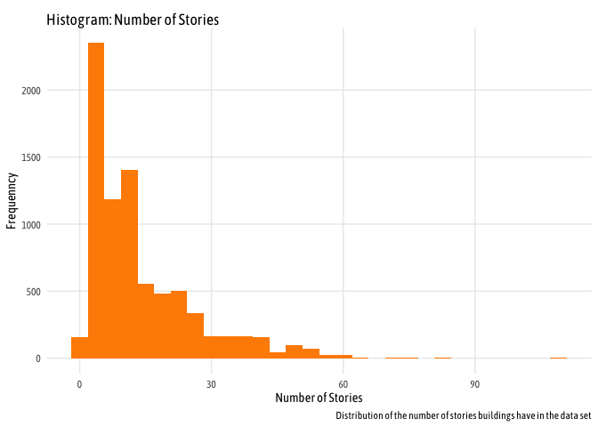

The graph shows that there are sever buildings in this data set with
more than 30 stories which is double the number of stories of the
proposed buildings. This can impose bias in our data set as different
sized buildings might have different trends in energy consumption or
other costs.

We also see that there is significant difference in age of buildings,
which is problematic because of the advances in technology in recent
years which old buildings may not have had access to.

The nice thing about the variance in the data set is that we slice the
data to focus on buildings in the data set similar to the proposed
constructions project. Taking into account the variables we know, we can
filter the data to match the specifications we have by only looking at
buildings with between 10 and 20 stories, between 200,000 and 300,000
square feet, and less than 10 years old. This gives us a better
comparison because it might remove some of the underlying confounding
variables that the “Exel guru” did not take into account and give us a
better understanding between the cost and benefit of building eco or
not.

Once we filter the data, we are left with 52 buildings to analyze.
Starting by looking at the distribution of rent between green buildings
and non-green buildings

    ## Picking joint bandwidth of 4.14

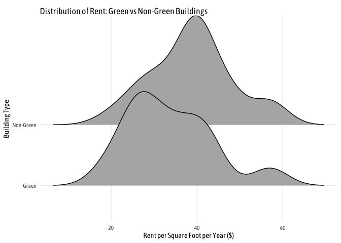

Here it actually looks like the Green buildings have higher revenue
streams than non-green buildings but this doesn’t take a building’s
cluster into account which is a better comparison.

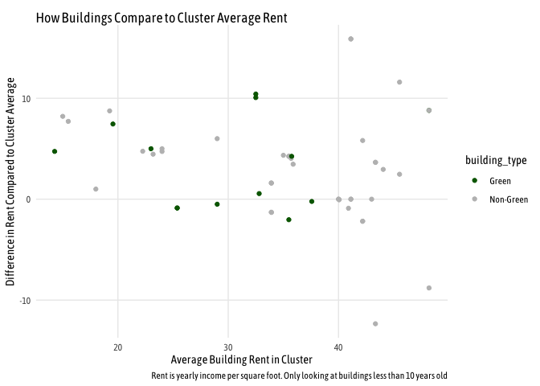

In this graph we see that while in most instances, green buildings have
higher revenue per square foot than buildings in the same cluster, there
are instances where the green buildings have rent prices lower than the
cluster average. This further discredits the “Excel Guru’s” initial
because it is not so cut and dry. To really answer this question more
data must be taken into account such as which specific cluster Austin
falls into so as there can be better informed decision making into the
actual going price for rent for green buildings compared to the average.
Plus then you can take into account the number of energy days needed and
compute the exact energy costs of the building to make a more accurate
decision.

Visual Story Telling Part 2: Flights at ABIA
--------------------------------------------

### Understanding Delays and Where they Come From

I’m always fascinated (maybe more so annoyed by) flight delays, and
whether pilots can actually “make up time in the air” as they claim.

    ## Warning: Removed 1601 rows containing missing values (geom_point).


Wow, looks like an overwhelming number of flights have some sort of
delay. But is this always because of time in the air? What about delays
on the ground? What happens when we take departure delays out of the
equation?

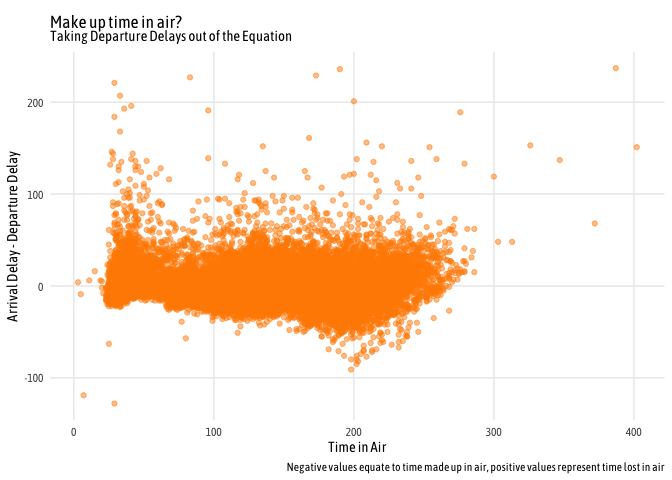

This plot doesn’t quite make sense, or at least there is more going on
here than we originally thought.  
So what’s going on there? Any relation to Taxi Out time?

    ## Warning: Removed 1419 rows containing missing values (geom_point).

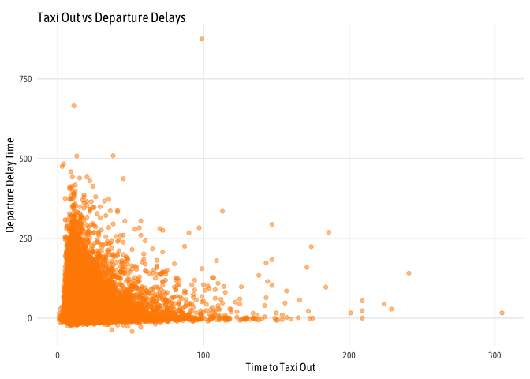

It looks like there isn’t the time needed to Taxi out doesn’t have an
impact on when a plane was set to depart. But does it have an effect on
Arrival Delay?

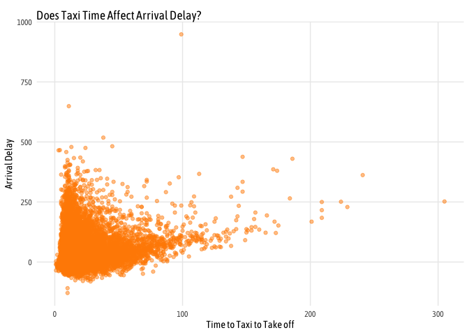 Now
we are getting somewhere, this relationship makes sense and may account
for some of the confounding variables we saw in the earlier plot.

What happens when we take both ends of taxi time into account?

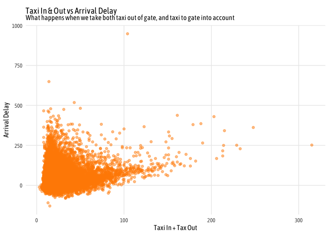

This still makes sense but if we add `Departure Delay` too?

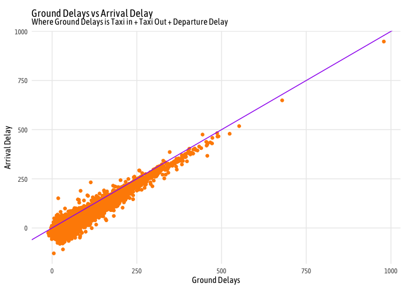 There
we go! That makes sense! When we add together all three togehter we see
a clear relationship with the total Arrival Delay. This plot also shows
how time can be made up in the air by looking at the deviation from the
purple line which is simply y = x. So now back to the original question,
can you make up more time in the air?

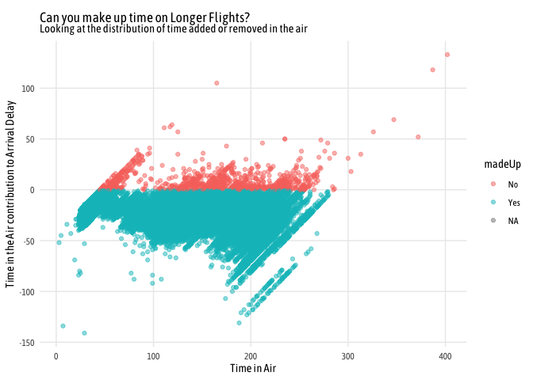 Here
is the answer to the question we were looking for. Pilots can in fact
make up some time in the air but it largely but it helps the longer the
flight is in the air.

Portfolio Modeling
------------------

In this project I decided I wanted to learn what NOT to do when it comes
to trading and see how making simple mistakes can cost you. For that I’m
picking three examples of possible poor trading strategies.

So for the first of the 3 portfolios, I wanted to learn what the return
would be if you stuck with a single company who puts togehter these
EFTs. The first porfolio all comes from Fidelity and 4 of their various
EFTs ranging from Technology to Real Estate. I wanted to see how wise it
is to spend it all within a single broker.

    ## 'getSymbols' currently uses auto.assign=TRUE by default, but will
    ## use auto.assign=FALSE in 0.5-0. You will still be able to use
    ## 'loadSymbols' to automatically load data. getOption("getSymbols.env")
    ## and getOption("getSymbols.auto.assign") will still be checked for
    ## alternate defaults.
    ## 
    ## This message is shown once per session and may be disabled by setting 
    ## options("getSymbols.warning4.0"=FALSE). See ?getSymbols for details.

    ## [1] "FTEC" "ONEQ" "FHLC" "FREL"

    ## [1] 101323.7

    ## [1] 5307.417

    ## [1] 1323.708

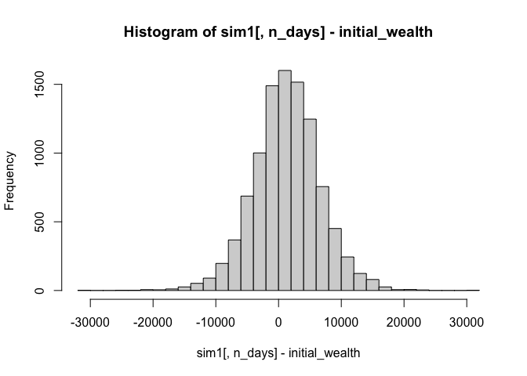

    ##         0%        25%        50%        75%       100% 
    ## -30240.303  -1912.398   1344.958   4607.035  30432.847

When choosing only Fidelity EFTs, our bootstrap sample of 10000
simulations showed that on average we expect the starting wealth to go
from `$100,000` to `$101,142.2` over the 20 day trading period with a
standard deviation of `$5,312.29`.

The next two portfolios I wanted to look at is to see what happens when
you bet on a certain industry to see the risks associated with that and
what happens. For the second portfolio I decided to pick 4 EFTs that all
are covering the Tech industry.

    ## 'getSymbols' currently uses auto.assign=TRUE by default, but will
    ## use auto.assign=FALSE in 0.5-0. You will still be able to use
    ## 'loadSymbols' to automatically load data. getOption("getSymbols.env")
    ## and getOption("getSymbols.auto.assign") will still be checked for
    ## alternate defaults.
    ## 
    ## This message is shown once per session and may be disabled by setting 
    ## options("getSymbols.warning4.0"=FALSE). See ?getSymbols for details.

    ## [1] "VGT"  "FTEC" "SMH"  "IYW"

    ## [1] 101960.8

    ## [1] 6373.272

    ## [1] 1960.764

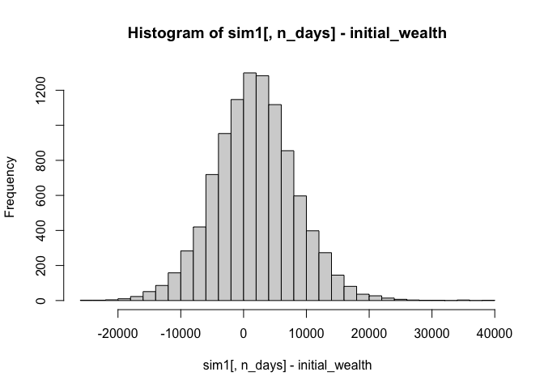

    ##         0%        25%        50%        75%       100% 
    ## -30422.021  -2156.037   1955.473   6020.569  29947.890

When choosing only Tech EFTs, our bootstrap sample of 10000 simulations
showed that on average we expect the starting wealth to go from
`$100,000` to `$101,195.2` over the 20 day trading period with a
standard deviation of `$6,364.85`. This portfolio had a very slightly
higher expected return than the first portfolio but there is higher risk
associated in the VaR with this porfolio.

    ## [1] "VNQ"  "SCHH" "ICF"  "FREL"

    ## [1] 100490.7

    ## [1] 6028.019

    ## [1] 490.741

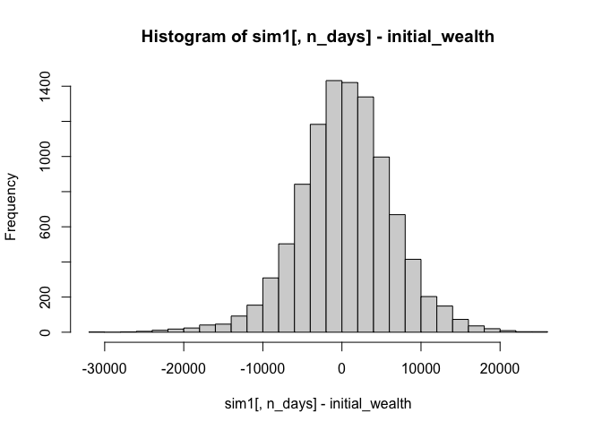

    ##          0%         25%         50%         75%        100% 
    ## -31773.7761  -3139.6171    526.3464   4246.3462  28034.8202

Market Segmentation
-------------------

Looking at the social marketing data and seeing the breakdown of
different post breakdowns, it seemed interesting to perform some
dimensionality reduction to force the grouping of categories together to
make different segments. In an attempt to filter out some of the bots
that tend to post the adult content, any user who scored in that
category was removed from the dataset. Next, to start to process of
dimensionality reduction, we looked at first generating 5 dimensions
from the original 36 which produced the output you see below.

    ## Importance of first k=5 (out of 36) components:
    ##                           PC1    PC2    PC3     PC4     PC5
    ## Standard deviation     5.2670 4.2494 3.9672 3.54027 3.43246
    ## Proportion of Variance 0.1942 0.1264 0.1102 0.08773 0.08247
    ## Cumulative Proportion  0.1942 0.3206 0.4308 0.51847 0.60094

This is slightly concerning because it only showed us a cumulative
proportion of roughly 60% of the data so we then tried to looking at
what happened when we used 6 variables of interest. Which gave us the
following output.

    ## Importance of first k=6 (out of 36) components:
    ##                           PC1    PC2    PC3     PC4     PC5     PC6
    ## Standard deviation     5.2670 4.2494 3.9672 3.54027 3.43246 3.20985
    ## Proportion of Variance 0.1942 0.1264 0.1102 0.08773 0.08247 0.07212
    ## Cumulative Proportion  0.1942 0.3206 0.4308 0.51847 0.60094 0.67306

We see the proportion of explanation go up by 7 points moving from 5
dimensions to 6 dimensions which is decent improvement but we were
curious to see what these groups look like and how they differ from each
other. The following plots where taken for each of our dimension (`PCX`)
and shows their top 5 descriptive categories, and bottom 5 descriptive
categories.
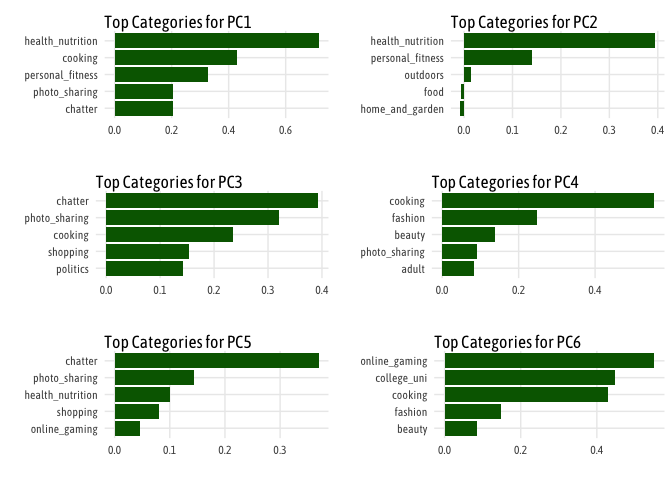
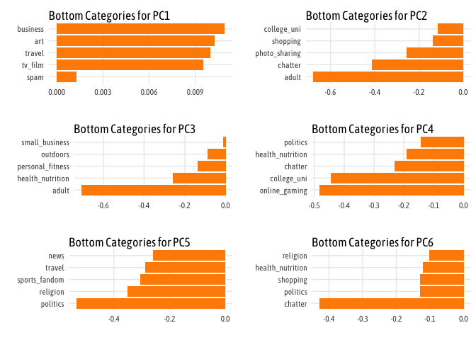
These plots show a few interesting things. Firstly, that there are a few
repeat categories that appear across multiple dimensions like cooking,
health and nutrition, and sports and outdoors. And this makes sense
because it is a nutrition company so those traits are likely shared
across all the followers.

Author Attribution
------------------

``` r
filelist = list.files(recursive = T, full.names = T, pattern = "*.txt")

df <- filelist %>% 
  set_names(.) %>% 
  map_df(readtext, .id="FileName")

df <- df %>% mutate(
  isTrain = ifelse(grepl("test", FileName,  fixed = F) , "Test", "Train")
)

text_train <- df %>% filter(isTrain == "Train")
text_test <- df %>% filter(isTrain == "Test")

tidy_train <- text_train %>% 
  unnest_tokens(word, text)
```
